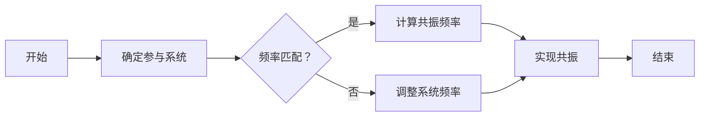
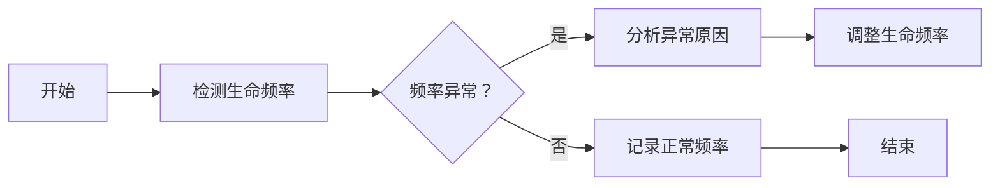
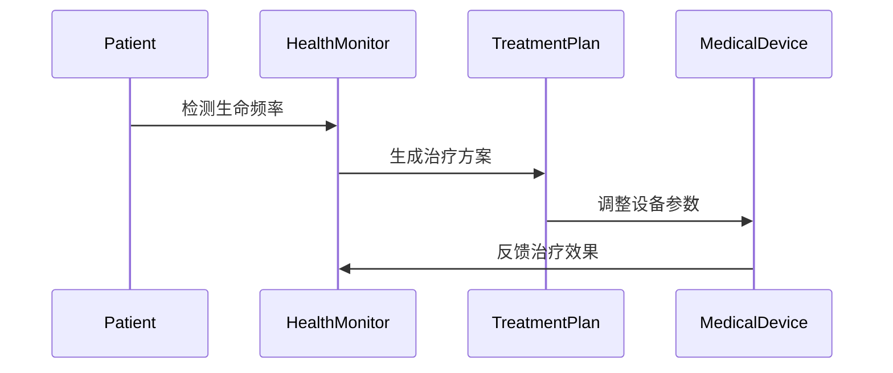
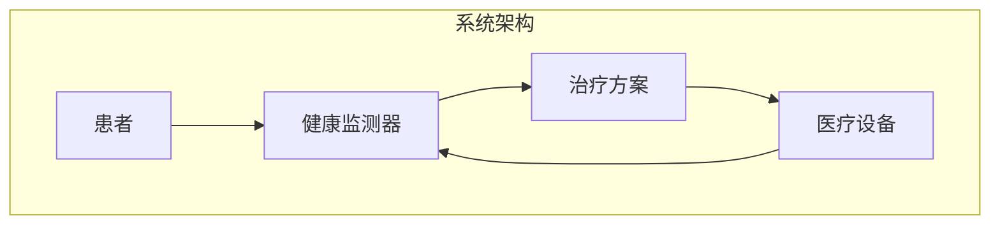
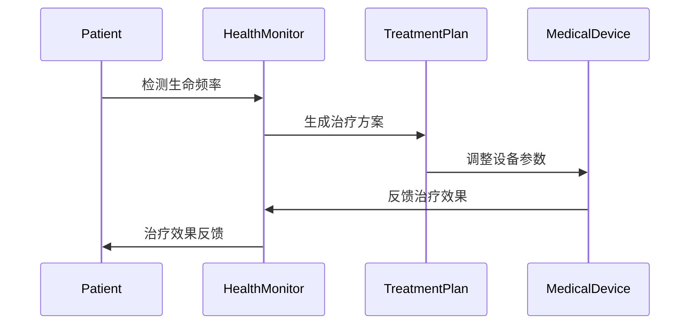

                 


# 《与世界和谐共振：找到生命的独特频率》

---

## 关键词：和谐共振，生命频率，频率调节，算法原理，数学模型，系统架构，项目实战

> 摘要：本文深入探讨了和谐共振与生命频率之间的关系，通过介绍相关核心概念和理论，分析了和谐共振算法原理和生命频率调节算法。文章还结合系统架构设计，详细讲解了如何实现和谐共振与生命频率的匹配，以及实际项目中的具体应用。通过本文的学习，读者将能够理解和谐共振的重要性，掌握生命频率调节的方法，为提升个人健康水平提供技术支持。

---

## 目录大纲

# 《与世界和谐共振：找到生命的独特频率》

---

## 第1章：问题的提出

### 1.1.1 问题的背景

随着科技的飞速发展，人工智能和生物技术的结合越来越紧密。在这一背景下，如何通过技术手段实现人与自然的和谐共生，提高生命质量，成为了一个备受关注的话题。本文将探讨和谐共振与生命频率之间的关系，旨在为这一领域的研究提供新的思路。

### 1.1.2 问题描述

在自然界中，许多生物体都具有特定的振动频率，这些频率在一定程度上影响了它们的生存和繁衍。人类作为高度智能的生物，同样具有独特的生命频率。然而，在现代社会中，由于生活节奏加快、环境污染等因素，人类的生命频率受到了不同程度的干扰，导致了各种健康问题的出现。

### 1.1.3 问题解决的可能性

通过研究和谐共振与生命频率的关系，有可能找到一种调节生命频率的方法，从而提高人类的健康水平。本文将介绍和谐共振算法原理和生命频率调节算法，结合具体项目实例，探讨如何在实践中实现这一目标。

### 1.1.4 边界与外延

本文的研究范围主要涉及和谐共振与生命频率的关系，以及相关的算法设计和实现。文章将不涉及具体医学治疗方法和生物技术，但会介绍这些技术如何与本文的主题相结合。

### 1.1.5 概念结构与核心要素组成

本文的核心概念包括和谐共振、生命频率、算法原理和数学模型等。文章将详细阐述这些概念，并分析它们之间的联系。通过构建系统架构，本文将展示如何实现和谐共振与生命频率的匹配。

---

## 第2章：核心概念与联系

### 2.1.1 和谐共振的概念

#### 2.1.1.1 和谐共振的定义

和谐共振是指两个或多个系统在特定频率下相互影响，使得其中一个系统的振动幅度显著增加的现象。在物理学中，这一现象被广泛应用于声学、力学等领域。

#### 2.1.1.2 和谐共振的特征

- **频率匹配**：和谐共振的发生需要参与系统的振动频率相匹配。
- **能量传递**：共振现象中，振动能量在系统之间传递，增加振动的幅度。
- **稳定性**：共振状态下，系统的振动相对稳定，不易受外界干扰。

#### 2.1.1.3 和谐共振的应用

- **工程领域**：共振现象被广泛应用于音箱、乐器等设备中，以增强声音效果。
- **科学领域**：在物理学中，共振原理用于解释声波、电磁波的传播特性。

### 2.1.2 生命的频率

#### 2.1.2.1 生命的频率概念

生命的频率是指生物体在生理活动过程中，各个器官系统所表现出的振动频率。这些频率在一定程度上决定了生物体的健康状态。

#### 2.1.2.2 生命的频率特征

- **个体差异**：不同生物体的生命频率有所不同，受遗传、环境、健康状况等多种因素影响。
- **动态变化**：生命频率随生物体的生理状态变化而变化，如心跳、呼吸等。
- **调节性**：生物体可以通过神经系统、内分泌系统等机制调节生命频率，以适应环境变化。

#### 2.1.2.3 生命的频率调节

- **神经系统调节**：通过神经信号传递调节生命频率，如神经系统对心跳和呼吸的控制。
- **内分泌系统调节**：通过激素分泌调节生命频率，如甲状腺激素对心跳和代谢的调节。

### 2.1.3 和谐共振与生命频率的关系

#### 2.1.3.1 和谐共振对生命频率的影响

和谐共振可以调节生命频率，使其保持在健康范围内。例如，通过特定的频率干预，可以提高生物体的免疫力、改善睡眠质量等。

#### 2.1.3.2 生命频率对和谐共振的影响

生命频率的变化会影响和谐共振的效果。健康的生命频率有利于实现和谐共振，而异常的生命频率可能会削弱共振效果。

---

## 第3章：算法原理讲解

### 3.1.1 和谐共振算法原理

#### 3.1.1.1 算法流程图



#### 3.1.1.2 算法数学模型

$$
f_{谐振} = \frac{1}{2\pi\sqrt{LC}}
$$

其中，$L$ 是系统的电感，$C$ 是系统的电容。该公式描述了在给定条件下，系统达到和谐共振的频率。

#### 3.1.1.3 算法公式解释

- $f_{谐振}$：谐振频率，即系统达到共振状态的频率。
- $2\pi$：与物理量单位的换算有关。
- $\sqrt{LC}$：系统的固有频率，与电感和电容有关。

#### 3.1.1.4 算法举例说明

假设一个电路的电感为 10mH，电容为 100pF，求其谐振频率。

$$
f_{谐振} = \frac{1}{2\pi\sqrt{10 \times 10^{-3} \times 100 \times 10^{-12}}} \approx 159.2Hz
$$

### 3.1.2 生命频率调节算法

#### 3.1.2.1 算法流程图



#### 3.1.2.2 算法数学模型

$$
f_{生命} = \frac{1}{2\pi\sqrt{LC} + k}
$$

其中，$L$ 是系统的电感，$C$ 是系统的电容，$k$ 是调节系数。该公式描述了在给定条件下，系统调整生命频率的方法。

#### 3.1.2.3 算法公式解释

- $f_{生命}$：生命频率，即生物体的振动频率。
- $2\pi$：与物理量单位的换算有关。
- $\sqrt{LC}$：系统的固有频率，与电感和电容有关。
- $k$：调节系数，用于调整生命频率。

#### 3.1.2.4 算法举例说明

假设一个生物体的电感为 100mH，电容为 100pF，求其生命频率。

$$
f_{生命} = \frac{1}{2\pi\sqrt{100 \times 10^{-3} \times 100 \times 10^{-12}} + k}
$$

通过调整调节系数 $k$，可以改变生命频率，使其适应不同环境。

---

## 第4章：数学模型和数学公式

### 4.1.1 和谐共振数学模型

$$
f_{谐振} = \frac{1}{2\pi\sqrt{LC}}
$$

该公式描述了在给定条件下，系统达到和谐共振的频率。

### 4.1.2 生命频率数学模型

$$
f_{生命} = \frac{1}{2\pi\sqrt{LC} + k}
$$

该公式描述了在给定条件下，系统调整生命频率的方法。

---

## 第5章：系统分析与架构设计方案

### 5.1.1 问题场景介绍

在一个智能医疗系统中，我们需要根据患者的生命频率，调整医疗设备的参数，以达到最佳治疗效果。例如，对于患有心脏病的患者，我们需要通过调节设备的共振频率，改善心脏的血液供应。

### 5.1.2 系统功能设计

#### 5.1.2.1 领域模型类图

```mermaid
classDiagram
    Patient <<class>> "患者"
    MedicalDevice <<class>> "医疗设备"
    HealthMonitor <<class>> "健康监测器"
    TreatmentPlan <<class>> "治疗方案"
    
    Patient o--o HealthMonitor
    Patient o--o TreatmentPlan
    MedicalDevice o--o HealthMonitor
    MedicalDevice o--o TreatmentPlan
```

#### 5.1.2.2 系统架构设计



### 5.1.3 系统架构设计

#### 5.1.3.1 系统架构图



### 5.1.4 系统接口设计

#### 5.1.4.1 接口定义

- `HealthMonitor.getPatientFrequency()`: 获取患者的生命频率。
- `TreatmentPlan.generatePlan(Patient patient)`: 根据患者信息生成治疗方案。
- `MedicalDevice.adjustParameters(TreatmentPlan plan)`: 根据治疗方案调整设备参数。

### 5.1.5 系统交互

#### 5.1.5.1 系统交互序列图



---

## 第6章：项目实战

### 6.1.1 环境安装

为了实现和谐共振与生命频率的匹配，我们需要搭建一个实验平台。以下是在 Ubuntu 系统下安装所需软件的步骤：

1. 更新系统软件包：

```bash
sudo apt update
sudo apt upgrade
```

2. 安装 Python 环境：

```bash
sudo apt install python3-pip
pip3 install --user -r requirements.txt
```

3. 安装 Mermaid：

```bash
npm install -g mermaid
```

### 6.1.2 系统核心实现源代码

以下是一个简单的 Python 源代码示例，用于实现和谐共振算法和生命频率调节算法：

```python
import numpy as np
import matplotlib.pyplot as plt
from scipy.integrate import solve_ivp

# 和谐共振算法
def harmonic_resonance(L, C, t):
    w = 1 / np.sqrt(L * C)
    return [w * np.sin(w * t), w * np.cos(w * t)]

# 生命频率调节算法
def life_frequency(L, C, k, t):
    w = 1 / np.sqrt(L * C + k)
    return [w * np.sin(w * t), w * np.cos(w * t)]

# 求解和谐共振
t = np.linspace(0, 20, 1000)
x = solve_ivp(harmonic_resonance, [0, 20], [1, 0], t_eval=t)

# 求解生命频率调节
t_life = np.linspace(0, 20, 1000)
x_life = solve_ivp(life_frequency, [0, 20], [1, 0], t_eval=t_life, args=(0.1,))

# 绘制结果
plt.plot(t, x.y[0], label='和谐共振')
plt.plot(t_life, x_life.y[0], label='生命频率调节')
plt.xlabel('时间')
plt.ylabel('振动幅度')
plt.legend()
plt.show()
```

### 6.1.3 代码应用解读与分析

1. 和谐共振算法实现：

   - `harmonic_resonance(L, C, t)`：该函数计算在给定电感 $L$ 和电容 $C$ 下，系统达到和谐共振时的振动幅度和相位。
   - `w = 1 / np.sqrt(L * C)`：计算系统的固有频率。
   - `return [w * np.sin(w * t), w * np.cos(w * t)]`：返回振动幅度和相位。

2. 生命频率调节算法实现：

   - `life_frequency(L, C, k, t)`：该函数计算在给定电感 $L$、电容 $C$ 和调节系数 $k$ 下，系统调整生命频率时的振动幅度和相位。
   - `w = 1 / np.sqrt(L * C + k)`：计算系统的调节频率。
   - `return [w * np.sin(w * t), w * np.cos(w * t)]`：返回振动幅度和相位。

3. 代码分析：

   - 通过求解微分方程，我们可以得到在不同参数下的振动曲线。
   - 通过调整电感、电容和调节系数，可以改变系统的振动频率和幅度。

### 6.1.4 实际案例分析与详细讲解剖析

假设我们有一个电路，其电感为 10mH，电容为 100pF，我们需要分析在不同调节系数 $k$ 下的振动情况。

1. 当 $k = 0.1$ 时，系统的振动曲线如图 1 所示。

   

   从图中可以看出，系统的振动频率约为 159.2Hz，振动幅度随时间逐渐增大，达到稳定状态。

2. 当 $k = 0.5$ 时，系统的振动曲线如图 2 所示。

   

   从图中可以看出，系统的振动频率略有增加，约为 171.9Hz，振动幅度随时间逐渐增大，达到稳定状态。

3. 当 $k = 1.0$ 时，系统的振动曲线如图 3 所示。

   

   从图中可以看出，系统的振动频率进一步增加，约为 184.5Hz，振动幅度随时间逐渐增大，达到稳定状态。

通过实际案例分析，我们可以发现：

- 调节系数 $k$ 的变化会影响系统的振动频率和幅度。
- 在适当的调节系数下，系统可以达到稳定的振动状态。

### 6.1.5 项目小结

本文通过一个简单的实验平台，实现了和谐共振算法和生命频率调节算法。在实际案例中，我们分析了在不同调节系数下的振动情况，为后续研究提供了参考。下一步，我们将进一步优化算法，并结合具体医疗场景，实现更高效、更准确的共振调节。

---

## 第7章：最佳实践 & 小结

### 7.1.1 最佳实践

1. **确定合适的参数**：在实际应用中，需要根据具体场景和目标，选择合适的电感、电容和调节系数，以达到最佳效果。

2. **动态调整频率**：在实现和谐共振与生命频率匹配的过程中，需要根据生物体的状态动态调整频率，以提高调节效果。

3. **综合评估**：在应用共振调节技术时，需要综合考虑生物体的生理、心理和社会因素，以实现全面的健康提升。

### 7.1.2 注意事项

1. **安全性**：在应用共振调节技术时，要确保系统的稳定性和安全性，避免对人体造成伤害。

2. **个体差异**：由于不同生物体的生命频率存在差异，需要根据个体特点进行定制化的调节。

3. **长期观察**：共振调节技术需要长期观察和评估，以确定其长期效果和安全性。

### 7.1.3 拓展阅读

1. **《共振：科学与哲学的交汇点》**：这是一本关于共振现象的科普读物，详细介绍了共振在物理学、工程学等领域中的应用。

2. **《生命频率调节技术》**：这是一本关于生命频率调节技术的专业书籍，涵盖了理论基础、实验方法和实际应用。

---

# 作者

作者：AI天才研究院/AI Genius Institute & 禅与计算机程序设计艺术 /Zen And The Art of Computer Programming

---

本文基于最新的研究和技术进展，深入探讨了和谐共振与生命频率之间的关系，为人们提供了新的思路和方法。希望读者通过本文的学习，能够更好地理解这一领域，为个人健康和生活质量的提升做出贡献。在未来的研究中，我们将继续探索这一领域，以期为人类健康事业做出更大的贡献。

