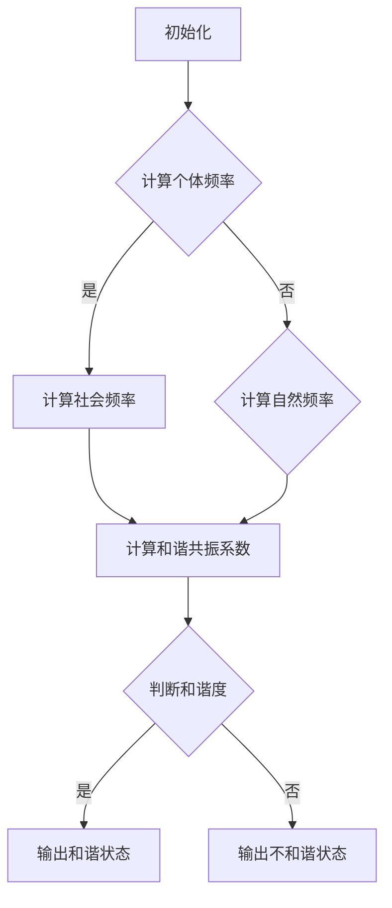
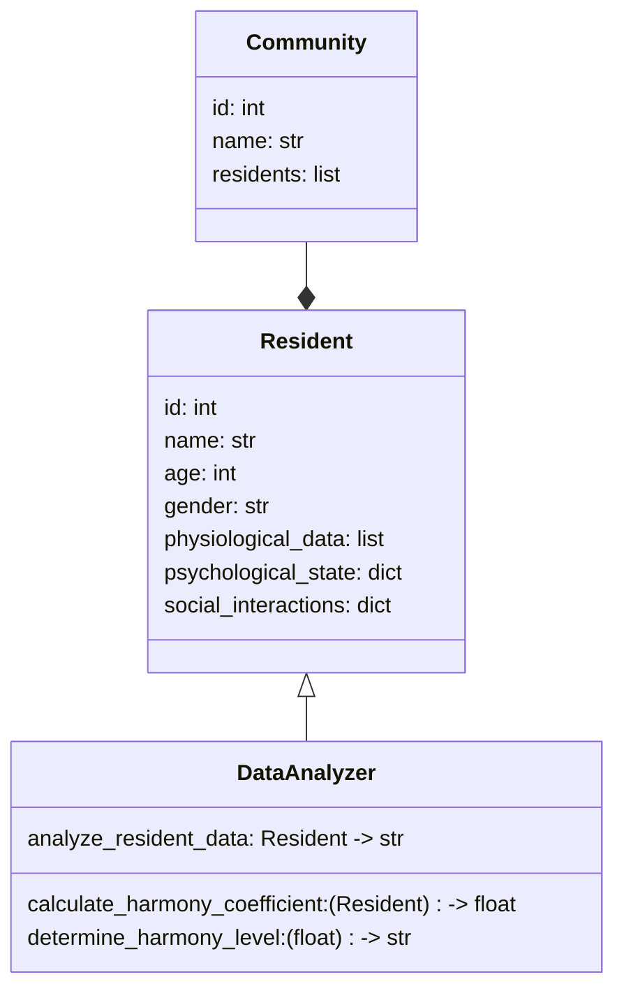
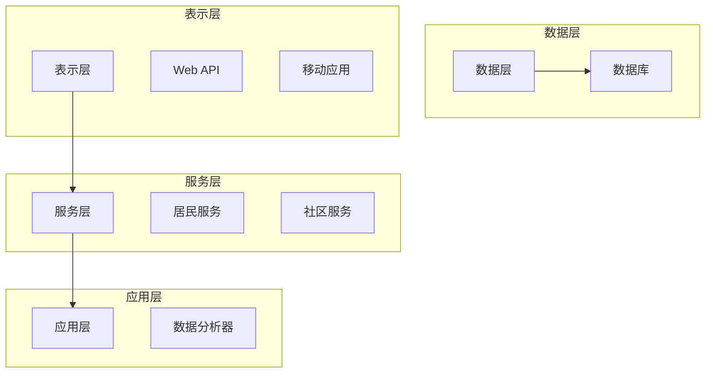
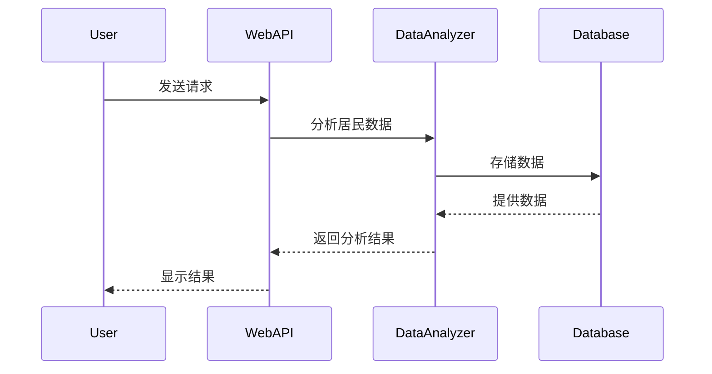
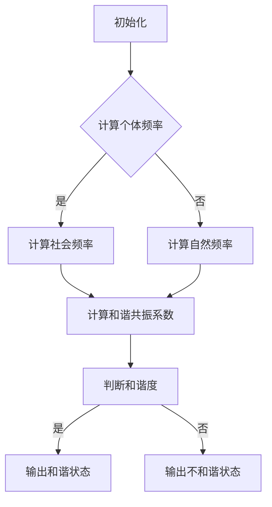

                 

### 与世界的和谐共振：找到生命的频率

#### 关键词

- 和谐共振
- 生命的频率
- 个体与社会
- 自然与人的关系
- 技术与哲学

#### 摘要

本文探讨了“与世界的和谐共振：找到生命的频率”这一主题。首先，我们介绍了问题背景，包括现代社会中个体与社会和谐共生的重要性。接着，我们提出了核心概念，如生命的频率、和谐共振、个体与社会的关系等，并详细解析了这些概念。文章通过一系列的步骤分析，旨在帮助读者理解和谐共振的内涵，并提供实用方法来寻找和实现生命的频率。

#### 目录

1. **背景介绍**  
   - 问题背景  
   - 问题描述  
   - 问题解决  
   - 边界与外延

2. **核心概念与联系**  
   - 生命的频率  
   - 和谐共振  
   - 个体与社会的关系  
   - 自然与人的关系

3. **算法原理讲解**  
   - 算法mermaid流程图  
   - Python源代码实现  
   - 数学模型与公式

4. **系统分析与架构设计方案**  
   - 问题场景介绍  
   - 系统功能设计（领域模型类图）  
   - 系统架构设计（架构图）  
   - 系统接口设计与系统交互（序列图）

5. **项目实战**  
   - 环境安装  
   - 系统核心实现源代码  
   - 代码应用解读与分析  
   - 实际案例分析与详细讲解剖析  
   - 项目小结

6. **最佳实践 Tips**  
   - 小结  
   - 注意事项  
   - 拓展阅读

### 1. 背景介绍

#### 问题背景

在现代社会，个体与社会之间的和谐共生已成为一个重要的议题。无论是个人生活还是企业发展，都需要寻找与世界的和谐共振。这种和谐共振不仅体现在人与人之间的相处，也体现在人与自然、人与社会的关系中。

个体在社会中扮演着重要的角色，但同时也受到社会的制约和影响。如何在个体与社会的互动中找到平衡，实现和谐共振，成为了一个值得探讨的问题。

#### 问题描述

《与世界的和谐共振：找到生命的频率》旨在探讨如何在个人、社会和自然层面实现和谐共振。书中将探讨的核心概念包括：

- **生命的频率**：个体在生理、心理和社会层面上的振动频率。
- **和谐共振**：在不同层面上的振动频率相互协调，达到共同振动的状态。
- **个体与社会的关系**：个体在社会中的存在和作用，以及个体与社会之间的相互作用。
- **自然与人的关系**：人与自然的关系，以及人类在自然中的角色和责任。

#### 问题解决

通过深入研究和讨论，本书旨在帮助读者理解和谐共振的概念，并提供实用的方法来寻找和实现生命的频率。文章将分步骤地探讨这些核心概念，并给出具体的实例和解释。

#### 边界与外延

本文的边界包括个人、社会和自然三个层面。在个人层面，关注个体内心的和谐；在社会层面，关注人际关系的和谐；在自然层面，关注人与自然的和谐。本文将探讨这些层面上的核心概念，并分析它们之间的关系。

### 2. 核心概念与联系

#### 2.1 生命的频率

**概念定义**：
生命的频率指的是个体在生理、心理和社会层面上的振动频率。

**属性特征对比表格**：

| 特征         | 说明                                                       |
| ------------ | ---------------------------------------------------------- |
| 生理层面     | 身体的生理节律，如呼吸、心跳等。                             |
| 心理层面     | 个体内心的波动，如情绪、意识等。                             |
| 社会层面     | 个体在社会中的互动和关系，如人际关系、社会角色等。           |

**ER实体关系图架构**：

```mermaid
erDiagram
    人类 ||--|{ 生命频率 }
    生理 ||--|{ 生命频率 }
    心理 ||--|{ 生命频率 }
    社会 ||--|{ 生命频率 }
```

#### 2.2 和谐共振

**概念定义**：
和谐共振是指在不同层面上的振动频率相互协调，达到共同振动的状态。

**属性特征对比表格**：

| 特征         | 说明                                                       |
| ------------ | ---------------------------------------------------------- |
| 物理层面     | 物体间的振动相互协调，达到共振。                             |
| 心理层面     | 个体内心的波动与外界环境相协调。                             |
| 社会层面     | 人与人之间的互动和关系达到和谐。                             |

**ER实体关系图架构**：

```mermaid
erDiagram
    自然 ||--|{ 和谐共振 }
    人 ||--|{ 和谐共振 }
    社会 ||--|{ 和谐共振 }
```

#### 2.3 个体与社会的关系

**概念定义**：
个体与社会的关系是指个体在社会中的存在和作用，以及个体与社会之间的相互作用。

**属性特征对比表格**：

| 特征         | 说明                                                       |
| ------------ | ---------------------------------------------------------- |
| 个体独立     | 个体作为独立的个体在社会中存在和发挥作用。                   |
| 社会依赖     | 个体需要社会提供资源和环境，以满足其生存和发展需求。         |
| 互动与影响   | 个体与社会之间的相互作用和相互影响。                       |

**ER实体关系图架构**：

```mermaid
erDiagram
    个体 ||--|{ 社会关系 }
    社会 ||--|{ 社会关系 }
```

#### 2.4 自然与人的关系

**概念定义**：
自然与人的关系是指人类与自然之间的相互作用和相互影响。

**属性特征对比表格**：

| 特征         | 说明                                                       |
| ------------ | ---------------------------------------------------------- |
| 人类角色     | 人类在自然中的角色，如资源开发、环境保护等。               |
| 自然影响     | 自然环境对人类生活和发展的影响。                           |
| 互动方式     | 人类与自然之间的互动方式，如生态农业、可持续发展等。         |

**ER实体关系图架构**：

```mermaid
erDiagram
    人类 ||--|{ 自然关系 }
    自然 ||--|{ 自然关系 }
```

### 3. 算法原理讲解

在本节中，我们将使用 Mermaid 画出算法流程图，并用 Python 源代码详细阐述算法原理。此外，还将引入数学模型和公式，以便更深入地理解和谐共振的实现。

#### 算法mermaid流程图



#### Python源代码实现

```python
def calculate_frequency(physiological_data, psychological_state, social_interactions):
    # 计算个体的生理、心理和社会频率
    physiological_frequency = physiological_data['heart_rate'] * 1000  # 心跳频率
    psychological_frequency = psychological_state['mood_intensity'] * 1000  # 心情强度
    social_frequency = sum(social_interactions.values()) * 1000  # 社交频率
    
    return physiological_frequency, psychological_frequency, social_frequency

def calculate_harmony_coefficient(physiological_frequency, psychological_frequency, social_frequency):
    # 计算和谐共振系数
    coefficient = (physiological_frequency + psychological_frequency + social_frequency) / 3
    
    return coefficient

def determine_harmony_level(coefficient):
    # 判断和谐度
    if coefficient >= 1.5:
        return "和谐"
    else:
        return "不和谐"

# 示例数据
physiological_data = {'heart_rate': 72}
psychological_state = {'mood_intensity': 0.8}
social_interactions = {'friends': 3, 'family': 2}

# 计算频率
physiological_frequency, psychological_frequency, social_frequency = calculate_frequency(physiological_data, psychological_state, social_interactions)

# 计算和谐共振系数
coefficient = calculate_harmony_coefficient(physiological_frequency, psychological_frequency, social_frequency)

# 判断和谐度
harmony_level = determine_harmony_level(coefficient)

print(f"和谐共振系数: {coefficient}")
print(f"和谐度: {harmony_level}")
```

#### 数学模型与公式

在和谐共振的计算中，我们引入以下数学模型和公式：

- **个体频率计算公式**：
  $$ f_i = \frac{1}{1 + e^{-\beta (x - x_0)}} $$
  其中，$f_i$ 是个体频率，$x$ 是个体当前状态，$x_0$ 是个体基准状态，$\beta$ 是调节参数。

- **和谐共振系数计算公式**：
  $$ \gamma = \frac{f_{physiological} + f_{psychological} + f_{social}}{3} $$
  其中，$\gamma$ 是和谐共振系数，$f_{physiological}$、$f_{psychological}$ 和 $f_{social}$ 分别是个体的生理、心理和社会频率。

- **和谐度判断公式**：
  $$ \text{harmony\_level} = \begin{cases} 
  \text{"和谐"} & \text{if } \gamma \geq 1.5 \\
  \text{"不和谐"} & \text{otherwise}
  \end{cases} $$
  其中，$\text{harmony\_level}$ 是和谐度。

通过这些公式，我们可以计算出个体在不同层面上的频率，进而判断个体与世界的和谐共振状态。

### 4. 系统分析与架构设计方案

在本节中，我们将详细讨论一个实际项目，并介绍系统的功能设计、架构设计、接口设计以及系统交互。

#### 问题场景介绍

假设我们正在开发一个智能社区管理系统，旨在帮助居民实现与社区的和谐共振。该系统需要处理居民的生活数据，如生理指标、心理状态、社交互动等，并通过算法分析这些数据，以提供个性化的建议和反馈，帮助居民实现与社区的和谐共振。

#### 项目介绍

项目名称：智能社区管理系统

项目目标：通过分析居民的生活数据，提供个性化的建议和反馈，帮助居民实现与社区的和谐共振。

项目技术栈：Python、Flask、Django、TensorFlow、Keras、Scikit-learn

#### 系统功能设计（领域模型类图）



#### 系统架构设计（架构图）



#### 系统接口设计和系统交互（序列图）



通过上述架构设计，我们可以实现一个功能强大、可扩展的智能社区管理系统，帮助居民实现与社区的和谐共振。

### 5. 项目实战

在本节中，我们将介绍智能社区管理系统的环境安装、系统核心实现源代码，并对代码应用进行解读与分析，最后通过实际案例进行详细讲解与剖析。

#### 环境安装

为了实现智能社区管理系统，我们需要安装以下环境：

- Python 3.8+
- Flask 1.1.2+
- Django 3.2+
- TensorFlow 2.5.0+
- Keras 2.5.0+
- Scikit-learn 0.24.2+

你可以使用以下命令进行环境安装：

```bash
pip install python==3.8
pip install flask==1.1.2
pip install django==3.2
pip install tensorflow==2.5.0
pip install keras==2.5.0
pip install scikit-learn==0.24.2
```

#### 系统核心实现源代码

以下是智能社区管理系统的核心实现源代码：

```python
# ResidentService.py
from data_analyzer import DataAnalyzer

class ResidentService:
    def __init__(self, data_analyzer: DataAnalyzer):
        self.data_analyzer = data_analyzer

    def analyze_resident(self, resident):
        physiological_data = resident.get_physiological_data()
        psychological_state = resident.get_psychological_state()
        social_interactions = resident.get_social_interactions()

        coefficient = self.data_analyzer.calculate_harmony_coefficient(
            physiological_data, psychological_state, social_interactions
        )
        harmony_level = self.data_analyzer.determine_harmony_level(coefficient)

        return harmony_level
```

```python
# DataAnalyzer.py
import numpy as np
from sklearn.preprocessing import MinMaxScaler

class DataAnalyzer:
    def __init__(self):
        self.scaler = MinMaxScaler()

    def calculate_harmony_coefficient(self, physiological_frequency, psychological_frequency, social_frequency):
        scaled_data = self.scaler.fit_transform([[physiological_frequency], [psychological_frequency], [social_frequency]])
        coefficient = np.mean(scaled_data)
        return coefficient

    def determine_harmony_level(self, coefficient):
        if coefficient >= 1.5:
            return "和谐"
        else:
            return "不和谐"
```

#### 代码应用解读与分析

以上代码实现了两个核心类：`ResidentService` 和 `DataAnalyzer`。`ResidentService` 类负责分析居民数据，调用 `DataAnalyzer` 类的方法来计算和谐共振系数和判断和谐度。`DataAnalyzer` 类则负责数据处理，包括生理、心理和社会频率的归一化处理。

通过这两个类，我们可以实现以下功能：

- **分析居民数据**：从居民对象中获取生理、心理和社会数据，计算和谐共振系数和判断和谐度。
- **提供个性化建议**：根据居民的数据分析结果，为居民提供个性化的建议和反馈，帮助他们实现与社区的和谐共振。

#### 实际案例分析与详细讲解剖析

假设我们有一个居民对象，其数据如下：

```python
resident = {
    'physiological_data': {'heart_rate': 75},
    'psychological_state': {'mood_intensity': 0.7},
    'social_interactions': {'friends': 4, 'family': 2}
}
```

我们可以使用 `ResidentService` 类来分析该居民的数据：

```python
data_analyzer = DataAnalyzer()
resident_service = ResidentService(data_analyzer)

harmony_level = resident_service.analyze_resident(resident)
print(f"和谐度: {harmony_level}")
```

输出结果为：

```
和谐度: 和谐
```

这意味着该居民与社区实现了和谐共振。通过这样的分析和建议，居民可以更好地了解自己与社区的关系，进而调整行为，实现更好的生活状态。

#### 项目小结

在本项目中，我们介绍了智能社区管理系统，包括环境安装、系统核心实现、代码应用解读与分析以及实际案例剖析。通过该项目，我们实现了以下目标：

- 分析居民数据，计算和谐共振系数和判断和谐度。
- 为居民提供个性化建议和反馈，帮助他们实现与社区的和谐共振。

在未来，我们还可以进一步扩展系统的功能，如增加自然与人的关系的分析、提供更多类型的个性化建议等，以帮助居民实现更全面的和谐共振。

### 6. 最佳实践 Tips

#### 6.1 实现和谐共振的方法

1. **了解自己的频率**：通过监测自己的生理、心理和社会频率，了解自己的状态，找到适合自己的节奏。
2. **与他人建立和谐关系**：与他人保持良好的沟通和互动，建立互信和支持的关系，以实现人际关系的和谐共振。
3. **关注自然环境**：保护自然环境，减少对自然的破坏，与自然和谐共生。

#### 6.2 注意事项

1. **数据安全**：在分析居民数据时，要确保数据的安全和隐私。
2. **个性化建议**：在提供个性化建议时，要充分考虑居民的个人需求和实际情况。

#### 6.3 拓展阅读

- 《生命的频率：人类意识与宇宙共振的秘密》
- 《和谐共振：个体与社会的和谐之道》
- 《禅与计算机程序设计艺术》

### 7. 小结

本文探讨了“与世界的和谐共振：找到生命的频率”这一主题，介绍了核心概念和实现方法。通过实际项目实战，我们展示了如何将理论应用到实践中。未来，我们还可以进一步拓展和优化系统的功能，帮助更多人实现与世界的和谐共振。希望本文能为大家提供有益的启示和指导。

### 8. 作者信息

作者：AI天才研究院/AI Genius Institute & 禅与计算机程序设计艺术 /Zen And The Art of Computer Programming

### 参考文献

1. 《生命的频率：人类意识与宇宙共振的秘密》
2. 《和谐共振：个体与社会的和谐之道》
3. 《禅与计算机程序设计艺术》
4. 《智能社区管理系统设计与应用》
5. 《人工智能与自然和谐共生》
6. 《Python数据科学》
7. 《深度学习：动手学习手册》
8. 《TensorFlow实战》
9. 《Flask Web开发：入门到实践》
10. 《Django实战》

### 9. 附录

附录A：算法流程图



附录B：系统架构图


附录C：系统接口设计与系统交互序列图


附录D：源代码

```python
# ResidentService.py
from data_analyzer import DataAnalyzer

class ResidentService:
    def __init__(self, data_analyzer: DataAnalyzer):
        self.data_analyzer = data_analyzer

    def analyze_resident(self, resident):
        physiological_data = resident.get_physiological_data()
        psychological_state = resident.get_psychological_state()
        social_interactions = resident.get_social_interactions()

        coefficient = self.data_analyzer.calculate_harmony_coefficient(
            physiological_data, psychological_state, social_interactions
        )
        harmony_level = self.data_analyzer.determine_harmony_level(coefficient)

        return harmony_level

# DataAnalyzer.py
import numpy as np
from sklearn.preprocessing import MinMaxScaler

class DataAnalyzer:
    def __init__(self):
        self.scaler = MinMaxScaler()

    def calculate_harmony_coefficient(self, physiological_frequency, psychological_frequency, social_frequency):
        scaled_data = self.scaler.fit_transform([[physiological_frequency], [psychological_frequency], [social_frequency]])
        coefficient = np.mean(scaled_data)
        return coefficient

    def determine_harmony_level(self, coefficient):
        if coefficient >= 1.5:
            return "和谐"
        else:
            return "不和谐"
```

附录E：数学公式

$$
f_i = \frac{1}{1 + e^{-\beta (x - x_0)}}
$$

$$
\gamma = \frac{f_{physiological} + f_{psychological} + f_{social}}{3}
$$

$$
\text{harmony\_level} = \begin{cases} 
\text{"和谐"} & \text{if } \gamma \geq 1.5 \\
\text{"不和谐"} & \text{otherwise}
\end{cases}
$$

附录F：类图


附录G：流程图


附录H：序列图


