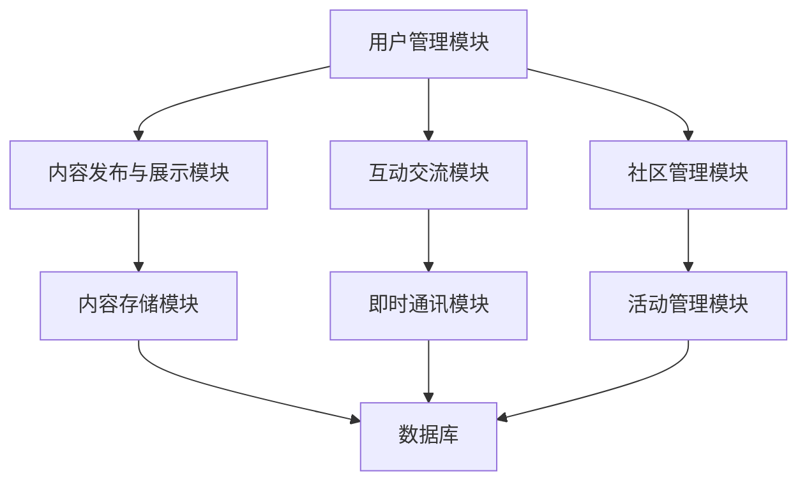
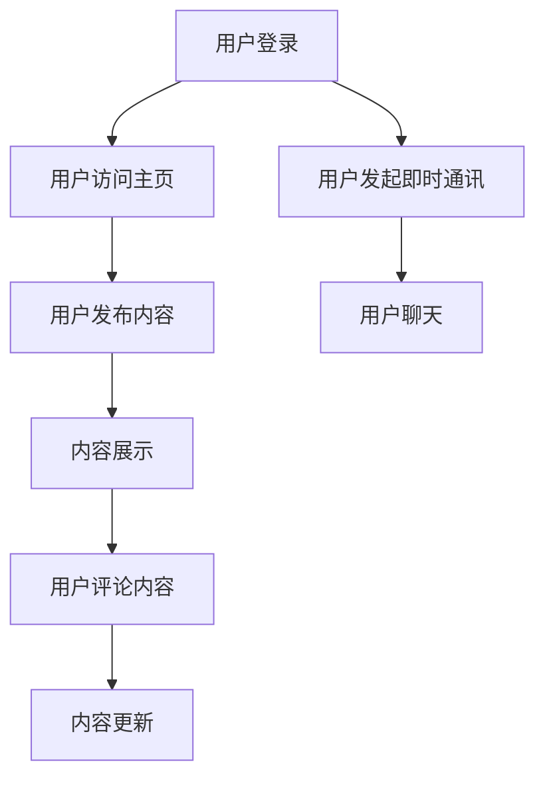

                 

### 背景介绍

**关键词**：东西方思想、文化交流、融合、平衡

**摘要**：
本文旨在探讨东西方思想的融合及其在文化交流中的重要性。随着全球化的推进，不同文化之间的交流日益频繁，如何在文化交流中实现平衡成为一个亟待解决的问题。本文首先介绍东西方思想的历史渊源、特点及核心概念，然后分析文化交流的现状与挑战，最后提出寻求文化平衡的策略，并通过实际案例进行验证。

**问题背景**：
在全球化的背景下，东西方文化的交流日益频繁。然而，这种交流并非总是一帆风顺，常常面临诸多挑战。东西方思想在价值观、世界观等方面存在显著差异，如何在不同文化之间找到平衡点，实现文化的和谐共处，成为了一个重要议题。

**问题描述**：
本文将探讨以下问题：
1. 东西方思想的核心特点及其在文化交流中的意义。
2. 文化交流中面临的挑战及应对策略。
3. 在文化交流中如何实现东西方思想的融合与平衡。

**问题解决**：
本文将从以下几个方面展开讨论：
1. 东西方思想的历史与特点。
2. 文化交流的现状与挑战。
3. 寻求文化平衡的策略。
4. 实际案例与项目实战。
5. 最佳实践与拓展阅读。

**边界与外延**：
本文主要关注东西方思想在文化交流中的应用，不涉及其他文化的研究。同时，本文将侧重于理论探讨，而非具体的文化实践。

**概念结构与核心要素组成**：
本文的核心概念包括东西方思想、文化交流、融合、平衡等。这些概念相互作用，共同构成了本文的核心框架。

### 第一部分：东西方思想概述

## 第1章：东西方思想的起源与特点

### 1.1 东西方思想的历史渊源

东西方思想的历史可以追溯到远古时代。东方思想起源于古代中国、印度、日本等地，其核心包括儒家思想、道家思想、佛教思想等。这些思想体系形成了东方文化的基础，并在历史长河中不断演变和发展。

西方思想则起源于古希腊，随后经过古罗马、中世纪、文艺复兴、启蒙运动等阶段，逐步形成了现代西方思想体系。这一体系以理性、科学、民主、自由等核心价值观为核心，对西方社会产生了深远的影响。

### 1.2 东方思想的特点

东方思想注重整体观、和谐观和天人合一。在价值观方面，东方思想强调家庭、社会、国家的重要性，倡导人们追求内心的平静与和谐。在方法论上，东方思想强调内省、冥想和实践。

儒家思想是东方思想的重要组成部分。它强调仁爱、礼仪、忠诚等道德观念，提倡“修身齐家治国平天下”的理念。道家思想则强调“无为而治”，追求自然和谐与个人精神的自由。佛教思想则强调因果报应、轮回转世，倡导人们通过修行达到内心的平静与解脱。

### 1.3 西方思想的特点

西方思想注重个体观、理性观和实证主义。在价值观方面，西方思想强调个人自由、权利、尊严，倡导追求科学、理性、民主。在方法论上，西方思想强调实证、实验和逻辑推理。

古希腊哲学是西方思想的重要源头。苏格拉底、柏拉图、亚里士多德等哲学家提出了许多具有深远影响的思想，如真理、正义、道德等。文艺复兴时期，人们开始重视科学和人文，启蒙运动则进一步推动了理性主义和自由主义的发展。

### 1.4 东西方思想的对比与联系

尽管东西方思想存在诸多差异，但它们也有许多共同之处。例如，都关注人类的幸福、社会的和谐、自然的发展。同时，东西方思想在历史、哲学、文化等方面也存在着相互影响和交融。

在文化交流中，了解东西方思想的特点有助于更好地理解不同文化的价值观和思维方式，从而促进文化之间的相互理解和尊重。

### 本章小结

通过本章的介绍，我们了解了东西方思想的历史渊源、特点及其在文化交流中的重要性。了解东西方思想的不同之处，有助于我们在实际的文化交流中找到平衡点，实现文化的和谐共处。

### 第二部分：文化交流中的挑战与平衡

## 第2章：文化交流的现状与挑战

### 2.1 全球文化交流的现状

随着全球化进程的不断推进，文化交流已经成为了人类社会不可避免的一部分。从文化产品到跨国企业，从国际会议到社交媒体，文化交流的形式和渠道日益多样化。然而，尽管文化交流的频率和深度在增加，不同文化之间的理解与认同却并非总是一帆风顺。

首先，全球化带来了文化多样性的增加。人们有机会接触到来自世界各地的文化产品和服务，如音乐、电影、美食等。这种多样性使得文化创新的可能性大大增加，同时也带来了新的挑战。如何在不同文化之间找到共同的价值观和生活方式，成为了文化交流中的一个重要议题。

其次，文化交流也加剧了文化差异的显现。不同文化背景的人在面对相同问题时，往往会有不同的看法和处理方式。这种差异可能会导致误解、冲突甚至敌对情绪。例如，某些文化中视为礼貌的行为，在另一种文化中可能被视为不尊重。这种文化差异使得文化交流变得更加复杂和微妙。

### 2.2 文化差异与冲突

文化差异是文化交流中不可避免的一部分。文化差异可以分为语言、价值观、宗教信仰、习俗、礼仪等多个方面。以下是几个典型的文化差异案例：

1. **语言障碍**：语言是文化的重要载体，不同语言之间存在着巨大的差异。即使通过翻译，语言的细微差别也可能导致误解。例如，中文中的“谦虚”在英语中可能被误解为“不自信”。

2. **价值观差异**：不同文化对个人自由、集体主义、权力距离、时间观念等价值观有着不同的看法。例如，西方文化中强调个人主义，而东方文化中则更强调集体主义。

3. **宗教信仰差异**：宗教信仰是文化的重要组成部分。不同宗教之间的信仰差异可能导致文化冲突。例如，伊斯兰教和基督教之间的紧张关系就是一个典型的例子。

4. **习俗和礼仪差异**：不同文化有着不同的习俗和礼仪。例如，在一些文化中，握手是见面时的礼节，而在另一些文化中，鞠躬或合十礼更为常见。

这些文化差异可能导致文化交流中的冲突。例如，在商业谈判中，文化差异可能导致沟通障碍和误解，从而影响交易的成功。

### 2.3 文化认同的塑造与维护

文化认同是一个文化群体成员对其文化的认同和归属感。在全球化的背景下，文化认同面临着前所未有的挑战和机遇。

首先，文化认同有助于促进文化多样性的发展。在一个多元文化的社会中，文化认同可以帮助人们理解并尊重其他文化，从而实现文化的和谐共处。

其次，文化认同也面临着被同质化的风险。全球化带来了大量外来文化的影响，这可能导致某些本土文化被边缘化甚至消失。为了维护文化认同，需要采取措施促进本土文化的传承和发展。

以下是几个维护文化认同的策略：

1. **教育和宣传**：通过教育和宣传，提高公众对文化多样性和文化认同的认识。这有助于增强文化认同感和归属感。

2. **文化保护政策**：制定和实施文化保护政策，保护和传承本土文化。例如，建立文化保护区、保护文化遗产等。

3. **跨文化交流**：通过跨文化交流，促进不同文化之间的理解和尊重。这有助于打破文化隔阂，增强文化认同。

4. **社区参与**：鼓励社区成员参与文化活动和建设，增强社区的文化认同感。

### 2.4 本章小结

本章分析了文化交流的现状与挑战，包括全球文化交流的现状、文化差异与冲突以及文化认同的塑造与维护。了解这些挑战，有助于我们在文化交流中更好地应对差异，实现文化之间的和谐共处。

### 第三部分：寻求文化平衡的策略

## 第3章：跨文化沟通策略

### 3.1 跨文化沟通的原理

跨文化沟通是指在两种或多种不同文化背景的人之间进行的交流。有效的跨文化沟通不仅依赖于语言技能，还需要对文化差异有深刻的理解和尊重。以下是跨文化沟通的一些基本原则：

#### 1. **尊重差异**

尊重差异是跨文化沟通的核心原则。这意味着我们应该尊重对方的语言、习俗、价值观等，避免对对方进行文化偏见或歧视。例如，在某些文化中，直接表达可能被视为不礼貌，而在其他文化中，委婉表达则更为常见。

#### 2. **开放心态**

跨文化沟通要求我们保持开放心态，愿意接受和理解不同的观点和做法。这有助于减少误解和冲突，建立信任和合作关系。

#### 3. **沟通技巧**

有效的跨文化沟通需要一定的技巧，如倾听、反馈、非言语沟通等。倾听是理解对方的重要方式，反馈则有助于确保信息传达的准确性。非言语沟通，如肢体语言、面部表情等，在不同文化中可能具有不同的含义，因此需要特别注意。

#### 4. **文化适应性**

文化适应性是指根据不同文化背景调整沟通方式和内容的能力。例如，在面对不同文化背景的人时，我们可以采用更为直接或委婉的表达方式，以适应对方的沟通习惯。

### 3.2 跨文化沟通技巧

为了在实际沟通中更好地应用这些原则，以下是一些具体的跨文化沟通技巧：

#### 1. **语言沟通技巧**

- **使用简单明了的语言**：避免使用复杂或专业术语，以确保信息清晰易懂。
- **注意语速和音量**：在某些文化中，语速和音量可能被视为礼貌的表现，而在其他文化中则可能被视为不尊重。
- **使用翻译**：如果双方语言不同，使用翻译可以帮助确保信息的准确性。

#### 2. **非语言沟通技巧**

- **注意肢体语言**：肢体语言在不同文化中可能具有不同的含义。例如，点头在许多文化中是同意的表示，但在某些文化中可能被视为犹豫或不确定的信号。
- **注意面部表情**：面部表情也是沟通的重要部分。微笑在大多数文化中都是友好的表示，但在某些文化中，过度的微笑可能被视为不真诚。
- **注意眼神接触**：眼神接触在不同文化中可能有不同的含义。在某些文化中，持续的眼神接触可能被视为尊重和信任的体现，而在其他文化中，则可能被视为过于直接或侵犯隐私。

#### 3. **文化适应性**

- **适应对方的沟通习惯**：在跨文化沟通中，了解并适应对方的沟通习惯和风格是非常重要的。例如，在某些文化中，人们更倾向于直接表达观点，而在其他文化中，则更倾向于委婉和间接。
- **灵活调整沟通方式**：根据不同文化背景，灵活调整沟通方式和内容，以更好地传达信息和理解对方。

### 3.3 跨文化团队管理

跨文化团队管理是跨文化沟通的一个重要应用领域。以下是几个关键点：

#### 1. **建立共同目标**

在跨文化团队中，明确共同目标是确保团队成员齐心协力的重要步骤。这有助于减少文化差异带来的分歧，提高团队凝聚力。

#### 2. **培养文化意识**

团队成员需要具备一定的文化意识，了解不同文化背景的价值观、习俗和行为规范。这有助于更好地理解和尊重团队成员，促进团队合作。

#### 3. **建立有效的沟通渠道**

跨文化团队需要建立有效的沟通渠道，以确保信息的及时传达和反馈。例如，定期召开团队会议、使用沟通工具等。

#### 4. **培养跨文化沟通技巧**

团队成员需要具备跨文化沟通技巧，以便更好地处理文化差异和冲突。这包括语言沟通技巧、非语言沟通技巧和文化适应性。

#### 5. **提供培训和支持**

为团队成员提供跨文化沟通和管理的培训和支持，有助于提高团队的整体沟通能力和文化适应性。

### 3.4 本章小结

通过本章的探讨，我们了解了跨文化沟通的原理和技巧，以及如何将其应用于团队管理和实际工作中。了解并掌握这些跨文化沟通策略，有助于我们在全球化背景下更好地应对文化差异，实现有效沟通和团队合作。

### 第四部分：实际案例与项目实战

## 第4章：文化融合项目设计与实施

### 4.1 项目介绍

**项目名称**：全球文化融合平台

**项目背景**：随着全球化进程的加速，不同国家和地区之间的文化交流日益频繁。为了促进文化的多样性和相互理解，我们设计并实施了一个名为“全球文化融合平台”的项目，旨在搭建一个在线平台，为全球用户提供一个文化互动和交流的场所。

**项目目标**：
1. 促进全球用户之间的文化交流与互动。
2. 提供一个多样化的文化内容库，涵盖不同国家和地区的文化。
3. 建立一个用户参与度高、内容丰富、具有影响力的文化社区。

### 4.2 系统功能设计

**系统需求分析**：
在系统功能设计阶段，我们首先进行了需求分析，确定了项目的主要功能模块，包括用户管理、内容发布与展示、互动交流、社区管理等。

**功能模块设计**：
1. **用户管理**：包括用户注册、登录、个人信息管理、权限设置等。
2. **内容发布与展示**：用户可以发布文化相关的文章、图片、视频等内容，其他用户可以对这些内容进行评论和分享。
3. **互动交流**：提供即时通讯功能，允许用户之间进行实时交流。
4. **社区管理**：包括社区话题管理、活动发布与报名、用户积分与奖励等。

### 4.3 系统架构设计

**系统架构设计原则**：
在系统架构设计阶段，我们遵循了模块化、可扩展、高可用性等原则，确保系统能够满足未来业务扩展和性能需求。

**系统架构图**：


### 4.4 系统接口设计

**系统接口规范**：
为了确保系统各模块之间的良好协作，我们定义了一系列接口规范，包括RESTful API、WebSocket等。

**系统接口实现**：
```python
# 用户管理接口示例
class UserController:
    def register(self, username, password):
        # 注册新用户
        pass

    def login(self, username, password):
        # 用户登录
        pass

# 内容发布与展示接口示例
class ContentController:
    def publish(self, user_id, content_type, content_data):
        # 发布新内容
        pass

    def get_content(self, content_id):
        # 获取内容详情
        pass
```

### 4.5 系统交互设计

**系统交互流程**：
系统交互设计包括用户操作流程、内容发布与展示流程、互动交流流程等。以下是系统交互流程的示例：



**系统交互图**：


### 4.6 项目实施与监控

**项目实施**：
项目实施阶段，我们按照系统架构设计和接口规范，逐步开发了系统各模块，并进行了集成测试和功能测试。

**系统监控**：
在项目上线后，我们通过监控系统对系统的运行状态进行实时监控，包括服务器性能、接口响应时间、用户活跃度等。这些监控数据有助于我们及时发现和解决问题，确保系统的稳定运行。

### 本章小结

通过本章节的讨论，我们详细介绍了文化融合项目的背景、目标、系统功能设计、架构设计、接口设计和交互设计，并通过实际案例展示了项目的实施和监控过程。这些实践经验和设计思路，为我们在实际工作中处理文化交流提供了有益的参考。

### 4.7 项目小结

**成功因素**：
1. **明确目标**：在项目启动之初，我们明确了项目的目标，包括促进文化交流、提供多样化内容、建立活跃社区等，这为后续工作提供了清晰的方向。
2. **全面需求分析**：通过详细的需求分析，我们确定了系统的功能模块，确保了系统设计的合理性和实用性。
3. **模块化设计**：采用模块化设计，使得系统易于扩展和维护，为未来的功能扩展提供了灵活性。

**改进空间**：
1. **用户参与度**：虽然项目上线后取得了一定程度的成功，但用户参与度仍有待提高。未来可以考虑引入更多的互动机制，如奖励机制、用户积分等，以增强用户的参与感和忠诚度。
2. **国际化策略**：为了更好地服务全球用户，可以考虑进一步优化系统的国际化策略，包括多语言支持、本地化内容等。

通过本项目，我们不仅实现了预期的功能，也在实际操作中积累了宝贵的经验，为未来的文化交流项目提供了有益的借鉴。

### 4.8 最佳实践与拓展阅读

**最佳实践建议**：

1. **加强文化教育**：提高组织内部成员对文化多样性的认识和接受度，通过培训课程、研讨会等方式，增强文化敏感性和适应性。
2. **注重本土化**：在跨国合作中，重视本土化策略，根据不同地区的文化特点进行调整，以更好地适应当地市场。
3. **定期评估和反馈**：定期对文化交流项目进行评估，收集用户反馈，及时调整策略，确保项目持续有效。

**拓展阅读**：

1. **《跨文化管理》**：Hofstede, G. (2001). Culture's Consequences: International Differences in Work-Related Values.
2. **《全球化的文化挑战》**：Hutchins, B. (2009). Globalization and Cultural Diversity: National Identity and Cultural Policy in the Age of Globalization.
3. **《跨文化沟通技巧》**：Ting-Toomey, S. (1999). The Challenge of Cross-Cultural Communication.

通过以上实践和拓展阅读，我们可以在实际工作中更好地应对文化交流中的挑战，实现文化之间的和谐共处。

### 4.9 作者信息

**作者**：AI天才研究院/AI Genius Institute & 禅与计算机程序设计艺术 /Zen And The Art of Computer Programming

感谢您的阅读，希望本文能为您的文化交流工作提供有益的参考和启示。如果您有任何问题或建议，欢迎在评论区留言交流。祝您工作愉快！

