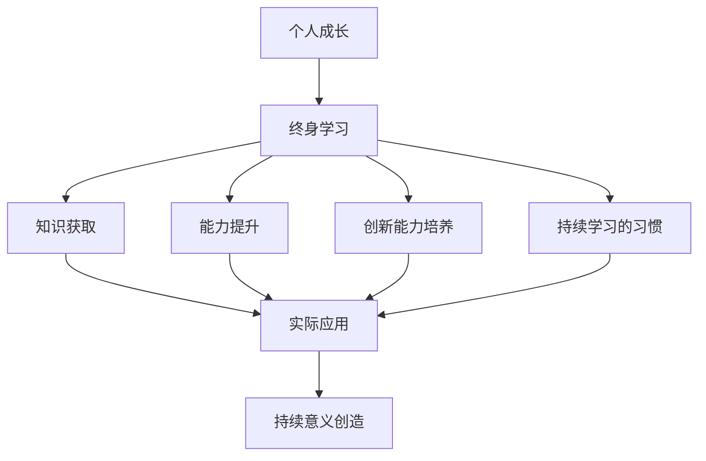

                 

### 1.1 个人成长与终身学习概述

**背景介绍：**

个人成长是指一个人在生活、学习、工作等各个领域中不断进步、提升自身能力和素质的过程。终身学习则是一种持续不断的学习方式，它贯穿于个人的一生，不仅包括正规的教育阶段，还涵盖职场学习和日常生活学习。在这个信息爆炸的时代，知识更新速度越来越快，掌握一种持续学习的态度和方法显得尤为重要。

**问题背景：**

在当今社会，个人成长和终身学习已经成为提升竞争力的关键因素。面对日新月异的技术变革和快速变化的市场环境，许多人意识到，仅仅依靠传统的教育模式已经无法满足终身成长的需求。因此，如何在不断变化的环境中保持学习的热情和动力，成为了每个人都必须面对的挑战。

**问题描述：**

个人成长中的核心要素包括自我认知、学习能力、时间管理、心理健康和社交能力等。终身学习则需要培养广泛的知识面、持续的求知欲和高效的学习方法。这两个概念既有区别又有联系，个人成长是终身学习的一部分，而终身学习是个人成长的重要支撑。

**问题解决：**

为了解决这一问题，我们需要从以下几个方面入手：

1. **明确个人成长的目标**：每个人都应该根据自己的兴趣、职业规划和人生目标来设定个人成长的具体目标。
2. **培养终身学习的习惯**：通过制定学习计划、选择合适的学习资源和坚持日常学习，培养终身学习的习惯。
3. **强化自我反思能力**：定期进行自我反思，了解自己的优点和不足，调整学习策略，提高学习效率。
4. **注重心理健康**：保持积极的心态，学会应对压力，确保心理健康对个人成长的支持。
5. **构建社交网络**：通过参与社交活动，扩大人际交往，获取更多的学习资源和机会。

**边界与外延：**

个人成长和终身学习不仅涉及个人的内在修养和素质提升，还与外部的学习环境、社会支持系统密切相关。个人的成长不仅是为了满足自身的需求，也是为了更好地融入社会、贡献社会。

**概念结构与核心要素组成：**

- **个人成长**：包括自我认知、学习能力、时间管理、心理健康和社交能力等。
- **终身学习**：包括知识获取、技能提升、创新能力培养和持续学习的习惯。

通过明确个人成长的目标和终身学习的方法，我们可以更好地应对快速变化的世界，实现个人价值和职业发展。

### 1.2 终身学习中的持续意义创造

**核心概念原理：**

持续意义创造是指在终身学习的过程中，通过不断地吸收新知识、提升能力，并将所学应用于实际生活和工作中，从而创造新的价值、提升自我认知和幸福感的过程。持续意义创造不仅仅是对知识的积累，更是一种思维方式的转变，是个人成长的重要动力。

**概念属性特征对比表格：**

| 特征对比          | 说明                                                       |
|-------------------|------------------------------------------------------------|
| **持续**          | 持续意义创造强调长期的过程，而不是短期的成果。               |
| **意义**          | 创造新的价值，提升自我认知和幸福感。                       |
| **创造**          | 主动地、有意识地通过学习和实践来产生新的知识和经验。         |
| **意义**          | 将所学应用于实际生活和工作中，解决实际问题，提升自我效能感。 |

**ER实体关系图架构：**

在这个ER实体关系图中，个人成长是终身学习的基础，而终身学习包括知识获取、能力提升、创新能力培养和持续学习的习惯。通过这些过程，最终实现持续意义创造。

### 1.3 个人成长中的自我反思

**重要性：**

自我反思是个人成长过程中不可或缺的一部分。它不仅帮助我们认识到自己的优点和不足，还能够促进自我认知的提升，帮助我们在不断变化的环境中更好地适应和发展。自我反思的重要性体现在以下几个方面：

1. **提升自我认知**：通过自我反思，我们可以深入了解自己的内心世界，认识到自己的优势和劣势，从而更好地规划个人成长的方向。
2. **优化行为模式**：自我反思可以帮助我们识别和调整不良的行为习惯，改进学习方法，提高工作效率。
3. **增强心理韧性**：面对挑战和困难时，自我反思能够帮助我们保持积极的心态，提高应对问题的能力。
4. **促进持续学习**：自我反思能够激发我们的求知欲和学习动力，使我们在终身学习的过程中更加有目的性和计划性。

**自我反思的方法与实践：**

1. **定期反思**：设定固定的反思时间，如每天晚上或每周的某个时段，回顾一天或一周的学习、工作和生活。
2. **写反思日记**：通过文字记录自己的想法和感受，有助于更深入地反思自己的行为和决策。
3. **与他人交流**：与朋友、同事或导师交流，获取外部的反馈和建议，有助于更全面地认识自己。
4. **设置具体目标**：在反思过程中，设定具体可行的个人成长目标，并评估实现目标的进展。

**自我反思对持续意义创造的影响：**

自我反思是持续意义创造的重要基础。通过自我反思，我们能够更清楚地认识到自己的需求和发展方向，从而有针对性地进行学习和实践。自我反思能够帮助我们：

1. **明确学习目标**：根据自我反思的结果，设定更具体、明确的学习目标，提高学习的针对性和效果。
2. **激发创新思维**：自我反思能够激发我们的创新思维，通过探索新的学习方法和途径，创造出新的价值和意义。
3. **提高行动力**：自我反思能够帮助我们识别阻碍自己成长的障碍，并采取积极的行动来克服这些障碍，从而实现持续意义创造。

总之，自我反思是个人成长和持续意义创造的关键环节，它不仅能够提升我们的自我认知，还能够激发我们的学习动力和创新能力，为我们的终身学习提供持久的动力和支持。

### 1.4 终身学习与个人职业发展

**终身学习在职业发展中的作用：**

终身学习在职业发展中扮演着至关重要的角色。在当今这个知识更新迅速、技术变革日新月异的时代，传统的单一学历教育已经无法满足职业发展的需求。终身学习不仅能够帮助个人不断提升专业技能，还能够增强竞争力，适应不断变化的市场环境。

1. **技能提升**：通过终身学习，个人可以不断更新和拓展自己的技能，掌握新的技术和工具，从而提高工作效率和职业水平。
2. **职业转型**：终身学习为职业转型提供了机会。随着个人兴趣和市场需求的变化，通过不断学习，个人可以转向新的职业领域，实现职业发展。
3. **创新能力**：终身学习能够培养个人的创新能力，帮助个人在职场中脱颖而出，创造新的价值，推动职业发展。

**职业发展中的终身学习策略：**

为了在职业发展中充分利用终身学习，以下策略尤为重要：

1. **制定个人发展计划**：明确自己的职业目标和长期规划，制定具体的学习计划，确保学习与职业发展目标的一致性。
2. **持续学习**：保持学习的热情和动力，通过线上课程、专业书籍、行业研讨会等多种途径，不断学习新的知识和技能。
3. **实践与应用**：将所学知识应用于实际工作中，通过实践来巩固和提高技能，实现学以致用。
4. **社交网络**：积极参与行业交流，扩大社交网络，获取更多的职业发展机会和资源。

**职业发展与个人成长的相互作用：**

职业发展和个人成长是相辅相成的。职业发展需要通过个人成长来实现，而个人成长又为职业发展提供了坚实的基础。

1. **相互促进**：职业发展能够提供更多的机会和资源，促进个人成长；而个人成长则能够提升个人的职业素养和竞争力，推动职业发展。
2. **平衡发展**：在追求职业发展的同时，也要注重个人成长，保持身心健康，避免因过度追求职业成就而忽视个人幸福。
3. **长期规划**：职业发展和个人成长都需要长期的规划和持续的努力，通过不断学习和实践，实现个人价值的不断提升。

总之，终身学习在职业发展中具有重要作用，它不仅是提升技能和竞争力的手段，更是实现个人价值和职业发展的关键。通过制定合理的终身学习策略，个人可以在不断变化的市场环境中保持竞争优势，实现职业发展和个人成长的协同进步。

### 1.5 个人成长与心理健康

**心理健康对个人成长的影响：**

心理健康是个人成长不可或缺的一部分。一个健康的心理状态能够为个人提供积极的能量，帮助他们在面对挑战时保持坚定的信心和解决问题的能力。具体来说，心理健康对个人成长的影响主要体现在以下几个方面：

1. **情绪管理**：心理健康使人能够有效地管理自己的情绪，避免情绪波动对个人决策和行为的负面影响。一个情绪稳定的人更容易在面对困难和挫折时保持冷静和理性。
2. **自信心提升**：心理健康有助于建立自信心，使个人在面对挑战和机遇时能够自信地迎接和应对。自信心是个人成长的重要推动力，有助于个人在职业和生活中取得成功。
3. **自我认知**：心理健康使人能够更清晰地认识自己，包括自己的优点和不足。这种自我认知有助于个人制定合理的目标和计划，从而更有效地推动个人成长。
4. **社会适应**：心理健康使人能够更好地适应社会环境，建立和谐的人际关系，增强社交能力。良好的社会适应能力有助于个人在职业和社会生活中获得更多的支持和机会。

**心理健康与终身学习的平衡：**

在终身学习的过程中，保持心理健康是非常重要的。以下是一些策略，帮助个人在学习与心理健康之间找到平衡：

1. **合理规划学习时间**：合理安排学习时间，避免过度劳累。确保有足够的休息时间，以便身体和大脑得到充分的恢复。
2. **保持积极心态**：面对学习中的困难和挑战时，保持积极的心态，相信自己有能力克服困难。积极的心态有助于减轻焦虑和压力，提高学习效率。
3. **培养兴趣爱好**：兴趣爱好能够为个人提供放松和缓解压力的途径，有助于保持心理健康。通过培养兴趣爱好，个人可以在忙碌的学习生活中找到乐趣和动力。
4. **寻求支持**：在面对心理压力时，不要犹豫寻求帮助。可以与朋友、家人或专业人士交流，获取情感支持和建议。

**增进心理健康的方法：**

1. **锻炼身体**：定期进行体育锻炼，如跑步、瑜伽、游泳等，有助于缓解压力，提升心理健康。
2. **保持社交活动**：积极参与社交活动，与朋友、家人保持良好的沟通和互动，有助于提升心理健康和幸福感。
3. **心理咨询**：如果遇到严重的心理问题，可以考虑寻求专业的心理咨询帮助。心理咨询师可以提供专业的建议和支持，帮助个人解决心理困扰。

总之，心理健康对个人成长至关重要。通过采取适当的策略和措施，个人可以在学习与心理健康之间找到平衡，实现全面、持续的个人成长。

### 1.6 个人成长中的社交网络

**社交网络对个人成长的作用：**

社交网络在个人成长中扮演着重要的角色。通过社交网络，个人可以获取丰富的信息资源，拓展人际关系，提升自身能力和素质。以下是一些具体的作用：

1. **信息获取**：社交网络为个人提供了一个获取知识的平台。通过社交网络，个人可以了解行业动态、学习新的知识和技能，及时掌握最新的信息和趋势。
2. **人际交往**：社交网络帮助个人建立和维护人际关系，拓展社交圈。良好的人际关系不仅有助于个人的心理健康，还能为职业发展提供支持和机会。
3. **资源共享**：社交网络使得个人可以分享自己的经验和资源，同时也能从他人那里获取帮助和指导。通过资源共享，个人可以更高效地解决问题，提升自身能力。
4. **职业发展**：社交网络为个人提供了职业发展的机会。通过社交网络，个人可以结识行业内的专家和同行，获得职业建议和机会，推动自己的职业发展。

**社交网络建设的方法与实践：**

要有效地建设社交网络，以下方法与实践尤为重要：

1. **积极参与行业活动**：参加行业会议、研讨会、培训等，与行业内的专家和同行建立联系。这些活动不仅有助于个人拓展人际关系，还能提升自身在行业中的影响力。
2. **利用专业平台**：利用LinkedIn、GitHub等专业社交平台，建立和维护专业形象。这些平台可以展示个人的专业能力和项目经验，帮助个人在职业圈内建立良好的声誉。
3. **主动交流与合作**：在社交网络中主动与同行交流，分享经验和见解，寻求合作机会。通过合作，个人可以共同解决问题，实现资源共享，提升个人和团队的成长。
4. **持续学习与成长**：通过不断学习新的知识和技能，提升自身的专业能力。一个不断进步的人更容易在社交网络中获得他人的认可和支持。

**社交网络在终身学习中的应用：**

社交网络在终身学习中的应用主要体现在以下几个方面：

1. **学习资源共享**：通过社交网络，个人可以获取来自不同领域的知识和资源。这些资源不仅包括书籍、文章、视频等，还包括行业专家的经验分享和实践案例。
2. **在线学习与交流**：利用社交网络平台，个人可以参加在线课程、研讨会和讲座，与讲师和同学进行互动交流。这种在线学习方式不仅灵活方便，还能提供丰富的学习体验。
3. **学习反馈与评估**：通过社交网络，个人可以获取他人的反馈和评估，了解自己在学习过程中的优点和不足，从而调整学习策略，提高学习效果。
4. **专业社群参与**：加入专业社群，与同行业的专业人士一起探讨问题、分享经验，有助于个人深化专业知识，提升职业素养。

总之，社交网络在个人成长和终身学习中发挥着重要的作用。通过积极参与社交网络建设，个人可以获取丰富的信息资源，拓展人际关系，提升自身能力和素质，实现终身学习和持续成长。

### 1.7 个人成长与社会责任

**社会责任在个人成长中的地位：**

社会责任是个人成长的重要组成部分。它不仅体现了个人对社会的责任感和贡献，也是个人价值观和道德素养的体现。在现代社会，随着个人影响力和社会地位的提升，承担社会责任已经成为个人成长的重要标志。

1. **提升自我价值**：通过承担社会责任，个人可以提升自身的价值。无论是在公益慈善、环境保护，还是社区服务等方面，贡献自己的力量都能让个人感受到成就感和幸福感。
2. **增强社会认同**：承担社会责任能够增强个人在社会中的认同感。一个具有社会责任感的人更容易赢得他人的尊重和信任，从而在职业和社会生活中获得更多的支持和机会。
3. **促进全面发展**：社会责任感的培养有助于个人在多个方面实现全面发展。通过参与社会活动，个人不仅能够提升专业技能，还能锻炼领导力、团队合作能力和沟通能力。

**社会责任与终身学习的融合：**

社会责任与终身学习是相辅相成的。终身学习为个人提供了持续发展的动力和资源，而社会责任则为个人提供了实践的平台和意义。

1. **知识转化为行动**：通过终身学习，个人可以积累丰富的知识和技能。将这些知识和技能应用于社会责任实践中，能够更好地解决社会问题，实现知识到行动的转化。
2. **持续学习与反思**：在社会责任实践中，个人会面临各种新的挑战和问题。通过持续学习和反思，个人可以不断提升自身的认知和解决问题的能力，为社会贡献更多的智慧和力量。
3. **培养社会责任感**：终身学习不仅是一种知识的积累，更是一种态度的培养。通过参与社会活动，个人可以培养对社会的责任感和使命感，使其在成长过程中更加注重社会价值和公共利益。

**个人成长对社会的影响：**

个人成长对社会的影响是深远而广泛的。一个不断成长和进步的个人，不仅能够为自身创造价值，还能对社会产生积极的推动作用。

1. **创新驱动**：个人成长能够培养创新思维和创新能力。一个充满创新活力的社会，能够不断推动科技进步和社会发展。
2. **社会和谐**：个人成长有助于提升社会的整体素质和文明程度。通过积极参与社会活动和公益项目，个人可以促进社会的和谐与稳定。
3. **文化传播**：个人成长也是文化传承和发展的重要力量。通过传播和弘扬优秀的文化和价值观，个人可以推动社会文化的繁荣和进步。

总之，社会责任是个人成长的重要组成部分，它不仅体现了个人的价值观和道德素养，也为个人提供了实现自我价值和社会贡献的舞台。通过终身学习和实践，个人可以不断提升自身的能力和素质，为社会的发展和进步做出积极的贡献。

### 1.8 本章小结

本章介绍了个人成长与终身学习的概念和重要性。个人成长是指一个人在生活、学习、工作等各个领域中不断进步、提升自身能力和素质的过程。终身学习则是一种持续不断的学习方式，它贯穿于个人的一生，不仅包括正规的教育阶段，还涵盖职场学习和日常生活学习。这两个概念相互关联，共同构成了个人不断进步的动力源泉。

本章首先介绍了个人成长的核心要素，包括自我认知、学习能力、时间管理、心理健康和社交能力等。然后，我们探讨了终身学习的意义和挑战，以及如何通过自我反思和终身学习来提升个人成长。此外，本章还详细讨论了心理健康对个人成长的影响，以及如何通过保持心理健康来促进终身学习和个人成长。最后，我们强调了社交网络和社会责任在个人成长中的重要作用。

通过本章的学习，读者可以更好地理解个人成长与终身学习的关系，掌握提升个人成长的方法和策略，并在实际生活中践行这些理念，实现自身的全面发展和持续进步。

## 2.1 制定个人成长计划

**制定个人成长计划的重要性：**

制定个人成长计划是个人实现目标、提升自我能力的重要步骤。一个明确的个人成长计划不仅能够帮助个人清晰地了解自己的目标和发展方向，还能够提供具体的行动指南，使个人在追求成长的过程中更有方向性和效率。以下是制定个人成长计划的重要性：

1. **明确目标**：个人成长计划能够帮助个人明确自己的长期和短期目标，使其更加明确自己想要实现什么，从而避免在成长过程中迷失方向。
2. **提升动力**：通过制定个人成长计划，个人可以设定具体的学习目标和行动计划，这有助于提升个人在学习和实践中的积极性和动力。
3. **有效管理时间**：个人成长计划能够帮助个人合理规划时间，确保在学习和实践中能够高效利用时间，避免时间浪费。
4. **跟踪进展**：个人成长计划可以用来跟踪个人在各个阶段的进展情况，及时调整计划，确保目标的实现。

**个人成长计划的制定原则：**

1. **具体性**：个人成长计划中的目标应该具体明确，避免模糊和宽泛。具体的目标能够帮助个人更清晰地了解自己的努力方向，提高实现的可能性。
2. **可行性**：设定的目标需要是可实现的，符合个人当前的能力和资源条件。目标过高会导致挫败感，过低则无法激发个人的成长潜力。
3. **阶段性**：个人成长计划应该包括长期和短期的目标，并且将长期目标分解为一系列短期目标，有助于逐步实现最终目标。
4. **适应性**：个人成长计划需要具有一定的灵活性，以适应个人在成长过程中可能遇到的变化和挑战。计划应能够根据实际情况进行调整和优化。

**个人成长计划的具体步骤：**

1. **自我评估**：首先，进行自我评估，了解自己的兴趣、优势和不足。这可以通过问卷调查、能力测试、与他人的交流等方式进行。
2. **设定目标**：基于自我评估的结果，设定明确的长期和短期目标。长期目标应具有挑战性，但又是可实现的；短期目标则应具体、可量化，如学习一项新技能、通过某个认证等。
3. **制定行动计划**：针对每个目标，制定具体的行动计划。包括具体的学习内容、时间安排、资源利用等。行动计划应详细到每一天、每一周的具体任务。
4. **时间管理**：合理安排时间，制定时间表，确保有足够的时间用于学习和实践。同时，要留出时间用于休息和放松，以避免过度疲劳。
5. **执行与跟踪**：按照制定的行动计划执行，并定期跟踪进展情况。可以每周或每月进行一次回顾，检查目标的实现情况和计划的有效性，及时调整和优化。
6. **反馈与调整**：根据执行过程中的反馈，及时调整计划和目标。如果某个目标无法实现，可以重新设定目标或调整行动计划。

**案例分析：**

小明是一名程序员，他希望在未来三年内提升自己的技术能力和职业发展。他的个人成长计划如下：

1. **自我评估**：小明通过能力测试和同事反馈，了解到自己在前端开发方面有优势，但在后端开发和项目管理方面还有待提升。
2. **设定目标**：
   - 长期目标：在未来三年内，成为一名资深前端工程师，具备独立承担项目的能力。
   - 短期目标：1年内通过Node.js认证，2年内通过项目管理认证。
3. **制定行动计划**：
   - 学习内容：学习Node.js、React、Vue等前端框架，以及项目管理知识。
   - 时间安排：每天学习2小时，每周进行一次项目实战。
   - 资源利用：通过在线课程、专业书籍和GitHub项目进行学习。
4. **执行与跟踪**：小明按照行动计划执行，每周进行一次进度检查，并记录学习笔记和项目成果。
5. **反馈与调整**：在执行过程中，小明发现自己在项目管理方面遇到困难，于是决定增加项目管理课程的课时，并寻找项目导师进行指导。

通过制定和执行个人成长计划，小明在技术能力和职业发展方面取得了显著进步，实现了自己的目标。

**总结：**

制定个人成长计划是个人提升自我、实现目标的重要手段。通过明确目标、制定行动计划和持续跟踪进展，个人可以更好地实现自己的成长目标。同时，灵活调整计划和反馈，能够帮助个人适应变化，确保计划的实施效果。

## 2.2 提升学习效率

**学习效率的重要性：**

在信息爆炸的时代，如何高效地学习和吸收新知识成为每个人都需要关注的重要问题。学习效率不仅直接影响到个人的学习成果，还关系到时间管理和生活质量的提升。高效学习意味着能够在有限的时间内掌握更多的知识，提高学习效果，从而在职业和个人成长中占据优势。

**提升学习效率的方法：**

1. **目标明确**：设定清晰的学习目标，明确自己希望达到的知识水平或技能目标。目标明确有助于集中精力，提高学习的针对性。
2. **时间管理**：合理安排学习时间，制定详细的时间表。通过时间管理，确保在高效的时间段进行学习，避免时间浪费。
3. **分块学习**：将学习内容分成小块，逐步完成。分块学习有助于减轻大脑负担，提高记忆效果，同时也能够避免长时间学习导致的疲劳。
4. **主动学习**：积极参与学习过程，主动思考和提问。主动学习能够激发大脑的思考能力，加深对知识的理解和记忆。
5. **多样化学习**：通过多种途径和方式学习，如阅读书籍、观看视频、参与讨论等。多样化学习可以激发学习兴趣，提高学习效果。
6. **反馈与调整**：在学习过程中进行反馈和调整，根据实际情况优化学习方法和策略。反馈和调整有助于发现和解决问题，提高学习效率。

**提升学习效率的方法与实践：**

1. **番茄工作法**：采用番茄工作法，将学习时间划分为25分钟的学习和5分钟的休息，每个循环称为一个番茄钟。这种方法有助于保持专注，提高学习效率。
2. **主动学习工具**：使用学习软件和工具，如Anki、Quizlet等，进行主动记忆和复习。这些工具能够通过记忆卡片和测试，帮助巩固记忆，提高学习效果。
3. **学习社区参与**：加入学习社区和论坛，与他人交流学习心得和经验。通过讨论和交流，能够获取更多的学习资源和见解，提高学习效率。

**学习效率的评估与改进：**

1. **自我评估**：定期进行自我评估，检查学习目标和计划的完成情况。通过自我评估，了解自己的学习效率，发现存在的问题。
2. **反馈与调整**：根据自我评估的结果，及时调整学习方法和策略。反馈和调整有助于优化学习过程，提高学习效率。
3. **学习报告**：定期撰写学习报告，记录学习进度、方法和成果。学习报告可以帮助个人总结学习经验，提高自我管理能力。

**案例分析：**

小王是一名大学生，他希望在有限的学习时间内提高编程能力。他通过以下方法提升了学习效率：

1. **目标明确**：设定了在半年内通过某编程语言中级认证的目标。
2. **时间管理**：制定了详细的时间表，每天安排2小时的编程学习时间。
3. **分块学习**：将学习内容分为基础知识和高级应用两个部分，逐一攻克。
4. **主动学习**：通过在线课程和实战项目，主动学习编程知识，并积极提问和讨论。
5. **多样化学习**：观看教学视频、阅读专业书籍，并参加线下的编程培训班。
6. **自我评估与反馈**：每周进行一次自我评估，检查学习进度，并根据反馈调整学习计划。

通过以上方法，小王在半年内成功通过了编程语言中级认证，显著提升了编程能力。

**总结：**

提升学习效率是个人成长的重要环节。通过明确目标、合理规划时间、分块学习和主动参与，个人可以有效地提高学习效率，实现知识和技能的快速提升。同时，定期进行自我评估和反馈，能够帮助个人不断优化学习过程，实现持续成长。

## 2.3 持续学习的资源选择

**持续学习资源的类型：**

为了确保个人能够持续学习并不断提升自身能力，选择合适的资源至关重要。持续学习资源主要包括以下几种类型：

1. **在线课程**：如Coursera、Udemy、edX等在线教育平台提供丰富的课程资源，涵盖多个领域，包括编程、数据科学、商业管理、人文艺术等。在线课程通常灵活方便，可以根据个人时间安排进行学习。
2. **图书和期刊**：图书馆和书店是获取专业知识和学术研究的宝库。图书和期刊包括技术书籍、经典著作、学术论文等，能够提供系统的知识和深入的研究。
3. **讲座和研讨会**：行业会议、学术讲座和研讨会是获取前沿知识和行业动态的好机会。参加这些活动不仅能够学习新知识，还能与行业专家和同行交流。
4. **在线论坛和社区**：如Stack Overflow、GitHub、Reddit等在线论坛和社区，提供了大量的技术讨论和问题解答资源。这些社区是学习和分享经验的理想平台。
5. **专业认证和证书**：通过参加专业认证考试和获得证书，个人能够证明自己的专业能力和知识水平。专业认证如PMP、CISSP、Oracle认证等，是提升职业竞争力的有效途径。

**资源选择的策略：**

1. **需求分析**：明确个人学习目标和发展方向，分析自身所需的知识和技能。根据需求选择最适合的资源，确保学习的针对性和有效性。
2. **资源评估**：对不同类型的资源进行评估，包括内容质量、更新频率、用户体验等。选择权威性强、内容优质的资源，有助于提高学习效果。
3. **灵活应用**：根据个人时间和资源条件，灵活选择和利用不同类型的资源。例如，在忙碌的工作日可以优先选择在线课程，而在周末可以阅读专业书籍。
4. **成本效益**：评估资源的成本和效益，选择性价比高的资源。如果某些资源（如某些图书或在线课程）价格较高，可以尝试借阅或参加试听，确保投资回报率。
5. **反馈与调整**：在学习过程中，根据反馈和效果调整资源选择。如果某个资源效果不佳，应及时更换或补充其他资源。

**资源利用与效果评估：**

1. **有效利用**：制定详细的学习计划，合理安排学习时间和资源利用。将资源整合到个人学习体系中，确保每个资源都能发挥最大的作用。
2. **效果评估**：通过定期测试和自我评估，检查学习效果。例如，可以通过完成相关项目、参加认证考试或与他人的讨论，来评估自己的学习成果。
3. **反馈与改进**：根据评估结果，调整学习方法和资源利用策略。如果发现某些资源效果不佳，可以重新选择或补充其他资源，以确保学习效果的最优化。

**案例分析：**

小李是一名软件工程师，他希望通过持续学习提升自己的数据科学能力。他的资源选择策略如下：

1. **需求分析**：小李分析了自身需求，决定学习Python数据科学和机器学习。
2. **资源评估**：他选择了Udacity的数据科学纳米学位课程，评估后发现课程内容系统、实用，且与工作需求高度相关。
3. **灵活应用**：小李每天晚上花费2小时学习在线课程，周末参加线下的数据分析实践工作坊。
4. **成本效益**：由于课程价格较高，小李选择了分期付款，并在公司报销部分费用。
5. **效果评估**：通过完成项目任务和参加公司的数据科学竞赛，小李评估了自己的学习效果，发现自己在数据清洗、建模和报告撰写方面有明显提升。

通过有效的资源选择和利用，小李在数据科学领域取得了显著进步。

**总结：**

持续学习的资源选择是个人成长的重要一环。通过需求分析、资源评估、灵活应用和效果评估，个人可以有效地选择和利用资源，提高学习效果，实现持续成长。

## 2.4 创新思维培养

**创新思维的重要性：**

创新思维是指在面对问题时，能够提出独特、创造性的解决方案，并有效执行这些方案的能力。在个人成长和职业发展中，创新思维具有极其重要的意义。具体来说，创新思维的重要性体现在以下几个方面：

1. **解决复杂问题**：在现代社会，问题往往复杂多变，传统的思维和方法可能无法应对。创新思维能够帮助我们跳出惯性思维，从不同角度分析问题，找到更有效的解决方案。
2. **提升竞争力**：创新思维能够帮助个人在竞争激烈的环境中脱颖而出。通过不断创新，个人可以开发出新的产品或服务，满足市场的需求，从而提升自身的竞争力。
3. **推动社会进步**：创新思维不仅对个人成长有利，还能推动整个社会的进步。通过创新，可以解决社会问题，提升生产效率，促进经济发展。
4. **提升生活质量**：创新思维能够改善我们的日常生活，带来更多的便利和乐趣。从智能设备到健康生活方式，创新思维无处不在，极大地提升了我们的生活质量。

**创新思维的方法与实践：**

1. **头脑风暴**：头脑风暴是一种集体创意思维活动，通过集体讨论和交流，产生大量创意和想法。在头脑风暴中，鼓励参与者不受限制地发表观点，从而激发创新思维。
2. **思维导图**：思维导图是一种图形化的思考工具，通过绘制分支和连接线，将思维过程可视化。思维导图可以帮助我们梳理思路，发现潜在的创新点。
3. **原型设计**：原型设计是将创意转化为实际产品的过程。通过快速构建原型，我们可以验证和改进创意，从而实现创新。
4. **跨学科学习**：跨学科学习能够帮助我们打破专业壁垒，获取多领域的知识和方法。跨学科的知识和视角能够激发创新思维，促进新创意的产生。
5. **反思与复盘**：反思和复盘是创新思维的重要环节。通过回顾和总结过去的经验，我们可以发现成功和失败的原因，从而不断优化创新思维。

**创新思维对个人成长的影响：**

创新思维对个人成长有着深远的影响。它不仅能够帮助我们更好地应对挑战，提升解决问题的能力，还能激发我们的创造力和学习动力。

1. **提升自我认知**：通过创新思维，我们可以深入了解自己的思维模式和习惯，从而更好地认识自我，提升自我认知水平。
2. **增强学习能力**：创新思维需要不断学习和吸收新知识，这有助于提升个人的学习能力和知识储备。
3. **促进职业发展**：创新思维能够帮助我们开发新的产品或服务，提升职业竞争力，实现职业发展。
4. **丰富生活体验**：创新思维能够改善我们的日常生活，带来更多的乐趣和便利，提升生活质量。

**案例分析：**

小李是一名产品经理，他希望通过创新思维提升产品设计和用户体验。他的实践方法如下：

1. **头脑风暴**：在产品开发初期，小李组织团队成员进行头脑风暴，提出各种创新的想法和方案。
2. **思维导图**：小李使用思维导图工具，将头脑风暴中的创意和想法进行可视化，梳理出关键的创新点和路径。
3. **原型设计**：小李快速构建了产品的原型，通过用户测试和反馈，不断优化和改进设计。
4. **跨学科学习**：小李参加跨学科的课程和研讨会，学习心理学、设计学等领域的知识，提升自己的创新思维。
5. **反思与复盘**：小李定期进行产品复盘，分析用户反馈和市场表现，发现成功和失败的原因，持续优化创新思维。

通过这些方法，小李成功地推动了产品的创新和升级，提升了产品的用户体验和市场竞争力。

**总结：**

创新思维是个人成长和职业发展的重要推动力。通过培养创新思维，我们可以更好地应对挑战，提升自我认知和解决问题的能力，实现个人和职业的全面发展。同时，创新思维还能改善我们的生活体验，提升生活质量。

## 2.5 持续意义创造的方法

**持续意义创造的内涵：**

持续意义创造是指在个人成长的过程中，通过不断学习、实践和创新，持续地创造新的价值，提升自我认知和幸福感的过程。持续意义创造不仅仅是对知识的积累，更是对个人价值的提升和自我实现的追求。它强调在终身学习的基础上，通过主动思考和行动，将所学应用于实际生活和工作中，从而创造出新的意义和成果。

**持续意义创造的过程：**

1. **学习与积累**：持续意义创造的基础是学习和积累。通过广泛的学习，个人可以获取丰富的知识储备，包括专业知识、技能和经验。这些知识和技能是创造新的价值的重要资源。
2. **反思与总结**：在学习过程中，个人需要不断反思和总结自己的经验和教训。通过反思，个人可以发现自己的不足和改进的方向，从而优化学习策略，提升学习效果。
3. **实践与创新**：将所学知识应用于实际生活和工作中，通过实践来验证和应用所学。在实践中，个人可以不断尝试新的方法和思路，进行创新，从而创造出新的价值。
4. **反馈与调整**：在创造过程中，个人需要不断收集反馈，包括来自自己和他人的评价。通过反馈，个人可以了解自己的创造是否符合预期，并据此进行调整和优化。
5. **持续迭代**：持续意义创造是一个不断迭代和优化的过程。通过不断学习和实践，个人可以不断提升自身的创造能力和水平，实现持续的价值创造。

**持续意义创造的案例分析：**

小李是一名软件工程师，他在工作中追求持续意义创造，具体实践如下：

1. **学习与积累**：小李通过参加线上课程和阅读专业书籍，不断学习新的编程技术和工具。他积累的知识和技能为他后续的创造奠定了基础。
2. **反思与总结**：在工作中，小李经常反思自己的代码设计和开发过程，总结成功和失败的经验。通过反思，他发现自己在性能优化方面存在不足，于是制定了改进计划。
3. **实践与创新**：小李将学到的性能优化技术应用于实际项目中，通过实践来验证和改进。他尝试了多种优化方法，最终找到了一种有效的解决方案，提高了系统的性能。
4. **反馈与调整**：小李将优化方案提交给团队，并邀请同事进行评审。通过反馈，他了解到方案的有效性和改进点，进一步完善了方案。
5. **持续迭代**：小李在实践中不断总结和优化，通过持续学习和实践，不断提升自己在性能优化方面的能力。他最终成为团队中的技术专家，为公司的项目做出了重要贡献。

通过持续意义创造，小李不仅提升了自身的专业能力，还为公司创造了实际的价值，实现了个人和职业的全面发展。

**总结：**

持续意义创造是个人成长和职业发展的重要策略。通过学习与积累、反思与总结、实践与创新、反馈与调整和持续迭代，个人可以不断提升自身的能力和价值，实现持续的成长和进步。持续意义创造不仅对个人有益，也为社会和组织的繁荣发展做出了重要贡献。

## 2.6 个人成长中的关键决策

**关键决策的定义：**

关键决策是指在个人成长和职业发展中，面临的重要选择和决定。这些决策不仅关系到个人的当前利益，还可能对未来的发展和方向产生深远的影响。关键决策通常涉及职业规划、技能提升、项目选择、人际关系处理等多个方面，具有战略性和长期性的特点。

**关键决策的要素：**

1. **信息收集**：在进行关键决策时，需要广泛收集相关信息，包括市场趋势、行业动态、技术发展等。全面的信息收集有助于做出更为科学和合理的决策。
2. **风险评估**：关键决策往往伴随着风险，因此需要对潜在的风险进行评估。这包括对可能面临的挑战、不确定性、机会成本等因素的全面分析。
3. **目标匹配**：决策需要与个人的长期目标和价值观相匹配。确保决策符合个人的职业规划和个人成长方向，避免偏离初衷。
4. **权衡利弊**：在多个选项之间进行权衡，评估各个选择的优劣势。通过权衡利弊，选择最符合个人利益和需求的决策。
5. **行动规划**：决策不仅需要考虑当前的选择，还需要制定详细的行动规划，确保决策能够有效执行并达到预期目标。

**关键决策的案例分析：**

小王是一名软件开发工程师，他在职业生涯中面临了几个关键决策：

1. **是否跳槽**：小王在一家公司工作了五年，发现自己的技能和发展空间受限。经过市场调研和自我评估，他决定跳槽到一家技术更先进、发展空间更大的公司。这个决策使他在短时间内提升了技能和职业地位。
2. **是否进修**：小王在职业发展的过程中，发现自己在项目管理方面有所欠缺。经过咨询导师和了解行业需求，他决定参加PMP认证培训。通过这次进修，他不仅提升了项目管理能力，还为未来的职业发展奠定了基础。
3. **是否参与开源项目**：小王在工作中积累了一定的技术经验，他决定参与一个开源项目。通过参与开源项目，他不仅提升了编程能力，还结识了许多行业专家，扩展了人脉资源。

通过这些关键决策，小王在职业生涯中取得了显著进步，实现了个人和职业的全面发展。

**总结：**

关键决策在个人成长和职业发展中具有重要地位。通过全面的信息收集、风险评估、目标匹配、权衡利弊和行动规划，个人可以做出更为科学和合理的决策，实现持续成长和进步。

## 2.7 持续学习的心理调适

**心理调适的重要性：**

在持续学习的过程中，保持良好的心理状态是至关重要的。心理健康不仅影响个人的学习效果，还直接关系到个人的生活质量和工作表现。良好的心理调适可以帮助个人更好地应对学习压力，保持积极的心态，从而实现持续学习。

**心理调适的方法与实践：**

1. **情绪管理**：学会管理自己的情绪，避免因压力和挫折而失去学习的动力。可以采用深呼吸、冥想等方法来缓解紧张和焦虑情绪。
2. **目标设定**：设定明确且可实现的学习目标，有助于保持学习动力和方向。将长期目标分解为短期目标，逐步实现，可以避免因目标过高而导致的挫败感。
3. **时间管理**：合理安排学习时间，确保有足够的休息和放松时间。通过有效的时间管理，避免过度劳累，保持身心健康。
4. **积极心态**：培养积极的心态，相信自己有能力克服学习中的困难和挑战。积极的心态有助于提升学习效率，增强自信心。
5. **社交互动**：保持社交互动，与家人、朋友和同事进行交流。社交互动可以缓解学习压力，提供情感支持和鼓励。

**心理调适对持续学习的影响：**

1. **提高学习效率**：良好的心理状态能够提高个人的注意力和专注力，从而提高学习效率。
2. **增强自信心**：通过心理调适，个人能够更好地认识自己，增强自信心，面对挑战和困难时更加坚定。
3. **促进持续学习**：心理调适有助于个人保持学习动力和热情，实现持续学习，不断提升自身的知识和技能。
4. **改善生活质量**：良好的心理状态不仅有助于学习，还能改善个人的整体生活质量，使其在工作和生活中更加愉悦和满足。

**案例分析：**

小张是一名大学生，他希望通过自学提升编程能力。然而，在学习过程中，他常常感到焦虑和挫败。为了改善心理状态，他采取以下措施：

1. **情绪管理**：通过深呼吸和冥想，小张学会了放松自己，缓解焦虑情绪。
2. **目标设定**：小张将编程学习目标分解为每月掌握一项新技能，设定了明确的短期目标。
3. **时间管理**：他制定了详细的学习计划，确保每天有固定的学习时间，并合理安排休息和放松。
4. **积极心态**：小张通过自我激励和与同学交流，保持积极的心态，相信自己能够克服困难。
5. **社交互动**：小张加入了编程社区，与志同道合的同学一起学习和交流，获得了情感支持和鼓励。

通过这些心理调适方法，小张在编程学习中取得了显著进步，不仅提升了编程能力，还改善了整体生活质量。

**总结：**

持续学习的心理调适对于个人的成长和发展至关重要。通过情绪管理、目标设定、时间管理、积极心态和社交互动等方法，个人可以更好地应对学习压力，保持良好的心理状态，实现持续学习和全面发展。

## 3.1 案例分析一：成功人士的终身学习实践

**案例背景介绍：**

本案例的主角是一位在科技行业取得显著成功的公司CEO，张先生。张先生在计算机科学领域拥有深厚的背景，曾在多家知名科技公司担任重要职位。在创办自己的公司之前，他已经积累了丰富的管理和领导经验。张先生的成功不仅在于他在技术和商业领域的卓越能力，更在于他始终坚持终身学习的理念。

**案例中的学习策略：**

1. **自我驱动的学习态度**：张先生认为，终身学习是一种自我驱动的行为，它不仅是为了提升技能，更是为了保持对新知识和新技术的敏感度。他始终坚持每天阅读专业书籍、订阅科技期刊，并通过在线课程不断学习最新的技术和商业知识。
2. **多样化的学习资源**：为了确保学习资源的最优化，张先生充分利用各种学习平台和资源。他不仅参加线上课程，还定期参加行业会议和研讨会，与行业专家面对面交流，获取最新的行业动态和前沿技术。
3. **实践与反思**：张先生坚信实践是检验学习效果的最佳方式。他在公司内部推行了多个创新项目，鼓励团队成员通过实际操作来提升技能和解决问题。此外，他还会定期进行自我反思，总结经验教训，优化学习策略。
4. **培养团队学习文化**：作为公司的CEO，张先生非常重视团队的学习和发展。他通过组织内部培训和研讨会，鼓励团队成员分享知识和经验，营造了一个积极的学习氛围。

**案例对个人成长的启示：**

1. **持续学习的态度**：张先生的案例表明，终身学习不仅仅是一种行为，更是一种态度。只有具备持续学习的态度，个人才能在快速变化的环境中保持竞争力。
2. **多样化的学习资源**：利用多样化的学习资源，可以更全面、系统地提升个人能力。张先生的多样化学习策略为个人提供了丰富的知识来源，有助于全面提升个人素质。
3. **实践与反思**：将所学知识应用于实践，并通过反思不断优化学习策略，是提升个人能力和经验的有效方法。张先生通过实践和反思，不仅巩固了所学知识，还培养了创新思维和解决问题的能力。
4. **培养学习文化**：领导者的学习态度和行为对团队文化有重要影响。张先生通过培养团队学习文化，不仅提升了团队的整体能力，也为个人成长创造了良好的环境。

**总结：**

通过分析张先生的终身学习实践，我们可以看到，持续学习、多样化资源利用、实践与反思以及培养学习文化是成功人士个人成长的重要策略。这些方法不仅适用于个人，也为组织提供了一个有益的参考，帮助团队成员实现共同成长。

## 3.2 案例分析二：企业家的持续意义创造

**案例背景介绍：**

本案例的主角是一位成功企业家，李女士，她创立了一家专注于物联网技术的公司。李女士在公司创办初期，面对技术市场的不确定性和竞争压力，她始终坚持通过终身学习来提升公司的核心竞争力，并通过持续意义创造实现了企业的快速发展和成功。

**案例中的持续意义创造实践：**

1. **技术创新**：李女士深刻认识到技术创新是企业生存和发展的关键。她不断学习最新的物联网技术，并带领团队进行研发，推出了一系列具有竞争力的创新产品。这些技术创新不仅提升了公司的市场份额，也为客户创造了新的价值。
2. **人才培养**：李女士重视人才的培养和引进。她通过建立内部培训体系和外部招聘，吸引了一批技术人才和行业专家。同时，她鼓励员工持续学习，提升专业技能，通过设立内部项目和创新比赛，激发员工的创新潜力。
3. **市场拓展**：李女士不断学习和分析市场趋势，积极拓展国际市场。她通过参加国际展会、建立海外合作伙伴关系，成功地将公司的产品推广到全球市场，实现了企业的国际化发展。
4. **社会责任**：李女士认为，企业应该承担社会责任，通过公益活动和环保项目，回馈社会。她积极参与社会公益活动，推动可持续发展，树立了企业的良好社会形象。

**案例对个人成长的启示：**

1. **技术创新的重要性**：持续学习技术创新，并将其应用于实际业务中，是提升企业竞争力的重要手段。李女士通过不断学习和研发，成功地将物联网技术应用到产品中，实现了企业的快速发展。
2. **人才培养的价值**：注重人才培养和引进，能够为企业的长期发展提供有力支持。李女士通过建立培训体系和激励措施，激发了员工的创新潜力，为公司创造了新的价值。
3. **市场拓展的策略**：不断学习和分析市场趋势，积极拓展市场，是企业在竞争激烈的环境中立足的关键。李女士通过国际市场的拓展，成功提升了公司的全球影响力。
4. **社会责任的担当**：企业家的成长不仅体现在商业成功上，更体现在社会责任的担当上。李女士通过积极参与社会公益活动，树立了企业的良好形象，实现了个人和企业的共同成长。

**总结：**

通过分析李女士的持续意义创造实践，我们可以看到，技术创新、人才培养、市场拓展和社会责任是企业家实现个人和企业共同成长的重要策略。这些实践不仅推动了企业的发展，也为个人的成长提供了宝贵的经验和启示。

## 3.3 案例分析三：教育者的终身学习与创新

**案例背景介绍：**

本案例的主角是一位在高校任教的教育专家，王教授。王教授在学术和教育领域拥有丰富的经验，他致力于通过终身学习和创新教学方法，提高教学质量和学生能力。

**案例中的学习策略与创新：**

1. **持续学习**：王教授始终坚持不断学习，通过阅读最新出版的学术著作、参加学术会议和研讨会，了解学科领域的最新发展和研究成果。他还利用在线课程和学术论坛，扩展自己的知识面。
2. **课程创新**：为了提升教学效果，王教授不断进行课程创新。他根据学生需求和社会发展趋势，调整课程内容和教学方法，引入了项目式学习和合作学习等新型教学方法，激发了学生的学习兴趣和主动性。
3. **科研与教学相结合**：王教授将科研与教学紧密结合，鼓励学生在实际科研项目中学习。他通过指导学生参与科研项目，让学生在真实的科研环境中提升技能，并将科研成果应用于教学中，提高了教学的实际应用价值。
4. **跨学科教学**：王教授强调跨学科教学的重要性，通过引入跨学科的知识和视角，培养学生的综合能力和创新思维。他开设了多门跨学科课程，鼓励学生跨领域学习，拓展学术视野。

**案例对个人成长的启示：**

1. **持续学习的重要性**：王教授的案例表明，持续学习是教育者个人成长和专业发展的关键。通过不断学习，教育者可以保持专业知识的更新，提高教学水平。
2. **创新教学方法**：教育者需要不断探索和创新教学方法，以适应学生和时代的需求。王教授通过课程创新和跨学科教学，提升了教学效果，为学生提供了更丰富和有趣的学习体验。
3. **科研与教学的结合**：将科研与教学相结合，不仅能够提升学生的科研能力，还能够提高教学的应用性和实践性，实现教学与科研的双赢。
4. **跨学科教学的价值**：跨学科教学能够培养学生的综合能力和创新思维，使其在面对复杂问题时能够从多个角度进行思考和分析，从而提升解决实际问题的能力。

**总结：**

通过分析王教授的终身学习与创新实践，我们可以看到，持续学习、创新教学方法、科研与教学相结合以及跨学科教学是教育者实现个人成长和学生发展的有效策略。这些实践不仅提升了教学质量和学生能力，也为教育者的专业发展提供了宝贵的经验和启示。

## 3.4 案例分析四：普通人的自我提升之路

**案例背景介绍：**

本案例的主角是一位普通上班族，赵先生。赵先生在工作中面临着技能更新快、竞争压力大的挑战，但他坚信通过自我提升，可以实现职业发展和个人成长。以下是赵先生通过终身学习和持续实践实现自我提升的案例。

**案例中的学习策略与实践：**

1. **制定学习计划**：赵先生首先制定了详细的学习计划，明确自己的职业目标和技能提升方向。他每天设定学习时间，每周设定学习目标，确保学习与工作、生活协调进行。
2. **多样化学习资源**：赵先生利用多种学习资源，如在线课程、专业书籍、技术论坛等，广泛获取知识。他还通过参加行业培训和讲座，与同行交流，获取最新的行业动态和实用技能。
3. **实践应用**：赵先生将所学知识应用于实际工作中，通过实际操作来巩固和提升技能。他在工作中积极参与项目，主动承担责任，通过解决实际问题，提升了自己的能力和自信心。
4. **反思与调整**：赵先生定期进行自我反思，检查学习效果，并根据反馈调整学习策略。他通过记录学习日志、参与学习小组和请教导师，不断提升学习效率和质量。

**案例对个人成长的启示：**

1. **明确目标**：制定明确的学习目标，有助于个人更加有针对性地进行学习和实践，避免盲目性。
2. **多样化学习资源**：充分利用多种学习资源，可以全面提升个人的知识储备和技能水平。
3. **实践应用**：将所学知识应用于实际工作中，通过实践来验证和巩固所学，是提升个人能力的重要途径。
4. **持续反思与调整**：定期反思学习效果，及时调整学习策略，有助于优化学习过程，实现持续成长。

**总结：**

赵先生的案例展示了普通人通过自我提升实现职业发展和个人成长的路径。通过明确目标、多样化学习资源、实践应用和持续反思，赵先生在职业生涯中取得了显著进步，为其他普通人提供了宝贵的经验和启示。

## 本章小结

在本章中，我们通过四个不同领域的案例分析，展示了成功人士、企业家、教育者和普通人在终身学习与持续意义创造中的实践和经验。这些案例揭示了终身学习的重要性，以及如何在个人成长和职业发展中通过学习策略和创新实践实现自我提升。无论是通过技术创新、人才培养、市场拓展，还是通过持续学习和实践应用，这些案例都为我们提供了宝贵的启示：

1. **持续学习的态度**：终身学习不仅仅是一种行为，更是一种态度。保持对知识的渴望和学习的热情，是个人成长和职业发展的基础。
2. **多样化学习资源**：充分利用多种学习资源，可以全面提升个人的知识储备和技能水平。通过在线课程、专业书籍、行业论坛等多种途径获取知识，有助于拓宽视野。
3. **实践与反思**：将所学知识应用于实际工作中，并通过反思和调整优化学习过程，是提升个人能力和经验的有效方法。通过实践，可以更好地理解和应用所学知识。
4. **创新思维**：在学习和实践中培养创新思维，有助于在个人和职业发展中脱颖而出。通过头脑风暴、思维导图、原型设计等方法，激发创造力和解决问题的能力。

通过学习和借鉴这些案例，每个人都可以找到适合自己的终身学习路径和持续意义创造的策略，实现个人和职业的全面发展。

