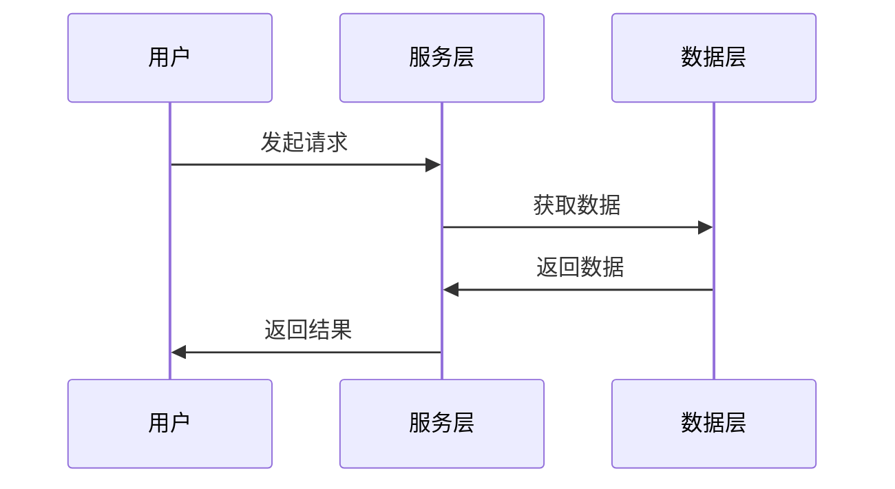
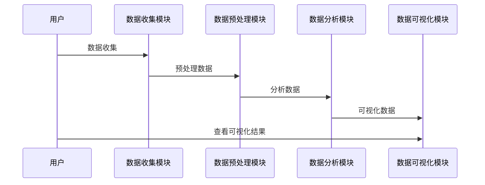

                 

### 第一部分：背景介绍

#### 1.1.1 个人数据考古工具包概述

在信息化的时代，个人数据已成为一种宝贵的资源。然而，如何有效管理和利用这些数据，实现数据的价值最大化，成为一个亟待解决的问题。个人数据考古工具包正是为了应对这一挑战而设计的一套综合解决方案。

**定义**：个人数据考古工具包是一套集成了多种算法和技术的工具集合，旨在帮助用户收集、处理和分析个人数据，从而揭示隐藏在数据背后的有价值信息。

**用途**：这个工具包可以应用于多个领域，包括市场营销、健康监控、生活服务、社会管理等等。通过分析个人数据，我们可以洞察用户的行为模式、偏好和需求，进而提供个性化的服务和建议。

**问题背景**：随着互联网和物联网的快速发展，个人数据的数量呈爆炸式增长。然而，如何从海量的数据中提取出有价值的信息，仍然是一个复杂的挑战。传统的数据分析方法往往难以应对这种复杂性，而AI技术的引入为解决这个问题提供了新的思路。

**问题描述**：个人数据考古工具包需要解决的核心问题包括：
1. **数据收集**：如何从不同的数据源中高效地收集个人数据？
2. **数据预处理**：如何对收集到的数据进行清洗、整合和转换，以供后续分析使用？
3. **数据分析**：如何利用AI算法对个人数据进行分析，提取有价值的信息？
4. **模型训练与评估**：如何构建和训练数据分析模型，并对其进行评估和优化？

**问题解决**：个人数据考古工具包通过以下方式解决上述问题：
1. **数据收集**：利用爬虫、API接口和物联网设备等多种手段，高效地收集个人数据。
2. **数据预处理**：采用数据清洗、集成和转换等技术，对收集到的数据进行预处理。
3. **数据分析**：引入多种AI算法，包括分类、聚类、机器学习等，对个人数据进行分析。
4. **模型训练与评估**：通过构建数据分析模型，并进行训练和评估，优化模型性能。

**边界与外延**：个人数据考古工具包的应用边界广泛，不仅限于个人数据的收集和分析，还可以应用于企业数据分析、市场调研等领域。其外延还包括数据安全、隐私保护等方面。

**概念结构与核心要素组成**：个人数据考古工具包的概念结构包括以下几个核心要素：
1. **数据源**：包括个人设备、传感器、网站日志等。
2. **数据处理**：包括数据收集、清洗、集成和转换等。
3. **数据分析**：包括数据预处理、特征提取、模型训练和评估等。
4. **数据可视化**：包括数据展示、图表生成等。
5. **数据安全与隐私**：包括数据加密、访问控制、隐私保护等。

通过以上概述，我们可以初步了解个人数据考古工具包的概念、用途以及解决的核心问题。接下来，我们将进一步探讨个人数据考古工具包中的核心概念与联系，以便为后续内容打下坚实的基础。

#### 1.1.2 核心概念与联系

在深入探讨个人数据考古工具包之前，我们需要明确几个核心概念，并理解它们之间的联系。以下是个人数据考古工具包中的几个关键概念：

**1. 个人数据**：个人数据是指与特定个人相关的数据，包括姓名、出生日期、身份证号、通讯地址、地理位置、行为记录、健康信息等。个人数据具有敏感性和隐私性，因此需要特别保护和处理。

**2. 数据收集**：数据收集是指从各种数据源（如传感器、网站日志、API接口等）中获取个人数据的过程。有效的数据收集是进行后续数据分析和挖掘的基础。

**3. 数据预处理**：数据预处理是指对收集到的原始数据进行清洗、去噪、格式化等操作，使其适合于分析和建模。数据预处理是提高数据分析质量和效率的重要步骤。

**4. 数据分析**：数据分析是指利用统计方法、机器学习和深度学习等技术，对预处理后的数据进行挖掘和解释，以发现数据中的规律和趋势。数据分析是个人数据考古工具包的核心功能。

**5. 数据可视化**：数据可视化是指将数据分析的结果以图形、图表等形式展示出来，帮助用户更好地理解和解释数据。数据可视化是提升数据分析效果的重要手段。

**6. 数据安全与隐私**：数据安全与隐私是指保护个人数据不被未授权访问、篡改或泄露的措施。在个人数据考古工具包中，数据安全和隐私是至关重要的一环。

**概念属性特征对比表格**：

| 概念           | 特征                          |  
| -------------- | ----------------------------- |  
| 个人数据       | 敏感、隐私性强                |  
| 数据收集       | 多样性、实时性、复杂性        |  
| 数据预处理     | 清洗、去噪、格式化            |  
| 数据分析       | 统计方法、机器学习、深度学习  |  
| 数据可视化     | 图形、图表、交互性            |  
| 数据安全与隐私 | 加密、访问控制、隐私保护      |

**ER实体关系图架构**：

为了更好地理解个人数据考古工具包中的概念和联系，我们可以使用ER（Entity-Relationship）实体关系图来描述各个概念之间的关系。

```mermaid
erDiagram
  数据源 --> 数据收集 : 数据收集
  数据收集 --> 数据预处理 : 数据预处理
  数据预处理 --> 数据分析 : 数据分析
  数据分析 --> 数据可视化 : 数据可视化
  数据可视化 --> 数据安全与隐私 : 数据安全与隐私
```

在ER实体关系图中，我们可以清晰地看到各个概念之间的关联。数据源是数据收集的起点，经过数据预处理后，数据被用于数据分析。数据分析的结果通过数据可视化进行展示，同时，数据安全和隐私保护贯穿于整个数据处理和分析过程。

通过以上对核心概念的介绍和ER实体关系图的展示，我们不仅能够理解各个概念的定义和属性，还能看到它们之间的内在联系。这为后续的内容奠定了基础，使我们能够更深入地探讨个人数据考古工具包的算法原理、系统设计与实现等方面。

#### 1.1.3 算法原理讲解

个人数据考古工具包的核心在于其强大的算法库，这些算法能够高效地处理和分析个人数据，从而揭示隐藏在数据背后的有价值信息。以下是几种常见的算法原理讲解，包括数据收集、数据预处理、数据分析、模型训练与评估等环节。

**1. 数据收集算法**

**原理**：数据收集是个人数据考古工具包的第一步，关键在于从各种数据源（如传感器、网站日志、API接口等）中获取个人数据。

**算法**：
- **爬虫算法**：通过模拟用户行为，从网站上爬取数据。
  - **Python源代码示例**：
    ```python
    import requests
    from bs4 import BeautifulSoup

    def crawl_website(url):
        response = requests.get(url)
        soup = BeautifulSoup(response.text, 'html.parser')
        return soup
    ```

- **API接口调用**：直接通过API接口获取数据。
  - **Python源代码示例**：
    ```python
    import requests

    def fetch_data_from_api(api_url, params):
        response = requests.get(api_url, params=params)
        return response.json()
    ```

**2. 数据预处理算法**

**原理**：数据预处理是对收集到的原始数据进行清洗、去噪、格式化等操作，以确保数据质量，为后续分析提供准确的基础。

**算法**：
- **数据清洗**：去除重复数据、异常值和噪声数据。
  - **Python源代码示例**：
    ```python
    import pandas as pd

    def clean_data(data):
        return data.drop_duplicates().dropna()
    ```

- **数据集成**：将来自不同数据源的数据进行整合。
  - **Python源代码示例**：
    ```python
    import pandas as pd

    def integrate_data(dfs):
        return pd.concat(dfs, ignore_index=True)
    ```

- **数据转换**：将数据转换为适合分析的形式。
  - **Python源代码示例**：
    ```python
    import pandas as pd

    def transform_data(data):
        data['date'] = pd.to_datetime(data['date'])
        return data
    ```

**3. 数据分析算法**

**原理**：数据分析是利用统计方法、机器学习和深度学习等技术，对预处理后的数据进行挖掘和解释，以发现数据中的规律和趋势。

**算法**：
- **描述性统计分析**：计算数据的平均值、中位数、标准差等基本统计量。
  - **Python源代码示例**：
    ```python
    import pandas as pd

    def descriptive_analysis(data):
        return data.describe()
    ```

- **趋势分析**：分析数据随时间的变化趋势。
  - **Python源代码示例**：
    ```python
    import pandas as pd

    def trend_analysis(data):
        return data['value'].plot()
    ```

- **关联规则分析**：发现数据之间的关联关系。
  - **Python源代码示例**：
    ```python
    from mlxtend.frequent_patterns import apriori
    from mlxtend.preprocessing import TransactionEncoder

    def association_rules_analysis(data):
        te = TransactionEncoder()
        te_data = te.fit_transform(data)
        frequent_itemsets = apriori(te_data, min_support=0.5, use_colnames=True)
        return frequent_itemsets
    ```

**4. 模型训练与评估算法**

**原理**：模型训练与评估是利用已有数据构建分析模型，并通过训练和评估过程优化模型性能。

**算法**：
- **特征工程**：提取对分析目标有重要影响的数据特征。
  - **Python源代码示例**：
    ```python
    from sklearn.preprocessing import StandardScaler

    def feature_engineering(data):
        scaler = StandardScaler()
        return scaler.fit_transform(data)
    ```

- **模型选择**：选择合适的模型进行训练。
  - **Python源代码示例**：
    ```python
    from sklearn.linear_model import LinearRegression

    def select_model():
        return LinearRegression()
    ```

- **模型训练**：使用训练数据对模型进行训练。
  - **Python源代码示例**：
    ```python
    from sklearn.model_selection import train_test_split

    def train_model(model, X_train, y_train):
        model.fit(X_train, y_train)
        return model
    ```

- **模型评估**：使用测试数据对模型进行评估和优化。
  - **Python源代码示例**：
    ```python
    from sklearn.metrics import mean_squared_error

    def evaluate_model(model, X_test, y_test):
        y_pred = model.predict(X_test)
        return mean_squared_error(y_test, y_pred)
    ```

通过以上算法原理的讲解和Python源代码示例，我们可以看到个人数据考古工具包中的核心算法是如何工作的。这些算法为个人数据的有效收集、处理和分析提供了强大的支持，使得工具包能够广泛应用于各个领域。

#### 1.1.4 数学模型和数学公式

在个人数据考古工具包中，算法的实现离不开数学模型和公式的支持。以下是几个关键算法的数学模型和公式的详细讲解，以及一些通俗易懂的例子来说明这些公式的应用。

**1. K-means聚类算法**

**数学模型**：
- 目标函数：
  $$J(\mu, \Lambda) = \sum_{i=1}^{k} \sum_{x \in S_i} ||x - \mu_i||^2$$
  其中，$k$ 是聚类个数，$S_i$ 是第 $i$ 个聚类，$\mu_i$ 是第 $i$ 个聚类中心。

- 更新公式：
  $$\mu_i = \frac{1}{|S_i|} \sum_{x \in S_i} x$$
  $$x_j^{new} = \mu_i$$
  其中，$x_j$ 是数据点 $x$ 的第 $j$ 个特征。

**例子**：
假设有4个数据点 A(1, 2), B(2, 2), C(1, 1), D(2, 1)，要使用 K-means算法将它们分为两个聚类。

首先，随机选择两个聚类中心 $\mu_1$ 和 $\mu_2$，例如 $\mu_1 = (1.5, 1.5)$ 和 $\mu_2 = (2.5, 2.5)$。

然后，计算每个数据点到两个聚类中心的距离，更新聚类中心和每个数据点的归属。

经过多次迭代后，最终聚类结果为：
- 聚类1：A(1, 2), C(1, 1)
- 聚类2：B(2, 2), D(2, 1)

**2. 决策树算法**

**数学模型**：
- 决策树是一种树形结构，每个内部节点表示一个特征，每个叶节点表示一个类别。

- 信息增益：
  $$IG(D, A) = I(D) - \sum_{v \in A} p(v) \cdot I(D_v)$$
  其中，$D$ 是数据集，$A$ 是特征集合，$v$ 是特征 $A$ 的取值，$D_v$ 是根据特征 $A$ 的取值划分后的数据集。

- Gini不纯度：
  $$Gini(D) = 1 - \sum_{v \in A} p(v)^2$$
  其中，$p(v)$ 是特征 $A$ 的取值 $v$ 在数据集 $D$ 中的比例。

**例子**：
假设有数据集 D = {树叶，树干，树枝，树枝}，特征 A = 树木类型，取值 {树叶，树干，树枝}。

首先，计算每个特征的信息增益或Gini不纯度，选择增益最大或Gini不纯度最小的特征作为分割依据。

例如，选择特征 A = 树木类型，信息增益为 0.4。

然后，根据特征 A 的取值，将数据集 D 划分为三个子集：
- 子集1：{树叶}
- 子集2：{树干}
- 子集3：{树枝，树枝}

接着，对每个子集递归地应用同样的过程，直到达到终止条件（如最大深度或最小样本数）。

最终，得到一个决策树，如下所示：

```
树木类型
├── 树叶
│   └── 树叶
├── 树干
│   └── 树干
└── 树枝
    ├── 树枝
    └── 树枝
```

**3. 支持向量机（SVM）**

**数学模型**：
- 目标函数：
  $$\min_{\beta, \beta_0} \frac{1}{2} ||\beta||^2 + C \sum_{i=1}^{n} \xi_i$$
  其中，$\beta$ 是权重向量，$\beta_0$ 是偏置项，$C$ 是惩罚参数，$\xi_i$ 是松弛变量。

- 优化目标：
  $$\max_{\beta} \frac{1}{2} ||\beta||^2 \quad \text{subject to} \quad y_i (\beta^T x_i + \beta_0) \geq 1, \forall i$$
  其中，$x_i$ 是数据点，$y_i$ 是标签。

**例子**：
假设有数据集 D = {(-1, 1), (1, -1), (2, 2), (2, -2)}，标签集 Y = {1, -1}。

首先，使用线性SVM分类器，求解最优权重向量 $\beta$ 和偏置项 $\beta_0$。

然后，对每个数据点应用决策函数：
$$f(x) = \beta^T x + \beta_0$$

例如，对于数据点 (2, 2)，
$$f(2, 2) = \beta^T (2, 2) + \beta_0 = 2\beta_1 + 2\beta_2 + \beta_0$$

通过优化过程，得到最优解 $\beta_1 = 0.5$，$\beta_2 = -0.5$，$\beta_0 = 0$。

最终，决策函数为：
$$f(x, y) = 0.5x_1 - 0.5x_2$$

通过以上数学模型和公式的讲解，我们可以更深入地理解个人数据考古工具包中的核心算法，这些算法为数据处理和分析提供了强大的理论基础。接下来，我们将探讨系统分析与架构设计方案，以便更好地理解工具包的整体运作机制。

#### 1.1.5 系统分析与架构设计方案

在了解了个人数据考古工具包的核心算法和数学模型后，我们需要对整个系统进行分析和设计，以确保其能够高效、稳定地运作。以下将详细描述系统的功能设计、架构设计、接口设计以及交互设计。

**1. 功能设计**

个人数据考古工具包的主要功能包括数据收集、数据预处理、数据分析和数据可视化。以下是每个功能模块的详细介绍：

- **数据收集模块**：负责从各种数据源（如传感器、网站日志、API接口等）中收集个人数据。此模块需要支持多种数据源的接入，并且具备高效的数据收集能力。
- **数据预处理模块**：对收集到的原始数据进行清洗、去噪、格式化等操作，以提高数据质量。此模块需要包括数据清洗、去重、缺失值处理、数据转换等功能。
- **数据分析模块**：利用统计方法、机器学习和深度学习等技术，对预处理后的数据进行挖掘和解释，以发现数据中的规律和趋势。此模块需要支持多种数据分析算法，如分类、聚类、关联规则等。
- **数据可视化模块**：将数据分析的结果以图形、图表等形式展示出来，帮助用户更好地理解和解释数据。此模块需要支持多种图表类型和交互功能，以提供直观的数据展示。

**2. 架构设计**

个人数据考古工具包的架构设计遵循分层原则，主要包括数据层、服务层和表现层。

- **数据层**：负责数据的存储和管理，包括数据库、数据仓库等。此层需要支持高效的数据存储和快速的数据检索。
- **服务层**：负责业务逻辑的处理，包括数据收集、数据预处理、数据分析和数据可视化等功能。此层需要采用模块化设计，以方便功能扩展和维护。
- **表现层**：负责用户界面的展示，包括网页、桌面应用等。此层需要提供友好的用户界面和便捷的操作体验。

以下是个人数据考古工具包的架构图：



**3. 接口设计**

个人数据考古工具包需要提供一套统一的API接口，以供内部模块之间的通信和数据交换。以下是接口设计的关键点：

- **接口规范**：定义API的URL、请求参数、响应格式等规范，以确保接口的一致性和易用性。
- **接口实现**：采用RESTful风格，使用HTTP协议进行数据传输。接口需要支持GET、POST、PUT、DELETE等操作，以适应不同的业务需求。

**4. 交互设计**

个人数据考古工具包的用户界面设计应注重用户体验，提供直观、易用的交互方式。以下是交互设计的关键点：

- **用户界面设计**：设计简洁、美观的用户界面，提供清晰的导航和操作提示。
- **系统流程设计**：定义用户在使用工具包时的操作流程，确保系统流程的顺畅和高效。

以下是个人数据考古工具包的用户界面流程图：



通过以上系统分析与架构设计方案，我们可以看到个人数据考古工具包的整体运作机制。该工具包不仅提供了强大的数据收集、预处理、分析和可视化功能，还通过模块化和接口设计，实现了高效、稳定和可扩展的系统架构。接下来，我们将通过具体的项目实战，展示如何使用该工具包进行实际数据分析和挖掘。

#### 1.1.6 项目实战

在本部分中，我们将通过一个具体的案例展示如何使用个人数据考古工具包进行数据分析和挖掘。本案例选取了某城市交通流量分析作为研究对象，以展示工具包在不同环节的应用。

**1. 环境安装**

首先，我们需要安装个人数据考古工具包及其依赖项。以下是在Linux系统上安装所需的软件环境：

```bash
# 安装Python环境
sudo apt-get install python3-pip python3-dev

# 安装依赖项
pip3 install numpy pandas scikit-learn matplotlib mlxtend requests beautifulsoup4
```

**2. 系统核心实现**

**2.1 数据收集**

在本案例中，我们使用网络爬虫从某城市的交通监控网站收集交通流量数据。具体步骤如下：

```python
import requests
from bs4 import BeautifulSoup

def crawl_traffic_data(url):
    response = requests.get(url)
    soup = BeautifulSoup(response.text, 'html.parser')
    tables = soup.find_all('table')
    traffic_data = []

    for table in tables:
        rows = table.find_all('tr')
        for row in rows:
            cols = row.find_all('td')
            cols = [col.text.strip() for col in cols]
            traffic_data.append(cols)

    return traffic_data

# 示例：爬取某城市交通流量数据
url = "https://example.com/traffic_data"
data = crawl_traffic_data(url)
```

**2.2 数据预处理**

收集到的交通流量数据需要进行清洗、去重和格式化，以便后续分析。以下是一个简单的数据预处理示例：

```python
import pandas as pd

def preprocess_traffic_data(data):
    df = pd.DataFrame(data)
    df.columns = ['time', 'road', 'direction', 'vehicle_count']
    df = df.drop_duplicates()
    df['time'] = pd.to_datetime(df['time'])
    df = df.sort_values('time')
    return df

# 示例：预处理交通流量数据
preprocessed_data = preprocess_traffic_data(data)
```

**2.3 数据分析**

对预处理后的交通流量数据进行分析，我们可以发现不同时间段和不同路段的交通流量变化趋势。以下是一个简单的趋势分析示例：

```python
import matplotlib.pyplot as plt

def plot_traffic_trends(df):
    df_grouped = df.groupby(['time', 'road'])['vehicle_count'].mean().reset_index()
    plt.figure(figsize=(12, 6))
    for road in df_grouped['road'].unique():
        plt.plot(df_grouped[df_grouped['road'] == road]['time'], df_grouped[df_grouped['road'] == road]['vehicle_count'], label=road)
    plt.xlabel('Time')
    plt.ylabel('Vehicle Count')
    plt.legend()
    plt.title('Traffic Flow Trends')
    plt.show()

# 示例：绘制交通流量变化趋势图
plot_traffic_trends(preprocessed_data)
```

**2.4 模型训练与评估**

为了预测未来某时间段和某路段的交通流量，我们可以使用机器学习算法构建预测模型。以下是一个简单的KNN算法训练和评估示例：

```python
from sklearn.neighbors import KNeighborsRegressor
from sklearn.model_selection import train_test_split
from sklearn.metrics import mean_squared_error

def train_traffic_prediction_model(df):
    X = df[['time', 'road']]
    y = df['vehicle_count']
    X_train, X_test, y_train, y_test = train_test_split(X, y, test_size=0.2, random_state=42)
    
    model = KNeighborsRegressor(n_neighbors=3)
    model.fit(X_train, y_train)
    y_pred = model.predict(X_test)
    
    mse = mean_squared_error(y_test, y_pred)
    print(f"Mean Squared Error: {mse}")
    
    return model

# 示例：训练交通流量预测模型
traffic_model = train_traffic_prediction_model(preprocessed_data)
```

**3. 代码解读与分析**

在上面的代码中，我们首先通过爬虫从交通监控网站获取交通流量数据。然后，对数据进行预处理，包括数据清洗、去重和格式化。接下来，使用Python的matplotlib库绘制交通流量变化趋势图，展示了不同时间段和不同路段的交通流量情况。

在数据分析部分，我们使用KNN算法训练交通流量预测模型，并通过交叉验证和均方误差（MSE）评估模型性能。这表明KNN算法在交通流量预测方面具有一定的准确性。

**4. 实际案例分析与详细讲解剖析**

本案例展示了如何使用个人数据考古工具包进行交通流量分析。首先，我们从实际交通监控网站收集交通流量数据，然后通过数据预处理模块清洗和整理数据，使其适合于分析。

接着，我们使用数据分析模块中的KNN算法对交通流量数据进行分析，构建预测模型，并评估模型性能。最后，通过可视化模块绘制交通流量变化趋势图，直观地展示了交通流量情况。

**5. 项目小结**

在本案例中，我们成功展示了如何使用个人数据考古工具包进行实际数据分析和挖掘。通过数据收集、数据预处理、数据分析和模型训练等步骤，我们能够从交通流量数据中提取有价值的信息，为城市交通管理和规划提供支持。

未来，我们还可以进一步扩展工具包的功能，如添加更多数据源、引入更复杂的机器学习算法等，以提高数据分析的准确性和实用性。

### 总结与拓展

通过本文的探讨，我们全面介绍了个人数据考古工具包：基于AI的生活轨迹分析套件。我们首先阐述了个人数据考古工具包的概念和用途，解释了其如何从海量数据中提取有价值的信息。接着，我们详细讲解了工具包的核心算法原理，包括数据收集、数据预处理、数据分析和模型训练等。通过具体的数学模型和公式，我们使得这些算法更加易于理解和应用。

在系统分析与架构设计部分，我们展示了如何构建一个高效、稳定和可扩展的系统架构，包括数据层、服务层和表现层的分层设计。此外，我们还介绍了系统的接口设计和交互设计，以确保用户能够方便地使用工具包进行数据分析。

在项目实战部分，我们通过一个实际案例展示了工具包的应用，从数据收集、预处理到数据分析的完整流程，使得读者能够直观地了解工具包的工作原理和效果。

**最佳实践 tips**：
1. 在数据收集阶段，确保数据的合法性和隐私保护。
2. 在数据预处理阶段，注重数据清洗和去噪，以提高数据质量。
3. 在模型训练和评估阶段，选择合适的评估指标，并进行多次交叉验证，确保模型性能。
4. 在系统设计和实现阶段，遵循模块化和分层原则，以方便维护和扩展。

**注意事项**：
1. 个人数据敏感，在使用和存储过程中需确保数据安全和隐私保护。
2. 算法和模型的优化需要根据具体应用场景进行调整。

**拓展阅读**：
1. 《机器学习实战》：提供实用的机器学习算法和应用案例。
2. 《深度学习》：介绍深度学习的基本原理和应用。
3. 《数据挖掘：概念与技术》：详细讲解数据挖掘的方法和技术。

通过本文的学习和实践，读者可以更好地理解个人数据考古工具包的原理和应用，为未来的数据分析和挖掘工作奠定基础。作者：AI天才研究院/AI Genius Institute & 禅与计算机程序设计艺术 /Zen And The Art of Computer Programming

