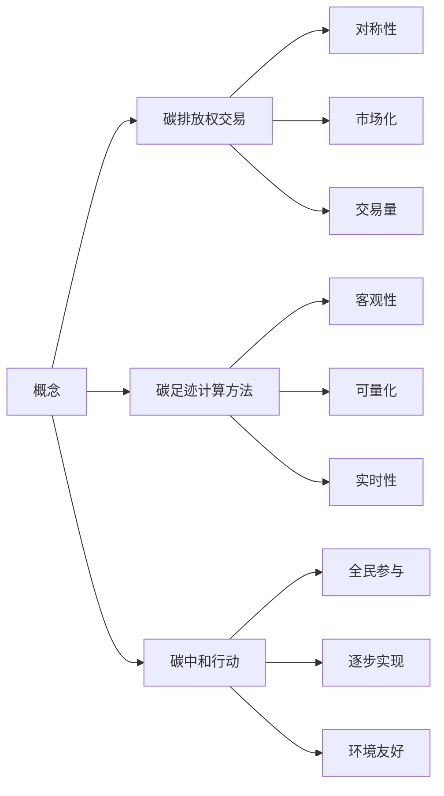
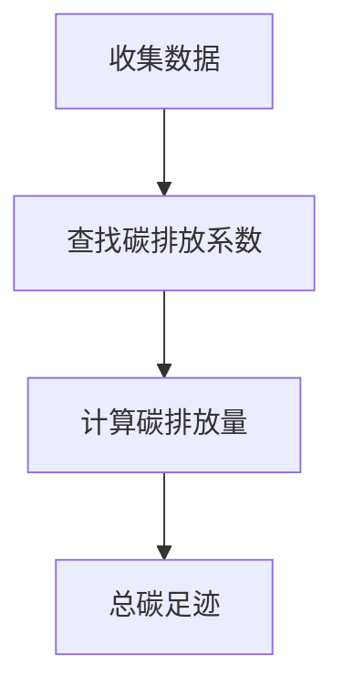

                 

### 问题背景

**全球气候变化的现状**

随着工业革命的推进，人类活动产生的温室气体如二氧化碳、甲烷等急剧增加，导致地球气候系统发生了显著变化。根据联合国政府间气候变化专门委员会（IPCC）的报告，全球平均温度在过去一个世纪里已经上升了约1.1摄氏度。这种升温不仅引起了极端天气事件如飓风、干旱、洪水等频率的增加，还对生态系统、农业生产和人类健康产生了深远影响。

**个人碳足迹的影响**

个人碳足迹是指个人在日常生活中产生的二氧化碳等温室气体排放总量。个人碳足迹的大小与生活方式、饮食习惯、交通方式等紧密相关。据统计，全球每个人的平均碳足迹约为4.5吨二氧化碳当量（tCO2e）。然而，高收入国家如美国、欧洲部分国家的个人碳足迹远高于这一平均值，而低收入国家的个人碳足迹相对较低。因此，个人碳足迹在应对气候变化中的角色不容忽视。

**碳中和的定义与意义**

碳中和（Carbon Neutrality）是指在一定时间内，通过减少碳排放和增加碳吸收（如植树造林、碳捕集与封存）来达到净零碳排放的状态。实现碳中和的意义在于，它不仅有助于减缓全球气候变暖的速度，还能促进可持续发展，保护生态环境，提高公众对气候变化问题的认识和参与度。

### 碳排放权交易

**定义与核心概念**

碳排放权交易（Carbon Trading）是一种通过市场机制来减少温室气体排放的方法。其基本原理是，政府或企业为特定行业设定碳排放限额，企业需要购买或出售碳排放权以符合这些限额。碳排放权交易市场通常由两个市场组成：配额交易市场和项目交易市场。

**配额交易市场**

在配额交易市场中，政府或监管机构会根据国家或地区的气候目标和减排目标，为每个企业设定一个碳排放限额。企业必须确保其总排放量不超过这一限额，否则就需要从市场上购买额外的碳排放配额。这种机制促使企业采取减排措施，以避免额外的成本。

**项目交易市场**

项目交易市场则允许企业通过投资或参与减排项目来获得碳排放配额。这些项目通常包括可再生能源发电、森林保护和碳捕捉与封存等。企业通过投资这些项目，不仅能够减少自身排放，还能获得额外的碳排放权。

**市场机制与减排效果**

碳排放权交易市场通过供求关系和价格机制来实现减排目标。当碳排放配额供不应求时，价格上升，企业面临更大的减排压力，从而促使技术创新和减排措施的采取。此外，碳排放权交易市场还可以激励企业跨行业、跨国界合作，共同应对气候变化。

### 碳足迹计算方法

**核心概念与计算步骤**

碳足迹计算方法是一种评估个人或组织温室气体排放的方法。其核心概念是量化活动产生的碳排放量，以碳足迹（Carbon Footprint）表示。碳足迹计算通常包括以下几个步骤：

1. **活动数据收集**：记录个人或组织的各种活动数据，如能源消耗、交通出行、饮食消费等。
2. **碳排放系数查找**：根据各类活动对应的碳排放系数，将活动数据转换为碳排放量。
3. **计算总碳足迹**：将各类活动的碳排放量相加，得到总的碳足迹。
4. **分析结果**：根据计算结果分析碳足迹的构成，识别减排潜力。

**碳排放系数的来源与可靠性**

碳排放系数（Carbon Factor）是指每单位活动产生的碳排放量。这些系数通常来源于权威的气候变化数据库，如全球碳排放数据库（CDIAC）和联合国气候变化框架公约（UNFCCC）。碳排放系数的准确性直接影响到碳足迹计算结果的可靠性。因此，定期更新和验证碳排放系数至关重要。

**计算方法的应用与挑战**

碳足迹计算方法在实际应用中面临着数据收集困难、碳排放系数不一致等挑战。例如，交通出行中的碳排放量计算需要详细记录每个人的出行距离、交通工具类型和油耗等信息。此外，不同地区和行业的碳排放系数可能存在差异，导致计算结果的不一致性。因此，需要开发更为精确和统一的碳足迹计算工具和方法。

### 碳中和行动的边界与外延

**定义与核心概念**

碳中和行动（Carbon Neutrality Actions）是指个人或组织通过一系列措施来减少碳排放、增加碳吸收，以实现净零碳排放的目标。碳中和行动不仅包括日常生活中的环保行为，还涉及到政策和技术的支持。

**个人层面的边界**

在个人层面，碳中和行动的边界包括以下几个方面：

1. **生活方式的调整**：如减少使用一次性塑料制品、推广环保出行方式、优化家庭能源消耗等。
2. **消费行为的改变**：如购买低碳产品、减少食物浪费、选择低碳交通方式等。
3. **教育和宣传**：提高公众对气候变化和碳中和的认识，鼓励更多人参与。

**组织层面的边界**

在组织层面，碳中和行动的边界包括：

1. **企业减排计划**：制定减排目标，采取节能减排措施，如提高能源效率、使用可再生能源、优化供应链等。
2. **碳足迹管理**：建立碳足迹计算体系，定期监测和报告碳排放情况。
3. **社会责任**：通过社会责任报告等方式，向社会公开碳中和行动的进展和成果。

**碳中和行动的外延**

碳中和行动的外延涉及到政策、技术和国际合作等多个方面：

1. **政策支持**：政府制定和实施碳排放法规、碳交易政策等，为企业提供政策激励。
2. **技术创新**：推动碳捕捉与封存技术、可再生能源技术等研发和应用。
3. **国际合作**：通过国际协议和合作，共同应对全球气候变化挑战。

**实际案例分析**

以某企业为例，其碳中和行动可以从以下几个方面展开：

1. **能源转型**：企业通过投资太阳能、风能等可再生能源项目，减少对化石燃料的依赖。
2. **绿色供应链**：与供应商合作，推动供应链环节的低碳化。
3. **员工培训**：开展碳中和相关的培训和宣传活动，提高员工的环保意识。

### 概念属性特征对比表格

| 概念             | 属性1 | 属性2 | 属性3 |
|----------------|------|------|------|
| 碳排放权交易     | 对称性 | 市场化 | 交易量 |
| 碳足迹计算方法   | 客观性 | 可量化 | 实时性 |
| 碳中和行动       | 全民参与 | 逐步实现 | 环境友好 |

### 概念结构与核心要素组成

### 本章小结

本章详细介绍了碳中和相关的重要概念，包括碳排放权交易、碳足迹计算方法以及碳中和行动。通过对比这些概念的不同属性和结构，我们能够更深入地理解碳中和行动的内涵和实际应用。接下来，我们将进一步探讨日常生活中如何实施碳中和行动，帮助个人和组织实现低碳生活。

### 食品与饮料

**食品的选择与采购**

在日常生活中，食品的选择和采购是我们能够直接影响碳排放的重要环节。首先，选择当地生产和季节性的食品可以显著减少食品运输过程中产生的碳排放。根据一项研究，食品运输的碳排放量占家庭总碳足迹的约20%。此外，购买有机食品也有助于减少农药和化肥的使用，从而降低农业生产过程中的碳排放。

**饮料的碳排放分析**

饮料的碳排放主要来自生产、运输和包装环节。瓶装水和碳酸饮料的碳排放量相对较高，因为它们的包装和运输成本较大。相比之下，茶叶、咖啡和牛奶等液态饮料的碳排放量较低。为了降低碳排放，消费者可以选择购买无包装或简易包装的饮料，减少塑料瓶的使用。

**碳排放计算方法与应用**

要准确计算食品和饮料的碳排放，我们需要使用详细的碳排放系数。以下是一个简单的碳排放计算方法：

1. **收集数据**：记录购买的各种食品和饮料的重量或体积。
2. **查找碳排放系数**：在权威数据库中查找每种食品和饮料的碳排放系数（每公斤或每升的碳排放量）。
3. **计算总碳排放量**：将每种食品和饮料的重量或体积乘以其碳排放系数，再将所有结果相加，得到总的碳足迹。

例如，假设某人一个月购买了10公斤的有机鸡肉、20升的牛奶和5公斤的咖啡豆，根据相应的碳排放系数，我们可以计算出这些食品的碳排放总量。

**应用案例**

以购买10公斤的有机鸡肉为例，假设每公斤有机鸡肉的碳排放系数为10公斤CO2e，则总碳排放量为：

\[ 10 \text{公斤} \times 10 \text{公斤CO2e/公斤} = 100 \text{公斤CO2e} \]

通过这样的计算方法，个人可以更好地了解自己的饮食行为对碳排放的影响，并采取相应的减排措施。

### 交通运输

**绿色出行方式的推广**

绿色出行方式如步行、骑行和公共交通是减少碳排放的重要手段。例如，骑自行车每公里的碳排放量远低于汽车，而公共交通工具如地铁和公交车由于载客量大，单位人均碳排放量更低。为了鼓励绿色出行，许多城市推出了自行车共享系统和公共交通优惠政策，如北京和上海等城市。

**交通工具的碳排放计算**

交通工具的碳排放计算需要考虑车辆的油耗、行驶距离以及燃料类型的碳排放系数。以下是一个简单的计算方法：

1. **收集数据**：记录交通出行的距离和频率。
2. **查找碳排放系数**：根据不同的交通工具和燃料类型，查找相应的碳排放系数（每公里或每升的碳排放量）。
3. **计算总碳排放量**：将出行距离乘以碳排放系数，得到总的碳足迹。

例如，假设某人一个月驾车行驶了1000公里，汽车的平均油耗为8升/百公里，汽油的碳排放系数为2.31公斤CO2e/升，则总碳排放量为：

\[ 1000 \text{公里} \times 8 \text{升/百公里} \times 2.31 \text{公斤CO2e/升} = 18,480 \text{公斤CO2e} \]

**碳排放减量策略**

为了减少交通出行的碳排放，以下是一些有效的策略：

1. **优化出行计划**：减少不必要的短途出行，合并多次出行为一次。
2. **使用新能源汽车**：选择电动车或混合动力车，这些车辆的碳排放量显著低于传统燃油车。
3. **共享出行**：通过拼车或共享单车减少单车出行次数。

**实际案例分析**

例如，某人在一个月内减少了10%的驾车出行，改为骑自行车或乘坐公共交通工具，他减少了大约900公斤的碳排放。这种改变不仅有助于个人碳足迹的减少，也为城市减少了交通拥堵和空气污染。

### 家庭能源消耗

**家电的选择与使用**

家电的选择和使用对家庭能源消耗和碳排放有重要影响。高能效家电如节能灯泡、智能恒温器、高效冰箱等可以显著降低能源消耗。例如，使用LED灯泡代替传统白炽灯，每年可以减少约300公斤的碳排放。此外，合理安排家电的使用时间，如晚上低谷时段使用洗衣机和烘干机，可以进一步降低碳排放。

**家庭能源的碳排放计算**

家庭能源的碳排放计算需要考虑电费、燃气费等能源消耗数据，以及相应的碳排放系数。以下是一个简单的计算方法：

1. **收集数据**：记录家庭一个月的电力和燃气消耗量。
2. **查找碳排放系数**：根据当地的电力和燃气碳排放系数，计算每千瓦时（kWh）或每立方米（m³）的碳排放量。
3. **计算总碳排放量**：将能源消耗量乘以其碳排放系数，得到总的碳足迹。

例如，假设某家庭一个月的电力消耗为300千瓦时，电力碳排放系数为0.427公斤CO2e/千瓦时；燃气消耗为200立方米，燃气碳排放系数为2.8公斤CO2e/立方米，则总碳排放量为：

\[ 300 \text{千瓦时} \times 0.427 \text{公斤CO2e/千瓦时} + 200 \text{立方米} \times 2.8 \text{公斤CO2e/立方米} = 128.1 \text{公斤CO2e} + 560 \text{公斤CO2e} = 688.1 \text{公斤CO2e} \]

**能源消耗减量措施**

为了减少家庭能源消耗和碳排放，以下是一些有效的措施：

1. **节能改造**：安装节能设备，如节能灯具、高效热水器等。
2. **合理调节**：在夏季和冬季合理调节室内温度，减少不必要的空调和取暖能耗。
3. **行为改变**：养成良好的节能习惯，如及时关闭电器设备，合理使用节能模式。

**实际案例分析**

例如，某家庭通过安装节能灯具和优化家电使用时间，将每月的电力消耗减少了15%，从而减少了约200公斤的碳排放。这种改变不仅有助于减少家庭能源开支，也对环境保护产生了积极影响。

### 消费行为

**碳排放与消费模式**

消费行为对碳排放有着显著影响。高消费模式如频繁购买奢侈品、大量购买一次性产品等会导致大量的碳排放。相反，简约生活和二手市场购买可以显著减少碳排放。例如，购买二手衣服和家具可以减少制造新产品的碳排放，而选择本地产品可以减少运输过程中的碳排放。

**碳排放计算方法在购物中的应用**

在购物过程中，可以使用碳排放计算方法来评估不同消费行为的碳排放影响。以下是一个简单的应用步骤：

1. **收集数据**：记录购买的商品类型和数量。
2. **查找碳排放系数**：根据不同的商品类型和制造过程，查找相应的碳排放系数。
3. **计算总碳排放量**：将每种商品的碳排放量相加，得到总的碳足迹。

例如，假设某人一个月购买了10公斤的肉、5公斤的水果和10公斤的衣物，根据相应的碳排放系数，我们可以计算出这些商品的总碳排放量。

**环保消费意识提升**

提升环保消费意识是减少碳排放的重要途径。以下是一些提升环保消费意识的方法：

1. **教育宣传**：通过学校和社区活动，提高公众对碳排放和环保消费的认识。
2. **政策引导**：政府可以通过环保法规和补贴政策，鼓励消费者选择低碳产品。
3. **科技创新**：开发低碳产品和技术，提高市场的低碳选择。

**实际案例分析**

例如，某消费者通过教育宣传和自我教育，提高了对环保消费的认识。他选择购买当地生产的食品和二手家具，减少了制造新产品和运输过程中的碳排放。这种改变不仅有助于个人碳足迹的减少，也为环境保护做出了贡献。

### 本章小结

通过本章的探讨，我们了解到在日常生活中，食品与饮料的选择、交通运输方式、家庭能源消耗和消费行为都对碳排放有重要影响。通过合理的消费行为和生活方式调整，个人可以显著减少碳足迹，为环境保护和可持续发展做出贡献。下一章将深入探讨碳中和行动的具体策略和方法，帮助个人和组织实现碳中和目标。

## 第三部分：碳中和的行动策略与实现

### 碳中和行动计划

**碳中和目标的设定**

设定碳中和目标是实现碳中和行动的第一步。个人和组织需要明确自己的碳中和目标，例如，某企业可能设定在未来五年内实现全面碳中和。为了确保目标的可实现性，目标应该具有具体性和可测量性。例如，目标可以设定为每年减少10%的碳排放量。

**行动计划的制定**

制定行动计划是实现碳中和目标的关键。行动计划应包括以下步骤：

1. **现状评估**：评估当前碳排放水平和主要排放源。
2. **目标设定**：根据现状评估结果，设定具体的碳中和目标。
3. **减排策略**：制定减排措施，如能源转型、优化生产流程、推广绿色出行等。
4. **实施计划**：明确各阶段的实施步骤和时间表。
5. **监测与报告**：建立碳排放监测和报告系统，定期评估行动计划的效果。

**行动计划的执行与监督**

执行行动计划需要全员参与和持续监督。以下是一些关键点：

1. **培训与沟通**：对员工进行碳中和知识的培训，提高参与度。
2. **激励机制**：设立减排奖励，激励员工积极参与。
3. **定期审查**：定期审查行动计划的效果，及时调整策略。
4. **透明度**：向社会公开碳中和进展和成果，提高公众监督。

### 碳中和工具与方法

**碳足迹计算工具**

碳足迹计算工具是评估个人或组织碳排放量的关键。以下是一些常用的碳足迹计算工具：

1. **碳足迹计算器**：在线碳足迹计算器如“碳足迹计算器（Carbon Footprint Calculator）”可以帮助个人快速计算碳足迹。
2. **企业碳足迹管理系统**：如“碳足迹管理系统（Carbon Footprint Management System）”，适用于企业进行碳排放监控和管理。
3. **移动应用**：如“低碳生活（Low Carbon Life）”，通过手机应用帮助用户跟踪和减少碳排放。

**碳中和应用软件**

碳中和应用软件可以辅助个人和组织实现碳中和目标。以下是一些常用的碳中和应用软件：

1. **低碳计算器（Low Carbon Calculator）**：帮助用户计算日常生活中的碳排放量，并提供减排建议。
2. **碳中和跟踪器（Carbon Neutrality Tracker）**：记录用户碳中和行动的进展，提供数据分析和可视化报告。
3. **碳减排助手（Carbon Reduction Assistant）**：提供定制化的碳中和计划，帮助用户实现个人和组织碳中和目标。

**碳中和行为的评估与改进**

评估碳中和行为的效果是持续改进的关键。以下是一些评估和改进方法：

1. **定期报告**：定期生成碳排放报告，评估减排措施的效果。
2. **数据可视化**：通过数据可视化工具，将碳排放数据呈现为图表和报告，便于分析和理解。
3. **反馈机制**：建立反馈机制，收集用户反馈，不断优化碳中和工具和应用软件。
4. **持续培训**：定期进行碳中和培训，提高员工和环境意识。

### 碳中和社区与组织

**碳中和社区的作用**

碳中和社区在推动个人和组织实现碳中和目标中起着关键作用。以下是一些碳中和社区的作用：

1. **信息共享**：碳中和社区为成员提供碳中和相关的最新信息和资源，促进知识传播。
2. **经验交流**：成员可以分享各自的碳中和经验和成功案例，互相学习借鉴。
3. **行动支持**：碳中和社区可以为成员提供行动支持和资源，如碳足迹计算工具、碳中和项目等。

**碳中和组织的参与**

碳中和组织在推动社会层面碳中和行动中发挥着重要作用。以下是一些碳中和组织的参与方式：

1. **政策倡导**：碳中和组织可以通过游说和政策倡导，推动政府制定和实施更加严格的碳排放法规。
2. **项目支持**：碳中和组织可以资助和推广碳中和项目，如碳捕捉与封存项目、可再生能源项目等。
3. **公众教育**：碳中和组织可以通过公众教育和宣传活动，提高公众对碳中和的认识和参与度。

**碳中和宣传与教育**

宣传和教育是推动碳中和行动的关键。以下是一些宣传和教育的方法：

1. **媒体宣传**：利用电视、广播、报纸、互联网等媒体，广泛宣传碳中和的重要性和具体行动。
2. **学校教育**：将碳中和内容纳入学校课程，提高青少年的环保意识和行动能力。
3. **社区活动**：组织社区活动，如碳中和讲座、环保志愿者活动等，提高公众的参与度和行动意愿。

### 政策与法规支持

**碳中和政策的概述**

碳中和政策是政府推动碳中和行动的重要手段。以下是一些常见的碳中和政策：

1. **碳排放交易政策**：通过建立碳排放交易市场，为企业提供减排激励。
2. **碳税政策**：对高碳排放行业和产品征收碳税，提高碳排放成本。
3. **可再生能源政策**：提供财政补贴和优惠措施，鼓励企业使用可再生能源。

**碳排放标准的制定**

碳排放标准是衡量企业和产品碳排放量的基准。以下是一些常见的碳排放标准：

1. **行业排放标准**：对不同行业设定具体的碳排放限值和减排目标。
2. **产品碳排放标准**：对产品和服务的碳排放量设定标准，鼓励企业开发和推广低碳产品。
3. **温室气体核算标准**：明确温室气体的核算方法和报告要求，确保碳排放数据的准确性和可比性。

**政策对碳中和行动的推动作用**

政策在推动碳中和行动中发挥着关键作用。以下是一些政策对碳中和行动的推动作用：

1. **激励减排**：通过政策激励，鼓励企业和个人采取减排措施，如提供财政补贴、税收减免等。
2. **规范行为**：通过制定排放标准和法规，规范企业和个人碳排放行为，确保减排行动的有效性。
3. **引导投资**：通过政策引导，吸引社会资本和政府资金投资于碳中和项目和技术，推动碳中和行动的开展。

### 本章小结

通过本章的探讨，我们了解到碳中和行动计划、碳中和工具与方法、碳中和社区与组织以及政策与法规支持在实现碳中和目标中的重要性。这些策略和方法不仅有助于个人和组织减少碳排放，还能推动社会层面的环保行动，共同应对气候变化挑战。在下一章中，我们将通过案例分析，进一步了解如何在实际中实施碳中和行动，并提供具体的实践指导。

## 第四部分：案例分析与实践指导

### 案例研究

**碳中和成功案例**

以下是一个个人实现碳中和的成功案例。

**案例背景**：

张先生是一位环保意识较强的上班族，居住在城市中心。他的生活和工作模式较为传统，但近年来，他开始意识到个人碳足迹对环境的影响，并决心采取行动实现碳中和。

**行动步骤**：

1. **饮食调整**：张先生减少了肉类的消费，改为每周两到三次蔬菜和水果，同时选择有机食品，以减少农业生产和运输过程中的碳排放。
2. **交通方式**：他购买了电动自行车，每天上下班骑自行车，减少了私家车的使用。对于长途出行，他选择乘坐公共交通工具。
3. **能源节约**：张先生在家中使用节能灯具，优化家电的使用习惯，如洗衣机和热水器的使用集中在低谷时段，以减少能源消耗。
4. **废物管理**：他实行垃圾分类，减少废物产生，并参与社区的环保志愿者活动，推广环保理念。

**案例分析**：

张先生通过一系列低碳生活方式的改变，成功减少了约75%的碳足迹。以下是对其行动的分析：

1. **饮食调整**：肉类消费的减少不仅减少了碳排放，还有助于改善健康。选择有机食品进一步降低了生产过程中的碳排放。
2. **交通方式**：骑自行车和公共交通工具的使用显著减少了汽车碳排放，同时提高了生活质量，增强了身体健康。
3. **能源节约**：节能灯具和优化家电使用习惯显著降低了家庭能源消耗，减少了碳排放。
4. **废物管理**：垃圾分类和废物减少措施不仅降低了碳排放，还提高了资源的循环利用率。

**案例启示**：

张先生的案例启示我们，实现个人碳中和并不需要复杂的措施，关键在于日常生活中的行为改变。通过逐步调整生活习惯，每个人都可以为减少碳排放做出贡献。

### 实践指导

**碳中和行动步骤**

1. **评估当前碳足迹**：使用碳足迹计算工具，了解自己的碳排放水平和主要来源。
2. **设定碳中和目标**：根据评估结果，设定具体的碳中和目标，如减少碳排放量、增加碳吸收等。
3. **制定行动计划**：制定详细的碳中和行动计划，包括减排措施、行动步骤和时间表。
4. **执行行动计划**：按照行动计划执行，并定期评估效果，调整策略。
5. **持续改进**：通过持续学习和实践，不断提高碳中和能力，实现长期目标。

**实践技巧与建议**

1. **逐步改变**：碳中和行动需要时间和持续的努力，不要急于求成，应逐步调整生活方式和消费行为。
2. **行为记录**：记录自己的日常行为和碳排放变化，以便追踪进展和调整策略。
3. **家庭合作**：与家人一起参与碳中和行动，提高家庭的环保意识和行动力。
4. **参与社区活动**：加入环保社区或志愿者组织，与他人交流经验，共同推动环保行动。

**遇到问题的解决方法**

1. **信息不足**：可以通过在线资源、书籍和课程等获取碳中和相关的知识和信息。
2. **资源限制**：如果条件有限，可以从简单易行的行动开始，如减少一次性塑料制品、推广绿色出行等。
3. **激励不足**：设定激励机制，如设立环保积分、奖励等，鼓励自己和他人持续参与碳中和行动。

### 小组讨论与行动计划

**小组讨论的组织与实施**

1. **确定目标**：明确小组讨论的目标，如分享碳中和经验、讨论面临的挑战和解决方案等。
2. **选定时间与地点**：选择合适的时间段和地点，确保所有成员能够参与。
3. **准备材料**：准备讨论所需的资料和工具，如碳足迹计算工具、案例研究等。
4. **引导讨论**：由一位主持人引导讨论，确保讨论有序进行，鼓励成员积极参与。

**个人碳中和行动计划的制定**

1. **自我评估**：评估个人的碳足迹和碳中和目标，确定需要采取的具体措施。
2. **制定计划**：根据自我评估结果，制定详细的碳中和行动计划，包括具体行动步骤和时间表。
3. **分工协作**：明确小组内每个人的责任和任务，确保行动计划的有效执行。
4. **定期反馈**：定期检查行动计划执行情况，进行反馈和调整，确保目标的实现。

**行动计划的有效执行**

1. **制定具体目标**：将总体目标分解为具体、可衡量的子目标，便于执行和评估。
2. **明确时间表**：为每个行动步骤设定明确的时间表，确保按计划进行。
3. **资源调配**：确保行动计划所需的资源和支持到位，如资金、技术、人力等。
4. **监督与激励**：建立监督机制，确保行动计划的有效执行，同时设立激励机制，鼓励成员积极参与。

### 本章小结

通过本部分的案例分析与实践指导，我们了解了如何通过具体步骤和行动实现个人碳中和。碳中和不仅需要个人的努力，还需要社会各界的支持和合作。通过小组讨论和行动计划，可以更有效地推动碳中和行动的开展，为环境保护和可持续发展做出贡献。在下一章中，我们将探讨碳中和的未来趋势和展望，为碳中和行动提供更广阔的视角。

## 第五部分：碳中和的未来趋势与展望

### 技术发展趋势

**碳捕捉与封存技术**

碳捕捉与封存技术（CCS）是减少工业和能源领域二氧化碳排放的关键技术。该技术通过捕集和储存化石燃料燃烧产生的二氧化碳，从而减少大气中的温室气体浓度。目前，CCS技术已在全球多个国家和地区得到应用，但成本和工程挑战仍需克服。未来，随着技术的进步和成本的降低，CCS有望在更大范围内得到推广。

**新能源技术的发展**

新能源技术，如太阳能、风能、水能等，是未来能源供应的重要方向。随着技术的不断进步，新能源的效率和成本逐渐提高。例如，太阳能光伏板的效率已从上世纪的10%左右提高到现在的20%以上，而风能发电的成本在过去十年中下降了约80%。未来，新能源技术将在全球能源结构中占据越来越重要的地位。

**智能化碳管理技术**

智能化碳管理技术利用大数据、人工智能等先进技术，实现碳排放的精准监测、预测和管理。例如，通过智能传感器和物联网技术，实时监测企业生产过程中的碳排放情况，并进行数据分析和优化。未来，智能化碳管理技术将成为碳中和行动的重要工具，帮助企业和个人实现更高效的碳排放控制。

### 政策与法规动态

**全球碳中和政策进展**

全球各国纷纷制定碳中和目标，推动碳减排行动。例如，欧盟制定了到2050年实现气候中和的目标，许多国家也宣布了类似的目标。此外，国际社会正在积极推动全球碳市场建设，通过碳交易和碳税等政策手段，实现全球碳减排目标。

**我国碳中和政策**

我国政府高度重视碳中和工作，提出到2030年实现碳达峰，到2060年实现碳中和的目标。为实现这一目标，我国政府制定了一系列政策措施，如加强碳排放控制、推广可再生能源、推进碳市场建设等。此外，我国还在积极推进绿色金融发展，鼓励企业和社会资本投资碳中和项目。

**政策对碳中和行动的推动作用**

政策在推动碳中和行动中发挥着关键作用。通过设定碳减排目标、提供政策激励、规范企业行为等，政策能够有效引导企业和个人积极参与碳中和行动。例如，碳税和碳交易政策的实施，可以激励企业采取减排措施，提高能源效率，推广低碳技术。同时，政策还可以推动绿色金融发展，为碳中和项目提供资金支持。

### 碳中和的挑战与机遇

**挑战**

1. **技术发展不均衡**：虽然碳捕捉与封存技术、新能源技术等在快速发展，但不同地区和行业的技术水平仍存在显著差异。
2. **政策实施难度**：碳中和政策的实施需要政府、企业和社会各界的合作，但不同利益相关者的利益诉求和执行能力存在差异，导致政策实施难度较大。
3. **经济转型压力**：实现碳中和需要大规模的经济转型，涉及能源、工业、交通等多个领域的结构调整，对经济和社会稳定带来挑战。

**机遇**

1. **技术进步**：随着新能源技术、智能碳管理技术等的发展，碳中和行动将得到更强大的技术支持。
2. **市场机遇**：碳中和政策的实施将带动绿色产业和可再生能源市场的发展，为企业和投资者提供新的市场机遇。
3. **国际合作**：全球碳中和目标的实现需要国际社会的合作，通过国际合作，各国可以共同应对气候变化挑战，实现共赢。

### 未来展望

碳中和不仅是应对气候变化的重要手段，也是实现可持续发展的关键途径。未来，随着技术的进步、政策的完善和全球合作的加强，碳中和行动将取得更加显著的成果。个人、企业和政府应共同努力，积极参与碳中和行动，为建设一个绿色、低碳、美好的未来贡献力量。

### 本章小结

通过本章的探讨，我们了解到碳中和在未来发展中面临的挑战与机遇。技术进步、政策支持和国际合作将为碳中和行动提供强有力的支撑。个人、企业和政府应共同努力，积极采取行动，实现碳中和目标，共同应对气候变化挑战，推动全球可持续发展。下一章将总结全文，重申核心观点，并对未来行动提出展望。

### 全文总结与核心观点

在本篇文章中，我们从多个角度深入探讨了个人碳中和行动的必要性和具体实现方法。首先，我们分析了全球气候变化的现状以及个人碳足迹的影响，强调了每个人在应对气候变化中的责任。接着，我们详细介绍了碳排放权交易、碳足迹计算方法以及碳中和行动的相关概念，通过对比分析这些概念的不同属性和结构，使读者能够更全面地理解碳中和的内涵。

在第二部分，我们具体探讨了日常生活中如何通过调整饮食、改变交通方式、优化家庭能源消耗以及改变消费行为来减少碳排放。通过实际案例，我们展示了个人如何通过一系列简单易行的措施实现碳中和目标。随后，我们提出了碳中和行动计划、工具与方法，以及碳中和社区与组织的参与方式，进一步说明了如何在实际操作中推动碳中和行动。

在第三部分，我们分析了碳中和政策与法规的支持作用，探讨了技术发展趋势、政策与法规动态以及碳中和面临的挑战与机遇。最后，我们对全文进行了总结，重申了碳中和行动的重要性，并提出了未来的展望。

核心观点包括：

1. **个人碳足迹的量化与减排**：个人应通过碳足迹计算了解自己的碳排放情况，并采取具体行动减少碳足迹。
2. **生活方式的调整**：通过调整饮食、出行和消费习惯，每个人都可以为减少碳排放做出贡献。
3. **政策与技术的支持**：政策和技术的支持是推动碳中和行动的重要保障。
4. **社会合作的必要性**：碳中和行动需要个人、企业和政府的共同努力，以及国际社会的合作。

### 未来行动与展望

在未来，实现个人碳中和需要持续的努力和广泛的合作。以下是一些建议：

1. **教育普及**：通过教育和宣传活动，提高公众对碳中和的认识和参与度。
2. **技术创新**：鼓励科研机构和企业开发更高效、更经济的碳减排技术。
3. **政策完善**：政府应进一步完善碳中和政策，提供强有力的政策支持和激励措施。
4. **国际合作**：加强国际合作，共同应对全球气候变化挑战。

让我们共同努力，为实现碳中和目标，打造一个绿色、低碳、美好的未来。

### 作者信息

**作者：AI天才研究院/AI Genius Institute & 禅与计算机程序设计艺术 /Zen And The Art of Computer Programming**

本文由AI天才研究院和禅与计算机程序设计艺术联合撰写，旨在为读者提供关于个人碳中和行动的深入见解和实用指南。我们致力于推动人工智能技术的进步，同时关注环境保护和可持续发展，希望通过本文帮助更多人了解碳中和的重要性，并采取实际行动为地球环保贡献力量。如需了解更多相关信息，请访问我们的官方网站或关注我们的社交媒体账号。**AI天才研究院（AI Genius Institute）**专注于人工智能领域的前沿研究和应用推广，致力于培养下一代人工智能领域的顶尖人才。**禅与计算机程序设计艺术（Zen And The Art of Computer Programming）**则通过深入探讨计算机编程的哲学和艺术，帮助程序员提升技能和思维方式。感谢您的关注与支持！**AI天才研究院 & 禅与计算机程序设计艺术**2023年11月

