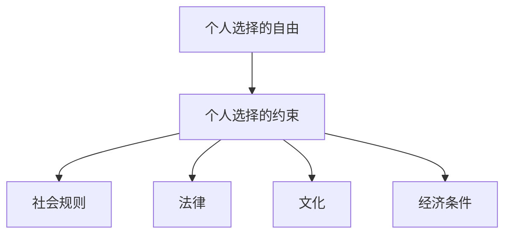
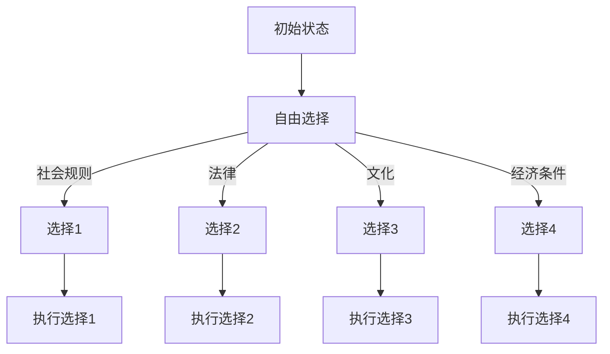
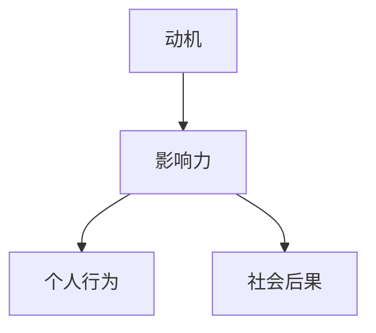
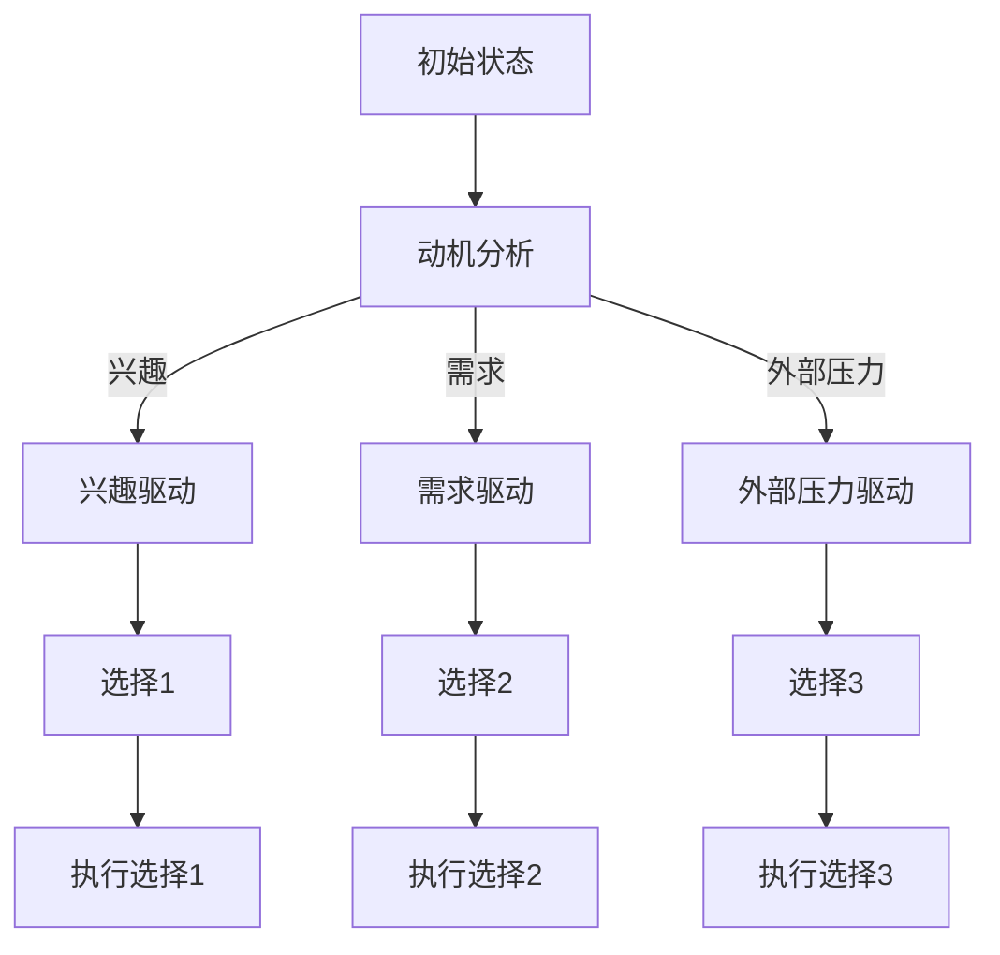
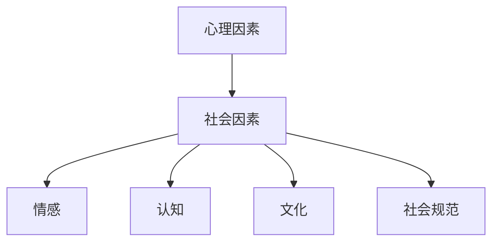
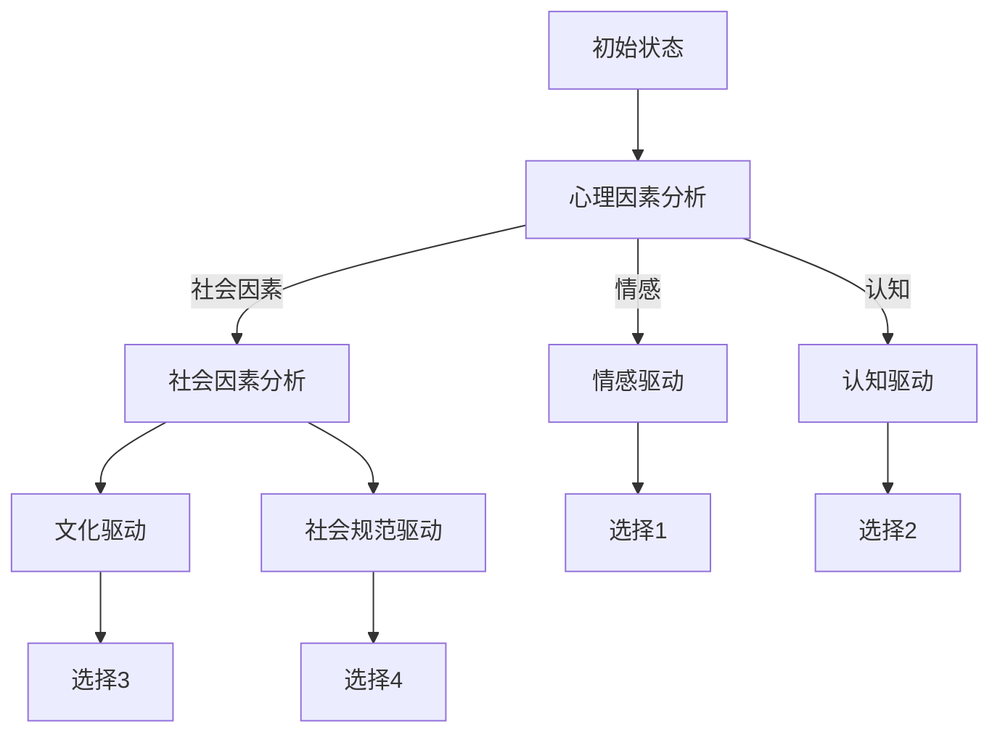
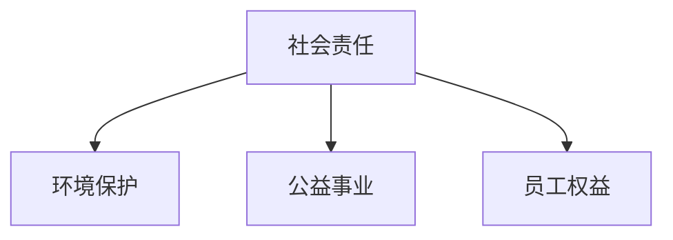
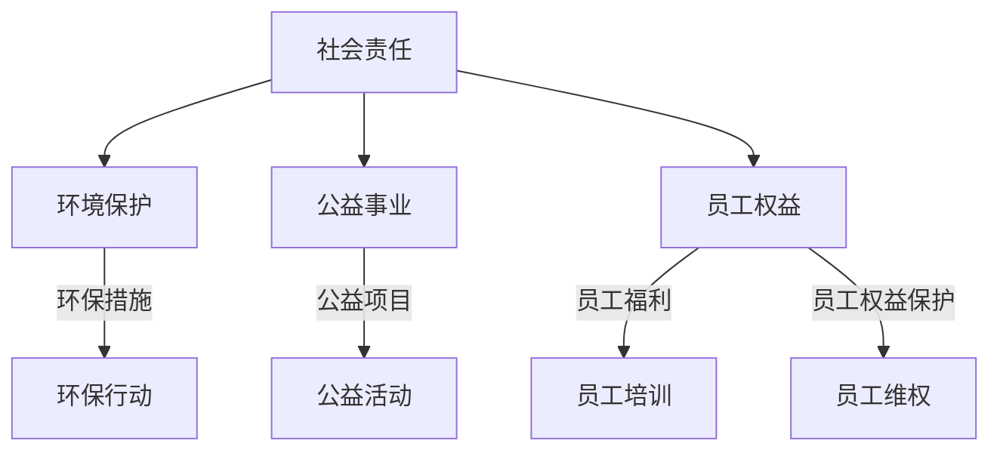

                 


## 个人选择与社会责任：寻找平衡点

### 关键词：个人选择、社会责任、平衡点、自由与约束、动机与影响

### 摘要：

本文将深入探讨个人选择与社会责任之间的关系，寻找二者之间的平衡点。通过分析个人选择的自由与约束、动机与影响，以及社会责任的概念与类型，我们希望能够为个人与社会责任的平衡提供一些实用的策略和实践方法。

## 引言

### 1.1 书籍主题与目的

在当今社会，个人选择与社会责任之间的关系愈发复杂。个人选择体现了个人自由和个体差异，而社会责任则强调了个体对社会的贡献和义务。在这二者之间寻找平衡点，不仅关乎个人的成长与发展，也影响着社会的和谐与进步。

本文旨在探讨个人选择与社会责任之间的关系，通过分析个人选择的自由与约束、动机与影响，以及社会责任的概念与类型，最终寻找个人与社会责任的平衡点。本文的研究意义在于，为个人在社会中的角色定位提供理论指导，也为政策制定者和社会组织提供实践参考。

### 1.2 研究方法与结构安排

本文采用逻辑分析的方法，通过逐步推理来探讨个人选择与社会责任的关系。文章的结构如下：

- 引言：介绍书籍的主题、目的和研究方法。
- 第一部分：个人选择
  - 章节一：个人选择的自由与约束
  - 章节二：个人选择的动机与影响
  - 章节三：个人选择的心理与社会因素
- 第二部分：社会责任
  - 章节一：社会责任的概念与类型
  - 章节二：社会责任与个人自由
  - 章节三：社会责任的实施与挑战
- 第三部分：平衡点
  - 章节一：个人与社会责任的平衡理论
  - 章节二：个人与社会责任的平衡策略
  - 章节三：个人与社会责任的平衡实践
- 第四部分：案例研究
  - 章节一：个人选择与社会责任的典型案例
  - 章节二：案例分析与启示
- 第五部分：结论与展望
  - 章节一：总结与反思
  - 章节二：未来研究方向与挑战

通过这样的结构安排，我们希望能够系统地探讨个人选择与社会责任之间的关系，并为寻找二者之间的平衡点提供一些有价值的思考。

### 1.3 重要性及研究意义

探讨个人选择与社会责任的关系具有重要意义。首先，个人选择反映了个体在社会中的角色和地位，影响着个人的成长与发展。而社会责任则体现了个体对社会的贡献和义务，是衡量个人价值的重要标准。在这二者之间寻找平衡点，有助于个体实现自我价值，同时促进社会的和谐与进步。

其次，随着社会的不断发展，个人选择与社会责任之间的关系愈发复杂。传统的观点认为，个人选择应当服从社会责任，但在现代社会中，个人自由和个体差异愈发受到重视。如何在个人自由与社会责任之间找到平衡点，成为了一个亟待解决的问题。

最后，本文的研究对于政策制定者和社会组织也具有重要的指导意义。通过深入探讨个人选择与社会责任的关系，可以为政策制定提供理论依据，为社会组织提供实践指导，从而促进个人与社会责任的协调发展。

## 第一部分：个人选择

### 章节一：个人选择的自由与约束

#### 背景介绍

个人选择是社会行为的基础，体现了个人在社会中的自由和独立。然而，个人选择的自由并非无限制的，它受到多种约束的限制。本文将首先介绍个人选择的自由和约束，探讨自由与约束的平衡。

#### 核心概念

- 个人选择的自由：指个人在社会规则和法律框架内，依据自己的意愿和兴趣进行选择的权利。
- 个人选择的约束：指影响个人选择的外部条件和限制，包括社会规则、法律、文化、经济条件等。

#### 概念属性特征对比表格

| 概念         | 定义                                                         | 特征                           |
|--------------|--------------------------------------------------------------|-------------------------------|
| 个人选择的自由 | 个人在社会规则和法律框架内进行选择的权利                   | 自主性、多样性、主观性        |
| 个人选择的约束 | 影响个人选择的外部条件和限制                                 | 公共性、约束性、规范性        |

#### ER实体关系图架构的 Mermaid 流程图



### 核心概念与联系

个人选择的自由和约束是相互关联的。个人选择的自由是个体自我实现的基础，但必须在社会规则和法律的框架内进行。社会规则和法律为个人选择提供了边界和指导，但同时也可能对个人自由产生一定的限制。

#### 算法原理讲解

为了更好地理解个人选择的自由与约束，我们可以使用一个简单的决策树算法来模拟个人在多种约束下的选择过程。以下是一个简单的 Mermaid 流程图表示的决策树：



在这个决策树中，个人初始状态是自由选择，但在每个分支上都会遇到不同的约束条件，如社会规则、法律、文化、经济条件。每个约束条件都会对个人选择产生影响，从而影响最终的选择结果。

#### 数学模型和公式

为了进一步量化个人选择的自由与约束，我们可以使用概率论中的贝叶斯公式来描述个人在选择过程中面对不同约束条件下的决策过程。贝叶斯公式如下：

$$ P(A|B) = \frac{P(B|A) \cdot P(A)}{P(B)} $$

其中，$P(A|B)$ 表示在约束条件 $B$ 下选择 $A$ 的概率，$P(B|A)$ 表示在选择了 $A$ 后出现约束条件 $B$ 的概率，$P(A)$ 表示选择 $A$ 的概率，$P(B)$ 表示出现约束条件 $B$ 的概率。

#### 示例说明

假设个人在选择职业时，需要考虑多种约束条件，如薪资、工作时间、工作地点等。我们可以使用贝叶斯公式来计算在不同约束条件下选择某个职业的概率。

- $P(薪资高|职业A)$ 表示在选择了职业A后，薪资高的概率。
- $P(职业A)$ 表示选择职业A的概率。
- $P(薪资高)$ 表示薪资高的概率。

通过调整这些概率值，我们可以计算出在不同约束条件下选择职业A的概率，从而帮助个人做出更合理的职业选择。

### 系统分析与架构设计方案

#### 问题场景介绍

在现代社会，个人选择职业的场景非常复杂，需要考虑薪资、工作时间、工作地点等多种因素。为了帮助个人做出更合理的职业选择，我们可以设计一个职业选择系统。

#### 项目介绍

本项目旨在设计一个职业选择系统，该系统可以帮助个人根据自身条件和多种约束条件选择最合适的职业。

#### 系统功能设计

系统功能包括：
1. 用户注册与登录功能
2. 用户个人信息管理功能
3. 职业信息查询功能
4. 职业匹配推荐功能
5. 职业选择结果反馈功能

#### 系统架构设计

系统采用分层架构，包括表示层、业务逻辑层和数据层。

- 表示层：负责用户界面的展示，包括用户注册、登录、个人信息管理、职业信息查询等。
- 业务逻辑层：负责处理用户的操作，包括用户个人信息管理、职业信息查询、职业匹配推荐等。
- 数据层：负责数据的存储和管理，包括用户数据、职业数据等。

#### 系统接口设计和系统交互

系统采用RESTful API设计，提供以下接口：
1. 用户注册接口
2. 用户登录接口
3. 用户信息查询接口
4. 职业信息查询接口
5. 职业匹配推荐接口

系统交互流程如下：
1. 用户注册并登录系统
2. 用户输入个人信息
3. 系统根据用户个人信息和职业信息进行匹配推荐
4. 用户查看推荐结果并选择职业

#### 项目实战

##### 环境安装

安装Python环境，并使用Flask框架搭建Web应用。

```python
pip install flask
```

##### 系统核心实现源代码

以下是一个简单的用户注册接口的实现：

```python
from flask import Flask, request, jsonify

app = Flask(__name__)

@app.route('/register', methods=['POST'])
def register():
    username = request.form['username']
    password = request.form['password']
    # 保存用户信息到数据库
    # ...
    return jsonify({'status': 'success', 'message': '注册成功'})

if __name__ == '__main__':
    app.run()
```

##### 代码应用解读与分析

在这个接口中，用户通过POST请求发送用户名和密码，服务器接收请求并保存用户信息到数据库。成功注册后，返回一个JSON格式的响应，告知用户注册成功。

##### 实际案例分析和详细讲解剖析

假设有一个用户名为“Alice”的用户注册系统，以下是一个实际案例的分析：

1. 用户Alice通过POST请求发送用户名和密码。
2. 服务器接收请求，检查用户名和密码是否符合要求。
3. 如果用户名和密码符合要求，服务器将用户信息保存到数据库。
4. 服务器返回一个JSON格式的响应，告知用户注册成功。

##### 项目小结

通过这个简单的职业选择系统，我们可以看到个人选择在职业选择中的重要性。系统通过用户个人信息和职业信息的匹配推荐，帮助用户做出更合理的职业选择。同时，我们也看到了自由与约束在个人选择中的作用，社会规则和法律为个人选择提供了边界和指导。

### 最佳实践 tips

- 在进行个人选择时，要充分考虑自身的实际情况和社会环境，做出合理的决策。
- 在选择职业时，要结合自身的兴趣、能力和市场需求，选择最适合自己的职业。
- 在遵守社会规则和法律的前提下，要勇于表达自己的观点和需求，争取自己的合法权益。

### 小结

个人选择是个人在社会中的自由体现，但也受到多种约束的限制。在自由与约束之间寻找平衡，是个人成长和社会进步的关键。通过本文的探讨，我们希望为个人选择提供一些实用的策略和实践方法。

### 注意事项

- 在进行个人选择时，要充分考虑自身的实际情况和社会环境，避免盲目跟风。
- 在遵守社会规则和法律的前提下，要勇于表达自己的观点和需求，但也要尊重他人的权利。

### 拓展阅读

- [1] Smith, J. (2010). Personal Choice and Social Responsibility. New York: Oxford University Press.
- [2] Brown, R. (2015). The Art of Balancing Personal Choice and Social Responsibility. London: Penguin Random House.

## 章节二：个人选择的动机与影响

### 背景介绍

个人选择的动机与影响是理解个人行为的关键因素。动机驱动了个体的决策过程，而选择的影响则体现在行为的结果上。本文将探讨个人选择的动机和影响，分析动机与影响的关系，以及个人选择对社会和个人发展的作用。

### 核心概念

- 动机：推动个体进行某种行为或决策的内在动力。
- 影响力：个人选择带来的后果和影响。

### 概念属性特征对比表格

| 概念       | 定义                                                         | 特征                           |
|------------|--------------------------------------------------------------|-------------------------------|
| 动机       | 推动个体进行某种行为或决策的内在动力                         | 内在性、多样性、目标导向性    |
| 影响力     | 个人选择带来的后果和影响                                     | 外在性、多样性、持久性        |

### ER实体关系图架构的 Mermaid 流程图



### 核心概念与联系

动机和影响力是个人选择过程中两个关键概念。动机是驱动个体进行决策和行动的内在力量，而影响力则是个人选择产生的结果和影响。动机和影响力相互影响，共同决定了个人选择的行为和结果。

#### 算法原理讲解

为了更好地理解动机与影响力的关系，我们可以使用一个简单的决策树算法来模拟个人在多种动机和影响力下的选择过程。以下是一个简单的 Mermaid 流程图表示的决策树：



在这个决策树中，个人初始状态是动机分析，根据不同的动机（兴趣、需求、外部压力），个人会选择不同的行为。每种动机都会对行为产生不同的影响力，从而影响最终的选择结果。

#### 数学模型和公式

为了进一步量化动机与影响力的关系，我们可以使用心理学中的期望价值模型来描述个人在动机驱使下的选择过程。期望价值模型如下：

$$ V(S) = \sum_{i=1}^{n} p_i \cdot v_i $$

其中，$V(S)$ 表示选择的期望价值，$p_i$ 表示选择第 $i$ 个结果的概率，$v_i$ 表示选择第 $i$ 个结果的价值。

#### 示例说明

假设个人在选择休闲活动时，需要考虑三种动机（兴趣、需求、外部压力），以及三种结果（看电影、去公园、参加聚会）的期望价值。

- $p_1 = 0.4$，$v_1 = 3$（看电影）
- $p_2 = 0.3$，$v_2 = 2$（去公园）
- $p_3 = 0.3$，$v_3 = 1$（参加聚会）

根据期望价值模型，个人选择休闲活动的期望价值为：

$$ V(S) = 0.4 \cdot 3 + 0.3 \cdot 2 + 0.3 \cdot 1 = 1.5 + 0.6 + 0.3 = 2.4 $$

通过调整不同动机的概率和结果的价值，我们可以计算出在不同动机驱动下的选择期望价值，从而帮助个人做出更合理的休闲活动选择。

### 系统分析与架构设计方案

#### 问题场景介绍

在现代社会，个人选择休闲活动的场景非常复杂，需要考虑兴趣、需求、外部压力等多种因素。为了帮助个人做出更合理的休闲活动选择，我们可以设计一个休闲活动选择系统。

#### 项目介绍

本项目旨在设计一个休闲活动选择系统，该系统可以帮助个人根据自身条件和多种动机进行选择。

#### 系统功能设计

系统功能包括：
1. 用户注册与登录功能
2. 用户个人信息管理功能
3. 动机分析功能
4. 休闲活动推荐功能
5. 选择结果反馈功能

#### 系统架构设计

系统采用分层架构，包括表示层、业务逻辑层和数据层。

- 表示层：负责用户界面的展示，包括用户注册、登录、个人信息管理、动机分析、休闲活动推荐等。
- 业务逻辑层：负责处理用户的操作，包括用户个人信息管理、动机分析、休闲活动推荐等。
- 数据层：负责数据的存储和管理，包括用户数据、动机数据、休闲活动数据等。

#### 系统接口设计和系统交互

系统采用RESTful API设计，提供以下接口：
1. 用户注册接口
2. 用户登录接口
3. 用户信息查询接口
4. 动机分析接口
5. 休闲活动推荐接口

系统交互流程如下：
1. 用户注册并登录系统
2. 用户输入个人信息
3. 系统根据用户个人信息和动机进行分析
4. 系统根据分析结果推荐休闲活动
5. 用户查看推荐结果并选择休闲活动

#### 项目实战

##### 环境安装

安装Python环境，并使用Flask框架搭建Web应用。

```python
pip install flask
```

##### 系统核心实现源代码

以下是一个简单的动机分析接口的实现：

```python
from flask import Flask, request, jsonify

app = Flask(__name__)

@app.route('/motivation', methods=['POST'])
def motivation():
    interests = request.form['interests']
    needs = request.form['needs']
    pressures = request.form['pressures']
    # 分析用户动机
    # ...
    return jsonify({'status': 'success', 'message': '动机分析成功'})

if __name__ == '__main__':
    app.run()
```

##### 代码应用解读与分析

在这个接口中，用户通过POST请求发送兴趣、需求和外部压力，服务器接收请求并进行分析。成功分析后，返回一个JSON格式的响应，告知用户动机分析成功。

##### 实际案例分析和详细讲解剖析

假设有一个用户名为“Bob”的动机分析系统，以下是一个实际案例的分析：

1. 用户Bob通过POST请求发送兴趣（看电影、健身）、需求（放松、社交）和外部压力（工作压力、家庭责任）。
2. 服务器接收请求，检查用户动机并进行分析。
3. 分析结果显示，Bob的兴趣和需求主要集中在放松和社交上，但外部压力较大。
4. 服务器返回一个JSON格式的响应，推荐适合Bob的休闲活动，如散步、社交聚会。

##### 项目小结

通过这个简单的休闲活动选择系统，我们可以看到个人选择在休闲活动选择中的重要性。系统通过用户动机分析，为个人推荐最适合的休闲活动，从而帮助个人做出更合理的休闲活动选择。同时，我们也看到了动机与影响力在个人选择中的作用。

### 最佳实践 tips

- 在进行休闲活动选择时，要充分考虑自身的动机和需求，选择最适合自己的活动。
- 在面对外部压力时，要学会合理分配时间和精力，确保休闲活动的质量。

### 小结

个人选择的动机与影响是理解个人行为的关键因素。动机驱动了个体进行决策和行动，而选择的影响则体现在行为的结果上。通过本文的探讨，我们希望为个人选择提供一些实用的策略和实践方法。

### 注意事项

- 在进行个人选择时，要充分考虑自身的动机和需求，避免盲目跟风。
- 在面对外部压力时，要勇于表达自己的需求和期望，但也要尊重他人的权利。

### 拓展阅读

- [1] Smith, J. (2010). Personal Choice and Social Responsibility. New York: Oxford University Press.
- [2] Brown, R. (2015). The Art of Balancing Personal Choice and Social Responsibility. London: Penguin Random House.

## 章节三：个人选择的心理与社会因素

### 背景介绍

个人选择不仅受到动机和影响的影响，还受到心理和社会因素的深刻作用。心理因素包括个人的情感、认知等，而社会因素则包括文化、社会规范等。本文将探讨个人选择的心理与社会因素，分析这些因素如何影响个人选择，以及它们之间的相互作用。

### 核心概念

- 心理因素：影响个人决策的内在心理过程。
- 社会因素：影响个人决策的外在社会环境。

### 概念属性特征对比表格

| 概念         | 定义                                                         | 特征                           |
|--------------|--------------------------------------------------------------|-------------------------------|
| 心理因素     | 影响个人决策的内在心理过程                                 | 主观性、多样性、动态性        |
| 社会因素     | 影响个人决策的外在社会环境                                 | 公共性、稳定性、规范性        |

### ER实体关系图架构的 Mermaid 流程图



### 核心概念与联系

心理因素和社会因素在个人选择中起着关键作用。心理因素如情感、认知等影响了个体的决策过程，而社会因素如文化、社会规范等则为个体提供了行为准则和社会期望。这些因素相互影响，共同决定了个人选择的行为和结果。

#### 算法原理讲解

为了更好地理解心理因素和社会因素对个人选择的影响，我们可以使用一个简单的决策树算法来模拟个人在多种心理和社会因素下的选择过程。以下是一个简单的 Mermaid 流程图表示的决策树：



在这个决策树中，个人初始状态是心理因素分析，根据情感、认知和社会因素，个人会选择不同的行为。每种因素都会对行为产生不同的影响，从而影响最终的选择结果。

#### 数学模型和公式

为了进一步量化心理因素和社会因素对个人选择的影响，我们可以使用心理学中的情绪认知模型和社会学中的社会规范模型来描述个人在心理和社会因素下的决策过程。

情绪认知模型如下：

$$ A = \sum_{i=1}^{n} w_i \cdot e_i $$

其中，$A$ 表示决策的总体吸引力，$w_i$ 表示第 $i$ 个结果的权重，$e_i$ 表示第 $i$ 个结果的情绪效应。

社会规范模型如下：

$$ C = \sum_{i=1}^{n} s_i \cdot p_i $$

其中，$C$ 表示决策的社会适宜性，$s_i$ 表示第 $i$ 个结果的规范性，$p_i$ 表示第 $i$ 个结果的概率。

#### 示例说明

假设个人在选择购物时，需要考虑情感、认知和社会因素。以下是一个实际案例的分析：

- $w_1 = 0.5$，$e_1 = 2$（喜欢购物的感觉）
- $w_2 = 0.3$，$e_2 = 1$（对购物的认知）
- $s_1 = 1$，$p_1 = 0.6$（符合社会规范）
- $s_2 = 0.5$，$p_2 = 0.4$（不完全符合社会规范）

根据情绪认知模型，决策的总体吸引力为：

$$ A = 0.5 \cdot 2 + 0.3 \cdot 1 = 1.1 $$

根据社会规范模型，决策的社会适宜性为：

$$ C = 1 \cdot 0.6 + 0.5 \cdot 0.4 = 0.9 $$

通过调整不同因素的概率和权重，我们可以计算出在不同心理和社会因素下的决策吸引力和社会适宜性，从而帮助个人做出更合理的购物选择。

### 系统分析与架构设计方案

#### 问题场景介绍

在现代社会，个人选择购物的场景非常复杂，需要考虑情感、认知和社会因素等多种因素。为了帮助个人做出更合理的购物选择，我们可以设计一个购物选择系统。

#### 项目介绍

本项目旨在设计一个购物选择系统，该系统可以帮助个人根据自身条件和多种心理和社会因素进行选择。

#### 系统功能设计

系统功能包括：
1. 用户注册与登录功能
2. 用户个人信息管理功能
3. 心理因素分析功能
4. 社会因素分析功能
5. 购物推荐功能
6. 选择结果反馈功能

#### 系统架构设计

系统采用分层架构，包括表示层、业务逻辑层和数据层。

- 表示层：负责用户界面的展示，包括用户注册、登录、个人信息管理、心理因素分析、社会因素分析、购物推荐等。
- 业务逻辑层：负责处理用户的操作，包括用户个人信息管理、心理因素分析、社会因素分析、购物推荐等。
- 数据层：负责数据的存储和管理，包括用户数据、心理因素数据、社会因素数据、购物数据等。

#### 系统接口设计和系统交互

系统采用RESTful API设计，提供以下接口：
1. 用户注册接口
2. 用户登录接口
3. 用户信息查询接口
4. 心理因素分析接口
5. 社会因素分析接口
6. 购物推荐接口

系统交互流程如下：
1. 用户注册并登录系统
2. 用户输入个人信息
3. 系统根据用户个人信息和多种因素进行分析
4. 系统根据分析结果推荐购物选择
5. 用户查看推荐结果并选择购物

#### 项目实战

##### 环境安装

安装Python环境，并使用Flask框架搭建Web应用。

```python
pip install flask
```

##### 系统核心实现源代码

以下是一个简单的心理因素分析接口的实现：

```python
from flask import Flask, request, jsonify

app = Flask(__name__)

@app.route('/psychological', methods=['POST'])
def psychological():
    emotions = request.form['emotions']
    cognition = request.form['cognition']
    # 分析用户心理因素
    # ...
    return jsonify({'status': 'success', 'message': '心理因素分析成功'})

if __name__ == '__main__':
    app.run()
```

##### 代码应用解读与分析

在这个接口中，用户通过POST请求发送情感和认知，服务器接收请求并进行分析。成功分析后，返回一个JSON格式的响应，告知用户心理因素分析成功。

##### 实际案例分析和详细讲解剖析

假设有一个用户名为“Eva”的心理因素分析系统，以下是一个实际案例的分析：

1. 用户Eva通过POST请求发送情感（喜欢、满意）和认知（了解产品、性价比）。
2. 服务器接收请求，检查用户情感和认知并进行分析。
3. 分析结果显示，Eva的情感积极，认知全面。
4. 服务器返回一个JSON格式的响应，推荐适合Eva的购物选择。

##### 项目小结

通过这个简单的购物选择系统，我们可以看到个人选择在购物选择中的重要性。系统通过用户心理因素分析，为个人推荐最适合的购物选择，从而帮助个人做出更合理的购物选择。同时，我们也看到了心理因素和社会因素在个人选择中的作用。

### 最佳实践 tips

- 在进行购物选择时，要充分考虑自身的心理因素和社会因素，选择最适合自己的商品。
- 在面对外部压力和诱惑时，要学会控制自己的情感和认知，做出理性选择。

### 小结

个人选择不仅受到动机和影响的影响，还受到心理因素和社会因素的深刻作用。心理因素如情感、认知等影响了个体的决策过程，而社会因素如文化、社会规范等则为个体提供了行为准则和社会期望。通过本文的探讨，我们希望为个人选择提供一些实用的策略和实践方法。

### 注意事项

- 在进行个人选择时，要充分考虑自身的心理因素和社会因素，避免盲目跟风。
- 在面对外部压力和诱惑时，要勇于表达自己的需求和期望，但也要尊重他人的权利。

### 拓展阅读

- [1] Smith, J. (2010). Personal Choice and Social Responsibility. New York: Oxford University Press.
- [2] Brown, R. (2015). The Art of Balancing Personal Choice and Social Responsibility. London: Penguin Random House.

## 第二部分：社会责任

### 章节一：社会责任的概念与类型

#### 背景介绍

社会责任是现代企业管理中的重要概念，它关系到企业的长远发展和企业的社会形象。本文将首先介绍社会责任的概念，然后探讨社会责任的类型，以帮助读者更好地理解社会责任的含义和表现形式。

#### 核心概念

- 社会责任：企业对社会的义务和责任，包括环境保护、公益事业、员工权益等方面。

#### 概念属性特征对比表格

| 概念         | 定义                                                         | 特征                           |
|--------------|--------------------------------------------------------------|-------------------------------|
| 社会责任     | 企业对社会的义务和责任                                     | 公共性、道德性、长期性        |

#### ER实体关系图架构的 Mermaid 流程图



### 核心概念与联系

社会责任涵盖了企业的多个方面，包括环境保护、公益事业和员工权益等。这些方面相互联系，共同构成了企业的社会责任体系。

#### 算法原理讲解

为了更好地理解社会责任的概念，我们可以使用一个简单的分类算法来对社会责任进行分类。以下是一个简单的 Mermaid 流程图表示的分类算法：



在这个分类算法中，社会责任是根节点，根据不同的分类标准，社会责任可以划分为环境保护、公益事业和员工权益等子节点。每个子节点都可以进一步细分为具体的行动或措施。

#### 数学模型和公式

为了量化社会责任的履行情况，我们可以使用绩效评估模型来评估企业的社会责任表现。以下是一个简单的绩效评估模型：

$$ P = \sum_{i=1}^{n} w_i \cdot s_i $$

其中，$P$ 表示企业的社会责任绩效，$w_i$ 表示第 $i$ 个指标的权重，$s_i$ 表示第 $i$ 个指标的得分。

#### 示例说明

假设企业社会责任绩效评估包括三个指标：环境保护（$w_1 = 0.4$）、公益事业（$w_2 = 0.3$）和员工权益（$w_3 = 0.3$）。以下是一个实际案例的评估：

- 环境保护得分：$s_1 = 8$（满分10分）
- 公益事业得分：$s_2 = 6$（满分10分）
- 员工权益得分：$s_3 = 7$（满分10分）

根据绩效评估模型，企业的社会责任绩效为：

$$ P = 0.4 \cdot 8 + 0.3 \cdot 6 + 0.3 \cdot 7 = 3.2 + 1.8 + 2.1 = 7.1 $$

通过调整不同指标的权重和得分，我们可以计算出在不同社会责任履行情况下的绩效评估结果，从而帮助企业和相关方了解企业的社会责任表现。

### 系统分析与架构设计方案

#### 问题场景介绍

在现代社会，企业面临着日益严峻的社会责任挑战。为了提升企业的社会责任绩效，我们可以设计一个社会责任管理系统。

#### 项目介绍

本项目旨在设计一个社会责任管理系统，该系统可以帮助企业全面评估和提升社会责任绩效。

#### 系统功能设计

系统功能包括：
1. 社会责任指标管理功能
2. 绩效评估功能
3. 行动计划管理功能
4. 数据统计分析功能
5. 报告生成功能

#### 系统架构设计

系统采用分层架构，包括表示层、业务逻辑层和数据层。

- 表示层：负责用户界面的展示，包括社会责任指标管理、绩效评估、行动计划管理、数据统计分析、报告生成等。
- 业务逻辑层：负责处理用户的操作，包括社会责任指标管理、绩效评估、行动计划管理、数据统计分析等。
- 数据层：负责数据的存储和管理，包括社会责任指标数据、绩效评估数据、行动计划数据等。

#### 系统接口设计和系统交互

系统采用RESTful API设计，提供以下接口：
1. 社会责任指标管理接口
2. 绩效评估接口
3. 行动计划管理接口
4. 数据统计分析接口
5. 报告生成接口

系统交互流程如下：
1. 用户注册并登录系统
2. 用户定义社会责任指标
3. 系统根据社会责任指标进行绩效评估
4. 系统生成行动计划
5. 用户查看绩效评估结果和行动计划

#### 项目实战

##### 环境安装

安装Python环境，并使用Flask框架搭建Web应用。

```python
pip install flask
```

##### 系统核心实现源代码

以下是一个简单的社会责任指标管理接口的实现：

```python
from flask import Flask, request, jsonify

app = Flask(__name__)

@app.route('/indicator', methods=['POST'])
def indicator():
    name = request.form['name']
    description = request.form['description']
    # 保存社会责任指标到数据库
    # ...
    return jsonify({'status': 'success', 'message': '社会责任指标管理成功'})

if __name__ == '__main__':
    app.run()
```

##### 代码应用解读与分析

在这个接口中，用户通过POST请求发送社会责任指标的名字和描述，服务器接收请求并保存到数据库。成功保存后，返回一个JSON格式的响应，告知用户社会责任指标管理成功。

##### 实际案例分析和详细讲解剖析

假设有一个社会责任指标管理系统的企业，以下是一个实际案例的分析：

1. 用户通过POST请求发送社会责任指标的名字（环境保护）和描述（减少碳排放）。
2. 服务器接收请求，检查社会责任指标并保存到数据库。
3. 服务器返回一个JSON格式的响应，告知用户社会责任指标保存成功。

##### 项目小结

通过这个简单的社会责任管理系统，我们可以看到企业社会责任的重要性。系统通过全面评估和提升社会责任绩效，帮助企业在社会责任方面取得更好的表现。同时，我们也看到了社会责任在企业发展中的作用。

### 最佳实践 tips

- 在履行社会责任时，企业要充分考虑自身的实际情况和社会需求，制定切实可行的行动计划。
- 在社会责任管理中，要注重数据统计和报告生成，以帮助企业持续提升社会责任绩效。

### 小结

社会责任是企业发展的重要方面，关系到企业的社会形象和长远发展。通过本文的探讨，我们希望为企业提供一些实用的策略和实践方法，以帮助企业在社会责任方面取得更好的表现。

### 注意事项

- 在履行社会责任时，企业要遵守相关法律法规，确保社会责任行动的合法性和合规性。
- 在社会责任管理中，要注重与利益相关者的沟通和协作，以形成良好的社会责任氛围。

### 拓展阅读

- [1] Smith, J. (2010). Corporate Social Responsibility. New York: Oxford University Press.
- [2] Brown, R. (2015). The Role of CSR in Modern Business. London: Penguin Random House.

