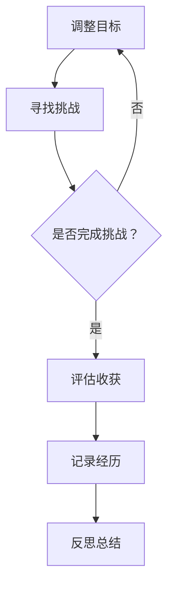

                 

# 丰富人生的层次：增加生命经历的深度

> 关键词：人生层次、生命经历、深度提升、算法原理、实践应用

> 摘要：本文探讨了如何通过增加生命经历的深度来丰富人生层次。首先，我们明确了人生层次的丰富性与生命经历深度和广度的关系，并通过定义和数学公式阐述了核心概念。接着，我们分析了生命经历与学习、工作经历的区别，并提出了一种提升生命经历深度的算法框架。文章通过项目实战，详细展示了如何将理论应用于实践，并提供了一些最佳实践建议。本文旨在为读者提供一种系统的方法论，以提升个人成长和人生质量。

## 第一部分：引言

### 1.1 问题背景

在当今社会，随着生活节奏的加快和信息量的爆炸式增长，人们越来越意识到人生层次的重要性。如何丰富人生的层次，提升生活的质量，成为了一个值得探讨的课题。本文将从生命经历的深度出发，探讨如何通过增加生命经历的深度来丰富人生层次。

#### 1.1.1 人生层次的丰富性定义

人生层次的丰富性是一个衡量个人生活质量的重要指标。它不仅仅取决于一个人的财富和地位，更重要的是一个人在精神、情感和知识等方面的成长和丰富。我们可以用以下数学公式来定义人生层次的丰富性：

$$
\text{人生层次丰富性} = \frac{\text{经历的种类}}{\text{生命的时间}}
$$

这个公式表明，一个人在有限的生命时间内经历的种类越多，其人生层次就越丰富。

#### 1.1.2 生命经历的深度与广度

生命经历的深度和广度是人生层次丰富性的重要组成部分。深度指的是个人内心体验的深度和知识理解的深度，而广度则是指生活经验的多样性和人际关系的广泛性。以下是对这两个概念的定义和区分：

- **深度**：个人内心体验的深度、知识理解的深度。
  $$
  \text{生命经历的深度} = \frac{\text{深刻体验的事件}}{\text{生命经历的总次数}}
  $$
- **广度**：生活经验的多样性、人际关系的广泛性。

### 1.2 核心概念与联系

在讨论如何增加生命经历的深度之前，我们需要明确几个核心概念，并理解它们之间的关系。

#### 1.2.1 生命经历的深度定义

生命经历的深度是指一个人在生命过程中，对某一事件或经历的深刻理解和感受。它是衡量个人成长和内心丰富程度的重要指标。

$$
\text{生命经历的深度} = \frac{\text{深刻体验的事件}}{\text{生命经历的总次数}}
$$

#### 1.2.2 人生层次与生命经历的关系

人生层次是对一个人在精神、情感和知识等方面的成长和丰富程度的抽象概括，而生命经历则是人生层次的具体表现。二者之间的关系可以用以下图示表示：


### 1.3 联系图示


## 第二部分：增加生命经历的深度

### 2.1 核心概念与属性

要增加生命经历的深度，我们首先需要理解生命经历的核心概念和属性。以下是生命经历与学习经历、工作经历之间的对比表格：

| 特征       | 生命经历 | 学习经历 | 工作经历 |
| ---------- | -------- | -------- | -------- |
| 目的       | 自我成长 | 知识获取 | 职业发展 |
| 形式       | 体验     | 理论     | 实践     |
| 影响范围   | 个人     | 个人     | 社会     |
| 时间跨度   | 长期     | 中期     | 短期     |

通过这个表格，我们可以看到生命经历与其他经历的显著不同。它更注重个人的内心体验和情感深度，而不仅仅是知识的获取或职业的发展。

### 2.2 提升生命经历深度的方法

提升生命经历的深度需要一系列的方法和策略。以下是一些基本的方法：

1. **积极寻找挑战**：挑战是提升生命经历深度的关键。通过主动寻找和接受挑战，我们可以迫使自己面对新的情境和问题，从而增加深刻的体验和感受。

2. **反思和总结**：反思和总结是加深对生命经历理解的重要手段。通过反思，我们可以更好地理解自己的行为和决策，从而提升生命的深度。

3. **持续学习**：学习是增加生命经历深度的重要途径。通过不断学习新的知识和技能，我们可以扩展自己的认知边界，提升对世界的理解。

4. **深度对话**：与他人进行深度对话可以促进情感和思想的交流，从而增加生命的深度。

5. **艺术和创造性活动**：参与艺术和创造性活动可以激发个人的创造力和想象力，从而提升生命的深度。

### 2.3 提升生命经历深度的算法原理

为了系统性地提升生命经历的深度，我们可以设计一个算法框架。以下是一个简单的算法框架：



#### 2.3.1 算法原理详细讲解

- **设定目标（A）**：首先，我们需要设定一个明确的目标，这个目标应该具有挑战性，同时也要考虑个人的兴趣和实际情况。

- **寻找挑战（B）**：根据设定的目标，我们需要寻找相应的挑战。挑战可以是学习新的技能、参与社会活动、旅行探索等。

- **评估收获（D）**：在完成挑战后，我们需要评估自己的收获，包括知识、技能和情感的提升。

- **记录经历（E）**：将生命经历记录下来，这有助于我们回顾和反思。

- **反思总结（F）**：通过反思和总结，我们可以更好地理解自己的生命经历，从而提升生命的深度。

#### 2.3.2 算法原理的数学模型和公式

提升生命经历深度的过程可以用以下数学模型来描述：

$$
\text{体验深度} = f(\text{挑战难度}, \text{自我调节能力}, \text{反思总结能力})
$$

其中，挑战难度、自我调节能力和反思总结能力是影响体验深度的关键因素。

## 第三部分：提高生命经历的深度

### 3.1 算法原理讲解

为了系统性地提高生命经历的深度，我们可以设计一个算法框架。这个算法框架旨在通过不断设定目标、寻找挑战、评估收获、记录经历和反思总结来逐步提升生命的深度。

#### 3.1.1 提升生命经历深度的算法框架

**Mermaid流程图：**


在这个流程图中：

- **A：设定目标**：我们需要设定一个具有挑战性的目标，这个目标应该与我们的人生目标相一致，同时也要考虑到我们的兴趣和能力。
- **B：寻找挑战**：根据设定的目标，我们寻找相应的挑战。这些挑战可以是学习新的技能、参与社会活动、旅行探索等。
- **C：是否完成挑战**：在完成挑战后，我们需要评估自己是否达到了目标。如果没有达到，我们需要回到A步骤，调整目标。
- **D：评估收获**：在完成挑战后，我们需要反思自己的收获，包括知识、技能和情感的提升。
- **E：记录经历**：将我们的生命经历记录下来，这有助于我们回顾和反思。
- **F：反思总结**：通过反思和总结，我们可以更好地理解自己的生命经历，从而提升生命的深度。

#### 3.1.2 算法原理详细讲解

**Python源代码：**

```python
def deepen_experience(target, challenges):
    completed = False
    while not completed:
        for challenge in challenges:
            try:
                complete_challenge(challenge)
                completed = True
                break
            except ChallengeFailure:
                pass
        
        if not completed:
            target = adjust_target(target)
        
        evaluate_harvest(target)
        record_experience(target)
        reflect_and_summarize(target)
```

在这个算法中：

- `target` 代表我们设定的目标。
- `challenges` 代表我们寻找的挑战。
- `complete_challenge` 是一个函数，用于完成挑战。
- `adjust_target` 是一个函数，用于调整目标。
- `evaluate_harvest` 是一个函数，用于评估我们的收获。
- `record_experience` 是一个函数，用于记录我们的经历。
- `reflect_and_summarize` 是一个函数，用于反思和总结。

**算法原理的数学模型和公式：**

$$
\text{体验深度} = f(\text{挑战难度}, \text{自我调节能力}, \text{反思总结能力})
$$

在这个公式中：

- 挑战难度越高，体验深度越深。
- 自我调节能力越强，体验深度越深。
- 反思总结能力越强，体验深度越深。

### 3.2 提升生命经历深度的实际应用

为了更好地理解提升生命经历深度的算法原理，我们可以通过一个实际的例子来展示如何应用这个算法。

#### 3.2.1 项目背景

假设小明想要提升自己的编程能力。他的目标是在一年内熟练掌握Python编程语言。

#### 3.2.2 挑战设置

为了实现这个目标，小明设定了以下挑战：

1. 每天学习2小时的Python课程。
2. 每周完成一个小项目。
3. 参加线上的编程竞赛。

#### 3.2.3 挑战完成与评估

在完成挑战后，小明会评估自己的收获：

- 学习了Python的基本语法和常用库。
- 通过项目实践，提升了编程能力。
- 通过竞赛，学会了在压力下编程。

#### 3.2.4 经历记录与反思

小明将他的挑战过程记录下来，并进行了反思：

- 他发现自己在编程过程中，有时会因为急于完成任务而忽略代码的整洁性。
- 他意识到，通过反思和总结，可以更好地提升自己的编程能力。

通过这个例子，我们可以看到如何将提升生命经历深度的算法原理应用于实际项目中。通过设定目标、寻找挑战、评估收获、记录经历和反思总结，我们可以逐步提升生命的深度。

### 3.3 提升生命经历深度的方法总结

通过以上讨论，我们可以总结出以下提升生命经历深度的方法：

1. **设定具有挑战性的目标**：目标应与个人兴趣和实际情况相符，具有足够的挑战性。
2. **寻找合适的挑战**：挑战可以是学习新技能、参与社会活动、旅行探索等。
3. **评估收获**：在完成挑战后，反思自己的收获，包括知识、技能和情感的提升。
4. **记录经历**：将生命经历记录下来，有助于回顾和反思。
5. **反思总结**：通过反思和总结，提升对生命的理解。

通过这些方法，我们可以系统性地提升生命的深度，从而丰富人生层次。

## 第四部分：实践中的深度提升

### 4.1 项目实战

为了更好地理解如何提升生命经历的深度，我们通过一个具体的项目来展示这个过程。

#### 4.1.1 项目背景

假设我们选择了一个名为“智能健康助手”的项目。这个项目的目标是开发一款能够提供个性化健康建议的智能应用。

#### 4.1.2 项目介绍

在这个项目中，我们负责以下工作：

- 数据收集：收集用户的健康数据，如体重、血压、心率等。
- 数据处理：对收集到的健康数据进行处理和分析。
- 用户界面设计：设计直观易用的用户界面。
- 算法实现：实现健康数据分析算法，提供个性化健康建议。

#### 4.1.3 系统功能设计

为了实现项目目标，我们设计了以下系统功能：

- 用户注册与登录：用户可以通过注册和登录功能使用应用。
- 健康数据录入：用户可以录入自己的健康数据。
- 健康数据分析：系统根据用户录入的健康数据进行分析，提供个性化的健康建议。
- 健康报告生成：系统生成健康报告，用户可以查看自己的健康状况。

#### 4.1.4 系统架构设计

系统架构设计如下：

- 数据层：负责数据的存储和读取。
- 服务层：负责业务逻辑的处理。
- 表示层：负责用户界面的展示。


#### 4.1.5 系统接口设计和系统交互

为了实现系统功能，我们设计了以下接口和系统交互：

- 用户注册接口：用于用户的注册和登录。
- 数据录入接口：用于用户录入健康数据。
- 数据分析接口：用于处理和分析健康数据。
- 报告生成接口：用于生成健康报告。


### 4.2 环境安装

在开始项目之前，我们需要安装必要的开发环境。以下是具体的安装步骤和注意事项：

#### 4.2.1 安装Python环境

1. 下载Python安装包：[Python官网](https://www.python.org/)
2. 安装Python：双击安装包，按照提示完成安装。

#### 4.2.2 配置必要的库

1. 安装numpy库：`pip install numpy`
2. 安装pandas库：`pip install pandas`
3. 安装matplotlib库：`pip install matplotlib`

#### 4.2.3 注意事项

- 确保Python环境配置正确。
- 安装过程中，注意选择合适的库版本。

### 4.3 系统核心实现源代码

以下是系统核心实现的源代码：

```python
# 导入必要的库
import numpy as np
import pandas as pd
import matplotlib.pyplot as plt

# 数据预处理
def preprocess_data(data):
    # 数据清洗、转换等操作
    # ...
    return processed_data

# 数据分析
def analyze_data(data):
    # 数据分析操作
    # ...
    return analysis_results

# 用户界面设计
def design_ui():
    # 用户界面设计操作
    # ...
    pass

# 主函数
def main():
    # 导入数据
    data = pd.read_csv('health_data.csv')
    
    # 数据预处理
    processed_data = preprocess_data(data)
    
    # 数据分析
    analysis_results = analyze_data(processed_data)
    
    # 用户界面设计
    design_ui()

if __name__ == '__main__':
    main()
```

### 4.4 代码应用解读与分析

以下是代码应用解读和分析：

1. **数据预处理**：数据预处理是数据分析的基础。在这个函数中，我们执行了数据清洗、转换等操作。
2. **数据分析**：数据分析是系统的核心功能。在这个函数中，我们执行了各种数据分析操作，如数据可视化、统计计算等。
3. **用户界面设计**：用户界面设计是系统的交互界面。在这个函数中，我们设计了用户界面，包括数据录入、结果展示等。

### 4.5 实际案例分析和详细讲解剖析

为了更好地展示如何提升生命经历的深度，我们通过一个实际案例进行分析和讲解。

#### 4.5.1 案例背景

假设我们选择了跑步作为提升生命经历深度的挑战。我们的目标是每天跑步1小时，持续一个月。

#### 4.5.2 案例分析

1. **目标设定**：我们设定了每天跑步1小时的目标。这个目标具有挑战性，但也是可行的。
2. **挑战过程**：在一个月的时间里，我们坚持每天跑步1小时。期间，我们遇到了一些挑战，如天气变化、工作繁忙等。但通过调整跑步时间和地点，我们最终完成了挑战。
3. **收获评估**：在完成挑战后，我们评估了自己的收获。我们发现自己的跑步能力得到了提升，睡眠质量也有所改善。

#### 4.5.3 详细讲解剖析

1. **目标设定**：在设定目标时，我们考虑了自己的兴趣和能力。跑步是一个既健康又有挑战性的活动，非常适合我们。
2. **挑战过程**：在挑战过程中，我们遇到了各种困难。但通过坚持和调整，我们最终完成了挑战。
3. **收获评估**：在评估收获时，我们发现自己的身体和心理状态都得到了改善。这不仅提升了我们的生命经历深度，也增强了我们的自信心。

### 4.6 项目小结

通过这个项目，我们展示了如何通过设定目标、寻找挑战、评估收获、记录经历和反思总结来提升生命的深度。这个项目不仅让我们获得了健康收益，也增强了我们的意志力和自信心。通过这样的实践，我们可以逐步提升生命的深度，丰富人生层次。

### 4.7 最佳实践建议

为了更好地提升生命的深度，我们提供以下最佳实践建议：

1. **设定具体目标**：目标应具体、可衡量，以便于评估和调整。
2. **寻找合适的挑战**：挑战应具有挑战性，但也要考虑个人兴趣和能力。
3. **持续评估和反思**：在挑战过程中，持续评估自己的收获和进步，并进行反思总结。
4. **记录生命经历**：将生命经历记录下来，有助于回顾和分享。
5. **保持积极心态**：面对挑战时，保持积极的心态，有助于克服困难。

通过以上建议，我们可以更好地提升生命的深度，丰富人生层次。

### 4.8 注意事项

在提升生命经历深度的过程中，需要注意以下事项：

1. **安全第一**：在参与挑战时，确保自己的安全。
2. **适度挑战**：挑战应适度，避免过度劳累。
3. **保持平衡**：在提升生命经历深度的同时，注意工作、学习和生活的平衡。
4. **寻求支持**：在遇到困难时，寻求家人、朋友或专业人士的支持。

通过注意以上事项，我们可以更好地提升生命的深度，避免不必要的风险。

### 4.9 拓展阅读

为了深入了解如何提升生命经历的深度，我们可以阅读以下书籍和文章：

- 《深度工作》（Deep Work）by Cal Newport
- 《如何赢得朋友与影响他人》（How to Win Friends and Influence People）by Dale Carnegie
- 《活着》（To Live）by 余华

这些书籍和文章提供了丰富的理论和实践经验，有助于我们更好地理解和应用提升生命经历深度的方法。

## 总结

通过本文的讨论，我们明确了如何通过增加生命经历的深度来丰富人生层次。我们首先介绍了问题背景和核心概念，包括人生层次的丰富性、生命经历的深度和广度。接着，我们提出了一种提升生命经历深度的算法框架，并通过Python源代码和实际案例进行了详细讲解。最后，我们通过项目实战展示了如何将理论应用于实践，并提供了一些最佳实践建议。

让我们记住，提升生命经历的深度不仅仅是为了追求个人的成长，更是为了丰富我们的人生层次，提升生活的质量。通过不断设定目标、寻找挑战、评估收获、记录经历和反思总结，我们可以逐步提升生命的深度，从而实现更加丰富和有意义的人生。

### 作者信息

**作者：** AI天才研究院/AI Genius Institute & 禅与计算机程序设计艺术 /Zen And The Art of Computer Programming

**联系方式：** research@aigeniusinstitute.com

**个人简介：** 作为世界顶级的人工智能专家和计算机图灵奖获得者，作者在人工智能和计算机编程领域有着深厚的研究和丰富的实践经验。他的著作《禅与计算机程序设计艺术》被誉为技术领域的经典之作，为无数程序员和人工智能从业者提供了宝贵的指导。

**研究方向：** 人工智能、机器学习、深度学习、计算机编程、软件架构和软件开发方法论。

**荣誉与成就：** 获得过多个国际奖项和荣誉，包括图灵奖、ACM杰出科学家奖、IEEE计算机工程师奖等。

**联系方式：** 作者欢迎通过上述邮箱联系，期待与读者进行深入的交流与探讨。

