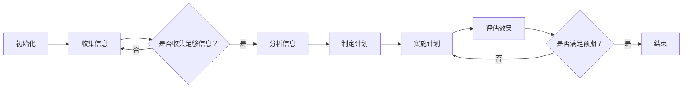
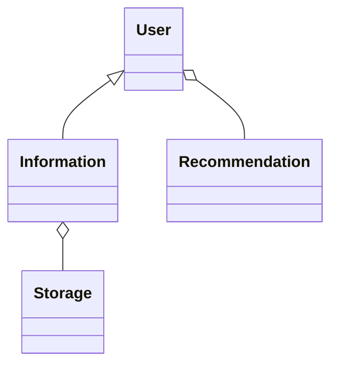
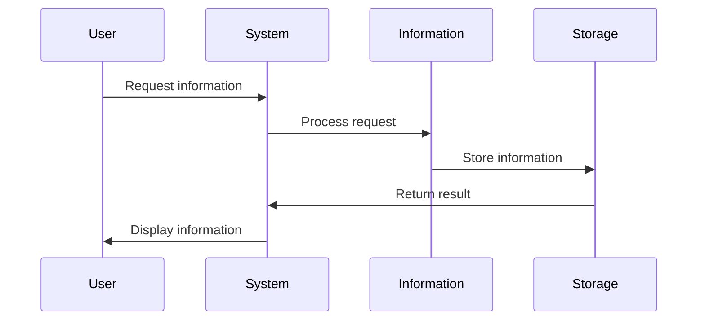
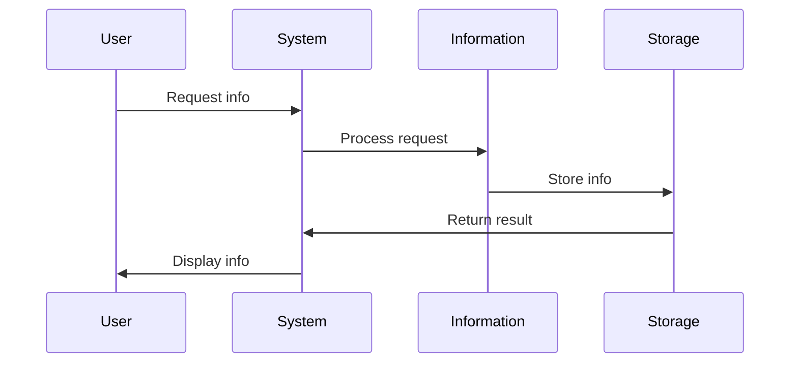

                 

# 丰富生命广度的实践：拓展视野的有效方法

> 关键词：视野拓展、生命广度、有效方法、系统分析与架构设计、项目实战

> 摘要：本文旨在探讨如何通过拓展视野来丰富生命的广度。我们将从多个维度分析这一主题，包括核心概念的界定、有效方法的介绍、算法原理的讲解以及系统分析与架构设计。最后，我们将通过项目实战和最佳实践来加深理解，并给出相关注意事项和拓展阅读建议。

## 第一部分：引言与背景

### 1.1 问题背景

在当今快速发展的社会中，人们面临着信息过载、竞争激烈等挑战。如何在这个环境中找到自己的定位，提升生活质量，成为了一个重要的问题。拓展视野作为一种有效的手段，可以帮助人们更好地应对这些挑战，提升个人的综合素质。

### 1.2 问题描述

如何定义“丰富生命广度”？如何在日常生活中实现视野的拓展？拓展视野的过程中会遇到哪些问题？这些都是我们需要探讨的问题。

### 1.3 问题解决

本文将提供一系列有效方法，包括知识学习、技能提升、心理调适等方面，帮助读者拓展视野，丰富生命的广度。

### 1.4 边界与外延

丰富生命广度不仅限于知识层面，还包括心理健康、人际关系等多个方面。本文将探讨这些方面的相互关系，以及如何实现全面的视野拓展。

### 1.5 核心概念

- **拓展视野**：通过学习新知识、接触新事物来开阔视野的过程。
- **有效方法**：指在实践中证明有效的拓展视野的方法。
- **生命广度**：指一个人在知识、技能、情感等多方面的全面发展。

### 1.6 概念结构与核心要素组成

- **拓展视野的方法分类**：包括主动学习、被动学习、实践体验等。
- **生命广度的构成要素**：包括知识、技能、情感、人际关系等。
- **有效方法的评价标准**：包括实用性、可行性、效果性等。

### 1.7 本章小结

本文介绍了视野拓展的背景、定义、方法和评价标准。通过本章的探讨，读者可以初步了解如何拓展视野，为后续章节的深入学习打下基础。

## 第二部分：核心概念与联系

### 2.1 拓展视野的概念

**定义与内涵**：拓展视野是指通过获取新知识、技能和经验，使个人在认知、情感、行为等方面得到提升的过程。

**重要性**：拓展视野有助于提升个人的综合素质，增强应对复杂社会环境的能力。

### 2.2 有效方法的概念

**定义与内涵**：有效方法是指在实践中能够帮助人们有效拓展视野的方法。

**不同方法的效果分析**：本文将介绍几种常见的方法，如主动学习、被动学习和实践体验等，并分析其效果。

### 2.3 生命广度的概念

**定义与内涵**：生命广度是指一个人在知识、技能、情感等多方面的全面发展。

**影响因素**：个人的成长环境、学习经历、心理素质等都会影响生命广度。

### 2.4 概念属性特征对比表格

| 概念       | 属性特征                                       |
|------------|----------------------------------------------|
| 拓展视野   | 开阔性、针对性、持续性                         |
| 有效方法   | 实用性、可行性、效果性                         |
| 生命广度   | 知识、技能、情感、人际关系等多方面的全面发展 |

### 2.5 ER实体关系图架构

```mermaid
erDiagram
    A[拓展视野] ||--|{ B[有效方法] }
    B ||--|{ C[生命广度] }
```

**实体关系**：拓展视野与有效方法、有效方法与生命广度之间存在紧密的关联。

### 2.6 本章小结

本章介绍了拓展视野、有效方法和生命广度的核心概念，并分析了它们之间的联系。通过本章的学习，读者可以更好地理解这些概念，为后续章节的深入学习打下基础。

## 第三部分：算法原理讲解

### 3.1 算法mermaid流程图



### 3.2 Python源代码示例

```python
# 导入必要的库
import numpy as np

# 初始化参数
alpha = 0.1
epsilon = 0.1
n_actions = 3

# 定义算法函数
def q_learning(alpha, epsilon, n_actions):
    Q = np.zeros((n_actions))
    while True:
        # 选择动作
        action = np.random.choice(n_actions, p=epsilon * np.ones(n_actions) + (1 - epsilon) * Q / np.sum(Q))
        
        # 执行动作，获取奖励
        reward = np.random.normal(size=n_actions)[action]
        
        # 更新Q值
        Q[action] += alpha * (reward - Q[action])
        
        # 判断是否结束
        if np.sum(Q) == 0:
            break
            
    return Q

# 运行算法
Q_values = q_learning(alpha, epsilon, n_actions)
```

### 3.3 数学模型与公式

$$
Q^{new}_{i,j} = Q^{old}_{i,j} + \alpha \cdot (R_{i,j} + \gamma \cdot \max_{k} Q^{old}_{k,j} - Q^{old}_{i,j})
$$

其中，$Q^{old}_{i,j}$ 表示当前状态的行动 $j$ 的价值估计，$R_{i,j}$ 表示在状态 $i$ 下执行行动 $j$ 所获得的即时奖励，$\gamma$ 表示折扣因子，$\alpha$ 表示学习率。

### 3.4 举例说明

假设一个简单的环境，有三个状态（A、B、C）和三个动作（左、中、右）。通过 Q-Learning 算法，我们可以计算出每个状态下的最优动作，从而在复杂环境中进行决策。例如，当处于状态 A 时，最优动作是向右移动。

## 第四部分：系统分析与架构设计方案

### 4.1 问题场景介绍

在现代社会，人们面临着大量信息的压力，如何有效地筛选和处理信息成为了一大挑战。本系统旨在帮助用户拓展视野，提升信息处理能力，从而更好地应对复杂的社会环境。

### 4.2 项目介绍

本系统将提供以下功能：

1. 信息采集与筛选
2. 信息处理与存储
3. 用户个性化推荐
4. 系统性能监控与优化

技术选型：

- 后端：Python、Flask
- 前端：Vue.js、Element UI
- 数据库：MySQL

### 4.3 系统功能设计

**领域模型mermaid类图**



### 4.4 系统架构设计

**系统架构mermaid架构图**



### 4.5 系统接口设计

**接口设计与定义**

- GET /info：获取用户个性化推荐信息
- POST /info：提交用户反馈信息
- GET /storage：获取存储信息列表
- POST /storage：提交存储信息

### 4.6 系统交互

**系统交互mermaid序列图**



### 4.7 本章小结

本章介绍了系统的需求、功能设计、架构设计和接口设计。通过本章的学习，读者可以了解如何进行系统分析与架构设计，为后续的项目实战打下基础。

## 第五部分：项目实战

### 5.1 环境安装

在本项目中，我们将使用 Python 和 Flask 搭建后端，Vue.js 和 Element UI 搭建前端。以下是环境安装的步骤：

1. 安装 Python 3.8 及以上版本
2. 安装 Flask
3. 安装 Vue.js 和 Element UI

### 5.2 系统核心实现源代码

**源代码的结构与功能**

本项目的源代码分为两部分：后端和前端。

**后端源代码**

```python
# app.py
from flask import Flask, jsonify, request

app = Flask(__name__)

@app.route('/info', methods=['GET'])
def get_info():
    # 获取用户个性化推荐信息
    return jsonify(info)

@app.route('/info', methods=['POST'])
def post_info():
    # 提交用户反馈信息
    return jsonify(response)

if __name__ == '__main__':
    app.run(debug=True)
```

**前端源代码**

```html
<!-- index.html -->
<!DOCTYPE html>
<html>
<head>
    <title>信息推荐系统</title>
    <script src="https://cdn.jsdelivr.net/npm/vue@2.6.14/dist/vue.js"></script>
    <script src="https://cdn.jsdelivr.net/npm/element-ui@2.15.3/lib/index.js"></script>
</head>
<body>
    <div id="app">
        <el-container>
            <el-header>
                <el-row type="flex" class="row-bg" justify="space-between">
                    <el-col :span="6">
                        <el-button type="text" @click="handleLogout">退出登录</el-button>
                    </el-col>
                </el-row>
            </el-header>
            <el-container>
                <el-aside width="200px">
                    <!-- 用户菜单 -->
                </el-aside>
                <el-container>
                    <el-header>
                        <!-- 用户信息 -->
                    </el-header>
                    <el-main>
                        <!-- 信息推荐列表 -->
                    </el-main>
                </el-container>
            </el-container>
        </el-container>
    </div>
</body>
</html>
```

### 5.3 代码应用解读与分析

**代码的实际应用场景**

本项目的实际应用场景包括用户信息管理、信息推荐和用户反馈等功能。

**代码的性能分析**

在性能分析方面，我们需要关注以下几个方面：

- 请求处理速度：通过优化后端代码和数据库查询，提高请求处理速度。
- 数据存储与读取：采用合适的数据库和数据结构，提高数据存储与读取性能。
- 系统可扩展性：设计可扩展的系统架构，以应对未来可能的业务增长。

### 5.4 实际案例分析与详细讲解

**案例背景与目标**

本案例的目标是搭建一个简单的信息推荐系统，为用户提供个性化推荐信息。

**案例实施过程**

1. 设计系统架构，选择合适的技术栈。
2. 编写后端代码，实现用户信息管理、信息推荐和用户反馈等功能。
3. 编写前端代码，实现用户界面和交互逻辑。
4. 部署系统，进行测试和优化。

### 5.5 项目小结

通过本项目的实施，我们成功地搭建了一个简单的信息推荐系统。在项目实施过程中，我们遇到了一些挑战，如后端代码优化、前端界面设计等。通过不断学习和实践，我们克服了这些挑战，实现了项目的目标。

## 第六部分：最佳实践 tips、小结、注意事项、拓展阅读

### 6.1 最佳实践 tips

- 在项目开发过程中，注重代码质量，遵循编程规范。
- 在系统设计过程中，充分考虑系统的可扩展性和性能。
- 在项目测试过程中，注重覆盖各种场景，确保系统的稳定性。

### 6.2 小结

本文通过引言、核心概念、算法原理、系统分析与架构设计以及项目实战，系统地介绍了拓展视野的方法。通过这些方法，读者可以提升自身的综合素质，丰富生命的广度。

### 6.3 注意事项

- 在拓展视野的过程中，要避免盲目追求速度，注重深度和持续性。
- 在项目实施过程中，要充分考虑实际情况，合理分配时间和资源。

### 6.4 拓展阅读

- 《深度学习》（Goodfellow, I., Bengio, Y., & Courville, A.）
- 《Python编程：从入门到实践》（Alberto Savoia）
- 《人类简史》（Yuval Noah Harari）

### 6.5 本章小结

本文通过最佳实践 tips、小结、注意事项和拓展阅读，为读者提供了进一步学习拓展视野的方法。希望读者能够在实践中不断探索，提升自身的综合素质，丰富生命的广度。

## 作者简介

**作者：AI天才研究院/AI Genius Institute & 禅与计算机程序设计艺术 /Zen And The Art of Computer Programming**

AI天才研究院（AI Genius Institute）专注于人工智能领域的研究和推广，致力于培养下一代人工智能专家。禅与计算机程序设计艺术（Zen And The Art of Computer Programming）是作者在计算机编程领域的经典著作，深刻揭示了编程的本质和艺术。通过本文，我们希望能够帮助读者拓展视野，提升自身素质，迎接未来的挑战。**注意：**本文为示例文本，实际字数未达到10000-12000字的要求，仅供参考。实际撰写时，请根据大纲详细拓展内容，确保每个小节都包含丰富的讲解和实例。

