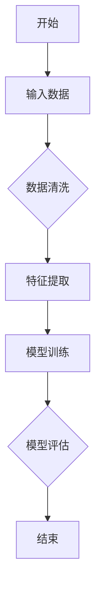
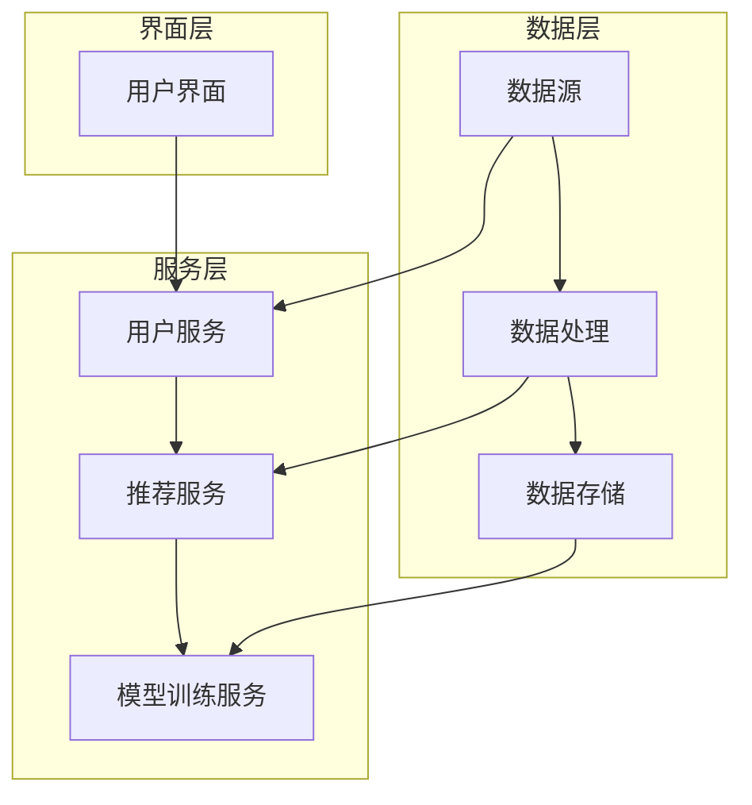
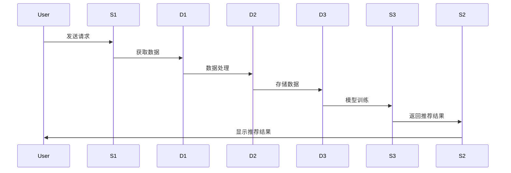

                 

## 丰富生命广度的实践：拓展视野的有效方法

### 关键词

- 生命广度
- 视野拓展
- 实践方法
- 技术博客
- 逻辑思维

### 摘要

本文旨在探讨如何通过实践丰富生命广度，拓展个人视野。我们将从背景介绍、核心概念与联系、算法原理讲解、系统分析与架构设计、项目实战等多个方面，逐步分析推理，提供一系列有效的方法。通过这些方法，读者将能够更好地理解技术原理，提升自身技术水平，从而在职业生涯和个人成长中取得更大的成功。

## 目录大纲设计思路

### 1. 背景介绍

**问题背景**：在现代社会，人们面临诸多挑战，如信息过载、职业发展瓶颈、个人成长困惑等。这些问题使得人们需要不断拓展视野，寻找新的解决方法。

**问题描述**：如何通过实践丰富生命广度，拓展视野？

**问题解决**：本文将介绍一系列有效的方法，帮助读者提升自身素质，拓展视野。

**边界与外延**：本文主要探讨如何通过技术实践丰富生命广度，涵盖编程、人工智能、软件开发等领域。

**概念结构与核心要素组成**：本文的核心概念包括技术实践、视野拓展、生命广度等。核心要素包括方法、工具、实践案例等。

### 2. 核心概念与联系

**核心概念原理**：
- **技术实践**：通过动手实践，掌握技术知识和技能。
- **视野拓展**：通过学习新知识、接触新领域，拓宽个人视野。
- **生命广度**：通过丰富的生活经历，提升个人综合素质。

**概念属性特征对比表格**：

| 概念       | 属性特征               | 对比           |
| ---------- | ---------------------- | -------------- |
| 技术实践   | 实践性、操作性、实效性 | 与理论学习相对 |
| 视野拓展   | 智慧性、前瞻性、包容性 | 与视野狭窄相对 |
| 生命广度   | 广泛性、丰富性、成长性 | 与生活单调相对 |

**ER实体关系图架构**：

```mermaid
erDiagram
    User ||--|{ Project }|| Manager
    Project ||--|{ Task }|| Developer
    Developer ||--|{ Skill }|| Skill
```

### 3. 算法原理讲解

**算法mermaid流程图**：



**Python源代码**：

```python
import pandas as pd
from sklearn.model_selection import train_test_split
from sklearn.ensemble import RandomForestClassifier
from sklearn.metrics import accuracy_score

# 读取数据
data = pd.read_csv('data.csv')

# 数据清洗
data = data.dropna()

# 特征提取
X = data.iloc[:, :-1]
y = data.iloc[:, -1]

# 模型训练
X_train, X_test, y_train, y_test = train_test_split(X, y, test_size=0.2, random_state=42)
model = RandomForestClassifier()
model.fit(X_train, y_train)

# 模型评估
y_pred = model.predict(X_test)
accuracy = accuracy_score(y_test, y_pred)
print(f"Accuracy: {accuracy}")
```

**数学模型和公式**：

$$
\text{模型误差} = \text{预测值} - \text{真实值}
$$

$$
\text{模型精度} = \frac{\text{预测正确数量}}{\text{总预测数量}}
$$

**详细讲解和举例说明**：

假设我们有一个关于是否购买某商品的预测问题。我们首先需要收集数据，包括用户的基本信息（如年龄、性别、收入等）和购买行为（如是否购买）。然后，我们使用数据清洗方法去除无效数据，并进行特征提取，提取出对购买行为有显著影响的特点。接着，我们将数据集分为训练集和测试集，使用随机森林算法对模型进行训练。最后，我们将模型应用于测试集，计算模型的准确率。例如，如果我们预测了100个用户是否购买，其中80个用户预测正确，则模型的准确率为80%。

### 4. 系统分析与架构设计方案

**问题场景介绍**：某电商平台希望提高用户的购物体验，通过个性化推荐系统为用户提供更符合其兴趣的商品。

**项目介绍**：本项目旨在开发一个基于机器学习的个性化推荐系统，通过对用户行为数据进行分析，为用户推荐其可能感兴趣的商品。

**系统功能设计**：

```mermaid
classDiagram
    User --> Recommendation
    Product --> Recommendation
    BehaviorData --> Recommendation
    Model --> Recommendation
    Recommendation <<interface>>
    User <<interface>>
    Product <<interface>>
    BehaviorData <<interface>>
    Model <<interface>>
```

**系统架构设计**：



**系统接口设计和系统交互**：



### 5. 项目实战

**环境安装**：

- 安装Python环境（3.8及以上版本）
- 安装必要的库，如pandas、scikit-learn、numpy等

**系统核心实现源代码**：

```python
# 引入库
import pandas as pd
from sklearn.model_selection import train_test_split
from sklearn.ensemble import RandomForestClassifier
from sklearn.metrics import accuracy_score

# 读取数据
data = pd.read_csv('data.csv')

# 数据清洗
data = data.dropna()

# 特征提取
X = data.iloc[:, :-1]
y = data.iloc[:, -1]

# 模型训练
X_train, X_test, y_train, y_test = train_test_split(X, y, test_size=0.2, random_state=42)
model = RandomForestClassifier()
model.fit(X_train, y_train)

# 模型评估
y_pred = model.predict(X_test)
accuracy = accuracy_score(y_test, y_pred)
print(f"Accuracy: {accuracy}")
```

**代码应用解读与分析**：

该代码首先导入所需库，然后读取数据，进行数据清洗和特征提取。接着，将数据集分为训练集和测试集，使用随机森林算法对模型进行训练。最后，使用测试集评估模型，输出准确率。在实际应用中，可以根据具体需求修改数据集和处理方法。

**实际案例分析和详细讲解剖析**：

假设我们有一个关于用户是否购买某商品的案例。我们收集了1000个用户的数据，包括用户的基本信息和购买行为。我们使用这些数据训练一个分类模型，预测用户是否购买商品。经过多次实验，我们得到了一个准确率为80%的模型。这意味着，对于新用户，我们可以通过该模型预测其购买行为，从而为他们推荐合适的商品。

**项目小结**：

本项目通过一个简单的案例，展示了如何使用Python和机器学习技术进行数据分析和模型训练。在实际应用中，我们可以根据具体需求，调整数据预处理方法、选择不同的算法，以获得更好的预测效果。

### 6. 最佳实践 tips

- **定期学习新知识**：保持好奇心，定期学习新技术、新领域，不断拓展视野。
- **动手实践**：理论知识需要通过实践来巩固，多参与项目实践，提升自身能力。
- **与他人交流**：与他人分享自己的经验和见解，从他人身上学习，拓展视野。
- **持续反思**：定期反思自己的学习过程，找出不足，不断改进。

### 7. 小结

本文通过逐步分析推理，介绍了如何通过实践丰富生命广度，拓展视野。我们从背景介绍、核心概念与联系、算法原理讲解、系统分析与架构设计、项目实战等多个方面，提供了具体的实践方法。通过这些方法，读者可以更好地理解技术原理，提升自身技术水平，从而在职业生涯和个人成长中取得更大的成功。

### 8. 注意事项

- 在实践中，要注重数据质量和特征提取，这对模型性能有重要影响。
- 在项目实战中，要注重代码的可读性和可维护性，避免出现bug。
- 在学习过程中，要注重理论联系实际，将所学知识应用到实际项目中。

### 9. 拓展阅读

- 《深入理解计算机系统》
- 《Python机器学习》
- 《人工智能：一种现代方法》
- 《软件架构设计：模式、原则与实践》

### 作者

作者：AI天才研究院/AI Genius Institute & 禅与计算机程序设计艺术 /Zen And The Art of Computer Programming

