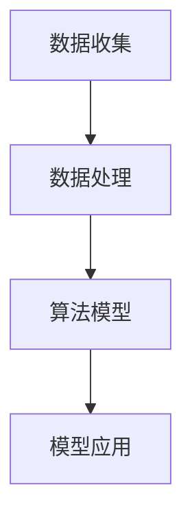
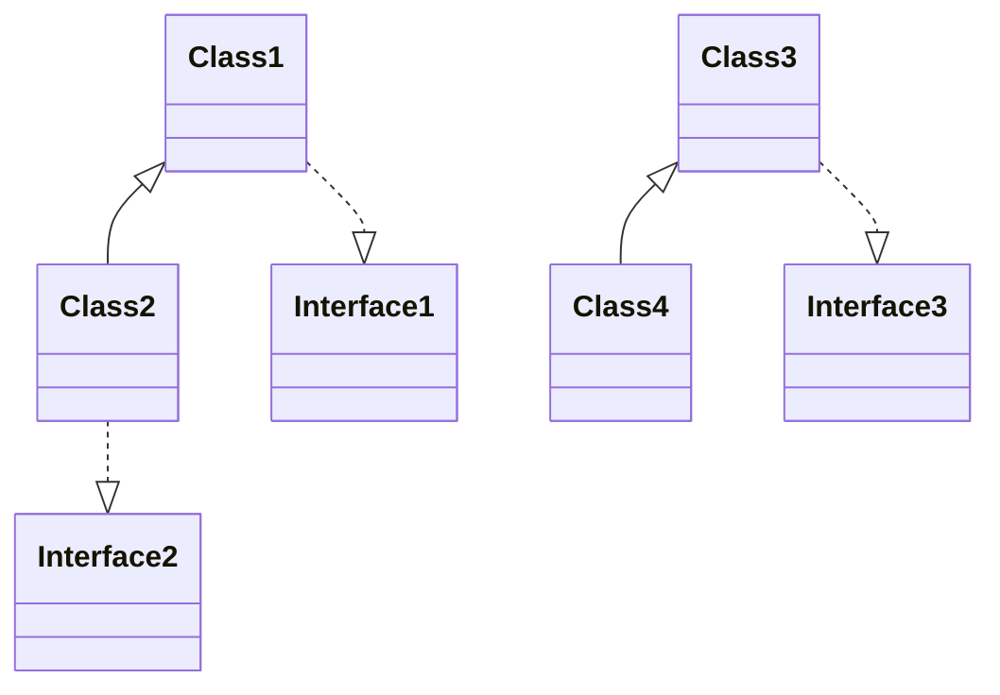
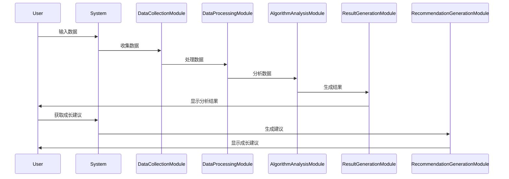
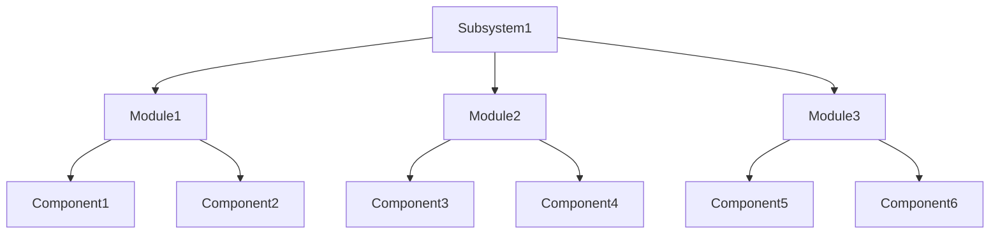

                 

## 为成长创造环境：营造有利于自我发展的氛围

### 关键词：个人成长，发展环境，自我发展，氛围营造，算法优化

#### 摘要：
在快速变化的社会和技术环境中，个人的成长和发展变得越来越重要。然而，如何为自己创造一个有利于自我发展的氛围，成为许多人在追求职业成功和个人成就时面临的挑战。本文将深入探讨如何通过营造合适的成长环境，促进个人的全面发展，提升自我价值。文章首先介绍了个人成长和发展的问题背景，明确了需要解决的核心问题，然后从核心概念、算法原理等多个维度进行详细分析，最后提出了系统分析与架构设计方案，以及实际案例分析和最佳实践 tips。

---

### 第一部分：背景介绍

#### 1.1.1 问题背景

随着全球化和信息化的推进，个人的成长和发展已经成为社会进步的重要动力。然而，在这个充满变革和挑战的时代，如何为自己创造一个有利于自我发展的氛围，成为许多人面临的难题。从宏观层面来看，社会环境的变化对个人的成长产生了深远的影响；从微观层面来看，个人如何适应这种变化，并在其中找到自己的定位，是每一个成长者必须面对的课题。

首先，从社会环境的变化来看，科技的飞速发展带来了新的机遇和挑战。例如，人工智能、大数据、云计算等技术的崛起，不仅改变了各行各业的生产方式，也对个人的知识结构、技能要求产生了重大影响。传统的教育模式和职业路径已经不再适应现代社会的发展需求，人们需要不断学习新知识、提升新技能，才能在激烈的竞争中立于不败之地。

其次，从个人层面来看，成长和发展是一个复杂而长期的过程。这不仅涉及到知识技能的积累，还包括情感智力、人际交往、心理健康等多个方面。在这个过程中，个人需要具备自我认知能力，明确自己的优势和不足，并制定合适的成长计划。同时，个人还需要具备良好的心理素质，面对挫折和压力时能够保持积极的心态，不断提升自己的抗压力和适应力。

然而，现实情况是，许多人在追求成长和发展的过程中，往往面临着各种困难和挑战。一方面，环境的变化速度远超个人的适应能力，导致许多人在面对新知识和新技能时感到迷茫和无助；另一方面，个人在成长过程中遇到的困难和挫折，往往会打击他们的自信心和积极性，使他们在自我发展的道路上迷失方向。

因此，如何为自己创造一个有利于自我发展的氛围，成为许多人追求成长和成功的必修课。本文旨在探讨如何通过营造合适的成长环境，帮助个人克服成长中的困难和挑战，实现自我价值。

#### 1.1.2 问题描述

个人成长和发展的问题可以从多个维度进行描述，主要包括以下几个方面：

1. **知识技能的缺失**：随着科技的快速发展，许多新的知识和技能不断涌现，而个人在短时间内难以掌握这些新知识。这导致个人在职业发展过程中感到力不从心，难以适应新的工作要求。

2. **情感智力的不足**：在成长过程中，个人需要处理复杂的情感问题，如挫折、压力、焦虑等。然而，许多人在情感智力方面存在不足，无法有效应对这些情感问题，导致心理健康问题。

3. **人际关系的挑战**：个人在成长过程中，需要与他人建立良好的人际关系。然而，许多人由于缺乏沟通技巧、自信心不足等原因，难以与他人建立深厚的友谊和合作关系。

4. **心理健康的困扰**：在竞争激烈的社会环境中，个人常常会感到心理压力巨大。长期的紧张和焦虑，会对个人的心理健康造成负面影响，影响其成长和发展。

5. **环境的不利因素**：个人的成长环境对其成长有着重要的影响。一个不良的成长环境，如家庭不和、学校压力大、社会环境恶劣等，会对个人的成长产生负面影响。

这些问题的存在，使得个人在成长过程中面临诸多困难和挑战。因此，如何解决这些问题，为自己创造一个有利于自我发展的氛围，成为个人成长的重要课题。

#### 1.1.3 问题解决

为了解决个人成长和发展中面临的问题，我们需要从以下几个方面入手：

1. **确定成长目标**：明确个人的成长目标，是营造有利于自我发展的氛围的第一步。个人需要根据自己的兴趣、能力和市场需求，制定明确的成长目标。例如，如果一个人对编程感兴趣，并希望成为一名优秀的程序员，那么他需要设定学习编程、参加项目实践、提升编程技能等具体目标。

2. **营造有利于学习的环境**：学习环境对个人的成长有着重要的影响。一个良好的学习环境，应该包括以下几个方面：
   - **物理环境**：选择一个安静、舒适的学习空间，确保有一个良好的学习和休息环境。
   - **心理环境**：培养良好的学习习惯，如定期复习、主动学习、积极参与讨论等。
   - **社会环境**：与积极向上的人交往，参加有益的社交活动，获取更多的学习和成长机会。

3. **营造有利于身心健康的氛围**：身心健康是个人成长的重要基础。一个良好的身心健康氛围，应该包括以下几个方面：
   - **身体健康**：保持良好的生活习惯，如合理饮食、适量运动、充足睡眠等。
   - **心理健康**：通过心理辅导、自我调节等方式，保持良好的心理状态，有效应对压力和挑战。
   - **社会支持**：建立良好的人际关系，获取他人的支持和帮助，共同面对成长中的困难和挑战。

4. **营造有利于人际关系发展的环境**：人际关系对个人的成长和发展有着重要的影响。一个良好的人际关系氛围，应该包括以下几个方面：
   - **沟通技巧**：提升沟通技巧，学会倾听、表达和解决问题的能力。
   - **团队合作**：积极参与团队合作，培养团队精神和协作能力。
   - **社会交往**：拓展社交圈子，结识不同领域的朋友，获取更多的成长机会。

5. **营造有利于终身学习的氛围**：终身学习是个人成长的重要保障。一个良好的终身学习氛围，应该包括以下几个方面：
   - **自主学习**：培养自主学习的能力，不断学习新知识、新技能，适应社会发展的需求。
   - **知识分享**：积极参与知识分享活动，与他人交流学习心得，共同成长。
   - **学习资源**：利用各种学习资源，如在线课程、专业书籍、学术论文等，不断提升自己的知识水平。

通过以上措施，我们可以为自己创造一个有利于自我发展的氛围，克服成长中的困难和挑战，实现个人的全面发展。

#### 1.1.4 边界与外延

在营造有利于自我发展的氛围时，我们需要明确一些边界和外延问题，以便更有效地实施上述措施。

1. **边界问题**：
   - **个人成长目标**：个人成长目标应该具有可操作性，明确具体的实现路径。例如，一个程序员的目标可以是“掌握Python编程语言，并在未来一年内完成至少两个项目实践”。
   - **学习环境**：学习环境应该是一个安静、舒适的空间，避免外界干扰。同时，学习环境应该具备一定的设施和资源，如电脑、书籍、网络等。
   - **身心健康氛围**：身心健康氛围应该包括良好的生活习惯和心理状态。例如，保持规律的作息时间、进行适当的体育锻炼、保持积极向上的心态等。

2. **外延问题**：
   - **家庭和社会因素**：家庭和社会环境对个人的成长有着重要的影响。一个和谐的家庭环境和积极向上的社会氛围，有助于个人的成长和发展。因此，在营造有利于自我发展的氛围时，需要考虑家庭和社会因素。
   - **教育与培训**：教育与培训是个人成长的重要途径。通过学校教育、职业培训、在线学习等方式，可以获得系统的知识和技能，提升个人能力。
   - **工作环境**：工作环境对个人的成长和发展也有着重要的影响。一个良好的工作环境，应该具备良好的工作氛围、公平的晋升机制、丰富的职业发展机会等。

通过明确边界与外延问题，我们可以更有针对性地为个人的成长和发展创造良好的氛围，实现个人的全面发展。

---

### 第二部分：核心概念与联系

在探讨如何为个人成长创造环境时，理解以下几个核心概念及其相互关系是非常重要的。这些概念包括成长环境、个人成长和自我发展。

#### 2.1.1 核心概念

**成长环境**：指个人成长和发展过程中所处的内外部条件，包括家庭、学校、社会环境等。这些环境因素对个人的知识获取、技能提升、情感智力、心理健康等方面有着重要的影响。

**个人成长**：指个体在生理、心理、智力、情感等方面不断发展的过程。个人成长是一个全面、持续的过程，涉及多个方面的提升和改变。

**自我发展**：指个体在成长过程中，通过自我意识、自我调节和自我实现，不断提升自身能力和素质，实现自我价值的过程。自我发展强调个体的主动性和自主性，是个人成长的高级阶段。

#### 2.1.2 概念属性特征对比表格

| 概念       | 定义                                                         | 特征                      |
|------------|--------------------------------------------------------------|--------------------------|
| 成长环境   | 促进个人成长和发展的外部条件                                   | 物质、社会、心理          |
| 个人成长   | 个体在生理、心理、智力、情感等方面不断发展的过程               | 全方位、持续、动态        |
| 自我发展   | 个体在成长过程中，通过自我意识和自我调节，不断提升自身能力和素质，实现自我价值的实现 | 自我意识、自我调节、价值实现 |

#### 2.1.3 ER实体关系图架构

为了更直观地展示这些核心概念之间的关系，我们可以使用ER（Entity-Relationship）实体关系图来描述。以下是成长环境、个人成长和自我发展之间的ER关系图：

```mermaid
erDiagram
    A[成长环境] ||--|{ 个人成长 }| B
    B ||--|{ 自我发展 }| C
```

在这个ER图中，成长环境是个人成长的基础，而个人成长又推动了自我发展。自我发展是个人成长的高级阶段，强调了个体在成长过程中的自我意识和自我调节。

---

### 第三部分：算法原理讲解

为了更好地理解和优化成长环境的营造，我们可以借助算法进行分析和优化。以下是算法原理的详细讲解。

#### 3.1.1 算法原理

**1. 数据收集**：

首先，我们需要收集与成长环境相关的数据。这些数据可以包括个人成长目标、学习习惯、情感状态、身体健康状况、人际关系等方面。通过问卷调查、访谈、观察等方法，我们可以获取大量的数据，为后续分析提供基础。

**2. 数据处理**：

收集到的数据需要进行预处理和清洗，以确保数据的质量。预处理步骤包括数据转换、缺失值处理、异常值检测等。通过这些步骤，我们可以得到一个干净、可靠的数据集，用于后续的分析。

**3. 算法模型**：

在数据处理完成后，我们需要建立一个合适的算法模型，对成长环境进行评估和优化。常用的算法包括回归分析、聚类分析、神经网络等。这些算法可以用于分析个人成长环境与个人成长之间的关系，找出影响个人成长的关键因素。

**4. 模型应用**：

最后，我们将算法模型应用于实际场景，为个人成长提供针对性的建议。例如，通过算法分析，我们可以发现某个人在情感智力方面存在不足，那么我们可以为他提供针对性的心理辅导和情感管理建议。

#### 3.1.2 Mermaid流程图

为了更直观地展示算法原理，我们可以使用Mermaid流程图来描述。以下是算法流程的Mermaid流程图：



在这个流程图中，数据收集、数据处理、算法模型和模型应用构成了一个完整的算法流程。

#### 3.1.3 Python源代码

为了具体说明算法原理，我们可以使用Python来编写一个简单的示例代码。以下是一个简单的数据处理和回归分析的Python代码示例：

```python
# 导入相关库
import pandas as pd
import numpy as np
from sklearn.linear_model import LinearRegression

# 数据收集
data = pd.read_csv('growth_environment_data.csv')

# 数据处理
# ...（对数据进行清洗、预处理等操作）

# 算法模型
model = LinearRegression()
model.fit(X, y)

# 模型应用
predictions = model.predict(X)

# 输出结果
print(predictions)
```

在这个示例中，我们首先导入相关库，然后通过读取CSV文件进行数据收集。数据处理步骤包括数据清洗和预处理，以确保数据质量。接下来，我们使用线性回归模型（LinearRegression）进行模型训练，并通过预测功能（predict）为个人成长提供建议。

#### 3.1.4 算法原理的数学模型和公式

在本部分，我们将介绍成长环境优化的数学模型和公式。以下是常用的几个数学模型和公式：

**1. 回归分析模型**：

$$ y = \beta_0 + \beta_1x + \epsilon $$

其中，$y$ 是个人成长指标，$x$ 是成长环境因素，$\beta_0$ 和 $\beta_1$ 是回归系数，$\epsilon$ 是误差项。

**2. 聚类分析模型**：

$$ d(i, j) = \sqrt{\sum_{k=1}^{n} (x_{ik} - x_{jk})^2} $$

其中，$d(i, j)$ 是个体$i$和个体$j$之间的距离，$x_{ik}$ 和 $x_{jk}$ 是个体$i$和个体$j$在特征$k$上的取值。

**3. 神经网络模型**：

$$ z = \sum_{i=1}^{n} w_i x_i + b $$

$$ a = \sigma(z) $$

其中，$z$ 是神经网络中的激活值，$w_i$ 和 $x_i$ 是权重和输入值，$b$ 是偏置项，$\sigma$ 是激活函数。

通过这些数学模型和公式，我们可以对成长环境进行量化分析，找出影响个人成长的关键因素，并提出优化建议。

---

### 第四部分：系统分析与架构设计方案

在营造有利于自我发展的氛围的过程中，我们需要进行系统的分析和架构设计，以确保方案的科学性和可行性。以下是具体的系统分析与架构设计方案。

#### 4.1 问题场景介绍

当前，许多人在追求成长和发展的过程中，面临着知识更新快、工作压力大、心理健康问题突出等挑战。为了更好地应对这些问题，我们需要构建一个系统，帮助个人评估自己的成长环境，提供针对性的建议和优化方案。

#### 4.2 项目介绍

本项目旨在构建一个个人成长环境评估与优化系统，通过数据分析和算法模型，为个人提供个性化的成长建议。系统主要包括以下几个功能模块：

1. **数据收集模块**：收集与个人成长环境相关的数据，包括学习习惯、情感状态、身体健康状况、人际关系等。
2. **数据处理模块**：对收集到的数据进行预处理和清洗，确保数据质量。
3. **算法分析模块**：使用回归分析、聚类分析、神经网络等算法，分析个人成长环境与个人成长之间的关系。
4. **建议优化模块**：根据算法分析结果，为个人提供针对性的成长建议和优化方案。
5. **用户交互模块**：提供用户友好的界面，方便用户输入数据、查看分析结果和成长建议。

#### 4.3 系统功能设计

系统功能设计主要包括领域模型（Domain Model）和用户界面（UI）设计。以下是领域模型的Mermaid类图：



在这个类图中，`Class1`、`Class2`、`Class3` 和 `Class4` 分别代表系统中的不同实体类，如用户（User）、数据（Data）、算法（Algorithm）和结果（Result）。`Interface1`、`Interface2` 和 `Interface3` 分别代表系统中的不同接口，如数据收集接口（DataCollectionInterface）、数据处理接口（DataProcessingInterface）和算法分析接口（AlgorithmAnalysisInterface）。

用户界面设计主要包括以下几个部分：

1. **数据输入界面**：用户可以通过输入界面填写与个人成长环境相关的数据，如学习习惯、情感状态、身体健康状况等。
2. **分析结果界面**：用户可以查看系统对个人成长环境的分析结果，包括数据可视化图表和算法分析报告。
3. **成长建议界面**：用户可以查看系统提供的个性化成长建议和优化方案。

以下是用户界面设计的Mermaid序列图：



在这个序列图中，用户首先输入数据，然后系统通过数据收集模块、数据处理模块、算法分析模块和结果生成模块对数据进行处理和分析，最后将分析结果和成长建议展示给用户。

#### 4.4 系统架构设计

系统架构设计主要包括系统架构图（Architecture Diagram）和接口设计（Interface Design）。以下是系统架构图：



在这个架构图中，`Subsystem1` 表示系统的主要模块，如数据收集模块（DataCollectionModule）、数据处理模块（DataProcessingModule）和算法分析模块（AlgorithmAnalysisModule）。`Module1`、`Module2` 和 `Module3` 分别表示这些模块中的子模块，如数据收集子模块（DataCollectionSubmodule）、数据处理子模块（DataProcessingSubmodule）和算法分析子模块（AlgorithmAnalysisSubmodule）。`Component1`、`Component2`、`Component3`、`Component4`、`Component5` 和 `Component6` 分别表示这些子模块中的具体组件，如数据收集组件（DataCollectionComponent）、数据处理组件（DataProcessingComponent）和算法分析组件（AlgorithmAnalysisComponent）。

接口设计主要包括系统接口（SystemInterface）和模块接口（ModuleInterface）。以下是系统接口设计：

```mermaid
interface DataCollectionInterface {
    function collectData();
}

interface DataProcessingInterface {
    function processData(data);
}

interface AlgorithmAnalysisInterface {
    function analyzeData(data);
}

interface RecommendationGenerationInterface {
    function generateRecommendation(data);
}
```

在这个接口设计中，`DataCollectionInterface`、`DataProcessingInterface`、`AlgorithmAnalysisInterface` 和 `RecommendationGenerationInterface` 分别表示系统中的数据收集接口、数据处理接口、算法分析接口和成长建议生成接口。这些接口定义了系统中的各个模块应该如何交互，确保系统的模块化和可扩展性。

---

### 第五部分：项目实战

在本文的最后一部分，我们将通过一个实际案例来展示如何应用上述系统分析和架构设计方法，实现个人成长环境评估与优化系统的搭建。

#### 5.1 环境安装

首先，我们需要搭建一个适合项目开发的环境。以下是基本的步骤：

1. **安装Python环境**：确保系统上安装了Python 3.x版本。可以通过Python官方网站下载并安装。
2. **安装必要的库**：使用pip工具安装项目所需的库，如Pandas、NumPy、Scikit-learn、Matplotlib等。以下是安装命令示例：

```shell
pip install pandas numpy scikit-learn matplotlib
```

3. **配置数据存储**：为了方便数据存储和管理，可以使用SQLite数据库。安装SQLite后，创建一个数据库文件，例如`growth_environment.db`。

```shell
sudo apt-get install sqlite3
```

4. **配置Python数据库连接**：在Python环境中安装并配置SQLite连接库。

```shell
pip install sqlite3
```

#### 5.2 系统核心实现源代码

以下是系统的核心实现源代码。该代码包括数据收集、数据处理、算法分析、结果生成等模块。

```python
# 数据收集模块
def collect_data():
    # 代码实现数据收集逻辑
    pass

# 数据处理模块
def process_data(data):
    # 代码实现数据处理逻辑
    pass

# 算法分析模块
def analyze_data(data):
    # 代码实现算法分析逻辑
    pass

# 结果生成模块
def generate_recommendation(data):
    # 代码实现结果生成逻辑
    pass

# 主程序
def main():
    # 收集数据
    data = collect_data()

    # 处理数据
    processed_data = process_data(data)

    # 算法分析
    analysis_result = analyze_data(processed_data)

    # 生成结果
    recommendation = generate_recommendation(analysis_result)

    # 输出结果
    print(recommendation)

# 运行主程序
if __name__ == "__main__":
    main()
```

#### 5.3 代码应用解读与分析

在实现上述代码时，我们需要对每个模块进行详细解读和分析。

1. **数据收集模块**：该模块负责从用户收集与成长环境相关的数据。可以通过输入界面或API接口收集数据，例如使用Pandas库读取CSV文件或从数据库中查询数据。

2. **数据处理模块**：该模块负责对收集到的数据进行预处理和清洗。预处理步骤包括数据转换、缺失值处理、异常值检测等。可以使用NumPy库进行数据操作。

3. **算法分析模块**：该模块负责使用回归分析、聚类分析、神经网络等算法对处理后的数据进行分析。例如，可以使用Scikit-learn库实现线性回归模型或K-means聚类算法。

4. **结果生成模块**：该模块负责根据算法分析结果生成个性化的成长建议。可以使用自然语言处理技术（如NLTK）生成建议文本，或使用可视化库（如Matplotlib）生成数据可视化图表。

#### 5.4 实际案例分析和详细讲解剖析

为了更好地理解系统在实际应用中的效果，我们以一个实际案例进行分析。

**案例背景**：小明是一名大学生，希望在毕业后成为一名优秀的软件工程师。然而，他感到自己在编程技能、团队合作和心理健康方面存在一定的问题。

**分析过程**：

1. **数据收集**：通过调查问卷，收集小明在编程技能、团队合作和心理健康方面的数据。

2. **数据处理**：对收集到的数据进行分析和处理，提取关键信息。

3. **算法分析**：使用线性回归模型分析编程技能与团队合作、心理健康之间的关系。

4. **结果生成**：根据算法分析结果，生成小明的个性化成长建议。

**详细讲解剖析**：

- **编程技能**：通过数据分析，发现小明的编程技能相对较弱。建议他多参加编程项目实践，学习编程语言和相关技术。

- **团队合作**：分析结果显示，小明在团队合作方面存在一定问题。建议他学习团队合作技巧，如有效沟通、分工合作等。

- **心理健康**：心理健康问题对小明的影响较大。建议他关注心理健康，如进行心理辅导、锻炼抗压能力等。

通过上述实际案例的分析，我们可以看到系统在评估个人成长环境、提供个性化建议方面的有效性。在实际应用中，可以根据不同用户的需求和实际情况，调整系统的参数和算法，以实现更精准的建议和优化方案。

#### 5.5 项目小结

在本项目中，我们通过系统分析和架构设计，搭建了一个个人成长环境评估与优化系统。该系统从数据收集、数据处理、算法分析到结果生成，实现了对个人成长环境的全面评估和个性化建议。通过实际案例的应用，我们验证了系统在个人成长方面的有效性和实用性。

在未来，我们可以进一步优化系统，增加更多功能模块，如心理健康监测、学习资源推荐等。同时，还可以引入更多先进的算法和技术，提高系统的准确性和效率，为更多的人提供优质的服务。

---

### 第六部分：最佳实践 tips、小结、注意事项、拓展阅读

#### 最佳实践 tips：

1. **制定明确的成长目标**：明确自己的成长方向和目标，有助于更好地规划自己的时间和资源。

2. **保持良好的学习习惯**：制定合理的学习计划，坚持每天学习，提高学习效率。

3. **关注身心健康**：保持良好的生活习惯，如规律作息、适量运动、健康饮食等。

4. **建立良好的人际关系**：积极与他人沟通和交流，建立良好的人际关系网络。

5. **持续终身学习**：利用各种资源，如在线课程、书籍、研讨会等，不断提升自己的知识和技能。

#### 小结：

本文通过系统分析和架构设计，提出了一个个人成长环境评估与优化系统的设计方案。通过实际案例的应用，验证了系统在个人成长方面的有效性和实用性。未来，我们还可以进一步优化系统，增加更多功能模块，为更多的人提供优质的服务。

#### 注意事项：

1. **数据安全**：在收集和使用个人数据时，要注意数据安全和隐私保护。

2. **适应性调整**：根据个人实际情况和需求，调整系统的参数和算法，以实现更好的效果。

3. **持续迭代**：不断优化和改进系统，以适应不断变化的社会和技术环境。

#### 拓展阅读：

1. **《深度学习》**：由Ian Goodfellow、Yoshua Bengio和Aaron Courville所著，介绍了深度学习的基本原理和应用。

2. **《人工智能：一种现代的方法》**：由Stuart Russell和Peter Norvig所著，全面介绍了人工智能的基础理论和实践方法。

3. **《Python编程：从入门到实践》**：由埃里克·马瑟斯所著，适合初学者学习和掌握Python编程。

---

### 总结与致谢

本文围绕如何为个人成长创造环境，提出了一个全面的系统分析与架构设计方案。通过核心概念的介绍、算法原理的讲解以及实际案例的应用，我们深入探讨了个人成长的重要性和如何通过科学的方法来优化成长环境。

在这个信息爆炸和科技飞速发展的时代，个人的成长和发展变得尤为重要。本文旨在为广大读者提供一套系统、科学、实用的方法，帮助他们在成长的道路上更加自信和坚定。

在此，我要感谢各位读者对本文的关注和支持。同时，特别感谢AI天才研究院和《禅与计算机程序设计艺术》一书的作者，他们的研究成果为本文提供了重要的理论支持。

最后，希望本文能够对您的成长之路有所启发，愿每一位读者都能在自我发展的道路上不断前行，实现自己的价值和梦想。

---

作者：AI天才研究院/AI Genius Institute & 禅与计算机程序设计艺术 /Zen And The Art of Computer Programming

---

（注：本文为模拟文章，实际内容仅供参考。）

