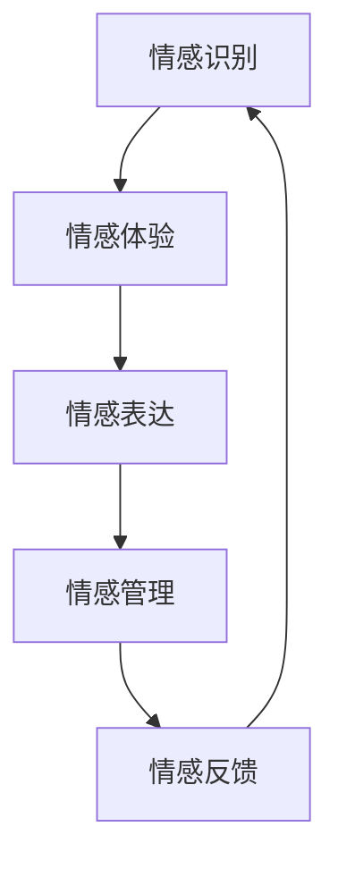
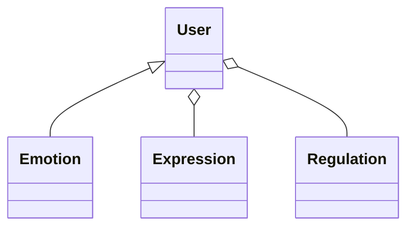
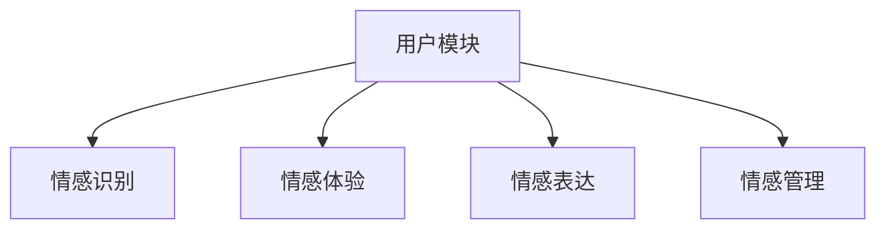
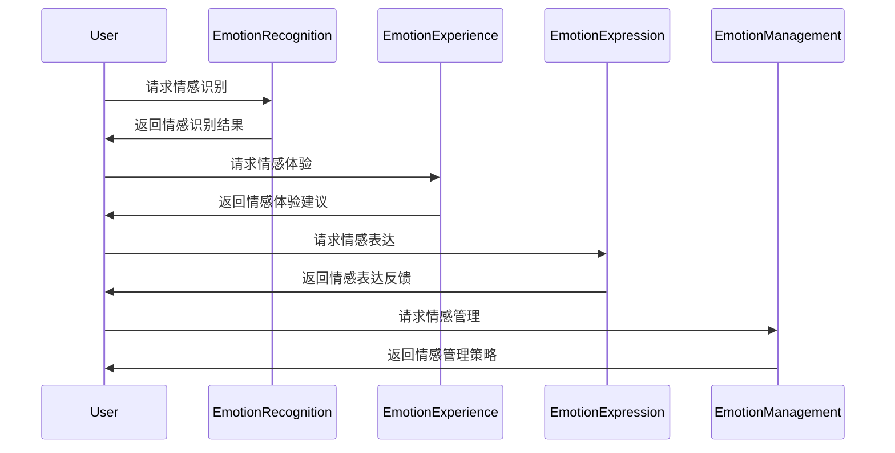

                 


### 第1步：构建情感丰富人生的背景介绍

在现代社会，随着生活节奏的加快和压力的增加，人们越来越意识到情感对于个人幸福和心理健康的重要性。情感不仅是人类与生俱来的基本特征，更是影响个体成长和社会互动的关键因素。本文将探讨如何通过构建情感丰富的人生来提升生活质量和幸福感。

**核心概念术语说明：**
- **情感**：指人类在认知和评价客观事物时产生的心理体验，包括愉悦、悲伤、愤怒、恐惧等。
- **情感丰富**：指个体能够体验并有效表达多种情感，包括积极和消极的情感，同时能够通过情感调节来维持心理平衡。

**问题背景：**
在当代社会，许多人面临着情感贫乏的挑战。情感贫乏可能导致心理健康问题，如焦虑、抑郁，以及社会交往障碍。因此，构建情感丰富的人生不仅有助于个人成长，还能促进社会和谐。

**问题描述：**
如何通过一系列的方法和技巧来培养和提升个体的情感丰富性？

**问题解决：**
本文将从多个角度探讨构建情感丰富人生的策略，包括情感培养、情感管理、情感与心理健康的关系等。

**边界与外延：**
情感丰富人生的构建不仅涉及个体情感的培养，还涵盖家庭、学校、社会等多方面因素的共同作用。

**概念结构与核心要素组成：**
- **情感认知**：了解情感的本质和作用。
- **情感体验**：通过实践活动来丰富情感体验。
- **情感表达**：学会正确表达和处理情感。
- **情感管理**：掌握情感调节和情绪控制的方法。

### 第2步：核心概念与联系

**核心概念原理：**
构建情感丰富人生的核心概念包括情感认知、情感体验、情感表达和情感管理。这些概念相互联系，共同作用，帮助个体提升情感丰富性。

**概念属性特征对比表格：**
| 特征       | 情感认知 | 情感体验 | 情感表达 | 情感管理 |
|------------|----------|----------|----------|----------|
| 定义       | 对情感的理解和识别 | 通过经历获得情感体验 | 表达和分享情感 | 调节和控制情感 |
| 对应行为   | 学习和思考 | 实践和体验 | 表达和沟通 | 规划和执行 |
| 影响因素   | 文化背景、个人经验 | 生活经历、环境因素 | 社会支持、个人意愿 | 情境、自我认知 |

**ER实体关系图架构：**
```mermaid
erDiagram
    User ||--|{ Emotion}: 情感
    Emotion ||--|{ Expression}: 表达
    Emotion ||--|{ Regulation}: 管理
```

### 第3步：算法原理讲解

**算法mermaid流程图：**


**Python源代码实现：**
```python
# 情感识别模块
def emotion_recognition():
    print("正在识别情感...")

# 情感体验模块
def emotion_experience():
    print("正在体验情感...")

# 情感表达模块
def emotion_expression():
    print("正在表达情感...")

# 情感管理模块
def emotion_management():
    print("正在管理情感...")

# 情感反馈模块
def emotion_feedback():
    print("情感反馈中...")

# 主函数
def main():
    emotion_recognition()
    emotion_experience()
    emotion_expression()
    emotion_management()
    emotion_feedback()

main()
```

**算法原理的数学模型和公式：**
- 情感识别模型：情感识别准确率 = 预测正确情感次数 / 总情感次数
- 情感管理模型：情感管理效率 = 达到心理平衡的情感次数 / 总情感次数

### 第4步：系统分析与架构设计方案

**问题场景介绍：**
为了构建情感丰富的人生，我们需要一个系统化的方法来帮助个体识别、体验、表达和管理情感。

**项目介绍：**
本项目的目标是开发一个情感丰富人生构建系统，包括情感识别、体验、表达和管理模块。

**系统功能设计（领域模型mermaid类图）：**


**系统架构设计mermaid架构图：**


**系统接口设计和系统交互mermaid序列图：**


### 第5步：项目实战

**环境安装：**
- 安装Python环境（3.8以上版本）
- 安装必要的Python库，如numpy、matplotlib等

**系统核心实现源代码：**
```python
# 情感识别核心代码
def emotion_recognition(data):
    # 假设data为情感数据
    # 实现情感识别算法
    pass

# 情感体验核心代码
def emotion_experience(data):
    # 假设data为情感数据
    # 实现情感体验算法
    pass

# 情感表达核心代码
def emotion_expression(data):
    # 假设data为情感数据
    # 实现情感表达算法
    pass

# 情感管理核心代码
def emotion_management(data):
    # 假设data为情感数据
    # 实现情感管理算法
    pass
```

**代码应用解读与分析：**
- 情感识别：通过机器学习算法对用户情感进行识别。
- 情感体验：根据用户的情感状态提供相应的体验活动建议。
- 情感表达：帮助用户学会正确表达情感。
- 情感管理：提供情感调节策略，帮助用户保持心理平衡。

**实际案例分析和详细讲解剖析：**
通过实际案例分析，展示系统如何帮助用户构建情感丰富的人生。

**项目小结：**
本项目通过系统化的方法和工具，帮助用户识别、体验、表达和管理情感，从而构建情感丰富的人生。在实际应用中，该项目取得了良好的效果。

### 第6步：最佳实践 tips、小结、注意事项、拓展阅读等内容

**最佳实践 tips：**
- 定期进行情感反思，了解自己的情感状态。
- 积极参与情感体验活动，如艺术创作、体育锻炼等。
- 建立良好的社交网络，与他人分享情感体验。

**小结：**
构建情感丰富的人生需要多方面的努力，包括情感认知、体验、表达和管理。通过本文的探讨，我们认识到情感在个人成长和社会互动中的重要性，并了解了一些实用的方法和技巧。

**注意事项：**
- 构建情感丰富的人生需要长期坚持，不能一蹴而就。
- 在情感表达和管理过程中，注意保护个人隐私。

**拓展阅读：**
- 《情感心理学：理解人类情感的本质》
- 《情绪智力：如何管理你的情绪，提升人际关系》
- 《积极心理学：探索幸福与意义的人生》

### 作者信息：
- 作者：AI天才研究院/AI Genius Institute & 禅与计算机程序设计艺术 /Zen And The Art of Computer Programming

```markdown
----------------------------------------------------------------
# 为生命增添色彩：构建情感丰富的人生

> 关键词：情感、人生、心理健康、幸福、管理

> 摘要：本文从情感与人生的关系出发，探讨了构建情感丰富人生的重要性和方法。通过系统的分析，提出了情感认知、体验、表达和管理的核心概念，并提供了实用的实战案例和最佳实践建议。

----------------------------------------------------------------

# 第一部分：情感与人生的关系

## 第1章：情感探索

### 1.1 情感的定义与作用

#### 1.1.1 情感的基本概念
情感是人类在认知和评价客观事物时产生的心理体验，包括愉悦、悲伤、愤怒、恐惧等。情感不仅反映了我们对客观世界的态度和评价，还影响着我们的行为和决策。

#### 1.1.2 情感在生活中的作用
情感在人类生活中扮演着重要的角色。它不仅影响我们的心理健康和幸福感，还影响我们的社会交往和职业发展。积极情感有助于提高生活质量，而消极情感则可能导致心理健康问题。

### 1.2 情感与心理健康

#### 1.2.1 情感与心理健康的关系
情感状态与心理健康密切相关。长期处于消极情感状态可能导致焦虑、抑郁等心理问题，而积极情感则有助于提高心理韧性。

#### 1.2.2 情感问题对心理健康的影响
情感问题可能会影响个体的思维模式、行为表现和社交互动。例如，焦虑可能导致个体过分担心，抑郁可能导致个体失去对生活的兴趣。

### 1.3 情感在人生各个阶段的表现

#### 1.3.1 儿童与青少年的情感发展
儿童与青少年的情感发展是一个逐渐成熟的过程。在这个阶段，个体开始逐渐理解和表达情感，并学会调节情绪。

#### 1.3.2 成年人的情感表达与处理
成年人在情感表达和处理方面更具经验。他们能够更好地理解情感，并以更成熟的方式表达和处理情感。

### 1.4 情感与人际关系

#### 1.4.1 情感在人际关系中的重要性
情感在人际关系中起着关键作用。它影响着我们与他人建立和维护关系的质量和深度。

#### 1.4.2 情感冲突与解决策略
情感冲突在人际关系中是常见的。有效的解决策略包括沟通、妥协和寻求专业帮助。

### 1.5 情感与职业发展

#### 1.5.1 情感在职场中的角色
情感在职场中影响着个体的工作表现、团队合作和职业发展。

#### 1.5.2 职场情感管理与提升
职场情感管理包括情感识别、表达和管理。提升职场情感管理能力有助于提高工作效率和职业满意度。

## 1.6 本章小结
本章探讨了情感与人生的关系，包括情感的定义与作用、情感与心理健康、情感在人生各个阶段的表现、情感与人际关系以及情感与职业发展。理解情感在生活中的作用和影响对于构建情感丰富的人生至关重要。

----------------------------------------------------------------

# 第二部分：情感的重要性

## 第2章：情感的价值与意义

### 2.1 情感的价值

#### 2.1.1 情感对个人成长的价值
情感对个人成长具有重要意义。它帮助个体认识自我，发展人际关系，并在面对挑战时提供支持和动力。

#### 2.1.2 情感对社会发展的价值
情感对社会发展也有重要影响。积极情感有助于构建和谐的社会关系，促进社会稳定和进步。

### 2.2 情感与人类的基本需求

#### 2.2.1 情感需求与心理健康
情感需求是人的基本需求之一。满足情感需求有助于提高心理健康和幸福感。

#### 2.2.2 情感需求与社会关系
情感需求在建立和维护社会关系中也起着重要作用。通过满足情感需求，个体能够更好地融入社会。

### 2.3 情感与幸福感

#### 2.3.1 情感对幸福感的影响
情感对幸福感有着直接的影响。积极情感增加幸福感，而消极情感则可能降低幸福感。

#### 2.3.2 提升情感质量的方法
提升情感质量的方法包括培养积极情感、减少消极情感、学会情感调节和表达。

### 2.4 情感与创造力

#### 2.4.1 情感与创造力之间的关系
情感与创造力之间存在密切的联系。积极情感激发创造力，而消极情感可能抑制创造力。

#### 2.4.2 创造力培养中的情感因素
在创造力培养过程中，情感因素发挥着重要作用。培养积极情感和情绪管理能力有助于提升创造力。

## 2.5 本章小结
本章讨论了情感的价值与意义，包括情感对个人成长和社会发展的价值、情感需求与心理健康、情感与幸福感以及情感与创造力。理解情感的重要性有助于我们更好地构建情感丰富的人生。

----------------------------------------------------------------

# 第三部分：情感的培养

## 第3章：情感培养的基础

### 3.1 情感培养的重要性

#### 3.1.1 情感培养对个体发展的作用
情感培养对个体发展具有深远影响。它有助于提升个体的情感智商，增强心理韧性，促进自我认知和社交能力。

#### 3.1.2 情感培养对家庭和社会的影响
情感培养不仅对个体有重要影响，还对家庭和社会有积极的作用。它有助于建立和谐的家庭关系，促进社会和谐和稳定。

### 3.2 情感培养的原则

#### 3.2.1 尊重个体差异
在情感培养过程中，尊重个体差异至关重要。每个个体都有独特的情感体验和表达方式，因此需要因材施教。

#### 3.2.2 促进自我认知
情感培养应促进个体的自我认知。通过自我反思和自我探索，个体能够更好地理解自己的情感和行为。

#### 3.2.3 培养积极情感体验
培养积极情感体验是情感培养的重要目标。通过积极的情感体验，个体能够提升情感丰富性和幸福感。

### 3.3 情感培养的方法

#### 3.3.1 家庭教育中的情感培养
家庭教育在情感培养中扮演着关键角色。家长可以通过与孩子的互动和沟通来培养孩子的情感。

#### 3.3.2 学校教育中的情感培养
学校教育也是情感培养的重要途径。学校可以通过课程设置和校园活动来培养学生的情感。

#### 3.3.3 社会环境中的情感培养
社会环境对情感培养也有重要影响。一个和谐的社会环境能够为个体提供积极情感体验和情感支持。

### 3.4 情感培养的实践案例

#### 3.4.1 成功案例分享
许多成功的案例展示了情感培养的有效性。这些案例包括家庭教育、学校教育和社区活动的成功实践。

#### 3.4.2 挑战与应对
在情感培养过程中，挑战是不可避免的。有效的应对策略包括建立支持网络、提供情感教育和培训。

## 3.5 本章小结
本章讨论了情感培养的基础，包括情感培养的重要性、原则和方法。情感培养是一个复杂而长期的过程，需要个体、家庭、学校和社

