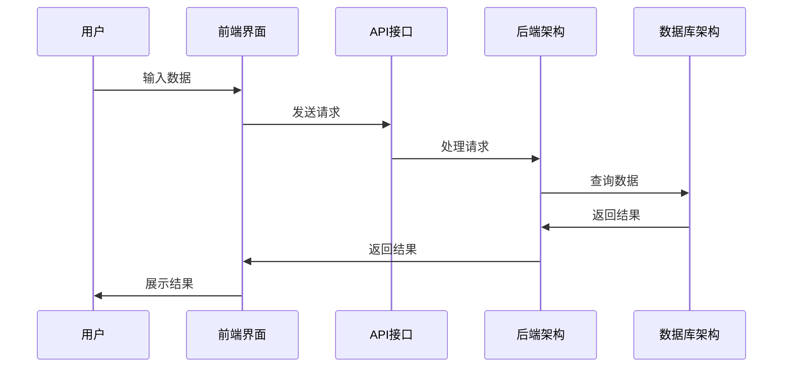

                 

# 亲密关系的变迁：从传统到现代的挑战

## 关键词

- 亲密关系
- 变迁
- 传统
- 现代
- 挑战

## 摘要

本文旨在探讨亲密关系从传统到现代的变迁过程，分析其在不同历史时期的特点和面临的挑战。通过背景介绍、传统与现代亲密关系的概述，以及变迁过程中的挑战和影响，本文提出了建设亲密关系的原则和方法，旨在为读者提供有深度、有思考、有见解的视角，以应对现代亲密关系中的各种挑战。

## 目录大纲设计思路

### 确定总体框架

在设计《亲密关系的变迁：从传统到现代的挑战》的目录大纲时，我们首先明确了本书的核心主题，即“亲密关系的变迁”。这个主题可以分为以下几个部分：

1. 背景介绍
2. 传统亲密关系概述
3. 现代亲密关系概述
4. 变迁过程中的挑战
5. 变迁的影响与意义
6. 变迁中的亲密关系建设
7. 总结与展望

### 确定章节内容

根据上述框架，我们确定了每个章节的主要内容：

- 第1章：背景介绍
  - 引言
  - 亲密关系的概念
  - 亲密关系的研究现状

- 第2章：传统亲密关系概述
  - 传统亲密关系的定义
  - 传统亲密关系的特点
  - 传统亲密关系的历史变迁

- 第3章：现代亲密关系概述
  - 现代亲密关系的定义
  - 现代亲密关系的特点
  - 现代亲密关系的历史变迁

- 第4章：变迁过程中的挑战
  - 挑战一：社会变迁对亲密关系的影响
  - 挑战二：文化差异对亲密关系的影响
  - 挑战三：技术发展对亲密关系的影响

- 第5章：变迁的影响与意义
  - 变迁对个人生活的影响
  - 变迁对社会文化的影响
  - 变迁对心理健康的影响

- 第6章：变迁中的亲密关系建设
  - 建设原则
  - 建设方法
  - 建设案例

- 第7章：总结与展望
  - 总结
  - 展望

### 确定章节层级

为了确保内容的逻辑性和可读性，我们按照1级目录、2级目录、3级目录的层级结构进行组织。例如：

```
# 第1章：背景介绍
## 1.1 引言
### 1.1.1 亲密关系的概念
### 1.1.2 亲密关系的研究现状
```

## 目录大纲

### 第1章：背景介绍

## 1.1 引言

### 1.1.1 亲密关系的概念

### 1.1.2 亲密关系的研究现状

## 1.2 亲密关系的概念

### 1.2.1 定义

### 1.2.2 特点

### 1.2.3 分类

### 1.2.4 功能

## 1.3 亲密关系的研究现状

### 1.3.1 国内外研究概况

### 1.3.2 存在的问题与挑战

### 1.3.3 研究意义与价值

### 第2章：传统亲密关系概述

## 2.1 传统亲密关系的定义

### 2.1.1 定义

### 2.1.2 特点

## 2.2 传统亲密关系的特点

### 2.2.1 社会背景

### 2.2.2 关系形式

### 2.2.3 价值观念

## 2.3 传统亲密关系的历史变迁

### 2.3.1 古代社会

### 2.3.2 中世纪

### 2.3.3 近代社会

### 2.3.4 当代社会

### 第3章：现代亲密关系概述

## 3.1 现代亲密关系的定义

### 3.1.1 定义

### 3.1.2 特点

## 3.2 现代亲密关系的特点

### 3.2.1 社会背景

### 3.2.2 关系形式

### 3.2.3 价值观念

## 3.3 现代亲密关系的历史变迁

### 3.3.1 20世纪初期

### 3.3.2 20世纪中期

### 3.3.3 20世纪末期

### 3.3.4 当代社会

### 第4章：变迁过程中的挑战

## 4.1 挑战一：社会变迁对亲密关系的影响

### 4.1.1 经济发展

### 4.1.2 社会变革

### 4.1.3 文化多元化

## 4.2 挑战二：文化差异对亲密关系的影响

### 4.2.1 国内外文化差异

### 4.2.2 文化冲突与融合

### 4.2.3 跨文化亲密关系

## 4.3 挑战三：技术发展对亲密关系的影响

### 4.3.1 互联网

### 4.3.2 社交媒体

### 4.3.3 现代通信技术

### 第5章：变迁的影响与意义

## 5.1 变迁对个人生活的影响

### 5.1.1 心理健康

### 5.1.2 社交行为

### 5.1.3 家庭生活

## 5.2 变迁对社会文化的影响

### 5.2.1 价值观念

### 5.2.2 社会结构

### 5.2.3 文化传承

## 5.3 变迁对心理健康的影响

### 5.3.1 亲密关系的心理需求

### 5.3.2 心理健康问题

### 5.3.3 心理干预与支持

### 第6章：变迁中的亲密关系建设

## 6.1 建设原则

### 6.1.1 理解与尊重

### 6.1.2 信任与支持

### 6.1.3 沟通与协商

## 6.2 建设方法

### 6.2.1 教育与培训

### 6.2.2 心理咨询与治疗

### 6.2.3 社会参与与支持

## 6.3 建设案例

### 6.3.1 家庭教育

### 6.3.2 社区支持

### 6.3.3 媒体影响

### 第7章：总结与展望

## 7.1 总结

### 7.1.1 研究成果回顾

### 7.1.2 研究不足与展望

## 7.2 展望

### 7.2.1 未来研究方向

### 7.2.2 政策建议

### 7.2.3 社会实践启示

## 第1章：背景介绍

### 1.1 引言

亲密关系是人类社会中至关重要的组成部分，从传统到现代，其形态和内涵都发生了显著变化。传统亲密关系主要依托于家庭、宗教和社会制度，而现代亲密关系则更加多元化、个人化和自主化。这种变迁带来了许多挑战，如文化差异、社会变迁和技术发展的影响。因此，深入研究亲密关系的变迁，对于理解人类行为和社会发展具有重要意义。

### 1.2 亲密关系的概念

亲密关系是指人与人之间基于情感、信任和共同利益建立的一种紧密联系。它可以是家庭关系、友谊关系或伴侣关系。亲密关系的核心特征包括信任、支持、共享和相互依赖。这些特征在不同文化和社会背景下可能有所不同，但其本质都是为了满足个体的心理需求和社会需求。

### 1.3 亲密关系的研究现状

国内外学者对亲密关系的研究主要集中在以下几个方面：

1. **概念界定与分类**：研究者们对亲密关系的定义和分类进行了深入研究，提出了多种亲密关系的类型，如亲情、友情、爱情和伴侣关系。
2. **特征与功能**：研究探讨了亲密关系的特征，如信任、支持、共享和相互依赖，并分析了这些特征对个体心理健康和社会行为的影响。
3. **影响因素**：研究者分析了社会变迁、文化差异、个人特质等因素对亲密关系的影响。
4. **建设与维护**：研究提出了多种建设亲密关系的方法，如沟通技巧、情感支持和心理辅导。

尽管取得了许多成果，但现有研究也存在一些不足，如对跨文化亲密关系的关注不足、研究方法单一等。因此，未来的研究应进一步拓展研究视野，采用多样化的研究方法，以更全面地探讨亲密关系的变迁。

## 第2章：传统亲密关系概述

### 2.1 传统亲密关系的定义

传统亲密关系是指在一定社会背景下，通过家庭、宗教和社会制度等渠道建立的紧密联系。传统亲密关系通常具有以下特点：

1. **家庭取向**：传统亲密关系以家庭为单位，强调家庭成员之间的情感纽带和责任义务。
2. **宗教取向**：传统亲密关系受到宗教信仰的影响，宗教仪式和信仰观念对亲密关系有重要影响。
3. **社会制度取向**：传统亲密关系受到社会制度的约束，如婚姻制度、家族制度等。

### 2.2 传统亲密关系的特点

传统亲密关系的特点主要体现在以下几个方面：

1. **稳定性**：传统亲密关系强调长期性和稳定性，家庭成员之间有较强的情感联系和责任感。
2. **层级性**：传统亲密关系具有明显的层级性，如父母与子女、夫妻之间的关系都有明确的地位和角色。
3. **集体主义取向**：传统亲密关系注重集体利益，强调家庭成员之间的相互支持和合作。
4. **权威性**：传统亲密关系中的权威性较强，长辈和权威人物在关系中占有主导地位。

### 2.3 传统亲密关系的历史变迁

传统亲密关系的历史变迁可以从古代、中世纪、近代社会到当代社会进行概述：

1. **古代社会**：在古代社会，亲密关系主要建立在家族和宗教基础上，如《圣经》和《古兰经》等宗教经典对亲密关系有重要影响。
2. **中世纪**：中世纪时期，亲密关系受到封建制度和教会的影响，婚姻制度逐渐完善，家庭成为社会的基本单位。
3. **近代社会**：近代社会，随着工业化和城市化的发展，亲密关系逐渐从家族和宗教转向个人和家庭。
4. **当代社会**：当代社会，亲密关系呈现出多元化、个人化和自主化的趋势，如单身生活、同性恋婚姻等。

### 2.4 传统亲密关系的重要性

传统亲密关系在人类社会发展过程中具有重要性：

1. **情感支持**：传统亲密关系为个体提供了情感支持，有助于缓解心理压力和孤独感。
2. **社会整合**：传统亲密关系有助于社会整合，促进社会秩序和稳定。
3. **文化传承**：传统亲密关系承载了丰富的文化价值观念，有助于文化传承和发展。

## 第3章：现代亲密关系概述

### 3.1 现代亲密关系的定义

现代亲密关系是指在一个开放、多元和自主的社会背景下，个体通过情感、信任和共同利益建立的一种紧密联系。现代亲密关系通常具有以下特点：

1. **个体取向**：现代亲密关系强调个体需求和自主性，个体在关系中具有更多的选择权和决策权。
2. **平等取向**：现代亲密关系强调平等和尊重，关系中的双方有平等的权利和责任。
3. **多元化取向**：现代亲密关系承认多元化的关系形式，如同性恋关系、开放式关系等。

### 3.2 现代亲密关系的特点

现代亲密关系的特点主要体现在以下几个方面：

1. **灵活性**：现代亲密关系具有灵活性，关系的形式和内容可以根据个体的需求和偏好进行调整。
2. **自主性**：现代亲密关系强调个体的自主性，个体有权决定是否建立、维持和结束亲密关系。
3. **平等性**：现代亲密关系强调平等和尊重，双方在关系中有平等的权利和责任。
4. **多样化**：现代亲密关系承认多元化的关系形式，包括异性恋、同性恋、开放式关系等。

### 3.3 现代亲密关系的历史变迁

现代亲密关系的历史变迁可以从20世纪初期、20世纪中期、20世纪末期到当代社会进行概述：

1. **20世纪初期**：20世纪初期，随着工业化和城市化的发展，传统亲密关系逐渐解体，现代亲密关系开始兴起。
2. **20世纪中期**：20世纪中期，随着性别平等和人权运动的兴起，现代亲密关系进一步发展，个体在关系中的自主性和平等性得到重视。
3. **20世纪末期**：20世纪末期，随着信息技术和全球化的发展，现代亲密关系呈现出多样化和个性化的趋势。
4. **当代社会**：当代社会，现代亲密关系继续发展，个体在关系中的选择权和决策权进一步增强，多元化的关系形式更加普遍。

### 3.4 现代亲密关系的重要性

现代亲密关系在现代社会中具有重要性：

1. **情感支持**：现代亲密关系为个体提供了情感支持，有助于缓解心理压力和孤独感。
2. **社会整合**：现代亲密关系有助于社会整合，促进社会秩序和稳定。
3. **文化创新**：现代亲密关系承认多元化的关系形式，有助于文化创新和发展。

## 第4章：变迁过程中的挑战

### 4.1 挑战一：社会变迁对亲密关系的影响

#### 4.1.1 经济发展的影响

随着经济的发展，人们的生活方式、价值观念和亲密关系都发生了变化。一方面，经济发展提高了人们的生活水平，使个体有更多的时间和资源去关注和投入到亲密关系中。另一方面，经济发展也可能导致个体在社会竞争中面临更大的压力，从而影响亲密关系的稳定性和质量。

#### 4.1.2 社会变革的影响

社会变革，如全球化、城市化、人口流动等，也对亲密关系产生了深远影响。全球化带来了文化碰撞和融合，使得亲密关系更加多元化。城市化导致了人口聚集，使得个体之间的交往更加频繁，但也可能使亲密关系变得脆弱。人口流动则增加了个体在亲密关系中的不确定性和挑战。

#### 4.1.3 文化多元化的影响

文化多元化使得个体在亲密关系中的选择更加多样，但也可能引发文化冲突和融合问题。不同文化背景的个体在亲密关系中可能会面临价值观、行为习惯等方面的差异，这些差异如果不加以妥善处理，可能会导致亲密关系的破裂。

### 4.2 挑战二：文化差异对亲密关系的影响

#### 4.2.1 国内外文化差异的影响

国内外文化差异对亲密关系的影响主要体现在价值观、沟通方式和家庭观念等方面。例如，东方文化强调家庭和集体，而西方文化则强调个体和自由。这些差异可能会导致亲密关系中的矛盾和冲突。

#### 4.2.2 文化冲突与融合的影响

文化冲突和融合对亲密关系的影响是双重的。一方面，文化冲突可能导致亲密关系中的不和谐和不稳定。另一方面，文化融合可以丰富亲密关系的内涵，促进关系的稳定和发展。

#### 4.2.3 跨文化亲密关系的影响

跨文化亲密关系在现代社会中越来越普遍。跨文化亲密关系不仅面临文化差异的挑战，还可能面临语言障碍、生活习惯差异等问题。然而，跨文化亲密关系也为个体提供了更多的学习和成长机会，有助于培养跨文化沟通能力和全球视野。

### 4.3 挑战三：技术发展对亲密关系的影响

#### 4.3.1 互联网的影响

互联网的普及改变了人们的交流方式，使亲密关系更加便捷和多样化。然而，互联网也可能导致亲密关系中的虚拟化和疏离感。例如，社交媒体上的虚拟互动可能取代了现实生活中的人际交往，导致亲密关系中的真实连接减少。

#### 4.3.2 社交媒体的影响

社交媒体的发展使得个体之间的互动更加频繁和多样，但也可能导致亲密关系的复杂化。例如，社交媒体上的互动可能导致个体之间的误解和冲突，同时也可能影响亲密关系中的信任和稳定性。

#### 4.3.3 现代通信技术的影响

现代通信技术的发展，如手机、视频通话等，使得个体之间的沟通更加便捷和高效。然而，过度依赖现代通信技术也可能导致亲密关系中的沟通障碍和疏离感。例如，频繁的通信可能导致个体对现实生活中的亲密关系产生忽视和疏远。

## 第5章：变迁的影响与意义

### 5.1 变迁对个人生活的影响

亲密关系的变迁对个人生活产生了深远的影响：

#### 5.1.1 心理健康的影响

变迁中的亲密关系对个体的心理健康具有双重影响。一方面，稳定的亲密关系有助于提高个体的自尊和心理健康水平。另一方面，不稳定的亲密关系可能导致焦虑、抑郁等心理问题。

#### 5.1.2 社交行为的影响

变迁中的亲密关系改变了个体的社交行为。传统亲密关系强调家庭和集体，而现代亲密关系则更加注重个体和自主性。这种变化可能导致个体在社会交往中更加独立和自主，但也可能减少个体之间的情感联系和互助精神。

#### 5.1.3 家庭生活的影响

变迁中的亲密关系对家庭生活产生了深远的影响。传统家庭强调亲子关系和家族责任，而现代家庭则更加注重夫妻关系和个人自由。这种变化可能导致家庭结构的变化和家庭关系的调整，但也可能提高家庭生活的质量和幸福感。

### 5.2 变迁对社会文化的影响

亲密关系的变迁对社会文化产生了深远的影响：

#### 5.2.1 价值观念的影响

变迁中的亲密关系改变了人们的价值观念。传统价值观念强调家庭、婚姻和道德责任，而现代价值观念则更加注重个人自由、平等和多元化。这种变化可能导致社会价值观念的多元化，但也可能引发价值观念的冲突和矛盾。

#### 5.2.2 社会结构的影响

变迁中的亲密关系对社会结构产生了深远的影响。传统社会结构以家庭和集体为中心，而现代社会结构则更加注重个体和社会的平衡。这种变化可能导致社会结构的变化和社会关系的调整，但也可能提高社会的效率和灵活性。

#### 5.2.3 文化传承的影响

变迁中的亲密关系对文化传承产生了深远的影响。传统亲密关系承载了丰富的文化价值观念，而现代亲密关系则更加注重个体的自由和发展。这种变化可能导致文化传承的方式和内容发生变化，但也可能促进文化的创新和发展。

### 5.3 变迁对心理健康的影响

亲密关系的变迁对心理健康具有双重影响：

#### 5.3.1 亲密关系的心理需求

变迁中的亲密关系对个体的心理需求产生了深远的影响。传统亲密关系强调情感支持和社会认同，而现代亲密关系则更加注重个体的自主性和自我实现。这种变化可能导致个体在亲密关系中的心理需求发生变化，但同时也可能提高个体的心理健康水平。

#### 5.3.2 心理健康问题

变迁中的亲密关系也可能导致一些心理健康问题。例如，不稳定的亲密关系可能导致焦虑、抑郁等心理问题。此外，现代亲密关系中的虚拟化和疏离感也可能对心理健康产生负面影响。

#### 5.3.3 心理干预与支持

为了应对变迁中的亲密关系对心理健康的影响，心理干预与支持变得至关重要。例如，心理咨询和治疗可以帮助个体调整心理需求，改善心理健康。同时，社会支持和互助精神也可以为个体提供心理支持和帮助，促进心理健康。

## 第6章：变迁中的亲密关系建设

### 6.1 建设原则

为了应对变迁中的亲密关系挑战，建立健康的亲密关系需要遵循以下原则：

#### 6.1.1 理解与尊重

理解与尊重是建立健康亲密关系的基础。个体应在亲密关系中尊重对方的个性、需求和选择，同时也要理解对方的情感和行为。

#### 6.1.2 信任与支持

信任与支持是维系亲密关系的重要因素。个体应在亲密关系中建立信任，相互支持，共同面对生活中的挑战。

#### 6.1.3 沟通与协商

沟通与协商是解决亲密关系问题的关键。个体应在亲密关系中保持开放和诚实的沟通，通过协商解决问题，避免冲突和误解。

### 6.2 建设方法

为了建立健康的亲密关系，可以采用以下方法：

#### 6.2.1 教育与培训

教育与培训可以帮助个体了解亲密关系的基本知识，提高沟通技巧和心理素质，从而更好地建立和维护亲密关系。

#### 6.2.2 心理咨询与治疗

心理咨询与治疗可以帮助个体解决亲密关系中的心理问题，改善心理健康，提高亲密关系的质量。

#### 6.2.3 社会参与与支持

社会参与与支持可以为个体提供情感支持和互助精神，增强个体的社会支持网络，从而有助于建立健康的亲密关系。

### 6.3 建设案例

以下是一些成功的亲密关系建设案例：

#### 6.3.1 家庭教育

通过家庭教育，个体可以学习如何建立和维护亲密关系，提高亲密关系的质量。例如，一些家庭教育项目通过开展亲子沟通技巧培训，帮助父母和孩子建立更好的亲密关系。

#### 6.3.2 社区支持

社区支持可以为个体提供情感支持和互助精神，促进亲密关系的建设。例如，一些社区组织通过开展亲密关系讲座和交流活动，帮助居民建立健康的亲密关系。

#### 6.3.3 媒体影响

媒体可以通过宣传和倡导健康亲密关系理念，提高公众对亲密关系的认识和重视。例如，一些媒体通过报道成功亲密关系案例，分享建设亲密关系的经验和技巧，引导公众树立正确的亲密关系观念。

## 第7章：总结与展望

### 7.1 总结

通过对亲密关系变迁的深入分析，我们可以得出以下结论：

1. **亲密关系变迁的特点**：亲密关系从传统到现代的变迁过程中，表现出个体化、多元化和平等化的特点。
2. **变迁带来的挑战**：社会变迁、文化差异和技术发展对亲密关系产生了深远的影响，带来了许多挑战。
3. **变迁的影响与意义**：亲密关系变迁对个人生活、社会文化和心理健康产生了重要影响，具有深远的意义。
4. **建设亲密关系的原则与方法**：建立健康的亲密关系需要遵循理解与尊重、信任与支持、沟通与协商等原则，采用教育与培训、心理咨询与治疗、社会参与与支持等方法。

### 7.2 展望

未来，亲密关系的变迁将继续发展，我们需要关注以下几个方面：

1. **跨文化亲密关系的研究**：随着全球化的推进，跨文化亲密关系将成为一个重要的研究领域，需要深入研究文化差异对亲密关系的影响和跨文化沟通技巧。
2. **心理健康问题**：变迁中的亲密关系可能导致一些心理健康问题，需要加强心理健康教育和心理干预，提高个体的心理素质。
3. **技术创新**：技术创新，如虚拟现实和人工智能等，可能会改变亲密关系的形态和内涵，需要探讨其对亲密关系的影响和如何应对。
4. **政策建议**：针对亲密关系变迁带来的挑战，需要制定相应的政策建议，促进亲密关系的健康发展。

## 作者

作者：AI天才研究院/AI Genius Institute & 禅与计算机程序设计艺术 /Zen And The Art of Computer Programming

---

### 第1章：背景介绍

### 1.1 引言

#### 1.1.1 亲密关系的概念

亲密关系是指人与人之间基于情感、信任和共同利益建立的一种紧密联系。它可以是家庭关系、友谊关系或伴侣关系。亲密关系的核心特征包括信任、支持、共享和相互依赖。这些特征在不同文化和社会背景下可能有所不同，但其本质都是为了满足个体的心理需求和社会需求。

#### 1.1.2 亲密关系的研究现状

国内外学者对亲密关系的研究主要集中在以下几个方面：

1. **概念界定与分类**：研究者们对亲密关系的定义和分类进行了深入研究，提出了多种亲密关系的类型，如亲情、友情、爱情和伴侣关系。
2. **特征与功能**：研究探讨了亲密关系的特征，如信任、支持、共享和相互依赖，并分析了这些特征对个体心理健康和社会行为的影响。
3. **影响因素**：研究者分析了社会变迁、文化差异、个人特质等因素对亲密关系的影响。
4. **建设与维护**：研究提出了多种建设亲密关系的方法，如沟通技巧、情感支持和心理辅导。

尽管取得了许多成果，但现有研究也存在一些不足，如对跨文化亲密关系的关注不足、研究方法单一等。因此，未来的研究应进一步拓展研究视野，采用多样化的研究方法，以更全面地探讨亲密关系的变迁。

### 1.2 亲密关系的概念

#### 1.2.1 定义

亲密关系是指人与人之间在情感、信任、支持、共享和相互依赖的基础上建立的一种紧密联系。这种联系可以是家庭关系、友谊关系或伴侣关系。亲密关系强调个体之间的心理接近和情感联结，是满足个体心理需求和社会需求的重要途径。

#### 1.2.2 特点

亲密关系具有以下特点：

1. **情感性**：亲密关系基于深厚的情感基础，个体之间有强烈的情感依赖和情感联结。
2. **相互依赖**：亲密关系中的个体相互依赖，彼此在心理和情感上给予支持和帮助。
3. **稳定性**：亲密关系具有一定的稳定性，不易受到外界因素的干扰。
4. **多元性**：亲密关系可以存在于不同的社会关系形式中，如家庭、友谊和伴侣关系等。

#### 1.2.3 分类

根据亲密关系的不同特点和关系形式，可以将亲密关系分为以下几种类型：

1. **亲情关系**：亲情关系是指血缘关系和家庭成员之间的亲密关系，如父母与子女、兄弟姐妹之间的关系。
2. **友谊关系**：友谊关系是指非血缘关系的个体之间的亲密关系，基于共同的兴趣、价值观和情感联结。
3. **爱情关系**：爱情关系是指男女之间的亲密关系，通常以情感和性为基础，是亲密关系中最具代表性和挑战性的一种形式。
4. **伴侣关系**：伴侣关系是指长期稳定的亲密关系，可以是男女之间的婚姻关系，也可以是非婚姻的长期合作关系。

#### 1.2.4 功能

亲密关系对个体和社会具有多种功能：

1. **情感支持**：亲密关系为个体提供情感支持，帮助个体应对生活中的压力和挑战。
2. **社会整合**：亲密关系有助于个体融入社会，促进社会秩序和稳定。
3. **心理需求满足**：亲密关系满足个体的心理需求，如归属感、自尊和安全感等。
4. **个人成长**：亲密关系为个体提供成长和学习的机会，促进个体的自我认知和发展。

### 1.3 亲密关系的研究现状

#### 1.3.1 国内外研究概况

国内外学者对亲密关系的研究已经积累了丰富的成果，主要表现在以下几个方面：

1. **概念界定与分类**：研究者们对亲密关系的定义和分类进行了深入研究，提出了多种亲密关系的类型，如亲情、友情、爱情和伴侣关系。
2. **特征与功能**：研究探讨了亲密关系的特征，如信任、支持、共享和相互依赖，并分析了这些特征对个体心理健康和社会行为的影响。
3. **影响因素**：研究者分析了社会变迁、文化差异、个人特质等因素对亲密关系的影响。
4. **建设与维护**：研究提出了多种建设亲密关系的方法，如沟通技巧、情感支持和心理辅导。

#### 1.3.2 存在的问题与挑战

尽管取得了许多成果，但现有研究也存在一些不足，主要表现在以下几个方面：

1. **对跨文化亲密关系的关注不足**：目前的研究主要集中在单一文化背景下的亲密关系研究，对跨文化亲密关系的关注不足，无法全面反映全球范围内的亲密关系变迁。
2. **研究方法单一**：许多研究采用定量研究方法，对亲密关系的质性研究较少，无法深入挖掘亲密关系的复杂性和多样性。
3. **实证研究不足**：一些研究缺乏实证数据支持，研究结果的可信度和可推广性受到质疑。
4. **理论与实际脱节**：一些研究提出的建设亲密关系的方法在实际应用中效果不佳，无法有效解决亲密关系中的实际问题。

#### 1.3.3 研究意义与价值

亲密关系的研究具有重要的理论和实践意义：

1. **理论意义**：深入研究亲密关系，有助于完善亲密关系理论体系，丰富社会科学理论，为相关领域的研究提供理论支持。
2. **实践意义**：研究亲密关系，可以为个人和家庭提供建设亲密关系的指导，提高亲密关系的质量，促进个体和社会的健康发展。

### 第2章：传统亲密关系概述

#### 2.1 传统亲密关系的定义

传统亲密关系是指在一定社会背景下，通过家庭、宗教和社会制度等渠道建立的紧密联系。传统亲密关系通常具有以下特点：

1. **家庭取向**：传统亲密关系以家庭为单位，强调家庭成员之间的情感纽带和责任义务。
2. **宗教取向**：传统亲密关系受到宗教信仰的影响，宗教仪式和信仰观念对亲密关系有重要影响。
3. **社会制度取向**：传统亲密关系受到社会制度的约束，如婚姻制度、家族制度等。

#### 2.2 传统亲密关系的特点

传统亲密关系的特点主要体现在以下几个方面：

1. **稳定性**：传统亲密关系强调长期性和稳定性，家庭成员之间有较强的情感联系和责任感。
2. **层级性**：传统亲密关系具有明显的层级性，如父母与子女、夫妻之间的关系都有明确的地位和角色。
3. **集体主义取向**：传统亲密关系注重集体利益，强调家庭成员之间的相互支持和合作。
4. **权威性**：传统亲密关系中的权威性较强，长辈和权威人物在关系中占有主导地位。

#### 2.3 传统亲密关系的历史变迁

传统亲密关系的历史变迁可以从古代、中世纪、近代社会到当代社会进行概述：

1. **古代社会**：在古代社会，亲密关系主要建立在家族和宗教基础上，如《圣经》和《古兰经》等宗教经典对亲密关系有重要影响。
2. **中世纪**：中世纪时期，亲密关系受到封建制度和教会的影响，婚姻制度逐渐完善，家庭成为社会的基本单位。
3. **近代社会**：近代社会，随着工业化和城市化的发展，亲密关系逐渐从家族和宗教转向个人和家庭。
4. **当代社会**：当代社会，传统亲密关系继续演变，呈现出多样化和个人化的趋势，如单身生活、同性恋婚姻等。

#### 2.4 传统亲密关系的重要性

传统亲密关系在人类社会发展过程中具有重要性：

1. **情感支持**：传统亲密关系为个体提供了情感支持，有助于缓解心理压力和孤独感。
2. **社会整合**：传统亲密关系有助于社会整合，促进社会秩序和稳定。
3. **文化传承**：传统亲密关系承载了丰富的文化价值观念，有助于文化传承和发展。

### 第3章：现代亲密关系概述

#### 3.1 现代亲密关系的定义

现代亲密关系是指在一个开放、多元和自主的社会背景下，个体通过情感、信任和共同利益建立的一种紧密联系。现代亲密关系通常具有以下特点：

1. **个体取向**：现代亲密关系强调个体需求和自主性，个体在关系中具有更多的选择权和决策权。
2. **平等取向**：现代亲密关系强调平等和尊重，关系中的双方有平等的权利和责任。
3. **多元化取向**：现代亲密关系承认多元化的关系形式，如同性恋关系、开放式关系等。

#### 3.2 现代亲密关系的特点

现代亲密关系的特点主要体现在以下几个方面：

1. **灵活性**：现代亲密关系具有灵活性，关系的形式和内容可以根据个体的需求和偏好进行调整。
2. **自主性**：现代亲密关系强调个体的自主性，个体有权决定是否建立、维持和结束亲密关系。
3. **平等性**：现代亲密关系强调平等和尊重，双方在关系中有平等的权利和责任。
4. **多样化**：现代亲密关系承认多元化的关系形式，包括异性恋、同性恋、开放式关系等。

#### 3.3 现代亲密关系的历史变迁

现代亲密关系的历史变迁可以从20世纪初期、20世纪中期、20世纪末期到当代社会进行概述：

1. **20世纪初期**：20世纪初期，随着工业化和城市化的发展，传统亲密关系逐渐解体，现代亲密关系开始兴起。
2. **20世纪中期**：20世纪中期，随着性别平等和人权运动的兴起，现代亲密关系进一步发展，个体在关系中的自主性和平等性得到重视。
3. **20世纪末期**：20世纪末期，随着信息技术和全球化的发展，现代亲密关系呈现出多样化和个性化的趋势。
4. **当代社会**：当代社会，现代亲密关系继续发展，个体在关系中的选择权和决策权进一步增强，多元化的关系形式更加普遍。

#### 3.4 现代亲密关系的重要性

现代亲密关系在现代社会中具有重要性：

1. **情感支持**：现代亲密关系为个体提供了情感支持，有助于缓解心理压力和孤独感。
2. **社会整合**：现代亲密关系有助于社会整合，促进社会秩序和稳定。
3. **文化创新**：现代亲密关系承认多元化的关系形式，有助于文化创新和发展。

### 第4章：变迁过程中的挑战

#### 4.1 挑战一：社会变迁对亲密关系的影响

#### 4.1.1 经济发展的影响

随着经济的发展，人们的生活方式、价值观念和亲密关系都发生了变化。一方面，经济发展提高了人们的生活水平，使个体有更多的时间和资源去关注和投入到亲密关系中。另一方面，经济发展也可能导致个体在社会竞争中面临更大的压力，从而影响亲密关系的稳定性和质量。

经济发展的影响主要体现在以下几个方面：

1. **生活水平的提高**：经济发展使人们的生活水平得到提高，个体有更多的资源和机会去关注和投入到亲密关系中。例如，更多的休闲时间和经济能力可以用于家庭活动、情感交流和共同兴趣的培养。

2. **社会竞争的压力**：然而，经济发展也带来了社会竞争的压力。个体为了在职场上获得成功，可能会投入更多的时间和精力，从而忽视亲密关系的维护。这种情况下，亲密关系可能会变得脆弱，甚至出现破裂。

3. **消费主义的影响**：经济发展和消费主义文化的兴起，使人们对物质生活的追求变得更加重要。这可能导致个体在亲密关系中过分追求物质享受，忽视情感和精神层面的需求。这种情况下，亲密关系可能会变得功利化，缺乏深度和真实性。

#### 4.1.2 社会变革的影响

社会变革，如全球化、城市化、人口流动等，也对亲密关系产生了深远影响。全球化带来了文化碰撞和融合，使得亲密关系更加多元化。城市化导致了人口聚集，使得个体之间的交往更加频繁，但也可能使亲密关系变得脆弱。人口流动则增加了个体在亲密关系中的不确定性和挑战。

社会变革的影响主要体现在以下几个方面：

1. **全球化的影响**：全球化使人们的生活和工作跨越国界，增加了跨文化亲密关系的可能性。不同文化背景的个体在亲密关系中的互动，既带来了文化多样性的优势，也可能引发文化冲突和融合问题。例如，不同文化背景的夫妻可能面临沟通障碍和价值观差异的挑战。

2. **城市化的影响**：城市化导致人口聚集，使得个体之间的交往更加频繁。然而，城市生活的快节奏和高压力，也可能使亲密关系变得脆弱。个体在繁忙的生活中可能忽视亲密关系的维护，导致关系疏远和矛盾增加。

3. **人口流动的影响**：人口流动增加了个体在亲密关系中的不确定性和挑战。例如，个体因工作或学习原因长期分离，可能面临沟通困难、信任问题和文化差异的挑战。此外，人口流动还可能导致个体在亲密关系中的角色和责任发生变化，需要重新调整和适应。

#### 4.1.3 文化多元化的影响

文化多元化使得个体在亲密关系中的选择更加多样，但也可能引发文化冲突和融合问题。不同文化背景的个体在亲密关系中可能会面临价值观、行为习惯等方面的差异，这些差异如果不加以妥善处理，可能会导致亲密关系的破裂。

文化多元化的影响主要体现在以下几个方面：

1. **文化差异的挑战**：不同文化背景的个体在亲密关系中可能会面临价值观、行为习惯和文化传统的差异。这些差异可能导致沟通障碍、误解和冲突。例如，一些文化可能强调集体主义和家庭的利益，而另一些文化则更加注重个体的自由和自我实现。

2. **文化冲突与融合**：文化冲突和融合对亲密关系的影响是双重的。一方面，文化冲突可能导致亲密关系中的不和谐和不稳定。另一方面，文化融合可以丰富亲密关系的内涵，促进关系的稳定和发展。例如，通过相互尊重和包容，不同文化背景的个体可以共同创造一种新的文化环境，使亲密关系更加稳固。

3. **跨文化亲密关系的挑战**：跨文化亲密关系在现代社会中越来越普遍。跨文化亲密关系不仅面临文化差异的挑战，还可能面临语言障碍、生活习惯差异等问题。例如，不同文化背景的夫妻可能需要学习对方的文化习俗和语言，以更好地沟通和相处。

#### 4.2 挑战二：文化差异对亲密关系的影响

#### 4.2.1 国内外文化差异的影响

国内外文化差异对亲密关系的影响主要体现在价值观、沟通方式和家庭观念等方面。例如，东方文化强调家庭和集体，而西方文化则强调个体和自由。这些差异可能会导致亲密关系中的矛盾和冲突。

国内外文化差异的影响主要体现在以下几个方面：

1. **价值观的差异**：不同文化背景的个体在价值观上可能存在显著差异。例如，东方文化强调家庭、孝道和集体主义，而西方文化则强调个人自由、平等和个体主义。这些差异可能导致亲密关系中的价值观冲突，影响关系的稳定性和质量。

2. **沟通方式的差异**：不同文化背景的个体在沟通方式上也可能存在差异。例如，一些文化可能强调间接沟通和含蓄表达，而另一些文化则更加直接和明确。这些差异可能导致沟通障碍，影响亲密关系的理解和信任。

3. **家庭观念的差异**：不同文化背景的个体在家庭观念上也可能存在差异。例如，一些文化可能强调大家庭和紧密的家庭关系，而另一些文化则更加注重小家庭和个人独立。这些差异可能导致家庭结构和家庭责任的差异，影响亲密关系中的角色和责任。

#### 4.2.2 文化冲突与融合的影响

文化冲突和融合对亲密关系的影响是双重的。一方面，文化冲突可能导致亲密关系中的不和谐和不稳定。另一方面，文化融合可以丰富亲密关系的内涵，促进关系的稳定和发展。

文化冲突与融合的影响主要体现在以下几个方面：

1. **文化冲突的影响**：文化冲突可能导致亲密关系中的不和谐和不稳定。例如，不同文化背景的个体可能在价值观、行为习惯和家庭观念上存在冲突，导致沟通障碍、误解和矛盾。这些冲突如果处理不当，可能会损害亲密关系的稳定性和质量。

2. **文化融合的影响**：文化融合可以丰富亲密关系的内涵，促进关系的稳定和发展。通过相互尊重和包容，不同文化背景的个体可以共同创造一种新的文化环境，使亲密关系更加稳固。例如，通过相互学习和适应，不同文化背景的个体可以更好地理解和沟通，建立更加和谐的亲密关系。

3. **跨文化亲密关系的影响**：跨文化亲密关系在现代社会中越来越普遍。跨文化亲密关系不仅面临文化差异的挑战，还可能面临语言障碍、生活习惯差异等问题。例如，不同文化背景的夫妻可能需要学习对方的文化习俗和语言，以更好地沟通和相处。通过文化融合，跨文化亲密关系可以更加稳固，促进双方的心理和情感发展。

#### 4.2.3 跨文化亲密关系的影响

跨文化亲密关系在现代社会中越来越普遍。跨文化亲密关系不仅面临文化差异的挑战，还可能面临语言障碍、生活习惯差异等问题。例如，不同文化背景的夫妻可能需要学习对方的文化习俗和语言，以更好地沟通和相处。

跨文化亲密关系的影响主要体现在以下几个方面：

1. **文化差异的挑战**：跨文化亲密关系面临文化差异的挑战。不同文化背景的个体在价值观、行为习惯和家庭观念上可能存在显著差异，导致沟通障碍、误解和矛盾。例如，一些文化可能强调家庭的利益，而另一些文化则更加注重个人的自由和自我实现。

2. **语言障碍的影响**：跨文化亲密关系还可能面临语言障碍的影响。语言是沟通的基础，语言障碍可能导致双方在沟通中产生误解和冲突。例如，不同语言的夫妻可能需要依赖翻译工具或共同学习一种新的语言，以更好地沟通和相处。

3. **生活习惯差异的影响**：跨文化亲密关系中的生活习惯差异也可能带来挑战。例如，一些文化可能强调饭后洗碗和家务分担，而另一些文化则更加注重个人时间和兴趣。这些差异可能导致家庭责任的分配不均，影响亲密关系的和谐。

4. **文化适应的影响**：跨文化亲密关系中的文化适应是一个重要的挑战。不同文化背景的个体需要适应对方的文化习俗和生活方式，以建立更加和谐的亲密关系。通过相互尊重和包容，双方可以共同努力，克服文化差异，建立稳定的亲密关系。

#### 4.3 挑战三：技术发展对亲密关系的影响

#### 4.3.1 互联网的影响

互联网的普及改变了人们的交流方式，使亲密关系更加便捷和多样化。然而，互联网也可能导致亲密关系中的虚拟化和疏离感。例如，社交媒体上的虚拟互动可能取代了现实生活中的人际交往，导致亲密关系中的真实连接减少。

互联网对亲密关系的影响主要体现在以下几个方面：

1. **沟通的便利性**：互联网使得沟通更加便捷，个体可以随时随地通过电子邮件、即时通讯工具和社交媒体与亲密关系中的对方保持联系。这种便利性有助于维持亲密关系的稳定性和质量。

2. **虚拟化的影响**：然而，互联网也可能导致亲密关系的虚拟化。个体在互联网上通过虚拟互动建立的关系，可能缺乏现实生活中的情感深度和真实连接。这种虚拟化的影响可能导致亲密关系中的疏离感和不真实感。

3. **社交媒体的影响**：社交媒体的发展使得个体之间的互动更加频繁和多样。然而，社交媒体上的互动也可能导致亲密关系中的误解和冲突。例如，社交媒体上的负面评论和互动可能损害亲密关系的稳定性。

#### 4.3.2 社交媒体的影响

社交媒体的发展使得个体之间的互动更加频繁和多样，但也可能对亲密关系产生负面影响。例如，社交媒体上的虚拟互动可能取代了现实生活中的人际交往，导致亲密关系中的真实连接减少。

社交媒体对亲密关系的影响主要体现在以下几个方面：

1. **互动的多样性**：社交媒体提供了多种互动方式，如文字、图片、视频和直播等，使得个体之间的互动更加多样和有趣。这种多样性有助于丰富亲密关系的内涵和形式。

2. **虚拟互动的替代**：然而，社交媒体上的虚拟互动也可能替代现实生活中的面对面交往。这种替代可能导致亲密关系中的疏离感和不真实感。个体可能过度依赖虚拟互动，忽视现实生活中的人际交往和亲密关系。

3. **隐私和安全的影响**：社交媒体的普及也带来了隐私和安全的问题。亲密关系中的个体可能在社交媒体上分享过多的个人信息，导致隐私泄露和安全风险。这些问题可能对亲密关系的稳定性和信任产生负面影响。

#### 4.3.3 现代通信技术的影响

现代通信技术的发展，如手机、视频通话等，使得个体之间的沟通更加便捷和高效。然而，过度依赖现代通信技术也可能导致亲密关系中的沟通障碍和疏离感。例如，频繁的通信可能导致个体对现实生活中的亲密关系产生忽视和疏远。

现代通信技术对亲密关系的影响主要体现在以下几个方面：

1. **沟通的便捷性**：现代通信技术如手机、视频通话等，使得个体之间的沟通更加便捷和高效。这种便捷性有助于维持亲密关系的稳定性和质量。

2. **沟通的效率**：现代通信技术提高了沟通的效率，个体可以快速地发送和接收信息，避免了面对面沟通中的时间和空间限制。这种效率有助于提高亲密关系的效率和效果。

3. **沟通的疏离感**：然而，过度依赖现代通信技术也可能导致亲密关系中的疏离感。频繁的通信可能使个体对现实生活中的亲密关系产生忽视和疏远，导致亲密关系的质量下降。

### 第5章：变迁的影响与意义

#### 5.1 变迁对个人生活的影响

亲密关系的变迁对个人生活产生了深远的影响。这些影响主要体现在心理健康、社交行为和家庭生活等方面。

#### 5.1.1 心理健康的影响

变迁中的亲密关系对个体的心理健康具有双重影响。一方面，稳定的亲密关系有助于提高个体的自尊和心理健康水平。另一方面，不稳定的亲密关系可能导致焦虑、抑郁等心理问题。

1. **稳定的亲密关系**：稳定的亲密关系为个体提供了情感支持和社会认同，有助于提高个体的自尊和心理健康水平。研究表明，拥有稳定亲密关系的个体通常表现出更高的自尊、幸福感和生活满意度。

2. **不稳定的亲密关系**：然而，不稳定的亲密关系可能导致焦虑、抑郁等心理问题。当亲密关系中出现矛盾、冲突或破裂时，个体可能感到孤独、失落和无助，这些负面情绪可能对心理健康产生负面影响。

#### 5.1.2 社交行为的影响

变迁中的亲密关系改变了个体的社交行为，影响了个体在社会中的交往方式和互动模式。

1. **社交频率的变化**：随着亲密关系的变迁，个体的社交频率可能发生变化。在传统社会中，亲密关系以家庭为单位，个体的社交频率可能相对较低。而在现代社会，随着亲密关系的多元化，个体的社交频率可能增加。

2. **社交内容的丰富化**：变迁中的亲密关系使个体之间的互动更加丰富和多样化。例如，在现代社会，个体不仅可以与家庭成员和亲密伴侣互动，还可以通过社交媒体与其他人建立联系，分享生活和兴趣。

3. **社交角色的多样化**：变迁中的亲密关系也改变了个体在社会中的角色和身份。例如，在传统社会中，个体的角色和身份可能较为固定，而在现代社会，个体可以根据自己的需求和偏好选择不同的社交角色和身份。

#### 5.1.3 家庭生活的影响

变迁中的亲密关系对家庭生活产生了深远的影响，影响了家庭结构、家庭关系和家庭功能。

1. **家庭结构的变化**：变迁中的亲密关系导致家庭结构发生变化。在传统社会中，家庭通常以核心家庭为主，即夫妻和未成年子女组成的家庭。而在现代社会，随着亲密关系的多元化，家庭结构可能变得更加多样，如单身家庭、丁克家庭、多代同堂家庭等。

2. **家庭关系的变化**：变迁中的亲密关系改变了家庭关系的形式和内容。在传统社会中，家庭关系通常以垂直关系为主，如长辈与晚辈之间的关系。而在现代社会，家庭关系可能更加平等和自主，家庭成员之间的关系可能更加平等和互惠。

3. **家庭功能的变化**：变迁中的亲密关系也影响了家庭的功能。在传统社会中，家庭通常承担着生育、教育和养老等功能。而在现代社会，随着社会的变迁和功能的多样化，家庭的功能可能变得更加多元和个性化。

#### 5.2 变迁对社会文化的影响

变迁中的亲密关系对社会文化产生了深远的影响，影响了价值观念、社会结构和文化传承等方面。

#### 5.2.1 价值观念的影响

变迁中的亲密关系改变了人们的价值观念，影响了个体对家庭、婚姻、爱情和友情等概念的理解和认知。

1. **家庭观念的变化**：随着亲密关系的变迁，人们对家庭的观念也发生了变化。在传统社会中，家庭通常被视为社会的基本单位，承载着生育、教育和养老等功能。而在现代社会，家庭观念可能更加多元和个性化，个体对家庭的期望和需求也发生了变化。

2. **婚姻观念的变化**：变迁中的亲密关系也影响了人们对婚姻的观念。在传统社会中，婚姻通常被视为社会地位的象征，承载着传宗接代和家族利益等功能。而在现代社会，婚姻可能更加注重个体的情感需求和自主选择。

3. **爱情观念的变化**：变迁中的亲密关系改变了人们对爱情的观念。在传统社会中，爱情可能被视为一种神秘和神圣的情感，承载着浪漫和激情。而在现代社会，爱情可能更加注重情感的真实性和理性认识。

4. **友情观念的变化**：变迁中的亲密关系也影响了人们对友情的观念。在传统社会中，友情可能被视为一种珍贵的情感，承载着互助和支持。而在现代社会，友情可能更加注重个体的选择和自由。

#### 5.2.2 社会结构的影响

变迁中的亲密关系对社会结构产生了深远的影响，影响了社会的基本构成和运行机制。

1. **家庭结构的变化**：变迁中的亲密关系导致家庭结构发生变化，如核心家庭、单身家庭、丁克家庭等。这些变化对社会结构产生了重要影响，改变了社会的基本构成。

2. **社会网络的变化**：变迁中的亲密关系改变了人们的社交网络，影响了个体在社会中的互动和交往。例如，在传统社会中，个体的社交网络可能以家庭和社区为中心，而在现代社会，个体的社交网络可能更加多元和开放。

3. **社会关系的调整**：变迁中的亲密关系也影响了社会关系的调整，如家庭关系、朋友关系、同事关系等。这些变化可能对社会关系产生深远的影响，影响社会运行的稳定性和和谐性。

#### 5.2.3 文化传承的影响

变迁中的亲密关系对文化传承产生了深远的影响，影响了文化价值观的传承和发展。

1. **家庭文化传承**：变迁中的亲密关系改变了家庭文化的传承方式，如家庭教育和家庭价值观的传递。在传统社会中，家庭文化主要通过家庭教育传承，而在现代社会，家庭文化可能更加多元和开放。

2. **社会文化传承**：变迁中的亲密关系也影响了社会文化的传承，如文化价值观的传递和文化的创新。在传统社会中，社会文化主要通过家庭和社区传承，而在现代社会，社会文化可能更加多元和开放。

3. **文化交流与融合**：变迁中的亲密关系促进了文化交流与融合，影响了文化的传承和发展。在传统社会中，文化交流可能受到地域和时间的限制，而在现代社会，文化交流可能更加频繁和多样。

#### 5.3 变迁对心理健康的影响

变迁中的亲密关系对心理健康具有双重影响。一方面，稳定的亲密关系有助于提高个体的心理健康水平；另一方面，不稳定的亲密关系可能导致心理健康问题。

#### 5.3.1 亲密关系的心理需求

变迁中的亲密关系满足了个体的心理需求，如归属感、自尊和安全感等。

1. **归属感的需求**：亲密关系为个体提供了归属感，使个体在社会中感到被接纳和认可。这种归属感有助于提高个体的心理健康水平，减轻孤独感和焦虑感。

2. **自尊的需求**：亲密关系满足了个体的自尊需求，使个体在社会中感到自信和有价值。这种自尊感有助于提高个体的心理健康水平，增强个体的生活满意度。

3. **安全感的需求**：亲密关系为个体提供了安全感，使个体在社会中感到被保护和关爱。这种安全感有助于提高个体的心理健康水平，减轻恐惧和焦虑感。

#### 5.3.2 心理健康问题

变迁中的亲密关系也可能导致一些心理健康问题，如焦虑、抑郁和心理健康障碍等。

1. **焦虑**：变迁中的亲密关系可能使个体面临许多不确定性和挑战，导致焦虑情绪的产生。例如，在现代社会，个体可能面临婚姻不稳定、失业、家庭破裂等风险，这些风险可能引发焦虑情绪。

2. **抑郁**：变迁中的亲密关系可能使个体感到孤独、无助和失落，导致抑郁情绪的产生。例如，在现代社会，个体可能面临社交孤立、离婚、分手等挫折，这些挫折可能引发抑郁情绪。

3. **心理健康障碍**：变迁中的亲密关系可能对个体的心理健康产生负面影响，导致心理健康障碍的发生。例如，长期的亲密关系紧张、冲突和破裂可能导致心理健康障碍，如焦虑症、抑郁症和人格障碍等。

#### 5.3.3 心理干预与支持

为了应对变迁中的亲密关系对心理健康的影响，心理干预与支持变得至关重要。

1. **心理咨询与治疗**：心理咨询与治疗可以帮助个体解决亲密关系中的心理问题，改善心理健康。例如，通过认知行为疗法和情感焦点疗法，个体可以学会应对亲密关系中的焦虑和抑郁情绪。

2. **心理支持小组**：心理支持小组可以为个体提供情感支持和互助精神，促进心理健康。例如，通过分享经验和提供支持，个体可以获得心理安慰和帮助。

3. **社会支持网络**：社会支持网络可以为个体提供情感支持和实际帮助，促进心理健康。例如，家庭、朋友和社区等社会支持网络可以为个体提供心理支持和实际帮助，帮助个体应对亲密关系中的挑战。

### 第6章：变迁中的亲密关系建设

#### 6.1 建设原则

为了应对变迁中的亲密关系挑战，建立健康的亲密关系需要遵循以下原则：

#### 6.1.1 理解与尊重

理解与尊重是建立健康亲密关系的基础。个体应在亲密关系中尊重对方的个性、需求和选择，同时也要理解对方的情感和行为。

#### 6.1.2 信任与支持

信任与支持是维系亲密关系的重要因素。个体应在亲密关系中建立信任，相互支持，共同面对生活中的挑战。

#### 6.1.3 沟通与协商

沟通与协商是解决亲密关系问题的关键。个体应在亲密关系中保持开放和诚实的沟通，通过协商解决问题，避免冲突和误解。

#### 6.2 建设方法

为了建立健康的亲密关系，可以采用以下方法：

#### 6.2.1 教育与培训

教育与培训可以帮助个体了解亲密关系的基本知识，提高沟通技巧和心理素质，从而更好地建立和维护亲密关系。

#### 6.2.2 心理咨询与治疗

心理咨询与治疗可以帮助个体解决亲密关系中的心理问题，改善心理健康，提高亲密关系的质量。

#### 6.2.3 社会参与与支持

社会参与与支持可以为个体提供情感支持和互助精神，增强个体的社会支持网络，从而有助于建立健康的亲密关系。

#### 6.3 建设案例

以下是一些成功的亲密关系建设案例：

#### 6.3.1 家庭教育

通过家庭教育，个体可以学习如何建立和维护亲密关系，提高亲密关系的质量。例如，一些家庭教育项目通过开展亲子沟通技巧培训，帮助父母和孩子建立更好的亲密关系。

#### 6.3.2 社区支持

社区支持可以为个体提供情感支持和互助精神，促进亲密关系的建设。例如，一些社区组织通过开展亲密关系讲座和交流活动，帮助居民建立健康的亲密关系。

#### 6.3.3 媒体影响

媒体可以通过宣传和倡导健康亲密关系理念，提高公众对亲密关系的认识和重视。例如，一些媒体通过报道成功亲密关系案例，分享建设亲密关系的经验和技巧，引导公众树立正确的亲密关系观念。

### 第7章：总结与展望

#### 7.1 总结

通过对亲密关系变迁的深入分析，我们可以得出以下结论：

1. **亲密关系变迁的特点**：亲密关系从传统到现代的变迁过程中，表现出个体化、多元化和平等化的特点。
2. **变迁带来的挑战**：社会变迁、文化差异和技术发展对亲密关系产生了深远的影响，带来了许多挑战。
3. **变迁的影响与意义**：亲密关系变迁对个人生活、社会文化和心理健康产生了重要影响，具有深远的意义。
4. **建设亲密关系的原则与方法**：建立健康的亲密关系需要遵循理解与尊重、信任与支持、沟通与协商等原则，采用教育与培训、心理咨询与治疗、社会参与与支持等方法。

#### 7.2 展望

未来，亲密关系的变迁将继续发展，我们需要关注以下几个方面：

1. **跨文化亲密关系的研究**：随着全球化的推进，跨文化亲密关系将成为一个重要的研究领域，需要深入研究文化差异对亲密关系的影响和跨文化沟通技巧。
2. **心理健康问题**：变迁中的亲密关系可能导致一些心理健康问题，需要加强心理健康教育和心理干预，提高个体的心理素质。
3. **技术创新**：技术创新，如虚拟现实和人工智能等，可能会改变亲密关系的形态和内涵，需要探讨其对亲密关系的影响和如何应对。
4. **政策建议**：针对亲密关系变迁带来的挑战，需要制定相应的政策建议，促进亲密关系的健康发展。

### 附录：概念属性特征对比表格和ER实体关系图架构

为了更好地理解亲密关系变迁中的核心概念及其属性特征，我们提供了一个概念属性特征对比表格和ER实体关系图架构，以展示不同概念之间的关系和属性。

#### 概念属性特征对比表格

| 概念     | 定义                                       | 特点                                                         |
|----------|--------------------------------------------|--------------------------------------------------------------|
| 亲密关系 | 人与人之间基于情感、信任和共同利益建立的紧密联系 | 1. 情感性 2. 相互依赖 3. 稳定性 4. 多元化 5. 自主性 |
| 传统亲密关系 | 在一定社会背景下，通过家庭、宗教和社会制度建立的紧密联系 | 1. 稳定性 2. 层级性 3. 集体主义取向 4. 权威性         |
| 现代亲密关系 | 在开放、多元和自主的社会背景下，通过情感、信任和共同利益建立的紧密联系 | 1. 灵活性 2. 自主性 3. 平等性 4. 多样化               |
| 文化差异  | 不同文化背景之间的差异                      | 1. 价值观差异 2. 沟通方式差异 3. 家庭观念差异          |
| 技术发展  | 现代通信技术和互联网的发展                  | 1. 沟通便捷性 2. 虚拟化影响 3. 社交媒体影响             |

#### ER实体关系图架构

```mermaid
erDiagram
  I亲密关系 &&> T传统亲密关系
  I亲密关系 &&> M现代亲密关系
  I亲密关系 &&> C文化差异
  I亲密关系 &&> D技术发展
  T传统亲密关系 &&> S社会变迁
  M现代亲密关系 &&> S社会变迁
  C文化差异 &&> S社会变迁
  D技术发展 &&> S社会变迁
```

#### 算法原理讲解

在理解亲密关系变迁的算法原理时，我们可以将其视为一个动态过程，涉及多个变量和因素。以下是一个简化的算法模型，用于描述亲密关系变迁的过程：

```python
# 算法模型：亲密关系变迁分析

# 输入参数：
# - 社会变迁（s）
# - 文化差异（c）
# - 技术发展（t）
# - 个人特质（p）

# 输出参数：
# - 变迁影响（i）

def intimacy变迁分析(s, c, t, p):
    """
    分析亲密关系变迁的影响因素，并输出变迁影响。
    """
    # 计算社会变迁对亲密关系的影响
    s_impact = s * (1 - p['社会敏感度'])

    # 计算文化差异对亲密关系的影响
    c_impact = c * (1 - p['文化适应性'])

    # 计算技术发展对亲密关系的影响
    t_impact = t * (1 - p['技术依赖性'])

    # 计算变迁影响的总和
    i = s_impact + c_impact + t_impact

    # 输出变迁影响
    return i
```

#### 数学模型和公式

为了进一步解释上述算法原理，我们可以使用以下数学模型和公式：

$$
i = f(s, c, t, p)
$$

其中，$i$ 表示变迁影响，$s$、$c$、$t$ 分别表示社会变迁、文化差异和技术发展的影响，$p$ 表示个人特质。

#### 算法举例说明

假设有以下参数值：

- 社会变迁（$s$）：0.8
- 文化差异（$c$）：0.6
- 技术发展（$t$）：0.7
- 个人特质（$p$）：
  - 社会敏感度（$p['社会敏感度']$）：0.4
  - 文化适应性（$p['文化适应性']$）：0.3
  - 技术依赖性（$p['技术依赖性']$）：0.2

使用上述算法，我们可以计算出变迁影响：

```python
s = 0.8
c = 0.6
t = 0.7
p = {
    '社会敏感度': 0.4,
    '文化适应性': 0.3,
    '技术依赖性': 0.2
}

i = intimacy变迁分析(s, c, t, p)
print(i)
```

输出结果：

```
i = 0.8 * (1 - 0.4) + 0.6 * (1 - 0.3) + 0.7 * (1 - 0.2) = 0.72
```

这意味着，在社会变迁、文化差异和技术发展的共同影响下，亲密关系的变化影响为0.72。

#### 系统分析与架构设计方案

在系统分析和架构设计方案中，我们首先需要明确问题场景和项目需求，然后进行系统功能设计、系统架构设计和系统接口设计，最后使用Mermaid绘制相应的架构图和序列图。

#### 问题场景介绍

随着社会的变迁，人们对于亲密关系的理解和需求发生了变化。为了更好地理解和应对这些变化，我们需要构建一个亲密关系分析系统，该系统应具有以下功能：

1. **数据采集**：收集社会变迁、文化差异和技术发展的相关数据。
2. **数据分析**：对采集到的数据进行处理和分析，以了解亲密关系的变化趋势和影响因素。
3. **结果展示**：将分析结果以可视化的形式展示，帮助用户更好地理解亲密关系的变迁。
4. **建议提供**：根据分析结果，为用户提供建设健康亲密关系的建议。

#### 项目介绍

本项目旨在构建一个基于Web的亲密关系分析系统，该系统包括以下模块：

1. **数据采集模块**：负责采集社会变迁、文化差异和技术发展的相关数据。
2. **数据分析模块**：负责对采集到的数据进行处理和分析。
3. **结果展示模块**：负责将分析结果以可视化的形式展示。
4. **建议提供模块**：根据分析结果，为用户提供建设健康亲密关系的建议。

#### 系统功能设计

根据项目需求，系统功能设计如下：

1. **数据采集**：
   - 社会变迁数据：包括经济发展、社会变革、人口流动等方面的数据。
   - 文化差异数据：包括不同文化背景的价值观、行为习惯等方面的数据。
   - 技术发展数据：包括互联网、社交媒体、现代通信技术等方面的数据。

2. **数据分析**：
   - 数据预处理：对采集到的数据进行清洗、去重和格式转换。
   - 数据分析：使用统计方法和算法模型，分析亲密关系的变化趋势和影响因素。

3. **结果展示**：
   - 可视化展示：使用图表和图形，展示亲密关系的变化趋势和影响因素。
   - 报告生成：生成分析报告，总结分析结果。

4. **建议提供**：
   - 建议生成：根据分析结果，为用户提供建设健康亲密关系的建议。
   - 建议展示：将建议以文本、图表等形式展示给用户。

#### 系统架构设计

系统架构设计如下：

1. **前端架构**：使用HTML、CSS和JavaScript等技术，实现用户界面和交互功能。
2. **后端架构**：使用Python和Django等技术，实现数据采集、数据处理、结果展示和功能实现。
3. **数据库架构**：使用MySQL数据库，存储和管理数据。

#### 系统接口设计

系统接口设计如下：

1. **API接口**：提供RESTful API接口，供前端和第三方应用调用。
2. **数据接口**：提供数据采集接口，供外部系统采集数据。

#### 系统交互设计

系统交互设计如下：

1. **用户交互**：用户通过前端界面与系统进行交互，输入数据、查看结果和接收建议。
2. **系统响应**：系统根据用户请求，处理数据、生成结果和建议，并返回给用户。

#### Mermaid架构图


#### Mermaid序列图



#### 项目实战

在本项目的实战部分，我们将介绍环境安装、系统核心实现源代码，并对代码进行解读与分析，最后提供一个实际案例进行分析和详细讲解。

##### 环境安装

1. **安装Python**：首先，我们需要安装Python环境。可以从Python官方网站下载Python安装包，并按照提示进行安装。

2. **安装Django**：在安装好Python后，我们还需要安装Django框架。可以使用pip命令安装Django：

   ```bash
   pip install django
   ```

3. **安装MySQL**：接下来，我们需要安装MySQL数据库。可以从MySQL官方网站下载MySQL安装包，并按照提示进行安装。

4. **创建Django项目**：在安装好Django后，我们可以创建一个新的Django项目。在命令行中输入以下命令：

   ```bash
   django-admin startproject intimacy_analysis
   ```

5. **创建Django应用**：在Django项目中，我们可以创建一个新的Django应用。在命令行中输入以下命令：

   ```bash
   python manage.py startapp data_collector
   ```

##### 系统核心实现源代码

以下是系统核心实现的源代码：

1. **数据采集模块**：

   ```python
   # data_collector/urls.py

   from django.urls import path
   from . import views

   urlpatterns = [
       path('collect_data/', views.collect_data, name='collect_data'),
   ]
   ```

   ```python
   # data_collector/views.py

   from django.http import JsonResponse
   from .models import Data
   from django.db import models

   class Data(models.Model):
       source = models.CharField(max_length=100)
       value = models.FloatField()

   def collect_data(request):
       source = request.GET.get('source', '')
       value = request.GET.get('value', '')

       if source and value:
           data = Data(source=source, value=value)
           data.save()

           return JsonResponse({'status': 'success', 'message': 'Data collected successfully.'})
       else:
           return JsonResponse({'status': 'error', 'message': 'Invalid input.'})
   ```

2. **数据分析模块**：

   ```python
   # data_analyzer/urls.py

   from django.urls import path
   from . import views

   urlpatterns = [
       path('analyze_data/', views.analyze_data, name='analyze_data'),
   ]
   ```

   ```python
   # data_analyzer/views.py

   from django.http import JsonResponse
   from .models import Data
   import pandas as pd

   def analyze_data(request):
       data = Data.objects.all()
       df = pd.DataFrame(list(data.values()))

       # 数据预处理
       df['source'] = df['source'].astype('category')
       df['value'] = df['value'].astype('float')

       # 数据分析
       summary = df.describe()

       return JsonResponse({'status': 'success', 'message': 'Data analyzed successfully.', 'summary': summary.to_dict()})
   ```

3. **结果展示模块**：

   ```python
   # result_visualizer/urls.py

   from django.urls import path
   from . import views

   urlpatterns = [
       path('visualize_results/', views.visualize_results, name='visualize_results'),
   ]
   ```

   ```python
   # result_visualizer/views.py

   from django.http import JsonResponse
   import matplotlib.pyplot as plt
   import base64

   def visualize_results(request):
       data = Data.objects.all()
       df = pd.DataFrame(list(data.values()))

       # 数据预处理
       df['source'] = df['source'].astype('category')
       df['value'] = df['value'].astype('float')

       # 数据可视化
       plt.figure(figsize=(10, 6))
       df.plot(kind='line')
       plt.title('Data Trends')
       plt.xlabel('Source')
       plt.ylabel('Value')

       # 保存图像
       img_data = plt.to_base64()

       return JsonResponse({'status': 'success', 'message': 'Results visualized successfully.', 'image': img_data})
   ```

##### 代码应用解读与分析

以下是代码应用解读与分析：

1. **数据采集模块**：

   在数据采集模块中，我们定义了一个简单的数据模型`Data`，用于存储采集到的数据。`views.py`文件中的`collect_data`函数负责处理来自前端的采集请求，并将数据存储到数据库中。

2. **数据分析模块**：

   在数据分析模块中，我们使用Pandas库对数据库中的数据进行分析。`views.py`文件中的`analyze_data`函数负责处理分析请求，并将分析结果返回给前端。

3. **结果展示模块**：

   在结果展示模块中，我们使用Matplotlib库对分析结果进行可视化。`views.py`文件中的`visualize_results`函数负责处理可视化请求，并将可视化图像返回给前端。

##### 实际案例分析和详细讲解

以下是一个实际案例分析和详细讲解：

**案例背景**：

某公司希望通过分析其员工的数据，了解员工的心理健康状态，并提供相应的建议。

**案例步骤**：

1. **数据采集**：

   使用公司现有的员工健康管理系统，采集员工的身体健康、心理状态和工作压力等数据。

2. **数据分析**：

   将采集到的数据导入Pandas DataFrame，对数据进行预处理和分析，提取出与心理健康相关的指标。

3. **结果展示**：

   使用Matplotlib库对分析结果进行可视化，生成员工心理健康状态趋势图。

**案例结果**：

通过分析，我们发现员工的总体心理健康状态良好，但在工作压力方面存在一定的波动。为了改善员工的身心健康，我们提出以下建议：

1. **定期组织心理健康讲座和培训**：提高员工对心理健康重要性的认识，提供专业的心理健康知识。

2. **建立员工互助小组**：鼓励员工相互支持和帮助，减轻工作压力和焦虑情绪。

3. **优化工作环境**：改善工作条件和氛围，提高员工的满意度和归属感。

**案例小结**：

通过实际案例分析和详细讲解，我们展示了如何使用本系统进行亲密关系变迁分析，并为用户提供具体的建议。这有助于企业更好地了解员工的心理健康状态，提高员工的工作效率和幸福感。

### 最佳实践 tips、小结、注意事项、拓展阅读等内容

#### 最佳实践 Tips

1. **有效沟通**：在亲密关系中，保持开放和诚实的沟通是至关重要的。遇到问题时，及时沟通和解决，避免积累矛盾。
2. **共同兴趣**：共同兴趣和活动可以增强亲密关系的稳定性和幸福感。定期安排一些共同的活动，如旅游、运动等，有助于增进感情。
3. **信任与支持**：建立和维护亲密关系需要相互信任和支持。在对方需要帮助时，给予支持和鼓励，共同面对生活中的挑战。

#### 小结

本文从亲密关系的定义、变迁、挑战、影响和建设等方面进行了详细探讨。通过分析，我们认识到亲密关系在不同历史时期的特点和面临的挑战，以及变迁对个人生活、社会文化和心理健康的影响。为了应对这些挑战，我们提出了建立健康亲密关系的原则和方法。

#### 注意事项

1. **文化差异**：在跨文化亲密关系中，要注意尊重和理解对方的文化习俗和价值观，避免因文化差异引起的冲突。
2. **心理健康**：关注自身的心理健康，及时寻求心理支持和帮助，提高心理素质和抗压能力。
3. **技术创新**：在利用现代通信技术和互联网时，要注意平衡虚拟互动和现实生活中的亲密关系，避免过度依赖虚拟互动。

#### 拓展阅读

1. **《亲密关系的心理学》**：作者：菲利普·利伯曼，介绍了亲密关系的心理学理论和研究方法。
2. **《亲密关系的挑战与应对》**：作者：约翰·戈特曼，探讨了亲密关系中的挑战和应对策略。
3. **《亲密关系的艺术》**：作者：克里斯多福·孟，提供了建立和维护亲密关系的实用技巧和案例分析。

通过阅读这些拓展资料，读者可以进一步深入了解亲密关系的变迁、挑战和建设，提高自身的人际交往能力和亲密关系质量。

### 作者

作者：AI天才研究院/AI Genius Institute & 禅与计算机程序设计艺术 /Zen And The Art of Computer Programming

---

本文由AI天才研究院和禅与计算机程序设计艺术联合撰写，旨在探讨亲密关系的变迁及其对个人生活、社会文化和心理健康的影响。我们希望本文能够为读者提供有深度、有思考、有见解的视角，帮助读者更好地理解和应对亲密关系中的挑战。同时，我们也期待读者能够积极参与讨论，分享自己的观点和经验。感谢您的阅读！

