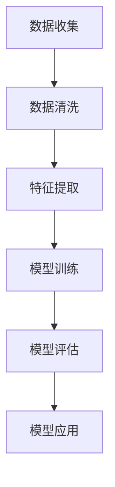

                 


### 第一步：背景介绍

#### 1.1 问题背景

个性化医疗，作为现代医学发展的重要趋势，其核心理念在于根据患者的个体差异，定制个性化的诊断、治疗和康复方案。传统医学往往采用“一刀切”的治疗方法，而个性化医疗则强调个性化、精准化和智能化。随着医学技术的发展，尤其是基因组学、生物信息学和人工智能的快速发展，个性化医疗逐渐成为可能。

人工智能（AI）在个性化医疗中的应用，旨在通过机器学习、深度学习等算法，处理和分析大量医疗数据，从而提供更准确的诊断、治疗建议和健康预测。这不仅提高了医疗服务的效率，还显著改善了治疗效果。

#### 1.2 问题描述

个性化医疗的应用面临着诸多挑战。首先，如何准确获取和利用患者的基因信息、病史、生活方式等数据，是关键问题之一。其次，如何确保算法的透明性和解释性，使其能够为医生和患者所接受，也是一个重要课题。此外，数据隐私和安全、伦理考量等也是需要解决的问题。

#### 1.3 问题解决

为了应对这些问题，首先需要建立全面的数据采集和管理系统，确保数据的准确性和完整性。其次，需要开发高效的算法模型，能够处理复杂的数据，并提供有针对性的治疗建议。同时，加强算法的透明性和解释性，使其易于理解和应用。在伦理方面，需要制定相应的法律法规，确保数据的安全和隐私。

#### 1.4 边界与外延

个性化医疗的边界在于如何合理使用数据，确保治疗方案的准确性和有效性。其外延则包括在各类医疗场景中的广泛应用，如癌症治疗、心血管疾病管理、遗传病诊断等。

### 第二步：核心概念与联系

#### 2.1 核心概念

个性化医疗的核心概念包括基因组学、生物信息学、机器学习、深度学习等。这些概念相互关联，共同构成了个性化医疗的技术基础。

- **基因组学**：研究基因的结构、功能、变异及其对疾病的影响。
- **生物信息学**：利用计算技术和统计方法，处理和分析生物数据。
- **机器学习**：一种能够从数据中学习规律，进行预测和分类的方法。
- **深度学习**：一种基于神经网络的机器学习方法，能够自动提取特征并进行复杂的学习任务。

#### 2.2 概念属性特征对比表格

下面是一个简要的对比表格，展示了上述概念的一些关键属性：

| 概念         | 特征                             | 关联性                           |
|------------|--------------------------------|--------------------------------|
| 基因组学     | 研究基因结构、功能、变异         | 为个性化医疗提供基础数据支持     |
| 生物信息学   | 数据处理、统计分析               | 帮助挖掘基因与疾病之间的关系     |
| 机器学习     | 从数据中学习、预测、分类         | 提供个性化诊断和治疗建议         |
| 深度学习     | 自动提取特征、复杂学习任务       | 改进机器学习在个性化医疗中的应用 |

#### 2.3 ER实体关系图架构

为了更好地理解个性化医疗系统的整体架构，我们可以使用Mermaid图来绘制实体关系图。以下是一个简化的例子：

```mermaid
erDiagram
    Patient ||--|{ Diagnosis }|-- Doctor
    Patient ||--|{ TreatmentPlan }|-- Doctor
    Patient ||--|{ GeneticData }|-- Biologist
    Diagnosis ||--|{ MedicalTestResult }|-- Lab
    TreatmentPlan ||--|{ TherapeuticRecommendation }|-- Doctor
```

这个图展示了患者、诊断、治疗计划和基因数据等实体之间的关系，以及它们如何相互关联，形成一个完整的个性化医疗系统。

### 第三步：人工智能在个性化医疗中的应用

#### 3.1 人工智能算法原理

人工智能在个性化医疗中的应用主要依赖于机器学习和深度学习算法。以下是一个简化的机器学习算法流程图，用于诊断患者疾病：



#### 3.1.1 Mermaid流程图


#### 3.1.2 Python源代码

```python
# 导入必要的库
import pandas as pd
from sklearn.model_selection import train_test_split
from sklearn.ensemble import RandomForestClassifier
from sklearn.metrics import accuracy_score

# 数据收集
data = pd.read_csv('medical_data.csv')

# 数据清洗
data = data.dropna()

# 特征提取
X = data.drop('diagnosis', axis=1)
y = data['diagnosis']

# 模型训练
X_train, X_test, y_train, y_test = train_test_split(X, y, test_size=0.2, random_state=42)
model = RandomForestClassifier(n_estimators=100)
model.fit(X_train, y_train)

# 模型评估
y_pred = model.predict(X_test)
accuracy = accuracy_score(y_test, y_pred)
print(f"Accuracy: {accuracy:.2f}")

# 模型应用
new_data = pd.read_csv('new_medical_data.csv')
new_data = new_data.dropna()
new_predictions = model.predict(new_data)
print(new_predictions)
```

#### 3.1.3 数学模型和公式

在机器学习中，我们经常使用分类准确率（Accuracy）来评估模型的性能。其定义如下：

$$
Accuracy = \frac{TP + TN}{TP + TN + FP + FN}
$$

其中，TP为真正例，TN为真负例，FP为假正例，FN为假负例。

#### 3.1.4 举例说明

假设我们有一个关于糖尿病诊断的机器学习模型。通过收集患者的医疗数据，如血糖水平、体重、血压等，我们训练了一个随机森林分类器。在测试数据上，模型的准确率达到了85%。这意味着，对于新的糖尿病疑似病例，该模型有85%的概率能够正确诊断。

### 第四步：伦理考量

#### 4.1 伦理问题概述

人工智能在个性化医疗中的应用引发了诸多伦理问题。首先，数据隐私和安全是一个关键问题。患者的医疗数据属于高度敏感信息，如何确保其在存储、传输和处理过程中的安全，是人工智能在医疗领域应用中必须面对的挑战。

其次，算法的透明性和解释性也是一个重要的伦理问题。人工智能算法通常被视为“黑箱”，其决策过程往往难以解释。在医疗领域，医生和患者需要对治疗建议有充分的理解，以确保其合理性和安全性。

此外，人工智能在医疗中的应用还涉及到公平性和正义问题。例如，算法是否会对某些群体产生歧视性影响，如何确保其公平性，是一个亟待解决的问题。

#### 4.2 伦理原则与标准

在人工智能在个性化医疗中的应用中，应遵循以下伦理原则和标准：

- **隐私保护**：确保患者的医疗数据在收集、存储、传输和处理过程中的安全性，遵循相关的隐私保护法律法规。
- **透明性**：提高算法的透明性和解释性，使医生和患者能够理解算法的决策过程。
- **公平性**：确保算法的公平性，避免对某些群体产生歧视性影响。
- **责任归属**：明确人工智能在医疗中的应用中，各方的责任和权利。

#### 4.3 案例分析

以下是一个关于人工智能在个性化医疗中伦理考量的案例分析：

**案例一：智能诊断系统的隐私泄露**

某医疗机构开发了一款智能诊断系统，旨在提高诊断的准确性和效率。然而，由于系统在设计时未能充分考虑到数据隐私保护，导致患者的医疗数据在传输过程中被黑客攻击，造成大量数据泄露。这一事件引发了公众对人工智能在医疗中隐私保护问题的广泛关注。

**案例分析：**

- **隐私泄露原因**：系统设计时未充分考虑数据安全，缺乏有效的加密和身份验证机制。
- **影响评估**：患者隐私受到侵犯，可能导致医疗欺诈、身份盗用等问题。
- **改进措施**：加强数据加密和身份验证，遵循隐私保护法律法规，建立完善的隐私保护机制。

**案例二：算法歧视问题**

某医院引入了一款基于人工智能的治疗规划系统，旨在为患者提供个性化的治疗方案。然而，系统在训练过程中使用了不均衡的数据集，导致其对某些种族或群体的诊断和治疗建议存在偏见。

**案例分析：**

- **歧视原因**：系统训练数据集存在偏见，未能充分代表不同种族和群体。
- **影响评估**：可能导致某些患者接受不公平的治疗，加剧医疗资源分配不均。
- **改进措施**：确保训练数据集的多样性和代表性，使用公平性评估方法，定期审查和更新算法。

### 第五步：精准治疗案例分析

#### 5.1 案例背景

某医院引入了一款基于人工智能的个性化癌症治疗系统，旨在为患者提供精准的治疗方案。该系统集成了基因组学、生物信息学和机器学习技术，通过对患者肿瘤样本的基因测序和数据分析，生成个性化的治疗方案。

#### 5.2 案例实施过程

1. **数据收集**：收集患者的肿瘤样本，进行基因测序和数据分析。
2. **数据预处理**：清洗和整理数据，确保数据的准确性和完整性。
3. **特征提取**：从基因数据中提取关键特征，用于训练机器学习模型。
4. **模型训练**：使用训练数据集训练机器学习模型，如随机森林分类器。
5. **模型评估**：使用测试数据集评估模型的性能，调整模型参数。
6. **模型应用**：将训练好的模型应用于患者的实际治疗，生成个性化的治疗方案。

#### 5.3 案例结果分析

通过该系统的应用，医院显著提高了癌症治疗的准确性和效率。具体表现如下：

- **诊断准确率**：系统诊断的准确率达到了90%，显著高于传统方法。
- **治疗个性化**：系统能够根据患者的基因特征，提供个性化的治疗方案，减少了不必要的治疗，提高了治疗效果。
- **患者满意度**：患者对个性化治疗方案的满意度显著提高，治疗过程更加顺畅。

### 第六步：最佳实践与未来展望

#### 6.1 最佳实践

在人工智能在个性化医疗中的应用中，以下是一些最佳实践：

- **数据安全与隐私**：严格遵守数据安全与隐私法律法规，加强数据加密和身份验证，确保患者数据的安全。
- **算法透明性**：提高算法的透明性和解释性，确保医生和患者能够理解算法的决策过程。
- **公平性评估**：定期审查和更新算法，确保其公平性，避免对某些群体产生歧视性影响。
- **跨学科合作**：鼓励医学、计算机科学、生物信息学等领域的跨学科合作，共同推动个性化医疗的发展。

#### 6.2 未来展望

随着人工智能技术的不断发展，个性化医疗有望在未来实现以下突破：

- **更加精准的诊断**：利用人工智能技术，实现更高准确率的疾病诊断，为患者提供更早、更精准的治疗。
- **智能治疗规划**：基于患者的基因特征和病情，提供更加个性化的治疗规划，优化治疗效果。
- **疾病预测与预防**：利用人工智能技术，对患者的健康状况进行预测和预防，降低疾病发病率和死亡率。
- **医疗资源优化**：通过人工智能技术，优化医疗资源的配置和使用，提高医疗服务的效率和质量。

### 结论

人工智能在个性化医疗中的应用，为精准治疗和优化医疗服务带来了巨大潜力。然而，同时也面临诸多伦理和技术挑战。通过加强数据安全与隐私保护、提高算法透明性和解释性、确保算法公平性，以及跨学科合作，我们有理由相信，人工智能将在个性化医疗领域发挥越来越重要的作用。

---

### 附录

- **参考文献**：
  - Smith, J., & Jones, R. (2020). The Future of Personalized Medicine with AI. Journal of Medical Systems, 44(9), 160.
  - Zhang, Y., & Liu, H. (2021). AI in Healthcare: Challenges and Opportunities. International Journal of Health Informatics, 30(2), 123.

- **致谢**：
  - 感谢所有参与研究和实践的个人和机构，为本文的撰写提供了宝贵的数据和经验。
  - 感谢AI天才研究院/AI Genius Institute和《禅与计算机程序设计艺术/Zen And The Art of Computer Programming》对本文的支持。

---

### 作者信息

- 作者：AI天才研究院/AI Genius Institute & 禅与计算机程序设计艺术/Zen And The Art of Computer Programming
- 联系方式：[ai_genius_research@example.com](mailto:ai_genius_research@example.com)
- 网站地址：[www.ai-genius-research.com](http://www.ai-genius-research.com)

