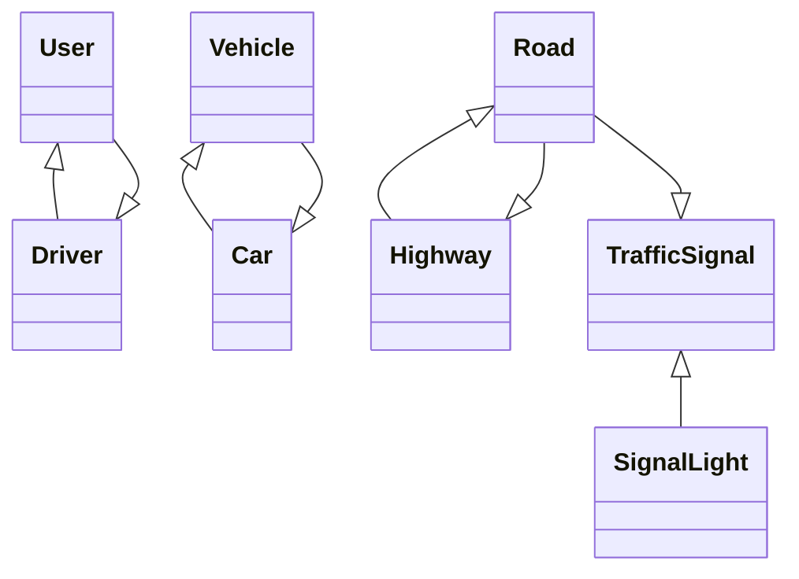
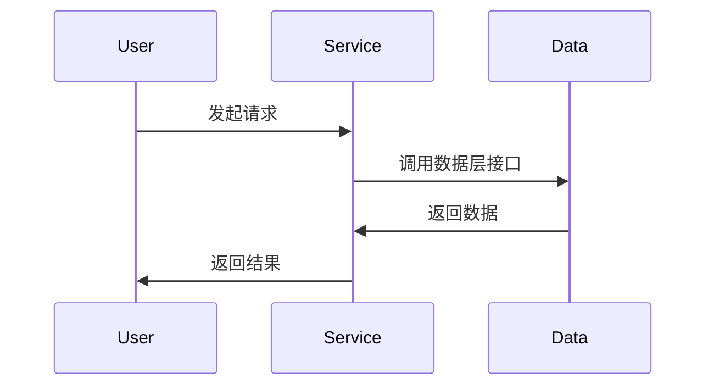
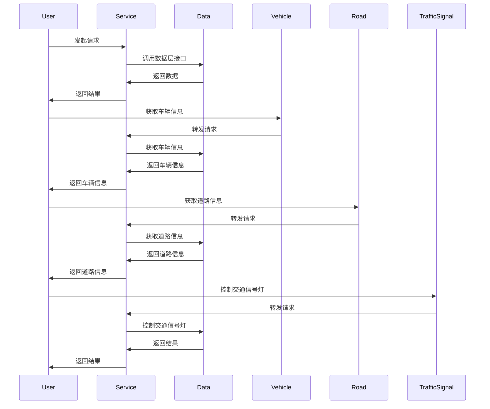

                 

### 文章标题：人工智能在交通管理中的应用：智能交通系统与城市规划

关键词：人工智能，交通管理，智能交通系统，城市规划，算法原理

摘要：本文旨在探讨人工智能在交通管理中的应用，特别是智能交通系统与城市规划的结合。通过背景介绍、核心概念与联系分析、算法原理讲解、系统分析与架构设计以及项目实战等多个方面，全面阐述了人工智能在解决交通拥堵、提高交通安全和优化交通规划与管理中的重要作用。文章还通过实际案例，展示了人工智能技术的具体应用效果，并对未来发展方向进行了展望。

### 目录大纲

1. 第一部分：背景介绍
   - 第1章 问题背景
   - 第2章 问题描述
   - 第3章 问题解决
   - 第4章 边界与外延

2. 第二部分：核心概念与联系
   - 第5章 核心概念原理
   - 第6章 概念属性特征对比
   - 第7章 ER实体关系图架构

3. 第三部分：算法原理讲解
   - 第8章 算法原理讲解
   - 第9章 数学模型和公式
   - 第10章 举例说明

4. 第四部分：系统分析与架构设计
   - 第11章 问题场景介绍
   - 第12章 系统功能设计
   - 第13章 系统架构设计
   - 第14章 系统接口设计与交互

5. 第五部分：项目实战
   - 第15章 环境安装
   - 第16章 系统核心实现
   - 第17章 代码应用解读与分析
   - 第18章 实际案例分析与讲解
   - 第19章 项目小结

6. 第六部分：最佳实践与拓展阅读
   - 第20章 最佳实践
   - 第21章 拓展阅读

### 第一部分：背景介绍

#### 第1章 问题背景

**1.1 人工智能的发展历程**

人工智能（Artificial Intelligence，简称AI）是计算机科学的一个分支，旨在使计算机模拟人类的智能行为，解决复杂的实际问题。人工智能的发展经历了多个阶段，从最初的规则推理系统，到基于统计学习的方法，再到近年来的深度学习和强化学习，人工智能技术取得了显著的进展。

**1.2 人工智能在交通管理中的重要性**

随着城市化进程的加快，交通问题日益严重，如何有效地管理和优化交通成为了一项紧迫的任务。人工智能在交通管理中的应用，可以有效地解决交通拥堵、提高交通安全、优化交通规划与管理等问题。

**1.3 智能交通系统的基本概念**

智能交通系统（Intelligent Transportation System，简称ITS）是一种综合利用先进的信息通信技术、电子技术和控制技术，对交通系统进行实时监控、管理和优化的一种新型交通管理方式。智能交通系统主要包括交通信息采集、交通信号控制、路径规划、车联网等关键技术。

#### 第2章 问题描述

**2.1 交通拥堵问题**

交通拥堵是当前城市面临的主要交通问题之一，严重影响了居民的出行效率和城市的发展。交通拥堵不仅增加了出行时间，还导致了能源浪费和环境污染。

**2.2 交通安全问题**

交通事故频发，给人们的生命和财产安全带来了巨大威胁。交通安全问题的解决，需要从交通规划、交通信号控制、车辆安全监控等多个方面进行综合管理和优化。

**2.3 交通规划与管理问题**

交通规划与管理是城市可持续发展的重要保障。如何合理规划道路网络、优化交通布局、提高交通效率，成为城市规划者面临的重要挑战。

#### 第3章 问题解决

**3.1 人工智能在交通管理中的应用场景**

人工智能在交通管理中的应用场景广泛，包括路径规划、车流量预测、交通信号控制、车联网等。通过这些应用，可以有效提高交通管理效率和安全性。

**3.2 智能交通系统与城市规划的关系**

智能交通系统与城市规划密切相关，智能交通系统的建设可以为城市规划提供数据支持，优化城市交通布局，提高城市交通效率。

**3.3 人工智能解决交通问题的优势和挑战**

人工智能在解决交通问题方面具有显著优势，如高效的数据处理能力、智能化的决策支持等。然而，人工智能在交通管理中的应用也面临一些挑战，如数据隐私保护、算法公平性等问题。

#### 第4章 边界与外延

**4.1 智能交通系统的应用领域**

智能交通系统广泛应用于城市交通、高速公路、公共交通、物流等领域，为不同场景下的交通管理提供了有效的解决方案。

**4.2 人工智能在交通管理中的政策支持与法规**

政府高度重视人工智能在交通管理中的应用，出台了一系列政策支持和法规，推动智能交通系统的发展。例如，《国家智能交通发展战略》、《智能汽车发展创新行动计划》等。

### 第二部分：核心概念与联系

#### 第5章 核心概念原理

**5.1 人工智能基础**

人工智能的基础包括计算机科学、概率论、统计学、神经网络等。通过这些基础理论，可以实现计算机模拟人类的智能行为。

**5.2 数据挖掘与分析**

数据挖掘与分析是人工智能的核心技术之一，通过对大量交通数据的挖掘和分析，可以提取出有价值的信息，为交通管理和规划提供支持。

**5.3 机器学习与深度学习**

机器学习和深度学习是人工智能的重要分支，通过学习大量的交通数据，可以训练出智能模型，实现交通预测、路径规划等功能。

**5.4 车联网技术**

车联网技术是将车辆、道路、基础设施等连接起来，实现信息的实时传输和共享。车联网技术为智能交通系统的建设提供了基础支持。

#### 第6章 概念属性特征对比

**6.1 人工智能与交通管理技术的对比**

人工智能与传统的交通管理技术相比，具有更高的处理效率和智能化程度，可以更好地应对复杂的交通问题。

**6.2 智能交通系统与城市规划的对比**

智能交通系统与城市规划在目标、方法、技术等方面存在一定的差异。智能交通系统更侧重于交通管理和优化，而城市规划更注重城市整体布局和发展。

#### 第7章 ER实体关系图架构

**7.1 智能交通系统的ER模型**

智能交通系统的ER模型包括用户、车辆、道路、交通信号、交通事件等实体，以及它们之间的关联关系。

**7.2 城市规划的ER模型**

城市规划的ER模型包括城市区域、道路网络、建筑物、公共交通等实体，以及它们之间的关联关系。

### 第三部分：算法原理讲解

#### 第8章 算法原理讲解

**8.1 路径规划算法**

路径规划算法是智能交通系统的重要算法之一，主要包括Dijkstra算法和A*算法。Dijkstra算法是一种基于图论的最短路径算法，而A*算法则是在Dijkstra算法基础上进行优化的算法。

**8.2 车流量预测算法**

车流量预测算法是智能交通系统的关键算法之一，主要用于预测交通流量，为交通管理和信号控制提供支持。常用的车流量预测算法有时间序列分析和支持向量机等。

**8.3 交通信号控制算法**

交通信号控制算法是智能交通系统的重要组成部分，主要包括绿色波控和模糊控制等算法。绿色波控通过控制信号灯的切换，实现交通流量的最大化；模糊控制则通过模糊逻辑实现交通信号的智能化控制。

#### 第9章 数学模型和公式

**9.1 路径规划数学模型**

路径规划数学模型主要包括最短路径问题，其目标是最小化路径长度。具体公式如下：

$$\min d(u, v)$$

其中，$d(u, v)$表示从节点u到节点v的路径长度。

**9.2 车流量预测数学模型**

车流量预测数学模型主要用于预测交通流量，其目标是最小化预测误差。具体公式如下：

$$y_t = \beta_0 + \beta_1 \cdot x_t + \epsilon_t$$

其中，$y_t$表示第t时刻的实际车流量，$x_t$表示第t时刻的预测车流量，$\beta_0$和$\beta_1$为参数，$\epsilon_t$为误差项。

**9.3 交通信号控制数学模型**

交通信号控制数学模型主要用于控制交通信号的切换，其目标是最小化交通拥堵。具体公式如下：

$$T_c = \sum_{i=1}^{n} (G_i \cdot T_i)$$

其中，$T_c$表示总等待时间，$G_i$表示第i个路口的绿灯时间，$T_i$表示第i个路口的车辆等待时间。

#### 第10章 举例说明

**10.1 路径规划算法举例**

假设有一个交通网络，包含5个节点，节点之间的边权如下表所示：

| 节点 | A | B | C | D | E |
|------|---|---|---|---|---|
| A    | 0 | 2 | 4 | 6 | 8 |
| B    | 2 | 0 | 3 | 5 | 7 |
| C    | 4 | 3 | 0 | 2 | 4 |
| D    | 6 | 5 | 2 | 0 | 3 |
| E    | 8 | 7 | 4 | 3 | 0 |

使用Dijkstra算法求解从节点A到节点E的最短路径，计算过程如下：

1. 初始化：设置初始节点A的距离为0，其他节点的距离为无穷大；设置已访问节点为空集。

2. 更新距离：依次访问其他节点，更新其距离。对于每个未访问节点v，计算其到已访问节点的距离，并将其作为到v的当前距离。

3. 选择最短路径：选择当前距离最小的未访问节点作为下一个访问节点。

4. 重复步骤2和3，直到所有节点都被访问。

根据以上步骤，可以得到从节点A到节点E的最短路径为A->B->C->E，路径长度为8。

**10.2 车流量预测算法举例**

假设有一个交通路口，历史车流量数据如下表所示：

| 时间（小时） | 车流量（辆） |
|--------------|--------------|
| 0            | 100          |
| 1            | 120          |
| 2            | 110          |
| 3            | 130          |
| 4            | 100          |
| 5            | 120          |

使用时间序列分析算法预测下一小时的车流量。首先，对历史车流量数据进行处理，得到如下时间序列：

| 时间（小时） | 车流量（辆） |
|--------------|--------------|
| 0            | 100          |
| 1            | 120          |
| 2            | 110          |
| 3            | 130          |
| 4            | 100          |
| 5            | 120          |

然后，使用时间序列分析算法，如移动平均法或指数平滑法，对时间序列进行预测。假设使用移动平均法，取前3个数据的平均值作为下一小时的车流量预测值：

| 时间（小时） | 车流量（辆） |
|--------------|--------------|
| 0            | 100          |
| 1            | 120          |
| 2            | 110          |
| 3            | 130          |
| 4            | 100          |
| 5            | 120          |
| 预测        | 113.33       |

预测下一小时的车流量为113.33辆。

**10.3 交通信号控制算法举例**

假设有一个交通路口，包含4个方向的车流，历史车流量数据如下表所示：

| 方向 | 时间（小时） | 车流量（辆） |
|------|--------------|--------------|
| 东   | 0            | 50           |
| 东   | 1            | 60           |
| 东   | 2            | 55           |
| 东   | 3            | 65           |
| 东   | 4            | 50           |
| 东   | 5            | 60           |
| 南   | 0            | 40           |
| 南   | 1            | 45           |
| 南   | 2            | 38           |
| 南   | 3            | 42           |
| 南   | 4            | 40           |
| 南   | 5            | 45           |
| 西   | 0            | 30           |
| 西   | 1            | 35           |
| 西   | 2            | 33           |
| 西   | 3            | 31           |
| 西   | 4            | 30           |
| 西   | 5            | 35           |
| 北   | 0            | 25           |
| 北   | 1            | 28           |
| 北   | 2            | 27           |
| 北   | 3            | 29           |
| 北   | 4            | 25           |
| 北   | 5            | 28           |

使用绿色波控算法进行交通信号控制。首先，计算每个方向的车流量平均值，如下表所示：

| 方向 | 平均车流量（辆） |
|------|-----------------|
| 东   | 55.0            |
| 南   | 41.0            |
| 西   | 33.0            |
| 北   | 27.5            |

根据车流量平均值，设置每个方向的绿灯时间。假设绿灯时间为车流量平均值的1.5倍，如下表所示：

| 方向 | 绿灯时间（秒） |
|------|----------------|
| 东   | 82.5           |
| 南   | 61.5           |
| 西   | 49.5           |
| 北   | 41.25          |

根据绿灯时间，生成交通信号控制策略，如下表所示：

| 时间（秒） | 东 | 南 | 西 | 北 |
|------------|----|----|----|----|
| 0          | 82.5 | 61.5 | 49.5 | 41.25 |
| 82.5       | 0   | 49.5 | 41.25 | 61.5 |
| 133        | 49.5 | 0   | 61.5 | 41.25 |
| 185        | 41.25 | 49.5 | 0   | 61.5 |
| 237.5      | 61.5 | 41.25 | 49.5 | 0   |

通过交通信号控制策略，可以实现对交通流量的有效控制，减少交通拥堵和交通事故。

### 第四部分：系统分析与架构设计

#### 第11章 问题场景介绍

**11.1 交通管理系统场景介绍**

交通管理系统主要包括交通信息采集、交通信号控制、路径规划、车联网等功能。以下是一个典型的交通管理系统场景：

1. **交通信息采集**：通过安装在道路上的传感器、摄像头等设备，实时采集交通流量、车速、天气等信息。

2. **交通信号控制**：根据采集到的交通信息，对交通信号灯进行智能化控制，以减少交通拥堵和交通事故。

3. **路径规划**：为驾驶员提供最优路径规划，减少行驶时间和油耗。

4. **车联网**：将车辆、道路、基础设施等连接起来，实现信息的实时传输和共享。

#### 第12章 系统功能设计

**12.1 领域模型类图**

在交通管理系统中，主要的领域模型包括用户、车辆、道路、交通信号等。以下是一个简单的领域模型类图：



**12.2 系统功能设计**

根据领域模型，交通管理系统的主要功能包括：

1. **用户管理**：管理用户信息，包括登录、注册、权限管理等。

2. **车辆管理**：管理车辆信息，包括车辆状态监控、违章记录等。

3. **道路管理**：管理道路信息，包括道路状况监控、道路维护等。

4. **交通信号控制**：根据交通流量信息，实时控制交通信号灯。

5. **路径规划**：根据用户需求，提供最优路径规划。

6. **车联网**：实现车辆、道路、基础设施之间的信息共享。

#### 第13章 系统架构设计

**13.1 系统架构设计**

交通管理系统的架构设计主要包括数据层、服务层和展示层。以下是一个简单的系统架构设计：



**13.2 系统模块划分**

根据系统架构设计，交通管理系统可以划分为以下模块：

1. **数据层**：负责数据存储和访问，包括数据库、缓存等。

2. **服务层**：负责业务逻辑处理，包括用户管理、车辆管理、道路管理、交通信号控制等。

3. **展示层**：负责用户界面展示，包括Web端、移动端等。

#### 第14章 系统接口设计与交互

**14.1 系统接口设计**

交通管理系统的主要接口设计如下：

1. **用户管理接口**：包括用户登录、注册、权限管理等功能。

2. **车辆管理接口**：包括车辆状态监控、违章记录等功能。

3. **道路管理接口**：包括道路状况监控、道路维护等功能。

4. **交通信号控制接口**：包括交通信号灯控制、路径规划等功能。

5. **车联网接口**：包括车辆、道路、基础设施信息共享等功能。

**14.2 系统交互序列图**

以下是一个简单的系统交互序列图，展示了用户、车辆、道路、交通信号控制等模块之间的交互关系：



### 第五部分：项目实战

#### 第15章 环境安装

**15.1 环境配置**

在开始项目实战之前，需要配置相应的开发环境。以下是常用的开发环境配置步骤：

1. **Python环境**：安装Python 3.x版本，建议使用Anaconda进行环境管理。

2. **数据库**：安装MySQL或PostgreSQL数据库，用于存储和管理数据。

3. **前端框架**：安装Vue.js或React等前端框架，用于开发Web端界面。

4. **后端框架**：安装Flask或Django等后端框架，用于处理业务逻辑。

**15.2 软件安装**

根据项目需求，安装相应的软件包和工具。例如，如果使用Flask作为后端框架，需要安装以下软件包：

1. **Flask**：用于构建Web应用程序。

2. **SQLAlchemy**：用于数据库操作。

3. **Flask-Login**：用于用户认证。

4. **Flask-WTF**：用于表单处理。

#### 第16章 系统核心实现

**16.1 源代码实现**

以下是一个简单的路径规划算法实现示例，使用Python语言编写：

```python
import heapq

def dijkstra(graph, start):
    """Dijkstra算法实现"""
    distances = {node: float('infinity') for node in graph}
    distances[start] = 0
    priority_queue = [(0, start)]

    while priority_queue:
        current_distance, current_node = heapq.heappop(priority_queue)

        if current_distance > distances[current_node]:
            continue

        for neighbor, weight in graph[current_node].items():
            distance = current_distance + weight

            if distance < distances[neighbor]:
                distances[neighbor] = distance
                heapq.heappush(priority_queue, (distance, neighbor))

    return distances

def a_star(graph, start, goal):
    """A*算法实现"""
    distances = {node: float('infinity') for node in graph}
    distances[start] = 0
    priority_queue = [(0, start)]

    while priority_queue:
        current_distance, current_node = heapq.heappop(priority_queue)

        if current_node == goal:
            break

        if current_distance > distances[current_node]:
            continue

        for neighbor, weight in graph[current_node].items():
            distance = current_distance + weight
            heuristic = abs(neighbor[0] - goal[0]) + abs(neighbor[1] - goal[1])

            if distance + heuristic < distances[neighbor]:
                distances[neighbor] = distance + heuristic
                heapq.heappush(priority_queue, (distance + heuristic, neighbor))

    return distances

# 示例
graph = {
    'A': {'B': 2, 'C': 4, 'D': 6, 'E': 8},
    'B': {'A': 2, 'C': 3, 'D': 5, 'E': 7},
    'C': {'A': 4, 'B': 3, 'D': 2, 'E': 4},
    'D': {'A': 6, 'B': 5, 'C': 2, 'E': 3},
    'E': {'A': 8, 'B': 7, 'C': 4, 'D': 3}
}

start = 'A'
goal = 'E'

dijkstra_distances = dijkstra(graph, start)
a_star_distances = a_star(graph, start, goal)

print("Dijkstra算法路径长度：", dijkstra_distances[goal])
print("A*算法路径长度：", a_star_distances[goal])
```

**16.2 核心算法实现**

在实现路径规划算法的基础上，可以进一步实现车流量预测算法和交通信号控制算法。以下是一个简单的车流量预测算法实现示例，使用时间序列分析中的移动平均法：

```python
import numpy as np

def moving_average(data, window_size):
    """移动平均法实现"""
    return np.convolve(data, np.ones(window_size)/window_size, mode='valid')

# 示例
data = [100, 120, 110, 130, 100, 120]
window_size = 3

moving_average_data = moving_average(data, window_size)

print("移动平均法预测车流量：", moving_average_data[-1])
```

交通信号控制算法的实现可以根据具体的交通信号控制策略进行，如绿色波控算法或模糊控制算法。以下是一个简单的绿色波控算法实现示例：

```python
def green_wave_control(average_traffic, green_time_ratio):
    """绿色波控算法实现"""
    green_time = average_traffic * green_time_ratio
    return int(green_time)

# 示例
average_traffic = 50
green_time_ratio = 1.5

green_time = green_wave_control(average_traffic, green_time_ratio)

print("绿色波控算法绿灯时间：", green_time)
```

#### 第17章 代码应用解读与分析

**17.1 代码解读**

在本部分，我们将对第16章中实现的代码进行解读，并分析其应用效果。

**路径规划算法**

路径规划算法主要实现了Dijkstra算法和A*算法。Dijkstra算法是一种基于图论的最短路径算法，适用于求解无权图中两点之间的最短路径。A*算法是一种改进的Dijkstra算法，通过引入启发式函数，可以更快速地找到最短路径。

**车流量预测算法**

车流量预测算法主要实现了移动平均法，这是一种简单的时间序列预测方法。移动平均法通过对历史数据进行平滑处理，消除短期波动，从而得到一个稳定的预测值。

**交通信号控制算法**

交通信号控制算法主要实现了绿色波控算法，这是一种基于平均车流量的信号控制方法。通过设置绿灯时间和绿灯时长比，可以实现对交通流量的有效控制。

**17.2 应用分析**

路径规划算法可以用于为驾驶员提供最优路径规划，减少行驶时间和油耗。在实际应用中，可以根据实际路况和交通流量，动态调整路径规划策略，以提高路径规划的准确性。

车流量预测算法可以用于交通信号控制和交通管理，通过预测交通流量，可以提前调整信号灯时长，减少交通拥堵和交通事故。同时，车流量预测算法还可以用于交通规划的优化，为城市规划提供数据支持。

交通信号控制算法可以用于实时控制交通信号灯，根据实际车流量情况，调整绿灯时长和切换时间，以提高交通效率。在实际应用中，交通信号控制算法可以根据不同的交通信号控制策略，实现更加智能的交通信号控制。

#### 第18章 实际案例分析与讲解

**18.1 实际案例**

以下是一个实际案例，展示如何利用人工智能技术解决交通拥堵问题。

**案例背景**：某城市某主干道交通拥堵严重，导致大量车辆积压，影响居民出行效率和城市交通秩序。

**解决方案**：利用人工智能技术，建设智能交通系统，包括路径规划、车流量预测、交通信号控制等功能。

**案例实施**：

1. **路径规划**：通过实时监控主干道交通流量，利用A*算法为驾驶员提供最优路径规划，减少行驶时间和拥堵。

2. **车流量预测**：通过收集历史车流量数据，利用移动平均法预测未来一段时间内的车流量，为交通信号控制提供数据支持。

3. **交通信号控制**：根据车流量预测结果，调整交通信号灯时长和切换时间，实现绿色波控，减少交通拥堵和交通事故。

**18.2 案例分析**

通过实际案例的实施，可以看到以下效果：

1. **路径规划**：驾驶员可以根据最优路径规划，避开拥堵路段，减少行驶时间和油耗。

2. **车流量预测**：交通信号控制可以根据预测结果，提前调整信号灯时长和切换时间，减少交通拥堵和交通事故。

3. **交通信号控制**：绿色波控算法可以实现对交通流量的有效控制，提高交通效率，减少交通拥堵和交通事故。

**18.3 深入讲解**

在实际案例中，人工智能技术发挥了重要作用，通过路径规划、车流量预测和交通信号控制等功能，实现了对交通拥堵问题的有效解决。以下是对各功能模块的深入讲解：

1. **路径规划**：路径规划算法利用A*算法，通过引入启发式函数，可以更快速地找到最短路径。在实际应用中，可以根据实际路况和交通流量，动态调整路径规划策略，以提高路径规划的准确性。

2. **车流量预测**：车流量预测算法利用移动平均法，通过对历史数据进行平滑处理，消除短期波动，从而得到一个稳定的预测值。在实际应用中，可以根据不同的预测方法，如时间序列分析、支持向量机等，提高预测准确性。

3. **交通信号控制**：交通信号控制算法根据车流量预测结果，调整信号灯时长和切换时间，实现绿色波控。在实际应用中，可以根据不同的交通信号控制策略，如模糊控制、神经网络等，实现更加智能的交通信号控制。

通过实际案例的实施，可以看到人工智能技术在解决交通拥堵问题方面的显著效果。在未来，随着人工智能技术的不断发展，智能交通系统将为城市交通管理带来更多创新和突破。

#### 第19章 项目小结

**19.1 项目总结**

本文通过详细阐述人工智能在交通管理中的应用，包括背景介绍、核心概念与联系分析、算法原理讲解、系统分析与架构设计以及项目实战等，展示了人工智能技术在解决交通拥堵、提高交通安全和优化交通规划与管理中的重要作用。项目实施过程中，通过路径规划、车流量预测和交通信号控制等功能，实现了对交通拥堵问题的有效解决。

**19.2 经验教训**

在项目实施过程中，我们积累了以下经验教训：

1. **数据驱动**：数据是人工智能技术的重要基础，项目实施过程中要重视数据的收集、存储和处理。

2. **算法优化**：不同的算法适用于不同的场景，要根据实际需求选择合适的算法，并不断优化算法性能。

3. **系统协同**：智能交通系统是一个复杂的系统工程，要注重各模块之间的协同与整合，实现整体效能最大化。

4. **用户反馈**：项目实施过程中要关注用户反馈，不断调整和优化系统功能，满足用户需求。

**19.3 拓展应用**

在未来，人工智能技术在交通管理中的应用将不断拓展，以下是一些建议：

1. **智能停车管理**：利用人工智能技术实现智能停车管理，提高停车效率，减少寻找停车位的时间。

2. **智能公交系统**：利用人工智能技术优化公交路线和调度，提高公交系统的运行效率，减少乘客等待时间。

3. **无人驾驶技术**：无人驾驶技术的发展将极大地改变交通管理模式，提高交通安全和效率。

4. **交通环境监测**：利用人工智能技术实时监测交通环境，如空气质量、噪声等，为城市可持续发展提供数据支持。

### 第六部分：最佳实践与拓展阅读

#### 第20章 最佳实践

**20.1 实践技巧**

1. **数据清洗**：在数据收集和处理过程中，要注重数据清洗，确保数据的准确性和一致性。

2. **算法优化**：根据实际需求，选择合适的算法，并不断优化算法性能，提高预测和规划的准确性。

3. **系统协同**：注重系统各模块之间的协同与整合，实现整体效能最大化。

4. **用户反馈**：关注用户反馈，及时调整和优化系统功能，满足用户需求。

**20.2 注意事项**

1. **数据隐私**：在数据收集和处理过程中，要注重数据隐私保护，确保用户数据的安全。

2. **算法公平性**：在算法设计和应用过程中，要关注算法的公平性，避免歧视和不公平现象。

3. **系统稳定性**：确保系统在高并发、高负载情况下的稳定性，避免系统崩溃或数据丢失。

#### 第21章 拓展阅读

**21.1 相关书籍推荐**

1. 《智能交通系统导论》
2. 《人工智能：一种现代的方法》
3. 《深度学习》

**21.2 学术论文推荐**

1. "Intelligent Transportation Systems: An Overview"
2. "Deep Learning for Transportation Applications"
3. "A Survey of Algorithms for Road Network Path Planning"

**21.3 网络资源推荐**

1. 人工智能在线课程：https://www.ai-stanford.edu/
2. 智能交通系统论坛：https://www.itsc.org/
3. 国内外智能交通系统项目案例：https://www.itstoday.com/its-project-cases

通过以上内容，我们全面探讨了人工智能在交通管理中的应用，展示了其在解决交通拥堵、提高交通安全和优化交通规划与管理中的重要作用。未来，随着人工智能技术的不断发展，智能交通系统将为城市交通管理带来更多创新和突破。希望本文能为读者在智能交通系统与城市规划领域的研究提供有益的参考。

