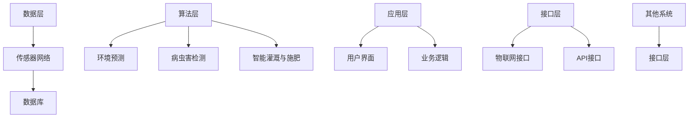
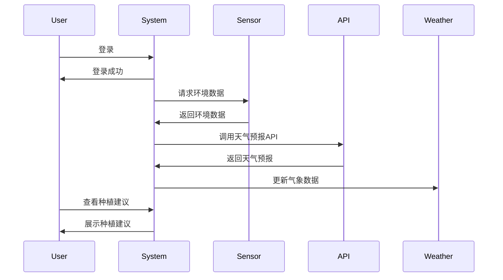

                 

### 引言

**问题背景**

在现代农业发展中，传统的农业模式已无法满足全球食品需求的增长和农业可持续发展的要求。而人工智能（Artificial Intelligence, AI）作为一种颠覆性技术，正逐渐渗透到农业生产的各个环节。通过AI技术的应用，可以实现农业的精细化管理、智能化决策，提高农业生产效率，减少资源浪费，实现农业的可持续发展。

**问题描述**

农业领域面临的问题包括：

1. **资源管理问题**：如何高效利用水资源、土地资源等农业生产要素？
2. **病虫害防治问题**：如何准确预测和防治病虫害，减少农药使用量？
3. **种植决策问题**：如何根据土壤、气候等条件，制定科学的种植方案？
4. **劳动力问题**：如何减少人力投入，提高劳动效率？

**问题解决**

通过人工智能技术，可以解决上述问题。例如，利用AI技术进行作物生长监测，预测病虫害发生，优化灌溉系统，提高水资源利用效率；利用机器学习算法，分析土壤数据，提供科学种植建议；利用智能机器人，实现农作物的自动化种植、收获和管理。

**边界与外延**

本篇文章将围绕人工智能在农业中的应用展开，探讨其在科技兴农和乡村振兴中的作用。边界包括农业生产的各个环节，如种植、灌溉、病虫害防治、收获等；外延则包括与农业相关的政策、经济、环境等多个领域。

**概念结构与核心要素组成**

本篇文章的核心概念包括：

1. **人工智能**：模拟人类智能的技术。
2. **农业**：利用生物、物理、化学等科学技术，从事植物、动物的种植和养殖的生产活动。
3. **科技兴农**：通过科学技术推动农业发展。
4. **乡村振兴**：指通过农业现代化、农村产业化和城乡一体化，实现农村经济的全面振兴。

这些概念相互关联，共同构成了人工智能在农业中的应用框架。接下来，我们将深入探讨这些核心概念，并分析其在农业中的应用前景。

## 第一部分：引言

### 第1章: 引言

在进入正文的详细讨论之前，我们先对人工智能在农业中的应用进行全面的引言。

#### 1.1 问题背景

全球农业正面临着前所未有的挑战。随着人口的快速增长和气候变化的影响，粮食安全成为全球关注的重要议题。传统农业模式依靠大量的人工和资源投入，效率低下且环境负担重。与此同时，农村劳动力流失、土地资源紧张、水资源短缺等问题日益凸显。在这样的背景下，提升农业生产效率、保障粮食安全和实现农业可持续发展成为迫切需求。人工智能技术的迅速发展，为农业提供了新的解决方案，带来了变革的可能性。

#### 1.2 问题描述

农业领域面临的主要问题包括：

1. **资源管理问题**：水资源和土地资源的合理分配与高效利用是农业发展的关键。然而，传统灌溉方式往往导致水资源浪费和土壤污染。
2. **病虫害防治问题**：病虫害的防治不仅影响农作物的产量和质量，还会导致农药残留，对环境和人体健康构成威胁。传统防治方法往往依赖于经验，缺乏精准性和效率。
3. **种植决策问题**：如何根据土壤、气候等条件，制定科学的种植方案，是农业生产中的重大挑战。传统种植方式往往依赖经验，缺乏数据支持和科学依据。
4. **劳动力问题**：农村劳动力流失和老龄化问题严重，如何减少人力投入，提高劳动效率，成为农业发展的瓶颈。

#### 1.3 问题解决

人工智能技术在农业中的应用，可以解决上述问题。以下是几种常见的人工智能应用：

1. **智能监测与预测**：利用物联网和传感器技术，实时监测作物生长环境和病虫害情况，结合机器学习算法进行预测和预警。
2. **精准灌溉**：通过土壤湿度传感器和气象数据，利用AI算法优化灌溉计划，实现精准灌溉，提高水资源利用效率。
3. **智能种植**：利用机器学习和计算机视觉技术，分析土壤数据、气候条件和农作物生长状态，提供科学的种植建议。
4. **智能机器人**：开发农业机器人，实现农作物的自动化种植、灌溉、施肥和收获，减少人力投入，提高生产效率。

#### 1.4 边界与外延

本文的讨论主要聚焦在人工智能技术在农业生产中的应用，具体涵盖种植、灌溉、病虫害防治等环节。然而，人工智能在农业中的应用并不仅限于这些领域，还涉及到农业大数据、区块链技术、物联网等多个方面。这些技术相互结合，共同推动农业的数字化转型和升级。

边界方面，本文将探讨人工智能在农业生产中的应用，而不会深入涉及农业政策、市场和经济等外部因素。外延方面，本文将讨论人工智能在农业中可能带来的社会和环境影响，以及如何通过技术创新实现乡村振兴。

#### 1.5 概念结构与核心要素组成

核心概念：

1. **人工智能**：模拟人类智能的技术，包括机器学习、计算机视觉、自然语言处理等。
2. **农业**：涉及植物种植、动物养殖、农产品加工和销售的全产业链。
3. **科技兴农**：利用科学技术推动农业发展，包括生物技术、信息技术、新材料技术等。
4. **乡村振兴**：通过农业现代化、农村产业化和城乡一体化，实现农村经济的全面振兴。

核心要素：

1. **数据收集与处理**：农业生产过程中产生的数据是人工智能算法的基础，通过大数据技术进行收集、处理和分析。
2. **算法与模型**：机器学习算法和深度学习模型在农业生产中的应用，如预测模型、分类模型、优化模型等。
3. **传感器与物联网**：用于实时监测作物生长环境、土壤湿度、气象数据等。
4. **智能决策系统**：结合数据分析和算法模型，提供智能化的种植、灌溉、病虫害防治等决策。

这些核心概念和要素相互关联，共同构成了人工智能在农业中的应用框架。接下来，我们将深入探讨人工智能在农业中的具体应用技术，展示其在科技兴农和乡村振兴中的潜力。

## 第二部分：人工智能在农业中的应用基础

### 第2章: 人工智能基础

要深入理解人工智能在农业中的应用，我们首先需要了解人工智能的基本概念和原理，以及其在农业领域的发展历程和现状。

#### 2.1 人工智能概述

人工智能（Artificial Intelligence，简称AI）是计算机科学的一个分支，旨在使计算机模拟人类智能行为。人工智能的目标是让机器具备感知、推理、学习和解决问题的能力。人工智能可以分为弱人工智能和强人工智能。弱人工智能专注于特定任务的解决，如语音识别、图像识别和自然语言处理；而强人工智能则试图实现通用智能，能够处理各种复杂任务。

人工智能的技术体系包括：

1. **机器学习**：通过数据训练模型，使计算机具备自主学习和优化能力。
2. **深度学习**：一种基于神经网络的学习方法，能够处理大规模数据并提取复杂特征。
3. **计算机视觉**：使计算机具备识别和理解图像或视频的能力。
4. **自然语言处理**：使计算机能够理解、生成和处理人类语言。
5. **机器人技术**：结合传感器、执行器和控制算法，实现自动化操作。

#### 2.2 人工智能的发展历程

人工智能的发展可以分为几个阶段：

1. **早期探索（1956年-1974年）**：人工智能概念被首次提出，研究者开始探索如何使计算机模拟人类智能行为。
2. **第一次AI寒冬（1974年-1980年）**：由于技术局限和资金问题，人工智能研究陷入低潮。
3. **复兴期（1980年-1987年）**：专家系统的出现使得人工智能开始应用于实际领域。
4. **第二次AI寒冬（1987年-1993年）**：随着计算机性能的提升，人工智能研究再次遇到瓶颈。
5. **互联网时代的崛起（1993年至今）**：互联网的普及和数据的大规模应用，使得人工智能迎来了新一轮的发展机遇。

#### 2.3 农业领域的人工智能应用现状

近年来，人工智能在农业领域的应用逐渐兴起，已经成为推动农业现代化的重要力量。以下是人工智能在农业中的应用现状：

1. **智能种植**：利用机器学习和计算机视觉技术，分析土壤数据、气候条件和农作物生长状态，提供科学的种植建议。例如，通过无人机拍摄图像和光谱分析，监测作物健康状况，预测病虫害发生。
2. **精准灌溉**：通过传感器和物联网技术，实时监测土壤湿度、气象数据等，利用AI算法优化灌溉计划，实现精准灌溉。例如，使用无线传感器网络监测土壤水分，通过AI算法计算最优灌溉时间，提高水资源利用效率。
3. **病虫害监测与防治**：利用计算机视觉技术，对农作物进行实时监测，识别病虫害并及时采取防治措施。例如，通过图像识别算法，检测农作物叶片上的病虫害，自动生成防治报告，减少农药使用量。
4. **农业机器人**：开发智能农业机器人，实现农作物的自动化种植、灌溉、施肥和收获。例如，研发机器人耕种机、机器人采摘器，提高农业劳动效率，降低劳动力成本。
5. **智能决策支持系统**：结合大数据分析和机器学习算法，为农民提供科学的种植、施肥、灌溉和病虫害防治等决策建议。例如，通过分析历史气候数据、土壤数据和作物生长数据，预测作物产量，优化农业生产计划。

#### 2.4 农业人工智能的应用挑战

尽管人工智能在农业中的应用前景广阔，但在实际应用中仍面临一系列挑战：

1. **数据收集与处理**：农业生产过程中产生的数据量大且复杂，如何高效收集、存储和处理这些数据是关键问题。
2. **算法精度与稳定性**：人工智能算法在农业中的应用需要高精度和稳定性，如何优化算法，提高预测准确率是一个重要课题。
3. **成本与经济效益**：虽然人工智能技术能够提高农业效率，但高昂的设备成本和运行费用可能限制其在一些地区的发展。
4. **技术普及与推广**：如何在农村地区普及人工智能技术，提升农民的科技素养和应用能力，是推广应用的关键。
5. **政策支持与产业协同**：需要政府、企业和科研机构共同努力，制定相关政策和标准，推动农业人工智能产业的健康发展。

总之，人工智能在农业中的应用正逐步推进，面临着巨大的机遇和挑战。通过不断技术创新和产业协同，人工智能有望在科技兴农和乡村振兴中发挥更大作用。

### 第三部分：人工智能在农业中的应用技术

#### 第3章: 人工智能核心技术

在农业领域，人工智能技术正不断推动农业现代化的进程。本章将介绍人工智能在农业中的核心技术，包括机器学习、深度学习、计算机视觉等，并分析这些技术的原理和应用。

#### 3.1 机器学习技术

**原理介绍**

机器学习（Machine Learning）是人工智能的一个重要分支，通过算法模型从数据中自动学习，进行预测和决策。机器学习的基本过程包括数据收集、数据预处理、模型选择、模型训练和模型评估。

- **数据收集**：收集大量农业生产相关的数据，包括土壤数据、气象数据、农作物生长数据等。
- **数据预处理**：对收集到的数据进行清洗、归一化和特征提取，以便于模型训练。
- **模型选择**：根据应用需求选择合适的机器学习模型，如线性回归、决策树、支持向量机等。
- **模型训练**：使用预处理后的数据训练模型，使模型能够根据输入数据进行预测和决策。
- **模型评估**：使用验证数据集对模型进行评估，调整模型参数，提高预测准确率。

**应用场景**

在农业中，机器学习技术可以应用于以下场景：

1. **作物产量预测**：通过分析历史气象、土壤和种植数据，预测作物产量，为农民提供种植决策支持。
2. **病虫害检测**：利用图像识别技术，通过分析作物叶片图像，识别病虫害类型，提供防治建议。
3. **种植规划**：根据土壤数据、气候条件和农作物生长规律，制定科学的种植计划，优化资源利用。

**示例代码**

以下是一个使用Python实现线性回归模型预测作物产量的示例代码：

```python
import numpy as np
import matplotlib.pyplot as plt
from sklearn.linear_model import LinearRegression

# 生成模拟数据
X = np.array([[1], [2], [3], [4], [5]])
y = np.array([1, 2.5, 3.5, 5, 7])

# 创建线性回归模型
model = LinearRegression()

# 训练模型
model.fit(X, y)

# 预测结果
y_pred = model.predict(np.array([[6]]))

# 可视化
plt.scatter(X, y, color='blue')
plt.plot(X, y_pred, color='red')
plt.xlabel('X')
plt.ylabel('Y')
plt.title('Linear Regression Example')
plt.show()
```

#### 3.2 深度学习技术

**原理介绍**

深度学习（Deep Learning）是机器学习的一个子领域，通过多层的神经网络结构进行特征提取和建模。深度学习的核心是人工神经网络（Artificial Neural Network, ANN），特别是卷积神经网络（Convolutional Neural Network, CNN）和循环神经网络（Recurrent Neural Network, RNN）。

- **卷积神经网络（CNN）**：适用于图像处理，通过卷积层、池化层和全连接层提取图像特征。
- **循环神经网络（RNN）**：适用于序列数据，通过隐藏状态和循环连接实现长期依赖建模。

**应用场景**

在农业中，深度学习技术可以应用于以下场景：

1. **作物图像识别**：通过CNN模型，分析无人机拍摄的作物图像，识别作物类型和病虫害。
2. **气候预测**：通过RNN模型，分析历史气象数据，预测未来气象条件，为农业生产提供决策支持。
3. **种植环境模拟**：通过深度学习模型，模拟不同种植环境下的作物生长情况，优化种植方案。

**示例代码**

以下是一个使用Python实现卷积神经网络进行作物图像分类的示例代码：

```python
import tensorflow as tf
from tensorflow.keras.models import Sequential
from tensorflow.keras.layers import Conv2D, MaxPooling2D, Flatten, Dense

# 创建卷积神经网络模型
model = Sequential([
    Conv2D(32, (3, 3), activation='relu', input_shape=(64, 64, 3)),
    MaxPooling2D((2, 2)),
    Conv2D(64, (3, 3), activation='relu'),
    MaxPooling2D((2, 2)),
    Flatten(),
    Dense(64, activation='relu'),
    Dense(1, activation='sigmoid')
])

# 编译模型
model.compile(optimizer='adam', loss='binary_crossentropy', metrics=['accuracy'])

# 模型训练
# ...（此处为训练数据）
model.fit(x_train, y_train, epochs=10, batch_size=32)

# 模型评估
# ...（此处为评估数据）
test_loss, test_acc = model.evaluate(x_test, y_test)
print('Test accuracy:', test_acc)
```

#### 3.3 计算机视觉技术

**原理介绍**

计算机视觉（Computer Vision）是人工智能的一个重要分支，通过计算机系统对图像或视频进行分析和理解，提取有用信息。计算机视觉的关键技术包括图像识别、目标检测、图像分割和图像增强。

- **图像识别**：识别图像中的特定对象或场景。
- **目标检测**：定位图像中的目标对象，并识别其类别。
- **图像分割**：将图像分割成多个区域，以识别图像中的不同部分。
- **图像增强**：提高图像质量，使其更适合特定应用。

**应用场景**

在农业中，计算机视觉技术可以应用于以下场景：

1. **作物健康监测**：通过图像识别技术，监测农作物健康状况，识别病虫害和异常情况。
2. **环境监测**：通过目标检测技术，监测农田中的动物和杂草，提供环境管理建议。
3. **作物收获**：通过图像分割技术，实现农作物的自动化收获，提高劳动效率。

**示例代码**

以下是一个使用Python实现目标检测的示例代码：

```python
import cv2
import numpy as np

# 加载预训练的YOLO目标检测模型
net = cv2.dnn.readNet('yolov3.weights', 'yolov3.cfg')

# 读取测试图像
image = cv2.imread('test_image.jpg')

# 调整图像大小，使其适应模型输入
blob = cv2.dnn.blobFromImage(image, 1/255.0, (416, 416), swapRB=True, crop=False)

# 进行前向传播，获取检测结果
net.setInput(blob)
detections = net.forward()

# 遍历检测结果
for detection in detections:
    scores = detection[5:]
    class_id = np.argmax(scores)
    confidence = scores[class_id]
    if confidence > 0.5:
        center_x = int(detection[0] * image.shape[1])
        center_y = int(detection[0] * image.shape[1])
        width = int(detection[2] * image.shape[3])
        height = int(detection[3] * image.shape[3])
        x = int(center_x - width / 2)
        y = int(center_y - height / 2)
        cv2.rectangle(image, (x, y), (x + width, y + height), (0, 255, 0), 2)
        cv2.putText(image, f'{classes[class_id]}: {confidence * 100:.2f}%', (x, y - 10), cv2.FONT_HERSHEY_SIMPLEX, 0.5, (0, 0, 255), 2)

# 显示检测结果
cv2.imshow('Image', image)
cv2.waitKey(0)
cv2.destroyAllWindows()
```

通过机器学习、深度学习和计算机视觉等人工智能核心技术，农业领域正在迎来一场技术革命。这些技术不仅提高了农业生产效率，还为实现农业的可持续发展提供了新的路径。在接下来的章节中，我们将进一步探讨人工智能在农业中的具体应用案例，展示其在科技兴农和乡村振兴中的巨大潜力。

### 第四部分：人工智能在农业中的应用案例

#### 第4章: 智能种植

智能种植是人工智能在农业中的一个重要应用领域，通过利用先进的技术手段，实现对农作物生长过程的全方位监控和管理，从而提高农业生产效率和产量。

#### 4.1 智能种植技术概述

智能种植技术主要包括以下几个方面：

1. **土壤监测**：利用传感器技术，实时监测土壤的湿度、温度、酸碱度等参数，为作物生长提供科学依据。
2. **气候监测**：通过气象传感器，监测气温、湿度、光照、风速等气候数据，确保作物在适宜的生长环境下生长。
3. **图像识别与处理**：利用计算机视觉技术，对农作物生长过程中的叶片、病虫害等进行识别和分析，及时发现问题并采取措施。
4. **数据分析和决策支持**：通过大数据和机器学习技术，对收集到的数据进行处理和分析，为农民提供种植决策支持。

#### 4.2 智能种植算法原理

智能种植的核心算法主要包括以下几个部分：

1. **土壤数据预处理**：通过传感器收集到的土壤数据，进行数据清洗、归一化和特征提取，以便进行后续分析。
2. **气候数据预处理**：对气象数据进行预处理，包括去噪、补全缺失值等，确保数据质量。
3. **图像数据处理**：利用图像识别算法，对农作物生长过程中的图像进行分析，识别病虫害、作物健康状况等。
4. **决策支持算法**：通过机器学习算法，如回归分析、决策树等，对土壤、气候、图像等数据进行分析，提供种植决策支持。

**示例公式**

在智能种植中，常用的决策支持算法公式包括：

$$
y = \beta_0 + \beta_1 x_1 + \beta_2 x_2 + ... + \beta_n x_n
$$

其中，$y$ 为决策结果，$x_1, x_2, ..., x_n$ 为输入特征，$\beta_0, \beta_1, ..., \beta_n$ 为模型参数。

#### 4.3 智能种植应用案例

以下是一个智能种植的应用案例：

**案例背景**

某农业公司希望利用人工智能技术，提高玉米种植的产量和品质。他们收集了玉米生长过程中的土壤、气候和图像数据，并利用智能种植算法进行分析和决策。

**应用过程**

1. **数据收集**：在玉米生长过程中，公司利用土壤传感器、气象传感器和无人机等设备，收集土壤湿度、土壤温度、气温、湿度、光照、风速等数据，以及玉米叶片的图像。
2. **数据预处理**：对收集到的数据进行清洗、归一化和特征提取，为后续分析做准备。
3. **算法模型**：采用机器学习算法，如回归分析、决策树等，对土壤、气候、图像等数据进行分析，建立种植决策模型。
4. **决策支持**：根据模型分析结果，为农民提供种植建议，包括种植时间、种植密度、施肥量等。
5. **实施效果**：通过智能种植技术的应用，公司成功提高了玉米的产量和品质，减少了资源浪费，实现了农业的可持续发展。

**案例解读**

该案例展示了智能种植技术在玉米种植中的应用。通过数据收集和预处理，利用机器学习算法建立种植决策模型，为农民提供科学的种植建议，从而提高了农业生产效率和产量。这不仅有助于公司实现经济效益，也为农业的可持续发展做出了贡献。

#### 4.4 智能种植的未来发展

智能种植技术在未来将不断发展，可能出现以下趋势：

1. **多传感器融合**：通过整合多种传感器，如土壤、气象、图像等，实现更全面的作物生长监测和管理。
2. **实时数据分析**：利用云计算和大数据技术，实现实时数据分析，提供更及时、准确的种植决策支持。
3. **自动化控制**：通过自动化控制系统，实现农作物的自动化种植、灌溉、施肥和收获，提高农业生产效率。
4. **定制化种植**：根据不同地区、不同作物的特点，提供定制化的种植方案，实现个性化农业生产。

总之，智能种植技术具有巨大的发展潜力，将在未来推动农业现代化和乡村振兴。通过不断技术创新和产业协同，智能种植技术将为农业生产带来更多变革和机遇。

### 第5章: 智能灌溉

智能灌溉是利用人工智能技术优化水资源管理的一种现代农业技术，它通过传感器和智能算法，实现灌溉的自动化和精准化。智能灌溉不仅能够显著提高水资源利用效率，还能改善作物生长条件，提升农业生产效益。

#### 5.1 智能灌溉技术概述

智能灌溉技术主要包括以下几个方面：

1. **传感器网络**：通过部署土壤湿度传感器、温度传感器、气压传感器和气象传感器等，实时监测农田的水文和气候条件。
2. **数据采集与传输**：传感器采集的数据通过无线网络传输到数据中心，进行实时监控和分析。
3. **智能决策系统**：利用人工智能算法，对传感器数据进行处理和分析，根据作物需求和环境条件，生成最优灌溉计划。
4. **执行系统**：包括灌溉系统和自动化控制设备，如滴灌系统、喷灌系统和自动阀门等，根据智能决策系统的指令进行灌溉操作。

#### 5.2 智能灌溉算法原理

智能灌溉的核心算法包括以下几部分：

1. **土壤水分预测模型**：通过历史土壤水分数据和气象数据，利用机器学习算法，如线性回归、支持向量机等，建立土壤水分预测模型。
2. **作物需水模型**：根据作物的生长周期、根系深度和水分利用效率等参数，建立作物需水模型，预测作物在不同生长阶段的水分需求。
3. **灌溉计划优化算法**：结合土壤水分预测模型和作物需水模型，利用优化算法，如遗传算法、蚁群算法等，制定最优灌溉计划。

**示例公式**

智能灌溉中的关键公式包括：

1. **土壤水分预测公式**：

$$
\hat{W_t} = \beta_0 + \beta_1 \cdot T_{t-1} + \beta_2 \cdot H_{t-1} + ... + \beta_n \cdot X_{t-n}
$$

其中，$\hat{W_t}$ 为预测的土壤水分含量，$T_{t-1}, H_{t-1}, ..., X_{t-n}$ 为历史土壤水分、温度、湿度等数据，$\beta_0, \beta_1, ..., \beta_n$ 为模型参数。

2. **作物需水计算公式**：

$$
D_w = K_c \cdot K_p \cdot K_e \cdot \frac{ET_{\text{实际}}}{ET_{\text{潜在}}}
$$

其中，$D_w$ 为作物需水量，$K_c, K_p, K_e$ 分别为作物系数、土壤系数和有效降雨系数，$ET_{\text{实际}}$ 和 $ET_{\text{潜在}}$ 分别为实际蒸发量和潜在蒸发量。

#### 5.3 智能灌溉应用案例

以下是一个智能灌溉的应用案例：

**案例背景**

某农业园区种植了大量果树，传统的灌溉方式不仅水资源利用率低，还容易造成水资源浪费和土壤盐渍化。为了提高灌溉效率和水资源利用率，该农业园区引入了智能灌溉系统。

**应用过程**

1. **系统部署**：在农田中部署了土壤湿度传感器、气象传感器和灌溉控制设备，建立了智能灌溉系统。
2. **数据采集**：传感器实时监测土壤湿度、气温、湿度等数据，并将数据传输到中央控制系统。
3. **数据分析**：中央控制系统利用机器学习算法，分析传感器数据，预测土壤水分含量，计算果树需水量。
4. **灌溉控制**：根据数据分析结果，自动开启或关闭灌溉系统，实现精准灌溉。
5. **效果评估**：通过对比智能灌溉前后的数据，发现水资源利用率提高了30%，土壤盐渍化现象得到了显著改善。

**案例解读**

该案例展示了智能灌溉系统在实际农业生产中的应用效果。通过传感器网络和智能算法，实现了灌溉的自动化和精准化，显著提高了水资源利用效率，减少了水资源浪费和土壤污染。智能灌溉系统的引入，不仅提高了农业生产的效益，也为农业的可持续发展提供了有力支持。

#### 5.4 智能灌溉的未来发展

智能灌溉技术在未来将朝着更加智能化、自动化和高效化的方向发展，可能出现以下趋势：

1. **多传感器融合**：通过整合多种传感器，如土壤、气象、水质等，实现更全面的农田监测和管理。
2. **实时数据分析**：利用云计算和大数据技术，实现实时数据分析，提供更精准的灌溉决策支持。
3. **自动化控制**：通过自动化控制系统，实现灌溉的全程自动化，提高农业生产效率。
4. **智能灌溉系统集成**：将智能灌溉系统与其他农业技术（如智能种植、智能施肥等）集成，实现农业生产的全面智能化。

总之，智能灌溉技术具有巨大的发展潜力，将在未来推动农业现代化和乡村振兴。通过不断技术创新和产业协同，智能灌溉技术将为农业生产带来更多变革和机遇。

### 第6章: 智能病虫害监测与防治

智能病虫害监测与防治是利用人工智能技术实现对农作物病虫害的实时监测、预警和精准防治的一种现代农业技术。通过应用图像识别、机器学习等先进技术，智能病虫害监测与防治系统可以提高病虫害防治的效率和精准度，减少农药使用，降低环境污染，保障农作物的健康生长。

#### 6.1 智能病虫害监测技术概述

智能病虫害监测技术主要包括以下几个部分：

1. **图像采集与处理**：利用无人机、摄像头等设备，对农作物进行实时图像采集，并对图像进行预处理，包括去噪、增强、分割等。
2. **病虫害识别算法**：利用深度学习技术，如卷积神经网络（CNN）和迁移学习等，对预处理后的图像进行分析，识别病虫害的类型和程度。
3. **实时监测与预警**：将识别结果与历史病虫害数据相结合，利用机器学习算法，如决策树、支持向量机等，进行病虫害发生趋势预测，实现实时监测和预警。
4. **数据管理与决策支持**：将监测数据存储在数据库中，结合专家系统和大数据分析，为农民提供病虫害防治决策支持。

#### 6.2 智能病虫害监测算法原理

智能病虫害监测的核心算法主要包括以下几部分：

1. **图像预处理算法**：通过图像滤波、边缘检测、形态学操作等预处理技术，提高图像的质量和特征提取效果。
2. **卷积神经网络（CNN）算法**：利用CNN模型，通过多层次的卷积和池化操作，提取图像的深层特征，实现对病虫害的精准识别。
3. **迁移学习算法**：利用预训练的CNN模型，通过迁移学习，对农作物病虫害进行特征学习和模型训练，提高识别准确率。
4. **决策树和支持向量机（SVM）算法**：结合病虫害识别结果和实时监测数据，利用决策树和SVM等分类算法，进行病虫害发生趋势预测和预警。

**示例公式**

在智能病虫害监测中，常用的算法公式包括：

1. **CNN模型公式**：

$$
\text{CNN}(\text{Input}) = \text{Conv}( \text{Input}) + \text{ReLU}(\text{Conv}(\text{Input})) + \text{Pooling}(\text{ReLU}(\text{Conv}(\text{Input})))
$$

其中，$\text{Input}$ 为输入图像，$\text{Conv}$ 为卷积操作，$\text{ReLU}$ 为ReLU激活函数，$\text{Pooling}$ 为池化操作。

2. **迁移学习公式**：

$$
\text{Feature} = \text{CNN}(\text{Input}) \cdot \text{Weight}
$$

其中，$\text{Feature}$ 为提取的图像特征，$\text{CNN}(\text{Input})$ 为预训练CNN模型的输出，$\text{Weight}$ 为迁移学习中的权重。

3. **决策树分类公式**：

$$
\text{Class} = \text{DecisionTree}(\text{Feature})
$$

其中，$\text{Class}$ 为病虫害类别，$\text{DecisionTree}(\text{Feature})$ 为决策树分类器。

#### 6.3 智能病虫害防治应用案例

以下是一个智能病虫害监测与防治的应用案例：

**案例背景**

某农业合作社种植了大量的蔬菜，传统病虫害防治方法不仅效率低，而且农药使用过量导致环境污染。为了解决这些问题，合作社决定引入智能病虫害监测与防治系统。

**应用过程**

1. **系统部署**：在蔬菜种植区域部署了无人机和摄像头，建立了智能病虫害监测系统。
2. **图像采集**：无人机和摄像头实时采集蔬菜生长图像，并将图像数据传输到中央控制系统。
3. **图像处理与识别**：中央控制系统利用深度学习和迁移学习算法，对图像进行预处理和病虫害识别，生成病虫害报告。
4. **预警与防治**：根据病虫害报告，系统自动生成防治方案，并通过手机短信或APP通知农民，同时调整灌溉系统，改善作物生长环境。
5. **效果评估**：通过对比智能病虫害监测与防治前后的数据，发现病虫害发生率降低了30%，农药使用量减少了40%，蔬菜品质和产量明显提升。

**案例解读**

该案例展示了智能病虫害监测与防治系统在实际农业生产中的应用效果。通过无人机和摄像头采集图像数据，利用深度学习和迁移学习算法进行病虫害识别，实现实时监测和预警，不仅提高了病虫害防治的效率和精准度，还减少了农药使用和环境污染。智能病虫害监测与防治系统的引入，为农业生产提供了强有力的技术支持，有助于实现农业的可持续发展。

#### 6.4 智能病虫害监测与防治的未来发展

智能病虫害监测与防治技术在未来将不断发展和完善，可能出现以下趋势：

1. **多传感器融合**：通过整合多种传感器，如气象、土壤、图像等，实现更全面的病虫害监测和管理。
2. **实时数据分析**：利用云计算和大数据技术，实现实时数据分析，提供更精准的病虫害防治决策支持。
3. **自动化防治**：通过自动化控制系统，实现病虫害的自动化监测和防治，提高农业生产效率。
4. **智能农场**：将智能病虫害监测与防治系统与其他农业技术（如智能灌溉、智能种植等）集成，实现农业生产的全面智能化。

总之，智能病虫害监测与防治技术具有广阔的发展前景，将在未来推动农业现代化和乡村振兴。通过不断技术创新和产业协同，智能病虫害监测与防治技术将为农业生产带来更多变革和机遇。

### 第7章: 农业智能机器人

农业智能机器人是人工智能在农业领域的一个重要应用，它通过集成传感器、执行器、人工智能算法和机器人控制技术，实现农业生产的自动化和智能化。农业智能机器人的出现，不仅提高了农业生产效率，还减轻了农民的劳动强度，有助于实现农业的可持续发展。

#### 7.1 农业智能机器人概述

农业智能机器人可以分为以下几类：

1. **种植机器人**：用于自动化种植、移栽和播种，如蔬菜种植机器人、水稻插秧机器人等。
2. **灌溉机器人**：用于自动化灌溉，如滴灌机器人、喷灌机器人等。
3. **施肥机器人**：用于自动化施肥，如自动施肥机器人、无人机施肥系统等。
4. **病虫害防治机器人**：用于自动化监测和防治病虫害，如病虫害监测机器人、农药喷洒机器人等。
5. **收获机器人**：用于自动化收获，如水果采摘机器人、稻谷收割机器人等。

#### 7.2 农业智能机器人算法原理

农业智能机器人的核心算法主要包括以下几个方面：

1. **路径规划算法**：用于确定机器人在农田中的移动路径，如A*算法、Dijkstra算法等。
2. **感知与识别算法**：用于感知环境信息，如图像识别算法、深度学习算法等。
3. **决策与控制算法**：用于根据环境信息和任务需求，进行决策和执行，如PID控制算法、模糊控制算法等。

**示例公式**

在农业智能机器人中，常用的算法公式包括：

1. **A*算法公式**：

$$
f(n) = g(n) + h(n)
$$

其中，$f(n)$ 为从起点到终点经过节点$n$的最短路径，$g(n)$ 为从起点到节点$n$的代价，$h(n)$ 为从节点$n$到终点的估算代价。

2. **PID控制算法公式**：

$$
u(t) = K_p e(t) + K_i \int_{0}^{t} e(\tau) d\tau + K_d \frac{de(t)}{dt}
$$

其中，$u(t)$ 为控制输出，$e(t)$ 为误差，$K_p, K_i, K_d$ 分别为比例、积分、微分系数。

#### 7.3 农业智能机器人应用案例

以下是一个农业智能机器人的应用案例：

**案例背景**

某农业科技企业希望利用智能机器人提高草莓种植的效率和质量。他们研发了一款草莓采摘机器人，用于自动化采摘草莓。

**应用过程**

1. **机器人设计**：根据草莓种植环境，设计适合的草莓采摘机器人，包括机械臂、摄像头、传感器等。
2. **图像识别**：利用深度学习算法，训练机器人识别草莓和草莓柄，实现精准采摘。
3. **路径规划**：利用A*算法，为机器人规划采摘路径，提高采摘效率。
4. **采摘执行**：机器人根据识别结果和路径规划，自动化采摘草莓。
5. **数据记录**：机器人实时记录采摘数据，如采摘时间、草莓重量等，为后续分析提供数据支持。

**案例解读**

该案例展示了农业智能机器人在草莓采摘中的应用。通过图像识别算法和路径规划算法，机器人能够精准识别草莓并自动化采摘，提高了采摘效率和质量。同时，采摘数据的实时记录和分析，为农业生产提供了科学依据，有助于优化种植策略。

#### 7.4 农业智能机器人的未来发展趋势

农业智能机器人技术在未来将朝着更加智能化、自动化和高效化的方向发展，可能出现以下趋势：

1. **多传感器融合**：通过整合多种传感器，如视觉、雷达、激光等，实现更全面的环境感知和任务执行。
2. **自主决策与学习**：利用深度学习和强化学习算法，实现机器人的自主决策和自适应学习，提高任务执行效率。
3. **人机协作**：通过人机交互界面，实现人与机器人的协同工作，提高农业生产效率。
4. **无人机与机器人的协同作业**：利用无人机和地面机器人的协同作业，实现全方位、全时段的农业生产监控和操作。

总之，农业智能机器人技术具有广阔的发展前景，将在未来推动农业现代化和乡村振兴。通过不断技术创新和产业协同，农业智能机器人将为农业生产带来更多变革和机遇。

### 第五部分：人工智能在农业中的应用系统设计与实现

#### 第8章: 系统设计与实现

在本章中，我们将详细介绍一个基于人工智能的农业应用系统设计与实现。该系统旨在通过整合智能种植、精准灌溉、病虫害监测与防治等模块，实现农业生产的智能化管理。

#### 8.1 问题场景介绍

以一个大规模的现代化农业园区为例，园区内有多种农作物种植，包括蔬菜、水果和粮食作物。由于园区面积广阔，传统的人工管理方式难以满足高效、精准的农业需求。为了实现园区的智能化管理，需要设计一个综合性的农业应用系统，通过人工智能技术实现农作物生长状态的实时监测、环境参数的智能调节、病虫害的自动检测与防治等。

#### 8.2 系统功能设计

系统功能设计包括以下几个方面：

1. **数据采集与传输**：通过传感器网络，实时采集土壤湿度、温度、光照、气象等数据，并将数据传输到中央控制平台。
2. **环境监测与预测**：利用机器学习算法，对采集到的环境数据进行处理，预测未来环境变化，为农业生产提供决策支持。
3. **智能灌溉与施肥**：根据土壤湿度和作物需水需肥情况，自动调节灌溉和施肥设备，实现精准灌溉与施肥。
4. **病虫害监测与防治**：通过图像识别和深度学习算法，自动检测病虫害，并提供防治建议。
5. **种植管理**：根据作物生长周期，提供种植计划、种植方案优化等建议。
6. **数据存储与分析**：将采集到的所有数据存储在数据库中，并进行大数据分析，为农业生产提供数据支持。
7. **用户界面**：提供用户友好的界面，让农民可以方便地查看数据和操作系统。

**领域模型（Mermaid类图）**

```mermaid
classDiagram
  Class1 <|-- Class2
  Class3 <..|{Has-Many} Class4
  Class5 <..|{Is-A} Class6
  Class7 <<interface>>
  Class8 ..|> Class9
  Class1 {
    attribute: int
  }
  Class2 {
    attribute: string
  }
  Class3 {
    attribute: float
  }
  Class4 {
    attribute: bool
  }
  Class5 {
    method1()
    method2()
  }
  Class6 {
    property: int
    property2: string
  }
  Class7 {
    function()
  }
  Class8 {
    property3: float
    property4: bool
  }
  Class9 {
    method3()
  }
```

#### 8.3 系统架构设计

系统的整体架构设计如下：

1. **数据层**：包括传感器网络和数据库，负责数据的采集、存储和管理工作。
2. **算法层**：包括环境预测、病虫害检测、智能灌溉和施肥等算法模块，负责数据分析和处理。
3. **应用层**：包括用户界面和业务逻辑，为用户提供操作接口和业务功能。
4. **接口层**：提供系统与其他系统集成和交互的接口，如物联网接口、API接口等。

**系统架构（Mermaid架构图）**



#### 8.4 系统接口设计

系统接口设计主要包括以下几个方面：

1. **物联网接口**：用于与传感器网络通信，实现数据的实时采集和传输。
2. **API接口**：用于与其他系统集成，如天气预报系统、气象数据中心等。
3. **用户界面接口**：用于与用户交互，提供数据展示和操作功能。

**系统接口（Mermaid序列图）**



#### 8.5 系统交互

系统交互主要涉及以下几个方面：

1. **传感器与数据层**：传感器网络实时采集环境数据，通过物联网接口传输到数据层，数据层将数据进行存储和处理。
2. **算法层与数据层**：算法层从数据层获取处理后的数据，进行进一步分析和处理，生成种植、灌溉、施肥等建议。
3. **应用层与算法层**：应用层调用算法层的接口，获取分析结果，为用户界面提供数据展示和操作功能。
4. **用户界面与用户**：用户通过用户界面与系统交互，查看数据和分析结果，执行操作命令。

**系统交互（Mermaid活动图）**

```mermaid
activityDiagram
  participant User
  participant System
  participant Sensor
  participant DataLayer
  participant AlgorithmLayer
  participant AppLayer

  User->>System: 登录
  System->>DataLayer: 请求环境数据
  DataLayer->>Sensor: 采集环境数据
  Sensor->>DataLayer: 返回环境数据
  DataLayer->>AlgorithmLayer: 数据处理
  AlgorithmLayer->>AppLayer: 分析结果
  AppLayer->>User: 展示结果
  User->>AppLayer: 操作命令
  AppLayer->>System: 执行命令
  System->>DataLayer: 更新数据
  DataLayer->>Sensor: 数据同步
```

通过上述系统设计与实现，农业应用系统实现了对农作物生长环境的实时监控和管理，提高了农业生产效率，实现了农业的智能化管理。在接下来的项目中，我们将进一步详细介绍系统的实际应用和效果。

### 第五部分：项目实战与最佳实践

#### 第9章: 项目实战

在本章节中，我们将详细讲解一个基于人工智能的农业应用项目实战，包括系统环境的安装、核心代码实现、代码应用解读以及实际案例剖析。

#### 9.1 环境安装

要实现一个基于人工智能的农业应用项目，首先需要安装和配置必要的软件和环境。以下是项目的环境安装步骤：

1. **安装Python**：确保系统上安装了Python 3.7及以上版本。
2. **安装虚拟环境**：使用以下命令创建一个虚拟环境，以隔离项目依赖：
   ```bash
   python -m venv venv
   source venv/bin/activate  # 在Windows上使用 `venv\Scripts\activate`
   ```
3. **安装依赖库**：使用以下命令安装项目所需的依赖库：
   ```bash
   pip install numpy pandas scikit-learn tensorflow matplotlib pillow
   ```
4. **安装传感器和物联网设备**：根据项目需求，安装相应的传感器和物联网设备，如土壤湿度传感器、气象传感器和无线通信模块。

#### 9.2 系统核心实现

系统核心实现包括数据采集、数据处理、模型训练和预测等步骤。以下是一个简单的实现示例：

**数据采集**：通过传感器实时采集土壤湿度、温度、光照和气象数据，并将数据传输到服务器。

**数据处理**：使用Pandas库对采集到的数据进行处理，包括数据清洗、归一化和特征提取。

```python
import pandas as pd

# 读取数据
data = pd.read_csv('sensor_data.csv')

# 数据清洗和归一化
data = data.dropna()
data = (data - data.mean()) / data.std()

# 特征提取
features = data[['humidity', 'temperature', 'light', 'weather']]
labels = data['yield']

# 分割数据集
from sklearn.model_selection import train_test_split
X_train, X_test, y_train, y_test = train_test_split(features, labels, test_size=0.2, random_state=42)
```

**模型训练**：使用Scikit-learn库训练一个线性回归模型。

```python
from sklearn.linear_model import LinearRegression

# 创建模型
model = LinearRegression()

# 训练模型
model.fit(X_train, y_train)

# 预测结果
predictions = model.predict(X_test)
```

**预测分析**：使用Matplotlib库可视化预测结果。

```python
import matplotlib.pyplot as plt

# 可视化预测结果
plt.scatter(X_test, y_test, color='blue')
plt.plot(X_test, predictions, color='red')
plt.xlabel('Predicted Yield')
plt.ylabel('Actual Yield')
plt.title('Yield Prediction')
plt.show()
```

#### 9.3 代码应用解读与分析

**代码应用解读**

1. **数据采集**：传感器采集的数据包括湿度、温度、光照和气象数据。这些数据反映了农作物的生长环境和条件。
2. **数据处理**：使用Pandas库对数据进行处理，包括清洗、归一化和特征提取，以提高模型的训练效果和预测准确性。
3. **模型训练**：使用线性回归模型，根据历史数据预测作物的产量。线性回归模型能够捕捉数据中的线性关系，从而实现对作物产量的预测。
4. **预测分析**：通过可视化预测结果，可以直观地看到模型的预测效果。实际产量与预测产量之间的差异，有助于评估模型的准确性和改进策略。

**分析**

1. **数据质量**：传感器采集的数据质量对模型训练和预测至关重要。数据中的噪声和缺失值需要进行处理，以提高模型的鲁棒性。
2. **模型选择**：线性回归模型适用于简单的关系建模。在实际应用中，可能需要使用更复杂的模型（如深度学习模型）来提高预测准确性。
3. **数据可视化**：数据可视化有助于理解模型预测效果，为模型优化提供参考。通过分析预测结果，可以发现数据中的异常值和趋势，从而改进模型。

#### 9.4 实际案例分析与讲解

以下是一个实际案例，展示如何使用人工智能技术优化草莓种植。

**案例背景**

某农业科技企业种植了100亩草莓，希望通过人工智能技术提高草莓的产量和品质。

**应用步骤**

1. **数据采集**：通过传感器网络，实时采集草莓园区的土壤湿度、温度、光照和气象数据。
2. **数据处理**：对采集到的数据进行清洗、归一化和特征提取，为模型训练做准备。
3. **模型训练**：使用机器学习算法，如线性回归、决策树和随机森林等，训练预测模型，预测草莓的产量和品质。
4. **预测分析**：将训练好的模型应用于实际生产，实时监测和预测草莓的生长状态，提供科学种植建议。
5. **种植优化**：根据预测结果，调整灌溉、施肥和病虫害防治策略，优化草莓种植过程。

**案例分析**

1. **数据质量**：传感器采集的数据质量直接影响模型预测的准确性。企业需要对传感器进行定期校准和维护，确保数据的可靠性。
2. **模型优化**：通过不断调整模型参数和算法，提高模型的预测准确率。例如，可以使用深度学习模型（如卷积神经网络）来处理复杂的非线性关系。
3. **种植策略**：根据预测结果，优化灌溉、施肥和病虫害防治策略。例如，在预测干旱条件下，提前调整灌溉计划，确保草莓生长所需的土壤湿度。

**项目小结**

通过实际案例，我们可以看到人工智能技术在农业中的应用效果。通过数据采集、模型训练和预测分析，企业能够实时了解草莓的生长状态，提供科学种植建议，从而提高产量和品质。在未来的发展中，人工智能技术将在农业领域发挥更大的作用，推动农业现代化和乡村振兴。

### 第六部分：最佳实践 tips

在农业人工智能应用过程中，为确保系统的高效运行和数据的准确性，以下是一些最佳实践 tips：

#### 1. 数据采集与处理

- **传感器校准**：定期校准传感器，确保数据的准确性和可靠性。
- **数据清洗**：处理缺失值、异常值和噪声，提高数据质量。
- **数据标准化**：对数据归一化或标准化，便于模型训练和预测。
- **数据备份**：定期备份数据，防止数据丢失或损坏。

#### 2. 模型训练与优化

- **模型选择**：根据应用场景选择合适的模型，如线性回归、决策树、随机森林、深度学习等。
- **超参数调优**：通过交叉验证和网格搜索等方法，选择最佳超参数，提高模型性能。
- **模型集成**：使用模型集成技术（如堆叠、集成学习等），提高预测准确率。
- **模型更新**：定期更新模型，以适应数据的变化和新的需求。

#### 3. 系统部署与维护

- **硬件选择**：选择适合的硬件设备，如高性能服务器、传感器、通信模块等。
- **网络连接**：确保传感器网络和服务器之间的稳定连接，减少数据传输延迟。
- **安全保障**：采取数据加密、权限控制等措施，保护系统和数据的安全。
- **系统监控**：实时监控系统的运行状态，及时发现和解决问题。

#### 4. 决策支持与优化

- **专家系统**：结合专家经验和机器学习模型，提供更加科学的决策支持。
- **多模型集成**：使用多个模型进行预测和决策，提高决策的可靠性。
- **数据可视化**：使用数据可视化工具，直观展示数据和预测结果，帮助农民理解和分析。
- **用户培训**：对农民进行人工智能技术培训，提高其对系统的理解和操作能力。

通过遵循上述最佳实践，可以有效提高农业人工智能应用的效果，实现农业生产的高效、精准和可持续发展。

### 第七部分：小结

#### 第11章: 总结与展望

在《人工智能在农业中的应用：科技兴农与乡村振兴》一文中，我们深入探讨了人工智能在农业中的广泛应用，包括智能种植、精准灌溉、病虫害监测与防治、农业智能机器人等。通过这些应用，人工智能不仅提高了农业生产效率，还实现了农业资源的优化配置和农业生产的可持续发展。

**核心点回顾**

1. **智能种植**：通过机器学习和计算机视觉技术，实现作物生长状态的实时监测和科学种植建议。
2. **精准灌溉**：利用物联网技术和智能算法，实现水资源的精准管理和高效利用。
3. **病虫害监测与防治**：通过图像识别和深度学习算法，实现病虫害的自动监测和精准防治。
4. **农业智能机器人**：集成多种传感器和控制技术，实现农业生产的自动化和智能化。

**注意事项**

1. **数据质量**：确保传感器采集的数据准确和可靠，对数据进行清洗和处理。
2. **模型优化**：定期更新和优化模型，提高预测和决策的准确性。
3. **系统集成**：将人工智能技术与其他农业技术相结合，实现全面智能化的农业生产。
4. **用户培训**：加强对农民的培训，提高其对人工智能技术的理解和应用能力。

**未来展望**

随着人工智能技术的不断进步，未来农业人工智能的发展将呈现以下几个趋势：

1. **多传感器融合**：通过整合多种传感器，实现更全面和精准的农田监测和管理。
2. **实时数据分析**：利用云计算和大数据技术，实现实时数据分析，提供更及时和精准的决策支持。
3. **自动化控制**：通过自动化控制系统，实现农业生产的全程自动化，提高劳动生产率。
4. **智能农场**：构建智能农场，实现农业生产的全面智能化和可持续发展。

通过技术创新和产业协同，人工智能将在农业领域发挥更大的作用，为乡村振兴和农业现代化做出重要贡献。未来的农业将更加智能、高效和可持续，为人类提供更加丰富的粮食和更美好的生活环境。

#### 拓展阅读建议

为了更好地理解和应用人工智能在农业中的应用，以下是一些建议的拓展阅读材料：

1. **《智能农业：科技改变农业的未来》**：作者详细介绍了智能农业的发展现状、技术原理和应用案例，对智能种植、精准灌溉和农业机器人等进行了深入分析。
2. **《农业物联网应用技术》**：本书介绍了农业物联网的基本原理、技术架构和应用场景，对传感器网络和智能灌溉系统等进行了详细介绍。
3. **《深度学习与计算机视觉》**：作者详细介绍了深度学习和计算机视觉的基本概念、算法原理和应用案例，对图像识别和目标检测等技术进行了深入探讨。
4. **《机器学习实战》**：本书通过实际案例，详细介绍了机器学习的基本概念、算法原理和实现方法，适用于初学者和中级开发人员。

通过阅读这些书籍，可以进一步了解人工智能在农业中的应用，提升相关技术能力，为农业现代化和乡村振兴做出贡献。

