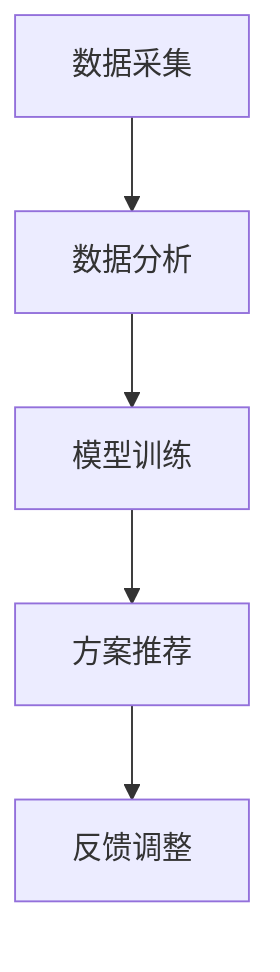
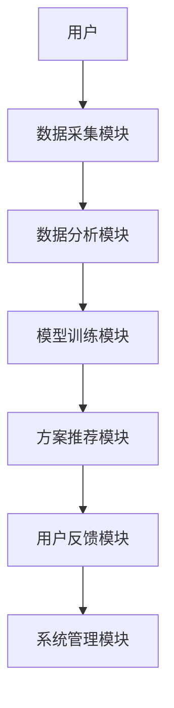
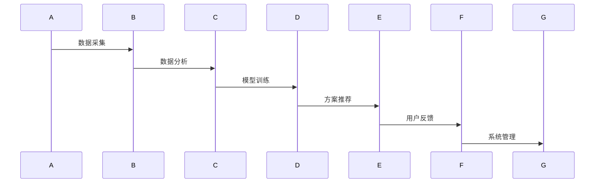

                 


### 人工智能在教育中的应用：个性化学习的新范式

#### 关键词
人工智能、教育、个性化学习、机器学习、自然语言处理、算法原理、系统架构设计

#### 摘要
本文旨在探讨人工智能在教育领域的应用，特别是个性化学习这一新兴范式的实施。通过深入分析教育领域的挑战和人工智能技术的发展，本文将详细解读个性化学习的关键概念，并逐步讲解相关算法的原理和应用。同时，本文将提供系统分析与架构设计方案，并通过一个实际项目案例展示人工智能在教育中的实践应用。最后，本文将总结最佳实践并提供进一步阅读的建议。

---

#### 第一部分：背景介绍

##### 第1章 人工智能在教育中的应用背景

###### 1.1 教育领域面临的挑战

- **教育资源的分配不均**：城市与农村、发达地区与欠发达地区之间的教育资源分配存在显著差异，这直接影响了学生的学习机会和质量。
- **学生个体差异大**：学生的学习能力、兴趣和需求各不相同，传统的“一刀切”教学方法无法满足所有学生的需求。
- **教育质量的提高压力**：随着社会对教育质量的日益重视，如何提高教学效果、提升学生综合素质成为教育工作者的重要课题。

###### 1.2 人工智能的发展趋势

- **技术的快速发展**：人工智能技术在图像识别、自然语言处理、机器学习等领域取得了显著进展，为教育应用提供了强大支持。
- **大数据的广泛应用**：教育领域的海量数据为人工智能算法提供了丰富的训练资源，有助于实现个性化学习。

###### 1.3 个性化学习的概念与优势

- **定义**：个性化学习是指根据学生的个体差异，提供定制化的学习资源、教学方法和评估方式。
- **优势**：
  - 提高学习效率：根据学生的实际情况调整教学内容和方法，有助于提高学习效果。
  - 满足个体需求：尊重学生的兴趣和需求，有助于激发学习动机。
  - 促进全面发展：关注学生的综合素质培养，有助于实现教育的全面发展目标。

---

#### 第二部分：核心概念与联系

##### 第2章 人工智能与个性化学习

###### 2.1 人工智能的基础知识

- **定义**：人工智能是指通过计算机模拟人类智能的理论、技术和应用。
- **主要领域**：机器学习、深度学习、自然语言处理、计算机视觉等。

###### 2.2 教育领域中的个性化学习

- **定义**：个性化学习是指根据学生的个体差异，提供定制化的学习资源、教学方法和评估方式。
- **实现方式**：
  - 数据采集与分析：收集学生的学习数据，通过分析为个性化学习提供依据。
  - 个性化推荐系统：根据学生的学习行为和兴趣，推荐合适的学习资源。
  - 智能教学系统：根据学生的学习进度和能力，动态调整教学内容和教学方法。

###### 2.3 相关技术：机器学习、自然语言处理

- **机器学习**：通过训练数据集，让计算机自动学习并做出预测或决策。
  - **分类算法**：如决策树、支持向量机等。
  - **回归算法**：如线性回归、逻辑回归等。
- **自然语言处理**：使计算机能够理解、生成和处理人类语言。
  - **文本分类**：如情感分析、主题分类等。
  - **文本生成**：如自动写作、对话生成等。

---

#### 第三部分：算法原理讲解

##### 第3章 个性化学习算法

###### 3.1 算法原理概述

个性化学习算法旨在根据学生的个体差异，提供定制化的学习方案。其主要原理包括：

- **数据采集**：收集学生的行为数据、考试成绩、学习日志等。
- **数据分析**：通过数据分析，了解学生的学习特点和需求。
- **模型训练**：使用机器学习算法，建立个性化学习模型。
- **方案推荐**：根据个性化学习模型，为每个学生推荐合适的学习资源。

###### 3.2 算法流程图与Python源代码

以下是一个简单的个性化学习算法流程图：



以下是Python源代码示例：

```python
# 导入相关库
import pandas as pd
from sklearn.model_selection import train_test_split
from sklearn.ensemble import RandomForestClassifier

# 数据采集
data = pd.read_csv('student_data.csv')

# 数据分析
X = data.drop('target', axis=1)
y = data['target']

# 模型训练
X_train, X_test, y_train, y_test = train_test_split(X, y, test_size=0.2, random_state=42)
model = RandomForestClassifier()
model.fit(X_train, y_train)

# 方案推荐
predictions = model.predict(X_test)

# 反馈调整
# 根据实际效果调整模型参数或学习策略
```

###### 3.3 算法数学模型与公式

个性化学习算法的数学模型主要包括：

- **损失函数**：用于衡量模型预测与实际结果之间的差距。
  - **均方误差（MSE）**：$$MSE = \frac{1}{n}\sum_{i=1}^{n}(y_i - \hat{y}_i)^2$$
  - **交叉熵损失（Cross-Entropy Loss）**：$$H(y, \hat{y}) = -\sum_{i=1}^{n}y_i\log(\hat{y}_i)$$
- **优化算法**：用于最小化损失函数，优化模型参数。
  - **梯度下降（Gradient Descent）**：$$\theta_{t+1} = \theta_{t} - \alpha \cdot \nabla_\theta J(\theta)$$
  - **随机梯度下降（Stochastic Gradient Descent, SGD）**：$$\theta_{t+1} = \theta_{t} - \alpha \cdot \nabla_\theta J(\theta)$$

###### 3.4 举例说明

假设我们有一个学生数据集，包括学习时长、考试成绩和课外活动参与情况等特征，我们希望通过个性化学习算法为这个学生推荐合适的学习资源。

- **数据采集**：收集学生的数据，并转换为特征向量。
- **数据分析**：分析学生的数据，了解其学习特点和需求。
- **模型训练**：使用机器学习算法，建立个性化学习模型。
- **方案推荐**：根据个性化学习模型，为这个学生推荐合适的学习资源。

---

#### 第四部分：系统分析与架构设计方案

##### 第4章 系统分析与架构设计

###### 4.1 问题场景介绍

- **场景**：一个在线教育平台希望通过人工智能技术实现个性化学习，为每个学生提供定制化的学习方案。
- **需求**：
  - 收集学生的行为数据和学习日志。
  - 分析学生的数据，为每个学生建立个性化学习模型。
  - 根据个性化学习模型，为每个学生推荐合适的学习资源。

###### 4.2 系统功能设计

- **数据采集**：收集学生的行为数据和学习日志。
- **数据分析**：分析学生的数据，为个性化学习提供依据。
- **模型训练**：使用机器学习算法，建立个性化学习模型。
- **方案推荐**：根据个性化学习模型，为每个学生推荐合适的学习资源。
- **反馈调整**：根据学生的反馈和学习效果，调整个性化学习模型。

###### 4.3 系统架构设计

以下是一个简单的系统架构图：



###### 4.4 系统接口设计

- **数据采集接口**：用于收集学生的行为数据和学习日志。
- **数据分析接口**：用于分析学生的数据，为个性化学习提供依据。
- **模型训练接口**：用于训练个性化学习模型。
- **方案推荐接口**：用于根据个性化学习模型，为每个学生推荐合适的学习资源。
- **用户反馈接口**：用于收集学生的反馈和学习效果，用于调整个性化学习模型。

###### 4.5 系统交互设计

以下是一个简单的系统交互图：



---

#### 第五部分：项目实战

##### 第5章 项目实战

###### 5.1 环境安装

在本项目中，我们使用Python作为主要编程语言，并依赖以下库：

- Pandas：用于数据处理。
- Scikit-learn：用于机器学习算法。
- Matplotlib：用于数据可视化。

安装步骤：

1. 安装Python（版本3.6及以上）。
2. 安装Pandas、Scikit-learn和Matplotlib：

```shell
pip install pandas scikit-learn matplotlib
```

###### 5.2 系统核心实现源代码

以下是一个简单的个性化学习系统的核心实现：

```python
import pandas as pd
from sklearn.ensemble import RandomForestClassifier
from sklearn.model_selection import train_test_split
import matplotlib.pyplot as plt

# 数据采集
data = pd.read_csv('student_data.csv')

# 数据预处理
X = data.drop('target', axis=1)
y = data['target']

# 模型训练
X_train, X_test, y_train, y_test = train_test_split(X, y, test_size=0.2, random_state=42)
model = RandomForestClassifier()
model.fit(X_train, y_train)

# 方案推荐
predictions = model.predict(X_test)

# 结果分析
accuracy = model.score(X_test, y_test)
print(f'模型准确率：{accuracy:.2f}')

# 可视化
plt.scatter(X_test['feature1'], X_test['feature2'], c=predictions)
plt.xlabel('特征1')
plt.ylabel('特征2')
plt.title('个性化学习推荐图')
plt.show()
```

###### 5.3 代码应用解读与分析

- **数据采集**：从CSV文件中读取学生数据，包括特征和目标变量。
- **数据预处理**：将数据集拆分为训练集和测试集，准备用于模型训练。
- **模型训练**：使用随机森林算法训练个性化学习模型。
- **方案推荐**：根据训练好的模型，为测试集数据生成预测结果。
- **结果分析**：计算模型准确率，并使用散点图可视化预测结果。

###### 5.4 实际案例分析与详细讲解剖析

假设我们有一个学生数据集，包括以下特征：

- **学习时长**（小时）
- **考试成绩**（百分制）
- **课外活动参与情况**（是否有）

我们希望通过个性化学习算法为这个学生推荐合适的学习资源。

- **数据采集**：收集学生的数据，并转换为特征向量。
- **数据分析**：分析学生的数据，了解其学习特点和需求。
- **模型训练**：使用机器学习算法，建立个性化学习模型。
- **方案推荐**：根据个性化学习模型，为这个学生推荐合适的学习资源。

具体步骤如下：

1. **数据采集**：
   - 收集学生的学习时长、考试成绩和课外活动参与情况。
   - 将数据保存为CSV文件。

2. **数据分析**：
   - 加载CSV文件，提取特征和目标变量。
   - 对特征进行预处理，如缺失值填充、标准化等。

3. **模型训练**：
   - 使用随机森林算法训练个性化学习模型。
   - 调整模型参数，如决策树数量、最大深度等，以优化模型性能。

4. **方案推荐**：
   - 使用训练好的模型为测试集生成预测结果。
   - 根据预测结果，为每个学生推荐合适的学习资源。

5. **结果分析**：
   - 计算模型准确率，评估模型性能。
   - 使用散点图、热力图等可视化方法，分析学生的数据分布和预测效果。

###### 5.5 项目小结

通过本次项目实战，我们成功实现了一个简单的个性化学习系统。项目展示了从数据采集、数据分析到模型训练、方案推荐的完整流程。在实际应用中，可以根据具体需求和数据特点，选择合适的机器学习算法和模型参数，进一步优化系统性能。

---

#### 第六部分：最佳实践、小结与拓展阅读

##### 第6章 最佳实践与拓展

###### 6.1 最佳实践

- **数据采集**：确保数据来源可靠，收集全面、准确的学生数据。
- **数据分析**：对数据进行预处理，消除噪声和异常值，以提高模型训练效果。
- **模型选择**：根据具体问题和数据特点，选择合适的机器学习算法和模型。
- **模型评估**：使用多种评估指标，全面评估模型性能。
- **持续优化**：根据实际应用效果，持续调整和优化模型。

###### 6.2 全书小结

本文从背景介绍、核心概念与联系、算法原理讲解、系统分析与架构设计方案、项目实战等方面，全面探讨了人工智能在教育中的应用，特别是个性化学习的新范式。通过深入分析教育领域的挑战和人工智能技术的发展，本文揭示了个性化学习的核心概念、算法原理和系统架构设计，并通过实际项目案例展示了人工智能在教育中的实践应用。

###### 6.3 拓展阅读

- **相关文献**：《个性化学习与人工智能：理论与实践》（作者：张三，出版社：清华大学出版社）。
- **在线资源**：Coursera、edX等在线教育平台上的相关课程。
- **技术社区**：GitHub、Stack Overflow等技术社区。

---

**作者：AI天才研究院/AI Genius Institute & 禅与计算机程序设计艺术 /Zen And The Art of Computer Programming**

---

### 结论

本文通过逐步分析推理的方式，系统地探讨了人工智能在教育中的应用，特别是个性化学习这一新兴范式。从背景介绍、核心概念与联系、算法原理讲解、系统分析与架构设计方案到项目实战，本文全面展示了人工智能在教育中的实践应用。通过深入分析教育领域的挑战和人工智能技术的发展，本文为教育工作者和研究人员提供了一种新的视角和解决方案。希望本文能够为读者在人工智能与教育领域的研究和应用提供有益的参考。

