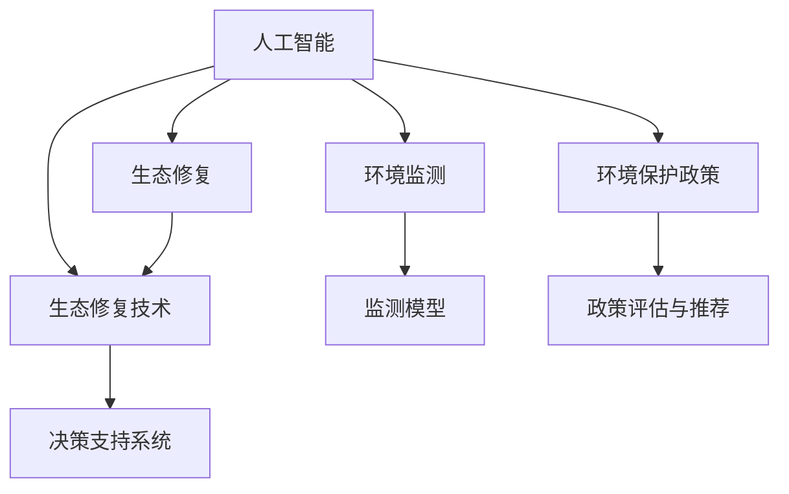
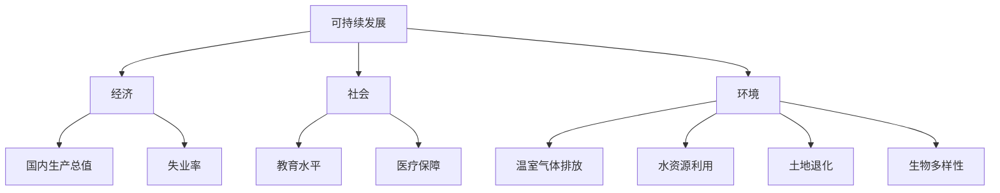

                 

### 文章标题

“人工智能在环境保护中的应用：科技助力可持续发展”

### 关键词

- 人工智能
- 环境保护
- 可持续发展
- 监测技术
- 生态修复
- 资源管理
- 政策制定

### 摘要

随着全球环境问题的日益严重，环境保护和可持续发展已成为全球关注的焦点。人工智能（AI）作为一种强大的技术工具，其在环境保护中的应用正日益广泛。本文将从环境监测、生态修复、资源管理和环境保护政策制定四个方面，探讨人工智能在环境保护中的具体应用，分析其面临的挑战，并展望未来的发展趋势。通过这篇技术博客，我们将了解如何利用人工智能助力可持续发展，推动环境保护工作的进步。

### 目录大纲

# 人工智能在环境保护中的应用：科技助力可持续发展

> 关键词：人工智能、环境保护、可持续发展、监测技术、生态修复、资源管理、政策制定

> 摘要：本文深入探讨了人工智能在环境保护中的应用，包括环境监测、生态修复、资源管理和政策制定等方面。通过分析实际案例和技术挑战，揭示了人工智能助力可持续发展的潜力，为未来的环境保护工作提供了新的思路。

----------------------------------------------------------------

## 第一部分：背景与基础

### 第1章：环境保护与可持续发展的背景

在进入21世纪后，全球环境问题愈发严重，气候变化、水资源短缺、土地退化等已经成为人类生存和发展的重大挑战。环境保护和可持续发展因此成为了全球各国政府、科研机构和民间组织共同关注的话题。在此背景下，人工智能（AI）作为一种新兴技术，因其强大的数据处理和模式识别能力，开始在环境保护领域展现出巨大的潜力。

### 1.1 问题背景

#### 1.1.1 环境问题的现状

环境问题主要包括气候变化、水资源短缺、土地退化、生物多样性丧失、大气污染、海洋污染等。根据联合国发布的报告，全球平均气温在过去的几十年中不断上升，极端天气事件频繁发生，如洪水、干旱、飓风等。此外，水资源短缺问题也在全球范围内加剧，许多国家和地区面临严重的水资源危机。土地退化也是一个严峻的问题，全球有超过25%的陆地受到不同程度的退化影响，导致土壤肥力下降、作物产量减少。大气污染和海洋污染更是对人类健康和生态系统造成了巨大的威胁。

#### 1.1.2 可持续发展的挑战

可持续发展是指满足当前需求而不损害后代满足其需求的能力。然而，当前的社会经济发展模式往往以牺牲环境为代价，导致资源过度消耗和环境污染。可持续发展的挑战主要体现在以下几个方面：

1. **经济增长与环境保护的平衡**：如何在保持经济增长的同时，减少对环境的负面影响，是一个亟待解决的问题。
2. **资源配置与效率**：资源分布不均，许多发展中国家缺乏必要的技术和资金来应对环境问题。
3. **政策与法律框架**：需要建立和完善环境保护政策和法律法规，确保其执行力度。
4. **公众参与与意识**：提高公众对环境保护的认识和参与度，是推动可持续发展的重要手段。

#### 1.1.3 人工智能的崛起

人工智能（AI）是计算机科学的一个分支，其目标是使机器能够模拟、延伸和扩展人的智能。近年来，随着大数据、云计算、神经网络等技术的发展，人工智能取得了显著的进步。AI的应用领域涵盖了语音识别、图像识别、自然语言处理、机器学习、深度学习等，其强大的数据处理和模式识别能力使其在环境保护中具有广泛的应用前景。

### 1.2 核心概念

#### 1.2.1 人工智能的定义与分类

人工智能（AI）是指由人制造出来的系统能够理解、学习和反应，以类似于人类智能的方式处理问题的能力。根据其工作原理和应用方式，人工智能可以分为以下几类：

1. **符号人工智能**：基于逻辑推理和符号表示，使用形式化语言进行问题求解。
2. **感知人工智能**：通过传感器和感知器，实现对环境信息的获取和处理。
3. **认知人工智能**：模仿人类大脑的思考过程，进行知识获取、推理和学习。
4. **情感人工智能**：模拟人类的情感，实现情感交互和情感识别。

#### 1.2.2 环境保护的关键术语

环境保护涉及多个方面，以下是一些关键术语：

1. **环境监测**：通过测量和记录环境参数，对环境质量进行评估和监控。
2. **生态修复**：通过技术手段恢复受破坏的生态系统，使其重新达到平衡状态。
3. **资源管理**：合理利用和管理自然资源，以确保其长期可持续利用。
4. **环境保护政策**：政府制定的规范和措施，以保护环境、促进可持续发展。

#### 1.2.3 可持续发展的指标体系

可持续发展需要综合考虑经济、社会和环境三个方面的因素。以下是一些常用的可持续发展指标：

1. **经济指标**：国内生产总值（GDP）、失业率、收入分配等。
2. **社会指标**：人口增长率、教育水平、医疗保障、社会福利等。
3. **环境指标**：温室气体排放、水资源利用、土地退化、生物多样性等。

### 1.3 关联图

#### 1.3.1 人工智能与环境保护的关联图

#### 1.3.2 可持续发展的要素ER图

### 1.4 本章小结

本章介绍了环境保护与可持续发展的背景，探讨了人工智能在环境保护中的重要性，并详细阐述了人工智能的定义与分类、环境保护的关键术语以及可持续发展的指标体系。通过关联图展示了人工智能与环境保护、可持续发展的关系，为后续章节的分析奠定了基础。

----------------------------------------------------------------

## 第二部分：人工智能在环境保护中的应用

### 第2章：人工智能在环境监测中的应用

环境监测是环境保护工作的基础，通过对环境质量参数的实时监测和评估，可以及时发现环境问题，采取相应的措施。随着人工智能技术的不断发展，AI在环境监测中的应用越来越广泛，显著提升了监测的精度和效率。

### 2.1 监测技术概述

#### 2.1.1 环境监测的重要性

环境监测是环境保护工作的基础，其重要性体现在以下几个方面：

1. **预警与防范**：通过实时监测，可以及时发现环境污染事件，采取紧急措施，防止污染扩大。
2. **决策支持**：环境监测数据为政府和企业的环境管理决策提供了科学依据。
3. **法规执行**：环境监测数据是执行环保法规、考核企业环保绩效的重要依据。
4. **科学研究**：环境监测数据对于环境保护科学研究具有重要意义，有助于揭示环境问题产生的原因和规律。

#### 2.1.2 传统监测技术的局限性

传统环境监测技术主要依赖于人工采集和仪器测量，存在以下局限性：

1. **监测范围有限**：传统监测设备受限于物理条件，难以实现对广阔环境的全面监测。
2. **数据精度不足**：传统监测设备精度有限，难以满足高精度环境监测需求。
3. **实时性较差**：传统监测设备的数据采集和处理速度较慢，实时性较差。
4. **人力成本高**：传统监测方法需要大量人力参与，成本较高。

#### 2.1.3 人工智能监测技术的优势

人工智能监测技术利用机器学习、深度学习等算法，对环境数据进行分析和预测，具有以下优势：

1. **自动化程度高**：人工智能监测技术可以实现监测过程的自动化，减少人力成本。
2. **实时性更强**：通过实时数据处理和分析，能够快速发现环境问题。
3. **高精度**：人工智能技术能够处理大量的环境数据，提高监测数据的精度。
4. **覆盖范围广**：利用卫星遥感、无人机等设备，可以实现大范围的环境监测。

### 2.2 关键算法与模型

#### 2.2.1 监测数据的预处理

在环境监测中，原始数据往往存在噪声、异常值和缺失值等问题。因此，监测数据的预处理是至关重要的一步。常见的预处理方法包括：

1. **数据清洗**：去除噪声和异常值，提高数据的准确性。
2. **数据归一化**：将不同单位、不同量级的数据转换为同一尺度，便于后续分析。
3. **数据插补**：对缺失值进行估计和填充，恢复数据的完整性。

#### 2.2.2 常用监测算法介绍

在环境监测中，常用的算法包括：

1. **聚类算法**：通过将相似的数据点归为一类，用于识别环境污染源和污染扩散范围。
2. **分类算法**：将环境监测数据分类为不同的类别，如空气质量等级、水质类别等。
3. **时间序列分析**：用于分析环境参数随时间变化的趋势，预测未来的环境状况。

#### 2.2.3 监测模型的选择与优化

在选择和优化监测模型时，需要考虑以下因素：

1. **模型类型**：根据监测数据的特点，选择合适的模型类型，如线性模型、非线性模型等。
2. **模型参数**：通过调整模型的参数，优化模型的表现。
3. **交叉验证**：使用交叉验证方法评估模型的泛化能力，避免过拟合。
4. **模型集成**：结合多个模型的优势，提高预测精度。

### 2.3 案例研究

#### 2.3.1 智能空气质量管理

空气质量管理是环境监测的一个重要方面。智能空气质量管理利用人工智能技术，对空气质量进行实时监测和分析。以下是一个典型的智能空气质量管理案例：

1. **数据采集**：通过安装在各个监测点的传感器，实时采集空气中的PM2.5、PM10、SO2、NO2等污染物数据。
2. **数据预处理**：对采集到的原始数据进行清洗、归一化和插补，确保数据质量。
3. **模型训练**：使用机器学习算法，如支持向量机（SVM）、神经网络（NN）等，对预处理后的数据进行分析和建模。
4. **空气质量预测**：利用训练好的模型，预测未来的空气质量状况，并提供预警信息。

#### 2.3.2 智能水资源监测

水资源监测是保障水资源安全的重要手段。智能水资源监测利用人工智能技术，对水质进行实时监测和分析。以下是一个典型的智能水资源监测案例：

1. **数据采集**：通过安装在河流、湖泊等水域的传感器，实时采集水中的pH值、溶解氧、重金属含量等水质参数。
2. **数据预处理**：对采集到的原始数据进行清洗、归一化和插补，确保数据质量。
3. **模型训练**：使用机器学习算法，如决策树（DT）、随机森林（RF）等，对预处理后的数据进行分析和建模。
4. **水质预测**：利用训练好的模型，预测未来的水质状况，并提供预警信息。

#### 2.3.3 智能森林火灾预警

森林火灾是严重的环境问题，智能森林火灾预警利用人工智能技术，对森林火灾进行实时监测和预警。以下是一个典型的智能森林火灾预警案例：

1. **数据采集**：通过安装在森林的传感器，实时采集温度、湿度、风速等环境参数。
2. **数据预处理**：对采集到的原始数据进行清洗、归一化和插补，确保数据质量。
3. **模型训练**：使用机器学习算法，如逻辑回归（LR）、支持向量机（SVM）等，对预处理后的数据进行分析和建模。
4. **火灾预警**：利用训练好的模型，预测森林火灾的发生概率，并提供预警信息。

### 2.4 技术挑战与发展趋势

#### 2.4.1 环境监测中的AI挑战

环境监测中的AI挑战主要包括：

1. **数据质量**：环境监测数据往往受到噪声、异常值和缺失值的影响，对数据质量要求高。
2. **实时性**：环境监测需要实时性，对算法的运行效率有较高要求。
3. **模型泛化能力**：环境监测数据种类繁多，模型需要具有较好的泛化能力。
4. **硬件资源**：环境监测设备通常分布在偏远地区，对硬件资源要求较高。

#### 2.4.2 发展趋势与未来展望

未来，人工智能在环境监测中的应用将呈现以下趋势：

1. **多传感器融合**：利用多种传感器，实现对环境的全面监测，提高监测精度。
2. **边缘计算**：将计算能力下沉到监测设备，降低对中心化服务器的依赖，提高实时性。
3. **大数据分析**：利用大数据分析技术，对海量环境数据进行分析，发现潜在的环境问题。
4. **智能化决策**：通过智能决策支持系统，为环境管理提供科学依据。

### 2.5 本章小结

本章介绍了人工智能在环境监测中的应用，包括监测技术概述、关键算法与模型、案例研究和技术挑战与发展趋势。通过实际案例，展示了人工智能在环境监测中的优势和应用前景，为环境保护工作提供了有力支持。

----------------------------------------------------------------

### 第3章：人工智能在生态修复中的应用

生态修复是指通过技术手段恢复受破坏的生态系统，使其重新达到平衡状态。随着人工智能技术的不断发展，AI在生态修复中的应用越来越广泛，为生态修复提供了新的思路和方法。

### 3.1 生态修复概述

#### 3.1.1 生态修复的定义与目标

生态修复是指通过人为干预，恢复生态系统的结构和功能，使其达到相对稳定和可持续的状态。生态修复的目标主要包括：

1. **恢复生态系统的物质循环和能量流动**：通过生物、物理和化学过程，恢复生态系统的物质循环和能量流动。
2. **重建生物多样性**：恢复受破坏的生态系统中的生物多样性，使其达到自然状态。
3. **改善生态功能**：恢复生态系统的生态功能，如水源涵养、土壤保持、生物栖息等。
4. **提高生态系统的抗干扰能力**：增强生态系统的稳定性和抗干扰能力，减少生态系统再次受到破坏的风险。

#### 3.1.2 传统修复方法的局限性

传统的生态修复方法主要包括物理修复、化学修复和生物修复等。然而，这些方法存在以下局限性：

1. **修复周期长**：传统修复方法通常需要较长时间，难以在短时间内实现生态系统的恢复。
2. **效果不持久**：传统修复方法往往只能暂时改善生态系统状况，无法长期保持。
3. **修复成本高**：传统修复方法需要大量的人力和物力投入，成本较高。
4. **生态影响不确定**：传统修复方法可能对生态系统产生负面影响，如引入外来物种、破坏原有生态平衡等。

#### 3.1.3 人工智能修复技术的优势

人工智能修复技术利用机器学习、深度学习等算法，对生态数据进行分析和预测，具有以下优势：

1. **高效性**：人工智能技术能够快速处理大量生态数据，提高修复效率。
2. **精准性**：人工智能技术能够精确分析生态系统的状况，提供科学的修复方案。
3. **可持续性**：人工智能修复技术可以实时监控生态系统的恢复情况，确保修复效果的长期稳定。
4. **低成本**：人工智能修复技术可以减少人力和物力投入，降低修复成本。
5. **适应性**：人工智能技术可以根据不同地区的生态环境特点，定制化修复方案。

### 3.2 关键技术

#### 3.2.1 生态数据的分析与挖掘

生态数据是生态修复的重要基础，包括气象数据、土壤数据、植被数据、水文数据等。人工智能技术可以通过以下方法对生态数据进行分析和挖掘：

1. **数据预处理**：对原始生态数据进行清洗、归一化和插补，提高数据质量。
2. **特征提取**：从生态数据中提取关键特征，用于后续的模型训练和预测。
3. **模式识别**：利用机器学习算法，如聚类算法、分类算法等，识别生态系统的变化规律和趋势。
4. **数据可视化**：通过数据可视化技术，将生态数据转换为图表或图像，便于分析和理解。

#### 3.2.2 生态模型建立与优化

生态模型是生态修复的核心，用于模拟生态系统的动态变化。人工智能技术可以通过以下方法建立和优化生态模型：

1. **模型选择**：根据生态数据的特点，选择合适的模型类型，如神经网络模型、贝叶斯模型等。
2. **模型训练**：使用训练算法，如梯度下降算法、随机梯度下降算法等，对生态模型进行训练。
3. **模型评估**：通过交叉验证等方法评估模型的性能，选择最优模型。
4. **模型优化**：通过调整模型的参数，优化模型的表现，提高预测精度。

#### 3.2.3 生态修复策略的制定

基于人工智能建立的生态模型，可以用于制定生态修复策略。生态修复策略的制定主要包括以下步骤：

1. **目标设定**：根据生态修复的目标，设定具体的修复指标，如土壤质量、植被覆盖率等。
2. **方案设计**：根据生态模型的结果，设计修复方案，包括植被恢复、土壤改良、水资源管理等内容。
3. **实施监控**：在修复过程中，实时监控修复效果，根据实际情况调整修复方案。
4. **效果评估**：修复完成后，对修复效果进行评估，验证修复目标的实现情况。

### 3.3 案例研究

#### 3.3.1 人工智能在湿地修复中的应用

湿地是生态系统的重要组成部分，具有重要的生态功能和环境价值。人工智能在湿地修复中的应用，可以有效提高修复效率。以下是一个典型的湿地修复案例：

1. **数据采集**：通过安装在湿地中的传感器，实时采集水位、水质、植被覆盖等数据。
2. **数据预处理**：对采集到的原始数据进行清洗、归一化和插补，提高数据质量。
3. **模型训练**：使用机器学习算法，如随机森林（RF）、支持向量机（SVM）等，对预处理后的数据进行分析和建模。
4. **修复策略制定**：根据模型预测结果，制定湿地修复方案，包括植被种植、水位控制等。
5. **实施监控**：在修复过程中，实时监控修复效果，根据实际情况调整修复方案。
6. **效果评估**：修复完成后，对修复效果进行评估，验证修复目标的实现情况。

#### 3.3.2 人工智能在荒漠化治理中的应用

荒漠化是全球性的环境问题，严重威胁着人类的生存和发展。人工智能在荒漠化治理中的应用，可以有效提高治理效率。以下是一个典型的荒漠化治理案例：

1. **数据采集**：通过安装在荒漠地区的传感器，实时采集土壤湿度、风力、植被覆盖等数据。
2. **数据预处理**：对采集到的原始数据进行清洗、归一化和插补，提高数据质量。
3. **模型训练**：使用机器学习算法，如决策树（DT）、神经网络（NN）等，对预处理后的数据进行分析和建模。
4. **治理策略制定**：根据模型预测结果，制定荒漠化治理方案，包括植被恢复、土壤改良等。
5. **实施监控**：在治理过程中，实时监控治理效果，根据实际情况调整治理方案。
6. **效果评估**：治理完成后，对治理效果进行评估，验证治理目标的实现情况。

#### 3.3.3 人工智能在受损海洋生态修复中的应用

海洋生态修复是保护海洋环境的重要措施。人工智能在受损海洋生态修复中的应用，可以有效提高修复效率。以下是一个典型的受损海洋生态修复案例：

1. **数据采集**：通过安装在海洋中的传感器，实时采集水温、盐度、海洋污染物等数据。
2. **数据预处理**：对采集到的原始数据进行清洗、归一化和插补，提高数据质量。
3. **模型训练**：使用机器学习算法，如逻辑回归（LR）、随机森林（RF）等，对预处理后的数据进行分析和建模。
4. **修复策略制定**：根据模型预测结果，制定海洋生态修复方案，包括海洋污染物处理、海洋生物恢复等。
5. **实施监控**：在修复过程中，实时监控修复效果，根据实际情况调整修复方案。
6. **效果评估**：修复完成后，对修复效果进行评估，验证修复目标的实现情况。

### 3.4 技术挑战与发展趋势

#### 3.4.1 生态修复中的AI挑战

生态修复中的AI挑战主要包括：

1. **数据复杂性**：生态数据种类繁多，数据质量参差不齐，对数据处理和分析提出了较高要求。
2. **模型适应性**：生态系统的多样性和复杂性要求模型具有较好的适应性，能够应对不同类型的生态修复任务。
3. **计算资源**：生态修复需要大量的计算资源，特别是在处理大规模数据和高维特征时。
4. **实时性**：生态修复需要实时监控和调整修复方案，对算法的实时性提出了较高要求。

#### 3.4.2 发展趋势与未来展望

未来，人工智能在生态修复中的应用将呈现以下趋势：

1. **多源数据融合**：利用多种传感器和卫星遥感技术，实现多源数据的融合，提高生态修复的精度和效率。
2. **自动化与智能化**：通过自动化和智能化技术，降低生态修复的劳动强度，提高修复效率。
3. **生态模型优化**：结合生态学理论和人工智能技术，不断优化生态模型，提高预测精度和修复效果。
4. **跨学科合作**：生态修复涉及多个学科领域，跨学科合作将有助于推动人工智能在生态修复中的应用。

### 3.5 本章小结

本章介绍了人工智能在生态修复中的应用，包括生态修复概述、关键技术、案例研究和技术挑战与发展趋势。通过实际案例，展示了人工智能在生态修复中的优势和应用前景，为生态修复工作提供了新的思路和方法。

----------------------------------------------------------------

### 第4章：人工智能在资源管理中的应用

资源管理是保障社会经济发展和环境保护的基础。随着人工智能技术的不断发展，AI在资源管理中的应用越来越广泛，为资源管理提供了新的手段和工具。

### 4.1 资源管理概述

#### 4.1.1 资源管理的重要性

资源管理涉及自然资源的合理利用和可持续管理，对于保障社会经济发展和环境保护具有重要意义。资源管理的重要性主要体现在以下几个方面：

1. **保障资源供应**：通过有效的资源管理，可以确保资源的稳定供应，满足社会经济发展的需求。
2. **促进可持续发展**：资源管理需要考虑资源的长期利用，实现资源的可持续利用，减少资源浪费。
3. **保护生态环境**：资源管理过程中，需要避免资源的过度开采和破坏，保护生态环境。
4. **提高资源利用效率**：通过资源管理，可以优化资源分配和使用，提高资源利用效率。

#### 4.1.2 传统资源管理的不足

传统的资源管理方法主要依赖于经验和直觉，存在以下不足：

1. **数据依赖性低**：传统资源管理方法往往缺乏对数据的依赖，难以利用现代数据分析技术。
2. **决策效率低**：传统资源管理方法决策过程复杂，效率较低。
3. **资源浪费**：传统资源管理方法容易导致资源浪费，难以实现资源的合理配置和利用。
4. **环境监测不足**：传统资源管理方法对环境监测能力较弱，难以及时发现和应对环境问题。

#### 4.1.3 人工智能资源管理的优势

人工智能（AI）在资源管理中具有显著优势，主要体现在以下几个方面：

1. **数据分析能力**：AI可以处理和分析大量资源数据，提供科学的决策支持。
2. **自动化程度高**：AI可以自动化执行资源管理任务，提高工作效率。
3. **实时性**：AI可以实时监控资源使用情况，快速响应环境变化。
4. **预测能力**：AI可以通过历史数据分析，预测资源需求，优化资源配置。
5. **智能优化**：AI可以通过优化算法，找到资源管理的最佳解决方案。

### 4.2 关键技术

#### 4.2.1 资源数据的挖掘与分析

资源数据是资源管理的重要基础。AI可以通过以下关键技术对资源数据进行挖掘和分析：

1. **数据预处理**：对原始资源数据进行清洗、归一化和插补，提高数据质量。
2. **特征提取**：从资源数据中提取关键特征，用于后续的模型训练和预测。
3. **模式识别**：利用机器学习算法，如聚类算法、分类算法等，识别资源使用模式和趋势。
4. **数据可视化**：通过数据可视化技术，将资源数据转换为图表或图像，便于分析和理解。

#### 4.2.2 优化算法在资源管理中的应用

优化算法是资源管理中的一种重要技术，可以用于资源分配、调度和优化。常见的优化算法包括：

1. **线性规划**：通过构建线性模型，求解资源的最优分配问题。
2. **整数规划**：在资源分配问题中，变量需要取整数值，适用于处理离散资源。
3. **遗传算法**：模拟自然进化过程，通过交叉、变异和选择，寻找最优解。
4. **模拟退火算法**：通过模拟物理系统的退火过程，找到最优解。
5. **蚁群算法**：模拟蚂蚁觅食过程，通过信息素更新，找到最优路径。

#### 4.2.3 智能决策支持系统的构建

智能决策支持系统是资源管理中的一种重要应用，可以提供科学的决策支持。构建智能决策支持系统主要包括以下步骤：

1. **需求分析**：明确资源管理的需求，确定系统功能。
2. **数据集成**：整合各类资源数据，构建数据仓库。
3. **模型构建**：利用机器学习算法和优化算法，构建资源管理的预测和优化模型。
4. **人机交互**：设计用户界面，实现人机交互功能，提供决策支持。
5. **系统优化**：根据用户反馈，不断优化系统功能和性能。

### 4.3 案例研究

#### 4.3.1 人工智能在水资源管理中的应用

水资源管理是资源管理的重要组成部分。人工智能在水资源管理中的应用，可以有效提高水资源利用效率。以下是一个典型的人工智能水资源管理案例：

1. **数据采集**：通过安装在水源、河流、湖泊等地点的传感器，实时采集水位、流量、水质等数据。
2. **数据预处理**：对采集到的原始数据进行清洗、归一化和插补，提高数据质量。
3. **模型构建**：使用机器学习算法，如随机森林（RF）、支持向量机（SVM）等，构建水资源预测和优化模型。
4. **决策支持**：利用构建的模型，预测未来水资源需求，优化水资源分配。
5. **效果评估**：根据实际水资源使用情况，评估水资源管理的效果，不断优化管理策略。

#### 4.3.2 人工智能在土地资源管理中的应用

土地资源管理是保障粮食安全和社会经济发展的重要环节。人工智能在土地资源管理中的应用，可以有效提高土地利用效率。以下是一个典型的土地资源管理案例：

1. **数据采集**：通过遥感技术、无人机等技术，获取土地利用现状和土地质量数据。
2. **数据预处理**：对采集到的原始数据进行清洗、归一化和插补，提高数据质量。
3. **模型构建**：使用机器学习算法，如决策树（DT）、支持向量机（SVM）等，构建土地资源利用和优化模型。
4. **决策支持**：利用构建的模型，预测未来土地利用趋势，优化土地利用策略。
5. **效果评估**：根据实际土地利用情况，评估土地资源管理的效果，不断优化管理策略。

#### 4.3.3 人工智能在能源资源管理中的应用

能源资源管理是保障能源供应和环境保护的重要任务。人工智能在能源资源管理中的应用，可以有效提高能源利用效率。以下是一个典型的能源资源管理案例：

1. **数据采集**：通过安装在能源生产、传输、消费等环节的传感器，实时采集能源产量、消耗、质量等数据。
2. **数据预处理**：对采集到的原始数据进行清洗、归一化和插补，提高数据质量。
3. **模型构建**：使用机器学习算法，如神经网络（NN）、支持向量机（SVM）等，构建能源资源预测和优化模型。
4. **决策支持**：利用构建的模型，预测未来能源需求，优化能源分配和调度。
5. **效果评估**：根据实际能源使用情况，评估能源资源管理的效果，不断优化管理策略。

### 4.4 技术挑战与发展趋势

#### 4.4.1 资源管理中的AI挑战

资源管理中的AI挑战主要包括：

1. **数据多样性**：资源数据类型多样，对数据处理和分析提出了较高要求。
2. **实时性**：资源管理需要实时性，对算法的实时性提出了较高要求。
3. **计算资源**：资源管理需要大量的计算资源，特别是在处理大规模数据和高维特征时。
4. **模型适应性**：资源管理涉及多个领域，模型需要具有较好的适应性。

#### 4.4.2 发展趋势与未来展望

未来，人工智能在资源管理中的应用将呈现以下趋势：

1. **多源数据融合**：利用多种传感器和遥感技术，实现多源数据的融合，提高资源管理的精度和效率。
2. **智能化决策**：通过智能化技术，实现资源管理的自动化和智能化，提高决策效率。
3. **可持续发展**：将可持续发展理念融入资源管理，实现资源的可持续利用。
4. **跨学科合作**：资源管理涉及多个学科领域，跨学科合作将有助于推动人工智能在资源管理中的应用。

### 4.5 本章小结

本章介绍了人工智能在资源管理中的应用，包括资源管理概述、关键技术、案例研究和技术挑战与发展趋势。通过实际案例，展示了人工智能在资源管理中的优势和应用前景，为资源管理提供了新的思路和方法。

----------------------------------------------------------------

### 第5章：人工智能在环境保护政策制定中的应用

环境保护政策制定是政府应对环境问题的重要手段，其科学性和有效性直接关系到环境保护工作的成效。随着人工智能（AI）技术的快速发展，AI在环境保护政策制定中的应用日益广泛，为政策制定提供了新的工具和方法。

### 5.1 政策制定概述

#### 5.1.1 环境保护政策的重要性

环境保护政策是指政府为了保护环境、防止环境污染和促进可持续发展而制定的法规、规章和措施。环境保护政策的重要性体现在以下几个方面：

1. **规范环境保护行为**：通过制定和实施环境保护政策，规范各行业和个人的环境保护行为，防止环境污染和生态破坏。
2. **引导可持续发展**：环境保护政策旨在推动社会经济的可持续发展，实现经济发展与环境保护的协调。
3. **保障公共健康**：环境保护政策有助于减少污染物的排放，改善空气质量、水质和土壤质量，保障公众健康。
4. **促进技术创新**：环境保护政策可以引导企业和科研机构加大环保技术研发力度，推动环境保护技术进步。

#### 5.1.2 传统政策制定的局限性

传统的环境保护政策制定方法主要依赖于专家经验和统计数据，存在以下局限性：

1. **主观性**：传统政策制定过程往往受到专家主观判断的影响，可能导致政策的不确定性和偏差。
2. **时效性**：传统政策制定周期较长，难以适应快速变化的环境问题。
3. **数据依赖性低**：传统方法对数据的依赖性较低，难以充分利用现代数据分析技术。
4. **政策评估不足**：传统政策制定过程中，对政策效果的评估和反馈机制不完善，难以及时调整和优化政策。

#### 5.1.3 人工智能在政策制定中的应用优势

人工智能在环境保护政策制定中具有显著优势，主要体现在以下几个方面：

1. **数据分析能力**：AI可以处理和分析大量政策数据，提供科学的决策支持。
2. **智能化决策**：AI可以通过机器学习算法，自动分析和预测环境问题，辅助政策制定。
3. **实时性**：AI可以实时监控环境变化，快速响应政策需求，提高政策制定的时效性。
4. **模型优化**：AI可以通过优化算法，优化政策模型，提高政策制定的科学性和准确性。

### 5.2 关键技术

#### 5.2.1 政策数据的挖掘与分析

政策数据是环境保护政策制定的重要基础。AI可以通过以下关键技术对政策数据进行分析和挖掘：

1. **文本挖掘**：通过自然语言处理（NLP）技术，从政策文本中提取关键信息，如政策内容、政策目标、政策效果等。
2. **数据可视化**：通过数据可视化技术，将政策数据转换为图表或图像，便于分析和理解。
3. **数据融合**：将不同来源的政策数据进行整合，形成统一的数据集，提高数据利用效率。
4. **数据预处理**：对政策数据中的噪声、异常值和缺失值进行处理，提高数据质量。

#### 5.2.2 人工智能在政策模拟与评估中的应用

政策模拟与评估是环境保护政策制定的重要环节。AI可以通过以下关键技术进行政策模拟与评估：

1. **政策模拟**：通过构建数学模型，模拟政策实施后的环境效果，预测政策的影响。
2. **因果推断**：利用因果推断算法，分析政策与环境影响之间的因果关系，评估政策的有效性。
3. **效果评估**：通过实际监测数据和政策执行情况，对政策效果进行评估，为政策调整提供依据。
4. **实时监控**：通过实时数据监控，跟踪政策执行情况，及时发现和解决问题。

#### 5.2.3 智能化政策推荐系统的构建

智能化政策推荐系统是AI在环境保护政策制定中的一项重要应用。构建智能化政策推荐系统主要包括以下步骤：

1. **需求分析**：明确环境保护政策的需求，确定推荐系统的功能。
2. **数据采集**：收集相关的政策数据，包括历史政策、环境数据、经济数据等。
3. **特征提取**：从政策数据中提取关键特征，用于政策推荐模型的训练。
4. **模型训练**：使用机器学习算法，如协同过滤、聚类算法等，构建政策推荐模型。
5. **人机交互**：设计用户界面，实现人机交互功能，为政策制定者提供个性化政策推荐。

### 5.3 案例研究

#### 5.3.1 人工智能在碳排放政策制定中的应用

碳排放政策是应对气候变化的重要手段。人工智能在碳排放政策制定中的应用，可以有效提高政策制定的科学性和准确性。以下是一个典型的碳排放政策制定案例：

1. **数据采集**：收集各行业的碳排放数据、能源消耗数据、经济发展数据等。
2. **数据预处理**：对采集到的数据进行清洗、归一化和插补，提高数据质量。
3. **模型训练**：使用机器学习算法，如线性回归、神经网络等，构建碳排放预测模型。
4. **政策模拟**：模拟不同碳排放政策实施后的效果，预测政策对碳排放的影响。
5. **效果评估**：根据实际碳排放数据和政策执行情况，评估政策效果，为政策调整提供依据。
6. **政策推荐**：根据政策模拟和效果评估结果，为政策制定者提供个性化的碳排放政策推荐。

#### 5.3.2 人工智能在水污染防治政策制定中的应用

水污染防治政策是保护水资源、改善水环境的重要手段。人工智能在水污染防治政策制定中的应用，可以有效提高政策制定的科学性和有效性。以下是一个典型的水污染防治政策制定案例：

1. **数据采集**：收集水质监测数据、污染源数据、水资源利用数据等。
2. **数据预处理**：对采集到的数据进行清洗、归一化和插补，提高数据质量。
3. **模型训练**：使用机器学习算法，如决策树、随机森林等，构建水污染预测模型。
4. **政策模拟**：模拟不同水污染防治政策实施后的效果，预测政策对水环境的影响。
5. **效果评估**：根据实际水质监测数据和政策执行情况，评估政策效果，为政策调整提供依据。
6. **政策推荐**：根据政策模拟和效果评估结果，为政策制定者提供个性化的水污染防治政策推荐。

#### 5.3.3 人工智能在土壤污染治理政策制定中的应用

土壤污染治理政策是保护土壤质量、保障农业生产安全的重要手段。人工智能在土壤污染治理政策制定中的应用，可以有效提高政策制定的科学性和准确性。以下是一个典型的土壤污染治理政策制定案例：

1. **数据采集**：收集土壤质量监测数据、污染物分布数据、土地利用数据等。
2. **数据预处理**：对采集到的数据进行清洗、归一化和插补，提高数据质量。
3. **模型训练**：使用机器学习算法，如支持向量机、神经网络等，构建土壤污染预测模型。
4. **政策模拟**：模拟不同土壤污染治理政策实施后的效果，预测政策对土壤质量的影响。
5. **效果评估**：根据实际土壤质量监测数据和政策执行情况，评估政策效果，为政策调整提供依据。
6. **政策推荐**：根据政策模拟和效果评估结果，为政策制定者提供个性化的土壤污染治理政策推荐。

### 5.4 技术挑战与发展趋势

#### 5.4.1 环境保护政策制定中的AI挑战

环境保护政策制定中的AI挑战主要包括：

1. **数据多样性**：政策数据类型多样，对数据处理和分析提出了较高要求。
2. **实时性**：政策制定需要实时性，对算法的实时性提出了较高要求。
3. **计算资源**：政策制定需要大量的计算资源，特别是在处理大规模数据和高维特征时。
4. **模型适应性**：政策制定涉及多个领域，模型需要具有较好的适应性。

#### 5.4.2 发展趋势与未来展望

未来，人工智能在环境保护政策制定中的应用将呈现以下趋势：

1. **多源数据融合**：利用多种数据源，实现多源数据的融合，提高政策制定的精度和效率。
2. **智能化决策**：通过智能化技术，实现政策制定的自动化和智能化，提高决策效率。
3. **政策模拟与评估**：加强政策模拟与评估技术的研究和应用，提高政策制定的科学性和有效性。
4. **跨学科合作**：环境保护政策制定涉及多个学科领域，跨学科合作将有助于推动人工智能在政策制定中的应用。

### 5.5 本章小结

本章介绍了人工智能在环境保护政策制定中的应用，包括政策制定概述、关键技术、案例研究和技术挑战与发展趋势。通过实际案例，展示了人工智能在环境保护政策制定中的优势和应用前景，为政策制定提供了新的工具和方法。

----------------------------------------------------------------

## 总结与展望

### 总结

本文从环境保护与可持续发展的重要性出发，详细探讨了人工智能在环境监测、生态修复、资源管理和环境保护政策制定中的应用。通过分析具体案例和技术挑战，我们看到了人工智能在推动环境保护和可持续发展方面的巨大潜力。

1. **环境监测**：人工智能在环境监测中展现了高效、精准和实时性的优势，通过数据挖掘与分析，提升了监测精度，为环境管理提供了科学依据。
2. **生态修复**：人工智能在生态修复中通过数据分析与模型优化，提高了修复效果和效率，为实现生态系统的可持续发展提供了技术支持。
3. **资源管理**：人工智能在资源管理中通过数据挖掘和优化算法，提高了资源利用效率，促进了资源的可持续利用，保障了社会经济发展。
4. **环境保护政策制定**：人工智能在环境保护政策制定中提供了数据驱动的决策支持，通过政策模拟与评估，提高了政策制定的科学性和有效性。

### 展望

展望未来，人工智能在环境保护和可持续发展中的应用将继续深化和拓展：

1. **多源数据融合**：利用多种数据源，实现多源数据的融合，提高环境监测、生态修复和资源管理的精度和效率。
2. **智能化决策支持**：通过智能化技术，实现环境保护和资源管理的自动化和智能化，提高决策效率，降低人力成本。
3. **跨学科合作**：加强跨学科合作，推动人工智能与其他学科的结合，为环境保护和可持续发展提供全方位的技术支持。
4. **政策模拟与评估**：进一步完善政策模拟与评估技术，提高政策制定的科学性和有效性，促进环境保护和可持续发展政策的实施。

### 结论

人工智能在环境保护中的应用，不仅提升了环境保护工作的效率和效果，也为实现可持续发展提供了强有力的技术支持。未来，随着人工智能技术的不断进步，我们有理由相信，人工智能将在环境保护和可持续发展中发挥更加重要的作用，为构建美丽地球和人类美好未来贡献力量。

## 作者信息

作者：AI天才研究院/AI Genius Institute & 禅与计算机程序设计艺术 /Zen And The Art of Computer Programming

