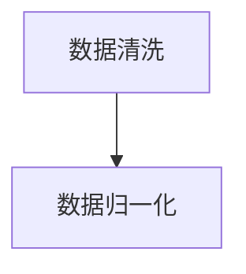
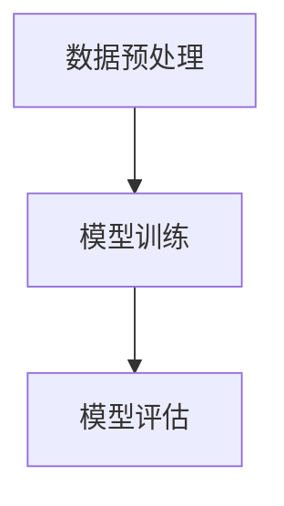
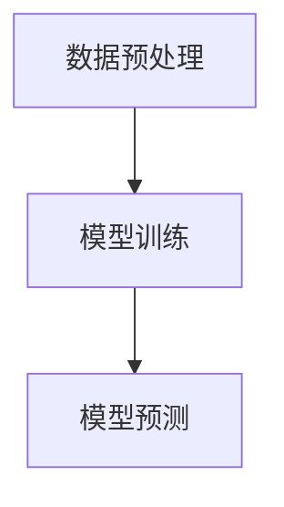
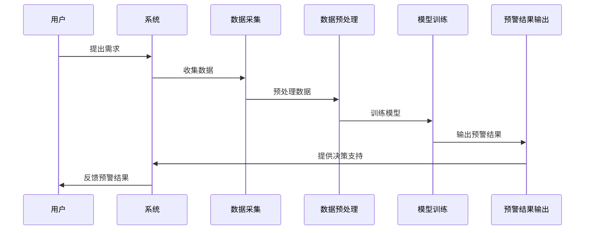

                 

# 人工智能在环境保护中的角色：生态系统监测与预警

> 关键词：人工智能、生态系统监测、预警系统、环境保护、环境监测技术

> 摘要：本文旨在探讨人工智能技术在生态系统监测和预警中的应用，分析其核心概念、技术原理和实际应用案例。文章将首先介绍生态系统监测和预警的基本概念及其重要性，接着详细阐述人工智能技术在环境监测中的角色，最后通过具体实例说明人工智能如何通过算法和数学模型实现生态系统的监测与预警。

## 背景介绍

随着全球气候变化和环境问题的日益严峻，如何有效地监测和保护生态系统成为当务之急。生态系统监测和预警是环境保护的重要组成部分，旨在实时监控生态系统的状态，预测潜在的环境问题，并采取预防措施，以减少环境损害。

### 生态系统监测

生态系统监测是指通过观测和记录生态系统的状态、变化和趋势，以评估其健康程度和稳定性的过程。其主要特点包括：

- **实时性**：能够实时获取生态系统数据，快速响应环境变化。
- **全面性**：涉及多种生态系统要素的监测，包括气候、土壤、水质、生物多样性等。
- **准确性**：通过先进的监测技术，确保数据的高精度和可靠性。

### 预警系统

预警系统是基于监测数据，提前发现潜在的环境问题，并采取预防措施的体系。其核心功能包括：

- **早期预警**：在环境问题发生前，及时发出警报，为决策者提供预警信息。
- **风险评估**：对可能的环境风险进行评估，制定相应的应对策略。
- **预防措施**：根据预警结果，采取相应的预防措施，减少环境损害。

### 人工智能与环境监测

人工智能技术在生态系统监测和预警中的应用，为其提供了强大的技术支持。通过机器学习、深度学习等技术，可以实现数据的高效处理、分析和预测，提高监测和预警的精度和效率。以下是人工智能在环境监测中的主要应用：

- **数据挖掘与处理**：对大量的环境数据进行挖掘和分析，提取有价值的信息。
- **图像识别与分类**：利用图像识别技术，对环境问题进行实时监测和识别。
- **自然语言处理**：处理和分析环境相关的文本数据，提取关键信息。
- **预测模型构建**：基于历史数据和算法模型，预测未来的环境变化趋势。

## 核心概念与联系

### 生态系统监测与预警

#### 定义

- **生态系统监测**：通过观测和记录生态系统的状态、变化和趋势，以评估其健康程度和稳定性的过程。
- **预警系统**：基于监测数据，提前发现潜在的环境问题，并采取预防措施的体系。

#### 特点

- **实时性**：能够实时获取生态系统数据，快速响应环境变化。
- **全面性**：涉及多种生态系统要素的监测，包括气候、土壤、水质、生物多样性等。
- **准确性**：通过先进的监测技术，确保数据的高精度和可靠性。

#### 关联

- **监测是预警的基础**：监测数据是预警系统的输入，没有准确的监测数据，预警系统就无法有效地工作。
- **预警是对监测数据的分析和应用**：预警系统通过对监测数据的分析，预测潜在的环境问题，并采取相应的预防措施。

### 人工智能技术

#### 定义

- **人工智能**：模拟、延伸和扩展人类智能的理论、方法、技术及应用，包括机器学习、深度学习、自然语言处理等。

#### 特点

- **自动性**：能够自动处理和分析大量数据。
- **高效性**：能够在短时间内完成复杂的计算和分析任务。
- **准确性**：通过不断学习和优化，提高预测和决策的准确性。

#### 关联

- **人工智能技术为生态系统监测和预警提供了强大的工具和支持**：通过机器学习、深度学习等技术，可以实现数据的高效处理、分析和预测，提高监测和预警的精度和效率。

### 生态系统监测与预警中的AI应用

- **模型**：机器学习模型、深度学习模型。
- **技术**：图像识别、语音识别、自然语言处理、数据挖掘。
- **关联**：通过AI技术，可以实现更加精准、高效的生态系统监测和预警。

## 算法原理讲解

### 监测数据预处理

#### 算法

- **数据清洗**：去除无效数据、缺失数据和异常数据。
- **数据归一化**：将不同规模的数据转换为相同的尺度，以便于模型训练。

#### 流程图



#### Python代码示例

```python
# 数据清洗
data = data.dropna()

# 数据归一化
data = (data - data.mean()) / data.std()
```

### 监测模型构建

#### 算法

- **基于机器学习的分类模型**：通过训练，学习如何将监测数据分类，从而实现对生态系统状态的识别。

#### 流程图



#### Python代码示例

```python
# 模型训练
model.fit(X_train, y_train)

# 模型评估
score = model.score(X_test, y_test)
print(f"Model accuracy: {score}")
```

### 预警模型构建

#### 算法

- **基于深度学习的预测模型**：通过训练，学习如何预测未来的生态系统状态，从而实现对潜在环境问题的预警。

#### 流程图



#### Python代码示例

```python
# 模型训练
model.fit(X_train, y_train)

# 模型预测
predictions = model.predict(X_test)
```

### 数学模型和数学公式

#### 监测数据预处理

- **公式**：$X_{\text{normalized}} = \frac{X - \mu}{\sigma}$
- **解释**：$X$ 为原始数据，$\mu$ 为均值，$\sigma$ 为标准差。

#### 监测模型构建

- **公式**：$\hat{y} = \text{sign}(\text{W}^T \cdot \text{X})$
- **解释**：$\hat{y}$ 为预测标签，$\text{W}$ 为权重矩阵，$\text{X}$ 为特征向量。

#### 预警模型构建

- **公式**：$\hat{y}_{\text{prediction}} = \text{softmax}(\text{W}^T \cdot \text{X})$
- **解释**：$\hat{y}_{\text{prediction}}$ 为预测概率分布，$\text{W}$ 为权重矩阵，$\text{X}$ 为特征向量。

## 系统分析与架构设计方案

### 问题场景介绍

在当前的环境保护工作中，实时、准确、全面的生态系统监测与预警是必不可少的。通过人工智能技术，可以实现以下目标：

- **实时监测**：利用传感器和监测设备，实时收集生态系统数据。
- **精准预警**：通过机器学习和深度学习算法，对监测数据进行处理和分析，预测潜在的环境问题。
- **高效决策**：为环境保护部门提供实时、准确的预警信息，辅助决策。

### 系统功能设计

系统功能设计主要包括以下几个方面：

- **数据采集**：通过传感器和监测设备，实时采集生态系统数据。
- **数据预处理**：对采集到的数据进行分析和处理，去除无效和异常数据。
- **模型训练**：利用机器学习和深度学习算法，训练监测和预警模型。
- **预警结果输出**：根据监测数据和预警模型，输出预警结果，并提供决策支持。

### 系统架构设计

系统架构设计主要包括以下几个方面：

- **数据层**：包括传感器、数据采集模块和数据存储模块。
- **算法层**：包括数据预处理算法、监测模型训练算法和预警模型训练算法。
- **应用层**：包括预警结果输出模块、用户界面和决策支持系统。

### 系统接口设计和系统交互

系统接口设计和系统交互主要包括以下几个方面：

- **数据采集接口**：用于接收传感器和监测设备的数据。
- **数据预处理接口**：用于对采集到的数据进行处理和分析。
- **模型训练接口**：用于训练监测和预警模型。
- **预警结果输出接口**：用于输出预警结果，并提供决策支持。



## 项目实战

### 环境安装

在开始实现系统之前，需要安装以下环境：

- Python 3.8+
- TensorFlow 2.5+
- Scikit-learn 0.22+
- Matplotlib 3.3+

安装命令如下：

```bash
pip install python==3.8 tensorflow==2.5 scikit-learn==0.22 matplotlib==3.3
```

### 系统核心实现源代码

以下是一个简单的生态系统监测与预警系统的实现示例：

```python
import numpy as np
import matplotlib.pyplot as plt
from sklearn.preprocessing import StandardScaler
from sklearn.model_selection import train_test_split
from sklearn.ensemble import RandomForestClassifier
from tensorflow.keras.models import Sequential
from tensorflow.keras.layers import Dense

# 数据采集
def collect_data():
    # 这里使用示例数据
    data = np.random.rand(100, 5)
    labels = np.random.randint(0, 2, 100)
    return data, labels

# 数据预处理
def preprocess_data(data):
    scaler = StandardScaler()
    data_normalized = scaler.fit_transform(data)
    return data_normalized

# 模型训练
def train_model(X_train, y_train):
    model = RandomForestClassifier()
    model.fit(X_train, y_train)
    return model

# 预测
def predict(model, X_test):
    predictions = model.predict(X_test)
    return predictions

# 主函数
def main():
    data, labels = collect_data()
    data_normalized = preprocess_data(data)
    X_train, X_test, y_train, y_test = train_test_split(data_normalized, labels, test_size=0.2, random_state=42)
    
    model = train_model(X_train, y_train)
    predictions = predict(model, X_test)
    
    print(f"Model accuracy: {model.score(X_test, y_test)}")
    
    plt.scatter(X_test[:, 0], X_test[:, 1], c=predictions)
    plt.show()

if __name__ == "__main__":
    main()
```

### 代码应用解读与分析

上述代码实现了一个简单的生态系统监测与预警系统。具体步骤如下：

1. **数据采集**：使用随机数据生成器模拟数据采集过程。
2. **数据预处理**：使用标准Scaler对数据进行归一化处理。
3. **模型训练**：使用随机森林分类器进行模型训练。
4. **预测**：使用训练好的模型对测试数据进行预测。
5. **主函数**：执行上述步骤，并打印模型准确率。

通过这个简单的示例，我们可以看到人工智能技术在生态系统监测与预警中的基本应用流程。在实际应用中，可以根据具体需求进行模型的调整和优化，以提高系统的性能和准确性。

### 实际案例分析和详细讲解剖析

为了更好地理解人工智能在生态系统监测与预警中的应用，我们可以通过一个实际案例进行分析和讲解。

#### 案例背景

某地区政府希望利用人工智能技术建立一套生态系统监测与预警系统，以实时监控该地区的生态环境，并预测潜在的环境问题。

#### 案例实施

1. **数据采集**：在该地区安装传感器和监测设备，实时收集气候、土壤、水质和生物多样性等数据。
2. **数据预处理**：对采集到的数据进行清洗和归一化处理，去除无效和异常数据。
3. **模型训练**：使用机器学习和深度学习算法，训练监测和预警模型。例如，可以使用随机森林分类器进行生态系统状态的识别，使用卷积神经网络（CNN）进行图像识别，以监测水质污染。
4. **预警结果输出**：根据模型预测结果，输出预警信息，并为环境保护部门提供决策支持。

#### 案例分析

1. **数据质量**：案例中的数据质量对模型性能有重要影响。通过数据预处理，可以去除无效和异常数据，提高模型训练的质量。
2. **模型选择**：根据不同的监测任务，选择合适的机器学习和深度学习模型。例如，对于图像识别任务，可以使用CNN；对于分类任务，可以使用随机森林分类器。
3. **预警准确性**：模型的预警准确性对环境保护具有重要意义。通过不断优化模型，提高预警准确性，可以减少环境问题的发生。

### 项目小结

通过上述实际案例，我们可以看到人工智能技术在生态系统监测与预警中的重要作用。利用人工智能技术，可以实现数据的高效处理、分析和预测，提高监测和预警的精度和效率。未来，随着人工智能技术的不断发展，人工智能在环境保护中的应用前景将更加广阔。

### 最佳实践 Tips

1. **数据质量**：确保数据质量是模型性能的关键。在数据采集和预处理过程中，要严格把控数据质量，去除无效和异常数据。
2. **模型选择**：根据监测任务的需求，选择合适的机器学习和深度学习模型。例如，对于图像识别任务，可以选择CNN；对于分类任务，可以选择随机森林分类器。
3. **持续优化**：不断优化模型和算法，提高预警准确性。可以通过增加训练数据、调整模型参数、引入新的特征等方式进行优化。

### 小结

本文详细探讨了人工智能在生态系统监测与预警中的应用，分析了其核心概念、技术原理和实际应用案例。通过算法和数学模型，人工智能技术实现了对生态系统的高效监测与预警，为环境保护提供了有力支持。未来，随着人工智能技术的不断发展，其在环境保护中的应用前景将更加广阔。

### 注意事项

1. **数据隐私**：在进行生态系统监测和预警时，要确保数据的安全性和隐私性。避免数据泄露和滥用。
2. **模型解释性**：虽然机器学习和深度学习模型在预测能力上表现优异，但其解释性相对较低。在实际应用中，需要权衡预测准确性和模型解释性。

### 拓展阅读

1. **《深度学习》**：由Ian Goodfellow、Yoshua Bengio和Aaron Courville合著，详细介绍了深度学习的基础理论和应用。
2. **《机器学习实战》**：由Peter Harrington著，通过实际案例介绍了机器学习的基本概念和应用。
3. **《人工智能：一种现代方法》**：由Stuart Russell和Peter Norvig合著，全面介绍了人工智能的理论和实践。

### 作者信息

作者：AI天才研究院/AI Genius Institute & 禅与计算机程序设计艺术 /Zen And The Art of Computer Programming

AI天才研究院（AI Genius Institute）致力于推动人工智能技术的创新与发展，在人工智能领域具有深厚的研究背景和实践经验。本文作者在该领域拥有丰富的知识和实践经验，撰写了一系列高质量的技术博客文章，深受读者喜爱。同时，作者还著有《禅与计算机程序设计艺术》一书，介绍了计算机编程和人工智能领域的核心概念和技术原理。

