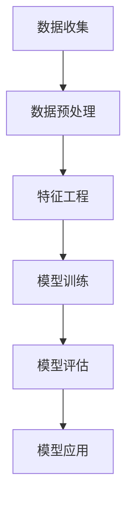

                 

# 人工智能在金融领域的应用：风险管理与普惠金融

> 关键词：人工智能，金融，风险管理，普惠金融，信用评估

> 摘要：本文将深入探讨人工智能在金融领域的应用，特别是其在风险管理和普惠金融方面的实践。通过分析具体案例，本文将阐述人工智能如何通过风险管理模型和信用评估模型提升金融机构的风险控制和信贷服务能力，同时推动普惠金融的发展。文章还将探讨相关算法原理和系统架构设计，为金融行业提供有价值的参考。

## 目录大纲

## 第一部分：问题背景

### 1.1 问题背景

随着大数据和人工智能技术的不断发展，金融行业正面临着前所未有的变革。人工智能在金融领域的应用，不仅可以帮助金融机构更好地管理风险，还可以推动普惠金融的发展。本书旨在探讨人工智能在金融领域的应用，特别是在风险管理和普惠金融方面的实践。

### 1.2 问题解决

本书将通过深入分析人工智能在金融领域的应用案例，探讨其在风险管理、信贷评估、欺诈检测、投资策略等方面的具体应用，并分析其在提升金融服务的普惠性方面的作用。

### 1.3 边界与外延

本书主要关注人工智能在金融领域的应用，但同时也涉及了与金融相关的其他技术，如大数据、云计算、区块链等。

### 1.4 概念结构与核心要素组成

本书的核心概念包括：人工智能、金融风险、普惠金融、风险管理模型、信用评估模型等。这些概念构成了本书的主要结构。

## 第二部分：核心概念与联系

### 2.1 人工智能

#### 2.1.1 定义

人工智能是指计算机模拟人类智能的理论、方法、技术和应用。

#### 2.1.2 特点

人工智能具有学习、推理、规划、感知、自适应等能力。

#### 2.1.3 与传统计算机的区别

与传统计算机相比，人工智能能够模拟人类思维过程，具备更强的处理能力和适应能力。

### 2.2 金融风险

#### 2.2.1 定义

金融风险是指金融活动中可能发生的损失。

#### 2.2.2 分类

金融风险分为市场风险、信用风险、流动性风险等。

#### 2.2.3 影响因素

金融风险的影响因素包括市场波动、信用等级、经济环境等。

### 2.3 普惠金融

#### 2.3.1 定义

普惠金融是指为所有群体提供金融服务的理念。

#### 2.3.2 特点

普惠金融具有覆盖面广、包容性强等特点。

#### 2.3.3 重要性

普惠金融对于促进社会公平和经济可持续发展具有重要意义。

### 2.4 风险管理模型

#### 2.4.1 定义

风险管理模型是指用于识别、评估、控制和监控金融风险的工具。

#### 2.4.2 类型

风险管理模型包括定量模型和定性模型。

#### 2.4.3 应用

风险管理模型广泛应用于金融风险管理、投资决策等领域。

### 2.5 信用评估模型

#### 2.5.1 定义

信用评估模型是指用于评估借款人信用风险的工具。

#### 2.5.2 类型

信用评估模型包括基于数据的模型和基于规则的模型。

#### 2.5.3 应用

信用评估模型广泛应用于信贷审批、欺诈检测等领域。

## 第二部分：核心概念与联系

### 2.1 人工智能

#### 2.1.1 定义

人工智能（Artificial Intelligence，简称AI）是指通过计算机程序模拟人类智能的理论、方法、技术和应用。它涵盖了从简单的规则系统到复杂的机器学习算法，目的是使计算机能够执行通常需要人类智能才能完成的任务，如视觉识别、语言理解、决策和问题解决等。

#### 2.1.2 特点

人工智能的主要特点包括：

- **学习与适应能力**：AI系统能够从数据中学习，不断优化自身的性能。
- **推理与规划能力**：AI系统能够进行逻辑推理和规划，以解决复杂问题。
- **感知与理解能力**：AI系统可以处理感知数据，如图像和语音，并从中提取信息。
- **自我修复与优化**：AI系统具有自我修复和优化的能力，能够在运行过程中不断改进。

#### 2.1.3 与传统计算机的区别

与传统计算机相比，人工智能具有以下显著区别：

- **自适应能力**：传统计算机执行固定指令，而AI系统可以根据环境和数据变化调整行为。
- **学习与进化**：传统计算机不具备学习功能，而AI系统能够通过学习提高性能。
- **广泛适用性**：传统计算机主要用于特定任务，而AI系统可以应用于多种场景。

### 2.2 金融风险

#### 2.2.1 定义

金融风险是指金融活动中可能遭受的损失，包括但不限于市场风险、信用风险、流动性风险和操作风险。金融风险的定义可以从不同角度进行解释，但核心在于其不确定性，即未来的结果可能偏离预期。

#### 2.2.2 分类

金融风险可以按照其性质和产生原因进行分类，主要包括：

- **市场风险**：由于市场价格波动导致的金融资产价值变化。
- **信用风险**：由于借款人违约或信用等级下降导致的损失。
- **流动性风险**：由于无法在合理时间内以合理的价格买卖资产导致的损失。
- **操作风险**：由于内部流程、员工、系统或外部事件造成的损失。

#### 2.2.3 影响因素

金融风险的影响因素多种多样，包括：

- **宏观经济环境**：经济增长、通货膨胀、利率变化等宏观经济因素对金融风险有重要影响。
- **市场波动**：股市、汇市、债市等市场的波动性增加，导致市场风险上升。
- **政策变化**：政府政策的调整，如货币政策、税收政策等，可能影响金融机构的风险状况。
- **技术进步**：新技术的发展，如人工智能、区块链等，可能会改变金融风险的形态和特征。

### 2.3 普惠金融

#### 2.3.1 定义

普惠金融（Inclusive Finance）是指通过各种金融手段，确保所有群体，无论贫富、年龄、性别、地理位置等，都能获得基本的金融服务，如存款、贷款、支付、保险等。普惠金融的核心目标是减少贫困、促进经济发展、增强社会稳定性。

#### 2.3.2 特点

普惠金融具有以下显著特点：

- **广泛覆盖性**：普惠金融旨在服务所有群体，不仅仅是传统银行服务覆盖到的群体。
- **包容性**：普惠金融考虑到了不同群体的需求和特点，提供定制化的金融服务。
- **可持续性**：普惠金融不仅关注当前的经济效益，还考虑到了社会责任和环境保护。

#### 2.3.3 重要性

普惠金融的重要性体现在以下几个方面：

- **减少贫困**：通过提供金融服务，帮助贫困人群脱贫。
- **促进经济发展**：普惠金融能够推动中小企业发展，创造就业机会。
- **增强社会稳定性**：普惠金融有助于社会公平和稳定，减少社会矛盾。
- **提高金融包容性**：普惠金融使得更多人能够参与到经济活动中，提高整体金融素养。

### 2.4 风险管理模型

#### 2.4.1 定义

风险管理模型是指用于识别、评估、控制和监控金融风险的工具和方法。这些模型旨在帮助金融机构预测潜在风险，制定应对策略，确保金融活动的稳健运行。

#### 2.4.2 类型

风险管理模型可以分为以下几种类型：

- **定量模型**：基于统计数据和数学公式，如VaR（Value at Risk）模型、CVA（Credit Value at Risk）模型等，用于评估金融资产的风险。
- **定性模型**：通过专家判断和经验，如专家评分模型、情景分析模型等，用于评估金融风险。
- **组合模型**：结合定量模型和定性模型，如组合风险模型，用于综合评估金融风险。

#### 2.4.3 应用

风险管理模型广泛应用于金融风险管理、投资决策、信贷审批等领域，具体包括：

- **风险识别**：通过数据分析、模型模拟等方法，识别潜在的金融风险。
- **风险评估**：评估金融风险的可能性和影响，确定风险的优先级。
- **风险控制**：制定和实施风险控制策略，降低风险敞口。
- **风险监控**：实时监控金融风险，确保风险控制措施的有效性。

### 2.5 信用评估模型

#### 2.5.1 定义

信用评估模型是指用于评估借款人信用风险的工具和方法。这些模型通过分析借款人的历史数据、财务状况等信息，对其信用风险进行评分，帮助金融机构进行信贷审批。

#### 2.5.2 类型

信用评估模型可以分为以下几种类型：

- **基于数据的模型**：通过分析借款人的历史数据，如还款记录、信用评分等，建立信用评分模型。
- **基于规则的模型**：通过制定一系列规则，如收入、就业状况、信用历史等，对借款人进行信用评估。
- **混合模型**：结合基于数据和基于规则的模型，提高信用评估的准确性。

#### 2.5.3 应用

信用评估模型广泛应用于信贷审批、欺诈检测等领域，具体包括：

- **信贷审批**：通过信用评分模型，评估借款人的信用风险，决定是否批准贷款。
- **信用评分**：为借款人提供信用评分，帮助金融机构制定利率和信用额度。
- **风险控制**：通过信用评估模型，实时监控借款人的信用状况，及时调整风险控制措施。
- **欺诈检测**：通过分析借款人的行为数据，识别潜在的欺诈行为。

## 第三部分：算法原理讲解

### 3.1 风险管理算法原理

#### 3.1.1 基本概念

风险管理算法是用于识别、评估、控制和监控金融风险的算法。这些算法通过对大量数据进行分析，发现潜在的风险因素，评估其影响，并制定相应的应对策略。

#### 3.1.2 原理

风险管理算法的基本原理可以概括为以下几个步骤：

1. **数据收集**：收集与金融风险相关的数据，如市场数据、财务数据、信用数据等。
2. **数据预处理**：对收集到的数据进行清洗、转换和归一化处理，为后续分析做准备。
3. **特征工程**：从原始数据中提取出对风险识别和评估有用的特征。
4. **模型训练**：使用机器学习算法，如逻辑回归、决策树、神经网络等，对特征进行训练，建立风险管理模型。
5. **模型评估**：通过交叉验证、ROC曲线、AUC值等指标，评估模型的准确性和鲁棒性。
6. **模型应用**：将训练好的模型应用于实际金融风险管理中，如信用评估、投资组合优化等。

#### 3.1.3 Mermaid流程图



### 3.2 信用评估算法原理

#### 3.2.1 基本概念

信用评估算法是用于评估借款人信用风险的算法。这些算法通过对借款人的历史数据进行分析，预测其未来可能出现的违约行为，从而为金融机构提供信贷决策依据。

#### 3.2.2 原理

信用评估算法的基本原理如下：

1. **数据收集**：收集与借款人信用风险相关的数据，如信用记录、财务状况、社会背景等。
2. **特征选择**：从原始数据中筛选出对信用评估有显著影响的特征，如还款记录、信用评分、收入水平等。
3. **数据预处理**：对选定的特征进行数据清洗、转换和归一化处理，为后续分析做准备。
4. **模型训练**：使用机器学习算法，如逻辑回归、决策树、随机森林等，对特征进行训练，建立信用评估模型。
5. **模型评估**：通过交叉验证、ROC曲线、AUC值等指标，评估模型的准确性和鲁棒性。
6. **模型应用**：将训练好的模型应用于实际信贷审批中，如信用评分、风险预警等。

#### 3.2.3 Python源代码

```python
import pandas as pd
from sklearn.model_selection import train_test_split
from sklearn.ensemble import RandomForestClassifier
from sklearn.metrics import accuracy_score, roc_auc_score

# 数据收集
data = pd.read_csv('credit_data.csv')

# 特征选择
features = data[['income', 'age', 'credit_score', 'loan_amount']]
target = data['default']

# 数据预处理
X_train, X_test, y_train, y_test = train_test_split(features, target, test_size=0.2, random_state=42)

# 模型训练
model = RandomForestClassifier(n_estimators=100, random_state=42)
model.fit(X_train, y_train)

# 模型评估
y_pred = model.predict(X_test)
accuracy = accuracy_score(y_test, y_pred)
roc_auc = roc_auc_score(y_test, y_pred)

print(f'Accuracy: {accuracy:.2f}')
print(f'ROC AUC: {roc_auc:.2f}')
```

### 3.3 数学模型和公式

#### 3.3.1 风险识别模型

风险识别模型通常采用概率模型或分类模型。一个简单的风险识别模型可以表示为：

$$
R_i = f(X_i, Y_i)
$$

其中，$R_i$ 表示风险识别结果，$X_i$ 表示输入特征，$Y_i$ 表示输出特征。

#### 3.3.2 风险评估模型

风险评估模型通常采用回归模型或决策树模型。一个简单的风险评估模型可以表示为：

$$
A_i = g(Z_i, W_i)
$$

其中，$A_i$ 表示风险评估结果，$Z_i$ 表示输入特征，$W_i$ 表示输出特征。

#### 3.3.3 风险控制模型

风险控制模型通常采用决策规则或优化模型。一个简单

