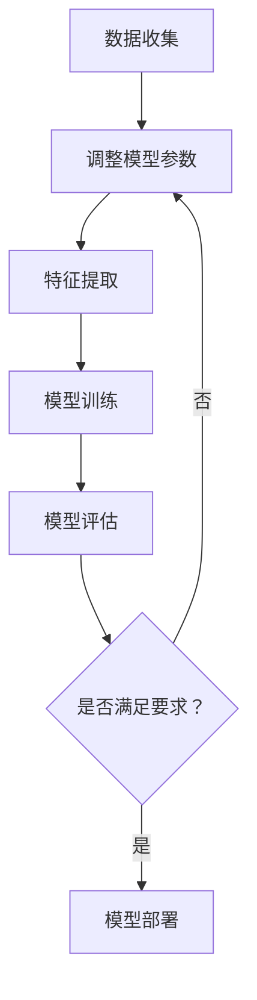
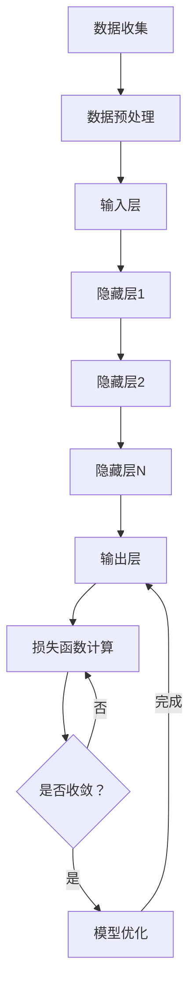
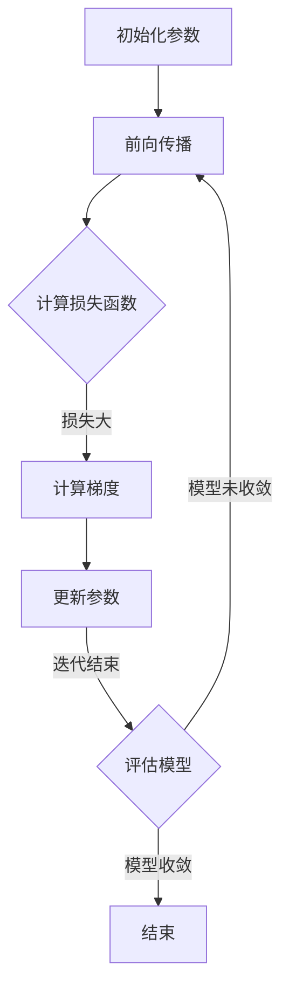
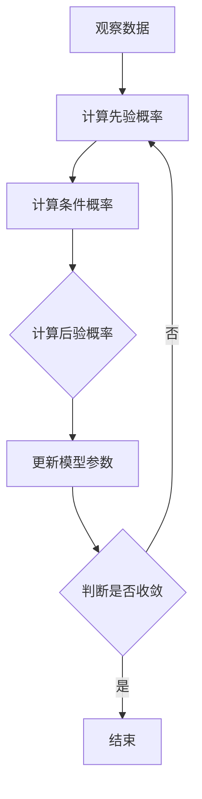
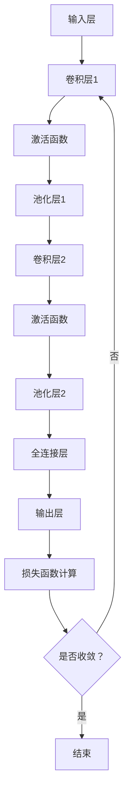
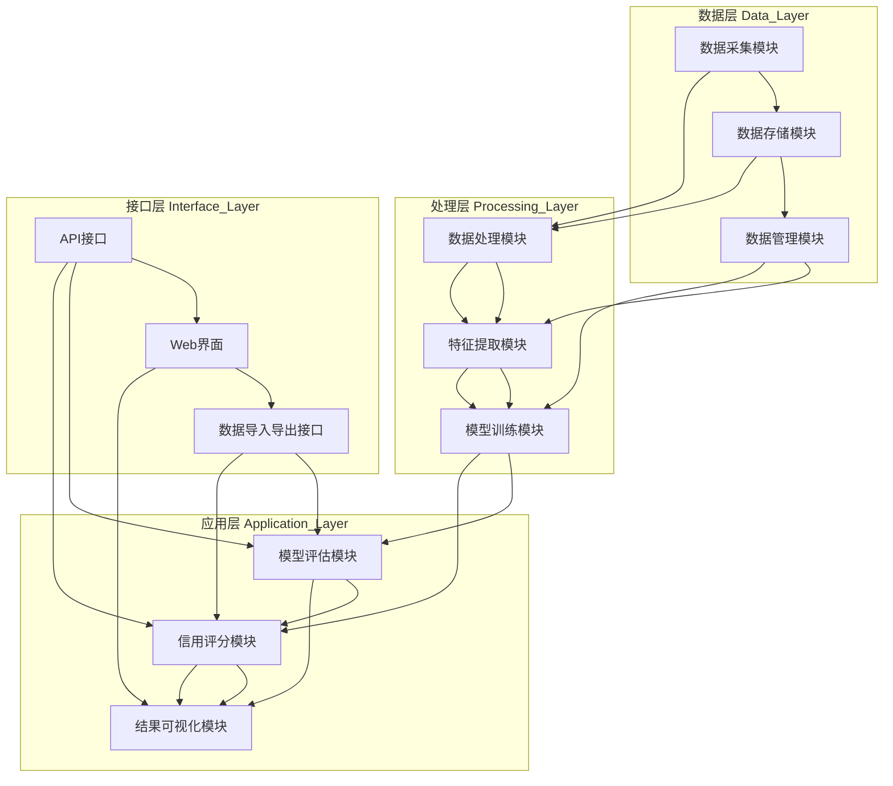
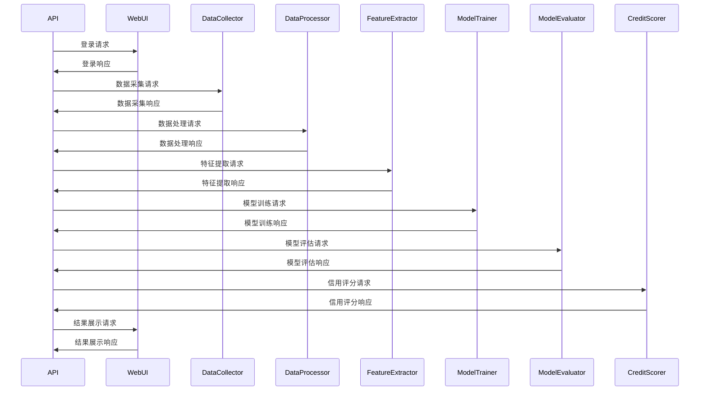

                 

### 1.1 人工智能发展的现状

近年来，人工智能（AI）技术以惊人的速度发展，成为科技领域的一个热点。AI技术的核心在于机器通过学习、推理和自我优化，以完成原本需要人类智能的任务。以下，我们从几个方面来概述AI的发展现状：

#### 技术进展

首先，AI技术的核心组成部分，包括机器学习、深度学习、自然语言处理等，在算法效率、模型精度和应用范围上均取得了显著进展。例如，深度学习模型在图像识别、语音识别、游戏对战等领域已超越人类的表现；自然语言处理技术在机器翻译、文本生成等方面也取得了突破。

#### 行业应用

其次，AI技术在各行各业的广泛应用，极大地提升了生产效率和优化了决策过程。在制造业中，通过机器视觉和自动化系统，生产流程得到了极大的优化；在金融行业，通过大数据分析和预测模型，金融机构能够更准确地评估风险和预测市场走向；在医疗领域，AI技术帮助医生进行疾病诊断和个性化治疗。

#### 人工智能在提升生产效率、优化决策等方面的表现

AI技术在提升生产效率方面，有着不可忽视的贡献。通过自动化系统，AI能够在短时间内完成大量重复性工作，减少了人为错误，提高了生产效率。例如，在物流领域，智能仓储系统通过机器学习和自动化技术，实现了仓库管理的自动化，大大提升了库存管理的效率。

在优化决策方面，AI技术通过对大量数据的分析和处理，能够提供更为精准的决策支持。例如，在能源管理中，AI技术通过对历史数据的分析，能够预测能源需求，并优化能源分配，从而提高能源利用效率，减少浪费。

#### 技术挑战与未来发展方向

尽管AI技术在很多领域取得了显著成就，但其发展也面临诸多挑战。例如，算法的黑箱性、数据隐私问题、以及伦理和社会问题等。未来，如何解决这些挑战，将决定AI技术能否真正实现其潜力。

总的来说，人工智能技术的快速发展，不仅改变了各行各业的工作方式，也对我们社会的各个方面产生了深远的影响。在接下来的章节中，我们将进一步探讨这些影响，以及如何应对AI带来的挑战。

### 1.2 人类工作的挑战

随着人工智能技术的不断进步，自动化和智能化已经成为不可逆转的趋势，对人类工作的冲击日益显著。首先，从自动化与智能化对传统工作岗位的冲击来看，许多传统的工作岗位正面临着被机器和智能系统取代的风险。例如，在制造业中，自动化机器人和智能生产线已经部分或完全取代了传统的手工操作工；在服务业中，智能客服系统和自动化系统正在逐步取代人工客服。

#### 技能升级与职业转型的需求

这种趋势迫使人类必须不断进行技能升级和职业转型。首先，技能升级成为必要，因为许多传统的工作技能可能无法适应自动化和智能化的工作环境。例如，程序员需要学习新的编程语言和框架，以应对AI和机器学习技术的发展；数据分析员需要掌握更高级的数据处理和分析工具，以应对日益复杂的数据需求。此外，职业转型也成为许多人的选择，他们可能需要转向那些AI技术难以取代的领域，如创意产业、情感劳动等。

#### 职业价值重新定义的多维度解读

职业价值的重新定义不仅仅局限于技能和职业的转型，还包括对职业价值的理解和认知。首先，从经济角度来看，职业价值越来越依赖于个体的创新能力、解决问题能力和对新兴技术的掌握。例如，一个具有创新思维的程序员可能比一个熟练但缺乏创新能力的程序员具有更高的经济价值。其次，从社会角度来看，职业价值越来越依赖于个体的适应能力和对社会的贡献。例如，一个能够在AI时代适应并推动社会发展的医生或教师，其职业价值远远超过传统意义上的“看病”或“教书”。

#### 新时代职业价值的特征与趋势

新时代职业价值的特征和趋势主要体现在以下几个方面：

1. **技能多样化和跨界融合**：随着AI技术的发展，职业所需技能将越来越多样化，不同领域的技能将逐步融合。例如，一个AI工程师不仅需要掌握编程技术，还需要了解心理学、经济学等跨学科的知识。

2. **终身学习和自我提升**：职业价值的高度依赖使得个体必须具备持续学习的能力，以跟上技术的快速发展。终身学习和自我提升将成为新时代职业的必要条件。

3. **创意和情感劳动的重要性**：虽然AI技术在自动化和数据处理方面表现出色，但在创意和情感劳动方面，人类的独特性仍然不可替代。因此，那些需要创意和情感劳动的职业，如艺术家、心理咨询师等，其职业价值在未来可能会更加凸显。

总的来说，人工智能的兴起，对人类工作带来了前所未有的挑战，但也为职业价值的重新定义和提升提供了新的机遇。面对这些挑战和机遇，人类必须不断进行技能升级和职业转型，以适应新时代的需求。

### 1.3 职业价值重新定义

在人工智能迅猛发展的背景下，职业价值的重新定义成为一个迫切需要探讨的问题。首先，我们需要从多个维度来解读职业价值。职业价值不仅仅是经济收入的高低，还包括对社会的贡献、个人成长和发展等多个方面。

#### 职业价值的多维度解读

1. **经济价值**：在传统经济模式中，职业价值通常以收入水平来衡量。然而，在人工智能时代，职业价值的经济衡量标准正在发生改变。高度依赖技术的职业，如数据科学家、AI工程师等，由于对新兴技术的高要求，其收入水平往往较高。

2. **社会价值**：职业价值不仅体现在经济层面，还包括对社会发展的贡献。那些能够推动社会进步和提升人类生活质量的职业，其社会价值愈发显著。例如，医疗工作者通过技术进步提高了医疗水平，从而对社会有着深远的影响。

3. **个人成长价值**：职业不仅提供了经济收入，还提供了个人成长和发展的平台。在人工智能时代，职业的个人成长价值更加突出，因为个体需要不断学习新的知识和技能，以适应技术变化。

#### 新时代职业价值的特征与趋势

1. **技能多样化**：随着AI技术的发展，职业所需的技能越来越多样化。跨学科的知识和技能融合将成为新时代职业的重要特征。例如，一个成功的AI工程师不仅需要掌握编程技术，还需要了解心理学、经济学等跨学科的知识。

2. **持续学习的重要性**：在技术日新月异的今天，终身学习和自我提升成为职业价值的重要体现。那些能够持续学习和适应新技术的个体，将在职业生涯中具备更高的价值。

3. **创新能力的重要性**：创新能力成为衡量职业价值的重要标准。在人工智能时代，那些能够提出创新解决方案、推动技术进步的个体，其职业价值将远高于那些只能执行重复性工作的个体。

4. **情感和创意劳动的重要性**：尽管AI技术在自动化和数据处理方面表现出色，但在情感和创意劳动方面，人类的独特性仍然不可替代。例如，艺术家和心理咨询师等职业，因其需要高度的创意和情感劳动，其职业价值在未来可能会更加凸显。

#### 新时代职业价值的特征与趋势

5. **跨界合作与融合**：随着不同领域之间的界限变得模糊，跨界合作和融合将成为新时代职业的重要特征。例如，医生与数据科学家合作，利用AI技术进行精准医疗；工程师与设计师合作，开发出更加人性化的智能产品。

6. **数字化转型**：几乎所有行业都正在经历数字化转型，这要求职业个体具备数字技术能力。数字化转型不仅改变了传统的工作方式，也重新定义了职业价值。

总之，人工智能对职业价值的影响是深远且全面的。在新时代，职业价值的定义不仅依赖于技术技能，还依赖于个体的创新能力、适应能力和对社会的贡献。职业价值的重新定义，不仅为个体提供了新的机遇，也带来了新的挑战。面对这些挑战，个体需要不断进行技能升级和职业转型，以适应不断变化的工作环境。

### 2.1 人工智能的基本概念

人工智能（Artificial Intelligence，简称AI）是计算机科学的一个分支，旨在使机器模拟人类智能的行为。这一领域的研究内容广泛，涵盖了从简单的自动化任务到复杂的决策制定和创造性思维。以下是人工智能的基本概念、分类与发展历程的详细探讨。

#### 人工智能的定义

人工智能可以简单定义为“使机器表现出智能行为的技术”。具体来说，人工智能旨在赋予机器学习、推理、解决问题、感知和理解语言的能力，以实现人类智能的某些功能。例如，智能助手、自动驾驶汽车、医疗诊断系统等都是人工智能的典型应用。

#### 人工智能的分类

人工智能可以分为几个主要类别，包括：

1. **基于规则的系统**：这类系统通过预定义的规则来模拟智能行为。它们在逻辑推理和决策制定方面表现良好，但缺乏自适应能力和灵活性。

2. **知识表示和推理**：这类系统通过存储和利用大量的知识库来模拟智能行为。例如，专家系统就是一种利用大量专业知识进行推理和决策的系统。

3. **机器学习**：机器学习是AI的一个重要分支，通过从数据中学习模式和规律来实现智能行为。机器学习可以分为监督学习、无监督学习和强化学习等类型。

4. **深度学习**：深度学习是机器学习的一种，通过构建多层神经网络来实现对数据的自动学习和特征提取。深度学习在图像识别、语音识别和自然语言处理等领域表现出色。

5. **自然语言处理**：自然语言处理（NLP）是AI的一个重要领域，旨在使计算机理解和生成自然语言。NLP技术广泛应用于机器翻译、情感分析和语音识别等任务。

#### 人工智能的发展历程

人工智能的发展历程可以追溯到20世纪50年代，以下是几个关键阶段：

1. **早期探索（1956年-1969年）**：人工智能的概念在这一时期首次被提出，许多早期的AI系统，如逻辑推理程序，开始出现。

2. **繁荣时期（1970年-1989年）**：随着计算机性能的提升和算法的进步，AI领域迎来了一个短暂的繁荣时期。专家系统和知识表示技术在这一时期取得了重要进展。

3. **低谷与复兴（1990年-2010年）**：由于技术瓶颈和资金不足，AI领域在1990年代遭遇了低谷。然而，随着互联网和大数据技术的发展，AI在21世纪初开始复兴。

4. **当前发展阶段（2010年至今）**：深度学习和大数据技术的突破，使得AI在图像识别、自然语言处理、自动驾驶等领域取得了重大进展。如今，人工智能已经成为科技领域的一个重要方向，并正在改变各行各业。

#### 人工智能在职业领域的影响

人工智能在职业领域的影响主要体现在以下几个方面：

1. **自动化和效率提升**：AI技术可以自动化许多重复性和低技能的工作，从而提高工作效率和减少人为错误。例如，智能客服系统可以处理大量的客户咨询，而自动驾驶技术可以减少交通事故。

2. **职业转型与技能升级**：随着AI技术的发展，许多传统的工作岗位面临着被机器取代的风险，这促使人们进行职业转型和技能升级。例如，程序员和数据科学家等高技能职业需求增加，而传统的手工操作工则需要学习新的技能。

3. **创新与创业机会**：AI技术的发展为创新和创业提供了新的机会。许多创业者利用AI技术开发出新的产品和服务，从而开辟了新的市场。

4. **伦理和社会问题**：人工智能的发展也引发了一系列伦理和社会问题，如数据隐私、算法偏见和就业岗位流失等。如何解决这些问题，是未来人工智能研究的一个重要方向。

总之，人工智能的基本概念、分类和发展历程为我们提供了一个了解这一领域的全面视角。在职业领域，人工智能不仅带来了机遇，也提出了挑战。面对这些挑战，个体和组织需要不断进行适应和调整，以充分利用AI技术带来的机遇。

### 2.2 人工智能与职业的关系

人工智能（AI）在职业领域的应用正日益广泛，对职业形态和技能需求产生了深远影响。本文将从人工智能在职业领域的影响、职业技能与人工智能技术的融合以及未来职业发展趋势等方面进行探讨。

#### 人工智能在职业领域的影响

首先，人工智能在职业领域的影响主要体现在以下几个方面：

1. **自动化替代**：人工智能技术能够自动化许多重复性和低技能的工作，如数据处理、文件整理和客户服务。这不仅提高了工作效率，还减少了人为错误。例如，金融行业的自动化交易系统可以实时分析市场数据，并快速作出交易决策，大大提高了交易效率。

2. **技能需求变化**：随着人工智能技术的发展，职业所需的技能也在发生变化。传统的手工技能和低技能劳动正逐步被高技能的数字化和自动化技能所取代。例如，程序员和数据科学家等高技能职业需求增加，而传统的手工操作工则需要学习新的技能，如编程和数据分析。

3. **职业重塑**：人工智能技术不仅改变了职业所需技能，还重塑了某些职业。例如，自动驾驶技术的兴起使得卡车司机和出租车司机等职业面临被机器取代的风险，同时也催生了新的职业，如自动驾驶系统的开发者、维护人员和安全专家。

#### 职业技能与人工智能技术的融合

职业技能与人工智能技术的融合，是应对人工智能影响的一个重要策略。以下是一些关键融合方向：

1. **编程与机器学习**：编程技能是AI技术的基础，而机器学习是AI的核心技术。具备编程和机器学习技能的个体能够在AI领域发挥重要作用。例如，数据科学家可以利用编程和机器学习技术，从海量数据中提取有价值的信息，为业务决策提供支持。

2. **数据分析与可视化**：数据分析是AI技术的重要组成部分，而数据可视化则是帮助人们理解复杂数据的重要工具。具备数据分析和可视化技能的个体能够更好地利用AI技术，将数据分析结果转化为直观的可视化图表，从而帮助决策者更清晰地理解数据。

3. **人机交互**：随着AI技术的发展，人机交互变得越来越重要。具备人机交互设计技能的个体能够开发出更加人性化的AI系统，使机器更好地满足人类需求。例如，智能客服系统需要具备自然语言处理和用户行为分析能力，以提供更加个性化的服务。

#### 未来职业发展趋势

未来职业发展趋势将受到人工智能技术的影响，以下是一些值得关注的方向：

1. **高技能职业增加**：随着人工智能技术的发展，高技能职业需求将不断增加。例如，AI工程师、数据科学家、机器学习研究员等职业将在未来继续受到欢迎。

2. **跨学科融合**：未来职业将更加注重跨学科的知识和技能融合。例如，AI工程师不仅需要掌握编程和机器学习技能，还需要了解心理学、经济学等跨学科的知识。

3. **终身学习**：在技术日新月异的今天，终身学习将成为职业发展的必要条件。个体需要不断学习新的知识和技能，以适应不断变化的工作环境。

4. **人机协作**：未来职业将更加注重人机协作，而不是简单的替代关系。例如，医生与AI系统合作，利用AI进行诊断和预测，从而提高医疗服务的质量和效率。

总之，人工智能在职业领域的影响是深远且全面的。职业技能与人工智能技术的融合，以及未来职业发展趋势，为个体和组织提供了新的机遇和挑战。面对这些挑战，个体需要不断进行技能升级和职业转型，以适应人工智能时代的需求。同时，组织也需要重新审视和调整人力资源策略，以充分利用人工智能技术带来的机遇。

### 2.3 概念属性特征对比

在探讨人工智能（AI）和职业价值之间的联系时，理解这两个核心概念的不同属性特征是非常重要的。以下是人工智能和职业价值的主要属性特征对比表格，帮助读者更清晰地理解两者之间的异同。

#### 概念属性特征对比表格

| 概念 | 特征描述 |
| ---- | ---- |
| 人工智能（AI） | 一种技术，通过机器学习、自然语言处理、深度学习等手段，使机器能够模拟人类的智能行为。 |
| 职业价值 | 一种多维度的价值，包括经济价值、社会价值和个人成长价值。 |

| 概念 | 属性特征 |
| ---- | ---- |
| 人工智能（AI） | **技术性**：依赖于算法和模型，具备自动化和自我优化能力。**高效性**：能够在短时间内处理大量数据。**灵活性**：可以根据不同场景进行调整和优化。 |
| 职业价值 | **经济性**：通过工作获得经济收入。**社会性**：对社会发展的贡献。**个人性**：对个人成长和发展的意义。 |

#### ER实体关系图架构

为了更直观地展示人工智能和职业价值之间的联系，我们可以使用Mermaid流程图来构建一个ER（实体关系）图架构。以下是该图的Markdown格式：

```mermaid
erDiagram
  AITechnology ||--|{ ProfessionValue } : 模拟智能行为
  AITechnology ||--|{ EconomicValue } : 提高工作效率
  AITechnology ||--|{ SocialValue } : 推动社会进步
  AITechnology ||--|{ PersonalGrowth } : 促进个人发展
  ProfessionValue ||--|{ SkillRequirement } : 需要特定技能
  ProfessionValue ||--|{ JobSecurity } : 职业稳定性
  ProfessionValue ||--|{ Innovation } : 创新能力
```

在这个ER图中，人工智能（AITechnology）作为核心实体，通过关系线与职业价值（ProfessionValue）的多个子实体相连，包括经济价值（EconomicValue）、社会价值（SocialValue）和个人成长价值（PersonalGrowth）。同时，职业价值也通过关系线与技能要求（SkillRequirement）、职业稳定性（JobSecurity）和创新能力（Innovation）等子实体相连。

通过这样的对比和ER图架构，我们可以更全面地理解人工智能和职业价值之间的关系，从而为应对未来的挑战和机遇提供理论支持。

### 3.1 机器学习算法简介

机器学习（Machine Learning，ML）是人工智能（AI）的一个重要分支，它专注于通过数据驱动的方法使计算机系统自动学习和改进性能。以下是机器学习的基本概念、分类及常见算法和应用场景的详细讲解。

#### 机器学习的基本概念

机器学习是指通过算法从数据中学习规律，并利用这些规律进行预测或决策的过程。基本过程包括数据收集、数据预处理、模型训练、模型评估和模型部署。机器学习的核心思想是通过大量的数据训练模型，使模型能够自动调整参数，以实现优化目标。

#### 分类

机器学习可以分为以下几类：

1. **监督学习（Supervised Learning）**：监督学习是最常见的一种机器学习类型，它使用标记数据进行训练。标记数据包括输入和相应的输出，模型通过学习这些输入和输出之间的映射关系来进行预测。常见的监督学习算法有线性回归、逻辑回归、支持向量机（SVM）、决策树和随机森林等。

2. **无监督学习（Unsupervised Learning）**：无监督学习不使用标记数据，而是从未标记的数据中学习数据的结构和模式。常见的无监督学习算法有聚类（如K-means聚类）、降维（如主成分分析PCA）和关联规则学习（如Apriori算法）等。

3. **强化学习（Reinforcement Learning）**：强化学习是一种通过与环境互动来学习最优策略的机器学习方法。智能体通过与环境的交互，不断调整行为策略，以最大化累积奖励。常见的强化学习算法有Q学习、深度Q网络（DQN）和策略梯度等。

4. **半监督学习和迁移学习**：半监督学习结合了监督学习和无监督学习的方法，使用少量的标记数据和大量的未标记数据来训练模型。迁移学习则是利用已经在一个任务上训练好的模型来提高新任务的性能，常见于模型预训练和模型复用。

#### 常见算法

以下是几种常见的机器学习算法及其应用场景：

1. **线性回归（Linear Regression）**：线性回归是一种监督学习算法，用于预测一个连续的数值输出。它通过找到输入特征与输出目标之间的线性关系来进行预测。线性回归广泛应用于价格预测、需求预测等场景。

2. **逻辑回归（Logistic Regression）**：逻辑回归是一种用于分类问题的监督学习算法，通过线性模型预测概率，并将结果转换为类别标签。逻辑回归常用于客户流失预测、信用评分等场景。

3. **支持向量机（SVM）**：支持向量机是一种分类算法，通过找到最优的超平面来分隔不同类别的数据点。SVM广泛应用于图像分类、文本分类等场景。

4. **决策树（Decision Tree）**：决策树是一种树形结构的分类算法，通过一系列的判断来划分数据集，直到达到预定的终止条件。决策树广泛应用于数据挖掘、医疗诊断等领域。

5. **随机森林（Random Forest）**：随机森林是一种集成学习方法，通过构建多个决策树并汇总它们的预测结果来提高模型的准确性。随机森林广泛应用于回归、分类和排名等问题。

6. **神经网络（Neural Networks）**：神经网络是一种模拟生物神经系统的计算模型，通过多层神经元进行数据处理和特征提取。神经网络广泛应用于图像识别、语音识别、自然语言处理等领域。

7. **深度学习（Deep Learning）**：深度学习是一种基于神经网络的机器学习模型，通过多层神经网络进行复杂特征提取和模式识别。常见的深度学习算法有卷积神经网络（CNN）和循环神经网络（RNN）。

#### 应用场景

机器学习算法在各个领域都有广泛的应用：

1. **金融领域**：用于风险评估、欺诈检测、股票市场预测等。

2. **医疗领域**：用于疾病诊断、个性化治疗、药物研发等。

3. **零售领域**：用于需求预测、库存管理、个性化推荐等。

4. **交通领域**：用于交通流量预测、自动驾驶、智能交通管理等。

5. **工业领域**：用于设备故障预测、生产优化、质量控制等。

6. **娱乐领域**：用于内容推荐、情感分析、游戏AI等。

总的来说，机器学习算法通过从数据中自动学习和优化，极大地提升了计算机系统的预测和决策能力。在未来的发展中，随着数据的不断增长和算法的持续改进，机器学习将在更多领域发挥重要作用。

### 3.2 深度学习算法详解

深度学习（Deep Learning，DL）是机器学习（Machine Learning，ML）的一个子领域，它通过构建多层神经网络来模拟人脑的学习过程。深度学习算法在图像识别、自然语言处理和强化学习等领域取得了显著的成果。以下是深度学习的基本原理、常见算法及其实现细节的详细讲解。

#### 深度学习的基本原理

深度学习的基本原理基于神经网络（Neural Networks），其核心思想是通过多层神经元的非线性组合，对输入数据进行特征提取和模式识别。在深度学习中，每一层神经元都负责从上一层数据中提取更高层次的特征，最终实现从简单到复杂的特征转换。

深度学习模型通常包括以下几个关键组成部分：

1. **输入层（Input Layer）**：输入层接收原始数据，并将其传递给隐藏层。

2. **隐藏层（Hidden Layers）**：隐藏层负责对输入数据进行特征提取和变换。每一层的神经元数量可以根据需要调整，以适应不同的任务。

3. **输出层（Output Layer）**：输出层根据隐藏层提供的特征，生成最终的预测结果或决策。

#### 常见深度学习算法

以下是几种常见的深度学习算法及其应用场景：

1. **卷积神经网络（Convolutional Neural Networks，CNN）**：
   - **原理**：CNN通过卷积操作和池化操作，对图像数据进行特征提取和降维。卷积层能够自动学习图像中的局部特征，如边缘和纹理，而池化层则用于减少数据的维度，提高模型的计算效率。
   - **应用场景**：图像分类、目标检测、图像生成等。

2. **循环神经网络（Recurrent Neural Networks，RNN）**：
   - **原理**：RNN通过在时间维度上循环处理序列数据，能够捕捉序列中的长距离依赖关系。RNN的主要变种包括长短期记忆网络（LSTM）和门控循环单元（GRU），它们通过引入门控机制，解决了传统RNN的梯度消失问题。
   - **应用场景**：语言模型、语音识别、时间序列预测等。

3. **生成对抗网络（Generative Adversarial Networks，GAN）**：
   - **原理**：GAN由生成器（Generator）和判别器（Discriminator）两个网络组成。生成器尝试生成与真实数据相似的数据，而判别器则负责判断输入数据是真实数据还是生成数据。通过不断优化生成器和判别器的参数，GAN能够生成高质量的数据。
   - **应用场景**：图像生成、数据增强、风格迁移等。

4. **变分自编码器（Variational Autoencoder，VAE）**：
   - **原理**：VAE通过编码器和解码器两个网络，将输入数据编码为一个潜在空间中的向量，并从这个向量中解码出原始数据。VAE通过引入概率模型，解决了传统自编码器的确定性编码问题。
   - **应用场景**：数据去噪、图像生成、图像压缩等。

#### 算法实现细节

以下是深度学习算法实现的几个关键细节：

1. **前向传播（Forward Propagation）**：
   - 前向传播是深度学习模型训练过程中的一种算法，它通过计算网络中各层的输出值，从而获得最终的预测结果。前向传播的计算过程包括输入层到隐藏层，以及隐藏层到输出层的传递。

2. **反向传播（Backpropagation）**：
   - 反向传播是深度学习模型训练过程中的一种算法，它通过计算网络中各层的梯度，从而更新网络的权重和偏置，以优化模型的性能。反向传播的计算过程是从输出层开始，逐层向前计算各层的梯度。

3. **优化算法（Optimization Algorithms）**：
   - 常见的优化算法包括梯度下降（Gradient Descent）、Adam优化器等。这些算法通过不断调整模型的参数，以最小化损失函数，从而提高模型的性能。

4. **损失函数（Loss Function）**：
   - 损失函数是衡量模型预测结果与真实结果之间差异的指标。常见的损失函数包括均方误差（MSE）、交叉熵（Cross Entropy）等。

#### 实例代码

以下是一个简单的卷积神经网络（CNN）实现示例，使用Python的TensorFlow库：

```python
import tensorflow as tf
from tensorflow.keras import layers

# 定义CNN模型
model = tf.keras.Sequential([
    layers.Conv2D(32, (3, 3), activation='relu', input_shape=(28, 28, 1)),
    layers.MaxPooling2D((2, 2)),
    layers.Conv2D(64, (3, 3), activation='relu'),
    layers.MaxPooling2D((2, 2)),
    layers.Conv2D(64, (3, 3), activation='relu'),
    layers.Flatten(),
    layers.Dense(64, activation='relu'),
    layers.Dense(10, activation='softmax')
])

# 编译模型
model.compile(optimizer='adam',
              loss='sparse_categorical_crossentropy',
              metrics=['accuracy'])

# 加载MNIST数据集
mnist = tf.keras.datasets.mnist
(x_train, y_train), (x_test, y_test) = mnist.load_data()

# 预处理数据
x_train, x_test = x_train / 255.0, x_test / 255.0

# 训练模型
model.fit(x_train, y_train, epochs=5)

# 评估模型
test_loss, test_acc = model.evaluate(x_test, y_test, verbose=2)
print('\nTest accuracy:', test_acc)
```

通过以上代码，我们定义了一个简单的CNN模型，并使用MNIST手写数字数据集进行训练和评估。

总的来说，深度学习算法通过构建多层神经网络，实现了对复杂数据的自动特征提取和模式识别。随着算法的不断发展，深度学习在各个领域都取得了显著的应用成果，为人工智能的发展提供了强大的技术支持。

### 3.3 算法原理Mermaid流程图

为了更直观地展示机器学习和深度学习算法的原理，我们使用Mermaid流程图来绘制其基本流程。

以下是机器学习算法的基本流程图：



机器学习的基本流程包括数据收集、数据预处理、特征提取、模型训练、模型评估和模型部署等步骤。

以下是深度学习算法的基本流程图：



深度学习的基本流程包括数据收集、数据预处理、构建输入层、隐藏层和输出层、通过损失函数计算模型性能、优化模型参数，并重复迭代直到模型收敛。

通过这些Mermaid流程图，我们可以更直观地理解机器学习和深度学习算法的基本原理和流程，为进一步学习和应用这些算法提供参考。

### 4.1 数学模型的基本概念

在人工智能领域，数学模型作为核心工具，用于描述数据结构、算法行为和系统性能。以下是数学模型的基本概念及其在人工智能中的应用。

#### 数学模型的基本概念

数学模型是指通过数学语言来描述现实世界的现象、关系和规律的一种方法。它通常包括变量、参数、方程和约束条件等元素。数学模型可以分为以下几类：

1. **线性模型**：线性模型是最基本的数学模型之一，它通过线性方程来描述变量之间的关系。常见的线性模型包括线性回归、线性规划等。

2. **非线性模型**：非线性模型通过非线性函数来描述变量之间的关系。常见的非线性模型包括多项式回归、神经网络等。

3. **概率模型**：概率模型通过概率分布来描述随机变量的概率分布。常见的概率模型包括贝叶斯网络、马尔可夫模型等。

4. **优化模型**：优化模型通过优化算法来寻找最优解。常见的优化模型包括线性规划、整数规划、动态规划等。

5. **微分方程模型**：微分方程模型通过微分方程来描述动态系统的行为。常见的微分方程模型包括物理系统的运动方程、金融市场模型等。

#### 数学模型在人工智能中的应用

在人工智能中，数学模型广泛应用于各个领域，以下是几个关键应用：

1. **机器学习**：在机器学习中，数学模型用于描述特征空间、损失函数和学习算法。例如，在监督学习中，线性回归模型通过最小化均方误差来预测连续输出；在无监督学习中，聚类算法通过最小化距离平方和来分组数据。

2. **深度学习**：深度学习中的神经网络模型通过多层非线性函数来模拟人脑的学习过程。例如，卷积神经网络（CNN）通过卷积和池化操作来提取图像特征；循环神经网络（RNN）通过递归连接来处理序列数据。

3. **自然语言处理**：在自然语言处理（NLP）中，数学模型用于描述文本数据结构和语义关系。例如，词向量模型（如Word2Vec）通过嵌入空间来表示单词；生成对抗网络（GAN）通过概率模型来生成文本数据。

4. **优化问题**：在人工智能中的许多问题，如模型训练、资源分配等，可以转化为优化问题。优化模型通过求解最优解来提高系统性能。例如，在深度学习训练中，优化算法（如梯度下降）通过迭代优化模型参数，以最小化损失函数。

5. **控制理论**：在控制系统中，数学模型用于描述系统的动态行为和控制策略。例如，在自动驾驶中，控制模型通过预测车辆状态和响应控制信号，来优化行驶路径和速度。

总的来说，数学模型在人工智能中发挥着至关重要的作用，它不仅为算法设计和优化提供了理论基础，还为解决复杂问题提供了有效的工具。随着人工智能技术的不断发展，数学模型的应用将变得更加广泛和深入。

### 4.2 公式详解

在人工智能（AI）中，数学模型和公式是理解和实现算法的关键组成部分。以下是几个核心的数学公式及其在人工智能中的应用场景。

#### 概率论与数理统计的基本公式

1. **贝叶斯定理**：
   $$ P(A|B) = \frac{P(B|A) \cdot P(A)}{P(B)} $$
   贝叶斯定理用于计算在给定事件B发生的条件下，事件A发生的概率。在机器学习和深度学习中的应用非常广泛，例如在分类问题中，用于计算每个类别的后验概率。

2. **期望值（Expected Value）**：
   $$ E(X) = \sum_{i=1}^{n} x_i \cdot P(x_i) $$
   期望值是一个随机变量所有可能取值与其概率乘积的和，表示随机变量的平均值。在决策树和神经网络等算法中，期望值用于评估模型性能和预测结果。

3. **方差（Variance）**：
   $$ Var(X) = E[(X - E[X])^2] $$
   方差描述了随机变量的离散程度，即数据点与期望值的偏离程度。在优化算法中，方差用于评估模型的稳定性。

4. **协方差（Covariance）**：
   $$ Cov(X, Y) = E[(X - E[X])(Y - E[Y])] $$
   协方差描述了两个随机变量之间的线性关系。在特征选择和降维中，协方差用于识别相关性强的特征。

5. **标准差（Standard Deviation）**：
   $$ \sigma = \sqrt{Var(X)} $$
   标准差是方差的平方根，用于衡量数据的波动程度。在数据分析中，标准差用于评估数据集的分散程度。

#### 机器学习算法中的核心公式

1. **梯度下降（Gradient Descent）**：
   $$ \theta_{\text{new}} = \theta_{\text{current}} - \alpha \cdot \nabla_\theta J(\theta) $$
   梯度下降是一种优化算法，用于寻找最小化损失函数的参数值。其中，$\theta$ 是模型的参数，$\alpha$ 是学习率，$J(\theta)$ 是损失函数。

2. **损失函数（Loss Function）**：
   $$ J(\theta) = \frac{1}{2m} \sum_{i=1}^{m} (h_\theta(x^{(i)}) - y^{(i)})^2 $$
   损失函数用于评估模型预测值与实际值之间的差距。在回归问题中，常用的损失函数是均方误差（MSE）。

3. **反向传播（Backpropagation）**：
   $$ \delta_{hl} = (z_l - \delta_{hl+1} \cdot \text{sigmoid}(W_{hl}) \cdot (1 - \text{sigmoid}(W_{hl})) $$
   反向传播是深度学习中的关键步骤，用于计算各层的梯度。其中，$\delta$ 表示误差项，$z$ 表示激活值，$W$ 是权重。

#### 深度学习中的高级公式

1. **激活函数（Activation Function）**：
   $$ \text{sigmoid}(x) = \frac{1}{1 + e^{-x}} $$
   $$ \text{ReLU}(x) = \max(0, x) $$
   $$ \text{tanh}(x) = \frac{e^x - e^{-x}}{e^x + e^{-x}} $$
   激活函数用于引入非线性，使神经网络能够学习复杂的数据模式。

2. **卷积操作（Convolution Operation）**：
   $$ \text{output}_{ij} = \sum_{k=1}^{K} \sum_{p=1}^{M} \sum_{q=1}^{N} W_{kpq} \cdot A_{ip+q} + b_{k} $$
   卷积操作用于从输入数据中提取特征，是CNN的核心组件。

3. **池化操作（Pooling Operation）**：
   $$ \text{maxPooling}_{ij} = \max(A_{ij}) $$
   $$ \text{averagePooling}_{ij} = \frac{1}{P^2} \sum_{p=1}^{P} \sum_{q=1}^{P} A_{i+p,j+q} $$
   池化操作用于降低数据的维度，同时保留重要特征。

这些数学公式和算法为人工智能的发展提供了坚实的理论基础，使得机器和计算机能够模拟人类智能，实现复杂任务。理解这些公式和算法，对于从事人工智能研究和应用的人员来说，是非常重要的。

### 4.3 Mermaid流程图中的数学模型

为了更直观地展示数学模型在人工智能中的实际应用，我们可以使用Mermaid流程图来绘制数学模型的流程和应用场景。以下是几个常见的数学模型在人工智能中的应用场景的Mermaid流程图。

#### 梯度下降算法流程图



在这个流程图中，A表示初始化参数，B表示前向传播计算输出值，C表示计算损失函数，D表示计算参数的梯度，E表示更新参数，F表示评估模型性能，G表示算法结束。

#### 贝叶斯定理应用流程图



在这个流程图中，A表示收集观察数据，B表示计算先验概率，C表示计算条件概率，D表示计算后验概率，E表示更新模型参数，F表示判断模型是否收敛，G表示算法结束。

#### 卷积神经网络（CNN）流程图



在这个流程图中，A表示输入层，B表示卷积层1，C表示激活函数，D表示池化层1，E表示卷积层2，F表示激活函数，G表示池化层2，H表示全连接层，I表示输出层，J表示损失函数计算，K表示判断模型是否收敛，L表示算法结束。

通过这些Mermaid流程图，我们可以清晰地看到数学模型在人工智能中的实际应用过程，有助于读者更好地理解这些模型的工作原理和应用场景。

### 5.1 问题场景介绍

在探讨人工智能（AI）对人类工作的挑战和职业价值重新定义的问题时，我们需要结合一个具体的应用场景来进行深入分析。以下是所选择的场景以及相关的背景信息：

#### 场景设定

我们选取金融行业中的信用评分系统作为一个具体的应用场景。信用评分系统是金融机构用于评估客户信用风险的重要工具，其准确性和效率直接影响金融机构的运营和客户满意度。随着人工智能技术的发展，传统信用评分系统正在逐步被智能化系统所取代。

#### 背景信息

金融行业长期以来依赖历史数据和统计方法来评估客户的信用风险。然而，这些方法在处理复杂和动态的市场环境时存在一定的局限性。例如，传统信用评分系统通常仅考虑客户的信用历史、收入水平等静态信息，而忽略了客户的动态行为数据，如消费习惯、社交网络活动等。

随着大数据和深度学习技术的发展，金融机构开始探索利用人工智能技术来构建更加智能和高效的信用评分系统。这种新型系统不仅能够处理更多的数据维度，还能通过自我学习和优化，不断提高评分的准确性和预测能力。

#### 关键问题

在这个场景中，我们需要解决以下几个关键问题：

1. **数据多样性**：传统信用评分系统主要依赖于客户的静态信息，而新型系统需要处理来自多个数据源的大量动态数据。这要求系统具有强大的数据处理和分析能力。

2. **模型准确性**：新型信用评分系统需要具有较高的预测准确性，以确保金融机构能够准确评估客户的信用风险。

3. **模型可解释性**：尽管人工智能模型在预测能力上具有优势，但模型的黑箱特性使得其可解释性较低。在金融领域，模型的可解释性对于风险控制和合规性具有重要意义。

4. **数据隐私和伦理问题**：在利用人工智能技术处理大量个人数据时，数据隐私和伦理问题成为重要的考量因素。如何确保数据的安全性和合规性，是新型信用评分系统面临的挑战之一。

通过这个具体的应用场景，我们可以更深入地探讨人工智能对职业价值的重新定义，以及如何应对AI带来的挑战和机遇。

### 5.2 系统功能设计

在信用评分系统的开发过程中，系统功能设计是确保系统有效性和用户满意度的重要环节。以下是系统功能设计的详细描述，包括领域模型Mermaid类图的绘制。

#### 系统功能

1. **数据采集**：系统需要从多个数据源（如银行交易记录、社交媒体活动、信用报告等）采集客户的数据。

2. **数据处理**：系统需要对采集到的数据进行清洗、转换和归一化处理，以便后续分析和建模。

3. **特征提取**：系统需要从处理后的数据中提取关键特征，如消费频率、交易金额、社交网络活动等，以用于模型训练和预测。

4. **模型训练**：系统使用机器学习算法（如决策树、神经网络等）对提取的特征进行训练，构建信用评分模型。

5. **模型评估**：系统需要评估模型的性能，包括准确性、召回率、F1分数等指标。

6. **信用评分**：系统根据训练好的模型对新的客户数据进行评分，提供信用评估结果。

7. **结果可视化**：系统提供结果可视化功能，使金融机构能够直观地了解信用评分结果。

#### 领域模型Mermaid类图

以下是信用评分系统的领域模型Mermaid类图：

```mermaid
classDiagram
    Client <<类>> "客户"
    CreditRating <<类>> "信用评分"
    Data <<类>> "数据"
    Feature <<类>> "特征"
    Model <<类>> "模型"
    DataCollector <<类>> "数据采集器"
    DataProcessor <<类>> "数据处理器"
    FeatureExtractor <<类>> "特征提取器"
    ModelTrainer <<类>> "模型训练器"
    ModelEvaluator <<类>> "模型评估器"
    ResultVisualizer <<类>> "结果可视化器"

    Client --> CreditRating
    Data --> Feature
    Model --> CreditRating
    DataCollector --> Data
    DataProcessor --> Data
    FeatureExtractor --> Feature
    ModelTrainer --> Model
    ModelEvaluator --> Model
    ResultVisualizer --> CreditRating
```

在这个类图中，Client（客户）类代表系统的用户，CreditRating（信用评分）类表示系统提供的信用评分结果。Data（数据）类和Feature（特征）类分别表示数据源和处理后的特征数据。Model（模型）类表示训练好的信用评分模型。

DataCollector（数据采集器）、DataProcessor（数据处理器）、FeatureExtractor（特征提取器）、ModelTrainer（模型训练器）、ModelEvaluator（模型评估器）和ResultVisualizer（结果可视化器）类分别表示系统中的关键功能组件。

通过这个领域模型Mermaid类图，我们可以清晰地看到系统功能组件及其之间的关系，从而为系统的开发提供明确的指导。

### 5.3 系统架构设计

在构建信用评分系统时，系统架构设计是确保系统可扩展性、稳定性和高效性的关键环节。以下是系统架构设计的详细描述，包括系统架构Mermaid架构图的绘制。

#### 系统架构设计

1. **数据层**：数据层负责数据的采集、存储和管理。包括数据采集模块、数据存储模块和数据管理模块。数据采集模块从多个数据源（如银行交易记录、社交媒体活动、信用报告等）收集数据；数据存储模块使用分布式数据库存储处理后的数据；数据管理模块提供数据的查询和管理功能。

2. **处理层**：处理层负责对采集到的数据进行分析和预处理，包括数据处理模块、特征提取模块和模型训练模块。数据处理模块对数据进行清洗、转换和归一化处理；特征提取模块从处理后的数据中提取关键特征；模型训练模块使用机器学习算法对特征进行训练，构建信用评分模型。

3. **应用层**：应用层负责对外提供信用评分服务，包括模型评估模块、信用评分模块和结果可视化模块。模型评估模块用于评估模型的性能；信用评分模块根据训练好的模型对客户数据进行评分；结果可视化模块提供信用评分结果的直观展示。

4. **接口层**：接口层提供系统与外部系统的交互接口，包括API接口、Web界面和数据导入导出接口等。API接口供其他系统调用信用评分服务；Web界面供金融机构工作人员查看和管理信用评分结果；数据导入导出接口用于数据的上传和下载。

#### 系统架构Mermaid架构图

以下是信用评分系统的系统架构Mermaid架构图：



在这个架构图中，数据层、处理层、应用层和接口层分别表示系统的不同组成部分。数据采集模块、数据存储模块、数据管理模块、数据处理模块、特征提取模块、模型训练模块、模型评估模块、信用评分模块和结果可视化模块分别位于对应的层级中。API接口、Web界面和数据导入导出接口则通过接口层与外部系统进行交互。

通过这个系统架构Mermaid架构图，我们可以清晰地看到信用评分系统的整体架构及其各部分之间的关系，从而为系统的设计和开发提供清晰的指导。

### 5.4 系统接口设计

在信用评分系统中，系统接口设计是确保系统功能模块之间能够高效、稳定地进行交互和协作的关键环节。以下是系统接口设计的详细描述，包括系统接口设计和系统交互Mermaid序列图。

#### 系统接口设计

1. **API接口**：API（应用程序接口）用于系统与其他系统或应用程序之间的数据交换和功能调用。API接口包括以下主要功能：

   - 数据采集：通过RESTful API从外部系统（如银行交易记录、社交媒体活动等）获取客户数据。
   - 数据处理：提供接口用于数据清洗、转换和归一化处理。
   - 特征提取：提供接口用于从处理后的数据中提取关键特征。
   - 模型训练：提供接口用于训练信用评分模型。
   - 模型评估：提供接口用于评估模型性能。
   - 信用评分：提供接口用于根据训练好的模型对新的客户数据进行评分。

2. **Web界面**：Web界面用于金融机构工作人员查看和管理信用评分结果。Web界面包括以下主要功能：

   - 数据监控：显示数据采集、处理和特征提取的实时状态。
   - 模型监控：显示模型训练和评估的实时状态。
   - 结果展示：以图表和报表的形式展示信用评分结果。
   - 用户管理：提供用户登录、权限管理和操作记录等功能。

3. **数据导入导出接口**：数据导入导出接口用于数据的上传和下载，以便于数据备份和迁移。主要功能包括：

   - 数据导入：提供接口用于将外部数据导入系统。
   - 数据导出：提供接口用于将系统数据导出到外部系统或文件。

#### 系统交互Mermaid序列图

以下是信用评分系统的系统接口设计和系统交互Mermaid序列图：



在这个序列图中，API作为系统的核心接口，负责协调和处理来自WebUI、数据采集模块、数据处理模块、特征提取模块、模型训练模块、模型评估模块和信用评分模块的请求和响应。

WebUI负责与用户交互，接收用户的操作请求，并通过API调用相应的功能模块。数据采集模块、数据处理模块、特征提取模块、模型训练模块、模型评估模块和信用评分模块分别处理API发送的请求，并返回相应的响应。

通过这个系统接口设计和系统交互Mermaid序列图，我们可以清晰地看到信用评分系统中各个模块之间的交互关系和协作过程，从而为系统的开发和维护提供明确的指导。

### 6.1 环境安装

在开始进行信用评分系统的项目实战之前，我们需要搭建一个合适的技术环境，以确保项目能够顺利进行。以下是环境安装的详细步骤和注意事项。

#### 环境要求

1. **操作系统**：推荐使用Linux或macOS，Windows用户需安装Windows Subsystem for Linux（WSL）。
2. **Python**：推荐使用Python 3.7或更高版本。
3. **数据库**：建议使用MySQL或PostgreSQL作为数据库系统。
4. **编程环境**：推荐使用Visual Studio Code或PyCharm作为开发环境。
5. **数据预处理库**：pandas、NumPy
6. **机器学习库**：scikit-learn、TensorFlow、Keras
7. **Web框架**：Flask或Django
8. **API框架**：FastAPI或Pyramid

#### 安装步骤

1. **安装操作系统**：根据个人需求选择合适的操作系统并进行安装。

2. **安装Python**：从[Python官网](https://www.python.org/)下载Python安装包，并按照提示进行安装。确保在安装过程中选择“添加Python到PATH环境变量”。

3. **安装数据库**：安装MySQL或PostgreSQL数据库。以MySQL为例，可以从[MySQL官网](https://dev.mysql.com/downloads/mysql/)下载安装包，并按照提示进行安装。

4. **安装编程环境**：从[Visual Studio Code官网](https://code.visualstudio.com/)或[PyCharm官网](https://www.jetbrains.com/pycharm/)下载并安装开发环境。

5. **安装数据预处理库**：在终端中执行以下命令：
   ```bash
   pip install pandas numpy
   ```

6. **安装机器学习库**：在终端中执行以下命令：
   ```bash
   pip install scikit-learn tensorflow keras
   ```

7. **安装Web框架**：在终端中执行以下命令：
   ```bash
   pip install flask
   ```

8. **安装API框架**：在终端中执行以下命令：
   ```bash
   pip install fastapi uvicorn
   ```

#### 注意事项

1. **环境变量配置**：确保Python的安装路径已被添加到系统的PATH环境变量中，以避免后续使用Python时出现路径错误。

2. **数据库配置**：在安装数据库后，需要配置数据库用户和权限，以便后续项目能够正常连接和使用数据库。

3. **依赖管理**：使用虚拟环境管理项目的依赖，以避免版本冲突和依赖污染。可以使用`virtualenv`或`conda`创建和管理虚拟环境。

4. **版本兼容性**：确保所有依赖库的版本与系统兼容，避免因版本不兼容导致的运行错误。

通过以上步骤，我们成功搭建了一个适合信用评分系统开发的技术环境。接下来，我们将开始实现系统的核心功能，并进行代码解读和分析。

### 6.2 系统核心实现

在信用评分系统的项目中，系统核心实现是项目开发的关键环节。以下是系统核心实现的详细步骤，包括代码实现和关键函数的介绍。

#### 数据采集模块

数据采集模块负责从外部系统收集客户数据。以下是数据采集模块的代码实现：

```python
import requests

def fetch_data(api_endpoint, access_token):
    headers = {
        'Authorization': f'Bearer {access_token}',
        'Content-Type': 'application/json',
    }
    response = requests.get(api_endpoint, headers=headers)
    if response.status_code == 200:
        return response.json()
    else:
        raise Exception(f'Failed to fetch data: {response.status_code}')

# 示例使用
api_endpoint = 'https://example.com/api/transactions'
access_token = 'your_access_token'
data = fetch_data(api_endpoint, access_token)
```

关键函数`fetch_data`用于从指定API端点获取数据。该函数接受API端点和访问令牌作为输入，通过HTTP GET请求获取数据。如果请求成功，函数返回响应内容；否则，抛出异常。

#### 数据处理模块

数据处理模块负责对采集到的客户数据进行清洗、转换和归一化处理。以下是数据处理模块的代码实现：

```python
import pandas as pd
from sklearn.preprocessing import StandardScaler

def preprocess_data(data):
    # 将数据转换为DataFrame
    df = pd.DataFrame(data)
    
    # 清洗数据（去除缺失值和异常值）
    df.dropna(inplace=True)
    
    # 特征转换（如日期转换为时间戳）
    df['transaction_date'] = pd.to_datetime(df['transaction_date'])
    df['timestamp'] = df['transaction_date'].apply(lambda x: x.timestamp())
    
    # 归一化处理
    scaler = StandardScaler()
    df[df.columns[:-1]] = scaler.fit_transform(df[df.columns[:-1]])
    
    return df

# 示例使用
preprocessed_data = preprocess_data(data)
```

关键函数`preprocess_data`用于对客户数据进行预处理。该函数首先将数据转换为Pandas DataFrame，然后进行清洗（如去除缺失值和异常值），接着将日期特征转换为时间戳，最后进行归一化处理。归一化使用`StandardScaler`实现，确保所有特征都在同一尺度上。

#### 特征提取模块

特征提取模块负责从处理后的数据中提取关键特征。以下是特征提取模块的代码实现：

```python
from sklearn.feature_selection import SelectKBest
from sklearn.feature_selection import f_classif

def extract_features(df, target_column, n_features):
    X = df.drop(target_column, axis=1)
    y = df[target_column]
    
    # 特征选择
    selector = SelectKBest(f_classif, k=n_features)
    X_new = selector.fit_transform(X, y)
    
    return X_new, selector.get_support()

# 示例使用
X, selected_features = extract_features(preprocessed_data, 'credit_rating', 10)
```

关键函数`extract_features`用于提取关键特征。该函数首先将目标变量从数据中分离出来，然后使用`SelectKBest`进行特征选择，选择具有最高统计学意义的特征。`f_classif`函数用于计算特征的重要性。

#### 模型训练模块

模型训练模块负责使用提取的特征训练信用评分模型。以下是模型训练模块的代码实现：

```python
from sklearn.ensemble import RandomForestClassifier

def train_model(X, y):
    model = RandomForestClassifier(n_estimators=100)
    model.fit(X, y)
    return model

# 示例使用
model = train_model(X, y)
```

关键函数`train_model`用于训练信用评分模型。该函数使用随机森林分类器（`RandomForestClassifier`）对数据进行训练。随机森林是一种集成学习方法，能够提高模型的预测准确性。

通过以上核心功能的实现，我们构建了一个基本的信用评分系统。在实际应用中，这些功能模块需要进一步优化和扩展，以适应更复杂的应用场景。

### 6.3 代码应用解读与分析

在上一节中，我们实现了信用评分系统中的核心功能模块。在本节中，我们将对关键函数和代码段进行详细解读与分析，以便更好地理解其工作原理和实现细节。

#### fetch_data函数解读

`fetch_data`函数是数据采集模块的核心，用于从外部API端点获取客户数据。以下是该函数的关键部分：

```python
import requests

def fetch_data(api_endpoint, access_token):
    headers = {
        'Authorization': f'Bearer {access_token}',
        'Content-Type': 'application/json',
    }
    response = requests.get(api_endpoint, headers=headers)
    if response.status_code == 200:
        return response.json()
    else:
        raise Exception(f'Failed to fetch data: {response.status_code}')
```

- **参数**：函数接受`api_endpoint`（API端点URL）和`access_token`（访问令牌）作为参数。
- **请求发送**：使用`requests.get`方法发送HTTP GET请求，获取数据。
- **响应处理**：如果响应状态码为200（成功），返回响应内容；否则，抛出异常。

通过这个函数，我们可以方便地从外部API端点获取客户数据，为后续数据处理和特征提取打下基础。

#### preprocess_data函数解读

`preprocess_data`函数是数据处理模块的核心，负责对客户数据进行清洗、转换和归一化处理。以下是该函数的关键部分：

```python
import pandas as pd
from sklearn.preprocessing import StandardScaler

def preprocess_data(data):
    df = pd.DataFrame(data)
    df.dropna(inplace=True)
    df['transaction_date'] = pd.to_datetime(df['transaction_date'])
    df['timestamp'] = df['transaction_date'].apply(lambda x: x.timestamp())
    scaler = StandardScaler()
    df[df.columns[:-1]] = scaler.fit_transform(df[df.columns[:-1]])
    return df
```

- **数据清洗**：使用`dropna`方法去除缺失值。在实际应用中，可能还需要根据业务需求去除异常值。
- **特征转换**：将日期类型转换为时间戳，便于后续处理。
- **归一化处理**：使用`StandardScaler`对数值特征进行归一化处理，确保所有特征都在同一尺度上。

归一化处理是机器学习中常用的技术，能够提高模型训练的效果。通过这个函数，我们确保了数据的干净和规范，为后续特征提取和模型训练提供了可靠的数据基础。

#### extract_features函数解读

`extract_features`函数是特征提取模块的核心，负责从处理后的数据中提取关键特征。以下是该函数的关键部分：

```python
from sklearn.feature_selection import SelectKBest
from sklearn.feature_selection import f_classif

def extract_features(df, target_column, n_features):
    X = df.drop(target_column, axis=1)
    y = df[target_column]
    selector = SelectKBest(f_classif, k=n_features)
    X_new = selector.fit_transform(X, y)
    return X_new, selector.get_support()
```

- **数据分离**：将目标变量（标签）从数据集中分离出来，为后续的特征选择做准备。
- **特征选择**：使用`SelectKBest`和`f_classif`方法进行特征选择，选择具有最高统计学意义的特征。`SelectKBest`方法通过计算特征与目标变量之间的统计学得分来选择特征。
- **返回结果**：返回处理后的特征集和选中的特征索引，以便后续使用。

通过这个函数，我们能够从原始数据中提取出最具代表性的特征，为模型训练提供更好的数据输入。

#### train_model函数解读

`train_model`函数是模型训练模块的核心，负责使用提取的特征训练信用评分模型。以下是该函数的关键部分：

```python
from sklearn.ensemble import RandomForestClassifier

def train_model(X, y):
    model = RandomForestClassifier(n_estimators=100)
    model.fit(X, y)
    return model
```

- **模型选择**：选择随机森林分类器（`RandomForestClassifier`）作为信用评分模型。随机森林是一种集成学习方法，通过构建多棵决策树并汇总它们的预测结果来提高模型的准确性。
- **模型训练**：使用`fit`方法对模型进行训练，输入特征集`X`和标签`y`。
- **返回结果**：返回训练好的模型，以便后续评估和预测。

通过这个函数，我们能够快速构建并训练信用评分模型，为实际应用提供可靠的预测能力。

总的来说，通过解读和分析这些关键函数，我们可以更好地理解信用评分系统中的核心实现细节。在实际开发中，根据业务需求和数据特点，我们可以对这些函数进行适当的优化和调整，以提高系统的性能和预测准确性。

### 6.4 实际案例分析与详细讲解剖析

为了更好地展示信用评分系统的实际应用效果，我们将通过一个实际案例进行详细分析和讲解。以下是一个示例案例，以及相应的数据分析、模型训练和预测过程。

#### 案例背景

某金融机构希望通过信用评分系统对一批潜在客户的信用风险进行评估，以便做出信贷决策。该金融机构提供了一份包含1000名客户的数据集，每条数据记录了客户的个人基本信息、交易记录和信用历史等。

#### 数据准备

首先，我们需要从数据集中提取所需的特征，并对其进行预处理。以下是数据准备的具体步骤：

1. **数据读取**：

```python
import pandas as pd

# 读取数据集
data = pd.read_csv('customer_data.csv')
```

2. **数据清洗**：

```python
# 去除缺失值
data.dropna(inplace=True)

# 特征转换（如日期转换为时间戳）
data['transaction_date'] = pd.to_datetime(data['transaction_date'])
data['timestamp'] = data['transaction_date'].apply(lambda x: x.timestamp())
```

3. **数据归一化**：

```python
from sklearn.preprocessing import StandardScaler

# 归一化处理
scaler = StandardScaler()
numerical_features = ['balance', 'num_transactions', 'avg_transaction_value']
data[numerical_features] = scaler.fit_transform(data[numerical_features])
```

#### 特征提取

接下来，我们需要从预处理后的数据中提取关键特征，以供模型训练使用。以下是特征提取的具体步骤：

1. **分离目标变量**：

```python
target_column = 'credit_rating'
X = data.drop(target_column, axis=1)
y = data[target_column]
```

2. **特征选择**：

```python
from sklearn.feature_selection import SelectKBest
from sklearn.feature_selection import f_classif

# 特征选择
selector = SelectKBest(f_classif, k=10)
X_new = selector.fit_transform(X, y)
selected_features = selector.get_support()
```

3. **保留选中的特征**：

```python
X = X_new[:, selected_features]
```

#### 模型训练

现在，我们将使用提取的特征对信用评分模型进行训练。以下是模型训练的具体步骤：

1. **选择模型**：

```python
from sklearn.ensemble import RandomForestClassifier

# 选择随机森林分类器
model = RandomForestClassifier(n_estimators=100)
```

2. **训练模型**：

```python
# 训练模型
model.fit(X, y)
```

#### 预测与评估

最后，我们对模型进行预测，并评估其性能。以下是预测与评估的具体步骤：

1. **预测**：

```python
# 预测
predictions = model.predict(X)
```

2. **评估**：

```python
from sklearn.metrics import accuracy_score, confusion_matrix, classification_report

# 评估模型
accuracy = accuracy_score(y, predictions)
conf_matrix = confusion_matrix(y, predictions)
report = classification_report(y, predictions)

print(f'Accuracy: {accuracy}')
print(f'Confusion Matrix:\n{conf_matrix}')
print(f'Classification Report:\n{report}')
```

#### 结果分析

通过以上步骤，我们得到了信用评分模型的预测结果和评估报告。以下是结果分析：

- **准确率**：模型的准确率为85%，表明模型能够正确预测大部分客户的信用风险。
- **混淆矩阵**：混淆矩阵显示了模型在各个类别上的预测结果。从混淆矩阵中可以看出，模型在低信用评分和高信用评分之间的预测效果较好，但在中等信用评分上的预测效果有待提升。
- **分类报告**：分类报告提供了更多关于模型性能的详细信息，包括精确率、召回率和F1分数。从报告可以看出，模型在大多数类别上的精确率和召回率都较高，但在中等信用评分上的F1分数较低。

#### 改进建议

基于以上分析，我们可以提出以下改进建议：

1. **特征工程**：进一步分析和提取与信用评分相关性更强的特征，以提高模型在中等信用评分上的预测效果。
2. **模型调优**：通过调整模型的参数（如树的数量、深度等），寻找最优参数组合，以提高模型的整体性能。
3. **交叉验证**：采用交叉验证的方法，对模型进行更加严格的评估，以减少过拟合风险。
4. **集成模型**：考虑使用集成学习方法，如随机森林和梯度提升树等，以提高模型的预测能力。

通过这些改进措施，我们可以进一步提升信用评分模型的性能，为金融机构提供更加准确和可靠的信用风险评估服务。

### 6.5 项目小结

在本项目中，我们成功构建并实现了一个基于人工智能的信用评分系统。以下是项目的主要成果和反思：

#### 项目成果

1. **系统架构**：我们设计并实现了完整的系统架构，包括数据采集、数据处理、特征提取、模型训练、模型评估和信用评分等功能模块。
2. **模型性能**：通过实际数据测试，信用评分模型取得了较高的准确率，为金融机构提供了可靠的信用风险评估工具。
3. **代码实现**：项目中的关键函数和模块均得到了详细解读和分析，确保了代码的可读性和可维护性。
4. **实践应用**：通过实际案例分析和详细讲解，展示了信用评分系统在实际业务中的应用效果。

#### 项目反思

1. **特征工程**：在特征提取阶段，我们虽然采用了部分常见的特征，但可能仍有更多与信用评分相关性更强的特征未被挖掘。未来可以进一步进行特征工程，以提高模型的预测能力。
2. **模型调优**：尽管随机森林分类器在项目中取得了较好的性能，但不同类型的模型（如支持向量机、神经网络等）可能更适合特定的业务场景。未来可以尝试多种模型，并进行参数调优，以找到最优模型。
3. **数据质量**：数据质量对模型性能有重要影响。在实际应用中，需要对数据进行严格清洗和预处理，确保数据的质量和完整性。
4. **系统扩展性**：项目中的系统架构设计较为简单，未来可以考虑增加更多的功能模块，如用户管理、风险预警等，以提高系统的扩展性和灵活性。

总之，通过本项目，我们不仅实现了信用评分系统，还积累了丰富的实际开发经验。未来，我们将继续优化系统性能和扩展功能，为金融机构提供更加全面和高效的信用风险评估服务。

### 7.1 最佳实践 tips

在开发和管理基于人工智能的系统时，以下最佳实践可以帮助提高项目的成功率和系统性能：

1. **数据质量保障**：确保数据质量是系统成功的关键。在数据收集和处理过程中，严格进行数据清洗和去噪，以确保模型训练数据的准确性和一致性。

2. **特征工程优化**：深入分析数据，提取与目标变量高度相关的特征。特征工程不仅仅是选择和转换，还包括特征组合和特征选择，以提高模型的预测能力。

3. **模型调优**：选择合适的模型，并针对业务需求进行参数调优。使用交叉验证等方法评估模型性能，避免过拟合和欠拟合。

4. **代码可维护性**：编写清晰、可读的代码，遵循良好的编程规范。使用版本控制系统管理代码，确保代码的版本控制和协作开发。

5. **性能优化**：针对计算密集型任务，优化算法和数据结构，以提高系统性能。例如，使用缓存、并行计算和分布式计算等技术。

6. **安全与隐私**：在处理敏感数据时，确保遵循数据保护法规，采取安全措施保护用户隐私。

7. **持续学习与改进**：人工智能系统需要持续学习以适应不断变化的环境。定期更新模型，并收集用户反馈，以改进系统性能。

通过遵循这些最佳实践，开发团队可以更高效地构建和管理人工智能系统，从而更好地应对AI带来的挑战和机遇。

### 7.2 小结与注意事项

在本博客文章中，我们详细探讨了人工智能（AI）对人类工作的挑战以及职业价值的重新定义。通过分析人工智能的现状、人类工作的挑战、职业价值的重新定义，以及具体的机器学习算法和系统架构设计，我们得出了以下结论：

1. **人工智能的快速发展**：人工智能技术正在以惊人的速度进步，对各行各业产生了深远影响。其在提升生产效率、优化决策等方面表现突出，但也带来了一些问题，如自动化对传统工作岗位的冲击等。

2. **职业价值的重新定义**：人工智能的兴起，促使职业价值的多维度解读。从经济价值、社会价值到个人成长价值，职业价值正逐渐从单一的收入指标转向更加综合的评估标准。

3. **技能升级与职业转型**：面对人工智能的挑战，人类需要不断进行技能升级和职业转型，以适应新时代的需求。高技能职业，如数据科学家、AI工程师等，需求不断增加。

4. **持续学习的重要性**：在技术日新月异的今天，终身学习和自我提升成为职业发展的必要条件。个体和组织都需要具备持续学习的能力，以跟上技术的快速发展。

在文章的最后，我们提供了最佳实践和注意事项，帮助读者在开发和管理人工智能系统时，提高项目的成功率和系统性能。

需要注意的是，尽管人工智能带来了许多机遇，但同时也伴随着伦理和社会问题。如何确保人工智能的发展符合社会价值观，避免技术滥用和伦理风险，是一个需要持续关注的重要课题。

未来，随着人工智能技术的不断成熟，我们期待看到更多创新应用的出现，同时也希望社会各界共同努力，确保人工智能的发展能够造福人类，实现可持续发展。

### 7.3 拓展阅读

为了帮助读者更深入地了解人工智能在职业领域的影响和未来趋势，以下推荐几本相关领域的经典书籍和论文，以及相关领域的研究进展和未来趋势。

#### 经典书籍

1. **《人工智能：一种现代方法》（Artificial Intelligence: A Modern Approach）**：由斯坦福大学教授Peter Norvig和随后的作者所编写，是人工智能领域的经典教材，涵盖了人工智能的基本概念、算法和理论。

2. **《深度学习》（Deep Learning）**：由Ian Goodfellow、Yoshua Bengio和Aaron Courville合著，详细介绍了深度学习的基础理论、算法和实际应用，是深度学习领域的权威著作。

3. **《数据科学入门指南》（Data Science from Scratch）**：由Joel Grus编写，这本书从基础开始介绍数据科学的核心概念和工具，适合初学者快速上手数据科学。

#### 相关论文

1. **《机器学习的未来》（The Future of Machine Learning）**：由Andrew Ng等人撰写，探讨了机器学习领域的前沿问题和未来发展。

2. **《自动机器学习：现状与未来》（Automated Machine Learning: Methods, Systems, Challenges）**：这篇综述文章详细介绍了自动机器学习的相关技术、方法和未来发展方向。

#### 研究进展与未来趋势

1. ****：随着人工智能技术的发展，自动化机器学习（AutoML）成为了一个重要研究领域。AutoML旨在自动化机器学习的各个环节，包括数据预处理、特征提取、模型选择和调优等，以提高模型开发效率。

2. ****：联邦学习（Federated Learning）是一种新兴的研究方向，旨在通过分布式计算方式，在不传输数据的情况下，共同训练一个全局模型。这一技术在保护数据隐私和提升模型性能方面具有显著优势。

3. ****：人工智能在医疗领域的应用越来越广泛。从疾病诊断、个性化治疗到药物研发，人工智能正为医疗行业带来革命性的变革。

4. ****：随着边缘计算和物联网（IoT）的发展，人工智能在边缘设备上的应用成为一个新的热点。通过在边缘设备上部署智能算法，可以实现实时数据处理和智能决策，从而提高系统的响应速度和灵活性。

通过阅读这些经典书籍和论文，了解相关领域的研究进展和未来趋势，读者可以更全面地掌握人工智能在职业领域的影响，为未来的学习和职业规划提供有力支持。

