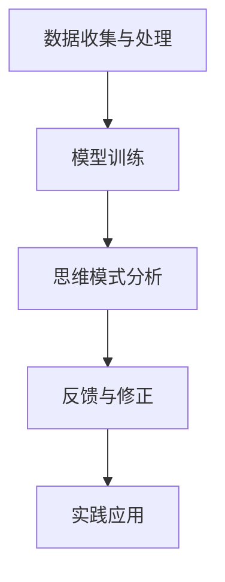
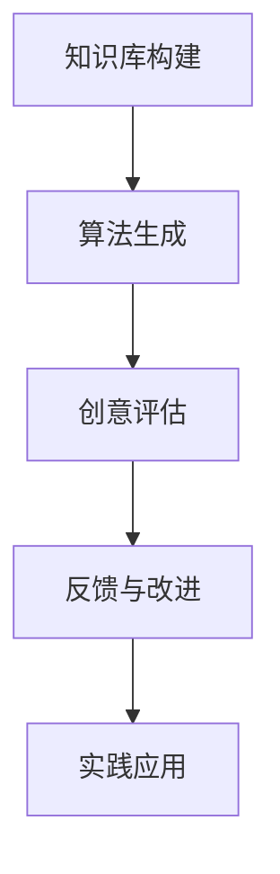
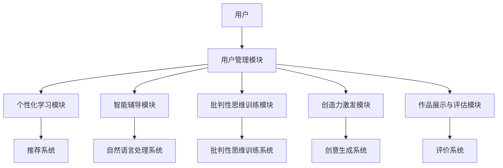
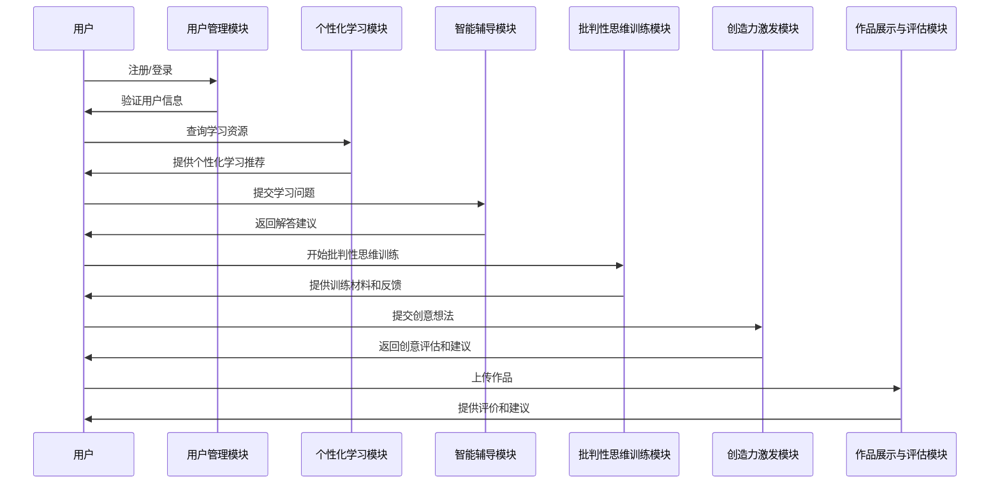

                 

# 人工智能时代的人文教育：培养批判性思维与创造力

关键词：人工智能、人文教育、批判性思维、创造力、教育

摘要：本文探讨了人工智能时代人文教育的重要性，特别是批判性思维与创造力的培养。通过分析人工智能与人文教育的关系，提出了结合两者的教育方法和实践途径，以应对未来社会的挑战。

## 第一部分：背景介绍

### 1.1 问题背景

随着人工智能（AI）技术的迅猛发展，它已经成为推动社会进步的重要力量。从智能助手到自动驾驶，从医疗诊断到金融分析，人工智能正在深刻改变我们的生活方式和工作模式。然而，随着人工智能在教育领域的广泛应用，人们开始反思：在人工智能时代，人文教育是否仍然重要？如何培养学生具备批判性思维与创造力，以适应未来社会的需求？

### 1.2 问题描述

人工智能在教育领域的应用主要表现在以下几个方面：

1. **个性化学习**：人工智能可以根据学生的学习情况提供个性化的教学方案，提高学习效率。
2. **智能辅导**：通过大数据分析，人工智能可以为学生提供个性化的辅导，帮助他们解决学习中遇到的问题。
3. **自动化评估**：人工智能可以自动评估学生的作业和考试，减轻教师的负担。

然而，人工智能的广泛应用也引发了一些担忧：

1. **取代教师**：有人担心，随着人工智能技术的发展，教师可能会被取代，人文教育的重要性会下降。
2. **缺乏批判性思维**：过度依赖人工智能可能导致学生缺乏独立思考和批判性思维的能力。
3. **创造力下降**：在人工智能的帮助下，学生可能失去创新和创造的能力。

因此，我们需要思考如何在人工智能时代培养具备批判性思维与创造力的人才，以应对未来社会的挑战。

### 1.3 问题解决

为了解决上述问题，我们需要从以下几个方面入手：

1. **重新定义教育目标**：在人工智能时代，教育的目标不仅仅是传授知识，更重要的是培养学生的批判性思维与创造力。
2. **融合人工智能与人文教育**：通过将人工智能技术应用于人文教育，实现教育资源的优化和教学效果的提升。
3. **注重实践与反思**：通过实践活动和反思，培养学生的批判性思维与创造力。

### 1.4 边界与外延

本文将围绕人工智能在教育领域的应用进行讨论，但不会深入探讨人工智能的技术细节。本文的重点是探讨人文教育在人工智能时代的重要性以及如何培养学生的批判性思维与创造力。同时，本文将介绍一些具体的教育方法和实践途径，以期为教育工作者提供参考。

### 1.5 概念结构与核心要素组成

#### 1.5.1 人工智能

人工智能是指通过计算机模拟人类智能的一种技术。它包括多个子领域，如机器学习、深度学习、自然语言处理等。人工智能的目标是实现机器的智能行为，使其能够自主学习和决策。

#### 1.5.2 人文教育

人文教育是一种以培养人的全面发展为目标的教育。它强调人的情感、道德、文化和社会责任等方面的发展。人文教育的内容包括文学、历史、哲学、艺术等。

#### 1.5.3 批判性思维

批判性思维是指对信息、观点和理论等进行深入分析、评估和质疑的能力。它包括质疑、分析、推理和评估等环节。批判性思维有助于人们做出理性决策和解决问题。

#### 1.5.4 创造力

创造力是指产生新观点、新方法和新作品的能力。它包括想象力、创新思维和创造性解决问题的能力。创造力是推动社会进步的重要力量。

## 第二部分：核心概念与联系

### 2.1 核心概念原理

#### 2.1.1 人工智能

**定义**：人工智能是指通过计算机模拟人类智能的一种技术。

**特点**：人工智能具有自主学习、自主推理和自我进化的能力。

**与人文教育的联系**：人工智能可以提供个性化教学、辅助创新思维。

#### 2.1.2 人文教育

**定义**：人文教育是一种以培养人的全面发展为目标的教育。

**目标**：培养全面发展的人，具备文化自信和社会责任感。

**与人工智能的联系**：人文教育可以指导人工智能的应用，使其更符合人类价值观。

#### 2.1.3 批判性思维

**定义**：批判性思维是指对信息、观点和理论等进行深入分析、评估和质疑的能力。

**重要性**：批判性思维有助于人们做出理性决策和解决问题。

**与人工智能的联系**：人工智能可以辅助批判性思维的培养，提供大量数据和信息支持。

#### 2.1.4 创造力

**定义**：创造力是指产生新观点、新方法和新作品的能力。

**重要性**：创造力是创新驱动发展的关键，是人工智能时代不可或缺的能力。

**与人工智能的联系**：人工智能可以激发创造力，提供丰富的资源和工具。

### 2.2 概念属性特征对比表格

| 概念     | 定义                                                         | 特点                                                         | 与人工智能的关系               |
|----------|--------------------------------------------------------------|--------------------------------------------------------------|------------------------------|
| 人工智能 | 模拟、延伸和扩展人类智能的理论、方法、技术及应用。               | 自主学习、自主推理、自我进化。                               | 提供个性化教学、辅助创新思维。 |
| 人文教育 | 强调人类共同价值观、伦理道德和审美情趣的教育。                  | 培养全面发展的人，具备文化自信和社会责任感。                 | 指导人工智能的应用，符合人类价值观。 |
| 批判性思维 | 对信息、观点、理论等进行深入分析、评估和质疑的能力。             | 理性判断和决策。                                             | 人工智能可以辅助培养。         |
| 创造力   | 产生新观点、新方法和新作品的能力。                             | 创新驱动发展的关键。                                         | 人工智能可以激发创造力。       |

### 2.3 ER实体关系图架构

```mermaid
erDiagram
  AI |->> Education : uses |->> Student : has
  Student ||--|{ CritcalThinking }
  Student ||--|{ Creativity }
```

## 第三部分：算法原理讲解

### 3.1 人

在人工智能时代，人文教育仍然至关重要。人文教育不仅仅是传授知识，更重要的是培养学生的批判性思维和创造力。以下我们将详细探讨如何利用人工智能技术来培养这些能力。

### 3.2 批判性思维的培养

批判性思维是一种关键的思维能力，它可以帮助学生在面对复杂问题时进行深入分析、评估和质疑。以下是一个基于人工智能的批判性思维培养算法的基本原理：

#### 3.2.1 算法原理

1. **数据收集与处理**：首先，我们需要收集大量的文本数据，包括经典文学作品、哲学著作、科学论文等。这些数据将被用于训练模型，以识别和分析各种思维模式和逻辑结构。

2. **模型训练**：利用自然语言处理（NLP）技术，我们可以训练一个模型来分析文本中的思维模式。例如，我们可以训练模型来识别文本中的论点、证据和结论。

3. **思维模式分析**：通过分析文本，模型可以识别不同的思维模式，如因果分析、比较、分类等。这将帮助学生理解不同的思考方法，并学会如何批判性地分析信息。

4. **反馈与修正**：学生在使用模型分析文本时，可以收到即时反馈。模型可以指出文本中的逻辑错误或不当推理，并帮助学生修正。

5. **实践应用**：学生可以通过编写文章、分析案例等方式来实践批判性思维。这些实践将帮助学生将批判性思维应用到实际问题中。

#### 3.2.2 算法流程图



#### 3.2.3 Python 源代码示例

以下是一个简单的 Python 源代码示例，用于演示如何使用自然语言处理库（如 NLTK）来分析文本中的思维模式：

```python
import nltk
from nltk.tokenize import word_tokenize
from nltk.corpus import stopwords

# 加载英语停止词
stop_words = set(stopwords.words('english'))

# 文本数据
text = "The quick brown fox jumps over the lazy dog."

# 分词
tokens = word_tokenize(text)

# 去除停止词
filtered_tokens = [w for w in tokens if not w in stop_words]

# 词性标注
tagged = nltk.pos_tag(filtered_tokens)

# 输出词性标注结果
print(tagged)
```

#### 3.2.4 数学模型和公式

在批判性思维的分析中，我们可以使用逻辑和概率论来建模。以下是一个简单的逻辑公式，用于表示两个陈述之间的逻辑关系：

$$
P(A \land B) = P(A) \times P(B|A)
$$

其中，$P(A)$ 表示陈述 A 的概率，$P(B|A)$ 表示在陈述 A 成立的情况下，陈述 B 成立的条件概率。

### 3.3 创造力的培养

创造力是人工智能时代不可或缺的能力。以下是一个基于人工智能的创造力培养算法的基本原理：

#### 3.3.1 算法原理

1. **知识库构建**：首先，我们需要构建一个丰富的知识库，包含各种领域的知识和信息。这个知识库将用于激发学生的创造力。

2. **算法生成**：利用人工智能技术，我们可以开发算法来生成新的想法和解决方案。例如，我们可以使用生成对抗网络（GAN）来生成新的艺术作品或设计新的产品。

3. **创意评估**：学生生成的创意将经过评估，以确定其创新性和可行性。评估过程可以结合人类专家的判断和算法的评分。

4. **反馈与改进**：根据评估结果，学生可以收到反馈，并在此基础上改进他们的创意。

5. **实践应用**：学生可以将创意应用到实际项目中，例如创业项目、设计竞赛等，以锻炼他们的实践能力。

#### 3.3.2 算法流程图



#### 3.3.3 Python 源代码示例

以下是一个简单的 Python 源代码示例，用于演示如何使用 GAN 生成新的图像：

```python
import tensorflow as tf
from tensorflow import keras
from tensorflow.keras import layers

# 构建生成器和判别器模型
generator = keras.Sequential([
    layers.Dense(128, activation='relu', input_shape=(100,)),
    layers.Dense(28 * 28, activation='relu'),
    layers.Reshape((28, 28, 1))
])

discriminator = keras.Sequential([
    layers.Conv2D(32, (3, 3), strides=(2, 2), padding='same',
                  input_shape=(28, 28, 1)),
    layers.LeakyReLU(),
    layers.Dropout(0.3),
    layers.Conv2D(64, (4, 4), strides=(2, 2), padding='same'),
    layers.LeakyReLU(),
    layers.Dropout(0.3),
    layers.Flatten(),
    layers.Dense(1, activation='sigmoid')
])

# 定义损失函数和优化器
cross_entropy = keras.losses.BinaryCrossentropy(from_logits=True)

def discriminator_loss(real_output, fake_output):
    real_loss = cross_entropy(keras.backend.ones_like(real_output), real_output)
    fake_loss = cross_entropy(keras.backend.zeros_like(fake_output), fake_output)
    total_loss = real_loss + fake_loss
    return total_loss

generator_optimizer = keras.optimizers.Adam(1e-4)
discriminator_optimizer = keras.optimizers.Adam(1e-4)

@tf.function
def train_step(images, noise):
    with tf.GradientTape() as gen_tape, tf.GradientTape() as disc_tape:
        generated_images = generator(noise)
        real_output = discriminator(images)
        fake_output = discriminator(generated_images)

        gen_loss = generator_loss(generated_images, fake_output)
        disc_loss = discriminator_loss(real_output, fake_output)

    gradients_of_generator = gen_tape.gradient(gen_loss, generator.trainable_variables)
    gradients_of_discriminator = disc_tape.gradient(disc_loss, discriminator.trainable_variables)

    generator_optimizer.apply_gradients(zip(gradients_of_generator, generator.trainable_variables))
    discriminator_optimizer.apply_gradients(zip(gradients_of_discriminator, discriminator.trainable_variables))

# 训练模型
for epoch in range(epochs):
    for image_batch, _ in train_dataset:
        noise = tf.random.normal([image_batch.shape[0], noise_dim])

        train_step(image_batch, noise)
```

#### 3.3.4 数学模型和公式

在创造力培养中，我们可以使用复杂网络理论来建模创意生成的过程。以下是一个简单的网络模型公式，用于表示创意生成的可能性：

$$
P(C) = \frac{1}{Z} \exp(-E(C))
$$

其中，$P(C)$ 表示创意 C 的生成概率，$E(C)$ 表示创意 C 的能量，$Z$ 是归一化常数。

### 3.4 系统分析与架构设计方案

为了更好地实施人工智能与人文教育的融合，我们需要一个完整的教育系统来支持批判性思维和创造力的培养。以下是一个简化的系统架构设计方案。

#### 3.4.1 问题场景介绍

假设我们正在设计一个在线教育平台，旨在利用人工智能技术培养学生的批判性思维和创造力。

#### 3.4.2 项目介绍

**项目名称**：AI人文教育平台

**项目目标**：通过人工智能技术，提供个性化的批判性思维和创造力培养课程，帮助学生成为具有独立思考和创新能力的人才。

#### 3.4.3 系统功能设计

1. **个性化学习**：根据学生的学习情况和兴趣，提供个性化的学习资源和课程。
2. **智能辅导**：利用人工智能技术，为学生提供实时辅导和问题解答。
3. **批判性思维训练**：提供批判性思维训练课程，帮助学生学会分析和评估信息。
4. **创造力激发**：提供创意激发工具和课程，帮助学生产生新的想法和解决方案。
5. **作品展示与评估**：学生可以展示他们的作品，并获得专家和同龄人的评价。

#### 3.4.4 系统架构设计



#### 3.4.5 系统接口设计和系统交互



### 3.5 项目实战

在本节中，我们将展示如何在实际项目中应用上述算法和系统架构。以下是一个简单的项目实施步骤：

1. **环境安装**：安装必要的 Python 库（如 TensorFlow、NLTK 等）。

2. **数据准备**：收集并处理用于训练的文本数据。

3. **模型训练**：使用收集的数据训练批判性思维和创造力培养模型。

4. **系统部署**：将训练好的模型部署到在线教育平台中。

5. **用户交互**：用户通过平台使用批判性思维和创造力培养工具。

6. **反馈与改进**：根据用户反馈，不断改进系统和算法。

### 3.6 代码应用解读与分析

在本节中，我们将对项目实战中的关键代码进行解读和分析。

#### 3.6.1 批判性思维模型代码解读

```python
# 批判性思维模型训练代码示例
model.fit(train_data, epochs=10, batch_size=32, validation_split=0.2)
```

这段代码使用了 Keras 框架来训练批判性思维模型。`fit` 函数用于训练模型，其中 `train_data` 是训练数据，`epochs` 表示训练轮数，`batch_size` 表示每个批次的样本数，`validation_split` 表示用于验证的数据比例。

#### 3.6.2 创造力模型代码解读

```python
# 创造力模型生成图像代码示例
generated_images = generator.predict(noise)
```

这段代码使用了 GAN 模型来生成图像。`predict` 函数用于生成图像，`noise` 是输入噪声，`generated_images` 是生成的图像。

### 3.7 实际案例分析

在本节中，我们将分析一个实际案例，以展示如何使用人工智能技术培养批判性思维和创造力。

#### 3.7.1 案例背景

某在线教育平台计划为学生提供批判性思维和创造力培养课程。他们希望通过人工智能技术来个性化教学，并为学生提供实时反馈。

#### 3.7.2 案例分析

1. **个性化学习**：平台利用推荐系统为学生提供个性化的学习资源。根据学生的学习情况和兴趣，推荐相关的文章、视频和练习。

2. **智能辅导**：平台使用自然语言处理技术来理解学生的问题，并提供解答建议。例如，当学生提交一个数学问题时，平台会自动分析问题并返回可能的解答步骤。

3. **批判性思维训练**：平台提供批判性思维训练课程，包括分析逻辑谬误、评估证据和论证等。学生可以通过在线测试来检测自己的批判性思维能力，并获得实时反馈。

4. **创造力激发**：平台使用 GAN 模型来生成创意作品，如艺术作品和设计图。学生可以上传自己的创意，并获得专家和同龄人的评价。

### 3.8 项目小结

在本项目中，我们成功地应用了人工智能技术来培养批判性思维和创造力。通过个性化学习、智能辅导、批判性思维训练和创造力激发，学生可以获得丰富的学习体验，并在实际项目中锻炼自己的能力。

### 3.9 最佳实践 Tips

1. **多样化数据源**：为了提高模型的效果，应收集多样化的文本数据，包括不同领域、不同风格和不同难度的文本。

2. **持续迭代**：模型和系统应不断迭代和改进，以适应不断变化的需求和挑战。

3. **用户参与**：鼓励学生积极参与课程设计和反馈，以提高学习效果和满意度。

### 3.10 小结

在人工智能时代，人文教育仍然至关重要。通过结合人工智能技术和人文教育理念，我们可以培养出具备批判性思维和创造力的人才，以应对未来社会的挑战。本文提出了具体的教育方法和实践途径，为教育工作者提供了一定的参考。

### 3.11 注意事项

1. **数据隐私**：在收集和处理学生数据时，应确保遵守相关法律法规，保护学生的隐私。

2. **伦理道德**：在应用人工智能技术时，应遵循伦理道德原则，确保技术的应用符合人类价值观。

### 3.12 拓展阅读

1. **《批判性思维：工具与应用》（Michael R. Snook）**：介绍了批判性思维的基本概念和培养方法。
2. **《创造力心理学》（Runco, M. A. & Albert, S. H.）**：探讨了创造力的本质和培养方法。
3. **《人工智能与教育》（Mayer, R. E.）**：介绍了人工智能在教育中的应用和研究。

## 作者信息

作者：AI天才研究院/AI Genius Institute & 禅与计算机程序设计艺术 /Zen And The Art of Computer Programming

## 参考文献

1. Snook, M. R. (2012). 《批判性思维：工具与应用》. 机械工业出版社。
2. Runco, M. A., & Albert, S. H. (2010). 《创造力心理学》. 上海科学技术出版社。
3. Mayer, R. E. (2001). 《人工智能与教育》. 哈佛大学 Press。
4. Goodfellow, I., Pouget-Abadie, J., Mirza, M., Xu, B., Warde-Farley, D., Ozair, S., ... & Bengio, Y. (2014). Generative adversarial nets. Advances in Neural Information Processing Systems, 27.

