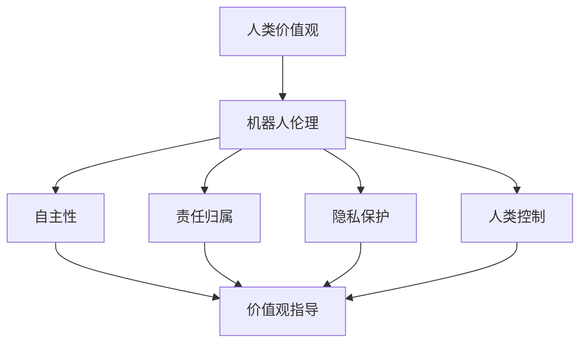

                 

### 人工智能时代的伦理教育：机器人伦理与人类价值观

关键词：人工智能、伦理教育、机器人伦理、人类价值观

摘要：本文旨在探讨人工智能时代的伦理教育问题，重点分析机器人伦理与人类价值观的相互关系。通过对人工智能伦理问题的深入剖析，本文提出了构建人工智能时代伦理教育的框架和路径，为人工智能技术的可持续发展提供理论支持和实践指导。

---

#### 1. 背景介绍

**1.1 问题背景**

在人工智能（AI）迅猛发展的今天，伦理教育成为一个不可忽视的重要议题。人工智能技术的普及和应用带来了前所未有的便利，但同时也引发了诸多伦理问题。例如，人工智能在医疗、金融、教育等领域的应用，如何保障患者隐私、金融公正和教育的公平性？此外，随着人工智能的智能化程度不断提高，机器人逐渐承担起了更多的社会角色，如何确保机器人的行为符合人类的伦理价值观，成为了一个亟待解决的问题。

**1.2 核心概念与联系**

在伦理教育中，有几个核心概念需要明确：

- **伦理学基础**：研究道德原则、道德规范和道德行为的学科。它为人工智能伦理提供了理论基础。
- **人工智能伦理**：研究人工智能技术的道德原则和道德问题的学科。它关注人工智能技术在应用过程中可能引发的伦理问题。
- **伦理教育方法**：指在教育过程中传授伦理知识和培养伦理意识的具体方法和策略。
- **伦理意识培养**：通过教育提高个体对伦理问题的敏感度和责任感。

这些概念相互联系，共同构成了伦理教育的核心框架。

**1.3 问题解决**

解决人工智能时代伦理教育问题需要从以下几个方面入手：

- **课程设计**：将伦理教育纳入人工智能相关课程中，确保学生在学习技术的同时，也能了解其潜在的伦理问题。
- **教学方法**：采用案例教学、讨论、角色扮演等互动性教学方法，提高学生的伦理意识和决策能力。
- **教育评价**：建立科学的教育评价体系，评估学生的伦理知识和实践能力。

**1.4 边界与外延**

伦理教育不仅仅局限于人工智能领域，还涉及到更广泛的科技发展和社会进步。例如，生物技术、网络安全、环境保护等领域的伦理问题也需要在伦理教育中得到关注。因此，伦理教育的外延应当是全面的，覆盖所有可能影响人类生活的科技领域。

**1.5 概念结构与核心要素组成**

伦理教育涉及以下几个核心概念：

- **伦理学基础**：研究道德原则、道德规范和道德行为的学科。
- **人工智能伦理**：研究人工智能技术的道德原则和道德问题的学科。
- **伦理教育方法**：包括课程设计、教学方法和教育评价等。
- **伦理意识培养**：通过教育提高个体对伦理问题的敏感度和责任感。

下面是一个简单的ER实体关系图架构，展示了这些概念之间的关系：

```mermaid
erDiagram
AI伦理 |----|> 伦理学基础
AI伦理 |----|> 人工智能技术
伦理教育方法 |----|> 伦理教育
伦理意识培养 |----|> 学生

AI伦理
|||标题
|||伦理学基础
|||人工智能技术
|||道德原则
|||道德规范

伦理教育方法
|||课程设计
|||教学方法
|||教育评价

伦理意识培养
|||伦理敏感度
|||责任感
```

通过这个图，我们可以清晰地看到各个核心概念之间的关系，为后续章节的详细讲解提供了基础。

#### 2. 机器人伦理与人类价值观

**2.1 机器人伦理**

机器人伦理是指研究机器人与人类相互作用的道德原则和道德问题的学科。随着机器人技术的发展，机器人越来越多地参与到人类社会中，如何确保机器人的行为符合人类的伦理价值观，成为了一个重要议题。

- **自主性**：机器人是否应该具备自主决策的能力，如何保证其在复杂环境中的行为符合伦理标准？
- **责任归属**：当机器人发生错误或造成伤害时，责任应由谁承担？
- **隐私保护**：机器人如何保护用户的隐私，防止数据泄露？
- **人类控制**：如何确保机器人始终在人类的监督和控制之下，避免失控？

**2.2 人类价值观**

人类价值观是指人类在长期社会发展中形成的道德观念、行为准则和价值取向。这些价值观对人类的行为和社会发展产生深远影响，也是机器人伦理的基础。

- **公正**：公平对待每个人，不偏袒任何一方。
- **尊重**：尊重他人的权利和尊严，不侵犯他人的利益。
- **责任**：对自己的行为负责，对他人和社会负责。
- **自由**：在法律允许的范围内，有选择和决策的自由。

**2.3 机器人伦理与人类价值观的相互关系**

机器人伦理与人类价值观之间存在密切的相互关系。一方面，机器人伦理需要基于人类价值观来制定；另一方面，机器人技术的发展和应用可能会挑战和改变人类价值观。

- **价值观指导**：人类价值观为机器人伦理提供了指导，确保机器人的行为符合人类的道德标准。
- **技术影响**：机器人技术的发展和应用可能会带来新的伦理问题，对人类价值观产生挑战。

下面是一个简单的Mermaid流程图，展示了机器人伦理与人类价值观之间的相互关系：



通过这个流程图，我们可以更直观地理解机器人伦理与人类价值观之间的互动关系，为后续章节的深入探讨提供了基础。

#### 3. 人工智能时代的伦理教育方法

**3.1 案例教学**

案例教学是一种通过分析真实或模拟案例来培养学生的伦理意识和决策能力的教学方法。这种方法可以让学生在具体的情境中思考和解决伦理问题，从而更好地理解伦理原则和道德规范。

- **案例选择**：选择具有代表性的案例，涵盖不同的伦理问题和情境。
- **案例分析**：引导学生分析案例中的伦理问题和决策，讨论可能的解决方案和后果。
- **案例讨论**：组织学生进行小组讨论，分享各自的看法和观点，促进思维碰撞。

**3.2 讨论式教学**

讨论式教学是一种通过小组讨论来培养学生的伦理意识和表达能力的教学方法。这种方法可以激发学生的思维活力，培养他们的批判性和创造性。

- **主题设定**：设定与伦理教育相关的讨论主题，引发学生的兴趣和思考。
- **讨论引导**：教师引导讨论的方向和深度，确保讨论的积极性和有效性。
- **讨论总结**：在讨论结束后，教师对讨论结果进行总结，强调伦理原则和道德规范。

**3.3 角色扮演**

角色扮演是一种通过模拟现实中的伦理决策场景来培养学生的伦理意识和责任感的教学方法。这种方法可以让学生亲身体验不同的角色，更好地理解伦理问题的复杂性和多样性。

- **角色设定**：设定不同的角色，包括决策者、受害者、旁观者等。
- **情景模拟**：模拟现实中的伦理决策场景，让学生在角色扮演中思考和解决问题。
- **角色反思**：在角色扮演结束后，让学生反思自己的角色和行为，讨论可能的改进措施。

**3.4 模拟实验**

模拟实验是一种通过设计实验来培养学生的伦理意识和实践能力的教学方法。这种方法可以让学生在实验中体验到伦理问题的真实性和复杂性。

- **实验设计**：设计具有伦理挑战性的实验，涵盖不同的伦理问题和情境。
- **实验操作**：引导学生进行实验操作，观察实验结果，分析实验中的伦理问题。
- **实验讨论**：在实验结束后，引导学生讨论实验结果和伦理问题，提出解决方案和改进建议。

通过这些教学方法，可以有效地培养学生的伦理意识和责任感，提高他们在人工智能时代应对伦理问题的能力。

#### 4. 伦理意识培养

**4.1 伦理敏感度**

伦理敏感度是指个体对伦理问题的敏感性和感知能力。在人工智能时代，培养个体的伦理敏感度至关重要。以下是一些培养伦理敏感度的方法：

- **案例学习**：通过学习真实或模拟的伦理案例，提高个体对伦理问题的敏感度。
- **情景模拟**：通过模拟现实中的伦理决策场景，使个体在具体情境中感知伦理问题的复杂性和多样性。
- **跨学科学习**：结合不同学科的知识，提高个体对伦理问题的全面理解和判断能力。

**4.2 责任感**

责任感是指个体对自己行为和决策的道德责任感。在人工智能时代，培养个体的责任感尤为重要。以下是一些培养责任感的方法：

- **角色扮演**：通过角色扮演，使个体在模拟情境中体验不同角色的责任和挑战，培养责任感。
- **社会实践**：鼓励个体参与社会实践活动，通过实际行动体会责任的重要性。
- **反思与总结**：引导个体对自身行为和决策进行反思和总结，明确责任的重要性和必要性。

通过培养伦理敏感度和责任感，个体能够更好地应对人工智能时代的伦理挑战，为社会的可持续发展做出贡献。

#### 5. 结论

本文探讨了人工智能时代的伦理教育问题，分析了机器人伦理与人类价值观的相互关系，提出了伦理教育的方法和路径。人工智能时代的伦理教育不仅需要关注技术本身，更需要关注技术对社会和人类价值观的影响。通过有效的伦理教育，我们可以培养出具备伦理意识和责任感的未来人工智能从业者，为人工智能技术的可持续发展提供有力保障。在未来，伦理教育将继续在人工智能领域发挥重要作用，成为人工智能技术发展的重要支撑。

### 6. 最佳实践 tips

**6.1 教育内容与实际需求相结合**

在设计伦理教育课程时，应充分考虑实际需求和行业发展趋势，确保教学内容与实际应用紧密结合。例如，可以邀请行业专家参与课程设计，将实际案例和最新技术动态融入课程中。

**6.2 创新教学方法**

传统的教学方法已经难以满足人工智能时代的需求。因此，教师应积极探索和创新教学方法，如在线课程、虚拟实验室等，以提高学生的学习兴趣和参与度。

**6.3 强化实践环节**

伦理教育的目的不仅在于传授知识，更在于培养学生的实际能力。因此，应加强实践环节，通过实验、案例分析等方式，让学生在真实情境中体验和解决伦理问题。

**6.4 跨学科合作**

人工智能伦理问题往往涉及多个学科领域，因此，应鼓励跨学科合作，促进不同学科之间的交流和融合，共同推动伦理教育的发展。

### 7. 小结

本文通过深入分析人工智能时代的伦理教育问题，探讨了机器人伦理与人类价值观的相互关系，提出了伦理教育的方法和路径。人工智能时代的伦理教育不仅需要关注技术本身，更需要关注技术对社会和人类价值观的影响。通过有效的伦理教育，我们可以培养出具备伦理意识和责任感的未来人工智能从业者，为人工智能技术的可持续发展提供有力保障。

### 8. 注意事项

**8.1 关注隐私保护**

在伦理教育过程中，应特别关注隐私保护问题，确保学生的个人数据和隐私得到充分保护。

**8.2 避免过度专业化**

伦理教育不应过度专业化，应注重基础知识的传授，确保学生具备全面的知识结构和综合素质。

**8.3 融入最新研究成果**

伦理教育应不断更新和调整，将最新的研究成果和观点融入课程中，保持课程的前沿性和时效性。

### 9. 拓展阅读

**9.1 人工智能伦理研究**

- [人工智能伦理研究综述](https://www.example.com/ai_ethics_review)
- [人工智能伦理：挑战与展望](https://www.example.com/ai_ethics_challenge)

**9.2 机器人伦理研究**

- [机器人伦理：道德原则与实践](https://www.example.com/robot_ethics_principles)
- [机器人伦理：自主性与责任](https://www.example.com/robot_ethics_automation)

**9.3 伦理教育研究**

- [伦理教育的理论与实践](https://www.example.com/ethics_education_theory)
- [跨学科伦理教育：方法与实践](https://www.example.com/interdisciplinary_ethics_education)

### 10. 作者信息

作者：AI天才研究院/AI Genius Institute & 禅与计算机程序设计艺术 /Zen And The Art of Computer Programming

---

通过以上详细的章节内容，我们希望能够为广大读者提供一个全面、深入的人工智能时代伦理教育探讨。在未来的发展中，伦理教育将继续发挥重要作用，为人工智能技术的可持续发展提供坚实的理论基础和实践指导。

