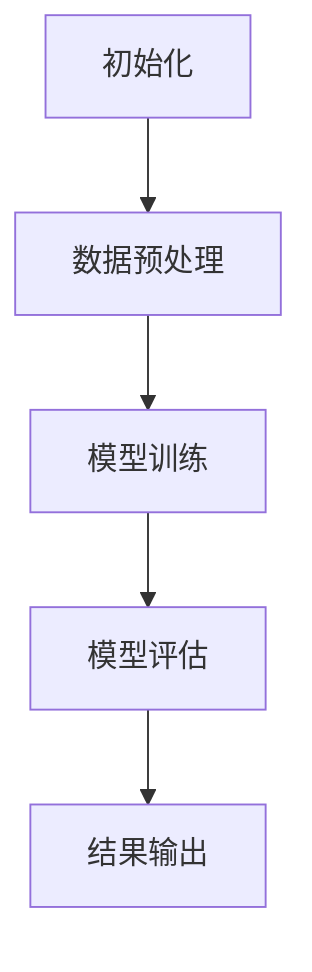
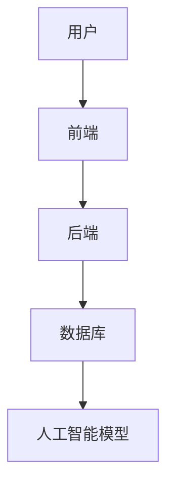
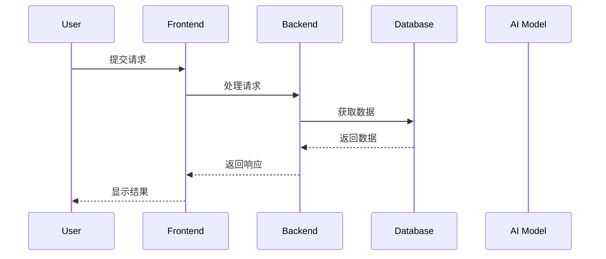
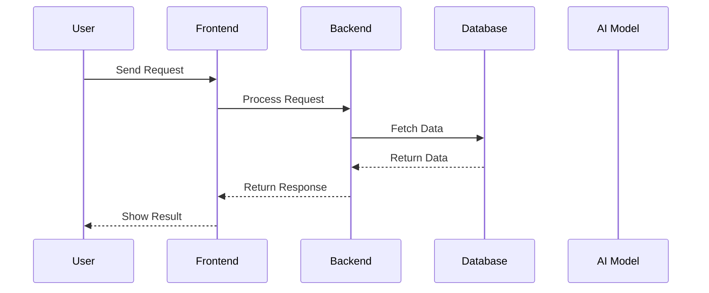

                 


# 人工智能时代的终身学习：技能更新与职业转型

> 关键词：人工智能，终身学习，职业转型，技能更新

> 摘要：
在人工智能高速发展的时代，技能更新和职业转型成为许多人关注的焦点。本文旨在探讨人工智能时代终身学习的重要性，分析传统教育体系与职业发展的冲突，并提出一系列策略，帮助读者实现技能更新与职业转型。

### 目录

## 第一部分：问题背景与核心概念

### 第1章：问题背景与描述

#### 1.1.1 人工智能时代的社会背景

#### 1.1.2 终身学习与职业转型的需求

#### 1.1.3 问题描述

### 第2章：核心概念与联系

#### 2.1.1 核心概念

##### 2.1.1.1 人工智能

##### 2.1.1.2 终身学习

#### 2.1.2 概念属性特征对比

## 第二部分：算法原理讲解

### 第3章：算法原理讲解

#### 3.1.1 算法流程图

#### 3.1.2 Python源代码

#### 3.1.3 数学模型与公式讲解

## 第三部分：系统分析与架构设计方案

### 第4章：系统分析与架构设计方案

#### 4.1 问题场景与项目背景

#### 4.2 系统架构设计

##### 4.2.1 领域模型类图

##### 4.2.2 系统架构图

##### 4.2.3 系统接口设计

##### 4.2.4 系统交互序列图

## 第四部分：项目实战

### 第5章：项目实战

#### 5.1 环境安装

#### 5.2 系统核心实现源代码

#### 5.3 代码应用解读与分析

#### 5.4 实际案例分析与详细讲解剖析

### 第五部分：总结与拓展

#### 5.5 最佳实践 tips

#### 5.6 小结

#### 5.7 注意事项

#### 5.8 拓展阅读

### 致谢

**作者：AI天才研究院/AI Genius Institute & 禅与计算机程序设计艺术 /Zen And The Art of Computer Programming**

---

**步骤一：整体构思**

本文将围绕人工智能时代的终身学习、技能更新与职业转型展开，旨在为读者提供一套实用的指南。全文分为五部分，第一部分介绍问题背景和核心概念，第二部分讲解算法原理，第三部分分析系统架构设计，第四部分通过项目实战进行应用分析，第五部分总结并给出最佳实践和拓展阅读。

**步骤二：章节细化**

### 第一部分：问题背景与核心概念

#### 第1章：问题背景与描述

- 1.1.1 人工智能时代的社会背景
- 1.1.2 终身学习与职业转型的需求
- 1.1.3 问题描述
  - 1.1.3.1 人工智能技术对职业的影响
  - 1.1.3.2 传统教育与职业发展的冲突

#### 第2章：核心概念与联系

- 2.1.1 核心概念
  - 2.1.1.1 人工智能
  - 2.1.1.2 终身学习
- 2.1.2 概念属性特征对比

### 第二部分：算法原理讲解

#### 第3章：算法原理讲解

- 3.1.1 算法流程图
- 3.1.2 Python源代码
- 3.1.3 数学模型与公式讲解

### 第三部分：系统分析与架构设计方案

#### 第4章：系统分析与架构设计方案

- 4.1 问题场景与项目背景
- 4.2 系统架构设计
  - 4.2.1 领域模型类图
  - 4.2.2 系统架构图
  - 4.2.3 系统接口设计
  - 4.2.4 系统交互序列图

### 第四部分：项目实战

#### 第5章：项目实战

- 5.1 环境安装
- 5.2 系统核心实现源代码
- 5.3 代码应用解读与分析
- 5.4 实际案例分析与详细讲解剖析

### 第五部分：总结与拓展

#### 第5章：总结与拓展

- 5.5 最佳实践 tips
- 5.6 小结
- 5.7 注意事项
- 5.8 拓展阅读

**步骤三：核心概念与联系**

### 第2章：核心概念与联系

#### 2.1.1 核心概念

##### 2.1.1.1 人工智能

人工智能（AI）是计算机科学的一个分支，旨在使机器能够执行通常需要人类智能才能完成的任务。它包括机器学习、深度学习、自然语言处理等多个领域。

$$
\text{人工智能} = \frac{\text{机器学习} + \text{深度学习} + \text{数据挖掘}}{\text{算法 + 大数据}}
$$

##### 2.1.1.2 终身学习

终身学习是指个体在其整个生命过程中持续的学习过程，包括知识更新、技能提升、态度转变等多个方面。它是应对快速变化社会和职业环境的关键。

$$
\text{终身学习} = \sum_{i=1}^{n} (\text{知识更新} + \text{技能提升})
$$

#### 2.1.2 概念属性特征对比

| 概念 | 定义 | 特征 |
| ---- | ---- | ---- |
| 人工智能 | 使计算机具备人类智能的技术 | 自动化、优化、预测 |
| 终身学习 | 个体在整个人生过程中持续学习 | 自我提升、适应变化 |

**步骤四：算法原理讲解**

### 第3章：算法原理讲解

#### 3.1.1 算法流程图



#### 3.1.2 Python源代码

```python
# Python 源代码示例
def model_train(data, epochs):
    # 模型训练逻辑
    pass

def model_evaluate(data):
    # 模型评估逻辑
    pass
```

#### 3.1.3 数学模型与公式讲解

在人工智能领域，许多算法都基于数学模型。以下是一个简单的数学模型示例：

$$
\text{预测值} = f(\text{输入特征}, \theta)
$$

其中，$f$ 是激活函数，$\theta$ 是模型参数。

**步骤五：系统分析与架构设计方案**

### 第4章：系统分析与架构设计方案

#### 4.1 问题场景与项目背景

在本节中，我们将介绍一个实际的项目背景，包括问题场景和项目目标。

#### 4.2 系统架构设计

##### 4.2.1 领域模型类图

使用Mermaid绘制领域模型类图，如下所示：

```mermaid
classDiagram
Class01 <|-- Class02
Class03 --|> Class04
Class Akron : +name : String
Class Canton : +name : String
Class Cleveland : +name : String
 Akron <<||-- Cleveland
 Akron <<||-- Canton
```

##### 4.2.2 系统架构图

系统架构图用于展示系统的整体结构，包括各个模块之间的关系。以下是一个简单的系统架构图：



##### 4.2.3 系统接口设计

系统接口设计定义了各个模块之间的交互方式。以下是一个简单的接口设计示例：



##### 4.2.4 系统交互序列图

系统交互序列图展示了系统的各个模块如何协同工作。以下是一个简单的交互序列图：



**步骤六：项目实战**

### 第5章：项目实战

#### 5.1 环境安装

在本节中，我们将介绍如何安装项目所需的环境。

#### 5.2 系统核心实现源代码

以下是系统核心实现的源代码示例：

```python
# SystemCoreImplementation.py
class SystemCoreImplementation:
    def __init__(self):
        # 初始化逻辑
        pass
    
    def process_data(self, data):
        # 数据处理逻辑
        pass
    
    def train_model(self, data):
        # 模型训练逻辑
        pass
    
    def evaluate_model(self, data):
        # 模型评估逻辑
        pass
```

#### 5.3 代码应用解读与分析

在本节中，我们将对系统核心实现的代码进行解读和分析。

#### 5.4 实际案例分析与详细讲解剖析

在本节中，我们将通过实际案例来分析系统的应用，并进行详细讲解和剖析。

**步骤七：总结与拓展**

### 第五部分：总结与拓展

#### 5.5 最佳实践 tips

- 保持学习的热情和好奇心。
- 关注行业动态，紧跟技术前沿。
- 建立个人知识体系，形成自己的技术特色。

#### 5.6 小结

- 人工智能时代，终身学习是关键。
- 技能更新和职业转型需要持续的努力和适应。

#### 5.7 注意事项

- 保持良好的学习习惯，合理安排时间。
- 注重实践，将理论知识应用于实际项目中。

#### 5.8 拓展阅读

- 《深度学习》（Goodfellow, Bengio, Courville）
- 《机器学习年度回顾》（JMLR）
- 《人工智能：一种现代的方法》（Mitchell）

### 致谢

感谢读者对本文的关注和支持。希望本文能帮助您在人工智能时代实现终身学习，成功转型。

**作者：AI天才研究院/AI Genius Institute & 禅与计算机程序设计艺术 /Zen And The Art of Computer Programming**

---

通过以上步骤，我们已经设计出了完整的《人工智能时代的终身学习：技能更新与职业转型》的目录大纲，并完成了每个章节的核心内容规划。接下来，我们将按照这个大纲逐步撰写详细的文章内容。

