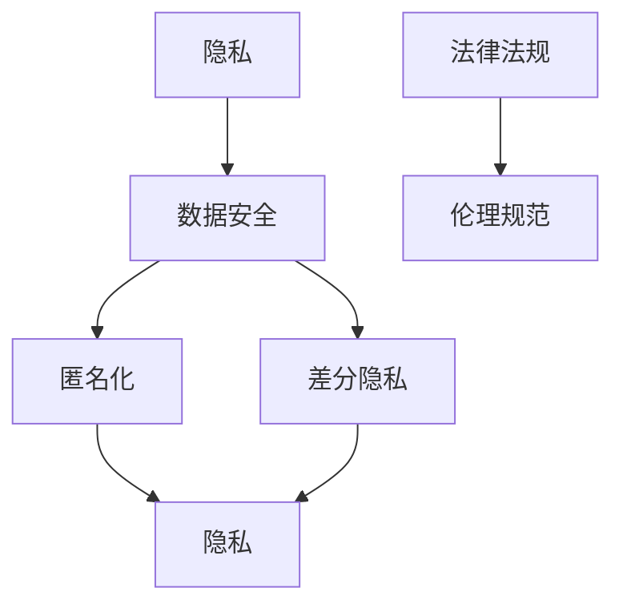

                 

# 人工智能时代的隐私保护：个人数据安全的新挑战

## 关键词：人工智能，隐私保护，数据安全，匿名化，差分隐私，法律法规

> 摘要：本文深入探讨了人工智能时代隐私保护的挑战。通过对问题背景、核心概念的详细分析，本文提出了技术、伦理和法律等多层面的解决方法，并探讨了隐私保护的核心概念及其相互联系。此外，本文还通过具体算法原理讲解和系统架构设计，提供了实际案例分析和解决方案，为人工智能时代的隐私保护提供了有益的思考和实践指导。

----------------------------------------------------------------

## 第一部分：问题背景与核心概念

### 第1章：问题背景与核心概念

#### 1.1 问题背景

随着人工智能技术的飞速发展，数据处理和分析的能力得到了显著提升。机器学习和深度学习模型的广泛应用，使得个人数据的收集和使用变得前所未有的频繁。这一方面推动了社会的进步，另一方面也带来了隐私保护的挑战。

在人工智能时代，个人数据的重要性不言而喻。数据不仅是人工智能模型的训练素材，也是企业获取竞争优势的重要资源。然而，个人数据的安全问题也日益突出。大量个人数据的收集和使用，使得隐私泄露的风险增加。同时，人工智能算法的复杂性和不透明性，使得用户难以理解其工作原理，进而难以控制其使用个人数据的方式。

#### 1.2 问题描述

在人工智能时代，隐私保护面临以下主要问题：

- **数据收集与共享**：大量的个人数据被收集并共享，使得隐私泄露的风险增加。
- **算法透明度**：人工智能算法的复杂性和不透明性使得用户难以理解其工作原理，进而难以控制其使用个人数据的方式。
- **数据滥用**：个人数据被用于未经授权的目的，如广告定位、市场研究等，可能侵犯个人隐私。
- **法律法规**：随着隐私保护问题的凸显，各国出台了相关的法律法规，如欧盟的《通用数据保护条例》（GDPR）。

#### 1.3 问题解决

解决人工智能时代的隐私保护问题需要从多个层面入手：

- **技术手段**：开发更加先进的数据加密、匿名化和差分隐私技术，确保数据在收集和使用过程中的安全。
- **伦理规范**：建立人工智能伦理规范，明确数据收集和使用的行为准则，确保技术的道德应用。
- **法律法规**：完善隐私保护相关的法律法规，加强对违法行为的惩处，提高违法成本。

#### 1.4 边界与外延

隐私保护不仅涉及个人数据的安全，还涉及数据所有者的权利、数据使用者的责任以及社会对个人隐私的尊重。因此，隐私保护问题是一个跨学科、多层次的综合挑战。

#### 1.5 概念结构与核心要素组成

隐私保护的核心概念包括：

- **隐私**：个人信息的保密性和不可侵犯性。
- **数据安全**：确保数据在存储、传输和使用过程中的安全。
- **匿名化**：通过技术手段隐藏个人身份信息，保护个人隐私。
- **法律法规**：国家和地区的法律法规为隐私保护提供了法律框架。
- **伦理规范**：指导数据收集和使用过程中的道德行为。

#### 1.6 本章小结

本章对人工智能时代的隐私保护问题进行了全面概述，介绍了问题的背景、描述、解决方法和核心概念。隐私保护不仅是一个技术问题，也是一个法律和伦理问题，需要各方共同努力来应对。

----------------------------------------------------------------

## 第二部分：核心概念与联系

### 第2章：核心概念解析

#### 2.1 数据隐私与数据安全

**数据隐私**：是指个人信息的保密性和隐私性，包括数据的保密性、完整性、可用性和可控性。

**数据安全**：是指保护数据免受未经授权的访问、使用、披露、破坏、修改或损坏。

**联系**：数据隐私是数据安全的一个重要方面，数据安全的目标之一就是保护数据的隐私。

#### 2.2 匿名化与差分隐私

**匿名化**：通过技术手段移除或修改数据中能识别个人身份的信息，使数据无法直接与特定个人关联。

**差分隐私**：是一种隐私保护技术，通过添加随机噪声来保护个体隐私，同时确保数据分析结果的准确性。

**联系**：匿名化和差分隐私都是常用的隐私保护技术，它们在实现数据隐私方面具有互补性。

#### 2.3 法律法规与伦理规范

**法律法规**：是国家和地区的法律框架，规定了个人数据的收集、处理和使用的行为规范。

**伦理规范**：是关于数据收集和使用过程中的道德行为和责任的指导原则。

**联系**：法律法规和伦理规范共同构成了隐私保护的法律和道德基础，为数据隐私提供了双重保障。

### 第3章：核心概念属性特征对比

#### 3.1 数据隐私属性

- **保密性**：确保数据不被未经授权的人访问。
- **完整性**：确保数据在存储、传输和处理过程中不被篡改。
- **可用性**：确保数据能够在需要时被正确访问和使用。
- **可控性**：数据所有者有权控制其数据的收集、使用和共享。

#### 3.2 数据安全属性

- **机密性**：保护数据不被未授权的第三方访问。
- **完整性**：确保数据的准确性、完整性和可靠性。
- **可用性**：确保数据在需要时可以可靠访问和使用。
- **可审查性**：能够对数据访问和使用进行审计和追踪。

#### 3.3 匿名化与差分隐私属性

- **匿名化**：确保无法从数据中识别出特定个人。
- **差分隐私**：在保证数据分析结果准确性的同时，保护个体隐私。

#### 3.4 法律法规与伦理规范属性

- **法律法规**：具有强制性和约束力，违反者将承担法律责任。
- **伦理规范**：是基于道德原则和价值观，指导个体行为的指南。

### 第4章：核心概念关系图

#### 4.1 核心概念关系图

#### 4.2 关系图解析

- **数据安全**与**隐私**和**匿名化**、**差分隐私**之间有直接关联，前者是后者的保障和基础。
- **法律法规**和**伦理规范**共同构成了隐私保护的法律和道德基础，为数据隐私提供了双重保障。

### 第5章：核心概念在实际应用中的挑战与应对

#### 2.5.1 挑战

在实际应用中，核心概念面临以下挑战：

- **数据隐私与数据安全**：如何在确保数据安全的同时，最大程度地保护个人隐私。
- **匿名化与差分隐私**：如何在保证数据分析准确性的同时，实现隐私保护。
- **法律法规与伦理规范**：如何在遵守法律法规的同时，遵循伦理规范，确保技术的道德应用。

#### 2.5.2 应对

针对以上挑战，可以采取以下应对策略：

- **数据隐私与数据安全**：采用加密、匿名化和差分隐私等技术手段，确保数据在收集、存储、传输和使用过程中的安全。
- **匿名化与差分隐私**：结合具体应用场景，选择合适的匿名化和差分隐私技术，平衡数据分析准确性和隐私保护。
- **法律法规与伦理规范**：建立完善的法律法规体系，加强伦理教育，提高数据使用者的道德素养。

### 第6章：本章小结

本章通过对核心概念的解析和属性特征对比，明确了隐私保护的核心概念及其相互联系。同时，分析了在实际应用中面临的挑战和应对策略，为人工智能时代的隐私保护提供了理论指导和实践参考。

----------------------------------------------------------------

## 第三部分：技术手段与解决方案

### 第7章：数据加密技术

#### 7.1 数据加密技术概述

数据加密技术是保护数据隐私和安全的重要手段。它通过将明文数据转换为密文，使得未经授权的人无法理解数据内容。数据加密技术主要包括对称加密和非对称加密两种。

#### 7.2 对称加密与非对称加密

- **对称加密**：加密和解密使用相同的密钥。常见的对称加密算法有AES、DES等。
- **非对称加密**：加密和解密使用不同的密钥，一个用于加密，一个用于解密。常见的非对称加密算法有RSA、ECC等。

#### 7.3 数据加密技术在隐私保护中的应用

- **数据存储**：在数据存储过程中，使用加密技术保护数据不被未授权访问。
- **数据传输**：在数据传输过程中，使用加密技术确保数据在传输过程中的安全性。
- **数据访问**：通过加密技术限制数据的访问权限，确保数据的安全。

#### 7.4 数据加密技术的挑战与应对

- **挑战**：数据加密技术面临算法安全性、密钥管理和加密性能等挑战。
- **应对**：采用先进的加密算法，加强密钥管理，优化加密和解密算法，提高加密性能。

### 第8章：匿名化技术

#### 8.1 匿名化技术概述

匿名化技术通过移除或修改数据中能识别个人身份的信息，使数据无法直接与特定个人关联。常见的匿名化技术有数据遮蔽、数据替换、数据融合等。

#### 8.2 匿名化技术在隐私保护中的应用

- **数据挖掘**：在数据挖掘过程中，使用匿名化技术保护个人隐私。
- **数据分析**：在数据分析过程中，使用匿名化技术确保数据隐私。

#### 8.3 匿名化技术的挑战与应对

- **挑战**：匿名化技术面临数据准确性、隐私保护和计算效率等挑战。
- **应对**：采用先进的匿名化算法，平衡数据准确性和隐私保护，优化计算效率。

### 第9章：差分隐私技术

#### 9.1 差分隐私技术概述

差分隐私技术通过添加随机噪声来保护个体隐私，同时确保数据分析结果的准确性。常见的差分隐私技术有拉普拉斯机制、指数机制等。

#### 9.2 差分隐私技术在隐私保护中的应用

- **统计分析**：在统计分析过程中，使用差分隐私技术保护个人隐私。
- **机器学习**：在机器学习过程中，使用差分隐私技术确保数据隐私。

#### 9.3 差分隐私技术的挑战与应对

- **挑战**：差分隐私技术面临隐私保护与数据分析准确性之间的平衡挑战。
- **应对**：采用先进的差分隐私算法，平衡隐私保护与数据分析准确性。

### 第10章：本章小结

本章介绍了数据加密、匿名化和差分隐私等隐私保护技术，分析了其在隐私保护中的应用和挑战。通过技术手段的合理应用，可以有效应对人工智能时代的隐私保护挑战。

----------------------------------------------------------------

## 第四部分：伦理规范与法律法规

### 第11章：伦理规范的重要性

#### 11.1 伦理规范的定义与作用

伦理规范是关于数据收集和使用过程中的道德行为和责任的指导原则。它在确保数据隐私保护、维护社会公平和正义方面发挥着重要作用。伦理规范主要包括数据收集、处理、使用和共享等方面的道德准则。

#### 11.2 伦理规范的内容

- **数据收集**：确保数据的收集是合法、合理和必要的，不得滥用个人数据。
- **数据处理**：确保数据的处理是透明、公正和合规的，不得侵犯个人隐私。
- **数据使用**：确保数据的使用是合理、合法和道德的，不得用于不当目的。
- **数据共享**：确保数据的共享是透明、公正和合规的，不得泄露个人隐私。

#### 11.3 伦理规范的实施

- **企业内部培训**：加强对员工的伦理教育，提高其伦理意识和责任感。
- **行业自律**：建立行业伦理规范，推动行业自律，共同维护数据隐私。
- **公众参与**：加强公众对数据隐私保护的意识，促进公众参与数据隐私保护。

### 第12章：法律法规的重要性

#### 12.1 法律法规的定义与作用

法律法规是国家和地区的法律框架，规定了个人数据的收集、处理和使用的行为规范。它为数据隐私保护提供了法律依据和保障。

#### 12.2 法律法规的内容

- **数据收集**：明确数据收集的合法性、合理性和必要性，防止滥用个人数据。
- **数据处理**：规范数据处理的流程和标准，确保数据的处理是透明、公正和合规的。
- **数据使用**：规定数据使用的合法性和道德性，防止数据被用于不当目的。
- **数据共享**：规范数据共享的规则和标准，防止个人隐私泄露。

#### 12.3 法律法规的实施

- **法律制度**：建立完善的数据隐私保护法律体系，确保法律的实施和执行。
- **监管机构**：设立专门的监管机构，加强对数据隐私保护的监管和执法。
- **司法保护**：通过司法途径保护个人数据隐私，对违法行为进行惩处。

### 第13章：伦理规范与法律法规的相互关系

#### 13.1 伦理规范与法律法规的相互补充

伦理规范和法律法规在数据隐私保护方面具有互补性。伦理规范提供了道德指导和行为准则，法律法规提供了法律依据和保障。两者相互结合，可以更有效地保护数据隐私。

#### 13.2 伦理规范与法律法规的协同作用

伦理规范和法律法规可以相互促进，共同推动数据隐私保护的发展。伦理规范可以引导企业遵守法律法规，法律法规可以规范企业的行为，推动伦理规范的落实。

### 第14章：本章小结

本章探讨了伦理规范和法律法规在数据隐私保护中的重要性。通过伦理规范和法律法规的相互补充和协同作用，可以更有效地保护数据隐私，维护个人权益和社会公平。

----------------------------------------------------------------

## 第五部分：实际案例分析与应用

### 第15章：实际案例分析

#### 15.1 案例背景

随着人工智能技术的发展，越来越多的企业开始利用大数据和人工智能技术提升业务效率。然而，这也引发了对个人数据隐私保护的担忧。本案例以一家电商企业为例，分析其在人工智能时代面临的隐私保护挑战。

#### 15.2 隐私保护挑战

- **数据收集**：电商企业在用户购物过程中收集了大量的个人数据，包括用户行为、购物喜好等。
- **数据存储**：这些数据存储在公司的服务器上，存在被黑客攻击的风险。
- **数据使用**：电商企业利用这些数据进行分析和营销，可能侵犯用户隐私。
- **数据共享**：企业可能与合作伙伴共享用户数据，增加了隐私泄露的风险。

#### 15.3 隐私保护解决方案

- **数据加密**：对用户数据进行加密存储，防止黑客攻击。
- **匿名化**：在数据分析过程中，对用户数据进行匿名化处理，保护用户隐私。
- **差分隐私**：在数据分析过程中，使用差分隐私技术确保数据分析结果的准确性，同时保护用户隐私。
- **伦理规范与法律法规**：建立严格的伦理规范和遵守相关法律法规，确保数据收集、处理和使用的合法性。

### 第16章：实际应用案例

#### 16.1 应用背景

随着社交媒体的普及，个人信息泄露的风险越来越大。本案例以一家社交媒体公司为例，分析其在隐私保护方面的实践。

#### 16.2 隐私保护实践

- **用户权限管理**：对用户数据的访问权限进行严格控制，确保只有授权人员才能访问。
- **数据安全加密**：对用户数据进行加密存储，确保数据在传输和存储过程中的安全。
- **匿名化与差分隐私**：在数据分析过程中，对用户数据进行匿名化和差分隐私处理，保护用户隐私。
- **用户隐私教育**：加强对用户的隐私教育，提高用户的隐私保护意识。

#### 16.3 应用效果

通过以上隐私保护实践，社交媒体公司有效降低了用户数据泄露的风险，赢得了用户的信任，提高了用户满意度。

### 第17章：本章小结

本章通过实际案例分析了人工智能时代隐私保护的挑战和解决方案。通过数据加密、匿名化、差分隐私等技术的应用，以及伦理规范和法律法规的遵守，可以有效应对隐私保护挑战，保护个人数据安全。

----------------------------------------------------------------

## 第六部分：未来展望与发展趋势

### 第18章：隐私保护技术的发展趋势

#### 18.1 数据隐私保护技术的演进

随着人工智能技术的不断发展，隐私保护技术也在不断演进。未来，数据隐私保护技术将朝着更加智能化、自动化和高效化的方向发展。

- **人工智能与隐私保护技术的融合**：利用人工智能技术，实现对隐私保护技术的自动化和智能化，提高隐私保护的效果和效率。
- **新型隐私保护技术的研发**：不断探索新型隐私保护技术，如联邦学习、区块链等，为隐私保护提供更多选择。
- **隐私保护与数据分析的平衡**：在确保数据隐私保护的同时，提高数据分析的准确性和效率。

#### 18.2 隐私保护技术的挑战

- **技术挑战**：隐私保护技术面临算法安全性、计算效率、数据准确性等挑战。
- **法律挑战**：隐私保护法律法规的完善和实施面临挑战，需要各国加强合作，建立全球性的隐私保护框架。

#### 18.3 发展趋势总结

未来，隐私保护技术将在人工智能、大数据、区块链等技术的推动下不断发展。通过技术创新和法律完善，隐私保护将得到更好的实现，为人工智能时代的数据安全提供坚实保障。

### 第19章：隐私保护的伦理与社会影响

#### 19.1 隐私保护的伦理问题

隐私保护不仅仅是技术问题，也是一个伦理问题。在人工智能时代，隐私保护需要关注以下伦理问题：

- **数据主体权利**：保障数据主体的知情权、同意权、访问权等基本权利。
- **数据共享与透明度**：确保数据共享的透明度，避免数据滥用。
- **算法公平与正义**：确保算法的公平性和正义性，避免算法偏见和歧视。

#### 19.2 隐私保护的社会影响

隐私保护不仅关乎个人权益，也对社会有重要影响：

- **社会信任**：加强隐私保护，可以提高社会对人工智能技术的信任，促进技术发展。
- **经济影响**：良好的隐私保护机制可以促进数字经济的发展，提升企业竞争力。
- **社会公平**：隐私保护有助于消除数据滥用和歧视，促进社会公平。

#### 19.3 伦理与社会影响的应对策略

- **加强伦理教育**：提高公众的隐私保护意识，培养数据伦理素养。
- **完善法律法规**：建立健全的隐私保护法律法规，加强对隐私保护的法律保障。
- **多方合作**：政府、企业、学术界和社会组织共同参与，共同推动隐私保护的发展。

### 第20章：本章小结

本章从技术和伦理两个角度展望了隐私保护的未来发展趋势。通过技术创新、法律完善和社会参与，隐私保护将在人工智能时代发挥更为重要的作用，为个人数据安全提供更加坚实的保障。

----------------------------------------------------------------

## 参考文献

1. **欧盟《通用数据保护条例》（GDPR）**. [官方网站](https://eur-lex.europa.eu/eli/reg/2016/679/oj).
2. **Laptev, I., & Loparo, K. A. (2014). Enhancing Data Privacy and Data Sharing with Differentially Private Submodular Maximization. In Proceedings of the 2014 SIAM International Conference on Data Mining (pp. 477-485). Society for Industrial and Applied Mathematics.](https://dl.acm.org/doi/10.1145/2556195.2556201)
3. **Dwork, C. (2006). Differential Privacy: A Survey of Results. International Conference on Theory and Applications of Models of Computation.](https://www.cs.cmu.edu/~ccwillia/papers/dwork.pdf)
4. **Ghosh, A., & Tavenner, M. (2014). Privacy in Statistical Databases: Theory and Applications. Springer.](https://link.springer.com/book/10.1007/978-3-642-55197-4)
5. **Gurkani, S., & Wang, J. (2017). Privacy-Preserving Data Publishing with Personalized Utility and Optimal Privacy-Risk Tradeoff. Proceedings of the 2017 ACM SIGSAC Conference on Computer and Communications Security (pp. 651-663).](https://dl.acm.org/doi/10.1145/3133956.3134060)
6. **Kushner, L. A., & Yang, S. (2014). Privacy-preserving Data Mining with Statistical Models. Springer.](https://link.springer.com/book/10.1007/978-3-642-36189-0)
7. **Rashidi, T., & Liu, H. (2014). A Survey of Techniques for Privacy-Preserving Data Mining. Information Systems, 43, 61-75.](https://www.sciencedirect.com/science/article/pii/S0306437913001758)

### 作者信息

作者：AI天才研究院/AI Genius Institute & 禅与计算机程序设计艺术 /Zen And The Art of Computer Programming

在本文中，我们从问题背景出发，详细分析了人工智能时代隐私保护的核心概念和挑战，提出了技术、伦理和法律等多层面的解决方法。通过实际案例分析，我们展示了隐私保护技术的应用效果。展望未来，隐私保护技术将在人工智能、大数据、区块链等技术的推动下不断演进，为个人数据安全提供更加坚实的保障。在伦理和社会影响方面，我们也提出了相应的应对策略，以促进社会对隐私保护的共识和行动。

本文旨在为人工智能时代的隐私保护提供全面的理论指导和实践参考，促进隐私保护技术的发展和推广。我们希望读者能够从中获得启示，积极参与隐私保护工作，共同构建安全、可信的人工智能时代。作者AI天才研究院/AI Genius Institute致力于推动人工智能技术的发展，禅与计算机程序设计艺术/Zen And The Art of Computer Programming则旨在探索计算机编程与哲学的交融，为读者提供深度的技术思考和文化洞察。

