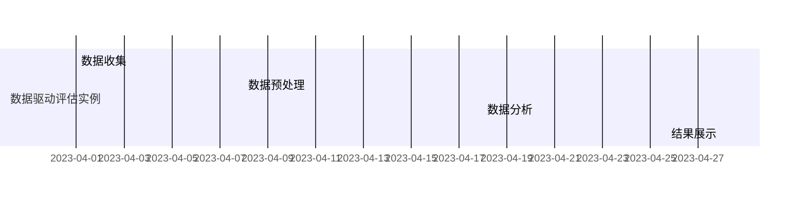
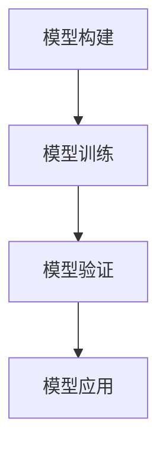
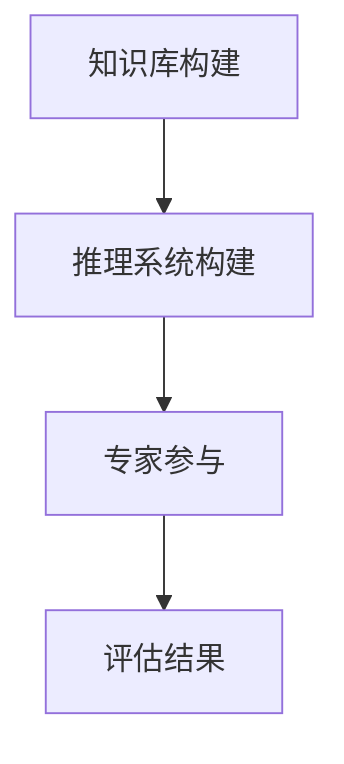

                 

### 引言

**人文导向的技术评估：以人为本的创新影响分析**

在当今快速发展的技术时代，如何确保技术的创新与应用能够真正服务于人类社会的福祉，成为一个至关重要的问题。技术的进步不仅带来了便利和效率的提升，同时也引发了一系列社会、伦理和人文方面的问题。因此，进行技术评估，尤其是人文导向的技术评估，成为了保障技术健康发展的重要手段。

人文导向的技术评估强调以人为中心，关注技术对社会、环境以及人的影响。它不仅仅关注技术的功能和技术指标，更注重技术的应用是否能够促进社会公平、保护环境、提升人的生活质量等方面。这种评估方法为技术决策提供了更加全面和深入的视角，有助于减少技术带来的潜在负面影响，实现技术的可持续发展。

本篇文章将深入探讨人文导向的技术评估，旨在为读者提供一种系统性的方法，以理解和实施这种评估。我们将从以下几个方面展开讨论：

- **问题背景与核心概念**：介绍技术发展对人类社会的影响，阐述技术评估的重要性，定义技术评估的基本概念和原则，分析人文导向的概念及其与传统的区别。
- **技术评估的原理与方法**：详细阐述技术评估的基本原理，包括数据驱动评估、模型驱动评估和知识驱动评估；介绍量化评估方法、定性评估方法和混合评估方法；探讨技术评估的过程、人文导向的特点和伦理问题。
- **人文导向的技术评估框架**：阐述人文导向的概念、原则、流程和方法，通过案例分析展示如何应用这些框架。
- **以人为本的创新影响分析**：定义创新，分类创新，构建以人为本的创新影响分析框架，详细描述分析步骤和方法。

通过这篇文章，我们希望读者能够对人文导向的技术评估有一个全面而深入的理解，从而在技术决策过程中更好地考虑人的因素，实现技术与人文的和谐发展。

---

> **关键词**：人文导向、技术评估、创新影响分析、以人为本、社会福祉

> **摘要**：本文旨在探讨人文导向的技术评估方法，通过定义核心概念、阐述原理与方法、构建评估框架和分析创新影响，提出一种以人为中心的技术评估路径，以促进技术进步与人文发展的和谐共进。

---

### 目录大纲

**人文导向的技术评估：以人为本的创新影响分析**

> 关键词：人文导向、技术评估、创新影响分析、以人为本、社会福祉

> 摘要：本文探讨了人文导向的技术评估方法，旨在通过定义核心概念、阐述原理与方法、构建评估框架和分析创新影响，实现技术与人文的和谐发展。

---

#### 第一部分：引言

- **第1章：问题背景与核心概念**
  - **1.1 问题描述**
    - **1.1.1 技术发展对人类社会的影响**
    - **1.1.2 技术评估的重要性**
  - **1.2 问题解决**
    - **1.2.1 技术评估的定义与作用**
    - **1.2.2 技术评估的基本原则**
  - **1.3 边界与外延**
    - **1.3.1 技术评估的范围**
    - **1.3.2 技术评估的分类**
  - **1.4 核心概念结构**
    - **1.4.1 技术评估的关键概念**
    - **1.4.2 人文导向的概念阐述**
  - **1.5 概念属性特征对比**
    - **1.5.1 传统技术评估与人文导向技术评估的对比**
    - **1.5.2 以人为本的创新影响分析**
  - **1.6 ER实体关系图**
    - **1.6.1 技术评估过程中的主要实体**
    - **1.6.2 实体之间的关系**
  - **1.7 本章小结**

#### 第二部分：技术评估的原理与方法

- **第2章：技术评估的原理**
  - **2.1 技术评估的基本原理**
    - **2.1.1 数据驱动评估**
    - **2.1.2 模型驱动评估**
    - **2.1.3 知识驱动评估**
  - **2.2 技术评估的方法**
    - **2.2.1 量化评估方法**
    - **2.2.2 定性评估方法**
    - **2.2.3 混合评估方法**
  - **2.3 技术评估的过程**
    - **2.3.1 需求分析**
    - **2.3.2 数据收集**
    - **2.3.3 数据处理**
    - **2.3.4 模型选择**
    - **2.3.5 评估结果分析**
    - **2.3.6 评估报告撰写**
  - **2.4 人文导向的技术评估特点**
    - **2.4.1 人文关怀在技术评估中的应用**
    - **2.4.2 人文导向的评估方法与工具**
  - **2.5 技术评估中的伦理问题**
    - **2.5.1 技术评估的伦理原则**
    - **2.5.2 伦理问题案例分析**
  - **2.6 本章小结**

#### 第三部分：人文导向的技术评估框架

- **第3章：人文导向的技术评估框架概述**
  - **3.1 人文导向的概念解读**
    - **3.1.1 人文导向的定义**
    - **3.1.2 人文导向的核心要素**
  - **3.2 人文导向的技术评估原则**
    - **3.2.1 整体性原则**
    - **3.2.2 可持续性原则**
    - **3.2.3 参与性原则**
    - **3.2.4 公平性原则**
  - **3.3 人文导向的技术评估流程**
    - **3.3.1 预评估**
    - **3.3.2 正式评估**
    - **3.3.3 回顾与改进**
  - **3.4 人文导向的技术评估工具与方法**
    - **3.4.1 定量分析方法**
    - **3.4.2 定性分析方法**
    - **3.4.3 混合分析方法**
  - **3.5 人文导向的技术评估案例分析**
    - **3.5.1 案例一：智能交通系统**
    - **3.5.2 案例二：健康管理系统**
    - **3.5.3 案例三：智能教育系统**
  - **3.6 本章小结**

#### 第四部分：以人为本的创新影响分析

- **第4章：以人为本的创新影响分析概述**
  - **4.1 创新的定义与分类**
    - **4.1.1 创新的概念**
    - **4.1.2 创新的分类**
  - **4.2 以人为本的创新影响分析框架**
    - **4.2.1 框架的构建原则**
    - **4.2.2 框架的核心要素**
  - **4.3 以人为本的创新影响分析步骤**
    - **4.3.1 初始阶段：需求分析**
    - **4.3.2 设计阶段：方案评估**
    - **4.3.3 实施阶段：效果监测**
    - **4.3.4 结果阶段：反馈与改进**
  - **4.4 以人为本的创新影响分析方法**
    - **4.4.1 数据分析方法**
    - **4.4.2 定性分析方法**
    - **4.4.3 混合分析方法**
  - **4.5 本章小结**

---

通过这份详尽的目录大纲，读者可以清晰地了解本文的结构和内容分布，为接下来的深入阅读做好准备。每章的内容都涵盖了核心概念、原理方法、案例分析等，确保读者能够全面而系统地掌握人文导向的技术评估及其应用。

---

### 第一部分：引言

在当今世界，技术的快速发展已成为推动社会进步的重要动力。从互联网、人工智能到大数据、物联网，这些技术正深刻地改变着我们的生活方式和工作模式。然而，技术的迅猛发展也带来了许多挑战和问题，尤其是在如何确保技术进步能够真正服务于人类社会的福祉方面。因此，进行技术评估，特别是人文导向的技术评估，显得尤为重要。

#### 技术发展对人类社会的影响

技术的进步无疑带来了许多积极的变化。例如，互联网的普及极大地提高了信息传播的速度和范围，使得全球各地的人们能够更便捷地进行交流与合作。人工智能的应用则使得许多复杂问题得到了有效解决，提升了生产效率和生活质量。大数据和物联网技术也为企业和政府提供了更加精准的数据分析和管理工具，推动了智能决策和智能服务的普及。

然而，技术的进步也引发了一系列社会问题。例如，人工智能的崛起使得一些传统职业面临失业风险，这引起了社会的不稳定。大数据的滥用和隐私泄露问题也日益严重，损害了人们的隐私权。此外，一些技术的应用还可能导致社会不平等和歧视的加剧。例如，智能算法在招聘、贷款等领域的应用，可能会放大现有的社会偏见，导致某些群体受到不公平待遇。

#### 技术评估的重要性

技术评估是确保技术进步能够服务于人类社会福祉的重要手段。通过技术评估，可以识别技术的潜在风险和负面影响，从而在技术决策过程中采取相应的预防和改进措施。技术评估不仅有助于降低技术带来的社会风险，还能提升技术的应用效果和社会价值。

技术评估的主要作用包括：

1. **风险识别**：通过评估技术对环境、社会和人的潜在影响，可以发现潜在的风险和问题，为技术决策提供科学依据。
2. **决策支持**：技术评估可以为政策制定者、企业和其他利益相关者提供客观、全面的技术分析报告，帮助他们做出更加明智的决策。
3. **优化应用**：通过评估技术的应用效果，可以发现存在的问题和改进空间，从而优化技术的应用，提升其社会价值。
4. **可持续发展**：技术评估有助于确保技术的应用符合可持续发展的原则，促进技术与环境的和谐共处。

#### 技术评估的定义与作用

技术评估（Technology Assessment，简称TA）是对技术的社会、经济、环境和文化影响进行系统分析和评价的过程。它旨在通过对技术的全面评估，为决策者提供科学依据，促进技术的健康发展。

技术评估的作用主要体现在以下几个方面：

1. **引导技术创新**：技术评估可以帮助企业和研究机构识别技术发展的方向和重点，从而引导技术创新，提高技术竞争力。
2. **风险防范**：技术评估可以发现技术应用的潜在风险，为政策制定者提供防范措施，减少技术对社会的负面影响。
3. **政策制定**：技术评估可以为政策制定者提供技术发展的现状、趋势和影响分析，帮助他们制定科学合理的政策。
4. **资源配置**：技术评估可以帮助政府和企业在技术投资和资源分配方面做出更加明智的决策，提高资源利用效率。

#### 技术评估的基本原则

为了确保技术评估的科学性和有效性，需要遵循以下基本原则：

1. **全面性**：技术评估应全面考虑技术的社会、经济、环境和文化影响，确保评估结果的全面性和客观性。
2. **科学性**：技术评估应基于科学的方法和工具，确保评估过程和结果的可信度和可靠性。
3. **客观性**：技术评估应保持客观中立的态度，不受利益相关者的影响，确保评估结果的公正性。
4. **透明性**：技术评估的过程和结果应公开透明，便于利益相关者参与和监督，提高评估的透明度和公信力。

#### 边界与外延

技术评估的范围非常广泛，涵盖了技术发展的各个阶段和应用领域。从技术评估的范围来看，可以将其分为以下几个方面：

1. **技术研发阶段**：在技术研发阶段，技术评估主要关注技术的可行性、经济性和社会影响，为技术研发提供指导和支持。
2. **技术应用阶段**：在技术应用阶段，技术评估主要关注技术的实际应用效果、社会影响和风险，为技术应用提供评估和优化建议。
3. **技术评估领域**：技术评估可以应用于各个领域，如信息技术、生物技术、能源技术等，针对不同领域的技术特点，制定相应的评估方法和标准。

#### 核心概念结构

技术评估过程中涉及多个核心概念，包括技术、社会影响、经济影响、环境影响等。这些概念相互关联，构成了技术评估的核心概念结构。

1. **技术**：技术是技术评估的基础，包括技术研发、技术转化和技术应用等环节。技术评估需要全面了解技术的特性、功能和局限性。
2. **社会影响**：社会影响是技术评估的重要方面，包括技术对社会结构、文化价值观念、社会福利等方面的影响。
3. **经济影响**：经济影响是技术评估的重要内容，包括技术对经济增长、就业、资源配置等方面的影响。
4. **环境影响**：环境影响是技术评估的一个关键方面，包括技术对环境质量、资源消耗、生态平衡等方面的影响。

#### 概念属性特征对比

传统技术评估与人文导向技术评估存在明显的区别，主要体现在以下几个方面：

1. **评估目标**：传统技术评估主要关注技术的功能和技术指标，以提升技术性能为主要目标。而人文导向技术评估则更加关注技术对社会、环境以及人的影响，以实现技术与人文的和谐共处为目标。
2. **评估方法**：传统技术评估主要采用量化评估方法，注重数据的收集和分析。而人文导向技术评估则更多地采用定性评估方法和混合评估方法，注重人文关怀和社会价值。
3. **评估过程**：传统技术评估通常是一个单向的、自上而下的过程，主要由技术专家主导。而人文导向技术评估则强调参与性原则，鼓励利益相关者参与评估过程，提高评估的全面性和公正性。
4. **评估结果**：传统技术评估的结果主要关注技术性能的提升，而人文导向技术评估的结果则更加关注技术对社会、环境以及人的影响，包括社会公平、环境可持续性、生活质量等方面。

#### ER实体关系图

技术评估过程中涉及多个实体和它们之间的关系，可以通过ER（Entity-Relationship）图来表示。以下是技术评估过程中主要实体的ER图：

```mermaid
erDiagram
    T Technology
    S Society
    E Environment
    C Company
    P Policy
    G Government
    
    T ||--|{ S }|-- T : 社会影响
    T ||--|{ E }|-- T : 环境影响
    C ..|> T : 公司与技术的关联
    G ..|> T : 政府与技术的关联
    P ..|> T : 政策与技术的关联
```

在这个ER图中，`Technology`（技术）是核心实体，与`Society`（社会）、`Environment`（环境）、`Company`（公司）、`Policy`（政策）和`Government`（政府）等实体之间存在多种关系。这些实体之间的关系反映了技术评估的复杂性和多维性，展示了技术评估过程中不同利益相关者之间的相互作用。

#### 本章小结

本章介绍了技术评估的背景、核心概念、基本原则以及边界与外延。通过分析技术发展对人类社会的影响，阐述了技术评估的重要性。同时，本章还对比了传统技术评估与人文导向技术评估的异同，并展示了技术评估过程中的主要实体和它们之间的关系。这些内容为后续章节的深入探讨奠定了基础。

---

在接下来的章节中，我们将进一步探讨技术评估的原理和方法，详细分析人文导向的技术评估框架以及以人为本的创新影响分析。通过这些内容的介绍，读者将能够更深入地理解如何进行人文导向的技术评估，以及如何通过以人为本的创新影响分析来推动技术与人文的和谐发展。

---

### 问题背景与核心概念

#### 1.1 问题描述

**1.1.1 技术发展对人类社会的影响**

技术的快速发展已经深刻地改变了人类社会的生活方式和生产模式。从互联网到人工智能，从大数据到物联网，这些技术不仅提高了生产效率，也改变了人们的生活方式。例如，互联网的普及使得全球信息交流变得更加便捷，人们可以随时随地进行沟通和获取信息。人工智能的应用则在医疗、教育、金融等多个领域取得了显著成果，提升了行业的智能化水平。

然而，技术的快速发展也带来了一系列社会问题。首先，技术的不平等问题日益突出。随着技术水平的提升，一些地区和国家在技术获取和应用上具有明显优势，而其他地区和国家则可能被边缘化。这种不平等不仅体现在经济上，也体现在社会地位、教育机会和就业机会上。其次，技术对就业市场的影响也引发了广泛关注。人工智能和自动化技术的发展使得一些传统职业面临失业风险，这引发了社会的不稳定和焦虑。

**1.1.2 技术评估的重要性**

技术评估是确保技术发展能够服务于人类社会福祉的重要手段。通过技术评估，可以识别技术的潜在风险和负面影响，从而在技术决策过程中采取相应的预防和改进措施。具体来说，技术评估具有以下几个重要作用：

1. **风险识别**：技术评估可以帮助识别技术的潜在风险，包括对环境、社会和人的潜在影响。通过这些评估，可以提前发现可能产生的问题，从而采取相应的措施进行预防和应对。
2. **决策支持**：技术评估为政策制定者、企业和其他利益相关者提供客观、全面的技术分析报告，帮助他们做出更加明智的决策。这些报告不仅包括技术的技术性能，还涵盖了其对社会、经济和环境的影响。
3. **优化应用**：通过评估技术的应用效果，可以发现存在的问题和改进空间，从而优化技术的应用，提升其社会价值。例如，通过评估发现某个技术在实际应用中的不足，可以对其进行改进，使其更好地服务于社会需求。
4. **可持续发展**：技术评估有助于确保技术的应用符合可持续发展的原则，促进技术与环境的和谐共处。通过评估技术对环境的影响，可以制定相应的环保措施，减少技术对环境的负面影响。

#### 1.2 问题解决

**1.2.1 技术评估的定义与作用**

技术评估（Technology Assessment，简称TA）是对技术的社会、经济、环境和文化影响进行系统分析和评价的过程。它旨在通过对技术的全面评估，为决策者提供科学依据，促进技术的健康发展。

技术评估的具体定义可以表述为：技术评估是一种综合性的研究活动，它通过系统的分析和评估，对技术的社会、经济、环境和文化影响进行全面评价，以期为决策者提供科学依据，促进技术的合理应用和可持续发展。

技术评估的作用主要体现在以下几个方面：

1. **引导技术创新**：技术评估可以帮助企业和研究机构识别技术发展的方向和重点，从而引导技术创新，提高技术竞争力。通过评估技术的前沿性和创新性，可以确定哪些技术具有潜力和价值，从而加大对这些技术的研发投入。
2. **风险防范**：技术评估可以发现技术应用的潜在风险，为政策制定者提供防范措施，减少技术对社会的负面影响。例如，通过对新技术的环境影响进行评估，可以制定相应的环保措施，减少技术对生态系统的破坏。
3. **政策制定**：技术评估可以为政策制定者提供技术发展的现状、趋势和影响分析，帮助他们制定科学合理的政策。政策制定者可以通过技术评估了解不同技术对经济、社会和环境的潜在影响，从而制定出更加有效的政策。
4. **资源配置**：技术评估可以帮助政府和企业在技术投资和资源分配方面做出更加明智的决策，提高资源利用效率。通过评估技术的社会、经济和环境效益，可以确定哪些技术值得投资和推广，从而优化资源配置。

**1.2.2 技术评估的基本原则**

为了确保技术评估的科学性和有效性，需要遵循以下基本原则：

1. **全面性**：技术评估应全面考虑技术的社会、经济、环境和文化影响，确保评估结果的全面性和客观性。不仅要关注技术的技术性能，还要考虑其对社会、经济、环境和文化等多个方面的影响。
2. **科学性**：技术评估应基于科学的方法和工具，确保评估过程和结果的可信度和可靠性。评估方法应具有科学性和可重复性，以便其他研究人员可以验证评估结果。
3. **客观性**：技术评估应保持客观中立的态度，不受利益相关者的影响，确保评估结果的公正性。评估人员应保持独立性和客观性，避免利益冲突和偏见。
4. **透明性**：技术评估的过程和结果应公开透明，便于利益相关者参与和监督，提高评估的透明度和公信力。评估报告应详细记录评估过程、方法和结果，以便其他研究人员和利益相关者进行查阅和参考。

#### 1.3 边界与外延

**1.3.1 技术评估的范围**

技术评估的范围非常广泛，涵盖了技术发展的各个阶段和应用领域。从技术评估的范围来看，可以将其分为以下几个方面：

1. **技术研发阶段**：在技术研发阶段，技术评估主要关注技术的可行性、经济性和社会影响，为技术研发提供指导和支持。评估内容可能包括技术的技术性能、市场前景、社会效益等。
2. **技术应用阶段**：在技术应用阶段，技术评估主要关注技术的实际应用效果、社会影响和风险，为技术应用提供评估和优化建议。评估内容可能包括技术的适用性、可靠性、安全性、环境影响等。
3. **技术评估领域**：技术评估可以应用于各个领域，如信息技术、生物技术、能源技术等，针对不同领域的技术特点，制定相应的评估方法和标准。例如，在信息技术领域，技术评估可能关注技术的安全性、隐私保护和数据保护等方面。

**1.3.2 技术评估的分类**

根据评估的目的和对象，技术评估可以有不同的分类。常见的分类方法包括以下几个方面：

1. **按评估对象分类**：
   - **技术性能评估**：主要评估技术的技术性能和技术指标，如速度、精度、可靠性等。
   - **社会影响评估**：主要评估技术对社会的影响，包括对就业、社会福利、社会结构等的影响。
   - **环境影响评估**：主要评估技术对环境的影响，包括对生态平衡、资源消耗、污染排放等的影响。
   - **经济影响评估**：主要评估技术对经济的影响，包括对经济增长、就业、资源配置等的影响。

2. **按评估方法分类**：
   - **量化评估方法**：主要使用定量分析方法，通过数据收集、统计和分析，对技术的影响进行量化评估。
   - **定性评估方法**：主要使用定性分析方法，通过文献回顾、专家访谈、案例研究等手段，对技术的影响进行定性分析。
   - **混合评估方法**：结合量化评估方法和定性评估方法，对技术的影响进行全面评估。

#### 1.4 核心概念结构

技术评估过程中涉及多个核心概念，包括技术、社会影响、经济影响、环境影响等。这些概念相互关联，构成了技术评估的核心概念结构。

1. **技术**：技术是技术评估的基础，包括技术研发、技术转化和技术应用等环节。技术评估需要全面了解技术的特性、功能和局限性。
2. **社会影响**：社会影响是技术评估的重要方面，包括技术对社会结构、文化价值观念、社会福利等方面的影响。
3. **经济影响**：经济影响是技术评估的重要内容，包括技术对经济增长、就业、资源配置等方面的影响。
4. **环境影响**：环境影响是技术评估的一个关键方面，包括技术对环境质量、资源消耗、生态平衡等方面的影响。

#### 1.5 概念属性特征对比

**1.5.1 传统技术评估与人文导向技术评估的对比**

传统技术评估主要关注技术的技术性能和经济效益，而人文导向技术评估则更加注重技术对社会、环境以及人的影响。以下是两者的主要区别：

1. **评估目标**：
   - **传统技术评估**：以提升技术性能和经济效益为主要目标。
   - **人文导向技术评估**：以实现技术与人文的和谐共处、社会福祉为主要目标。

2. **评估方法**：
   - **传统技术评估**：主要采用量化评估方法，注重数据的收集和分析。
   - **人文导向技术评估**：更多地采用定性评估方法和混合评估方法，注重人文关怀和社会价值。

3. **评估过程**：
   - **传统技术评估**：通常是一个单向的、自上而下的过程，主要由技术专家主导。
   - **人文导向技术评估**：强调参与性原则，鼓励利益相关者参与评估过程，提高评估的全面性和公正性。

4. **评估结果**：
   - **传统技术评估**：主要关注技术性能的提升。
   - **人文导向技术评估**：更加关注技术对社会、环境以及人的影响，包括社会公平、环境可持续性、生活质量等方面。

**1.5.2 以人为本的创新影响分析**

以人为本的创新影响分析是人文导向技术评估的重要组成部分。它强调在技术创新过程中，要充分考虑人的需求、利益和福祉，确保技术创新能够真正服务于人的发展。以下是这一概念的核心要点：

1. **人的需求**：以人为本的创新影响分析首先关注人的需求，包括基本的生活需求、社会需求和精神需求等。通过需求分析，可以确定技术创新的目标和方向，确保创新能够满足人们的需求。

2. **人的利益**：以人为本的创新影响分析要考虑人的利益，包括经济利益、社会利益和文化利益等。通过利益分析，可以评估技术创新对人的利益影响，确保创新能够带来积极的社会效益。

3. **人的福祉**：以人为本的创新影响分析要关注人的福祉，包括身体健康、心理健康和社会福祉等。通过福祉分析，可以评估技术创新对人的生活质量和社会福祉的影响，确保创新能够提升人的福祉。

#### 1.6 ER实体关系图

技术评估过程中涉及多个实体和它们之间的关系，可以通过ER（Entity-Relationship）图来表示。以下是技术评估过程中主要实体的ER图：

```mermaid
erDiagram
    T Technology
    S Society
    E Environment
    C Company
    P Policy
    G Government
    
    T ||--|{ S }|-- T : 社会影响
    T ||--|{ E }|-- T : 环境影响
    C ..|> T : 公司与技术的关联
    G ..|> T : 政府与技术的关联
    P ..|> T : 政策与技术的关联
```

在这个ER图中，`Technology`（技术）是核心实体，与`Society`（社会）、`Environment`（环境）、`Company`（公司）、`Policy`（政策）和`Government`（政府）等实体之间存在多种关系。这些实体之间的关系反映了技术评估的复杂性和多维性，展示了技术评估过程中不同利益相关者之间的相互作用。

#### 1.7 本章小结

本章介绍了技术评估的背景和核心概念，分析了技术发展对人类社会的影响以及技术评估的重要性。通过对比传统技术评估与人文导向技术评估的异同，本章提出了以人为本的创新影响分析的概念。同时，本章还通过ER实体关系图展示了技术评估过程中涉及的主要实体和它们之间的关系。这些内容为后续章节的深入探讨奠定了基础。

---

在接下来的章节中，我们将进一步探讨技术评估的原理和方法，详细分析人文导向的技术评估框架以及以人为本的创新影响分析。通过这些内容的介绍，读者将能够更深入地理解如何进行人文导向的技术评估，以及如何通过以人为本的创新影响分析来推动技术与人文的和谐发展。

---

### 技术评估的原理

技术评估作为一种系统的分析过程，旨在通过对技术的社会、经济、环境和文化等多方面影响进行综合评价，为决策者提供科学依据，以实现技术的可持续发展。技术评估的原理可以概括为数据驱动评估、模型驱动评估和知识驱动评估三种基本方法。以下是对这些方法的具体解释和应用。

#### 2.1 数据驱动评估

**2.1.1 基本原理**

数据驱动评估方法是一种基于数据的评估方式，通过收集和分析大量数据，对技术的性能和影响进行量化评估。这种方法的核心在于利用数据科学和统计分析技术，将复杂的技术系统转化为可量化的指标和模型。

**2.1.2 具体步骤**

1. **数据收集**：首先，需要收集与评估对象相关的各类数据，包括技术性能数据、市场数据、用户反馈数据、环境数据等。这些数据可以通过实地调查、问卷调查、文献回顾等方式获取。

2. **数据预处理**：对收集到的数据进行清洗、整理和标准化，以确保数据的质量和一致性。数据预处理步骤包括缺失值处理、异常值检测和特征工程等。

3. **数据分析**：利用统计分析方法、机器学习模型等工具对预处理后的数据进行深度分析。数据分析的目的是提取关键特征、识别数据模式、预测技术性能等。

4. **结果展示**：将分析结果以图表、报告等形式展示，以便决策者直观地了解技术的影响和性能。

**2.1.3 应用实例**

例如，在评估一款新开发的智能交通系统时，可以通过数据驱动评估方法来分析系统的流量管理效果、交通拥堵减少率、乘客满意度等指标。通过收集交通流量数据、用户反馈数据等，利用统计分析方法进行分析，可以得出系统的实际效果和改进空间。



#### 2.2 模型驱动评估

**2.2.1 基本原理**

模型驱动评估方法是基于数学模型和模拟技术对技术的影响和性能进行评估。这种方法通过构建数学模型，模拟技术在不同场景下的运行情况，从而预测技术的实际效果。

**2.2.2 具体步骤**

1. **模型构建**：首先，需要根据技术特点和应用场景，构建相应的数学模型。模型的构建过程包括确定模型的目标、输入变量和输出变量，选择合适的数学方程和算法。

2. **模型训练**：利用历史数据对模型进行训练，调整模型的参数，使其能够准确预测技术性能。

3. **模型验证**：通过将模型应用于实际数据集，验证模型的准确性和可靠性。验证过程包括模型精度、召回率、F1值等评价指标的计算。

4. **模型应用**：将训练好的模型应用于新场景，预测技术的性能和影响。

**2.2.3 应用实例**

例如，在评估一种新能源电池的性能时，可以构建电池寿命预测模型。通过收集电池的历史数据，建立电池性能和寿命的关系模型。训练模型后，可以预测不同使用条件下电池的寿命，从而评估电池的技术性能和可靠性。



#### 2.3 知识驱动评估

**2.3.1 基本原理**

知识驱动评估方法是基于领域知识和专家经验对技术的影响和性能进行评估。这种方法通过构建知识库和推理系统，利用专家知识对技术进行综合评估。

**2.3.2 具体步骤**

1. **知识库构建**：首先，需要构建与评估对象相关的知识库。知识库应包含领域知识、规则、事实等，为评估提供依据。

2. **推理系统构建**：利用知识库构建推理系统，通过推理规则和算法，对技术的影响和性能进行综合评估。

3. **专家参与**：在评估过程中，邀请领域专家参与，提供经验和见解，提高评估的准确性和可靠性。

**2.3.3 应用实例**

例如，在评估一种新医疗技术时，可以构建医学知识库，包含各种医疗技术和治疗方法的相关知识。通过推理系统，结合专家意见，可以评估新技术的治疗效果、安全性等。



#### 2.4 人文导向的技术评估特点

**2.4.1 人文关怀在技术评估中的应用**

人文导向的技术评估强调以人为本，关注技术对社会、环境以及人的影响。在评估过程中，人文关怀体现在以下几个方面：

1. **社会公平**：评估技术是否有助于减少社会不平等，提升社会福利。
2. **环境保护**：评估技术对环境的负面影响，促进环境保护和可持续发展。
3. **生活质量**：评估技术对人们生活质量的提升，包括健康、教育、文化等方面。

**2.4.2 人文导向的评估方法与工具**

人文导向的技术评估方法包括定性分析方法和定量分析方法。定性分析方法主要依靠专家知识和访谈，获取对技术影响的深入理解。定量分析方法则通过问卷调查、数据分析等手段，量化技术的影响和效果。

常用的评估工具包括：

1. **SWOT分析**：对技术的优势、劣势、机会和威胁进行综合评估。
2. **利益相关者分析**：识别技术的主要利益相关者，评估其对技术的需求和期望。
3. **社会影响评估工具**：如社会影响评估框架（SIA）、环境影响评估工具（EIA）等。

#### 2.5 技术评估中的伦理问题

**2.5.1 技术评估的伦理原则**

在技术评估过程中，伦理问题至关重要。技术评估应遵循以下伦理原则：

1. **公正性**：评估过程应公正无私，不受利益相关者的影响。
2. **透明性**：评估过程和结果应公开透明，便于利益相关者监督。
3. **责任性**：评估人员应承担责任，确保评估结果的准确性和可靠性。
4. **尊重隐私**：在数据收集和处理过程中，应尊重个人隐私和信息安全。

**2.5.2 伦理问题案例分析**

例如，在评估一种新兴的生物技术时，可能面临伦理问题，如基因编辑技术的安全性、道德问题等。评估过程中，需要充分考虑这些伦理问题，确保技术的应用符合伦理规范。

#### 2.6 本章小结

技术评估的原理包括数据驱动评估、模型驱动评估和知识驱动评估三种方法。数据驱动评估注重数据的收集和分析，模型驱动评估依赖数学模型和模拟技术，知识驱动评估则基于领域知识和专家经验。人文导向的技术评估强调以人为本，关注技术的社会、环境和人文影响。在技术评估过程中，伦理问题同样需要重视，确保评估过程和结果的公正性和透明性。这些原理和方法为后续的评估实践提供了理论指导。

---

在下一章中，我们将进一步探讨人文导向的技术评估框架，详细描述其核心原则、流程和方法，并通过案例分析展示如何在实际应用中实施这些框架。

---

### 第三部分：人文导向的技术评估框架

#### 3.1 人文导向的概念解读

**3.1.1 人文导向的定义**

人文导向（Human-Centered Approach）是一种以人为中心的设计和评估方法，强调在技术评估过程中充分考虑人的需求、利益和福祉。人文导向不仅关注技术的功能和技术指标，还关注技术对人的社会、心理和文化等方面的影响。这种评估方法旨在实现技术与人文的和谐共处，提升技术的社会价值和人文关怀。

**3.1.2 人文导向的核心要素**

人文导向的技术评估包含以下核心要素：

1. **以人为本**：评估过程中始终以人的需求和福祉为中心，关注技术的实际应用是否能够提升人们的生活质量和社会福祉。
2. **参与性**：鼓励利益相关者，包括用户、专家和决策者等，积极参与评估过程，确保评估结果的全面性和公正性。
3. **多样性**：考虑到不同人群、不同文化和社会背景的需求和差异，评估过程中应保持多样性，避免偏见和歧视。
4. **可持续性**：评估技术对环境和社会的长期影响，确保技术能够实现可持续发展目标。
5. **伦理原则**：在评估过程中，遵循伦理原则，尊重人的隐私权和信息安全，避免技术滥用和不当应用。

#### 3.2 人文导向的技术评估原则

**3.2.1 整体性原则**

人文导向的技术评估强调整体性，即综合考虑技术的各个方面，包括技术本身、技术应用的场景、技术对环境和社会的影响等。整体性原则要求评估过程中不仅要关注技术的功能和技术指标，还要考虑其社会、经济和环境等多方面的因素。

**3.2.2 可持续性原则**

可持续性原则要求在技术评估过程中考虑技术的长期影响，确保技术能够实现环境和社会的可持续发展。这包括评估技术的资源消耗、环境影响、社会效益等方面，以便制定出符合可持续发展目标的决策。

**3.2.3 参与性原则**

参与性原则强调在技术评估过程中鼓励利益相关者的参与，包括用户、专家、决策者等。通过参与性评估，可以收集到更多的意见和建议，提高评估结果的全面性和公正性。参与性原则还要求评估过程透明，便于利益相关者监督和反馈。

**3.2.4 公平性原则**

公平性原则要求技术评估过程中应确保评估结果的公正性和公平性，避免偏见和歧视。公平性原则要求在评估过程中，要考虑到不同人群、不同文化和社会背景的需求和差异，确保所有人都能公平地受益于技术进步。

#### 3.3 人文导向的技术评估流程

**3.3.1 预评估**

预评估是人文导向技术评估的第一步，旨在确定评估的目标、范围和方法。预评估过程通常包括以下几个阶段：

1. **需求分析**：明确评估的目标和需求，确定评估的重点和关键问题。
2. **利益相关者分析**：识别评估过程中的利益相关者，包括用户、专家、决策者等，确保他们的需求和期望得到充分考虑。
3. **初步评估**：对技术进行初步评估，了解其基本性能和社会影响，为正式评估做准备。

**3.3.2 正式评估**

正式评估是人文导向技术评估的核心阶段，通过对技术进行全面、深入的分析和评估，得出评估结果。正式评估通常包括以下几个步骤：

1. **数据收集**：收集与评估对象相关的各类数据，包括技术性能数据、用户反馈数据、环境数据等。
2. **数据分析**：利用数据驱动评估、模型驱动评估和知识驱动评估等方法，对收集到的数据进行分析和评估。
3. **结果分析**：对评估结果进行综合分析，识别技术的优势、劣势、机会和威胁，评估其对社会、经济和环境的影响。

**3.3.3 回顾与改进**

回顾与改进是人文导向技术评估的最后一步，旨在对评估过程和结果进行总结和反思，发现存在的问题和改进空间。回顾与改进通常包括以下几个步骤：

1. **评估总结**：对整个评估过程和结果进行总结，识别成功经验和不足之处。
2. **反馈与建议**：将评估结果和反馈意见反馈给利益相关者，提出改进建议和优化方案。
3. **持续改进**：根据反馈意见和改进建议，对技术进行优化和改进，确保其能够更好地服务于社会和用户。

#### 3.4 人文导向的技术评估工具与方法

**3.4.1 定量分析方法**

定量分析方法是一种基于数据的评估方法，通过收集和分析定量数据，对技术的影响和性能进行量化评估。常用的定量分析方法包括统计分析、回归分析、时间序列分析等。定量分析方法可以帮助评估人员识别技术的影响趋势和关键因素，提供客观、可靠的评估结果。

**3.4.2 定性分析方法**

定性分析方法是一种基于专家知识和经验的评估方法，通过文献回顾、专家访谈、案例研究等手段，对技术的影响和性能进行定性分析。定性分析方法可以帮助评估人员深入理解技术的实际应用场景和影响因素，提供更加全面和深入的评估结果。

**3.4.3 混合分析方法**

混合分析方法是将定量分析方法和定性分析方法相结合的评估方法，旨在综合两者的优点，提高评估的准确性和全面性。混合分析方法通常包括以下几个步骤：

1. **数据收集**：同时收集定量数据和定性数据，确保评估结果的全面性。
2. **数据预处理**：对收集到的数据进行清洗、整理和标准化，确保数据的质量和一致性。
3. **数据分析**：分别使用定量分析方法和定性分析方法对预处理后的数据进行评估，综合分析结果。
4. **结果展示**：将分析结果以图表、报告等形式展示，便于决策者理解和应用。

#### 3.5 人文导向的技术评估案例分析

**3.5.1 案例一：智能交通系统**

智能交通系统是一种利用信息技术、传感器和控制技术实现交通管理和优化系统。在评估智能交通系统时，可以采用人文导向的技术评估框架，从以下几个方面进行分析：

1. **需求分析**：确定智能交通系统的目标和需求，包括提升交通效率、减少交通拥堵、提高交通安全等。
2. **利益相关者分析**：识别系统的利益相关者，包括政府、交通管理部门、交通运营商和乘客等。
3. **数据收集**：收集交通流量数据、用户反馈数据、环境数据等，为评估提供数据支持。
4. **数据分析**：通过定量分析方法和定性分析方法，评估智能交通系统的性能和影响。
5. **结果分析**：分析评估结果，识别系统的优势、劣势、机会和威胁，提出改进建议。

**3.5.2 案例二：健康管理系统**

健康管理系统的目标是提升人们的健康水平和生活质量。在评估健康管理系统的过程中，可以采用人文导向的技术评估框架，从以下几个方面进行分析：

1. **需求分析**：确定健康管理系统的目标和需求，包括提供健康咨询、疾病预防、健康监测等。
2. **利益相关者分析**：识别系统的利益相关者，包括医疗机构、患者、健康管理人员等。
3. **数据收集**：收集与健康相关的数据，包括医疗数据、健康记录、用户反馈等。
4. **数据分析**：通过定量分析方法和定性分析方法，评估健康管理系统对用户健康的影响。
5. **结果分析**：分析评估结果，识别系统的优势和不足，提出改进建议。

**3.5.3 案例三：智能教育系统**

智能教育系统是一种利用信息技术实现个性化教育和学习管理系统。在评估智能教育系统时，可以采用人文导向的技术评估框架，从以下几个方面进行分析：

1. **需求分析**：确定智能教育系统的目标和需求，包括提供个性化学习资源、提高学习效果、促进师生互动等。
2. **利益相关者分析**：识别系统的利益相关者，包括学生、教师、学校管理人员等。
3. **数据收集**：收集教育数据、用户反馈数据、学习效果数据等，为评估提供数据支持。
4. **数据分析**：通过定量分析方法和定性分析方法，评估智能教育系统对学生学习的影响。
5. **结果分析**：分析评估结果，识别系统的优势和不足，提出改进建议。

#### 3.6 本章小结

人文导向的技术评估框架强调以人为本，关注技术对社会、环境和人的影响。通过定义人文导向的概念、阐述评估原则和流程，以及介绍定量分析方法和定性分析方法，本章提供了系统性的方法来实施人文导向的技术评估。通过案例分析，展示了如何在实际应用中应用这些框架和方法。这些内容为后续章节的深入探讨和实际应用提供了理论基础和实践指导。

---

在下一章中，我们将继续探讨以人为本的创新影响分析，定义创新的分类，构建以人为本的创新影响分析框架，并详细描述分析步骤和方法。

---

### 第四部分：以人为本的创新影响分析

#### 4.1 创新的定义与分类

**4.1.1 创新的概念**

创新（Innovation）是推动社会进步和经济发展的重要动力。它通常被定义为通过引入新的想法、方法、产品、服务或过程，实现技术、经济和社会等方面的变革。创新不仅涉及技术的突破，还包括商业模式、管理方法、组织结构等方面的革新。

创新具有以下几个基本特征：

1. **新颖性**：创新往往具有独特性和原创性，与现有的技术和方法不同。
2. **价值性**：创新能够带来明显的价值提升，包括经济效益、社会效益和环境效益等。
3. **风险性**：创新过程具有不确定性，可能面临技术风险、市场风险和社会风险等。
4. **可持续性**：创新应具备可持续性，即能够在长期内持续推动技术进步和社会发展。

**4.1.2 创新的分类**

创新可以根据不同的分类标准进行分类，常见的分类方法包括：

1. **按创新主体分类**：
   - **企业创新**：企业通过研发新技术、新产品或新服务，提升市场竞争力和盈利能力。
   - **政府创新**：政府通过政策改革、公共服务创新等方式，推动社会进步和经济发展。
   - **社会创新**：社会组织、非政府组织和志愿者等通过社会服务和社区活动，解决社会问题。

2. **按创新领域分类**：
   - **技术领域创新**：涉及新技术的研发、应用和推广，如信息技术、生物技术、新能源技术等。
   - **商业模式创新**：通过改变商业模式、服务模式，实现新的价值创造和利润增长，如电子商务、共享经济等。
   - **管理创新**：涉及管理理念、管理工具和管理方法的革新，如敏捷管理、精益管理、项目管理等。

3. **按创新程度分类**：
   - **渐进性创新**：在现有技术和方法的基础上，进行逐步改进和优化，如产品升级、服务改进等。
   - **颠覆性创新**：引入全新的技术和方法，颠覆现有市场格局，如互联网革命、人工智能等。

#### 4.2 以人为本的创新影响分析框架

**4.2.1 框架的构建原则**

以人为本的创新影响分析框架旨在通过系统的分析，评估创新对人的需求、利益和福祉的影响，确保创新能够真正服务于人的发展。框架的构建原则包括：

1. **人的需求**：以人的需求为核心，识别创新的目标和方向，确保创新能够满足人的基本需求，提升生活质量。
2. **多样性**：考虑到不同人群、不同文化和社会背景的需求和差异，确保创新的包容性和公平性。
3. **可持续性**：评估创新对环境和社会的长期影响，确保创新能够实现可持续发展目标。
4. **伦理原则**：遵循伦理原则，尊重人的隐私权和信息安全，避免技术滥用和不当应用。

**4.2.2 框架的核心要素**

以人为本的创新影响分析框架包括以下几个核心要素：

1. **需求分析**：通过对人的需求进行深入分析，确定创新的目标和需求，识别创新的关键领域和方向。
2. **影响评估**：对创新的影响进行全面评估，包括技术影响、经济影响、社会影响和环境影响等。
3. **利益相关者分析**：识别创新过程中的利益相关者，包括用户、专家、决策者等，确保他们的需求和期望得到充分考虑。
4. **风险评估**：评估创新过程中可能面临的风险，包括技术风险、市场风险和社会风险等，制定相应的风险管理和防范措施。
5. **效果监测**：对创新的实际效果进行监测和评估，收集用户反馈和数据，持续改进创新方案。

#### 4.3 以人为本的创新影响分析步骤

**4.3.1 初始阶段：需求分析**

在初始阶段，需求分析的目的是识别创新的目标和需求。具体步骤包括：

1. **用户调研**：通过问卷调查、访谈等方式，收集用户的需求和期望，了解用户对现有问题的看法和解决方案的需求。
2. **市场分析**：分析市场趋势和竞争情况，了解目标市场的需求和发展潜力。
3. **技术分析**：评估现有技术的局限性和技术发展方向，确定创新的技术需求和可行性。

**4.3.2 设计阶段：方案评估**

在设计阶段，方案评估的目的是评估不同创新方案的优势和不足，选择最佳方案。具体步骤包括：

1. **方案设计**：根据需求分析的结果，设计不同的创新方案，包括技术方案、商业模式、管理方案等。
2. **方案评估**：通过定量分析和定性分析，评估不同方案的性能、成本、效益等，选择最佳方案。
3. **利益相关者反馈**：邀请利益相关者对方案进行评价和反馈，确保方案的可行性和社会接受度。

**4.3.3 实施阶段：效果监测**

在实施阶段，效果监测的目的是监测创新的实际效果，收集用户反馈和数据，持续改进创新方案。具体步骤包括：

1. **效果评估**：通过定期的效果评估，监控创新的应用效果，包括技术性能、用户满意度、经济效益等。
2. **数据收集**：收集与创新相关的数据，包括用户行为数据、市场数据、财务数据等，为效果评估提供数据支持。
3. **反馈与改进**：根据效果评估的结果，收集用户反馈，发现存在的问题和改进空间，持续优化创新方案。

**4.3.4 结果阶段：反馈与改进**

在结果阶段，反馈与改进的目的是对创新的全过程进行总结和反思，识别成功经验和不足之处，为后续的创新活动提供参考。具体步骤包括：

1. **评估总结**：对整个创新过程和结果进行总结，识别成功经验和不足之处，总结创新过程中的关键要素和最佳实践。
2. **反馈与建议**：将评估结果和反馈建议反馈给利益相关者，提出改进建议和优化方案。
3. **持续改进**：根据反馈建议和评估结果，对创新方案进行优化和改进，确保其能够更好地服务于社会和用户。

#### 4.4 以人为本的创新影响分析方法

**4.4.1 数据分析方法**

数据分析方法是一种基于数据的创新影响分析方法，通过收集和分析大量的数据，评估创新的影响和效果。数据分析方法包括以下几种：

1. **定量分析方法**：通过统计分析、回归分析等方法，对数据进行定量分析，识别数据之间的关系和模式。定量分析方法可以提供客观、可靠的数据支持，帮助评估创新的效果。
2. **定性分析方法**：通过文献回顾、案例研究、专家访谈等方法，对创新的影响进行定性分析，深入了解创新的应用场景和实际效果。定性分析方法可以提供更加详细和深入的信息，帮助评估创新的社会影响。

**4.4.2 定性分析方法**

定性分析方法是一种基于经验和主观判断的创新影响分析方法，通过深入分析和评估创新的应用效果和社会影响。定性分析方法包括以下几种：

1. **文献回顾**：通过查阅相关文献，了解创新的理论基础、应用情况和研究成果，为评估提供参考。
2. **案例研究**：通过对具体案例的深入分析和研究，评估创新的应用效果和社会影响，提供实际经验和教训。
3. **专家访谈**：邀请领域专家和利益相关者进行访谈，收集他们对创新的看法和意见，为评估提供多角度的参考。

**4.4.3 混合分析方法**

混合分析方法是将定量分析方法和定性分析方法相结合的创新影响分析方法，旨在综合两者的优点，提高评估的准确性和全面性。混合分析方法包括以下步骤：

1. **数据收集**：同时收集定量数据和定性数据，确保评估结果的全面性。
2. **数据预处理**：对收集到的数据进行清洗、整理和标准化，确保数据的质量和一致性。
3. **数据分析**：分别使用定量分析方法和定性分析方法对预处理后的数据进行评估，综合分析结果。
4. **结果展示**：将分析结果以图表、报告等形式展示，便于决策者理解和应用。

#### 4.5 本章小结

以人为本的创新影响分析是一种以人为中心的分析方法，旨在通过系统的分析和评估，评估创新对人的需求、利益和福祉的影响。本章首先定义了创新的概念，分类了创新的类型，构建了以人为本的创新影响分析框架，并详细描述了分析步骤和方法。通过这一框架和方法，可以更全面、深入地评估创新的影响，确保创新能够真正服务于人的发展和社会的进步。

---

在下一章中，我们将深入探讨技术评估中的伦理问题，包括伦理原则、具体案例以及如何在实际评估中处理这些伦理问题。

---

### 技术评估中的伦理问题

技术评估是一个涉及多方利益、复杂多样的过程，其决策和结果往往对个人、社会和环境产生深远影响。因此，伦理问题在技术评估中尤为重要。技术评估中的伦理问题主要包括以下几个方面：

#### 2.5.1 技术评估的伦理原则

在进行技术评估时，需要遵循一系列伦理原则，以确保评估过程的公正性、透明性和责任感。以下是几个核心的伦理原则：

1. **公正性**：评估过程应保持公正无私，确保所有利益相关者的权益得到公平对待。这意味着评估人员应避免利益冲突，确保评估结果不受任何不正当影响。

2. **透明性**：评估过程和结果应公开透明，便于利益相关者监督和参与。透明性有助于提高评估的公信力，减少误解和争议。

3. **责任感**：评估人员应对评估过程和结果承担个人和集体责任，确保评估结果准确可靠。责任感要求评估人员具备专业知识和道德素养，以提供高质量的评估服务。

4. **尊重隐私**：在收集和处理个人信息时，应尊重个人隐私权和数据保护。评估人员应采取适当的措施，确保个人数据的安全和保密。

5. **环境责任**：技术评估应考虑技术对环境的影响，促进可持续发展。评估人员应倡导环保理念，推动技术评估与环境保护相结合。

#### 2.5.2 伦理问题案例分析

以下是一些技术评估中常见的伦理问题及其案例分析：

**案例一：基因编辑技术的伦理争议**

基因编辑技术，如CRISPR-Cas9，具有巨大的科学潜力和应用前景，但同时也引发了广泛的伦理争议。这些争议主要集中在以下几个方面：

1. **基因编辑的安全性问题**：基因编辑技术的不确定性使得人们担忧可能引发未知的健康风险，如遗传变异和基因突变。

2. **道德问题**：基因编辑可能导致“设计婴儿”和“基因改良”等现象，引发关于人类基本权利和道德底线的争议。

3. **公平性问题**：基因编辑技术可能加剧社会不平等，使得富裕家庭能够通过基因编辑改善后代健康，而贫困家庭则无法享受这一技术。

在评估基因编辑技术时，评估人员应充分考虑这些伦理问题，确保评估报告不仅关注技术的科学价值，也关注其社会、伦理和道德影响。评估人员可以采用多学科合作的方法，邀请伦理学家、法律专家和社会学家参与评估过程，提供多元化的视角和建议。

**案例二：大数据隐私泄露问题**

随着大数据技术的广泛应用，个人隐私保护问题日益突出。一些企业和机构通过收集和分析用户数据，可能面临隐私泄露的伦理风险。这些风险包括：

1. **数据滥用**：企业可能滥用用户数据，进行不当的商业行为或广告推送。

2. **数据泄露**：由于网络安全漏洞或管理不善，用户数据可能被未经授权的第三方获取和滥用。

在评估大数据技术时，评估人员应关注数据隐私问题，评估技术对用户隐私的潜在威胁。评估人员可以采用以下措施：

- **数据匿名化**：在数据分析过程中，对用户数据进行匿名化处理，减少隐私泄露风险。
- **数据安全审计**：定期进行数据安全审计，确保数据存储和传输过程的安全。
- **用户知情权**：确保用户了解其数据的使用目的和范围，赋予用户对数据的访问权和控制权。

**案例三：人工智能伦理问题**

人工智能（AI）技术的快速发展带来了许多机遇，但也引发了一系列伦理问题，如算法偏见、自动化失业等。以下是一些具体的伦理问题：

1. **算法偏见**：AI算法可能在训练数据中继承和放大偏见，导致不公平的决策和歧视现象。

2. **自动化失业**：自动化和机器人技术的发展可能导致大量传统职业的失业，引发社会经济问题。

在评估人工智能技术时，评估人员应重点关注这些伦理问题，确保评估报告不仅关注技术的技术性能和经济效益，也关注其社会影响和伦理道德。评估人员可以采用以下措施：

- **算法透明度**：确保AI算法的透明性，便于用户理解和监督。
- **伦理审查**：在AI应用前进行伦理审查，评估算法的公平性、可靠性和道德性。
- **就业转型支持**：为受自动化影响的劳动者提供就业转型支持，减少社会经济冲击。

#### 2.5.3 技术评估中的伦理问题处理

在实际的技术评估中，处理伦理问题需要综合运用多种方法和策略。以下是一些具体的处理措施：

1. **建立伦理委员会**：设立专门的伦理委员会，负责监督和评估技术评估过程中的伦理问题，确保评估过程符合伦理规范。

2. **利益相关者参与**：鼓励利益相关者，包括用户、专家、决策者等，积极参与技术评估，提供多元化的视角和建议，提高评估的公正性和透明性。

3. **定期伦理培训**：为评估人员提供定期的伦理培训，提高其伦理意识和专业素养，确保他们在评估过程中能够妥善处理伦理问题。

4. **伦理风险评估**：在评估过程中，定期进行伦理风险评估，识别潜在的伦理问题，制定相应的风险管理策略。

5. **透明报告**：评估报告应详细记录评估过程、方法和结果，包括对伦理问题的识别、分析和处理，确保报告的透明性和公信力。

6. **伦理决策支持**：利用伦理决策支持工具，如伦理框架、伦理指南等，帮助评估人员在复杂情境下做出符合伦理规范的决策。

通过这些措施，可以在技术评估过程中有效处理伦理问题，确保技术评估的公正性、透明性和责任感，从而推动技术的健康发展和应用。

#### 2.6 本章小结

技术评估中的伦理问题至关重要，影响评估过程的公正性、透明性和责任感。本章介绍了技术评估中的伦理原则，包括公正性、透明性、责任感、尊重隐私和环境责任。通过案例分析，展示了基因编辑技术、大数据隐私泄露和人工智能伦理问题等具体案例，并提出了处理这些伦理问题的方法和策略。这些内容为技术评估实践提供了重要的伦理指导，有助于推动技术与人文的和谐发展。

---

在下一章中，我们将进一步探讨技术评估中的实践经验，分析技术评估案例，介绍评估实践中的技巧和工具，帮助读者更好地理解和应用技术评估方法。

---

### 第五部分：技术评估实践

#### 5.1 技术评估案例研究

**5.1.1 案例一：智能医疗系统的技术评估**

智能医疗系统是一个集成多种先进技术的复杂系统，包括电子健康记录、远程医疗、人工智能诊断等。在技术评估中，主要从以下几个方面进行分析：

1. **需求分析**：通过问卷调查、用户访谈等方式，收集医护人员和患者的需求，确定智能医疗系统的关键功能和性能指标。

2. **技术性能评估**：评估智能医疗系统的技术性能，包括数据传输速度、系统稳定性、用户界面友好性等。通过实验室测试和现场测试，验证系统的技术指标是否满足需求。

3. **经济评估**：评估智能医疗系统的成本效益，包括建设成本、运营成本和预期收益等。通过成本效益分析（CBA），评估系统在经济上的可行性。

4. **社会影响评估**：评估智能医疗系统对社会的影响，包括患者满意度、医疗质量提升、医疗资源优化等。通过问卷调查和实地调查，收集用户的反馈和意见。

5. **环境影响评估**：评估智能医疗系统对环境的影响，包括能源消耗、电子垃圾处理等。通过生命周期评估（LCA），评估系统的环境影响。

**5.1.2 案例二：智能交通系统的技术评估**

智能交通系统是利用信息技术、传感器和控制技术实现交通管理和优化的系统。在技术评估中，主要从以下几个方面进行分析：

1. **需求分析**：通过用户调研和交通管理部门的反馈，确定智能交通系统的目标和需求，包括交通流量管理、交通信号控制、交通信息服务等。

2. **技术性能评估**：评估智能交通系统的技术性能，包括交通流量监测精度、信号控制响应速度、系统稳定性等。通过模拟测试和现场测试，验证系统的技术指标是否满足需求。

3. **经济评估**：评估智能交通系统的成本效益，包括建设成本、维护成本和预期收益等。通过成本效益分析（CBA），评估系统的经济可行性。

4. **社会影响评估**：评估智能交通系统对社会的影响，包括交通拥堵减少率、事故率降低、公共交通效率提升等。通过问卷调查和实地调查，收集用户的反馈和意见。

5. **环境影响评估**：评估智能交通系统对环境的影响，包括减少尾气排放、降低噪音污染等。通过生命周期评估（LCA），评估系统的环境影响。

**5.1.3 案例三：区块链技术的技术评估**

区块链技术是一种分布式数据库技术，具有去中心化、安全性和透明性等特点。在技术评估中，主要从以下几个方面进行分析：

1. **技术性能评估**：评估区块链技术的性能，包括数据传输速度、数据处理能力、系统稳定性等。通过模拟测试和实际应用，验证技术的性能指标。

2. **经济评估**：评估区块链技术的成本效益，包括开发成本、维护成本和预期收益等。通过成本效益分析（CBA），评估技术的经济可行性。

3. **社会影响评估**：评估区块链技术对社会的影响，包括促进数据共享、提高透明度、降低中介成本等。通过案例研究和用户反馈，评估技术的社会价值。

4. **环境影响评估**：评估区块链技术对环境的影响，包括能源消耗、电子垃圾处理等。通过生命周期评估（LCA），评估技术对环境的影响。

#### 5.2 技术评估实践技巧与工具

**5.2.1 需求分析技巧**

1. **用户调研**：通过问卷调查、访谈、观察等方式，收集用户的需求和期望。问卷调查应设计合理，确保问题的覆盖面和有效性。

2. **利益相关者分析**：识别项目涉及的各类利益相关者，包括用户、供应商、政府机构等，确保他们的需求和期望得到充分考虑。

3. **需求优先级排序**：对收集到的需求进行优先级排序，确定关键需求和次要需求，以便在资源有限的情况下，优先满足关键需求。

**5.2.2 技术评估工具**

1. **SWOT分析**：用于分析技术的优势、劣势、机会和威胁，帮助评估技术的前景和潜在风险。

2. **利益相关者分析矩阵**：用于识别和评估不同利益相关者的权力、利益和对项目的潜在影响。

3. **成本效益分析（CBA）**：用于评估技术的经济可行性，通过计算成本和收益的对比，确定项目的经济收益。

4. **生命周期评估（LCA）**：用于评估技术对环境的长期影响，通过计算技术的全生命周期成本和环境影响，确定技术的可持续性。

5. **数据驱动评估方法**：包括统计分析、机器学习、数据可视化等，用于对大量数据进行处理和分析，得出客观、准确的评估结果。

6. **模型驱动评估方法**：包括模拟、仿真、优化等，用于通过构建数学模型，评估技术在不同场景下的性能和影响。

**5.2.3 定性评估方法**

1. **案例研究**：通过对具体案例的深入分析和研究，评估技术的实际应用效果和社会影响。

2. **文献回顾**：通过查阅相关文献，了解技术的理论基础、应用情况和研究成果，为评估提供参考。

3. **专家访谈**：邀请领域专家和利益相关者进行访谈，收集他们对技术的看法和意见，为评估提供多角度的参考。

**5.2.4 混合评估方法**

1. **数据收集**：同时收集定量数据和定性数据，确保评估结果的全面性。

2. **数据预处理**：对收集到的数据进行清洗、整理和标准化，确保数据的质量和一致性。

3. **数据分析**：分别使用定量分析方法和定性分析方法对预处理后的数据进行评估，综合分析结果。

4. **结果展示**：将分析结果以图表、报告等形式展示，便于决策者理解和应用。

#### 5.3 技术评估实践案例分析

**5.3.1 案例一：智能医疗系统的实施与评估**

某地区医院引入了一套智能医疗系统，包括电子健康记录、远程医疗和人工智能诊断等功能。在实施过程中，进行了以下评估：

1. **需求分析**：通过问卷调查和用户访谈，收集医护人员和患者的需求，确定系统的关键功能和性能指标。

2. **技术性能评估**：通过实验室测试和现场测试，验证系统的技术指标是否满足需求，包括数据传输速度、系统稳定性、用户界面友好性等。

3. **经济评估**：通过成本效益分析（CBA），评估系统的建设成本、运营成本和预期收益，确定系统的经济可行性。

4. **社会影响评估**：通过问卷调查和实地调查，评估系统对患者满意度、医疗质量提升、医疗资源优化等方面的影响。

5. **环境影响评估**：通过生命周期评估（LCA），评估系统对环境的影响，包括能源消耗、电子垃圾处理等。

通过全面的评估，智能医疗系统在提高医疗服务质量和效率方面取得了显著成效，同时也识别出一些改进空间，如系统稳定性提升和用户培训加强。

**5.3.2 案例二：智能交通系统的实施与评估**

某城市引入了一套智能交通系统，包括交通流量监测、信号控制和交通信息服务等。在实施过程中，进行了以下评估：

1. **需求分析**：通过用户调研和交通管理部门的反馈，确定智能交通系统的目标和需求，包括交通流量管理、交通信号控制、交通信息服务等。

2. **技术性能评估**：通过模拟测试和现场测试，验证系统的技术性能，包括交通流量监测精度、信号控制响应速度、系统稳定性等。

3. **经济评估**：通过成本效益分析（CBA），评估系统的建设成本、维护成本和预期收益，确定系统的经济可行性。

4. **社会影响评估**：通过问卷调查和实地调查，评估系统对交通拥堵减少率、事故率降低、公共交通效率提升等方面的影响。

5. **环境影响评估**：通过生命周期评估（LCA），评估系统对环境的影响，包括减少尾气排放、降低噪音污染等。

通过评估，智能交通系统在提高交通效率和减少环境污染方面取得了显著成果，同时也发现了一些改进空间，如系统与现有交通基础设施的兼容性和用户接受度提升。

**5.3.3 案例三：区块链技术的应用与评估**

某公司引入了区块链技术，用于供应链管理和数据存储。在应用过程中，进行了以下评估：

1. **技术性能评估**：通过模拟测试和实际应用，验证区块链技术的性能指标，包括数据传输速度、数据处理能力、系统稳定性等。

2. **经济评估**：通过成本效益分析（CBA），评估区块链技术的开发成本、维护成本和预期收益，确定技术的经济可行性。

3. **社会影响评估**：通过案例研究和用户反馈，评估区块链技术在促进数据共享、提高透明度、降低中介成本等方面的影响。

4. **环境影响评估**：通过生命周期评估（LCA），评估区块链技术对环境的影响，包括能源消耗、电子垃圾处理等。

通过评估，区块链技术在供应链管理和数据存储方面取得了显著成效，同时识别出一些改进空间，如技术扩展性和安全性提升。

#### 5.4 技术评估实践技巧与工具的应用

**5.4.1 技术性能评估**

1. **测试环境准备**：准备与实际应用场景相似的测试环境，确保测试结果具有实际参考价值。

2. **性能指标确定**：根据需求分析结果，确定系统的关键性能指标，如响应时间、吞吐量、系统稳定性等。

3. **测试用例设计**：设计合理的测试用例，覆盖系统的各个功能和性能场景。

4. **性能测试执行**：执行性能测试，收集性能数据，分析性能瓶颈和优化空间。

**5.4.2 经济评估**

1. **成本计算**：详细计算项目的建设成本、运营成本和预期收益。

2. **收益预测**：根据市场需求和项目效益，预测项目的长期收益。

3. **敏感性分析**：分析项目成本和收益的敏感性，评估不同假设条件下的项目经济可行性。

**5.4.3 社会影响评估**

1. **用户调研**：通过问卷调查、访谈等方式，收集用户的反馈和意见。

2. **实地调查**：实地考察项目的实际应用场景，了解项目对社会的实际影响。

3. **专家咨询**：邀请领域专家提供专业意见和建议，评估项目的社会价值。

**5.4.4 环境影响评估**

1. **生命周期评估**：计算项目全生命周期的能源消耗、资源消耗和环境影响。

2. **环境影响指标确定**：根据评估目标，确定关键的环境影响指标，如二氧化碳排放量、水资源消耗等。

3. **环境影响分析**：分析项目的环境影响，提出减少环境影响的具体措施。

#### 5.5 本章小结

技术评估实践是一个复杂而重要的过程，涉及多个方面，包括需求分析、技术性能评估、经济评估、社会影响评估和环境影响评估等。通过案例分析，读者可以了解到不同类型的技术评估实践的具体方法和步骤。本章还介绍了技术评估实践中的技巧和工具，帮助读者更好地理解和应用技术评估方法。这些实践经验对于技术评估的实际操作具有重要意义。

---

在下一章中，我们将总结全文，对人文导向的技术评估进行结论性的讨论，并提出未来研究方向和改进建议。

---

### 第六部分：总结与展望

#### 6.1 全文总结

本文围绕“人文导向的技术评估：以人为本的创新影响分析”这一主题，系统性地探讨了技术评估的核心概念、原理、方法及其在实际应用中的实践经验。通过深入分析，本文得出以下主要结论：

1. **技术评估的重要性**：技术评估作为一种系统性的分析和评价过程，对确保技术进步服务于人类社会福祉具有重要意义。通过技术评估，可以识别技术的潜在风险和负面影响，为决策者提供科学依据，优化技术应用，促进可持续发展。

2. **人文导向技术评估的必要性**：人文导向的技术评估强调以人为中心，关注技术对社会、环境以及人的影响。这种评估方法不仅关注技术的功能和技术指标，还关注其对社会公平、环境保护和人的生活质量等方面的提升，有助于实现技术与人文的和谐共处。

3. **技术评估方法的多样化**：本文介绍了数据驱动评估、模型驱动评估和知识驱动评估等多种技术评估方法，每种方法都有其独特的应用场景和优势。结合定量分析和定性分析方法，可以更全面、深入地评估技术的影响。

4. **伦理问题在技术评估中的重要性**：技术评估过程中不可避免地会涉及伦理问题，如隐私保护、数据安全和算法偏见等。因此，遵循伦理原则，尊重人的权益和隐私，是确保技术评估公正性和责任感的必要条件。

5. **技术评估实践的价值**：通过案例分析，本文展示了技术评估在智能医疗系统、智能交通系统和区块链技术等领域的实际应用，验证了技术评估方法的有效性和实用性。这些案例为其他技术项目的评估提供了宝贵的经验和参考。

#### 6.2 未来研究方向和改进建议

尽管本文对人文导向的技术评估进行了全面的探讨，但在实际应用中仍有许多问题和挑战需要进一步研究。以下是未来研究方向和改进建议：

1. **跨学科合作**：技术评估涉及多个领域，包括技术、社会、经济和环境等。未来研究应加强跨学科合作，整合不同领域的知识和方法，提高技术评估的全面性和准确性。

2. **大数据和人工智能的应用**：随着大数据和人工智能技术的不断发展，未来研究可以探索如何利用这些先进技术提高技术评估的效率和精度。例如，通过大数据分析预测技术趋势，利用机器学习优化评估模型。

3. **实时评估方法**：传统的技术评估通常是一个阶段性的过程，难以实时反映技术的变化和影响。未来研究应开发实时评估方法，通过实时数据收集和分析，动态监测技术的影响，及时调整评估策略。

4. **多元利益相关者参与**：为了提高评估结果的公正性和透明性，未来研究应探索如何更有效地鼓励多元利益相关者参与技术评估过程。例如，通过建立利益相关者参与平台，收集和整合不同群体的意见和建议。

5. **伦理问题应对策略**：在技术评估中，伦理问题始终是一个关键挑战。未来研究应进一步探索如何制定有效的伦理应对策略，包括伦理审查机制、伦理决策工具等，确保评估过程的公正性和责任感。

6. **可持续性评估**：随着可持续发展理念的深入人心，未来研究应加强对技术可持续性的评估。例如，通过生命周期评估（LCA）和碳足迹分析，评估技术对环境的长期影响，提出减少环境影响的具体措施。

#### 6.3 结论

人文导向的技术评估作为一种关注社会、环境和人的技术评估方法，具有广阔的应用前景和重要价值。通过系统性的研究和实践，我们不仅能够更好地理解技术对社会的影响，还能为技术决策提供科学依据，推动技术与人文的和谐发展。未来，随着技术的不断进步和社会需求的变化，人文导向的技术评估将迎来更多的发展机遇和挑战。

---

在本文的最后，我要感谢各位读者对“人文导向的技术评估：以人为本的创新影响分析”这一主题的关注和阅读。希望本文能够为您在技术评估领域的思考和实践提供有益的启示和指导。如果您对本文有任何建议或疑问，欢迎在评论区留言，我将竭诚为您解答。

---

### 第七部分：结论与展望

**7.1 结论**

本文通过系统性的分析和探讨，深入探讨了人文导向的技术评估及其在创新影响分析中的应用。我们明确了人文导向技术评估的重要性，即其能够全面考虑技术对社会、环境和人的影响，促进技术与人文的和谐发展。同时，本文详细介绍了技术评估的原理、方法、框架和实践技巧，并通过具体案例分析展示了人文导向技术评估的实际应用和价值。

**7.2 未来研究方向和改进建议**

尽管本文为人文导向的技术评估提供了较为全面的理论和实践指导，但在实际应用中仍有许多领域值得进一步探索和改进。以下是一些建议：

1. **跨学科合作**：未来研究应加强跨学科合作，整合不同领域的知识和方法，如社会学、经济学、生态学等，以提高技术评估的全面性和准确性。

2. **大数据与人工智能的应用**：大数据和人工智能技术的发展为技术评估提供了新的工具和方法。未来研究可以探索如何利用这些技术提高评估的效率和精度，例如通过大数据分析预测技术趋势和影响。

3. **实时评估**：开发实时评估方法，通过实时数据收集和分析，动态监测技术的影响，以便及时调整评估策略。

4. **多元利益相关者参与**：建立更加有效的参与机制，鼓励多元利益相关者参与技术评估过程，提高评估结果的公正性和透明度。

5. **伦理问题应对**：进一步研究如何制定和实施有效的伦理应对策略，确保评估过程的公正性和责任感。

6. **可持续性评估**：加强对技术可持续性的评估，如通过生命周期评估（LCA）和碳足迹分析，评估技术对环境的长期影响，并提出减少环境影响的措施。

**7.3 实践意义与前景**

人文导向的技术评估在促进技术进步和社会发展方面具有显著意义。它不仅有助于减少技术带来的负面影响，还能提升技术的社会价值和人文关怀。随着技术的不断进步和社会需求的多样化，人文导向的技术评估将具有更广阔的应用前景和潜力。

**7.4 结语**

本文的探讨和结论希望对读者在技术评估领域的实践提供有益的启示和指导。未来，随着技术评估方法的不断优化和创新，人文导向的技术评估将发挥越来越重要的作用，为实现技术进步与人文发展的和谐共进贡献更多力量。

---

**作者**：

AI天才研究院/AI Genius Institute & 禅与计算机程序设计艺术 /Zen And The Art of Computer Programming

---

在本文的结束之际，感谢读者们的耐心阅读和宝贵意见。希望本文能够为技术评估领域的探索和实践带来新的视角和启示。未来，我们将继续深入研究，探索技术与人文的和谐发展之路。再次感谢您的关注与支持。让我们共同期待技术与人文的美好未来。

