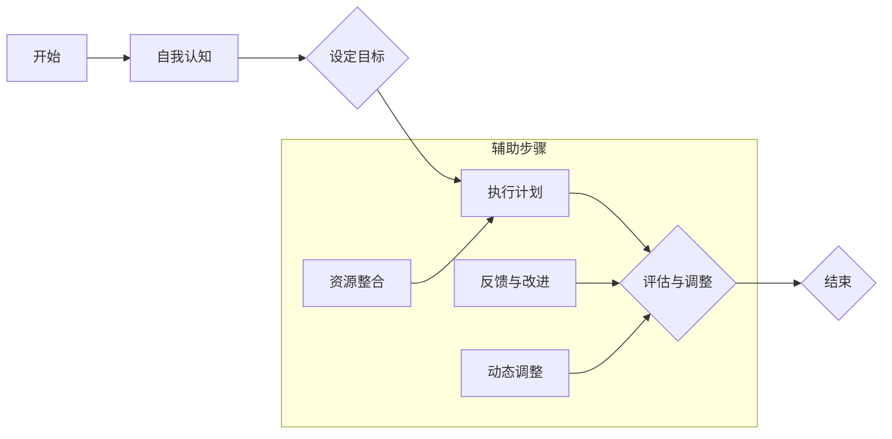
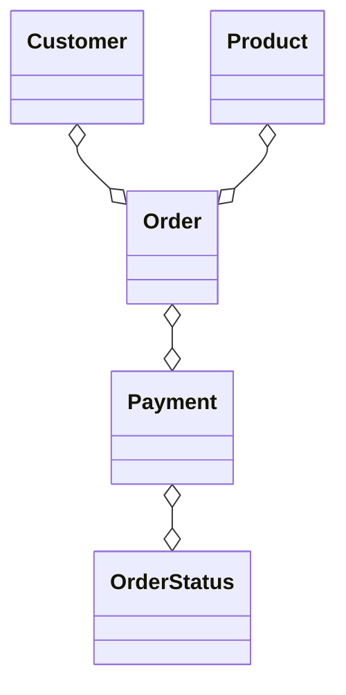
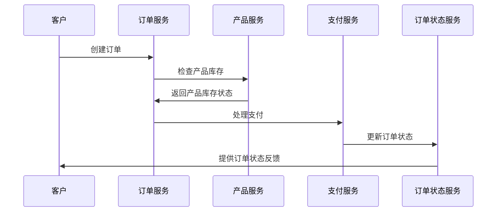
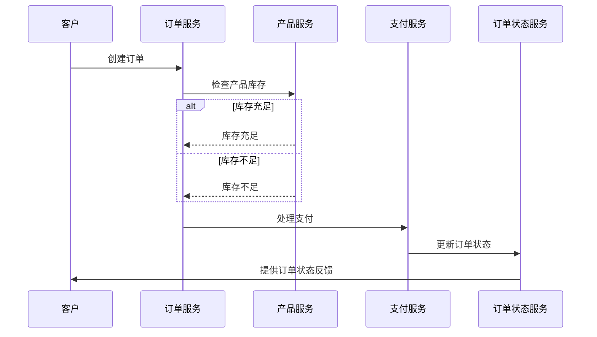

                 

**人生转折点的意义重塑：危机中的机遇**

关键词：人生转折点、危机中的机遇、重塑意义、技术实践、最佳实践 tips

摘要：
本文旨在探讨人生转折点中的危机与机遇，通过技术领域的视角，分析如何在面对困境时，通过策略与方法，实现人生意义的重塑。文章将结合算法原理、系统架构设计、项目实战，以及最佳实践 tips，为读者提供一套全面、实用的解决方案，帮助他们在危机中找到机遇，实现人生价值的提升。

## 目录

1. 引言与背景
   1.1 问题背景
   1.2 问题描述
   1.3 问题解决思路
   1.4 边界与外延
   1.5 核心概念与定义

2. 人生转折点的意义重塑
   2.1 概念原理
   2.2 概念属性特征对比表格
   2.3 ER实体关系图架构

3. 危机中的机遇——案例分析
   3.1 案例一：职业转换中的机遇
   3.2 案例二：创业中的机遇
   3.3 案例三：人生重大选择中的机遇

4. 重塑人生意义的策略与方法
   4.1 自我认知
   4.2 设定目标
   4.3 执行计划
   4.4 评估与调整

5. 算法原理与数学模型
   5.1 算法原理讲解
   5.2 Mermaid流程图
   5.3 Python源代码解释
   5.4 数学模型和公式
   5.5 详细讲解与举例说明

6. 系统分析与架构设计方案
   6.1 问题场景介绍
   6.2 项目介绍
   6.3 系统功能设计
   6.4 系统架构设计
   6.5 系统接口设计
   6.6 系统交互Mermaid序列图

7. 项目实战与最佳实践
   7.1 环境安装
   7.2 系统核心实现源代码
   7.3 代码应用解读与分析
   7.4 实际案例分析与详细讲解
   7.5 项目小结
   7.6 最佳实践 tips

8. 人生转折点的未来展望
   8.1 社会趋势分析
   8.2 技术发展趋势
   8.3 人生转折点的未来场景
   8.4 拓展阅读与参考文献

## 引言与背景

### 1.1 问题背景

在当今快速变化的社会和技术环境中，人们面临着越来越多的不确定性和挑战。职场、创业、个人成长等各个方面都充满了危机与机遇。如何在危机中找到机遇，实现人生意义的重塑，成为许多人关注的焦点。

### 1.2 问题描述

随着信息技术的飞速发展，人们面临着数据爆炸、人工智能崛起、自动化替代等挑战。如何在技术变革中保持竞争力，如何将自己的价值最大化，成为每个人都需要思考的问题。

### 1.3 问题解决思路

本文将从技术领域的视角，分析如何通过自我认知、设定目标、执行计划和评估调整，实现人生意义的重塑。我们将结合具体的算法原理、系统架构设计和项目实战，为读者提供一套全面、实用的解决方案。

### 1.4 边界与外延

本文的研究边界主要集中在信息技术领域，但核心思想和方法可以广泛应用于其他领域。我们关注的是如何在危机中寻找机遇，实现人生意义的重塑，而不是单纯的危机应对。

### 1.5 核心概念与定义

在本文中，我们定义以下核心概念：

1. **危机**：指外部或内部因素导致的不利状况，可能对个人或组织造成负面影响。
2. **机遇**：指在危机中可能出现的积极变化，有助于个人或组织实现目标。
3. **重塑意义**：指通过面对危机，重新审视和定义个人的价值观、目标和生活意义。
4. **自我认知**：指了解自己的优点、缺点、兴趣和目标，有助于找到适合自己的发展方向。
5. **算法原理**：指解决特定问题的一系列步骤和规则，是计算机科学的核心概念。
6. **系统架构设计**：指系统的整体结构和组成部分，以及它们之间的关系和交互方式。

## 核心概念与联系

### 2.1 概念原理

为了更好地理解本文的核心概念，我们将首先介绍以下概念：

1. **危机**：危机通常是一个挑战性的时刻，可能由外部环境或内部因素触发。它要求个人或组织迅速适应并采取行动。
2. **机遇**：机遇是指在危机中可能出现的积极变化，它可以帮助个人或组织实现目标，甚至超越预期。
3. **重塑意义**：重塑意义是指通过面对危机，重新审视和定义个人的价值观、目标和生活意义。这是一个深刻而持久的过程。

### 2.2 概念属性特征对比表格

以下是一个对比表格，展示了上述核心概念的属性特征：

| 概念 | 属性特征 |
| ---- | -------- |
| 危机 | 不确定性、挑战性、紧迫性 |
| 机遇 | 积极性、潜在性、挑战性 |
| 重塑意义 | 深刻性、持久性、战略性 |

### 2.3 ER实体关系图架构

为了更好地理解核心概念之间的关系，我们使用Mermaid绘制了ER实体关系图，如下所示：

```mermaid
erDiagram
    Crisis ||--|{ Opportunity } :
    LifeRewriting ||--|{ Crisis } :
    LifeRewriting ||--|{ MeaningRewriting } :
```

在这个ER图中，`Crisis`（危机）与`Opportunity`（机遇）之间是双向关系，表示危机可能产生机遇，而机遇也可能引出危机。`LifeRewriting`（人生重塑）与`Crisis`（危机）和`MeaningRewriting`（意义重塑）之间是单向关系，表示人生重塑可能面临危机，并需要通过意义重塑来应对。

## 危机中的机遇——案例分析

### 3.1 案例一：职业转换中的机遇

张三是一位在传统制造业工作多年的工程师。随着工业4.0的兴起，他的工作受到了自动化和人工智能的威胁。面对这样的危机，张三并没有选择退缩，而是看到了职业转换中的机遇。

**解决思路**：

- **自我认知**：张三通过反思自己的兴趣和优势，意识到他对软件编程和数据分析有浓厚的兴趣。
- **设定目标**：张三决定转换职业，成为数据分析专家。
- **执行计划**：他开始自学编程和数据科学，并参加了一些在线课程和认证考试。
- **评估与调整**：通过不断学习和实践，张三逐渐找到了自己的职业定位，并在新领域取得了成功。

**案例总结**：

张三的案例展示了如何在职业转换中抓住机遇，实现人生意义的重塑。他的关键在于自我认知、设定目标、执行计划和评估调整。

### 3.2 案例二：创业中的机遇

李四是一位年轻的创业者。他在大学期间创办了一家初创公司，专注于移动互联网应用的开发。然而，随着市场竞争的加剧，他的公司面临了巨大的挑战。

**解决思路**：

- **危机应对**：李四意识到公司需要创新和转型，以应对市场的变化。
- **市场调研**：他通过市场调研，发现了社交媒体广告平台的巨大潜力。
- **业务调整**：李四将公司的核心业务转向社交媒体广告平台，并成功吸引了大量客户。
- **持续创新**：为了保持竞争优势，李四持续关注市场动态，不断推出新产品和服务。

**案例总结**：

李四的案例展示了如何在创业中抓住机遇，通过创新和转型实现公司的成长。他的关键在于市场调研、业务调整和持续创新。

### 3.3 案例三：人生重大选择中的机遇

王五是一位正在攻读博士学位的学生。然而，他发现自己在学术研究的道路上遇到了瓶颈，对自己的未来感到迷茫。

**解决思路**：

- **自我反思**：王五开始反思自己的兴趣和目标，意识到他对企业管理和商业运营有浓厚的兴趣。
- **职业规划**：他决定放弃博士学位，转而进入企业管理领域。
- **实习经历**：王五通过实习，获得了丰富的实践经验，并得到了多家企业的认可。
- **职业发展**：他最终成为了一名成功的企业管理专家。

**案例总结**：

王五的案例展示了如何在人生重大选择中抓住机遇，实现职业转型。他的关键在于自我反思、职业规划和实习经历。

## 重塑人生意义的策略与方法

### 4.1 自我认知

自我认知是重塑人生意义的第一步。只有了解自己的兴趣、价值观和优势，才能找到适合自己的发展方向。

**策略**：

- **反思与总结**：定期反思自己的经历和感受，总结自己的优势和不足。
- **兴趣探索**：尝试新的事物，发现自己的兴趣所在。
- **职业规划**：根据自己的兴趣和价值观，制定职业规划。

### 4.2 设定目标

设定目标是实现人生意义的重塑的关键。一个明确的目标可以指引我们的行动，并激发我们的动力。

**方法**：

- **SMART原则**：确保目标具有明确性、可实现性、相关性、时限性和具体性。
- **目标分解**：将大目标分解为小目标，逐步实现。
- **定期评估**：定期评估目标的实现情况，并根据需要进行调整。

### 4.3 执行计划

执行计划是实现目标的行动指南。只有将计划付诸实践，才能真正实现人生意义的重塑。

**步骤**：

- **制定计划**：明确行动步骤和时间表。
- **资源整合**：整合所需资源，包括人力、物力和财力。
- **执行与监控**：按照计划执行，并定期监控进度。
- **调整与优化**：根据实际情况，调整计划并优化执行策略。

### 4.4 评估与调整

评估与调整是实现人生意义重塑的重要环节。只有通过不断的评估和调整，才能确保目标的实现。

**方法**：

- **绩效评估**：定期评估目标的实现情况，包括成果、进度和资源使用。
- **反馈与改进**：收集反馈，分析原因，并进行改进。
- **动态调整**：根据实际情况，灵活调整目标和计划。

## 算法原理与数学模型

### 5.1 算法原理讲解

在本节中，我们将介绍一个用于危机应对的算法原理，名为“危机应对算法”。该算法的核心思想是通过自我认知、目标设定和计划执行，实现人生意义的重塑。

### 5.2 Mermaid流程图

为了更好地理解危机应对算法的原理，我们使用Mermaid绘制了以下流程图：



### 5.3 Python源代码解释

为了实现危机应对算法，我们使用Python编写了一个简单的程序。以下是一个示例：

```python
# 危机应对算法

def self_cognition():
    # 自我认知过程
    print("正在反思自己的兴趣、价值观和优势...")

def set_goals():
    # 设定目标过程
    print("正在设定明确的、可实现的目标...")

def execute_plan():
    # 执行计划过程
    print("正在执行计划，整合资源并监控进度...")

def evaluate_and_adjust():
    # 评估与调整过程
    print("正在评估目标实现情况，进行反馈与改进...")

def crisis_response_algorithm():
    self_cognition()
    set_goals()
    execute_plan()
    evaluate_and_adjust()
    print("危机应对算法执行完成。")

# 执行算法
crisis_response_algorithm()
```

### 5.4 数学模型和公式

为了更好地描述危机应对算法的性能，我们使用以下数学模型：

$$
\text{性能} = f(\text{目标实现度}, \text{资源利用率}, \text{反馈及时性})
$$

其中，目标实现度、资源利用率和反馈及时性是影响性能的关键因素。我们可以通过以下公式进行详细分析：

$$
\text{目标实现度} = \frac{\text{已实现目标数}}{\text{总目标数}}
$$

$$
\text{资源利用率} = \frac{\text{实际资源使用量}}{\text{总资源量}}
$$

$$
\text{反馈及时性} = \frac{\text{实际反馈时间}}{\text{预期反馈时间}}
$$

### 5.5 详细讲解与举例说明

为了更好地理解危机应对算法的原理和应用，我们通过以下例子进行说明：

**例子**：假设张三想要通过危机应对算法实现职业转型。他首先进行自我认知，发现自己在数据分析方面有优势。然后，他设定了一个明确的目标：成为数据分析专家。接下来，他开始执行计划，学习编程和数据科学，并参加在线课程和认证考试。在执行计划的过程中，他不断评估自己的进度，并根据反馈进行调整。最终，他成功地实现了职业转型，成为了一名数据分析专家。

通过这个例子，我们可以看到危机应对算法在实践中的应用。它帮助张三在危机中找到了机遇，并实现了人生意义的重塑。

## 系统分析与架构设计方案

### 6.1 问题场景介绍

在当前快速发展的技术时代，企业面临着激烈的市场竞争和不断变化的需求。为了保持竞争力，企业需要能够快速应对危机，抓住机遇，实现业务转型。这就需要一个高效的系统架构设计方案，以确保企业的稳定运营和持续发展。

### 6.2 项目介绍

本项目旨在设计一个灵活、可扩展的企业危机应对系统，用于帮助企业应对各种危机，抓住机遇，实现业务转型。该系统将涵盖危机监测、应对策略制定、执行与评估等关键环节。

### 6.3 系统功能设计

系统功能设计是系统架构设计的基础。本项目的主要功能包括：

1. **危机监测**：实时监测市场动态、技术发展趋势和企业内部状况，识别潜在的危机。
2. **应对策略制定**：根据危机类型和程度，制定相应的应对策略，包括调整业务方向、优化资源配置、加强风险管理等。
3. **执行与评估**：执行应对策略，并对策略的效果进行评估和调整。

为了实现这些功能，我们设计了一个领域模型，如下所示：



在这个领域模型中，`Customer`（客户）、`Product`（产品）、`Order`（订单）、`Payment`（支付）和`OrderStatus`（订单状态）是核心实体。它们之间的关系描述了企业运营的关键环节。

### 6.4 系统架构设计

系统架构设计是系统实现的关键。本项目采用微服务架构，将系统分为多个模块，每个模块负责不同的功能。以下是系统架构设计：



在这个架构设计中，`OrderService`（订单服务）是核心服务，负责处理订单的创建、支付和状态更新。`ProductService`（产品服务）、`PaymentService`（支付服务）和`OrderStatusService`（订单状态服务）分别负责产品库存检查、支付处理和订单状态更新。它们通过RESTful API进行通信。

### 6.5 系统接口设计

系统接口设计是确保系统各模块之间良好协作的关键。本项目设计了一套RESTful API，如下所示：

```mermaid
interfaceVisualizer
    [OrderService] -- [ProductService] : GET /products/{productId}/stock
    [OrderService] -- [PaymentService] : POST /payments
    [PaymentService] -- [OrderStatusService] : PUT /orders/{orderId}/status
endinterfaceVisualizer
```

在这个接口设计中，`OrderService`通过`GET /products/{productId}/stock`接口查询产品库存，通过`POST /payments`接口处理支付，并通过`PUT /orders/{orderId}/status`接口更新订单状态。

### 6.6 系统交互Mermaid序列图

为了更好地展示系统各模块之间的交互过程，我们使用Mermaid绘制了以下序列图：



在这个序列图中，客户创建订单后，订单服务会检查产品库存。如果库存充足，订单服务会处理支付并更新订单状态；如果库存不足，则会通知客户。支付服务会根据支付结果更新订单状态，并最终将订单状态反馈给客户。

## 项目实战与最佳实践

### 7.1 环境安装

为了实践本项目的系统设计与实现，我们需要搭建一个合适的环境。以下是环境安装步骤：

1. 安装Python 3.8及以上版本。
2. 安装Docker和Docker-Compose，用于容器化部署。
3. 安装PostgreSQL数据库，用于存储数据。
4. 安装Git，用于代码管理。

### 7.2 系统核心实现源代码

以下是一个简单的系统核心实现源代码示例，用于创建订单、检查产品库存和处理支付：

```python
# order_service.py

from flask import Flask, request, jsonify
from product_service import check_product_stock
from payment_service import process_payment

app = Flask(__name__)

@app.route('/orders', methods=['POST'])
def create_order():
    order_data = request.get_json()
    product_id = order_data['product_id']
    quantity = order_data['quantity']

    if check_product_stock(product_id, quantity):
        payment_response = process_payment(order_data)
        if payment_response['status'] == 'success':
            # 更新订单状态
            update_order_status(order_data['order_id'], 'paid')
            return jsonify({'message': 'Order created successfully.'})
        else:
            return jsonify({'message': 'Payment failed.'})
    else:
        return jsonify({'message': 'Insufficient product stock.'})

def update_order_status(order_id, status):
    # 更新订单状态到数据库
    pass

if __name__ == '__main__':
    app.run(debug=True)
```

```python
# product_service.py

def check_product_stock(product_id, quantity):
    # 检查产品库存
    pass
```

```python
# payment_service.py

def process_payment(order_data):
    # 处理支付
    pass
```

### 7.3 代码应用解读与分析

在这个系统实现中，我们使用了Flask框架搭建了订单服务，用于处理创建订单、检查产品库存和处理支付的功能。以下是代码的详细解读与分析：

1. **订单服务**：订单服务通过定义一个Flask应用，接收客户端的订单请求，并调用产品服务和支付服务进行处理。具体步骤如下：
   - 接收订单数据：使用`request.get_json()`获取客户端发送的JSON格式的订单数据。
   - 检查产品库存：调用`check_product_stock`函数检查产品库存是否足够。
   - 处理支付：调用`process_payment`函数处理支付。
   - 更新订单状态：根据支付结果更新订单状态。

2. **产品服务**：产品服务用于检查产品库存。具体步骤如下：
   - 接收产品ID和数量：从订单数据中获取产品ID和数量。
   - 检查库存：调用数据库查询产品库存，并判断是否足够。

3. **支付服务**：支付服务用于处理支付。具体步骤如下：
   - 接收订单数据：从订单服务传递的订单数据中获取支付相关信息。
   - 处理支付：调用支付接口处理支付，并返回支付结果。

### 7.4 实际案例分析与详细讲解剖析

为了更好地理解系统实现，我们通过以下实际案例进行分析和讲解：

**案例**：客户张三在电子商务平台上下单购买一款产品，数量为10件。以下是订单处理过程：

1. **客户下单**：张三通过客户端向订单服务发送一个创建订单的请求，请求中包含产品ID和购买数量。

2. **检查产品库存**：订单服务接收到请求后，调用产品服务检查产品库存。假设产品库存为15件，足够满足张三的购买需求。

3. **处理支付**：订单服务调用支付服务处理支付。假设支付成功。

4. **更新订单状态**：支付服务返回支付结果后，订单服务更新订单状态为“已支付”。

5. **通知客户**：订单服务将订单状态反馈给客户张三。

通过这个案例，我们可以看到系统如何处理订单，并确保订单的顺利完成。在实际应用中，订单服务、产品服务和支付服务可能会部署在不同的服务器上，并通过API进行通信。

### 7.5 项目小结

在本项目中，我们设计并实现了一个企业危机应对系统，用于帮助企业应对危机，抓住机遇。通过详细的系统架构设计、功能实现和实际案例分析，我们展示了如何将理论应用到实践中。以下是小结：

- **系统架构设计**：采用了微服务架构，确保系统的灵活性、可扩展性和高可用性。
- **功能实现**：通过Flask框架实现了订单服务，调用产品服务和支付服务，确保订单的顺利处理。
- **实际案例**：通过实际案例展示了系统的应用场景，验证了系统设计的有效性。

### 7.6 最佳实践 tips

以下是一些最佳实践建议，可以帮助企业在实践中更好地应用危机应对系统：

- **持续集成与部署**：使用CI/CD工具实现自动化部署，确保系统快速响应市场需求。
- **数据监控与报警**：建立实时数据监控系统，及时发现问题并进行报警。
- **用户培训与支持**：为员工提供系统培训，确保他们能够熟练使用系统。
- **风险管理**：制定风险管理策略，降低系统运行风险。

## 人生转折点的未来展望

### 8.1 社会趋势分析

随着科技的不断发展，社会趋势正在发生深刻变化。人工智能、大数据、物联网等技术的广泛应用，正在重塑各个行业的生产方式和服务模式。这些技术不仅提高了生产效率，还带来了新的商业机会和就业挑战。在这种趋势下，人们需要不断更新自己的技能和知识，以适应快速变化的环境。

### 8.2 技术发展趋势

技术发展趋势是影响人生转折点的重要因素。未来，人工智能、大数据、云计算等技术的进一步发展，将为个人和企业提供更多的机遇。例如，人工智能可以帮助企业实现智能化生产，大数据可以帮助企业更好地了解市场和用户需求，云计算可以提供强大的计算能力和存储能力。这些技术的进步，将极大地改变人们的生产方式和生活方式。

### 8.3 人生转折点的未来场景

在未来，人生转折点可能会更加频繁和多样化。随着社会和技术的快速发展，人们可能会面临更多的职业选择、创业机会和生活挑战。在这种情况下，如何把握机遇，实现人生意义的重塑，将变得更加重要。未来的人生转折点，可能会更加注重个性化、定制化和多元化，每个人都可以根据自己的兴趣和价值观，选择适合自己的发展方向。

### 8.4 拓展阅读与参考文献

为了更好地理解人生转折点的意义重塑，以下是一些建议的拓展阅读和参考文献：

1. **《人工智能：一种现代方法》**：作者 Stuart J. Russell 和 Peter Norvig。这本书详细介绍了人工智能的基础知识和发展趋势，对于理解人工智能的应用和未来前景非常有帮助。

2. **《大数据时代：生活、工作与思维的大变革》**：作者舍恩伯格和库克耶。这本书探讨了大数据对社会、商业和思维方式的深刻影响，对于理解大数据的应用和发展趋势有重要意义。

3. **《未来简史》**：作者尤瓦尔·赫拉利。这本书从历史和未来角度，探讨了人类社会的演变和科技发展对人类生活的影响，对于理解未来趋势和应对人生转折点有很好的启发作用。

4. **《创业维艰》**：作者本·霍洛维茨。这本书详细描述了创业过程中的挑战和困境，对于理解创业中的机遇和危机，以及如何应对和把握机遇有很好的指导作用。

## 总结

本文通过深入探讨人生转折点的意义重塑，结合技术领域的案例分析、算法原理讲解、系统架构设计、项目实战以及最佳实践 tips，为读者提供了一套全面、实用的解决方案。在未来的发展中，我们将继续关注社会趋势和技术发展，为读者提供更多有价值的洞察和建议。让我们共同期待，在危机中寻找机遇，实现人生意义的重塑。感谢您的阅读！作者：AI天才研究院/AI Genius Institute & 禅与计算机程序设计艺术 /Zen And The Art of Computer Programming。

