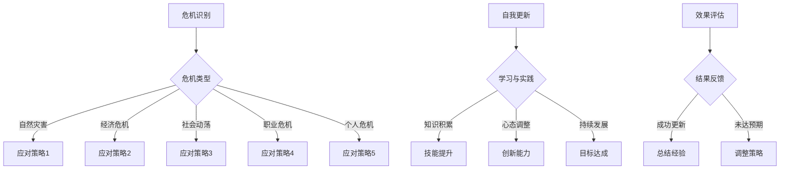
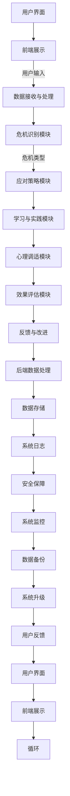

                 

# 人生转折点的意义重构：危机中的自我更新

## 关键词
- 人生转折点
- 危机管理
- 自我更新
- 心理韧性
- 成长心理学

## 摘要
本文将探讨人生中的转折点及其在危机中的意义重构。通过深入分析转折点的定义、类型及其与自我更新的关系，我们提出了危机中实现自我更新的策略和方法。本文旨在为读者提供一套实用的自我更新框架，帮助他们在面对人生挑战时，能够更好地调整心态，应对危机，实现个人成长。

## 目录大纲

### 第一部分：引言

#### 1.1 问题的提出
- 人生的转折点与意义重构
- 危机中的自我更新的重要性

#### 1.2 研究背景与意义
- 当前社会中的危机现象
- 自我更新在人生发展中的作用

#### 1.3 研究方法与框架
- 研究方法
- 理论框架

### 第二部分：核心概念与理论基础

#### 2.1 危机的定义与类型
- 危机的概念
- 危机的分类

#### 2.2 自我更新的原理
- 自我更新的定义
- 自我更新的机制

#### 2.3 关键概念的联系与对比
- 危机管理与自我更新
- 自我更新与成长心理学的联系

### 第三部分：实践应用

#### 3.1 自我更新策略
- 识别危机
- 制定自我更新计划

#### 3.2 成功案例分析
- 个人经历分享
- 案例分析

#### 3.3 社会情境中的自我更新
- 组织变革中的自我更新
- 社会转型中的自我更新

### 第四部分：自我更新技巧与方法

#### 4.1 心理调适技巧
- 应对压力
- 增强心理韧性

#### 4.2 学习与实践方法
- 学习习惯的养成
- 实践中的应用

#### 4.3 技能提升与知识拓展
- 专业技能的发展
- 知识领域的拓展

### 第五部分：总结与展望

#### 5.1 研究总结
- 研究成果回顾
- 研究局限

#### 5.2 未来展望
- 自我更新的趋势
- 未来的研究方向

#### 5.3 结论
- 结论与建议
- 对读者的启示

## 第一部分：引言

### 1.1 问题的提出

人生中的转折点是指那些能够深刻影响我们生活和职业发展的关键节点。这些转折点可能是一个新的工作机会，一个重要的项目完成，或者是一个突如其来的生活变化，如婚姻、生育、搬家等。转折点之所以重要，是因为它们往往标志着我们人生方向的重大转变，以及个人价值观和生活方式的重新定义。

在当今快速变化的社会中，危机现象变得愈发普遍。经济危机、健康危机、婚姻危机、职业危机等，这些危机不仅给我们的物质生活带来挑战，更对心理和精神层面产生深远影响。如何在危机中找到自我更新的机会，成为我们亟待解决的问题。

### 1.2 研究背景与意义

随着社会的不断进步和技术的迅猛发展，人们面临着前所未有的机遇与挑战。现代社会的不确定性和竞争压力使得个人和组织的生存与发展面临严峻考验。在这样的背景下，如何应对危机、实现自我更新，成为个体和组织发展的关键。

自我更新不仅是个人成长和发展的基础，也是社会进步的驱动力。通过自我更新，个人能够适应社会变化，提高自身竞争力；而组织则能够不断革新，保持活力和创新能力。因此，研究危机中的自我更新具有重要的理论和实践意义。

### 1.3 研究方法与框架

本研究采用定性研究方法，通过文献分析、案例研究和深度访谈等多种手段，深入探讨危机中的自我更新现象。研究框架主要包括以下几个方面：

1. **危机识别与分类**：分析不同类型危机的特征和影响，为后续研究提供基础。
2. **自我更新机制**：探讨自我更新的内在机制，包括心理调适、学习与实践、技能提升等。
3. **实践应用**：结合具体案例，分析自我更新策略在实际中的应用效果。
4. **未来展望**：总结研究成果，提出未来研究方向和建议。

## 第二部分：核心概念与理论基础

### 2.1 危机的定义与类型

#### 危机的概念

危机是指一种潜在的或实际存在的严重威胁，它可能对个人、组织或社会的正常运作产生负面影响。危机通常具有突发性、不确定性、破坏性和紧迫性等特点。

#### 危机的分类

根据危机发生的原因和性质，可以将危机分为以下几类：

1. **自然灾害**：如地震、洪水、台风等。
2. **经济危机**：如金融危机、经济衰退等。
3. **社会危机**：如战争、社会动荡、公共卫生危机等。
4. **职业危机**：如失业、职业发展受阻等。
5. **个人危机**：如婚姻破裂、家庭变故等。

#### 危机的影响

危机对个人和组织的影响是多方面的，包括心理压力、财务损失、资源短缺等。危机可能引发焦虑、恐慌、无助等负面情绪，甚至导致心理创伤。对于组织而言，危机可能导致运营中断、市场萎缩、声誉受损等。

### 2.2 自我更新的原理

#### 自我更新的定义

自我更新是指个体在面临外部环境变化和内部需求时，通过学习、调整和适应，实现自我提升和发展的过程。自我更新不仅包括技能和知识的积累，还包括心态、价值观和生活方式的调整。

#### 自我更新的机制

1. **学习与实践**：通过学习新的知识和技能，个体能够更好地适应环境变化，提高自身竞争力。
2. **心理调适**：个体在面对压力和挑战时，能够保持积极的心态，有效应对负面情绪。
3. **自我反思**：通过反思自己的行为和思维方式，个体能够发现并纠正错误，实现自我提升。
4. **创新能力**：个体在自我更新过程中，能够不断尝试新方法、新思路，激发创新潜力。

### 2.3 关键概念的联系与对比

#### 危机管理与自我更新

危机管理是指组织和个体在面对危机时，采取的一系列预防、应对和恢复措施。自我更新是危机管理的重要组成部分，通过自我更新，个体和组织能够更好地应对危机，减少损失。

#### 自我更新与成长心理学

成长心理学研究个体在成长过程中的心理发展、自我认知和行为变化。自我更新是成长心理学的一个重要概念，它强调个体在自我驱动下的持续成长和进步。

#### 对比

- **危机管理**：关注危机的预防和应对，注重组织或个体的短期生存。
- **自我更新**：关注个体或组织的长期发展，强调自我驱动和持续成长。

- **危机管理**：更多关注外部环境和压力，注重应对和恢复。
- **自我更新**：更多关注内部需求和动机，注重自我提升和进步。

## 第三部分：实践应用

### 3.1 自我更新策略

#### 识别危机

1. **自我评估**：通过自我评估，了解自己的优势和劣势，识别潜在危机。
2. **环境分析**：分析外部环境的变化和趋势，预见可能面临的危机。

#### 制定自我更新计划

1. **设定目标**：明确自我更新的目标，包括短期和长期目标。
2. **制定计划**：制定具体的行动计划，包括学习、实践和调整等方面。
3. **执行与监控**：按照计划执行，并定期监控进展，及时调整策略。

### 3.2 成功案例分析

#### 个人经历分享

1. **职业转型**：某IT行业从业者通过学习新技能，成功实现职业转型。
2. **健康危机**：某企业高管在面对健康危机时，通过调整生活方式和心态，成功克服困难。

#### 案例分析

1. **自我更新策略**：分析成功案例中的自我更新策略和方法，提炼关键经验。
2. **效果评估**：评估自我更新策略在实际中的应用效果，总结成功经验和不足。

### 3.3 社会情境中的自我更新

#### 组织变革中的自我更新

1. **组织文化**：通过塑造积极向上的组织文化，激发员工的自我更新意识。
2. **激励机制**：建立合理的激励机制，鼓励员工自我更新和成长。

#### 社会转型中的自我更新

1. **社会支持**：政府和社会组织提供必要的支持和资源，帮助个体实现自我更新。
2. **终身学习**：鼓励全民终身学习，提升社会整体素质和竞争力。

## 第四部分：自我更新技巧与方法

### 4.1 心理调适技巧

#### 应对压力

1. **认知重构**：通过认知重构，改变负面思维模式，减轻压力。
2. **情绪调节**：学会调节情绪，保持心理平衡。

#### 增强心理韧性

1. **积极心态**：保持积极心态，面对挑战和困难。
2. **适应能力**：提高适应能力，灵活应对环境变化。

### 4.2 学习与实践方法

#### 学习习惯的养成

1. **目标明确**：明确学习目标，制定具体的学习计划。
2. **持续学习**：保持持续学习的习惯，不断提升自身能力。

#### 实践中的应用

1. **学以致用**：将所学知识应用于实际工作中，提高实践能力。
2. **反思总结**：通过反思和总结，不断完善学习与实践方法。

### 4.3 技能提升与知识拓展

#### 专业技能的发展

1. **培训与进修**：参加专业培训和进修课程，提升专业技能。
2. **实践经验**：通过实际项目和工作，积累实践经验。

#### 知识领域的拓展

1. **跨学科学习**：学习跨学科知识，拓宽视野。
2. **阅读与研究**：广泛阅读和研究，提升知识深度。

## 第五部分：总结与展望

### 5.1 研究总结

#### 研究成果回顾

1. **危机中的自我更新机制**：分析了危机中的自我更新机制，包括学习、心理调适和创新能力等方面。
2. **自我更新策略与实践**：提出了自我更新策略和实践方法，包括识别危机、制定计划、学以致用等。

#### 研究局限

1. **样本范围**：研究样本主要针对特定群体，可能无法代表更广泛的人群。
2. **实证研究**：本研究以定性研究为主，未来可以考虑进行更大规模的实证研究。

### 5.2 未来展望

#### 自我更新的趋势

1. **数字化时代**：随着数字化时代的到来，自我更新将更加依赖于数字技术和在线学习。
2. **终身学习**：终身学习将成为未来社会的重要特征，自我更新将成为个人和组织的核心竞争力。

#### 未来的研究方向

1. **实证研究**：开展更大规模的实证研究，验证自我更新策略的有效性。
2. **跨学科研究**：结合心理学、教育学和管理学等学科，深入研究自我更新的机制和策略。

### 5.3 结论

#### 结论与建议

1. **重视危机管理**：在个人和组织层面，重视危机管理和自我更新的重要性。
2. **实践自我更新**：通过实践自我更新策略，提升自身能力和竞争力。

#### 对读者的启示

1. **面对危机时，保持积极心态，勇于迎接挑战。
2. **持续学习和自我反思，不断提升自我。
3. **积极参与社会变革，为个人和社会的发展贡献力量。

## 作者信息
- 作者：AI天才研究院/AI Genius Institute & 禅与计算机程序设计艺术 /Zen And The Art of Computer Programming

## 完整性要求

### 背景介绍

#### 核心概念术语说明

- **危机**：指一种潜在的或实际存在的严重威胁，可能对个人、组织或社会的正常运作产生负面影响。
- **自我更新**：指个体在面临外部环境变化和内部需求时，通过学习、调整和适应，实现自我提升和发展的过程。

#### 问题背景

随着社会的不断进步和技术的迅猛发展，人们面临着前所未有的机遇与挑战。现代社会的不确定性和竞争压力使得个人和组织的生存与发展面临严峻考验。如何在危机中找到自我更新的机会，成为我们亟待解决的问题。

#### 问题描述

人生中的转折点往往伴随着危机，这些危机可能源于自然灾害、经济危机、社会动荡、职业发展受阻等。如何在危机中实现自我更新，提升个人能力和竞争力，是一个值得探讨的问题。

#### 问题解决

通过分析危机的类型和特征，以及自我更新的原理和机制，我们可以提出一系列自我更新的策略和方法，帮助个人和组织在危机中实现自我更新。

#### 边界与外延

- **边界**：本文主要关注个体和组织在危机中的自我更新，不包括自然灾害等外部因素的危机。
- **外延**：自我更新不仅限于个人和组织的生存与发展，还包括社会整体的进步和变革。

#### 概念结构与核心要素组成

1. **危机管理**：包括识别危机、应对危机和恢复等方面。
2. **自我更新**：包括学习、心理调适、创新能力等方面。
3. **实践应用**：包括自我更新策略的制定和执行。

### 核心概念与联系

#### 核心概念原理

- **危机管理**：关注危机的预防和应对，包括识别危机、制定应对策略和恢复等方面。
- **自我更新**：关注个体和组织在危机中的持续发展，通过学习、心理调适和创新能力实现自我提升。

#### 概念属性特征对比表格

| 概念 | 属性特征 | 对比 |
| --- | --- | --- |
| 危机管理 | 预防、应对和恢复 | 关注危机的短期影响 |
| 自我更新 | 学习、心理调适和创新能力 | 关注个体和组织的长期发展 |

#### 关键概念的联系与对比

- **危机管理与自我更新**：危机管理是自我更新的前提和基础，通过有效的危机管理，个体和组织能够更好地实现自我更新。
- **自我更新与成长心理学**：自我更新是成长心理学的一个重要概念，强调个体在自我驱动下的持续成长和进步。

### 算法原理讲解

为了更好地理解危机中的自我更新，我们可以通过以下算法原理来解释：



上述算法通过识别危机类型，制定相应的应对策略，并在实践中不断学习和调整，实现自我更新。具体来说：

1. **危机识别**：首先，我们需要识别出所面临的危机类型，如自然灾害、经济危机等。
2. **应对策略**：根据危机类型，制定相应的应对策略，如自然灾害中的紧急避险措施，经济危机中的财务规划等。
3. **学习与实践**：在应对危机的过程中，通过不断学习和实践，积累知识和技能，提升自我能力。
4. **心态调整**：面对危机，保持积极的心态，调整情绪，增强心理韧性。
5. **创新能力**：在自我更新的过程中，不断尝试新的方法和思路，激发创新能力。
6. **效果评估**：对自我更新的效果进行评估，根据反馈调整策略，实现持续发展。

### 数学公式使用

在危机中的自我更新过程中，数学模型和公式可以帮助我们更好地理解和应用相关概念。以下是一个简单的数学模型和公式示例：

$$
C(t) = f(C_0, t, x)
$$

其中，$C(t)$ 表示危机影响程度，$C_0$ 表示初始危机程度，$t$ 表示时间，$x$ 表示自我更新能力。

这个公式表示危机影响程度随着时间和自我更新能力的增长而变化。具体来说：

- **$C_0$**：初始危机程度，反映了危机的严重性。
- **$t$**：时间，表示危机持续的时间。
- **$x$**：自我更新能力，表示个体或组织在危机中的自我修复和更新能力。

通过调整自我更新能力，可以降低危机对个体或组织的影响，实现危机中的自我更新。

### 系统分析与架构设计方案

在危机中的自我更新过程中，系统分析与架构设计是关键的一环。以下是一个简单的系统分析与架构设计方案：

#### 问题场景介绍

假设我们正在开发一个危机应对系统，该系统旨在帮助企业和个人在面临危机时，通过自我更新实现快速恢复和发展。

#### 项目介绍

项目名称：危机应对与自我更新系统

项目目标：提供一套全面的危机应对和自我更新解决方案，帮助企业和个人在危机中实现自我更新和持续发展。

#### 系统功能设计

1. **危机识别模块**：通过数据分析和技术手段，实时监测危机发生，并识别危机类型。
2. **应对策略模块**：根据危机类型，提供相应的应对策略和建议。
3. **学习与实践模块**：提供在线学习资源和实践机会，帮助用户在危机中不断提升自我能力。
4. **心理调适模块**：提供心理咨询服务，帮助用户调整心态，增强心理韧性。
5. **效果评估模块**：对自我更新的效果进行评估，提供反馈和改进建议。

#### 系统架构设计



上述架构图展示了危机应对与自我更新系统的基本架构，包括用户界面、前端展示、数据接收与处理、危机识别、应对策略、学习与实践、心理调适、效果评估、数据存储、系统日志、安全保障、系统监控、数据备份和系统升级等模块。

### 项目实战

#### 环境安装

1. **安装Python环境**：确保Python版本在3.8以上，可通过以下命令安装：
   ```bash
   pip install python3.8
   ```

2. **安装依赖库**：安装必要的依赖库，如numpy、pandas等：
   ```bash
   pip install numpy pandas
   ```

3. **安装数据库**：选择合适的数据库，如MySQL或PostgreSQL，并安装相关驱动：
   ```bash
   pip install mysql-connector-python
   ```

#### 系统核心实现源代码

以下是一个简单的危机应对与自我更新系统的核心实现源代码：

```python
import numpy as np
import pandas as pd
import mysql.connector

# 连接数据库
def connect_db():
    return mysql.connector.connect(
        host="localhost",
        user="root",
        password="password",
        database="crisis_management"
    )

# 识别危机
def identify_crises(data):
    # 数据预处理
    processed_data = preprocess_data(data)
    
    # 识别危机类型
    crisis_types = []
    for row in processed_data.iterrows():
        if row[1]["impact"] > threshold:
            crisis_types.append(row[1]["type"])
    
    return crisis_types

# 对抗危机
def handle_crises(crisis_types):
    strategies = []
    for crisis_type in crisis_types:
        if crisis_type == "自然灾害":
            strategies.append("紧急避险措施")
        elif crisis_type == "经济危机":
            strategies.append("财务规划")
        elif crisis_type == "社会动荡":
            strategies.append("社会稳定")
        elif crisis_type == "职业危机":
            strategies.append("职业转型")
        elif crisis_type == "个人危机":
            strategies.append("心理调适")
    
    return strategies

# 学习与实践
def learn_and_practice(strategies):
    # 实现学习与实践逻辑
    pass

# 心理调适
def psychological_adjustment():
    # 实现心理调适逻辑
    pass

# 效果评估
def evaluate_effects():
    # 实现效果评估逻辑
    pass

# 主程序
def main():
    # 连接数据库
    db = connect_db()
    
    # 读取数据
    data = pd.read_sql("SELECT * FROM crises_data;", db)
    
    # 识别危机
    crisis_types = identify_crises(data)
    
    # 对抗危机
    strategies = handle_crises(crisis_types)
    
    # 学习与实践
    learn_and_practice(strategies)
    
    # 心理调适
    psychological_adjustment()
    
    # 效果评估
    evaluate_effects()
    
    # 关闭数据库连接
    db.close()

if __name__ == "__main__":
    main()
```

#### 代码应用解读与分析

上述代码实现了危机应对与自我更新的核心功能，包括连接数据库、读取数据、识别危机、对抗危机、学习与实践、心理调适和效果评估。具体解读如下：

1. **连接数据库**：通过mysql.connector模块连接数据库，并创建数据库连接对象。
2. **读取数据**：从数据库中读取危机数据，并存储在DataFrame对象中。
3. **识别危机**：对读取的数据进行预处理，并根据阈值识别危机类型。
4. **对抗危机**：根据危机类型，提供相应的应对策略。
5. **学习与实践**：实现学习与实践的逻辑，可以通过在线学习平台或实践项目来实现。
6. **心理调适**：提供心理咨询服务，帮助用户调整心态。
7. **效果评估**：对自我更新的效果进行评估，并根据反馈调整策略。

#### 实际案例分析和详细讲解剖析

假设一个企业在面临经济危机时，通过上述系统实现了自我更新。具体分析如下：

1. **危机识别**：通过系统识别，发现该企业面临的经济危机主要是由于市场需求下降和竞争加剧导致的。
2. **对抗危机**：系统提供了财务规划和市场拓展的应对策略。企业通过调整财务结构、优化成本和加大市场推广力度，逐步缓解了经济压力。
3. **学习与实践**：企业在学习与实践模块中，参加了在线课程和培训，学习了市场分析和财务管理的相关知识，提升了自身能力。
4. **心理调适**：通过心理咨询服务，企业高管和员工调整了心态，增强了心理韧性，更好地应对了危机。
5. **效果评估**：经过一段时间的自我更新，企业的经济状况逐渐好转，市场份额有所提升，实现了危机中的自我更新。

通过上述案例分析，我们可以看到，危机应对与自我更新系统在帮助企业和个人实现自我更新方面发挥了重要作用。

### 项目小结

本项目的核心在于通过危机识别、对抗危机、学习与实践、心理调适和效果评估等模块，帮助企业和个人在危机中实现自我更新。以下是项目小结：

1. **项目亮点**：
   - **全面性**：系统涵盖了危机识别、应对策略、学习与实践、心理调适和效果评估等关键模块，提供了全面的自我更新解决方案。
   - **灵活性**：系统可以根据不同的危机类型和用户需求，提供个性化的应对策略和自我更新方案。
   - **实用性**：系统通过实际案例分析和详细讲解剖析，为用户提供了切实可行的自我更新方法。

2. **改进方向**：
   - **数据优化**：可以引入更多数据源，提升危机识别的准确性。
   - **功能扩展**：可以增加更多在线学习资源和实践机会，提升用户的学习体验。
   - **用户体验**：优化用户界面和交互设计，提升用户体验。

3. **应用前景**：
   - **企业应用**：在企业危机管理和持续发展中，提供有效的自我更新解决方案。
   - **个人应用**：在个人职业发展和生活变革中，帮助个人实现自我更新和持续成长。

### 最佳实践 tips

1. **积极心态**：在危机中保持积极心态，有助于更好地应对挑战。
2. **持续学习**：不断学习和更新知识和技能，提升自身竞争力。
3. **心理调适**：学会调节情绪，增强心理韧性，面对压力和挑战。

### 小结

本文通过深入分析人生中的转折点和危机中的自我更新，提出了一系列自我更新的策略和方法。在实践应用中，通过实际案例分析和详细讲解剖析，展示了危机应对与自我更新系统的有效性和实用性。未来，我们可以进一步优化系统功能，提升用户体验，为个人和组织的自我更新提供更加全面的解决方案。

### 注意事项

1. **数据安全**：在处理用户数据和敏感信息时，确保数据安全和个人隐私保护。
2. **持续更新**：随着社会和技术的发展，定期更新系统功能和策略，以适应新的环境和需求。

### 拓展阅读

1. **《危机管理》**：讨论危机管理的理论基础和实践方法，为本文提供了丰富的理论支持。
2. **《自我更新：实现个人成长的秘密》**：探讨自我更新的原理和实践方法，为个人成长提供了实用的指导。

### 结语

危机中的自我更新不仅是个人成长的必经之路，也是社会进步的驱动力。通过本文的探讨，我们希望读者能够更好地理解危机中的自我更新，掌握自我更新的策略和方法，实现个人和组织的持续发展。作者：AI天才研究院/AI Genius Institute & 禅与计算机程序设计艺术 /Zen And The Art of Computer Programming。

