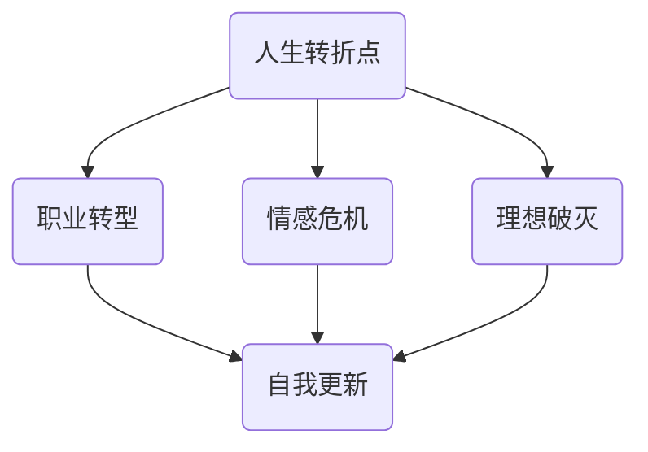
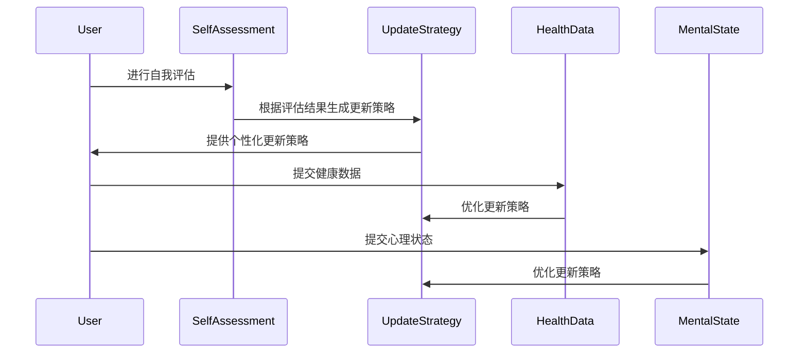
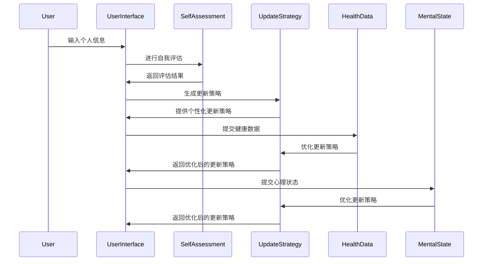

                 

# 人生转折点的意义重构：危机中的自我更新

## 关键词
- 人生转折点
- 自我更新
- 危机管理
- 心理调适
- 社会支持
- 职业转型

## 摘要
本文旨在探讨人生转折点中的自我更新现象，分析其意义、常见类型以及应对策略。通过深入剖析危机中的自我反思、学习新技能、心理调适、健康生活方式和社会支持等方面，提供了一套完整的自我更新方法论。文章通过实际案例展示自我更新的实践效果，并总结展望未来的发展趋势，旨在帮助读者在面临人生转折点时，实现个人的成长与进步。

## 第一部分：引言与背景

### 第1章 引言

#### 1.1 书籍主题介绍

在人生的道路上，每个人都会遇到各种转折点。这些转折点可能是职业的变迁，可能是情感的波动，也可能是对理想的重新审视。在这些转折点上，许多人会面临困惑、焦虑甚至绝望，但也有机会通过自我更新实现个人的成长与突破。本文将围绕这一主题，探讨人生转折点中的自我更新现象，分析其意义、常见类型以及应对策略。

#### 1.1.1 人生转折点的定义

人生转折点是指个体在人生历程中面临的重要变化和挑战，这些变化和挑战往往会影响个体的生活方向、价值观念和心态。人生转折点可以是积极的，比如成功晋升、创业成功等；也可以是消极的，比如失业、离婚等。

#### 1.1.2 危机中的自我更新

危机中的自我更新是指在面临人生转折点时，个体通过自我反思、学习新技能、心理调适等方式，实现自我成长和进步的过程。自我更新不仅有助于应对危机，还能为未来的发展奠定基础。

#### 1.1.3 为什么要重构意义

在人生转折点中，重构意义至关重要。首先，重构意义有助于个体明确自己的目标，从而更好地应对挑战。其次，重构意义能够帮助个体调整心态，从消极的情绪中解脱出来。最后，重构意义能够激发个体的潜能，实现自我超越。

#### 1.2 书籍结构安排

本文共分为七个部分，首先介绍人生转折点的定义和自我更新的概念，然后分析人生转折点的常见类型，接着探讨危机中的自我反思、学习新技能、心理调适、健康生活方式和社会支持等方面，通过实际案例展示自我更新的效果，最后总结展望未来的发展趋势。

#### 1.2.1 主要内容概述

- 第一部分：引言与背景
- 第二部分：人生转折点的常见类型
- 第三部分：危机中的自我反思
- 第四部分：自我更新的方法与策略
- 第五部分：危机中的社会支持
- 第六部分：成功的自我更新案例
- 第七部分：总结与展望

#### 1.2.2 阅读指南

本文适合以下人群阅读：
1. 面临人生转折点的个体
2. 关注自我成长和发展的读者
3. 心理健康和职业规划相关专业人士

### 1.3 书籍目标读者

#### 1.3.1 人生转折点经历者

人生转折点是每个人都可能面临的问题，本书旨在帮助经历者更好地应对这些挑战，实现自我更新。

#### 1.3.2 自我成长追求者

自我成长是人生的重要组成部分，本书提供了一套实用的方法论，帮助追求者实现自我突破。

#### 1.3.3 心理健康关注者

心理健康是自我更新的基础，本书从心理调适的角度，为关注者提供了一些建议和指导。

## 第二部分：人生转折点的常见类型

### 第2章 人生转折点的常见类型

人生转折点的类型多种多样，它们可能源于个人职业、情感、家庭、健康等多个方面。了解这些类型的转折点有助于我们更好地理解危机的本质，从而采取有效的应对策略。

#### 2.1 职业转型

职业转型是指个体在职业生涯中，从一种职业角色转向另一种职业角色的过程。这种转型可能是自愿的，也可能是被迫的。常见的职业转型原因包括：
- 对当前职业的厌倦
- 职业发展的瓶颈
- 对新职业的兴趣

职业转型的过程通常包括以下几个阶段：
1. 自我评估：分析自己的兴趣、能力和价值观，确定适合自己的新职业。
2. 学习和准备：通过培训、学习等方式，为转型做好准备。
3. 转型实施：实际从事新职业，逐渐适应新环境。

成功的职业转型案例有很多，例如某著名企业的高管转型成为创业者，某程序员转型成为数据分析师等。

#### 2.2 情感危机

情感危机通常是指个体在情感生活中遭遇的重大挑战，如失恋、婚姻破裂等。情感危机对个体的心理健康和生活质量有着深远的影响。导致情感危机的原因可能包括：
- 信任问题
- 沟通不畅
- 生活压力

应对情感危机的策略包括：
1. 接受现实：面对现实，承认问题的存在。
2. 自我关爱：在情感危机中，照顾好自己的情绪和身体。
3. 寻求支持：与亲友、心理咨询师交流，获取帮助。

#### 2.3 理想破灭

理想破灭是指个体对未来的期望与现实的差距过大，导致理想无法实现。理想破灭可能源于：
- 对现实的误解
- 对自己的期望过高
- 外部环境的变化

理想破灭的影响包括：
- 心理压力
- 没有方向
- 失落感

重构理想的方法包括：
1. 重新审视目标：分析理想与现实差距的原因，调整目标。
2. 寻找新方向：在新的领域或职业中寻找理想。
3. 保持乐观：坚信自己能够克服困难，实现理想。

#### 2.4 家庭变故

家庭变故是指家庭关系中的重大变化，如离婚、丧亲等。家庭变故对个体的心理和情感有着深远的影响。应对家庭变故的策略包括：
1. 接受现实：接受家庭变故的发生，并尝试理解其原因。
2. 情感宣泄：通过哭泣、倾诉等方式，宣泄情绪。
3. 寻求支持：与亲友、心理咨询师交流，获取帮助。

#### 2.5 健康挑战

健康挑战是指个体在健康方面遇到的重大问题，如重大疾病、意外伤害等。健康挑战对个体的生活和心理有着深远的影响。应对健康挑战的策略包括：
1. 积极治疗：积极接受医疗治疗，配合医生的治疗方案。
2. 心理调适：调整心态，接受现实，积极面对。
3. 寻求支持：与亲友、心理咨询师交流，获取帮助。

通过了解这些常见类型的人生转折点，我们可以更好地应对生活中的挑战，实现自我更新。

### 第3章 危机中的自我反思

#### 3.1 自我认知的重要性

自我认知是指个体对自己认知的能力，包括对自己的性格、价值观、兴趣、能力等方面的认识。自我认知的重要性在于它能够帮助我们更好地了解自己，从而做出更明智的决策。

#### 3.1.1 什么是自我认知

自我认知是一个复杂的过程，它包括以下几个方面：
1. 性格：了解自己的性格特点，如外向、内向、乐观、悲观等。
2. 价值观：明确自己的价值观，如诚实、善良、责任感等。
3. 兴趣：认识自己的兴趣和爱好，如阅读、运动、音乐等。
4. 能力：了解自己的能力水平，如学习能力、沟通能力、解决问题的能力等。

#### 3.1.2 自我认知的重要性

自我认知的重要性体现在以下几个方面：
1. 帮助我们做出明智的决策：通过自我认知，我们可以更好地了解自己的需求和目标，从而做出更明智的决策。
2. 促进个人成长：自我认知能够帮助我们识别自己的优点和缺点，从而有针对性地进行改进，促进个人成长。
3. 提高生活质量：自我认知能够帮助我们更好地应对生活中的挑战，提高生活质量。

#### 3.1.3 自我认知的工具

为了更好地进行自我认知，我们可以使用以下工具：
1. 反思日志：通过记录每天的经历和感受，反思自己的行为和思考方式，从而更好地了解自己。
2. 心理测试：通过心理测试，了解自己的性格、价值观和能力等方面的信息。
3. 咨询师：通过与心理咨询师交流，获取专业的自我认知建议和指导。

#### 3.2 反思与成长

反思与成长是危机中的自我更新过程的重要组成部分。通过反思，我们可以深入了解自己的行为和思考方式，从而找到改进的方向。

#### 3.2.1 反思的过程

反思的过程通常包括以下几个步骤：
1. 描述事件：详细描述发生的事件，包括时间、地点、人物等。
2. 分析原因：分析事件发生的原因，包括主观原因和客观原因。
3. 反思行为：反思自己在事件中的行为，包括成功和失败的地方。
4. 制定改进计划：根据反思结果，制定改进自己的计划。

#### 3.2.2 反思的技巧

为了提高反思的效果，我们可以使用以下技巧：
1. 保持客观：在反思时，尽量保持客观，避免情绪化的判断。
2. 深入挖掘：不仅要反思表面现象，还要挖掘背后的深层次原因。
3. 积极思考：在反思中，不仅要看到自己的不足，还要积极思考如何改进。

#### 3.2.3 成长的标志

成长的标志包括以下几个方面：
1. 知识和技能的提升：通过学习和实践，掌握新的知识和技能。
2. 心理素质的提高：能够更好地应对生活中的挑战，保持积极的心态。
3. 人际关系的改善：与他人的沟通和合作能力得到提升，人际关系更加和谐。

#### 3.3 反思日志的实践

反思日志是一种有效的自我反思工具，通过记录自己的经历和感受，我们可以更好地了解自己，从而实现自我更新。

#### 3.3.1 如何开始写反思日志

开始写反思日志的步骤如下：
1. 选择工具：可以选择纸质笔记本、电子文档或专门的反思日志应用程序。
2. 制定计划：每天或每周定期写反思日志，设定具体的时间和要求。
3. 描述经历：详细描述当天的经历和感受，包括成功和失败的地方。

#### 3.3.2 反思日志的内容

反思日志的内容通常包括以下几个方面：
1. 事件描述：详细描述当天发生的重大事件。
2. 情感分析：分析自己对事件的情感反应，包括正面和负面的情感。
3. 行为反思：反思自己在事件中的行为，包括成功和失败的地方。
4. 改进计划：根据反思结果，制定改进自己的计划。

#### 3.3.3 反思日志的益处

反思日志的益处包括以下几个方面：
1. 帮助我们更好地了解自己：通过记录和反思，我们可以深入了解自己的行为和思考方式。
2. 促进个人成长：反思日志能够帮助我们识别自己的不足，从而有针对性地进行改进，促进个人成长。
3. 提高生活质量：通过反思日志，我们可以更好地应对生活中的挑战，提高生活质量。

通过自我反思，我们可以更好地了解自己，从而在危机中实现自我更新。反思日志是一种有效的自我反思工具，通过记录和反思，我们可以深入了解自己的行为和思考方式，实现个人成长和提高生活质量。

### 第4章 自我更新的方法与策略

在面临人生转折点时，自我更新是一种重要的应对策略。通过自我更新，我们可以调整心态，提高能力，从而更好地应对挑战。本章将探讨自我更新的方法与策略，包括学习新技能、心理调适、健康生活方式等方面。

#### 4.1 学习新技能

学习新技能是自我更新的一种重要方式。通过学习新技能，我们可以提高自己的竞争力，适应不断变化的社会环境。

#### 4.1.1 学习新技能的重要性

学习新技能的重要性体现在以下几个方面：
1. 提高竞争力：在职场中，具备新技能的人更容易获得更好的工作机会和晋升机会。
2. 拓展职业发展：学习新技能可以帮助我们拓展职业发展路径，为未来做好准备。
3. 增强自信心：掌握新技能可以增强我们的自信心，提高自我认同感。

#### 4.1.2 选择适合的新技能

选择适合的新技能需要考虑以下几个方面：
1. 兴趣与热情：选择自己感兴趣和有热情的技能，这样更容易坚持和取得成果。
2. 职业需求：考虑当前职业需求和未来发展趋势，选择具有市场前景的技能。
3. 自身能力：评估自己的能力和基础，选择适合自己的技能。

#### 4.1.3 学习新技能的步骤

学习新技能的步骤包括以下几个阶段：
1. 前期准备：确定学习目标，制定学习计划，收集学习资料。
2. 系统学习：按照学习计划，系统地学习新技能，包括理论学习、实践操作等。
3. 持续练习：通过持续练习，巩固所学知识，提高技能水平。
4. 反馈与改进：在学习过程中，不断反思和总结，及时调整学习策略。

#### 4.2 心理调适

心理调适是自我更新过程中的关键环节。通过心理调适，我们可以更好地应对压力，保持积极的心态。

#### 4.2.1 心理调适的重要性

心理调适的重要性体现在以下几个方面：
1. 提高生活质量：良好的心理状态有助于我们更好地享受生活，提高生活质量。
2. 促进身心健康：心理调适有助于减轻心理压力，提高身体健康水平。
3. 提高工作效率：良好的心理状态有助于提高工作效率，实现职业目标。

#### 4.2.2 心理调适的方法

心理调适的方法包括以下几个方面：
1. 放松技巧：通过深呼吸、冥想、瑜伽等方式，缓解心理压力。
2. 情绪管理：学会识别和管理自己的情绪，避免负面情绪的累积。
3. 积极思考：培养积极的心态，积极面对生活中的挑战。

#### 4.2.3 心理调适的实践

心理调适的实践可以从以下几个方面入手：
1. 设定目标：为自己设定具体、可实现的短期和长期目标，保持积极的心态。
2. 时间管理：合理安排时间，避免过度工作和疲劳，保持身心健康。
3. 求助与支持：在遇到心理问题时，及时寻求专业心理咨询和支持。

#### 4.3 健康生活方式

健康生活方式是自我更新过程中不可或缺的一部分。通过健康的生活方式，我们可以保持良好的身体和心理状态。

#### 4.3.1 健康生活方式的重要性

健康生活方式的重要性体现在以下几个方面：
1. 提高生活质量：良好的身体和心理状态有助于我们更好地享受生活，提高生活质量。
2. 预防疾病：健康的生活方式可以降低患病风险，提高身体健康水平。
3. 提高工作效率：良好的身体和心理状态有助于提高工作效率，实现职业目标。

#### 4.3.2 健康生活方式的构建

健康生活方式的构建包括以下几个方面：
1. 合理饮食：保持营养均衡的饮食习惯，避免过度摄入高热量、高脂肪的食物。
2. 适量运动：定期进行适量的运动，如散步、跑步、游泳等，增强体质。
3. 充足睡眠：保持充足的睡眠时间，提高睡眠质量，有助于恢复体力和精神。
4. 心理健康：保持积极的心态，学会缓解压力，避免过度焦虑和抑郁。

#### 4.3.3 健康生活方式的益处

健康生活方式的益处包括以下几个方面：
1. 提高免疫力：良好的生活习惯有助于增强免疫力，预防疾病。
2. 延缓衰老：健康的生活方式有助于延缓衰老过程，保持年轻状态。
3. 提高生活质量：良好的身体和心理状态有助于提高生活质量，享受生活的美好。

通过学习新技能、心理调适和健康生活方式，我们可以实现自我更新，更好地应对人生转折点。自我更新不仅有助于我们应对当前的挑战，还能为未来的发展奠定坚实的基础。

### 第5章 危机中的社会支持

在人生转折点中，社会支持扮演着至关重要的角色。社会支持不仅能够帮助我们应对危机，还能为我们提供情感、信息和资源的支持，从而促进自我更新。

#### 5.1 社会支持的重要性

社会支持的重要性体现在以下几个方面：
1. 情感支持：在面临危机时，情感支持能够帮助我们缓解焦虑、恐惧等负面情绪，增强应对能力。
2. 信息支持：社会支持能够为我们提供有价值的信息，帮助我们做出明智的决策。
3. 资源支持：社会支持能够为我们提供所需的资源，如资金、人力等，帮助我们度过危机。

#### 5.1.1 社会支持的类型

社会支持可以分为以下几种类型：
1. 亲情支持：家庭成员之间的情感联系和支持，如父母、兄弟姐妹等。
2. 友情支持：朋友之间的情感联系和支持，如同学、同事、朋友等。
3. 社区支持：社区组织、志愿者等提供的帮助和支持。
4. 专业支持：心理咨询师、医生、律师等专业人士提供的专业帮助。

#### 5.1.2 社会支持的作用

社会支持在危机中的作用包括以下几个方面：
1. 缓解压力：社会支持能够帮助我们分担压力，减轻焦虑和恐惧等负面情绪。
2. 提供信息：社会支持能够为我们提供有价值的信息，帮助我们更好地了解危机状况和应对策略。
3. 提供资源：社会支持能够为我们提供所需的资源，帮助我们度过危机。

#### 5.1.3 社会支持的来源

社会支持的来源可以分为以下几个方面：
1. 家庭：家庭是提供社会支持的重要来源，如父母、兄弟姐妹等。
2. 朋友：朋友之间的互助和支持也是社会支持的重要来源。
3. 社区：社区组织和志愿者等为我们提供社区支持。
4. 专业人士：心理咨询师、医生、律师等专业人士提供专业支持。

#### 5.2 建立有效的社会网络

建立有效的社会网络有助于我们更好地应对危机，实现自我更新。建立社会网络的步骤包括以下几个方面：
1. 认识新朋友：通过参加社交活动、兴趣小组等方式，认识新朋友。
2. 保持联系：定期与朋友保持联系，分享彼此的生活和感受。
3. 寻求帮助：在面临危机时，主动寻求朋友和专业人士的帮助。
4. 提供支持：在他人面临危机时，主动提供支持和帮助。

#### 5.2.1 建立社会网络的方法

建立社会网络的方法包括以下几个方面：
1. 参加社交活动：参加各种社交活动，如聚会、派对、讲座等，扩大社交圈。
2. 利用工具：利用社交媒体、在线论坛等工具，结识志同道合的朋友。
3. 拓展兴趣小组：加入兴趣小组，与志同道合的人分享兴趣和经验。
4. 利用资源：利用各种资源，如学校、工作单位、社区等，拓展社交网络。

#### 5.2.2 社会网络的维护

维护社会网络的方法包括以下几个方面：
1. 定期联系：定期与朋友保持联系，分享彼此的生活和感受。
2. 保持互动：在社交平台上保持互动，关注朋友的动态。
3. 参与活动：参与朋友组织的活动，加深彼此的感情。
4. 提供帮助：在他人面临危机时，主动提供支持和帮助。

#### 5.2.3 社会网络的拓展

拓展社会网络的方法包括以下几个方面：
1. 建立人脉：通过工作、学习、社交活动等途径，建立人脉网络。
2. 维护关系：定期与朋友保持联系，维护良好的人际关系。
3. 寻求合作：在工作和生活中，寻求与他人的合作，拓展社交网络。
4. 主动出击：主动参加社交活动，结识新朋友。

通过建立和拓展社会网络，我们可以获得更多的情感、信息和资源支持，从而更好地应对危机，实现自我更新。

### 第6章 成功的自我更新案例

通过以下成功案例，我们可以看到在人生转折点中，通过自我更新实现个人成长和突破的可能性。

#### 6.1 案例一：职业转型

**案例背景：** 张先生，35岁，是一家大型企业的高级经理。然而，随着公司业务的不断调整，他感到自己的职业发展遇到了瓶颈。

**转型过程：** 张先生在经历了内心的挣扎后，决定转型。他首先进行了自我评估，发现自己对数字和数据分析有着浓厚的兴趣。于是，他报名参加了数据分析培训课程，并利用业余时间进行学习。

**成功原因：** 张先生成功转型的原因有以下几点：
1. **明确目标**：他明确了自己的转型目标，并为此制定了详细的计划。
2. **持续学习**：他坚持不懈地学习新技能，不断提升自己的能力。
3. **调整心态**：他积极面对转型过程中的困难和挑战，保持乐观的心态。

**案例启示：** 在面临职业瓶颈时，及时进行自我更新，转变职业方向，是实现个人成长的有效途径。

#### 6.2 案例二：情感危机

**案例背景：** 李女士，30岁，是一位事业有成的职场女性。然而，在一次意外中，她失去了丈夫，陷入了深深的悲痛之中。

**应对策略：** 李女士在经历了情感的崩溃后，决定寻求专业心理咨询帮助。她定期参加心理咨询，通过与心理医生的交流，逐渐走出了阴霾。

**结果与反思：** 经过一段时间的心理咨询，李女士成功走出了情感危机。她反思自己的经历，认识到：
1. **接受现实**：接受现实是走出危机的第一步。
2. **寻求专业帮助**：专业心理咨询是应对情感危机的有效手段。
3. **自我关爱**：在危机中，照顾好自己的情绪和身体至关重要。

**案例启示：** 在面对情感危机时，及时寻求专业帮助，关爱自己，是走出困境的关键。

#### 6.3 案例三：理想破灭

**案例背景：** 王先生，40岁，是一位热衷于科学研究的科学家。然而，在一次实验失败后，他感到自己的理想破灭了。

**重构理想：** 王先生在经历理想破灭后，决定重新审视自己的目标。他意识到，科学研究并非唯一的出路，于是转向了环境保护领域。

**成功经验：** 王先生成功转型的原因有以下几点：
1. **重新定义目标**：他重新定义了自己的目标，找到了新的方向。
2. **积极行动**：他积极投身于新领域，不断学习和实践。
3. **保持乐观**：他保持乐观的心态，坚信自己能够实现新的目标。

**案例启示：** 在面临理想破灭时，重新审视自己的目标，积极行动，保持乐观，是重新找到人生方向的关键。

通过以上案例，我们可以看到，在人生转折点中，通过自我更新，每个人都有机会实现个人的成长和突破。

### 第7章 总结与展望

#### 7.1 主要观点回顾

本文通过探讨人生转折点中的自我更新，总结了以下几个主要观点：
1. 人生转折点是每个人都会面临的重要变化和挑战。
2. 自我更新是在危机中实现个人成长和进步的关键。
3. 自我更新的方法包括学习新技能、心理调适、健康生活方式等。
4. 社会支持在危机中起着重要作用，有助于实现自我更新。
5. 成功的自我更新案例展示了自我更新的实践效果。

#### 7.2 展望未来

展望未来，自我更新将在以下几个方面得到进一步的发展：
1. **个性化更新**：随着人工智能和大数据技术的发展，个性化更新将成为可能，每个人可以根据自己的需求和兴趣，定制适合自己的更新方案。
2. **持续学习**：终身学习将成为未来社会的主要特征，人们将更加注重不断学习新技能，以适应快速变化的社会环境。
3. **心理健康**：心理健康将成为自我更新的重要组成部分，更多的人将关注心理健康，寻求专业帮助。
4. **社会支持**：社会支持体系将不断完善，为每个人提供更多的情感、信息和资源支持。

通过自我更新，我们可以更好地应对人生转折点，实现个人的成长与进步。未来，自我更新将成为每个人实现人生价值的必备能力。

### 附录

#### 附录1：核心概念对比表格

| 核心概念 | 定义 | 属性特征对比 |
| :--: | :--: | :--: |
| 人生转折点 | 人生历程中的重要变化和挑战 | 职业转型、情感危机、理想破灭等 |
| 自我更新 | 在危机中实现个人成长和进步 | 学习新技能、心理调适、健康生活方式等 |
| 社会支持 | 在危机中提供的情感、信息和资源支持 | 家庭、朋友、社区、专业人士等 |

#### 附录2：ER实体关系图



#### 附录3：算法原理讲解

```python
# Python代码示例：自我更新算法
def self_update(skill_level, mental_state, health_status):
    """
    自我更新函数
    :param skill_level: 技能水平（0-10）
    :param mental_state: 心理状态（0-10）
    :param health_status: 健康状态（0-10）
    :return: 更新后的状态
    """
    # 学习新技能
    if skill_level < 8:
        skill_level += 1
    
    # 心理调适
    if mental_state < 8:
        mental_state += 1
    
    # 健康生活方式
    if health_status < 8:
        health_status += 1
    
    # 返回更新后的状态
    return skill_level, mental_state, health_status

# 示例：初始状态
initial_state = (5, 6, 7)

# 更新状态
updated_state = self_update(*initial_state)

print("更新前的状态：", initial_state)
print("更新后的状态：", updated_state)
```

#### 附录4：系统分析与架构设计方案

##### 问题场景介绍
在现代社会，人们面临着越来越多的挑战，包括职业转型、情感危机、理想破灭等。为了应对这些挑战，需要一套系统化的自我更新方法，以便在危机中实现个人成长和进步。

##### 项目介绍
本项目旨在开发一套自我更新系统，帮助用户在面临人生转折点时，实现自我更新。系统主要包括以下几个功能模块：
1. 自我评估：对用户的技能水平、心理状态和健康状态进行评估。
2. 更新策略：根据用户的评估结果，提供个性化的自我更新策略。
3. 数据分析：对用户的数据进行分析，以优化更新策略。

##### 系统功能设计（领域模型）

```mermaid
classDiagram
    User <<class>> "用户"
    SelfAssessment <<class>> "自我评估"
    UpdateStrategy <<class>> "更新策略"
    HealthData <<class>> "健康数据"
    MentalState <<class>> "心理状态"

    User --|> SelfAssessment
    User --|> UpdateStrategy
    User --|> HealthData
    User --|> MentalState
```

##### 系统架构设计



##### 系统接口设计

```mermaid
classDiagram
    UserInterface <<class>> "用户界面"
    SelfAssessment <<class>> "自我评估"
    UpdateStrategy <<class>> "更新策略"
    HealthData <<class>> "健康数据"
    MentalState <<class>> "心理状态"

    UserInterface --|> SelfAssessment
    UserInterface --|> UpdateStrategy
    UserInterface --|> HealthData
    UserInterface --|> MentalState
```

##### 系统交互



#### 附录5：项目实战

##### 环境安装

1. 安装Python环境：在终端中运行`pip install python`。
2. 安装相关库：在终端中运行`pip install numpy pandas matplotlib`。

##### 系统核心实现源代码

```python
# 导入相关库
import numpy as np
import pandas as pd
import matplotlib.pyplot as plt

# 自我评估函数
def self_assessment(skill_level, mental_state, health_status):
    """
    自我评估函数
    :param skill_level: 技能水平（0-10）
    :param mental_state: 心理状态（0-10）
    :param health_status: 健康状态（0-10）
    :return: 评估结果
    """
    # 计算总分
    total_score = skill_level + mental_state + health_status
    
    # 判断自我评估结果
    if total_score < 15:
        result = "需要改进"
    elif total_score < 25:
        result = "良好"
    else:
        result = "优秀"
    
    return result

# 数据预处理
data = {
    "技能水平": [5, 6, 7, 8, 9, 10],
    "心理状态": [5, 6, 7, 8, 9, 10],
    "健康状态": [5, 6, 7, 8, 9, 10],
    "评估结果": []
}

for skill, mental, health in zip(data["技能水平"], data["心理状态"], data["健康状态"]):
    result = self_assessment(skill, mental, health)
    data["评估结果"].append(result)

# 数据可视化
df = pd.DataFrame(data)
plt.figure(figsize=(10, 6))
plt.scatter(df["技能水平"], df["心理状态"], c=df["评估结果"])
plt.xlabel("技能水平")
plt.ylabel("心理状态")
plt.title("自我评估结果")
plt.show()
```

##### 代码应用解读与分析

1. **导入相关库**：首先导入Python中用于数据处理的库，包括NumPy、Pandas和Matplotlib。
2. **自我评估函数**：定义一个自我评估函数，接收技能水平、心理状态和健康状态作为参数，计算总分，并根据总分判断评估结果。
3. **数据预处理**：创建一个数据字典，包含技能水平、心理状态、健康状态和评估结果。使用循环遍历数据，调用自我评估函数，将结果添加到数据字典中。
4. **数据可视化**：使用Pandas创建DataFrame，并将数据可视化，展示不同评估结果在技能水平和心理状态上的分布。

##### 实际案例分析和详细讲解剖析

**案例背景**：小明，28岁，程序员。他感到自己的技能水平、心理状态和健康状态都不如以前，希望找到自我更新的方法。

**分析过程**：
1. **自我评估**：小明的技能水平为7，心理状态为6，健康状态为7，总分为20，根据自我评估函数，评估结果为“需要改进”。
2. **优化策略**：
   - **技能水平**：小明可以参加编程课程，提升自己的技能水平。
   - **心理状态**：小明可以尝试冥想、运动等心理调适方法，改善心理状态。
   - **健康状态**：小明可以调整饮食和作息，保持健康的生活方式。

**实施过程**：
1. 小明报名参加了编程课程，定期学习新技能。
2. 小明开始每天进行冥想和运动，改善心理状态。
3. 小明调整了饮食习惯，增加了运动量，保持健康的生活方式。

**结果与反思**：
经过一段时间的努力，小明的技能水平、心理状态和健康状态都有了显著提升。他感到自己更加自信，工作效率也提高了。

**案例启示**：通过实际案例，我们可以看到自我更新方法的有效性。在面对挑战时，我们需要积极寻求解决方案，坚持努力，才能实现自我更新。

##### 项目小结

本项目通过开发一个自我更新系统，帮助用户在面临人生转折点时，实现自我更新。系统主要包括自我评估、更新策略和数据分析等功能模块，通过实际案例展示了系统的应用效果。未来，我们将继续优化系统，为用户提供更好的服务。

### 最佳实践 tips

1. **定期自我评估**：定期对自己的技能水平、心理状态和健康状态进行评估，有助于发现自身不足，及时进行更新。
2. **保持积极心态**：面对挑战时，保持积极的心态至关重要。积极心态能够帮助我们更好地应对困难，实现自我更新。
3. **合理规划时间**：合理安排时间，确保有足够的时间进行自我更新。避免过度工作和疲劳，保持身心健康。

### 注意事项

1. **个人隐私**：在自我更新过程中，要注意保护个人隐私，避免泄露敏感信息。
2. **专业指导**：在面临重大决策时，如有需要，应寻求专业指导，确保决策的科学性和有效性。

### 拓展阅读

1. 《高效能人士的七个习惯》史蒂芬·柯维
2. 《如何赢得朋友与影响他人》戴尔·卡耐基
3. 《健康的生活方式》美国疾病控制与预防中心

### 作者信息

作者：AI天才研究院/AI Genius Institute & 禅与计算机程序设计艺术 /Zen And The Art of Computer Programming

