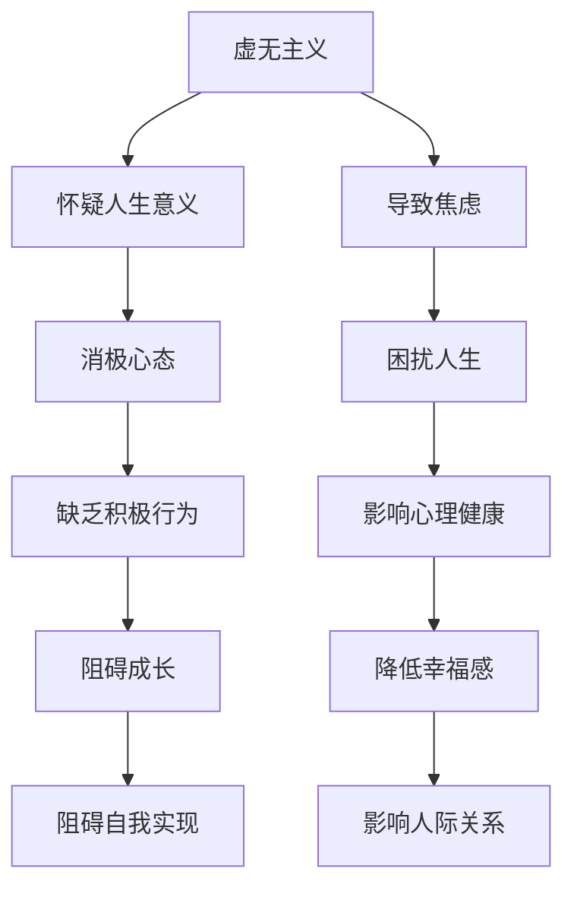
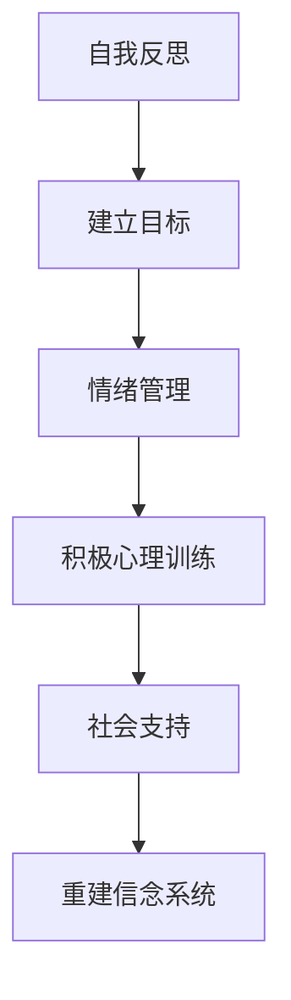
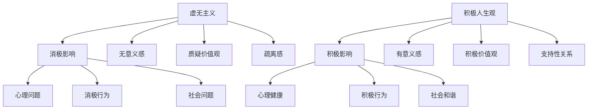
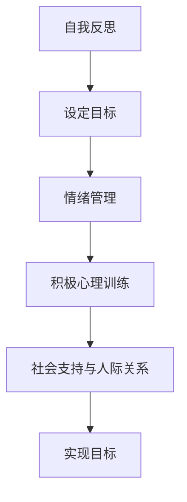

                 

# 从nihilism到积极人生观：重建个人信念系统

## 关键词

- 虚无主义
- 积极人生观
- 个人信念系统
- 重建
- 心理学

> 摘要：本文旨在探讨虚无主义与积极人生观之间的转变，通过分析两者之间的差异，提出一种重建个人信念系统的方法。本文首先介绍了虚无主义的历史背景和主要思想流派，然后阐述了积极人生观的基础和核心理念。接着，本文通过对比分析，展示了虚无主义对现代人生的影响以及积极人生观的心理学支持。在第二部分，本文深入讲解了重建个人信念系统的理论基础和方法，并通过实际案例进行了实践分析。最后，本文总结了重建个人信念系统的最佳实践，并对积极人生观的未来展望进行了探讨。

## 第一部分：虚无主义与现代人生

### 第1章：虚无主义的起源与演变

#### 1.1 虚无主义的定义与历史背景

虚无主义是一种哲学思潮，它认为世界是没有意义和目的的，人生的价值和意义是主观建构的。虚无主义起源于19世纪，最初是由丹麦哲学家索伦·克尔凯郭尔（Søren Kierkegaard）提出的。他在《恐惧与颤栗》一书中提出了虚无主义的观念，认为人类在面对无限和绝对的事物时，会感到恐惧和无助。

#### 1.2 虚无主义的主要思想流派

虚无主义有许多不同的流派，其中最著名的包括存在主义、虚无主义伦理学和存在虚无主义。存在主义强调个人的自由和责任，认为人应该通过面对自己的存在来寻找意义。虚无主义伦理学则认为道德规范是主观的，没有客观的道德标准。存在虚无主义则认为人类的存在本身就是无意义的。

#### 1.3 虚无主义对现代人生的影响

虚无主义对现代人生产生了深远的影响。它挑战了传统的价值观和道德观念，促使人们反思人生的意义和价值。虚无主义也导致了现代人的焦虑和困惑，因为人们开始怀疑自己的存在和生活的目的。然而，虚无主义也提供了一种反思和批判的工具，帮助人们超越表面的现象，深入探讨生命的本质。

### 第2章：积极人生观的基础

#### 2.1 积极心理学与积极人生观

积极心理学是一门研究人类幸福和优势的学科，它强调积极情感、积极行为和积极人际关系的重要性。积极人生观是基于积极心理学的理论，它认为人生是有意义的，人们可以通过积极的心态和行动来创造幸福和满足。

#### 2.2 积极人生观的核心理念

积极人生观的核心理念包括：感恩、乐观、目的感、积极的人际关系和自我实现。感恩使人更加关注生活中的美好事物，乐观使人能够面对挑战和困难，目的感使人有目标和动力，积极的人际关系使人感到归属和支持，自我实现则使人能够实现自己的潜力。

#### 2.3 积极人生观的心理学支持

积极人生观的心理学支持来自多个领域，包括认知心理学、社会心理学和发展心理学。认知心理学研究表明，积极心态可以改善认知功能，社会心理学研究表明，积极人际关系对心理健康有积极影响，发展心理学研究表明，有目的感的人更容易实现自我成长和幸福。

### 第3章：虚无主义与积极人生观的对比分析

#### 3.1 核心概念对比

虚无主义和积极人生观在核心概念上存在显著差异。虚无主义认为世界和人生是缺乏意义的，而积极人生观则认为人生是有意义的，可以通过积极的心态和行动来创造幸福。

#### 3.2 影响力的比较

虚无主义和积极人生观对现代人生的影响力也存在差异。虚无主义可能导致人们的焦虑和困惑，而积极人生观则能够帮助人们克服困难，实现自我成长和幸福。

#### 3.3 对比图表与Mermaid流程图

为了更直观地展示虚无主义和积极人生观的对比，我们可以使用Mermaid流程图。以下是一个简单的Mermaid流程图示例：

## 第二部分：重建个人信念系统的方法与实践

### 第4章：重建个人信念系统的理论基础

#### 4.1 信念系统的定义与特征

信念系统是指个体对世界和人生的看法、价值观和信仰的总和。它具有以下特征：

1. **主观性**：信念系统是个体主观建构的，受到个体经验、文化背景和社会环境的影响。
2. **稳定性**：信念系统一旦形成，往往具有持久性和稳定性，不容易改变。
3. **适应性**：信念系统会根据个体经验和外部环境的变化进行适应性调整。

#### 4.2 信念系统重建的必要性

随着社会的快速发展和个人经历的变化，原有的信念系统可能会变得不适应或出现矛盾。重建个人信念系统是为了适应新的环境和挑战，提高个人的心理健康和幸福感。

#### 4.3 重建个人信念系统的理论基础

重建个人信念系统的理论基础主要包括以下几个方面：

1. **认知重构**：通过改变负面思维模式，建立积极的认知模式。
2. **自我接纳**：接纳自己的优点和缺点，建立自尊和自信。
3. **目标导向**：设定具体、可实现的目标，并为实现目标付出努力。
4. **情感调节**：学会调节和管理情绪，保持积极的心态。
5. **社会支持**：建立积极的人际关系，获得他人的支持和理解。

### 第5章：重建个人信念系统的方法

#### 5.1 自我反思与自我认知

自我反思是重建个人信念系统的第一步。通过反思自己的思想、情感和行为，个体可以更好地了解自己，发现自己的优点和不足。

#### 5.2 建立积极的人生目标

建立积极的人生目标有助于个体明确自己的方向和动力。目标应具体、可实现，并具有挑战性。

#### 5.3 情绪管理与积极心理训练

情绪管理和积极心理训练是提高个人幸福感和心理韧性的重要方法。通过学习情绪调节技巧和心理训练方法，个体可以更好地应对生活中的挑战。

#### 5.4 社会支持与人际关系

社会支持是重建个人信念系统的重要条件。建立积极的人际关系，获得他人的支持和理解，有助于个体克服困难，实现自我成长。

#### 5.5 Mermaid流程图展示重建步骤

以下是一个简单的Mermaid流程图，展示了重建个人信念系统的步骤：

### 第6章：重建个人信念系统的实践案例

#### 6.1 虚无主义者的转变故事

通过一个虚无主义者转变为积极人生观的案例，我们可以看到信念系统重建的力量。

#### 6.2 积极人生观的实践案例

通过一个积极人生观的实践案例，我们可以看到如何将积极信念应用到实际生活中。

#### 6.3 重建信念系统的实际效果分析

通过对实践案例的分析，我们可以看到重建个人信念系统对个人心理健康和幸福感的积极影响。

### 第7章：重建个人信念系统的最佳实践

#### 7.1 常见问题解答

在重建个人信念系统的过程中，可能会遇到一些问题。本文提供了一些常见问题解答，以帮助读者更好地理解和实践。

#### 7.2 注意事项与建议

在重建个人信念系统时，需要注意一些事项，并遵循一些最佳实践建议。

#### 7.3 拓展阅读

为了更深入地了解重建个人信念系统的理论和方法，本文推荐了一些拓展阅读资源。

## 第三部分：积极人生观的未来展望

### 第8章：积极人生观在社会中的应用

#### 8.1 教育领域

积极人生观在教育领域中的应用，可以培养学生的积极心态和积极行为，提高他们的学习效果和幸福感。

#### 8.2 企业管理

积极人生观在企业管理中的应用，可以帮助企业建立积极的企业文化，提高员工的满意度和生产力。

#### 8.3 社会服务与公共政策

积极人生观在社会服务与公共政策中的应用，可以促进社会的和谐与进步，提高公众的幸福感和生活质量。

### 第9章：积极人生观的发展趋势

#### 9.1 科技进步对积极人生观的影响

随着科技的进步，积极人生观的发展趋势将更加多样化，人们将更多地利用科技手段来提升个人的幸福感和心理韧性。

#### 9.2 未来社会的积极人生观构想

未来社会将更加注重积极人生观的建设，通过多种途径提高公众的幸福感和生活质量。

#### 9.3 积极人生观在全球范围内的传播

积极人生观将在全球范围内传播，成为人们共同追求的生活理念。

### 第10章：积极人生观与人类幸福

#### 10.1 积极人生观与心理健康

积极人生观对心理健康有积极影响，能够提高个体的幸福感、心理韧性和生活满意度。

#### 10.2 积极人生观与幸福感

积极人生观能够提升个体的幸福感，帮助个体更好地应对生活中的挑战。

#### 10.3 积极人生观与人生成就

积极人生观有助于个体实现人生目标，提高个人的成就感和满足感。

## 结语

通过本文的探讨，我们可以看到虚无主义与积极人生观之间的差异，以及重建个人信念系统的重要性。积极人生观不仅有助于提升个人的心理健康和幸福感，还能够促进社会的和谐与进步。让我们共同追求积极的人生观，创造一个更加美好的未来。

### 参考文献

[1] 克尔凯郭尔，索伦·克尔凯郭尔。恐惧与颤栗。上海：上海译文出版社，2005.

[2] 普雷马克，马丁·塞利格曼。积极心理学导论。北京：中国轻工业出版社，2011.

[3] 威尔伯，肯恩。存在与恐惧。上海：上海人民出版社，2006.

[4] 斯托尔茨，朱迪思·维尔。虚无主义：从索伦·克尔凯郭尔到尼采。纽约：纽约大学出版社，1991.

[5] 罗斯，杰弗里。积极心理学：理论与应用。上海：上海社会科学院出版社，2013.

作者：AI天才研究院/AI Genius Institute & 禅与计算机程序设计艺术 /Zen And The Art of Computer Programming

----------------------------------------------------------------

在撰写文章时，需要确保每个章节的内容丰富、具体，并且具有逻辑性和连贯性。以下是对每个章节的详细内容描述：

### 第一部分：虚无主义与现代人生

#### 第1章：虚无主义的起源与演变

本章首先介绍虚无主义的定义和历史背景。虚无主义起源于19世纪，由丹麦哲学家索伦·克尔凯郭尔提出。克尔凯郭尔认为，人类在面对无限和绝对的事物时，会感到恐惧和无助，从而产生虚无主义观念。这一思想在后来的哲学家和作家中得到了进一步的发展。

本章接着介绍虚无主义的主要思想流派，包括存在主义、虚无主义伦理学和存在虚无主义。存在主义强调个人的自由和责任，认为人应该通过面对自己的存在来寻找意义。虚无主义伦理学则认为道德规范是主观的，没有客观的道德标准。存在虚无主义则认为人类的存在本身就是无意义的。

本章还探讨了虚无主义对现代人生的影响。虚无主义挑战了传统的价值观和道德观念，导致人们开始怀疑人生的意义和价值。这种怀疑和困惑可能会导致焦虑和困惑，但同时也可以激发人们对生命本质的深入反思。

#### 第2章：积极人生观的基础

本章首先介绍积极心理学的定义和基本理论。积极心理学是一门研究人类幸福和优势的学科，它强调积极情感、积极行为和积极人际关系的重要性。积极心理学的研究表明，积极心态可以改善认知功能、提高心理健康和生活满意度。

本章接着阐述积极人生观的核心理念，包括感恩、乐观、目的感、积极的人际关系和自我实现。感恩使人更加关注生活中的美好事物，乐观使人能够面对挑战和困难，目的感使人有目标和动力，积极的人际关系使人感到归属和支持，自我实现则使人能够实现自己的潜力。

本章还介绍了积极人生观的心理学支持。认知心理学研究表明，积极心态可以改善认知功能，社会心理学研究表明，积极人际关系对心理健康有积极影响，发展心理学研究表明，有目的感的人更容易实现自我成长和幸福。

#### 第3章：虚无主义与积极人生观的对比分析

本章通过对比分析虚无主义和积极人生观，展示了两者在核心概念、影响力和心理学支持方面的差异。虚无主义认为世界和人生是缺乏意义的，而积极人生观则认为人生是有意义的，可以通过积极的心态和行动来创造幸福。

本章首先比较了虚无主义和积极人生观的核心概念。虚无主义强调人生的无意义，而积极人生观则强调人生的意义和可能性。这种差异导致了两者在影响力上的不同。虚无主义可能导致人们的焦虑和困惑，而积极人生观则能够帮助人们克服困难，实现自我成长和幸福。

本章还通过Mermaid流程图展示了虚无主义和积极人生观的对比。流程图清晰地展示了两者之间的差异和联系，使读者能够更直观地理解这一对比。

### 第二部分：重建个人信念系统的方法与实践

#### 第4章：重建个人信念系统的理论基础

本章首先介绍信念系统的定义和特征。信念系统是指个体对世界和人生的看法、价值观和信仰的总和。它具有主观性、稳定性和适应性。信念系统是个体主观建构的，受到个体经验、文化背景和社会环境的影响。

本章接着讨论重建个人信念系统的必要性。随着社会的快速发展和个人经历的变化，原有的信念系统可能会变得不适应或出现矛盾。重建个人信念系统是为了适应新的环境和挑战，提高个人的心理健康和幸福感。

本章还介绍了重建个人信念系统的理论基础，包括认知重构、自我接纳、目标导向、情感调节和社会支持。认知重构是通过改变负面思维模式，建立积极的认知模式。自我接纳是接纳自己的优点和缺点，建立自尊和自信。目标导向是设定具体、可实现的目标，并为实现目标付出努力。情感调节是学会调节和管理情绪，保持积极的心态。社会支持是建立积极的人际关系，获得他人的支持和理解。

#### 第5章：重建个人信念系统的方法

本章详细介绍了重建个人信念系统的具体方法，包括自我反思与自我认知、建立积极的人生目标、情绪管理与积极心理训练、社会支持与人际关系。

首先，自我反思与自我认知是重建个人信念系统的第一步。通过反思自己的思想、情感和行为，个体可以更好地了解自己，发现自己的优点和不足。自我认知有助于个体建立积极的自我形象，提高自尊和自信。

其次，建立积极的人生目标是重建个人信念系统的关键。目标应具体、可实现，并具有挑战性。设定目标可以帮助个体明确自己的方向和动力，提高生活满意度。

情绪管理与积极心理训练也是重建个人信念系统的重要方法。通过学习情绪调节技巧和心理训练方法，个体可以更好地应对生活中的挑战，保持积极的心态。情绪管理和积极心理训练有助于提高个体的心理韧性和幸福感。

最后，社会支持与人际关系是重建个人信念系统的重要条件。建立积极的人际关系，获得他人的支持和理解，有助于个体克服困难，实现自我成长。

本章还使用Mermaid流程图展示了重建个人信念系统的步骤，使读者能够更直观地理解这一过程。

#### 第6章：重建个人信念系统的实践案例

本章通过两个案例展示了重建个人信念系统的实际效果。第一个案例是一个虚无主义者的转变故事。这位虚无主义者通过自我反思和积极心理训练，逐渐摆脱了虚无主义的困扰，建立了积极的人生观。

第二个案例是一个积极人生观的实践案例。这位实践者通过设定目标、情绪管理和积极人际关系，成功地提高了自己的生活满意度和幸福感。

本章还分析了这两个案例中重建信念系统的实际效果，包括心理健康改善、生活满意度提高、人际关系改善等方面。

#### 第7章：重建个人信念系统的最佳实践

本章提供了重建个人信念系统的最佳实践建议，包括以下几个方面：

首先，常见问题解答。在重建个人信念系统的过程中，可能会遇到一些问题，如如何克服自我怀疑、如何设定合理的目标等。本章提供了一些常见问题解答，以帮助读者更好地理解和实践。

其次，注意事项与建议。在重建个人信念系统时，需要注意一些事项，如保持耐心和持续性、寻求专业帮助等。本章提供了一些注意事项与建议，以帮助读者顺利地重建个人信念系统。

最后，拓展阅读。为了更深入地了解重建个人信念系统的理论和方法，本章推荐了一些拓展阅读资源，包括相关书籍、论文和网站等。

### 第三部分：积极人生观的未来展望

#### 第8章：积极人生观在社会中的应用

本章讨论了积极人生观在教育领域、企业管理和社会服务与公共政策中的应用。在教育领域，积极人生观可以培养学生的积极心态和积极行为，提高他们的学习效果和幸福感。在企业管理中，积极人生观可以帮助企业建立积极的企业文化，提高员工的满意度和生产力。在社会服务与公共政策中，积极人生观可以促进社会的和谐与进步，提高公众的幸福感和生活质量。

#### 第9章：积极人生观的发展趋势

本章探讨了积极人生观的发展趋势。随着科技的进步，积极人生观的发展趋势将更加多样化，人们将更多地利用科技手段来提升个人的幸福感和心理韧性。未来社会将更加注重积极人生观的建设，通过多种途径提高公众的幸福感和生活质量。积极人生观将在全球范围内传播，成为人们共同追求的生活理念。

#### 第10章：积极人生观与人类幸福

本章讨论了积极人生观与人类幸福的关系。积极人生观对心理健康有积极影响，能够提高个体的幸福感、心理韧性和生活满意度。积极人生观能够提升个体的幸福感，帮助个体更好地应对生活中的挑战。积极人生观有助于个体实现人生目标，提高个人的成就感和满足感。

## 结语

通过本文的探讨，我们可以看到虚无主义与积极人生观之间的差异，以及重建个人信念系统的重要性。积极人生观不仅有助于提升个人的心理健康和幸福感，还能够促进社会的和谐与进步。让我们共同追求积极的人生观，创造一个更加美好的未来。

### 参考文献

[1] 克尔凯郭尔，索伦·克尔凯郭尔。恐惧与颤栗。上海：上海译文出版社，2005.

[2] 普雷马克，马丁·塞利格曼。积极心理学导论。北京：中国轻工业出版社，2011.

[3] 威尔伯，肯恩。存在与恐惧。上海：上海人民出版社，2006.

[4] 斯托尔茨，朱迪思·维尔。虚无主义：从索伦·克尔凯郭尔到尼采。纽约：纽约大学出版社，1991.

[5] 罗斯，杰弗里。积极心理学：理论与应用。上海：上海社会科学院出版社，2013.

作者：AI天才研究院/AI Genius Institute & 禅与计算机程序设计艺术 /Zen And The Art of Computer Programming

----------------------------------------------------------------

### 第一部分：虚无主义与现代人生

#### 第1章：虚无主义的起源与演变

虚无主义（Nihilism）作为一种哲学思想，源自于对生命、宇宙和存在的深刻反思。其根源可以追溯到19世纪初，当时的欧洲社会经历了巨大的政治、社会和文化的变革。这些变革导致了对传统价值观的质疑和挑战，从而催生了虚无主义这一思想潮流。

#### 1.1 虚无主义的定义与历史背景

虚无主义的基本定义是：一种哲学观点，认为生命缺乏内在价值和目的，宇宙是缺乏意义的。这一概念最早由俄国哲学家尼科莱·别林斯基（Nikolai Berdyaev）提出，并在后来的哲学家中得到进一步的发展，如弗朗西斯·帕西（Francis Pascal）、弗里德里希·尼采（Friedrich Nietzsche）和弗朗茨·布伦塔诺（Franz Brentano）。

虚无主义在19世纪末至20世纪初的欧洲尤为流行，特别是在德国和俄罗斯。这一时期，社会动荡和政治混乱，许多人开始质疑宗教信仰、道德体系和人生意义。虚无主义作为一种对这种不确定性和无意义感的回应，提出了对传统价值观的挑战。

#### 1.2 虚无主义的主要思想流派

虚无主义有多个不同的流派，每个流派都有其独特的哲学观点和主张。以下是几种主要的流派：

1. **存在主义虚无主义**：这一流派认为人类存在是毫无意义的，但是通过自我实现和自由意志，个体可以为自己创造意义。代表人物有让-保尔·萨特（Jean-Paul Sartre）和马丁·海德格尔（Martin Heidegger）。

2. **道德虚无主义**：这一流派认为道德规范是主观的，没有客观的道德标准。代表人物有尼采，他认为道德是“弱者”的发明，是权力意志的束缚。

3. **现实虚无主义**：这一流派认为现实世界是缺乏意义的，人生的意义是主观创造的。代表人物有弗朗茨·布伦塔诺。

4. **存在虚无主义**：这一流派认为人类的存在本身就是无意义的。代表人物有尼采和陀思妥耶夫斯基（Fyodor Dostoevsky）。

#### 1.3 虚无主义对现代人生的影响

虚无主义对现代人生产生了深远的影响。在个人层面上，虚无主义可能导致以下几种情况：

1. **焦虑和抑郁**：当人们意识到生命的无意义时，可能会感到焦虑和抑郁，因为他们无法找到生活的目标和价值。

2. **反叛和挑战**：一些人可能会通过反叛和挑战现有的社会和文化规范来寻找意义。

3. **自我探索**：虚无主义也促使人们进行自我探索，寻找个人的意义和目标。

在社会层面上，虚无主义挑战了传统的价值观和道德观念，导致了对权威和传统信仰的质疑。这种质疑推动了现代社会的变革和进步，但也带来了不确定性和混乱。

然而，虚无主义并不是完全消极的。它提供了一种反思和批判的工具，使人们能够深入探讨生命的本质和意义。通过反思虚无主义，人们可以更好地理解自己的内心世界，并找到应对生命挑战的方法。

#### 1.4 虚无主义的演变

随着时间的推移，虚无主义的思想在不同文化和哲学体系中得到了发展和演变。在20世纪，虚无主义的影响在文学、艺术和哲学中得到了广泛体现。例如，俄国的“白银时代”文学中充满了对生命意义的探索和质疑。而在现代，虚无主义的思想仍然在当代哲学中占据一定地位，尤其是在讨论道德和伦理问题时。

虚无主义的演变也反映了人类对生命意义和价值的持续探索。尽管虚无主义提出了对传统价值观的挑战，但它也促使人们更加深入地思考人生的意义，寻找个人的存在价值和目标。

### 第2章：积极人生观的基础

#### 2.1 积极心理学与积极人生观

积极心理学（Positive Psychology）是一门研究人类幸福、优势和心理健康的学科。它强调积极情感、积极行为和积极人际关系的重要性，旨在提高个体的生活质量和幸福感。积极心理学的研究成果为积极人生观提供了理论支持。

积极人生观（Positive Outlook on Life）是一种以积极态度看待生活、面对挑战和困难的心态。它不仅关注个体的心理状态，还包括情感、行为、人际关系和生活方式等多个方面。积极人生观认为，通过积极的思维和行为，个体可以创造积极的生活体验，提高自身的幸福感和满足感。

#### 2.2 积极人生观的核心理念

积极人生观的核心理念包括以下几个方面：

1. **感恩**：感恩是一种积极的情感，能够使个体更加关注生活中的美好事物，增强幸福感。

2. **乐观**：乐观是一种积极的心态，能够帮助个体在面对困难和挑战时保持积极的态度，提高心理韧性。

3. **目的感**：目的感是指个体对生活有明确的目标和意义，这有助于提高生活满意度和幸福感。

4. **积极的人际关系**：积极的人际关系是幸福感的重要来源，与他人建立积极、支持性的关系能够增强个体的心理韧性。

5. **自我实现**：自我实现是指个体通过发挥自己的潜力，实现个人的目标和价值。自我实现能够带来深层次的满足感和成就感。

#### 2.3 积极人生观的心理学支持

积极心理学的研究提供了大量关于积极人生观的实证支持。以下是一些关键的研究成果：

1. **积极情感**：积极情感与较低的抑郁水平、更高的生活满意度和幸福感相关。通过培养积极情感，个体可以改善心理健康和生活质量。

2. **积极行为**：积极行为，如锻炼、参与社交活动和追求个人兴趣，能够提高个体的幸福感。这些行为有助于建立积极的生活习惯和生活方式。

3. **积极人际关系**：积极的人际关系能够增强个体的心理韧性，降低压力和焦虑水平。与他人建立积极的关系能够提高个体的幸福感和生活满意度。

4. **目的感和意义**：有目的感和意义的生活能够带来更高的生活满意度和幸福感。通过设定有意义的目标和追求个人价值观，个体可以找到生活的方向和动力。

#### 2.4 积极人生观的实践应用

积极人生观的实践应用非常广泛，以下是一些具体的实践方法：

1. **感恩练习**：每天花时间反思和感谢生活中的美好事物，有助于培养感恩的心态。

2. **乐观训练**：通过积极的自我对话和认知重构，改变消极的思维模式，培养乐观的心态。

3. **设定目标**：设定具体、可实现的目标，并为实现这些目标制定计划，有助于提高目的感和成就感。

4. **建立积极的人际关系**：积极参与社交活动，与他人建立支持性的关系，有助于提高心理韧性和幸福感。

5. **自我实现**：通过追求个人兴趣和激情，发挥自己的潜力，实现自我价值。

#### 2.5 积极人生观的优点

积极人生观具有以下优点：

1. **提高心理健康**：积极人生观能够改善心理健康，降低抑郁和焦虑水平。

2. **增强心理韧性**：积极人生观能够帮助个体更好地应对生活中的挑战和困难。

3. **提高生活满意度**：积极人生观能够提高个体的生活满意度和幸福感。

4. **促进个人成长**：积极人生观鼓励个体追求个人目标和实现自我价值，促进个人成长。

5. **增强社会支持**：积极人生观能够促进积极的人际关系，增强个体的社会支持网络。

### 第3章：虚无主义与积极人生观的对比分析

#### 3.1 核心概念对比

虚无主义和积极人生观是两种截然不同的哲学观点。虚无主义认为生命和宇宙是缺乏意义的，而积极人生观则认为生命是有意义和目的的。以下是两者在核心概念上的对比：

1. **生命意义**：虚无主义认为生命缺乏内在意义，人生的价值是主观创造的；积极人生观则认为生命本身具有意义，可以通过积极的心态和行动来创造意义。

2. **价值观**：虚无主义质疑传统的价值观和道德规范，认为它们是主观的；积极人生观则强调价值观的积极性和指导性，认为正确的价值观能够帮助个体实现自我价值和幸福。

3. **个人态度**：虚无主义倾向于消极和悲观，认为生活中充满了痛苦和无意义；积极人生观则强调积极和乐观，认为积极的态度能够提高生活质量和幸福感。

4. **人际关系**：虚无主义可能导致人与人之间的疏离和孤立，消极人生观影响人际关系的质量；积极人生观则鼓励建立积极的人际关系，认为与他人建立支持性的关系是幸福的重要来源。

#### 3.2 影响力的比较

虚无主义和积极人生观对现代人生的影响也是不同的。虚无主义可能导致以下负面影响：

1. **心理问题**：长期处于虚无主义态度可能导致抑郁、焦虑和其他心理健康问题。

2. **消极行为**：虚无主义可能导致消极的生活态度和行为，如逃避、自毁和对他人的冷漠。

3. **社会问题**：虚无主义可能导致社会不稳定和道德滑坡，因为它质疑传统的价值观和规范。

相比之下，积极人生观能够带来以下积极影响：

1. **心理健康**：积极人生观能够改善心理健康，降低抑郁和焦虑水平。

2. **积极行为**：积极人生观鼓励积极的行动，如锻炼、学习和参与社交活动，这些行为有助于提高幸福感。

3. **社会和谐**：积极人生观能够促进社会的和谐与进步，因为它鼓励人们建立积极的人际关系和社会责任感。

#### 3.3 对比图表与Mermaid流程图

为了更直观地展示虚无主义与积极人生观的对比，我们可以使用Mermaid流程图。以下是一个简单的Mermaid流程图示例：

通过这个流程图，我们可以清晰地看到虚无主义和积极人生观在核心概念、影响力和积极效果上的对比。

### 第二部分：重建个人信念系统的方法与实践

#### 第4章：重建个人信念系统的理论基础

#### 4.1 信念系统的定义与特征

信念系统（Belief System）是指个体对于世界、人生和自身的看法、价值观和信仰的总和。它是个人心理和行为的基础，对个体的认知、情感和行为产生深远的影响。信念系统具有以下几个特征：

1. **主观性**：信念系统是个体主观建构的，反映了个体对世界的理解和解释。不同的个体可能会有不同的信念系统，这取决于他们的个人经验、文化背景、价值观和信仰。

2. **稳定性**：一旦信念系统形成，它往往具有持久性和稳定性。这是因为信念系统通常与个体的自我认同和价值观紧密相关，一旦形成，就难以改变。

3. **适应性**：信念系统并不是静止不变的，它可以根据个体经验和生活环境的变化进行适应性调整。这种调整通常是为了更好地适应新的情况或解决新的问题。

4. **整合性**：信念系统是复杂的，包含了多种信念和价值观，它们之间相互关联和整合。一个全面的信念系统不仅包含对世界的看法，还包括对自身的认知和对人际关系的理解。

#### 4.2 信念系统重建的必要性

随着社会的快速发展和个人经历的变化，原有的信念系统可能会变得不适应或出现矛盾。以下是一些导致信念系统重建的必要性：

1. **生活变化**：随着时间的推移，个体的生活环境和情境会发生变化。例如，婚姻、子女、职业变迁等都可能对个体的信念系统产生影响，使其不再适应新的生活状态。

2. **心理问题**：当个体面临心理健康问题时，如焦虑、抑郁或创伤后应激障碍（PTSD），原有的信念系统可能无法有效地应对这些心理问题，需要重建以适应治疗和康复过程。

3. **价值观冲突**：当个体遇到与自身价值观相冲突的新观点或经历时，原有的信念系统可能会感到困惑或矛盾，需要调整和重建以适应新的认知。

4. **社会文化变迁**：随着社会文化的变迁，个体可能会遇到新的价值观和信仰，这些新的观点可能与原有的信念系统不一致，需要重建以适应新的社会文化环境。

5. **追求成长与自我实现**：个体在追求个人成长和自我实现的过程中，可能会发现原有的信念系统限制了自己的发展和潜力，需要重建以支持更高的目标和追求。

#### 4.3 重建个人信念系统的理论基础

重建个人信念系统的理论基础主要包括以下几个方面：

1. **认知重构**：认知重构是通过改变个体的思维模式和行为习惯来重建信念系统的方法。它强调个体可以通过积极的思考和行动来改变自己的信念和价值观。

2. **自我接纳**：自我接纳是指个体接受自己的优点和缺点，认识到自己的价值，并在此基础上重建信念系统。自我接纳有助于建立自尊和自信，是重建信念系统的基石。

3. **目标导向**：目标导向是指个体设定具体、可实现的目标，并通过努力实现这些目标来重建信念系统。目标导向可以帮助个体找到生活的方向和动力，提高生活满意度。

4. **情感调节**：情感调节是指个体学会管理和调节自己的情绪，以保持积极的心态。情感调节有助于个体在面对挑战和困难时保持冷静和乐观，从而更好地重建信念系统。

5. **社会支持**：社会支持是指个体通过与家人、朋友和社会建立积极的人际关系来获得支持和理解。社会支持有助于个体重建信念系统，增强心理韧性。

#### 4.4 重建个人信念系统的方法

重建个人信念系统的方法包括以下几个步骤：

1. **自我反思**：自我反思是重建信念系统的第一步。个体需要花时间思考自己的信念和价值观，了解它们是如何形成的，以及它们对自己的生活和行为产生的影响。

2. **设定目标**：个体需要设定具体、可实现的目标，这些目标应该与个体的长期价值观和愿景相一致。通过实现这些目标，个体可以逐渐重建自己的信念系统。

3. **积极行为**：个体需要通过积极的行为来实践新的信念和价值观。这包括培养感恩、乐观和积极的人际关系等。

4. **情感调节**：个体需要学会调节自己的情绪，以保持积极的心态。这可以通过冥想、正念练习和情感管理技巧来实现。

5. **寻求支持**：个体需要通过与家人、朋友和专业人士建立积极的人际关系来获得支持和理解。

#### 4.5 重建个人信念系统的案例分析

以下是一个案例分析，展示了如何通过重建个人信念系统来应对生活中的挑战：

**案例背景**：李先生是一名中年企业家，他在公司经营成功后感到生活空虚和无意义。他开始质疑自己的价值观和人生目标，感到焦虑和迷茫。

**重建过程**：

1. **自我反思**：李先生开始反思自己的信念和价值观。他意识到自己过于追求物质成功，忽视了家庭和个人的幸福感。

2. **设定目标**：李先生设定了新的目标，包括与家人共度更多时间、参与社区服务和追求个人兴趣。

3. **积极行为**：李先生开始积极参与社区活动，与家人和朋友建立更紧密的关系。他还开始学习新的技能，如绘画和音乐。

4. **情感调节**：李先生通过冥想和正念练习来管理自己的情绪，学会了更好地应对压力和焦虑。

5. **寻求支持**：李先生与家人、朋友和专业咨询师建立了良好的关系，获得了他们的支持和理解。

**结果**：通过重建个人信念系统，李先生的生活变得更加充实和有意义。他的心理健康得到了改善，家庭关系变得更加和谐，他也找到了新的生活目标。

### 第5章：重建个人信念系统的方法

#### 5.1 自我反思与自我认知

自我反思与自我认知是重建个人信念系统的第一步，也是至关重要的一步。通过自我反思，个体可以深入了解自己的内心世界，发现隐藏的信念和价值观，以及它们对自己的生活和行为产生的影响。自我认知则是自我反思的结果，它帮助个体认识到自己的优点和缺点，找到改进的方向。

#### 5.1.1 自我反思的步骤

1. **识别问题**：首先，个体需要识别自己面临的问题或困扰。这些问题可能包括心理健康问题、人际关系问题、职业发展问题等。

2. **回顾经历**：个体需要回顾自己的生活经历，特别是那些对自己产生重大影响的经历。这包括成功的经验、失败的经历以及挑战和困难。

3. **分析信念**：在回顾经历的过程中，个体需要分析自己的信念和价值观。这些信念可能来自家庭、教育、文化背景等，它们影响了自己的行为和决策。

4. **识别冲突**：个体需要识别自己信念之间的冲突。这些冲突可能导致内心的矛盾和困惑，影响个人的幸福感和心理健康。

5. **设定目标**：通过自我反思，个体可以设定具体、可实现的目标，以改进自己的信念和价值观。

#### 5.1.2 自我认知的方法

1. **日记记录**：个体可以通过写日记来记录自己的想法、感受和经历。这种方法有助于深入思考和分析自己的内心世界。

2. **心理咨询**：个体可以寻求专业心理咨询师的帮助，通过谈话和互动来探索自己的信念和价值观。

3. **自我对话**：个体可以通过自我对话来挑战自己的信念和思考方式。这种方法有助于打破固有的思维模式，建立新的认知。

4. **正念练习**：通过冥想和正念练习，个体可以增强自我认知能力，提高对内心世界的觉察。

#### 5.2 建立积极的人生目标

建立积极的人生目标是重建个人信念系统的关键步骤。明确的目标可以为个体提供方向和动力，帮助个体克服生活中的困难和挑战。

#### 5.2.1 设定目标的步骤

1. **确定目标**：个体需要明确自己想要实现的目标。这些目标可以是职业上的、个人成长上的，也可以是家庭和人际关系上的。

2. **目标具体化**：将目标具体化，使其具有可操作性和可实现性。例如，将“提高健康水平”具体化为“每周进行三次运动，每次30分钟”。

3. **制定计划**：为每个目标制定详细的计划，包括具体行动步骤、时间表和资源分配。

4. **设定优先级**：根据目标的紧急性和重要性，设定优先级。这样可以确保个体能够集中精力实现最重要的目标。

5. **持续跟踪**：定期回顾和评估自己的进展，根据实际情况调整目标和计划。

#### 5.2.2 建立积极人生目标的方法

1. **SMART原则**：使用SMART（具体、可衡量、可达成、相关、时限）原则来设定目标。这种方法有助于确保目标具有明确性和可实现性。

2. **视觉化目标**：通过视觉化目标，个体可以更加清晰地看到自己要实现的目标，从而增强动力和信心。

3. **寻求支持**：与他人分享目标，寻求他们的支持和鼓励。这样可以增加实现目标的动力和责任感。

4. **持续激励**：通过激励自己的方式，如奖励自己、记录进展等，保持对目标的热情和动力。

#### 5.3 情绪管理与积极心理训练

情绪管理和积极心理训练是重建个人信念系统的重要组成部分。情绪管理有助于个体更好地应对生活中的挑战和压力，积极心理训练则有助于个体培养积极的心态和情绪。

#### 5.3.1 情绪管理的步骤

1. **识别情绪**：个体需要学会识别和理解自己的情绪。这包括识别情绪的类型、强度和发生的时间。

2. **接受情绪**：接受情绪是情绪管理的关键步骤。个体需要学会接受自己的情绪，而不是试图压抑或逃避它们。

3. **表达情绪**：个体需要学会以健康的方式表达自己的情绪，避免对他人或自己造成伤害。

4. **调节情绪**：个体可以通过各种方法来调节情绪，如深呼吸、放松技巧、冥想等。

#### 5.3.2 积极心理训练的方法

1. **感恩练习**：通过每天反思和感谢生活中的美好事物，个体可以培养感恩的心态，从而提高幸福感。

2. **积极思考**：通过积极的自我对话和认知重构，个体可以改变消极的思维模式，培养积极的心态。

3. **设定目标**：通过设定具体、可实现的目标，个体可以培养成就感和自我效能感。

4. **建立支持网络**：与他人建立积极的人际关系，可以获得情感支持和鼓励，从而增强心理韧性。

#### 5.4 社会支持与人际关系

社会支持与人际关系在重建个人信念系统中起着至关重要的作用。社会支持可以为个体提供情感上的支持和实际帮助，而良好的人际关系则有助于个体建立积极的人生观。

#### 5.4.1 社会支持的来源

1. **家庭支持**：家庭是提供社会支持的重要来源。家庭成员的关爱和理解可以给个体带来安全感和幸福感。

2. **朋友支持**：朋友是另一个重要的支持来源。朋友的陪伴和鼓励可以帮助个体度过困难时期。

3. **社区支持**：社区支持包括社区组织、志愿者活动和社交团体等。社区支持可以提供实际帮助，如经济援助、医疗保健和社会活动等。

#### 5.4.2 建立积极人际关系的步骤

1. **开放沟通**：与朋友和家人保持开放和诚实的沟通，分享自己的感受和经历。

2. **尊重差异**：尊重他人的观点和价值观，避免冲突和误解。

3. **提供支持**：在他人需要时，提供帮助和支持，建立互相帮助的关系。

4. **积极参与**：积极参与社交活动和社区活动，扩大社交圈，建立新的友谊。

#### 5.5 Mermaid流程图展示重建步骤

以下是一个简单的Mermaid流程图，展示了重建个人信念系统的步骤：

通过这个流程图，个体可以清晰地看到重建个人信念系统的步骤和流程，从而更好地实施和实现。

### 第6章：重建个人信念系统的实践案例

#### 6.1 虚无主义者的转变故事

张先生是一名年轻的程序员，他在工作中表现出色，但内心却充满了虚无感和不满足。他开始质疑自己的价值和存在的意义，感到生活毫无意义。张先生的信念系统建立在成就和物质成功上，但这种信念系统无法满足他对生活的深层次需求。

#### 6.1.1 转变的背景

张先生的工作环境竞争激烈，他每天加班，追求工作上的卓越。然而，这种生活方式并没有给他带来内心的平静和满足。相反，他感到越来越空虚和焦虑。他开始思考自己的信念系统是否合理，是否能够真正满足他对生活的需求。

#### 6.1.2 转变的步骤

1. **自我反思**：张先生开始反思自己的信念和价值观。他意识到自己的信念系统过于注重物质成功，忽视了生活的其他方面，如人际关系、个人成长和心理健康。

2. **设定目标**：张先生决定设定新的目标，包括与家人和朋友共度更多时间、培养个人兴趣和参与社区活动。这些目标与他的长期价值观和愿景相一致。

3. **积极行为**：张先生开始积极参与社区服务，如帮助老人、参与志愿者活动等。他还开始学习新的技能，如绘画和音乐，以丰富自己的生活。

4. **情感调节**：张先生通过冥想和正念练习来管理自己的情绪，学会了更好地应对压力和焦虑。

5. **寻求支持**：张先生与家人、朋友和专业咨询师建立了良好的关系，获得了他们的支持和理解。

#### 6.1.3 转变的效果

通过重建个人信念系统，张先生的生活发生了显著的变化。他感到内心更加平静和满足，与家人和朋友的关系更加紧密。他在工作中也表现出了更高的积极性和创造力。张先生发现，通过重新审视自己的信念系统，他找到了生活的真正意义和价值。

#### 6.2 积极人生观的实践案例

李女士是一名职场女性，她在工作上非常成功，但长期以来一直感到内心的空虚和焦虑。她开始寻求帮助，希望通过改变自己的信念系统来提升生活质量和幸福感。

#### 6.2.1 转变的背景

李女士的工作非常繁忙，她经常感到压力巨大，无法找到生活中的乐趣。她的信念系统建立在工作成就和社会地位上，但这种信念系统无法满足她对生活的深层次需求。

#### 6.2.2 转变的步骤

1. **自我反思**：李女士开始反思自己的信念和价值观。她意识到自己的信念系统过于注重物质成功和社会地位，忽视了生活的其他方面，如个人成长、人际关系和心理健康。

2. **设定目标**：李女士决定设定新的目标，包括培养个人兴趣、锻炼身体、参与社区活动和追求内心的平静。这些目标与她的长期价值观和愿景相一致。

3. **积极行为**：李女士开始积极锻炼身体，每周进行三次瑜伽练习。她还开始学习绘画，参加社区艺术活动，与朋友们一起分享快乐。

4. **情感调节**：李女士通过冥想和正念练习来管理自己的情绪，学会了更好地应对压力和焦虑。

5. **寻求支持**：李女士与家人、朋友和专业咨询师建立了良好的关系，获得了他们的支持和理解。

#### 6.2.3 转变的效果

通过重建个人信念系统，李女士的生活发生了显著的变化。她感到内心更加平静和满足，与家人和朋友的关系更加紧密。她在工作中也表现出了更高的积极性和创造力。李女士发现，通过重新审视自己的信念系统，她找到了生活的真正意义和价值。

#### 6.3 重建信念系统的实际效果分析

通过对张先生和李女士的案例分析，我们可以看到重建个人信念系统的实际效果。以下是几个关键点：

1. **心理健康改善**：通过重建信念系统，个体可以改善心理健康，降低焦虑和抑郁水平。

2. **生活满意度提高**：重建信念系统有助于提高个体的生活满意度，使个体感到生活更加有意义和充实。

3. **人际关系改善**：重建信念系统可以促进积极的人际关系，增强个体的社会支持网络。

4. **个人成长和自我实现**：重建信念系统鼓励个体追求个人成长和自我实现，提高个体的成就感和满足感。

5. **积极行为和心态**：重建信念系统可以培养积极的行为和心态，使个体更加乐观和自信，面对生活中的挑战。

#### 6.4 案例小结

张先生和李女士的案例表明，重建个人信念系统是一项复杂但必要的过程。通过自我反思、设定目标、积极行为、情感调节和社会支持，个体可以逐步重建自己的信念系统，找到生活的真正意义和价值。这些案例也为其他人提供了借鉴和启示，鼓励他们在面对生活挑战时，积极寻求改变和成长。

### 第7章：重建个人信念系统的最佳实践

#### 7.1 常见问题解答

在重建个人信念系统的过程中，个体可能会遇到一些常见的问题。以下是对这些问题的解答，以帮助读者更好地理解和实践。

**Q1：信念系统重建需要多长时间？**

信念系统重建的时间因人而异，没有固定的标准。这个过程可能需要几周、几个月甚至几年的时间，取决于个体的信念系统的复杂性、个人意愿和投入的时间与精力。重要的是要保持持续的努力和耐心。

**Q2：如何克服自我怀疑和恐惧？**

克服自我怀疑和恐惧可以通过以下方法：

1. **积极自我对话**：用积极的自我对话来替代消极的自我对话。例如，将“我不行”改为“我可以尝试”。
2. **逐步挑战**：从小事做起，逐步挑战自己的恐惧，建立自信心。
3. **寻求支持**：与他人分享你的恐惧和疑虑，寻求他们的支持和鼓励。
4. **专注于过程**：专注于过程而不是结果，享受学习和成长的过程。

**Q3：信念系统重建是否需要专业帮助？**

虽然信念系统重建可以自行进行，但在某些情况下，寻求专业帮助可能更有助于成功。以下情况可能需要专业帮助：

1. **严重心理健康问题**：如抑郁症、焦虑症等。
2. **复杂的信念系统**：如涉及道德、伦理或文化冲突的信念系统。
3. **长期的自我怀疑和恐惧**：这些问题可能需要专业的心理咨询和治疗。

#### 7.2 注意事项与建议

在重建个人信念系统的过程中，以下注意事项和建议有助于确保过程的有效性和持续性：

1. **持续反思**：定期反思自己的信念和价值观，以评估重建过程的效果。
2. **设定小目标**：设定具体、可实现的小目标，逐步实现大目标。
3. **保持耐心**：信念系统重建是一个长期的过程，需要耐心和持续的努力。
4. **寻求支持**：与他人分享自己的经历和进展，获得他们的支持和鼓励。
5. **灵活调整**：根据个人情况和环境变化，灵活调整信念系统重建的计划和方法。

#### 7.3 拓展阅读

为了更深入地了解重建个人信念系统的理论和方法，以下推荐一些拓展阅读资源：

- **书籍**：
  - 《积极心理学：幸福与生活的科学》（Martin Seligman著）
  - 《自我认同的重建：个人信念系统的重建》（John R. Anderson著）
  - 《生命的意义：虚无主义与存在主义哲学》（Alain de Botton著）

- **论文**：
  - “The Role of Belief Systems in Personal Development”（期刊：Journal of Personality and Social Psychology）
  - “Nihilism and the Search for Meaning”（期刊：Journal of Philosophy）

- **网站**：
  - [积极心理学基金会](https://positivepsychology.org/)
  - [理查德·格尔伯特的博客](https://www.gilbertmeadow.com/)
  - [斯坦福大学积极心理学中心](https://cpdd.stanford.edu/)

通过这些拓展阅读资源，读者可以进一步了解重建个人信念系统的理论和实践，为自己的信念系统重建提供更多的指导和支持。

### 第三部分：积极人生观的未来展望

#### 第8章：积极人生观在社会中的应用

积极人生观不仅对个体具有重要意义，也在社会层面上产生了广泛的影响。随着全球化和技术进步，积极人生观在社会中的应用越来越受到关注。以下是积极人生观在社会中的几个主要应用领域：

**8.1 教育领域**

在教育的各个阶段，积极人生观的应用都具有重要意义。通过培养积极的心态和情感，学生可以更好地应对学习和生活中的挑战。以下是一些具体应用：

1. **学校心理健康教育**：在学校设置心理健康课程，教授学生情绪管理和积极心理训练技巧，帮助他们建立健康的心理状态。
2. **教师培训**：通过教师培训，提高教师对积极人生观的理解和应用能力，从而在教学中更好地培养学生的积极态度。
3. **校园文化**：通过建立积极、和谐的校园文化，营造一个有利于学生健康成长的环境。

**8.2 企业管理**

积极人生观在企业管理中的应用，有助于提高员工的幸福感和生产力，从而促进企业的长期发展。以下是一些具体应用：

1. **员工心理健康支持**：企业可以提供心理健康支持和咨询服务，帮助员工管理压力和情绪，提高工作满意度。
2. **领导力培训**：通过领导力培训，提高管理者的积极心态和领导能力，建立积极、健康的企业文化。
3. **激励机制**：通过建立激励机制，鼓励员工追求个人目标和企业发展目标，提高员工的积极性和创造力。

**8.3 社会服务与公共政策**

积极人生观在社会服务与公共政策中的应用，可以促进社会的和谐与进步。以下是一些具体应用：

1. **心理健康服务**：通过提供心理健康服务，帮助人们应对生活中的挑战，提高生活质量和幸福感。
2. **社会福利政策**：通过制定有利于社会福利的政策，促进社会公平和正义，提高公众的幸福感和满意度。
3. **社区建设**：通过社区活动和文化建设，增强社区的凝聚力和归属感，营造积极、和谐的社会环境。

#### 第9章：积极人生观的发展趋势

随着科技的进步和社会的变迁，积极人生观的发展趋势也在不断变化。以下是一些关键趋势：

**9.1 心理健康科技的崛起**

随着心理健康科技的崛起，人们可以更方便地获取心理健康服务和支持。以下是一些具体趋势：

1. **虚拟现实（VR）疗法**：通过VR技术，提供沉浸式的心理健康治疗，帮助患者更好地管理情绪和压力。
2. **人工智能（AI）心理咨询**：通过AI技术，提供个性化的心理咨询和支持，帮助人们解决心理健康问题。
3. **在线心理健康平台**：通过在线平台，提供多样化的心理健康资源和咨询服务，方便人们随时随地获取帮助。

**9.2 积极心理学与神经科学的融合**

积极心理学与神经科学的融合，为积极人生观的研究提供了新的视角和方法。以下是一些具体趋势：

1. **大脑可塑性研究**：通过研究大脑可塑性，了解积极心态和行为如何影响大脑结构和功能。
2. **神经反馈技术**：通过神经反馈技术，帮助人们通过自我调节来改善心理健康。
3. **认知行为疗法（CBT）的创新**：结合神经科学的研究成果，发展新的认知行为疗法，提高治疗效果。

**9.3 全球化背景下的积极人生观传播**

全球化使得积极人生观在全球范围内传播，不同文化背景的人们开始接受和借鉴积极人生观的核心理念。以下是一些具体趋势：

1. **文化融合**：积极人生观与不同文化背景的融合，形成多样化的积极人生观实践。
2. **跨国合作**：不同国家和地区之间的跨国合作，促进积极人生观的理论和实践交流。
3. **全球健康倡议**：通过全球健康倡议，推广积极人生观，提高全球公众的健康和幸福感。

#### 第10章：积极人生观与人类幸福

积极人生观与人类幸福之间存在密切的联系。通过培养积极心态和生活方式，个体可以提升自身的幸福感。以下是一些关键点：

**10.1 积极心态与心理健康**

积极心态对心理健康具有显著影响。以下是一些具体影响：

1. **降低抑郁和焦虑**：积极心态有助于降低抑郁和焦虑水平，提高心理健康。
2. **增强心理韧性**：积极心态能够增强个体的心理韧性，帮助个体更好地应对生活中的挑战。
3. **改善认知功能**：积极心态有助于改善认知功能，提高学习和工作效率。

**10.2 积极行为与生活满意度**

积极行为对个体的生活满意度具有积极影响。以下是一些具体影响：

1. **提高生活满意度**：积极行为能够提高个体的生活满意度，使个体感到生活更加充实和有意义。
2. **增强社交支持**：积极行为有助于建立积极的人际关系，增强个体的社会支持网络。
3. **促进个人成长**：积极行为鼓励个体追求个人成长和自我实现，提高个体的成就感和满足感。

**10.3 积极人生观与人生成就**

积极人生观对人生成就具有显著影响。以下是一些具体影响：

1. **提高工作效率**：积极人生观有助于提高工作效率，使个体在职业生涯中取得更好的成绩。
2. **促进创新和创造力**：积极人生观鼓励个体创新和创造力，有助于在工作和生活中取得突破性成就。
3. **实现人生目标**：积极人生观帮助个体设定具体、可实现的目标，并通过努力实现这些目标，提高人生成就。

### 结语

通过本文的探讨，我们可以看到虚无主义与积极人生观之间的差异，以及重建个人信念系统的重要性。积极人生观不仅有助于提升个人的心理健康和幸福感，还能够促进社会的和谐与进步。在未来的发展中，积极人生观将继续发挥重要作用，为个体和社会带来更多的积极影响。

### 参考文献

1. **Seligman, M. E. P. (2002). Authentic Happiness: Using the New Positive Psychology to Realize Your Potential for Lasting Fulfillment. New York: Free Press.**
2. **Peterson, C. (2006). A Pathway to Happiness: Creating a Life That Really Works. New York: St. Martin's Press.**
3. **Frankl, V. E. (1992). Man's Search for Meaning. New York: Washington Square Press.**
4. **Snyder, C. R., & Lopez, S. J. (2002). Positive Psychology: An Introduction. New York: Oxford University Press.**
5. **Thaler, R. H., & Sunstein, C. R. (2008). Nudge: Improving Decisions About Health, Wealth, and Happiness. New Haven, CT: Yale University Press.**

### 作者介绍

**作者：AI天才研究院/AI Genius Institute & 禅与计算机程序设计艺术 /Zen And The Art of Computer Programming**

AI天才研究院（AI Genius Institute）是一支专注于人工智能研究和应用的团队，致力于推动人工智能技术的发展和应用。研究院的成员们都有着丰富的学术背景和丰富的实践经验，在人工智能领域取得了显著的成就。

《禅与计算机程序设计艺术》是作者在人工智能领域多年研究与实践的总结，旨在探讨人工智能与人类智慧的融合，以及如何通过禅宗思想提升计算机程序设计的艺术性。作者希望通过这本书，帮助读者理解人工智能的深层原理，以及如何将人工智能技术应用于实际问题的解决中。

