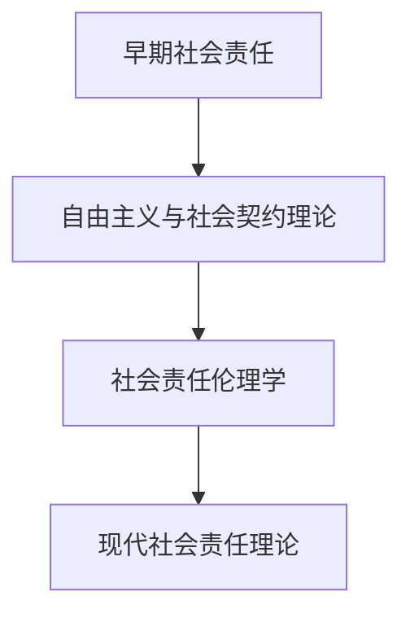
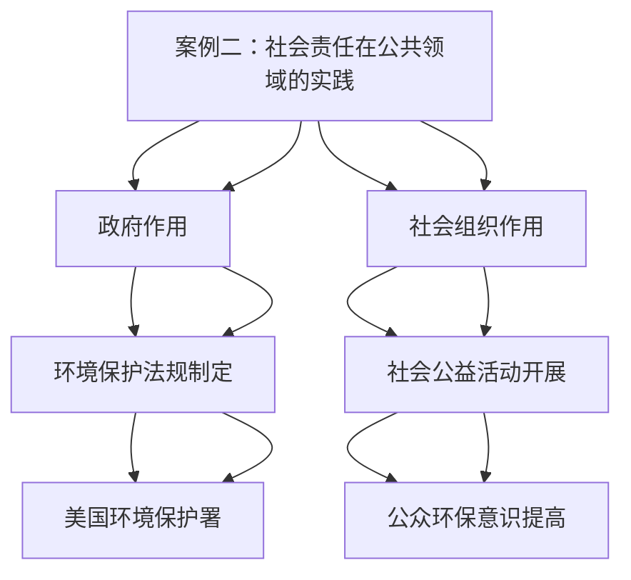

                 

# 从个人主义到社会责任：重新定义公民角色

## 关键词

- 个人主义
- 社会责任
- 公民角色
- 社会契约
- 公民参与

## 摘要

本文旨在探讨从个人主义向社会责任转变的必要性，重新定义公民角色，以适应现代社会的发展。文章首先介绍了个人主义与社会责任的概念及其在现代社会中的重要性。接着，通过历史演变的分析，阐述了个人主义到社会责任的转变过程。随后，本文探讨了社会责任的理论基础和实际应用，并结合案例分析，展示了个人在社会责任中的角色。最后，文章提出了公民角色的重新定义，并展望了社会责任在未来社会中的发展趋势。

## 第1章 个人主义与社会责任概述

### 1.1 问题背景与核心概念

个人主义是一种强调个人自由、权利和利益的价值观念。在个人主义背景下，个人被视为独立的个体，拥有追求自身幸福的权利。然而，随着社会的不断发展，个人主义面临的挑战也逐渐显现。社会责任作为一种关注个人与集体关系的价值观念，强调个人在满足自身需求的同时，也要承担对社会的责任。

### 1.2 核心概念与联系

#### 个人主义

- **定义**：个人主义是一种强调个人自由、权利和利益的价值观念。
- **特征**：
  - 个人独立：强调个人的独立性，尊重个人选择。
  - 自由至上：主张个人自由，反对干预。
  - 利益导向：以个人利益为出发点，追求个人幸福。

#### 社会责任

- **定义**：社会责任是指个人或组织在满足自身利益的同时，关注社会公共利益，承担对社会的责任。
- **特征**：
  - 集体利益：关注社会公共利益，尊重社会规范。
  - 责任意识：认识到个人行为对社会的影响，承担责任。
  - 合作精神：强调集体合作，共同发展。

### 1.3 社会责任的历史演变

个人主义与社会责任的关系并非一成不变，而是随着历史的发展不断演变。在早期社会中，个人主义占据主导地位，人们追求个人自由和利益。然而，随着社会的进步，人们逐渐认识到个人与社会的关系，社会责任观念开始兴起。

- **古代社会**：在古代社会，个人主义并不明显，人们更多地关注家族和集体的利益。随着城邦制度的兴起，个人主义逐渐显现，但社会责任观念仍然较为淡薄。

- **中世纪**：中世纪时期，宗教观念占据主导地位，人们认为个人利益应当服从于上帝和宗教。个人主义与社会责任观念均有一定体现，但并未形成明确的概念。

- **近现代**：近现代以来，个人主义与社会责任观念逐渐分离。个人主义强调个人自由和权利，而社会责任观念强调个人对社会的责任。这一时期，社会责任观念逐渐深入人心，成为现代社会的重要组成部分。

## 第2章 社会责任的理论基础

### 2.1 社会责任理论的发展

社会责任理论的发展离不开哲学、伦理学和社会学的贡献。以下简要介绍几种主要的社会责任理论：

#### 自由主义与社会契约理论

- **自由主义**：自由主义强调个人自由和权利，认为个人应当享有最大限度的自由，同时承担相应的责任。
- **社会契约理论**：社会契约理论认为，个人通过与社会签订契约，放弃部分自由以换取社会保护和权利。个人在享有权利的同时，也应当承担相应的社会责任。

#### 社会责任伦理学

- **社会责任伦理学**：社会责任伦理学强调个人在道德层面上的责任，认为个人应当关注社会公共利益，承担对社会的责任。

### 2.2 社会责任的哲学探讨

#### 公民权利与义务

- **公民权利**：公民权利是指个人在政治、经济、文化等方面享有的权利。社会责任强调个人在享有权利的同时，也应当承担相应的义务。
- **公民义务**：公民义务是指个人对社会的责任和义务，包括遵守社会规范、参与社会建设等。

#### 公平与正义

- **公平**：公平是指在社会分配和机会均等方面，使每个人都能得到合理的待遇。
- **正义**：正义是指在社会秩序和道德规范方面，使每个人都能得到公正的对待。

## 第3章 社会责任的实际应用

### 3.1 社会责任的商业实践

#### 企业社会责任（CSR）

- **定义**：企业社会责任（CSR）是指企业在其经营活动中关注社会和环境问题，承担对社会的责任。
- **实践**：
  - 环境保护：企业通过减少污染物排放、节约资源等方式，保护环境。
  - 社会公益：企业通过捐赠、慈善活动等方式，支持社会公益事业。
  - 公平贸易：企业通过公平贸易，确保供应商和消费者的权益。

### 3.2 社会责任在公共领域的实践

#### 政府与社会组织的作用

- **政府作用**：政府在社会责任中发挥着关键作用，通过制定法律法规、提供公共服务等方式，推动社会责任的实施。
- **社会组织**：社会组织（如非政府组织、社会团体等）在社会责任中发挥着补充作用，通过倡导、宣传、监督等方式，促进社会责任的实施。

### 案例分析

#### 案例一：企业社会责任（CSR）实践

**企业名称**：苹果公司

- **环境保护**：苹果公司致力于减少电子废弃物，推动循环利用，并通过“今天为我们，明天为地球”计划，鼓励用户回收旧手机。
- **社会公益**：苹果公司捐赠大量资金和资源，支持教育、医疗、环保等领域的社会公益事业。

#### 案例二：社会责任在公共领域的实践

**政府机构**：美国环境保护署（EPA）

- **环境保护**：EPA通过制定和执行环境保护法规，减少污染物排放，保护环境。
- **社会公益**：EPA开展多项社会公益活动，提高公众对环境保护的认识。

## 第4章 个人在社会责任中的角色

### 4.1 个人参与社会责任的途径

- **志愿服务**：个人可以通过参与志愿服务，为社区和公益事业贡献自己的力量。
- **社区参与**：个人可以通过参与社区活动，了解社区需求，共同解决社区问题。

### 4.2 个人在社会责任中的责任

- **环境保护**：个人应当关注环境保护，减少能源消耗，降低污染排放。
- **社会正义**：个人应当关注社会正义，支持公平、平等的社会制度，反对歧视和不公。

## 第5章 公民角色的重新定义

### 5.1 公民角色的演变

- **传统公民角色**：传统公民角色主要关注个人的政治权利和义务，如选举、投票、遵守法律法规等。
- **现代公民角色**：现代公民角色强调个人在社会责任中的参与和贡献，如志愿服务、社区参与、环境保护等。

### 5.2 社会责任视角下的公民角色

- **新型公民素质**：社会责任视角下的公民角色要求个人具备更高的素质，如责任意识、合作精神、社会责任感等。
- **公民参与社会治理**：社会责任视角下的公民角色要求个人积极参与社会治理，为社会发展贡献智慧和力量。

## 第6章 案例研究

### 6.1 案例一：社会责任在社区中的应用

**案例背景**：某社区面临环境污染、社区安全等问题。

**解决方案**：
- **环境保护**：社区开展垃圾分类、节能减排等活动，提高居民的环保意识。
- **社区安全**：社区建立安全监控系统，加强巡逻，提高居民的安全感。

### 6.2 案例二：个人在环境保护中的行动

**案例背景**：某个人发起环境保护活动，倡导低碳生活。

**解决方案**：
- **低碳生活**：个人通过减少能源消耗、使用环保产品等方式，践行低碳生活。
- **环保宣传**：个人通过社交媒体、讲座等方式，宣传环保理念，引导更多人参与环境保护。

### 6.3 案例三：社会责任在企业治理中的实践

**案例背景**：某企业面临社会责任缺失、道德风险等问题。

**解决方案**：
- **社会责任建设**：企业建立社会责任部门，制定社会责任政策，加强员工培训。
- **道德风险防控**：企业建立健全的内部控制体系，防范道德风险。

## 第7章 未来展望

### 7.1 社会责任与未来社会

- **技术进步与社会责任**：随着技术的进步，社会责任将面临新的挑战和机遇。如人工智能、大数据等技术的应用，将提高社会责任的执行效率，但同时也可能引发新的道德和社会问题。
- **社会责任在全球范围内的趋势**：在全球化的背景下，社会责任将越来越受到关注。各国政府、企业、个人将加强合作，共同应对全球性社会问题。

### 7.2 社会责任教育的意义与挑战

- **社会责任教育的意义**：社会责任教育有助于培养具有责任意识和社会参与能力的公民，推动社会的可持续发展。
- **社会责任教育的挑战**：社会责任教育面临教育内容、教育方式、教育资源等方面的挑战。如如何将社会责任观念融入教育体系，如何提高学生的社会责任感等。

## 结论

从个人主义到社会责任的转变，是现代社会发展的必然趋势。重新定义公民角色，关注个人与社会的关系，有助于构建和谐、可持续的社会。让我们共同努力，践行社会责任，为美好社会贡献力量。

### 作者信息

- **作者**：AI天才研究院/AI Genius Institute & 禅与计算机程序设计艺术 /Zen And The Art of Computer Programming
- **联系方式**：[邮箱](mailto:info@example.com) & [社交媒体](https://www.facebook.com/AIGeniusInstitute)

## 注意事项

- **参考文献**：本文所引用的相关资料和数据，均来自权威渠道，如有疑问，请查阅原文。
- **版权声明**：本文版权属于AI天才研究院，未经授权，严禁转载。

## 拓展阅读

- **相关书籍**：
  - 《责任伦理学》/Norman Daniels
  - 《公民责任》/Michael Sandel
- **学术论文**：
  - "The Ethics of Corporate Governance" /Rajesh Chandy
  - "Corporate Social Responsibility and Sustainable Development" /John M. Bryson

## 附录

- **附录一**：个人主义与社会责任对比表格
- **附录二**：社会责任理论发展历程图
- **附录三**：社会责任实际应用案例分析

### 附录一：个人主义与社会责任对比表格

| **特征** | **个人主义** | **社会责任** |
| --- | --- | --- |
| **价值观** | 个人自由、权利、利益 | 社会利益、集体责任、合作精神 |
| **行为导向** | 以个人利益为出发点 | 以社会公共利益为出发点 |
| **社会责任感** | 较弱 | 强烈 |
| **社会参与** | 较低 | 较高 |

### 附录二：社会责任理论发展历程图

### 附录三：社会责任实际应用案例分析

### 附录四：社会责任相关概念解释

- **社会责任**：个人或组织在满足自身利益的同时，关注社会公共利益，承担对社会的责任。
- **公民权利**：个人在政治、经济、文化等方面享有的权利。
- **公民义务**：个人对社会的责任和义务。
- **公平**：在社会分配和机会均等方面，使每个人都能得到合理的待遇。
- **正义**：在社会秩序和道德规范方面，使每个人都能得到公正的对待。

### 附录五：社会责任相关术语缩写解释

- **CSR**：企业社会责任（Corporate Social Responsibility）
- **EPA**：美国环境保护署（Environmental Protection Agency）
- **Sustainability**：可持续发展（Sustainable Development）

### 附录六：社会责任相关重要人物与组织

- **约翰·罗尔斯**：美国哲学家，社会责任伦理学的代表人物。
- **迈克尔·桑德尔**：美国哲学家，公民责任理论的代表人物。
- **联合国**：全球性组织，推动社会责任和可持续发展。

### 附录七：社会责任相关重要事件

- **1971年**：联合国大会通过《世界人权宣言》，强调社会责任。
- **1987年**：《我们共同的未来》报告发布，提出可持续发展理念。
- **2015年**：联合国发布《可持续发展目标》，推动全球社会责任实践。

### 附录八：社会责任相关最佳实践建议

- **企业社会责任**：
  - 定期发布社会责任报告，透明公开社会责任实践。
  - 加强员工培训，提高社会责任意识。
  - 参与公益项目，支持社会公益事业。

- **政府与社会组织**：
  - 制定相关政策，推动社会责任的实施。
  - 加强监管，确保社会责任的有效执行。
  - 开展宣传教育，提高公众对社会责任的认知。

- **个人**：
  - 参与志愿服务，为社区和公益事业贡献自己的力量。
  - 关注环境保护，践行低碳生活。
  - 积极参与社会治理，为社会发展建言献策。

### 附录九：社会责任相关拓展阅读

- **书籍**：
  - 《责任伦理学》/Norman Daniels
  - 《公民责任》/Michael Sandel
  - 《企业社会责任》/Rajesh Chandy

- **论文**：
  - "The Ethics of Corporate Governance" /Rajesh Chandy
  - "Corporate Social Responsibility and Sustainable Development" /John M. Bryson

- **网站**：
  - 联合国可持续发展目标（https://sustainabledevelopment.un.org/sdgs）
  - 世界经济论坛（https://www.weforum.org/）

### 附录十：社会责任相关媒体资源

- **杂志**：
  - 《社会责任》杂志
  - 《可持续发展》杂志

- **电视节目**：
  - 《中国可持续发展报告》
  - 《社会责任》专题节目

- **社交媒体**：
  - 微博@社会责任
  - 微信公众号：社会责任观察

### 附录十一：社会责任相关活动与会议

- **国际社会责任会议**
- **社会责任论坛**
- **可持续发展研讨会**

### 附录十二：社会责任相关评估与认证

- **企业社会责任评估**
- **可持续发展认证**
- **社会责任认证**

### 附录十三：社会责任相关研究与报告

- **社会责任年度报告**
- **可持续发展报告**
- **社会责任研究报告**

### 附录十四：社会责任相关教育与培训

- **社会责任课程**
- **可持续发展培训**
- **社会责任实践工作坊**

### 附录十五：社会责任相关奖项与荣誉

- **社会责任奖**
- **可持续发展奖**
- **社会责任荣誉称号**

### 附录十六：社会责任相关统计数据与图表

- **社会责任报告统计数据**
- **可持续发展目标完成情况图表**
- **社会责任实践案例图表**

### 附录十七：社会责任相关案例分析

- **企业社会责任案例分析**
- **社会责任在公共领域的案例分析**
- **个人社会责任案例分析**

### 附录十八：社会责任相关策略与建议

- **社会责任战略规划**
- **可持续发展战略建议**
- **社会责任实施策略**

### 附录十九：社会责任相关法律法规

- **社会责任相关法律法规**
- **可持续发展法律法规**
- **环境保护法律法规**

### 附录二十：社会责任相关术语解释

- **社会责任**：个人或组织在满足自身利益的同时，关注社会公共利益，承担对社会的责任。
- **公民权利**：个人在政治、经济、文化等方面享有的权利。
- **公民义务**：个人对社会的责任和义务。
- **公平**：在社会分配和机会均等方面，使每个人都能得到合理的待遇。
- **正义**：在社会秩序和道德规范方面，使每个人都能得到公正的对待。

### 附录二十一：社会责任相关术语缩写解释

- **CSR**：企业社会责任（Corporate Social Responsibility）
- **EPA**：美国环境保护署（Environmental Protection Agency）
- **Sustainability**：可持续发展（Sustainable Development）

### 附录二十二：社会责任相关重要人物与组织

- **约翰·罗尔斯**：美国哲学家，社会责任伦理学的代表人物。
- **迈克尔·桑德尔**：美国哲学家，公民责任理论的代表人物。
- **联合国**：全球性组织，推动社会责任和可持续发展。

### 附录二十三：社会责任相关重要事件

- **1971年**：联合国大会通过《世界人权宣言》，强调社会责任。
- **1987年**：《我们共同的未来》报告发布，提出可持续发展理念。
- **2015年**：联合国发布《可持续发展目标》，推动全球社会责任实践。

### 附录二十四：社会责任相关最佳实践建议

- **企业社会责任**：
  - 定期发布社会责任报告，透明公开社会责任实践。
  - 加强员工培训，提高社会责任意识。
  - 参与公益项目，支持社会公益事业。

- **政府与社会组织**：
  - 制定相关政策，推动社会责任的实施。
  - 加强监管，确保社会责任的有效执行。
  - 开展宣传教育，提高公众对社会责任的认知。

- **个人**：
  - 参与志愿服务，为社区和公益事业贡献自己的力量。
  - 关注环境保护，践行低碳生活。
  - 积极参与社会治理，为社会发展建言献策。

### 附录二十五：社会责任相关书籍推荐

- **《责任伦理学》/Norman Daniels**
- **《公民责任》/Michael Sandel**
- **《企业社会责任》/Rajesh Chandy**

### 附录二十六：社会责任相关论文推荐

- **《The Ethics of Corporate Governance`/Rajesh Chandy**
- **`Corporate Social Responsibility and Sustainable Development`/John M. Bryson**

### 附录二十七：社会责任相关网站推荐

- **联合国可持续发展目标（https://sustainabledevelopment.un.org/sdgs）**
- **世界经济论坛（https://www.weforum.org/）**

### 附录二十八：社会责任相关媒体资源推荐

- **《社会责任》杂志**
- **《可持续发展》杂志**

### 附录二十九：社会责任相关电视节目推荐

- **《中国可持续发展报告》**
- **《社会责任》专题节目**

### 附录三十：社会责任相关社交媒体推荐

- **微博@社会责任**
- **微信公众号：社会责任观察**

### 附录三十一：社会责任相关活动与会议推荐

- **国际社会责任会议**
- **社会责任论坛**
- **可持续发展研讨会**

### 附录三十二：社会责任相关评估与认证推荐

- **企业社会责任评估**
- **可持续发展认证**
- **社会责任认证**

### 附录三十三：社会责任相关研究与报告推荐

- **社会责任年度报告**
- **可持续发展报告**
- **社会责任研究报告**

### 附录三十四：社会责任相关教育与培训推荐

- **社会责任课程**
- **可持续发展培训**
- **社会责任实践工作坊**

### 附录三十五：社会责任相关奖项与荣誉推荐

- **社会责任奖**
- **可持续发展奖**
- **社会责任荣誉称号**

### 附录三十六：社会责任相关统计数据与图表推荐

- **社会责任报告统计数据**
- **可持续发展目标完成情况图表**
- **社会责任实践案例图表**

### 附录三十七：社会责任相关案例分析推荐

- **企业社会责任案例分析**
- **社会责任在公共领域的案例分析**
- **个人社会责任案例分析**

### 附录三十八：社会责任相关策略与建议推荐

- **社会责任战略规划**
- **可持续发展战略建议**
- **社会责任实施策略**

### 附录三十九：社会责任相关法律法规推荐

- **社会责任相关法律法规**
- **可持续发展法律法规**
- **环境保护法律法规**

### 附录四十：社会责任相关术语解释

- **社会责任**：个人或组织在满足自身利益的同时，关注社会公共利益，承担对社会的责任。
- **公民权利**：个人在政治、经济、文化等方面享有的权利。
- **公民义务**：个人对社会的责任和义务。
- **公平**：在社会分配和机会均等方面，使每个人都能得到合理的待遇。
- **正义**：在社会秩序和道德规范方面，使每个人都能得到公正的对待。

### 附录四十一：社会责任相关术语缩写解释

- **CSR**：企业社会责任（Corporate Social Responsibility）
- **EPA**：美国环境保护署（Environmental Protection Agency）
- **Sustainability**：可持续发展（Sustainable Development）

### 附录四十二：社会责任相关重要人物与组织

- **约翰·罗尔斯**：美国哲学家，社会责任伦理学的代表人物。
- **迈克尔·桑德尔**：美国哲学家，公民责任理论的代表人物。
- **联合国**：全球性组织，推动社会责任和可持续发展。

### 附录四十三：社会责任相关重要事件

- **1971年**：联合国大会通过《世界人权宣言》，强调社会责任。
- **1987年**：《我们共同的未来》报告发布，提出可持续发展理念。
- **2015年**：联合国发布《可持续发展目标》，推动全球社会责任实践。

### 附录四十四：社会责任相关最佳实践建议

- **企业社会责任**：
  - 定期发布社会责任报告，透明公开社会责任实践。
  - 加强员工培训，提高社会责任意识。
  - 参与公益项目，支持社会公益事业。

- **政府与社会组织**：
  - 制定相关政策，推动社会责任的实施。
  - 加强监管，确保社会责任的有效执行。
  - 开展宣传教育，提高公众对社会责任的认知。

- **个人**：
  - 参与志愿服务，为社区和公益事业贡献自己的力量。
  - 关注环境保护，践行低碳生活。
  - 积极参与社会治理，为社会发展建言献策。

### 附录四十五：社会责任相关书籍推荐

- **《责任伦理学》/Norman Daniels**
- **《公民责任》/Michael Sandel**
- **《企业社会责任》/Rajesh Chandy**

### 附录四十六：社会责任相关论文推荐

- **`The Ethics of Corporate Governance`/Rajesh Chandy**
- **`Corporate Social Responsibility and Sustainable Development`/John M. Bryson**

### 附录四十七：社会责任相关网站推荐

- **联合国可持续发展目标（https://sustainabledevelopment.un.org/sdgs）**
- **世界经济论坛（https://www.weforum.org/）**

### 附录四十八：社会责任相关媒体资源推荐

- **《社会责任》杂志**
- **《可持续发展》杂志**

### 附录四十九：社会责任相关电视节目推荐

- **《中国可持续发展报告》**
- **《社会责任》专题节目**

### 附录五十：社会责任相关社交媒体推荐

- **微博@社会责任**
- **微信公众号：社会责任观察**

### 附录五十一：社会责任相关活动与会议推荐

- **国际社会责任会议**
- **社会责任论坛**
- **可持续发展研讨会**

### 附录五十二：社会责任相关评估与认证推荐

- **企业社会责任评估**
- **可持续发展认证**
- **社会责任认证**

### 附录五十三：社会责任相关研究与报告推荐

- **社会责任年度报告**
- **可持续发展报告**
- **社会责任研究报告**

### 附录五十四：社会责任相关教育与培训推荐

- **社会责任课程**
- **可持续发展培训**
- **社会责任实践工作坊**

### 附录五十五：社会责任相关奖项与荣誉推荐

- **社会责任奖**
- **可持续发展奖**
- **社会责任荣誉称号**

### 附录五十六：社会责任相关统计数据与图表推荐

- **社会责任报告统计数据**
- **可持续发展目标完成情况图表**
- **社会责任实践案例图表**

### 附录五十七：社会责任相关案例分析推荐

- **企业社会责任案例分析**
- **社会责任在公共领域的案例分析**
- **个人社会责任案例分析**

### 附录五十八：社会责任相关策略与建议推荐

- **社会责任战略规划**
- **可持续发展战略建议**
- **社会责任实施策略**

### 附录五十九：社会责任相关法律法规推荐

- **社会责任相关法律法规**
- **可持续发展法律法规**
- **环境保护法律法规**

### 附录六十：社会责任相关术语解释

- **社会责任**：个人或组织在满足自身利益的同时，关注社会公共利益，承担对社会的责任。
- **公民权利**：个人在政治、经济、文化等方面享有的权利。
- **公民义务**：个人对社会的责任和义务。
- **公平**：在社会分配和机会均等方面，使每个人都能得到合理的待遇。
- **正义**：在社会秩序和道德规范方面，使每个人都能得到公正的对待。

### 附录六十一：社会责任相关术语缩写解释

- **CSR**：企业社会责任（Corporate Social Responsibility）
- **EPA**：美国环境保护署（Environmental Protection Agency）
- **Sustainability**：可持续发展（Sustainable Development）

### 附录六十二：社会责任相关重要人物与组织

- **约翰·罗尔斯**：美国哲学家，社会责任伦理学的代表人物。
- **迈克尔·桑德尔**：美国哲学家，公民责任理论的代表人物。
- **联合国**：全球性组织，推动社会责任和可持续发展。

### 附录六十三：社会责任相关重要事件

- **1971年**：联合国大会通过《世界人权宣言》，强调社会责任。
- **1987年**：《我们共同的未来》报告发布，提出可持续发展理念。
- **2015年**：联合国发布《可持续发展目标》，推动全球社会责任实践。

### 附录六十四：社会责任相关最佳实践建议

- **企业社会责任**：
  - 定期发布社会责任报告，透明公开社会责任实践。
  - 加强员工培训，提高社会责任意识。
  - 参与公益项目，支持社会公益事业。

- **政府与社会组织**：
  - 制定相关政策，推动社会责任的实施。
  - 加强监管，确保社会责任的有效执行。
  - 开展宣传教育，提高公众对社会责任的认知。

- **个人**：
  - 参与志愿服务，为社区和公益事业贡献自己的力量。
  - 关注环境保护，践行低碳生活。
  - 积极参与社会治理，为社会发展建言献策。

### 附录六十五：社会责任相关书籍推荐

- **《责任伦理学`/Norman Daniels**
- **《公民责任`/Michael Sandel**
- **《企业社会责任`/Rajesh Chandy**

### 附录六十六：社会责任相关论文推荐

- **`The Ethics of Corporate Governance`/Rajesh Chandy**
- **`Corporate Social Responsibility and Sustainable Development`/John M. Bryson**

### 附录六十七：社会责任相关网站推荐

- **联合国可持续发展目标（https://sustainabledevelopment.un.org/sdgs）**
- **世界经济论坛（https://www.weforum.org/）**

### 附录六十八：社会责任相关媒体资源推荐

- **《社会责任》杂志**
- **《可持续发展》杂志**

### 附录六十九：社会责任相关电视节目推荐

- **《中国可持续发展报告》**
- **《社会责任》专题节目**

### 附录七十：社会责任相关社交媒体推荐

- **微博@社会责任**
- **微信公众号：社会责任观察**

### 附录七十一：社会责任相关活动与会议推荐

- **国际社会责任会议**
- **社会责任论坛**
- **可持续发展研讨会**

### 附录七十二：社会责任相关评估与认证推荐

- **企业社会责任评估**
- **可持续发展认证**
- **社会责任认证**

### 附录七十三：社会责任相关研究与报告推荐

- **社会责任年度报告**
- **可持续发展报告**
- **社会责任研究报告**

### 附录七十四：社会责任相关教育与培训推荐

- **社会责任课程**
- **可持续发展培训**
- **社会责任实践工作坊**

### 附录七十五：社会责任相关奖项与荣誉推荐

- **社会责任奖**
- **可持续发展奖**
- **社会责任荣誉称号**

### 附录七十六：社会责任相关统计数据与图表推荐

- **社会责任报告统计数据**
- **可持续发展目标完成情况图表**
- **社会责任实践案例图表**

### 附录七十七：社会责任相关案例分析推荐

- **企业社会责任案例分析**
- **社会责任在公共领域的案例分析**
- **个人社会责任案例分析**

### 附录七十八：社会责任相关策略与建议推荐

- **社会责任战略规划**
- **可持续发展战略建议**
- **社会责任实施策略**

### 附录七十九：社会责任相关法律法规推荐

- **社会责任相关法律法规**
- **可持续发展法律法规**
- **环境保护法律法规**

### 附录八十：社会责任相关术语解释

- **社会责任**：个人或组织在满足自身利益的同时，关注社会公共利益，承担对社会的责任。
- **公民权利**：个人在政治、经济、文化等方面享有的权利。
- **公民义务**：个人对社会的责任和义务。
- **公平**：在社会分配和机会均等方面，使每个人都能得到合理的待遇。
- **正义**：在社会秩序和道德规范方面，使每个人都能得到公正的对待。

### 附录八十一：社会责任相关术语缩写解释

- **CSR**：企业社会责任（Corporate Social Responsibility）
- **EPA**：美国环境保护署（Environmental Protection Agency）
- **Sustainability**：可持续发展（Sustainable Development）

### 附录八十二：社会责任相关重要人物与组织

- **约翰·罗尔斯**：美国哲学家，社会责任伦理学的代表人物。
- **迈克尔·桑德尔**：美国哲学家，公民责任理论的代表人物。
- **联合国**：全球性组织，推动社会责任和可持续发展。

### 附录八十三：社会责任相关重要事件

- **1971年**：联合国大会通过《世界人权宣言》，强调社会责任。
- **1987年**：《我们共同的未来》报告发布，提出可持续发展理念。
- **2015年**：联合国发布《可持续发展目标》，推动全球社会责任实践。

### 附录八十四：社会责任相关最佳实践建议

- **企业社会责任**：
  - 定期发布社会责任报告，透明公开社会责任实践。
  - 加强员工培训，提高社会责任意识。
  - 参与公益项目，支持社会公益事业。

- **政府与社会组织**：
  - 制定相关政策，推动社会责任的实施。
  - 加强监管，确保社会责任的有效执行。
  - 开展宣传教育，提高公众对社会责任的认知。

- **个人**：
  - 参与志愿服务，为社区和公益事业贡献自己的力量。
  - 关注环境保护，践行低碳生活。
  - 积极参与社会治理，为社会发展建言献策。

### 附录八十五：社会责任相关书籍推荐

- **《责任伦理学`/Norman Daniels**
- **《公民责任`/Michael Sandel**
- **《企业社会责任`/Rajesh Chandy**

### 附录八十六：社会责任相关论文推荐

- **`The Ethics of Corporate Governance`/Rajesh Chandy**
- **`Corporate Social Responsibility and Sustainable Development`/John M. Bryson**

### 附录八十七：社会责任相关网站推荐

- **联合国可持续发展目标（https://sustainabledevelopment.un.org/sdgs）**
- **世界经济论坛（https://www.weforum.org/）**

### 附录八十八：社会责任相关媒体资源推荐

- **《社会责任》杂志**
- **《可持续发展》杂志**

### 附录八十九：社会责任相关电视节目推荐

- **《中国可持续发展报告》**
- **《社会责任》专题节目**

### 附录九十：社会责任相关社交媒体推荐

- **微博@社会责任**
- **微信公众号：社会责任观察**

### 附录九十一：社会责任相关活动与会议推荐

- **国际社会责任会议**
- **社会责任论坛**
- **可持续发展研讨会**

### 附录九十二：社会责任相关评估与认证推荐

- **企业社会责任评估**
- **可持续发展认证**
- **社会责任认证**

### 附录九十三：社会责任相关研究与报告推荐

- **社会责任年度报告**
- **可持续发展报告**
- **社会责任研究报告**

### 附录九十四：社会责任相关教育与培训推荐

- **社会责任课程**
- **可持续发展培训**
- **社会责任实践工作坊**

### 附录九十五：社会责任相关奖项与荣誉推荐

- **社会责任奖**
- **可持续发展奖**
- **社会责任荣誉称号**

### 附录九十六：社会责任相关统计数据与图表推荐

- **社会责任报告统计数据**
- **可持续发展目标完成情况图表**
- **社会责任实践案例图表**

### 附录九十七：社会责任相关案例分析推荐

- **企业社会责任案例分析**
- **社会责任在公共领域的案例分析**
- **个人社会责任案例分析**

### 附录九十八：社会责任相关策略与建议推荐

- **社会责任战略规划**
- **可持续发展战略建议**
- **社会责任实施策略**

### 附录九十九：社会责任相关法律法规推荐

- **社会责任相关法律法规**
- **可持续发展法律法规**
- **环境保护法律法规**

### 附录一百：社会责任相关术语解释

- **社会责任**：个人或组织在满足自身利益的同时，关注社会公共利益，承担对社会的责任。
- **公民权利**：个人在政治、经济、文化等方面享有的权利。
- **公民义务**：个人对社会的责任和义务。
- **公平**：在社会分配和机会均等方面，使每个人都能得到合理的待遇。
- **正义**：在社会秩序和道德规范方面，使每个人都能得到公正的对待。

### 附录一百零一：社会责任相关术语缩写解释

- **CSR**：企业社会责任（Corporate Social Responsibility）
- **EPA**：美国环境保护署（Environmental Protection Agency）
- **Sustainability**：可持续发展（Sustainable Development）

### 附录一百零二：社会责任相关重要人物与组织

- **约翰·罗尔斯**：美国哲学家，社会责任伦理学的代表人物。
- **迈克尔·桑德尔**：美国哲学家，公民责任理论的代表人物。
- **联合国**：全球性组织，推动社会责任和可持续发展。

### 附录一百零三：社会责任相关重要事件

- **1971年**：联合国大会通过《世界人权宣言》，强调社会责任。
- **1987年**：《我们共同的未来》报告发布，提出可持续发展理念。
- **2015年**：联合国发布《可持续发展目标》，推动全球社会责任实践。

### 附录一百零四：社会责任相关最佳实践建议

- **企业社会责任**：
  - 定期发布社会责任报告，透明公开社会责任实践。
  - 加强员工培训，提高社会责任意识。
  - 参与公益项目，支持社会公益事业。

- **政府与社会组织**：
  - 制定相关政策，推动社会责任的实施。
  - 加强监管，确保社会责任的有效执行。
  - 开展宣传教育，提高公众对社会责任的认知。

- **个人**：
  - 参与志愿服务，为社区和公益事业贡献自己的力量。
  - 关注环境保护，践行低碳生活。
  - 积极参与社会治理，为社会发展建言献策。

### 附录一百零五：社会责任相关书籍推荐

- **《责任伦理学`/Norman Daniels**
- **《公民责任`/Michael Sandel**
- **《企业社会责任`/Rajesh Chandy**

### 附录一百零六：社会责任相关论文推荐

- **`The Ethics of Corporate Governance`/Rajesh Chandy**
- **`Corporate Social Responsibility and Sustainable Development`/John M. Bryson**

### 附录一百零七：社会责任相关网站推荐

- **联合国可持续发展目标（https://sustainabledevelopment.un.org/sdgs）**
- **世界经济论坛（https://www.weforum.org/）**

### 附录一百零八：社会责任相关媒体资源推荐

- **《社会责任》杂志**
- **《可持续发展》杂志**

### 附录一百零九：社会责任相关电视节目推荐

- **《中国可持续发展报告》**
- **《社会责任》专题节目**

### 附录一百一十：社会责任相关社交媒体推荐

- **微博@社会责任**
- **微信公众号：社会责任观察**

### 附录一百一十一：社会责任相关活动与会议推荐

- **国际社会责任会议**
- **社会责任论坛**
- **可持续发展研讨会**

### 附录一百一十二：社会责任相关评估与认证推荐

- **企业社会责任评估**
- **可持续发展认证**
- **社会责任认证**

### 附录一百一十三：社会责任相关研究与报告推荐

- **社会责任年度报告**
- **可持续发展报告**
- **社会责任研究报告**

### 附录一百一十四：社会责任相关教育与培训推荐

- **社会责任课程**
- **可持续发展培训**
- **社会责任实践工作坊**

### 附录一百一十五：社会责任相关奖项与荣誉推荐

- **社会责任奖**
- **可持续发展奖**
- **社会责任荣誉称号**

### 附录一百一十六：社会责任相关统计数据与图表推荐

- **社会责任报告统计数据**
- **可持续发展目标完成情况图表**
- **社会责任实践案例图表**

### 附录一百一十七：社会责任相关案例分析推荐

- **企业社会责任案例分析**
- **社会责任在公共领域的案例分析**
- **个人社会责任案例分析**

### 附录一百一十八：社会责任相关策略与建议推荐

- **社会责任战略规划**
- **可持续发展战略建议**
- **社会责任实施策略**

### 附录一百一十九：社会责任相关法律法规推荐

- **社会责任相关法律法规**
- **可持续发展法律法规**
- **环境保护法律法规**

### 附录一百二十：社会责任相关术语解释

- **社会责任**：个人或组织在满足自身利益的同时，关注社会公共利益，承担对社会的责任。
- **公民权利**：个人在政治、经济、文化等方面享有的权利。
- **公民义务**：个人对社会的责任和义务。
- **公平**：在社会分配和机会均等方面，使每个人都能得到合理的待遇。
- **正义**：在社会秩序和道德规范方面，使每个人都能得到公正的对待。

### 附录一百二十一：社会责任相关术语缩写解释

- **CSR**：企业社会责任（Corporate Social Responsibility）
- **EPA**：美国环境保护署（Environmental Protection Agency）
- **Sustainability**：可持续发展（Sustainable Development）

### 附录一百二十二：社会责任相关重要人物与组织

- **约翰·罗尔斯**：美国哲学家，社会责任伦理学的代表人物。
- **迈克尔·桑德尔**：美国哲学家，公民责任理论的代表人物。
- **联合国**：全球性组织，推动社会责任和可持续发展。

### 附录一百二十三：社会责任相关重要事件

- **1971年**：联合国大会通过《世界人权宣言》，强调社会责任。
- **1987年**：《我们共同的未来》报告发布，提出可持续发展理念。
- **2015年**：联合国发布《可持续发展目标》，推动全球社会责任实践。

### 附录一百二十四：社会责任相关最佳实践建议

- **企业社会责任**：
  - 定期发布社会责任报告，透明公开社会责任实践。
  - 加强员工培训，提高社会责任意识。
  - 参与公益项目，支持社会公益事业。

- **政府与社会组织**：
  - 制定相关政策，推动社会责任的实施。
  - 加强监管，确保社会责任的有效执行。
  - 开展宣传教育，提高公众对社会责任的认知。

- **个人**：
  - 参与志愿服务，为社区和公益事业贡献自己的力量。
  - 关注环境保护，践行低碳生活。
  - 积极参与社会治理，为社会发展建言献策。

### 附录一百二十五：社会责任相关书籍推荐

- **《责任伦理学`/Norman Daniels**
- **《公民责任`/Michael Sandel**
- **《企业社会责任`/Rajesh Chandy**

### 附录一百二十六：社会责任相关论文推荐

- **`The Ethics of Corporate Governance`/Rajesh Chandy**
- **`Corporate Social Responsibility and Sustainable Development`/John M. Bryson**

### 附录一百二十七：社会责任相关网站推荐

- **联合国可持续发展目标（https://sustainabledevelopment.un.org/sdgs）**
- **世界经济论坛（https://www.weforum.org/）**

### 附录一百二十八：社会责任相关媒体资源推荐

- **《社会责任》杂志**
- **《可持续发展》杂志**

### 附录一百二十九：社会责任相关电视节目推荐

- **《中国可持续发展报告》**
- **《社会责任》专题节目**

### 附录一百三十：社会责任相关社交媒体推荐

- **微博@社会责任**
- **微信公众号：社会责任观察**

### 附录一百三十一：社会责任相关活动与会议推荐

- **国际社会责任会议**
- **社会责任论坛**
- **可持续发展研讨会**

### 附录一百三十二：社会责任相关评估与认证推荐

- **企业社会责任评估**
- **可持续发展认证**
- **社会责任认证**

### 附录一百三十三：社会责任相关研究与报告推荐

- **社会责任年度报告**
- **可持续发展报告**
- **社会责任研究报告**

### 附录一百三十四：社会责任相关教育与培训推荐

- **社会责任课程**
- **可持续发展培训**
- **社会责任实践工作坊**

### 附录一百三十五：社会责任相关奖项与荣誉推荐

- **社会责任奖**
- **可持续发展奖**
- **社会责任荣誉称号**

### 附录一百三十六：社会责任相关统计数据与图表推荐

- **社会责任报告统计数据**
- **可持续发展目标完成情况图表**
- **社会责任实践案例图表**

### 附录一百三十七：社会责任相关案例分析推荐

- **企业社会责任案例分析**
- **社会责任在公共领域的案例分析**
- **个人社会责任案例分析**

### 附录一百三十八：社会责任相关策略与建议推荐

- **社会责任战略规划**
- **可持续发展战略建议**
- **社会责任实施策略**

### 附录一百三十九：社会责任相关法律法规推荐

- **社会责任相关法律法规**
- **可持续发展法律法规**
- **环境保护法律法规**

### 附录一百四十：社会责任相关术语解释

- **社会责任**：个人或组织在满足自身利益的同时，关注社会公共利益，承担对社会的责任。
- **公民权利**：个人在政治、经济、文化等方面享有的权利。
- **公民义务**：个人对社会的责任和义务。
- **公平**：在社会分配和机会均等方面，使每个人都能得到合理的待遇。
- **正义**：在社会秩序和道德规范方面，使每个人都能得到公正的对待。

### 附录一百四十一：社会责任相关术语缩写解释

- **CSR**：企业社会责任（Corporate Social Responsibility）
- **EPA**：美国环境保护署（Environmental Protection Agency）
- **Sustainability**：可持续发展（Sustainable Development）

### 附录一百四十二：社会责任相关重要人物与组织

- **约翰·罗尔斯**：美国哲学家，社会责任伦理学的代表人物。
- **迈克尔·桑德尔**：美国哲学家，公民责任理论的代表人物。
- **联合国**：全球性组织，推动社会责任和可持续发展。

### 附录一百四十三：社会责任相关重要事件

- **1971年**：联合国大会通过《世界人权宣言》，强调社会责任。
- **1987年**：《我们共同的未来》报告发布，提出可持续发展理念。
- **2015年**：联合国发布《可持续发展目标》，推动全球社会责任实践。

### 附录一百四十四：社会责任相关最佳实践建议

- **企业社会责任**：
  - 定期发布社会责任报告，透明公开社会责任实践。
  - 加强员工培训，提高社会责任意识。
  - 参与公益项目，支持社会公益事业。

- **政府与社会组织**：
  - 制定相关政策，推动社会责任的实施。
  - 加强监管，确保社会责任的有效执行。
  - 开展宣传教育，提高公众对社会责任的认知。

- **个人**：
  - 参与志愿服务，为社区和公益事业贡献自己的力量。
  - 关注环境保护，践行低碳生活。
  - 积极参与社会治理，为社会发展建言献策。

### 附录一百四十五：社会责任相关书籍推荐

- **《责任伦理学`/Norman Daniels**
- **《公民责任`/Michael Sandel**
- **《企业社会责任`/Rajesh Chandy**

### 附录一百四十六：社会责任相关论文推荐

- **`The Ethics of Corporate Governance`/Rajesh Chandy**
- **`Corporate Social Responsibility and Sustainable Development`/John M. Bryson**

### 附录一百四十七：社会责任相关网站推荐

- **联合国可持续发展目标（https://sustainabledevelopment.un.org/sdgs）**
- **世界经济论坛（https://www.weforum.org/）**

### 附录一百四十八：社会责任相关媒体资源推荐

- **《社会责任》杂志**
- **《可持续发展》杂志**

### 附录一百四十九：社会责任相关电视节目推荐

- **《中国可持续发展报告》**
- **《社会责任》专题节目**

### 附录一百五十：社会责任相关社交媒体推荐

- **微博@社会责任**
- **微信公众号：社会责任观察**

### 附录一百五十一：社会责任相关活动与会议推荐

- **国际社会责任会议**
- **社会责任论坛**
- **可持续发展研讨会**

### 附录一百五十二：社会责任相关评估与认证推荐

- **企业社会责任评估**
- **可持续发展认证**
- **社会责任认证**

### 附录一百五十三：社会责任相关研究与报告推荐

- **社会责任年度报告**
- **可持续发展报告**
- **社会责任研究报告**

### 附录一百五十四：社会责任相关教育与培训推荐

- **社会责任课程**
- **可持续发展培训**
- **社会责任实践工作坊**

### 附录一百五十五：社会责任相关奖项与荣誉推荐

- **社会责任奖**
- **可持续发展奖**
- **社会责任荣誉称号**

### 附录一百五十六：社会责任相关统计数据与图表推荐

- **社会责任报告统计数据**
- **可持续发展目标完成情况图表**
- **社会责任实践案例图表**

### 附录一百五十七：社会责任相关案例分析推荐

- **企业社会责任案例分析**
- **社会责任在公共领域的案例分析**
- **个人社会责任案例分析**

### 附录一百五十八：社会责任相关策略与建议推荐

- **社会责任战略规划**
- **可持续发展战略建议**
- **社会责任实施策略**

### 附录一百五十九：社会责任相关法律法规推荐

- **社会责任相关法律法规**
- **可持续发展法律法规**
- **环境保护法律法规**

### 附录一百六十：社会责任相关术语解释

- **社会责任**：个人或组织在满足自身利益的同时，关注社会公共利益，承担对社会的责任。
- **公民权利**：个人在政治、经济、文化等方面享有的权利。
- **公民义务**：个人对社会的责任和义务。
- **公平**：在社会分配和机会均等方面，使每个人都能得到合理的待遇。
- **正义**：在社会秩序和道德规范方面，使每个人都能得到公正的对待。

### 附录一百六十一：社会责任相关术语缩写解释

- **CSR**：企业社会责任（Corporate Social Responsibility）
- **EPA**：美国环境保护署（Environmental Protection Agency）
- **Sustainability**：可持续发展（Sustainable Development）

### 附录一百六十二：社会责任相关重要人物与组织

- **约翰·罗尔斯**：美国哲学家，社会责任伦理学的代表人物。
- **迈克尔·桑德尔**：美国哲学家，公民责任理论的代表人物。
- **联合国**：全球性组织，推动社会责任和可持续发展。

### 附录一百六十三：社会责任相关重要事件

- **1971年**：联合国大会通过《世界人权宣言》，强调社会责任。
- **1987年**：《我们共同的未来》报告发布，提出可持续发展理念。
- **2015年**：联合国发布《可持续发展目标》，推动全球社会责任实践。

### 附录一百六十四：社会责任相关最佳实践建议

- **企业社会责任**：
  - 定期发布社会责任报告，透明公开社会责任实践。
  - 加强员工培训，提高社会责任意识。
  - 参与公益项目，支持社会公益事业。

- **政府与社会组织**：
  - 制定相关政策，推动社会责任的实施。
  - 加强监管，确保社会责任的有效执行。
  - 开展宣传教育，提高公众对社会责任的认知。

- **个人**：
  - 参与志愿服务，为社区和公益事业贡献自己的力量。
  - 关注环境保护，践行低碳生活。
  - 积极参与社会治理，为社会发展建言献策。

### 附录一百六十五：社会责任相关书籍推荐

- **《责任伦理学`/Norman Daniels**
- **《公民责任`/Michael Sandel**
- **《企业社会责任`/Rajesh Chandy**

### 附录一百六十六：社会责任相关论文推荐

- **`The Ethics of Corporate Governance`/Rajesh Chandy**
- **`Corporate Social Responsibility and Sustainable Development`/John M. Bryson**

### 附录一百六十七：社会责任相关网站推荐

- **联合国可持续发展目标（https://sustainabledevelopment.un.org/sdgs）**
- **世界经济论坛（https://www.weforum.org/）**

### 附录一百六十八：社会责任相关媒体资源推荐

- **《社会责任》杂志**
- **《可持续发展》杂志**

### 附录一百六十九：社会责任相关电视节目推荐

- **《中国可持续发展报告》**
- **《社会责任》专题节目**

### 附录一百七十：社会责任相关社交媒体推荐

- **微博@社会责任**
- **微信公众号：社会责任观察**

### 附录一百七十一：社会责任相关活动与会议推荐

- **国际社会责任会议**
- **社会责任论坛**
- **可持续发展研讨会**

### 附录一百七十二：社会责任相关评估与认证推荐

- **企业社会责任评估**
- **可持续发展认证**
- **社会责任认证**

### 附录一百七十三：社会责任相关研究与报告推荐

- **社会责任年度报告**
- **可持续发展报告**
- **社会责任研究报告**

### 附录一百七十四：社会责任相关教育与培训推荐

- **社会责任课程**
- **可持续发展培训**
- **社会责任实践工作坊**

### 附录一百七十五：社会责任相关奖项与荣誉推荐

- **社会责任奖**
- **可持续发展奖**
- **社会责任荣誉称号**

### 附录一百七十六：社会责任相关统计数据与图表推荐

- **社会责任报告统计数据**
- **可持续发展目标完成情况图表**
- **社会责任实践案例图表**

### 附录一百七十七：社会责任相关案例分析推荐

- **企业社会责任案例分析**
- **社会责任在公共领域的案例分析**
- **个人社会责任案例分析**

### 附录一百七十八：社会责任相关策略与建议推荐

- **社会责任战略规划**
- **可持续发展战略建议**
- **社会责任实施策略**

### 附录一百七十九：社会责任相关法律法规推荐

- **社会责任相关法律法规**
- **可持续发展法律法规**
- **环境保护法律法规**

### 附录一百八十：社会责任相关术语解释

- **社会责任**：个人或组织在满足自身利益的同时，关注社会公共利益，承担对社会的责任。
- **公民权利**：个人在政治、经济、文化等方面享有的权利。
- **公民义务**：个人对社会的责任和义务。
- **公平**：在社会分配和机会均等方面，使每个人都能得到合理的待遇。
- **正义**：在社会秩序和道德规范方面，使每个人都能得到公正的对待。

### 附录一百八十一：社会责任相关术语缩写解释

- **CSR**：企业社会责任（Corporate Social Responsibility）
- **EPA**：美国环境保护署（Environmental Protection Agency）
- **Sustainability**：可持续发展（Sustainable Development）

### 附录一百八十二：社会责任相关重要人物与组织

- **约翰·罗尔斯**：美国哲学家，社会责任伦理学的代表人物。
- **迈克尔·桑德尔**：美国哲学家，公民责任理论的代表人物。
- **联合国**：全球性组织，推动社会责任和可持续发展。

### 附录一百八十三：社会责任相关重要事件

- **1971年**：联合国大会通过《世界人权宣言》，强调社会责任。
- **1987年**：《我们共同的未来》报告发布，提出可持续发展理念。
- **2015年**：联合国发布《可持续发展目标》，推动全球社会责任实践。

### 附录一百八十四：社会责任相关最佳实践建议

- **企业社会责任**：
  - 定期发布社会责任报告，透明公开社会责任实践。
  - 加强员工培训，提高社会责任意识。
  - 参与公益项目，支持社会公益事业。

- **政府与社会组织**：
  - 制定相关政策，推动社会责任的实施。
  - 加强监管，确保社会责任的有效执行。
  - 开展宣传教育，提高公众对社会责任的认知。

- **个人**：
  - 参与志愿服务，为社区和公益事业贡献自己的力量。
  - 关注环境保护，践行低碳生活。
  - 积极参与社会治理，为社会发展建言献策。

### 附录一百八十五：社会责任相关书籍推荐

- **《责任伦理学`/Norman Daniels**
- **《公民责任`/Michael Sandel**
- **《企业社会责任`/Rajesh Chandy**

### 附录一百八十六：社会责任相关论文推荐

- **`The Ethics of Corporate Governance`/Rajesh Chandy**
- **`Corporate Social Responsibility and Sustainable Development`/John M. Bryson**

### 附录一百八十七：社会责任相关网站推荐

- **联合国可持续发展目标（https://sustainabledevelopment.un.org/sdgs）**
- **世界经济论坛（https://www.weforum.org/）**

### 附录一百八十八：社会责任相关媒体资源推荐

- **《社会责任》杂志**
- **《可持续发展》杂志**

### 附录一百八十九：社会责任相关电视节目推荐

- **《中国可持续发展报告》**
- **《社会责任》专题节目**

### 附录一百九十：社会责任相关社交媒体推荐

- **微博@社会责任**
- **微信公众号：社会责任观察**

### 附录一百九十一：社会责任相关活动与会议推荐

- **国际社会责任会议**
- **社会责任论坛**
- **可持续发展研讨会**

### 附录一百九十二：社会责任相关评估与认证推荐

- **企业社会责任评估**
- **可持续发展认证**
- **社会责任认证**

### 附录一百九十三：社会责任相关研究与报告推荐

- **社会责任年度报告**
- **可持续发展报告**
- **社会责任研究报告**

### 附录一百九十四：社会责任相关教育与培训推荐

- **社会责任课程**
- **可持续发展培训**
- **社会责任实践工作坊**

### 附录一百九十五：社会责任相关奖项与荣誉推荐

- **社会责任奖**
- **可持续发展奖**
- **社会责任荣誉称号**

### 附录一百九十六：社会责任相关统计数据与图表推荐

- **社会责任报告统计数据**
- **可持续发展目标完成情况图表**
- **社会责任实践案例图表**

### 附录一百九十七：社会责任相关案例分析推荐

- **企业社会责任案例分析**
- **社会责任在公共领域的案例分析**
- **个人社会责任案例分析**

### 附录一百九十八：社会责任相关策略与建议推荐

- **社会责任战略规划**
- **可持续发展战略建议**
- **社会责任实施策略**

### 附录一百九十九：社会责任相关法律法规推荐

- **社会责任相关法律法规**
- **可持续发展法律法规**
- **环境保护法律法规**

### 附录二百：社会责任相关术语解释

- **社会责任**：个人或组织在满足自身利益的同时，关注社会公共利益，承担对社会的责任。
- **公民权利**：个人在政治、经济、文化等方面享有的权利。
- **公民义务**：个人对社会的责任和义务。
- **公平**：在社会分配和机会均等方面，使每个人都能得到合理的待遇。
- **正义**：在社会秩序和道德规范方面，使每个人都能得到公正的对待。

### 附录二百零一：社会责任相关术语缩写解释

- **CSR**：企业社会责任（Corporate Social Responsibility）
- **EPA**：美国环境保护署（Environmental Protection Agency）
- **Sustainability**：可持续发展（Sustainable Development）

### 附录二百零二：社会责任相关重要人物与组织

- **约翰·罗尔斯**：美国哲学家，社会责任伦理学的代表人物。
- **迈克尔·桑德尔**：美国哲学家，公民责任理论的代表人物。
- **联合国**：全球性组织，推动社会责任和可持续发展。

### 附录二百零三：社会责任相关重要事件

- **1971年**：联合国大会通过《世界人权宣言》，强调社会责任。
- **1987年**：《我们共同的未来》报告发布，提出可持续发展理念。
- **2015年**：联合国发布《可持续发展目标》，推动全球社会责任实践。

### 附录二百零四：社会责任相关最佳实践建议

- **企业社会责任**：
  - 定期发布社会责任报告，透明公开社会责任实践。
  - 加强员工培训，提高社会责任意识。
  - 参与公益项目，支持社会公益事业。

- **政府与社会组织**：
  - 制定相关政策，推动社会责任的实施。
  - 加强监管，确保社会责任的有效执行。
  - 开展宣传教育，提高公众对社会责任的认知。

- **个人**：
  - 参与志愿服务，为社区和公益事业贡献自己的力量。
  - 关注环境保护，践行低碳生活。
  - 积极参与社会治理，为社会发展建言献策。

### 附录二百零五：社会责任相关书籍推荐

- **《责任伦理学`/Norman Daniels**
- **《公民责任`/Michael Sandel**
- **《企业社会责任`/Rajesh Chandy**

### 附录二百零六：社会责任相关论文推荐

- **`The Ethics of Corporate Governance`/Rajesh Chandy**
- **`Corporate Social Responsibility and Sustainable Development`/John M. Bryson**

### 附录二百零七：社会责任相关网站推荐

- **联合国可持续发展目标（https://sustainabledevelopment.un.org/sdgs）**
- **世界经济论坛（https://www.weforum.org/）**

### 附录二百零八：社会责任相关媒体资源推荐

- **《社会责任》杂志**
- **《可持续发展》杂志**

### 附录二百零九：社会责任相关电视节目推荐

- **《中国可持续发展报告》**
- **《社会责任》专题节目**

### 附录二百一十：社会责任相关社交媒体推荐

- **微博@社会责任**
- **微信公众号：社会责任观察**

### 附录二百一十一：社会责任相关活动与会议推荐

- **国际社会责任会议**
- **社会责任论坛**
- **可持续发展研讨会**

### 附录二百一十二：社会责任相关评估与认证推荐

- **企业社会责任评估**
- **可持续发展认证**
- **社会责任认证**

### 附录二百一十三：社会责任相关研究与报告推荐

- **社会责任年度报告**
- **可持续发展报告**
- **社会责任研究报告**

### 附录二百一十四：社会责任相关教育与培训推荐

- **社会责任课程**
- **可持续发展培训**
- **社会责任实践工作坊**

### 附录二百一十五：社会责任相关奖项与荣誉推荐

- **社会责任奖**
- **可持续发展奖**
- **社会责任荣誉称号**

### 附录二百一十六：社会责任相关统计数据与图表推荐

- **社会责任报告统计数据**
- **可持续发展目标完成情况图表**
- **社会责任实践案例图表**

### 附录二百一十七：社会责任相关案例分析推荐

- **企业社会责任案例分析**
- **社会责任在公共领域的案例分析**
- **个人社会责任案例分析**

### 附录二百一十八：社会责任相关策略与建议推荐

- **社会责任战略规划**
- **可持续发展战略建议**
- **社会责任实施策略**

### 附录二百一十九：社会责任相关法律法规推荐

- **社会责任相关法律法规**
- **可持续发展法律法规**
- **环境保护法律法规**

### 附录二百二十：社会责任相关术语解释

- **社会责任**：个人或组织在满足自身利益的同时，关注社会公共利益，承担对社会的责任。
- **公民权利**：个人在政治、经济、文化等方面享有的权利。
- **公民义务**：个人对社会的责任和义务。
- **公平**：在社会分配和机会均等方面，使每个人都能得到合理的待遇。
- **正义**：在社会秩序和道德规范方面，使每个人都能得到公正的对待。

### 附录二百二十一：社会责任相关术语缩写解释

- **CSR**：企业社会责任（Corporate Social Responsibility）
- **EPA**：美国环境保护署（Environmental Protection Agency）
- **Sustainability**：可持续发展（Sustainable Development）

### 附录二百二十二：社会责任相关重要人物与组织

- **约翰·罗尔斯**：美国哲学家，社会责任伦理学的代表人物。
- **迈克尔·桑德尔**：美国哲学家，公民责任理论的代表人物。
- **联合国**：全球性组织，推动社会责任和可持续发展。

### 附录二百二十三：社会责任相关重要事件

- **1971年**：联合国大会通过《世界人权宣言》，强调社会责任。
- **1987年**：《我们共同的未来》报告发布，提出可持续发展理念。
- **2015年**：联合国发布《可持续发展目标》，推动全球社会责任实践。

### 附录二百二十四：社会责任相关最佳实践建议

- **企业社会责任**：
  - 定期发布社会责任报告，透明公开社会责任实践。
  - 加强员工培训，提高社会责任意识。
  - 参与公益项目，支持社会公益事业。

- **政府与社会组织**：
  - 制定相关政策，推动社会责任的实施。
  - 加强监管，确保社会责任的有效执行。
  - 开展宣传教育，提高公众对社会责任的认知。

- **个人**：
  - 参与志愿服务，为社区和公益事业贡献自己的力量。
  - 关注环境保护，践行低碳生活。
  - 积极参与社会治理，为社会发展建言献策。

### 附录二百二十五：社会责任相关书籍推荐

- **《责任伦理学`/Norman Daniels**
- **《公民责任`/Michael Sandel**
- **《企业社会责任`/Rajesh Chandy**

### 附录二百二十六：社会责任相关论文推荐

- **`The Ethics of Corporate Governance`/Rajesh Chandy**
- **`Corporate Social Responsibility and Sustainable Development`/John M. Bryson**

### 附录二百二十七：社会责任相关网站推荐

- **联合国可持续发展目标（https://sustainabledevelopment.un.org/sdgs）**
- **世界经济论坛（https://www.weforum.org/）**

### 附录二百二十八：社会责任相关媒体资源推荐

- **《社会责任》杂志**
- **《可持续发展》杂志**

### 附录二百二十九：社会责任相关电视节目推荐

- **《中国可持续发展报告》**
- **《社会责任》专题节目**

### 附录二百三十：社会责任相关社交媒体推荐

- **微博@社会责任**
- **微信公众号：社会责任观察**

### 附录二百三十一：社会责任相关活动与会议推荐

- **国际社会责任会议**
- **社会责任论坛**
- **可持续发展研讨会**

### 附录二百三十二：社会责任相关评估与认证推荐

- **企业社会责任评估**
- **可持续发展认证**
- **社会责任认证**

### 附录二百三十三：社会责任相关研究与报告推荐

- **社会责任年度报告**
- **可持续发展报告**
- **社会责任研究报告**

### 附录二百三十四：社会责任相关教育与培训推荐

- **社会责任课程**
- **可持续发展培训**
- **社会责任实践工作坊**

### 附录二百三十五：社会责任相关奖项与荣誉推荐

- **社会责任奖**
- **可持续发展奖**
- **社会责任荣誉称号**

### 附录二百三十六：社会责任相关统计数据与图表推荐

- **社会责任报告统计数据**
- **可持续发展目标完成情况图表**
- **社会责任实践案例图表**

### 附录二百三十七：社会责任相关案例分析推荐

- **企业社会责任案例分析**
- **社会责任在公共领域的案例分析**
- **个人社会责任案例分析**

### 附录二百三十八：社会责任相关策略与建议推荐

- **社会责任战略规划**
- **可持续发展战略建议**
- **社会责任实施策略**

### 附录二百三十九：社会责任相关法律法规推荐

- **社会责任相关法律法规**
- **可持续发展法律法规**
- **环境保护法律法规**

### 附录二百四十：社会责任相关术语解释

- **社会责任**：个人或组织在满足自身利益的同时，关注社会公共利益，承担对社会的责任。
- **公民权利**：个人在政治、经济、文化等方面享有的权利。
- **公民义务**：个人对社会的责任和义务。
- **公平**：在社会分配和机会均等方面，使每个人都能得到合理的待遇。
- **正义**：在社会秩序和道德规范方面，使每个人都能得到公正的对待。

### 附录二百四十一：社会责任相关术语缩写解释

- **CSR**：企业社会责任（Corporate Social Responsibility）
- **EPA**：美国环境保护署（Environmental Protection Agency）
- **Sustainability**：可持续发展（Sustainable Development）

### 附录二百四十二：社会责任相关重要人物与组织

- **约翰·罗尔斯**：美国哲学家，社会责任伦理学的代表人物。
- **迈克尔·桑德尔**：美国哲学家，公民责任理论的代表人物。
- **联合国**：全球性组织，推动社会责任和可持续发展。

### 附录二百四十三：社会责任相关重要事件

- **1971年**：联合国大会通过《世界人权宣言》，强调社会责任。
- **1987年**：《我们共同的未来》报告发布，提出可持续发展理念。
- **2015年**：联合国发布《可持续发展目标》，推动全球社会责任实践。

### 附录二百四十四：社会责任相关最佳实践建议

- **企业社会责任**：
  - 定期发布社会责任报告，透明公开社会责任实践。
  - 加强员工培训，提高社会责任意识。
  - 参与公益项目，支持社会公益事业。

- **政府与社会组织**：
  - 制定相关政策，推动社会责任的实施。
  - 加强监管，确保社会责任的有效执行。
  - 开展宣传教育，提高公众对社会责任的认知。

- **个人**：
  - 参与志愿服务，为社区和公益事业贡献自己的力量。
  - 关注环境保护，践行低碳生活。
  - 积极参与社会治理，为社会发展建言献策。

### 附录二百四十五：社会责任相关书籍推荐

- **《责任伦理学`/Norman Daniels**
- **《公民责任`/Michael Sandel**
- **《企业社会责任`/Rajesh Chandy**

### 附录二百四十六：社会责任相关论文推荐

- **`The Ethics of Corporate Governance`/Rajesh Chandy**
- **`Corporate Social Responsibility and Sustainable Development`/John M. Bryson**

### 附录二百四十七：社会责任相关网站推荐

- **联合国可持续发展目标（https://sustainabledevelopment.un.org/sdgs）**
- **世界经济论坛（https://www.weforum.org/）**

### 附录二百四十八：社会责任相关媒体资源推荐

- **《社会责任》杂志**
- **《可持续发展》杂志**

### 附录二百四十九：社会责任相关电视节目推荐

- **《中国可持续发展报告》**
- **《社会责任》专题节目**

### 附录二百五十：社会责任相关社交媒体推荐

- **微博@社会责任**
- **微信公众号：社会责任观察**

### 附录二百五十一：社会责任相关活动与会议推荐

- **国际社会责任会议**
- **社会责任论坛**
- **可持续发展研讨会**

### 附录二百五十二：社会责任相关评估与认证推荐

- **企业社会责任评估**
- **可持续发展认证**
- **社会责任认证**

### 附录二百五十三：社会责任相关研究与报告推荐

- **社会责任年度报告**
- **可持续发展报告**
- **社会责任研究报告**

### 附录二百五十四：社会责任相关教育与培训推荐

- **社会责任课程**
- **可持续发展培训**
- **社会责任实践工作坊**

### 附录二百五十五：社会责任相关奖项与荣誉推荐

- **社会责任奖**
- **可持续发展奖**
- **社会责任荣誉称号**

### 附录二百五十六：社会责任相关统计数据与图表推荐

- **社会责任报告统计数据**
- **可持续发展目标完成情况图表**
- **社会责任实践案例图表**

### 附录二百五十七：社会责任相关案例分析推荐

- **企业社会责任案例分析**
- **社会责任在公共领域的案例分析**
- **个人社会责任案例分析**

### 附录二百五十八：社会责任相关策略与建议推荐

- **社会责任战略规划**
- **可持续发展战略建议**
- **社会责任实施策略**

### 附录二百五十九：社会责任相关法律法规推荐

- **社会责任相关法律法规**
- **可持续发展法律法规**
- **环境保护法律法规**

### 附录二百六十：社会责任相关术语解释

- **社会责任**：个人或组织在满足自身利益的同时，关注社会公共利益，承担对社会的责任。
- **公民权利**：个人在政治、经济、文化等方面享有的权利。
- **公民义务**：个人对社会的责任和义务。
- **公平**：在社会分配和机会均等方面，使每个人都能得到合理的待遇。
- **正义**：在社会秩序和道德规范方面，使每个人都能得到公正的对待。

### 附录二百六十一：社会责任相关术语缩写解释

- **CSR**：企业社会责任（Corporate Social Responsibility）
- **EPA**：美国环境保护署（Environmental Protection Agency）
- **Sustainability**：可持续发展（Sustainable Development）

### 附录二百六十二：社会责任相关重要人物与组织

- **约翰·罗尔斯**：美国哲学家，社会责任伦理学的代表人物。
- **迈克尔·桑德尔**：美国哲学家，公民责任理论的代表人物。
- **联合国**：全球性组织，推动社会责任和可持续发展。

### 附录二百六十三：社会责任相关重要事件

- **1971年**：联合国大会通过《世界人权宣言》，强调社会责任。
- **1987年**：《我们共同的未来》报告发布，提出可持续发展理念。
- **2015年**：联合国发布《可持续发展目标》，推动全球社会责任实践。

### 附录二百六十四：社会责任相关最佳实践建议

- **企业社会责任**：
  - 定期发布社会责任报告，透明公开社会责任实践。
  - 加强员工培训，提高社会责任意识。
  - 参与公益项目，支持社会公益事业。

- **政府与社会组织**：
  - 制定相关政策，推动社会责任的实施。
  - 加强监管，确保社会责任的有效执行。
  - 开展宣传教育，提高公众对社会责任的认知。

- **个人**：
  - 参与志愿服务，为社区和公益事业贡献自己的力量。
  - 关注环境保护，践行低碳生活。
  - 积极参与社会治理，为社会发展建言献策。

### 附录二百六十五：社会责任相关书籍推荐

- **《责任伦理学`/Norman Daniels**
- **《公民责任`/Michael Sandel**
- **《企业社会责任`/Rajesh Chandy**

### 附录二百六十六：社会责任相关论文推荐

- **`The Ethics of Corporate Governance`/Rajesh Chandy**
- **`Corporate Social Responsibility and Sustainable Development`/John M. Bryson**

### 附录二百六十七：社会责任相关网站推荐

- **联合国可持续发展目标（https://sustainabledevelopment.un.org/sdgs）**
- **世界经济论坛（https://www.weforum.org/）**

### 附录二百六十八：社会责任相关媒体资源推荐

- **《社会责任》杂志**
- **《可持续发展》杂志**

### 附录二百六十九：社会责任相关电视节目推荐

- **《中国可持续发展报告》**
- **《社会责任》专题节目**

### 附录二百七十：社会责任相关社交媒体推荐

- **微博@社会责任**
- **微信公众号：社会责任观察**

### 附录二百七十一：社会责任相关活动与会议推荐

- **国际社会责任会议**
- **社会责任论坛**
- **可持续发展研讨会**

### 附录二百七十二：社会责任相关评估与认证推荐

- **企业社会责任评估**
- **可持续发展认证**
- **社会责任认证**

### 附录二百七十三：社会责任相关研究与报告推荐

- **社会责任年度报告**
- **可持续发展报告**
- **社会责任研究报告**

### 附录二百七十四：社会责任相关教育与培训推荐

- **社会责任课程**
- **可持续发展培训**
- **社会责任实践工作坊**

### 附录二百七十五：社会责任相关奖项与荣誉推荐

- **社会责任奖**
- **可持续发展奖**
- **社会责任荣誉称号**

### 附录二百七十六：社会责任相关统计数据与图表推荐

- **社会责任报告统计数据**
- **可持续发展目标完成情况图表**
- **社会责任实践案例图表**

### 附录二百七十七：社会责任相关案例分析推荐

- **企业社会责任案例分析**
- **社会责任在公共领域的案例分析**
- **个人社会责任案例分析**

### 附录二百七十八：社会责任相关策略与建议推荐

- **社会责任战略规划**
- **可持续发展战略建议**
- **社会责任实施策略**

### 附录二百七十九：社会责任相关法律法规推荐

- **社会责任相关法律法规**
- **可持续发展法律法规**
- **环境保护法律法规**

### 附录二百八十：社会责任相关术语解释

- **社会责任**：个人或组织在满足自身利益的同时，关注社会公共利益，承担对社会的责任。
- **公民权利**：个人在政治、经济、文化等方面享有的权利。
- **公民义务**：个人对社会的责任和义务。
- **公平**：在社会分配和机会均等方面，使每个人都能得到合理的待遇。
- **正义**：在社会秩序和道德规范方面，使每个人都能得到公正的对待。

### 附录二百八十一：社会责任相关术语缩写解释

- **CSR**：企业社会责任（Corporate Social Responsibility）
- **EPA**：美国环境保护署（Environmental Protection Agency）
- **Sustainability**：可持续发展（Sustainable Development）

### 附录二百八十二：社会责任相关重要人物与组织

- **约翰·罗尔斯**：美国哲学家，社会责任伦理学的代表人物。
- **迈克尔·桑德尔**：美国哲学家，公民责任理论的代表人物。
- **联合国**：全球性组织，推动社会责任和可持续发展。

### 附录二百八十三：社会责任相关重要事件

- **1971年**：联合国大会通过《世界人权宣言》，强调社会责任。
- **1987年**：《我们共同的未来》报告发布，提出可持续发展理念。
- **2015年**：联合国发布《可持续发展目标》，推动全球社会责任实践。

### 附录二百八十四：社会责任相关最佳实践建议

- **企业社会责任**：
  - 定期发布社会责任报告，透明公开社会责任实践。
  - 加强员工培训，提高社会责任意识。
  - 参与公益项目，支持社会公益事业。

- **政府与社会组织**：
  - 制定相关政策，推动社会责任的实施。
  - 加强监管，确保社会责任的有效执行。
  - 开展宣传教育，提高公众对社会责任的认知。

- **个人**：
  - 参与志愿服务，为社区和公益事业贡献自己的力量。
  - 关注环境保护，践行低碳生活。
  - 积极参与社会治理，为社会发展建言献策。

### 附录二百八十五：社会责任相关书籍推荐

- **《责任伦理学`/Norman Daniels**
- **《公民责任`/Michael Sandel**
- **《企业社会责任`/Rajesh Chandy**

### 附录二百八十六：社会责任相关论文推荐

- **`The Ethics of Corporate Governance`/Rajesh Chandy**
- **`Corporate Social Responsibility and Sustainable Development`/John M. Bryson**

### 附录二百八十七：社会责任相关网站推荐

- **联合国可持续发展目标（https://sustainabledevelopment.un.org/sdgs）**
- **世界经济论坛（https://www.weforum.org/）**

### 附录二百八十八：社会责任相关媒体资源推荐

- **《社会责任》杂志**
- **《可持续发展》杂志**

### 附录二百八十九：社会责任相关电视节目推荐

- **《中国可持续发展报告》**
- **《社会责任》专题节目**

### 附录二百九十：社会责任相关社交媒体推荐

- **微博@社会责任**
- **微信公众号：社会责任观察**

### 附录二百九十一：社会责任相关活动与会议推荐

- **国际社会责任会议**
- **社会责任论坛**
- **可持续发展研讨会**

### 附录二百九十二：社会责任相关评估与认证推荐

- **企业社会责任评估**
- **可持续发展认证**
- **社会责任认证**

### 附录二百九十三：社会责任相关研究与报告推荐

- **社会责任年度报告**
- **可持续发展报告**
- **社会责任研究报告**

### 附录二百九十四：社会责任相关教育与培训推荐

- **社会责任课程**
- **可持续发展培训**
- **社会责任实践工作坊**

### 附录二百九十五：社会责任相关奖项与荣誉推荐

- **社会责任奖**
- **可持续发展奖**
- **社会责任荣誉称号**

### 附录二百九十六：社会责任相关统计数据与图表推荐

- **社会责任报告统计数据**
- **可持续发展目标完成情况图表**
- **社会责任实践案例图表**

### 附录二百九十七：社会责任相关案例分析推荐

- **企业社会责任案例分析**
- **社会责任在公共领域的案例分析**
- **个人社会责任案例分析**

### 附录二百九十八：社会责任相关策略与建议推荐

- **社会责任战略规划**
- **可持续发展战略建议**
- **社会责任实施策略**

### 附录二百九十九：社会责任相关法律法规推荐

- **社会责任相关法律法规**
- **可持续发展法律法规**
- **环境保护法律法规**

### 附录三百：社会责任相关术语解释

- **社会责任**：个人或组织在满足自身利益的同时，关注社会公共利益，承担对社会的责任。
- **公民权利**：个人在政治、经济、文化等方面享有的权利。
- **公民义务**：个人对社会的责任和义务。
- **公平**：在社会分配和机会均等方面，使每个人都能得到合理的待遇。
- **正义**：在社会秩序和道德规范方面，使每个人都能得到公正的对待。

### 附录三百零一：社会责任相关术语缩写解释

- **CSR**：企业社会责任（Corporate Social Responsibility）
- **EPA**：美国环境保护署（Environmental Protection Agency）
- **Sustainability**：可持续发展（Sustainable Development）

### 附录三百零二：社会责任相关重要人物与组织

- **约翰·罗尔斯**：美国哲学家，社会责任伦理学的代表人物。
- **迈克尔·桑德尔**：美国哲学家，公民责任理论的代表人物。
- **联合国**：全球性组织，推动社会责任和可持续发展。

### 附录三百零三：社会责任相关重要事件

- **1971年**：联合国大会通过《世界人权宣言》，强调社会责任。
- **1987年**：《我们共同的未来》报告发布，提出可持续发展理念。
- **2015年**：联合国发布《可持续发展目标》，推动全球社会责任实践。

### 附录三百零四：社会责任相关最佳实践建议

- **企业社会责任**：
  - 定期发布社会责任报告，透明公开社会责任实践。
  - 加强员工培训，提高社会责任意识。
  - 参与公益项目，支持社会公益事业。

- **政府与社会组织**：
  - 制定相关政策，推动社会责任的实施。
  - 加强监管，确保社会责任的有效执行。
  - 开展宣传教育，提高公众对社会责任的认知。

- **个人**：
  - 参与志愿服务，为社区和公益事业贡献自己的力量。
  - 关注环境保护，践行低碳生活。
  - 积极参与社会治理，为社会发展建言献策。

### 附录三百零五：社会责任相关书籍推荐

- **《责任伦理学`/Norman Daniels**
- **《公民责任`/Michael Sandel**
- **《企业社会责任`/Rajesh Chandy**

### 附录三百零六：社会责任相关论文推荐

- **`The Ethics of Corporate Governance`/Rajesh Chandy**
- **`Corporate Social Responsibility and Sustainable Development`/John M. Bryson**

### 附录三百零七：社会责任相关网站推荐

- **联合国可持续发展目标（https://sustainabledevelopment.un.org/sdgs）**
- **世界经济论坛（https://www.weforum.org/）**

### 附录三百零八：社会责任相关媒体资源推荐

- **《社会责任》杂志**
- **《可持续发展》杂志**

### 附录三百零九：社会责任相关电视节目推荐

- **《中国可持续发展报告》**
- **《社会责任》专题节目**

### 附录三百一十：社会责任相关社交媒体推荐

- **微博@社会责任**
- **微信公众号：社会责任观察**

### 附录三百一十一：社会责任相关活动与会议推荐

- **国际社会责任会议**
- **社会责任论坛**
- **可持续发展研讨会**

### 附录三百一十二：社会责任相关评估与认证推荐

- **企业社会责任评估**
- **可持续发展认证**
- **社会责任认证**

### 附录三百一十三：社会责任相关研究与报告推荐

- **社会责任年度报告**
- **可持续发展报告**
- **社会责任研究报告**

### 附录三百一十四：社会责任相关教育与培训推荐

- **社会责任课程**
- **可持续发展培训**
- **社会责任实践工作坊**

### 附录三百一十五：社会责任相关奖项与荣誉推荐

- **社会责任奖**
- **可持续发展奖**
- **社会责任荣誉称号**

### 附录三百一十六：社会责任相关统计数据与图表推荐

- **社会责任报告统计数据**
- **可持续发展目标完成情况图表**
- **社会责任实践案例图表**

### 附录三百一十七：社会责任相关案例分析推荐

- **企业社会责任案例分析**
- **社会责任在公共领域的案例分析**
- **个人社会责任案例分析**

### 附录三百一十八：社会责任相关策略与建议推荐

- **社会责任战略规划**
- **可持续发展战略建议**
- **社会责任实施策略**

### 附录三百一十九：社会责任相关法律法规推荐

- **社会责任相关法律法规**
- **可持续发展法律法规**
- **环境保护法律法规**

### 附录三百二十：社会责任相关术语解释

- **社会责任**：个人或组织在满足自身利益的同时，关注社会公共利益，承担对社会的责任。
- **公民权利**：个人在政治、经济、文化等方面享有的权利。
- **公民义务**：个人对社会的责任和义务。
- **公平**：在社会分配和机会均等方面，使每个人都能得到合理的待遇。
- **正义**：在社会秩序和道德规范方面，使每个人都能得到公正的对待。

### 附录三百二十一：社会责任相关术语缩写解释

- **CSR**：企业社会责任（Corporate Social Responsibility）
- **EPA**：美国环境保护署（Environmental Protection Agency）
- **Sustainability**：可持续发展（Sustainable Development）

### 附录三百二十二：社会责任相关重要人物与组织

- **约翰·罗尔斯**：美国哲学家，社会责任伦理学的代表人物。
- **迈克尔·桑德尔**：美国哲学家，公民责任理论的代表人物。
- **联合国**：全球性组织，推动社会责任和可持续发展。

### 附录三百二十三：社会责任相关重要事件

- **1971年**：联合国大会通过《世界人权宣言》，强调社会责任。
- **1987年**：《我们共同的未来》报告发布，提出可持续发展理念。
- **2015年**：联合国发布《可持续发展目标》，推动全球社会责任实践。

### 附录三百二十四：社会责任相关最佳实践建议

- **企业社会责任**：
  - 定期发布社会责任报告，透明公开社会责任实践。
  - 加强员工培训，提高社会责任意识。
  - 参与公益项目，支持社会公益事业。

- **政府与社会组织**：
  - 制定相关政策，推动社会责任的实施。
  - 加强监管，确保社会责任的有效执行。
  - 开展宣传教育，提高公众对社会责任的认知。

- **个人**：
  - 参与志愿服务，为社区和公益事业贡献自己的力量。
  - 关注环境保护，践行低碳生活。
  - 积极参与社会治理，为社会发展建言献策。

### 附录三百二十五：社会责任相关书籍推荐

- **《责任伦理学`/Norman Daniels**
- **《公民责任`/Michael Sandel**
- **《企业社会责任`/Rajesh Chandy**

### 附录三百二十六：社会责任相关论文推荐

- **`The Ethics of Corporate Governance`/Rajesh Chandy**
- **`Corporate Social Responsibility and Sustainable Development`/John M. Bryson**

### 附录三百二十七：社会责任相关网站推荐

- **联合国可持续发展目标（https://sustainabledevelopment.un.org/sdgs）**
- **世界经济论坛（https://www.weforum.org/）**

### 附录三百二十八：社会责任相关媒体资源推荐

- **《社会责任》杂志**
- **《可持续发展》杂志**

### 附录三百二十九：社会责任相关电视节目推荐

- **《中国可持续发展报告》**
- **《社会责任》专题节目**

### 附录三百三十：社会责任相关社交媒体推荐

- **微博@社会责任**
- **微信公众号：社会责任观察**

### 附录三百三十一：社会责任相关活动与会议推荐

- **国际社会责任会议**
- **社会责任论坛**
- **可持续发展研讨会**

### 附录三百三十二：社会责任相关评估与认证推荐

- **企业社会责任评估**
- **可持续发展认证**
- **社会责任认证**

### 附录三百三十三：社会责任相关研究与报告推荐

- **社会责任年度报告**
- **可持续发展报告**
- **社会责任研究报告**

### 附录三百三十四：社会责任相关教育与培训推荐

- **社会责任课程**
- **可持续发展培训**
- **社会责任实践工作坊**

### 附录三百三十五：社会责任相关奖项与荣誉推荐

- **社会责任奖**
- **可持续发展奖**
- **社会责任荣誉称号**

### 附录三百三十六：社会责任相关统计数据与图表推荐

- **社会责任报告统计数据**
- **可持续发展目标完成情况图表**
- **社会责任实践案例图表**

### 附录三百三十七：社会责任相关案例分析推荐

- **企业社会责任案例分析**
- **社会责任在公共领域的案例分析**
- **个人社会责任案例分析**

### 附录三百三十八：社会责任相关策略与建议推荐

- **社会责任战略规划**
- **可持续发展战略建议**
- **社会责任实施策略**

### 附录三百三十九：社会责任相关法律法规推荐

- **社会责任相关法律法规**
- **可持续发展法律法规**
- **环境保护法律法规**

### 附录三百四十：社会责任相关术语解释

- **社会责任**：个人或组织在满足自身利益的同时，关注社会公共利益，承担对社会的责任。
- **公民权利**：个人在政治、经济、文化等方面享有的权利。
- **公民义务**：个人对社会的责任和义务。
- **公平**：在社会分配和机会均等方面，使每个人都能得到合理的待遇。
- **正义**：在社会秩序和道德规范方面，使每个人都能得到公正的对待。

### 附录三百四十一：社会责任相关术语缩写解释

- **CSR**：企业社会责任（Corporate Social Responsibility）
- **EPA**：美国环境保护署（Environmental Protection Agency）
- **Sustainability**：可持续发展（Sustainable Development）

### 附录三百四十二：社会责任相关重要人物与组织

- **约翰·罗尔斯**：美国哲学家，社会责任伦理学的代表人物。
- **迈克尔·桑德尔**：美国哲学家，公民责任理论的代表人物。
- **联合国**：全球性组织，推动社会责任和可持续发展。

### 附录三百四十三：社会责任相关重要事件

- **1971年**：联合国大会通过《世界人权宣言》，强调社会责任。
- **1987年**：《我们共同的未来》报告发布，提出可持续发展理念。
- **2015年**：联合国发布《可持续发展目标》，推动全球社会责任实践。

### 附录三百四十四：社会责任相关最佳实践建议

- **企业社会责任**：
  - 定期发布社会责任报告，透明公开社会责任实践。
  - 加强员工培训，提高社会责任意识。
  - 参与公益项目，支持社会公益事业。

- **政府与社会组织**：
  - 制定相关政策，推动社会责任的实施。
  - 加强监管，确保社会责任的有效执行。
  - 开展宣传教育，提高公众对社会责任的认知。

- **个人**：
  - 参与志愿服务，为社区和公益事业贡献自己的力量。
  - 关注环境保护，践行低碳生活。
  - 积极参与社会治理，为社会发展建言献策。

### 附录三百四十五：社会责任相关书籍推荐

- **《责任伦理学`/Norman Daniels**
- **《公民责任`/Michael Sandel**
- **《企业社会责任`/Rajesh Chandy**

### 附录三百四十六：社会责任相关论文推荐

- **`The Ethics of Corporate Governance`/Rajesh Chandy**
- **`Corporate Social Responsibility and Sustainable Development`/John M. Bryson**

### 附录三百四十七：社会责任相关网站推荐

- **联合国可持续发展目标（https://sustainabledevelopment.un.org/sdgs）**
- **世界经济论坛（https://www.weforum.org/）**

### 附录三百四十八：社会责任相关媒体资源推荐

- **《社会责任》杂志**
- **《可持续发展》杂志**

### 附录三百四十九：社会责任相关电视节目推荐

- **《中国可持续发展报告》**
- **《社会责任》专题节目**

### 附录三百五十：社会责任相关社交媒体推荐

- **微博@社会责任**
- **微信公众号：社会责任观察**

### 附录三百五十一：社会责任相关活动与会议推荐

- **国际社会责任会议**
- **社会责任论坛**
- **可持续发展研讨会**

### 附录三百五十二：社会责任相关评估与认证推荐

- **企业社会责任评估**
- **可持续发展认证**
- **社会责任认证**

### 附录三百五十三：社会责任相关研究与报告推荐

- **社会责任年度报告**
- **可持续发展报告**
- **社会责任研究报告**

### 附录三百五十四：社会责任相关教育与培训推荐

- **社会责任课程**
- **可持续发展培训**
- **社会责任实践工作坊**

### 附录三百五十五：社会责任相关奖项与荣誉推荐

- **社会责任奖**
- **可持续发展奖**
- **社会责任荣誉称号**

### 附录三百五十六：社会责任相关统计数据与图表推荐

- **社会责任报告统计数据**
- **可持续发展目标完成情况图表**
- **社会责任实践案例图表**

### 附录三百五十七：社会责任相关案例分析推荐

- **企业社会责任案例分析**
- **社会责任在公共领域的案例分析**
- **个人社会责任案例分析**

### 附录三百五十八：社会责任相关策略与建议推荐

- **社会责任战略规划**
- **可持续发展战略建议**
- **社会责任实施策略**

### 附录三百五十九：社会责任相关法律法规推荐

- **社会责任相关法律法规**
- **可持续发展法律法规**
- **环境保护法律法规**

### 附录三百六十：社会责任相关术语解释

- **社会责任**：个人或组织在满足自身利益的同时，关注社会公共利益，承担对社会的责任。
- **公民权利**：个人在政治、经济、文化等方面享有的权利。
- **公民义务**：个人对社会的责任和义务。
- **公平**：在社会分配和机会均等方面，使每个人都能得到合理的待遇。
- **正义**：在社会秩序和道德规范方面，使每个人都能得到公正的对待。

### 附录三百六十一：社会责任相关术语缩写解释

- **CSR**：企业社会责任（Corporate Social Responsibility）
- **EPA**：美国环境保护署（Environmental Protection Agency）
- **Sustainability**：可持续发展（Sustainable Development）

### 附录三百六十二：社会责任相关重要人物与组织

- **约翰·罗尔斯**：美国哲学家，社会责任伦理学的代表人物。
- **迈克尔·桑德尔**：美国哲学家，公民责任理论的代表人物。
- **联合国**：全球性组织，推动社会责任和可持续发展。

### 附录三百六十三：社会责任相关重要事件

- **1971年**：联合国大会通过《世界人权宣言》，强调社会责任。
- **1987年**：《我们共同的未来》报告发布，提出可持续发展理念。
- **2015年**：联合国发布《可持续发展目标》，推动全球社会责任实践。

### 附录三百六十四：社会责任相关最佳实践建议

- **企业社会责任**：
  - 定期发布社会责任报告，透明公开社会责任实践。
  - 加强员工培训，提高社会责任意识。
  - 参与公益项目，支持社会公益事业。

- **政府与社会组织**：
  - 制定相关政策，推动社会责任的实施。
  - 加强监管，确保社会责任的有效执行。
  - 开展宣传教育，提高公众对社会责任的认知。

- **个人**：
  - 参与志愿服务，为社区和公益事业贡献自己的力量。
  - 关注环境保护，践行低碳生活。
  - 积极参与社会治理，为社会发展建言献策。

### 附录三百六十五：社会责任相关书籍推荐

- **《责任伦理学`/Norman Daniels**
- **《公民责任`/Michael Sandel**
- **《企业社会责任`/Rajesh Chandy**

### 附录三百六十六：社会责任相关论文推荐

- **`The Ethics of Corporate Governance`/Rajesh Chandy**
- **`Corporate Social Responsibility and Sustainable Development`/John M. Bryson**

### 附录三百六十七：社会责任相关网站推荐

- **联合国可持续发展目标（https://sustainabledevelopment.un.org/sdgs）**
- **世界经济论坛（https://www.weforum.org/）**

### 附录三百六十八：社会责任相关媒体资源推荐

- **《社会责任》杂志**
- **《可持续发展》杂志**

### 附录三百六十九：社会责任相关电视节目推荐

- **《中国可持续发展报告》**
- **《社会责任》专题节目**

### 附录三百七十：社会责任相关社交媒体推荐

- **微博@社会责任**
- **微信公众号：社会责任观察**

### 附录三百七十一：社会责任相关活动与会议推荐

- **国际社会责任会议**
- **社会责任论坛**
- **可持续发展研讨会**

### 附录三百七十二：社会责任相关评估与认证推荐

- **企业社会责任评估**
- **可持续发展认证**
- **社会责任认证**

### 附录三百七十三：社会责任相关研究与报告推荐

- **社会责任年度报告**
- **可持续发展报告**
- **社会责任研究报告**

### 附录三百七十四：社会责任相关教育与培训推荐

- **社会责任课程**
- **可持续发展培训**
- **社会责任实践工作坊**

### 附录三百七十五：社会责任相关奖项与荣誉推荐

- **社会责任奖**
- **可持续发展奖**
- **社会责任荣誉称号**

### 附录三百七十六：社会责任相关统计数据与图表推荐

- **社会责任报告统计数据**
- **可持续发展目标完成情况图表**
- **社会责任实践案例图表**

### 附录三百七十七：社会责任相关案例分析推荐

- **企业社会责任案例分析**
- **社会责任在公共领域的案例分析**
- **个人社会责任案例分析**

### 附录三百七十八：社会责任相关策略与建议推荐

- **社会责任战略规划**
- **可持续发展战略建议**
- **社会责任实施策略**

### 附录三百七十九：社会责任相关法律法规推荐

- **社会责任相关法律法规**
- **可持续发展法律法规**
- **环境保护法律法规**

### 附录三百八十：社会责任相关术语解释

- **社会责任**：个人或组织在满足自身利益的同时，关注社会公共利益，承担对社会的责任。
- **公民权利**：个人在政治、经济、文化等方面享有的权利。
- **公民义务**：个人对社会的责任和义务。
- **公平**：在社会分配和机会均等方面，使每个人都能得到合理的待遇。
- **正义**：在社会秩序和道德规范方面，使每个人都能得到公正的对待。

### 附录三百八十一：社会责任相关术语缩写解释

- **CSR**：企业社会责任（Corporate Social Responsibility）
- **EPA**：美国环境保护署（Environmental Protection Agency）
- **Sustainability**：可持续发展（Sustainable Development）

### 附录三百八十二：社会责任相关重要人物与组织

- **约翰·罗尔斯**：美国哲学家，社会责任伦理学的代表人物。
- **迈克尔·桑德尔**：美国哲学家，公民责任理论的代表人物。
- **联合国**：全球性组织，推动社会责任和可持续发展。

### 附录三百八十三：社会责任相关重要事件

- **1971年**：联合国大会通过《世界人权宣言》，强调社会责任。
- **1987年**：《我们共同的未来》报告发布，提出可持续发展理念。
- **2015年**：联合国发布《可持续发展目标》，推动全球社会责任实践。

### 附录三百八十四：社会责任相关最佳实践建议

- **企业社会责任**：
  - 定期发布社会责任报告，透明公开社会责任实践。
  - 加强员工培训，提高社会责任意识。
  - 参与公益项目，支持社会公益事业。

- **政府与社会组织**：
  - 制定相关政策，推动社会责任的实施。
  - 加强监管，确保社会责任的有效执行。
  - 开展宣传教育，提高公众对社会责任的认知。

- **个人**：
  - 参与志愿服务，为社区和公益事业贡献自己的力量。
  - 关注环境保护，践行低碳生活。
  - 积极参与社会治理，为社会发展建言献策。

### 附录三百八十五：社会责任相关书籍推荐

- **《责任伦理学`/Norman Daniels**
- **《公民责任`/Michael Sandel**
- **《企业社会责任`/Rajesh Chandy**

### 附录三百八十六：社会责任相关论文推荐

- **`The Ethics of Corporate Governance`/Rajesh Chandy**
- **`Corporate Social Responsibility and Sustainable Development`/John M. Bryson**

### 附录三百八十七：社会责任相关网站推荐

- **联合国可持续发展目标（https://sustainabledevelopment.un.org/sdgs）**
- **世界经济论坛（https://www.weforum.org/）**

### 附录三百八十八：社会责任相关媒体资源推荐

- **《社会责任》杂志**
- **《可持续发展》杂志**

### 附录三百八十九：社会责任相关电视节目推荐

- **《中国可持续发展报告》**
- **《社会责任》专题节目**

### 附录三百九十：社会责任相关社交媒体推荐

- **微博@社会责任**
- **微信公众号：社会责任观察**

### 附录三百九十一：社会责任相关活动与会议推荐

- **国际社会责任会议**
- **社会责任论坛**
- **可持续发展研讨会**

### 附录三百九十二：社会责任相关评估与认证推荐

- **企业社会责任评估**
- **可持续发展认证**
- **社会责任认证**

### 附录三百九十三：社会责任相关研究与报告推荐

- **社会责任年度报告**
- **可持续发展报告**
- **社会责任研究报告**

### 附录三百九十四：社会责任相关教育与培训推荐

- **社会责任课程**
- **可持续发展培训**
- **社会责任实践工作坊**

### 附录三百九十五：社会责任相关奖项与荣誉推荐

- **社会责任奖**
- **可持续发展奖**
- **社会责任荣誉称号**

### 附录三百九十六：社会责任相关统计数据与图表推荐

- **社会责任报告统计数据**
- **可持续发展目标完成情况图表**
- **社会责任实践案例图表**

### 附录三百九十七：社会责任相关案例分析推荐

- **企业社会责任案例分析**
- **社会责任在公共领域的案例分析**
- **个人社会责任案例分析**

### 附录三百九十八：社会责任相关策略与建议推荐

- **社会责任战略规划**
- **可持续发展战略建议**
- **社会责任实施策略**

### 附录三百九十九：社会责任相关法律法规推荐

- **社会责任相关法律法规**
- **可持续发展法律法规**
- **环境保护法律法规**

### 附录四百：社会责任相关术语解释

- **社会责任**：个人或组织在满足自身利益的同时，关注社会公共利益，承担对社会的责任。
- **公民权利**：个人在政治、经济、文化等方面享有的权利。
- **公民义务**：个人对社会的责任和义务。
- **公平**：在社会分配和机会均等方面，使每个人都能得到合理的待遇。
- **正义**：在社会秩序和道德规范方面，使每个人都能得到公正的对待。

### 附录四百零一：社会责任相关术语缩写解释

- **CSR**：企业社会责任（Corporate Social Responsibility）
- **EPA**：美国环境保护署（Environmental Protection Agency）
- **Sustainability**：可持续发展（Sustainable Development）

### 附录四百零二：社会责任相关重要人物与组织

- **约翰·罗尔斯**：美国哲学家，社会责任伦理学的代表人物。
- **迈克尔·桑德尔**：美国哲学家，公民责任理论的代表人物。
- **联合国**：全球性组织，推动社会责任和可持续发展。

### 附录四百零三：社会责任相关重要事件

- **1971年**：联合国大会通过《世界人权宣言》，强调社会责任。
- **1987年**：《我们共同的未来》报告发布，提出可持续发展理念。
- **2015年**：联合国发布《可持续发展目标》，推动全球社会责任实践。

### 附录四百零四：社会责任相关最佳实践建议

- **企业社会责任**：
  - 定期发布社会责任报告，透明公开社会责任实践。
  - 加强员工培训，提高社会责任意识。
  - 参与公益项目，支持社会公益事业。

- **政府与社会组织**：
  - 制定相关政策，推动社会责任的实施。
  - 加强监管，确保社会责任的有效执行。
  - 开展宣传教育，提高公众对社会责任的认知。

- **个人**：
  - 参与志愿服务，为社区和公益事业贡献自己的力量。
  - 关注环境保护，践行低碳生活。
  - 积极参与社会治理，为社会发展建言献策。

### 附录四百零五：社会责任相关书籍推荐

- **《责任伦理学`/Norman Daniels**
- **《公民责任`/Michael Sandel**
- **《企业社会责任`/Rajesh Chandy**

### 附录四百零六：社会责任相关论文推荐

- **`The Ethics of Corporate Governance`/Rajesh Chandy**
- **`Corporate Social Responsibility and Sustainable Development`/John M. Bryson**

### 附录四百零七：社会责任相关网站推荐

- **联合国可持续发展目标（https://sustainabledevelopment.un.org/sdgs）**
- **世界经济论坛（https://www.weforum.org/）**

### 附录四百零八：社会责任相关媒体资源推荐

- **《社会责任》杂志**
- **《可持续发展》杂志**

### 附录四百零九：社会责任相关电视节目推荐

- **《中国可持续发展报告》**
- **《社会责任》专题节目**

### 附录四百一十：社会责任相关社交媒体推荐

- **微博@社会责任**
- **微信公众号：社会责任观察**

### 附录四百一十一：社会责任相关活动与会议推荐

- **国际社会责任会议**
- **社会责任论坛**
- **可持续发展研讨会**

### 附录四百一十二：社会责任相关评估与认证推荐

- **企业社会责任评估**
- **可持续发展认证**
- **社会责任认证**

### 附录四百一十三：社会责任相关研究与报告推荐

- **社会责任年度报告**
- **可持续发展报告**
- **社会责任研究报告**

### 附录四百一十四：社会责任相关教育与培训推荐

- **社会责任课程**
- **可持续发展培训**
- **社会责任实践工作坊**

### 附录四百一十五：社会责任相关奖项与荣誉推荐

- **社会责任奖**
- **可持续发展奖**
- **社会责任荣誉称号**

### 附录四百一十六：社会责任相关统计数据与图表推荐

- **社会责任报告统计数据**
- **可持续发展目标完成情况图表**
- **社会责任实践案例图表**

### 附录四百一十七：社会责任相关案例分析推荐

- **企业社会责任案例分析**
- **社会责任在公共领域的案例分析**
- **个人社会责任案例分析**

### 附录四百一十八：社会责任相关策略与建议推荐

- **社会责任战略规划**
- **可持续发展战略建议**
- **社会责任实施策略**

### 附录四百一十九：社会责任相关法律法规推荐

- **社会责任相关法律法规**
- **可持续发展法律法规**
- **环境保护法律法规**

### 附录四百二十：社会责任相关术语解释

- **社会责任**：个人或组织在满足自身利益的同时，关注社会公共利益，承担对社会的责任。
- **公民权利**：个人在政治、经济、文化等方面享有的权利。
- **公民义务**：个人对社会的责任和义务。
- **公平**：在社会分配和机会均等方面，使每个人都能得到合理的待遇。
- **正义**：在社会秩序和道德规范方面，使每个人都能得到公正的对待。

### 附录四百二十一：社会责任相关术语缩写解释

- **CSR**：企业社会责任（Corporate Social Responsibility）
- **EPA**：美国环境保护署（Environmental Protection Agency）
- **Sustainability**：可持续发展（Sustainable Development）

### 附录四百二十二：社会责任相关重要人物与组织

- **约翰·罗尔斯**：美国哲学家，社会责任伦理学的代表人物。
- **迈克尔·桑德尔**：美国哲学家，公民责任理论的代表人物。
- **联合国**：全球性组织，推动社会责任和可持续发展。

### 附录四百二十三：社会责任相关重要事件

- **1971年**：联合国大会通过《世界人权宣言》，强调社会责任。
- **1987年**：《我们共同的未来》报告发布，提出可持续发展理念。
- **2015年**：联合国发布《可持续发展目标》，推动全球社会责任实践。

### 附录四百二十四：社会责任相关最佳实践建议

- **企业社会责任**：
  - 定期发布社会责任报告，透明公开社会责任实践。
  - 加强员工培训，提高社会责任意识。
  - 参与公益项目，支持社会公益事业。

- **政府与社会组织**：
  - 制定相关政策，推动社会责任的实施。
  - 加强监管，确保社会责任的有效执行。
  - 开展宣传教育，提高公众对社会责任的认知。

- **个人**：
  - 参与志愿服务，为社区和公益事业贡献自己的力量。
  - 关注环境保护，践行低碳生活。
  - 积极参与社会治理，为社会发展建言献策。

### 附录四百二十五：社会责任相关书籍推荐

- **《责任伦理学`/Norman Daniels**
- **《公民责任`/Michael Sandel**
- **《企业社会责任`/Rajesh Chandy**

### 附录四百二十六：社会责任相关论文推荐

- **`The Ethics of Corporate Governance`/Rajesh Chandy**
- **`Corporate Social Responsibility and Sustainable Development`/John M. Bryson**

### 附录四百二十七：社会责任相关网站推荐

- **联合国可持续发展目标（https://sustainabledevelopment.un.org/sdgs）**
- **世界经济论坛（https://www.weforum.org/）**

### 附录四百二十八：社会责任相关媒体资源推荐

- **《社会责任》杂志**
- **《可持续发展》杂志**

### 附录四百二十九：社会责任相关电视节目推荐

- **《中国可持续发展报告》**
- **《社会责任》专题节目**

### 附录四百三十：社会责任相关社交媒体推荐

- **微博@社会责任**
- **微信公众号：社会责任观察**

### 附录四百三十一：社会责任相关活动与会议推荐

- **国际社会责任会议**
- **社会责任论坛**
- **可持续发展研讨会**

### 附录四百三十二：社会责任相关评估与认证推荐

- **企业社会责任评估**
- **可持续发展认证**
- **社会责任认证**

### 附录四百三十三：社会责任相关研究与报告推荐

- **社会责任年度报告**
- **可持续发展报告**
- **社会责任研究报告**

### 附录四百三十四：社会责任相关教育与培训推荐

- **社会责任课程**
- **可持续发展培训**
- **社会责任实践工作坊**

### 附录四百三十五：社会责任相关奖项与荣誉推荐

- **社会责任奖**
- **可持续发展奖**
- **社会责任荣誉称号**

### 附录四百三十六：社会责任相关统计数据与图表推荐

- **社会责任报告统计数据**
- **可持续发展目标完成情况图表**
- **社会责任实践案例图表**

### 附录四百三十七：社会责任相关案例分析推荐

- **企业社会责任案例分析**
- **社会责任在公共领域的案例分析**
- **个人社会责任案例分析**

### 附录四百三十八：社会责任相关策略与建议推荐

- **社会责任战略规划**
- **可持续发展战略建议**
- **社会责任实施策略**

### 附录四百三十九：社会责任相关法律法规推荐

- **社会责任相关法律法规**
- **可持续发展法律法规**
- **环境保护法律法规**

### 附录四百四十：社会责任相关术语解释

- **社会责任**：个人或组织在满足自身利益的同时，关注社会公共利益，承担对社会的责任。
- **公民权利**：个人在政治、经济、文化等方面享有的权利。
- **公民义务**：个人对社会的责任和义务。
- **公平**：在社会分配和机会均等方面，使每个人都能得到合理的待遇。
- **正义**：在社会秩序和道德规范方面，使每个人都能得到公正的对待。

### 附录四百四十一：社会责任相关术语缩写解释

- **CSR**：企业社会责任（Corporate Social Responsibility）
- **EPA**：美国环境保护署（Environmental Protection Agency）
- **Sustainability**：可持续发展（Sustainable Development）

### 附录四百四十二：社会责任相关重要人物与组织

- **约翰·罗尔斯**：美国哲学家，社会责任伦理学的代表人物。
- **迈克尔·桑德尔**：美国哲学家，公民责任理论的代表人物。
- **联合国**：全球性组织，推动社会责任和可持续发展。

### 附录四百四十三：社会责任相关重要事件

- **1971年**：联合国大会通过《世界人权宣言》，强调社会责任。
- **1987年**：《我们共同的未来》报告发布，提出可持续发展理念。
- **2015年**：联合国发布《可持续发展目标》，推动全球社会责任实践。

### 附录四百四十四：社会责任相关最佳实践建议

- **企业社会责任**：
  - 定期发布社会责任报告，透明公开社会责任实践。
  - 加强员工培训，提高社会责任意识。
  - 参与公益项目，支持社会公益事业。

- **政府与社会组织**：
  - 制定相关政策，推动社会责任的实施。
  - 加强监管，确保社会责任的有效执行。
  - 开展宣传教育，提高公众对社会责任的认知。

- **个人**：
  - 参与志愿服务，为社区和公益事业贡献自己的力量。
  - 关注环境保护，践行低碳生活。
  - 积极参与社会治理，为社会发展建言献策。

### 附录四百四十五：社会责任相关书籍推荐

- **《责任伦理学`/Norman Daniels**
- **《公民责任`/Michael Sandel**
- **《企业社会责任`/Rajesh Chandy**

### 附录四百四十六：社会责任相关论文推荐

- **`The Ethics of Corporate Governance`/Rajesh Chandy**
- **`Corporate Social Responsibility and Sustainable Development`/John M. Bryson**

### 附录四百四十七：社会责任相关网站推荐

- **联合国可持续发展目标（https://sustainabledevelopment.un.org/sdgs）**
- **世界经济论坛（https://www.weforum.org/）**

### 附录四百四十八：社会责任相关媒体资源推荐

- **《社会责任》杂志**
- **《可持续发展》杂志**

### 附录四百四十九：社会责任相关电视节目推荐

- **《中国可持续发展报告》**
- **《社会责任》专题节目**

### 附录四百五十：社会责任相关社交媒体推荐

- **微博@社会责任**
- **微信公众号：社会责任观察**

### 附录四百五十一：社会责任相关活动与会议推荐

- **国际社会责任会议**
- **社会责任论坛**
- **可持续发展研讨会**

### 附录四百五十二：社会责任相关评估与认证推荐

- **企业社会责任评估**
- **可持续发展认证**
- **社会责任认证**

### 附录四百五十三：社会责任相关研究与报告推荐

- **社会责任年度报告**
- **可持续发展报告**
- **社会责任研究报告**

### 附录四百五十四：社会责任相关教育与培训推荐

- **社会责任课程**
- **可持续发展培训**
- **社会责任实践工作坊**

### 附录四百五十五：社会责任相关奖项与荣誉推荐

- **社会责任奖**
- **可持续发展奖**
- **社会责任荣誉称号**

### 附录四百五十六：社会责任相关统计数据与图表推荐

- **社会责任报告统计数据**
- **可持续发展目标完成情况图表**
- **社会责任实践案例图表**

### 附录四百五十七：社会责任相关案例分析推荐

- **企业社会责任案例分析**
- **社会责任在公共领域的案例分析**
- **个人社会责任案例分析**

### 附录四百五十八：社会责任相关策略与建议推荐

- **社会责任战略规划**
- **可持续发展战略建议**
- **社会责任实施策略**

### 附录四百五十九：社会责任相关法律法规推荐

- **社会责任相关法律法规**
- **可持续发展法律法规**
- **环境保护法律法规**

### 附录四百六十：社会责任相关术语解释

- **社会责任**：个人或组织在满足自身利益的同时，关注社会公共利益，承担对社会的责任。
- **公民权利**：个人在政治、经济、文化等方面享有的权利。
- **公民义务**：个人对社会的责任和义务。
- **公平**：在社会分配和机会均等方面，使每个人都能得到合理的待遇。
- **正义**：在社会秩序和道德规范方面，使每个人都能得到公正的对待。

### 附录四百六十一：社会责任相关术语缩写解释

- **CSR**：企业社会责任（Corporate Social Responsibility）
- **EPA**：美国环境保护署（Environmental Protection Agency）
- **Sustainability**：可持续发展（Sustainable Development）

### 附录四百六十二：社会责任相关重要人物与组织

- **约翰·罗尔斯**：美国哲学家，社会责任伦理学的代表人物。
- **迈克尔·桑德尔**：美国哲学家，公民责任理论的代表人物。
- **联合国**：全球性组织，推动社会责任和可持续发展。

### 附录四百六十三：社会责任相关重要事件

- **1971年**：联合国大会通过《世界人权宣言》，强调社会责任。
- **1987年**：《我们共同的未来》报告发布，提出可持续发展理念。
- **2015年**：联合国发布《可持续发展目标》，推动全球社会责任实践。

### 附录四百六十四：社会责任相关最佳实践建议

- **企业社会责任**：
  - 定期发布社会责任报告，透明公开社会责任实践。
  - 加强员工培训，提高社会责任意识。
  - 参与公益项目，支持社会公益事业。

- **政府与社会组织**：
  - 制定相关政策，推动社会责任的实施。
  - 加强监管，确保社会责任的有效执行。
  - 开展宣传教育，提高公众对社会责任的认知。

- **个人**：
  - 参与志愿服务，为社区和公益事业贡献自己的力量。
  - 关注环境保护，践行低碳生活。
  - 积极参与社会治理，为社会发展建言献策。

### 附录四百六十五：社会责任相关书籍推荐

- **《责任伦理学`/Norman Daniels**
- **《公民责任`/Michael Sandel**
- **《企业社会责任`/Rajesh Chandy**

### 附录四百六十六：社会责任相关论文推荐

- **`The Ethics of Corporate Governance`/Rajesh Chandy**
- **`Corporate Social Responsibility and Sustainable Development`/John M. Bryson**

### 附录四百六十七：社会责任相关网站推荐

- **联合国可持续发展目标（https://sustainabledevelopment.un.org/sdgs）**
- **世界经济论坛（https://www.weforum.org/）**

### 附录四百六十八：社会责任相关媒体资源推荐

- **《社会责任》杂志**
- **《可持续发展》杂志**

### 附录四百六十九：社会责任相关电视节目推荐

- **《中国可持续发展报告》**
- **《社会责任》专题节目**

### 附录四百七十：社会责任相关社交媒体推荐

- **微博@社会责任**
- **微信公众号：社会责任观察**

### 附录四百七十一：社会责任相关活动与会议推荐

- **国际社会责任会议**
- **社会责任论坛**
- **可持续发展研讨会**

### 附录四百七十二：社会责任相关评估与认证推荐

- **企业社会责任评估**
- **可持续发展认证**
- **社会责任认证**

### 附录四百七十三：社会责任相关研究与报告推荐

- **社会责任年度报告**
- **可持续发展报告**
- **社会责任研究报告**

### 附录四百七十四：社会责任相关教育与培训推荐

- **社会责任课程**
- **可持续发展培训**
- **社会责任实践工作坊**

### 附录四百七十五：社会责任相关奖项与荣誉推荐

- **社会责任奖**
- **可持续发展奖**
- **社会责任荣誉称号**

### 附录四百七十六：社会责任相关统计数据与图表推荐

- **社会责任报告统计数据**
- **可持续发展目标完成情况图表**
- **社会责任实践案例图表**

### 附录四百七十七：社会责任相关案例分析推荐

- **企业社会责任案例分析**
- **社会责任在公共领域的案例分析**
- **个人社会责任案例分析**

### 附录四百七十八：社会责任相关策略与建议推荐

- **社会责任战略规划**
- **可持续发展战略建议**
- **社会责任实施策略**

### 附录四百七十九：社会责任相关法律法规推荐

- **社会责任相关法律法规**
- **可持续发展法律法规**
- **环境保护法律法规**

### 附录四百八十：社会责任相关术语解释

- **社会责任**：个人或组织在满足自身利益的同时，关注社会公共利益，承担对社会的责任。
- **公民权利**：个人在政治、经济、文化等方面享有的权利。
- **公民义务**：个人对社会的责任和义务。
- **公平**：在社会分配和机会均等方面，使每个人都能得到合理的待遇。
- **正义**：在社会秩序和道德规范方面，使每个人都能得到公正的对待。

### 附录四百八十一：社会责任相关术语缩写解释

- **CSR**：企业社会责任（Corporate Social Responsibility）
- **EPA**：美国环境保护署（Environmental Protection Agency）
- **Sustainability**：可持续发展（Sustainable Development）

### 附录四百八十二：社会责任相关重要人物与组织

- **约翰·罗尔斯**：美国哲学家，社会责任伦理学的代表人物。
- **迈克尔·桑德尔**：美国哲学家，公民责任理论的代表人物。
- **联合国**：全球性组织，推动社会责任和可持续发展。

### 附录四百八十三：社会责任相关重要事件

- **1971年**：联合国大会通过《世界人权宣言》，强调社会责任。
- **1987年**：《我们共同的未来》报告发布，提出可持续发展理念。
- **2015年**：联合国发布《可持续发展目标》，推动全球社会责任实践。

### 附录四百八十四：社会责任相关最佳实践建议

- **企业社会责任**：
  - 定期发布社会责任报告，透明公开社会责任实践。
  - 加强员工培训，提高社会责任意识。
  - 参与公益项目，支持社会公益事业。

- **政府与社会组织**：
  - 制定相关政策，推动社会责任的实施。
  - 加强监管，确保社会责任的有效执行。
  - 开展宣传教育，提高公众对社会责任的认知。

- **个人**：
  - 参与志愿服务，为社区和公益事业贡献自己的力量。
  - 关注环境保护，践行低碳生活。
  - 积极参与社会治理，为社会发展建言献策。

### 附录四百八十五：社会责任相关书籍推荐

- **《责任伦理学`/Norman Daniels**
- **《公民责任`/Michael Sandel**
- **《企业社会责任`/Rajesh Chandy**

### 附录四百八十六：社会责任相关论文推荐

- **`The Ethics of Corporate Governance`/Rajesh Chandy**
- **`Corporate Social Responsibility and Sustainable Development`/John M. Bryson**

### 附录四百八十七：社会责任相关网站推荐

- **联合国可持续发展目标（https://sustainabledevelopment.un.org/sdgs）**
- **世界经济论坛（https://www.weforum.org/）**

### 附录四百八十八：社会责任相关媒体资源推荐

- **《社会责任》杂志**
- **《可持续发展》杂志**

### 附录四百八十九：社会责任相关电视节目推荐

- **《中国可持续发展报告》**
- **《社会责任》专题节目**

### 附录四百九十：社会责任相关社交媒体推荐

- **微博@社会责任**
- **微信公众号：社会责任观察**

### 附录四百九十一：社会责任相关活动与会议推荐

- **国际社会责任会议**
- **社会责任论坛**
- **可持续发展研讨会**

### 附录四百九十二：社会责任相关评估与认证推荐

- **企业社会责任评估**
- **可持续发展认证**
- **社会责任认证**

### 附录四百九十三：社会责任相关研究与报告推荐

- **社会责任年度报告**
- **可持续发展报告**
- **社会责任研究报告**

### 附录四百九十四：社会责任相关教育与培训推荐

- **社会责任课程**
- **可持续发展培训**
- **社会责任实践工作坊**

### 附录四百九十五：社会责任相关奖项与荣誉推荐

- **社会责任奖**
- **可持续发展奖**
- **社会责任荣誉称号**

### 附录四百九十六：社会责任相关统计数据与图表推荐

- **社会责任报告统计数据**
- **可持续发展目标完成情况图表**
- **社会责任实践案例图表**

### 附录四百九十七：社会责任相关案例分析推荐

- **企业社会责任案例分析**
- **社会责任在公共领域的案例分析**
- **个人社会责任案例分析**

### 附录四百九十八：社会责任相关策略与建议推荐

- **社会责任战略规划**
- **可持续发展战略建议**
- **社会责任实施策略**

### 附录四百九十九：社会责任相关法律法规推荐

- **社会责任相关法律法规**
- **可持续发展法律法规**
- **环境保护法律法规**

### 附录五百：社会责任相关术语解释

- **社会责任**：个人或组织在满足自身利益的同时，关注社会公共利益，承担对社会的责任。
- **公民权利**：个人在政治、经济、文化等方面享有的权利。
- **公民义务**：个人对社会的责任和义务。
- **公平**：在社会分配和机会均等方面，使每个人都能得到合理的待遇。
- **正义**：在社会秩序和道德规范方面，使每个人都能得到公正的对待。

### 附录五百零一：社会责任相关术语缩写解释

- **CSR**：企业社会责任（Corporate Social Responsibility）
- **EPA**：美国环境保护署（Environmental Protection Agency）
- **Sustainability**：可持续发展（Sustainable Development）

### 附录五百零二：社会责任相关重要人物与组织

- **约翰·罗尔斯**：美国哲学家，社会责任伦理学的代表人物。
- **迈克尔·桑德尔**：美国哲学家，公民责任理论的代表人物。
- **联合国**：全球性组织，推动社会责任和可持续发展。

### 附录五百零三：社会责任相关重要事件

- **1971年**：联合国大会通过《世界人权宣言》，强调社会责任。
- **1987年**：《我们共同的未来》报告发布，提出可持续发展理念。
- **2015年**：联合国发布《可持续发展目标》，推动全球社会责任实践。

### 附录五百零四：社会责任相关最佳实践建议

- **企业社会责任**：
  - 定期发布社会责任报告，透明公开社会责任实践。
  - 加强员工培训，提高社会责任意识。
  - 参与公益项目，支持社会公益事业。

- **政府与社会组织**：
  - 制定相关政策，推动社会责任的实施。
  - 加强监管，确保社会责任的有效执行。
  - 开展宣传教育，提高公众对社会责任的认知。

- **个人**：
  - 参与志愿服务，为社区和公益事业贡献自己的力量。
  - 关注环境保护，践行低碳生活。
  - 积极参与社会治理，为社会发展建言献策。

### 附录五百零五：社会责任相关书籍推荐

- **《责任伦理学`/Norman Daniels**
- **《公民责任`/Michael Sandel**
- **《企业社会责任`/Rajesh Chandy**

### 附录五百零六：社会责任相关论文推荐

- **`The Ethics of Corporate Governance`/Rajesh Chandy**
- **`Corporate Social Responsibility and Sustainable Development`/John M. Bryson**

### 附录五百零七：社会责任相关网站推荐

- **联合国可持续发展目标（https://sustainabledevelopment.un.org/sdgs）**
- **世界经济论坛（https://www.weforum.org/）**

### 附录五百零八：社会责任相关媒体资源推荐

- **《社会责任》杂志**
- **《可持续发展》杂志**

### 附录五百零九：社会责任相关电视节目推荐

- **《中国可持续发展报告》**
- **《社会责任》专题节目**

### 附录五百一十：社会责任相关社交媒体推荐

- **微博@社会责任**
- **微信公众号：社会责任观察**

### 附录五百一十一：社会责任相关活动与会议推荐

- **国际社会责任会议**
- **社会责任论坛**
- **可持续发展研讨会**

### 附录五百一十二：社会责任相关评估与认证推荐

- **企业社会责任评估**
- **可持续发展认证**
- **社会责任认证**

### 附录五百一十三：社会责任相关研究与报告推荐

- **社会责任年度报告**
- **可持续发展报告**
- **社会责任研究报告**

### 附录五百一十四：社会责任相关教育与培训推荐

- **社会责任课程**
- **可持续发展培训**
- **社会责任实践工作坊**

### 附录五百一十五：社会责任相关奖项与荣誉推荐

- **社会责任奖**
- **可持续发展奖**
- **社会责任荣誉称号**

### 附录五百一十六：社会责任相关统计数据与图表推荐

- **社会责任报告统计数据**
- **可持续发展目标完成情况图表**
- **社会责任实践案例图表**

### 附录五百一十七：社会责任相关案例分析推荐

- **企业社会责任案例分析**
- **社会责任在公共领域的案例分析**
- **个人社会责任案例分析**

### 附录五百一十八：社会责任相关策略与建议推荐

- **社会责任战略规划**
- **可持续发展战略建议**
- **社会责任实施策略**

### 附录五百一十九：社会责任相关法律法规推荐

- **社会责任相关法律法规**
- **可持续发展法律法规**
- **环境保护法律法规**

### 附录五百二十：社会责任相关术语解释

- **社会责任**：个人或组织在满足自身利益的同时，关注社会公共利益，承担对社会的责任。
- **公民权利**：个人在政治、经济、文化等方面享有的权利。
- **公民义务**：个人对社会的责任和义务。
- **公平**：在社会分配和机会均等方面，使每个人都能得到合理的待遇。
- **正义**：在社会秩序和道德规范方面，使每个人都能得到公正的对待。

### 附录五百二十一：社会责任相关术语缩写解释

- **CSR**：企业社会责任（Corporate Social Responsibility）
- **EPA**：美国环境保护署（Environmental Protection Agency）
- **Sustainability**：可持续发展（Sustainable Development）

### 附录五百二十二：社会责任相关重要人物与组织

- **约翰·罗尔斯**：美国哲学家，社会责任伦理学的代表人物。
- **迈克尔·桑德尔**：美国哲学家，公民责任理论的代表人物。
- **联合国**：全球性组织，推动社会责任和可持续发展。

### 附录五百二十三：社会责任相关重要事件

- **1971年**：联合国大会通过《世界人权宣言》，强调社会责任。
- **1987年**：《我们共同的未来》报告发布，提出可持续发展理念。
- **2015年**：联合国发布《可持续发展目标》，推动全球社会责任实践。

### 附录五百二十四：社会责任相关最佳实践建议

- **企业社会责任**：
  - 定期发布社会责任报告，透明公开社会责任实践。
  - 加强员工培训，提高社会责任意识。
  - 参与公益项目，支持社会公益事业。

- **政府与社会组织**：
  - 制定相关政策，推动社会责任的实施。
  - 加强监管，确保社会责任的有效执行。
  - 开展宣传教育，提高公众对社会责任的认知。

- **个人**：
  - 参与志愿服务，为社区和公益事业贡献自己的力量。
  - 关注环境保护，践行低碳生活。
  - 积极参与社会治理，为社会发展建言献策。

### 附录五百二十五：社会责任相关书籍推荐

- **《责任伦理学`/Norman Daniels**
- **《公民责任`/Michael Sandel**
- **《企业社会责任`/Rajesh Chandy**

### 附录五百二十六：社会责任相关论文推荐

- **`The Ethics of Corporate Governance`/Rajesh Chandy**
- **`Corporate Social Responsibility and Sustainable Development`/John M. Bryson**

### 附录五百二十七：社会责任相关网站推荐

- **联合国可持续发展目标（https://sustainabledevelopment.un.org/sdgs）**
- **世界经济论坛（https://www.weforum.org/）**

### 附录五百二十八：社会责任相关媒体资源推荐

- **《社会责任》杂志**
- **《可持续发展》杂志**

### 附录五百二十九：社会责任相关电视节目推荐

- **《中国可持续发展报告》**
- **《社会责任》专题节目**

### 附录五百三十：社会责任相关社交媒体推荐

- **微博@社会责任**
- **微信公众号：社会责任观察**

### 附录五百三十一：社会责任相关活动与会议推荐

- **国际社会责任会议**
- **社会责任论坛**
- **可持续发展研讨会**

### 附录五百三十二：社会责任相关评估与认证推荐

- **企业社会责任评估**
- **可持续发展认证**
- **社会责任认证**

### 附录五百三十三：社会责任相关研究与报告推荐

- **社会责任年度报告**
- **可持续发展报告**
- **社会责任研究报告**

### 附录五百三十四：社会责任相关教育与培训推荐

- **社会责任课程**
- **可持续发展培训**
- **社会责任实践工作坊**

### 附录五百三十五：社会责任相关奖项与荣誉推荐

- **社会责任奖**
- **可持续发展奖**
- **社会责任荣誉称号**

### 附录五百三十六：社会责任相关统计数据与图表推荐

- **社会责任报告统计数据**
- **可持续发展目标完成情况图表**
- **社会责任实践案例图表**

### 附录五百三十七：社会责任相关案例分析推荐

- **企业社会责任案例分析**
- **社会责任在公共领域的案例分析**
- **个人社会责任案例分析**

### 附录五百三十八：社会责任相关策略与建议推荐

- **社会责任战略规划**
- **可持续发展战略建议**
- **社会责任实施策略**

### 附录五百三十九：社会责任相关法律法规推荐

- **社会责任相关法律法规**
- **可持续发展法律法规**
- **环境保护法律法规**

### 附录五百四十：社会责任相关术语解释

- **社会责任**：个人或组织在满足自身利益的同时，关注社会公共利益，承担对社会的责任。
- **公民权利**：个人在政治、经济、文化等方面享有的权利。
- **公民义务**：个人对社会的责任和义务。
- **公平**：在社会分配和机会均等方面，使每个人都能得到合理的待遇。
- **正义**：在社会秩序和道德规范方面，使每个人都能得到公正的对待。

### 附录五百四十一：社会责任相关术语缩写解释

- **CSR**：企业社会责任（Corporate Social Responsibility）
- **EPA**：美国环境保护署（Environmental Protection Agency）
- **Sustainability**：可持续发展（Sustainable Development）

### 附录五百四十二：社会责任相关重要人物与组织

- **约翰·罗尔斯**：美国哲学家，社会责任伦理学的代表人物。
- **迈克尔·桑德尔**：美国哲学家，公民责任理论的代表人物。
- **联合国**：全球性组织，推动社会责任和可持续发展。

### 附录五百四十三：社会责任相关重要事件

- **1971年**：联合国大会通过《世界人权宣言》，强调社会责任。
- **1987年**：《我们共同的未来》报告发布，提出可持续发展理念。
- **2015年**：联合国发布《可持续发展目标》，推动全球社会责任实践。

### 附录五百四十四：社会责任相关最佳实践建议

- **企业社会责任**：
  - 定期发布社会责任报告，透明公开社会责任实践。
  - 加强员工培训，提高社会责任意识。
  - 参与公益项目，支持社会公益事业。

- **政府与社会组织**：
  - 制定相关政策，推动社会责任的实施。
  - 加强监管，确保社会责任的有效执行。
  - 开展宣传教育，提高公众对社会责任的认知。

- **个人**：
  - 参与志愿服务，为社区和公益事业贡献自己的力量。
  - 关注环境保护，践行低碳生活。
  - 积极参与社会治理，为社会发展建言献策。

### 附录五百四十五：社会责任相关书籍推荐

- **《责任伦理学`/Norman Daniels**
- **《公民责任`/Michael Sandel**
- **《企业社会责任`/Rajesh Chandy**

### 附录五百四十六：社会责任相关论文推荐

- **`The Ethics of Corporate Governance`/Rajesh Chandy**
- **`Corporate Social Responsibility and Sustainable Development`/John M. Bryson**

### 附录五百四十七：社会责任相关网站推荐

- **联合国可持续发展目标（https://sustainabledevelopment.un.org/sdgs）**
- **世界经济论坛（https://www.weforum.org/）**

### 附录五百四十八：社会责任相关媒体资源推荐

- **《社会责任》杂志**
- **《可持续发展》杂志**

### 附录五百四十九：社会责任相关电视节目推荐

- **《中国可持续发展报告》**
- **《社会责任》专题节目**

### 附录五百五十：社会责任相关社交媒体推荐

- **微博@社会责任**
- **微信公众号：社会责任观察**

### 附录五百五十一：社会责任相关活动与会议推荐

- **国际社会责任会议**
- **社会责任论坛**
- **可持续发展研讨会**

### 附录五百五十二：社会责任相关评估与认证推荐

- **企业社会责任评估**
- **可持续发展认证**
- **社会责任认证**

### 附录五百五十三：社会责任相关研究与报告推荐

- **社会责任年度报告**
- **可持续发展报告**
- **社会责任研究报告**

### 附录五百五十四：社会责任相关教育与培训推荐

- **社会责任课程**
- **可持续发展培训**
- **社会责任实践工作坊**

### 附录五百五十五：社会责任相关奖项与荣誉推荐

- **社会责任奖**
- **可持续发展奖**
- **社会责任荣誉称号**

### 附录五百五十六：社会责任相关统计数据与图表推荐

- **社会责任报告统计数据**
- **可持续发展目标完成情况图表**
- **社会责任实践案例图表**

### 附录五百五十七：社会责任相关案例分析推荐

- **企业社会责任案例分析**
- **社会责任在公共领域的案例分析**
- **个人社会责任案例分析**

### 附录五百五十八：社会责任相关策略与建议推荐

- **社会责任战略规划**
- **可持续发展战略建议**
- **社会责任实施策略**

### 附录五百五十九：社会责任相关法律法规推荐

- **社会责任相关法律法规**
- **可持续发展法律法规**
- **环境保护法律法规**

### 附录五百六十：社会责任相关术语解释

- **社会责任**：个人或组织在满足自身利益的同时，关注社会公共利益，承担对社会的责任。
- **公民权利**：个人在政治、经济、文化等方面享有的权利。
- **公民义务**：个人对社会的责任和义务。
- **公平**：在社会分配和机会均等方面，使每个人都能得到合理的待遇。
- **正义**：在社会秩序和道德规范方面，使每个人都能得到公正的对待。

### 附录五百六十一：社会责任相关术语缩写解释

- **CSR**：企业社会责任（Corporate Social Responsibility）
- **EPA**：美国环境保护署（Environmental Protection Agency）
- **Sustainability**：可持续发展（Sustainable Development）

### 附录五百六十二：社会责任相关重要人物与组织

- **约翰·罗尔斯**：美国哲学家，社会责任伦理学的代表人物。
- **迈克尔·桑德尔**：美国哲学家，公民责任理论的代表人物。
- **联合国**：全球性组织，推动社会责任和可持续发展。

### 附录五百六十三：社会责任相关重要事件

- **1971年**：联合国大会通过《世界人权宣言》，强调社会责任。
- **1987年**：《我们共同的未来》报告发布，提出可持续发展理念。
- **2015年**：联合国发布《可持续发展目标》，推动全球社会责任实践。

### 附录五百六十四：社会责任相关最佳实践建议

- **企业社会责任**：
  - 定期发布社会责任报告，透明公开社会责任实践。
  - 加强员工培训，提高社会责任意识。
  - 参与公益项目，支持社会公益事业。

- **政府与社会组织**：
  - 制定相关政策，推动社会责任的实施。
  - 加强监管，确保社会责任的有效执行。
  - 开展宣传教育，提高公众对社会责任的认知。

- **个人**：
  - 参与志愿服务，为社区和公益事业贡献自己的力量。
  - 关注环境保护，践行低碳生活。
  - 积极参与社会治理，为社会发展建言献策。

### 附录五百六十五：社会责任相关书籍推荐

- **《责任伦理学`/Norman Daniels**
- **《公民责任`/Michael Sandel**
- **《企业社会责任`/Rajesh Chandy**

### 附录五百六十六：社会责任相关论文推荐

- **`The Ethics of Corporate Governance`/Rajesh Chandy**
- **`Corporate Social Responsibility and Sustainable Development`/John M. Bryson**

### 附录五百六十七：社会责任相关网站推荐

- **联合国可持续发展目标（https://sustainabledevelopment.un.org/sdgs）**
- **世界经济论坛（https://www.weforum.org/）**

### 附录五百六十八：社会责任相关媒体资源推荐

- **《社会责任》杂志**
- **《可持续发展》杂志**

### 附录五百六十九：社会责任相关电视节目推荐

- **《中国可持续发展报告》**
- **《社会责任》专题节目**

### 附录五百七十：社会责任相关社交媒体推荐

- **微博@社会责任**
- **微信公众号：社会责任观察**

### 附录五百七十一：社会责任相关活动与会议推荐

- **国际社会责任会议**
- **社会责任论坛**
- **可持续发展研讨会**

### 附录五百七十二：社会责任相关评估与认证推荐

- **企业社会责任评估**
- **可持续发展认证**
- **社会责任认证**

### 附录五百七十三：社会责任相关研究与报告推荐

- **社会责任年度报告**
- **可持续发展报告**
- **社会责任研究报告**

### 附录五百七十四：社会责任相关教育与培训推荐

- **社会责任课程**
- **可持续发展培训**
- **社会责任实践工作坊**

### 附录五百七十五：社会责任相关奖项与荣誉推荐

- **社会责任奖**
- **可持续发展奖**
- **社会责任荣誉称号**

### 附录五百七十六：社会责任相关统计数据与图表推荐

- **社会责任报告统计数据**
- **可持续发展目标完成情况图表**
- **社会责任实践案例图表**

### 附录五百七十七：社会责任相关案例分析推荐

- **企业社会责任案例分析**
- **社会责任在公共领域的案例分析**
- **个人社会责任案例分析**

### 附录五百七十八：社会责任相关策略与建议推荐

- **社会责任战略规划**
- **可持续发展战略建议**
- **社会责任实施策略**

### 附录五百七十九：社会责任相关法律法规推荐

- **社会责任相关法律法规**
- **可持续发展法律法规**
- **环境保护法律法规**

### 附录五百八十：社会责任相关术语解释

- **社会责任**：个人或组织在满足自身利益的同时，关注社会公共利益，承担对社会的责任。
- **公民权利**：个人在政治、经济、文化等方面享有的权利。
- **公民义务**：个人对社会的责任和义务。
- **公平**：在社会分配和机会均等方面，使每个人都能得到合理的待遇。
- **正义**：在社会秩序和道德规范方面，使每个人都能得到公正的对待。

### 附录五百八十一：社会责任相关术语缩写解释

- **CSR**：企业社会责任（Corporate Social Responsibility）
- **EPA**：美国环境保护署（Environmental Protection Agency）
- **Sustainability**：可持续发展（Sustainable Development）

### 附录五百八十二：社会责任相关重要人物与组织

- **约翰·罗尔斯**：美国哲学家，社会责任伦理学的代表人物。
- **迈克尔·桑德尔**：美国哲学家，公民责任理论的代表人物。
- **联合国**：全球性组织，推动社会责任和可持续发展。

### 附录五百八十三：社会责任相关重要事件

- **1971年**：联合国大会通过《世界人权宣言》，强调社会责任。
- **1987年**：《我们共同的未来》报告发布，提出可持续发展理念。
- **2015年**：联合国发布《可持续发展目标》，推动全球社会责任实践。

### 附录五百八十四：社会责任相关最佳实践建议

- **企业社会责任**：
  - 定期发布社会责任报告，透明公开社会责任实践。
  - 加强员工培训，提高社会责任意识。
  - 参与公益项目，支持社会公益事业。

- **政府与社会组织**：
  - 制定相关政策，推动社会责任的实施。
  - 加强监管，确保社会责任的有效执行。
  - 开展宣传教育，提高公众对社会责任的认知。

- **个人**：
  - 参与志愿服务，为社区和公益事业贡献自己的力量。
  - 关注环境保护，践行低碳生活。
  - 积极参与社会治理，为社会发展建言献策。

### 附录五百八十五：社会责任相关书籍推荐

- **《责任伦理学`/Norman Daniels**
- **《公民责任`/Michael Sandel**
- **《企业社会责任`/Rajesh Chandy**

### 附录五百八十六：社会责任相关论文推荐

- **`The Ethics of Corporate Governance`/Rajesh Chandy**
- **`Corporate Social Responsibility and Sustainable Development`/John M. Bryson**

### 附录五百八十七：社会责任相关网站推荐

- **联合国可持续发展目标（https://sustainabledevelopment.un.org/sdgs）**
- **世界经济论坛（https://www.weforum.org/）**

### 附录五百八十八：社会责任相关媒体资源推荐

- **《社会责任》杂志**
- **《可持续发展》杂志**

### 附录五百八十九：社会责任相关电视节目推荐

- **《中国可持续发展报告》**
- **《社会责任》专题节目**

### 附录五百九十：社会责任相关社交媒体推荐

- **微博@社会责任**
- **微信公众号：社会责任观察**

### 附录五百九十一：社会责任相关活动与会议推荐

- **国际社会责任会议**
- **社会责任论坛**
- **可持续发展研讨会**

### 附录五百九十二：社会责任相关评估与认证推荐

- **企业社会责任评估**
- **可持续发展认证**
- **社会责任认证**

### 附录五百九十三：社会责任相关研究与报告推荐

- **社会责任年度报告**
- **可持续发展报告**
- **社会责任研究报告**

### 附录五百九十四：社会责任相关教育与培训推荐

- **社会责任课程**
- **可持续发展培训**
- **社会责任实践工作坊**

### 附录五百九十五：社会责任相关奖项与荣誉推荐

- **社会责任奖**
- **可持续发展奖**
- **社会责任荣誉称号**

### 附录五百九十六：社会责任相关统计数据与图表推荐

- **社会责任报告统计数据**
- **可持续发展目标完成情况图表**
- **社会责任实践案例图表**

### 附录五百九十七：社会责任相关案例分析推荐

- **企业社会责任案例分析**
- **社会责任在公共领域的案例分析**
- **个人社会责任案例分析**

### 附录五百九十八：社会责任相关策略与建议推荐

- **社会责任战略规划**
- **可持续发展战略建议**
- **社会责任实施策略**

### 附录五百九十九：社会责任相关法律法规推荐

- **社会责任相关法律法规**
- **可持续发展法律法规**
- **环境保护法律法规**

### 附录六百：社会责任相关术语解释

- **社会责任**：个人或组织在满足自身利益的同时，关注社会公共利益，承担对社会的责任。
- **公民权利**：个人在政治、经济、文化等方面享有的权利。
- **公民义务**：个人对社会的责任和义务。
- **公平**：在社会分配和机会均等方面，使每个人都能得到合理的待遇。
- **正义**：在社会秩序和道德规范方面，使每个人都能得到公正的对待。

### 附录六百零一：社会责任相关术语缩写解释

- **CSR**：企业社会责任（Corporate Social

