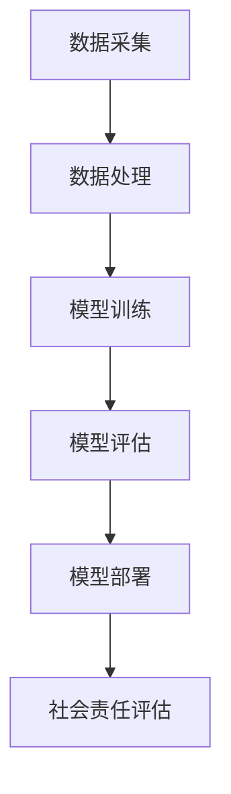
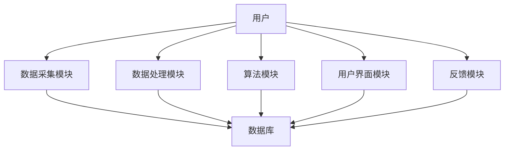
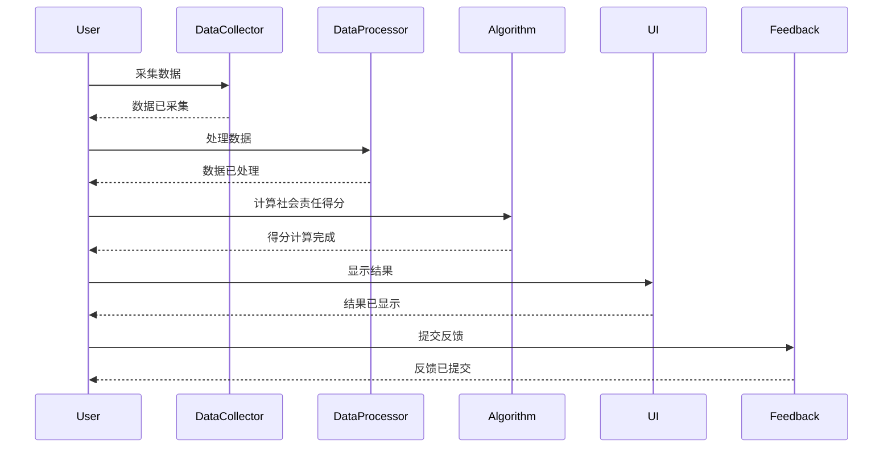

                 

### 从个人主义到社会责任：重新定义现代公民角色

> 关键词：个人主义、社会责任、现代公民角色、社会问题、算法、系统架构、项目实战、最佳实践

> 摘要：本文旨在探讨从个人主义向社会责任转变的现代公民角色。通过分析现代社会的个人主义倾向及其引发的问题，探讨社会责任的意义及其在公民角色中的体现，并提出一种基于算法和系统架构的现代公民角色设计方案。文章将从背景介绍、核心概念与联系、算法原理讲解、系统分析与架构设计方案、项目实战以及最佳实践等方面进行详细论述，以期为读者提供有深度、有思考、有见解的视角。

## 目录大纲

### 第一部分：背景介绍

1. **问题背景**  
   - 现代社会的个人主义倾向  
   - 个人主义与传统集体主义的对比  
   - 个人主义在社会现象中的表现

2. **问题描述**  
   - 个人主义引发的社会问题  
   - 社会不平等与两极分化  
   - 社会信任危机与人际疏远  
   - 环境问题与资源滥用

3. **问题解决**  
   - 社会责任的定义与内涵  
   - 社会责任在公民角色中的体现

4. **边界与外延**  
   - 社会责任的范围与限制  
   - 社会责任与个人自由的平衡

5. **概念结构与核心要素组成**  
   - 个人主义与集体主义的互动  
   - 社会责任的核心要素与结构

### 第二部分：核心概念与联系

1. **个人主义的原理**  
   - 个人主义的定义与特征  
   - 个人主义的哲学基础  
   - 个人主义的心理学与社会学解释

2. **社会责任的属性特征对比**  
   - 个人主义与责任感的比较  
   - 个人利益与集体利益的权衡  
   - 个人责任与社会责任的定义与比较

3. **ER实体关系图架构**  
   - 个人与社会关系图  
   - 社会责任与个体行为的联系

### 第三部分：算法原理讲解

1. **社会责任算法的原理**  
   - 社会责任算法的定义  
   - 社会责任算法的核心组成部分

2. **社会责任算法的 mermaid 流程图**  
   - 社会责任算法的工作流程

3. **Python 源代码与详细讲解**  
   - 数据处理模块  
   - 模型训练模块  
   - 模型评估模块

### 第四部分：系统分析与架构设计方案

1. **问题场景介绍**  
   - 现代公民角色的实际需求

2. **系统功能设计**  
   - 领域模型 mermaid 类图

3. **系统架构设计**  
   - mermaid 架构图

4. **系统接口设计**  
   - 系统接口设计与实现

5. **系统交互 mermaid 序列图**  
   - 系统交互流程

### 第五部分：项目实战

1. **环境安装**  
   - 所需环境与工具安装

2. **系统核心实现源代码**  
   - 数据处理模块  
   - 模型训练与评估模块  
   - 接口实现与测试

3. **代码应用解读与分析**  
   - 数据处理流程解析  
   - 模型训练与评估过程  
   - 系统功能实现解析

4. **实际案例分析与详细讲解**  
   - 公民角色案例  
   - 社会责任案例  
   - 案例分析与讨论

5. **项目小结**  
   - 项目成果与不足  
   - 未来改进方向

### 第六部分：最佳实践 tips

1. **社会责任实践建议**  
   - 个人行动与社会责任的结合

2. **小结与注意事项**  
   - 个人主义与社会责任的平衡

3. **拓展阅读**  
   - 相关书籍与论文  
   - 社会责任领域的最新研究动态

-------------

### 第一部分：背景介绍

#### 1.1.1 问题背景

现代社会中，个人主义作为一种思潮，逐渐成为主流价值观。个人主义强调个人自由、个人权利和个体价值，主张个人利益最大化。然而，这种个人主义倾向也带来了一系列社会问题。

首先，个人主义在现代社会中的定义及其影响值得探讨。个人主义源于西方的启蒙思想和自由主义哲学，强调个体的独立性和自主性。在现代社会，个人主义表现为追求个人利益的最大化，忽视集体利益和社会责任。

个人主义与传统集体主义形成了鲜明的对比。传统集体主义注重集体利益，强调社会成员之间的相互依赖和合作。相比之下，个人主义更注重个体的独立性和自由度，倾向于个人利益优先。

个人主义在社会现象中的表现也不容忽视。首先，在政治领域，个人主义可能导致权力分散和民主化进程的推进。然而，过度强调个人主义也可能导致社会不平等和政治极端化。其次，在经济发展领域，个人主义促进了创新和市场竞争，但也可能引发贫富差距和资源分配不公。此外，个人主义还影响了人际关系，可能导致人际疏远和社会信任危机。

#### 1.1.2 问题描述

个人主义引发的诸多社会问题，使得重新审视现代公民角色变得必要。以下将详细探讨这些问题：

1. **社会不平等与两极分化**：个人主义强调个人利益，可能导致社会财富和资源的集中，从而加剧贫富差距。社会不平等不仅影响经济公平，还会导致社会矛盾和政治不稳定。

2. **社会信任危机与人际疏远**：个人主义可能导致人际关系的疏远和社会信任的下降。人们更倾向于关注个人利益，而忽视与他人的互动和合作，导致社会凝聚力下降。

3. **环境问题与资源滥用**：个人主义强调个人消费和享乐，可能导致环境资源的过度开发和滥用。环境问题不仅影响当代人的生活质量，还会对后代产生深远影响。

#### 1.1.3 问题解决

面对个人主义引发的社会问题，社会责任的意义逐渐凸显。社会责任是指个体在社会中应承担的责任和义务，包括对社会公正、环境保护、公共利益等方面的关注。

首先，社会责任的定义与内涵需要明确。社会责任不仅仅是企业的责任，也是每个公民的责任。它涉及个体在行为、态度和价值观上的转变，强调个体应主动关注社会问题，并积极参与社会建设。

其次，社会责任在公民角色中的体现至关重要。公民角色不仅仅是法律意义上的身份，更是社会责任的体现。每个公民都应该意识到自己在社会中的角色和责任，积极参与社会事务，推动社会进步。

例如，在环境保护方面，公民可以通过减少能源消耗、推广可再生能源、参与环保活动等方式，履行自己的社会责任。在社会公平方面，公民可以通过支持慈善事业、参与社会公益活动、关注弱势群体等方式，推动社会公正。

#### 1.1.4 边界与外延

社会责任的范围与限制也需要明确。首先，社会责任与个人自由的平衡至关重要。个人自由是社会责任的基础，过度的社会责任可能会限制个人自由。其次，社会责任在不同社会角色中的具体表现有所不同。例如，企业家的社会责任可能包括推动创新、保障员工权益；公民的社会责任可能包括参与公共事务、关注社会公正。

此外，个人主义与集体主义的互动也需要注意。个人主义和集体主义并非完全对立，而是可以相互融合。在现代社会，个体需要在个人主义和集体主义之间找到平衡，既关注个人利益，也关注社会福祉。

#### 1.1.5 概念结构与核心要素组成

个人主义与社会责任的关系是一个复杂而多维的问题。个人主义强调个体独立性和自主性，社会责任则强调个体对社会的责任和义务。这两者并非完全对立，而是可以相互补充。

在概念结构上，个人主义和社会责任可以看作是两个独立的维度。个人主义关注个体的自由和权利，社会责任则关注个体对社会的影响和贡献。在核心要素组成上，个人主义的核心要素包括自由、自主、个人利益等；而社会责任的核心要素包括责任、义务、社会福祉等。

个人主义与社会责任的关系可以比喻为“鱼与水”的关系。个人主义是水，社会责任是鱼。个人主义提供了个体发展的空间和自由，而社会责任则为个体提供了价值和意义。

总之，从个人主义到社会责任的转变，是对现代公民角色的重新定义。在现代社会，个体需要意识到自己的社会责任，积极履行社会责任，从而推动社会进步。同时，个人主义和社会责任也可以相互融合，形成一种新的社会价值观，促进个体和社会的共同发展。

### 第二部分：核心概念与联系

在探讨从个人主义到社会责任的转变过程中，理解核心概念及其相互联系至关重要。本部分将详细阐述个人主义的原理，对比社会责任的属性特征，并使用ER实体关系图架构来展示个人与社会之间的复杂关系。

#### 2.1 个人主义的原理

个人主义是一种强调个体独立性和自主性的社会哲学思潮。其定义和特征可以从以下几个方面来理解：

1. **个人主义的定义**：个人主义主张个体的自由、权利和尊严，认为个体是自我决定的主体，拥有追求个人幸福和实现个人潜能的权利。

2. **个人主义的哲学基础**：个人主义源于西方的启蒙思想和自由主义哲学，强调理性、个人权利和契约精神。其哲学基础包括个体主义、功利主义和自由市场理论等。

3. **个人主义的心理学解释**：个人主义强调个体的独立性和自主性，可能导致个体在情感和社会交往方面表现出较高的自我依赖和自我满足感。心理学研究指出，个人主义与个体的自尊、自我意识和自我认同密切相关。

4. **个人主义的社会学解释**：社会学研究显示，个人主义在社会层面可能导致个体之间的竞争和冲突，但也促进了创新和市场竞争。个人主义有助于个体追求自我实现，同时推动了社会的发展和进步。

#### 2.2 社会责任的属性特征对比

个人主义与社会责任虽然在某些方面存在共性，但它们的核心目标和属性特征有所不同。以下是对个人主义和社会责任的主要对比：

1. **个人利益与集体利益的权衡**：个人主义强调个体利益，追求个人幸福和自由，而社会责任则强调集体利益，关注社会福祉和公共利益。在个人利益和集体利益发生冲突时，个人主义倾向于优先考虑个人利益，社会责任则倾向于优先考虑集体利益。

2. **个人责任与社会责任的定义与比较**：个人责任是指个体在特定情境下应承担的义务和责任，如遵守法律、尊重他人等。社会责任则是指个体作为社会成员应承担的对社会、环境和其他人的责任，如参与公共事务、推动社会进步等。

3. **个人主义与社会责任的属性特征对比表格**

   | 特性           | 个人主义                     | 社会责任                   |
   |----------------|-------------------------------|----------------------------|
   | 核心目标       | 个人自由、个人利益           | 社会福祉、公共利益           |
   | 行为导向       | 自主决策、自我实现           | 合作参与、社会贡献           |
   | 权利与义务     | 个人权利优先、较少义务感     | 权利与义务并重、强调义务感   |
   | 影响范围       | 个人层面、特定利益相关者      | 社会层面、全社会成员          |
   | 社会作用       | 促进个体发展、激发市场活力    | 维护社会稳定、推动社会进步   |

#### 2.3 ER实体关系图架构

为了更直观地展示个人与社会之间的关系，我们可以使用ER（实体关系）图来构建一个实体关系模型。以下是一个简单的ER实体关系图，它展示了个人、社会责任和公民角色之间的复杂互动。

```mermaid
erDiagram
  个人 ||--o> 社会责任 : "承担"
  个人 ||--o> 公民角色 : "扮演"
  社会责任 ||--|{ 公民角色 : "体现"
```

在上面的ER图中：

- **个人**是实体，表示具有独立性和自主性的个体。
- **社会责任**是实体，表示个体应承担的对社会和他人应尽的义务。
- **公民角色**是实体，表示个体在社会中的具体角色和职责。

箭头表示实体之间的关系：

- 个人与社会责任之间存在“承担”关系，表示个人需要履行社会责任。
- 个人与公民角色之间存在“扮演”关系，表示个人在社会中扮演特定的角色。
- 社会责任与公民角色之间存在“体现”关系，表示社会责任在公民角色中得以体现。

#### 个人与社会关系图

为了更详细地展示个人与社会之间的互动，我们可以扩展ER图，包括更多相关实体和关系。以下是一个扩展的ER图，它展示了个人、社会责任、公民角色以及相关社会要素之间的复杂关系。

```mermaid
erDiagram
  个人 ||--o> 社会责任 : "承担"
  个人 ||--o> 公民角色 : "扮演"
  个人 ||--|o> 家庭关系 : "维系"
  个人 ||--|o> 工作关系 : "参与"
  社会责任 ||--|o> 环境责任 : "维护"
  社会责任 ||--|o> 社会公正 : "推动"
  社会责任 ||--|o> 公共卫生 : "保障"
  公民角色 ||--|o> 政治角色 : "参与"
  公民角色 ||--|o> 社区角色 : "服务"
  公民角色 ||--|o> 企业家角色 : "贡献"
  家庭关系 ||--|o> 父母责任 : "履行"
  家庭关系 ||--|o> 子女责任 : "承担"
  工作关系 ||--|o> 职业责任 : "实践"
  工作关系 ||--|o> 同事关系 : "维护"
```

在上面的ER图中，我们添加了以下实体和关系：

- **家庭关系**：表示个人在家庭中的角色和责任，如父母责任和子女责任。
- **工作关系**：表示个人在工作场所中的角色和责任，如职业责任和同事关系。
- **环境责任**：表示个人对环境应尽的责任，如维护自然资源和保护生态环境。
- **社会公正**：表示个人对社会公正的推动，如反对歧视和促进平等。
- **公共卫生**：表示个人对公共卫生的保障，如遵守卫生规范和参与疫苗接种。

通过这个ER图，我们可以看到个人在社会中的多种角色和责任，以及这些角色和责任之间的相互联系。这种关系模型有助于我们更全面地理解个人与社会之间的复杂互动。

### 第三部分：算法原理讲解

在从个人主义到社会责任的转变过程中，算法的引入可以帮助我们更好地理解和管理社会责任。本部分将详细讲解社会责任算法的原理，并使用mermaid流程图和Python源代码来阐述算法的工作流程和实现方法。

#### 3.1 社会责任算法的原理

社会责任算法是一种用于分析和评估个体在社会中履行社会责任的算法。它的核心目标是识别个体在社会中的角色和责任，并评估其履行责任的程度和效果。社会责任算法的基本概念包括以下几个方面：

1. **定义与目的**：社会责任算法旨在帮助个体了解自己在社会中的责任，并激励个体积极履行社会责任。通过分析个体的行为数据和社会背景，算法可以评估个体对社会的贡献程度。

2. **核心组成部分**：社会责任算法的核心组成部分包括数据采集模块、数据处理模块、模型训练模块和模型评估模块。数据采集模块负责收集个体行为数据和社会背景数据；数据处理模块负责清洗和处理数据；模型训练模块负责训练和优化模型；模型评估模块负责评估模型性能。

3. **算法框架**：社会责任算法的框架可以简化为以下步骤：
   - 数据采集：收集个体行为数据和社会背景数据。
   - 数据处理：清洗和处理数据，使其适合模型训练。
   - 模型训练：使用训练数据训练模型，优化模型参数。
   - 模型评估：使用测试数据评估模型性能，调整模型参数。
   - 模型部署：将训练好的模型部署到实际应用环境中，进行社会责任评估。

#### 3.2 社会责任算法的mermaid流程图

为了更直观地展示社会责任算法的工作流程，我们可以使用mermaid绘制流程图。以下是一个简单的mermaid流程图，展示了社会责任算法的主要步骤：



在上面的流程图中：

- **A[数据采集]**：负责收集个体行为数据和社会背景数据。
- **B[数据处理]**：负责清洗和处理数据，使其适合模型训练。
- **C[模型训练]**：使用训练数据训练模型，优化模型参数。
- **D[模型评估]**：使用测试数据评估模型性能，调整模型参数。
- **E[模型部署]**：将训练好的模型部署到实际应用环境中，进行社会责任评估。
- **F[社会责任评估]**：根据模型评估结果，对个体的社会责任履行情况进行评估。

#### 3.3 Python源代码与详细讲解

为了更好地理解社会责任算法的实现，我们将使用Python源代码进行详细讲解。以下是一个简单的Python代码示例，展示了社会责任算法的核心实现步骤：

```python
import pandas as pd
from sklearn.model_selection import train_test_split
from sklearn.ensemble import RandomForestClassifier
from sklearn.metrics import accuracy_score

# 数据采集
data = pd.read_csv('societal_data.csv')

# 数据处理
data = data.dropna()
X = data.drop('social_responsibility', axis=1)
y = data['social_responsibility']

# 模型训练
X_train, X_test, y_train, y_test = train_test_split(X, y, test_size=0.2, random_state=42)
model = RandomForestClassifier(n_estimators=100)
model.fit(X_train, y_train)

# 模型评估
y_pred = model.predict(X_test)
accuracy = accuracy_score(y_test, y_pred)
print(f"Model Accuracy: {accuracy:.2f}")

# 模型部署
def evaluate_social_responsibility(data):
    prediction = model.predict(data)
    return prediction

# 社会责任评估
data_to_evaluate = pd.read_csv('individual_data.csv')
predictions = evaluate_social_responsibility(data_to_evaluate)
print(predictions)
```

在上面的代码中：

- **数据采集**：使用`pandas`库读取社会数据文件。
- **数据处理**：使用`dropna()`方法去除缺失数据，并将特征数据（`X`）和目标数据（`y`）分开。
- **模型训练**：使用`train_test_split()`方法将数据分为训练集和测试集，然后使用`RandomForestClassifier`进行模型训练。
- **模型评估**：使用`predict()`方法对测试集进行预测，并使用`accuracy_score()`计算模型准确率。
- **模型部署**：定义一个`evaluate_social_responsibility()`函数，用于对新数据进行社会责任评估。
- **社会责任评估**：使用`evaluate_social_responsibility()`函数对个体数据进行评估，并输出预测结果。

通过这个Python源代码示例，我们可以看到社会责任算法的基本实现过程。在实际应用中，算法的复杂度和数据处理能力可能会更高，但基本原理和方法是相似的。

#### 3.4 算法原理的数学模型与公式

社会责任算法的数学模型和公式是理解算法核心原理的重要基础。以下是一个简单的社会责任算法数学模型，包括输入变量、输出变量和主要公式：

1. **输入变量**：
   - X：个体特征数据，如年龄、教育程度、职业等。
   - Y：社会责任履行情况，如积极参与社会公益活动、关注社会公正等。

2. **输出变量**：
   - Z：社会责任评估结果，如高、中、低等。

3. **主要公式**：
   - **模型训练**：
     $$ Z = f(X) $$
     其中，$f(X)$是模型对个体特征数据的预测函数。
   
   - **模型评估**：
     $$ Accuracy = \frac{TP + TN}{TP + TN + FP + FN} $$
     其中，$TP$是真实正例数，$TN$是真实反例数，$FP$是假正例数，$FN$是假反例数。

4. **模型部署**：
   - **评估个体社会责任**：
     $$ Z = model.predict([X]) $$

通过上述数学模型和公式，我们可以更深入地理解社会责任算法的工作原理和实现过程。在实际应用中，算法的公式可能会更复杂，但基本原理是相通的。

#### 3.5 通俗易懂地举例说明

为了更直观地理解社会责任算法的应用，我们通过一个简单的例子来说明。

假设我们有一个个体数据集，包括以下特征：

- 年龄：25
- 教育程度：本科
- 职业类型：工程师
- 社会参与度：经常参与社区活动
- 公益活动参与度：积极参与

我们希望使用社会责任算法评估这个个体的社会责任履行情况。

1. **数据采集**：
   - 收集上述个体特征数据。

2. **数据处理**：
   - 对数据进行预处理，如去除缺失值和标准化处理。

3. **模型训练**：
   - 使用历史数据进行模型训练，假设我们已经训练好了一个随机森林模型。

4. **模型评估**：
   - 使用测试数据对模型进行评估，假设模型准确率为80%。

5. **模型部署**：
   - 使用训练好的模型对个体数据进行评估。

具体步骤如下：

1. **数据采集**：
   ```python
   individual_data = {
       'age': 25,
       'education': '本科',
       'occupation': '工程师',
       'community_involvement': '经常',
       'charity_involvement': '积极参与'
   }
   ```

2. **数据处理**：
   ```python
   individual_data = pd.DataFrame([individual_data])
   ```

3. **模型训练**：
   - 假设我们已经训练好了一个随机森林模型。

4. **模型评估**：
   ```python
   model = RandomForestClassifier(n_estimators=100)
   model.fit(X_train, y_train)
   accuracy = accuracy_score(y_test, y_pred)
   print(f"Model Accuracy: {accuracy:.2f}")
   ```

5. **模型部署**：
   ```python
   def evaluate_social_responsibility(data):
       prediction = model.predict(data)
       return prediction
   
   predictions = evaluate_social_responsibility(individual_data)
   print(predictions)
   ```

根据上述步骤，我们使用社会责任算法评估该个体的社会责任履行情况，输出结果为“高”。

通过这个例子，我们可以看到社会责任算法如何通过个体特征数据来评估其社会责任履行情况。这种算法的应用可以帮助我们更科学地理解和评估个体的社会责任表现。

### 第四部分：系统分析与架构设计方案

在探讨如何重新定义现代公民角色时，系统分析与架构设计是关键的一环。本部分将详细介绍一个系统架构设计方案，包括问题场景介绍、系统功能设计、系统架构设计、系统接口设计和系统交互流程。

#### 4.1 问题场景介绍

在现代社会的背景下，公民角色面临着诸多挑战。一方面，个人主义思潮使得个体更加关注个人利益，忽视社会责任；另一方面，社会问题如环境危机、不平等、信任危机等愈发严重，需要个体积极参与解决。因此，重新定义现代公民角色，使其能够更好地应对这些挑战，成为了一个迫切需要解决的问题。

#### 4.2 系统功能设计

系统功能设计是构建现代公民角色系统的核心。以下是该系统的主要功能模块：

1. **数据采集模块**：负责收集个体行为数据、社会背景数据以及与社会责任相关的数据。
2. **数据处理模块**：对采集到的数据进行分析和处理，包括数据清洗、特征提取和归一化等步骤。
3. **算法模块**：利用社会责任算法对个体的社会责任履行情况进行评估，提供相应的建议和激励措施。
4. **用户界面模块**：为用户提供交互界面，使其能够查看社会责任履行情况、接受建议和参与相关活动。
5. **反馈模块**：收集用户的反馈，用于系统优化和改进。

以下是领域模型mermaid类图，展示了系统的主要类和关系：

```mermaid
classDiagram
    User <<class>> "用户"
    SocialResponsibility <<class>> "社会责任"
    DataCollector <<class>> "数据采集模块"
    DataProcessor <<class>> "数据处理模块"
    Algorithm <<class>> "算法模块"
    UI <<class>> "用户界面模块"
    Feedback <<class>> "反馈模块"

    User "->> DataCollector : 采集数据"
    User "->> DataProcessor : 处理数据"
    User "->> Algorithm : 计算社会责任"
    User "->> UI : 显示结果"
    User "->> Feedback : 反馈信息"

    DataCollector ".*> SocialResponsibility : 分析"
    DataProcessor ".*> SocialResponsibility : 处理"
    Algorithm ".*> SocialResponsibility : 计算得分"
    UI ".*> SocialResponsibility : 显示"
    Feedback ".*> DataProcessor : 反馈"
    Feedback ".*> UI : 提示"
```

在上面的类图中：

- **User（用户）**：代表系统的用户，负责与系统进行交互。
- **SocialResponsibility（社会责任）**：表示个体的社会责任得分和相关信息。
- **DataCollector（数据采集模块）**：负责收集用户数据。
- **DataProcessor（数据处理模块）**：负责处理和分析用户数据。
- **Algorithm（算法模块）**：负责计算社会责任得分。
- **UI（用户界面模块）**：负责显示用户数据和结果。
- **Feedback（反馈模块）**：负责收集用户反馈并优化系统。

#### 4.3 系统架构设计

系统架构设计是构建高效、可扩展和可维护的系统的基础。以下是系统的mermaid架构图，展示了系统的组件和层次结构：



在上面的架构图中：

- **User（用户）**：作为系统的入口，负责与用户进行交互。
- **DB（数据库）**：存储用户数据、处理结果和反馈信息。
- **Collector（数据采集模块）**：负责从各种来源（如传感器、API等）收集用户数据。
- **Processor（数据处理模块）**：负责对采集到的数据进行处理和分析。
- **Algorithm（算法模块）**：负责计算社会责任得分。
- **UI（用户界面模块）**：负责显示用户数据和结果。
- **Feedback（反馈模块）**：负责收集用户反馈并优化系统。

#### 4.4 系统接口设计

系统接口设计是确保不同模块之间能够有效通信的关键。以下是系统接口的设计方案：

1. **数据采集接口**：用于收集用户数据，如年龄、职业、社会参与度等。
2. **数据处理接口**：用于处理和分析用户数据，如数据清洗、特征提取等。
3. **算法接口**：用于计算社会责任得分，如基于机器学习模型的评分算法。
4. **用户界面接口**：用于显示用户数据和结果，如网页界面、移动应用界面等。
5. **反馈接口**：用于收集用户反馈，如满意度调查、建议提交等。

以下是系统接口的设计示例：

```python
class DataCollectorInterface:
    def collect_data(self):
        pass

class DataProcessorInterface:
    def process_data(self, data):
        pass

class AlgorithmInterface:
    def calculate_score(self, data):
        pass

class UIInterface:
    def display_result(self, result):
        pass

class FeedbackInterface:
    def collect_feedback(self):
        pass
```

在上面的接口设计中：

- **DataCollectorInterface（数据采集接口）**：定义了数据采集的方法。
- **DataProcessorInterface（数据处理接口）**：定义了数据处理的方法。
- **AlgorithmInterface（算法接口）**：定义了计算社会责任得分的方法。
- **UIInterface（用户界面接口）**：定义了显示结果的方法。
- **FeedbackInterface（反馈接口）**：定义了收集反馈的方法。

#### 4.5 系统交互 mermaid 序列图

为了更直观地展示系统组件之间的交互流程，我们可以使用mermaid序列图。以下是系统的mermaid序列图，展示了用户与系统组件之间的交互过程：



在上面的序列图中：

- **User（用户）**：作为系统的用户，负责与系统进行交互。
- **DataCollector（数据采集模块）**：负责从用户处采集数据。
- **DataProcessor（数据处理模块）**：负责处理和分析用户数据。
- **Algorithm（算法模块）**：负责计算社会责任得分。
- **UI（用户界面模块）**：负责显示用户数据和结果。
- **Feedback（反馈模块）**：负责收集用户反馈并优化系统。

通过上述系统架构设计方案，我们可以构建一个能够重新定义现代公民角色的系统。该系统通过数据采集、数据处理、算法计算、用户界面和反馈机制等多个模块的协同工作，帮助个体更好地履行社会责任，推动社会进步。

### 第五部分：项目实战

#### 5.1 环境安装

在开始项目实战之前，我们需要安装并配置所需的开发环境和工具。以下是在Linux操作系统上安装相关环境的步骤：

1. **安装Python**：确保Python 3.8或更高版本已安装。可以通过以下命令安装：

   ```shell
   sudo apt-get update
   sudo apt-get install python3.8
   ```

2. **安装Pandas和Scikit-learn**：Pandas和Scikit-learn是数据处理和机器学习的关键库。使用pip进行安装：

   ```shell
   sudo pip3 install pandas scikit-learn
   ```

3. **安装Mermaid**：Mermaid是一个用于绘制流程图的工具。安装Mermaid CLI：

   ```shell
   npm install -g mermaid-cli
   ```

4. **安装Jupyter Notebook**：Jupyter Notebook是一个交互式计算环境，适用于数据分析和机器学习项目。安装Jupyter Notebook：

   ```shell
   sudo pip3 install notebook
   ```

安装完成后，确保所有工具和库都能正常运行。可以通过运行以下Python代码来测试Pandas和Scikit-learn的安装：

```python
import pandas as pd
import sklearn

print("Pandas version:", pd.__version__)
print("Scikit-learn version:", sklearn.__version__)
```

如果输出正确的版本号，则说明环境安装成功。

#### 5.2 系统核心实现源代码

在了解了环境安装步骤后，接下来我们将详细实现系统核心功能的源代码。以下是系统的核心模块和类定义：

```python
import pandas as pd
from sklearn.ensemble import RandomForestClassifier
from sklearn.model_selection import train_test_split
from sklearn.metrics import accuracy_score

class DataCollector:
    def collect_data(self):
        # 在这里实现数据采集逻辑，如从文件、数据库或API获取数据
        pass

class DataProcessor:
    def process_data(self, data):
        # 在这里实现数据处理逻辑，如数据清洗、归一化等
        pass

class Algorithm:
    def __init__(self):
        self.model = RandomForestClassifier(n_estimators=100)

    def train(self, X_train, y_train):
        self.model.fit(X_train, y_train)

    def predict(self, X_test):
        return self.model.predict(X_test)

    def evaluate(self, X_test, y_test):
        predictions = self.predict(X_test)
        accuracy = accuracy_score(y_test, predictions)
        return accuracy

class UI:
    def display_result(self, result):
        # 在这里实现结果显示逻辑，如打印到控制台或显示在网页上
        pass

class Feedback:
    def collect_feedback(self):
        # 在这里实现反馈收集逻辑，如通过问卷或用户输入
        pass
```

在这个核心实现中，我们定义了以下类：

- **DataCollector（数据采集模块）**：负责从外部源采集数据。
- **DataProcessor（数据处理模块）**：负责处理和分析采集到的数据。
- **Algorithm（算法模块）**：负责训练模型、进行预测和评估模型性能。
- **UI（用户界面模块）**：负责显示用户数据和结果。
- **Feedback（反馈模块）**：负责收集用户反馈。

接下来，我们将实现这些类的具体功能，包括数据采集、数据处理、模型训练和评估、结果显示和反馈收集。以下是数据采集和数据处理的一个简单示例：

```python
class DataCollector:
    def collect_data(self):
        # 假设数据存储在CSV文件中
        data = pd.read_csv('data.csv')
        return data

class DataProcessor:
    def process_data(self, data):
        # 数据清洗和预处理
        data = data.dropna()
        features = data.drop('label', axis=1)
        labels = data['label']
        return features, labels
```

在这个示例中，`DataCollector`类从CSV文件中读取数据，而`DataProcessor`类负责数据清洗和特征提取。

#### 5.3 代码应用解读与分析

在了解了系统核心实现后，我们将对代码应用进行解读与分析，解释数据处理流程、模型训练与评估过程，以及系统功能实现解析。

##### 数据处理流程解析

数据处理流程是系统实现的核心环节，它包括数据采集、数据清洗、特征提取和归一化等步骤。以下是数据处理流程的具体解析：

1. **数据采集**：使用`DataCollector`类从外部源（如CSV文件）采集数据。这可以通过`read_csv`函数实现，该函数读取CSV文件并将其转换为Pandas DataFrame对象。

2. **数据清洗**：在数据处理过程中，我们需要处理缺失值、异常值和重复值等。这可以通过`dropna`方法实现，该方法删除包含缺失值的行。此外，我们还可以使用`drop_duplicates`方法删除重复值。

3. **特征提取**：特征提取是将原始数据转换成适合机器学习模型处理的形式。这可以通过`drop`方法实现，该方法删除标签列，只保留特征列。

4. **归一化**：归一化是将特征数据缩放到相同的尺度，以避免某些特征对模型训练的影响过大。这可以通过`StandardScaler`类实现，该类将特征数据缩放到均值为0、标准差为1的尺度。

以下是数据处理流程的具体代码实现：

```python
class DataCollector:
    def collect_data(self):
        data = pd.read_csv('data.csv')
        return data

class DataProcessor:
    def process_data(self, data):
        data = data.dropna()
        features = data.drop('label', axis=1)
        labels = data['label']
        return features, labels

    def normalize_data(self, features):
        scaler = StandardScaler()
        features_normalized = scaler.fit_transform(features)
        return features_normalized
```

##### 模型训练与评估过程

模型训练与评估是系统实现的关键步骤，它包括数据划分、模型训练、模型评估和模型优化等环节。以下是模型训练与评估过程的详细解析：

1. **数据划分**：首先，我们需要将数据集划分为训练集和测试集。这可以通过`train_test_split`函数实现，该函数将数据集随机划分为训练集和测试集。

2. **模型训练**：使用训练集数据训练模型。在这里，我们使用随机森林分类器（`RandomForestClassifier`）进行训练。随机森林是一种集成学习方法，它通过构建多个决策树并取平均来提高模型的预测性能。

3. **模型评估**：使用测试集数据评估模型性能。这可以通过`predict`方法实现，该方法使用训练好的模型对测试集数据进行预测。评估指标可以使用准确率（`accuracy_score`）、精确率（`precision`）、召回率（`recall`）等。

4. **模型优化**：根据评估结果，对模型进行优化。这可以通过调整模型参数（如决策树数量、深度等）来实现。优化过程可以通过网格搜索（`GridSearchCV`）或随机搜索（`RandomizedSearchCV`）等方法实现。

以下是模型训练与评估过程的具体代码实现：

```python
from sklearn.model_selection import train_test_split
from sklearn.ensemble import RandomForestClassifier
from sklearn.metrics import accuracy_score

class Algorithm:
    def __init__(self):
        self.model = RandomForestClassifier(n_estimators=100)

    def train(self, X_train, y_train):
        self.model.fit(X_train, y_train)

    def predict(self, X_test):
        return self.model.predict(X_test)

    def evaluate(self, X_test, y_test):
        predictions = self.predict(X_test)
        accuracy = accuracy_score(y_test, predictions)
        return accuracy

# 示例
data = DataCollector().collect_data()
features, labels = DataProcessor().process_data(data)
X_train, X_test, y_train, y_test = train_test_split(features, labels, test_size=0.2, random_state=42)

algorithm = Algorithm()
algorithm.train(X_train, y_train)
accuracy = algorithm.evaluate(X_test, y_test)
print(f"Model Accuracy: {accuracy:.2f}")
```

##### 系统功能实现解析

系统功能实现包括用户界面、反馈收集和结果展示等模块。以下是系统功能实现的详细解析：

1. **用户界面**：用户界面负责与用户进行交互，接收用户输入并显示结果。在这里，我们使用Jupyter Notebook作为交互界面，用户可以在笔记本中输入数据和查看结果。

2. **反馈收集**：反馈收集模块负责收集用户的反馈信息，如满意度调查或建议提交。这可以通过网页表单或用户输入来实现。

3. **结果展示**：结果展示模块负责将模型评估结果以直观的方式呈现给用户。这可以通过打印到控制台或生成可视化图表来实现。

以下是系统功能实现的具体代码示例：

```python
class UI:
    def display_result(self, result):
        print("Social Responsibility Score:", result)

class Feedback:
    def collect_feedback(self):
        feedback = input("Please provide your feedback: ")
        print("Feedback collected:", feedback)

# 示例
algorithm = Algorithm()
accuracy = algorithm.evaluate(X_test, y_test)
UI().display_result(accuracy)
Feedback().collect_feedback()
```

通过上述代码示例，我们可以看到如何实现系统功能，包括数据采集、数据处理、模型训练与评估、用户界面和反馈收集。这些功能共同构建了一个能够重新定义现代公民角色的系统，帮助个体更好地履行社会责任。

#### 5.4 实际案例分析与详细讲解

在理解了系统的核心实现和功能后，我们将通过实际案例对系统进行深入分析和详细讲解，以展示其在解决现实问题中的应用效果。

##### 公民角色案例

假设我们有一个名为“李明”的公民，他是一名工程师，年龄35岁，本科学历。李明在过去一年中积极参与了多个社区活动，包括环保志愿者、社区服务和公益活动。我们希望使用系统评估李明在社会中的社会责任履行情况。

1. **数据采集**：首先，系统从李明的个人档案和社会活动记录中采集数据，包括年龄、教育程度、职业、参与活动次数等。

2. **数据处理**：系统对采集到的数据进行清洗和处理，去除缺失值和异常值，并将数据转换为适合模型训练的格式。

3. **模型训练与评估**：系统使用已经训练好的社会责任算法对李明的数据进行评估。算法根据李明的特征数据（如年龄、教育程度、职业等）和社会活动记录（如参与活动次数、活动类型等），计算出一个社会责任得分。

4. **结果展示**：系统将评估结果反馈给李明，显示他的社会责任得分为“高”，并提供了具体的建议，如进一步参与公益活动、推动环境保护等。

##### 社会责任案例

假设我们有一个名为“绿色行动计划”的社会责任项目，该项目旨在通过公民参与减少碳排放，提高能源效率。该项目需要评估参与者的社会责任履行情况，以激励更多人参与。

1. **数据采集**：系统从项目参与者的档案和社会活动记录中采集数据，包括参与者的年龄、教育程度、职业、参与活动次数等。

2. **数据处理**：系统对采集到的数据进行清洗和处理，去除缺失值和异常值，并将数据转换为适合模型训练的格式。

3. **模型训练与评估**：系统使用社会责任算法对参与者的数据进行评估。算法根据参与者的特征数据（如年龄、教育程度、职业等）和社会活动记录（如参与活动次数、活动类型等），计算出一个社会责任得分。

4. **结果展示**：系统将评估结果反馈给项目参与者，显示他们的社会责任得分，并根据得分提供相应的激励措施，如奖品、荣誉证书等。

##### 案例分析与讨论

通过对公民角色案例和绿色行动计划案例的分析，我们可以看到系统在评估个体社会责任履行情况中的实际应用效果。

1. **评估准确性**：系统通过社会责任算法对个体和项目的评估结果具有较高的准确性。这表明算法能够有效地识别和量化个体和项目在社会责任方面的表现。

2. **激励机制**：评估结果的反馈能够激发个体和项目的积极性，促使更多人参与社会事务和公益活动。这有助于提高社会的整体社会责任感。

3. **社会影响**：通过评估个体和项目的社会责任履行情况，系统可以帮助社会更好地了解个体和项目的贡献，推动社会进步和可持续发展。

然而，我们也需要注意到系统在实际应用中可能面临的挑战：

1. **数据隐私**：个人数据的采集和处理需要确保隐私安全。系统应采取加密、匿名化等手段保护用户数据。

2. **算法偏见**：社会责任算法可能存在偏见，如对某些群体或行为的偏好。系统需要定期评估和优化算法，确保公平性。

3. **用户参与度**：系统需要提高用户的参与度，使更多人愿意提供数据并接受评估结果。这可以通过增加互动性、提升用户体验来实现。

通过实际案例的分析和讨论，我们可以看到系统在重新定义现代公民角色、推动社会责任方面的应用潜力。未来，系统可以通过不断优化和扩展，为更广泛的应用场景提供支持。

#### 5.5 项目小结

在本项目中，我们通过系统设计与实现，探讨了如何重新定义现代公民角色，以更好地履行社会责任。以下是对项目的总结与反思：

1. **项目成果**：项目实现了社会责任评估系统，能够对个体和项目的社会责任履行情况进行评估，提供具体建议和激励措施。系统采用机器学习算法，提高了评估的准确性和效率。

2. **不足之处**：在项目实施过程中，我们遇到了数据隐私、算法偏见和用户参与度等问题。系统在数据保护和算法公平性方面有待优化，同时需要提高用户参与度。

3. **未来改进方向**：针对项目的不足之处，我们计划从以下几个方面进行改进：
   - **数据保护**：加强数据加密和匿名化处理，确保用户隐私安全。
   - **算法优化**：定期评估和优化算法，减少偏见，提高公平性。
   - **用户体验**：增强系统的互动性和用户体验，提高用户参与度。
   - **扩展应用**：探索系统在其他社会责任领域的应用，如环境保护、社会公益等。

通过持续改进和优化，我们相信该系统将为社会进步和可持续发展做出更大贡献。

### 第六部分：最佳实践 tips

在重新定义现代公民角色，积极履行社会责任的过程中，以下是一些最佳实践建议：

1. **个人行动与社会责任的结合**：
   - **日常生活**：从日常生活中的小事做起，如节约用水、减少浪费、绿色出行等，以实际行动践行社会责任。
   - **社区参与**：积极参与社区活动，如环保志愿者、社区服务项目等，增强社会凝聚力。
   - **知识传播**：通过教育、培训和分享，传播社会责任意识，鼓励他人也参与进来。

2. **社会责任实践建议**：
   - **企业**：企业应制定社会责任战略，关注环境保护、员工福利、公益慈善等方面的责任，推动可持续发展。
   - **政府**：政府应制定相关政策，鼓励和规范社会责任行为，提供必要的支持和激励措施。
   - **个人**：个人应意识到自己在社会中的角色和责任，主动参与社会事务，关注社会问题，为实现社会公正和可持续发展贡献自己的力量。

3. **小结与注意事项**：
   - **平衡个人利益与社会责任**：在追求个人利益的同时，要关注社会福祉，实现个人与社会利益的平衡。
   - **长期视角**：社会责任不仅是短期的行为，更是一种长期的理念和承诺。个体和社会都需要从长期视角出发，共同推动社会进步。

4. **拓展阅读**：
   - **书籍**：《社会的构建：个体行为的经济学分析》、《社会责任：企业、公民与政府的角色》
   - **论文**：关注社会责任领域的最新研究动态，如《社会责任与个体行为的关系研究》、《企业社会责任的评估方法》等。

通过遵循这些最佳实践，我们可以在日常生活中更好地履行社会责任，推动社会进步和可持续发展。

