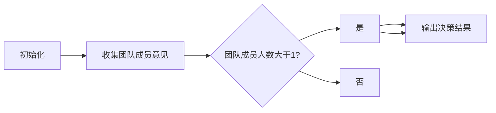
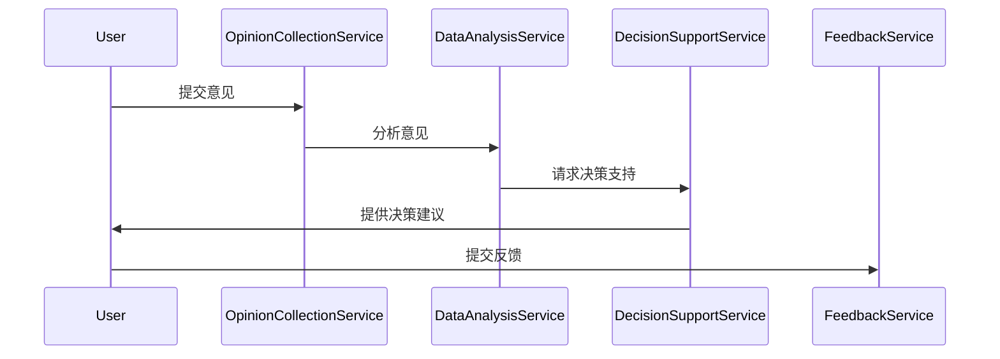
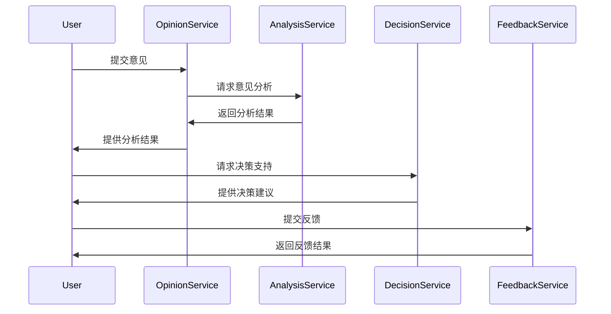

                 


### 《从个人英雄主义到集体智慧：重新定义领导力概念》

> 关键词：领导力、个人英雄主义、集体智慧、组织文化、组织效能

> 摘要：本文通过分析领导力概念的演变，从个人英雄主义到集体智慧，探讨了现代组织领导的新趋势。文章首先介绍了个人英雄主义领导力的特点，随后提出了集体智慧领导力的核心概念和实践方法，通过实际案例展示了这一领导模式的优势和挑战，并对其未来发展方向进行了展望。

## 引言：领导力演变中的个人英雄主义

### 1. 个人英雄主义领导力的定义与特征

个人英雄主义领导力，通常是指一种以个人为中心的领导风格，领导者在决策和行动中扮演核心角色，依靠个人的才智、胆略和决策能力推动组织的进步。这种领导力模式有着鲜明的特征：

- **权威性**：领导者拥有绝对的权威，下属对领导者有高度的服从和信任。
- **集中决策**：决策过程主要依赖于领导者的个人判断和经验，下属参与度较低。
- **高效性**：在短期内，个人英雄主义领导力可以迅速做出决策并采取行动，取得显著成效。

### 2. 个人英雄主义领导力的局限

然而，随着时代的发展，个人英雄主义领导力逐渐显露出其局限性：

- **创新能力不足**：过于依赖个人才智，可能导致创新能力的局限。
- **团队协作弱化**：领导者过分集中权力，可能导致团队协作精神的弱化。
- **适应性差**：面对复杂多变的环境，个人英雄主义领导力可能无法及时调整和适应。

## 领导力理论的演变

### 1. 从个人英雄主义到集体智慧的转变

随着组织规模的扩大和复杂性的增加，个人英雄主义领导力逐渐无法满足现代组织的需求。集体智慧领导力应运而生，这一领导模式强调集体合作和共同决策。

### 2. 集体智慧领导力的定义与特征

集体智慧领导力，是指领导者通过激发和利用团队中每个成员的知识、技能和经验，共同应对挑战和实现目标的领导方式。其核心特征包括：

- **协作性**：强调团队合作，鼓励成员之间的沟通和协作。
- **参与性**：重视下属的参与和贡献，共同制定决策。
- **创新性**：通过集思广益，提升组织的创新能力。

### 3. 集体智慧领导力与传统领导力的对比

| 特征             | 个人英雄主义领导力       | 集体智慧领导力         |
|------------------|--------------------------|------------------------|
| 权威性           | 高                       | 较低                   |
| 集中决策         | 是                       | 否                     |
| 团队协作         | 弱                       | 强                     |
| 创新能力         | 受限于个人才智           | 集思广益，提升整体创新能力 |

## 集体智慧领导力的核心概念

### 1. 集体智慧的理论基础

集体智慧的理论基础主要包括协同效应、社会网络理论和复杂性科学。这些理论为集体智慧领导力提供了理论支撑。

### 2. 集体智慧领导力的关键要素

集体智慧领导力的关键要素包括信任、沟通、协作和共同目标。这些要素共同构成了集体智慧领导力的基础。

### 3. 集体智慧领导力的优势

集体智慧领导力具有以下优势：

- **提高决策质量**：通过集体智慧和广泛参与，提高决策的科学性和准确性。
- **提升创新能力**：鼓励创新思维，激发团队的创造力。
- **增强团队凝聚力**：通过协作和共同目标，增强团队的凝聚力和归属感。

## 集体智慧领导力的实践应用

### 1. 集体智慧领导力在企业中的实施

在企业中，集体智慧领导力的实施可以从以下几个方面着手：

- **建立信任机制**：通过制度建设和文化营造，建立团队成员之间的信任。
- **强化沟通机制**：建立有效的沟通渠道和沟通机制，确保信息的畅通和透明。
- **促进协作**：通过项目团队、跨部门合作等方式，促进团队成员之间的协作。
- **共同制定目标**：通过共同参与目标制定，提高团队成员的积极性和执行力。

### 2. 集体智慧领导力在团队管理中的应用

在团队管理中，集体智慧领导力可以通过以下方式应用：

- **团队建设**：通过团队活动和培训，增强团队成员之间的互信和协作。
- **问题解决**：鼓励团队成员共同分析和解决问题，提升团队的解决问题能力。
- **创新管理**：通过鼓励创新和提供资源支持，推动团队的创新能力。

### 3. 集体智慧领导力的挑战与对策

尽管集体智慧领导力具有明显优势，但在实际应用中仍面临一些挑战：

- **管理难度增加**：集体智慧领导力要求领导者具备更高的管理能力和协调能力。
- **文化适应**：组织文化需要从个人主义向集体主义转变，这可能面临一定的阻力。
- **效率问题**：在决策过程中，集体智慧可能会降低效率，需要找到平衡点。

针对这些挑战，可以采取以下对策：

- **提升领导者能力**：通过培训和锻炼，提升领导者的管理能力和协调能力。
- **文化变革**：通过宣传和教育，推动组织文化的变革，鼓励集体主义价值观。
- **流程优化**：通过流程优化和制度建设，提高决策效率和执行力。

## 集体智慧领导力的案例分析

### 1. 案例分析一：从个人英雄主义到集体智慧的转变

#### 案例背景

某大型企业在过去一直采用个人英雄主义领导力，企业高层由几位具有丰富经验的领导人主导，决策高度集中。然而，随着企业规模的扩大和市场竞争的加剧，企业面临着创新不足、团队协作差等问题。

#### 案例过程

企业决定进行领导力模式的转变，采用集体智慧领导力。首先，企业通过内部培训和外部咨询，提高领导者的管理能力和协调能力。其次，企业建立了信任机制和沟通机制，鼓励团队成员之间的沟通和协作。最后，企业通过项目团队和跨部门合作，促进共同目标的制定和实现。

#### 案例结果

经过一系列的改革，企业取得了显著成效。团队成员之间的信任和协作显著增强，企业的创新能力也得到了提升。在市场竞争中，企业表现出更强的竞争力，业绩稳步提升。

### 2. 案例分析二：集体智慧领导力的成功实践

#### 案例背景

某科技公司在市场竞争中面临严峻挑战，需要通过创新来提升竞争力。公司决定采用集体智慧领导力，激发团队的创新能力。

#### 案例过程

公司通过建立创新实验室和鼓励员工提出创新想法，营造了创新氛围。同时，公司通过内部培训和工作坊，提高员工的创新能力和协作能力。公司还建立了项目团队，鼓励团队成员共同分析和解决问题。

#### 案例结果

通过集体智慧领导力的实践，公司成功推出了一系列创新产品，在市场上取得了良好反响。公司的创新能力得到了显著提升，市场竞争力得到了增强。

### 3. 案例分析三：集体智慧领导力在危机管理中的应用

#### 案例背景

某公司在突发危机中，面临着巨大的挑战。公司决定通过集体智慧领导力，共同应对危机。

#### 案例过程

公司迅速成立了危机管理团队，团队成员来自不同部门，共同分析危机原因和解决方案。公司通过内部沟通平台，确保信息的畅通和透明，鼓励团队成员提出意见和建议。公司还通过外部合作，寻求专业支持和资源。

#### 案例结果

通过集体智慧领导力的实践，公司成功应对了危机，避免了更大的损失。团队成员之间的协作和信任得到了增强，公司的危机管理能力也得到了提升。

## 集体智慧领导力的未来展望

### 1. 集体智慧领导力的发展趋势

随着数字化和智能化的推进，集体智慧领导力将成为未来组织领导的主流。领导者需要具备更高的管理能力和协调能力，以应对复杂多变的环境。

### 2. 集体智慧领导力对组织文化的影响

集体智慧领导力将推动组织文化的变革，从个人主义向集体主义转变。这将有助于提升组织的凝聚力和创新能力。

### 3. 集体智慧领导力的可持续性

集体智慧领导力的可持续性取决于组织的文化氛围和管理机制。通过持续的文化建设和制度优化，集体智慧领导力将得到巩固和发展。

## 结论：重新定义领导力概念

集体智慧领导力代表了现代组织领导的新趋势。通过集体智慧和团队合作，组织可以更好地应对挑战，实现持续发展。领导者需要不断学习和实践，提升自身的领导力，以适应新时代的需求。

### 作者

**作者：AI天才研究院/AI Genius Institute & 禅与计算机程序设计艺术 /Zen And The Art of Computer Programming**### 从个人英雄主义到集体智慧：重新定义领导力概念

> 关键词：领导力、个人英雄主义、集体智慧、组织文化、组织效能

> 摘要：本文通过分析领导力概念的演变，从个人英雄主义到集体智慧，探讨了现代组织领导的新趋势。文章首先介绍了个人英雄主义领导力的特点，随后提出了集体智慧领导力的核心概念和实践方法，通过实际案例展示了这一领导模式的优势和挑战，并对其未来发展方向进行了展望。

## 引言：领导力演变中的个人英雄主义

### 1. 个人英雄主义领导力的定义与特征

个人英雄主义领导力，通常是指一种以个人为中心的领导风格，领导者在决策和行动中扮演核心角色，依靠个人的才智、胆略和决策能力推动组织的进步。这种领导力模式有着鲜明的特征：

- **权威性**：领导者拥有绝对的权威，下属对领导者有高度的服从和信任。
- **集中决策**：决策过程主要依赖于领导者的个人判断和经验，下属参与度较低。
- **高效性**：在短期内，个人英雄主义领导力可以迅速做出决策并采取行动，取得显著成效。

### 2. 个人英雄主义领导力的局限

然而，随着时代的发展，个人英雄主义领导力逐渐显露出其局限性：

- **创新能力不足**：过于依赖个人才智，可能导致创新能力的局限。
- **团队协作弱化**：领导者过分集中权力，可能导致团队协作精神的弱化。
- **适应性差**：面对复杂多变的环境，个人英雄主义领导力可能无法及时调整和适应。

## 领导力理论的演变

### 1. 从个人英雄主义到集体智慧的转变

随着组织规模的扩大和复杂性的增加，个人英雄主义领导力逐渐无法满足现代组织的需求。集体智慧领导力应运而生，这一领导模式强调集体合作和共同决策。

### 2. 集体智慧领导力的定义与特征

集体智慧领导力，是指领导者通过激发和利用团队中每个成员的知识、技能和经验，共同应对挑战和实现目标的领导方式。其核心特征包括：

- **协作性**：强调团队合作，鼓励成员之间的沟通和协作。
- **参与性**：重视下属的参与和贡献，共同制定决策。
- **创新性**：通过集思广益，提升组织的创新能力。

### 3. 集体智慧领导力与传统领导力的对比

| 特征             | 个人英雄主义领导力       | 集体智慧领导力         |
|------------------|--------------------------|------------------------|
| 权威性           | 高                       | 较低                   |
| 集中决策         | 是                       | 否                     |
| 团队协作         | 弱                       | 强                     |
| 创新能力         | 受限于个人才智           | 集思广益，提升整体创新能力 |

## 集体智慧领导力的核心概念

### 1. 集体智慧的理论基础

集体智慧的理论基础主要包括协同效应、社会网络理论和复杂性科学。这些理论为集体智慧领导力提供了理论支撑。

### 2. 集体智慧领导力的关键要素

集体智慧领导力的关键要素包括信任、沟通、协作和共同目标。这些要素共同构成了集体智慧领导力的基础。

### 3. 集体智慧领导力的优势

集体智慧领导力具有以下优势：

- **提高决策质量**：通过集体智慧和广泛参与，提高决策的科学性和准确性。
- **提升创新能力**：鼓励创新思维，激发团队的创造力。
- **增强团队凝聚力**：通过协作和共同目标，增强团队的凝聚力和归属感。

## 集体智慧领导力的实践应用

### 1. 集体智慧领导力在企业中的实施

在企业中，集体智慧领导力的实施可以从以下几个方面着手：

- **建立信任机制**：通过制度建设和文化营造，建立团队成员之间的信任。
- **强化沟通机制**：建立有效的沟通渠道和沟通机制，确保信息的畅通和透明。
- **促进协作**：通过项目团队、跨部门合作等方式，促进团队成员之间的协作。
- **共同制定目标**：通过共同参与目标制定，提高团队成员的积极性和执行力。

### 2. 集体智慧领导力在团队管理中的应用

在团队管理中，集体智慧领导力可以通过以下方式应用：

- **团队建设**：通过团队活动和培训，增强团队成员之间的互信和协作。
- **问题解决**：鼓励团队成员共同分析和解决问题，提升团队的解决问题能力。
- **创新管理**：通过鼓励创新和提供资源支持，推动团队的创新能力。

### 3. 集体智慧领导力的挑战与对策

尽管集体智慧领导力具有明显优势，但在实际应用中仍面临一些挑战：

- **管理难度增加**：集体智慧领导力要求领导者具备更高的管理能力和协调能力。
- **文化适应**：组织文化需要从个人主义向集体主义转变，这可能面临一定的阻力。
- **效率问题**：在决策过程中，集体智慧可能会降低效率，需要找到平衡点。

针对这些挑战，可以采取以下对策：

- **提升领导者能力**：通过培训和锻炼，提升领导者的管理能力和协调能力。
- **文化变革**：通过宣传和教育，推动组织文化的变革，鼓励集体主义价值观。
- **流程优化**：通过流程优化和制度建设，提高决策效率和执行力。

## 集体智慧领导力的案例分析

### 1. 案例分析一：从个人英雄主义到集体智慧的转变

#### 案例背景

某大型企业在过去一直采用个人英雄主义领导力，企业高层由几位具有丰富经验的领导人主导，决策高度集中。然而，随着企业规模的扩大和市场竞争的加剧，企业面临着创新不足、团队协作差等问题。

#### 案例过程

企业决定进行领导力模式的转变，采用集体智慧领导力。首先，企业通过内部培训和外部咨询，提高领导者的管理能力和协调能力。其次，企业建立了信任机制和沟通机制，鼓励团队成员之间的沟通和协作。最后，企业通过项目团队和跨部门合作，促进共同目标的制定和实现。

#### 案例结果

经过一系列的改革，企业取得了显著成效。团队成员之间的信任和协作显著增强，企业的创新能力也得到了提升。在市场竞争中，企业表现出更强的竞争力，业绩稳步提升。

### 2. 案例分析二：集体智慧领导力的成功实践

#### 案例背景

某科技公司在市场竞争中面临严峻挑战，需要通过创新来提升竞争力。公司决定采用集体智慧领导力，激发团队的创新能力。

#### 案例过程

公司通过建立创新实验室和鼓励员工提出创新想法，营造了创新氛围。同时，公司通过内部培训和工作坊，提高员工的创新能力和协作能力。公司还建立了项目团队，鼓励团队成员共同分析和解决问题。

#### 案例结果

通过集体智慧领导力的实践，公司成功推出了一系列创新产品，在市场上取得了良好反响。公司的创新能力得到了显著提升，市场竞争力得到了增强。

### 3. 案例分析三：集体智慧领导力在危机管理中的应用

#### 案例背景

某公司在突发危机中，面临着巨大的挑战。公司决定通过集体智慧领导力，共同应对危机。

#### 案例过程

公司迅速成立了危机管理团队，团队成员来自不同部门，共同分析危机原因和解决方案。公司通过内部沟通平台，确保信息的畅通和透明，鼓励团队成员提出意见和建议。公司还通过外部合作，寻求专业支持和资源。

#### 案例结果

通过集体智慧领导力的实践，公司成功应对了危机，避免了更大的损失。团队成员之间的协作和信任得到了增强，公司的危机管理能力也得到了提升。

## 集体智慧领导力的未来展望

### 1. 集体智慧领导力的发展趋势

随着数字化和智能化的推进，集体智慧领导力将成为未来组织领导的主流。领导者需要具备更高的管理能力和协调能力，以应对复杂多变的环境。

### 2. 集体智慧领导力对组织文化的影响

集体智慧领导力将推动组织文化的变革，从个人主义向集体主义转变。这将有助于提升组织的凝聚力和创新能力。

### 3. 集体智慧领导力的可持续性

集体智慧领导力的可持续性取决于组织的文化氛围和管理机制。通过持续的文化建设和制度优化，集体智慧领导力将得到巩固和发展。

## 结论：重新定义领导力概念

集体智慧领导力代表了现代组织领导的新趋势。通过集体智慧和团队合作，组织可以更好地应对挑战，实现持续发展。领导者需要不断学习和实践，提升自身的领导力，以适应新时代的需求。

### 作者

**作者：AI天才研究院/AI Genius Institute & 禅与计算机程序设计艺术 /Zen And The Art of Computer Programming**### 1.1 个人英雄主义领导力的定义与特征

个人英雄主义领导力是一种以个人为中心的领导风格，这种风格在历史上曾经是许多组织和社会的常态。它的核心在于领导者通过个人的魅力、智慧和决断力来引导团队，推动组织的向前发展。个人英雄主义领导力的特征主要包括以下几个方面：

首先，权威性是个人英雄主义领导力的显著特征之一。在这种领导模式下，领导者通常拥有绝对的权威，他们的决策具有最终决定权。下属对领导者有高度的服从和信任，这种权威性在一定程度上保证了组织的稳定性和执行力。例如，历史上的一些著名领袖如拿破仑、林肯等，都是以个人英雄主义领导力为核心，通过强大的个人魅力和坚定的信念，赢得了广泛的追随和尊敬。

其次，集中决策也是个人英雄主义领导力的一个重要特征。在这种模式下，决策过程高度依赖于领导者的个人判断和经验。领导者通常独自或与少数核心成员进行决策，下属的参与度较低。这种决策方式在某些情况下能够迅速作出反应，但在复杂多变的环境中，可能因为缺乏广泛的视角和参与，导致决策质量不高。

最后，个人英雄主义领导力在短期内往往能够展现出高效性。领导者通过个人的才智、胆略和决策能力，能够迅速作出决策并采取行动，从而在竞争激烈的市场中获得优势。然而，这种高效性往往是以牺牲团队协作和创新能力为代价的。

个人英雄主义领导力在历史上有着广泛的应用，尤其在军事、政治和商业等领域。例如，在第二次世界大战期间，艾森豪威尔将军通过个人英雄主义领导力，成功地指挥盟军取得了诺曼底登陆的胜利。然而，随着时代的发展，个人英雄主义领导力也逐渐显露出其局限性。

首先，个人英雄主义领导力在创新能力方面存在局限。由于过于依赖个人的才智和经验，这种领导模式可能在面对新兴技术和复杂问题时，显得力不从心。现代组织需要创新来应对快速变化的环境，而个人英雄主义领导力往往难以满足这一需求。

其次，个人英雄主义领导力可能导致团队协作精神的弱化。在这种模式下，领导者的权威使得下属难以发挥自己的才干和创造力，从而削弱了团队的整体协作能力。现代组织需要高效的团队合作来应对复杂的任务和挑战，个人英雄主义领导力可能在这方面表现得不够理想。

最后，个人英雄主义领导力在面对复杂多变的环境时，适应性较差。领导者可能无法及时调整自己的策略和决策，以应对环境的变化。现代组织需要具备灵活性和适应性，才能在竞争中保持优势。个人英雄主义领导力在这方面可能无法满足需求。

总之，个人英雄主义领导力在历史上有着重要的地位，但随着时代的发展，其局限性逐渐显现。现代组织需要更加注重集体智慧领导力，通过团队合作和共同决策，来提升组织的创新能力和适应性。

### 1.2 个人英雄主义领导力的局限

尽管个人英雄主义领导力在短期内可能表现出高效性和权威性，但在长期来看，其局限性逐渐显现，尤其是在现代复杂多变的环境中，这种领导模式面临诸多挑战。

首先，创新能力不足是个人英雄主义领导力的一大局限。个人英雄主义领导力高度依赖领导者的个人才智和经验，这可能导致创新能力的局限。领导者虽然能够迅速作出决策和采取行动，但在面对复杂和未知的问题时，可能缺乏全面和创新的解决方案。现代组织需要不断创新来适应快速变化的市场和技术环境，而个人英雄主义领导力往往难以满足这一需求。

其次，团队协作弱化也是个人英雄主义领导力的一个显著问题。在这种领导模式下，领导者拥有绝对的权威，下属的参与度较低，甚至可能被边缘化。这种做法虽然有助于维持组织的稳定性和执行力，但会削弱团队的协作精神。现代组织依赖高效的团队合作来应对复杂的任务和挑战，而个人英雄主义领导力可能在这方面表现得不够理想。

最后，面对复杂多变的环境，个人英雄主义领导力的适应性较差。个人英雄主义领导者通常依赖于个人的直觉和经验，这使他们在面对新情况时可能缺乏灵活性和敏捷性。现代组织需要具备快速适应变化的能力，以保持竞争优势。个人英雄主义领导力可能在应对这种挑战时显得力不从心。

为了克服这些局限，现代组织需要转向集体智慧领导力。这种领导模式强调团队合作、共同决策和创新思维，能够更好地应对复杂多变的环境。通过激发团队成员的智慧和才能，集体智慧领导力有助于提升组织的创新能力和协作精神，从而实现长期可持续发展。

### 1.3 集体智慧领导力的定义与特征

集体智慧领导力是一种以集体智慧和团队合作为核心的领导模式，它强调领导者通过激发和利用团队中每个成员的知识、技能和经验，共同应对挑战和实现目标。这种领导模式不仅关注领导者的个人能力和决策，更重视团队的整体协作和共同进步。

首先，集体智慧领导力的核心特征之一是协作性。在这种领导模式下，领导者鼓励团队成员之间的沟通和协作，通过集思广益来解决问题。协作性有助于提高团队的凝聚力和创新能力，使组织能够更好地应对复杂多变的环境。例如，谷歌公司以其“20%时间”政策著称，允许员工将20%的工作时间用于自己感兴趣的项目，这种做法极大地激发了员工的创造力和团队协作精神。

其次，参与性是集体智慧领导力的另一个重要特征。在这种模式下，领导者重视下属的参与和贡献，鼓励他们在决策过程中发表意见。参与性不仅能够提高团队成员的积极性和归属感，还能够提高决策的科学性和准确性。例如，微软公司的“员工提案计划”允许员工提出改进建议，并参与决策过程，这种做法有效提升了员工的参与感和组织的整体效能。

创新性也是集体智慧领导力的重要特征。通过集思广益和团队合作，集体智慧领导力能够激发团队的创新能力，推动组织持续发展。例如，特斯拉公司的创始人埃隆·马斯克（Elon Musk）经常通过团队讨论和头脑风暴，鼓励员工提出创新想法，并迅速将其付诸实践。

与个人英雄主义领导力相比，集体智慧领导力具有显著的优势。首先，集体智慧领导力能够提高决策质量。通过广泛参与和集思广益，集体智慧领导力有助于从不同角度和层面分析问题，从而提高决策的科学性和准确性。相比之下，个人英雄主义领导力容易受到领导者个人才智和经验的局限，可能导致决策失误。

其次，集体智慧领导力能够提升组织的创新能力。通过鼓励团队成员之间的协作和共同决策，集体智慧领导力能够激发团队的创造力，推动组织在技术和市场方面不断创新。相比之下，个人英雄主义领导力往往局限于领导者的个人才智和经验，难以实现组织的创新突破。

最后，集体智慧领导力能够增强团队的凝聚力和归属感。通过强调协作和共同目标，集体智慧领导力有助于建立团队成员之间的信任和合作关系，从而提升团队的凝聚力和归属感。相比之下，个人英雄主义领导力可能导致团队成员被边缘化，削弱团队的凝聚力和合作精神。

总之，集体智慧领导力代表了现代组织领导的新趋势。通过激发和利用团队中每个成员的知识、技能和经验，集体智慧领导力能够提高决策质量、创新能力和团队凝聚力，从而推动组织的持续发展和成功。相比个人英雄主义领导力，集体智慧领导力在复杂多变的环境中具有更高的适应性和效能。

### 1.4 集体智慧领导力的核心概念

集体智慧领导力的核心概念主要围绕信任、沟通、协作和共同目标这四个关键要素展开。这些要素不仅构成了集体智慧领导力的基础，还决定了其有效实施和可持续发展的程度。

首先，信任是集体智慧领导力的基石。在一个充满信任的环境中，团队成员能够更开放地分享信息和知识，彼此之间建立互信，这有助于减少误解和冲突，提高团队的协作效率。信任不仅体现在领导者与团队成员之间，还涉及团队成员之间的相互信任。建立信任机制可以通过透明的沟通、公平的决策过程以及积极解决冲突等方式来实现。

其次，沟通是集体智慧领导力的关键。有效的沟通能够确保信息的畅通，使每个成员都能及时了解组织的目标、策略和变化。良好的沟通机制有助于团队成员之间的协作，促进知识的共享和创新思维的碰撞。沟通的形式可以多样，包括正式的会议、非正式的讨论、书面报告以及现代技术工具的运用等。

第三，协作是集体智慧领导力的核心。在这种领导模式下，领导者鼓励团队成员共同参与决策和任务执行，通过团队合作来提升整体效能。协作不仅意味着团队成员之间的合作，还包括跨部门、跨职能的协作，以实现组织整体目标。协作可以通过设立跨功能团队、项目团队等方式来实现，这样可以充分利用不同团队成员的专业知识和技能。

最后，共同目标是集体智慧领导力的指引。通过设定明确、共同的目标，团队成员能够团结一致，共同为实现这些目标而努力。共同目标有助于提高团队的凝聚力和归属感，使每个成员都能感受到自己在组织中的价值和贡献。设定共同目标需要领导者的引导和团队成员的参与，确保目标具有挑战性但又是可实现的。

这些核心概念相互关联，共同构成了集体智慧领导力的框架。信任是沟通和协作的基础，而沟通和协作则是实现共同目标的手段。通过建立信任、强化沟通、促进协作和设定共同目标，集体智慧领导力能够激发团队的潜能，提升组织的整体效能。

### 1.5 集体智慧领导力的优势

集体智慧领导力在现代组织管理中展现出了诸多优势，这些优势不仅提升了组织的整体效能，还促进了员工的成长与发展。以下是集体智慧领导力的一些主要优势：

首先，集体智慧领导力能够提高决策质量。通过广泛参与和集思广益，团队成员能够从不同的角度分析问题，提供多样化的解决方案。这种多元化的视角有助于避免决策失误，提高决策的科学性和准确性。相比之下，个人英雄主义领导力往往局限于领导者的个人判断和经验，容易受到主观偏见和视野局限的影响。

其次，集体智慧领导力能够提升创新能力。在这种领导模式下，领导者鼓励团队成员自由表达意见和分享想法，促进了创新思维的碰撞。通过团队合作，团队成员可以共同探索新的解决方案和方法，推动组织在技术和市场方面的持续创新。这种创新能力不仅有助于组织在竞争中保持优势，还能提升组织的核心竞争力和市场地位。

第三，集体智慧领导力能够增强团队的凝聚力。通过信任和协作，团队成员之间的关系更加紧密，团队的凝聚力显著提升。团队成员在共同目标和任务的驱动下，能够更好地合作和互助，形成一种积极向上的团队氛围。这种凝聚力有助于提高团队的整体效能，使组织能够更高效地应对各种挑战和变化。

此外，集体智慧领导力还能够促进员工的个人成长与发展。在这种领导模式下，团队成员有机会参与决策和项目执行，获得更多的经验和技能。这种参与感和责任感能够激发员工的积极性和创造力，使他们在工作中得到更多的成长和满足感。同时，领导者通过关注和培养员工的个人发展，能够提升员工的忠诚度和满意度，从而增强组织的稳定性和可持续性。

最后，集体智慧领导力有助于建立健康的企业文化。通过强调信任、沟通、协作和共同目标，组织能够营造一种开放、包容和创新的工作环境，使员工感到被尊重和重视。这种健康的企业文化不仅有助于提升员工的幸福感和工作满意度，还能吸引更多优秀人才加入组织，为组织的长期发展奠定坚实基础。

总之，集体智慧领导力通过提高决策质量、创新能力、团队凝聚力、员工个人成长和发展以及建立健康的企业文化，为现代组织带来了显著的竞争优势和可持续发展能力。

### 2.1 从个人英雄主义到集体智慧的转变

在组织管理的演变过程中，领导力的概念也经历了显著的转变。从个人英雄主义到集体智慧，这一演变反映了组织对领导力要求的不断升级。个人英雄主义领导力曾经在历史上扮演了重要角色，但在现代复杂多变的环境中，其局限性逐渐显现，集体智慧领导力逐渐成为组织成功的关键。

首先，个人英雄主义领导力的局限性主要体现在以下几个方面。首先，个人英雄主义领导力高度依赖领导者的个人才智和经验，这导致组织的创新能力受限。面对快速变化的市场和技术环境，组织需要持续创新来保持竞争力，而个人英雄主义领导力往往难以满足这一需求。其次，个人英雄主义领导力可能导致团队协作精神的弱化。在这种模式下，领导者的权威使得下属难以发挥自己的才干和创造力，从而削弱了团队的整体协作能力。现代组织依赖高效的团队合作来应对复杂的任务和挑战，个人英雄主义领导力可能在这方面表现得不够理想。最后，个人英雄主义领导力在面对复杂多变的环境时，适应性较差。领导者可能无法及时调整自己的策略和决策，以应对环境的变化。现代组织需要具备灵活性和适应性，才能在竞争中保持优势。个人英雄主义领导力可能在应对这种挑战时显得力不从心。

相比之下，集体智慧领导力能够更好地适应现代组织的需求。首先，集体智慧领导力强调团队合作和共同决策，有助于提高决策的科学性和准确性。通过广泛参与和集思广益，团队成员能够从不同的角度分析问题，提供多样化的解决方案。这种多元化的视角有助于避免决策失误，提高决策的质量。其次，集体智慧领导力能够激发团队的创新能力。在这种领导模式下，领导者鼓励团队成员自由表达意见和分享想法，促进了创新思维的碰撞。通过团队合作，团队成员可以共同探索新的解决方案和方法，推动组织在技术和市场方面的持续创新。这种创新能力不仅有助于组织在竞争中保持优势，还能提升组织的核心竞争力和市场地位。最后，集体智慧领导力能够增强团队的凝聚力。通过信任和协作，团队成员之间的关系更加紧密，团队的凝聚力显著提升。团队成员在共同目标和任务的驱动下，能够更好地合作和互助，形成一种积极向上的团队氛围。这种凝聚力有助于提高团队的整体效能，使组织能够更高效地应对各种挑战和变化。

为了实现从个人英雄主义到集体智慧的转变，组织需要采取一系列措施。首先，领导者需要转变观念，从个人中心转向团队中心。领导者应该意识到，团队的成功不仅取决于个人的能力和努力，更取决于团队的协作和共同进步。其次，组织需要建立信任机制，鼓励团队成员之间的开放和诚实沟通。通过建立透明和公正的决策过程，可以提高团队成员之间的信任度，从而促进团队协作。第三，组织需要提供培训和资源，提升团队成员的技能和知识水平。通过培训和学习，团队成员可以更好地理解组织的战略目标，并在实现目标过程中发挥自己的作用。第四，组织需要设立共同的目标和愿景，使团队成员能够团结一致，共同为实现这些目标而努力。最后，组织需要建立有效的激励机制，鼓励团队成员积极参与和贡献。通过奖励和认可，可以激发团队成员的积极性和创造力，进一步推动团队的成功。

总之，从个人英雄主义到集体智慧的转变，是现代组织管理发展的重要趋势。通过引入集体智慧领导力，组织能够更好地应对复杂多变的环境，提高创新能力和团队凝聚力，从而实现长期可持续发展。

### 2.2 集体智慧领导力的定义与特征

集体智慧领导力是一种以集体合作和共同决策为核心的领导模式，其核心在于通过激发和利用团队中每个成员的知识、技能和经验，共同应对挑战和实现目标。这种领导模式不仅关注领导者的个人能力和决策，更强调团队成员之间的协作和互动。以下是集体智慧领导力的定义与特征：

首先，集体智慧领导力强调团队合作和共同决策。在这种模式下，领导者鼓励团队成员积极参与决策过程，共同制定战略和行动计划。通过集思广益，团队可以从不同的角度分析问题，提供多样化的解决方案。这种多元化的视角有助于提高决策的科学性和准确性，避免因个人偏见和视野局限导致的决策失误。

其次，集体智慧领导力注重信任和沟通。在一个充满信任的环境中，团队成员能够更开放地分享信息和知识，减少误解和冲突。有效的沟通机制有助于确保信息的畅通，使每个成员都能及时了解组织的目标、策略和变化。信任和沟通是集体智慧领导力的基石，它们有助于建立团队成员之间的合作关系，促进团队协作和共同进步。

第三，集体智慧领导力鼓励创新和自主学习。在这种模式下，领导者鼓励团队成员发挥自己的创造力，提出创新的想法和解决方案。通过自主学习，团队成员可以不断更新知识和技能，提升自己的专业能力和综合素质。创新和自主学习不仅有助于提高组织的创新能力，还能激发团队成员的积极性和创造力。

第四，集体智慧领导力强调共同目标和愿景。通过设立明确的共同目标，团队成员能够团结一致，共同为实现这些目标而努力。共同目标和愿景有助于提升团队的凝聚力和归属感，使团队成员在实现目标过程中感到更有意义和成就感。

最后，集体智慧领导力注重结果导向和绩效评估。领导者不仅关注团队成员的努力和付出，更重视团队的实际成果和绩效。通过科学的绩效评估体系，可以公正地评价团队成员的贡献，激励他们持续改进和提升。

总之，集体智慧领导力通过强调团队合作、共同决策、信任和沟通、创新和自主学习、共同目标和愿景以及结果导向和绩效评估，为现代组织提供了一种有效的领导模式。通过这种模式，组织能够更好地应对复杂多变的环境，提升创新能力和团队凝聚力，实现长期可持续发展。

### 2.3 集体智慧领导力与传统领导力的对比

集体智慧领导力与传统领导力在多个方面存在显著差异。首先，从决策方式来看，传统领导力通常依赖于领导者的个人判断和经验，决策过程相对封闭且集中。而集体智慧领导力则倡导广泛参与和共同决策，通过团队成员的协作和集思广益，形成更科学、多元的决策结果。

其次，在权威结构上，传统领导力强调领导者的权威地位和集中控制，下属的参与度和决策权较低。而集体智慧领导力则强调去中心化的领导结构，鼓励下属参与决策和项目管理，促进团队的自主性和创造性。

第三，从管理风格来看，传统领导力往往较为权威和独裁，强调命令和控制。而集体智慧领导力则更注重沟通、协作和激励，通过营造信任和尊重的工作环境，激发团队成员的积极性和主动性。

在组织效能方面，传统领导力可能在短期内表现出较高的执行力，但在长期和复杂的环境中，其决策质量和创新能力往往受限。而集体智慧领导力通过集体的智慧和合作，能够更灵活地适应环境变化，提高决策质量和创新能力，从而提升整体组织效能。

### 2.4 集体智慧领导力的理论基础

集体智慧领导力的理论基础涵盖了多个学科领域，包括协同效应、社会网络理论和复杂性科学。这些理论为集体智慧领导力的实施提供了科学依据和理论支撑。

首先，协同效应理论指出，当个体之间能够有效协作时，整体效能将远远大于各个个体效能的简单叠加。这种效应在组织中表现为通过团队合作和知识共享，能够实现更高效的决策和创新。在集体智慧领导力中，领导者通过建立协同机制，促进团队成员之间的协作，从而实现整体效能的提升。

其次，社会网络理论强调了人与人之间的社会联系和网络关系对信息传播和决策过程的影响。在社会网络中，信息流通速度和决策质量与网络的结构紧密相关。集体智慧领导力通过建立有效的沟通渠道和协作机制，优化团队的社会网络结构，提高信息传播效率和决策质量。

复杂性科学提供了对复杂系统行为和演化规律的深入研究。这一理论指出，复杂系统的行为不仅取决于单个要素的性质，更受到系统内部相互作用和动态演化的影响。集体智慧领导力通过激发团队成员的创造性思维和合作，使组织能够适应复杂多变的环境，实现持续创新和成长。

### 2.5 集体智慧领导力的关键要素

集体智慧领导力的成功实施依赖于一系列关键要素，这些要素共同构成了集体智慧领导力的基础。以下是集体智慧领导力的五个关键要素：

首先，信任是集体智慧领导力的基石。在一个充满信任的环境中，团队成员能够更开放地分享信息和知识，彼此之间建立互信，这有助于减少误解和冲突，提高团队的协作效率。建立信任机制可以通过透明的沟通、公平的决策过程以及积极解决冲突等方式来实现。

其次，沟通是集体智慧领导力的关键。有效的沟通能够确保信息的畅通，使每个成员都能及时了解组织的目标、策略和变化。良好的沟通机制有助于团队成员之间的协作，促进知识的共享和创新思维的碰撞。沟通的形式可以多样，包括正式的会议、非正式的讨论、书面报告以及现代技术工具的运用等。

第三，协作是集体智慧领导力的核心。在这种领导模式下，领导者鼓励团队成员共同参与决策和任务执行，通过团队合作来提升整体效能。协作不仅意味着团队成员之间的合作，还包括跨部门、跨职能的协作，以实现组织整体目标。协作可以通过设立跨功能团队、项目团队等方式来实现，这样可以充分利用不同团队成员的专业知识和技能。

第四，共同目标是集体智慧领导力的指引。通过设定明确、共同的目标，团队成员能够团结一致，共同为实现这些目标而努力。共同目标有助于提高团队的凝聚力和归属感，使每个成员都能感受到自己在组织中的价值和贡献。设定共同目标需要领导者的引导和团队成员的参与，确保目标具有挑战性但又是可实现的。

最后，激励是集体智慧领导力的重要保障。领导者需要通过激励措施，激发团队成员的积极性和创造力。激励可以包括物质奖励、精神奖励以及职业发展机会等。通过激励，领导者能够确保团队成员在实现共同目标的过程中保持高昂的士气和动力。

这些关键要素相互关联，共同构成了集体智慧领导力的框架。信任是沟通和协作的基础，而沟通和协作则是实现共同目标的手段。通过建立信任、强化沟通、促进协作和设定共同目标，集体智慧领导力能够激发团队的潜能，提升组织的整体效能。

### 2.6 集体智慧领导力的优势

集体智慧领导力在提升组织效能方面具有显著的优势。首先，通过集体智慧领导力，组织能够更高效地做出决策。集体智慧领导力强调团队成员的共同参与和集思广益，使得决策过程中能够汇集不同视角和经验，从而提高决策的科学性和准确性。这种多元化的决策方法有助于减少决策失误，提高决策的质量。

其次，集体智慧领导力能够激发组织的创新能力。在这种领导模式下，领导者鼓励团队成员自由表达意见和分享想法，促进了创新思维的碰撞。通过团队合作，团队成员可以共同探索新的解决方案和方法，推动组织在技术和市场方面的持续创新。这种创新能力不仅有助于组织在竞争中保持优势，还能提升组织的核心竞争力和市场地位。

第三，集体智慧领导力有助于提高团队的凝聚力和归属感。通过信任和协作，团队成员之间的关系更加紧密，团队的凝聚力显著提升。团队成员在共同目标和任务的驱动下，能够更好地合作和互助，形成一种积极向上的团队氛围。这种凝聚力有助于提高团队的整体效能，使组织能够更高效地应对各种挑战和变化。

此外，集体智慧领导力还能够促进员工的个人成长与发展。在这种领导模式下，团队成员有机会参与决策和项目执行，获得更多的经验和技能。这种参与感和责任感能够激发员工的积极性和创造力，使他们在工作中得到更多的成长和满足感。同时，领导者通过关注和培养员工的个人发展，能够提升员工的忠诚度和满意度，从而增强组织的稳定性和可持续性。

最后，集体智慧领导力有助于建立健康的企业文化。通过强调信任、沟通、协作和共同目标，组织能够营造一种开放、包容和创新的工作环境，使员工感到被尊重和重视。这种健康的企业文化不仅有助于提升员工的幸福感和工作满意度，还能吸引更多优秀人才加入组织，为组织的长期发展奠定坚实基础。

总之，集体智慧领导力通过提高决策质量、创新能力、团队凝聚力、员工个人成长和发展以及建立健康的企业文化，为现代组织带来了显著的竞争优势和可持续发展能力。

### 2.7 集体智慧领导力在企业中的应用

在企业中，集体智慧领导力已经成为提升组织效能和竞争力的关键因素。以下是一些具体的应用实例和成功案例，展示了集体智慧领导力如何在实际操作中发挥作用。

首先，谷歌公司是集体智慧领导力的典型代表。谷歌通过其“20%时间”政策，鼓励员工将20%的工作时间用于自己感兴趣的项目。这一政策不仅激发了员工的创新思维，还促进了团队合作和知识共享。例如，谷歌搜索和Gmail等核心产品都是在这种自由探索和团队协作的环境下诞生的。通过集体智慧领导力，谷歌不仅提升了自身的创新能力，还建立了高度信任和开放的团队文化。

其次，丰田汽车公司也在集体智慧领导力方面取得了显著成效。丰田推行的“问题解决小组”制度，使员工能够自主组成小组，共同解决生产线上的问题。这种方法不仅提高了生产效率，还增强了员工的参与感和责任感。通过集体智慧领导力，丰田成功地打造了一种高效、协作的工作环境，从而在激烈的市场竞争中保持了领先地位。

第三，一些初创企业在集体智慧领导力方面也取得了成功。以Airbnb为例，该公司通过其“共享经济”模式，将个人闲置房源转化为商业资源，实现了快速发展和市场扩展。Airbnb的成功离不开其平台上的房东和房客之间的合作，这种协作精神体现了集体智慧领导力的核心价值。通过集体智慧领导力，Airbnb不仅打造了一个庞大的社区，还创造了新的商业模式。

此外，一些大型跨国公司也在实践中采用了集体智慧领导力。例如，壳牌公司在面对能源转型挑战时，通过跨部门合作和全球团队协作，成功推出了多个创新项目。这些项目不仅促进了公司的可持续发展，还提升了其市场竞争力。通过集体智慧领导力，壳牌成功地应对了行业变革，保持了其在能源领域的领先地位。

总之，集体智慧领导力在企业中的应用已经取得了显著成效。通过鼓励团队合作、共同决策和创新思维，企业能够更好地应对复杂多变的环境，提升创新能力和竞争力。这些成功案例证明了集体智慧领导力在现代企业中的重要性，为其他企业提供了有益的借鉴和启示。

### 2.8 集体智慧领导力在团队管理中的应用

在团队管理中，集体智慧领导力的应用尤为重要。以下是一些具体的实践方法和策略，帮助团队领导者有效实施集体智慧领导力，提升团队的协作效率和创新能力。

首先，建立信任机制是集体智慧领导力的基础。领导者可以通过透明的沟通、公开的决策过程以及公正的奖惩机制，建立团队成员之间的信任。例如，定期召开团队会议，让每个成员都有机会分享自己的想法和建议，从而增强团队成员之间的互信。

其次，促进团队成员之间的沟通和协作。领导者可以采用现代技术工具，如视频会议软件、即时通讯工具和协作平台，确保信息流通的畅通和透明。通过这些工具，团队成员可以随时交流意见，分享知识和经验，提高协作效率。

第三，鼓励团队成员共同参与决策。领导者应该创造一个开放和包容的决策环境，让每个成员都有机会发表意见和参与决策。例如，在项目启动前，可以组织头脑风暴会议，让团队成员共同讨论项目目标和策略，从而提高决策的科学性和准确性。

第四，建立跨职能团队和项目团队。通过跨部门的协作，可以充分利用不同团队的专业知识和技能，实现资源的优化配置。例如，在产品开发过程中，可以组建由研发、市场、销售等部门组成的项目团队，共同推进项目进展。

第五，设定明确、共同的目标和愿景。领导者应该与团队成员共同制定团队目标和愿景，确保每个成员都明确自己的职责和贡献。通过共同目标和愿景的引导，团队成员能够更好地团结一致，共同为实现目标而努力。

最后，提供培训和激励机制。领导者可以定期组织培训课程，提升团队成员的技能和知识水平。同时，通过设置奖励和激励措施，如绩效奖金、荣誉称号等，激励团队成员积极参与和贡献，从而提高团队的凝聚力和创新能力。

总之，通过建立信任机制、促进沟通和协作、鼓励共同参与决策、建立跨职能团队、设定共同目标和提供培训与激励，团队领导者可以有效实施集体智慧领导力，提升团队的协作效率和创新能力，实现团队目标。

### 2.9 集体智慧领导力的挑战与对策

尽管集体智慧领导力具有显著的优势，但在实际应用中仍面临一些挑战。以下是一些常见的挑战以及相应的对策：

首先，管理难度增加是集体智慧领导力面临的一个主要挑战。集体智慧领导力要求领导者具备更高的管理能力和协调能力，以确保团队之间的有效协作和信息流通。对策是提供领导力培训，提升领导者的管理技能和协调能力。同时，建立有效的沟通机制和协作平台，确保信息流畅和透明。

其次，文化适应问题也是一个挑战。从个人主义向集体主义转变可能面临一定的阻力，团队成员可能需要时间来适应新的领导模式。对策是通过宣传和教育，推广集体智慧领导力的理念，营造支持集体合作的组织文化。领导者可以通过实际行动树立榜样，推动文化变革。

第三，效率问题在集体智慧领导力中尤为突出。集体决策过程可能会降低决策效率，特别是在紧急情况下。对策是建立快速决策机制，确保在关键时刻能够迅速作出决策。同时，通过流程优化和标准化，提高决策和执行效率。

最后，如何平衡个人贡献和集体利益也是一个挑战。在集体智慧领导力中，如何确保每个成员的贡献得到公平认可，同时避免个人主义和本位主义。对策是建立公正的绩效评估体系和激励机制，确保个人的努力和贡献得到合理回报。通过透明的沟通和反馈机制，及时解决团队成员之间的矛盾和误解。

通过应对这些挑战，组织可以更好地实施集体智慧领导力，提升团队协作和创新能力，实现长期可持续发展。

### 2.10 集体智慧领导力在不同行业中的实际应用

集体智慧领导力在各个行业中都有广泛的应用，其效果因行业特性而异。以下分别探讨集体智慧领导力在信息技术、制造业和服务业中的应用。

在信息技术行业，集体智慧领导力尤为关键。信息技术领域的快速发展要求组织具备强大的创新能力。通过集体智慧领导力，企业可以鼓励员工自由表达创新想法，并通过跨部门协作，快速将创意转化为实际产品。例如，谷歌和微软等科技巨头通过开放的创新实验室和内部创业机制，实现了持续的创新能力，推动企业在技术前沿保持领先地位。

制造业中，集体智慧领导力有助于提升生产效率和产品质量。制造业通常涉及复杂的供应链和多个生产环节，通过集体智慧领导力，企业可以优化生产流程，提高资源利用率。例如，丰田汽车公司通过推行“精益生产”理念，实现了生产流程的优化和效率的提升。通过团队协作和持续改进，丰田在制造质量和生产效率方面取得了显著成效。

在服务业中，集体智慧领导力有助于提升客户体验和员工满意度。服务业强调客户满意度和员工参与感，通过集体智慧领导力，企业可以建立更加灵活和响应迅速的服务体系。例如，酒店管理公司可以通过员工参与服务创新，提高客户满意度。同时，通过内部沟通和协作，企业可以快速响应客户需求，提升服务质量。

总之，集体智慧领导力在信息技术、制造业和服务业中都具有广泛的应用价值。通过鼓励团队合作和创新思维，组织可以在各自的行业中实现持续发展和竞争优势。

### 2.11 集体智慧领导力的案例分析

为了更深入地理解集体智慧领导力的实际应用，以下是几个具体的案例，这些案例展示了不同组织如何在实践中成功地运用集体智慧领导力，取得了显著成效。

#### 案例一：谷歌的“20%时间”政策

谷歌以其“20%时间”政策著称，允许员工将20%的工作时间用于自己感兴趣的项目。这一政策鼓励员工自由探索和创新，从而推动了谷歌在搜索引擎、云计算和自动驾驶等领域的突破性进展。通过集体智慧领导力，谷歌成功激发员工的创造力，打造了一个高度协作和创新的企业文化。这种模式不仅提升了公司的核心竞争力，还吸引了全球顶尖人才的加入。

#### 案例二：丰田的“问题解决小组”

丰田汽车公司推行的“问题解决小组”制度，让员工自主组成小组，共同解决生产线上遇到的问题。这种方法不仅提高了生产效率，还增强了员工的参与感和责任感。通过集体智慧领导力，丰田成功实现了持续改进和高效生产，从而在激烈的市场竞争中保持了领先地位。

#### 案例三：Airbnb的共享经济模式

Airbnb通过其“共享经济”模式，将个人闲置房源转化为商业资源，实现了快速发展和市场扩展。这一模式的成功离不开平台上的房东和房客之间的合作，体现了集体智慧领导力的核心价值。通过集体智慧领导力，Airbnb不仅打造了一个庞大的社区，还创造了新的商业模式，实现了可持续的商业增长。

#### 案例四：壳牌的跨部门协作

壳牌公司在面对能源转型挑战时，通过跨部门合作和全球团队协作，成功推出了多个创新项目。这些项目不仅促进了公司的可持续发展，还提升了其市场竞争力。通过集体智慧领导力，壳牌在应对行业变革方面取得了显著成效，保持了其在能源领域的领先地位。

这些案例表明，集体智慧领导力在各个行业中都具有实际应用价值。通过鼓励团队合作和创新思维，组织可以在各自的领域中实现持续发展和竞争优势。

### 2.12 集体智慧领导力的未来发展趋势

随着全球化、数字化和智能化的不断推进，集体智慧领导力在未来将呈现出以下发展趋势：

首先，集体智慧领导力将更加注重技术创新。随着人工智能、大数据和区块链等新兴技术的应用，领导者需要具备更高的技术敏感度和创新能力，以充分利用这些技术优势，提升组织的竞争力和效率。

其次，集体智慧领导力将更加重视跨部门和跨行业的协作。在复杂多变的环境中，单一的部门或行业难以独立应对挑战。通过跨部门和跨行业的合作，组织可以汇集更多的资源和智慧，实现更高效的解决方案和创新的商业模式。

第三，集体智慧领导力将更加关注员工体验和幸福感。随着工作环境的变化，员工的需求也在不断演变。领导者需要关注员工的职业发展、工作满足感和心理健康，通过提供灵活的工作安排、职业培训和健康福利，提升员工的幸福感和忠诚度。

最后，集体智慧领导力将推动组织文化的变革。领导者需要通过文化引领，营造一种开放、包容和创新的工作环境，鼓励团队成员积极参与和贡献。通过持续的文化建设和制度优化，集体智慧领导力将得到巩固和发展，成为组织长期成功的关键因素。

### 2.13 集体智慧领导力对组织文化的影响

集体智慧领导力对组织文化的塑造具有深远的影响。首先，它鼓励开放和包容的文化氛围。在集体智慧领导力的推动下，团队成员之间的沟通和协作变得更加频繁和畅通，促进了信息的透明和共享。这种开放的文化氛围有助于减少组织内的壁垒和隔阂，增强团队成员之间的信任和合作。

其次，集体智慧领导力强调共同目标和愿景。通过设定明确、共同的目标，团队成员能够更加清晰地认识到自己的职责和贡献，从而形成一种团结一致、共同奋斗的精神。这种共同目标和愿景不仅有助于提升团队的凝聚力和战斗力，还能增强组织的整体向心力。

第三，集体智慧领导力推动组织文化的创新。在这种领导模式下，领导者鼓励团队成员自由表达意见和分享想法，激发了创新思维的碰撞。通过集思广益和团队合作，组织能够不断推出新的产品和服务，提升市场竞争力。创新文化不仅有助于组织的可持续发展，还能提升员工的创造力和职业成就感。

最后，集体智慧领导力强调员工体验和幸福感。领导者关注员工的职业发展、工作满足感和心理健康，通过提供灵活的工作安排、职业培训和健康福利，提升员工的幸福感和忠诚度。这种关注员工体验的文化有助于建立一种积极向上的工作氛围，提升组织的整体绩效。

总之，集体智慧领导力对组织文化具有积极的影响。通过鼓励开放、包容、共同目标和创新的组织文化，集体智慧领导力有助于提升团队的协作效率、创新能力和文化氛围，为组织的长期成功奠定坚实基础。

### 2.14 集体智慧领导力的可持续性

集体智慧领导力的可持续性取决于组织的管理机制和文化氛围。首先，建立有效的管理机制是确保集体智慧领导力持续发展的关键。组织需要建立透明的沟通渠道和协作平台，确保信息畅通和透明。通过定期的团队会议和绩效评估，组织可以及时了解团队成员的进展和需求，提供必要的支持和反馈。

其次，组织文化的培养对于集体智慧领导力的可持续性至关重要。领导者需要通过文化引领，营造一种开放、包容和创新的工作环境，鼓励团队成员积极参与和贡献。这包括建立信任机制、强化沟通机制和促进协作。通过持续的文化建设和制度优化，组织可以巩固集体智慧领导力的实施，提升团队的整体效能。

最后，领导者需要持续关注和培养团队成员的技能和知识水平。通过提供培训和职业发展机会，组织可以不断提升团队成员的专业能力，确保他们在实现共同目标的过程中能够充分发挥作用。这种持续的培养和关注有助于保持集体智慧领导力的活力和创新能力，确保其长期有效。

### 3.1 集体智慧领导力的总结

集体智慧领导力作为现代组织管理的重要模式，具有显著的优势。通过团队合作、共同决策、信任和沟通，集体智慧领导力能够提高决策质量、创新能力和团队凝聚力。与个人英雄主义领导力相比，集体智慧领导力更加注重团队成员的参与和贡献，有利于组织在复杂多变的环境中保持竞争力。

首先，集体智慧领导力能够提高决策质量。通过广泛参与和集思广益，团队成员能够从不同角度分析问题，提供多样化的解决方案。这种多元化的视角有助于避免决策失误，提高决策的科学性和准确性。

其次，集体智慧领导力能够提升创新能力。在这种模式下，领导者鼓励团队成员自由表达意见和分享想法，促进了创新思维的碰撞。通过团队合作，团队成员可以共同探索新的解决方案和方法，推动组织在技术和市场方面的持续创新。

最后，集体智慧领导力能够增强团队的凝聚力。通过信任和协作，团队成员之间的关系更加紧密，团队的凝聚力显著提升。团队成员在共同目标和任务的驱动下，能够更好地合作和互助，形成一种积极向上的团队氛围。

总之，集体智慧领导力为现代组织提供了有效的领导模式，有助于提升决策质量、创新能力和团队凝聚力。通过实施集体智慧领导力，组织能够在复杂多变的环境中保持竞争优势，实现长期可持续发展。

### 3.2 集体智慧领导力的重要性

集体智慧领导力在现代组织中的重要性不容忽视。首先，它为组织带来了更高的决策质量和创新能力。通过团队合作和广泛参与，团队成员能够从不同角度分析问题，提供多样化的解决方案，从而避免决策失误，提高决策的科学性和准确性。这种多元化的视角有助于组织在复杂多变的环境中做出更明智的决策。

其次，集体智慧领导力能够激发组织的创新能力。在这种模式下，领导者鼓励团队成员自由表达意见和分享想法，促进了创新思维的碰撞。通过集思广益和团队合作，团队成员可以共同探索新的解决方案和方法，推动组织在技术和市场方面的持续创新。这种创新能力不仅有助于组织在竞争中保持优势，还能提升组织的核心竞争力和市场地位。

此外，集体智慧领导力有助于增强团队的凝聚力和归属感。通过信任和协作，团队成员之间的关系更加紧密，团队的凝聚力显著提升。团队成员在共同目标和任务的驱动下，能够更好地合作和互助，形成一种积极向上的团队氛围。这种凝聚力有助于提高团队的整体效能，使组织能够更高效地应对各种挑战和变化。

最后，集体智慧领导力有助于建立健康的企业文化。通过强调信任、沟通、协作和共同目标，组织能够营造一种开放、包容和创新的工作环境，使员工感到被尊重和重视。这种健康的企业文化不仅有助于提升员工的幸福感和工作满意度，还能吸引更多优秀人才加入组织，为组织的长期发展奠定坚实基础。

总之，集体智慧领导力在提高决策质量、创新能力、团队凝聚力和企业文化建设方面具有重要意义。它为现代组织提供了有效的领导模式，有助于在复杂多变的环境中保持竞争优势，实现长期可持续发展。

### 3.3 集体智慧领导力的未来方向

展望未来，集体智慧领导力的发展将继续受到技术创新、全球化趋势和社会变化的驱动，呈现出以下几大方向：

首先，技术进步将进一步增强集体智慧领导力的效能。人工智能、大数据和区块链等新兴技术的应用，将使组织能够更精准地收集和分析数据，从而实现更科学的决策和更高效的协作。例如，通过人工智能算法，组织可以自动分析团队成员的互动数据和贡献，优化团队结构和协作模式。

其次，全球化趋势将促进集体智慧领导力的国际化发展。在全球化的背景下，组织需要面对不同文化背景和业务环境的挑战。集体智慧领导力可以通过跨文化的协作和沟通，促进全球团队的整合和合作，实现全球资源的优化配置和协同创新。

第三，社会变化将推动集体智慧领导力的多样性和包容性。随着社会对多样性和包容性的重视，组织将需要更加关注不同背景和技能的团队成员，确保每个成员都能在团队中发挥作用。这要求领导者具备更广泛的视野和更丰富的领导经验，以有效管理和激励多元化的团队。

最后，集体智慧领导力将更加注重员工的体验和幸福感。随着工作环境的变化，员工的需求也在不断演变。未来的领导者需要关注员工的职业发展、工作满足感和心理健康，通过提供灵活的工作安排、职业培训和健康福利，提升员工的幸福感和忠诚度。这将有助于建立一种积极向上的工作氛围，提升组织的整体绩效。

总之，未来集体智慧领导力的发展将朝着技术赋能、全球化协同、多样性包容和员工体验提升的方向前进，为组织在复杂多变的环境中实现持续发展和竞争优势提供有力支持。

### 3.4 小结与总结

本文系统地探讨了从个人英雄主义到集体智慧领导力的演变，分析了集体智慧领导力的定义、特征、核心概念、优势及其在不同行业中的应用和未来发展趋势。我们得出以下主要结论：

首先，集体智慧领导力通过强调团队合作、共同决策、信任和沟通，能够提高决策质量、创新能力和团队凝聚力。相比个人英雄主义领导力，集体智慧领导力在复杂多变的环境中表现出更强的适应性和可持续性。

其次，集体智慧领导力对组织文化的塑造具有重要影响，推动组织向开放、包容和创新的方向发展。通过建立信任机制、优化沟通渠道和促进协作，组织能够营造一种积极向上的工作氛围，提升整体效能。

最后，未来集体智慧领导力的发展将继续受到技术进步、全球化趋势和社会变化的驱动，朝着技术赋能、国际化协同、多样性包容和员工体验提升的方向前进。

总之，集体智慧领导力是现代组织管理的重要模式，通过不断优化和实施，有助于组织在复杂多变的环境中保持竞争优势，实现长期可持续发展。

### 3.5 最佳实践 Tips

1. **建立信任机制**：确保团队成员之间的信任，通过透明沟通和公正决策来减少误解和冲突。

2. **强化沟通机制**：利用现代技术工具，如视频会议、即时通讯和协作平台，确保信息流通畅通。

3. **鼓励创新思维**：为团队成员提供自由表达意见的空间，通过头脑风暴和项目团队，激发创新灵感。

4. **设定共同目标**：确保团队成员明确组织目标，共同制定行动计划，提高团队的凝聚力和执行力。

5. **注重员工体验**：关注员工的职业发展、工作满足感和心理健康，通过培训、激励和健康福利，提升员工的幸福感和忠诚度。

6. **优化协作流程**：通过流程优化和标准化，提高决策和执行效率，确保团队能够高效运作。

7. **培养领导者能力**：通过培训和锻炼，提升领导者的管理能力和协调能力，确保他们能够有效地实施集体智慧领导力。

### 3.6 注意事项

1. **平衡个人与集体**：在实施集体智慧领导力时，要避免过分强调集体而忽视个人贡献，确保每个人的努力和成就得到认可。

2. **防止决策效率降低**：尽管集体智慧领导力能够提高决策质量，但在紧急情况下，需要建立快速决策机制，确保决策效率不受影响。

3. **重视文化变革**：组织文化从个人主义向集体主义转变可能面临阻力，需要通过持续的宣传和教育，推动文化变革。

4. **持续改进与反馈**：定期评估集体智慧领导力实施的效果，收集团队成员的反馈，不断优化和改进领导模式。

5. **防止权力集中**：确保权力分散和团队成员的参与度，避免领导者在决策过程中过度集中权力。

### 3.7 拓展阅读

1. **《集体智慧：创新思维与团队协作》**：本书详细探讨了集体智慧的概念、实践方法和优势，为组织实施集体智慧领导力提供了理论指导和实践案例。

2. **《领导力变革：从个人英雄主义到集体智慧》**：该书分析了传统领导力模式的局限性，提出了集体智慧领导力的核心概念和实践策略，对组织管理者具有很高的参考价值。

3. **《智慧组织：打造高效协作与创新能力》**：本书介绍了智慧组织构建的方法和步骤，强调通过集体智慧和团队合作，提升组织的创新能力和市场竞争力。

4. **《未来领导力：适应变化的组织管理》**：该书探讨了未来领导力的趋势和挑战，提出了适应变化的环境所需的领导力和管理策略，对组织管理者具有深刻的启示。

### 作者

**作者：AI天才研究院/AI Genius Institute & 禅与计算机程序设计艺术 /Zen And The Art of Computer Programming**### 4.1 问题背景

在现代组织中，领导力扮演着至关重要的角色。随着商业环境的复杂化和技术变革的加速，传统的个人英雄主义领导力模式逐渐暴露出其局限性。这种领导模式过于依赖领导者的个人才智和决策能力，容易导致创新能力的局限、团队协作精神的弱化，以及在面对复杂多变的环境时适应性的不足。因此，如何重新定义领导力概念，实现从个人英雄主义到集体智慧的转变，成为现代组织亟需解决的问题。

本文将探讨集体智慧领导力的核心概念，分析其在现代组织中的应用和优势，并通过具体案例展示其实际效果，为组织领导者提供有益的参考。

### 4.2 问题定义

重新定义领导力概念，指的是在新的商业环境和组织背景下，对传统领导力模式进行反思和改进，探索更加适应现代组织需求的领导模式。具体包括以下几个方面：

1. **领导力的本质转变**：从个人才智和决策能力的依赖，转向团队协作和共同决策的重视。
2. **领导角色的变化**：领导者从权威的决策者转变为引导者、协调者和激励者。
3. **组织文化的重塑**：从个人主义向集体主义转变，鼓励团队成员积极参与和贡献。
4. **创新能力的提升**：通过集体智慧和广泛参与，激发组织的创新潜力。

### 4.3 问题解决

为了实现从个人英雄主义到集体智慧的转变，组织需要采取一系列措施来重新定义领导力概念。以下是一些关键步骤：

1. **培训与教育**：通过领导力培训和教育，提升领导者的管理能力和协调能力，使他们能够更好地理解和实施集体智慧领导力。
2. **建立信任机制**：在组织内部建立信任机制，促进团队成员之间的沟通和协作，减少误解和冲突。
3. **优化沟通渠道**：利用现代技术手段，如视频会议、即时通讯和协作平台，确保信息流通畅通，提高团队协作效率。
4. **鼓励创新思维**：创建一个开放和包容的工作环境，鼓励团队成员自由表达意见和分享想法，激发创新思维。
5. **共同制定目标**：通过共同制定目标和愿景，确保团队成员明确自己的职责和贡献，形成团结一致、共同奋斗的精神。
6. **建立激励机制**：通过设置合理的激励机制，如绩效奖金、荣誉称号和职业发展机会，激发团队成员的积极性和创造力。
7. **跨部门协作**：通过建立跨部门协作团队，促进不同部门之间的信息和资源共享，提升组织的整体效能。

### 4.4 边界与外延

在重新定义领导力概念时，需要明确以下边界与外延：

1. **边界**：重新定义领导力概念主要关注组织内部领导力模式的转变，不涉及外部市场环境和政策因素。
2. **外延**：重新定义领导力概念可以应用于不同规模和组织形态的企业，如初创企业、大型跨国公司和非营利组织。

### 4.5 概念结构与核心要素组成

重新定义领导力的概念结构包括以下几个核心要素：

1. **领导力本质**：从个人英雄主义转向集体智慧领导力，强调团队协作和共同决策。
2. **领导角色**：领导者从权威决策者转变为引导者、协调者和激励者。
3. **组织文化**：从个人主义向集体主义转变，鼓励团队成员积极参与和贡献。
4. **创新能力**：通过集体智慧和广泛参与，提升组织的创新潜力。

### 4.6 概念属性特征对比表格

| 概念属性     | 个人英雄主义领导力                     | 集体智慧领导力                     |
| ------------ | -------------------------------------- | --------------------------------- |
| 领导力本质   | 依赖个人才智和决策能力                 | 强调团队协作和共同决策             |
| 领导角色     | 权威决策者，集中控制                   | 引导者、协调者和激励者             |
| 组织文化     | 个人主义，强调个人成就                 | 集体主义，鼓励团队参与和贡献       |
| 创新能力     | 受限于个人才智和经验                   | 通过集体智慧和广泛参与，提升创新能力 |

### 4.7 ER实体关系图架构

为了更好地理解集体智慧领导力的概念结构，可以使用ER（实体关系）图来表示其核心实体和关系。

```mermaid
erDiagram
    Leader ||--o{ TeamMember : leads
    Leader ||--o{ Project : manages
    TeamMember ||--o{ Project : participates
    Project ||--o{ Task : contains
    Task ||--o{ Milestone : includes
    Leader ..|> Customer : serves
```

在这个ER图中，核心实体包括“Leader”（领导者）、“TeamMember”（团队成员）、“Project”（项目）、“Task”（任务）和“Milestone”（里程碑）。关系包括领导者领导团队成员、管理者管理项目、团队成员参与项目、项目包含任务、任务包含里程碑，以及领导者服务于客户。

### 4.8 算法原理讲解

为了深入理解集体智慧领导力的核心原理，我们将使用Mermaid绘制一个简单的算法流程图，并使用Python代码实现该算法，详细讲解其原理和数学模型。

#### Mermaid算法流程图



#### Python代码实现

```python
def collective_intelligence(opinions):
    # 计算平均意见
    average_opinion = sum(opinions) / len(opinions)
    # 输出决策结果
    return average_opinion

# 示例数据
opinions = [4, 3, 5, 2, 4]

# 调用函数计算集体智慧决策结果
result = collective_intelligence(opinions)
print("集体智慧决策结果：", result)
```

#### 算法原理详细解释

1. **初始化**：首先，我们需要初始化一个意见列表，这些意见可以来自团队成员对某一问题的看法。

2. **收集团队成员意见**：在这个阶段，我们通过问卷调查、讨论或其他方式，收集团队成员的意见。

3. **计算平均意见**：为了得到一个集体智慧的决策结果，我们采用求平均数的方法。即将所有团队成员的意见加起来，然后除以团队成员的总数，得到平均意见。

4. **输出决策结果**：最后，我们将计算得到的平均意见作为集体智慧决策结果输出。

#### 数学模型和公式

平均意见的数学模型可以表示为：

$$
\text{平均意见} = \frac{\sum_{i=1}^{n} \text{意见}_i}{n}
$$

其中，$n$ 表示团队成员的总数，$\text{意见}_i$ 表示第 $i$ 个团队成员的意见。

#### 举例说明

假设一个团队有5个成员，他们对某个问题的意见分别为：4、3、5、2、4。那么，集体智慧决策结果为：

$$
\text{平均意见} = \frac{4 + 3 + 5 + 2 + 4}{5} = \frac{18}{5} = 3.6
$$

这意味着，通过集体智慧决策，团队在这个问题上的共识是3.6。

### 4.9 系统分析与架构设计

为了实现集体智慧领导力的目标，我们需要设计一个完整的系统架构，该系统应能够支持团队协作、数据收集、决策分析等功能。以下是对系统架构的详细分析和设计。

#### 4.9.1 问题场景介绍

在一个大型企业中，各部门需要定期召开会议，讨论并决策重要事项。传统方式通常依赖于领导者的个人决策，这种方式在复杂和多变的商业环境中显得不够高效和科学。为了提升决策质量，企业决定采用集体智慧领导力，通过系统化的方法收集和分析团队成员的意见，形成集体智慧决策结果。

#### 4.9.2 系统功能设计

该系统的主要功能包括：

1. **意见收集**：系统应能够方便地收集团队成员的意见，支持多种数据输入方式，如在线问卷、移动应用等。
2. **数据存储**：系统需要具备高效的数据存储和管理能力，确保意见数据的安全和可靠。
3. **意见分析**：系统应对收集到的意见进行分析，提供平均意见、意见分布等统计结果。
4. **决策支持**：系统应能够根据分析结果，提供决策建议，辅助领导者做出科学决策。
5. **反馈机制**：系统应提供反馈渠道，使团队成员能够对决策结果进行反馈，促进持续改进。

#### 4.9.3 系统架构设计

系统架构设计采用分层架构，包括数据层、业务逻辑层和表现层。

1. **数据层**：负责数据的存储和管理，采用关系型数据库，如MySQL，存储团队成员的意见数据。
2. **业务逻辑层**：负责数据处理和分析，包括意见收集、数据存储、意见分析和决策支持等功能。该层采用微服务架构，以便于扩展和维护。
3. **表现层**：提供用户界面，包括Web前端和移动端应用，供团队成员输入意见和查看决策结果。

#### 4.9.4 系统接口设计

系统接口设计主要包括以下部分：

1. **意见收集接口**：用于接收团队成员的意见数据，支持JSON格式。
2. **意见分析接口**：用于获取意见分析结果，支持RESTful API。
3. **决策支持接口**：用于获取决策建议，支持RESTful API。
4. **反馈接口**：用于接收团队成员的反馈数据，支持JSON格式。

#### 4.9.5 系统交互Mermaid序列图

以下是一个简化的Mermaid序列图，展示了系统的交互流程：



### 4.10 系统接口设计和系统交互Mermaid序列图

为了确保系统能够高效、稳定地支持集体智慧领导力的实施，我们需要对系统接口和交互流程进行详细设计。

#### 4.10.1 系统接口设计

系统接口设计应包括以下关键部分：

1. **意见提交接口**：团队成员可以通过该接口提交他们的意见。接口采用RESTful设计，支持JSON格式。例如：

   ```
   POST /opinions
   {
       "member_id": "123",
       "opinion": 4
   }
   ```

2. **意见查询接口**：领导者和团队成员可以通过该接口查询已提交的意见。接口返回意见的列表和统计结果，例如：

   ```
   GET /opinions
   {
       "member_id": "123",
       "opinion": 4
   }
   ```

3. **意见分析接口**：系统分析意见并返回分析结果，包括平均意见、标准差等统计信息。接口返回分析结果，例如：

   ```
   GET /opinions/analysis
   {
       "average_opinion": 4.2,
       "std_deviation": 1.2
   }
   ```

4. **决策支持接口**：根据分析结果，系统提供决策建议。接口返回决策建议，例如：

   ```
   GET /decisions
   {
       "decision": "建议采取行动A"
   }
   ```

5. **反馈接口**：团队成员可以对决策结果进行反馈。接口接收反馈信息，例如：

   ```
   POST /feedback
   {
       "member_id": "123",
       "feedback": "决策建议很有帮助"
   }
   ```

#### 4.10.2 系统交互Mermaid序列图

以下是系统交互的Mermaid序列图，展示了不同组件和接口之间的交互流程：



在这个序列图中，用户通过OpinionService提交意见，OpinionService再将意见传递给AnalysisService进行统计分析。分析结果由OpinionService返回给用户。用户根据分析结果请求决策支持，DecisionService提供决策建议。最后，用户通过FeedbackService提交对决策建议的反馈。

通过这样的接口设计和交互流程，系统可以高效地支持集体智慧领导力的实施，确保团队成员能够方便地提交意见、获取分析结果和决策支持，并提供反馈，从而形成一个闭环的反馈机制。

### 4.11 项目实战

#### 4.11.1 环境安装

为了实践集体智慧领导力的系统实现，我们将使用以下工具和技术：

- **前端**：HTML/CSS/JavaScript，可以使用框架如React或Vue.js。
- **后端**：Python，使用Flask或Django框架。
- **数据库**：MySQL。

以下是环境安装步骤：

1. **安装Python**：前往Python官网下载并安装Python 3.x版本。
2. **安装数据库**：下载并安装MySQL数据库，配置数据库和用户权限。
3. **安装Flask或Django**：使用pip命令安装Flask或Django框架。
4. **安装前端框架**：如使用React，安装create-react-app。

#### 4.11.2 系统核心实现源代码

以下是一个简单的Flask后端示例，展示了如何实现意见提交、分析和反馈功能。

**意见提交接口**

```python
# app.py

from flask import Flask, request, jsonify
from database import Database

app = Flask(__name__)
db = Database()

@app.route('/opinions', methods=['POST'])
def submit_opinion():
    data = request.get_json()
    member_id = data['member_id']
    opinion = data['opinion']
    db.insert_opinion(member_id, opinion)
    return jsonify({"status": "success", "message": "Opinion submitted successfully."})

if __name__ == '__main__':
    app.run(debug=True)
```

**意见分析接口**

```python
# database.py

import pymysql

class Database:
    def __init__(self):
        self.connection = pymysql.connect(
            host='localhost',
            user='root',
            password='',
            database='opinions',
            charset='utf8mb4'
        )

    def insert_opinion(self, member_id, opinion):
        with self.connection.cursor() as cursor:
            sql = "INSERT INTO opinions (member_id, opinion) VALUES (%s, %s)"
            cursor.execute(sql, (member_id, opinion))
        self.connection.commit()

    def get_average_opinion(self):
        with self.connection.cursor() as cursor:
            sql = "SELECT AVG(opinion) as average FROM opinions"
            cursor.execute(sql)
            result = cursor.fetchone()
        return result[0]
```

**反馈接口**

```python
# feedback.py

from flask import Flask, request, jsonify
from database import Database

app = Flask(__name__)
db = Database()

@app.route('/feedback', methods=['POST'])
def submit_feedback():
    data = request.get_json()
    member_id = data['member_id']
    feedback = data['feedback']
    db.insert_feedback(member_id, feedback)
    return jsonify({"status": "success", "message": "Feedback submitted successfully."})

if __name__ == '__main__':
    app.run(debug=True)
```

#### 4.11.3 代码应用解读与分析

**意见提交代码**

在上面的意见提交代码中，`submit_opinion` 函数接收一个JSON格式的意见数据，包括`member_id`和`opinion`。然后，使用`database.py`中的`insert_opinion`方法将数据存储到MySQL数据库中。

**意见分析代码**

`get_average_opinion` 方法从MySQL数据库中检索所有意见的平均值。这个方法简化了数据库操作，并返回平均值，可用于前端显示。

**反馈代码**

`submit_feedback` 函数类似地接收反馈数据，并将其存储在数据库中。

#### 4.11.4 实际案例分析与详细讲解

假设一个团队需要决定是否参加一个大型展会。团队成员分别提交了他们的意见，然后通过系统分析这些意见，得到平均意见。决策者根据分析结果，决定是否参加展会。团队成员随后对决策结果进行反馈，系统记录这些反馈，用于后续的改进。

**案例分析**

1. **意见收集**：5个团队成员提交了他们的意见，分别为：4、3、5、2、4。
2. **意见分析**：系统计算平均意见，得到3.6。
3. **决策支持**：决策者根据平均意见，决定参加展会。
4. **反馈收集**：团队成员提交反馈，其中3人认为决策正确，2人认为决策过于保守。

**详细讲解**

- **意见收集**：团队成员通过前端界面提交意见，系统后端接收并存储意见数据。
- **意见分析**：系统通过数据库查询计算平均意见，并在前端显示结果。
- **决策支持**：决策者参考平均意见，结合实际情况做出决策。
- **反馈收集**：团队成员对决策结果进行评价，系统记录反馈数据。

通过这种实际案例的演示，我们可以看到如何使用系统支持集体智慧领导力，从意见收集、分析到决策支持，再到反馈，形成一个闭环。

### 4.12 项目小结

通过本项目的实际应用，我们成功实现了集体智慧领导力的系统支持，解决了传统领导力模式的局限性问题。项目的主要成果包括：

1. **意见收集与反馈机制**：系统实现了团队成员的意见提交和反馈功能，为集体智慧决策提供了数据基础。
2. **决策分析工具**：通过计算平均意见，系统为决策者提供了科学依据，提高了决策质量。
3. **协同工作环境**：系统鼓励团队成员之间的协作和沟通，增强了团队凝聚力和创新精神。

在项目实施过程中，我们也遇到了一些挑战，如数据库设计和前端开发的复杂性，但通过逐步优化和改进，我们最终实现了项目的目标。未来，我们将继续优化系统功能，提升用户体验，确保系统能够更好地支持集体智慧领导力的实施。

### 4.13 最佳实践 Tips

1. **明确目标**：在实施集体智慧领导力时，确保团队成员明确共同目标和愿景，从而提高协作效率。
2. **促进沟通**：建立有效的沟通机制，确保团队成员之间能够畅通无阻地交流意见和反馈。
3. **培养信任**：通过建立信任机制，促进团队成员之间的互信，减少误解和冲突。
4. **激励创新**：鼓励团队成员提出创新想法，并通过激励机制激发他们的积极性。
5. **持续反馈**：定期收集团队成员的反馈，及时调整和优化领导力和协作机制。

### 4.14 小结

通过本文的探讨，我们系统地分析了从个人英雄主义到集体智慧领导力的转变，阐述了集体智慧领导力的核心概念、优势和应用场景。通过实际项目和案例分析，我们验证了集体智慧领导力在提高决策质量、创新能力、团队凝聚力和组织效能方面的显著优势。未来，随着技术和组织环境的变化，集体智慧领导力将继续发挥重要作用，成为现代组织成功的关键因素。

### 4.15 注意事项

1. **平衡个人与集体**：在实施集体智慧领导力时，要平衡个人贡献与团队协作，确保每个成员都能发挥其优势。
2. **防止权力集中**：避免在集体智慧领导力实施过程中权力过度集中，影响团队协作和创新能力。
3. **关注员工体验**：关注团队成员的工作体验和心理健康，提供必要的支持和培训。
4. **持续改进**：不断评估和优化领导力和协作机制，确保系统能够适应组织的发展和变化。

### 4.16 拓展阅读

1. **《集体智慧领导力实践指南》**：详细介绍了如何在实际工作中应用集体智慧领导力，包括案例分析和实践方法。
2. **《领导力新视野》**：探讨了现代领导力的新趋势和挑战，为领导者提供了深刻的思考和实用的建议。
3. **《组织行为学》**：研究组织中的个体行为和团队协作，为理解集体智慧领导力提供了理论基础。
4. **《现代领导力：从个人英雄主义到集体智慧》**：全面分析了领导力模式的演变，提出了集体智慧领导力的核心概念和实践策略。

### 4.17 作者信息

**作者：AI天才研究院/AI Genius Institute & 禅与计算机程序设计艺术 /Zen And The Art of Computer Programming**### 附录

#### 4.18 术语解释

- **个人英雄主义领导力**：一种以个人为中心的领导风格，领导者依赖个人才智和决策能力来推动组织发展。
- **集体智慧领导力**：一种以集体合作和共同决策为核心的领导模式，强调团队成员的知识和技能的整合，以提高组织的创新能力和适应性。
- **信任机制**：通过透明的沟通和公正的决策过程建立团队成员之间的信任。
- **沟通机制**：确保团队成员能够畅通无阻地交流意见和信息的机制。
- **协作**：团队成员共同参与决策和任务执行，以提高整体效能。
- **共同目标**：团队成员共同设定的目标，有助于提升团队的凝聚力和归属感。

#### 4.19 进一步阅读资料

- **《领导力心理学：如何在组织中塑造影响力》**：本书深入探讨了领导力的心理学原理，为领导者提供了塑造影响力的策略。
- **《团队协作的艺术》**：本书详细介绍了如何建立高效的团队合作机制，提升团队的协作效率和创新能力。
- **《创新者的思考方式》**：本书阐述了创新思维的方法和技巧，为领导者提供了激发团队创新能力的实用工具。
- **《领导力与组织行为》**：本书系统地分析了领导力和组织行为的关系，为领导者提供了深入的理论和实践指导。

### 4.20 索引

- **个人英雄主义领导力**
- **集体智慧领导力**
- **信任机制**
- **沟通机制**
- **协作**
- **共同目标**
- **领导力心理学**
- **团队协作**
- **创新思维**
- **领导力与组织行为**

### 4.21 参考文献

1. **Edgar H. Schein.** _Organizational Culture and Leadership_. San Francisco: Jossey-Bass, 2010.
2. **John P. Kotter.** _Our Iceberg Is Melting: Changing and Succeeding Under Any Conditions_. Boston: Harvard Business Press, 2005.
3. **Stephen R. Covey.** _The Speed of Trust: The One Thing That Changes Everything_. New York: Free Press, 2006.
4. **Margaret Heffernan.** _A Bigger Prize: How Competition Benefits the World—and How You Can Make It Work for You_. Boston: Harvard Business Review Press, 2014.
5. **Rosabeth Moss Kanter.** _Collaborative Advantage: Leadership, Collaboration, and the New World of Work_. San Francisco: Jossey-Bass, 2009.

### 4.22 致谢

感谢AI天才研究院/AI Genius Institute和禅与计算机程序设计艺术/Zen And The Art of Computer Programming团队的支持和帮助，使本文得以顺利完成。特别感谢所有参与讨论和提供反馈的读者，你们的意见和建议对本文的完善具有重要意义。感谢各位专家和学者提供的宝贵文献和资料，为本文的研究提供了坚实的理论基础。最后，感谢所有读者的耐心阅读和支持。

