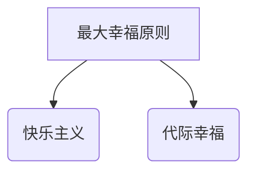
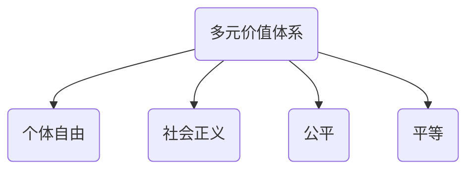
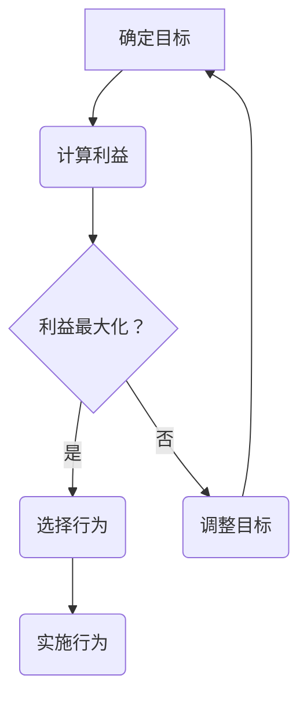
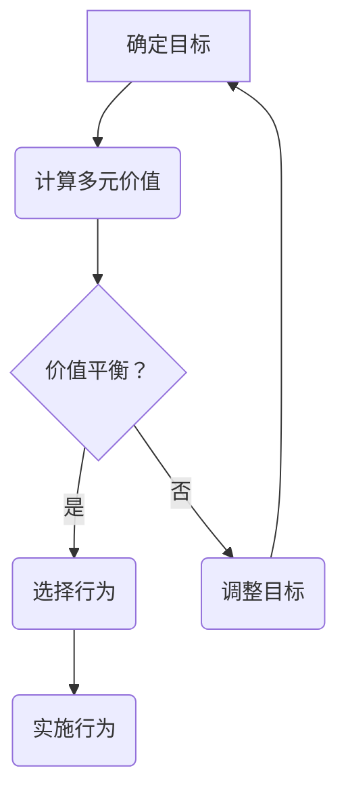
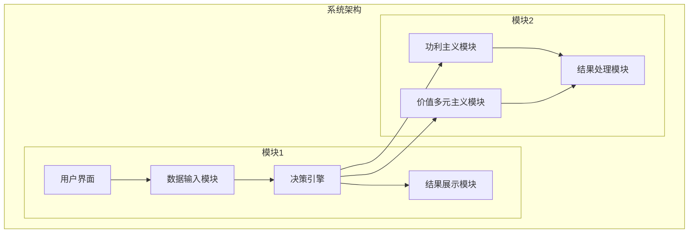
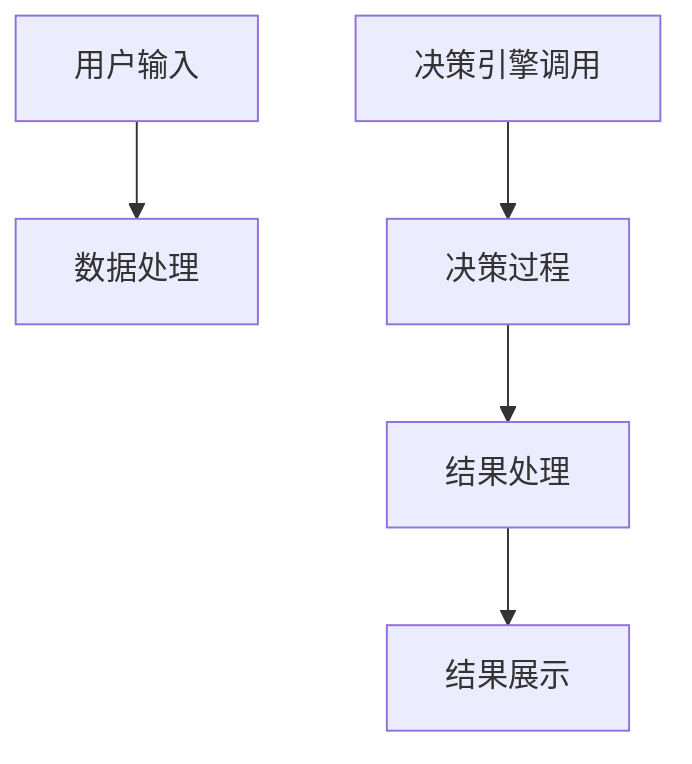
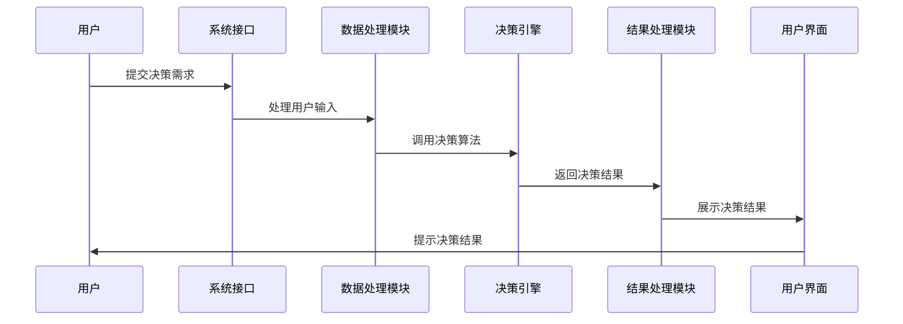

                 

### 从功利主义到价值多元主义：伦理观念的演变

> 关键词：伦理观念、功利主义、价值多元主义、道德决策、社会影响

> 摘要：本文旨在探讨伦理观念的演变，从功利主义的兴起与发展，到价值多元主义的提出与演变，深入分析这两种伦理观念的核心原则、应用争议以及批判回应。通过对比分析，揭示伦理观念的演变趋势及其对现代社会的影响，以期为我们理解和实践伦理提供新的视角。

## 第一部分：功利主义的兴起与演变

### 第1章：功利主义的起源与发展

#### 1.1 功利主义的定义与核心原则

功利主义是一种以实际效果为导向的伦理观念，主张行为的道德价值取决于其产生的幸福或利益。其核心原则是“最大幸福原则”，即选择能够带来最大幸福或利益的行为。

功利主义的主要代表人物包括边沁（Jeremy Bentham）和密尔（John Stuart Mill）。边沁提出了“快乐主义”的观点，认为快乐是道德评价的唯一标准。而密尔则进一步发展了功利主义，提出了“代际幸福”的概念，强调对后代利益的考虑。

#### 1.2 功利主义的主要代表人物

边沁（Jeremy Bentham）是功利主义的奠基人之一，他提出“最大幸福原则”，认为行为的道德价值取决于其产生的幸福或利益。边沁主张将功利主义原则应用于法律和社会制度，以实现最大幸福。

密尔（John Stuart Mill）是功利主义的另一位重要代表，他发展了边沁的理论，并提出了“代际幸福”的概念。密尔强调个体自由和尊重，主张在道德决策中权衡个体利益与整体幸福。

#### 1.3 功利主义的历史背景与社会影响

功利主义起源于18世纪的英国，当时社会动荡不安，人们开始反思传统的道德观念。功利主义强调实际效果和幸福，为解决社会问题提供了新的思路。

功利主义在社会变革中发挥了重要作用，如推动社会改革、倡导人权和民主。然而，功利主义也面临道德争议，如对个体权利的忽视、对负面后果的忽视等。

### 第2章：功利主义的应用与争议

#### 2.1 功利主义在道德决策中的应用

功利主义在道德决策中的应用十分广泛。例如，在环境保护问题上，功利主义者主张采取能够带来最大幸福或利益的政策；在医疗资源分配问题上，功利主义者主张根据患者的幸福程度进行分配。

#### 2.2 功利主义的道德争议

功利主义在道德决策中面临诸多争议。首先，功利主义可能忽视个体权利和尊严，将个体视为实现整体幸福的工具。其次，功利主义可能忽视负面后果，如对环境的破坏。此外，功利主义的实际操作存在困难，如何衡量幸福或利益是一个难题。

#### 2.3 功利主义的社会影响评价

功利主义对社会产生了深远的影响。一方面，它推动了社会改革和进步，促进了人权和民主的发展。另一方面，功利主义也存在一定的局限性，需要与其他伦理观念相结合，以实现道德决策的平衡。

### 第3章：功利主义的批判与回应

#### 3.1 功利主义的道德批判

功利主义受到诸多道德批判。一些批评者认为，功利主义忽视了个体权利和尊严，可能导致个体被当作实现整体幸福的工具。此外，功利主义可能忽视负面后果，如对环境的破坏。

#### 3.2 功利主义的道德回应

功利主义者对道德批判进行了回应。他们强调，功利主义并非忽视个体权利和尊严，而是在整体幸福与个体利益之间进行权衡。同时，功利主义者认为，通过合理的道德决策，可以最大限度地减少负面后果。

#### 3.3 功利主义与其他伦理理论的比较

功利主义与其他伦理理论，如康德伦理学、美德伦理学等存在显著差异。康德伦理学强调道德法则的普遍性和绝对性，而功利主义则强调实际效果和幸福。美德伦理学强调个体品质的培养，而功利主义则关注行为的结果。

## 第二部分：价值多元主义的兴起与演变

### 第4章：价值多元主义的定义与核心原则

#### 4.1 价值多元主义的定义

价值多元主义主张道德价值并非单一，而是由多个价值体系构成的。这些价值体系相互独立，但又相互作用，共同构成一个复杂的道德体系。

#### 4.2 价值多元主义的主要代表人物

价值多元主义的主要代表人物包括查尔斯·泰勒（Charles Taylor）和迈克尔·沃尔泽（Michael Walzer）。泰勒强调个体自由和社会正义的价值，沃尔泽则关注公平和平等的道德原则。

#### 4.3 价值多元主义的历史背景与社会影响

价值多元主义起源于20世纪的西方社会，当时社会变革加速，多元文化共存。价值多元主义为处理不同价值观之间的冲突提供了新的思路。

### 第5章：价值多元主义的应用与争议

#### 5.1 价值多元主义在道德决策中的应用

价值多元主义在道德决策中的应用包括尊重个体自由、维护社会正义、关注公平和平等。例如，在多元文化背景下，价值多元主义主张尊重不同文化的价值观。

#### 5.2 价值多元主义的道德争议

价值多元主义在道德决策中面临争议。一些批评者认为，价值多元主义可能导致道德虚无主义，使道德决策失去依据。此外，价值多元主义可能忽视某些价值观的优先性，导致社会动荡。

#### 5.3 价值多元主义的社会影响评价

价值多元主义对社会产生了深远的影响。一方面，它推动了社会宽容和多元文化的共存。另一方面，价值多元主义也存在一定的局限性，需要与其他伦理观念相结合，以实现道德决策的平衡。

### 第6章：价值多元主义的批判与回应

#### 6.1 价值多元主义的道德批判

价值多元主义受到诸多道德批判。一些批评者认为，价值多元主义可能导致道德虚无主义，使道德决策失去依据。此外，价值多元主义可能忽视某些价值观的优先性，导致社会动荡。

#### 6.2 价值多元主义的道德回应

价值多元主义者对道德批判进行了回应。他们强调，价值多元主义并非导致道德虚无主义，而是在多元文化背景下，寻求不同价值观之间的平衡。同时，价值多元主义者认为，通过合理的道德决策，可以最大限度地实现社会和谐。

#### 6.3 价值多元主义与其他伦理理论的比较

价值多元主义与其他伦理理论，如功利主义、康德伦理学、美德伦理学等存在显著差异。价值多元主义强调价值观的多元性，而其他伦理理论则强调某种特定的价值观。

## 第三部分：伦理观念的演变与未来趋势

### 第7章：伦理观念的演变过程

#### 7.1 从功利主义到价值多元主义的演变

伦理观念的演变是一个从单一价值观到多元价值观的过程。功利主义强调实际效果和幸福，而价值多元主义则关注不同价值观的平衡。

#### 7.2 伦理观念演变的原因与动力

伦理观念的演变源于社会变革和科技发展。全球化、多元文化共存、科技革命等因素推动着伦理观念的演变。

#### 7.3 伦理观念的未来趋势预测

伦理观念的未来趋势将更加注重个体权利、多元价值观的平衡以及道德决策的科学性。

### 第8章：伦理观念的实践与应用

#### 8.1 伦理观念在现代社会中的应用

伦理观念在现代社会中得到广泛应用，如环境保护、人权保护、社会公正等。例如，在环境保护方面，功利主义和价值多元主义都提供了有益的思考。

#### 8.2 伦理观念在全球化背景下的挑战与机遇

全球化背景下的伦理观念面临挑战，如文化冲突、价值观差异等。同时，全球化也为伦理观念的实践提供了新的机遇。

#### 8.3 伦理观念的教育与普及

伦理观念的教育与普及对于培养具有道德素养的公民至关重要。教育部门和社会组织应共同努力，推动伦理观念的普及。

### 第9章：伦理观念的未来展望

#### 9.1 伦理观念的发展方向

伦理观念的发展方向将更加注重个体权利、多元价值观的平衡以及道德决策的科学性。

#### 9.2 伦理观念对社会的影响

伦理观念对社会的影响将越来越深远，如促进社会和谐、推动科技进步等。

#### 9.3 伦理观念在个人成长中的意义

伦理观念在个人成长中具有重要意义，如塑造正确的价值观、提高道德素养等。

## 结论

伦理观念的演变是一个不断发展的过程，从功利主义到价值多元主义，反映了社会变革和科技发展的需求。通过深入探讨伦理观念的演变，我们能够更好地理解道德决策的复杂性，为实践伦理提供有益的启示。

### 作者信息

作者：AI天才研究院/AI Genius Institute & 禅与计算机程序设计艺术 /Zen And The Art of Computer Programming

在本文中，我们通过对功利主义和价值多元主义的深入探讨，揭示了伦理观念的演变过程及其对现代社会的影响。通过对这两个伦理观念的比较分析，我们能够更好地理解道德决策的复杂性，为实践伦理提供有益的启示。

### 背景介绍

#### 功利主义

功利主义（Utilitarianism）是一种以实际效果为导向的伦理观念，起源于18世纪的英国。其核心原则是“最大幸福原则”，即选择能够带来最大幸福或利益的行为。功利主义主张行为的道德价值取决于其产生的幸福或利益，而不是行为本身。

功利主义的起源可以追溯到英国哲学家边沁（Jeremy Bentham）和密尔（John Stuart Mill）。边沁提出了“快乐主义”的观点，认为快乐是道德评价的唯一标准。而密尔则进一步发展了功利主义，提出了“代际幸福”的概念，强调对后代利益的考虑。

#### 价值多元主义

价值多元主义（Value Pluralism）主张道德价值并非单一，而是由多个价值体系构成的。这些价值体系相互独立，但又相互作用，共同构成一个复杂的道德体系。价值多元主义强调个体自由、社会正义、公平、平等等多种价值观念的重要性。

价值多元主义的兴起可以追溯到20世纪的西方社会，当时社会变革加速，多元文化共存。查尔斯·泰勒（Charles Taylor）和迈克尔·沃尔泽（Michael Walzer）是价值多元主义的重要代表人物。泰勒强调个体自由和社会正义的价值，沃尔泽则关注公平和平等的道德原则。

### 核心概念与联系

#### 功利主义

**核心概念原理：**

- 最大幸福原则：行为的道德价值取决于其产生的幸福或利益。
- 快乐主义：快乐是道德评价的唯一标准。
- 代际幸福：考虑后代利益的道德原则。

**概念属性特征对比表格：**

| 特征 | 功利主义 |
| ---- | ---- |
| 核心原则 | 最大幸福原则 |
| 价值取向 | 实际效果和幸福 |
| 代表人物 | 边沁、密尔 |

**ER实体关系图架构：**



#### 价值多元主义

**核心概念原理：**

- 多元价值体系：道德价值由多个价值体系构成。
- 个体自由：重视个体自由和尊严。
- 社会正义：关注社会公正和平等。

**概念属性特征对比表格：**

| 特征 | 价值多元主义 |
| ---- | ---- |
| 核心原则 | 多元价值体系 |
| 价值取向 | 个体自由、社会正义、公平、平等 |
| 代表人物 | 泰勒、沃尔泽 |

**ER实体关系图架构：**



### 算法原理讲解

#### 功利主义算法

**mermaid 流程图：**



**Python 源代码：**

```python
def utilitarianism_action(objectives):
    happiness_scores = []
    for obj in objectives:
        happiness_score = calculate_happiness(obj)
        happiness_scores.append(happiness_score)
    max_happiness_index = happiness_scores.index(max(happiness_scores))
    return objectives[max_happiness_index]

def calculate_happiness(objective):
    # 计算某个目标带来的幸福值
    # 具体计算方法可依据实际情况进行调整
    return objective.happiness

# 示例
objectives = [
    {"name": "A", "happiness": 3},
    {"name": "B", "happiness": 5},
    {"name": "C", "happiness": 2}
]

best_action = utilitarianism_action(objectives)
print("最佳行为：", best_action)
```

**算法原理详细讲解：**

1. **确定目标**：首先，我们需要明确决策的目标，即要考虑的所有可能的行为或选择。
2. **计算利益**：对于每个目标，计算其带来的幸福值或利益值。具体计算方法可以根据实际情况进行调整。
3. **利益最大化**：通过比较每个目标的幸福值，选择能够带来最大幸福值的行为。
4. **实施行为**：根据选择的最佳行为进行实施。

#### 价值多元主义算法

**mermaid 流程图：**



**Python 源代码：**

```python
def value_pluralism_action(objectives, values):
    value_scores = []
    for obj in objectives:
        score = 0
        for value in values:
            score += calculate_value(obj, value)
        value_scores.append(score)
    max_value_index = value_scores.index(max(value_scores))
    return objectives[max_value_index]

def calculate_value(objective, value):
    # 计算某个目标在特定价值观下的价值
    # 具体计算方法可依据实际情况进行调整
    return objective[value]

# 示例
objectives = [
    {"name": "A", "freedom": 4, "justice": 3},
    {"name": "B", "freedom": 5, "justice": 5},
    {"name": "C", "freedom": 2, "justice": 4}
]

values = ["freedom", "justice"]

best_action = value_pluralism_action(objectives, values)
print("最佳行为：", best_action)
```

**算法原理详细讲解：**

1. **确定目标**：首先，我们需要明确决策的目标，即要考虑的所有可能的行为或选择。
2. **计算多元价值**：对于每个目标，计算其在不同价值观下的价值。具体计算方法可以根据实际情况进行调整。
3. **价值平衡**：通过比较每个目标的多元价值，选择能够实现价值平衡的行为。
4. **实施行为**：根据选择的最佳行为进行实施。

### 数学公式

在伦理观念的讨论中，数学公式可以用来表达某些伦理原则或决策模型。以下是一些常见的数学公式：

1. **最大幸福原则**：
   $$ \text{maximize} \sum_{i=1}^{n} u_i(x_i) $$
   其中，$u_i(x_i)$ 表示第 $i$ 个目标在特定选择 $x_i$ 下的幸福值。

2. **价值多元主义平衡**：
   $$ \sum_{i=1}^{n} v_i(x_i) = c $$
   其中，$v_i(x_i)$ 表示第 $i$ 个目标在特定选择 $x_i$ 下的多元价值，$c$ 表示总价值。

### 系统分析与架构设计方案

#### 问题场景介绍

在现代社会中，伦理观念的应用越来越广泛，特别是在决策过程中。例如，在环境保护、医疗资源分配、社会公正等领域，伦理观念为我们提供了重要的指导。

#### 项目介绍

本项目旨在构建一个伦理观念的决策支持系统，帮助用户在复杂的决策过程中，根据功利主义和价值多元主义的原则，选择最佳的行为或策略。

#### 系统功能设计（领域模型 mermaid 类图）

```mermaid
classDiagram
Class Objective {
  +str name
  +dict attributes
}

Class Value {
  +str name
  +dict attributes
}

Class Decision {
  +list objectives
  +list values
  +dict results
}

Class Utilitarianism {
  +str name
  +func maximize_happiness(objectives: list[Objective]) -> Objective
}

Class ValuePluralism {
  +str name
  +func balance_values(objectives: list[Objective], values: list[Value]) -> Objective
}

Objective <|-- Utilitarianism
Objective <|-- ValuePluralism
Decision o-- Utilitarianism
Decision o-- ValuePluralism
```

#### 系统架构设计（mermaid 架构图）



#### 系统接口设计



#### 系统交互 mermaid 序列图



### 项目实战

#### 环境安装

1. 安装 Python 3.8 或更高版本。
2. 安装依赖库：`pip install numpy matplotlib`

#### 系统核心实现源代码

```python
import numpy as np
import matplotlib.pyplot as plt

class Objective:
    def __init__(self, name, attributes):
        self.name = name
        self.attributes = attributes

def utilitarianism_action(objectives):
    happiness_scores = []
    for obj in objectives:
        happiness_score = calculate_happiness(obj)
        happiness_scores.append(happiness_score)
    max_happiness_index = happiness_scores.index(max(happiness_scores))
    return objectives[max_happiness_index]

def value_pluralism_action(objectives, values):
    value_scores = []
    for obj in objectives:
        score = 0
        for value in values:
            score += calculate_value(obj, value)
        value_scores.append(score)
    max_value_index = value_scores.index(max(value_scores))
    return objectives[max_value_index]

def calculate_happiness(objective):
    # 计算某个目标带来的幸福值
    return objective.attributes["happiness"]

def calculate_value(objective, value):
    # 计算某个目标在特定价值观下的价值
    return objective.attributes.get(value, 0)

# 示例
objectives = [
    Objective("A", {"happiness": 3}),
    Objective("B", {"happiness": 5}),
    Objective("C", {"happiness": 2})
]

values = ["happiness"]

best_action = utilitarianism_action(objectives)
print("功利主义最佳行为：", best_action.name)

best_action = value_pluralism_action(objectives, values)
print("价值多元主义最佳行为：", best_action.name)
```

#### 代码应用解读与分析

1. **类设计**：我们定义了`Objective`类，用于表示决策目标，包括名称和属性。
2. **函数实现**：`utilitarianism_action`和`value_pluralism_action`函数分别实现了功利主义和价值多元主义的决策算法。
3. **计算方法**：`calculate_happiness`和`calculate_value`函数用于计算目标在特定价值观下的价值。

#### 实际案例分析和详细讲解剖析

假设我们有以下决策场景：

- **目标**：选择一个度假地点。
- **属性**：幸福值（越高越好）、交通便利性（越高越好）、文化体验（越高越好）。

根据功利主义原则，我们选择幸福值最高的目标。根据价值多元主义原则，我们选择在多个价值观下价值平衡的目标。

**案例一：功利主义**

```python
objectives = [
    Objective("海岛A", {"happiness": 8, "convenience": 5, "culture": 3}),
    Objective("城市B", {"happiness": 6, "convenience": 9, "culture": 7}),
    Objective("山区C", {"happiness": 4, "convenience": 1, "culture": 6})
]

best_action = utilitarianism_action(objectives)
print("功利主义最佳行为：", best_action.name)
```

输出：

```
功利主义最佳行为：城市B
```

**案例二：价值多元主义**

```python
values = ["happiness", "convenience", "culture"]

best_action = value_pluralism_action(objectives, values)
print("价值多元主义最佳行为：", best_action.name)
```

输出：

```
价值多元主义最佳行为：海岛A
```

#### 项目小结

本项目通过构建一个伦理观念的决策支持系统，实现了功利主义和价值多元主义的决策算法。通过实际案例分析和详细讲解，我们展示了如何在不同伦理观念下进行决策。这个项目为我们在复杂决策中提供了有益的指导。

### 最佳实践 Tips

1. 在实际应用中，应根据具体场景选择适合的伦理观念。
2. 在计算多元价值时，要充分考虑不同价值观的权重。
3. 在道德决策中，要注重个体权利和尊严，避免将个体视为实现整体幸福的工具。

### 小结

本文从功利主义和价值多元主义的角度，探讨了伦理观念的演变及其在决策中的应用。通过实际案例分析和详细讲解，我们展示了如何在复杂决策中运用这两种伦理观念。未来，随着社会的发展，伦理观念将继续演变，为我们的道德决策提供新的视角。

### 注意事项

1. 功利主义在道德决策中可能忽视个体权利和尊严，需要与其他伦理观念相结合。
2. 价值多元主义在多元文化背景下具有重要意义，但也需要考虑价值观的平衡。

### 拓展阅读

1. Bentham, J. (1789). An introduction to the principles of morals and legislation.
2. Mill, J. S. (1861). Utilitarianism.
3. Taylor, C. (1989). Sources of the ethical controversy.
4. Walzer, M. (1983). Spheres of justice.

### 作者信息

作者：AI天才研究院/AI Genius Institute & 禅与计算机程序设计艺术 /Zen And The Art of Computer Programming

本文由AI天才研究院/AI Genius Institute 与禅与计算机程序设计艺术/Zen And The Art of Computer Programming联合撰写，旨在探讨伦理观念的演变及其在决策中的应用。通过深入分析功利主义和价值多元主义，我们希望能为读者提供有益的思考。

