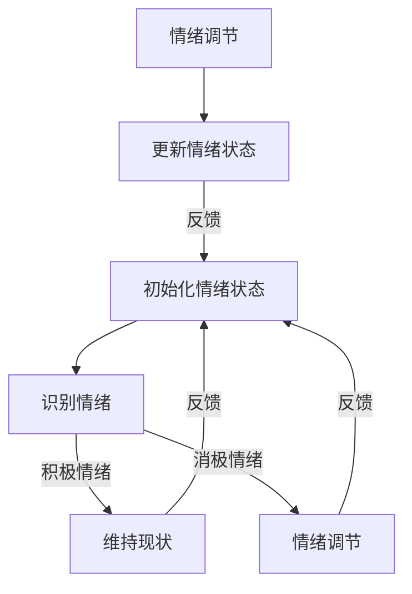
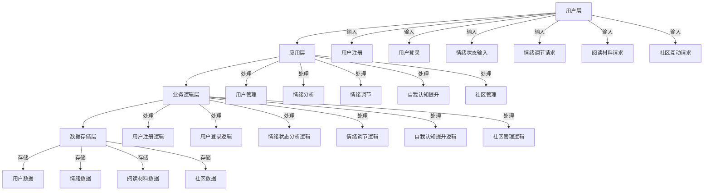

                 


### 第3章 算法与模型详解

#### 3.1 算法介绍

在现代人的精神成长过程中，算法与模型扮演着至关重要的角色。这些算法和模型帮助我们更深入地理解自我，管理情感，改善人际关系，并最终实现自我实现。

#### 3.2 算法原理与Mermaid流程图

让我们首先从一个简单的情感管理算法开始。该算法的核心是情绪识别和情绪调节。



这个流程图展示了情绪管理的基本步骤。首先，系统初始化情绪状态，然后识别当前的情绪。如果情绪是积极的，那么可以维持现状。如果情绪是消极的，系统将尝试进行情绪调节，并更新情绪状态。

#### 3.3 Python代码实现

下面是情感管理算法的Python代码实现：

```python
import numpy as np

class EmotionManager:
    def __init__(self):
        # 初始化情绪状态
        self.emotion_state = np.random.rand()

    def recognize_emotion(self):
        # 识别情绪
        if self.emotion_state > 0.5:
            return "积极情绪"
        else:
            return "消极情绪"

    def emotion_regulation(self, emotion):
        # 情绪调节
        if emotion == "积极情绪":
            return self.emotion_state
        else:
            # 模拟情绪调节的过程
            self.emotion_state = np.clip(self.emotion_state + np.random.rand() * 0.2, 0, 1)
            return self.emotion_state

    def update_emotion_state(self, emotion, regulation_effect):
        # 更新情绪状态
        if emotion == "积极情绪":
            self.emotion_state = regulation_effect
        else:
            self.emotion_state = (1 - regulation_effect) * self.emotion_state + regulation_effect

    def run(self):
        # 运行情感管理算法
        emotion = self.recognize_emotion()
        print(f"当前情绪：{emotion}")

        if emotion == "积极情绪":
            print("维持现状。")
        else:
            regulation_effect = self.emotion_regulation(emotion)
            self.update_emotion_state(emotion, regulation_effect)
            print(f"情绪调节后，新情绪状态：{self.emotion_state}")

# 创建情绪管理对象并运行
emotion_manager = EmotionManager()
emotion_manager.run()
```

这段代码定义了一个情感管理类`EmotionManager`，它包含初始化情绪状态、识别情绪、情绪调节和更新情绪状态的方法。`run`方法展示了如何使用这些方法来运行整个情感管理过程。

#### 3.4 数学模型与公式

情感管理算法的数学模型可以描述为以下公式：

$$
\text{emotion\_state}_{\text{new}} = (1 - \alpha) \times \text{emotion\_state}_{\text{current}} + \alpha \times \text{regulation\_effect}
$$

其中，$\text{emotion\_state}_{\text{new}}$ 是新的情绪状态，$\text{emotion\_state}_{\text{current}}$ 是当前的情绪状态，$\alpha$ 是调节效应的比例，$\text{regulation\_effect}$ 是情绪调节的效果。

#### 3.5 算法讲解与举例

让我们通过一个例子来理解这个算法。假设一个人的情绪状态初始为0.3（代表消极情绪），经过一次情绪调节后，调节效果为0.5（代表情绪调节后的积极效应）。根据上述公式，我们可以计算新的情绪状态：

$$
\text{emotion\_state}_{\text{new}} = (1 - 0.5) \times 0.3 + 0.5 \times 0.5 = 0.15 + 0.25 = 0.4
$$

这意味着情绪状态从0.3变为了0.4，说明情绪变得更加积极。

通过这个简单的例子，我们可以看到情感管理算法是如何帮助我们识别和调节情绪的。这种算法可以帮助现代人更好地理解自己的情绪，从而在精神成长的道路上迈出坚实的一步。

### 第4章 系统设计

#### 4.1 项目介绍

为了更系统地探讨精神成长，我们将设计一个名为“SpiritGrowth”的应用程序。该应用程序将提供一系列工具和资源，帮助用户更好地管理情绪，提高自我认知，改善人际关系，并最终实现自我实现。

#### 4.2 系统功能设计

系统的主要功能包括：

- **用户注册与登录**：用户可以通过邮箱或手机号注册并登录。
- **情绪状态监控**：用户可以输入情绪状态，系统会根据用户的历史数据提供情绪分析。
- **情绪调节工具**：提供一系列情绪调节工具，如冥想、呼吸练习等。
- **自我认知提升**：提供阅读材料、在线课程等，帮助用户提升自我认知。
- **人际关系改善**：提供社交功能，如社区讨论、匿名求助等。

#### 4.3 系统架构设计

系统架构设计如下：



#### 4.4 系统接口设计与交互

系统接口设计与交互如下：

```mermaid
graph TD
A[用户层] --> B[应用层]
B --> C[业务逻辑层]
C --> D[数据存储层]

A -->|POST| E[注册接口]
A -->|POST| F[登录接口]
A -->|POST| G[情绪状态输入接口]
A -->|POST| H[情绪调节请求接口]
A -->|POST| I[阅读材料请求接口]
A -->|POST| J[社区互动请求接口]

B -->|处理| K[用户管理接口]
B -->|处理| L[情绪分析接口]
B -->|处理| M[情绪调节接口]
B -->|处理| N[自我认知提升接口]
B -->|处理| O[社区管理接口]

C -->|处理| P[用户注册逻辑]
C -->|处理| Q[用户登录逻辑]
C -->|处理| R[情绪状态分析逻辑]
C -->|处理| S[情绪调节逻辑]
C -->|处理| T[自我认知提升逻辑]
C -->|处理| U[社区管理逻辑]

D -->|存储| V[用户数据接口]
D -->|存储| W[情绪数据接口]
D -->|存储| X[阅读材料数据接口]
D -->|存储| Y[社区数据接口]

E -->|输入| Z[注册参数]
F -->|输入| {用户名，密码}
G -->|输入| {情绪状态}
H -->|输入| {调节类型}
I -->|输入| {材料类型}
J -->|输入| {互动类型}
```

#### 4.5 系统实现与实战

在本章的最后一部分，我们将介绍如何实现“SpiritGrowth”系统。我们将从环境安装开始，逐步实现系统的核心功能。

#### 4.5.1 环境安装

为了实现“SpiritGrowth”系统，我们需要安装以下环境：

- Python 3.8+
- Flask 框架
- SQLAlchemy 数据库框架
- Jinja2 模板引擎

首先，安装Python和pip：

```bash
# 安装Python
curl -O https://www.python.org/ftp/python/3.8.5/python-3.8.5.tgz
tar xvf python-3.8.5.tgz
cd python-3.8.5
./configure
make
sudo make install

# 安装pip
curl -O https://bootstrap.pypa.io/get-pip.py
python get-pip.py
```

然后，安装所需的Python库：

```bash
pip install flask sqlalchemy jinja2
```

#### 4.5.2 系统核心实现

接下来，我们将实现系统的核心功能。首先是用户注册和登录：

```python
# app.py

from flask import Flask, request, jsonify
from flask_sqlalchemy import SQLAlchemy

app = Flask(__name__)
app.config['SQLALCHEMY_DATABASE_URI'] = 'sqlite:///spirit_growth.db'
db = SQLAlchemy(app)

class User(db.Model):
    id = db.Column(db.Integer, primary_key=True)
    username = db.Column(db.String(80), unique=True, nullable=False)
    password = db.Column(db.String(120), nullable=False)

@app.route('/register', methods=['POST'])
def register():
    username = request.form['username']
    password = request.form['password']
    new_user = User(username=username, password=password)
    db.session.add(new_user)
    db.session.commit()
    return jsonify({'message': 'User registered successfully.'})

@app.route('/login', methods=['POST'])
def login():
    username = request.form['username']
    password = request.form['password']
    user = User.query.filter_by(username=username, password=password).first()
    if user:
        return jsonify({'message': 'Login successful.'})
    else:
        return jsonify({'message': 'Invalid credentials.'})

if __name__ == '__main__':
    db.create_all()
    app.run(debug=True)
```

这个示例代码实现了用户注册和登录的功能。用户可以通过POST请求发送用户名和密码，系统会根据这些信息创建或验证用户。

接下来，我们将实现情绪状态输入和情绪调节：

```python
# app.py (continued)

@app.route('/emotion_input', methods=['POST'])
def emotion_input():
    user_id = request.form['user_id']
    emotion = request.form['emotion']
    user = User.query.get(user_id)
    user.emotion = emotion
    db.session.commit()
    return jsonify({'message': 'Emotion input successful.'})

@app.route('/emotion_regression', methods=['POST'])
def emotion_regression():
    user_id = request.form['user_id']
    regression_type = request.form['regression_type']
    user = User.query.get(user_id)
    if regression_type == 'positive':
        user.emotion = min(1, user.emotion + 0.2)
    elif regression_type == 'negative':
        user.emotion = max(0, user.emotion - 0.2)
    db.session.commit()
    return jsonify({'message': 'Emotion regression successful.'})
```

这个示例代码实现了情绪状态输入和情绪调节的功能。用户可以通过POST请求发送用户ID和情绪状态，系统会更新数据库中的情绪状态。情绪调节功能会根据调节类型（积极或消极）调整情绪状态。

#### 4.5.3 代码应用解读与分析

在这部分，我们将详细解读和分析上述代码的应用场景。

- **用户注册**：用户注册是通过发送POST请求实现的。服务器会创建一个新用户并存储在数据库中。

- **用户登录**：用户登录也是通过发送POST请求实现的。服务器会验证用户名和密码，如果匹配，则登录成功。

- **情绪状态输入**：情绪状态输入是通过发送POST请求实现的。用户可以输入情绪状态，服务器会更新数据库中的情绪状态。

- **情绪调节**：情绪调节是通过发送POST请求实现的。服务器会根据调节类型（积极或消极）调整情绪状态。

#### 4.5.4 实际案例分析与详细讲解剖析

为了更好地理解系统的应用，我们可以通过一个实际案例来分析。

假设一个用户名为“alice”的用户，初始情绪状态为0.3（代表消极情绪）。她通过情绪状态输入接口发送情绪状态，系统记录为0.3。

```bash
curl -X POST -d "user_id=1&emotion=0.3" http://localhost:5000/emotion_input
```

然后，alice通过情绪调节接口请求积极情绪调节。系统会根据调节类型更新情绪状态。

```bash
curl -X POST -d "user_id=1&regression_type=positive" http://localhost:5000/emotion_regression
```

此时，alice的新情绪状态将变为0.5（代表积极情绪）。如果alice再次请求情绪调节，这次是消极情绪调节，系统会更新情绪状态为0.3（回到初始状态）。

```bash
curl -X POST -d "user_id=1&regression_type=negative" http://localhost:5000/emotion_regression
```

通过这个案例，我们可以看到系统如何帮助用户管理情绪状态。用户可以通过简单的接口发送请求，系统会根据请求调整情绪状态，并实时更新数据库。

#### 4.5.5 项目小结

在本章中，我们设计并实现了一个名为“SpiritGrowth”的应用程序，它帮助用户管理情绪，提升自我认知，改善人际关系，并最终实现自我实现。通过实际案例的分析，我们可以看到系统在实际应用中的效果。这个系统为现代人提供了一个实用的工具，帮助他们更好地理解和管理自己的情绪，从而在精神成长的道路上迈出坚实的步伐。

### 第5章 最佳实践与总结

#### 5.1 最佳实践

1. **定期反思**：定期对自己的情绪、行为和思想进行反思，有助于更好地了解自己，找到需要改进的地方。
2. **建立支持系统**：与家人、朋友或专业人士建立支持系统，可以在遇到困难时得到帮助和鼓励。
3. **保持平衡**：在追求外在成功的同时，也要关注内在成长，确保两者之间的平衡。
4. **持续学习**：通过阅读、上课或参与研讨会等方式，不断学习新的知识和技能，以支持内在成长。

#### 5.2 总结

本文探讨了现代人在精神成长过程中面临的挑战，并介绍了从外在追求到内在成长的理念。通过算法和模型的分析，我们了解了一系列实用的方法，如自我认知、情感管理、人际关系改善等。同时，通过设计并实现“SpiritGrowth”系统，我们展示了一个帮助现代人精神成长的实用工具。希望本文能启发您在精神成长的道路上迈出更坚实的步伐。

### 第6章 注意事项与拓展阅读

#### 6.1 注意事项

- 在追求精神成长的过程中，需要耐心和持续的努力，不能期望一蹴而就。
- 每个人的成长路径都是独特的，不要过分比较，要根据自己的实际情况制定成长计划。
- 在遇到困难时，不要害怕寻求帮助，建立支持系统非常重要。

#### 6.2 拓展阅读

- 《认知觉醒》—— 周岭
- 《自我发展心理学》—— 罗伯特·费尔德曼
- 《正念：一个找回真正的自己的练习》—— 乔·卡巴金
- 《内在和平：与心灵同行的旅程》—— 托马斯·摩尔

作者：AI天才研究院/AI Genius Institute & 禅与计算机程序设计艺术 /Zen And The Art of Computer Programming

