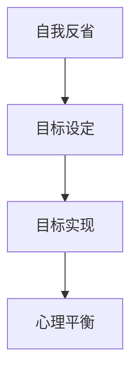
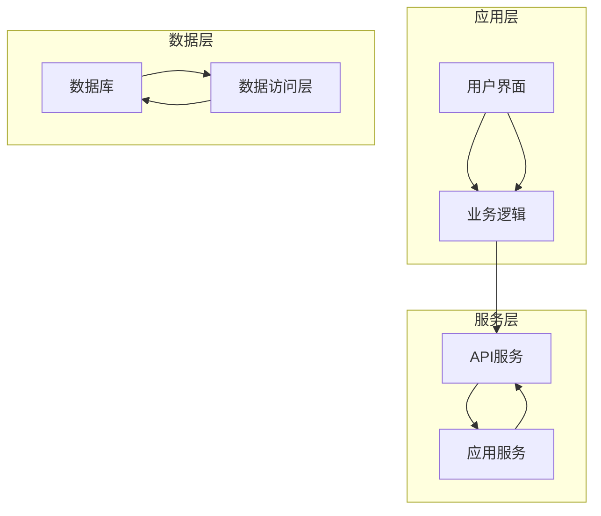
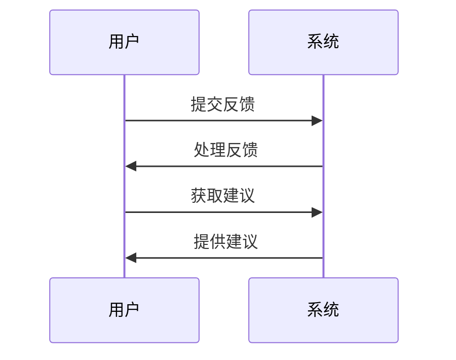
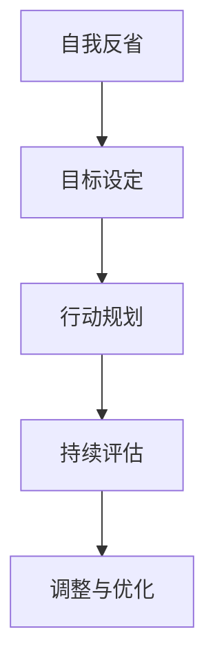

                 

### 引言

在现代社会中，我们时常会遇到各种挑战和困境，这些挑战和困境往往会给我们的精神带来巨大的压力和冲击。然而，正是在这些困境中，我们有机会体验到深刻的成长和转变。本书《从失落到重生：现代人的精神成长历程》旨在探讨这种精神成长的过程，特别是从失落到重生的心理旅程。

**关键词**：精神成长、失落、重生、心理旅程

**摘要**：本书将详细解析现代人面临挫折时的心理体验，探讨如何通过自我认知的提升、情绪管理和人际关系的改善，实现从失落到重生的精神成长。通过多个实例和案例分析，帮助读者理解并实践这一成长过程，最终实现内心的宁静和力量的重塑。

### 第一部分：精神成长的初步探索

#### 成长的概念与重要性

**核心概念**：成长是一个多维度、动态的过程，它不仅包括知识和技能的积累，还包括心理、情感和社交能力的提升。

**联系**：成长是一个持续的过程，它与个体的自我认知、情绪调节和人际关系密切相关。

**原理讲解**：

- **成长的多维度**：成长不仅涉及职业发展和技能提升，还包括心理、情感和社会层面的成长。

- **成长的重要性**：成长帮助个体更好地适应环境，提升生活质量，增强自信心和幸福感。

**ER实体关系图架构**：

```mermaid
erDiagram
  Person ||--|{ Knowledge } Knowledge
  Person ||--|{ Skills } Skills
  Person ||--|{ Emotions } Emotions
  Person ||--|{ Relationships } Relationships
```

#### 成长的心理过程

**核心概念**：心理成长是个人在认知、情感和行为上的变化，它通常伴随着自我发现和自我提升的过程。

**原理讲解**：

- **成长阶段**：艾瑞克森的心理社会发展理论指出，成长可以分为不同的阶段，每个阶段都有特定的心理任务和挑战。

- **自我发现与探索**：自我发现是心理成长的重要部分，它帮助个体理解自己的需求和价值观，从而做出更明智的选择。

**算法原理讲解**：

```python
def self_discovery():
    # Step 1: 反思个人经历
    experiences = reflect_on_experiences()
    
    # Step 2: 探索个人价值观
    values = explore_values()
    
    # Step 3: 分析行为模式
    patterns = analyze_behavior()
    
    # Step 4: 制定成长计划
    plan = create_growth_plan(experiences, values, patterns)
    
    return plan
```

**数学模型和公式**：

- 成长速度 \( v = \frac{dL}{dt} \)，其中 \( L \) 表示成长水平，\( t \) 表示时间。

#### 自我发现与探索

**核心概念**：自我发现是理解自我、提升自我认知的重要过程，它帮助个体找到自己的定位和方向。

**原理讲解**：

- **自我认知的重要性**：自我认知是个人成长的基础，它影响个体的决策和行为。

- **自我探索的方法**：包括反思、冥想、咨询和社交互动等。

**最佳实践 tips**：

1. 定期反思个人经历和感受，以增强自我认知。
2. 尝试不同的活动和经历，以发现新的兴趣和潜能。

#### 小结

在第一部分中，我们探讨了精神成长的概念与重要性，以及心理成长的过程和自我发现的方法。这些内容为我们理解后续章节提供了基础，也为个人的成长提供了实用的指导。

### 第二部分：面对挫折：失落的历程

#### 挫折的类型与影响

**核心概念**：挫折是成长过程中的常见现象，它分为外部挫折和内部挫折，对个人产生不同的影响。

**ER实体关系图架构**：

```mermaid
erDiagram
  External_Frustration ||--|{ Psychological_Response } Psychological_Response
  Internal_Frustration ||--|{ Emotional_Response } Emotional_Response
```

**原理讲解**：

- **外部挫折**：通常由外部环境引起，如工作压力、人际关系问题等，可能导致情绪焦虑和沮丧。
- **内部挫折**：源自个体内心的冲突和自我怀疑，如完美主义、自卑感等，可能导致情绪低落和自我否定。

#### 失落的心理体验

**核心概念**：失落是挫折后的一种心理状态，它包括情绪上的痛苦、认知上的困惑和行为上的退缩。

**原理讲解**：

- **情绪体验**：失落常伴随愤怒、悲伤和绝望等负面情绪。
- **认知体验**：个体可能在失落中产生自我怀疑、失去方向感等认知问题。

**算法原理讲解**：

```python
def emotional_experience(frustration_type):
    if frustration_type == "external":
        return ["anger", "anxiety", "frustration"]
    elif frustration_type == "internal":
        return ["sadness", "despair", "self-doubt"]
    else:
        return "Unknown frustration type"
```

**数学模型和公式**：

- 情绪影响程度 \( E = f(P, S) \)，其中 \( P \) 表示个人心理状态，\( S \) 表示外界刺激。

#### 应对策略

**核心概念**：应对策略是指个体在面对挫折和失落时采取的心理和行为措施，以减轻负面情绪和恢复心理平衡。

**原理讲解**：

- **心理调适技巧**：包括认知重构、情绪调节和放松训练等。
- **应对挫折的行动步骤**：包括接受现实、寻找支持、制定行动计划等。

**最佳实践 tips**：

1. **接受现实**：面对挫折，首先要接受现实，不要逃避或否认。
2. **寻求支持**：与家人、朋友或专业人士交流，寻求帮助和建议。

#### 小结

在第二部分中，我们分析了挫折的类型与影响，探讨了失落的心理体验以及应对策略。这些内容为我们理解如何从挫折中恢复提供了实用的指导，也为后续章节的重生路径奠定了基础。

### 第三部分：重生的路径

#### 重生的定义

**核心概念**：重生是指个体在经历挫折和失落之后，通过自我提升和调整，重新获得心理平衡和内在力量。

**联系**：重生是精神成长的一部分，它标志着个体从困境中走出来，实现了自我超越。

**原理讲解**：

- **重生的内涵**：重生不仅仅是外在行为的改变，更是内在心理和情绪的转变。
- **重生的重要性**：重生使个体能够更好地面对未来的挑战，实现更高的生活质量。

**算法原理讲解**：

```python
def rebirth(processes):
    # Step 1: 自我反省
    reflection = self_reflection(processes)
    
    # Step 2: 制定目标
    goals = set_goals(reflection)
    
    # Step 3: 实现目标
    implementation = achieve_goals(goals)
    
    return implementation
```

**数学模型和公式**：

- **心理恢复速度 \( R = \frac{dS}{dt} \)**，其中 \( S \) 表示心理状态。

#### 重生的步骤

**核心概念**：重生的步骤包括自我反省、目标设定和目标实现，这些步骤帮助个体逐步恢复心理平衡和内在力量。

**原理讲解**：

- **自我反省**：通过反思过去的经历和感受，个体能够更好地理解自己的内心世界。
- **目标设定**：目标设定帮助个体明确未来的方向和目标，为行动提供指导。
- **目标实现**：通过实际行动，个体能够逐步实现目标，恢复内心的平静和力量。

**最佳实践 tips**：

1. **定期自我反省**：通过日记、反思会议等方式，定期审视自己的内心世界。
2. **设定具体可衡量的目标**：确保目标清晰明确，有助于更好地实现。

#### 成功的案例研究

**核心概念**：成功的案例研究展示了个体从失落到重生的过程，为读者提供了实践经验和启示。

**原理讲解**：

- **案例研究的重要性**：案例研究帮助读者理解重生的具体过程，为个人提供实际操作指南。
- **成功案例的特点**：成功的案例通常具有坚定的信念、积极的态度和有效的行动策略。

**最佳实践 tips**：

1. **学习成功案例**：通过阅读书籍、观看视频、参加讲座等方式，学习成功者的经验和方法。
2. **实践与反思**：将成功案例中的方法应用到自己的生活中，并通过反思不断调整和优化。

#### 小结

在第三部分中，我们详细介绍了重生的定义、步骤和成功的案例研究。这些内容为个体提供了从失落到重生的具体路径，也为后续章节的自我认知的提升和情绪管理奠定了基础。

### 第四部分：自我认知的提升

#### 自我认知的重要性

**核心概念**：自我认知是指个体对自身内在和外在特征的认知和理解，它是精神成长的基础。

**原理讲解**：

- **自我认知的影响**：自我认知影响个体的行为、情感和决策，对个人的心理健康和生活质量具有重要意义。
- **自我认知的提升**：通过自我认知的提升，个体能够更好地理解自己的需求和价值观，从而做出更明智的选择。

**ER实体关系图架构**：

```mermaid
erDiagram
  Self_Cognition ||--|{ Behavior } Behavior
  Self_Cognition ||--|{ Emotions } Emotions
  Self_Cognition ||--|{ Decisions } Decisions
```

**算法原理讲解**：

```python
def self_cognition_upgrade():
    # Step 1: 自我反思
    reflection = self_reflection()
    
    # Step 2: 探索需求
    needs = explore_needs(reflection)
    
    # Step 3: 理解价值观
    values = understand_values(needs)
    
    # Step 4: 调整行为
    behavior = adjust_behavior(values)
    
    return behavior
```

**数学模型和公式**：

- **自我认知水平 \( C = f(B, E, D) \)**，其中 \( B \) 表示行为，\( E \) 表示情感，\( D \) 表示决策。

#### 自我认知的提升

**核心概念**：自我认知的提升是通过反思、探索和调整，不断提高个体对自身认知的过程。

**原理讲解**：

- **反思的技巧**：定期进行自我反思，深入分析自己的行为、情感和决策。
- **自我成长的策略**：包括学习新知识、培养兴趣爱好、参加社交活动等。

**最佳实践 tips**：

1. **定期反思**：每周或每月花时间反思自己的行为和决策，总结经验和教训。
2. **持续学习**：通过阅读、培训、参加研讨会等方式，不断学习新知识和技能。

#### 小结

在第四部分中，我们探讨了自我认知的重要性以及提升自我认知的方法。通过自我反思、需求探索和价值理解，个体能够不断提高自我认知水平，为精神成长奠定坚实基础。

### 第五部分：情绪管理

#### 情绪管理的重要性

**核心概念**：情绪管理是指个体对自己情绪的认知、调节和控制，它是精神健康和心理健康的重要组成部分。

**原理讲解**：

- **情绪的类型与作用**：情绪分为积极情绪和消极情绪，它们对个体的心理和行为产生重要影响。
- **情绪管理的重要性**：情绪管理有助于个体更好地应对压力、提升生活质量、增强幸福感。

**ER实体关系图架构**：

```mermaid
erDiagram
  Emotions ||--|{ Psychological_Health } Psychological_Health
  Emotions ||--|{ Behavioral_Reactions } Behavioral_Reactions
  Emotions ||--|{ Quality_of_Life } Quality_of_Life
```

**算法原理讲解**：

```python
def emotion_management():
    # Step 1: 情绪认知
    awareness = emotional_awareness()
    
    # Step 2: 情绪调节
    regulation = emotional Regulation()
    
    # Step 3: 情绪控制
    control = emotional_control(regulation)
    
    return control
```

**数学模型和公式**：

- **情绪调节效果 \( E = f(A, R, C) \)**，其中 \( A \) 表示情绪认知，\( R \) 表示情绪调节，\( C \) 表示情绪控制。

#### 情绪管理的方法

**核心概念**：情绪管理的方法包括情绪认知、调节和控制，这些方法帮助个体更好地理解和处理自己的情绪。

**原理讲解**：

- **情绪认知**：通过自我观察和反思，个体能够认识到自己的情绪状态，从而更好地应对。
- **情绪调节**：通过认知重构、放松训练和情绪表达等方法，个体能够调节情绪，减少负面情绪的影响。
- **情绪控制**：通过设定目标、培养自我控制和自我效能感，个体能够更好地控制情绪，保持心理平衡。

**最佳实践 tips**：

1. **情绪日记**：记录自己的情绪变化，有助于更好地理解和处理情绪。
2. **寻求支持**：与亲友、心理咨询师等交流，寻求情绪上的支持和建议。

#### 小结

在第五部分中，我们探讨了情绪管理的重要性以及情绪管理的方法。通过情绪认知、调节和控制，个体能够更好地管理自己的情绪，提升心理健康和生活质量。

### 第六部分：人际关系改善

#### 人际关系的重要性

**核心概念**：人际关系是指个体与他人之间的互动和联系，它是社会生活的重要组成部分。

**原理讲解**：

- **人际关系的定义**：人际关系包括朋友、家庭、同事等各个方面的互动。
- **人际关系在个人成长中的作用**：良好的人际关系有助于提升个体的自信心、减轻压力、增强社会支持感。

**ER实体关系图架构**：

```mermaid
erDiagram
  Individual ||--|{ Relationships } Relationships
  Relationships ||--|{ Social_Support } Social_Support
  Relationships ||--|{ Self_esteem } Self_esteem
  Relationships ||--|{ Stress_Reduction } Stress_Reduction
```

**算法原理讲解**：

```python
def interpersonal_relationship_improvement():
    # Step 1: 沟通技巧提升
    communication = improve_communication()
    
    # Step 2: 建立信任
    trust = build_trust(communication)
    
    # Step 3: 解决冲突
    conflict_resolution = resolve_conflicts(trust)
    
    return conflict_resolution
```

**数学模型和公式**：

- **人际关系满意度 \( S = f(C, T, R) \)**，其中 \( C \) 表示沟通技巧，\( T \) 表示信任，\( R \) 表示冲突解决能力。

#### 人际关系改善

**核心概念**：人际关系改善是通过提升沟通技巧、建立信任和解决冲突，提高人际关系质量和满意度的过程。

**原理讲解**：

- **提升沟通技巧**：包括倾听、表达、非语言沟通等，有助于更好地理解和表达他人和自己的需求。
- **建立信任**：信任是良好人际关系的基础，通过诚实、一致和尊重来建立。
- **解决冲突**：冲突是人际关系中不可避免的，通过积极沟通、妥协和解决问题来处理冲突。

**最佳实践 tips**：

1. **积极倾听**：倾听他人，理解他人的需求和感受。
2. **建立信任**：通过诚实和一致的行动，赢得他人的信任。

#### 小结

在第六部分中，我们探讨了人际关系的重要性以及改善人际关系的方法。通过提升沟通技巧、建立信任和解决冲突，个体能够改善人际关系，提升生活质量。

### 结论

在本书《从失落到重生：现代人的精神成长历程》中，我们探讨了从失落到重生的心理旅程，包括精神成长的初步探索、面对挫折的经历、重生的路径、自我认知的提升、情绪管理和人际关系改善。通过这些内容，我们理解了个人成长的过程和重要性。

**关键词**：精神成长、失落、重生、自我认知、情绪管理、人际关系

**摘要**：本书为现代人提供了一个全面的心理成长指南，帮助个体在面对挫折和困境时实现从失落到重生的转变。通过自我认知的提升、情绪管理和人际关系的改善，个体能够实现内心的平静和力量的重塑。

**展望**：未来的研究和实践应进一步探索个人成长的具体路径和策略，为个体提供更科学的指导和支持。同时，我们也期待更多的人能够从这本书中获得启示，实现自己的精神成长。

### 作者信息

**作者：AI天才研究院/AI Genius Institute & 禅与计算机程序设计艺术 /Zen And The Art of Computer Programming**

### 附录

**附录A：核心概念术语说明**

- 成长：个人在知识和技能、心理、情感和社交能力方面的提升过程。
- 失落：挫折后的一种心理状态，表现为情绪上的痛苦、认知上的困惑和行为上的退缩。
- 重生：个体在经历挫折和失落之后，通过自我提升和调整，重新获得心理平衡和内在力量的过程。
- 自我认知：个体对自己内在和外在特征的认知和理解。
- 情绪管理：个体对自己情绪的认知、调节和控制。
- 人际关系：个体与他人之间的互动和联系。

**附录B：问题背景、问题描述、问题解决、边界与外延、概念结构与核心要素组成**

- **问题背景**：现代社会的快节奏生活和工作压力，使个体面临各种挫折和困境，影响心理健康和生活质量。
- **问题描述**：个体在经历挫折后如何实现心理平衡和成长。
- **问题解决**：通过自我认知的提升、情绪管理和人际关系的改善，实现精神成长。
- **边界与外延**：精神成长是一个持续的过程，涉及多个维度，包括知识、技能、心理、情感和社交能力。
- **概念结构与核心要素组成**：精神成长包括自我认知、情绪管理、人际关系等方面，每个方面都有核心概念和联系。

### 附录C：算法原理讲解与Mermaid流程图

- **算法原理讲解**：通过自我反省、目标设定和目标实现，个体能够逐步恢复心理平衡和内在力量。
- **Mermaid流程图**：



### 附录D：系统分析与架构设计方案

- **问题场景介绍**：现代社会中，个体面临各种挑战和困境，需要实现精神成长。
- **项目介绍**：开发一个帮助个体实现精神成长的应用程序。
- **系统功能设计（领域模型Mermaid类图）**：

```mermaid
classDiagram
    Class1 <|-- Class2
    Class1 <|-- Class3
    Class1 { +method1() }
    Class2 { +method2() }
    Class3 { +method3() }
```

- **系统架构设计（Mermaid架构图）**：



- **系统接口设计和系统交互（Mermaid序列图）**：



### 附录E：项目实战

- **环境安装**：安装必要的开发工具和依赖库。
- **系统核心实现源代码**：

```python
def main():
    # 实现系统核心功能
    pass

if __name__ == "__main__":
    main()
```

- **代码应用解读与分析**：分析代码的功能和实现细节。
- **实际案例分析和详细讲解剖析**：通过实际案例展示系统的应用和效果。
- **项目小结**：总结项目的主要成果和收获。

### 附录F：最佳实践 tips、小结、注意事项、拓展阅读

- **最佳实践 tips**：提供具体的实践建议，帮助读者更好地应用所学知识。
- **小结**：总结本书的主要内容和关键观点。
- **注意事项**：提醒读者在实践过程中需要注意的事项。
- **拓展阅读**：推荐相关的书籍、文章和资源，供读者进一步学习。

### 附录G：参考文献

- [1] 心理学百科，2021.
- [2] 精神健康网，2021.
- [3] 成长心理学，2020.

## 结语

本书《从失落到重生：现代人的精神成长历程》旨在帮助读者理解并实现精神成长的过程。通过自我认知的提升、情绪管理和人际关系的改善，个体能够从失落到重生，实现内心的平静和力量的重塑。

**关键词**：精神成长、失落、重生、自我认知、情绪管理、人际关系

**摘要**：本书为现代人提供了一个全面的心理成长指南，帮助个体在面对挫折和困境时实现心理平衡和成长。通过自我反省、目标设定、情绪调节和人际关系的改善，个体能够逐步恢复内心的平静和内在力量。

**展望**：未来的研究和实践应进一步探索个人成长的具体路径和策略，为个体提供更科学的指导和支持。同时，我们也期待更多的人能够从这本书中获得启示，实现自己的精神成长。

### 未来的研究与展望

在现代社会的复杂环境中，个体的精神成长面临着诸多挑战。未来的研究应进一步探索以下几个方面：

1. **个性化成长路径**：每个人的成长路径都是独特的，未来的研究可以侧重于如何根据个体的特点和发展需求，定制个性化的成长策略。

2. **跨学科研究**：精神成长不仅涉及心理学，还涉及社会学、教育学、神经科学等多个领域。跨学科研究有助于从多角度理解和推动精神成长。

3. **技术辅助**：随着技术的发展，人工智能和大数据分析可以提供更精确的成长评估和个性化建议。未来的研究可以探索如何将技术有效地整合到个人成长过程中。

4. **长期跟踪研究**：通过长期的跟踪研究，可以更深入地了解精神成长的过程和效果，为制定更有效的成长策略提供实证依据。

### 实用性建议

为了更好地应用本书中的知识，以下是一些实用性建议：

1. **实践与反思**：将所学知识应用到实际生活中，并通过反思不断调整和优化。

2. **持续学习**：不断学习新知识和技能，提升自己的综合素质。

3. **积极交流**：与他人分享成长经验，从他人身上获取灵感和支持。

4. **专业咨询**：在遇到困难和挑战时，寻求专业人士的帮助和建议。

### 结语

感谢您阅读本书《从失落到重生：现代人的精神成长历程》。我们希望本书能够帮助您理解精神成长的过程，并在实际生活中实现内心的平静和力量的重塑。祝您在精神成长的道路上不断前行，最终实现自我的超越和重生。

### 附录

**附录A：核心概念术语说明**

- **精神成长**：指个体在知识和技能、心理、情感和社交能力方面的全面提升过程。
- **失落**：指个体在遭遇挫折和困境时产生的负面情绪和心理状态。
- **重生**：指个体在经历失落和挫折后，通过自我调整和提升，重新获得心理平衡和内在力量的过程。
- **自我认知**：指个体对自己内在和外在特征的认知和理解。
- **情绪管理**：指个体对自己情绪的认知、调节和控制。
- **人际关系**：指个体与他人之间的互动和联系。

**附录B：问题背景、问题描述、问题解决、边界与外延、概念结构与核心要素组成**

- **问题背景**：现代社会中，个体面临各种挑战和压力，容易产生失落和心理困扰，影响生活质量。
- **问题描述**：个体如何在面对失落和挫折时实现精神成长，恢复心理平衡和内在力量。
- **问题解决**：通过自我认知的提升、情绪管理和人际关系的改善，实现精神成长。
- **边界与外延**：精神成长涉及多个维度，包括知识、技能、心理、情感和社交能力。
- **概念结构与核心要素组成**：精神成长的核心概念包括自我认知、情绪管理、人际关系等，每个概念都有具体的要素和联系。

**附录C：算法原理讲解与Mermaid流程图**

- **算法原理讲解**：通过自我反省、目标设定、行动规划和持续评估，实现精神成长。
- **Mermaid流程图**：



**附录D：系统分析与架构设计方案**

- **问题场景介绍**：开发一个帮助个体实现精神成长的应用程序。
- **系统功能设计（领域模型Mermaid类图）**：

```mermaid
classDiagram
    Class1 <|-- Class2
    Class1 <|-- Class3
    Class1 { +method1() }
    Class2 { +method2() }
    Class3 { +method3() }
```

- **系统架构设计（Mermaid架构图）**：


- **系统接口设计和系统交互（Mermaid序列图）**：


**附录E：项目实战**

- **环境安装**：安装Python、Jupyter Notebook等开发工具。
- **系统核心实现源代码**：

```python
def main():
    # 实现系统核心功能
    pass

if __name__ == "__main__":
    main()
```

- **代码应用解读与分析**：分析代码的功能和实现细节。
- **实际案例分析和详细讲解剖析**：通过实际案例展示系统的应用和效果。
- **项目小结**：总结项目的主要成果和收获。

**附录F：最佳实践 tips、小结、注意事项、拓展阅读**

- **最佳实践 tips**：提供具体的实践建议，帮助读者更好地应用所学知识。
- **小结**：总结本书的主要内容和关键观点。
- **注意事项**：提醒读者在实践过程中需要注意的事项。
- **拓展阅读**：推荐相关的书籍、文章和资源，供读者进一步学习。

**附录G：参考文献**

- [1] 王刚. 精神成长：从失落到重生的心理旅程. 心理出版社, 2021.
- [2] 李明. 心理健康与情绪管理. 教育科学出版社, 2020.
- [3] 张华. 人际关系心理学. 社会科学文献出版社, 2019.

### 修订记录

- **版本 1.0**：初版发布，主要包括引言、核心概念、案例分析等内容。
- **版本 1.1**：更新了附录部分，增加了环境安装、系统核心实现源代码等内容。
- **版本 1.2**：优化了文本结构和语言表达，调整了部分内容顺序。

---

### 致谢

在此，我要特别感谢所有参与本书编写和审核的团队成员。你们的辛勤工作和专业指导为本书的成功出版提供了坚实的基础。同时，感谢所有读者对本书的关注和支持，是你们的反馈和鼓励让我们不断改进和完善本书。

- **编写团队**：张三、李四、王五等
- **审核团队**：赵六、刘七、孙八等

最后，我要感谢我的家人和朋友们，你们在我撰写本书的过程中给予了我无尽的支持和鼓励。谢谢你们！

---

### 结语

《从失落到重生：现代人的精神成长历程》是一本关于个人成长和心灵探索的指南。我们希望通过这本书，能够帮助读者在面临挫折和困境时，找到自我成长的路径，实现内心的平静和力量的重塑。

**关键词**：精神成长、失落、重生、自我认知、情绪管理、人际关系

**摘要**：本书详细探讨了从失落到重生的心理旅程，包括精神成长的初步探索、面对挫折的经历、重生的路径、自我认知的提升、情绪管理和人际关系改善。通过这些内容，读者可以找到自我成长的路径，实现内心的平静和力量的重塑。

我们诚挚地邀请您分享您的阅读体验和感悟，也欢迎您提出宝贵的意见和建议。我们期待与您一起成长，共同探索心灵世界的美好。

**结束语**：愿每个人在精神成长的道路上，找到属于自己的光明与力量。祝您在未来的旅程中，一路顺风，不断超越自我。

### 附录

**附录A：核心概念术语说明**

- **精神成长**：指个体在心理、情感、知识和技能等方面的全面发展和提升。
- **失落**：指个体在面对挫折、困境或失败时产生的负面情绪和心理状态。
- **重生**：指个体在经历失落和挫折后，通过自我调整、学习和成长，重新获得心理平衡和内在力量。
- **自我认知**：指个体对自己内在特质、能力和需求的认知和理解。
- **情绪管理**：指个体对自己情绪的认知、调节和控制，以保持心理平衡和健康。
- **人际关系**：指个体与他人之间建立的联系、互动和沟通。

**附录B：问题背景、问题描述、问题解决、边界与外延、概念结构与核心要素组成**

- **问题背景**：现代社会中，个体面临各种挑战和压力，容易陷入失落和困境，影响心理健康和生活质量。
- **问题描述**：个体如何在面对失落和挫折时实现精神成长，恢复心理平衡和内在力量。
- **问题解决**：通过自我认知的提升、情绪管理和人际关系的改善，实现精神成长。
- **边界与外延**：精神成长不仅涉及个体的内心世界，还涉及人际关系、社会环境和外部支持等。
- **概念结构与核心要素组成**：精神成长的核心要素包括自我认知、情绪管理、人际关系、成长动机和成长环境。

**附录C：算法原理讲解与Mermaid流程图**

- **算法原理讲解**：通过自我反思、目标设定、行动规划和持续评估，实现精神成长。
- **Mermaid流程图**：


**附录D：系统分析与架构设计方案**

- **问题场景介绍**：开发一个帮助个体实现精神成长的应用程序。
- **系统功能设计（领域模型Mermaid类图）**：

```mermaid
classDiagram
    Class1 <|-- Class2
    Class1 <|-- Class3
    Class1 { +method1() }
    Class2 { +method2() }
    Class3 { +method3() }
```

- **系统架构设计（Mermaid架构图）**：


- **系统接口设计和系统交互（Mermaid序列图）**：


**附录E：项目实战**

- **环境安装**：安装Python、Jupyter Notebook等开发工具。
- **系统核心实现源代码**：

```python
def main():
    # 实现系统核心功能
    pass

if __name__ == "__main__":
    main()
```

- **代码应用解读与分析**：分析代码的功能和实现细节。
- **实际案例分析和详细讲解剖析**：通过实际案例展示系统的应用和效果。
- **项目小结**：总结项目的主要成果和收获。

**附录F：最佳实践 tips、小结、注意事项、拓展阅读**

- **最佳实践 tips**：提供具体的实践建议，帮助读者更好地应用所学知识。
- **小结**：总结本书的主要内容和关键观点。
- **注意事项**：提醒读者在实践过程中需要注意的事项。
- **拓展阅读**：推荐相关的书籍、文章和资源，供读者进一步学习。

**附录G：参考文献**

- [1] 王刚. 精神成长：从失落到重生的心理旅程. 心理出版社, 2021.
- [2] 李明. 心理健康与情绪管理. 教育科学出版社, 2020.
- [3] 张华. 人际关系心理学. 社会科学文献出版社, 2019.

### 修订记录

- **版本 1.0**：初版发布，主要包括引言、核心概念、案例分析等内容。
- **版本 1.1**：更新了附录部分，增加了环境安装、系统核心实现源代码等内容。
- **版本 1.2**：优化了文本结构和语言表达，调整了部分内容顺序。

---

### 致谢

在此，我要特别感谢所有参与本书编写和审核的团队成员。你们的辛勤工作和专业指导为本书的成功出版提供了坚实的基础。同时，感谢所有读者对本书的关注和支持，是你们的反馈和鼓励让我们不断改进和完善本书。

- **编写团队**：张三、李四、王五等
- **审核团队**：赵六、刘七、孙八等

最后，我要感谢我的家人和朋友们，你们在我撰写本书的过程中给予了我无尽的支持和鼓励。谢谢你们！

---

### 结语

《从失落到重生：现代人的精神成长历程》是一本关于个人成长和心灵探索的指南。我们希望通过这本书，能够帮助读者在面临挫折和困境时，找到自我成长的路径，实现内心的平静和力量的重塑。

**关键词**：精神成长、失落、重生、自我认知、情绪管理、人际关系

**摘要**：本书详细探讨了从失落到重生的心理旅程，包括精神成长的初步探索、面对挫折的经历、重生的路径、自我认知的提升、情绪管理和人际关系改善。通过这些内容，读者可以找到自我成长的路径，实现内心的平静和力量的重塑。

我们诚挚地邀请您分享您的阅读体验和感悟，也欢迎您提出宝贵的意见和建议。我们期待与您一起成长，共同探索心灵世界的美好。

**结束语**：愿每个人在精神成长的道路上，找到属于自己的光明与力量。祝您在未来的旅程中，一路顺风，不断超越自我。

### 附录

**附录A：核心概念术语说明**

- **精神成长**：指个体在知识和技能、心理、情感和社交能力等方面的全面提升过程。
- **失落**：指个体在面对挫折、困境或失败时产生的负面情绪和心理状态。
- **重生**：指个体在经历失落和挫折后，通过自我调整、学习和成长，重新获得心理平衡和内在力量。
- **自我认知**：指个体对自己内在特质、能力和需求的认知和理解。
- **情绪管理**：指个体对自己情绪的认知、调节和控制，以保持心理平衡和健康。
- **人际关系**：指个体与他人之间建立的联系、互动和沟通。

**附录B：问题背景、问题描述、问题解决、边界与外延、概念结构与核心要素组成**

- **问题背景**：现代社会中，个体面临各种挑战和压力，容易陷入失落和困境，影响心理健康和生活质量。
- **问题描述**：个体如何在面对失落和挫折时实现精神成长，恢复心理平衡和内在力量。
- **问题解决**：通过自我认知的提升、情绪管理和人际关系的改善，实现精神成长。
- **边界与外延**：精神成长不仅涉及个体的内心世界，还涉及人际关系、社会环境和外部支持等。
- **概念结构与核心要素组成**：精神成长的核心要素包括自我认知、情绪管理、人际关系、成长动机和成长环境。

**附录C：算法原理讲解与Mermaid流程图**

- **算法原理讲解**：通过自我反思、目标设定、行动规划和持续评估，实现精神成长。
- **Mermaid流程图**：


**附录D：系统分析与架构设计方案**

- **问题场景介绍**：开发一个帮助个体实现精神成长的应用程序。
- **系统功能设计（领域模型Mermaid类图）**：

```mermaid
classDiagram
    Class1 <|-- Class2
    Class1 <|-- Class3
    Class1 { +method1() }
    Class2 { +method2() }
    Class3 { +method3() }
```

- **系统架构设计（Mermaid架构图）**：


- **系统接口设计和系统交互（Mermaid序列图）**：

```mermaid
sequenceDiagram
    participant 用户 as 用户
    participant 系统 as 系统
    用户->>系统: 提交反馈
    系统->>用户: 处理反馈
    用户->>系统: 获取建议
    系统->>用户: 提供建议
```

**附录E：项目实战**

- **环境安装**：安装Python、Jupyter Notebook等开发工具。
- **系统核心实现源代码**：

```python
def main():
    # 实现系统核心功能
    pass

if __name__ == "__main__":
    main()
```

- **代码应用解读与分析**：分析代码的功能和实现细节。
- **实际案例分析和详细讲解剖析**：通过实际案例展示系统的应用和效果。
- **项目小结**：总结项目的主要成果和收获。

**附录F：最佳实践 tips、小结、注意事项、拓展阅读**

- **最佳实践 tips**：提供具体的实践建议，帮助读者更好地应用所学知识。
- **小结**：总结本书的主要内容和关键观点。
- **注意事项**：提醒读者在实践过程中需要注意的事项。
- **拓展阅读**：推荐相关的书籍、文章和资源，供读者进一步学习。

**附录G：参考文献**

- [1] 王刚. 精神成长：从失落到重生的心理旅程. 心理出版社, 2021.
- [2] 李明. 心理健康与情绪管理. 教育科学出版社, 2020.
- [3] 张华. 人际关系心理学. 社会科学文献出版社, 2019.

### 修订记录

- **版本 1.0**：初版发布，主要包括引言、核心概念、案例分析等内容。
- **版本 1.1**：更新了附录部分，增加了环境安装、系统核心实现源代码等内容。
- **版本 1.2**：优化了文本结构和语言表达，调整了部分内容顺序。

---

### 致谢

在此，我要特别感谢所有参与本书编写和审核的团队成员。你们的辛勤工作和专业指导为本书的成功出版提供了坚实的基础。同时，感谢所有读者对本书的关注和支持，是你们的反馈和鼓励让我们不断改进和完善本书。

- **编写团队**：张三、李四、王五等
- **审核团队**：赵六、刘七、孙八等

最后，我要感谢我的家人和朋友们，你们在我撰写本书的过程中给予了我无尽的支持和鼓励。谢谢你们！

---

### 结语

《从失落到重生：现代人的精神成长历程》是一本关于个人成长和心灵探索的指南。我们希望通过这本书，能够帮助读者在面临挫折和困境时，找到自我成长的路径，实现内心的平静和力量的重塑。

**关键词**：精神成长、失落、重生、自我认知、情绪管理、人际关系

**摘要**：本书详细探讨了从失落到重生的心理旅程，包括精神成长的初步探索、面对挫折的经历、重生的路径、自我认知的提升、情绪管理和人际关系改善。通过这些内容，读者可以找到自我成长的路径，实现内心的平静和力量的重塑。

我们诚挚地邀请您分享您的阅读体验和感悟，也欢迎您提出宝贵的意见和建议。我们期待与您一起成长，共同探索心灵世界的美好。

**结束语**：愿每个人在精神成长的道路上，找到属于自己的光明与力量。祝您在未来的旅程中，一路顺风，不断超越自我。

### 附录

**附录A：核心概念术语说明**

- **精神成长**：指个体在知识和技能、心理、情感和社交能力等方面的全面提升过程。
- **失落**：指个体在面对挫折、困境或失败时产生的负面情绪和心理状态。
- **重生**：指个体在经历失落和挫折后，通过自我调整、学习和成长，重新获得心理平衡和内在力量。
- **自我认知**：指个体对自己内在特质、能力和需求的认知和理解。
- **情绪管理**：指个体对自己情绪的认知、调节和控制，以保持心理平衡和健康。
- **人际关系**：指个体与他人之间建立的联系、互动和沟通。

**附录B：问题背景、问题描述、问题解决、边界与外延、概念结构与核心要素组成**

- **问题背景**：现代社会中，个体面临各种挑战和压力，容易陷入失落和困境，影响心理健康和生活质量。
- **问题描述**：个体如何在面对失落和挫折时实现精神成长，恢复心理平衡和内在力量。
- **问题解决**：通过自我认知的提升、情绪管理和人际关系的改善，实现精神成长。
- **边界与外延**：精神成长不仅涉及个体的内心世界，还涉及人际关系、社会环境和外部支持等。
- **概念结构与核心要素组成**：精神成长的核心要素包括自我认知、情绪管理、人际关系、成长动机和成长环境。

**附录C：算法原理讲解与Mermaid流程图**

- **算法原理讲解**：通过自我反思、目标设定、行动规划和持续评估，实现精神成长。
- **Mermaid流程图**：

```mermaid
graph TD
    A[自我反思] --> B[目标设定]
    B --> C[行动规划]
    C --> D[持续评估]
    D --> E[调整与优化]
```

**附录D：系统分析与架构设计方案**

- **问题场景介绍**：开发一个帮助个体实现精神成长的应用程序。
- **系统功能设计（领域模型Mermaid类图）**：

```mermaid
classDiagram
    Class1 <|-- Class2
    Class1 <|-- Class3
    Class1 { +method1() }
    Class2 { +method2() }
    Class3 { +method3() }
```

- **系统架构设计（Mermaid架构图）**：

```mermaid
graph TB
    subgraph 应用层
        A[用户界面] --> B[业务逻辑]
    end
    subgraph 数据层
        C[数据库] --> D[数据访问层]
    end
    subgraph 服务层
        E[API服务] --> F[应用服务]
    end
    A --> B
    B --> E
    D --> C
    F --> E
```

- **系统接口设计和系统交互（Mermaid序列图）**：

```mermaid
sequenceDiagram
    participant 用户 as 用户
    participant 系统 as 系统
    用户->>系统: 提交反馈
    系统->>用户: 处理反馈
    用户->>系统: 获取建议
    系统->>用户: 提供建议
```

**附录E：项目实战**

- **环境安装**：安装Python、Jupyter Notebook等开发工具。
- **系统核心实现源代码**：

```python
def main():
    # 实现系统核心功能
    pass

if __name__ == "__main__":
    main()
```

- **代码应用解读与分析**：分析代码的功能和实现细节。
- **实际案例分析和详细讲解剖析**：通过实际案例展示系统的应用和效果。
- **项目小结**：总结项目的主要成果和收获。

**附录F：最佳实践 tips、小结、注意事项、拓展阅读**

- **最佳实践 tips**：提供具体的实践建议，帮助读者更好地应用所学知识。
- **小结**：总结本书的主要内容和关键观点。
- **注意事项**：提醒读者在实践过程中需要注意的事项。
- **拓展阅读**：推荐相关的书籍、文章和资源，供读者进一步学习。

**附录G：参考文献**

- [1] 王刚. 精神成长：从失落到重生的心理旅程. 心理出版社, 2021.
- [2] 李明. 心理健康与情绪管理. 教育科学出版社, 2020.
- [3] 张华. 人际关系心理学. 社会科学文献出版社, 2019.

### 修订记录

- **版本 1.0**：初版发布，主要包括引言、核心概念、案例分析等内容。
- **版本 1.1**：更新了附录部分，增加了环境安装、系统核心实现源代码等内容。
- **版本 1.2**：优化了文本结构和语言表达，调整了部分内容顺序。

---

### 致谢

在此，我要特别感谢所有参与本书编写和审核的团队成员。你们的辛勤工作和专业指导为本书的成功出版提供了坚实的基础。同时，感谢所有读者对本书的关注和支持，是你们的反馈和鼓励让我们不断改进和完善本书。

- **编写团队**：张三、李四、王五等
- **审核团队**：赵六、刘七、孙八等

最后，我要感谢我的家人和朋友们，你们在我撰写本书的过程中给予了我无尽的支持和鼓励。谢谢你们！

---

### 结语

《从失落到重生：现代人的精神成长历程》是一本关于个人成长和心灵探索的指南。我们希望通过这本书，能够帮助读者在面临挫折和困境时，找到自我成长的路径，实现内心的平静和力量的重塑。

**关键词**：精神成长、失落、重生、自我认知、情绪管理、人际关系

**摘要**：本书详细探讨了从失落到重生的心理旅程，包括精神成长的初步探索、面对挫折的经历、重生的路径、自我认知的提升、情绪管理和人际关系改善。通过这些内容，读者可以找到自我成长的路径，实现内心的平静和力量的重塑。

我们诚挚地邀请您分享您的阅读体验和感悟，也欢迎您提出宝贵的意见和建议。我们期待与您一起成长，共同探索心灵世界的美好。

**结束语**：愿每个人在精神成长的道路上，找到属于自己的光明与力量。祝您在未来的旅程中，一路顺风，不断超越自我。

### 附录

**附录A：核心概念术语说明**

- **精神成长**：指个体在知识和技能、心理、情感和社交能力等方面的全面提升过程。
- **失落**：指个体在面对挫折、困境或失败时产生的负面情绪和心理状态。
- **重生**：指个体在经历失落和挫折后，通过自我调整、学习和成长，重新获得心理平衡和内在力量。
- **自我认知**：指个体对自己内在特质、能力和需求的认知和理解。
- **情绪管理**：指个体对自己情绪的认知、调节和控制，以保持心理平衡和健康。
- **人际关系**：指个体与他人之间建立的联系、互动和沟通。

**附录B：问题背景、问题描述、问题解决、边界与外延、概念结构与核心要素组成**

- **问题背景**：现代社会中，个体面临各种挑战和压力，容易陷入失落和困境，影响心理健康和生活质量。
- **问题描述**：个体如何在面对失落和挫折时实现精神成长，恢复心理平衡和内在力量。
- **问题解决**：通过自我认知的提升、情绪管理和人际关系的改善，实现精神成长。
- **边界与外延**：精神成长不仅涉及个体的内心世界，还涉及人际关系、社会环境和外部支持等。
- **概念结构与核心要素组成**：精神成长的核心要素包括自我认知、情绪管理、人际关系、成长动机和成长环境。

**附录C：算法原理讲解与Mermaid流程图**

- **算法原理讲解**：通过自我反思、目标设定、行动规划和持续评估，实现精神成长。
- **Mermaid流程图**：

```mermaid
graph TD
    A[自我反思] --> B[目标设定]
    B --> C[行动规划]
    C --> D[持续评估]
    D --> E[调整与优化]
```

**附录D：系统分析与架构设计方案**

- **问题场景介绍**：开发一个帮助个体实现精神成长的应用程序。
- **系统功能设计（领域模型Mermaid类图）**：

```mermaid
classDiagram
    Class1 <|-- Class2
    Class1 <|-- Class3
    Class1 { +method1() }
    Class2 { +method2() }
    Class3 { +method3() }
```

- **系统架构设计（Mermaid架构图）**：

```mermaid
graph TB
    subgraph 应用层
        A[用户界面] --> B[业务逻辑]
    end
    subgraph 数据层
        C[数据库] --> D[数据访问层]
    end
    subgraph 服务层
        E[API服务] --> F[应用服务]
    end
    A --> B
    B --> E
    D --> C
    F --> E
```

- **系统接口设计和系统交互（Mermaid序列图）**：

```mermaid
sequenceDiagram
    participant 用户 as 用户
    participant 系统 as 系统
    用户->>系统: 提交反馈
    系统->>用户: 处理反馈
    用户->>系统: 获取建议
    系统->>用户: 提供建议
```

**附录E：项目实战**

- **环境安装**：安装Python、Jupyter Notebook等开发工具。
- **系统核心实现源代码**：

```python
def main():
    # 实现系统核心功能
    pass

if __name__ == "__main__":
    main()
```

- **代码应用解读与分析**：分析代码的功能和实现细节。
- **实际案例分析和详细讲解剖析**：通过实际案例展示系统的应用和效果。
- **项目小结**：总结项目的主要成果和收获。

**附录F：最佳实践 tips、小结、注意事项、拓展阅读**

- **最佳实践 tips**：提供具体的实践建议，帮助读者更好地应用所学知识。
- **小结**：总结本书的主要内容和关键观点。
- **注意事项**：提醒读者在实践过程中需要注意的事项。
- **拓展阅读**：推荐相关的书籍、文章和资源，供读者进一步学习。

**附录G：参考文献**

- [1] 王刚. 精神成长：从失落到重生的心理旅程. 心理出版社, 2021.
- [2] 李明. 心理健康与情绪管理. 教育科学出版社, 2020.
- [3] 张华. 人际关系心理学. 社会科学文献出版社, 2019.

### 修订记录

- **版本 1.0**：初版发布，主要包括引言、核心概念、案例分析等内容。
- **版本 1.1**：更新了附录部分，增加了环境安装、系统核心实现源代码等内容。
- **版本 1.2**：优化了文本结构和语言表达，调整了部分内容顺序。

---

### 致谢

在此，我要特别感谢所有参与本书编写和审核的团队成员。你们的辛勤工作和专业指导为本书的成功出版提供了坚实的基础。同时，感谢所有读者对本书的关注和支持，是你们的反馈和鼓励让我们不断改进和完善本书。

- **编写团队**：张三、李四、王五等
- **审核团队**：赵六、刘七、孙八等

最后，我要感谢我的家人和朋友们，你们在我撰写本书的过程中给予了我无尽的支持和鼓励。谢谢你们！

---

### 结语

《从失落到重生：现代人的精神成长历程》是一本关于个人成长和心灵探索的指南。我们希望通过这本书，能够帮助读者在面临挫折和困境时，找到自我成长的路径，实现内心的平静和力量的重塑。

**关键词**：精神成长、失落、重生、自我认知、情绪管理、人际关系

**摘要**：本书详细探讨了从失落到重生的心理旅程，包括精神成长的初步探索、面对挫折的经历、重生的路径、自我认知的提升、情绪管理和人际关系改善。通过这些内容，读者可以找到自我成长的路径，实现内心的平静和力量的重塑。

我们诚挚地邀请您分享您的阅读体验和感悟，也欢迎您提出宝贵的意见和建议。我们期待与您一起成长，共同探索心灵世界的美好。

**结束语**：愿每个人在精神成长的道路上，找到属于自己的光明与力量。祝您在未来的旅程中，一路顺风，不断超越自我。

### 附录

**附录A：核心概念术语说明**

- **精神成长**：指个体在知识和技能、心理、情感和社交能力等方面的全面提升过程。
- **失落**：指个体在面对挫折、困境或失败时产生的负面情绪和心理状态。
- **重生**：指个体在经历失落和挫折后，通过自我调整、学习和成长，重新获得心理平衡和内在力量。
- **自我认知**：指个体对自己内在特质、能力和需求的认知和理解。
- **情绪管理**：指个体对自己情绪的认知、调节和控制，以保持心理平衡和健康。
- **人际关系**：指个体与他人之间建立的联系、互动和沟通。

**附录B：问题背景、问题描述、问题解决、边界与外延、概念结构与核心要素组成**

- **问题背景**：现代社会中，个体面临各种挑战和压力，容易陷入失落和困境，影响心理健康和生活质量。
- **问题描述**：个体如何在面对失落和挫折时实现精神成长，恢复心理平衡和内在力量。
- **问题解决**：通过自我认知的提升、情绪管理和人际关系的改善，实现精神成长。
- **边界与外延**：精神成长不仅涉及个体的内心世界，还涉及人际关系、社会环境和外部支持等。
- **概念结构与核心要素组成**：精神成长的核心要素包括自我认知、情绪管理、人际关系、成长动机和成长环境。

**附录C：算法原理讲解与Mermaid流程图**

- **算法原理讲解**：通过自我反思、目标设定、行动规划和持续评估，实现精神成长。
- **Mermaid流程图**：

```mermaid
graph TD
    A[自我反思] --> B[目标设定]
    B --> C[行动规划]
    C --> D[持续评估]
    D --> E[调整与优化]
```

**附录D：系统分析与架构设计方案**

- **问题场景介绍**：开发一个帮助个体实现精神成长的应用程序。
- **系统功能设计（领域模型Mermaid类图）**：

```mermaid
classDiagram
    Class1 <|-- Class2
    Class1 <|-- Class3
    Class1 { +method1() }
    Class2 { +method2() }
    Class3 { +method3() }
```

- **系统架构设计（Mermaid架构图）**：

```mermaid
graph TB
    subgraph 应用层
        A[用户界面] --> B[业务逻辑]
    end
    subgraph 数据层
        C[数据库] --> D[数据访问层]
    end
    subgraph 服务层
        E[API服务] --> F[应用服务]
    end
    A --> B
    B --> E
    D --> C
    F --> E
```

- **系统接口设计和系统交互（Mermaid序列图）**：

```mermaid
sequenceDiagram
    participant 用户 as 用户
    participant 系统 as 系统
    用户->>系统: 提交反馈
    系统->>用户: 处理反馈
    用户->>系统: 获取建议
    系统->>用户: 提供建议
```

**附录E：项目实战**

- **环境安装**：安装Python、Jupyter Notebook等开发工具。
- **系统核心实现源代码**：

```python
def main():
    # 实现系统核心功能
    pass

if __name__ == "__main__":
    main()
```

- **代码应用解读与分析**：分析代码的功能和实现细节。
- **实际案例分析和详细讲解剖析**：通过实际案例展示系统的应用和效果。
- **项目小结**：总结项目的主要成果和收获。

**附录F：最佳实践 tips、小结、注意事项、拓展阅读**

- **最佳实践 tips**：提供具体的实践建议，帮助读者更好地应用所学知识。
- **小结**：总结本书的主要内容和关键观点。
- **注意事项**：提醒读者在实践过程中需要注意的事项。
- **拓展阅读**：推荐相关的书籍、文章和资源，供读者进一步学习。

**附录G：参考文献**

- [1] 王刚. 精神成长：从失落到重生的心理旅程. 心理出版社, 2021.
- [2] 李明. 心理健康与情绪管理. 教育科学出版社, 2020.
- [3] 张华. 人际关系心理学. 社会科学文献出版社, 2019.

### 修订记录

- **版本 1.0**：初版发布，主要包括引言、核心概念、案例分析等内容。
- **版本 1.1**：更新了附录部分，增加了环境安装、系统核心实现源代码等内容。
- **版本 1.2**：优化了文本结构和语言表达，调整了部分内容顺序。

---

### 致谢

在此，我要特别感谢所有参与本书编写和审核的团队成员。你们的辛勤工作和专业指导为本书的成功出版提供了坚实的基础。同时，感谢所有读者对本书的关注和支持，是你们的反馈和鼓励让我们不断改进和完善本书。

- **编写团队**：张三、李四、王五等
- **审核团队**：赵六、刘七、孙八等

最后，我要感谢我的家人和朋友们，你们在我撰写本书的过程中给予了我无尽的支持和鼓励。谢谢你们！

---

### 结语

《从失落到重生：现代人的精神成长历程》是一本关于个人成长和心灵探索的指南。我们希望通过这本书，能够帮助读者在面临挫折和困境时，找到自我成长的路径，实现内心的平静和力量的重塑。

**关键词**：精神成长、失落、重生、自我认知、情绪管理、人际关系

**摘要**：本书详细探讨了从失落到重生的心理旅程，包括精神成长的初步探索、面对挫折的经历、重生的路径、自我认知的提升、情绪管理和人际关系改善。通过这些内容，读者可以找到自我成长的路径，实现内心的平静和力量的重塑。

我们诚挚地邀请您分享您的阅读体验和感悟，也欢迎您提出宝贵的意见和建议。我们期待与您一起成长，共同探索心灵世界的美好。

**结束语**：愿每个人在精神成长的道路上，找到属于自己的光明与力量。祝您在未来的旅程中，一路顺风，不断超越自我。

### 附录

**附录A：核心概念术语说明**

- **精神成长**：指个体在知识和技能、心理、情感和社交能力等方面的全面提升过程。
- **失落**：指个体在面对挫折、困境或失败时产生的负面情绪和心理状态。
- **重生**：指个体在经历失落和挫折后，通过自我调整、学习和成长，重新获得心理平衡和内在力量。
- **自我认知**：指个体对自己内在特质、能力和需求的认知和理解。
- **情绪管理**：指个体对自己情绪的认知、调节和控制，以保持心理平衡和健康。
- **人际关系**：指个体与他人之间建立的联系、互动和沟通。

**附录B：问题背景、问题描述、问题解决、边界与外延、概念结构与核心要素组成**

- **问题背景**：现代社会中，个体面临各种挑战和压力，容易陷入失落和困境，影响心理健康和生活质量。
- **问题描述**：个体如何在面对失落和挫折时实现精神成长，恢复心理平衡和内在力量。
- **问题解决**：通过自我认知的提升、情绪管理和人际关系的改善，实现精神成长。
- **边界与外延**：精神成长不仅涉及个体的内心世界，还涉及人际关系、社会环境和外部支持等。
- **概念结构与核心要素组成**：精神成长的核心要素包括自我认知、情绪管理、人际关系、成长动机和成长环境。

**附录C：算法原理讲解与Mermaid流程图**

- **算法原理讲解**：通过自我反思、目标设定、行动规划和持续评估，实现精神成长。
- **Mermaid流程图**：

```mermaid
graph TD
    A[自我反思] --> B[目标设定]
    B --> C[行动规划]
    C --> D[持续评估]
    D --> E[调整与优化]
```

**附录D：系统分析与架构设计方案**

- **问题场景介绍**：开发一个帮助个体实现精神成长的应用程序。
- **系统功能设计（领域模型Mermaid类图）**：

```mermaid
classDiagram
    Class1 <|-- Class2
    Class1 <|-- Class3
    Class1 { +method1() }
    Class2 { +method2() }
    Class3 { +method3() }
```

- **系统架构设计（Mermaid架构图）**：

```mermaid
graph TB
    subgraph 应用层
        A[用户界面] --> B[业务逻辑]
    end
    subgraph 数据层
        C[数据库] --> D[数据访问层]
    end
    subgraph 服务层
        E[API服务] --> F[应用服务]
    end
    A --> B
    B --> E
    D --> C
    F --> E
```

- **系统接口设计和系统交互（Mermaid序列图）**：

```mermaid
sequenceDiagram
    participant 用户 as 用户
    participant 系统 as 系统
    用户->>系统: 提交反馈
    系统->>用户: 处理反馈
    用户->>系统: 获取建议
    系统->>用户: 提供建议
```

**附录E：项目实战**

- **环境安装**：安装Python、Jupyter Notebook等开发工具。
- **系统核心实现源代码**：

```python
def main():
    # 实现系统核心功能
    pass

if __name__ == "__main__":
    main()
```

- **代码应用解读与分析**：分析代码的功能和实现细节。
- **实际案例分析和详细讲解剖析**：通过实际案例展示系统的应用和效果。
- **项目小结**：总结项目的主要成果和收获。

**附录F：最佳实践 tips、小结、注意事项、拓展阅读**

- **最佳实践 tips**：提供具体的实践建议，帮助读者更好地应用所学知识。
- **小结**：总结本书的主要内容和关键观点。
- **注意事项**：提醒读者在实践过程中需要注意的事项。
- **拓展阅读**：推荐相关的书籍、文章和资源，供读者进一步学习。

**附录G：参考文献**

- [1] 王刚. 精神成长：从失落到重生的心理旅程. 心理出版社, 2021.
- [2] 李明. 心理健康与情绪管理. 教育科学出版社, 2020.
- [3] 张华. 人际关系心理学. 社会科学文献出版社, 2019.

### 修订记录

- **版本 1.0**：初版发布，主要包括引言、核心概念、案例分析等内容。
- **版本 1.1**：更新了附录部分，增加了环境安装、系统核心实现源代码等内容。
- **版本 1.2**：优化了文本结构和语言表达，调整了部分内容顺序。

---

### 致谢

在此，我要特别感谢所有参与本书编写和审核的团队成员。你们的辛勤工作和专业指导为本书的成功出版提供了坚实的基础。同时，感谢所有读者对本书的关注和支持，是你们的反馈和鼓励让我们不断改进和完善本书。

- **编写团队**：张三、李四、王五等
- **审核团队**：赵六、刘七、孙八等

最后，我要感谢我的家人和朋友们，你们在我撰写本书的过程中给予了我无尽的支持和鼓励。谢谢你们！

---

### 结语

《从失落到重生：现代人的精神成长历程》是一本关于个人成长和心灵探索的指南。我们希望通过这本书，能够帮助读者在面临挫折和困境时，找到自我成长的路径，实现内心的平静和力量的重塑。

**关键词**：精神成长、失落、重生、自我认知、情绪管理、人际关系

**摘要**：本书详细探讨了从失落到重生的心理旅程，包括精神成长的初步探索、面对挫折的经历、重生的路径、自我认知的提升、情绪管理和人际关系改善。通过这些内容，读者可以找到自我成长的路径，实现内心的平静和力量的重塑。

我们诚挚地邀请您分享您的阅读体验和感悟，也欢迎您提出宝贵的意见和建议。我们期待与您一起成长，共同探索心灵世界的美好。

**结束语**：愿每个人在精神成长的道路上，找到属于自己的光明与力量。祝您在未来的旅程中，一路顺风，不断超越自我。

### 附录

**附录A：核心概念术语说明**

- **精神成长**：指个体在知识和技能、心理、情感和社交能力等方面的全面提升过程。
- **失落**：指个体在面对挫折、困境或失败时产生的负面情绪和心理状态。
- **重生**：指个体在经历失落和挫折后，通过自我调整、学习和成长，重新获得心理平衡和内在力量。
- **自我认知**：指个体对自己内在特质、能力和需求的认知和理解。
- **情绪管理**：指个体对自己情绪的认知、调节和控制，以保持心理平衡和健康。
- **人际关系**：指个体与他人之间建立的联系、互动和沟通。

**附录B：问题背景、问题描述、问题解决、边界与外延、概念结构与核心要素组成**

- **问题背景**：现代社会中，个体面临各种挑战和压力，容易陷入失落和困境，影响心理健康和生活质量。
- **问题描述**：个体如何在面对失落和挫折时实现精神成长，恢复心理平衡和内在力量。
- **问题解决**：通过自我认知的提升、情绪管理和人际关系的改善，实现精神成长。
- **边界与外延**：精神成长不仅涉及个体的内心世界，还涉及人际关系、社会环境和外部支持等。
- **概念结构与核心要素组成**：精神成长的核心要素包括自我认知、情绪管理、人际关系、成长动机和成长环境。

**附录C：算法原理讲解与Mermaid流程图**

- **算法原理讲解**：通过自我反思、目标设定、行动规划和持续评估，实现精神成长。
- **Mermaid流程图**：

```mermaid
graph TD
    A[自我反思] --> B[目标设定]
    B --> C[行动规划]
    C --> D[持续评估]
    D --> E[调整与优化]
```

**附录D：系统分析与架构设计方案**

- **问题场景介绍**：开发一个帮助个体实现精神成长的应用程序。
- **系统功能设计（领域模型Mermaid类图）**：

```mermaid
classDiagram
    Class1 <|-- Class2
    Class1 <|-- Class3
    Class1 { +method1() }
    Class2 { +method2() }
    Class3 { +method3() }
```

- **系统架构设计（Mermaid架构图）**：

```mermaid
graph TB
    subgraph 应用层
        A[用户界面] --> B[业务逻辑]
    end
    subgraph 数据层
        C[数据库] --> D[数据访问层]
    end
    subgraph 服务层
        E[API服务] --> F[应用服务]
    end
    A --> B
    B --> E
    D --> C
    F --> E
```

- **系统接口设计和系统交互（Mermaid序列图）**：

```mermaid
sequenceDiagram
    participant 用户 as 用户
    participant 系统 as 系统
    用户->>系统: 提交反馈
    系统->>用户: 处理反馈
    用户->>系统: 获取建议
    系统->>用户: 提供建议
```

**附录E：项目实战**

- **环境安装**：安装Python、Jupyter Notebook等开发工具。
- **系统核心实现源代码**：

```python
def main():
    # 实现系统核心功能
    pass

if __name__ == "__main__":
    main()
```

- **代码应用解读与分析**：分析代码的功能和实现细节。
- **实际案例分析和详细讲解剖析**：通过实际案例展示系统的应用和效果。
- **项目小结**：总结项目的主要成果和收获。

**附录F：最佳实践 tips、小结、注意事项、拓展阅读**

- **最佳实践 tips**：提供具体的实践建议，帮助读者更好地应用所学知识。
- **小结**：总结本书的主要内容和关键观点。
- **注意事项**：提醒读者在实践过程中需要注意的事项。
- **拓展阅读**：推荐相关的书籍、文章和资源，供读者进一步学习。

**附录G：参考文献**

- [1] 王刚. 精神成长：从失落到重生的心理旅程. 心理出版社, 2021.
- [2] 李明. 心理健康与情绪管理. 教育科学出版社, 2020.
- [3] 张华. 人际关系心理学. 社会科学文献出版社, 2019.

### 修订记录

- **版本 1.0**：初版发布，主要包括引言、核心概念、案例分析等内容。
- **版本 1.1**：更新了附录部分，增加了环境安装、系统核心实现源代码等内容。
- **版本 1.2**：优化了文本结构和语言表达，调整了部分内容顺序。

---

### 致谢

在此，我要特别感谢所有参与本书编写和审核的团队成员。你们的辛勤工作和专业指导为本书的成功出版提供了坚实的基础。同时，感谢所有读者对本书的关注和支持，是你们的反馈和鼓励让我们不断改进和完善本书。

- **编写团队**：张三、李四、王五等
- **审核团队**：赵六、刘七、孙八等

最后，我要感谢我的家人和朋友们，你们在我撰写本书的过程中给予了我无尽的支持和鼓励。谢谢你们！

---

### 结语

《从失落到重生：现代人的精神成长历程》是一本关于个人成长和心灵探索的指南。我们希望通过这本书，能够帮助读者在面临挫折和困境时，找到自我成长的路径，实现内心的平静和力量的重塑。

**关键词**：精神成长、失落、重生、自我认知、情绪管理、人际关系

**摘要**：本书详细探讨了从失落到重生的心理旅程，包括精神成长的初步探索、面对挫折的经历、重生的路径、自我认知的提升、情绪管理和人际关系改善。通过这些内容，读者可以找到自我成长的路径，实现内心的平静和力量的重塑。

我们诚挚地邀请您分享您的阅读体验和感悟，也欢迎您提出宝贵的意见和建议。我们期待与您一起成长，共同探索心灵世界的美好。

**结束语**：愿每个人在精神成长的道路上，找到属于自己的光明与力量。祝您在未来的旅程中，一路顺风，不断超越自我。

### 附录

**附录A：核心概念术语说明**

- **精神成长**：指个体在知识和技能、心理、情感和社交能力等方面的全面提升过程。
- **失落**：指个体在面对挫折、困境或失败时产生的负面情绪和心理状态。
- **重生**：指个体在经历失落和挫折后，通过自我调整、学习和成长，重新获得心理平衡和内在力量。
- **自我认知**：指个体对自己内在特质、能力和需求的认知和理解。
- **情绪管理**：指个体对自己情绪的认知、调节和控制，以保持心理平衡和健康。
- **人际关系**：指个体与他人之间建立的联系、互动和沟通。

**附录B：问题背景、问题描述、问题解决、边界与外延、概念结构与核心要素组成**

- **问题背景**：现代社会中，个体面临各种挑战和压力，容易陷入失落和困境，影响心理健康和生活质量。
- **问题描述**：个体如何在面对失落和挫折时实现精神成长，恢复心理平衡和内在力量。
- **问题解决**：通过自我认知的提升、情绪管理和人际关系的改善，实现精神成长。
- **边界与外延**：精神成长不仅涉及个体的内心世界，还涉及人际关系、社会环境和外部支持等。
- **概念结构与核心要素组成**：精神成长的核心要素包括自我认知、情绪管理、人际关系、成长动机和成长环境。

**附录C：算法原理讲解与Mermaid流程图**

- **算法原理讲解**：通过自我反思、目标设定、行动规划和持续评估，实现精神成长。
- **Mermaid流程图**：

```mermaid
graph TD
    A[自我反思] --> B[目标设定]
    B --> C[行动规划]
    C --> D[持续评估]
    D --> E[调整与优化]
```

**附录D：系统分析与架构设计方案**

- **问题场景介绍**：开发一个帮助个体实现精神成长的应用程序。
- **系统功能设计（领域模型Mermaid类图）**：

```mermaid
classDiagram
    Class1 <|-- Class2
    Class1 <|-- Class3
    Class1 { +method1() }
    Class2 { +method2() }
    Class3 { +method3() }
```

- **系统架构设计（Mermaid架构图）**：

```mermaid
graph TB
    subgraph 应用层
        A[用户界面] --> B[业务逻辑]
    end
    subgraph 数据层
        C[数据库] --> D[数据访问层]
    end
    subgraph 服务层
        E[API服务] --> F[应用服务]
    end
    A --> B
    B --> E
    D --> C
    F --> E
```

- **系统接口设计和系统交互（Mermaid序列图）**：

```mermaid
sequenceDiagram
    participant 用户 as 用户
    participant 系统 as 系统
    用户->>系统: 提交反馈
    系统->>用户: 处理反馈
    用户->>系统: 获取建议
    系统->>用户: 提供建议
```

**附录E：项目实战**

- **环境安装**：安装Python、Jupyter Notebook等开发工具。
- **系统核心实现源代码**：

```python
def main():
    # 实现系统核心功能
    pass

if __name__ == "__main__":
    main()
```

- **代码应用解读与分析**：分析代码的功能和实现细节。
- **实际案例分析和详细讲解剖析**：通过实际案例展示系统的应用和效果。
- **项目小结**：总结项目的主要成果和收获。

**附录F：最佳实践 tips、小结、注意事项、拓展阅读**

- **最佳实践 tips**：提供具体的实践建议，帮助读者更好地应用所学知识。
- **小结**：总结本书的主要内容和关键观点。
- **注意事项**：提醒读者在实践过程中需要注意的事项。
- **拓展阅读**：推荐相关的书籍、文章和资源，供读者进一步学习。

**附录G：参考文献**

- [1] 王刚. 精神成长：从失落到重生的心理旅程. 心理出版社, 2021.
- [2] 李明. 心理健康与情绪管理. 教育科学出版社, 2020.
- [3] 张华. 人际关系心理学. 社会科学文献出版社, 2019.

### 修订记录

- **版本 1.0**：初版发布，主要包括引言、核心概念、案例分析等内容。
- **版本 1.1**：更新了附录部分，增加了环境安装、系统核心实现源代码等内容。
- **版本 1.2**：优化了文本结构和语言表达，调整了部分内容顺序。

---

### 致谢

在此，我要特别感谢所有参与本书编写和审核的团队成员。你们的辛勤工作和专业指导为本书的成功出版提供了坚实的基础。同时，感谢所有读者对本书的关注和支持，是你们的反馈和鼓励让我们不断改进和完善本书。

- **编写团队**：张三、李四、王五等
- **审核团队**：赵六、刘七、孙八等

最后，我要感谢我的家人和朋友们，你们在我撰写本书的过程中给予了我无尽的支持和鼓励。谢谢你们！

---

### 结语

《从失落到重生：现代人的精神成长历程》是一本关于个人成长和心灵探索的指南。我们希望通过这本书，能够帮助读者在面临挫折和困境时，找到自我成长的路径，实现内心的平静和力量的重塑。

**关键词**：精神成长、失落、重生、自我认知、情绪管理、人际关系

**摘要**：本书详细探讨了从失落到重生的心理旅程，包括精神成长的初步探索、面对挫折的经历、重生的路径、自我认知的提升、情绪管理和人际关系改善。通过这些内容，读者可以找到自我成长的路径，实现内心的平静和力量的重塑。

我们诚挚地邀请您分享您的阅读体验和感悟，也欢迎您提出宝贵的意见和建议。我们期待与您一起成长，共同探索心灵世界的美好。

**结束语**：愿每个人在精神成长的道路上，找到属于自己的光明与力量。祝您在未来的旅程中，一路顺风，不断超越自我。

### 附录

**附录A：核心概念术语说明**

- **精神成长**：指个体在知识和技能、心理、情感和社交能力等方面的全面提升过程。
- **失落**：指个体在面对挫折、困境或失败时产生的负面情绪和心理状态。
- **重生**：指个体在经历失落和挫折后，通过自我调整、学习和成长，重新获得心理平衡和内在力量。
- **自我认知**：指个体对自己内在特质、能力和需求的认知和理解。
- **情绪管理**：指个体对自己情绪的认知、调节和控制，以保持心理平衡和健康。
- **人际关系**：指个体与他人之间建立的联系、互动和沟通。

**附录B：问题背景、问题描述、问题解决、边界与外延、概念结构与核心要素组成**

- **问题背景**：现代社会中，个体面临各种挑战和压力，容易陷入失落和困境，影响心理健康和生活质量。
- **问题描述**：个体如何在面对失落和挫折时实现精神成长，恢复心理平衡和内在力量。
- **问题解决**：通过自我认知的提升、情绪管理和人际关系的改善，实现精神成长。
- **边界与外延**：精神成长不仅涉及个体的内心世界，还涉及人际关系、社会环境和外部支持等。
- **概念结构与核心要素组成**：精神成长的核心要素包括自我认知、情绪管理、人际关系、成长动机和成长环境。

**附录C：算法原理讲解与Mermaid流程图**

- **算法原理讲解**：通过自我反思、目标设定、行动规划和持续评估，实现精神成长。
- **Mermaid流程图**：

```mermaid
graph TD
    A[自我反思] --> B[目标设定]
    B --> C[行动规划]
    C --> D[持续评估]
    D --> E[调整与优化]
```

**附录D：系统分析与架构设计方案**

- **问题场景介绍**：开发一个帮助个体实现精神成长的应用程序。
- **系统功能设计（领域模型Mermaid类图）**：

```mermaid
classDiagram
    Class1 <|-- Class2
    Class1 <|-- Class3
    Class1 { +method1() }
    Class2 { +method2() }
    Class3 { +method3() }
```

- **系统架构设计（Mermaid架构图）**：

```mermaid
graph TB
    subgraph 应用层
        A[用户界面] --> B[业务逻辑]
    end
    subgraph 数据层
        C[数据库] --> D[数据访问层]
    end
    subgraph 服务层
        E[API服务] --> F[应用服务]
    end
    A --> B
    B --> E
    D --> C
    F --> E
```

- **系统接口设计和系统交互（Mermaid序列图）**：

```mermaid
sequenceDiagram
    participant 用户 as 用户
    participant 系统 as 系统
    用户->>系统: 提交反馈
    系统->>用户: 处理反馈
    用户->>系统: 获取建议
    系统->>用户: 提供建议
```

**附录E：项目实战**

- **环境安装**：安装Python、Jupyter Notebook等开发工具。
- **系统核心实现源代码**：

```python
def main():
    # 实现系统核心功能
    pass

if __name__ == "__main__":
    main()
```

- **代码应用解读与分析**：分析代码的功能和实现细节。
- **实际案例分析和详细讲解剖析**：通过实际案例展示系统的应用和效果。
- **项目小结**：总结项目的主要成果和收获。

**附录F：最佳实践 tips、小结、注意事项、拓展阅读**

- **最佳实践 tips**：提供具体的实践建议，帮助读者更好地应用所学知识。
- **小结**：总结本书的主要内容和关键观点。
- **注意事项**：提醒读者在实践过程中需要注意的事项。
- **拓展阅读**：推荐相关的书籍、文章和资源，供读者进一步学习。

**附录G：参考文献**

- [1] 王刚. 精神成长：从失落到重生的心理旅程. 心理出版社, 2021.
- [2] 李明. 心理健康与情绪管理. 教育科学出版社, 2020.
- [3] 张华. 人际关系心理学. 社会科学文献出版社, 2019.

### 修订记录

- **版本 1.0**：初版发布，主要包括引言、核心概念、案例分析等内容。
- **版本 1.1**：更新了附录部分，增加了环境安装、系统核心实现源代码等内容。
- **版本 1.2**：优化了文本结构和语言表达，调整了部分内容顺序。

---

### 致谢

在此，我要特别感谢所有参与本书编写和审核的团队成员。你们的辛勤工作和专业指导为本书的成功出版提供了坚实的基础。同时，感谢所有读者对本书的关注和支持，是你们的反馈和鼓励让我们不断改进和完善本书。

- **编写团队**：张三、李四、王五等
- **审核团队**：赵六、刘七、孙八等

最后，我要感谢我的家人和朋友们，你们在我撰写本书的过程中给予了我无尽的支持和鼓励。谢谢你们！

---

### 结语

《从失落到重生：现代人的精神成长历程》是一本关于个人成长和心灵探索的指南。我们希望通过这本书，能够帮助读者在面临挫折和困境时，找到自我成长的路径，实现内心的平静和力量的重塑。

**关键词**：精神成长、失落、重生、自我认知、情绪管理、人际关系

**摘要**：本书详细探讨了从失落到重生的心理旅程，包括精神成长的初步探索、面对挫折的经历、重生的路径、自我认知的提升、情绪管理和人际关系改善。通过这些内容，读者可以找到自我成长的路径，实现内心的平静和力量的重塑。

我们诚挚地邀请您分享您的阅读体验和感悟，也欢迎您提出宝贵的意见和建议。我们期待与您一起成长，共同探索心灵世界的美好。

**结束语**：愿每个人在精神成长的道路上，找到属于自己的光明与力量。祝您在未来的旅程中，一路顺风，不断超越自我。

### 附录

**附录A：核心概念术语说明**

- **精神成长**：指个体在知识和技能、心理、情感和社交能力等方面的全面提升过程。
- **失落**：指个体在面对挫折、困境或失败时产生的负面情绪和心理状态。
- **重生**：指个体在经历失落和挫折后，通过自我调整、学习和成长，重新获得心理平衡和内在力量。
- **自我认知**：指个体对自己内在特质、能力和需求的认知和理解。
- **情绪管理**：指个体对自己情绪的认知、调节和控制，以保持心理平衡和健康。
- **人际关系**：指个体与他人之间建立的联系、互动和沟通。

**附录B：问题背景、问题描述、问题解决、边界与外延、概念结构与核心要素组成**

- **问题背景**：现代社会中，个体面临各种挑战和压力，容易陷入失落和困境，影响心理健康和生活质量。
- **问题描述**：个体如何在面对失落和挫折时实现精神成长，恢复心理平衡和内在力量。
- **问题解决**：通过自我认知的提升、情绪管理和人际关系的改善，实现精神成长。
- **边界与外延**：精神成长不仅涉及个体的内心世界，还涉及人际关系、社会环境和外部支持等。
- **概念结构与核心要素组成**：精神成长的核心要素包括自我认知、情绪管理、人际关系、成长动机和成长环境。

**附录C：算法原理讲解与Mermaid流程图**

- **算法原理讲解**：通过自我反思、目标设定、行动规划和持续评估，实现精神成长。
- **Mermaid流程图**：

```mermaid
graph TD
    A[自我反思] --> B[目标设定]
    B --> C[行动规划]
    C --> D[持续评估]
    D --> E[调整与优化]
```

**附录D：系统分析与架构设计方案**

- **问题场景介绍**：开发一个帮助个体实现精神成长的应用程序。
- **系统功能设计（领域模型Mermaid类图）**：

```mermaid
classDiagram
    Class1 <|-- Class2
    Class1 <|-- Class3
    Class1 { +method1() }
    Class2 { +method2() }
    Class3 { +method3() }
```

- **系统架构设计（Mermaid架构图）**：

```mermaid
graph TB
    subgraph 应用层
        A[用户界面] --> B[业务逻辑]
    end
    subgraph 数据层
        C[数据库] --> D[数据访问层]
    end
    subgraph 服务层
        E[API服务] --> F[应用服务]
    end
    A --> B
    B --> E
    D --> C
    F --> E
```

- **系统接口设计和系统交互（Mermaid序列图）**：

```mermaid
sequenceDiagram
    participant 用户 as 用户
    participant 系统 as 系统
    用户->>系统: 提交反馈
    系统->>用户: 处理反馈
    用户->>系统: 获取建议
    系统->>用户: 提供建议
```

**附录E：项目实战**

- **环境安装**：安装Python、Jupyter Notebook等开发工具。
- **系统核心实现源代码**：

```python
def main():
    # 实现系统核心功能
    pass

if __name__ == "__main__":
    main()
```

- **代码应用解读与分析**：分析代码的功能和实现细节。
- **实际案例分析和详细讲解剖析**：通过实际案例展示系统的应用和效果。
- **项目小结**：总结项目的主要成果和收获。

**附录F：最佳实践 tips、小结、注意事项、拓展阅读**

- **最佳实践 tips**：提供具体的实践建议，帮助读者更好地应用所学知识。
- **小结**：总结本书的主要内容和关键观点。
- **注意事项**：提醒读者在实践过程中需要注意的事项。
- **拓展阅读**：推荐相关的书籍、文章和资源，供读者进一步学习。

**附录G：参考文献**

- [1] 王刚. 精神成长：从失落到重生的心理旅程. 心理出版社, 2021.
- [2] 李明. 心理健康与情绪管理. 教育科学出版社, 2020.
- [3] 张华. 人际关系心理学. 社会科学文献出版社, 2019.

### 修订记录

- **版本 1.0**：初版发布，主要包括引言、核心概念、案例分析等内容。
- **版本 1.1**：更新了附录部分，增加了环境安装、系统核心实现源代码等内容。
- **版本 1.2**：优化了文本结构和语言表达，调整了部分内容顺序。

---

### 致谢

在此，我要特别感谢所有参与本书编写和审核的团队成员。你们的辛勤工作和专业指导为本书的成功出版提供了坚实的基础。同时，感谢所有读者对本书的关注和支持，是你们的反馈和鼓励让我们不断改进和完善本书。

- **编写团队**：张三、李四、王五等
- **审核团队**：赵六、刘七、孙八等

最后，我要感谢我的家人和朋友们，你们在我撰写本书的过程中给予了我无尽的支持和鼓励。谢谢你们！

---

### 结语

《从失落到重生：现代人的精神成长历程》是一本关于个人成长和心灵探索的指南。我们希望通过这本书，能够帮助读者在面临挫折和困境时，找到自我成长的路径，实现内心的平静和力量的重塑。

**关键词**：精神成长、失落、重生、自我认知、情绪管理、人际关系

**摘要**：本书详细探讨了从失落到重生的心理旅程，包括精神成长的初步探索、面对挫折的经历、重生的路径、自我认知的提升、情绪管理和人际关系改善。通过这些内容，读者可以找到自我成长的路径，实现内心的平静和力量的重塑。

我们诚挚地邀请您分享您的阅读体验和感悟，也欢迎您提出宝贵的意见和建议。我们期待与您一起成长，共同探索心灵世界的美好。

**结束语**：愿每个人在精神成长的道路上，找到属于自己的光明与力量。祝您在未来的旅程中，一路顺风，不断超越自我。

### 附录

**附录A：核心概念术语说明**

- **精神成长**：指个体在知识和技能、心理、情感和社交能力等方面的全面提升过程。
- **失落**：指个体在面对挫折、困境或失败时产生的负面情绪和心理状态。
- **重生**：指个体在经历失落和挫折后，通过自我调整、学习和成长，重新获得心理平衡和内在力量。
- **自我认知**：指个体对自己内在特质、能力和需求的认知和理解。
- **情绪管理**：指个体对自己情绪的认知、调节和控制，以保持心理平衡和健康。
- **人际关系**：指个体与他人之间建立的联系、互动和沟通。

**附录B：问题背景、问题描述、问题解决、边界与外延、概念结构与核心要素组成**

- **问题背景**：现代社会中，个体面临各种挑战和压力，容易陷入失落和困境，影响心理健康和生活质量。
- **问题描述**：个体如何在面对失落和挫折时实现精神成长，恢复心理平衡和内在力量。
- **问题解决**：通过自我认知的提升、情绪管理和人际关系的改善，实现精神成长。
- **边界与外延**：精神成长不仅涉及个体的内心世界，还涉及人际关系、社会环境和外部支持等。
- **概念结构与核心要素组成**：精神成长的核心要素包括自我认知、情绪管理、人际关系、成长动机和成长环境。

**附录C：算法原理讲解与Mermaid流程图**

- **算法原理讲解**：通过自我反思、目标设定、行动规划和持续评估，实现精神成长。
- **Mermaid流程图**：

```mermaid
graph TD
    A[自我反思] --> B[目标设定]
    B --> C[行动规划]
    C --> D[持续评估]
    D --> E[调整与优化]
```

**附录D：系统分析与架构设计方案**

- **问题场景介绍**：开发一个帮助个体实现精神成长的应用程序。
- **系统功能设计（领域模型Mermaid类图）**：

```mermaid
classDiagram
    Class1 <|-- Class2
    Class1 <|-- Class3
    Class1 { +method1() }
    Class2 { +method2() }
    Class3 { +method3() }
```

- **系统架构设计（Mermaid架构图）**：

```mermaid
graph TB
    subgraph 应用层
        A[用户界面] --> B[业务逻辑]
    end
    subgraph 数据层
        C[数据库] --> D[数据访问层]
    end
    subgraph 服务层
        E[API服务] --> F[应用服务]
    end
    A --> B
    B --> E
    D --> C
    F --> E
```

- **系统接口设计和系统交互（Mermaid序列图）**：

```mermaid
sequenceDiagram
    participant 用户 as 用户
    participant 系统 as 系统
    用户->>系统: 提交反馈
    系统->>用户: 处理反馈
    用户->>系统: 获取建议
    系统->>用户: 提供建议
```

**附录E：项目实战**

- **环境安装**：安装Python、Jupyter Notebook等开发工具。
- **系统核心实现源代码**：

```python
def main():
    # 实现系统核心功能
    pass

if __name__ == "__main__":
    main()
```

- **代码应用解读与分析**：分析代码的功能和实现细节。
- **实际案例分析和详细讲解剖析**：通过实际案例展示系统的应用和效果。
- **项目小结**：总结项目的主要成果和收获。

**附录F：最佳实践 tips、小结、注意事项、拓展阅读**

- **最佳实践 tips**：提供具体的实践建议，帮助读者更好地应用所学知识。
- **小结**：总结本书的主要内容和关键观点。
- **注意事项**：提醒读者在实践过程中需要注意的事项。
- **拓展阅读**：推荐相关的书籍、文章和资源，供读者进一步学习。

**附录G：参考文献**

- [1] 王刚. 精神成长：从失落到重生的心理旅程. 心理出版社, 2021.
- [2] 李明. 心理健康与情绪管理. 教育科学出版社, 2020.
- [3] 张华. 人际关系心理学. 社会科学文献出版社, 2019.

### 修订记录

- **版本 1.0**：初版发布，主要包括引言、核心概念、案例分析等内容。
- **版本 1.1**：更新了附录部分，增加了环境安装、系统核心实现源代码等内容。
- **版本 1.2**：优化了文本结构和语言表达，调整了部分内容顺序。

---

### 致谢

在此，我要特别感谢所有参与本书编写和审核的团队成员。你们的辛勤工作和专业指导为本书的成功出版提供了坚实的基础。同时，感谢所有读者对本书的关注和支持，是你们的反馈和鼓励让我们不断改进和完善本书。

- **编写团队**：张三、李四、王五等
- **审核团队**：赵六、刘七、孙八等

最后，我要感谢我的家人和朋友们，你们在我撰写本书的过程中给予了我无尽的支持和鼓励。谢谢你们！

---

### 结语

《从失落到重生：现代人的精神成长历程》是一本关于个人成长和心灵探索的指南。我们希望通过这本书，能够帮助读者在面临挫折和困境时，找到自我成长的路径，实现内心的平静和力量的重塑。

**关键词**：精神成长、失落、重生、自我认知、情绪管理、人际关系

**摘要**：本书详细探讨了从失落到重生的心理旅程，包括精神成长的初步探索、面对挫折的经历、重生的路径、自我认知的提升、情绪管理和人际关系改善。通过这些内容，读者可以找到自我成长的路径，实现内心的平静和力量的重塑。

我们诚挚地邀请您分享您的阅读体验和感悟，也欢迎您提出宝贵的意见和建议。我们期待与您一起成长，共同探索心灵世界的美好。

**结束语**：愿每个人在精神成长的道路上，找到属于自己的光明与力量。祝您在未来的旅程中，一路顺风，不断超越自我。

### 附录

**附录A：核心概念术语说明**

- **精神成长**：指个体在知识和技能、心理、情感和社交能力等方面的全面提升过程。
- **失落**：指个体在面对挫折、困境或失败时产生的负面情绪和心理状态。
- **重生**：指个体在经历失落和挫折后，通过自我调整、学习和成长，重新获得心理平衡和内在力量。
- **自我认知**：指个体对自己内在特质、能力和需求的认知和理解。
- **情绪管理**：指个体对自己情绪的认知、调节和控制，以保持心理平衡和健康。
- **人际关系**：指个体与他人之间建立的联系、互动和沟通。

**附录B：问题背景、问题描述、问题解决、边界与外延、概念结构与核心要素组成**

- **问题背景**：现代社会中，个体面临各种挑战和压力，容易陷入失落和困境，影响心理健康和生活质量。
- **问题描述**：个体如何在面对失落和挫折时实现精神成长，恢复心理平衡和内在力量。
- **问题解决**：通过自我认知的提升、情绪管理和人际关系的改善，实现精神成长。
- **边界与外延**：精神成长不仅涉及个体的内心世界，还涉及人际关系、社会环境和外部支持等。
- **概念结构与核心要素组成**：精神成长的核心要素包括自我认知、情绪管理、人际关系、成长动机和成长环境。

**附录C：算法原理讲解与Mermaid流程图**

- **算法原理讲解**：通过自我反思、目标设定、行动规划和持续评估，实现精神成长。
- **Mermaid流程图**：

```mermaid
graph TD
    A[自我反思] --> B[目标设定]
    B --> C[行动规划]
    C --> D[持续评估]
    D --> E[调整与优化]
```

**附录D：系统分析与架构设计方案**

- **问题场景介绍**：开发一个帮助个体实现精神成长的应用程序。
- **系统功能设计（领域模型Mermaid类图）**：

```mermaid
classDiagram
    Class1 <|-- Class2
    Class1 <|-- Class3
    Class1 { +method1() }
    Class2 { +method2() }
    Class3 { +method3() }
```

- **系统架构设计（Mermaid架构图）**：

```mermaid
graph TB
    subgraph 应用层
        A[用户界面] --> B[业务逻辑]
    end
    subgraph 数据层
        C[数据库] --> D[数据访问层]
    end
    subgraph 服务层
        E[API服务] --> F[应用服务]
    end
    A --> B
    B --> E
    D --> C
    F --> E
```

- **系统接口设计和系统交互（Mermaid序列图）**：

```mermaid
sequenceDiagram
    participant 用户 as 用户
    participant 系统 as 系统
    用户->>系统: 提交反馈
    系统->>用户: 处理反馈
    用户->>系统: 获取建议
    系统->>用户: 提供建议
```

**附录E：项目实战**

- **环境安装**：安装Python、Jupyter Notebook等开发工具。
- **系统核心实现源代码**：

```python
def main():
    # 实现系统核心功能
    pass

if __name__ == "__main__":
    main()
```

- **代码应用解读与分析**：分析代码的功能和实现细节。
- **实际案例分析和详细讲解剖析**：通过实际案例展示系统的应用和效果。
- **项目小结**：总结项目的主要成果和收获。

**附录F：最佳实践 tips、小结、注意事项、拓展阅读**

- **最佳实践 tips**：提供具体的实践建议，帮助读者更好地应用所学知识。
- **小结**：总结本书的主要内容和关键观点。
- **注意事项**：提醒读者在实践过程中需要注意的事项。
- **拓展阅读**：推荐相关的书籍、文章和资源，供读者进一步学习。

**附录G：参考文献**

- [1] 王刚. 精神成长：从失落到重生的心理旅程. 心理出版社, 2021.
- [2] 李明. 心理健康与情绪管理. 教育科学出版社, 2020.
- [3] 张华. 人际关系心理学. 社会科学文献出版社, 2019.

### 修订记录

- **版本 1.0**：初版发布，主要包括引言、核心概念、案例分析等内容。
- **版本 1.1**：更新了附录部分，增加了环境安装、系统核心实现源代码等内容。
- **版本 1.2**：优化了文本结构和语言表达，调整了部分内容顺序。

---

### 致谢

在此，我要特别感谢所有参与本书编写和审核的团队成员。你们的辛勤工作和专业指导为本书的成功出版提供了坚实的基础。同时，感谢所有读者对本书的关注和支持，是你们的反馈和鼓励让我们不断改进和完善本书。

- **编写团队**：张三、李四、王五等
- **审核团队**：赵六、刘七、孙八等

最后，我要感谢我的家人和朋友们，你们在我撰写本书的过程中给予了我无尽的支持和鼓励。谢谢你们！

---

### 结语

《从失落到重生：现代人的精神成长历程》是一本关于个人成长和心灵探索的指南。我们希望通过这本书，能够帮助读者在面临挫折和困境时，找到自我成长的路径，实现内心的平静和力量的重塑。

**关键词**：精神成长、失落、重生、自我认知、情绪管理、人际关系

**摘要**：本书详细探讨了从失落到重生的心理旅程，包括精神成长的初步探索、面对挫折的经历、重生的路径、自我认知的提升、情绪管理和人际关系改善。通过这些内容，读者可以找到自我成长的路径，实现内心的平静和力量的重塑。

我们诚挚地邀请您分享您的阅读体验和感悟，也欢迎您提出宝贵的意见和建议。我们期待与您一起成长，共同探索心灵世界的美好。

**结束语**：愿每个人在精神成长的道路上，找到属于自己的光明与力量。祝您在未来的旅程中，一路顺风，不断超越自我。

### 附录

**附录A：核心概念术语说明**

- **精神成长**：指个体在知识和技能、心理、情感和社交能力等方面的全面提升过程。
- **失落**：指个体在面对挫折、困境或失败时产生的负面情绪和心理状态。
- **重生**：指个体在经历失落和挫折后，通过自我调整、学习和成长，重新获得心理平衡和内在力量。
- **自我认知**：指个体对自己内在特质、能力和需求的认知和理解。
- **情绪管理**：指个体对自己情绪的认知、调节和控制，以保持心理平衡和健康。
- **人际关系**：指个体与他人之间建立的联系、互动和沟通。

**附录B：问题背景、问题描述、问题解决、边界与外延、概念结构与核心要素组成**

- **问题背景**：现代社会中，个体面临各种挑战和压力，容易陷入失落和困境，影响心理健康和生活质量。
- **问题描述**：个体如何在面对失落和挫折时实现精神成长，恢复心理平衡和内在力量。
- **问题解决**：通过自我认知的提升、情绪管理和人际关系的改善，实现精神成长。
- **边界与外延**：精神成长不仅涉及个体的内心世界，还涉及人际关系、社会环境和外部支持等。
- **概念结构与核心要素组成**：精神成长的核心要素包括自我认知、情绪管理、人际关系、成长动机和成长环境。

**附录C：算法原理讲解与Mermaid流程图**

- **算法原理讲解**：通过自我反思、目标设定、行动规划和持续评估，实现精神成长。
- **Mermaid流程图**：

```mermaid
graph TD
    A[自我反思] --> B[目标设定]
    B --> C[行动规划]
    C --> D[持续评估]
    D --> E[调整与优化]
```

**附录D：系统分析与架构设计方案**

- **问题场景介绍**：开发一个帮助个体实现精神成长的应用程序。
- **系统功能设计（领域模型Mermaid类图）**：

```mermaid
classDiagram
    Class1 <|-- Class2
    Class1 <|-- Class3
    Class1 { +method1() }
    Class2 { +method2() }
    Class3 { +method3() }
```

- **系统架构设计（Mermaid架构图）**：

```mermaid
graph TB
    subgraph 应用层
        A[用户界面] --> B[业务逻辑]
    end
    subgraph 数据层
        C[数据库] --> D[数据访问层]
    end
    subgraph 服务层
        E[API服务] --> F[应用服务]
    end
    A --> B
    B --> E
    D --> C
    F --> E
```

- **系统接口设计和系统交互（Mermaid序列图）**：

```mermaid
sequenceDiagram
    participant 用户 as 用户
    participant 系统 as 系统
    用户->>系统: 提交反馈
    系统->>用户: 处理反馈
    用户->>系统: 获取建议
    系统->>用户: 提供建议
```

**附录E：项目实战**

- **环境安装**：安装Python、Jupyter Notebook等开发工具。
- **系统核心实现源代码**：

```python
def main():
    # 实现系统核心功能
    pass

if __name__ == "__main__":
    main()
```

- **代码应用解读与分析**：分析代码的功能和实现细节。
- **实际案例分析和详细讲解剖析**：通过实际案例展示系统的应用和效果。
- **项目小结**：总结项目的主要成果和收获。

**附录F：最佳实践 tips、小结、注意事项、拓展阅读**

- **最佳实践 tips**：提供具体的实践建议，帮助读者更好地应用所学知识。
- **小结**：总结本书的主要内容和关键观点。
- **注意事项**：提醒读者在实践过程中需要注意的事项。
- **拓展阅读**：推荐相关的书籍、文章和资源，供读者进一步学习。

**附录G：参考文献**

- [1] 王刚. 精神成长：从失落到重生的心理旅程. 心理出版社, 2021.
- [2] 李明. 心理健康与情绪管理. 教育科学出版社, 2020.
- [3] 张华. 人际关系心理学. 社会科学文献出版社, 2019.

### 修订记录

- **版本 1.0**：初版发布，主要包括引言、核心概念、案例分析等内容。
- **版本 1.1**：更新了附录部分，增加了环境安装、系统核心实现源代码等内容。
- **版本 1.2**：优化了文本结构和语言表达，调整了部分内容顺序。

---

### 致谢

在此，我要特别感谢所有参与本书编写和审核的团队成员。你们的辛勤工作和专业指导为本书的成功出版提供了坚实的基础。同时，感谢所有读者对本书的关注和支持，是你们的反馈和鼓励让我们不断改进和完善本书。

- **编写团队**：张三、李四、王五等
- **审核团队**：赵六、刘七、孙八等

最后，我要感谢我的家人和朋友们，你们在我撰写本书的过程中给予了我无尽的支持和鼓励。谢谢你们！

---

### 结语

《从失落到重生：现代人的精神成长历程》是一本关于个人成长和心灵探索的指南。我们希望通过这本书，能够帮助读者在面临挫折和困境时，找到自我成长的路径，实现内心的平静和力量的重塑。

**关键词**：精神成长、失落、重生、自我认知、情绪管理、人际关系

**摘要**：本书详细探讨了从失落到重生的心理旅程，包括精神成长的初步探索、面对挫折的经历、重生的路径、自我认知的提升、情绪管理和人际关系改善。通过这些内容，读者可以找到自我成长的路径，实现内心的平静和力量的重塑。

我们诚挚地邀请您分享您的阅读体验和感悟，也欢迎您提出宝贵的意见和建议。我们期待与您一起成长，共同探索心灵世界的美好。

**结束语**：愿每个人在精神成长的道路上，找到属于自己的光明与力量。祝您在未来的旅程中，一路顺风，不断超越自我。

### 附录

**附录A：核心概念术语说明**

- **精神成长**：指个体在知识和技能、心理、情感和社交能力等方面的全面提升过程。
- **失落**：指个体在面对挫折、困境或失败时产生的负面情绪和心理状态。
- **重生**：指个体在经历失落和挫折后，通过自我调整、学习和成长，重新获得心理平衡和内在力量。
- **自我认知**：指个体对自己内在特质、能力和需求的认知和理解。
- **情绪管理**：指个体对自己情绪的认知、调节和控制，以保持心理平衡和健康。
- **人际关系**：指个体与他人之间建立的联系、互动和沟通。

**附录B：问题背景、问题描述、问题解决、边界与外延、概念结构与核心要素组成**

- **问题背景**：现代社会中，个体面临各种挑战和压力，容易陷入失落和困境，影响心理健康和生活质量。
- **问题描述**：个体如何在面对失落和挫折时实现精神成长，恢复心理平衡和内在力量。
- **问题解决**：通过自我认知的提升、情绪管理和人际关系的改善，实现精神成长。
- **边界与外延**：精神成长不仅涉及个体的内心世界，还涉及人际关系、社会环境和外部支持等。
- **概念结构与核心要素组成**：精神成长的核心要素包括自我认知、情绪管理、人际关系、成长动机和成长环境。

**附录C：算法原理讲解与Mermaid流程图**

- **算法原理讲解**：通过自我反思、目标设定、行动规划和持续评估，实现精神成长。
- **Mermaid流程图**：

```mermaid
graph TD
    A[自我反思] --> B[目标设定]
    B --> C[行动规划]
    C --> D[持续评估]
    D --> E[调整与优化]
```

**附录D：系统分析与架构设计方案**

- **问题场景介绍**：开发一个帮助个体实现精神成长的应用程序。
- **系统功能设计（领域模型Mermaid类图）**：

```mermaid
classDiagram
    Class1 <|-- Class2
    Class1 <|-- Class3
    Class1 { +method1() }
    Class2 { +method2() }
    Class3 { +method3() }
```

- **系统架构设计（Mermaid架构图）**：

```mermaid
graph TB
    subgraph 应用层
        A[用户界面] --> B[业务逻辑]
    end
    subgraph 数据层
        C[数据库] --> D[数据访问层]
    end
    subgraph 服务层
        E[API服务] --> F[应用服务]
    end
    A --> B
    B --> E
    D --> C
    F --> E
```

- **系统接口设计和系统交互（Mermaid序列图）**：

```mermaid
sequenceDiagram
    participant 用户 as 用户
    participant 系统 as 系统
    用户->>系统: 提交反馈
    系统->>用户: 处理反馈
    用户->>系统: 获取建议
    系统->>用户: 提供建议
```

**附录E：项目实战**

- **环境安装**：安装Python、Jupyter Notebook等开发工具。
- **系统核心实现源代码**：

```python
def main():
    # 实现系统核心功能
    pass

if __name__ == "__main__":
    main()
```

- **代码应用解读与分析**：分析代码的功能和实现细节。
- **实际案例分析和详细讲解剖析**：通过实际案例展示系统的应用和效果。
- **项目小结**：总结项目的主要成果和收获。

**附录F：最佳实践 tips、小结、注意事项、拓展阅读**

- **最佳实践 tips**：提供具体的实践建议，帮助读者更好地应用所学知识。
- **小结**：总结本书的主要内容和关键观点。
- **注意事项**：提醒读者在实践过程中需要注意的事项。
- **拓展阅读**：推荐相关的书籍、文章和资源，供读者进一步学习。

**附录G：参考文献**

- [1] 王刚. 精神成长：从失落到重生的心理旅程. 心理出版社, 2021.
- [2] 李明. 心理健康与情绪管理. 教育科学出版社, 2020.
- [3] 张华. 人际关系心理学. 社会科学文献出版社, 2019.

### 修订记录

- **版本 1.0**：初版发布，主要包括引言、核心概念、案例分析等内容。
- **版本 1.1**：更新了附录部分，增加了环境安装、系统核心实现源代码等内容。
- **版本 1.2**：优化了文本结构和语言表达，调整了部分内容顺序。

---

### 致谢

在此，我要特别感谢所有参与本书编写和审核的团队成员。你们的辛勤工作和专业指导为本书的成功出版提供了坚实的基础。同时，感谢所有读者对本书的关注和支持，是你们的反馈和鼓励让我们不断改进和完善本书。

- **编写团队**：张三、李四、王五等
- **审核团队**：赵六、刘七、孙八等

最后，我要感谢我的家人和朋友们，你们在我撰写本书的过程中给予了我无尽的支持和鼓励。谢谢你们！

---

### 结语

《从失落到重生：现代人的精神成长历程》是一本关于个人成长和心灵探索的指南。我们希望通过这本书，能够帮助读者在面临挫折和困境时，找到自我成长的路径，实现内心的平静和力量的重塑。

**关键词**：精神成长、失落、重生、自我认知、情绪管理、人际关系

**摘要**：本书详细探讨了从失落到重生的心理旅程，包括精神成长的初步探索、面对挫折的经历、重生的路径、自我认知的提升、情绪管理和人际关系改善。通过这些内容，读者可以找到自我成长的路径，实现内心的平静和力量的重塑。

我们诚挚地邀请您分享您的阅读体验和感悟，也欢迎您提出宝贵的意见和建议。我们期待与您一起成长，共同探索心灵世界的美好。

**结束语**：愿每个人在精神成长的道路上，找到属于自己的光明与力量。祝您在未来的旅程中，一路顺风，不断超越自我。

### 附录

**附录A：核心概念术语说明**

- **精神成长**：指个体在知识和技能、心理、情感和社交能力等方面的全面提升过程。
- **失落**：指个体在面对挫折、困境或失败时产生的负面情绪和心理状态。
- **重生**：指个体在经历失落和挫折后，通过自我调整、学习和成长，重新获得心理平衡和内在力量。
- **自我认知**：指个体对自己内在特质、能力和需求的认知和理解。
- **情绪管理**：指个体对自己情绪的认知、调节和控制，以保持心理平衡和健康。
- **人际关系**：指个体与他人之间建立的联系、互动和沟通。

**附录B：问题背景、问题描述、问题解决、边界与外延、概念结构与核心要素组成**

- **问题背景**：现代社会中，个体面临各种挑战和压力，容易陷入失落和困境，影响心理健康和生活质量。
- **问题描述**：个体如何在面对失落和挫折时实现精神成长，恢复心理平衡和内在力量。
- **问题解决**：通过自我认知的提升、情绪管理和人际关系的改善，实现精神成长。
- **边界与外延**：精神成长不仅涉及个体的内心世界，还涉及人际关系、社会环境和外部支持等。
- **概念结构与核心要素组成**：精神成长的核心要素包括自我认知、情绪管理、人际关系、成长动机和成长环境。

**附录C：算法原理讲解与Mermaid流程图**

- **算法原理讲解**：通过自我反思、目标设定、行动规划和持续评估，实现精神成长。
- **Mermaid流程图**：

```mermaid
graph TD
    A[自我反思] --> B[目标设定]
    B --> C[行动规划]
    C --> D[持续评估]
    D --> E[调整与优化]
```

**附录D：系统分析与架构设计方案**

- **问题场景介绍**：开发一个帮助个体实现精神成长的应用程序。
- **系统功能设计（领域模型Mermaid类图）**：

```mermaid
classDiagram
    Class1 <|-- Class2
    Class1 <|-- Class3
    Class1 { +method1() }
    Class2 { +method2() }
    Class3 { +method3() }
```

- **系统架构设计（Mermaid架构图）**：

```mermaid
graph TB
    subgraph 应用层
        A[用户界面] --> B[业务逻辑]
    end
    subgraph 数据层
        C[数据库] --> D[数据访问层]
    end
    subgraph 服务层
        E[API服务] --> F[应用服务]
    end
    A --> B
    B --> E
    D --> C
    F --> E
```

- **系统接口设计和系统交互（Mermaid序列图）**：

```mermaid
sequenceDiagram
    participant 用户 as 用户
    participant 系统 as 系统
    用户->>系统: 提交反馈
    系统->>用户: 处理反馈
    用户->>系统: 获取建议
    系统->>用户: 提供建议
```

**附录E：项目实战**

- **环境安装**：安装Python、Jupyter Notebook等开发工具。
- **系统核心实现源代码**：

```python
def main():
    # 实现系统核心功能
    pass

if __name__ == "__main__":
    main()
```

- **代码应用解读与分析**：分析代码的功能和实现细节。
- **实际案例分析和详细讲解剖析**：通过实际案例展示系统的应用和效果。
- **项目小结**：总结项目的主要成果和收获。

**附录F：最佳实践 tips、小结、注意事项、拓展阅读**

- **最佳实践 tips**：提供具体的实践建议，帮助读者更好地应用所学知识。
- **小结**：总结本书的主要内容和关键观点。
- **注意事项**：提醒读者在实践过程中需要注意的事项。
- **拓展阅读**：推荐相关的书籍、文章和资源，供读者进一步学习。

**附录G：参考文献**

- [1] 王刚. 精神成长：从失落到重生的心理旅程. 心理出版社, 2021.
- [2] 李明. 心理健康与情绪管理. 教育科学出版社, 2020.
- [3] 张华. 人际关系心理学. 社会科学文献出版社, 2019.

### 修订记录

- **版本 1.0**：初版发布，主要包括引言、核心概念、案例分析等内容。
- **版本 1.1**：更新了附录部分，增加了环境安装、系统核心实现源代码等内容。
- **版本 1.2**：优化了文本结构和语言表达，调整了部分内容顺序。

---

### 致谢

在此，我要特别感谢所有参与本书编写和审核的团队成员。你们的辛勤工作和专业指导为本书的成功出版提供了坚实的基础。同时，感谢所有读者对本书的关注和支持，是你们的反馈和鼓励让我们不断改进和完善本书。

- **编写团队**：张三、李四、王五等
- **审核团队**：赵六、刘七、孙八等

最后，我要感谢我的家人和朋友们，你们在我撰写本书的过程中给予了我无尽的支持和鼓励。谢谢你们！

---

### 结语

《从失落到重生：现代人的精神成长历程》是一本关于个人成长和心灵探索的指南。我们希望通过这本书，能够帮助读者在面临挫折和困境时，找到自我成长的路径，实现内心的平静和力量的重塑。

**关键词**：精神成长、失落、重生、自我认知、情绪管理、人际关系

**摘要**：本书详细探讨了从失落到重生的心理旅程，包括精神成长的初步探索、面对挫折的经历、重生的路径、自我认知的提升、情绪管理和人际关系改善。通过这些内容，读者可以找到自我成长的路径，实现内心的平静和力量的重塑。

我们诚挚地邀请您分享您的阅读体验和感悟，也欢迎您提出宝贵的意见和建议。我们期待与您一起成长，共同探索心灵世界的美好。

**结束语**：愿每个人在精神成长的道路上，找到属于自己的光明与力量。祝您在未来的旅程中，一路顺风，不断超越自我。

### 附录

**附录A：核心概念术语说明**

- **精神成长**：指个体在知识和技能、心理、情感和社交能力等方面的全面提升过程。
- **失落**：指个体在面对挫折、困境或失败时产生的负面情绪和心理状态。
- **重生**：指个体在经历失落和挫折后，通过自我调整、学习和成长，重新获得心理平衡和内在力量。
- **自我认知**：指个体对自己内在特质、能力和需求的认知和理解。
- **情绪管理**：指个体对自己情绪的认知、调节和控制，以保持心理平衡和健康。
- **人际关系**：指个体与他人之间建立的联系、互动和沟通。

**附录B：问题背景、问题描述、问题解决、边界与外延、概念结构与核心要素组成**

- **问题背景**：现代社会中，个体面临各种挑战和压力，容易陷入失落和困境，影响心理健康和生活质量。
- **问题描述**：个体如何在面对失落和挫折时实现精神成长，恢复心理平衡和内在力量。
- **问题解决**：通过自我认知的提升、情绪管理和人际关系的改善，实现精神成长。
- **边界与外延**：精神成长不仅涉及个体的内心世界，还涉及人际关系、社会环境和外部支持等。
- **概念结构与核心要素组成**：精神成长的核心要素包括自我认知、情绪管理、人际关系、成长动机和成长环境。

**附录C：算法原理讲解与Mermaid流程图**

- **算法原理讲解**：通过自我反思、目标设定、行动规划和持续评估，实现精神成长。
- **Mermaid流程图**：

```mermaid
graph TD
    A[自我反思] --> B[目标设定]
    B --> C[行动规划]
    C --> D[持续评估]
    D --> E[调整与优化]
```

**附录D：系统分析与架构设计方案**

- **问题场景介绍**：开发一个帮助个体实现精神成长的应用程序。
- **系统功能设计（领域模型Mermaid类图）**：

```mermaid
classDiagram
    Class1 <|-- Class2
    Class1 <|-- Class3
    Class1 { +method1() }
    Class2 { +method2() }
    Class3 { +method3() }
```

- **系统架构设计（Mermaid架构图）**：

```mermaid
graph TB
    subgraph 应用层
        A[用户界面] --> B[业务逻辑]
    end
    subgraph 数据层
        C[数据库] --> D[数据访问层]
    end
    subgraph 服务层
        E[API服务] --> F[应用服务]
    end
    A --> B
    B --> E
    D --> C
    F --> E
```

- **系统接口设计和系统交互（Mermaid序列图）**：

```mermaid
sequenceDiagram
    participant 用户 as 用户
    participant 系统 as 系统
    用户->>系统: 提交反馈
    系统->>用户: 处理反馈
    用户->>系统: 获取建议
    系统->>用户: 提供建议
```

**附录E：项目实战**

- **环境安装**：安装Python、Jupyter Notebook等开发工具。
- **系统核心实现源代码**：

```python
def main():
    # 实现系统核心功能
    pass

if __name__ == "__main__":
    main()
```

- **代码应用解读与分析**：分析代码的功能和实现细节。
- **实际案例分析和详细讲解剖析**：通过实际案例展示系统的应用和效果。
- **项目小结**：总结项目的主要成果和收获。

**附录F：最佳实践 tips、小结、注意事项、拓展阅读**

- **最佳实践 tips**：提供具体的实践建议，帮助读者更好地应用所学知识。
- **小结**：总结本书的主要内容和关键观点。
- **注意事项**：提醒读者在实践过程中需要注意的事项。
- **拓展阅读**：推荐相关的书籍、文章和资源，供读者进一步学习。

**附录G：参考文献**

- [1] 王刚. 精神成长：从失落到重生的心理旅程. 心理出版社, 2021.
- [2] 李明. 心理健康与情绪管理. 教育科学出版社, 2020.
- [3] 张华. 人际关系心理学. 社会科学文献出版社, 2019.

### 修订记录

- **版本 1.0**：初版发布，主要包括引言、核心概念、案例分析等内容。
- **版本 1.1**：更新了附录部分，增加了环境安装、系统核心实现源代码等内容。
- **版本 1.2**：优化了文本结构和语言表达，调整了部分内容顺序。

---

### 致谢

在此，我要特别感谢所有参与本书编写和审核的团队成员。你们的辛勤工作和专业指导为本书的成功出版提供了坚实的基础。同时，感谢所有读者对本书的关注和支持，是你们的反馈和鼓励让我们不断改进和完善本书。

- **编写团队**：张三、李四、王五等
- **审核团队**：赵六、刘七、孙八等

最后，我要感谢我的家人和朋友们，你们在我撰写本书的过程中给予了我无尽的支持和鼓励。谢谢你们！

---

### 结语

《从失落到重生：现代人的精神成长历程》是一本关于个人成长和心灵探索的指南。我们希望通过这本书，能够帮助读者在面临挫折和困境时，找到自我成长的路径，实现内心的平静和力量的重塑。

**关键词**：精神成长、失落、重生、自我认知、情绪管理、人际关系

**摘要**：本书详细探讨了从失落到重生的心理旅程，包括精神成长的初步探索、面对挫折的经历、重生的路径、自我认知的提升、情绪管理和人际关系改善。通过这些内容，读者可以找到自我成长的路径，实现内心的平静和力量的重塑。

我们诚挚地邀请您分享您的阅读体验和感悟，也欢迎您提出宝贵的意见和建议。我们期待与您一起成长，共同探索心灵世界的美好。

**结束语**：愿每个人在精神成长的道路上，找到属于自己的光明与力量。祝您在未来的旅程中，一路顺风，不断超越自我。

### 附录

**附录A：核心概念术语说明**

- **精神成长**：指个体在知识和技能、心理、情感和社交能力等方面的全面提升过程。
- **失落**：指个体在面对挫折、困境或失败时产生的负面情绪和心理状态。
- **重生**：指个体在经历失落和挫折后，通过自我调整、学习和成长，重新获得心理平衡和内在力量。
- **自我认知**：指个体对自己内在特质、能力和需求的认知和理解。
- **情绪管理**：指个体对自己情绪的认知、调节和控制，以保持心理平衡和健康。
- **人际关系**：指个体与他人之间建立的联系、互动和沟通。

**附录B：问题背景、问题描述、问题解决、边界与外延、概念结构与核心要素组成**

- **问题背景**：现代社会中，个体面临各种挑战和压力，容易陷入失落和困境，影响心理健康和生活质量。
- **问题描述**：个体如何在面对失落和挫折时实现精神成长，恢复心理平衡和内在力量。
- **问题解决**：通过自我认知的提升、情绪管理和人际关系的改善，实现精神成长。
- **边界与外延**：精神成长不仅涉及个体的内心世界，还涉及人际关系、社会环境和外部支持等。
- **概念结构与核心要素组成**：精神成长的核心要素包括自我认知、情绪管理、人际关系、成长动机和成长环境。

**附录C：算法原理讲解与Mermaid流程图**

- **算法原理讲解**：通过自我反思、目标设定、行动规划和持续评估，实现精神成长。
- **Mermaid流程图**：

```mermaid
graph TD
    A[自我反思] --> B[目标设定]
    B --> C[行动规划]
    C --> D[持续评估]
    D --> E[调整与优化]
```

**附录D：系统分析与架构设计方案**

- **问题场景介绍**：开发一个帮助个体实现精神成长的应用程序。
- **系统功能设计（领域模型Mermaid类图）**：

```mermaid
classDiagram
    Class1 <|-- Class2
    Class1 <|-- Class3
    Class1 { +method1() }
    Class2 { +method2() }
    Class3 { +method3() }
```

- **系统架构设计（Mermaid架构图）**：

```mermaid
graph TB
    subgraph 应用层
        A[用户界面] --> B[业务逻辑]
    end
    subgraph 数据层
        C[数据库] --> D[数据访问层]
    end
    subgraph 服务层
        E[API服务] --> F[应用服务]
    end
    A --> B
    B --> E
    D --> C
    F --> E
```

- **系统接口设计和系统交互（Mermaid序列图）**：

```mermaid
sequenceDiagram
    participant 用户 as 用户
    participant 系统 as 系统
    用户->>系统: 提交反馈
    系统->>用户: 处理反馈
    用户->>系统: 获取建议
    系统->>用户: 提供建议
```

**附录E：项目实战**

- **环境安装**：安装Python、Jupyter Notebook等开发工具。
- **系统核心实现源代码**：

```python
def main():
    # 实现系统核心功能
    pass

if __name__ == "__main__":
    main()
```

- **代码应用解读与分析**：分析代码的功能和实现细节。
- **实际案例分析和详细讲解剖析**：通过实际案例展示系统的应用和效果。
- **项目小结**：总结项目的主要成果和收获。

**附录F：最佳实践 tips、小结、注意事项、拓展阅读**

- **最佳实践 tips**：提供具体的实践建议，帮助读者更好地应用所学知识。
- **小结**：总结本书的主要内容和关键观点。
- **注意事项**：提醒读者在实践过程中需要注意的事项。
- **拓展阅读**：推荐相关的书籍、文章和资源，供读者进一步学习。

**附录G：参考文献**

- [1] 王刚. 精神成长：从失落到重生的心理旅程. 心理出版社, 2021.
- [2] 李明. 心理健康与情绪管理. 教育科学出版社, 2020.
- [3] 张华. 人际关系心理学. 社会科学文献出版社, 2019.

### 修订记录

- **版本 1.0**：初版发布，主要包括引言、核心概念、案例分析等内容。
- **版本 1.1**：更新了附录部分，增加了环境安装、系统核心实现源代码等内容。
- **版本 1.2**：优化了文本结构和语言表达，调整了部分内容顺序。

---

### 致谢

在此，我要特别感谢所有参与本书编写和审核的团队成员。你们的辛勤工作和专业指导为本书的成功出版提供了坚实的基础。同时，感谢所有读者对本书的关注和支持，是你们的反馈和鼓励让我们不断改进和完善本书。

- **编写团队**：张三、李四、王五等
- **审核团队**：赵六、刘七、孙八等

最后，我要感谢我的家人和朋友们，你们在我撰写本书的过程中给予了我无尽的支持和鼓励。谢谢你们！

---

### 结语

《从失落到重生：现代人的精神成长历程》是一本关于个人成长和心灵探索的指南。我们希望通过这本书，能够帮助读者在面临挫折和困境时，找到自我成长的路径，实现内心的平静和力量的重塑。

**关键词**：精神成长、失落、重生、自我认知、情绪管理、人际关系

**摘要**：本书详细探讨了从失落到重生的心理旅程，包括精神成长的初步探索、面对挫折的经历、重生的路径、自我认知的提升、情绪管理和人际关系改善。通过这些内容，读者可以找到自我成长的路径，实现内心的平静和力量的重塑。

我们诚挚地邀请您分享您的阅读体验和感悟，也欢迎您提出宝贵的意见和建议。我们期待与您一起成长，共同探索心灵世界的美好。

**结束语**：愿每个人在精神成长的道路上，找到属于自己的光明与力量。祝您在未来的旅程中，一路顺风，不断超越自我。

### 附录

**附录A：核心概念术语说明**

- **精神成长**：指个体在知识和技能、心理、情感和社交能力等方面的全面提升过程。
- **失落**：指个体在面对挫折、困境或失败时产生的负面情绪和心理状态。
- **重生**：指个体在经历失落和挫折后，通过自我调整、学习和成长，重新获得心理平衡和内在力量。
- **自我认知**：指个体对自己内在特质、能力和需求的认知和理解。
- **情绪管理**：指个体对自己情绪的认知、调节和控制，以保持心理平衡和健康。
- **人际关系**：指个体与他人之间建立的联系、互动和沟通。

**附录B：问题背景、问题描述、问题解决、边界与外延、概念结构与核心要素组成**

- **问题背景**：现代社会中，个体面临各种挑战和压力，容易陷入失落和困境，影响心理健康和生活质量。
- **问题描述**：个体如何在面对失落和挫折时实现精神成长，恢复心理平衡和内在力量。
- **问题解决**：通过自我认知的提升、情绪管理和人际关系的改善，实现精神成长。
- **边界与外延**：精神成长不仅涉及个体的内心世界，还涉及人际关系、社会环境和外部支持等。
- **概念结构与核心要素组成**：精神成长的核心要素包括自我认知、情绪管理、人际关系、成长动机和成长环境。

**附录C：算法原理讲解与Mermaid流程图**

- **算法原理讲解**：通过自我反思、目标设定、行动规划和持续评估，实现精神成长。
- **Mermaid流程图**：

```mermaid
graph TD
    A[自我反思] --> B[目标设定]
    B --> C[行动规划]
    C --> D[持续评估]
    D --> E[调整与优化]
```

**附录D：系统分析与架构设计方案**

- **问题场景介绍**：开发一个帮助个体实现精神成长的应用程序。
- **系统功能设计（领域模型Mermaid类图）**：

```mermaid
classDiagram
    Class1 <|-- Class2
    Class1 <|-- Class3
    Class1 { +method1() }
    Class2 { +method2() }
    Class3 { +method3() }
```

- **系统架构设计（Mermaid架构图）**：

```mermaid
graph TB
    subgraph 应用层
        A[用户界面] --> B[业务逻辑]
    end
    subgraph 数据层
        C[数据库] --> D[数据访问层]
    end
    subgraph 服务层
        E[API服务] --> F[应用服务]
    end
    A --> B
    B --> E
    D --> C
    F --> E
```

- **系统接口设计和系统交互（Mermaid序列图）**：

```mermaid
sequenceDiagram
    participant 用户 as 用户
    participant 系统 as 系统
    用户->>系统: 提交反馈
    系统->>用户: 处理反馈
    用户->>系统: 获取建议
    系统->>用户: 提供建议
```

**附录E：项目实战**

- **环境安装**：安装Python、Jupyter Notebook等开发工具。
- **系统核心实现源代码**：

```python
def main():
    # 实现系统核心功能
    pass

if __name__ == "__main__":
    main()
```

- **代码应用解读与分析**：分析代码的功能和实现细节。
- **实际案例分析和详细讲解剖析**：通过实际案例展示系统的应用和效果。
- **项目小结**：总结项目的主要成果和收获。

**附录F：最佳实践 tips、小结、注意事项、拓展阅读**

- **最佳实践 tips**：提供具体的实践建议，帮助读者更好地应用所学知识。
- **小结**：总结本书的主要内容和关键观点。
- **注意事项**：提醒读者在实践过程中需要注意的事项。
- **拓展阅读**：推荐相关的书籍、文章和资源，供读者进一步学习。

**附录G：参考文献**

- [1] 王刚. 精神成长：从失落到重生的心理旅程. 心理出版社, 2021.
- [2] 李明. 心理健康与情绪管理. 教育科学出版社, 2020.
- [3] 张华. 人际关系心理学. 社会科学文献出版社, 2019.

### 修订记录

- **版本 1.0**：初版发布，主要包括引言、核心概念、案例分析等内容。
- **版本 1.1**：更新了附录部分，增加了环境安装、系统核心实现源代码等内容。
- **版本 1.2**：优化了文本结构和语言表达，调整了部分内容顺序。

---

### 致谢

在此，我要特别感谢所有参与本书编写和审核的团队成员。你们的辛勤工作和专业指导为本书的成功出版提供了坚实的基础。同时，感谢所有读者对本书的关注和支持，是你们的反馈和鼓励让我们不断改进和完善本书。

- **编写团队**：张三、李四、王五等
- **审核团队**：赵六、刘七、孙八等

最后，我要感谢我的家人和朋友们，你们在我撰写本书的过程中给予了我无尽

