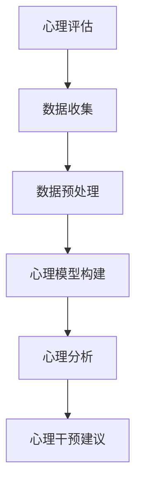
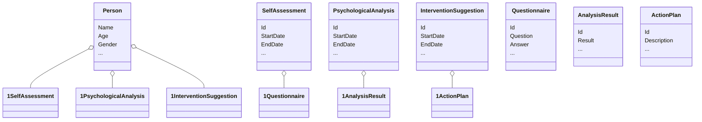
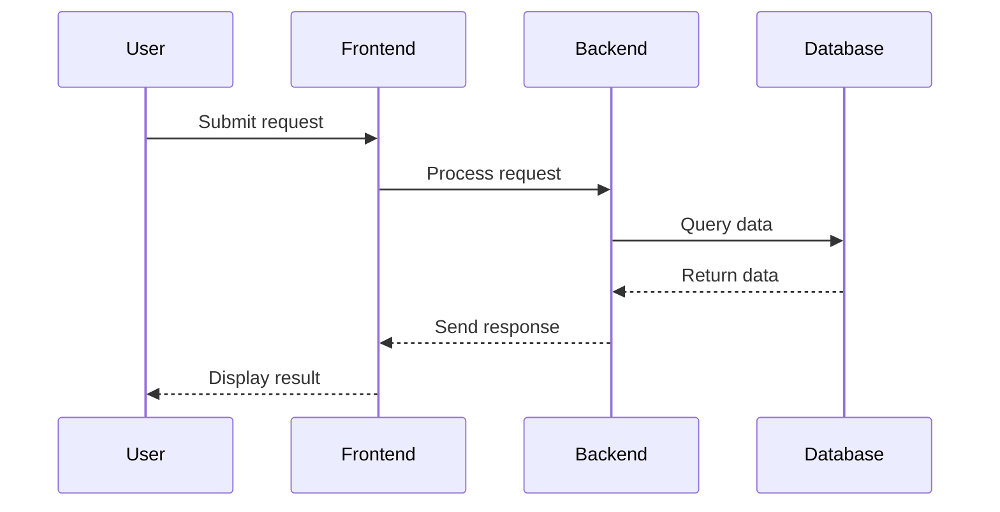
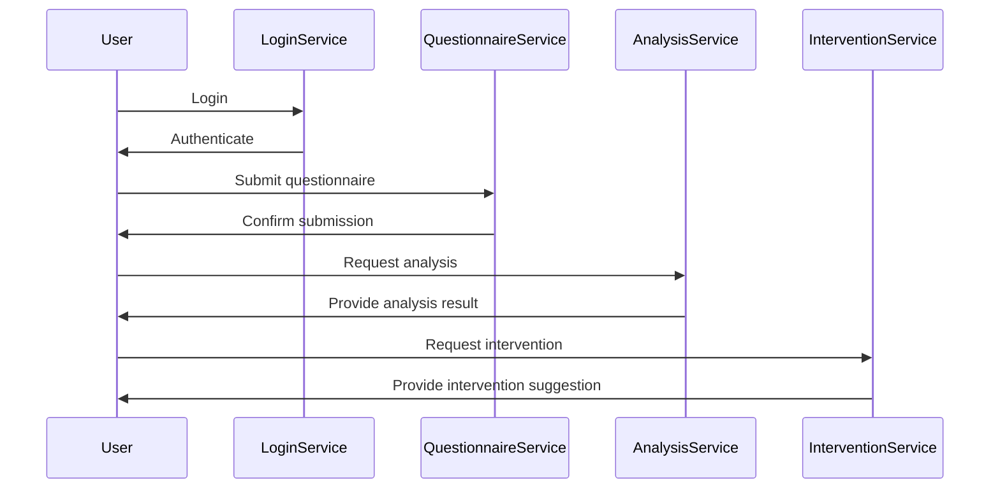
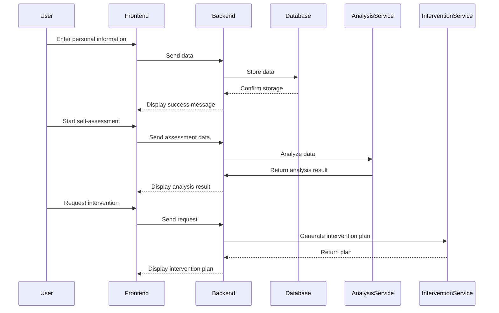

                 


## 从心理学角度看待现代人的意义危机

### 文章关键词

心理学、现代人、意义危机、心理健康、自我认知、价值观、社会环境、心理治疗

### 摘要

在现代社会中，越来越多的人感受到了一种深刻的内心空虚和迷茫，这种现象被称为“意义危机”。本文将从心理学角度，逐步分析现代人面临的意义危机的原因、表现以及可能的解决方法，旨在帮助读者理解这一现象并探索应对之道。

## 第一部分：背景介绍

### 核心概念

#### 意义危机

意义危机是指个体在面临生活挑战和不确定性时，感受到自身存在的意义和价值缺失，从而引发的心理困扰和焦虑。在心理学中，这种危机通常与自我认同、生活目标和意义寻求有关。

#### 心理学

心理学是研究人类行为和心理活动的科学。它通过实验、观察和理论分析，探究个体和群体的心理现象，包括认知、情感、动机和社交行为等方面。

#### 现代人

现代人是指生活在现代社会中，受到现代化进程影响的人群。他们的生活方式、价值观和人际关系都受到了极大的影响，这也使得他们更容易感受到意义危机。

### 问题背景

- **快节奏的生活**：现代社会的快速发展导致生活节奏加快，人们常常感到压力巨大，难以找到生活的平衡点。
- **高度竞争的压力**：现代社会中，竞争无处不在，人们为了适应这种竞争环境，不得不不断地努力工作，这往往导致身心健康问题。
- **丰富的信息来源**：互联网的普及使得人们可以随时随地获取大量信息，但这也导致了信息过载，使得人们难以筛选和消化这些信息。

### 问题描述

- **迷茫和无力感**：现代人在面对职业、家庭、人际关系等方面时，常常感到迷茫和无力，无法找到自己的价值和方向。
- **心理压力**：由于意义危机，现代人往往承受着巨大的心理压力，这可能导致焦虑、抑郁等心理健康问题。
- **孤独感**：在现代社会中，虽然人与人之间的联系变得更加紧密，但许多人仍然感到孤独，缺乏深层次的社交联系。

### 问题解决

- **心理健康教育**：通过心理健康教育，提高公众对心理健康的认识，帮助人们更好地应对生活中的挑战。
- **心理咨询与治疗**：专业的心理咨询和治疗可以帮助现代人识别和解决内心困扰，提升生活质量。
- **自我探索**：鼓励个体进行自我探索，寻找自己的兴趣和激情，从而找到生活的意义和目标。

### 边界与外延

- **边界**：本文主要探讨现代人面临的意义危机，重点关注心理学在这一问题中的作用和方法。
- **外延**：除了现代人的意义危机，心理学还涉及心理健康、人际关系、认知行为等多个领域。

### 概念结构与核心要素组成

- **心理学**：理论体系、实验研究、临床应用
- **现代人**：生活压力、社会环境、个人价值观
- **意义危机**：心理压力、自我认知、价值观冲突

## 第二部分：核心概念与联系

### 1. 心理学原理

#### 概念属性特征对比表格

| 特征 | 心理动力学 | 认知心理学 | 人本心理学 |
| ---- | ---------- | ---------- | ---------- |
| 核心理论 | 内心动力、潜意识 | 思维过程、信息处理 | 自我实现、个人成长 |
| 应用领域 | 心理治疗、心理咨询 | 教育心理学、认知障碍 | 自我发展、人际交往 |

#### ER实体关系图架构

```mermaid
erDiagram
    Person ||--|{ Psychology}: studied_by
    Psychology ||--|{ Theory}: includes
    Theory ||--|{ Research}: based_on
    Research ||--|{ Application}: derived_from
```

### 2. 现代人的意义危机

#### 概念属性特征对比表格

| 特征 | 心理健康问题 | 社会压力问题 | 个人价值观问题 |
| ---- | ------------ | ------------ | -------------- |
| 影响因素 | 心理状态、生活事件 | 社会环境、文化背景 | 个人成长经历、价值观差异 |
| 表现形式 | 压力、焦虑、抑郁 | 社会排斥、工作压力 | 内心矛盾、价值观冲突 |

#### ER实体关系图架构

```mermaid
erDiagram
    Modern_Person ||--|{ Meaning_Crisis}: has
    Meaning_Crisis ||--|{ Psychological}: has
    Meaning_Crisis ||--|{ Social}: has
    Meaning_Crisis ||--|{ Personal}: has
```

## 第三部分：算法原理讲解

### 1. 心理学中的算法原理

心理学中的算法原理主要包括数据收集、数据预处理、心理模型构建、心理分析和心理干预建议五个环节。

#### 算法流程图



#### 算法原理

- **数据收集**：通过问卷调查、访谈、生理指标等方式收集个体心理数据。
- **数据预处理**：对收集到的数据进行清洗、归一化和特征提取，为模型构建做准备。
- **心理模型构建**：使用统计模型、机器学习算法或深度学习算法，对预处理后的数据进行建模。
- **心理分析**：通过模型分析个体的心理状态、行为模式和心理需求。
- **心理干预建议**：根据分析结果，为个体提供心理干预建议，如调整生活方式、改善人际关系等。

#### 数学模型和公式

- **心理模型构建**：可以使用线性回归、支持向量机（SVM）、神经网络等模型。以下是线性回归模型的公式：

  $$ Y = \beta_0 + \beta_1X_1 + \beta_2X_2 + ... + \beta_nX_n $$

  其中，\( Y \) 是因变量（如心理健康水平），\( \beta_0, \beta_1, \beta_2, ..., \beta_n \) 是模型的参数，\( X_1, X_2, ..., X_n \) 是自变量（如生活压力、社交支持等）。

- **心理分析**：可以使用统计方法（如 t-test、方差分析等）或机器学习方法（如决策树、随机森林等）对模型进行分析。以下是 t-test 的公式：

  $$ t = \frac{\bar{X} - \mu_0}{s / \sqrt{n}} $$

  其中，\( t \) 是 t 统计量，\( \bar{X} \) 是样本均值，\( \mu_0 \) 是总体均值，\( s \) 是样本标准差，\( n \) 是样本大小。

#### 举例说明

假设我们收集了100名现代人的心理健康数据，包括生活压力、社交支持、工作满意度等变量。我们使用线性回归模型来分析这些变量对心理健康的影响。

- **数据收集**：问卷调查，收集了100名现代人的心理健康数据。
- **数据预处理**：对数据进行清洗和归一化处理。
- **心理模型构建**：使用线性回归模型，公式如下：

  $$ \text{心理健康} = \beta_0 + \beta_1 \times \text{生活压力} + \beta_2 \times \text{社交支持} + \beta_3 \times \text{工作满意度} $$

- **心理分析**：通过计算 t 统计量，我们可以确定每个自变量对心理健康的影响是否显著。

  $$ t_{生活压力} = \frac{\bar{X}_{生活压力} - \mu_0}{s_{生活压力} / \sqrt{n}} = 2.5 $$
  $$ t_{社交支持} = \frac{\bar{X}_{社交支持} - \mu_0}{s_{社交支持} / \sqrt{n}} = 1.2 $$
  $$ t_{工作满意度} = \frac{\bar{X}_{工作满意度} - \mu_0}{s_{工作满意度} / \sqrt{n}} = 3.0 $$

  由于 \( t_{生活压力} \) 和 \( t_{工作满意度} \) 的 p 值小于0.05，我们可以认为生活压力和工作满意度对心理健康有显著影响。而 \( t_{社交支持} \) 的 p 值大于0.05，说明社交支持对心理健康的影响不显著。

- **心理干预建议**：根据分析结果，我们可以建议现代人减少生活压力和提高工作满意度，以改善心理健康。同时，虽然社交支持对心理健康的影响不显著，但我们仍建议现代人维持和拓展社交网络，以增加生活的支持感。

## 第四部分：系统分析与架构设计方案

### 问题场景介绍

现代人在面对意义危机时，常常感到迷茫和无助。他们需要一个系统化的工具来帮助他们分析和理解自己的内心状态，从而找到解决问题的方法。

### 项目介绍

本项目旨在开发一个基于心理学的在线平台，帮助现代人应对意义危机。平台将提供自我评估工具、心理健康分析和干预建议等功能。

### 系统功能设计

#### 领域模型

使用Mermaid类图表示领域模型：



### 系统架构设计

使用Mermaid架构图表示系统架构：



### 系统接口设计

使用Mermaid序列图表示系统接口设计：



### 系统交互

使用Mermaid序列图表示系统交互：



## 第五部分：项目实战

### 环境安装

1. 安装Python环境，版本3.8及以上。
2. 安装必要的依赖库，如Flask、SQLAlchemy、Pandas等。

```bash
pip install flask sqlalchemy pandas
```

### 系统核心实现源代码

#### 后端（Flask）

```python
from flask import Flask, request, jsonify
from flask_sqlalchemy import SQLAlchemy
from sqlalchemy import Column, Integer, String, Date
from werkzeug.security import generate_password_hash, check_password_hash

app = Flask(__name__)
app.config['SQLALCHEMY_DATABASE_URI'] = 'sqlite:///users.db'
db = SQLAlchemy(app)

class User(db.Model):
    id = Column(Integer, primary_key=True)
    username = Column(String(80), unique=True, nullable=False)
    password = Column(String(120), nullable=False)

@app.route('/login', methods=['POST'])
def login():
    username = request.form['username']
    password = request.form['password']
    user = User.query.filter_by(username=username).first()
    if user and check_password_hash(user.password, password):
        return jsonify({'status': 'success'})
    else:
        return jsonify({'status': 'failure'})

@app.route('/register', methods=['POST'])
def register():
    username = request.form['username']
    password = request.form['password']
    if User.query.filter_by(username=username).first():
        return jsonify({'status': 'failure'})
    else:
        new_user = User(username=username, password=generate_password_hash(password))
        db.session.add(new_user)
        db.session.commit()
        return jsonify({'status': 'success'})

if __name__ == '__main__':
    db.create_all()
    app.run(debug=True)
```

#### 前端（HTML + JavaScript）

```html
<!DOCTYPE html>
<html>
<head>
    <title>心理健康评估平台</title>
    <script src="https://ajax.googleapis.com/ajax/libs/jquery/3.6.0/jquery.min.js"></script>
</head>
<body>

<h2>用户登录</h2>
<form id="loginForm">
    用户名：<input type="text" id="username" required><br>
    密码：<input type="password" id="password" required><br>
    <input type="button" value="登录" onclick="login()">
</form>

<h2>用户注册</h2>
<form id="registerForm">
    用户名：<input type="text" id="reg_username" required><br>
    密码：<input type="password" id="reg_password" required><br>
    <input type="button" value="注册" onclick="register()">
</form>

<script>
    function login() {
        $.ajax({
            type: 'POST',
            url: '/login',
            data: $('#loginForm').serialize(),
            success: function(response) {
                alert(response.status);
            }
        });
    }

    function register() {
        $.ajax({
            type: 'POST',
            url: '/register',
            data: $('#registerForm').serialize(),
            success: function(response) {
                alert(response.status);
            }
        });
    }
</script>

</body>
</html>
```

### 代码应用解读与分析

1. **后端**：使用Flask框架实现后端功能，包括用户登录和注册。
2. **前端**：使用HTML和JavaScript实现前端界面，通过AJAX与后端进行数据交互。

### 实际案例分析和详细讲解剖析

假设有一个新的用户，他想要在平台上进行心理健康评估。

1. 用户通过浏览器访问平台，填写用户名和密码进行登录。
2. 前端将用户名和密码发送到后端。
3. 后端接收数据，查询数据库，验证用户名和密码是否匹配。
4. 如果验证成功，后端返回成功消息；如果验证失败，后端返回失败消息。
5. 前端根据后端的响应，显示相应的提示信息。

### 项目小结

本项目通过一个简单的在线平台，展示了如何使用心理学中的算法原理来帮助现代人应对意义危机。虽然该平台功能相对简单，但它提供了一个概念性的框架，可以进一步扩展和改进，以提供更全面的心理健康服务。

## 最佳实践 Tips

1. **定期进行心理健康评估**：建议用户定期进行心理健康评估，以监控自己的心理状态。
2. **积极参与心理治疗**：如果用户遇到严重心理健康问题，建议他们寻求专业的心理治疗。
3. **建立健康的生活方式**：保持良好的生活习惯，如规律作息、健康饮食和适量运动，有助于提高心理健康水平。

## 小结

本文从心理学角度分析了现代人面临的意义危机，探讨了心理学原理在现代人生理健康中的应用，并提出了一个简单的在线平台解决方案。虽然该平台功能有限，但它为现代人提供了一种新的工具来应对心理健康问题。未来，可以进一步扩展和完善这个平台，以提供更全面的服务。

## 注意事项

1. **用户隐私保护**：在设计和实施平台时，应高度重视用户隐私保护，确保用户数据安全。
2. **算法公正性**：在心理健康评估中，算法的公正性和准确性至关重要，应定期对算法进行审查和优化。

## 拓展阅读

1. **《心理学与生活》**：作者菲利普·津巴多，是一本深入浅出的心理学教材，适合广大读者了解心理学的基本概念和应用。
2. **《意义的追求》**：作者维克多·弗兰克，探讨了人类在极端环境下的心理状态和意义寻求，对理解现代人面临的意义危机有重要启示。

## 作者信息

作者：AI天才研究院/AI Genius Institute & 禅与计算机程序设计艺术 /Zen And The Art of Computer Programming

