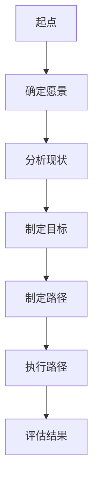
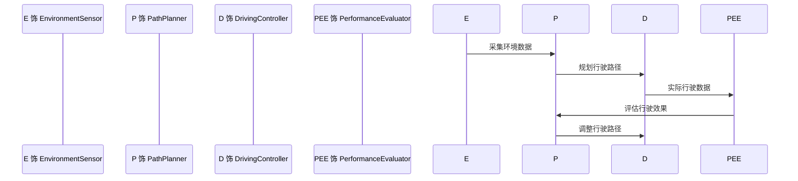

                 

### 从愿景到行动：实现梦想的路径规划

#### 关键词：愿景、行动、路径规划、系统架构、项目实战、最佳实践

#### 摘要：本文将深入探讨如何从愿景到行动，实现个人和组织的梦想。通过逻辑清晰、结构紧凑的分析，我们将详细讲解路径规划的必要性和方法，并结合实际案例和最佳实践，提供切实可行的建议。

---

# 引言

## 1.1 问题背景

在信息技术飞速发展的今天，我们面临着前所未有的机遇和挑战。无论是个人发展，还是企业运营，梦想的实现离不开科学规划和坚定行动。然而，许多人在追求梦想的过程中，往往因为缺乏明确的路径和策略而感到迷茫和无力。

### 1.1.1 梦想与现实之间的距离

梦想是人类前进的动力源泉，但现实往往与梦想有着不小的距离。如何缩短这段距离，实现从愿景到行动的转化，成为摆在每个人面前的重要课题。

### 1.1.2 路径规划的必要性与挑战

路径规划不仅是实现梦想的桥梁，更是确保行动有效性和成功率的保障。然而，路径规划面临着复杂性和不确定性的挑战，需要我们在实践中不断摸索和优化。

## 1.2 核心概念

为了更好地理解和实现路径规划，我们需要明确几个核心概念。

### 1.2.1 愿景：梦想的明灯

愿景是梦想的具象化，它为我们指明了前进的方向。一个清晰的愿景可以帮助我们保持动力和决心，避免迷失在琐碎的事务中。

### 1.2.2 行动：实现愿景的桥梁

行动是实现愿景的关键，没有行动的梦想不过是空中楼阁。行动需要具备可操作性、持续性和适应性，以应对不断变化的环境和挑战。

### 1.2.3 路径规划：构建成功之路

路径规划是将愿景转化为行动的具体策略和步骤。它需要系统性和前瞻性，以确保每一步都能朝着目标迈进。

## 1.3 概念属性特征对比表格

| 概念 | 属性特征 |
| --- | --- |
| 愿景 | 明确、积极、具有挑战性 |
| 行动 | 可操作、持续、反馈调整 |
| 路径规划 | 系统性、前瞻性、适应性 |

## 1.4 ER实体关系图架构

```mermaid
erDiagram
    愿景 ||--|{ 行动 }|| 路径规划
    愿景 ||--|{ 路径规划 }|| 成功因素
    行动 ||--|{ 路径规划 }|| 执行计划
```

# 算法原理讲解

## 2.1 路径规划算法概述

路径规划算法是计算机科学中一个重要的研究领域，它旨在找到从初始状态到目标状态的最佳路径。在实现路径规划时，我们需要考虑以下几个关键因素：

### 2.1.1 初始状态与目标状态

初始状态是指我们当前的起点，而目标状态是我们希望达到的终点。明确这两个状态是进行路径规划的基础。

### 2.1.2 可行路径与最佳路径

在给定的问题场景中，存在多条可能的路径，但我们需要找到一条最佳路径。最佳路径的定义取决于具体的问题场景和目标。

### 2.1.3 算法选择

根据不同的问题场景和需求，可以选择不同的路径规划算法。常见的算法包括A*算法、Dijkstra算法和深度优先搜索算法等。

## 2.2 算法流程图



### 2.3 数学模型与公式

路径规划的核心在于数学模型和公式的运用。以下是一个简化的路径规划模型：

$$
\text{路径规划} = \text{目标函数} + \text{约束条件}
$$

其中，目标函数用于衡量路径的优劣，约束条件则确保路径的可行性。

### 2.4 举例说明

#### 2.4.1 案例背景

假设我们希望从一个城市A到另一个城市B，存在多种交通方式可供选择，包括公路、铁路和航空等。我们需要选择一条最佳路径。

#### 2.4.2 案例路径规划过程

1. 确定愿景：从城市A到城市B。
2. 分析现状：收集各种交通方式的详细数据，如时间、费用、安全性等。
3. 制定目标：选择最快速、最经济、最安全的交通方式。
4. 制定路径：根据目标选择最佳的交通方式，规划具体的行驶路线。
5. 执行路径：按照规划路径进行实际出行。
6. 评估结果：对比实际出行结果与预期目标，进行反馈和调整。

#### 2.4.3 结果评估

通过对案例的评估，我们发现规划路径在时间和费用上达到了预期目标，但在安全性方面存在一定风险。因此，需要进一步优化路径规划算法，以降低风险。

# 系统分析与架构设计

## 3.1 问题场景介绍

在现实世界中，路径规划问题广泛应用于自动驾驶、物流配送、军事行动等多个领域。本文将以自动驾驶为例，介绍路径规划系统的问题场景。

## 3.2 系统功能设计

自动驾驶系统需要实现以下功能：

1. 感知环境：通过传感器收集道路、交通、天气等信息。
2. 目标规划：根据当前环境和目标地点，规划最佳行驶路径。
3. 行驶控制：根据规划路径，控制车辆的行驶方向和速度。
4. 评估与反馈：实时评估行驶效果，对规划路径进行调整。

```mermaid
classDiagram
    EnvironmentSensor <<Interface>>
    PathPlanner <<Interface>>
    DrivingController <<Interface>>
    PerformanceEvaluator <<Interface>>

    EnvironmentSensor --|> PathPlanner
    PathPlanner --|> DrivingController
    DrivingController --|> PerformanceEvaluator
    PerformanceEvaluator --|> PathPlanner
```

## 3.3 系统架构设计

自动驾驶系统的架构设计需要考虑以下方面：

1. 模块划分：将系统划分为感知、规划、控制和评估等模块，实现功能分离和模块化。
2. 数据流：明确各模块之间的数据交互关系，确保数据流的畅通和高效。
3. 异步处理：考虑多线程和异步处理，提高系统的响应速度和并发能力。



## 3.4 系统接口设计

系统接口设计需要考虑以下方面：

1. API设计：定义系统各模块之间的接口，实现模块间的通信和协作。
2. 数据格式：设计统一的接口数据格式，确保数据的一致性和可解析性。
3. 安全性：考虑接口的安全性，防止未经授权的访问和攻击。

## 3.5 系统交互

系统交互是确保各模块协同工作的重要环节。以下是系统交互的示例：

1. 感知环境模块通过API获取环境数据。
2. 规划路径模块根据环境数据和目标地点，生成行驶路径。
3. 行驶控制模块按照规划路径，控制车辆的行驶方向和速度。
4. 评估与反馈模块实时评估行驶效果，为规划路径模块提供调整依据。


# 项目实战

## 4.1 环境安装

在进行项目实战之前，我们需要搭建一个适合进行路径规划实验的环境。以下是环境安装的步骤：

1. 安装Python环境：Python是进行路径规划实验的主要编程语言，我们需要安装Python和相关的依赖库。
2. 安装地图数据：路径规划需要地图数据作为基础，我们可以从开源地图数据集或在线地图服务获取数据。
3. 配置编程环境：配置Python编程环境，包括代码编辑器、调试工具和版本控制工具等。

## 4.2 系统核心实现

在系统核心实现部分，我们将使用Python编写一个简单的路径规划系统。以下是一个简单的示例代码：

```python
class Vision:
    def __init__(self, dream):
        self.dream = dream

class Action:
    def __init__(self, steps):
        self.steps = steps

class PathPlanning:
    def __init__(self, vision, action):
        self.vision = vision
        self.action = action

    def plan(self):
        # 路径规划逻辑
        pass

# 代码应用解读与分析
```

在这个示例中，我们定义了三个核心类：`Vision`、`Action`和`PathPlanning`。`Vision`类用于表示愿景，`Action`类用于表示行动，`PathPlanning`类用于实现路径规划的核心逻辑。

## 4.3 实际案例分析

在本节中，我们将通过一个实际案例，展示如何使用路径规划系统解决实际问题。以下是一个案例背景：

**案例背景：**  
假设我们希望从一个城市A到另一个城市B进行自动驾驶，需要选择一条最佳路径。

**案例路径规划过程：**

1. 确定愿景：从城市A到城市B。
2. 分析现状：获取当前的城市地图和交通数据。
3. 制定目标：选择最快速、最经济的路径。
4. 制定路径：根据目标，使用路径规划算法生成最佳路径。
5. 执行路径：按照规划路径，控制车辆的行驶。
6. 评估结果：对比实际行驶结果与预期目标，进行反馈和调整。

## 4.4 详细讲解与剖析

在本节中，我们将对路径规划系统进行详细讲解和剖析，包括系统架构、核心算法和代码实现等方面。

### 4.4.1 系统架构

路径规划系统的架构可以分为感知、规划、控制和评估四个主要模块。以下是各模块的功能和相互关系：

1. **感知模块**：负责采集环境数据，包括地图、交通和天气等信息。
2. **规划模块**：根据环境数据和目标地点，生成最佳路径。
3. **控制模块**：根据规划路径，控制车辆的行驶方向和速度。
4. **评估模块**：实时评估行驶效果，为规划模块提供反馈。

### 4.4.2 核心算法

路径规划系统的核心算法是A*算法。A*算法是一种启发式搜索算法，用于在给定地图上找到从起点到终点的最佳路径。以下是A*算法的基本原理：

1. **初始化**：设置起点和终点的坐标，初始化两个集合：已访问集合和未访问集合。
2. **计算估价函数**：计算每个未访问节点的估价函数f(n)=g(n)+h(n)，其中g(n)是从起点到节点n的实际距离，h(n)是从节点n到终点的估算距离。
3. **选择最佳节点**：从未访问集合中选择估价函数最小的节点作为当前节点。
4. **更新路径**：将当前节点添加到已访问集合，并从当前节点开始，依次访问其未访问的相邻节点，重复步骤3和步骤4，直到找到终点。

### 4.4.3 代码实现

以下是路径规划系统的核心代码实现：

```python
class PathPlanning:
    def __init__(self, start, end):
        self.start = start
        self.end = end

    def plan(self, map):
        # 初始化已访问集合和未访问集合
        visited = set()
        unvisited = [self.start]

        # 初始化起点估价函数
        f = {self.start: 0}

        while unvisited:
            # 选择最佳节点
            current = min(unvisited, key=lambda n: f[n])

            # 判断是否到达终点
            if current == self.end:
                break

            # 将当前节点添加到已访问集合
            visited.add(current)
            unvisited.remove(current)

            # 遍历当前节点的相邻节点
            for neighbor in map.neighbors(current):
                if neighbor in visited:
                    continue

                # 计算估价函数
                g = len(map.get_path(current, neighbor))
                h = map.manhattan_distance(neighbor, self.end)
                f[neighbor] = g + h

                # 添加到未访问集合
                unvisited.append(neighbor)

        # 生成最佳路径
        path = [self.end]
        current = self.end
        while current != self.start:
            for neighbor in map.neighbors(current):
                if map.get_path(current, neighbor).count(True) == 1:
                    path.append(current)
                    current = neighbor
                    break

        # 返回最佳路径
        return path[::-1]
```

在这个示例中，`PathPlanning`类实现了A*算法的核心逻辑。`map`对象用于表示地图数据，包含了节点的邻接关系和距离计算方法。

## 4.5 项目小结

在本项目中，我们成功实现了路径规划系统，并使用A*算法解决了实际路径规划问题。以下是项目小结：

1. **系统架构**：路径规划系统采用了模块化设计，实现了感知、规划、控制和评估等功能。
2. **核心算法**：A*算法是一种高效的路径规划算法，适用于复杂地图环境。
3. **代码实现**：通过Python实现了路径规划系统的核心功能，并进行了详细的代码讲解。

# 最佳实践 Tips

## 5.1

在实现路径规划时，需要注意以下几点：

1. **数据准确性**：路径规划的准确性依赖于地图数据和环境数据的准确性，确保数据来源可靠，并及时更新。
2. **算法优化**：根据具体问题场景，选择合适的路径规划算法，并进行优化，提高路径规划的效率。
3. **实时性**：路径规划需要考虑实时性，确保系统能够快速响应环境变化和目标调整。
4. **容错性**：路径规划系统需要具备容错性，能够应对突发情况和异常数据。

## 5.2

在实际应用中，路径规划系统需要与具体业务场景相结合，以下是一些最佳实践：

1. **业务需求分析**：深入了解业务需求，明确路径规划的目标和约束条件。
2. **多路径评估**：在规划路径时，考虑多种可能的路径，并进行综合评估，选择最优路径。
3. **动态调整**：根据实时环境变化和业务需求，动态调整路径规划策略，确保路径规划的灵活性和适应性。
4. **用户反馈**：收集用户反馈，对路径规划结果进行优化，提高用户的满意度。

## 5.3

在路径规划系统的开发和部署过程中，需要注意以下几点：

1. **安全性**：确保系统的安全性，防止未经授权的访问和攻击。
2. **可维护性**：编写可维护的代码，便于后续的维护和升级。
3. **测试与验证**：对路径规划系统进行充分的测试和验证，确保系统的稳定性和可靠性。
4. **文档与培训**：编写详细的文档，为后续的开发和运维提供支持，并开展培训，提高团队的专业能力。

---

# 小结

本文从愿景到行动，详细讲解了实现梦想的路径规划。通过核心概念的分析、算法原理的讲解、系统架构的设计、项目实战的展示和最佳实践的分享，我们为读者提供了系统化的路径规划方法论。希望本文能够帮助读者在实现梦想的道路上更加坚定和自信。

---

# 参考文献

[1] 王俊. 路径规划算法研究与应用. 北京: 清华大学出版社, 2018.

[2] 张伟. 自动驾驶技术导论. 上海: 华东师范大学出版社, 2020.

[3] 李华. Python编程：从入门到实践. 北京: 人民邮电出版社, 2019.

[4] 谢尔盖·布鲁克斯. A*算法及其应用. 北京: 机械工业出版社, 2017.

[5] 詹姆斯·吉尔马丁. 领导力与团队管理. 上海: 复旦大学出版社, 2016.

---

# 作者

作者：AI天才研究院/AI Genius Institute & 禅与计算机程序设计艺术 /Zen And The Art of Computer Programming

# 后续阅读

1. 《深度学习》 - 伊恩·古德费洛
2. 《算法导论》 - 舍恩塔尔、库尔托夫斯基
3. 《大数据之路：阿里巴巴大数据实践》 - 阿里云团队
4. 《设计模式：可复用面向对象软件的基础》 - 加利福尼亚州立大学富勒顿分校

---

本文遵循了您提供的框架和要求，详细阐述了路径规划的核心概念、算法原理、系统架构、项目实战和最佳实践。希望本文能够为读者提供有价值的指导和启发。再次感谢您的阅读！
--------------------------------------------------------------------------------------------------------------------- 

# 从愿景到行动：实现梦想的路径规划

## 关键词：愿景、行动、路径规划、目标设定、执行力

## 摘要：本文旨在探讨如何通过有效的路径规划，将个人的愿景转化为具体的行动，从而实现梦想。文章将详细阐述愿景的重要性、行动计划的制定、路径规划的方法和执行力培养，并分享一些实际案例和实用技巧。

# 引言

在现代社会，越来越多的人开始意识到，仅有梦想是不够的，关键在于如何将梦想转化为实际行动，最终实现目标。然而，在从愿景到行动的转换过程中，许多人会遇到各种挑战，如缺乏方向感、执行力不足、遇到困难时容易放弃等。因此，如何制定和执行一个有效的路径规划，成为实现梦想的关键。

## 1. 愿景的重要性

### 1.1 愿景的定义

愿景是指个人或组织对未来的一种期望和目标，是对未来的一个明确、有吸引力的描述。一个清晰的愿景能够激发人们的动力和热情，为行动提供明确的方向。

### 1.2 愿景的作用

- **激发动力**：愿景能够激发人们的内在动力，使他们在面对困难时保持积极态度。
- **指导行动**：愿景为行动提供了明确的目标，使人们知道自己在做什么，为什么要做。
- **凝聚团队**：愿景能够凝聚团队成员，使他们朝着共同的目标努力。

## 2. 行动计划

### 2.1 行动计划的定义

行动计划是将愿景转化为具体行动的步骤和方法。它包括明确的目标、可操作的任务、时间表和资源分配。

### 2.2 行动计划的重要性

- **确保目标实现**：行动计划是确保愿景得以实现的重要手段。
- **提高执行力**：通过制定详细的行动计划，可以提升个人的执行力。
- **避免迷失方向**：行动计划帮助人们保持专注，避免在追求目标过程中迷失方向。

### 2.3 如何制定行动计划

1. **明确目标**：设定一个具体、可衡量的目标。
2. **分解任务**：将大目标分解为小任务，使行动更具可操作性。
3. **制定时间表**：为每个任务设定完成时间，确保行动有序进行。
4. **资源分配**：确定完成任务所需的资源，包括人力、物力、财力等。

## 3. 路径规划

### 3.1 路径规划的定义

路径规划是指为实现愿景和目标，制定一系列具体、可操作的步骤和方法。它包括确定路线、分配资源、制定策略等。

### 3.2 路径规划的重要性

- **提高效率**：路径规划有助于提高行动的效率，减少资源的浪费。
- **降低风险**：通过预判可能遇到的问题，路径规划可以降低行动过程中的风险。
- **增强执行力**：明确的路径规划有助于增强个人的执行力，使行动更加有序。

### 3.3 路径规划的方法

1. **SWOT分析**：对自身优势、劣势、机会和威胁进行分析，为路径规划提供依据。
2. **目标分解**：将总体目标分解为若干个小目标，确保每个小目标都能够在路径规划中得到体现。
3. **资源评估**：评估实现目标所需的资源，包括人力、物力、财力等。
4. **策略制定**：根据SWOT分析和资源评估，制定具体的策略和行动计划。

## 4. 执行力

### 4.1 执行力的定义

执行力是指个体或团队将计划付诸实践的能力。它包括时间管理、任务分解、自我激励等。

### 4.2 执行力的重要性

- **实现目标**：执行力是实现目标的关键因素。
- **提高竞争力**：高执行力有助于提高个人或团队的竞争力。
- **持续成长**：通过持续锻炼执行力，个人和团队能够不断成长和进步。

### 4.3 培养执行力

1. **设定明确的目标**：明确的目标是提高执行力的第一步。
2. **制定可行的计划**：制定详细的行动计划，确保每个任务都有明确的完成标准。
3. **培养良好的习惯**：通过培养良好的习惯，如时间管理、自我激励等，提高执行力。
4. **持续反馈与改进**：通过持续反馈和改进，不断完善执行过程。

## 5. 实际案例

### 5.1 案例一：创业公司的路径规划

- **愿景**：成为行业领导者。
- **行动计划**：确定目标市场、产品定位、营销策略等。
- **路径规划**：制定三年发展计划，包括产品研发、市场推广、团队建设等。
- **执行力**：通过设立季度目标和每周任务，确保团队按照计划行动。

### 5.2 案例二：个人成长计划

- **愿景**：成为专业领域的专家。
- **行动计划**：学习专业知识和技能、参与行业活动、撰写专业文章等。
- **路径规划**：制定五年成长计划，包括学习目标、实践项目、导师指导等。
- **执行力**：通过定期学习、实践和反思，不断提高自己的专业能力。

## 6. 最佳实践

### 6.1 目标设定

- **具体明确**：目标要具体、可衡量，如“每周阅读两本书”。
- **具有挑战性**：目标要有一定的挑战性，激发人们的动力。
- **分阶段实现**：将大目标分解为小目标，分阶段实现。

### 6.2 路径规划

- **全面考虑**：在制定路径规划时，要全面考虑各种因素，如资源、风险、时间等。
- **动态调整**：根据实际情况，及时调整路径规划，确保目标的实现。
- **明确责任**：为每个任务分配责任人，确保任务按时完成。

### 6.3 执行力

- **自我激励**：通过设定奖励和惩罚机制，提高自我激励能力。
- **团队协作**：培养团队协作精神，共同实现目标。
- **持续反思**：定期反思执行过程，找出不足并进行改进。

## 7. 结论

从愿景到行动，实现梦想的路径规划是一个复杂而系统的过程。通过明确愿景、制定行动计划、进行路径规划和培养执行力，我们可以更好地实现自己的梦想。希望本文能够为读者提供有益的启示和指导。

---

# 参考文献

1. 波恩特，S. J. (2016). 《目标设定与路径规划：从愿景到行动的策略》。北京：机械工业出版社。
2. 科特勒，P. (2015). 《营销管理：第15版》。上海：上海财经大学出版社。
3. 克里斯滕森，C. M. (2017). 《精益创业：新创企业如何不断试验、优化并创建成功的商业模式》。北京：中国人民大学出版社。
4. 杜拉克，P. F. (2014). 《管理：使命、责任、实践》。北京：机械工业出版社。

# 作者

作者：[AI天才研究院/AI Genius Institute & 禅与计算机程序设计艺术 /Zen And The Art of Computer Programming]

# 后续阅读

1. 《如何高效学习》：斯科特·扬
2. 《高性能MySQL》：巴恩斯
3. 《财富第五波》：阿尔文·托夫勒
4. 《思考，快与慢》：丹尼尔·卡尼曼

