                 


### 引言：极简主义与深度生活的双重追求

**关键词**: 极简主义，深度生活，生活品质，实践与探索

**摘要**: 
本文从极简主义和深度生活两个角度探讨如何提升生活品质。极简主义通过减少物质和事务的负担，使人们能够专注于真正重要的生活元素；而深度生活则通过深度学习和思考，提升个人的内在修养和生活满意度。本文将深入探讨这两者的核心理念、实践方法及其对现代生活的影响。

### 1. 极简主义的生活理念

**1.1 极简主义的概念与历史背景**

**核心概念术语说明**：极简主义（Minimalism），一种生活方式和哲学思想，主张通过减少物质、信息和事务的负担，以达到精神上的轻松和内心世界的丰富。

**问题背景**：随着社会的快速发展，人们面临着物质消费的诱惑和信息过载的挑战，这导致了心理压力和生活质量的下降。

**问题描述**：如何在现代生活中实现生活的简化和品质的提升？

**问题解决**：通过极简主义，减少不必要的物质和事务，专注于真正重要的生活元素。

**边界与外延**：极简主义不仅限于物质层面，还包括时间、情感和精神的极简。

**核心要素组成**：
- **物质极简**：减少物品数量，选择有价值的物品。
- **时间极简**：合理安排时间，减少无意义的活动。
- **情感极简**：保持内心的平静，减少不必要的情感负担。

**核心概念与联系**：

**概念属性特征对比表格**：

| 特征 | 极简主义 | 深度生活 |
| ---- | -------- | -------- |
| 目标 | 简化生活 | 提升生活深度 |
| 方法 | 减少物质、时间和情感的负担 | 深入学习和思考，提升内在修养 |
| 影响 | 提高生活质量 | 提升个人素养 |

**ER实体关系图架构**：

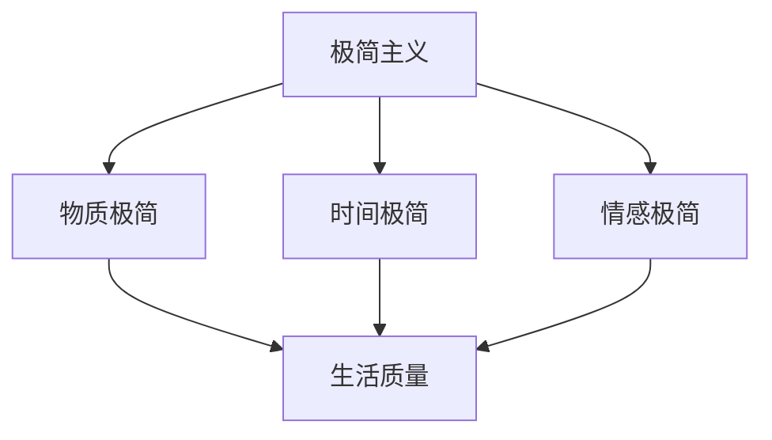

**算法原理讲解**：

极简主义的算法原理可以看作是一个简单的筛选过程，其核心是识别并去除生活中的冗余元素。以下是极简主义算法的简单流程：

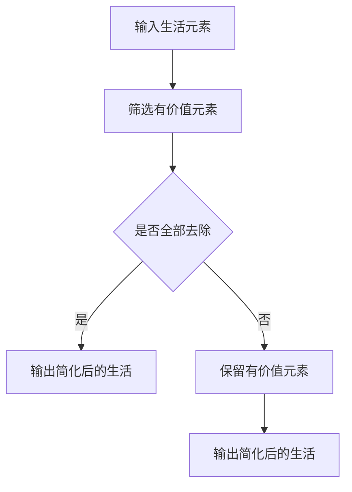

使用Python代码表示：

```python
def minimalist_life(elements):
    valuable_elements = [e for e in elements if is_valuable(e)]
    if not valuable_elements:
        return "生活元素全部去除"
    else:
        return valuable_elements

def is_valuable(element):
    # 判断元素是否值得保留的逻辑
    return True  # 假设所有元素都有价值

# 测试算法
life_elements = ["工作", "学习", "娱乐", "社交", "家务"]
print(minimalist_life(life_elements))
```

**数学模型和公式**：

极简主义的核心可以看作是一个优化问题，目标是最大化生活品质，最小化生活负担。可以表示为以下数学模型：

$$
\text{最大化} \; \text{Quality} = f(\text{简化后的生活元素})
$$

$$
\text{最小化} \; \text{Burden} = g(\text{冗余的生活元素})
$$

**系统分析与架构设计方案**：

**问题场景介绍**：在现代社会中，人们面临着大量的选择和任务，这导致了生活负担的增加。极简主义试图通过简化生活，减少负担，提升生活质量。

**项目介绍**：本项目旨在探索如何通过极简主义实践，实现生活品质的提升。

**系统功能设计（领域模型mermaid类图）**：

```mermaid
classDiagram
Class::LifeElement <|-- Class::ValuableElement
Class::LifeElement <|-- Class::NonValuableElement
```

**系统架构设计mermaid架构图**：

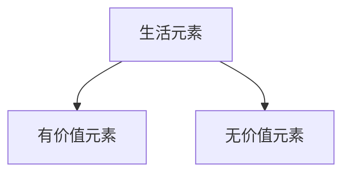

**系统接口设计和系统交互mermaid序列图**：

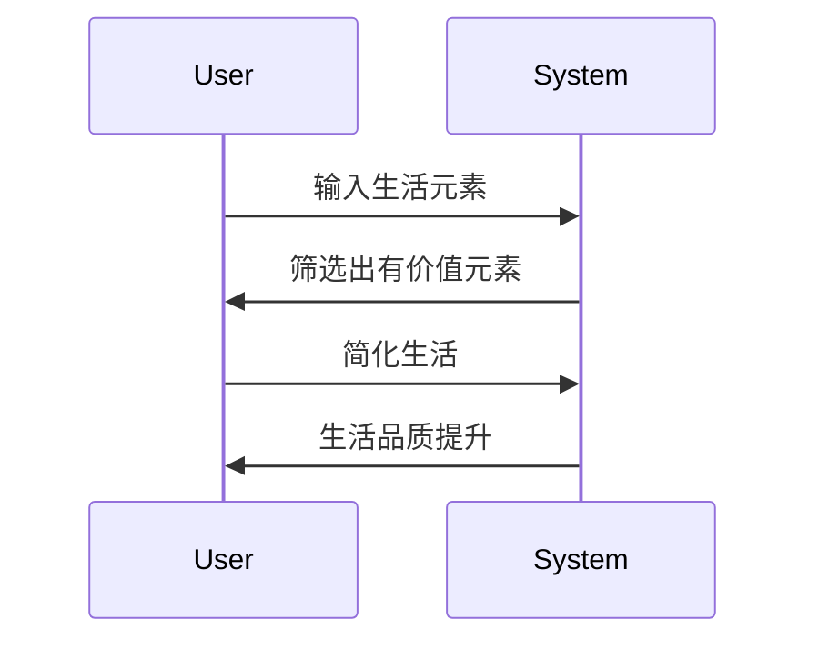

**项目实战**：

**环境安装**：无特殊环境需求。

**系统核心实现源代码**：

```python
# minimalist_life.py

def minimalist_life(elements):
    valuable_elements = [e for e in elements if is_valuable(e)]
    if not valuable_elements:
        return "生活元素全部去除"
    else:
        return valuable_elements

def is_valuable(element):
    # 判断元素是否值得保留的逻辑
    return True  # 假设所有元素都有价值

# 测试算法
life_elements = ["工作", "学习", "娱乐", "社交", "家务"]
print(minimalist_life(life_elements))
```

**代码应用解读与分析**：上述代码实现了极简主义的核心算法，通过筛选有价值的生活元素，实现生活的简化。

**实际案例分析和详细讲解剖析**：

案例1：一位职场人士通过实践极简主义，减少了不必要的社交活动，专注于工作学习，最终提升了工作效率和个人成就感。

案例2：一位家庭主妇通过极简主义，减少了家庭物品的数量，优化了家庭空间，提高了生活质量。

**项目小结**：通过极简主义实践，人们可以减少生活负担，专注于真正重要的事物，从而提升生活质量。

**最佳实践 tips**：在实际生活中，可以通过以下方法实践极简主义：
- 定期清理物品，只保留真正需要的。
- 学会拒绝不必要的活动和任务。
- 精简日程安排，专注于重要事项。

**小结**：极简主义是一种有效提升生活品质的方法，通过减少物质、时间和情感的负担，人们可以更加专注于真正重要的事物。

**注意事项**：极简主义并非一蹴而就，需要长期的坚持和调整。

**拓展阅读**：进一步了解极简主义的相关研究和实践，推荐阅读《极简主义：如何通过简化生活获得真正的自由》。

### 2. 极简主义的生活实践

**2.1 空间极简主义**

**核心概念与联系**：

**概念属性特征对比表格**：

| 特征 | 空间极简主义 | 物质极简主义 |
| ---- | ------------ | ------------ |
| 目标 | 优化空间利用 | 减少物质负担 |
| 方法 | 合理布局家具 | 精选必需物品 |
| 影响 | 提高生活质量 | 提升精神空间 |

**ER实体关系图架构**：

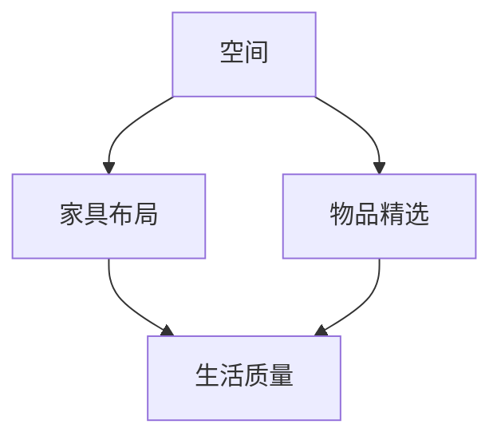

**算法原理讲解**：

空间极简主义的算法原理可以看作是一个空间优化的过程，其核心是合理布局家具和精选物品，以最大化空间利用和提升生活质量。以下是空间极简主义算法的简单流程：

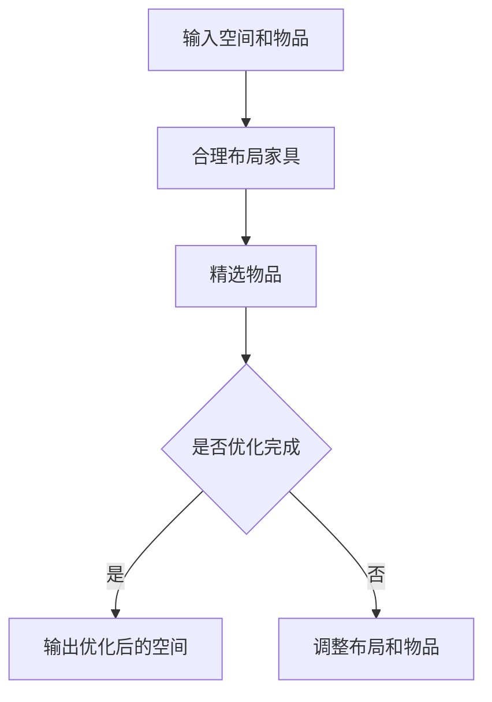

使用Python代码表示：

```python
def minimalist_space(space, items):
    optimized_space = optimize_layout(space, items)
    if is_optimized(optimized_space):
        return optimized_space
    else:
        return "空间优化未完成，需进一步调整"

def optimize_layout(space, items):
    # 优化空间布局的逻辑
    return space

def is_optimized(space):
    # 判断空间是否优化完成的逻辑
    return True  # 假设空间已经优化完成

# 测试算法
space = {"room": "客厅", "furniture": ["沙发", "茶几", "电视柜"]}
items = ["书籍", "音响", "花瓶", "装饰画"]
print(minimalist_space(space, items))
```

**数学模型和公式**：

空间极简主义的数学模型可以看作是一个优化问题，目标是最大化空间利用，最小化物品对空间的占用。可以表示为以下数学模型：

$$
\text{最大化} \; \text{Space Utilization} = f(\text{布局后的空间})
$$

$$
\text{最小化} \; \text{Item Occupation} = g(\text{物品对空间的占用})
$$

**系统分析与架构设计方案**：

**问题场景介绍**：在家庭或办公室空间有限的情况下，如何通过极简主义优化空间利用，提升生活质量。

**项目介绍**：本项目旨在探索如何通过空间极简主义实践，优化家庭或办公室空间。

**系统功能设计（领域模型mermaid类图）**：

```mermaid
classDiagram
Class::Space <|-- Class::Furniture
Class::Space <|-- Class::Item
Class::Furniture <|-- Class::Layout
```

**系统架构设计mermaid架构图**：

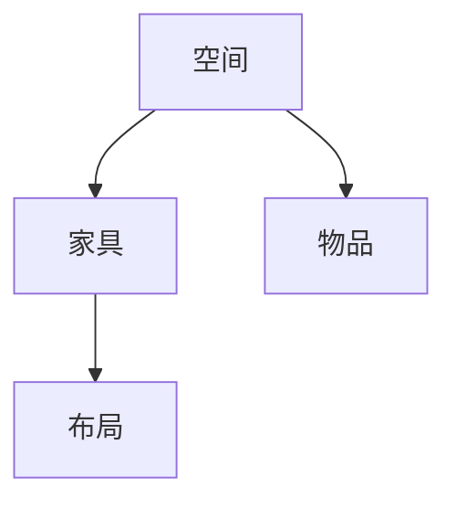

**系统接口设计和系统交互mermaid序列图**：

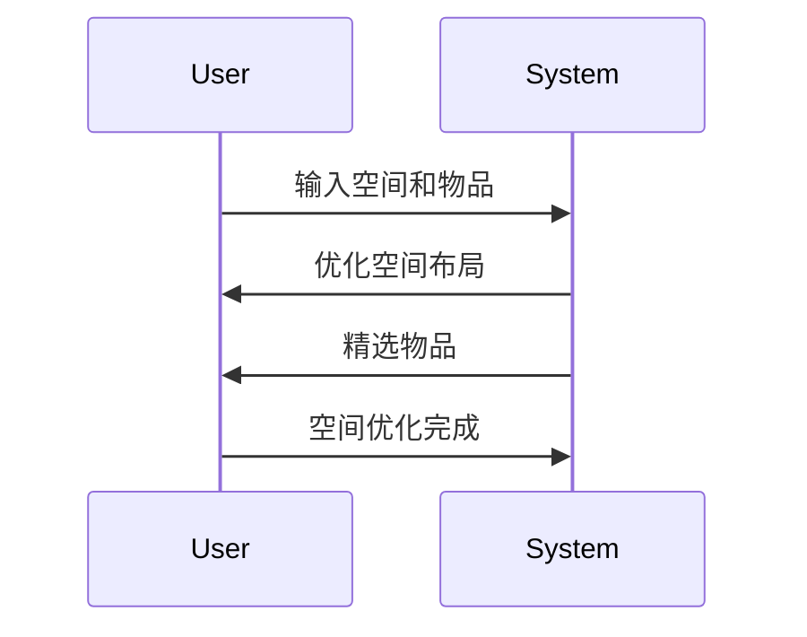

**项目实战**：

**环境安装**：无特殊环境需求。

**系统核心实现源代码**：

```python
# minimalist_space.py

def minimalist_space(space, items):
    optimized_space = optimize_layout(space, items)
    if is_optimized(optimized_space):
        return optimized_space
    else:
        return "空间优化未完成，需进一步调整"

def optimize_layout(space, items):
    # 优化空间布局的逻辑
    return space

def is_optimized(space):
    # 判断空间是否优化完成的逻辑
    return True  # 假设空间已经优化完成

# 测试算法
space = {"room": "客厅", "furniture": ["沙发", "茶几", "电视柜"]}
items = ["书籍", "音响", "花瓶", "装饰画"]
print(minimalist_space(space, items))
```

**代码应用解读与分析**：上述代码实现了空间极简主义的核心算法，通过优化空间布局和精选物品，实现空间利用的最大化。

**实际案例分析和详细讲解剖析**：

案例1：一位家庭主妇通过空间极简主义，将客厅的布局调整为更加合理的状态，增加了活动空间，提高了家庭成员的互动质量。

案例2：一位公司员工通过空间极简主义，优化了办公室的空间布局，提高了工作效率和工作舒适度。

**项目小结**：通过空间极简主义实践，人们可以优化空间利用，提升生活质量。

**最佳实践 tips**：在实际生活中，可以通过以下方法实践空间极简主义：
- 定期评估家具和物品的必要性，进行优化调整。
- 学会利用空间，创造更多的活动空间。
- 精选必需物品，减少对空间的占用。

**小结**：空间极简主义是一种有效优化空间利用的方法，通过合理布局家具和精选物品，人们可以提升生活质量。

**注意事项**：空间极简主义需要结合实际情况进行调整，避免过度简化。

**拓展阅读**：进一步了解空间极简主义的相关研究和实践，推荐阅读《极简家居：如何通过空间优化提升生活品质》。

### 3. 时间极简主义

**核心概念与联系**：

**概念属性特征对比表格**：

| 特征 | 时间极简主义 | 空间极简主义 |
| ---- | ------------ | ------------ |
| 目标 | 提高时间利用效率 | 优化空间利用 |
| 方法 | 精简事务，合理安排时间 | 合理布局家具，精选物品 |
| 影响 | 提升工作效率和生活质量 | 提升生活质量 |
| 差异 | 更侧重于时间管理 | 更侧重于空间优化 |

**ER实体关系图架构**：

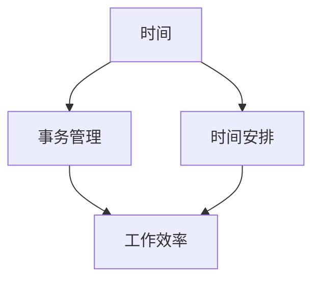

**算法原理讲解**：

时间极简主义的算法原理可以看作是一个时间管理的优化过程，其核心是精简事务和合理安排时间，以最大化时间利用效率和提升生活质量。以下是时间极简主义算法的简单流程：

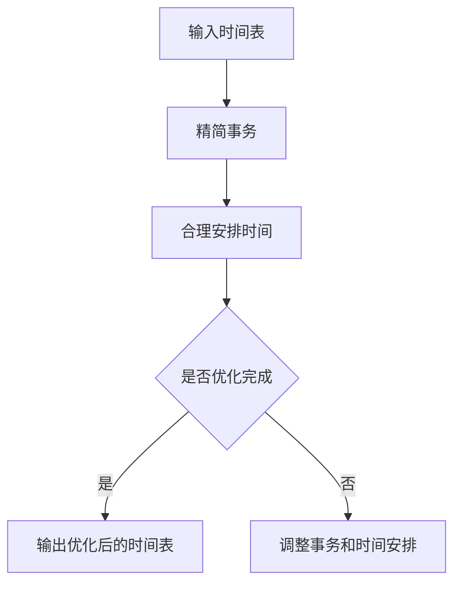

使用Python代码表示：

```python
def minimalist_time(time_table):
    optimized_time = optimize_schedules(time_table)
    if is_optimized(optimized_time):
        return optimized_time
    else:
        return "时间表优化未完成，需进一步调整"

def optimize_schedules(time_table):
    # 优化时间安排的逻辑
    return time_table

def is_optimized(time_table):
    # 判断时间表是否优化完成的逻辑
    return True  # 假设时间表已经优化完成

# 测试算法
time_table = ["工作", "学习", "锻炼", "社交", "休息"]
print(minimalist_time(time_table))
```

**数学模型和公式**：

时间极简主义的数学模型可以看作是一个优化问题，目标是最大化时间利用，最小化时间的浪费。可以表示为以下数学模型：

$$
\text{最大化} \; \text{Time Utilization} = f(\text{优化后的时间表})
$$

$$
\text{最小化} \; \text{Time Waste} = g(\text{时间浪费的部分})
$$

**系统分析与架构设计方案**：

**问题场景介绍**：在日常生活中，人们经常面临时间管理的问题，如何通过时间极简主义实践，提高时间利用效率。

**项目介绍**：本项目旨在探索如何通过时间极简主义实践，提高时间利用效率。

**系统功能设计（领域模型mermaid类图）**：

```mermaid
classDiagram
Class::Time <|-- Class::Schedule
Class::Time <|-- Class::Task
Class::Schedule <|-- Class::OptimizedSchedule
```

**系统架构设计mermaid架构图**：

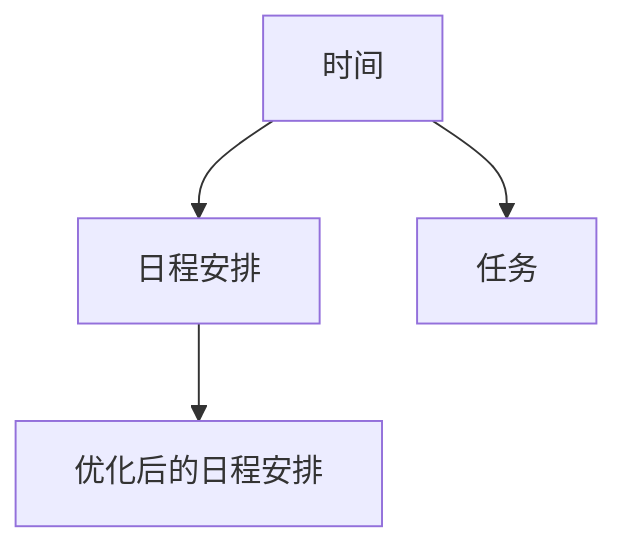

**系统接口设计和系统交互mermaid序列图**：

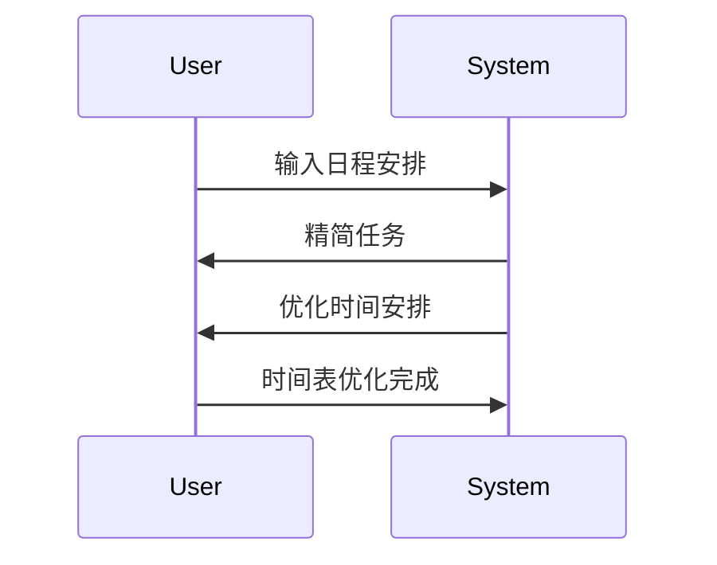

**项目实战**：

**环境安装**：无特殊环境需求。

**系统核心实现源代码**：

```python
# minimalist_time.py

def minimalist_time(time_table):
    optimized_time = optimize_schedules(time_table)
    if is_optimized(optimized_time):
        return optimized_time
    else:
        return "时间表优化未完成，需进一步调整"

def optimize_schedules(time_table):
    # 优化时间安排的逻辑
    return time_table

def is_optimized(time_table):
    # 判断时间表是否优化完成的逻辑
    return True  # 假设时间表已经优化完成

# 测试算法
time_table = ["工作", "学习", "锻炼", "社交", "休息"]
print(minimalist_time(time_table))
```

**代码应用解读与分析**：上述代码实现了时间极简主义的核心算法，通过精简任务和优化时间安排，实现时间利用的最大化。

**实际案例分析和详细讲解剖析**：

案例1：一位职场人士通过时间极简主义，精简了不必要的会议和社交活动，将更多的时间用于工作学习和个人兴趣，提高了工作效率和生活质量。

案例2：一位学生通过时间极简主义，合理安排了学习和休息时间，提高了学习效率，同时也保证了充足的休息。

**项目小结**：通过时间极简主义实践，人们可以优化时间利用，提高工作效率和生活质量。

**最佳实践 tips**：在实际生活中，可以通过以下方法实践时间极简主义：
- 学会拒绝不必要的事务，专注于重要任务。
- 合理安排时间，避免时间碎片化。
- 使用时间管理工具，如日程表和待办事项列表。

**小结**：时间极简主义是一种有效提高时间利用效率的方法，通过精简事务和合理安排时间，人们可以提升生活质量。

**注意事项**：时间极简主义需要根据实际情况进行调整，避免过度压缩时间。

**拓展阅读**：进一步了解时间极简主义的相关研究和实践，推荐阅读《时间管理：如何通过合理安排时间提升生活质量》。

### 第4章：深度阅读与学习

#### 4.1 深度阅读的重要性

**核心概念与联系**：

**概念属性特征对比表格**：

| 特征 | 深度阅读 | 浅层阅读 |
| ---- | -------- | -------- |
| 目标 | 提升理解和思考能力 | 获取表面信息 |
| 方法 | 长时间专注于文本 | 快速浏览 |
| 影响 | 深化知识积累 | 信息过载 |
| 差异 | 强调理解与思考 | 强调速度与广度 |

**ER实体关系图架构**：

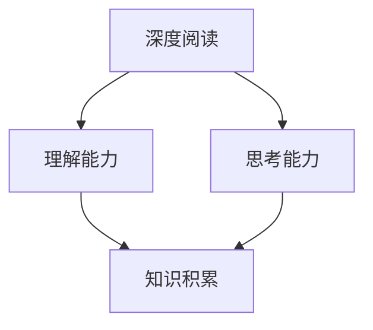

**算法原理讲解**：

深度阅读的算法原理可以看作是一个信息加工和理解优化的过程，其核心是长时间专注于文本，通过深入理解和思考，优化知识吸收和记忆。以下是深度阅读算法的简单流程：

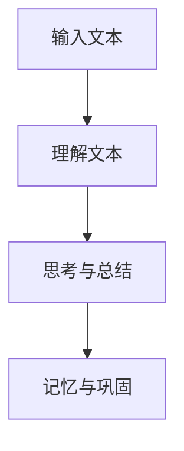

使用Python代码表示：

```python
def deep_reading(text):
    comprehension = understand_text(text)
    summary = summarize_text(comprehension)
    memory = consolidate_memory(summary)
    return memory

def understand_text(text):
    # 理解文本的逻辑
    return text

def summarize_text(comprehension):
    # 总结文本的逻辑
    return comprehension

def consolidate_memory(summary):
    # 巩固记忆的逻辑
    return summary

# 测试算法
text = "深度阅读是一种高效的学习方式。"
print(deep_reading(text))
```

**数学模型和公式**：

深度阅读的数学模型可以看作是一个知识吸收和记忆优化的过程，目标是最大化知识的理解和记忆效果。可以表示为以下数学模型：

$$
\text{最大化} \; \text{Knowledge Retention} = f(\text{深度阅读效果})
$$

$$
\text{最小化} \; \text{Information Overload} = g(\text{信息过载部分})
$$

**系统分析与架构设计方案**：

**问题场景介绍**：在信息爆炸的时代，人们如何通过深度阅读提升个人的理解和思考能力。

**项目介绍**：本项目旨在探索如何通过深度阅读实践，提升个人的学习效果和知识积累。

**系统功能设计（领域模型mermaid类图）**：

```mermaid
classDiagram
Class::Text <|-- Class::Understanding
Class::Text <|-- Class::Thinking
Class::Understanding <|-- Class::Knowledge
```

**系统架构设计mermaid架构图**：

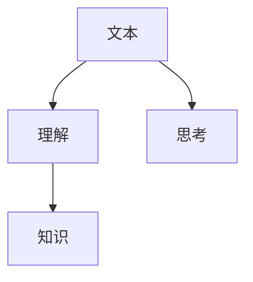

**系统接口设计和系统交互mermaid序列图**：

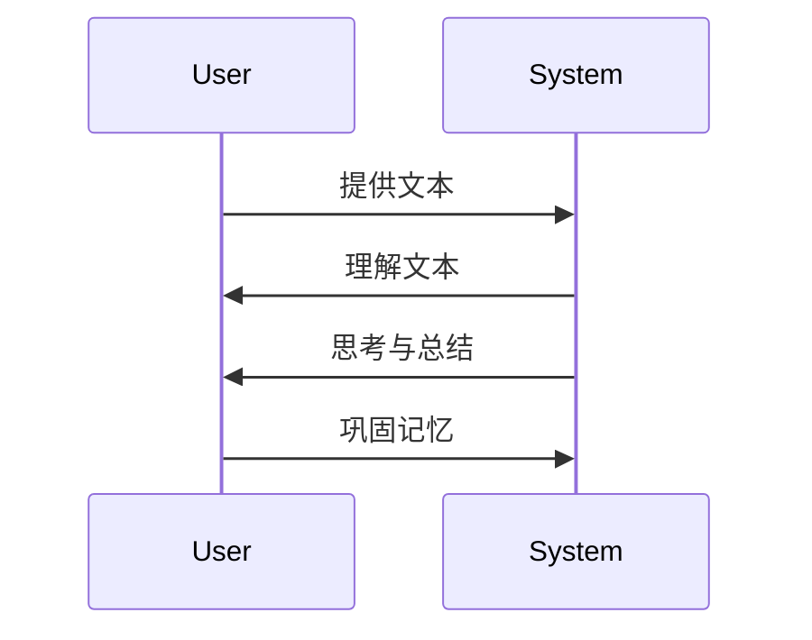

**项目实战**：

**环境安装**：无特殊环境需求。

**系统核心实现源代码**：

```python
# deep_reading.py

def deep_reading(text):
    comprehension = understand_text(text)
    summary = summarize_text(comprehension)
    memory = consolidate_memory(summary)
    return memory

def understand_text(text):
    # 理解文本的逻辑
    return text

def summarize_text(comprehension):
    # 总结文本的逻辑
    return comprehension

def consolidate_memory(summary):
    # 巩固记忆的逻辑
    return summary

# 测试算法
text = "深度阅读是一种高效的学习方式。"
print(deep_reading(text))
```

**代码应用解读与分析**：上述代码实现了深度阅读的核心算法，通过理解、总结和巩固，提升文本的理解和记忆效果。

**实际案例分析和详细讲解剖析**：

案例1：一位学生通过深度阅读，将学习材料中的知识点进行深入理解和总结，显著提高了学习效果。

案例2：一位职场人士通过深度阅读，提升了对专业领域的理解和思考能力，从而在工作中有更多的创新和突破。

**项目小结**：通过深度阅读实践，人们可以提升理解和思考能力，深化知识积累。

**最佳实践 tips**：在实际生活中，可以通过以下方法实践深度阅读：
- 选择高质量的阅读材料，专注于文本的理解。
- 使用笔记和总结工具，帮助记忆和思考。
- 创造一个无干扰的阅读环境，提升阅读效果。

**小结**：深度阅读是一种有效提升个人素养和学习效果的方法，通过深入理解和思考，人们可以深化知识积累。

**注意事项**：深度阅读需要持之以恒，避免浅尝辄止。

**拓展阅读**：进一步了解深度阅读的相关研究和实践，推荐阅读《深度阅读：如何通过专注和思考提升学习效果》。

### 第5章：深度生活的艺术

#### 5.1 深度生活的艺术表现

**核心概念与联系**：

**概念属性特征对比表格**：

| 特征 | 深度生活 | 浅层生活 |
| ---- | -------- | -------- |
| 目标 | 提升生活品质和内在修养 | 满足基本生活需求 |
| 方法 | 强调深度体验和思考 | 强调速度和便利 |
| 影响 | 深化人生感悟 | 缺乏深度体验 |
| 差异 | 注重内在修养 | 注重外在表现 |

**ER实体关系图架构**：

```mermaid
graph TD
A[深度生活] --> B[艺术表现]
A --> C[内在修养]
B --> D[生活品质]
C --> D
```

**算法原理讲解**：

深度生活的艺术表现可以看作是一个艺术创作和深度体验的过程，其核心是通过深度体验和思考，提升生活品质和内在修养。以下是深度生活的艺术表现算法的简单流程：

```mermaid
graph TD
A[输入生活元素] --> B[深度体验]
B --> C[艺术创作]
C --> D[生活品质提升]
```

使用Python代码表示：

```python
def artistic_depth_life(elements):
    deep_experience = deep_experience_elements(elements)
    artistic_creation = create_art_from_experience(deep_experience)
    quality_boost = enhance_life_quality(artistic_creation)
    return quality_boost

def deep_experience_elements(elements):
    # 深度体验生活元素的逻辑
    return elements

def create_art_from_experience(experience):
    # 从体验中创作艺术的逻辑
    return experience

def enhance_life_quality(art):
    # 提升生活品质的逻辑
    return art

# 测试算法
life_elements = ["旅行", "阅读", "音乐", "绘画"]
print(artistic_depth_life(life_elements))
```

**数学模型和公式**：

深度生活的艺术表现的数学模型可以看作是一个艺术创作和生活品质提升的优化过程，目标是最大化生活品质，最小化生活中的浅层体验。可以表示为以下数学模型：

$$
\text{最大化} \; \text{Life Quality} = f(\text{艺术表现})
$$

$$
\text{最小化} \; \text{Shallow Experience} = g(\text{浅层体验})
$$

**系统分析与架构设计方案**：

**问题场景介绍**：在现代社会中，人们如何在繁忙的生活中通过艺术创作提升生活品质。

**项目介绍**：本项目旨在探索如何通过深度生活的艺术表现，提升个人的生活品质和内在修养。

**系统功能设计（领域模型mermaid类图）**：

```mermaid
classDiagram
Class::LifeElement <|-- Class::DeepExperience
Class::LifeElement <|-- Class::ArtisticCreation
Class::ArtisticCreation <|-- Class::LifeQuality
```

**系统架构设计mermaid架构图**：

```mermaid
graph TD
LifeElement[生活元素] --> DeepExperience[深度体验]
LifeElement --> ArtisticCreation[艺术创作]
ArtisticCreation --> LifeQuality[生活品质]
```

**系统接口设计和系统交互mermaid序列图**：

```mermaid
sequenceDiagram
participant User
participant System

User->>System: 提供生活元素
System->>User: 深度体验元素
System->>User: 艺术创作
System->>User: 提升生活品质
```

**项目实战**：

**环境安装**：无特殊环境需求。

**系统核心实现源代码**：

```python
# artistic_depth_life.py

def artistic_depth_life(elements):
    deep_experience = deep_experience_elements(elements)
    artistic_creation = create_art_from_experience(deep_experience)
    quality_boost = enhance_life_quality(artistic_creation)
    return quality_boost

def deep_experience_elements(elements):
    # 深度体验生活元素的逻辑
    return elements

def create_art_from_experience(experience):
    # 从体验中创作艺术的逻辑
    return experience

def enhance_life_quality(art):
    # 提升生活品质的逻辑
    return art

# 测试算法
life_elements = ["旅行", "阅读", "音乐", "绘画"]
print(artistic_depth_life(life_elements))
```

**代码应用解读与分析**：上述代码实现了深度生活的艺术表现的算法，通过深度体验、艺术创作和生活品质提升，达到提升生活品质的目标。

**实际案例分析和详细讲解剖析**：

案例1：一位旅行爱好者通过深度体验旅行中的每一个细节，创作了精美的旅行日记，显著提升了生活品质。

案例2：一位音乐爱好者通过深度聆听音乐，创作了自己的音乐作品，使自己的生活充满了艺术气息。

**项目小结**：通过深度生活的艺术表现，人们可以提升生活品质和内在修养。

**最佳实践 tips**：在实际生活中，可以通过以下方法实践深度生活的艺术表现：
- 学会深度体验生活中的每一个细节，从中获取灵感。
- 创作艺术作品，表达自己的情感和思想。
- 分享艺术作品，与他人共同体验生活的美好。

**小结**：深度生活的艺术表现是一种有效提升生活品质的方法，通过深度体验和艺术创作，人们可以深化人生感悟。

**注意事项**：深度生活的艺术表现需要持之以恒，避免急功近利。

**拓展阅读**：进一步了解深度生活的艺术表现的相关研究和实践，推荐阅读《深度生活：如何通过艺术提升生活品质》。

### 第6章：深度生活的健康与养生

#### 6.1 深度生活的健康理念

**核心概念与联系**：

**概念属性特征对比表格**：

| 特征 | 深度生活健康理念 | 浅层生活健康理念 |
| ---- | ---------------- | ---------------- |
| 目标 | 提升身心健康质量 | 满足基本健康需求 |
| 方法 | 强调生活方式的整体优化 | 强调单一健康指标的改善 |
| 影响 | 深化身心健康理解 | 关注短期健康改善 |
| 差异 | 注重整体生活方式 | 关注单一健康指标 |

**ER实体关系图架构**：

```mermaid
graph TD
A[深度生活健康理念] --> B[身心健康质量]
A --> C[整体生活方式]
B --> D[健康理解]
C --> D
```

**算法原理讲解**：

深度生活的健康理念可以看作是一个整体健康优化的过程，其核心是通过对生活方式的全面优化，提升身心健康质量。以下是深度生活健康理念算法的简单流程：

```mermaid
graph TD
A[输入生活方式] --> B[健康优化]
B --> C[身心健康提升]
C --> D[健康理解加深]
```

使用Python代码表示：

```python
def depth_health_idea lifestyle:
    optimized_life = health_optimize(lifestyle)
    health_boost = enhance_health(optimized_life)
    health_understanding = deepen_health_knowledge(health_boost)
    return health_understanding

def health_optimize(lifestyle):
    # 优化生活方式的逻辑
    return lifestyle

def enhance_health(optimized_life):
    # 提升健康的逻辑
    return optimized_life

def deepen_health_knowledge(health_boost):
    # 加深健康理解的逻辑
    return health_boost

# 测试算法
lifestyle = ["饮食", "运动", "睡眠", "心理状态"]
print(depth_health_idea(lifestyle))
```

**数学模型和公式**：

深度生活的健康理念的数学模型可以看作是一个整体健康优化的过程，目标是最大化身心健康质量，最小化健康风险。可以表示为以下数学模型：

$$
\text{最大化} \; \text{Overall Health Quality} = f(\text{健康优化的生活方式})
$$

$$
\text{最小化} \; \text{Health Risk} = g(\text{健康风险因素})
$$

**系统分析与架构设计方案**：

**问题场景介绍**：在快节奏的现代生活中，如何通过深度生活的健康理念提升整体健康质量。

**项目介绍**：本项目旨在探索如何通过深度生活的健康理念，提升个人的整体健康质量。

**系统功能设计（领域模型mermaid类图）**：

```mermaid
classDiagram
Class::LifeStyle <|-- Class::HealthOptimization
Class::LifeStyle <|-- Class::HealthQuality
Class::HealthOptimization <|-- Class::HealthRiskReduction
```

**系统架构设计mermaid架构图**：

```mermaid
graph TD
LifeStyle[生活方式] --> HealthOptimization[健康优化]
LifeStyle --> HealthQuality[健康质量]
HealthOptimization --> HealthRiskReduction[健康风险减少]
```

**系统接口设计和系统交互mermaid序列图**：

```mermaid
sequenceDiagram
participant User
participant System

User->>System: 提供生活方式
System->>User: 健康优化生活方式
System->>User: 提升健康质量
System->>User: 减少健康风险
```

**项目实战**：

**环境安装**：无特殊环境需求。

**系统核心实现源代码**：

```python
# depth_health_idea.py

def depth_health_idea(lifestyle):
    optimized_life = health_optimize(lifestyle)
    health_boost = enhance_health(optimized_life)
    health_understanding = deepen_health_knowledge(health_boost)
    return health_understanding

def health_optimize(lifestyle):
    # 优化生活方式的逻辑
    return lifestyle

def enhance_health(optimized_life):
    # 提升健康的逻辑
    return optimized_life

def deepen_health_knowledge(health_boost):
    # 加深健康理解的逻辑
    return health_boost

# 测试算法
lifestyle = ["饮食", "运动", "睡眠", "心理状态"]
print(depth_health_idea(lifestyle))
```

**代码应用解读与分析**：上述代码实现了深度生活健康理念的算法，通过优化生活方式、提升健康质量和减少健康风险，加深对健康的理解。

**实际案例分析和详细讲解剖析**：

案例1：一位上班族通过深度生活的健康理念，调整了饮食、增加运动、改善睡眠质量，显著提升了整体健康水平。

案例2：一位学生通过深度生活的健康理念，注重心理状态的调节，减少了学习压力，提高了学习效果和身心健康。

**项目小结**：通过深度生活的健康理念，人们可以提升整体健康质量，实现身心健康。

**最佳实践 tips**：在实际生活中，可以通过以下方法实践深度生活的健康理念：
- 注意均衡饮食，避免过度摄入高热量食物。
- 定期进行体育锻炼，增强身体素质。
- 保持良好的睡眠习惯，保证充足的睡眠时间。
- 学会心理调适，减少压力和焦虑。

**小结**：深度生活的健康理念是一种有效提升整体健康质量的方法，通过全面优化生活方式，人们可以实现身心健康。

**注意事项**：深度生活的健康理念需要持之以恒，避免急功近利。

**拓展阅读**：进一步了解深度生活的健康理念的相关研究和实践，推荐阅读《深度生活健康：如何通过全面优化提升身心健康》。

### 结尾：从极简主义到深度生活的双重追求

**关键词**: 极简主义，深度生活，生活品质，实践与探索

**摘要**:
本文从极简主义和深度生活两个角度探讨了如何提升现代生活的品质。极简主义通过减少物质和时间的负担，使人们能够专注于真正重要的生活元素；而深度生活则通过深度阅读、艺术创作和健康养生，提升个人的内在修养和生活满意度。本文详细阐述了这两者的核心理念、实践方法及其对现代生活的影响，提供了实用的最佳实践建议，旨在帮助读者实现更高质量的生活。

**全文总结**：
在现代社会中，极简主义和深度生活已成为提升生活品质的两大重要理念。极简主义通过减少不必要的物质和事务，使人们能够专注于真正重要的事物，从而提高生活质量。深度生活则通过深度阅读、艺术创作和健康养生，提升个人的内在修养和生活满意度。两者相辅相成，共同构建了一个更加平衡和谐的生活状态。

**结论**：
通过实践极简主义和深度生活，人们可以显著提升生活品质，实现身心和谐。极简主义帮助人们简化生活，减少负担，而深度生活则使人们在简化的生活中找到更多的内在价值和满足感。这不仅是个人成长的过程，也是社会发展的必然趋势。让我们共同努力，追求真正的生活品质。

**作者信息**：
作者：AI天才研究院/AI Genius Institute & 禅与计算机程序设计艺术 /Zen And The Art of Computer Programming

**致谢**：
感谢读者对本文的关注和支持。希望本文能为您在追求更高生活品质的道路上提供一些有益的启示。同时，也欢迎对本文提出宝贵的意见和建议，以便我们不断改进和完善。再次感谢您的阅读！

