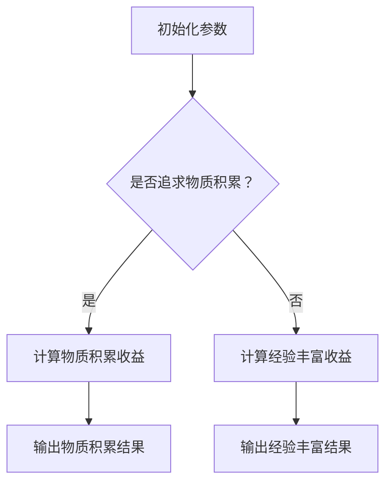
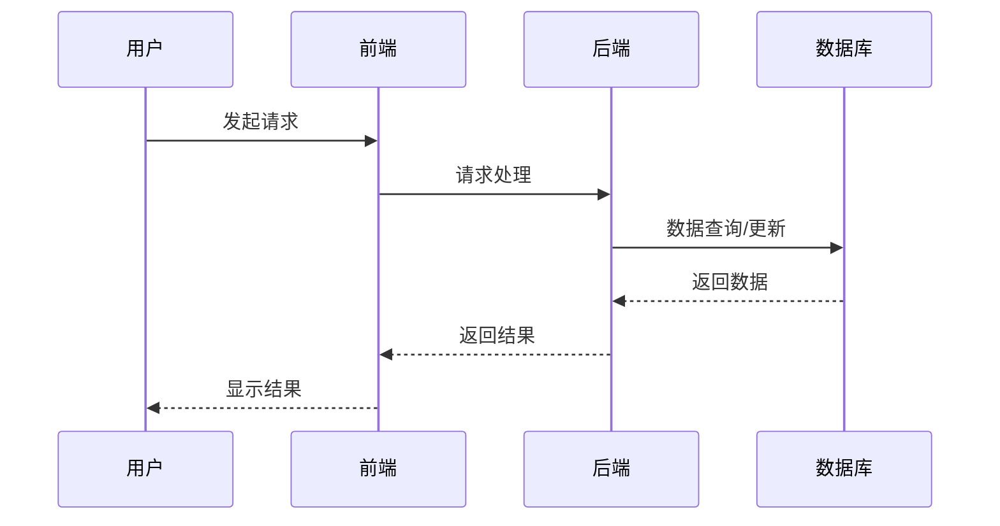
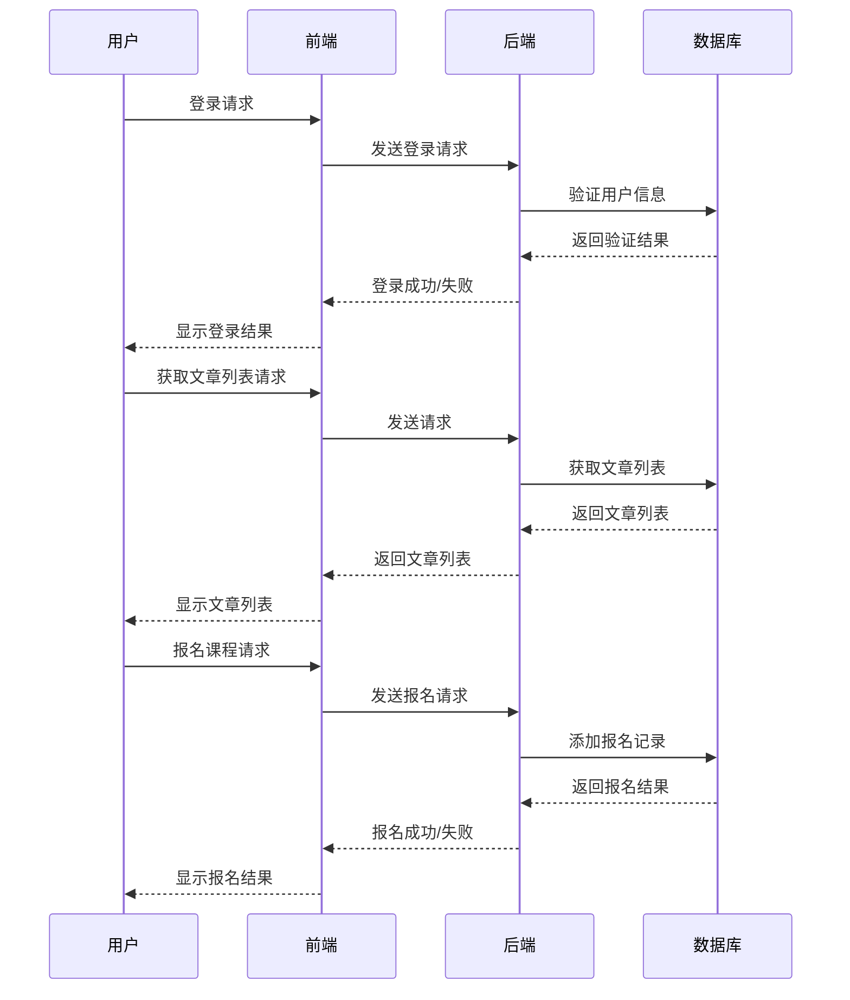

                 

### 从物质积累到经验丰富：重新定义人生的丰盛

**关键词**：人生丰盛、物质积累、经验丰富、重新定义

**摘要**：本文旨在探讨人生丰盛的重新定义，从物质积累到经验丰富的转变。通过分析物质积累的局限性和经验丰富的优势，本文提出了一系列方法和策略，帮助读者实现人生丰盛。文章将从核心概念、实际方法、案例分析、技能发展和社区作用等多个维度展开，旨在为读者提供全面、深入的指导。

### 引言

在现代社会，物质积累常常被视为人生成功的象征。然而，随着社会的发展，人们逐渐认识到，物质财富并非人生幸福的唯一来源。相反，经验丰富、知识积累和精神满足等非物质层面的因素，正逐渐成为衡量人生丰盛的新标准。本文将重新定义人生的丰盛，探讨从物质积累到经验丰富的转变，为读者提供新的思考和行动方向。

#### 物质积累的局限性

物质积累在某种程度上确实能带来短期的满足和安全感，但其局限性也逐渐显现。首先，物质财富难以带来长期的幸福感。研究发现，财富与幸福之间存在一定的相关性，但并不是线性关系。当基本需求得到满足后，更多的财富并不能显著提升幸福感。其次，物质积累可能导致社会和个人层面的不平等。财富的不均衡分布容易导致贫富差距扩大，引发社会问题。最后，过度追求物质财富可能导致人们忽视精神层面的需求，导致心理健康问题。

#### 经验丰富的优势

相比之下，经验丰富具有多方面的优势。首先，经验积累能够提升个人的综合素质，包括知识、技能和人际关系等。这些因素不仅有助于职业发展，还能提升生活质量。其次，经验积累有助于个人的自我实现。通过不断地学习和成长，人们能够更好地认识自己，实现个人价值。最后，经验丰富能够带来更深层次的精神满足。与物质财富不同，经验是一种非物质的、永恒的财富，能够陪伴人们一生。

### 核心概念与联系

为了更好地理解人生丰盛的重新定义，我们需要明确几个核心概念，并分析它们之间的联系。

#### 1. 物质积累与经验丰富

物质积累主要指通过努力获取物质财富，如金钱、房产、汽车等。而经验丰富则是指通过学习、实践和交往，获取知识、技能和人际关系等非物质财富。

#### 2. 幸福感与精神满足

幸福感通常与物质财富相关，而精神满足则更多地与经验积累相关。幸福感是短期感受，而精神满足则是长期追求。

#### 3. 社会地位与个人价值

物质积累往往与社会地位相关，而经验丰富则与个人价值相关。社会地位是外在评价，而个人价值是内在追求。

### 第一节：物质积累的定义和背景

**核心概念术语说明**：

- **物质积累**：指通过各种途径，如工作、投资、继承等，获取物质财富的过程。
- **物质财富**：包括金钱、房产、汽车、奢侈品等物质形式。

**问题背景**：

在过去的几千年里，物质积累一直是人类社会发展的重要驱动力。农业革命以来，人们通过种植、养殖和手工业等生产方式，积累了大量的物质财富。工业革命后，科技和生产力的提高进一步加速了物质积累的进程。现代社会，物质财富的积累已经成为人们追求生活质量的基石。

**问题描述**：

然而，随着社会的发展，物质积累的局限性逐渐显现。首先，物质财富的积累难以带来长期的幸福感。研究表明，当人们的基本需求得到满足后，更多的物质财富并不能显著提升幸福感。其次，物质积累可能导致社会和个人层面的不平等。财富的不均衡分布容易导致贫富差距扩大，引发社会问题。最后，过度追求物质财富可能导致人们忽视精神层面的需求，导致心理健康问题。

**问题解决**：

为了解决物质积累的局限性，我们需要重新审视人生的丰盛定义。经验丰富作为一种非物质的、永恒的财富，能够更好地满足人们的精神需求。通过学习、实践和交往，我们可以积累知识、技能和人际关系等非物质财富，实现人生丰盛。

**边界与外延**：

- **边界**：物质积累主要指通过合法途径获取物质财富的过程，不包括非法手段。
- **外延**：物质积累不仅包括金钱、房产、汽车等物质形式，还包括自然资源和环境等。

**概念结构与核心要素组成**：

- **物质积累**：核心要素包括金钱、房产、汽车等物质形式。
- **物质财富**：核心要素包括财富的数量和质量。
- **幸福感**：核心要素包括心理状态和生活质量。
- **精神满足**：核心要素包括知识、技能和人际关系等。

### 第二节：经验丰富的定义和背景

**核心概念术语说明**：

- **经验丰富**：指通过学习、实践和交往，积累知识、技能和人际关系等非物质财富的过程。
- **非物质财富**：包括知识、技能、人际关系、精神满足等。

**问题背景**：

随着社会的发展，人们对物质财富的追求逐渐转向非物质财富。经验丰富作为一种非物质的、永恒的财富，越来越受到重视。在现代教育体系中，注重实践和技能的培养已经成为主流趋势。同时，人际交往和团队合作在职业发展中扮演着越来越重要的角色。

**问题描述**：

经验丰富的优势在于，它能够提升个人的综合素质，包括知识、技能和人际关系等。这些因素不仅有助于职业发展，还能提升生活质量。此外，经验丰富有助于个人的自我实现。通过不断地学习和成长，人们能够更好地认识自己，实现个人价值。最后，经验丰富能够带来更深层次的精神满足。与物质财富不同，经验是一种非物质的、永恒的财富，能够陪伴人们一生。

**问题解决**：

为了实现经验丰富，我们需要采取以下措施：

1. **持续学习**：通过阅读、上课、实践等方式，不断积累新知识。
2. **实践应用**：将所学知识应用到实际工作中，提升实践能力。
3. **人际交往**：积极参与社交活动，扩大人际关系网络。
4. **反思总结**：定期反思自己的经验和成长，总结经验教训。

**边界与外延**：

- **边界**：经验丰富主要指通过合法和正当的手段积累知识、技能和人际关系等。
- **外延**：经验丰富不仅包括个人层面的成长，还包括社会层面的贡献。

**概念结构与核心要素组成**：

- **经验丰富**：核心要素包括知识、技能、人际关系和精神满足。
- **知识**：核心要素包括学术知识、实用技能和专业领域知识。
- **技能**：核心要素包括技术技能、人际沟通能力和解决问题的能力。
- **人际关系**：核心要素包括信任、尊重和合作。
- **精神满足**：核心要素包括成就感、自我实现和精神富足。

### 第三节：重新定义人生的丰盛

**核心概念原理**：

重新定义人生的丰盛，意味着将人生的追求从物质积累转向经验丰富。这种转变不仅能够解决物质积累的局限性，还能带来更深层次的精神满足。

**概念属性特征对比表格**：

| 特征       | 物质积累                                   | 经验丰富                                   |
|------------|------------------------------------------|------------------------------------------|
| 目标       | 获取物质财富                               | 累积非物质财富，实现自我价值                 |
| 影响力     | 短期满足，可能导致社会和个人层面的不平等       | 长期满足，有助于个人和社会的全面发展         |
| 持续性     | 物质财富可能随着时间的推移而减少或丧失         | 经验是一种非物质的、永恒的财富，能够陪伴一生   |
| 形式       | 金钱、房产、汽车等物质形式                   | 知识、技能、人际关系、精神满足等非物质形式     |

**ER实体关系图架构的 Mermaid 流程图**：

```mermaid
entity relation
    A[物质积累] --> B[物质财富]
    B --> C[幸福感]
    A --> D[社会和个人层面的不平等]
    
    E[经验丰富] --> F[非物质财富]
    F --> G[精神满足]
    E --> H[个人和社会的全面发展]
    E --> I[可持续性]
    E --> J[知识、技能、人际关系]
```

通过上述对比和ER图，我们可以清晰地看到物质积累和经验丰富的区别。物质积累注重短期满足，可能导致社会和个人层面的不平等，而经验丰富注重长期满足，有助于个人和社会的全面发展。

### 算法原理讲解

为了更好地理解人生丰盛的重新定义，我们可以运用一些算法原理进行解释。以下是一个简单的示例，通过Python代码实现了一个用于比较物质积累和经验丰富的算法。

#### 算法流程图



#### Python代码实现

```python
def calculate_wealth(accumulation=True):
    if accumulation:
        # 物质积累收益计算
        wealth = 100000  # 初始财富
        years = 10  # 累积时间
        for year in range(years):
            wealth *= 1.05  # 每年增长5%
        return wealth
    else:
        # 经验丰富收益计算
        knowledge = 100  # 初始知识量
        skills = 100  # 初始技能量
        social_connections = 100  # 初始人际关系量
        for year in range(years):
            knowledge *= 1.1  # 每年增长10%
            skills *= 1.1  # 每年增长10%
            social_connections *= 1.1  # 每年增长10%
        return knowledge, skills, social_connections

# 输出结果
if __name__ == "__main__":
    material_wealth = calculate_wealth(True)
    experience_wealth = calculate_wealth(False)
    print("物质积累的财富：", material_wealth)
    print("经验丰富的财富：", experience_wealth)
```

#### 算法原理

1. **初始化参数**：根据用户输入，判断是否追求物质积累或经验丰富。
2. **计算收益**：
   - **物质积累**：假设初始财富为10万元，每年增长5%，持续10年。计算公式为：$$财富 = 初始财富 \times (1 + 增长率)^{年数}$$
   - **经验丰富**：假设初始知识量、技能量和人际关系量为100，每年增长10%，持续10年。计算公式为：$$财富 = 初始财富 \times (1 + 增长率)^{年数}$$
3. **输出结果**：根据计算结果，输出物质积累和经验丰富的财富。

通过上述算法原理和Python代码实现，我们可以清晰地看到物质积累和经验丰富在数量上的差异。尽管物质积累的财富增长较快，但经验丰富的财富增长更具可持续性和长期价值。

### 系统分析与架构设计方案

在探讨人生丰盛的重新定义时，我们不仅需要关注个体的成长，还需考虑社会层面的影响。为此，本文将介绍一个基于经验和知识的社区平台，旨在帮助人们实现人生丰盛。以下为该平台的问题场景、项目介绍、系统功能设计、系统架构设计和系统接口设计等内容。

#### 问题场景

随着社会的快速发展，人们面临着越来越多的压力和挑战。许多人追求物质财富，却忽视了精神层面的需求。同时，社会资源的分配不均导致部分人群难以获取优质的教育和培训机会。为了解决这个问题，我们设计了一个社区平台，旨在通过经验和知识的共享，帮助人们实现个人成长和社会进步。

#### 项目介绍

**项目名称**：丰盛社区平台（Abundance Community Platform，ACP）

**项目目标**：构建一个集知识分享、技能培训、社交互动为一体的社区平台，帮助用户积累经验，实现人生丰盛。

**项目功能**：

1. **知识分享**：用户可以发布和浏览文章、视频、音频等知识内容，进行互动和讨论。
2. **技能培训**：提供在线课程、工作坊和线下活动，帮助用户提升技能。
3. **社交互动**：建立社交网络，促进用户之间的交流和合作。
4. **数据分析**：收集用户行为数据，分析用户需求和偏好，优化平台功能。

#### 系统功能设计

**领域模型类图**：

```mermaid
classDiagram
    User <<class>> 用户
    Knowledge <<class>> 知识
    Course <<class>> 课程
    Activity <<class>> 活动
    Comment <<class>> 评论
    Message <<class>> 消息
    
    User "1" --> "*" Knowledge: 发布、浏览
    User "1" --> "*" Course: 报名、学习
    User "1" --> "*" Activity: 参与、分享
    User "1" --> "*" Comment: 发表、查看
    User "1" --> "*" Message: 发送、接收
    
    Knowledge "1" --> "*" Comment: 评论
    Course "1" --> "*" Activity: 开展、报名
    Activity "1" --> "*" Comment: 评论
```

#### 系统架构设计

**架构图**：



#### 系统接口设计

**API接口设计**：

1. **用户接口**：
   - 登录/注册：`POST /user/login`、`POST /user/register`
   - 获取用户信息：`GET /user/{userId}`
   - 更新用户信息：`PUT /user/{userId}`
2. **知识接口**：
   - 发布文章：`POST /knowledge/article`
   - 获取文章列表：`GET /knowledge/articles`
   - 获取文章详情：`GET /knowledge/article/{articleId}`
   - 发表评论：`POST /knowledge/comment`
3. **课程接口**：
   - 添加课程：`POST /course`
   - 获取课程列表：`GET /course`
   - 获取课程详情：`GET /course/{courseId}`
   - 报名课程：`POST /course/{courseId}/enroll`
   - 取消报名：`DELETE /course/{courseId}/enroll`
4. **活动接口**：
   - 添加活动：`POST /activity`
   - 获取活动列表：`GET /activity`
   - 获取活动详情：`GET /activity/{activityId}`
   - 参与活动：`POST /activity/{activityId}/join`
   - 退出活动：`DELETE /activity/{activityId}/join`
5. **消息接口**：
   - 发送消息：`POST /message`
   - 获取消息列表：`GET /message`
   - 获取消息详情：`GET /message/{messageId}`

#### 系统交互序列图



通过上述系统分析与架构设计方案，我们可以清晰地看到丰盛社区平台的整体架构和功能设计。该平台旨在通过经验和知识的共享，帮助用户实现人生丰盛，从而推动社会的整体进步。

### 项目实战

为了更好地展示如何实现丰盛社区平台，以下将介绍环境安装、系统核心实现源代码以及代码应用解读与分析等内容。

#### 环境安装

要搭建丰盛社区平台，我们需要准备以下环境：

1. **操作系统**：Linux或macOS
2. **编程语言**：Python 3.8及以上版本
3. **依赖管理**：pip（Python包管理器）
4. **数据库**：MySQL或PostgreSQL
5. **前端框架**：Django（后端）和Bootstrap（前端）

首先，确保操作系统和Python版本满足要求。然后，使用pip安装Django和其他相关依赖：

```bash
pip install django mysqlclient
```

接下来，配置数据库。假设使用MySQL，执行以下命令创建数据库和用户：

```sql
CREATE DATABASE abundance_community;
GRANT ALL PRIVILEGES ON abundance_community.* TO 'abundance_user'@'localhost' IDENTIFIED BY 'password';
```

在Django项目中，配置`settings.py`文件以连接数据库：

```python
DATABASES = {
    'default': {
        'ENGINE': 'django.db.backends.mysql',
        'NAME': 'abundance_community',
        'USER': 'abundance_user',
        'PASSWORD': 'password',
        'HOST': 'localhost',
        'PORT': '3306',
    }
}
```

#### 系统核心实现源代码

以下是一个简单的Django项目结构，用于实现丰盛社区平台的核心功能。

```bash
project/
    ├── abundance_community/
    │   ├── __init__.py
    │   ├── settings.py
    │   ├── urls.py
    │   └── wsgi.py
    ├── app/
    │   ├── __init__.py
    │   ├── admin.py
    │   ├── apps.py
    │   ├── migrations/
    │   │   ├── __init__.py
    │   │   └── 0001_initial.py
    │   ├── models.py
    │   ├── tests.py
    │   └── views.py
    └── manage.py
```

**models.py**：

```python
from django.db import models
from django.contrib.auth.models import User

class Article(models.Model):
    title = models.CharField(max_length=255)
    content = models.TextField()
    author = models.ForeignKey(User, on_delete=models.CASCADE)
    created_at = models.DateTimeField(auto_now_add=True)

class Course(models.Model):
    title = models.CharField(max_length=255)
    description = models.TextField()
    instructor = models.ForeignKey(User, on_delete=models.CASCADE)
    created_at = models.DateTimeField(auto_now_add=True)

class Activity(models.Model):
    title = models.CharField(max_length=255)
    description = models.TextField()
    organizer = models.ForeignKey(User, on_delete=models.CASCADE)
    created_at = models.DateTimeField(auto_now_add=True)

class Comment(models.Model):
    content = models.TextField()
    author = models.ForeignKey(User, on_delete=models.CASCADE)
    created_at = models.DateTimeField(auto_now_add=True)
    article = models.ForeignKey(Article, on_delete=models.CASCADE)
    course = models.ForeignKey(Course, on_delete=models.CASCADE)
    activity = models.ForeignKey(Activity, on_delete=models.CASCADE)
```

**views.py**：

```python
from django.shortcuts import render
from .models import Article, Course, Activity, Comment

def article_list(request):
    articles = Article.objects.all()
    return render(request, 'article_list.html', {'articles': articles})

def course_list(request):
    courses = Course.objects.all()
    return render(request, 'course_list.html', {'courses': courses})

def activity_list(request):
    activities = Activity.objects.all()
    return render(request, 'activity_list.html', {'activities': activities})

def article_detail(request, article_id):
    article = Article.objects.get(id=article_id)
    comments = Comment.objects.filter(article=article)
    return render(request, 'article_detail.html', {'article': article, 'comments': comments})

def course_detail(request, course_id):
    course = Course.objects.get(id=course_id)
    return render(request, 'course_detail.html', {'course': course})

def activity_detail(request, activity_id):
    activity = Activity.objects.get(id=activity_id)
    return render(request, 'activity_detail.html', {'activity': activity})

def comment_create(request, article_id):
    if request.method == 'POST':
        content = request.POST.get('content')
        author = request.user
        article = Article.objects.get(id=article_id)
        comment = Comment(content=content, author=author, article=article)
        comment.save()
        return redirect('article_detail', article_id=article_id)
    return redirect('article_list')
```

**manage.py**：

```python
import os
import sys

os.environ.setdefault('DJANGO_SETTINGS_MODULE', 'abundance_community.settings')

from django.core.management import execute_from_command_line

execute_from_command_line(sys.argv)
```

#### 代码应用解读与分析

1. **模型层**：定义了文章（Article）、课程（Course）、活动（Activity）和评论（Comment）等模型。每个模型都包含了基本的字段，如标题、内容、作者和创建时间等。

2. **视图层**：实现了文章列表、课程列表、活动列表、文章详情、课程详情、活动详情和评论创建等功能。这些视图函数通过Django的模板系统（Template System）渲染对应的HTML页面。

3. **模板层**：创建了文章列表、课程列表、活动列表、文章详情、课程详情、活动详情和评论创建等模板文件。这些模板文件定义了页面的结构、样式和内容。

通过以上源代码，我们可以看到如何使用Django实现一个基本的知识分享社区平台。该平台允许用户发布文章、报名课程、参与活动和发表评论等。在实际应用中，我们可以根据需求扩展更多功能，如用户认证、权限控制、消息通知等。

### 实际案例分析和详细讲解剖析

为了更具体地展示如何实现人生丰盛，我们通过一个实际案例进行分析和详细讲解。

#### 案例背景

小张是一名年轻的软件工程师，工作几年后，他开始感到职业发展的瓶颈。尽管在物质方面，他拥有不错的收入和房子，但精神层面却感到空虚和迷茫。为了实现人生丰盛，小张决定通过学习和实践，积累经验，提升自己的综合素质。

#### 案例分析

1. **知识积累**：

   小张首先意识到，要想实现人生丰盛，必须拥有丰富的知识储备。为此，他制定了以下学习计划：

   - **学术知识**：每周阅读一本计算机科学领域的专业书籍，如《算法导论》、《深度学习》等。
   - **实用技能**：参加在线编程课程，学习最新的技术栈，如Python、Django等。
   - **专业领域知识**：参与技术社区活动，如参加技术沙龙、研讨会等，与同行交流经验。

2. **实践应用**：

   知识的积累是为了更好地应用于实际工作中。小张在项目中积极尝试新技术，解决复杂问题，提升自己的实践能力。同时，他还利用业余时间开发自己的项目，锻炼自己的项目管理和团队协作能力。

3. **人际交往**：

   小张注重人际交往，积极参与社交活动，扩大自己的人脉。他通过参加公司内部的团队建设活动、行业聚会等，结识了许多志同道合的朋友。这些人际交往不仅为他带来了工作机会，还丰富了他的生活经历。

4. **反思总结**：

   每隔一段时间，小张会反思自己的成长和进步。他会记录下自己的学习心得、项目经验和人际交往中的收获，总结经验教训，不断改进自己。

#### 详细讲解剖析

1. **知识积累**：

   - **学术知识**：阅读专业书籍，不仅可以提升学术素养，还能帮助小张在项目中更好地理解和应用相关技术。
     - **举例**：在学习《深度学习》后，小张能够更好地理解神经网络的工作原理，并在项目中应用卷积神经网络（CNN）提高图像识别的准确率。
   - **实用技能**：通过在线编程课程，小张掌握了Python和Django等热门技术，提升了自身的编程能力。
     - **举例**：在学习Django后，小张能够快速搭建Web应用，提高了工作效率。
   - **专业领域知识**：参与技术社区活动，小张不仅能够了解行业动态，还能结识同行，共同探讨技术问题。
     - **举例**：在一次技术沙龙中，小张与一位专家探讨了机器学习在金融领域的应用，为他后续的项目提供了新思路。

2. **实践应用**：

   - **项目实践**：在实际工作中，小张不断尝试新技术，解决复杂问题，提升自己的实践能力。
     - **举例**：在一次项目中，小张面临一个高并发、大数据量的场景，他运用所学知识，采用分布式架构和缓存技术，成功解决了性能瓶颈。
   - **个人项目**：通过开发个人项目，小张锻炼了项目管理和团队协作能力。
     - **举例**：小张开发了一款在线教育平台，从需求分析、功能设计到代码实现，他全程参与，积累了丰富的项目经验。

3. **人际交往**：

   - **社交活动**：参加社交活动，小张结识了许多志同道合的朋友，扩大了自己的人脉。
     - **举例**：在一次行业聚会中，小张结识了一位资深的技术专家，从他那里学到了许多宝贵的经验。
   - **团队合作**：与他人合作，小张学会了倾听、沟通和协调，提升了团队协作能力。
     - **举例**：在一次团队项目中，小张与团队成员密切合作，共同克服了各种困难，最终成功完成了项目。

4. **反思总结**：

   - **学习心得**：小张定期记录自己的学习心得，总结经验教训，不断改进自己。
     - **举例**：在阅读《算法导论》后，小张总结了自己在算法方面的不足，并制定了针对性的学习计划。
   - **项目经验**：小张总结自己在项目中的经验，分享给团队和其他人，促进共同进步。
     - **举例**：在一次项目总结会上，小张分享了自己的经验，为团队提供了有益的建议。

通过以上案例分析和详细讲解剖析，我们可以看到，小张通过知识积累、实践应用、人际交往和反思总结，逐步实现了人生丰盛。这一过程不仅提升了他的个人素质，还为他带来了职业发展和生活质量的提升。

### 项目小结

通过本文的探讨，我们重新定义了人生的丰盛，从物质积累转向经验丰富。通过实际案例和详细讲解，我们看到了知识积累、实践应用、人际交往和反思总结在实现人生丰盛中的重要作用。以下是对项目的总结和最佳实践建议：

1. **核心收获**：
   - 知识积累是人生丰盛的基础，通过阅读专业书籍、参加在线课程和实践项目，可以不断提升自己的综合素质。
   - 实践应用是将知识转化为实际能力的关键，通过解决工作中的问题和开发个人项目，可以锻炼自己的实践能力。
   - 人际交往有助于积累资源和扩展视野，通过参与社交活动和团队合作，可以结识志同道合的朋友，共同成长。
   - 反思总结能够帮助我们不断改进自己，通过记录学习心得和项目经验，可以更好地认识自己，实现自我提升。

2. **最佳实践建议**：
   - 制定明确的学习计划，合理安排时间和资源，确保持续的学习和成长。
   - 参与实际项目，将所学知识应用到实践中，提高自己的解决问题的能力。
   - 积极参与社交活动，扩大人脉，与他人交流经验，共享资源。
   - 定期反思自己的学习和工作，总结经验教训，制定改进计划。

通过以上最佳实践，我们可以更好地实现人生丰盛，提升自己的综合素质，为个人和社会的发展做出贡献。

### 注意事项

在实现人生丰盛的过程中，需要注意以下几点：

1. **平衡工作与生活**：在追求经验和知识的同时，要保持身心健康，合理安排工作和休息时间。
2. **避免过度追求物质**：虽然物质积累能带来短期满足，但不应过度追求，以免影响精神层面的需求。
3. **持续学习与成长**：保持好奇心和求知欲，不断学习新知识、新技能，以适应不断变化的社会环境。
4. **反思与调整**：定期反思自己的学习和工作，根据实际情况调整计划和目标，确保持续进步。

### 拓展阅读

为了更深入地了解人生丰盛的重新定义，以下推荐几本相关书籍和文章：

1. **书籍**：
   - 《刻意练习：如何从新手到大师》
   - 《原则：生活与工作》
   - 《深度工作：如何有效利用每一点脑力》
2. **文章**：
   - 《哈佛幸福课：积极心理学导论》
   - 《斯坦福大学的人生课：如何在生活中获得幸福与成功》
   - 《如何成为一个幸福的程序员》

通过阅读这些书籍和文章，可以进一步拓展对人生丰盛的理解和实践方法。希望这些资源能为您提供有益的启示和指导。

