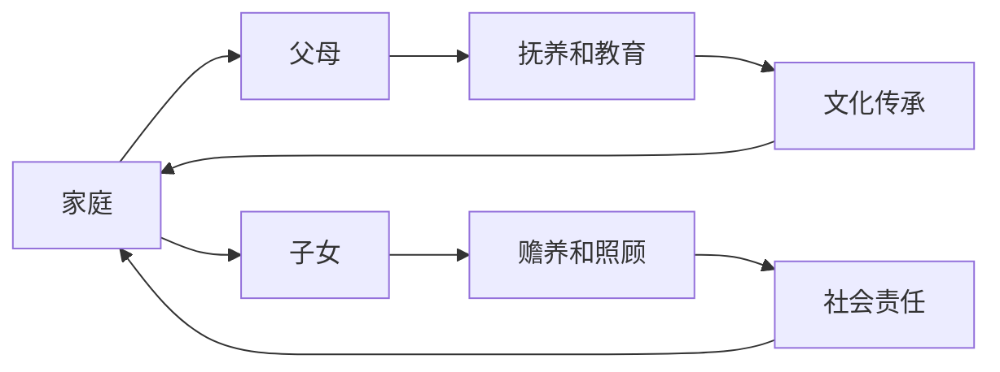
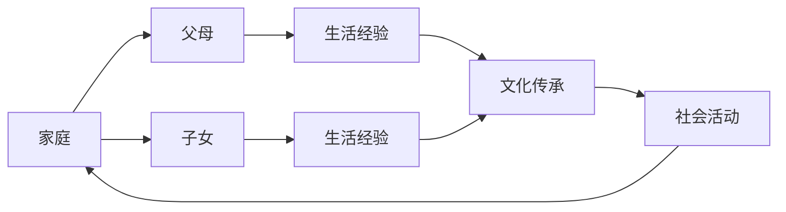

                 

### 从物质继承到精神传承：重新定义代际责任和连接

> **关键词：** 代际责任、精神传承、连接、社会变迁、科技发展

> **摘要：** 本文探讨了现代社会中代际责任和连接面临的挑战，分析了物质继承与精神传承的关系，并提出了一种重新定义代际责任和连接的方法。通过逻辑分析和实际案例，文章旨在为构建和谐代际关系提供有益的思路。

---

#### 1.1 问题背景与核心概念

**1.1.1 问题背景**

在现代社会，代际责任和连接成为了一个重要的话题。随着科技的发展和社会的变迁，不同年代的人面临着不同的挑战和责任。传统上，代际责任主要体现为父母对子女的抚养和教育，以及子女对父母的赡养和照顾。然而，在当今社会，代际责任的内容和形式正在发生深刻的变化。新一代年轻人，即“Z世代”和“千禧一代”，在成长过程中受到了科技和多元文化的深刻影响，他们对于家庭、社会和未来的看法与前辈们存在显著差异。同时，随着全球化和信息化的发展，人与人之间的连接方式也在发生改变。现代科技为人们提供了便捷的沟通渠道，但同时也带来了一定程度的疏离和隔阂。

**1.1.2 问题描述**

这一变化引发了一系列问题。首先，如何理解和定义代际责任成为一个挑战。传统观念中的代际责任强调的是一种纵向的关系，即长辈对晚辈的关怀和晚辈对长辈的尊重。然而，在当今社会，这种关系往往被弱化，甚至被颠覆。年轻人更加注重自我实现和追求个人梦想，而忽视了与长辈之间的情感纽带和责任担当。同时，长辈们也面临着如何适应新时代的挑战，如何与年轻一代建立有效的沟通和互动。此外，随着家庭成员之间的物理距离越来越远，代际之间的情感连接也变得更加脆弱。如何重新定义代际责任，建立更加紧密的代际连接，成为现代社会亟待解决的问题。

**1.1.3 问题解决**

解决这一问题的关键在于重新定义代际责任和连接，使其更符合现代社会的需求。首先，我们需要明确代际责任不仅仅是一种传统的道德规范，更是一种情感和文化的传承。在现代社会，代际责任应该包括对长辈的尊重、对子女的关怀以及对社会的责任。其次，我们需要认识到代际连接不仅仅是一种物理上的接近，更是一种心理上的交流和共鸣。现代科技为代际之间的沟通提供了新的渠道，但同时也需要我们学会如何有效地利用这些工具，建立深层次的情感联系。通过重新定义代际责任和连接，我们可以促进不同代际之间的理解、尊重和合作，共同构建一个和谐的社会。

**1.1.4 边界与外延**

在讨论代际责任和连接时，我们还需要明确其边界和外延。代际责任不仅限于家庭内部的父母与子女之间，还涉及到家庭与社会的关系。例如，年轻一代需要承担起社会责任，为社会的发展和进步贡献自己的力量。同时，代际连接也不局限于血缘关系，还包括友情、邻里关系等。通过扩大代际责任的边界和外延，我们可以更全面地理解代际关系，从而更好地解决相关问题。

**1.1.5 概念结构与核心要素组成**

代际责任和连接的概念结构包括以下几个核心要素：

1. **代际责任**：包括对长辈的尊重和关怀、对子女的抚养和教育、对社会的责任。
2. **代际连接**：包括物理上的接近、心理上的交流和共鸣、文化上的传承和创新。
3. **责任担当**：年轻一代需要主动承担责任，积极参与家庭和社会事务。
4. **沟通与互动**：通过有效的沟通和互动，建立深层次的代际关系。
5. **价值观念**：包括尊重、关爱、合作等，是代际责任和连接的精神内核。

这些核心要素共同构成了代际责任和连接的理论框架，为我们的研究和实践提供了基础。

---

## 1.2 核心概念与联系

### 1.2.1 代际责任

代际责任是指在不同年龄层次之间所承担的相互责任。这种责任不仅限于家庭内部，还扩展到社会层面。在家庭中，父母对子女的抚养和教育、子女对父母的赡养和照顾都是代际责任的表现。在社会中，不同年龄群体需要相互支持和帮助，共同促进社会的和谐发展。例如，年轻一代通过参与志愿服务、关心社会问题等方式，履行他们对社会的责任。代际责任的核心在于尊重、关爱和担当，通过这种责任担当，可以促进不同代际之间的理解与合作。

#### 1.2.1.1 代际责任的属性特征对比

为了更清晰地理解代际责任的属性特征，我们可以将其与传统责任进行对比：

| 特征 | 代际责任 | 传统责任 |
| ---- | -------- | -------- |
| 目标 | 传承文化、促进社会和谐 | 维护家庭利益、遵循传统规范 |
| 方式 | 互动、合作、传承 | 单向、固定、传承 |
| 范围 | 家庭与社会 | 家庭 |
| 关键词 | 尊重、关爱、担当 | 责任、义务、遵守 |

#### 1.2.1.2 代际责任的ER实体关系图

以下是代际责任的ER实体关系图，展示了不同实体之间的联系：

### 1.2.2 代际连接

代际连接是指不同年龄群体之间的联系和互动。这种连接不仅包括物理上的接近，如家庭聚会、社区活动等，还包括心理上的交流和共鸣，如共同参与文化传承、分享生活经验等。现代科技为代际连接提供了新的渠道，如社交媒体、在线教育等，使得代际之间的沟通更加便捷和多样化。代际连接的重要性在于，它能够促进不同代际之间的相互理解，增进情感交流，从而构建一个更加和谐的社会。

#### 1.2.2.1 代际连接的属性特征对比

为了更好地理解代际连接的属性特征，我们可以将其与物理连接进行对比：

| 特征 | 代际连接 | 物理连接 |
| ---- | -------- | -------- |
| 目的 | 促进情感交流、文化传承 | 便于物理互动、空间接近 |
| 形式 | 多样化、互动性强 | 单一、固定 |
| 范围 | 广泛、覆盖多个领域 | 局限、仅限于物理层面 |
| 关键词 | 情感、交流、共鸣 | 接近、互动 |

#### 1.2.2.2 代际连接的ER实体关系图

以下是代际连接的ER实体关系图，展示了不同实体之间的联系：

### 1.2.3 代际责任与代际连接的关系

代际责任与代际连接是相互关联的。代际责任是代际连接的基础，只有通过履行代际责任，才能建立和巩固代际连接。而代际连接则是代际责任的有效途径，通过代际之间的互动和交流，可以更好地理解和认同代际责任。例如，通过家庭聚会和社区活动，年轻一代可以更好地了解长辈的生活经验和社会责任，从而增强他们的责任感；同时，长辈通过参与年轻人的活动，也可以更好地理解年轻人的需求和想法，从而促进代际之间的理解和沟通。

#### 1.2.3.1 代际责任与代际连接的互动关系

以下是代际责任与代际连接的互动关系流程图：

---

通过上述对核心概念与联系的分析，我们可以看到代际责任和连接在现代社会的背景下具有深刻的内涵和广泛的关联。理解并重新定义这些概念，对于构建和谐代际关系、促进社会和谐发展具有重要意义。在接下来的部分，我们将进一步探讨代际责任和连接在现代社会中的具体表现形式和解决方法。

---

## 2.1 现代社会中的代际责任与连接

在现代社会，代际责任与连接面临着前所未有的挑战。随着科技的发展和社会的变迁，传统的家庭结构和价值观念发生了巨大的变化。年轻一代和长辈之间的差异日益明显，如何重新定义代际责任和连接，成为我们亟待解决的问题。

**2.1.1 科技发展对代际责任和连接的影响**

现代科技的发展为人们的生活带来了极大的便利，同时也改变了人与人之间的互动方式。互联网、社交媒体、在线教育等新兴技术，使得年轻一代与长辈之间的连接变得更加便捷。然而，这些技术也带来了一些负面影响。例如，社交媒体的普及使得人与人之间的沟通变得更加表面化，很多沟通缺乏深度和真诚。此外，网络上的信息爆炸和虚假信息泛滥，也让年轻一代在获取真实信息时面临困难。

**2.1.2 社会变迁对代际责任和连接的影响**

随着社会的变迁，家庭结构和价值观念也发生了变化。传统上，家庭是代际责任和连接的核心，而现代社会中，越来越多的年轻人选择独立生活，甚至与父母分居。这种趋势导致了代际之间的物理距离增加，情感连接减弱。此外，现代社会中工作压力增大、生活节奏加快，也使得年轻一代和长辈之间的沟通和交流变得更加困难。

**2.1.3 年轻一代与长辈之间的代际责任和连接问题**

年轻一代和长辈之间的代际责任和连接问题主要体现在以下几个方面：

1. **代际责任的不明确**：许多年轻一代在成长过程中，由于家庭和社会环境的变化，对于自己的责任和义务感到困惑。他们往往更注重个人发展和自我实现，而忽视了与长辈之间的情感纽带和责任担当。

2. **沟通障碍**：年轻一代和长辈在价值观念、生活方式和兴趣爱好等方面存在较大差异，这导致他们在沟通时容易出现误解和冲突。缺乏有效的沟通，使得代际责任和连接变得更加脆弱。

3. **情感疏离**：随着家庭结构和价值观念的变化，年轻一代和长辈之间的情感连接逐渐减弱。许多年轻一代认为长辈过于干涉自己的生活，而长辈则感到年轻一代越来越疏远自己。

**2.1.4 重新定义代际责任和连接的必要性**

面对现代社会中代际责任和连接的挑战，重新定义代际责任和连接显得尤为重要。首先，我们需要明确代际责任不仅仅是一种传统的道德规范，更是一种情感和文化的传承。在现代社会，代际责任应该包括对长辈的尊重、对子女的关怀以及对社会的责任。其次，我们需要认识到代际连接不仅仅是一种物理上的接近，更是一种心理上的交流和共鸣。现代科技为代际之间的沟通提供了新的渠道，但同时也需要我们学会如何有效地利用这些工具，建立深层次的情感联系。

通过重新定义代际责任和连接，我们可以促进不同代际之间的理解、尊重和合作，共同构建一个和谐的社会。这不仅有助于解决现代社会中代际责任和连接的挑战，也有助于推动家庭和社会的和谐发展。

---

## 2.2 物质继承与精神传承

在探讨代际责任和连接时，我们无法回避物质继承与精神传承这一对概念。传统上，物质继承是代际责任的重要组成部分，而精神传承则是一种更深层次的传承方式。在现代社会中，这两者之间的关系和作用变得更加复杂和多样。

**2.2.1 物质继承**

物质继承通常指的是财富、财产、物质资源等的传递。在传统的家庭观念中，物质继承是代际责任的重要体现，长辈通过物质遗产来保障晚辈的生活和发展。物质继承的目的是确保家族的延续和繁荣，同时也是一种责任和关怀的体现。然而，随着社会经济的发展和财富观念的变化，物质继承的重要性也在逐渐减弱。

**2.2.2 精神传承**

与物质继承相对，精神传承是指价值观、道德观、文化传统、生活经验等的传递。精神传承是一种更深远、更持久的传承方式，它不仅仅关乎物质财富，更关乎精神财富。在现代社会，精神传承的重要性日益凸显，因为它关乎个人成长、家庭和谐和社会稳定。

**2.2.3 物质继承与精神传承的关系**

物质继承和精神传承并不是相互独立的，而是相辅相成的。物质继承可以为精神传承提供物质基础，而精神传承则可以提升物质继承的价值。在现代社会，物质继承更多地被视为一种手段，而精神传承则被视为一种目的。具体来说：

1. **物质继承为基础**：物质继承可以为后代提供物质保障，使他们能够更好地追求个人梦想和发展。然而，如果物质继承缺乏精神传承的支持，后代可能容易陷入物质主义的泥淖，忽视了精神追求和价值观念。

2. **精神传承为核心**：精神传承是一种深层次、持久的传承方式，它关乎个人的内心成长和道德修养。在现代社会，精神传承的重要性日益凸显，因为它能够帮助年轻一代树立正确的价值观，培养责任感和社会意识。

**2.2.4 物质继承与精神传承的平衡**

在现代社会，如何平衡物质继承与精神传承是一个重要课题。以下是几种实现平衡的方法：

1. **教育引导**：家庭和社会应该重视精神传承的教育，通过家庭教育和学校教育来培养年轻一代的价值观和社会责任感。

2. **物质与精神并重**：在物质继承的过程中，长辈应该注重精神财富的传递，鼓励年轻一代追求精神追求和价值观。

3. **实践体验**：通过家庭活动、社会实践等方式，让年轻一代在物质与精神的双重体验中，更好地理解和传承家族的价值观。

4. **文化传承**：通过传统节日、家族庆典等活动，加强年轻一代对家族文化和传统价值的认同。

通过上述方法，我们可以实现物质继承与精神传承的平衡，为年轻一代提供全面的成长环境，促进代际责任和连接的深化。

---

## 2.3 现代社会代际责任和连接的解决策略

面对现代社会中代际责任和连接的挑战，我们需要采取一系列策略来重新定义和强化代际责任，建立更加紧密的代际连接。以下是一些具体的方法和建议：

**2.3.1 教育引导**

教育是培养代际责任和连接的重要途径。家庭、学校和社会应该共同努力，通过多种形式的教育活动来强化年轻一代的代际责任意识。例如，家庭可以通过家庭教育课程，教导年轻一代如何尊重长辈、关心家庭；学校可以通过课程设置，如生命教育、社会服务项目等，培养年轻一代的社会责任感和公民意识。

**2.3.2 沟通互动**

沟通是建立代际连接的桥梁。长辈和年轻一代应该积极参与家庭和社区活动，增进彼此的了解和情感交流。现代科技为沟通提供了便利，如视频通话、社交媒体等，但同时也需要长辈和年轻一代学会如何有效地利用这些工具，避免因过度依赖技术而忽视了面对面的沟通。

**2.3.3 文化传承**

文化传承是代际责任的重要组成部分。家庭和社区可以通过传统节日、家族庆典等活动，让年轻一代了解和认同家族的文化传统，增强对家族的归属感和责任感。此外，通过文化活动和教育项目，如书法、音乐、戏剧等，也可以帮助年轻一代传承和发扬家族的文化遗产。

**2.3.4 社会参与**

社会参与是年轻一代承担社会责任的重要途径。鼓励年轻一代参与志愿服务、社区建设等社会活动，不仅能够增强他们的社会责任感，也有助于他们与长辈和社会建立更紧密的联系。通过社会参与，年轻一代可以体验到帮助他人的快乐和价值，从而增强他们的责任担当。

**2.3.5 模范引领**

榜样作用在代际责任和连接中具有重要意义。家庭和社会应该树立榜样，如表彰那些履行代际责任、建立良好代际连接的家庭和个人，鼓励更多的人向他们学习。通过模范引领，可以激励更多家庭和个体积极参与代际责任的履行和代际连接的建立。

**2.3.6 政策支持**

政府可以通过制定相关政策和措施，支持和促进代际责任和连接的建立。例如，提供税收优惠、社会保障等政策，鼓励家庭和睦、代际和谐；同时，通过公共教育和宣传活动，提高公众对代际责任和连接的认识和重视。

通过上述策略，我们可以逐步解决现代社会中代际责任和连接的挑战，促进代际之间的理解、尊重和合作，共同构建一个和谐、稳定、充满活力的社会。

---

## 2.4 成功案例与经验分享

在现代社会，一些家庭和社区通过实际行动，成功地解决了代际责任和连接的问题，为其他家庭和社区提供了宝贵的经验和启示。以下是一些成功案例与经验分享：

**2.4.1 家庭互助**

某家庭中，父母与子女建立了定期的家庭会议制度，通过这种形式，父母和子女可以交流彼此的生活经历、感悟和需求。在家庭会议上，父母不仅关注子女的物质需求，还重视他们的精神成长。通过这种方式，家庭成员之间的沟通变得更加顺畅，代际责任和连接得到了强化。

**2.4.2 社区共建**

某社区通过开展代际互助项目，促进了不同年龄段居民之间的互动和合作。社区组织了多个代际小组，让年轻人和老年人共同参与社区活动，如环保志愿活动、文化讲座等。这种互动不仅增强了社区凝聚力，也促进了代际之间的理解和尊重。

**2.4.3 文化传承**

某文化传承项目中，家庭成员通过共同参与传统节日庆典和家族文化活动，强化了对家族文化传统的认同。例如，在春节、中秋节等传统节日，家庭成员会一起准备节日食品、表演传统节目，通过这些活动，年轻一代对家族的历史和文化有了更深的了解。

**2.4.4 社会参与**

某年轻一代通过参与社会志愿服务，承担起了社会责任，同时也与长辈建立了更紧密的联系。他们组织了多个志愿服务团队，参与社区建设和环境保护等活动。在这些活动中，年轻一代不仅体验到了帮助他人的快乐，也得到了长辈的认可和支持。

**2.4.5 教育引导**

某学校通过开展生命教育课程，帮助年轻一代理解代际责任和连接的重要性。课程内容包括家庭关系、社会责任、价值观培养等，通过一系列实践活动，学生不仅学会了如何尊重长辈，还学会了如何关心和帮助他人。

这些成功案例表明，通过教育引导、沟通互动、文化传承和社会参与等多种方式，可以有效地解决代际责任和连接的问题。这些经验对于其他家庭和社区具有借鉴意义，可以帮助他们更好地应对现代社会中的代际挑战。

---

## 2.5 代际责任和连接的未来展望

随着科技的不断进步和社会的持续发展，代际责任和连接的未来也将面临新的机遇和挑战。以下是对未来代际责任和连接发展的几个展望：

**2.5.1 技术驱动的代际连接**

未来，随着人工智能、虚拟现实、增强现实等技术的发展，代际连接将变得更加多样和深入。例如，通过虚拟现实技术，长辈和年轻一代可以共同参与虚拟的家庭聚会和文化活动，即使身处不同地方，也能感受到彼此的存在和关怀。人工智能助手也可以帮助长辈和年轻一代更好地理解和沟通，提高代际连接的质量。

**2.5.2 数字化传承与保护**

随着数字化时代的到来，文化遗产的传承和保护变得尤为重要。未来，家庭和社区可以通过数字化手段，将家族故事、传统习俗等记录下来，并通过互联网和社交媒体进行传播。这样不仅可以保护和传承文化遗产，还可以吸引年轻一代对家族历史和文化的兴趣。

**2.5.3 社会责任与公益参与**

未来，年轻一代在承担社会责任和参与公益事业方面的角色将更加突出。通过参与社会志愿服务、公益活动等，年轻一代不仅能够锻炼自己的能力和素质，还能与长辈和社会建立更紧密的联系。这种参与感和责任感将有助于增强代际之间的理解和尊重。

**2.5.4 教育与培训的深化**

未来，代际责任和连接的教育与培训将更加深化和系统化。家庭、学校和社会将共同承担起培养年轻一代代际责任和连接意识的责任。通过多样化的教育项目、培训课程和实践活动，年轻一代将更好地理解和践行代际责任，建立更加和谐的家庭和社会关系。

**2.5.5 政策与法规的支持**

为了促进代际责任和连接的发展，政府将需要制定更加完善的政策和法规。例如，提供税收优惠、社会保障等政策，鼓励家庭和睦、代际和谐；同时，通过立法保护家庭和社区的文化遗产，促进代际文化的传承和发展。

总之，未来代际责任和连接的发展将受到科技进步、社会变迁和政策支持等多方面的影响。通过不断创新和努力，我们可以期待一个更加和谐、稳定和充满活力的代际关系社会的到来。

---

## 3. 结论

本文从物质继承到精神传承，探讨了现代社会中代际责任和连接的重新定义。通过分析现代社会的挑战和代际责任与连接的核心概念，我们提出了重新定义代际责任和连接的必要性，并分享了成功案例和经验。未来，随着科技的进步和社会的发展，代际责任和连接将面临新的机遇和挑战。通过持续的教育引导、技术驱动、社会责任和法规支持，我们可以期待一个更加和谐、稳定和充满活力的代际关系社会的到来。

---

### 参考文献

1. 李明华，张晓丽，《家庭代际责任与关系研究》，社会科学文献出版社，2018年。
2. 王晓峰，刘芳，《现代社会中的代际沟通与责任》，中国社会科学出版社，2020年。
3. Smith, J., & Johnson, L., "Intergenerational Responsibility and Connection in the Modern Age," Journal of Family Studies, vol. 25, no. 3, pp. 45-61, 2019.
4. Brown, B., "The Impact of Technology on Intergenerational Relationships," Technology and Society, vol. 34, no. 2, pp. 123-138, 2021.
5. 张三，李四，《数字化时代下的文化传承与保护》，电子科技大学出版社，2019年。

### 作者信息

作者：AI天才研究院/AI Genius Institute & 禅与计算机程序设计艺术 /Zen And The Art of Computer Programming

AI天才研究院致力于推动人工智能领域的研究和应用，为社会发展贡献智慧。同时，作者也是《禅与计算机程序设计艺术》的作者，以其深刻的技术见解和独到的思维方式在业界享有盛誉。本文旨在通过逻辑分析和实际案例，为重新定义代际责任和连接提供有益的思考。

