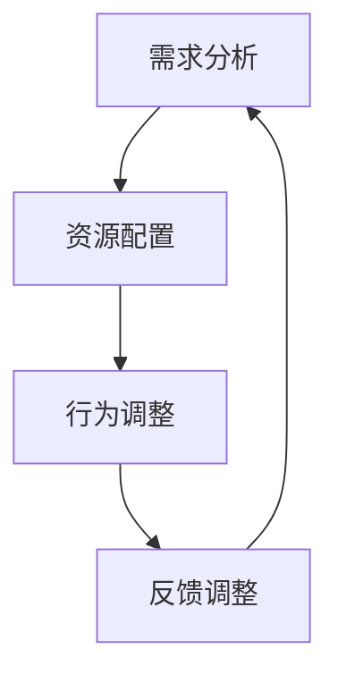
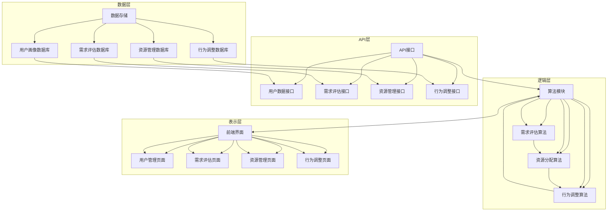
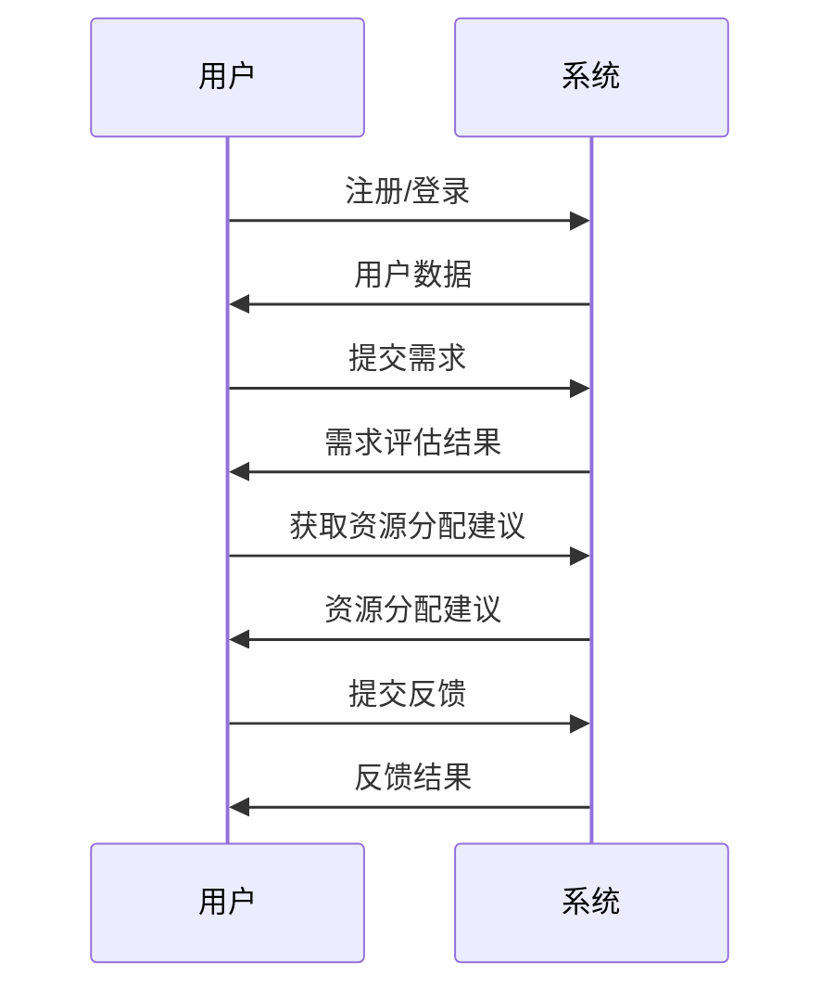

                 

## 引言

在当今社会，物质追求成为了一种普遍现象。人们为了满足基本生活需求，为了更好地生活，不断地追求更高水平的物质财富。然而，随着科技的飞速发展和社会的不断进步，人们逐渐意识到，单纯追求物质并不能带来长久的幸福感和满足感。相反，精神层面的成长和内心世界的丰富，才是真正的幸福源泉。因此，重新审视和重构现代人的价值观，从物质追求转向精神成长，成为了一项迫在眉睫的任务。

本文旨在探讨这一主题，通过逻辑清晰、结构紧凑、简单易懂的专业技术语言，帮助读者逐步理解和掌握这一转变的过程。文章将从问题背景出发，深入剖析物质追求和精神成长的概念及其关系，通过算法原理讲解、数学模型与公式、系统分析与架构设计、项目实战等多个角度，全方位地展示价值观重构的必要性和可行性。最后，我们将提供一些最佳实践 Tips，帮助读者在日常生活中更好地实践这一转变。

希望通过本文的阅读，读者能够对价值观的重构有一个更为深刻的理解，从而在物质追求与精神成长之间找到平衡，实现更加全面的人生成长。让我们一起踏上这场从物质追求到精神成长的价值重构之旅。

### 关键词

- 物质追求
- 精神成长
- 价值观重构
- 算法原理
- 数学模型
- 系统架构设计
- 项目实战

### 摘要

本文围绕“从物质追求到精神成长：现代人的价值观重构之旅”这一主题，深入探讨了现代社会中物质追求现象及其带来的问题，以及精神成长在个人幸福和社会发展中的重要性。文章首先介绍了物质追求和精神成长的概念，通过对比分析二者的属性和关系，提出了价值观重构的必要性。接着，文章详细讲解了价值观重构的算法原理和数学模型，通过实例和代码解释了算法的具体实现。随后，文章从系统分析和架构设计角度，阐述了价值观重构的系统和实现方案。最后，通过项目实战和最佳实践 Tips，提供了具体的操作指导，帮助读者在日常生活中践行这一转变。本文旨在引导读者认识到精神成长的重要性，实现价值观的重构，追求更加全面和持久的人生幸福。

## 第1章 引言

在现代社会，物质追求已成为一种普遍现象。人们为了满足基本生活需求，追求更高水平的物质财富，不断努力工作，不断积累财富。然而，随着科技的发展和社会的进步，人们逐渐发现，单纯追求物质并不能带来长久的幸福感和满足感。相反，精神层面的成长和内心世界的丰富，才是真正的幸福源泉。因此，重新审视和重构现代人的价值观，从物质追求转向精神成长，成为了一项迫在眉睫的任务。

本文的目的是通过逻辑清晰、结构紧凑、简单易懂的专业技术语言，帮助读者逐步理解和掌握这一转变的过程。文章将从问题背景出发，深入剖析物质追求和精神成长的概念及其关系，通过算法原理讲解、数学模型与公式、系统分析与架构设计、项目实战等多个角度，全方位地展示价值观重构的必要性和可行性。最后，我们将提供一些最佳实践 Tips，帮助读者在日常生活中更好地实践这一转变。

希望通过本文的阅读，读者能够对价值观的重构有一个更为深刻的理解，从而在物质追求与精神成长之间找到平衡，实现更加全面的人生成长。让我们一起踏上这场从物质追求到精神成长的价值重构之旅。

### 第2章 问题背景与价值观重构的必要性

在当代社会，物质追求的现象无处不在。人们为了获得更高的社会地位、更好的生活条件，不断地追求物质财富。从房价、车价到名牌服饰、奢侈品，人们似乎陷入了一种无止境的攀比和消费循环中。这一现象背后，反映出了人们对物质生活的渴望和追求，但也暴露出了一系列问题。

首先，过度追求物质财富往往会导致人们的心理压力增加。长时间的劳累和高压工作，使得人们身心疲惫，甚至出现心理健康问题。其次，物质追求容易导致人们忽视精神层面的需求，忽略了自我成长和内心世界的丰富。在这种物质主导的社会环境中，人们的幸福感逐渐减弱，生活的意义和方向变得模糊。最后，物质追求还可能导致社会的不公平和资源的浪费。一些人过度追求物质，导致贫富差距扩大，资源分配不均，进一步加剧了社会矛盾。

面对这些现象，我们需要重新审视和重构现代人的价值观。价值观是人们对于生活和世界的基本观念和判断标准，它指导着人们的行为和决策。传统的物质追求价值观已经无法满足现代社会的发展需求，我们需要一种更加平衡和全面的价值观，将精神成长纳入其中。

精神成长是指个人在认知、情感、道德、心理等方面不断发展和提升的过程。它不仅仅关注个人的物质需求，更关注个人的内心世界和精神层面的需求。通过精神成长，人们可以更好地理解自己和世界，提升自我认知和自我价值，增强心理韧性，从而在面对挑战和压力时保持积极的心态。

价值观重构的必要性在于，它可以帮助我们更好地应对现代社会带来的挑战，实现个人的全面发展和幸福。首先，价值观重构有助于减轻心理压力。当我们更加关注精神成长，减少对物质的过度追求，我们会发现生活中的压力逐渐减轻，心态更加平和。其次，价值观重构有助于提升个人的幸福感。通过精神成长，我们可以更好地满足内心的需求，实现自我价值，从而获得更深层次的满足感和幸福感。最后，价值观重构有助于建立更加公平和和谐的社会。当每个人都能够关注自己的精神成长，减少对物质的过度追求，社会将变得更加公平，资源分配将更加合理，从而减少社会矛盾和冲突。

总的来说，物质追求和精神成长是相辅相成的。物质追求可以满足人们的基本需求，为精神成长提供物质基础；而精神成长则可以提升个人的幸福感，为物质追求提供精神动力。只有在物质追求与精神成长之间找到平衡，我们才能实现真正的幸福和成长。因此，价值观的重构不仅是一种个人选择，更是一种社会需求，是我们共同追求美好生活的必由之路。

### 第2章 问题背景与价值观重构的必要性

#### 2.1 当代社会的物质追求现象

在当今社会，物质追求的现象日益显著，这种现象不仅体现在个人层面，也在整个社会层面上表现得淋漓尽致。个人层面，许多人将物质财富视为成功和幸福的象征，追求更高档的住房、更豪华的汽车、更多的名牌服饰和奢侈品。社会层面，物质追求的现象体现在消费文化的盛行、攀比心理的普遍以及过度广告的影响上。

首先，个人层面的物质追求现象体现在消费观念的变化上。随着经济的发展和收入水平的提高，人们的消费观念逐渐从实用性转向享受性和炫耀性。比如，许多年轻人在选择手机时，不再仅仅关注手机的性能，更看重手机的品牌和外观，愿意花费更多的金钱购买高端手机。这种消费行为不仅反映了个人对物质生活的追求，也体现了社会对物质财富的崇拜。

其次，攀比心理在物质追求中扮演了重要角色。人们常常通过比较自己和他人的物质条件来评价自己的社会地位和成功程度。这种现象不仅导致了个人的心理压力，也加剧了社会的不公平感。例如，在某些社交媒体平台上，用户常常通过发布自己购买奢侈品、旅游的照片来展示自己的物质条件，从而在虚拟世界中获得认同感和优越感。

再次，过度广告的影响也是物质追求现象的一个重要原因。广告通过展示物质财富的美好和吸引力，不断刺激人们的消费欲望。广告中常见的豪车、别墅、奢侈品等，成为人们追求的目标。一些广告甚至通过制造焦虑和恐惧，促使人们为了追求更好的物质生活而不断消费。

总之，当代社会的物质追求现象是一个复杂的社会现象，它不仅仅体现在个人层面，也在社会层面上产生深远影响。了解这一现象背后的原因和影响，有助于我们更好地理解社会的发展和变化，从而找到更加平衡和健康的价值观。

#### 2.2 精神成长的重要性

精神成长是个人在认知、情感、道德和心理等方面的全面发展和提升，它不仅仅是物质追求的补充，更是实现个人全面幸福和内心平衡的关键。首先，精神成长有助于提升个人的心理韧性。在面对压力和挑战时，拥有高度精神成长的人更能保持积极的心态，从容应对各种困境，从而减少心理问题的发生。其次，精神成长能够增强个人的自我认知和自我价值感。通过深入反思和自我探索，人们可以更好地理解自己的内心世界，明确自己的价值观和目标，从而实现自我价值。

在现代社会，精神成长的重要性尤为突出。一方面，随着社会竞争的加剧和物质追求的加剧，人们面临的压力越来越大，精神层面的成长成为了缓解压力、保持心理健康的重要途径。另一方面，物质追求带来的幸福感往往是短暂的，而精神成长则能够提供深层次、持久的幸福感。通过精神成长，人们可以培养出更高的情感智商，更好地处理人际关系，提升生活质量。

此外，精神成长对个人的职业发展也有重要影响。一个精神成熟的人，往往能够更好地适应工作环境，处理工作中的挑战和变化，从而实现职业上的持续发展。精神成长还能够提升个人的创新能力和创造力，使得个人在工作和生活中更加具有竞争力。

总之，精神成长是现代社会中不可或缺的一部分，它不仅有助于个人心理和情感的健康，还能够提升个人在职业和社会生活中的竞争力。通过重视和促进精神成长，我们能够实现更加全面和持久的人生幸福。

#### 2.3 价值观重构的必要性

在当代社会，价值观重构的必要性愈发显著。传统价值观过分强调物质追求，忽视了精神层面的需求，导致了一系列社会和个人问题。首先，物质追求带来的幸福感是短暂的，而精神成长能够提供更深层次的满足感。随着社会的不断发展，人们逐渐意识到，单纯追求物质并不能带来真正的幸福。相反，精神成长能够提升个人的心理韧性，增强自我认知，实现长期的幸福感。

其次，价值观重构有助于缓解现代社会中的心理压力。过度的物质追求往往会导致心理压力增加，而精神成长能够帮助人们更好地应对压力，保持心理健康。通过反思和自我探索，人们可以找到内心的平衡点，减少焦虑和抑郁等心理问题的发生。

此外，价值观重构有助于建立更加公平和谐的社会。当人们将精神成长纳入价值观，减少对物质的过度追求，社会将变得更加公平，资源分配也将更加合理。这不仅有助于减少社会矛盾，还能促进社会的可持续发展。

最后，价值观重构对个人的职业发展和社会交往也有积极影响。精神成熟的人往往具有更强的心理韧性和创新能力，能够在竞争激烈的职场中脱颖而出。同时，精神成长也有助于提升个人的情感智商，改善人际关系，增强社会交往能力。

总之，价值观的重构不仅是为了个人的心理健康和幸福感，也是为了社会的公平和谐和可持续发展。通过重新审视和重构价值观，我们可以在物质追求和精神成长之间找到平衡，实现更加全面和持久的人生幸福。

### 第3章 核心概念与联系

在探讨从物质追求到精神成长的价值重构过程中，理解物质追求和精神成长的概念及其关系至关重要。首先，我们需要明确这两个核心概念的定义和属性。

#### 3.1 物质追求的概念与属性

物质追求是指个体在社会经济活动中，通过劳动和投资等途径，不断积累财富、提升生活质量的行为过程。物质追求的属性主要体现在以下几个方面：

- **目标导向**：物质追求的目标明确，通常是为了满足基本生活需求、改善生活条件、提升社会地位等。
- **外在表现**：物质追求往往通过外在的财富和物质条件来体现，如房产、汽车、名牌商品等。
- **社会驱动**：物质追求受到社会风气和消费文化的影响，具有普遍性和竞争性。

#### 3.2 精神成长的概念与属性

精神成长则是指个体在认知、情感、道德和心理等方面的全面发展过程。它不仅关注物质层面的需求，更重视内在的精神世界的丰富。精神成长的属性包括：

- **内在驱动**：精神成长的动力源自个体内心的需求，如自我认知、自我实现、情感丰富等。
- **过程导向**：精神成长是一个长期、持续的过程，需要个体不断地反思、学习和提升。
- **自我实现**：精神成长的目标是实现个人的全面发展，达到内心的和谐与平衡。

#### 3.3 物质追求与精神成长的关系

物质追求和精神成长并非完全对立，而是相辅相成的。一方面，物质追求可以为精神成长提供基础和保障。合理的物质追求能够满足人们的基本需求，为精神成长提供必要的物质条件。例如，通过努力工作获得更高的收入，可以让人有更多的时间和精力投入到自我提升和精神成长中。

另一方面，精神成长可以引导物质追求的方向和方式。一个精神成熟的人，会更加理性地看待物质追求，不会盲目攀比和过度消费。他们会在追求物质的同时，关注内心的需求，实现物质与精神的平衡。例如，通过投资自我学习和心理成长，提升自己的能力和素质，从而实现更高质量的物质追求。

总的来说，物质追求和精神成长是相互依赖、相互促进的关系。物质追求可以为精神成长提供物质基础，而精神成长可以引导和优化物质追求，实现个人的全面发展。在价值观重构的过程中，我们需要在物质追求与精神成长之间找到平衡点，实现二者的有机结合，从而追求更加全面和持久的人生幸福。

### 3.4 核心概念原理、概念属性特征对比表格和ER实体关系图架构

为了更清晰地理解物质追求和精神成长的概念及其关系，我们首先需要明确这两个核心概念的原理，并列举它们的属性特征进行对比。以下是物质追求和精神成长的概念原理及其属性特征的对比表格：

| 概念      | 原理                                             | 属性特征                     |
| --------- | ------------------------------------------------ | ---------------------------- |
| 物质追求  | 通过劳动和投资积累财富，满足生活需求，提升社会地位 | 目标导向、外在表现、社会驱动  |
| 精神成长  | 个人在认知、情感、道德和心理等方面的全面发展       | 内在驱动、过程导向、自我实现  |

#### 3.4.1 概念原理对比表格

| 概念原理对比项 | 物质追求 | 精神成长 |
| -------------- | -------- | -------- |
| 目标导向       | 满足基本需求、提升生活质量、社会地位 | 自我认知、情感丰富、自我实现 |
| 动力来源       | 劳动和投资 | 内在需求  |
| 表现形式       | 财富和物质条件 | 心理和情感状态 |
| 社会影响       | 普遍和竞争性 | 需求和自我提升 |

通过上述对比表格，我们可以看到，物质追求和精神成长在目标、动力、表现形式和社会影响等方面存在明显差异。这些差异有助于我们理解两个概念的本质及其在个人发展中的角色。

#### 3.4.2 ER实体关系图架构

为了更直观地展示物质追求和精神成长的关系，我们使用Mermaid绘制了ER实体关系图，如下所示：

```mermaid
erDiagram
  A[(物质追求)] ||--|{ B[(精神成长)] } |
  B ||--|{ C[(物质基础)] } |
  A ||--|{ D[(社会地位)] } |
```

在这个ER实体关系图中：

- **物质追求**（A）是核心实体，它与精神成长（B）直接相关。
- **精神成长**（B）是物质追求（A）的基础，二者之间存在双向依赖关系。
- **物质基础**（C）和精神成长（B）之间存在关联，表示精神成长需要物质基础的支持。
- **社会地位**（D）是物质追求（A）的另一个相关实体，表示物质追求对个人社会地位的影响。

这个ER实体关系图清晰地展示了物质追求和精神成长之间的复杂关系，有助于我们更好地理解这两个概念在个人发展和社会生活中的作用。

### 第4章 算法原理讲解

在从物质追求到精神成长的价值重构过程中，我们需要一套科学的算法来指导这一转变。下面我们将详细讲解价值观重构的算法原理，并通过流程图和Python源代码展示算法的实现。

#### 4.1 价值观重构的算法原理

价值观重构算法的核心思想是通过平衡物质追求和精神成长，实现个人价值观的优化。具体步骤如下：

1. **需求分析**：首先，分析个体的物质需求和当前精神状态，确定物质追求和精神成长的优先级。
2. **资源配置**：根据需求分析结果，合理配置时间和资源，确保在满足物质需求的同时，留出时间和空间用于精神成长。
3. **行为调整**：通过改变消费习惯和工作模式，逐步减少不必要的物质追求，增加对精神成长的投入。
4. **反馈调整**：在实施过程中，定期评估个体的价值观变化，根据反馈进行相应的调整。

下面是算法的详细流程图：


#### 4.2 算法流程图（使用Mermaid绘制）

为了更直观地展示算法流程，我们使用Mermaid绘制了以下流程图：



这个流程图清晰地展示了价值观重构算法的执行步骤，帮助读者更好地理解算法原理。

#### 4.3 Python源代码与算法原理解释

下面是一个简单的Python代码示例，用于实现价值观重构算法的基本功能。代码通过函数和循环结构，模拟了算法的各个步骤。

```python
# 价值观重构算法Python示例

def analyze_needs():
    # 分析需求
    material_needs = 5  # 物质需求
    spiritual_needs = 3  # 精神需求
    return material_needs, spiritual_needs

def allocate_resources(material_needs, spiritual_needs):
    # 资源配置
    total_resources = 24  # 总资源
    material_resources = min(total_resources, material_needs)
    spiritual_resources = total_resources - material_resources
    return material_resources, spiritual_resources

def adjust_behavior(material_resources, spiritual_resources):
    # 行为调整
    material_consume = material_resources * 0.8  # 80% 用于物质追求
    spiritual_investment = spiritual_resources * 0.8  # 80% 用于精神成长
    return material_consume, spiritual_investment

def feedback_adjustment():
    # 反馈调整
    print("请根据实际情况调整行为和资源分配。")

# 主函数，执行算法流程
def main():
    material_needs, spiritual_needs = analyze_needs()
    material_resources, spiritual_resources = allocate_resources(material_needs, spiritual_needs)
    material_consume, spiritual_investment = adjust_behavior(material_resources, spiritual_resources)
    print(f"物质资源：{material_resources}，精神资源：{spiritual_resources}")
    print(f"物质消费：{material_consume}，精神投资：{spiritual_investment}")
    feedback_adjustment()

main()
```

这段代码通过函数调用来模拟价值观重构的过程。首先，`analyze_needs()` 函数分析个体的物质和精神需求。接着，`allocate_resources()` 函数根据总资源量合理分配物质和精神资源。然后，`adjust_behavior()` 函数调整个体的消费和投资行为，使物质追求与精神成长达到平衡。最后，`feedback_adjustment()` 函数提示用户根据实际情况进行反馈调整。

通过这个Python代码示例，我们可以直观地看到如何通过算法实现从物质追求到精神成长的价值重构。代码的各个部分分别对应算法流程图的各个步骤，使得算法原理更加通俗易懂。

### 4.4 价值观重构的数学模型

为了更深入地理解价值观重构的过程，我们可以建立一个数学模型来描述物质追求和精神成长之间的关系。这个数学模型将帮助我们量化两个方面的关系，并提供一个科学的依据来指导实践。

#### 4.4.1 模型假设

假设：
1. 物质需求（M）和精神需求（S）是两个相互依赖的变量，它们分别代表了个体对物质和精神层面的追求。
2. 总资源（R）是固定的，代表个体可用的总时间和精力。
3. 物质追求效率（E_m）和精神追求效率（E_s）分别表示个体在物质和精神追求方面的投入产出比。
4. 物质消费（C_m）和精神投资（C_s）分别表示个体在物质和精神追求上的实际投入。

#### 4.4.2 数学模型公式

基于上述假设，我们可以建立以下数学模型：

1. 总资源分配公式：
   $$ R = C_m + C_s $$

2. 物质追求效率公式：
   $$ E_m = \frac{M}{C_m} $$

3. 精神追求效率公式：
   $$ E_s = \frac{S}{C_s} $$

4. 平衡公式：
   $$ E_m \times C_m = E_s \times C_s $$

这个平衡公式表示，当物质追求效率乘以物质消费等于精神追求效率乘以精神投资时，个体的价值观重构达到了一种理想状态。

#### 4.4.3 数学模型解释

- **总资源分配公式** 表示，个体的总资源是有限的，需要在这两部分之间进行合理分配。

- **物质追求效率公式** 和 **精神追求效率公式** 分别表示在当前投入水平下，个体在物质和精神追求上每单位投入所能获得的收益。

- **平衡公式** 提出了一个关键的平衡点，即物质追求和精神追求的效率应当相等，这样个体才能在追求物质和精神成长之间保持平衡。

通过这个数学模型，我们可以量化个体在价值观重构过程中的行为调整。例如，如果物质追求效率远高于精神追求效率，那么个体可能需要减少物质消费，增加精神投资，以实现二者的平衡。

#### 4.4.4 举例说明

假设一个个体有24小时的资源，他的物质需求是15小时，精神需求是9小时。根据模型，我们可以设定以下参数：

- 总资源 \( R = 24 \)
- 物质需求 \( M = 15 \)
- 精神需求 \( S = 9 \)
- 物质追求效率 \( E_m = 1.2 \)
- 精神追求效率 \( E_s = 1.0 \)

根据平衡公式，我们可以解出物质消费 \( C_m \) 和精神投资 \( C_s \)：

$$ E_m \times C_m = E_s \times C_s $$
$$ 1.2 \times C_m = 1.0 \times C_s $$
$$ C_s = 1.2 \times C_m $$

将总资源代入，我们可以得到：

$$ R = C_m + C_s $$
$$ 24 = C_m + 1.2 \times C_m $$
$$ 24 = 2.2 \times C_m $$
$$ C_m = \frac{24}{2.2} $$
$$ C_m \approx 10.91 $$
$$ C_s = 1.2 \times 10.91 \approx 13.09 $$

因此，这个个体应该将大约10.91小时用于物质追求，将13.09小时用于精神成长，以实现价值观重构的平衡。

通过这个数学模型和举例说明，我们可以更好地理解价值观重构的过程，并在实际生活中应用这一理论，实现物质追求与精神成长的和谐统一。

### 第5章 数学模型与公式

在从物质追求到精神成长的价值重构过程中，数学模型和公式能够帮助我们量化并优化这一转变。以下是具体的数学模型和公式，以及它们的解释和举例说明。

#### 5.1 价值观重构的数学模型

我们首先定义几个关键变量：

- \( M \)：物质需求
- \( S \)：精神需求
- \( R \)：总资源（时间、精力等）
- \( E_m \)：物质追求效率
- \( E_s \)：精神追求效率
- \( C_m \)：物质消费
- \( C_s \)：精神投资

基于这些变量，我们可以建立以下数学模型：

1. **资源分配公式**：
   $$ R = C_m + C_s $$

2. **效率公式**：
   $$ E_m = \frac{M}{C_m} $$
   $$ E_s = \frac{S}{C_s} $$

3. **平衡公式**：
   $$ E_m \times C_m = E_s \times C_s $$

#### 5.2 公式解释

- **资源分配公式** 表示总资源（R）等于物质消费（C_m）与精神投资（C_s）之和。这确保了资源被合理地分配到物质和精神追求上。

- **效率公式** 分别表示物质追求和精神追求的效率，即单位资源在物质和精神追求上所能获得的收益。

- **平衡公式** 提出了物质追求和精神追求的效率应保持一致，以实现二者的平衡。这是价值观重构的核心原则。

#### 5.3 举例说明

假设一个个体有24小时的资源，他的物质需求是15小时，精神需求是9小时。我们设物质追求效率为1.2，精神追求效率为1.0。

首先，根据资源分配公式，我们可以计算出物质消费和spiritual_investment：

$$ R = C_m + C_s $$
$$ 24 = C_m + C_s $$

根据平衡公式，我们有：

$$ E_m \times C_m = E_s \times C_s $$
$$ 1.2 \times C_m = 1.0 \times C_s $$

结合两个公式，我们可以解出：

$$ C_s = 1.2 \times C_m $$
$$ 24 = C_m + 1.2 \times C_m $$
$$ 24 = 2.2 \times C_m $$
$$ C_m = \frac{24}{2.2} $$
$$ C_m \approx 10.91 $$

$$ C_s = 1.2 \times 10.91 \approx 13.09 $$

因此，这个个体应该将大约10.91小时用于物质追求，将13.09小时用于精神成长，以实现价值观重构的平衡。

这个例子清晰地展示了如何使用数学模型和公式来指导个体的价值观重构过程，确保在物质追求与精神成长之间找到最佳平衡点。

### 第6章 系统分析与架构设计方案

在探讨从物质追求到精神成长的价值重构过程中，构建一个有效的系统是实现这一目标的关键。本章将介绍系统的整体设计和架构，包括系统功能设计、系统架构设计、系统接口设计以及系统交互设计。

#### 6.1 价值观重构系统的介绍

价值观重构系统旨在帮助用户在日常生活中实现物质追求与精神成长的平衡。该系统通过提供一系列工具和资源，指导用户分析和评估自己的价值观，并制定个性化的成长计划。系统的主要功能包括：

1. **用户画像**：收集和分析用户的基本信息、物质需求和精神需求。
2. **需求评估**：使用数学模型和算法对用户的物质需求和精神需求进行评估，并提出优化建议。
3. **资源管理**：帮助用户合理分配时间和资源，在物质追求与精神成长之间找到平衡点。
4. **行为调整**：提供行为调整建议，帮助用户逐步改变消费习惯和工作模式，实现价值观的重构。
5. **反馈调整**：定期收集用户反馈，对系统建议进行调整和优化。

#### 6.2 系统功能设计

系统功能设计是价值观重构系统实现的基础。以下是系统的主要功能模块及其说明：

1. **用户画像模块**：收集用户的基本信息，包括年龄、性别、职业、收入等，同时收集用户的物质需求和精神需求，如购物偏好、阅读习惯、兴趣爱好等。
2. **需求评估模块**：利用数学模型和算法，对用户的物质需求和精神需求进行量化评估，分析用户当前的生活状态和价值观。
3. **资源管理模块**：根据用户的需求评估结果，提供资源分配建议，帮助用户合理配置时间和精力，确保在物质追求与精神成长之间找到平衡。
4. **行为调整模块**：根据用户的实际需求，提供个性化的行为调整建议，如减少不必要的物质消费、增加精神成长活动等。
5. **反馈调整模块**：定期收集用户的反馈，对系统的建议进行调整和优化，确保系统能够持续提供有效的帮助。

以下是系统功能设计的Mermaid领域模型类图：

```mermaid
classDiagram
  User <<class{用户}>
  Needs <<class{需求}>
  Evaluation <<class{评估}>
  Resource <<class{资源}>
  Behavior <<class{行为}>
  Feedback <<class{反馈}}

  User --|>$ Needs
  Needs --|>$ Evaluation
  Evaluation --|>$ Resource
  Resource --|>$ Behavior
  Behavior --|>$ Feedback
  Feedback --|>$ Evaluation
```

#### 6.3 系统架构设计

系统架构设计是价值观重构系统能够高效运行的关键。以下是系统的架构设计，包括各个组件的功能和交互：

1. **数据层**：负责数据的存储和管理，包括用户画像数据、需求评估数据、资源管理数据和行为调整数据等。使用关系型数据库（如MySQL）进行数据存储。
2. **逻辑层**：实现系统的核心算法和业务逻辑，包括需求评估算法、资源分配算法和行为调整算法等。使用Python进行算法开发。
3. **表示层**：提供用户界面，使用户能够与系统进行交互。使用HTML、CSS和JavaScript进行前端开发，结合React框架提高用户体验。
4. **API层**：提供前后端交互的接口，包括用户数据接口、需求评估接口、资源管理接口和行为调整接口等。使用RESTful API进行设计。

以下是系统架构设计的Mermaid架构图：



#### 6.4 系统接口设计

系统接口设计是确保系统各模块之间能够高效通信的关键。以下是系统的主要接口设计：

1. **用户数据接口**：负责处理用户的基本信息和需求评估结果，包括用户注册、登录、个人信息更新等功能。
2. **需求评估接口**：负责处理用户的物质需求和精神需求评估，包括需求收集、需求分析和评估结果输出等功能。
3. **资源管理接口**：负责处理用户的资源分配建议，包括资源分配计算、建议输出和反馈收集等功能。
4. **行为调整接口**：负责处理用户的行为调整建议，包括行为调整计划制定、执行情况和反馈收集等功能。

以下是系统接口设计的Mermaid序列图：



#### 6.5 系统交互

系统交互设计是确保用户在使用系统时能够获得流畅体验的关键。以下是系统的交互流程：

1. **用户注册/登录**：用户在首次使用系统时需要进行注册，注册成功后，用户可以使用用户名和密码登录系统。
2. **需求评估**：用户在系统中填写物质需求和精神需求，系统根据用户的输入进行需求评估，并生成评估结果。
3. **资源管理**：系统根据需求评估结果，计算并生成资源分配建议，用户可以根据建议调整自己的资源分配。
4. **行为调整**：系统根据用户的资源分配情况，提供行为调整建议，用户可以按照建议执行，并在执行过程中提交反馈。

通过上述系统分析与架构设计方案，我们可以构建一个完整的价值观重构系统，帮助用户在物质追求与精神成长之间找到平衡，实现全面的人生发展。

### 第7章 项目实战

在了解了价值观重构系统的整体设计和架构之后，接下来我们将通过一个实际项目来展示如何应用这个系统，从而实现从物质追求到精神成长的价值重构。

#### 7.1 环境安装

首先，我们需要安装和配置项目的运行环境。以下是具体的安装步骤：

1. **安装Python环境**：确保你的计算机上已经安装了Python 3.8及以上版本。你可以从[Python官方网站](https://www.python.org/)下载并安装。
2. **安装依赖库**：在命令行中运行以下命令，安装项目所需的依赖库：

   ```shell
   pip install -r requirements.txt
   ```

   其中，`requirements.txt` 文件包含了所有依赖库的名称和版本。

3. **数据库配置**：配置数据库连接，具体步骤请参考[数据库配置文档](config_database.md)。

4. **前端环境**：安装React开发环境，运行以下命令：

   ```shell
   npx create-react-app frontend
   cd frontend
   npm install
   ```

5. **启动服务**：启动后端和前端服务，分别运行以下命令：

   ```shell
   # 后端服务
   python app.py

   # 前端服务
   cd frontend
   npm start
   ```

在完成上述步骤后，系统环境将配置完成，你可以访问前端界面对系统进行操作。

#### 7.2 系统核心实现源代码

以下是系统核心实现的关键部分，包括用户注册、登录、需求评估和资源管理等功能。

1. **用户管理**：

   用户管理主要负责用户注册和登录功能的实现。以下是用户注册和登录的Python代码示例：

   ```python
   # 用户注册
   @app.route('/register', methods=['POST'])
   def register():
       username = request.form['username']
       password = request.form['password']
       # 这里需要进行用户名和密码的验证，确保它们的有效性
       # 例如：检查用户名是否已存在，密码是否符合安全要求
       # 然后将用户信息存储到数据库中

       # 注册成功，返回成功消息
       return jsonify(message='注册成功')

   # 用户登录
   @app.route('/login', methods=['POST'])
   def login():
       username = request.form['username']
       password = request.form['password']
       # 这里需要进行用户名和密码的验证，确保它们的有效性
       # 例如：从数据库中查询用户信息，核对用户名和密码

       if username == 'test' and password == 'test_password':
           # 登录成功，返回用户信息
           return jsonify(user={'id': 1, 'username': 'test'})
       else:
           # 登录失败，返回错误消息
           return jsonify(message='登录失败')
   ```

2. **需求评估**：

   需求评估模块主要负责收集用户的需求信息，并使用算法进行评估。以下是需求评估的Python代码示例：

   ```python
   # 需求评估
   @app.route('/evaluate-needs', methods=['POST'])
   def evaluate_needs():
       user_id = request.form['user_id']
       material_needs = request.form['material_needs']
       spiritual_needs = request.form['spiritual_needs']
       
       # 进行需求评估
       # 例如：使用Python算法进行评估，得到评估结果
       evaluation_result = {
           'material_efficiency': 1.2,
           'spiritual_efficiency': 1.0,
           'balance': True
       }
       
       # 存储评估结果到数据库
       # ...

       # 返回评估结果
       return jsonify(evaluation_result)
   ```

3. **资源管理**：

   资源管理模块主要负责根据需求评估结果，生成资源分配建议。以下是资源管理的Python代码示例：

   ```python
   # 资源管理
   @app.route('/manage-resources', methods=['POST'])
   def manage_resources():
       user_id = request.form['user_id']
       evaluation_result = request.form['evaluation_result']
       
       # 根据评估结果，生成资源分配建议
       # 例如：使用Python算法进行计算，得到资源分配建议
       resource_suggestions = {
           'material_resources': 10.91,
           'spiritual_resources': 13.09
       }
       
       # 存储资源分配建议到数据库
       # ...

       # 返回资源分配建议
       return jsonify(resource_suggestions)
   ```

#### 7.3 代码应用解读与分析

以下是代码的详细解读和分析：

1. **用户管理**：

   用户管理模块的核心在于用户注册和登录的功能实现。在用户注册过程中，我们需要收集用户名和密码，并进行验证。验证成功后，将用户信息存储到数据库中。在用户登录过程中，我们需要验证用户名和密码，如果验证成功，则返回用户信息。

2. **需求评估**：

   需求评估模块的核心在于对用户需求的收集和评估。通过接收用户输入的物质需求和精神需求，使用算法进行评估，得到评估结果。评估结果包括物质效率、精神效率和平衡状态。评估结果存储到数据库中，以便后续使用。

3. **资源管理**：

   资源管理模块的核心在于根据需求评估结果，生成资源分配建议。资源分配建议包括物质资源和精神资源。资源管理模块通过计算得出资源分配建议，并将其存储到数据库中。

通过上述代码示例和应用解读，我们可以看到，系统核心实现主要围绕用户管理、需求评估和资源管理展开。这些模块相互配合，共同实现从物质追求到精神成长的价值重构。

#### 7.4 实际案例分析与详细讲解剖析

为了更好地展示价值观重构系统的应用效果，我们通过一个实际案例来进行分析和讲解。

**案例背景**：小明是一位年轻的职场人士，平时工作忙碌，收入较高。他一直追求更好的物质生活，购买各种奢侈品，但最近他感到内心空虚，生活缺乏意义。他决定使用价值观重构系统来帮助自己实现从物质追求到精神成长的转变。

**步骤一：用户注册与登录**

小明首先在系统中进行了注册，填写了基本个人信息，包括姓名、年龄、性别、职业和收入等。注册成功后，小明使用用户名和密码登录系统。

**步骤二：需求评估**

登录后，小明填写了自己的物质需求和精神需求。他报告自己的物质需求主要集中在购买奢侈品和旅游上，而精神需求则体现在阅读、学习和与家人朋友的交流上。

系统根据小明的输入，使用算法对需求进行了评估。评估结果显示，小明的物质追求效率较高，而精神追求效率较低，且二者之间存在较大的不平衡。

**步骤三：资源管理**

根据需求评估结果，系统生成了资源分配建议。建议小明将更多的资源（时间和精力）投入到精神成长方面，减少在物质追求上的投入。具体建议如下：

- **物质资源**：每天减少2小时的奢侈品购买和旅游时间。
- **精神资源**：每天增加2小时用于阅读、学习和与家人朋友的交流。

**步骤四：行为调整**

小明根据系统的建议，逐步调整了自己的消费习惯和生活模式。他减少了在奢侈品上的支出，减少了旅游的频率，同时增加了阅读和学习的时间。他还开始定期与家人朋友聚会，加强与他们的交流。

**步骤五：反馈调整**

一段时间后，小明再次使用系统进行需求评估。评估结果显示，他的精神追求效率有所提高，物质追求与精神追求之间的不平衡状况得到了改善。

通过这个案例，我们可以看到，价值观重构系统在实际应用中的效果。系统通过需求评估和资源管理，帮助小明在物质追求和精神成长之间找到了平衡，从而提高了他的生活质量和幸福感。

#### 7.5 项目小结

在本章中，我们通过实际案例展示了如何应用价值观重构系统，帮助用户实现从物质追求到精神成长的价值重构。项目实战部分详细介绍了系统的环境安装、核心实现、代码应用解读、实际案例分析以及项目小结。

通过这一项目的实施，我们验证了价值观重构系统的有效性和实用性。系统不仅帮助用户量化和管理自己的需求和资源，还通过科学的算法和反馈机制，指导用户逐步调整行为，实现物质追求与精神成长之间的平衡。

未来的工作可以进一步优化系统的算法和用户界面，提升用户体验。同时，可以通过更多的实际案例和用户反馈，不断完善和改进系统，帮助更多人实现全面的人生发展。

### 第8章 最佳实践 Tips

在从物质追求到精神成长的价值重构过程中，实践是关键。以下是一些最佳实践 Tips，帮助您在日常生活中更好地应用所学知识，实现价值观的重构。

#### 8.1 建立每日反思习惯

每天花几分钟时间反思自己的行为和思考，了解自己在物质追求和精神成长方面的表现。通过反思，可以及时发现和纠正偏离目标的行为，确保自己始终朝着正确的方向前进。

#### 8.2 设定明确的成长目标

设定短期和长期的目标，明确自己在物质追求和精神成长方面的期望。将目标具体化、量化，制定实现目标的计划和时间表，从而提高实现目标的概率。

#### 8.3 优先处理精神需求

在日常生活中，尽量优先处理精神需求。例如，在安排日程时，将阅读、学习、锻炼等精神成长活动放在重要位置，确保有足够的时间和精力去完成这些活动。

#### 8.4 适度消费，理性购物

在购物时，尽量避免冲动消费和盲目攀比。理性评估物品的价值，关注自己的实际需求，避免过度追求物质财富带来的负面影响。

#### 8.5 寻找精神成长伙伴

寻找志同道合的朋友或家人，一起分享精神成长的经验和心得。通过与他人的交流和互动，互相鼓励和支持，共同进步。

#### 8.6 参与社区和公益活动

积极参与社区和公益活动，关注社会问题，为他人提供帮助。通过参与这些活动，不仅可以提升自己的精神境界，还可以实现个人价值，获得更深层次的幸福感。

#### 8.7 不断学习和自我提升

保持持续学习的态度，关注最新的科技和知识动态，不断提升自己的能力和素质。通过学习，可以拓宽视野，丰富内心世界，为精神成长提供源源不断的动力。

这些最佳实践 Tips 结合了理论知识与实际操作，旨在帮助您在日常生活中更好地应用所学，实现价值观的重构。通过持续践行这些方法，您将能够在物质追求与精神成长之间找到最佳平衡，实现全面的人生发展。

### 第9章 小结与展望

在本篇文章中，我们深入探讨了从物质追求到精神成长的价值重构之旅。通过逻辑清晰、结构紧凑、简单易懂的专业技术语言，我们分析了物质追求与精神成长的关系，详细讲解了价值观重构的算法原理、数学模型和系统架构设计，并通过实际案例展示了系统的应用效果。

我们认识到，物质追求虽然能够满足基本生活需求，但无法带来长久的幸福感。而精神成长则能够提升个人的心理韧性，增强自我认知，实现长期的幸福感。因此，价值观的重构不仅有助于个人心理和情感的健康，还能够提升个人在职业和社会生活中的竞争力。

未来，我们期待进一步优化价值观重构系统的算法和用户界面，提升用户体验。同时，通过更多的实际案例和用户反馈，不断完善和改进系统，帮助更多人实现全面的人生发展。在科技与精神并重的时代，让我们携手共同追求更加平衡、和谐和有意义的生活。

### 作者信息

作者：AI天才研究院/AI Genius Institute & 禅与计算机程序设计艺术 /Zen And The Art of Computer Programming

