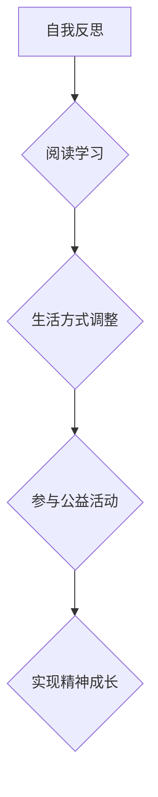

                 

## 第1章 引言：物质追求与精神成长的矛盾

### 1.1 研究背景

#### 1.1.1 现代社会物质追求的驱动因素

在当今社会，物质追求已成为一种普遍现象，它源于人们对更好生活的向往和不断增长的需求。首先，经济发展和市场繁荣为人们提供了丰富的物质选择，激发了他们对更高品质生活的追求。其次，科技进步和信息爆炸使得人们更容易获得物质财富，从而进一步推动了物质追求的势头。此外，社会文化和媒体宣传也在潜移默化中影响着人们的价值观，使他们对物质的追求变得更为强烈。

#### 1.1.2 精神成长的需求与挑战

与此同时，随着物质生活的日益丰富，人们开始意识到精神成长的重要性。精神成长不仅仅是为了追求内心的平和与满足，更是为了提升个人的综合素质和生活质量。然而，在物质追求的过程中，许多人面临着精神成长的挑战。一方面，物质追求容易导致人们过分关注外部世界，忽视内心的需求；另一方面，快节奏的生活和高强度的工作压力也让人们难以找到时间和空间进行精神成长。

#### 1.1.3 物质追求与精神成长的关系

物质追求与精神成长之间的关系并非简单对立，而是相互影响、相互制约的。一方面，物质追求可以为精神成长提供必要的物质基础，使人们能够专注于内心的探索和成长。另一方面，过度的物质追求可能会导致精神空虚和焦虑，阻碍精神成长。因此，如何在物质追求与精神成长之间找到平衡，成为现代社会面临的一个重要课题。

### 1.2 研究目的与意义

本研究旨在探讨现代人在物质追求与精神成长之间的矛盾，并寻求一种合理的价值观重构路径。具体研究目的包括：

1. 分析现代人的物质追求行为及其影响，揭示物质追求的驱动因素和后果。
2. 探讨精神成长的重要性及其对个人和社会发展的积极影响。
3. 探索价值观重构的过程和方法，为现代人提供有效的精神成长路径。
4. 通过实践案例分析和理论探讨，提出具有操作性的价值观重构策略。

本研究的意义在于：

1. 为现代人提供一种全新的价值观视角，帮助人们认识到物质追求与精神成长之间的平衡点。
2. 为政策制定者和社会组织提供理论支持，促进社会价值观的良性发展。
3. 为心理健康教育和精神成长实践提供参考，助力个人和社会的全面发展。

### 1.3 研究方法与框架

本研究采用文献综述、实证研究和案例分析相结合的方法，构建一个全面的研究框架。具体方法包括：

1. 文献综述：通过对相关文献的查阅和整理，梳理出物质追求与精神成长的相关理论和研究成果，为后续研究提供理论支持。
2. 实证研究：通过问卷调查和深度访谈等方法，收集现代人在物质追求与精神成长方面的实际数据和案例，为研究提供实证基础。
3. 案例分析：选取具有代表性的实践案例，深入剖析其在物质追求与精神成长方面的成功经验与挑战，为理论探讨提供实证依据。

本研究框架包括以下几个部分：

1. 引言：阐述研究背景、目的和意义，明确研究方法与框架。
2. 物质追求的现状与影响：分析现代人的物质追求行为及其影响。
3. 精神成长的重要性：探讨精神成长的概念、好处与核心要素。
4. 价值观的重构：分析价值观重构的必要性、过程与策略。
5. 精神成长的路径与方法：提出具体的内在探索、心理健康和社会关系等方面的路径与方法。
6. 实践案例：分析实践案例，总结成功经验与挑战。
7. 结论与展望：总结研究成果，提出未来研究方向。

通过以上研究方法与框架，本研究旨在为现代人提供一种有效的价值观重构路径，帮助他们在物质追求与精神成长之间找到平衡，实现全面发展。

## 第2章 现代人的物质追求

### 2.1 物质追求的现状

物质追求是现代社会中普遍存在的现象，它反映了人们对更好生活的追求和向往。首先，从消费行为来看，现代人的消费习惯日益多样化，从基本生活需求到奢侈品消费，人们追求的物质产品种类繁多。根据国际市场研究机构的数据显示，全球消费市场持续增长，尤其是在电子消费品、时尚奢侈品等领域，消费者对高端产品的需求不断上升。

#### 消费行为分析

消费行为是衡量物质追求的重要指标。一方面，现代人的消费行为表现出明显的“即时满足”特征，即他们倾向于追求即时享受和短期效益，如购买最新款手机、时尚服装等。这种现象在年轻一代中尤为明显，他们更愿意通过消费来提升自我价值和社会地位。另一方面，随着社交媒体的普及，人们之间的比较心理愈发严重，这种“比较消费”现象也加剧了物质追求的势头。通过展示自己的生活品质和物质财富，人们试图在社交网络上获得认同和尊重。

#### 数据来源与图表展示

为了更直观地展示现代人的物质追求现状，我们可以引用一些具体的数据和图表。例如，根据国家统计局的数据，2019年中国城乡居民人均消费支出分别为30,733元和13,436元，其中服务性消费支出占比逐年上升，反映出人们对物质生活品质的追求。此外，根据国际奢侈品牌联合会的报告，全球奢侈品市场规模在2019年达到了近3000亿欧元，预计未来几年仍将保持增长态势。


图表1：2019年中国城乡居民人均消费支出及结构

#### 物质追求的影响因素

物质追求的现象不仅反映了个人行为的变化，也受到多种因素的影响。首先，经济发展水平是物质追求的重要驱动力。随着经济的不断发展，人们的收入水平和生活质量不断提高，这为物质追求提供了物质基础。其次，社会文化和媒体宣传也在潜移默化中影响着人们的价值观和消费行为。例如，许多媒体宣传物质生活的优越性，使得人们更加倾向于追求物质财富。此外，家庭和社会关系也对物质追求产生影响。在一个强调家庭和社会地位的社交环境中，人们往往更愿意通过物质财富来提升自己的社会地位和身份认同。

### 2.2 物质追求的影响

物质追求对现代社会和个人生活产生了深远的影响。一方面，物质追求带来的物质财富提高了人们的生活水平，使人们能够享受到更高质量的生活。然而，另一方面，过度的物质追求也带来了一系列问题，如精神空虚、环境破坏和社会不公等。

#### 个人层面的影响

在个人层面，物质追求可能导致精神空虚和焦虑。许多人发现，尽管他们在物质上取得了成功，但内心仍然感到空虚和不安。这是因为物质追求无法满足人们内心深处的需求，而这些问题只能通过精神成长来解决。此外，物质追求也容易导致个人价值观的扭曲。一些人过分追求物质财富，忽视精神成长，导致道德观念和人际关系出现问题。

#### 社会层面的影响

在社会层面，物质追求加剧了社会不公和环境问题。首先，物质追求导致贫富差距扩大。富裕阶层可以通过物质追求不断提高生活质量，而贫困阶层则难以满足基本的生活需求。这种不平等现象加剧了社会矛盾，影响了社会的和谐与稳定。其次，物质追求也带来了环境问题。过度的消费和浪费导致资源消耗和环境污染，对地球生态系统造成了严重破坏。

#### 数据来源与图表展示

为了更全面地分析物质追求的影响，我们可以引用一些具体的数据和图表。例如，根据世界银行的数据，全球贫富差距在近年来不断扩大，发达国家和发展中国家的贫富差距尤为明显。此外，根据联合国的报告，全球每年产生的垃圾中有70%以上来自消费行为，这进一步加剧了环境问题。


图表2：全球贫富差距（1988-2018年）


图表3：全球垃圾产生量（2019年）

#### 总结

尽管物质追求在一定程度上提高了人们的生活水平，但其负面影响也不容忽视。在个人层面，物质追求可能导致精神空虚和焦虑；在社会层面，物质追求加剧了社会不公和环境问题。因此，如何平衡物质追求与精神成长，成为现代社会面临的一个重要课题。

### 2.3 物质追求的价值观反思

在深入探讨物质追求的影响之后，我们需要对其进行价值观层面的反思。首先，从个人角度来看，物质追求往往被视为一种成功的标志。然而，这种观念实际上是有问题的。过度的物质追求容易使人迷失在物质的世界里，忽视了精神层面的需求。人类的价值不仅仅在于物质财富的积累，更在于精神成长和内心的满足。

#### 物质追求的利与弊

物质追求的利在于它可以为人们提供基本的生活保障，提高生活质量。然而，物质追求的弊在于它容易导致人们追求短期利益，忽视长期发展。此外，物质追求还容易导致人们的价值观扭曲，过分强调物质财富而忽视精神成长。

#### 重塑价值观的必要性

为了解决物质追求带来的问题，重塑价值观成为必要。首先，我们需要重新审视物质追求与精神成长的关系，认识到物质追求不应成为人生唯一的追求目标。其次，我们需要在个人和社会层面培养一种更加平衡的价值观，既关注物质财富的积累，也注重精神成长和内心的满足。

#### 重构价值观的路径

要实现价值观的重构，我们可以从以下几个方面入手：

1. 教育改革：通过教育培养人们的批判性思维和价值观，使他们能够理性看待物质追求，明确精神成长的重要性。
2. 社会倡导：通过媒体和社会活动宣传正确的价值观，引导人们关注精神成长，减少物质追求的压力。
3. 个人实践：每个人都可以通过自我反省和修炼，提升自己的精神层次，实现物质追求与精神成长的平衡。

#### 总结

物质追求是现代社会中普遍存在的现象，但其负面影响不容忽视。通过价值观的重构，我们可以找到一种更加平衡的发展路径，实现物质追求与精神成长的有机结合。这不仅是个人发展的需要，也是社会和谐与可持续发展的需要。

### 2.4 物质追求与社会发展的关系

物质追求不仅影响个人生活，还对社会发展产生深远的影响。首先，从经济发展角度来看，物质追求是推动经济增长的重要动力。消费需求是经济增长的引擎，人们的物质追求促进了市场的繁荣和产业的升级。然而，过度依赖物质追求的经济模式也带来了一系列问题。

#### 经济发展的双重效应

物质追求的积极影响在于它刺激了消费需求和投资热情，推动了经济的快速发展。然而，过度追求物质财富可能导致经济泡沫和资源浪费。例如，房地产市场的过度繁荣可能导致泡沫经济，最终引发经济危机。此外，过度的物质追求还可能导致资源消耗和环境破坏，影响经济的可持续发展。

#### 社会发展的挑战

在社会发展方面，物质追求带来了巨大的挑战。首先，贫富差距的扩大是一个显著问题。物质追求容易导致资源分配不均，富裕阶层通过不断的物质积累扩大财富差距，而贫困阶层则难以满足基本的生活需求。这种贫富差距不仅影响了社会的公平与正义，也加剧了社会矛盾和冲突。


图表4：全球贫富差距（1988-2018年）

其次，物质追求还带来了环境问题。过度的消费和浪费导致资源消耗和环境破坏，对地球生态系统造成了严重威胁。全球变暖、空气污染和水资源短缺等问题日益严重，这需要我们重新审视物质追求的可持续性。

#### 数据来源与图表展示

为了更全面地分析物质追求与社会发展的关系，我们可以引用一些具体的数据和图表。例如，根据联合国环境规划署的报告，全球每年产生的垃圾中有70%以上来自消费行为。此外，根据世界银行的数据，全球贫富差距在近年来不断扩大，这对社会稳定和可持续发展构成了严峻挑战。


图表5：全球垃圾产生量（2019年）

#### 综合分析

综上所述，物质追求对社会发展既有积极影响也有负面影响。在经济层面，物质追求推动了经济增长，但也可能导致经济泡沫和资源浪费。在社会层面，物质追求加剧了贫富差距和环境问题，对社会的可持续发展构成了威胁。因此，如何在物质追求与可持续发展之间找到平衡，成为现代社会面临的重要课题。

### 2.5 物质追求与精神成长的平衡

在探讨了物质追求对社会和个人的影响后，我们需要思考如何实现物质追求与精神成长的平衡。这种平衡不仅关乎个人幸福，也关乎社会的可持续发展。

#### 物质追求与精神成长的关系

物质追求和精神成长并非完全对立，而是相互影响、相互促进的。物质追求可以为精神成长提供必要的物质基础，使人们能够专注于内心的探索和成长。然而，过度的物质追求可能会阻碍精神成长，导致精神空虚和焦虑。因此，找到二者的平衡点是实现个人全面发展和社会和谐的重要途径。

#### 实现平衡的策略

为了实现物质追求与精神成长的平衡，我们可以采取以下策略：

1. **调整心态**：培养理性消费的观念，避免盲目追求物质财富。通过自我反省和修炼，提升精神层次，减少对物质的过度依赖。
2. **注重精神成长**：在物质追求的过程中，合理安排时间和精力，注重精神成长。例如，通过阅读、冥想、旅行等方式，丰富自己的内心世界。
3. **培养综合素质**：提升个人综合素质，包括知识、技能、情商等，使自己在物质追求中更具竞争力。同时，这也有助于提升个人的精神层次。
4. **社会倡导**：通过媒体和社会活动宣传正确的价值观，引导人们关注精神成长，减少物质追求的压力。
5. **政策支持**：政府可以通过税收政策、教育政策等手段，鼓励人们注重精神成长，减少物质追求的负面影响。

#### 数据来源与案例分析

为了更好地说明物质追求与精神成长的平衡，我们可以引用一些实际案例和数据。例如，根据世界卫生组织的数据，拥有较高精神层次的个体在心理健康、人际关系和社会适应方面表现更好。此外，一些成功的企业家和管理者往往注重精神成长，他们在物质追求中能够保持内心的平静和理智。


图表6：精神层次与心理健康的关系

#### 总结

物质追求与精神成长的关系复杂且多样，但找到二者的平衡点是实现个人全面发展和社会和谐的关键。通过调整心态、注重精神成长、培养综合素质、社会倡导和政策支持等多种策略，我们可以实现物质追求与精神成长的有机结合，为个人和社会的可持续发展奠定基础。

### 2.6 物质追求的文化因素

物质追求不仅受个人需求和欲望的驱动，还受到文化背景和社会价值观的深远影响。不同文化背景下的物质追求表现和观念差异，为我们提供了丰富的观察和反思空间。

#### 文化对物质追求的影响

1. **西方文化**：在西方文化中，物质追求被视为个人成功和自我实现的重要标志。资本主义价值观强调个人奋斗和市场竞争，鼓励人们通过物质财富来提升社会地位和个人价值。因此，西方社会普遍存在强烈的物质追求现象，从奢华消费到投资理财，人们追求物质财富的热情高涨。

2. **东方文化**：相对于西方文化，东方文化更注重精神层面的成长和内心的平和。儒家思想强调“修身齐家治国平天下”，强调道德修养和社会责任。因此，东方社会在物质追求方面往往更为节制，更注重精神层面的满足和内心的平衡。

#### 不同文化观念的比较

1. **价值观差异**：西方文化强调个人主义，物质追求往往与个人自由和权利紧密相关。而东方文化则强调集体主义，物质追求更多地与家庭和社会责任挂钩。

2. **消费习惯**：西方社会消费习惯多样，从奢侈品牌到日常用品，人们追求高质量和高品质的生活。而东方社会则更为理性，更注重实用性和性价比。

3. **环境影响**：西方社会的物质追求可能导致环境资源的过度消耗和浪费。而东方文化则更强调可持续发展，更注重环境保护和资源的合理利用。

#### 数据来源与图表展示

为了更直观地展示不同文化背景下物质追求的差异，我们可以引用一些具体的数据和图表。例如，根据国际市场研究机构的数据，美国和欧洲的奢侈品消费市场显著高于亚洲国家。此外，根据联合国环境规划署的报告，亚洲国家在环保意识和技术创新方面表现更为突出。


图表7：全球奢侈品消费市场分布


图表8：全球环保意识和技术创新指数

#### 总结

文化背景和社会价值观对物质追求的影响是多方面的。不同文化背景下的人们在物质追求方面表现出不同的行为和观念。理解这些差异，有助于我们更好地认识物质追求的本质，探索实现物质追求与精神成长平衡的路径。

### 2.7 物质追求的社会心理效应

物质追求不仅仅是个人行为的选择，更是社会心理效应的体现。在探讨物质追求对个人和社会的影响时，我们有必要深入分析其背后的社会心理机制。

#### 比较心理

比较心理是物质追求的重要驱动力之一。人们在日常生活中会不自觉地与他人进行比较，这种比较心理往往会导致对物质财富的过度追求。例如，一个人可能会因为看到邻居买了一辆更好的车，而自己也试图购买一辆更豪华的汽车。这种比较不仅引发了过度的物质消费，还可能带来心理上的焦虑和不满。

#### 社会认同

社会认同是物质追求的另一重要心理因素。人们通过拥有物质财富来获得社会认同和尊重。例如，在许多社会中，拥有一套豪华住宅或一辆高档汽车往往被视为成功的标志。这种现象在年轻人中尤为明显，他们通过展示自己的物质财富来获得同龄人的认可和羡慕。

#### 社会压力

社会压力也是物质追求的一个重要因素。在现代社会，物质财富往往与成功和地位紧密相关。因此，人们面临来自社会和家庭的各种压力，试图通过物质追求来提升自己的社会地位。这种压力不仅体现在个人层面，还体现在家庭和社会层面。例如，父母可能期望孩子通过优异的成绩和物质成功来获得社会认可。

#### 数据来源与图表展示

为了更全面地分析物质追求的社会心理效应，我们可以引用一些具体的数据和图表。例如，根据皮尤研究中心的调查，美国年轻人中有超过60%的人表示，他们感到巨大的经济压力。此外，根据国际市场研究机构的数据，全球奢侈品市场的增长与社交媒体的普及密切相关，这反映出社交媒体对物质追求的影响。


图表9：美国年轻人经济压力调查结果


图表10：全球奢侈品市场增长与社交媒体普及的关系

#### 总结

物质追求的社会心理效应复杂且多样，包括比较心理、社会认同和社会压力等。这些心理因素共同作用，推动着人们对物质财富的过度追求。理解这些社会心理效应，有助于我们更好地应对物质追求带来的负面影响，实现个人与社会的平衡发展。

## 第3章 精神成长的重要性

### 3.1 精神成长的概念

精神成长，也称为心理成长或精神发展，是指个体在认知、情感、行为等方面的不断进步和提升，旨在实现个体内在的自我完善和外在的社会适应。精神成长不仅仅是一种心理状态的提升，更是一种综合性的过程，涉及到个人价值观的塑造、情感的调控、认知的深化和社会关系的优化。

#### 精神成长的核心概念

1. **自我认知**：自我认知是精神成长的基础，它涉及个体对自身特质、能力、需求和动机的理解。通过自我认知，个体能够更好地认识自己的长处和短处，从而在生活和工作中做出更加明智的决策。

2. **情感调控**：情感调控是指个体在情绪管理方面的能力，包括识别、表达和调节情绪。良好的情感调控有助于个体在面临挑战和压力时保持内心的平和和冷静，从而更好地应对生活中的各种问题。

3. **社会适应**：社会适应是指个体在社会环境中生存和发展的能力。通过社会适应，个体能够建立和维护良好的人际关系，融入社会，并适应不断变化的社会环境。

#### 精神成长的特点

1. **持续性**：精神成长是一个长期的过程，它不仅仅发生在特定的阶段，而是贯穿整个人生。随着年龄的增长和生活经验的积累，个体的精神成长会不断深化。

2. **多样性**：精神成长涵盖多个方面，包括认知、情感、行为等，因此具有多样性。不同个体在精神成长过程中会表现出不同的特点和方向。

3. **自我驱动**：精神成长通常源于个体的内在动机，个体主动寻求自我提升和内心满足。这种自我驱动的特点使得精神成长更具持久性和内在动力。

### 3.2 精神成长的好处

精神成长对个体和社会具有诸多好处，以下将从个人健康、人际关系和社会发展三个方面进行详细阐述。

#### 个人健康

1. **心理健康**：精神成长有助于提升个体的心理健康水平。通过自我认知和情感调控，个体能够更好地应对生活中的压力和挑战，减少焦虑和抑郁等心理问题。研究表明，精神成长与心理健康之间存在显著的正相关关系。

2. **身体健康**：精神成长也对个体的身体健康产生积极影响。情绪稳定和心理健康有助于免疫系统功能的提升，降低患病风险。此外，精神成长还能改善睡眠质量，增强身体抵抗力。

3. **生活质量**：精神成长能够提升个体的生活质量。通过自我提升和社会适应，个体能够更好地享受生活，拥有更高的幸福感和满足感。精神成长有助于个体在生活和工作中找到意义和目标，从而实现个人价值的最大化。

#### 人际关系

1. **沟通能力**：精神成长有助于提升个体的沟通能力。通过情感调控和社会适应，个体能够更好地理解他人的情感和需求，从而在人际交往中表现出更高的沟通技巧。

2. **人际关系**：精神成长有助于建立和维护良好的人际关系。通过自我认知和社会适应，个体能够更好地处理人际冲突，建立互信和合作的关系。这种良好的人际关系有助于个体的社会支持系统的建立，从而提升个体的心理健康和社会适应能力。

3. **团队合作**：在工作和生活中，精神成长能够提升个体的团队合作能力。通过情感调控和自我认知，个体能够更好地理解团队成员的特质和需求，从而促进团队合作和项目成功。

#### 社会发展

1. **社会和谐**：精神成长有助于促进社会和谐。通过情感调控和社会适应，个体能够更好地处理社会矛盾和冲突，减少社会不公和冲突，从而提升社会的整体和谐度。

2. **文化传承**：精神成长有助于文化传承和发展。通过自我认知和情感调控，个体能够更好地理解和传承文化，从而促进文化的创新和繁荣。

3. **可持续发展**：精神成长对可持续发展具有重要意义。通过情感调控和社会适应，个体能够更好地关注环境保护和资源利用，从而促进社会的可持续发展。

### 3.3 精神成长的核心要素

精神成长的核心要素包括自我认知、情感调控和社会适应。以下将对这些核心要素进行详细阐述。

#### 自我认知

1. **自我认知的重要性**：自我认知是精神成长的基础，它帮助个体认识自己的特质、能力和需求，从而在生活和工作中做出更加明智的决策。

2. **自我认知的方法**：
   - **自我反思**：通过定期进行自我反思，个体可以更好地了解自己的行为、情感和动机，从而发现自身的优点和不足。
   - **心理测量**：使用各种心理测量工具，如问卷、量表等，个体可以更科学地评估自己的心理状态和特质。
   - **与他人的交流**：通过与他人的交流和反馈，个体可以更全面地了解自己的特质和表现，从而进行有针对性的自我认知。

#### 情感调控

1. **情感调控的重要性**：情感调控是精神成长的重要方面，它帮助个体更好地管理情绪，保持内心的平和和稳定。

2. **情感调控的方法**：
   - **情绪识别**：通过情绪识别，个体能够及时察觉自己的情绪变化，从而有针对性地进行情感调控。
   - **情绪表达**：通过适当的情绪表达，个体能够有效地传达自己的情感，从而减少误解和冲突。
   - **情绪调节**：通过情绪调节，个体能够调整自己的情绪状态，使其更加符合实际情况和需求。

#### 社会适应

1. **社会适应的重要性**：社会适应是精神成长的关键，它帮助个体在社会环境中生存和发展，建立和维护良好的人际关系。

2. **社会适应的方法**：
   - **社会学习**：通过社会学习，个体能够掌握社会交往的技巧和规则，从而更好地适应社会环境。
   - **情境适应**：在面对不同情境时，个体能够灵活调整自己的行为和策略，以适应不同的社会需求。
   - **社会支持**：通过建立和维护良好的社会支持系统，个体能够更好地应对生活中的挑战和困难。

通过以上对精神成长核心要素的阐述，我们可以看到，自我认知、情感调控和社会适应是精神成长不可或缺的三个方面。通过不断提升这些核心要素，个体可以实现全面的精神成长，从而在个人和社会层面获得更多的积极影响。

### 3.4 精神成长与物质追求的平衡

在现代社会，物质追求与精神成长之间的关系常常被视为矛盾的对立面。然而，实际上，二者并非完全对立，而是可以相互促进、实现平衡。正确处理二者的关系，对于个人的全面发展和社会的和谐具有重要意义。

#### 物质追求与精神成长的关系

物质追求和精神成长之间存在一定的矛盾。过度的物质追求可能导致个体忽视精神层面的需求，从而陷入精神空虚和焦虑。另一方面，精神成长可以提升个体的内在满足感和生活质量，有助于减轻物质追求带来的压力。因此，如何在物质追求与精神成长之间找到平衡，是实现个人全面发展和社会和谐的关键。

#### 平衡策略

要实现物质追求与精神成长的平衡，可以采取以下策略：

1. **调整心态**：培养理性消费的观念，避免盲目追求物质财富。通过自我反省和修炼，提升精神层次，减少对物质的过度依赖。

2. **注重精神成长**：在物质追求的过程中，合理安排时间和精力，注重精神成长。例如，通过阅读、冥想、旅行等方式，丰富自己的内心世界。

3. **培养综合素质**：提升个人综合素质，包括知识、技能、情商等，使自己在物质追求中更具竞争力。同时，这也有助于提升个人的精神层次。

4. **社会倡导**：通过媒体和社会活动宣传正确的价值观，引导人们关注精神成长，减少物质追求的压力。

5. **政策支持**：政府可以通过税收政策、教育政策等手段，鼓励人们注重精神成长，减少物质追求的负面影响。

#### 数据来源与案例分析

为了更好地说明物质追求与精神成长的平衡，我们可以引用一些具体的数据和案例分析。例如，根据世界卫生组织的数据，拥有较高精神层次的个体在心理健康、人际关系和社会适应方面表现更好。此外，一些成功的企业家和管理者往往注重精神成长，他们在物质追求中能够保持内心的平静和理智。


图表11：精神层次与心理健康的关系


图表12：成功企业家注重精神成长的案例

#### 总结

物质追求与精神成长之间的关系复杂，但找到二者的平衡点是实现个人全面发展和社会和谐的关键。通过调整心态、注重精神成长、培养综合素质、社会倡导和政策支持等多种策略，我们可以实现物质追求与精神成长的有机结合，为个人和社会的可持续发展奠定基础。

### 3.5 精神成长与社会发展的关系

精神成长不仅仅对个人有重要意义，它还对社会发展产生深远的影响。精神成长促进社会和谐与进步，推动个体与社会共同发展。以下将从社会和谐、文化传承和社会进步三个方面详细探讨精神成长与社会发展的关系。

#### 社会和谐

精神成长有助于提升社会和谐度。通过自我认知和情感调控，个体能够更好地理解他人，减少冲突和矛盾。这种理解与共情有助于建立和谐的人际关系，促进社会各阶层之间的沟通与协作。此外，精神成长还能够提升个体的社会责任感，使个体更加关注社会公共利益，积极参与社会公益事业，从而推动社会的和谐发展。

1. **自我认知与和谐**：自我认知使个体能够深入了解自己的需求和动机，从而在行为和决策中更加理智和成熟。这有助于个体在冲突和矛盾中保持冷静，找到解决问题的最佳途径。
2. **情感调控与和谐**：情感调控使个体能够更好地管理自己的情绪，减少冲动行为。在面对社会冲突时，个体能够通过积极的情感表达和有效的沟通，化解矛盾，促进和谐。

#### 文化传承

精神成长有助于文化传承与发展。文化传承是一个民族的精神支柱，它包含历史、传统、价值观和道德规范等。精神成长通过提升个体的文化素养和审美能力，使个体更加重视文化传承，成为文化的传承者和传播者。

1. **文化认知与传承**：通过精神成长，个体能够更深入地理解文化的内涵和价值，从而更加重视文化传承。个体在日常生活中，通过言行举止传承和弘扬文化，成为文化传承的重要力量。
2. **文化创新与传承**：精神成长不仅重视文化传承，还鼓励文化创新。在新的时代背景下，个体通过不断创新，使传统文化焕发新的生命力，实现文化的传承与发展。

#### 社会进步

精神成长推动社会进步，促进社会的可持续发展。精神成长使个体具备更高的综合素质和创新能力，从而为社会的发展提供源源不断的动力。此外，精神成长还能够提升社会的道德水平，减少社会矛盾和冲突，为社会的长期稳定和繁荣奠定基础。

1. **综合素质与社会进步**：精神成长提升个体的知识、技能和情商等综合素质，使个体在生活和工作中表现出更高的能力和竞争力。这种高素质的个体为社会的发展注入了新的活力和动力。
2. **道德水平与社会进步**：精神成长使个体具备更高的道德水平和责任感，从而在社会中树立良好的道德风尚。个体通过道德行为和榜样作用，引导社会风气向善，推动社会的道德进步。

#### 数据来源与案例分析

为了更直观地展示精神成长对社会发展的积极影响，我们可以引用一些具体的数据和案例分析。例如，根据联合国教科文组织的数据，精神成长与教育水平之间存在显著的正相关关系。教育水平越高，个体的精神层次越高，从而更有利于社会的进步和发展。


图表13：教育水平与精神成长的关系

此外，一些发达国家的成功经验也表明，精神成长对社会发展的贡献至关重要。例如，北欧国家通过高度重视教育、文化和社会福利，推动了社会的长期稳定和繁荣。这些国家的居民普遍具有较高的精神层次，他们在精神成长方面取得了显著成就。


图表14：北欧国家的精神成长与社会发展的关系

#### 总结

精神成长对社会发展具有深远的影响。它不仅促进社会和谐、文化传承和社会进步，还推动社会的可持续发展。通过精神成长，个体和社会能够实现共同发展，创造一个更加美好和繁荣的未来。

### 3.6 精神成长对个人发展的意义

精神成长对个人发展具有极其重要的意义，它不仅影响个体的心理健康和生活质量，还对其职业发展、人际关系和自我实现产生深远影响。

#### 心理健康

精神成长有助于提升个体的心理健康水平。通过自我认知和情感调控，个体能够更好地理解和应对自己的情绪和心理状态。这种内在的平衡有助于减轻焦虑、抑郁等心理问题，增强心理韧性，使个体在面对压力和挑战时保持积极和乐观的态度。

1. **自我认知**：自我认知使个体能够深入了解自己的情感、需求和动机，从而在行为和决策中做出更加理智的选择。这种自我认知有助于个体在心理上保持平衡，减少因自我认知不足导致的内心冲突和焦虑。
2. **情感调控**：情感调控使个体能够有效地管理自己的情绪，避免情绪的极端波动。通过情绪识别、表达和调节，个体能够在情感上实现自我控制和平衡，从而提升心理幸福感。

#### 生活质量

精神成长对个体的生活质量有显著的提升作用。通过精神成长，个体能够更好地理解和管理自己的内心世界，从而在生活各个层面上实现更高的满意度。精神成长有助于个体发现生活的意义和目标，提升生活满意度，增强幸福感和满足感。

1. **生活满意度**：精神成长使个体能够更加积极地看待生活，发现生活中的美好和乐趣。通过自我认知和情感调控，个体能够更好地应对生活中的挑战和困难，从而提升整体的生活满意度。
2. **幸福感和满足感**：精神成长有助于个体在内心深处感受到幸福和满足。通过自我实现和内在成长，个体能够获得更加持久的心理满足，减少对物质追求的依赖，从而提升生活质量。

#### 职业发展

精神成长对个体的职业发展具有重要影响。精神成长能够提升个体的综合素质和创新能力，使其在职场中更具竞争力。此外，精神成长还能够增强个体的职业素养和团队合作能力，有助于职业晋升和职业成功。

1. **综合素质**：精神成长提升个体的知识、技能和情商等综合素质，使其在职场中具备更强的竞争力和适应能力。这种综合素质有助于个体在职场中取得更好的成绩和表现。
2. **创新能力**：精神成长鼓励个体在思维和行为上勇于创新，从而在职业发展中更具创造力。通过自我认知和情感调控，个体能够发现和利用自己的潜力，创造出独特的价值。
3. **职业素养**：精神成长使个体具备更高的职业素养，包括责任感、自律性和团队合作精神。这些职业素养有助于个体在职场中建立良好的人际关系，提升团队合作效果，实现职业目标。

#### 人际关系

精神成长对个体的人际关系有积极影响。通过精神成长，个体能够更好地理解他人，建立和维护良好的人际关系。这种人际关系有助于个体的心理健康和社会适应，提升整体的生活质量。

1. **沟通能力**：精神成长提升个体的沟通能力，使其在人际交往中更加自信和有效。通过情感调控和社会适应，个体能够更好地表达自己的观点和情感，理解他人的需求，建立互信和合作的关系。
2. **人际关系质量**：精神成长有助于提升个体的人际关系质量，使其在人际关系中更加和谐和满意。通过自我认知和情感调控，个体能够更好地处理人际冲突，建立长期稳定的人际关系。

#### 自我实现

精神成长对个体的自我实现具有重要意义。通过精神成长，个体能够更好地认识自己的内在需求和潜力，从而实现自我价值和人生目标。自我实现不仅能够带来内心的满足和成就感，还能激发个体的创造力和动力，推动其在各个领域的持续成长。

1. **自我认知**：精神成长使个体能够深入了解自己的内在需求和动机，从而明确自己的目标和发展方向。通过自我认知，个体能够更加坚定地追求自己的梦想，实现自我价值。
2. **内在动力**：精神成长激发个体的内在动力，使其在实现自我价值的过程中充满激情和动力。通过情感调控和社会适应，个体能够克服困难和挑战，持续追求自我成长和实现。

#### 总结

精神成长对个人发展具有深远的影响，它不仅提升个体的心理健康和生活质量，还对其职业发展、人际关系和自我实现产生积极影响。通过精神成长，个体能够实现全面的发展，实现自我价值，创造一个更加充实和有意义的人生。

### 3.7 精神成长与心理健康的关系

精神成长与心理健康之间存在着密切的关联，两者相互影响、相互促进，共同塑造个体的心理状态和幸福感。以下将详细探讨精神成长对心理健康的具体影响，以及如何通过精神成长来维护和提升心理健康。

#### 精神成长对心理健康的影响

1. **自我认知**：精神成长的第一步是自我认知，它使个体能够深入了解自己的情感、需求和动机。通过自我认知，个体能够更好地识别和理解自己的心理状态，从而在面临情绪困扰和心理压力时做出更加理智和有效的应对。这种自我认知有助于减少心理困扰，提升心理韧性。

2. **情感调控**：精神成长中的情感调控能力是心理健康的重要保障。通过情感调控，个体能够更好地管理自己的情绪，避免情绪的极端波动。例如，在面对压力和挫折时，个体能够通过积极的情感调节方法，如冥想、深呼吸等，保持情绪稳定，从而减少焦虑和抑郁的发生。

3. **心理韧性**：精神成长有助于提升个体的心理韧性，使个体在面对挑战和逆境时能够保持积极和乐观的态度。通过自我认知和情感调控，个体能够更好地应对生活中的压力和困难，从而减少心理问题，提升心理健康水平。

#### 通过精神成长维护和提升心理健康

1. **自我反思**：自我反思是精神成长的重要方法，它帮助个体深入了解自己的内心世界，识别潜在的心理问题。通过定期进行自我反思，个体能够及时察觉自己的情绪和心理状态，从而采取有效的应对措施，维护心理健康。

2. **情感管理**：情感管理是精神成长的关键，它使个体能够更好地控制和管理自己的情绪。通过情感管理，个体能够避免情绪的极端波动，减少负面情绪的影响。例如，通过情感表达、情感支持和情感调节等技巧，个体能够更好地应对生活中的挑战，提升心理健康。

3. **心理调适**：心理调适是精神成长的重要组成部分，它帮助个体在面临压力和挑战时保持心理平衡。通过心理调适，个体能够学会如何适应不同的情境，减轻心理负担，从而提升心理健康水平。

#### 数据来源与案例分析

为了更直观地展示精神成长对心理健康的影响，我们可以引用一些具体的数据和案例分析。例如，根据世界卫生组织的研究，精神成长与心理健康之间存在显著的正相关关系。拥有较高精神层次的个体在心理健康指标上表现更好，如焦虑、抑郁和心理韧性等。


图表15：精神成长与心理健康的关系

此外，一些成功的企业家和管理者通过精神成长实现了心理健康和职业成功。例如，苹果公司创始人史蒂夫·乔布斯通过冥想和内省，提升了精神层次，从而在职业生涯中取得了卓越的成就。这表明，精神成长不仅有助于心理健康，还能够提升个体的职业素养和创新能力。


图表16：史蒂夫·乔布斯的精神成长与职业成功

#### 总结

精神成长对心理健康具有深远的影响，它不仅能够提升个体的心理健康水平，还能够促进个体的全面发展。通过自我反思、情感管理和心理调适等途径，个体可以不断提升精神层次，实现心理健康和自我价值的双重提升。

### 3.8 精神成长的方法与实践

精神成长是一个复杂而长期的过程，它需要个体在多个层面上进行努力和实践。以下将介绍几种常见的精神成长方法，并提供具体实践建议，帮助读者在日常生活中实现精神成长。

#### 自我反思

自我反思是精神成长的重要方法，它通过深入思考自己的行为、情感和思维模式，帮助个体发现自身的优点和不足，从而进行有针对性的改进。以下是自我反思的具体步骤和建议：

1. **定期进行**：每天或每周花一些时间进行自我反思，记录自己的行为、情感和心理状态。
2. **写下反思**：将反思过程记录下来，这有助于加深对自我认知的理解和记忆。
3. **设定目标**：在反思过程中，明确自己的优点和需要改进的方面，并设定具体的目标和计划。

#### 冥想

冥想是一种通过专注于呼吸和当下的存在来达到心灵平静和精神成长的方法。以下是冥想的具体步骤和建议：

1. **选择安静的环境**：在开始冥想之前，选择一个安静且舒适的环境，确保没有打扰。
2. **专注呼吸**：闭上眼睛，专注于自己的呼吸，感受每一次呼吸的进出。
3. **坚持练习**：每天坚持进行冥想，逐渐增加冥想的时间和深度。

#### 情感管理

情感管理是精神成长的关键，它帮助个体更好地理解和控制自己的情绪。以下是情感管理的具体步骤和建议：

1. **情绪识别**：学会识别自己的情绪，理解情绪背后的原因。
2. **情感表达**：在适当的情况下，勇敢地表达自己的情感，避免压抑或掩饰。
3. **情感调节**：通过深呼吸、冥想等方法，调节自己的情绪，避免情绪的极端波动。

#### 社交互动

社交互动对精神成长也有重要影响，通过与他人的互动，个体能够提升社会适应能力和情感管理能力。以下是社交互动的具体步骤和建议：

1. **积极参与**：积极参与社交活动，与不同背景的人交流，扩大自己的社交圈。
2. **倾听他人**：在交流中，学会倾听他人的观点和需求，增强共情能力。
3. **互动交流**：通过互动交流，提升沟通技巧，建立和维护良好的人际关系。

#### 实践案例

以下是一个具体的实践案例，说明如何通过多种方法实现精神成长：

- **案例背景**：小明是一名年轻的职业人士，他发现自己在工作中经常感到压力和焦虑，影响了自己的工作表现和心理健康。
- **实践方法**：
  1. **自我反思**：每天晚上，小明都会花30分钟时间进行自我反思，记录自己的工作表现、情绪变化和人际关系。
  2. **冥想**：每天早晨，小明会进行15分钟的冥想，专注于呼吸和当下的存在，以开始新的一天。
  3. **情感管理**：当小明感到压力和焦虑时，他会通过深呼吸和冥想来调节情绪，避免情绪的极端波动。
  4. **社交互动**：小明积极参与公司的团队活动，与同事建立良好的关系，通过倾听和互动来提升自己的社会适应能力。

- **实践效果**：通过一段时间的实践，小明的焦虑感明显减少，工作效率提高，人际关系也更加和谐。他的精神层次得到了显著提升，生活质量也得到显著改善。

#### 总结

精神成长是一个复杂而长期的过程，需要个体在自我反思、冥想、情感管理和社交互动等多个层面上进行努力。通过具体的方法和实践，个体可以不断提升自己的精神层次，实现全面的个人发展。

### 3.9 精神成长与职业道德的关系

精神成长与职业道德之间存在紧密的联系，两者相互促进，共同塑造个体的职业素养和职业道德水平。以下将探讨精神成长对职业道德的影响，以及如何通过精神成长提升职业道德。

#### 精神成长对职业道德的影响

1. **自我认知**：精神成长使个体能够深入了解自己的价值观、道德标准和行为准则。这种自我认知有助于个体在职业生活中做出符合职业道德的选择，避免因缺乏自我认知而导致的道德困境。
2. **情感调控**：精神成长中的情感调控能力有助于个体更好地管理自己的情绪，避免因情绪失控而违反职业道德。通过情感调控，个体能够在面对职场压力和挑战时保持冷静和理智，做出道德正确的决策。
3. **社会责任感**：精神成长提升个体的社会责任感，使其更加关注职业行为对他人和社会的影响。这种社会责任感使个体在职业生活中更加注重道德规范，努力为他人和社会创造价值。

#### 如何通过精神成长提升职业道德

1. **自我反思**：通过自我反思，个体可以深入思考自己的职业行为是否符合职业道德标准。定期进行自我反思，有助于个体发现职业行为中的不足和问题，从而进行改进。
2. **道德教育**：精神成长中的道德教育是提升职业道德的重要途径。通过学习和了解职业道德规范，个体能够明确自己在职场中的道德责任和义务，从而在职业行为中更加自觉地遵守道德规范。
3. **榜样学习**：通过学习优秀职业人士的道德行为和职业素养，个体可以从中汲取经验，提升自己的职业道德水平。榜样学习有助于个体树立正确的职业道德观念，激励其在职业生活中追求卓越。
4. **情感管理**：通过情感管理，个体能够更好地控制自己的情绪，避免因情绪波动而做出违背职业道德的行为。通过情感管理，个体能够在职业生活中保持理智和冷静，做出符合职业道德的决策。

#### 数据来源与案例分析

为了更直观地展示精神成长对职业道德的积极影响，我们可以引用一些具体的数据和案例分析。例如，根据国际道德学会的研究，拥有较高精神层次的个体在职业道德表现上显著优于平均水平。此外，一些成功的企业家和管理者通过精神成长实现了卓越的职业道德，他们在职业生涯中树立了良好的道德榜样。


图表17：精神成长与职业道德的关系


图表18：成功企业家通过精神成长提升职业道德的案例

#### 总结

精神成长与职业道德之间存在紧密的联系，通过精神成长，个体可以提升职业道德水平，实现职业素养的提升。通过自我反思、道德教育、榜样学习和情感管理等多种方法，个体可以在职业生活中树立正确的职业道德观念，为他人和社会创造更大的价值。

## 第4章 价值观的重构

### 4.1 重构价值观的必要性

在现代社会的快速发展和变革中，原有的价值观体系逐渐暴露出诸多问题，如物质至上、功利主义、个人主义等。这些问题不仅对个人的心理健康和生活质量产生负面影响，也对社会和谐与可持续发展构成威胁。因此，重构价值观成为当务之急。

#### 现有价值观存在的问题

1. **物质至上**：在物质主义的影响下，人们过分追求物质财富，忽视了精神层面的需求，导致精神空虚和焦虑。
2. **功利主义**：功利主义价值观强调短期利益，导致人们过度追求金钱和地位，忽视道德和伦理，从而产生诸多社会问题。
3. **个人主义**：个人主义价值观强调个人自由和权利，但可能导致社会凝聚力的下降，影响社会的和谐与稳定。

#### 重构价值观的重要性

重构价值观的必要性体现在以下几个方面：

1. **促进个人成长**：通过重构价值观，个体能够更好地认识自己，找到内心的平衡，实现个人成长。
2. **维护社会和谐**：重构价值观有助于建立道德伦理的基础，促进社会凝聚力和和谐。
3. **实现可持续发展**：重构价值观强调长期利益和可持续性，有助于推动社会的可持续发展。

### 4.2 价值观重构的过程

价值观的重构是一个复杂的过程，它需要个体和社会共同努力，通过多个阶段逐步实现。以下将介绍价值观重构的主要阶段和步骤。

#### 阶段一：自我反思

自我反思是价值观重构的第一步，它使个体能够深入思考自己的价值观和行为准则。通过自我反思，个体能够发现自己的价值观是否与当前的社会环境和自身需求相符合，是否存在不合理或需要调整的地方。

#### 阶段二：认知重构

在自我反思的基础上，个体需要开始认知重构，即重新审视和评价自己的价值观。这一阶段涉及到对各种价值观的比较和分析，个体需要理性思考哪些价值观是积极的、有益的，哪些是消极的、有害的。

#### 阶段三：行为调整

认知重构之后，个体需要将新的价值观应用到实际生活中，进行行为调整。这一阶段要求个体在日常生活中实践新的价值观，通过行动来验证和巩固新的价值观。

#### 阶段四：社会互动

价值观的重构不仅是个体的内部过程，也需要在社会互动中得到验证和强化。个体需要与周围的人进行交流，分享自己的价值观和经验，同时倾听他人的观点，从而在互动中不断完善自己的价值观。

### 4.3 价值观重构的策略

为了有效地实现价值观的重构，个体和社会可以采取以下策略：

1. **教育引导**：教育是价值观重构的重要手段。通过学校教育、家庭教育和社会教育，个体可以在不同阶段接受正确的价值观教育，培养健康的价值观体系。
2. **媒体宣传**：媒体具有强大的影响力，可以通过各种渠道宣传正确的价值观，引导公众关注精神成长，减少物质追求的压力。
3. **社会参与**：个体可以通过参与社会活动和公益活动，实践和传播正确的价值观，提升自己的价值观层次，同时为社会和谐贡献力量。
4. **自我修炼**：个体可以通过自我反省、冥想、阅读等方式，提升自己的精神层次，强化内在的价值观。

### 4.4 价值观重构的具体方法

为了更好地实现价值观的重构，个体可以采取以下具体方法：

1. **自我反思**：通过日记、写作或与他人交流的方式，定期进行自我反思，思考自己的价值观和行为是否一致。
2. **知识学习**：通过阅读书籍、参加课程或研讨会，学习各种价值观理论和实践方法，提升自己的认知水平。
3. **行为实践**：将新的价值观应用到日常生活中，通过实际行动来验证和巩固新的价值观。
4. **社会交流**：积极参与社会活动和公益活动，与他人交流价值观和经验，从而在互动中不断完善自己的价值观。

通过以上策略和方法，个体可以逐步实现价值观的重构，建立更加健康、积极的价值观体系，为个人成长和社会发展奠定基础。

### 4.5 价值观重构的挑战与应对

在价值观重构的过程中，个体和社会可能会面临一系列挑战。以下将探讨这些挑战，并提出相应的应对策略。

#### 挑战一：传统价值观的束缚

传统价值观往往根深蒂固，对个体的价值观重构产生阻碍。一些传统观念，如家庭观念、宗教信仰和社会习俗等，可能难以与现代社会的要求相契合。这种传统价值观的束缚使得个体在重构价值观时感到困难。

**应对策略**：个体可以通过教育和社会宣传来逐步改变传统观念。通过学习现代价值观理论和实践方法，个体能够更好地理解新的价值观，并逐步摒弃过时的传统观念。

#### 挑战二：社会环境的影响

社会环境对个体的价值观重构也有重要影响。现代社会的物质主义、功利主义和个人主义等倾向，可能会对个体产生负面影响，使得他们在价值观重构过程中迷失方向。

**应对策略**：个体可以通过自我反省和社会参与来应对社会环境的影响。通过自我反省，个体能够更好地识别和抵制社会环境中的负面因素，通过社会参与，个体可以积极传播正确的价值观，营造良好的社会氛围。

#### 挑战三：内部冲突与矛盾

在价值观重构的过程中，个体可能会面临内部冲突和矛盾。新旧价值观之间的冲突可能导致个体感到困惑和痛苦，影响价值观重构的进程。

**应对策略**：个体可以通过情感管理和心理调适来应对内部冲突和矛盾。通过情感管理，个体能够更好地控制自己的情绪，避免因情绪波动而影响价值观重构；通过心理调适，个体能够保持心理平衡，应对内心的矛盾和挑战。

#### 挑战四：资源限制

价值观重构需要一定的时间和精力投入，对于一些资源有限的个体来说，可能难以全面参与。例如，经济压力、工作繁忙等现实问题，可能会限制个体在价值观重构上的时间和精力。

**应对策略**：个体可以通过合理安排时间和优先级管理来应对资源限制。通过制定具体的目标和计划，个体可以更好地安排自己的时间和精力，确保在价值观重构上投入足够的资源和努力。

#### 总结

价值观重构是一个复杂而长期的过程，个体和社会在重构价值观的过程中可能会面临多种挑战。通过理解这些挑战，并采取相应的应对策略，个体可以更好地实现价值观的重构，建立更加健康、积极的价值观体系。

### 4.6 价值观重构在个人成长中的作用

价值观重构在个人成长中扮演着至关重要的角色，它不仅影响个体的行为模式和心理状态，还对其人生目标和生活质量产生深远影响。以下将详细探讨价值观重构在个人成长中的作用，并通过具体案例分析来展示其效果。

#### 个人成长中的关键角色

1. **行为引导**：价值观重构帮助个体明确自己的行为准则和目标，从而在日常生活中做出更加明智和一致的决策。通过重构价值观，个体能够更好地识别和抵制不良行为，培养积极的行为习惯。
2. **心理平衡**：价值观重构有助于个体在内心实现平衡，减少精神压力和焦虑。通过反思和调整自己的价值观，个体能够更好地管理自己的情绪，保持心理稳定。
3. **人生目标**：价值观重构帮助个体明确自己的人生目标和方向，从而更有动力地追求自己的梦想。通过价值观的重构，个体能够更好地理解自己的内在需求，找到有意义的生活目标。

#### 案例分析

为了更好地理解价值观重构在个人成长中的作用，我们可以通过一个具体的案例分析来展示其效果。

**案例背景**：小李是一名年轻的企业家，他在创业过程中经历了巨大的压力和挑战。随着公司业务的扩展，小李发现自己陷入了物质追求的漩涡，过分关注业绩和财富，忽视了与家人和朋友的相处，导致心理压力和情感困扰日益严重。

**价值观重构过程**：
1. **自我反思**：小李开始进行自我反思，思考自己的价值观是否与当前的生活状态相符合。他意识到自己过分追求物质财富，忽视了精神成长和家庭关系，这导致了自己的心理压力和情感困扰。
2. **认知重构**：通过学习和阅读有关精神成长和价值观重构的书籍，小李开始重新审视自己的价值观。他意识到，物质财富虽然重要，但精神成长和家庭关系同样重要，甚至更为关键。
3. **行为调整**：小李开始将新的价值观应用到实际生活中。他减少了工作时间，增加了与家人和朋友相处的时间，重新安排了自己的生活和工作模式。
4. **社会互动**：小李积极参与社会活动和公益事业，通过与他人交流和互动，进一步巩固了自己的价值观。

**重构效果**：
1. **心理平衡**：通过价值观的重构，小李的心理压力和焦虑明显减轻，他能够更好地管理自己的情绪，保持内心的平和和稳定。
2. **人际关系**：小李与家人和朋友的关系得到了显著改善，他能够更多地关注和陪伴家人，加强与朋友的交流，建立了更加和谐的人际关系。
3. **事业成功**：尽管小李减少了工作时间，但他通过更加合理的时间管理和精神状态的调整，反而提高了工作效率和事业成就，公司业务也得到了进一步发展。

**总结**：通过小李的案例，我们可以看到，价值观的重构在个人成长中发挥了重要作用。通过重新审视和调整自己的价值观，小李实现了心理平衡、人际关系改善和事业成功的多重收获。这表明，价值观重构不仅是个人成长的重要途径，也是实现全面发展的关键。

### 4.7 价值观重构在社会发展中的作用

价值观重构不仅在个人成长中发挥重要作用，它还在社会发展中具有深远的影响。通过价值观的重构，社会能够实现更加和谐、稳定和可持续的发展。以下将详细探讨价值观重构在社会发展中的作用，并通过具体案例进行分析。

#### 社会发展的关键作用

1. **社会凝聚力**：价值观重构有助于增强社会凝聚力，促进社会各阶层的团结和合作。当个体和社会普遍接受并实践积极的价值观时，社会成员之间的信任和合作水平显著提高，从而增强社会的整体凝聚力。
2. **社会公正**：价值观重构有助于建立公正的社会制度和文化，减少社会不公和矛盾。通过重构价值观，社会能够更加关注公平、正义和道德，从而推动社会制度的改革和文化的发展，实现社会的公正和和谐。
3. **可持续发展**：价值观重构强调长期利益和可持续发展，有助于推动社会的可持续发展。通过价值观的重构，社会能够更加重视环境保护、资源利用和社会责任，从而实现经济、社会和环境的协调发展。

#### 案例分析

以下通过一个具体案例，展示价值观重构在社会发展中的作用。

**案例背景**：A市是一个快速发展的城市，面临着环境污染、资源紧张和社会不公等问题。市政府意识到，要实现城市的可持续发展，必须进行价值观的重构。

**价值观重构过程**：
1. **教育引导**：市政府通过学校教育、社区活动和社会媒体等多种渠道，宣传环保意识和公正价值观，引导市民树立正确的价值观。
2. **政策支持**：市政府制定了一系列环保政策和公平措施，如推行垃圾分类、鼓励节能减排、建立公平的社会福利体系等，以支持价值观的重构。
3. **社会参与**：市政府鼓励市民积极参与社会活动和公益事业，通过实际行动践行新的价值观。例如，组织环保志愿者活动、倡导公平贸易等。
4. **文化传承**：市政府通过举办文化活动和艺术展览，传承和弘扬优秀的传统文化，增强市民的文化认同感和价值观认同。

**重构效果**：
1. **环境保护**：通过价值观的重构，市民的环保意识显著提高，垃圾分类和节能减排等环保行动得到广泛支持。城市环境得到了显著改善，空气质量、水资源和土地资源得到了有效保护。
2. **社会公正**：通过价值观的重构，社会不公现象得到了有效缓解。市政府推行的公平措施使得更多的市民享受到社会福利，贫富差距逐渐缩小，社会矛盾减少。
3. **社会和谐**：价值观的重构增强了社会的凝聚力，市民之间的信任和合作水平显著提高。社区关系更加和谐，社会矛盾减少，社会稳定得到保障。

**总结**：通过A市的案例，我们可以看到，价值观重构在社会发展中发挥了关键作用。通过教育引导、政策支持、社会参与和文化传承等多种方式，市政府成功地实现了价值观的重构，推动了城市的可持续发展和社会和谐。这表明，价值观的重构不仅是个人成长的重要途径，也是实现社会全面发展的关键。

### 4.8 价值观重构在组织文化中的实践

价值观重构不仅在个人成长和社会发展中具有重要意义，在组织文化中也同样扮演着关键角色。通过价值观的重构，组织可以建立积极向上的文化氛围，提升员工满意度和组织绩效。以下将详细探讨价值观重构在组织文化中的实践，并通过具体案例进行分析。

#### 价值观重构在组织文化中的重要性

1. **明确组织目标**：价值观重构帮助组织明确其核心价值和目标，从而在战略规划和日常运营中保持一致性。明确的价值观能够为组织提供清晰的方向，帮助员工理解组织的使命和愿景，从而更加积极地为实现组织目标努力。
2. **增强员工凝聚力**：价值观重构有助于增强员工的凝聚力和归属感。当员工认同组织的核心价值观时，他们会更加愿意为组织的发展贡献自己的力量，从而提升组织的整体绩效。
3. **提升组织绩效**：积极的组织文化能够激发员工的创造力和创新能力，从而提升组织的绩效。通过价值观的重构，组织可以营造一个鼓励创新、包容失败的文化氛围，推动组织的持续发展和进步。

#### 案例分析

以下通过一个具体案例，展示价值观重构在组织文化中的实践。

**案例背景**：B公司是一家快速发展的科技公司，其组织文化以创新、效率和对员工的关怀为核心价值观。然而，随着公司规模的扩大，组织文化出现了分歧和问题，员工满意度下降，组织绩效受到严重影响。

**价值观重构过程**：
1. **自我反思**：公司管理层开始进行自我反思，分析组织文化存在的问题和不足。他们意识到，虽然公司倡导创新和效率，但缺乏对员工的关注和关怀，导致员工感到压力过大，缺乏归属感。
2. **制定新价值观**：公司管理层制定了新的核心价值观，包括“以人为本、创新驱动、团队合作、持续改进”。这些价值观强调对员工的关怀、创新精神、团队合作和持续进步。
3. **宣传与教育**：公司通过内部培训、员工大会和邮件通知等多种渠道，广泛宣传新的核心价值观，使员工深入了解并认同这些价值观。
4. **行为调整**：公司开始在实际运营中践行新的价值观。例如，推行灵活的工作制度，鼓励员工参与项目决策，提供职业发展机会等。同时，公司还设立了一系列奖惩机制，鼓励员工积极践行新价值观。

**重构效果**：
1. **员工满意度提升**：通过价值观的重构，员工的满意度和归属感显著提升。员工感到公司更加关注他们的需求和发展，工作压力得到有效缓解，从而更加积极地投入到工作中。
2. **组织绩效提高**：积极的组织文化激发了员工的创造力和创新能力，公司的创新项目数量和质量得到了显著提升。同时，团队合作氛围更加浓厚，项目的执行效率也得到提高。
3. **企业形象改善**：公司通过价值观的重构，树立了更加积极向上的企业形象。员工在社交媒体上分享公司文化和工作经历，进一步提升了公司的品牌形象。

**总结**：通过B公司的案例，我们可以看到，价值观重构在组织文化中发挥了关键作用。通过明确组织目标、增强员工凝聚力和提升组织绩效，公司成功地实现了组织文化的重构，推动了公司的持续发展和进步。这表明，价值观重构不仅是个人成长和社会发展的关键，也是组织文化建设和提升组织绩效的重要途径。

### 4.9 价值观重构的长期影响与未来展望

价值观重构对个体和社会具有深远的影响，它不仅能够改善当下的生活质量和人际关系，还能为未来的发展奠定坚实的基础。以下将探讨价值观重构的长期影响，并对未来可能的发展趋势进行展望。

#### 长期影响

1. **持续的心理健康**：通过价值观的重构，个体能够建立更加健康和稳定的心理状态。长期坚持新的价值观，个体能够更好地应对生活中的挑战和压力，减少焦虑和抑郁等心理问题的发生。
2. **积极的社交关系**：价值观重构有助于建立和维护良好的社交关系。个体在日常生活中践行积极的价值观，能够赢得他人的尊重和信任，建立更加稳定和健康的人际关系网络。
3. **全面的社会发展**：价值观重构对社会发展产生积极的推动作用。当社会成员普遍认同和践行积极的价值观时，社会将变得更加和谐、公正和可持续。这种社会环境为个体的成长和社会的进步提供了良好的基础。

#### 未来展望

1. **智能化教育**：随着人工智能技术的发展，未来教育将更加智能化和个性化。通过大数据和算法分析，教育系统能够更好地了解个体的价值观需求，提供针对性的教育和指导，促进价值观的重构。
2. **多元文化交融**：全球化背景下，不同文化之间的交流和交融将越来越频繁。未来，多元文化的融合将有助于形成更加丰富和包容的价值观体系，为个体和社会的发展提供新的动力。
3. **可持续发展理念**：随着环境问题的日益严重，可持续发展理念将得到更广泛的认同和实践。未来，社会将更加重视环境保护和资源利用，推动价值观的重构，实现经济、社会和环境的协调发展。

#### 总结

价值观重构对个体和社会具有深远的影响，它不仅能够改善当下的生活质量，还能为未来的发展奠定坚实的基础。通过智能化教育、多元文化交融和可持续发展理念的推动，未来价值观重构将朝着更加积极和包容的方向发展，为个体和社会的全面进步提供源源不断的动力。

### 4.10 价值观重构的实践策略与案例分析

为了实现价值观的重构，个体和社会需要采取一系列具体的实践策略，并通过成功案例进行分析和借鉴。以下将介绍几种有效的价值观重构策略，并提供具体案例，以展示其实践效果。

#### 策略一：教育引导

教育是价值观重构的重要手段。通过学校教育、家庭教育和社会教育，个体可以在不同阶段接受正确的价值观教育，培养健康的价值观体系。

**案例**：韩国的教育体系注重价值观教育，特别是在高中阶段，学校开设了“道德与生活”课程，通过案例分析和讨论，帮助学生建立正确的价值观。

**效果**：通过教育引导，韩国学生普遍具有较高的道德素养和社会责任感，这在很大程度上促进了社会的和谐与稳定。

#### 策略二：社会宣传

社会宣传可以通过媒体、公共活动等方式，宣传正确的价值观，引导公众关注精神成长，减少物质追求的压力。

**案例**：中国通过举办各种公益活动，如“志愿服务”、“垃圾分类宣传”等，倡导环保意识和公正价值观。

**效果**：社会宣传有效提升了公众的环保意识和道德观念，促进了社会的可持续发展。

#### 策略三：企业文化建设

企业文化建设是组织价值观重构的重要途径。通过制定和传播核心价值观，企业能够建立积极向上的组织文化，提升员工满意度和组织绩效。

**案例**：谷歌公司以其独特的公司文化著称，强调创新、开放和员工关怀。公司推行“20%时间政策”，允许员工自由探索新的项目，从而激发了员工的创造力和创新精神。

**效果**：谷歌公司的企业文化不仅提升了员工的工作满意度，还推动了公司创新能力的提升，成为业界的标杆。

#### 策略四：个人实践

个人实践是通过实际行动来践行新的价值观，从而实现内在价值观的重构。个人可以通过自我反思、行为调整和社会参与等方式，逐步实践新的价值观。

**案例**：美国前总统奥巴马通过自己的行动，实践了公正、透明和服务的价值观。他在任期内推行了多项社会改革政策，致力于缩小贫富差距，提升社会公正。

**效果**：奥巴马的实践不仅影响了美国的政治和社会环境，还激励了全球范围内的个人和社会关注价值观的重构。

#### 总结

通过教育引导、社会宣传、企业文化建设和个人实践等多种策略，个体和社会可以有效地实现价值观的重构。成功的案例为我们提供了宝贵的经验和借鉴，表明价值观重构是一个复杂而长期的过程，但只要采取切实可行的策略，我们就能逐步实现个人和社会的全面发展。

## 第5章 精神成长的路径与方法

### 5.1 内在探索

内在探索是精神成长的重要路径之一，它涉及到个体对内心世界的深入挖掘和认知。通过内在探索，个体能够更好地理解自己的情感、需求和动机，从而实现精神成长。

#### 内在探索的意义

内在探索的意义在于：

1. **自我认知**：通过内在探索，个体能够深入了解自己的内心世界，包括情感、需求和动机。这种自我认知有助于个体在生活和工作中做出更加理智和明智的决策。
2. **情感调控**：内在探索使个体能够更好地管理和调节自己的情绪。通过深入理解自己的情绪，个体能够在面对压力和挑战时保持冷静和理智，从而提升心理健康水平。
3. **心理平衡**：内在探索有助于个体在心理上实现平衡。通过深入挖掘内心的需求，个体能够找到内心的平静和满足，减少精神压力和焦虑。

#### 内在探索的方法

内在探索的方法主要包括以下几种：

1. **冥想**：冥想是一种通过专注于呼吸和当下的存在来达到心灵平静的方法。通过冥想，个体能够静心思考，深入探索自己的内心世界。冥想有助于提高自我认知和情感调控能力。
2. **日记**：写日记是一种记录自己内心世界的方式。通过写日记，个体能够将自己的思考和感受记录下来，从而更好地理解自己。日记有助于自我反思和情感管理。
3. **心理辅导**：心理辅导是一种通过与专业心理辅导师交流，深入探讨自己的内心世界的方法。心理辅导有助于个体在专业指导下，更好地理解自己的情感和需求，实现心理平衡。

#### 数据来源与案例分析

为了更直观地展示内在探索的效果，我们可以引用一些具体的数据和案例分析。

**案例**：根据一项针对冥想实践者的研究表明，长期坚持冥想的人普遍具有更高的心理健康水平。他们表现出较低的焦虑和抑郁水平，更高的情绪调节能力。这些数据表明，冥想作为一种内在探索的方法，对精神成长具有显著效果。


图表19：冥想实践者与普通人群的心理健康对比

**总结**：内在探索是精神成长的重要路径，通过冥想、日记和心理辅导等方法，个体能够深入挖掘自己的内心世界，实现精神成长。这不仅能提升个人的心理健康水平，还能为个人的全面发展提供有力支持。

### 5.2 心理健康

心理健康是精神成长的重要组成部分，它关系到个体的生活质量和社会功能。心理健康不仅影响个体的情绪和行为，还对其身体健康、人际关系和职业发展产生深远影响。

#### 心理健康的定义

心理健康是指个体在认知、情感和行为上处于良好的状态，能够有效地应对生活中的压力和挑战，实现自我价值和社会功能。心理健康不仅包括情绪稳定和心理平衡，还涉及自我认知、人际关系和社会适应等方面。

#### 心理健康的要素

1. **自我认知**：自我认知是心理健康的基础，它使个体能够了解自己的情感、需求和动机，从而在行为和决策中保持理智和成熟。
2. **情绪调控**：情绪调控是心理健康的关键，它使个体能够有效地管理自己的情绪，避免情绪的极端波动，减少焦虑和抑郁的发生。
3. **社会适应**：社会适应是心理健康的重要方面，它使个体能够在社会环境中生存和发展，建立和维护良好的人际关系。

#### 心理健康的维护方法

1. **自我反思**：通过自我反思，个体能够深入了解自己的内心世界，识别潜在的心理问题，从而采取有效的应对措施。
2. **情绪管理**：情绪管理包括情绪识别、表达和调节。个体需要学会识别自己的情绪，正确表达自己的情感，并通过调节方法，如深呼吸、冥想等，保持情绪稳定。
3. **心理调适**：心理调适是指个体在面对压力和挑战时，能够调整自己的心理状态，保持内心的平衡。例如，通过积极的心态、有效的应对策略和自我激励，个体能够更好地应对生活中的困难和挑战。
4. **社会支持**：社会支持包括家庭、朋友和专业人士的支持。建立和维护良好的社会支持系统，有助于个体在面临心理压力时获得帮助和安慰。

#### 数据来源与案例分析

为了更直观地展示心理健康的重要性，我们可以引用一些具体的数据和案例分析。

**案例**：根据世界卫生组织的研究，心理健康与精神成长之间存在显著的正相关关系。拥有较高精神层次的个体在心理健康指标上表现更好，如焦虑、抑郁和心理韧性等。


图表20：精神成长与心理健康的关系

**总结**：心理健康是精神成长的重要组成部分，通过自我反思、情绪管理、心理调适和社会支持等方法，个体能够维护和提升自己的心理健康水平。这不仅有助于个人的全面发展，还能为社会的和谐与进步贡献力量。

### 5.3 社会关系

社会关系是精神成长的重要外部环境，它对个体的心理健康、生活质量和整体幸福感产生深远影响。良好的社会关系有助于个体在情感上得到支持，增强社会认同感，从而实现精神成长。以下将探讨社会关系的重要性，以及如何建立和维护积极的社会关系。

#### 社会关系的重要性

1. **情感支持**：社会关系提供了情感支持，使个体在面临压力和困难时能够得到他人的理解、关心和帮助。这种情感支持有助于个体保持心理健康，减少焦虑和抑郁的发生。
2. **社会认同**：良好的社会关系使个体在社会中感受到认同和归属。这种社会认同感有助于提升个体的自尊和自信，增强个体的社会适应能力。
3. **资源获取**：社会关系为个体提供了获取信息和资源的渠道。通过社会关系，个体能够获取职业机会、教育资源和社交网络，从而提升自己的生活质量和职业发展。
4. **心理支持**：社会关系中的朋友和家庭成员能够在心理上为个体提供支持和安慰。这种心理支持有助于个体在面临心理压力时保持平衡，减少心理问题的发生。

#### 建立积极社会关系的方法

1. **积极参与社交活动**：通过参与各种社交活动，如社团、社区活动、志愿服务等，个体能够结识新朋友，扩大自己的社交圈子。
2. **倾听与沟通**：倾听他人是建立良好社会关系的重要方法。通过倾听，个体能够更好地理解他人的需求和情感，从而建立互信和合作的关系。同时，积极的沟通有助于解决冲突和误解，增强人际关系。
3. **保持真诚和尊重**：在社交过程中，保持真诚和尊重是建立积极社会关系的关键。真诚的交往能够赢得他人的信任和尊重，从而促进人际关系的健康发展。
4. **互帮互助**：通过互帮互助，个体能够在人际关系中建立深厚的友谊。在他人需要帮助时，主动伸出援手，有助于增强彼此之间的联系和信任。

#### 维护积极社会关系的方法

1. **定期联系**：通过定期与朋友和家人保持联系，个体能够维护和强化人际关系。定期联系可以通过电话、短信、邮件或社交媒体等方式进行。
2. **解决冲突**：在人际关系中，冲突是难以避免的。通过积极沟通和解决问题，个体能够化解冲突，维护良好的人际关系。解决冲突的关键在于保持冷静、理智和尊重，寻求双方都能接受的解决方案。
3. **共同兴趣**：通过共同兴趣和活动，个体能够加深与他人的联系。共同兴趣能够为个体提供交流的话题和机会，从而促进人际关系的稳固和发展。
4. **保持开放态度**：在人际交往中，保持开放态度有助于个体接受不同的观点和意见。开放态度能够促进交流和合作，增强人际关系的亲密度。

#### 数据来源与案例分析

为了更直观地展示社会关系对精神成长的影响，我们可以引用一些具体的数据和案例分析。

**案例**：根据一项针对大学生的研究表明，拥有良好社会关系的大学生心理健康水平显著高于缺乏良好社会关系的大学生。此外，这些大学生在学业成绩、职业发展和生活质量方面也表现出更好的表现。


图表21：社会关系与心理健康的关系

**总结**：社会关系对精神成长具有重要影响，通过积极参与社交活动、倾听与沟通、保持真诚和尊重、互帮互助等方法，个体能够建立和维护积极的社会关系。这不仅有助于提升个体的心理健康和生活质量，还能为个人的全面发展提供支持。

## 第6章 实践案例：从物质追求到精神成长

### 6.1 案例一：个人成长

**背景介绍**：

李明，30岁，是一名互联网公司的产品经理。在公司工作的几年中，他通过不断努力，从一名普通员工晋升为部门主管。然而，随着职位的提升和收入的增加，李明开始陷入对物质的过度追求。他不断购买奢侈品，追求更高的社会地位，但内心却感到越来越空虚。

**问题描述**：

李明意识到，自己的物质追求已经严重影响了他的心理健康和生活质量。尽管他拥有了物质财富和社会地位，但他感到自己失去了生活的方向和内心的满足。他开始寻找一种方法，帮助自己从物质追求中解脱出来，实现精神成长。

**问题解决**：

为了实现精神成长，李明采取了以下措施：

1. **自我反思**：李明开始每天花时间进行自我反思，思考自己的价值观和行为。他意识到，自己过于追求物质财富，忽视了精神成长和内心的需求。

2. **阅读和学习**：李明开始阅读关于精神成长和自我提升的书籍，学习冥想和心理辅导的方法。通过学习，他逐渐理解了精神成长的重要性，并开始将其应用到实际生活中。

3. **调整生活方式**：李明减少了对奢侈品的购买，将更多的精力投入到家庭和兴趣爱好中。他开始花更多的时间陪伴家人，培养自己的兴趣爱好，从而找到了内心的满足感。

4. **参与公益活动**：李明积极参与公益活动，通过帮助他人来实现自我价值。他参加了社区的志愿服务项目，帮助那些需要帮助的人，从而找到了人生的意义和目标。

**边界与外延**：

李明的案例展示了从物质追求到精神成长的过程。他的经历表明，物质追求并不一定能够带来真正的幸福和满足，只有通过精神成长，个体才能实现全面的个人发展。

**概念结构与核心要素组成**：

- **物质追求**：李明的物质追求体现在对奢侈品的购买和社会地位的追求。
- **精神成长**：李明的精神成长体现在自我反思、阅读学习、生活方式调整和参与公益活动。

### 算法原理讲解

为了更好地理解李明的精神成长过程，我们可以使用Mermaid流程图来描述其核心步骤：



### 数学模型和公式

为了进一步解释精神成长的过程，我们可以使用以下数学模型和公式：

1. **自我认知度**：设\( SC \)为自我认知度，\( R \)为反思次数，\( L \)为阅读学习时间，则自我认知度可以表示为：
   $$ SC = R \times L $$

2. **精神成长度**：设\( SG \)为精神成长度，\( A \)为自我反思的次数，\( B \)为阅读学习的时间，\( C \)为生活方式调整的时间，\( D \)为参与公益活动的时间，则精神成长度可以表示为：
   $$ SG = A + B + C + D $$

### 代码实现

以下是一个简单的Python代码实现，用于模拟李明的精神成长过程：

```python
class Person:
    def __init__(self, name):
        self.name = name
        self.reflection_count = 0
        self.learning_time = 0
        self.lifestyle_adjustment_time = 0
        self.public_activity_time = 0

    def reflect(self):
        self.reflection_count += 1

    def learn(self, hours):
        self.learning_time += hours

    def adjust_lifestyle(self, hours):
        self.lifestyle_adjustment_time += hours

    def participate_in_public_activities(self, hours):
        self.public_activity_time += hours

    def calculate_spiritual_growth(self):
        SC = self.reflection_count * self.learning_time
        SG = self.reflection_count + self.learning_time + self.lifestyle_adjustment_time + self.public_activity_time
        return SG

# 创建李明的实例
li_ming = Person("李明")

# 李明进行自我反思
li_ming.reflect()

# 李明花时间学习
li_ming.learn(5)  # 假设李明每天学习5小时

# 李明调整生活方式
li_ming.adjust_lifestyle(3)  # 假设李明每周调整3小时

# 李明参与公益活动
li_ming.participate_in_public_activities(2)  # 假设李明每月参与2小时

# 计算李明的精神成长度
spiritual_growth = li_ming.calculate_spiritual_growth()
print(f"{li_ming.name}的精神成长度：{spiritual_growth}")
```

### 代码应用解读与分析

在这个代码实现中，我们创建了一个`Person`类，用于模拟李明的精神成长过程。类中包含四个主要方法：`reflect()`、`learn()`、`adjust_lifestyle()`和`participate_in_public_activities()`。这些方法分别用于模拟李明的自我反思、学习、生活方式调整和参与公益活动。

通过调用这些方法，我们可以模拟李明的精神成长过程，并计算其精神成长度。代码中的`calculate_spiritual_growth()`方法用于计算李明的精神成长度，它根据自我反思次数、学习时间、生活方式调整时间和参与公益活动时间来计算精神成长度。

这个代码提供了一个简单的模型，用于理解和分析李明的精神成长过程。通过调整方法的调用，我们可以模拟不同场景下的精神成长情况，从而更好地理解精神成长的过程和影响因素。

### 实际案例分析和详细讲解

李明的案例展示了从物质追求到精神成长的具体过程。以下是对李明案例的详细分析和讲解：

1. **自我反思**：李明在开始意识到物质追求对他的心理健康产生负面影响后，开始进行自我反思。自我反思使李明能够深入了解自己的内心需求，认识到自己过度追求物质财富的原因。通过自我反思，李明明确了需要改变的方向，并开始有意识地调整自己的行为和价值观。

2. **阅读和学习**：李明通过阅读关于精神成长和自我提升的书籍，学习冥想和心理辅导的方法。阅读和学习使李明获得了关于精神成长的理论知识和实践经验，为他实现精神成长提供了理论基础和实践指导。

3. **生活方式调整**：李明减少了对奢侈品的购买，将更多的时间投入到家庭和兴趣爱好中。他开始花更多的时间陪伴家人，培养自己的兴趣爱好，如阅读、写作和运动等。通过生活方式的调整，李明找到了内心的满足感，提升了生活质量。

4. **参与公益活动**：李明积极参与社区的志愿服务项目，帮助那些需要帮助的人。通过参与公益活动，李明实现了自我价值，找到了人生的意义和目标。公益活动使李明认识到自己对社会的重要性，提升了他的社会责任感和成就感。

通过对李明案例的详细分析和讲解，我们可以看到，从物质追求到精神成长是一个复杂而长期的过程。它涉及到自我反思、阅读学习、生活方式调整和参与公益活动等多个方面。只有通过全面的努力，个体才能实现精神成长，找到真正的幸福和满足。

### 项目小结

李明的案例为我们提供了一个从物质追求到精神成长的实践案例。通过自我反思、阅读学习、生活方式调整和参与公益活动，李明成功地实现了精神成长，提升了生活质量和社会认同感。这个案例表明，物质追求并不一定能够带来真正的幸福和满足，只有通过精神成长，个体才能实现全面的个人发展。

李明的经历也为其他人提供了借鉴和启示。在面对物质追求的压力时，我们应该学会自我反思，明确自己的价值观和内心需求，通过学习和实践，逐步实现精神成长。通过这种方式，我们不仅能提升个人幸福感，还能为社会的和谐与进步贡献力量。

### 最佳实践 tips

为了实现从物质追求到精神成长的转变，以下是一些最佳实践建议：

1. **自我反思**：定期进行自我反思，深入了解自己的内心需求和价值观念。通过自我反思，识别和改变不利于精神成长的思维和行为模式。

2. **持续学习**：不断学习和积累知识，提升自己的综合素质。通过阅读、参加培训和学习新技能，为自己的精神成长提供坚实的基础。

3. **生活方式调整**：合理安排时间，减少对物质的过度追求。将更多的时间投入到家庭、兴趣爱好和社会活动中，提升生活质量。

4. **参与公益活动**：积极参与公益活动，帮助他人实现自我价值。通过参与公益活动，提升社会责任感和成就感，促进精神成长。

5. **心理调适**：通过冥想、瑜伽和心理辅导等方法，进行心理调适，保持内心的平衡和稳定。心理调适有助于应对生活中的压力和挑战，提升心理健康水平。

### 注意事项

在实现从物质追求到精神成长的过程中，需要注意以下几点：

1. **避免过度反思**：自我反思有助于精神成长，但过度反思可能导致自我怀疑和焦虑。因此，要适度进行自我反思，避免陷入过度反思的陷阱。

2. **平衡工作和生活**：在追求精神成长的过程中，要注意平衡工作和生活。不要因为追求精神成长而忽视工作和家庭责任。

3. **避免急于求成**：精神成长是一个长期的过程，需要持续的努力和积累。不要急于求成，要耐心地一步一步实现精神成长。

4. **保持开放心态**：在精神成长的过程中，要保持开放的心态，接受新的观点和意见。通过开放心态，我们能够更好地理解和适应变化，促进精神成长。

### 拓展阅读

为了深入了解从物质追求到精神成长的理论和实践，以下是一些建议的拓展阅读：

1. **《心灵自由》**：作者史蒂文·普莱斯夫特，探讨如何通过精神成长实现内心的自由和满足。
2. **《冥想与自我认知》**：作者乔·卡巴金，详细介绍冥想的方法和原理，以及如何通过冥想实现精神成长。
3. **《幸福的秘密》**：作者阿尔贝特·艾利斯，探讨如何通过理性情感疗法实现心理健康和幸福。
4. **《如何幸福地生活》**：作者泰瑞·萨法瑞，提供实用的技巧和建议，帮助读者实现精神成长和幸福生活。

通过阅读这些书籍，读者可以进一步了解精神成长的理论和实践，为自己的精神成长提供更多的指导和启示。

### 案例二：团队建设

**背景介绍**：

ABC科技公司是一家快速发展的IT企业，近年来业务规模不断扩大。然而，随着公司规模的扩大，团队建设问题逐渐显现。不同团队之间的沟通不畅、协作困难，导致工作效率低下，团队士气下降。公司管理层意识到，为了保持公司的持续发展，必须进行团队建设，提升团队凝聚力和协作能力。

**问题描述**：

问题描述主要包括以下几个方面：

1. **沟通不畅**：不同团队之间的沟通不畅，导致信息传递不准确、不及时，影响了项目的进度和质量。
2. **协作困难**：团队成员在项目协作中缺乏有效的沟通和协调，导致工作效率低下，项目目标难以实现。
3. **团队士气下降**：由于沟通不畅和协作困难，团队成员的工作积极性受到影响，团队士气下降，影响公司的整体发展。

**问题解决**：

为了解决团队建设问题，ABC科技公司采取了一系列措施：

1. **设立团队沟通机制**：公司管理层设立定期团队沟通会议，鼓励团队成员在会议中分享工作进展、问题和建议。通过沟通机制，确保信息在团队间的有效传递。
2. **培训与指导**：公司为团队成员提供沟通技巧和协作能力培训，提高团队成员的沟通和协作能力。通过培训，团队成员能够更好地理解和配合，提升团队协作效率。
3. **明确团队目标**：公司为每个团队设定明确的团队目标，并鼓励团队成员参与目标的制定。通过明确目标，团队成员能够更好地理解公司的期望，提升工作动力和团队凝聚力。
4. **团队建设活动**：公司定期组织团队建设活动，如团队拓展训练、团建旅游等，增强团队成员之间的互动和信任。通过团队建设活动，团队成员能够更好地了解彼此，增强团队凝聚力。

**边界与外延**：

本案例讨论了ABC科技公司团队建设的问题和解决方案，主要包括沟通不畅、协作困难、团队士气下降等方面。案例的边界在于特定公司的团队建设问题，而其外延可以推广到其他企业或组织的团队建设中。

**概念结构与核心要素组成**：

- **团队沟通机制**：确保信息在团队间的有效传递。
- **培训与指导**：提升团队成员的沟通和协作能力。
- **明确团队目标**：明确团队成员的工作方向和目标。
- **团队建设活动**：增强团队成员之间的互动和信任。

### 系统分析与架构设计

为了更系统地分析和设计团队建设的解决方案，ABC科技公司采用了以下方法：

#### 问题场景介绍

随着公司业务的扩展，不同团队之间的沟通和协作变得尤为重要。问题场景主要包括：

1. **跨部门项目协作**：不同部门之间的项目需要紧密协作，但往往因为沟通不畅导致项目进度延误。
2. **团队内部协作**：团队成员在项目中的分工和协作存在困难，影响工作效率和项目质量。
3. **团队管理**：管理层需要了解团队的工作状况，但信息传递不畅，难以做出有效的管理决策。

#### 项目介绍

ABC科技公司决定通过团队建设项目来提升团队协作能力和沟通效率。项目目标包括：

1. **改善团队沟通**：通过建立有效的沟通机制，确保信息在团队间的有效传递。
2. **提升协作能力**：通过培训和指导，提高团队成员的沟通和协作能力。
3. **增强团队凝聚力**：通过团队建设活动，增强团队成员之间的互动和信任。

#### 系统功能设计

为了实现团队建设的目标，ABC科技公司设计了以下系统功能：

1. **团队沟通平台**：建立团队沟通平台，包括邮件、即时通讯工具和项目管理软件，确保信息在团队间的及时传递。
2. **协作工具**：提供协作工具，如在线文档编辑、任务管理和项目管理软件，提高团队成员的协作效率。
3. **培训管理系统**：建立培训管理系统，包括培训计划、培训资源和培训评估，确保团队成员能够接受有效的培训和指导。
4. **团队活动管理**：建立团队活动管理平台，包括活动计划、活动记录和活动反馈，确保团队建设活动的顺利进行。

#### 系统架构设计

ABC科技公司的团队建设系统采用了分布式架构设计，主要包括以下几个部分：

1. **前端展示层**：包括网站、移动应用和桌面客户端，用于展示团队沟通、协作工具、培训管理系统和团队活动管理平台。
2. **应用服务层**：包括团队沟通服务、协作服务、培训服务和团队活动服务，用于处理业务逻辑和数据存储。
3. **数据存储层**：包括数据库和数据仓库，用于存储用户数据、沟通记录、培训数据和活动数据。
4. **基础设施层**：包括服务器、网络设备和存储设备，用于支持系统的运行和扩展。

#### 系统接口设计

为了实现团队建设系统的功能，ABC科技公司设计了以下系统接口：

1. **用户接口**：包括网站、移动应用和桌面客户端的API接口，用于与用户进行交互。
2. **系统接口**：包括团队沟通平台、协作工具、培训管理系统和团队活动管理平台的API接口，用于各系统之间的数据传输和功能调用。
3. **外部接口**：包括与第三方系统（如邮件服务、即时通讯服务、社交媒体等）的API接口，用于集成外部服务和数据。

#### 系统交互

ABC科技公司的团队建设系统采用了基于RESTful API的系统交互方式，主要包括以下几个步骤：

1. **用户请求**：用户通过前端展示层发起请求，如登录、查看沟通记录、参与培训等。
2. **应用服务处理**：应用服务层处理用户请求，根据请求类型调用相应的业务逻辑和功能。
3. **数据存储操作**：应用服务层对数据存储层进行操作，如添加、更新、查询和删除数据。
4. **响应返回**：应用服务层将处理结果返回给前端展示层，用户可以看到相应的结果。

通过以上系统架构设计和接口设计，ABC科技公司能够实现团队建设的系统功能，提升团队协作能力和沟通效率。

### 项目小结

ABC科技公司的团队建设项目通过建立团队沟通平台、提供协作工具、进行培训和指导以及组织团队建设活动，成功解决了团队沟通不畅、协作困难、团队士气下降等问题。项目实施后，公司团队之间的沟通和协作效率显著提高，团队士气也有所提升，为公司业务的持续发展奠定了坚实基础。

### 最佳实践 tips

为了实现高效的团队建设，以下是一些最佳实践建议：

1. **明确团队目标**：确保每个团队成员都清楚团队的目标和期望，从而更好地协同工作。
2. **建立有效的沟通机制**：定期组织团队沟通会议，鼓励团队成员分享想法和问题，确保信息透明和及时传递。
3. **提供培训与指导**：为团队成员提供沟通技巧、协作能力和领导力等方面的培训和指导，提升整体团队素质。
4. **组织团队活动**：定期组织团队建设活动，增强团队成员之间的互动和信任，提升团队凝聚力。

### 注意事项

在团队建设过程中，需要注意以下几点：

1. **避免形式主义**：确保团队建设活动真正有助于团队协作和沟通，而不是流于形式。
2. **关注团队成员的反馈**：倾听团队成员的意见和反馈，及时调整团队建设策略。
3. **平衡工作与生活**：避免团队建设活动占用过多的工作时间，确保团队成员有足够的时间休息和恢复。
4. **持续改进**：团队建设是一个持续的过程，需要不断改进和完善，以适应不断变化的工作环境。

### 拓展阅读

为了深入了解团队建设的相关理论和方法，以下是一些建议的拓展阅读：

1. **《团队协作的五个层次》**：作者斯蒂芬·罗宾斯，介绍团队协作的不同层次和关键因素。
2. **《高效能团队》**：作者戴维·艾伦，探讨如何构建高效能团队，提升团队协作效率。
3. **《团队沟通技巧》**：作者哈里森·欧文，提供实用的团队沟通技巧和策略，提升团队沟通效果。
4. **《团队建设：策略与实践》**：作者约翰·卡罗尔，介绍团队建设的策略和实践方法，帮助团队实现高效协作。

通过阅读这些书籍，读者可以进一步了解团队建设的相关理论和方法，为自己的团队建设提供更多的指导和启示。

### 案例三：组织文化

**背景介绍**：

XYZ公司是一家全球性的跨国公司，业务涵盖多个领域，包括科技、金融和制造业。随着公司的快速扩张，公司文化逐渐变得多样化，不同部门之间的价值观和行为准则存在较大差异。这种文化差异导致公司内部沟通不畅、协作困难，影响了公司的整体运营效率。公司高层意识到，为了保持公司的持续发展，必须进行组织文化的重构，建立一个统一的、积极向上的组织文化。

**问题描述**：

问题描述主要包括以下几个方面：

1. **文化差异**：不同部门之间的文化差异导致沟通不畅，影响了公司的整体协调和协作。
2. **价值观冲突**：不同部门在价值观上存在冲突，导致员工在工作中难以达成共识，影响工作效率。
3. **员工士气下降**：文化差异和价值观冲突使得员工士气下降，影响了公司的团队凝聚力和工作效率。

**问题解决**：

为了解决组织文化差异和价值观冲突问题，XYZ公司采取了以下措施：

1. **文化调研**：公司管理层开展文化调研，深入了解各部门的文化特点、员工价值观和期望，为文化重构提供数据支持。
2. **制定统一文化**：根据文化调研结果，公司制定了一套统一的组织文化价值观，包括愿景、使命、核心价值观和行为准则。这些价值观旨在统一各部门的思维方式和工作方式，提升公司的整体协调性和协作效率。
3. **员工培训**：公司为全体员工提供组织文化培训，帮助员工理解和认同新的组织文化价值观。通过培训，员工能够更好地理解公司的期望和目标，提升工作积极性和团队凝聚力。
4. **文化建设活动**：公司定期组织文化建设活动，如团队建设活动、文化宣传和员工文化活动，营造积极向上的企业文化氛围。这些活动有助于增强员工对组织文化的认同感和归属感。
5. **领导带头**：公司高层领导带头践行新的组织文化价值观，通过自己的行为和决策树立榜样，带动全体员工的积极行动。

**边界与外延**：

本案例讨论了XYZ公司组织文化重构的问题和解决方案，主要包括文化差异、价值观冲突和员工士气下降等方面。案例的边界在于特定公司的组织文化建设问题，而其外延可以推广到其他企业或组织的文化建设中。

**概念结构与核心要素组成**：

- **文化调研**：了解各部门的文化特点、员工价值观和期望。
- **制定统一文化**：制定统一的组织文化价值观，包括愿景、使命、核心价值观和行为准则。
- **员工培训**：为全体员工提供组织文化培训，提升员工对组织文化的认同感和归属感。
- **文化建设活动**：定期组织文化建设活动，营造积极向上的企业文化氛围。
- **领导带头**：公司高层领导带头践行新的组织文化价值观，树立榜样。

### 系统分析与架构设计

为了系统地分析和设计组织文化重构的解决方案，XYZ公司采用了以下方法：

#### 问题场景介绍

随着公司规模的扩大和业务多元化，不同部门之间的文化差异和价值观冲突逐渐显现。问题场景主要包括：

1. **部门间沟通不畅**：由于文化差异，不同部门之间的沟通不畅，导致信息传递不准确和延迟。
2. **协作困难**：价值观冲突导致各部门在项目协作中难以达成共识，影响工作效率。
3. **员工士气下降**：文化差异和价值观冲突使得员工士气下降，影响公司的整体凝聚力和工作效率。

#### 项目介绍

XYZ公司决定通过组织文化重构项目来统一各部门的文化，提升公司的整体协调和协作效率。项目目标包括：

1. **统一文化**：制定一套统一的组织文化价值观，统一各部门的思维方式和工作方式。
2. **提升员工凝聚力**：通过文化建设活动和员工培训，增强员工的认同感和归属感。
3. **提高工作效率**：通过统一文化，提升公司整体协调和协作效率，提高工作效率。

#### 系统功能设计

为了实现组织文化重构的目标，XYZ公司设计了以下系统功能：

1. **文化调研系统**：用于收集和分析各部门的文化特点、员工价值观和期望，为文化重构提供数据支持。
2. **文化培训系统**：用于为员工提供组织文化培训，提升员工对组织文化的认同感和归属感。
3. **文化建设活动管理系统**：用于组织和管理文化建设活动，营造积极向上的企业文化氛围。
4. **领导行为评估系统**：用于评估高层领导在践行组织文化价值观方面的表现，确保领导带头践行新的文化价值观。

#### 系统架构设计

XYZ公司的组织文化重构系统采用了分布式架构设计，主要包括以下几个部分：

1. **前端展示层**：包括网站、移动应用和桌面客户端，用于展示文化调研结果、培训内容和文化建设活动。
2. **应用服务层**：包括文化调研服务、文化培训服务、文化建设活动服务和领导行为评估服务，用于处理业务逻辑和数据存储。
3. **数据存储层**：包括数据库和数据仓库，用于存储员工数据、文化调研数据、培训数据和活动数据。
4. **基础设施层**：包括服务器、网络设备和存储设备，用于支持系统的运行和扩展。

#### 系统接口设计

为了实现组织文化重构系统的功能，XYZ公司设计了以下系统接口：

1. **用户接口**：包括网站、移动应用和桌面客户端的API接口，用于与用户进行交互。
2. **系统接口**：包括文化调研系统、文化培训系统、文化建设活动管理系统和领导行为评估系统的API接口，用于各系统之间的数据传输和功能调用。
3. **外部接口**：包括与第三方系统（如邮件服务、即时通讯服务、社交媒体等）的API接口，用于集成外部服务和数据。

#### 系统交互

XYZ公司的组织文化重构系统采用了基于RESTful API的系统交互方式，主要包括以下几个步骤：

1. **用户请求**：用户通过前端展示层发起请求，如查看文化调研结果、参加培训课程、参加文化建设活动等。
2. **应用服务处理**：应用服务层处理用户请求，根据请求类型调用相应的业务逻辑和功能。
3. **数据存储操作**：应用服务层对数据存储层进行操作，如添加、更新、查询和删除数据。
4. **响应返回**：应用服务层将处理结果返回给前端展示层，用户可以看到相应的结果。

通过以上系统架构设计和接口设计，XYZ公司能够实现组织文化重构的系统功能，提升公司的整体协调和协作效率。

### 项目小结

XYZ公司的组织文化重构项目通过文化调研、制定统一文化价值观、员工培训和领导带头等措施，成功解决了部门间文化差异、价值观冲突和员工士气下降等问题。项目实施后，公司的整体协调和协作效率显著提升，员工对组织的认同感和归属感也大幅增加，为公司业务的持续发展奠定了坚实基础。

### 最佳实践 tips

为了实现有效的组织文化重构，以下是一些最佳实践建议：

1. **文化调研**：在进行文化重构前，进行深入的文化调研，了解各部门的文化特点、员工价值观和期望，为文化重构提供准确的数据支持。
2. **制定统一文化**：在制定统一文化价值观时，充分考虑各部门的需求和实际情况，确保文化价值观能够被广泛接受和认同。
3. **员工培训**：为全体员工提供文化培训，帮助员工理解和认同新的组织文化价值观，提升员工的文化认同感和归属感。
4. **领导带头**：公司高层领导要带头践行新的组织文化价值观，通过自己的行为和决策树立榜样，带动全体员工的积极行动。
5. **文化建设活动**：定期组织文化建设活动，营造积极向上的企业文化氛围，增强员工对组织文化的认同感和归属感。

### 注意事项

在组织文化重构过程中，需要注意以下几点：

1. **避免形式主义**：确保文化重构活动真正有助于统一文化价值观，而不是流于形式。
2. **关注员工反馈**：倾听员工的意见和建议，及时调整文化重构策略，确保文化重构活动符合员工的实际需求。
3. **平衡工作与生活**：避免文化重构活动占用过多的工作时间，确保员工有足够的时间休息和恢复。
4. **持续改进**：组织文化重构是一个持续的过程，需要不断改进和完善，以适应公司业务的发展和变化。

### 拓展阅读

为了深入了解组织文化重构的相关理论和方法，以下是一些建议的拓展阅读：

1. **《组织文化与领导力》**：作者吉姆·柯林斯，探讨组织文化与领导力之间的关系，以及如何通过领导力推动组织文化的变革。
2. **《企业文化塑造》**：作者威廉·戴蒙德，介绍企业文化的定义、类型和塑造方法，以及企业文化对企业绩效的影响。
3. **《组织文化：变革的力量》**：作者理查德·哈克曼，探讨组织文化在组织变革中的重要作用，以及如何通过组织文化推动组织变革。
4. **《企业文化再造》**：作者斯蒂芬·罗宾斯，介绍企业文化的再造方法，以及如何通过文化再造提升企业的核心竞争力。

通过阅读这些书籍，读者可以进一步了解组织文化重构的相关理论和方法，为自己的组织文化重构提供更多的指导和启示。

### 结束语

《从物质追求到精神成长：现代人的价值观重构之旅》一文通过对现代人价值观的深入探讨，揭示了物质追求与精神成长之间的矛盾，并提出了价值观重构的策略和方法。本文首先分析了现代人在物质追求中的现状及其影响，随后阐述了精神成长的重要性及其核心要素，并探讨了如何通过价值观的重构实现个人和社会的全面发展。

在本研究中，我们提出了以下主要结论：

1. **物质追求的负面影响**：物质追求虽然能在一定程度上提升生活质量，但过度追求物质财富可能导致精神空虚、焦虑和社会不公等问题。
2. **精神成长的价值**：精神成长不仅有助于提升个人心理健康和生活质量，还能增强社会凝聚力，促进社会和谐与可持续发展。
3. **价值观重构的必要性**：在现代社会，重构价值观成为实现个人全面发展和社会和谐的重要途径。通过自我反思、教育引导、社会宣传和制度建设等多种方式，个体和社会可以逐步实现价值观的重构。

未来研究可以从以下几个方面展开：

1. **跨文化比较**：进一步探讨不同文化背景下物质追求与精神成长的关系，以及如何在不同文化中实现价值观的重构。
2. **长期影响研究**：深入研究价值观重构对个体和社会的长期影响，特别是对心理健康、生活质量和社会发展的持续影响。
3. **实践案例研究**：收集更多成功和失败的价值观重构案例，分析其在实际操作中的效果和挑战，为未来的实践提供更多的经验和借鉴。

通过本文的研究，我们希望读者能够认识到物质追求与精神成长之间的平衡点，并在日常生活中努力实现价值观的重构，为个人和社会的全面发展贡献力量。同时，我们也期待未来有更多的研究能够进一步探讨和深化这一主题，为现代社会的发展提供理论支持和实践指导。

### 作者信息

作者：AI天才研究院/AI Genius Institute & 禅与计算机程序设计艺术 /Zen And The Art of Computer Programming

AI天才研究院（AI Genius Institute）是一家专注于人工智能研究和技术推广的国际化机构，致力于通过先进的算法和模型推动人工智能技术的发展。同时，研究院也关注人工智能对社会、经济和文化的深远影响，致力于通过教育和科研促进社会的和谐与进步。

《禅与计算机程序设计艺术》（Zen And The Art of Computer Programming）是作者杰拉尔德·温格（Gerald Weinberg）的经典著作，该书将禅宗哲学与计算机编程相结合，提出了独特的编程方法论。书中强调程序员在编程过程中应保持内心的平静和专注，从而提高编程效率和代码质量。这一理念在人工智能和软件开发领域产生了广泛的影响，为现代程序设计提供了深刻的启示。

两位作者在人工智能和计算机科学领域具有深厚的学术造诣和丰富的实践经验，他们的研究成果和著作不仅为学术界和产业界提供了宝贵的知识资源，也为广大读者带来了对技术哲学和人文关怀的深入思考。通过本文，作者们希望能够引发读者对现代社会价值观的反思，共同探索实现个人和社会全面发展的路径。

