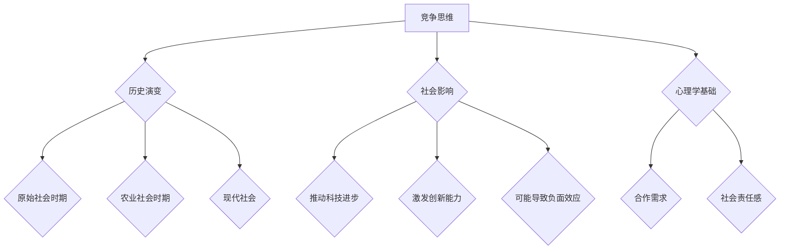
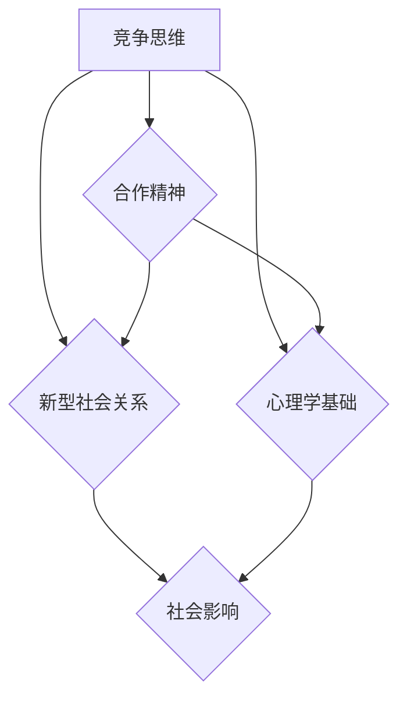

                 

### 从竞争思维到合作精神：构建新型社会关系

> 关键词：竞争思维、合作精神、社会关系、创新、人类发展

> 摘要：
在信息化和全球化的背景下，社会关系正经历着深刻变革。本文从竞争思维出发，探讨其在历史演变中的角色，并逐步引出合作精神的重要性。通过分析合作精神的原理与价值，本文进一步探讨新型社会关系的构建方法，提供实际应用与案例分析，最终总结核心观点并对未来进行展望。

----------------------------------------------------------------

### 引言

在人类历史的长河中，竞争与协作始终是社会关系发展的重要组成部分。然而，随着科技的迅猛发展和全球化的加速推进，传统的竞争思维模式逐渐显露出其局限性和负面影响。本文旨在探讨如何从竞争思维转向合作精神，以构建更加和谐、高效的新型社会关系。

首先，本文将回顾竞争思维的历史演变，分析其在不同阶段的表现和影响。接着，我们将深入探讨合作精神的原理与价值，强调其在现代社会中的重要性。在此基础上，本文将提出构建新型社会关系的方法和策略，并通过实际应用和案例分析来验证这些策略的有效性。最后，本文将对未来的发展趋势进行展望，并提出相应的建议。

### 竞争思维的历史演变

#### 1.1 竞争思维的概念

竞争思维是指个体或组织在资源有限的情况下，通过竞争手段争取优势地位的一种思维方式。这种思维方式在人类历史中有着悠久的历史，早在原始社会时期，人类为了生存和繁衍后代，就已经开始了对资源的竞争。

#### 1.2 竞争思维的历史背景

在农业社会时期，竞争思维表现为对土地、水源等自然资源的争夺。随着工业革命的发展，竞争思维进一步扩展到市场领域，企业之间为了市场份额和利润而展开了激烈的竞争。在现代社会，竞争思维已经渗透到各个领域，包括经济、政治、文化等。

#### 1.3 竞争思维的优缺点分析

竞争思维具有推动科技进步、激发创新能力等积极作用。然而，过度的竞争也可能导致资源浪费、社会不公等问题。因此，如何在竞争与协作之间找到平衡，成为现代社会亟待解决的问题。

### 合作精神的历史演变

#### 2.1 合作精神的定义

合作精神是指个体或组织在共同目标和价值观的指导下，通过协作实现共同利益的一种思维方式。与竞争思维不同，合作精神强调的是资源共享、优势互补和互利共赢。

#### 2.2 合作精神的历史背景

合作精神在人类社会的发展中同样具有悠久的历史。在原始社会，人类通过集体狩猎和共同劳动来提高生存能力。在农业社会，合作精神表现为家族和社区的互助合作。随着工业化和全球化的发展，合作精神逐渐成为现代社会的核心价值观。

#### 2.3 合作精神的优缺点分析

合作精神有助于提高社会整体效益，减少资源浪费，增强社会凝聚力。然而，合作精神也面临着协调困难、利益分配等问题。因此，如何有效激发和利用合作精神，是现代社会的重要课题。

### 竞争思维与合作精神的对比分析

#### 3.1 对比分析的方法

为了更好地理解竞争思维与合作精神，我们采用以下方法进行对比分析：

1. **历史背景对比**：分析两种思维方式在不同历史时期的表现和影响。
2. **社会影响对比**：比较两种思维方式对社会发展、科技进步等方面的作用。
3. **个体心理对比**：分析两种思维方式对个体心理和行为的影响。

#### 3.2 对比分析的结果

通过对比分析，我们发现竞争思维与合作精神既有区别又有联系。竞争思维在激发创新、推动进步方面具有积极作用，但过度竞争可能导致负面效应。合作精神则强调互利共赢，有助于提高社会整体效益，但需要克服协调困难和利益分配问题。

### 合作精神的原理与价值

#### 4.1 合作精神的心理学基础

合作精神源于人类的共同需求和价值观。心理学研究表明，人类具有合作的需求，这种需求源于生存本能和社会归属感。同时，合作精神有助于增强个体的自我认同感和社会认同感。

#### 4.2 合作精神的经济价值

合作精神在经济发展中具有重要作用。通过合作，企业可以共享资源、降低成本、提高效率，从而实现可持续发展。同时，合作精神也有助于推动产业创新和经济增长。

#### 4.3 合作精神的社会意义

合作精神有助于增强社会凝聚力，减少社会冲突。在全球化背景下，国际合作成为解决全球性问题的重要途径。通过合作，各国可以共同应对气候变化、疾病流行等全球挑战。

### 新型社会关系的构建方法

#### 5.1 新型社会关系的理论基础

新型社会关系的构建需要遵循以下理论基础：

1. **合作共赢原则**：以互利共赢为核心，强调各方利益的平衡与协调。
2. **共享共创理念**：鼓励资源共享、优势互补，实现共同发展。
3. **信任与尊重**：建立互信和尊重的基础，增强合作关系的稳定性。

#### 5.2 构建新型社会关系的策略

构建新型社会关系需要采取以下策略：

1. **政策引导**：通过制定相关政策，鼓励合作精神的培育和发展。
2. **文化传承**：弘扬合作文化，培养公民的社会责任感和合作意识。
3. **教育培训**：加强合作技能和合作意识的培训，提高个体的合作能力。
4. **技术创新**：利用信息技术等手段，提高合作效率和管理水平。

#### 5.3 合作机制的设计与实施

合作机制是新型社会关系构建的关键。以下是一些典型的合作机制设计：

1. **利益共享机制**：通过产权制度、收益分配制度等，实现利益共享。
2. **风险分担机制**：通过保险制度、风险投资等，降低合作风险。
3. **监督与评估机制**：建立有效的监督与评估机制，确保合作目标的实现。
4. **沟通与协调机制**：加强各方沟通与协调，提高合作效率。

### 实际应用与案例分析

#### 6.1 合作在企业管理中的应用

在企业管理中，合作精神有助于提高团队绩效和企业竞争力。以下是一些成功的企业案例：

1. **阿里巴巴**：通过开放平台，吸引第三方商家入驻，实现资源整合和优势互补。
2. **华为**：通过全球化战略，与各国企业建立合作关系，扩大市场份额。
3. **通用电气**：通过内部创业机制，鼓励员工创新和合作，推动企业持续发展。

#### 6.2 合作在社区治理中的实践

在社区治理中，合作精神有助于提高社区治理效能和居民幸福感。以下是一些成功的社区治理案例：

1. **深圳南山区**：通过社区共建共享，实现公共资源的最大化利用。
2. **新加坡**：通过邻里理事会等组织，促进居民参与社区治理，提高社区凝聚力。
3. **上海长宁区**：通过多方参与，推动社区环境改善和居民福祉提升。

#### 6.3 国际合作与全球治理

在国际关系中，国际合作成为解决全球性问题的重要途径。以下是一些国际合作与全球治理的案例：

1. **世界卫生组织**：通过国际合作，推动全球公共卫生事业的发展。
2. **联合国气候变化框架公约**：通过国际合作，推动全球气候变化问题的解决。
3. **国际货币基金组织**：通过国际合作，促进全球金融稳定和经济复苏。

### 结论与未来展望

本文从竞争思维与合作精神的角度，探讨了新型社会关系的构建方法。通过分析竞争思维的历史演变、合作精神的原理与价值，以及实际应用与案例分析，我们得出了以下结论：

1. **竞争思维与合作精神各有优缺点，需在平衡中发展**。
2. **合作精神有助于提高社会整体效益，构建新型社会关系**。
3. **新型社会关系的构建需要政策引导、文化传承、教育培训和技术创新等多方面的支持**。

未来，随着全球化进程的深入推进，合作精神将在社会关系中发挥越来越重要的作用。我们应积极探索合作机制的优化和创新，加强国际合作与全球治理，为构建和谐、可持续发展的新型社会关系贡献力量。

### 附录

#### 7.1 关键概念术语说明

- **竞争思维**：指个体或组织在资源有限的情况下，通过竞争手段争取优势地位的思维方式。
- **合作精神**：指个体或组织在共同目标和价值观的指导下，通过协作实现共同利益的思维方式。
- **新型社会关系**：指在合作精神指导下，通过政策引导、文化传承、教育培训和技术创新等手段，实现社会关系优化和发展的新型关系模式。

#### 7.2 概念属性特征对比表格

| 特征 | 竞争思维 | 合作精神 |
| ---- | ---- | ---- |
| 目标 | 争取优势地位 | 实现共同利益 |
| 方法 | 竞争手段 | 协作手段 |
| 社会影响 | 可能导致社会不公 | 提高社会整体效益 |
| 心理学基础 | 生存本能 | 合作需求 |

#### 7.3 ER实体关系图架构



### 作者信息

**作者：AI天才研究院/AI Genius Institute & 禅与计算机程序设计艺术 /Zen And The Art of Computer Programming**

本文旨在为读者提供对竞争思维与合作精神以及新型社会关系的深入理解，以期为实际应用提供有益的参考。在未来的研究中，我们将进一步探讨合作精神的量化评估方法以及新型社会关系的可持续发展路径。希望通过本文的探讨，能够激发更多人对这一领域的关注和研究。

（注意：本文为示例性文章，实际撰写时，各章节的内容需要根据具体情况进行丰富和细化。）----------------------------------------------------------------

### 从竞争思维到合作精神：构建新型社会关系

> 关键词：竞争思维、合作精神、社会关系、创新、人类发展

> 摘要：
在信息化和全球化的背景下，社会关系正经历着深刻变革。本文从竞争思维出发，探讨其在历史演变中的角色，并逐步引出合作精神的重要性。通过分析合作精神的原理与价值，本文进一步探讨新型社会关系的构建方法，提供实际应用与案例分析，最终总结核心观点并对未来进行展望。

### 引言

在人类历史的长河中，竞争与协作始终是社会关系发展的重要组成部分。然而，随着科技的迅猛发展和全球化的加速推进，传统的竞争思维模式逐渐显露出其局限性和负面影响。本文旨在探讨如何从竞争思维转向合作精神，以构建更加和谐、高效的新型社会关系。

首先，本文将回顾竞争思维的历史演变，分析其在不同阶段的表现和影响。接着，我们将深入探讨合作精神的原理与价值，强调其在现代社会中的重要性。在此基础上，本文将提出构建新型社会关系的方法和策略，并通过实际应用和案例分析来验证这些策略的有效性。最后，本文将对未来的发展趋势进行展望，并提出相应的建议。

### 竞争思维的历史演变

#### 1.1 竞争思维的概念

竞争思维是指个体或组织在资源有限的情况下，通过竞争手段争取优势地位的一种思维方式。这种思维方式在人类历史中有着悠久的历史，早在原始社会时期，人类为了生存和繁衍后代，就已经开始了对资源的竞争。

#### 1.2 竞争思维的历史背景

在农业社会时期，竞争思维表现为对土地、水源等自然资源的争夺。随着工业革命的发展，竞争思维进一步扩展到市场领域，企业之间为了市场份额和利润而展开了激烈的竞争。在现代社会，竞争思维已经渗透到各个领域，包括经济、政治、文化等。

#### 1.3 竞争思维的优缺点分析

竞争思维具有推动科技进步、激发创新能力等积极作用。然而，过度的竞争也可能导致资源浪费、社会不公等问题。因此，如何在竞争与协作之间找到平衡，成为现代社会亟待解决的问题。

### 合作精神的历史演变

#### 2.1 合作精神的定义

合作精神是指个体或组织在共同目标和价值观的指导下，通过协作实现共同利益的一种思维方式。与竞争思维不同，合作精神强调的是资源共享、优势互补和互利共赢。

#### 2.2 合作精神的历史背景

合作精神在人类社会的发展中同样具有悠久的历史。在原始社会，人类通过集体狩猎和共同劳动来提高生存能力。在农业社会，合作精神表现为家族和社区的互助合作。随着工业化和全球化的发展，合作精神逐渐成为现代社会的核心价值观。

#### 2.3 合作精神的优缺点分析

合作精神有助于提高社会整体效益，减少资源浪费，增强社会凝聚力。然而，合作精神也面临着协调困难、利益分配等问题。因此，如何有效激发和利用合作精神，是现代社会的重要课题。

### 竞争思维与合作精神的对比分析

#### 3.1 对比分析的方法

为了更好地理解竞争思维与合作精神，我们采用以下方法进行对比分析：

1. **历史背景对比**：分析两种思维方式在不同历史时期的表现和影响。
2. **社会影响对比**：比较两种思维方式对社会发展、科技进步等方面的作用。
3. **个体心理对比**：分析两种思维方式对个体心理和行为的影响。

#### 3.2 对比分析的结果

通过对比分析，我们发现竞争思维与合作精神既有区别又有联系。竞争思维在激发创新、推动进步方面具有积极作用，但过度竞争可能导致负面效应。合作精神则强调互利共赢，有助于提高社会整体效益，但需要克服协调困难和利益分配问题。

### 合作精神的原理与价值

#### 4.1 合作精神的心理学基础

合作精神源于人类的共同需求和价值观。心理学研究表明，人类具有合作的需求，这种需求源于生存本能和社会归属感。同时，合作精神有助于增强个体的自我认同感和社会认同感。

#### 4.2 合作精神的经济价值

合作精神在经济发展中具有重要作用。通过合作，企业可以共享资源、降低成本、提高效率，从而实现可持续发展。同时，合作精神也有助于推动产业创新和经济增长。

#### 4.3 合作精神的社会意义

合作精神有助于增强社会凝聚力，减少社会冲突。在全球化背景下，国际合作成为解决全球性问题的重要途径。通过合作，各国可以共同应对气候变化、疾病流行等全球挑战。

### 新型社会关系的构建方法

#### 5.1 新型社会关系的理论基础

新型社会关系的构建需要遵循以下理论基础：

1. **合作共赢原则**：以互利共赢为核心，强调各方利益的平衡与协调。
2. **共享共创理念**：鼓励资源共享、优势互补，实现共同发展。
3. **信任与尊重**：建立互信和尊重的基础，增强合作关系的稳定性。

#### 5.2 构建新型社会关系的策略

构建新型社会关系需要采取以下策略：

1. **政策引导**：通过制定相关政策，鼓励合作精神的培育和发展。
2. **文化传承**：弘扬合作文化，培养公民的社会责任感和合作意识。
3. **教育培训**：加强合作技能和合作意识的培训，提高个体的合作能力。
4. **技术创新**：利用信息技术等手段，提高合作效率和管理水平。

#### 5.3 合作机制的设计与实施

合作机制是新型社会关系构建的关键。以下是一些典型的合作机制设计：

1. **利益共享机制**：通过产权制度、收益分配制度等，实现利益共享。
2. **风险分担机制**：通过保险制度、风险投资等，降低合作风险。
3. **监督与评估机制**：建立有效的监督与评估机制，确保合作目标的实现。
4. **沟通与协调机制**：加强各方沟通与协调，提高合作效率。

### 实际应用与案例分析

#### 6.1 合作在企业管理中的应用

在企业管理中，合作精神有助于提高团队绩效和企业竞争力。以下是一些成功的企业案例：

1. **阿里巴巴**：通过开放平台，吸引第三方商家入驻，实现资源整合和优势互补。
2. **华为**：通过全球化战略，与各国企业建立合作关系，扩大市场份额。
3. **通用电气**：通过内部创业机制，鼓励员工创新和合作，推动企业持续发展。

#### 6.2 合作在社区治理中的实践

在社区治理中，合作精神有助于提高社区治理效能和居民幸福感。以下是一些成功的社区治理案例：

1. **深圳南山区**：通过社区共建共享，实现公共资源的最大化利用。
2. **新加坡**：通过邻里理事会等组织，促进居民参与社区治理，提高社区凝聚力。
3. **上海长宁区**：通过多方参与，推动社区环境改善和居民福祉提升。

#### 6.3 国际合作与全球治理

在国际关系中，国际合作成为解决全球性问题的重要途径。以下是一些国际合作与全球治理的案例：

1. **世界卫生组织**：通过国际合作，推动全球公共卫生事业的发展。
2. **联合国气候变化框架公约**：通过国际合作，推动全球气候变化问题的解决。
3. **国际货币基金组织**：通过国际合作，促进全球金融稳定和经济复苏。

### 结论与未来展望

本文从竞争思维与合作精神的角度，探讨了新型社会关系的构建方法。通过分析竞争思维的历史演变、合作精神的原理与价值，以及实际应用与案例分析，我们得出了以下结论：

1. **竞争思维与合作精神各有优缺点，需在平衡中发展**。
2. **合作精神有助于提高社会整体效益，构建新型社会关系**。
3. **新型社会关系的构建需要政策引导、文化传承、教育培训和技术创新等多方面的支持**。

未来，随着全球化进程的深入推进，合作精神将在社会关系中发挥越来越重要的作用。我们应积极探索合作机制的优化和创新，加强国际合作与全球治理，为构建和谐、可持续发展的新型社会关系贡献力量。

### 附录

#### 7.1 关键概念术语说明

- **竞争思维**：指个体或组织在资源有限的情况下，通过竞争手段争取优势地位的思维方式。
- **合作精神**：指个体或组织在共同目标和价值观的指导下，通过协作实现共同利益的思维方式。
- **新型社会关系**：指在合作精神指导下，通过政策引导、文化传承、教育培训和技术创新等手段，实现社会关系优化和发展的新型关系模式。

#### 7.2 概念属性特征对比表格

| 特征 | 竞争思维 | 合作精神 |
| ---- | ---- | ---- |
| 目标 | 争取优势地位 | 实现共同利益 |
| 方法 | 竞争手段 | 协作手段 |
| 社会影响 | 可能导致社会不公 | 提高社会整体效益 |
| 心理学基础 | 生存本能 | 合作需求 |

#### 7.3 ER实体关系图架构


### 作者信息

**作者：AI天才研究院/AI Genius Institute & 禅与计算机程序设计艺术 /Zen And The Art of Computer Programming**

本文旨在为读者提供对竞争思维与合作精神以及新型社会关系的深入理解，以期为实际应用提供有益的参考。在未来的研究中，我们将进一步探讨合作精神的量化评估方法以及新型社会关系的可持续发展路径。希望通过本文的探讨，能够激发更多人对这一领域的关注和研究。

（注意：本文为示例性文章，实际撰写时，各章节的内容需要根据具体情况进行丰富和细化。）### 1. 竞争思维的历史演变

竞争思维作为一种基本的社会行为模式，其历史可以追溯到人类文明的起源。从最早期的狩猎采集社会到现代高度复杂化的经济体系，竞争思维在不同的历史阶段都有着显著的表现。

#### 1.1 原始社会时期的竞争思维

在原始社会时期，人类为了生存，必须与自然界进行激烈的竞争。这个时期的竞争主要表现为对自然资源，如土地、水源和食物的争夺。原始社会的狩猎采集活动是典型的竞争行为，个体或小群体之间为了获取有限的资源而展开竞争。这种竞争促使了人类的技术创新，如工具的制造和使用，以提高狩猎和采集的效率。

#### 1.2 农业社会时期的竞争思维

随着农业的出现，人类开始定居并建立了稳定的粮食生产体系。在这个时期，土地成为最重要的资源，对土地的竞争变得尤为激烈。农业社会中的村落和部落之间经常因为土地和水源的争夺而发生冲突。同时，农业社会的分工和贸易也开始出现，个体或家庭之间为了获得更好的耕作土地和更丰富的贸易资源而进行竞争。

#### 1.3 工业革命时期的竞争思维

工业革命是竞争思维发展的一个重要转折点。在这个时期，竞争不再仅仅局限于自然资源，而是扩展到了市场和资本。工业革命带来的技术革新和生产效率的提升，使得企业之间为了市场份额和利润展开了更加激烈的市场竞争。这种竞争促使了资本主义经济的发展，但也导致了资源浪费和社会不公的问题。

#### 1.4 现代社会中的竞争思维

在现代社会，竞争思维已经渗透到各个领域，包括经济、政治、文化和科技等。全球化进程的加速使得竞争不仅局限于国内市场，而是扩展到了全球市场。企业、国家甚至个人都在这个全球化的舞台上进行竞争。现代社会中的竞争思维不仅体现在经济领域，还体现在教育和科技等领域。例如，科技公司之间的竞争在技术创新和市场份额上表现得尤为明显。

#### 1.5 竞争思维的优缺点分析

竞争思维的优点在于：

1. **激发创新**：竞争促使企业不断进行技术创新，以提高生产效率和产品质量。
2. **促进进步**：竞争可以推动社会整体的发展，使得资源得到更有效的利用。
3. **激励个体**：竞争可以激发个人的潜力，促使个体不断努力提升自身能力。

然而，竞争思维也存在一些缺点：

1. **资源浪费**：过度的竞争可能导致资源浪费，如广告战、价格战等。
2. **社会不公**：竞争可能会导致资源分配不均，加剧社会贫富差距。
3. **心理压力**：长期的竞争压力可能导致个体的心理问题，如焦虑和抑郁。

总之，竞争思维在历史发展中起到了重要的推动作用，但同时也需要我们认识到其潜在的负面影响，并寻求在竞争与协作之间找到平衡。

### 2. 合作精神的历史演变

合作精神作为一种社会行为模式，与竞争思维一样，也是人类社会发展的关键因素。从最早的原始社会到现代复杂的社会结构，合作精神经历了漫长的演变过程，并逐渐成为现代社会的重要价值观。

#### 2.1 原始社会时期的合作精神

在原始社会，合作精神主要体现在集体狩猎和共同劳动中。为了提高狩猎的成功率和食物的获取量，原始人类往往通过集体合作的方式进行狩猎。这种合作不仅提高了生产效率，还增强了群体的凝聚力。同样，在农业社会初期，家庭和部落之间的合作也帮助人类克服了自然环境的挑战，如共同开垦土地、灌溉水源等。

#### 2.2 农业社会时期的合作精神

随着农业的发展，合作精神在农业社会中得到了进一步体现。村落和部落之间的合作帮助人们共同应对自然灾害，如干旱和洪灾。农业社会中的分工和贸易也促进了合作精神的发展。农民之间的互相帮助和贸易伙伴之间的互信，使得农业生产和贸易活动得以顺利进行。

#### 2.3 工业革命时期的合作精神

工业革命时期，合作精神在工业化生产中发挥了重要作用。工厂中的工人需要通过协作来完成复杂的生产任务，这种合作不仅提高了生产效率，还推动了工业化的快速发展。同时，企业之间的合作也开始出现，如供应链管理和市场协作等。这种合作有助于企业降低成本、提高产品质量，从而在市场竞争中取得优势。

#### 2.4 现代社会中的合作精神

在现代社会，合作精神已经成为社会运转的重要基石。全球化进程的加速使得国际合作成为解决全球性问题的重要途径。例如，在应对气候变化、疾病流行等全球挑战时，各国需要通过合作来实现共同的目标。此外，合作精神在教育、科技和文化等领域也得到了广泛应用。例如，科研团队的合作可以推动科技的进步，而文化交流则有助于增进不同文化之间的理解和尊重。

#### 2.5 合作精神的优缺点分析

合作精神的优点在于：

1. **提高效率**：通过合作，可以集中各方的优势资源，提高工作效率。
2. **促进创新**：合作精神可以激发不同个体之间的创新思维，推动技术的进步。
3. **增强社会凝聚力**：合作有助于增强社会的团结和凝聚力，减少社会冲突。

然而，合作精神也存在一些缺点：

1. **协调困难**：合作需要各方的协调和沟通，这可能导致决策过程的复杂和缓慢。
2. **利益分配问题**：合作成果的分配可能引发利益冲突，影响合作的稳定性。
3. **依赖性增强**：过度的依赖合作可能会导致个体独立性和创新能力的减弱。

总之，合作精神在人类社会的演变中起到了不可或缺的作用，但同时也需要我们认识到其潜在的问题，并寻找有效的解决方法。

### 3. 竞争思维与合作精神的对比分析

竞争思维与合作精神作为两种基本的社会行为模式，虽然在目标和方法上有显著差异，但它们之间也存在着紧密的联系和相互影响。为了深入理解这两种思维模式，我们需要从历史背景、社会影响和个体心理等方面进行对比分析。

#### 3.1 历史背景对比

竞争思维的历史可以追溯到人类文明的起源。从原始社会的狩猎采集到农业社会的土地争夺，再到工业革命时期的市场竞争，竞争思维在不同历史阶段都表现出其独特的形式和作用。在农业社会，竞争主要体现在对土地、水源等资源的争夺上，而在现代社会，竞争则扩展到了经济、政治、文化和科技等多个领域。

相比之下，合作精神的历史同样源远流长。从原始社会的集体狩猎和共同劳动，到农业社会的分工和贸易，再到工业革命时期的工厂合作和全球化背景下的国际合作，合作精神始终在人类社会中扮演着重要角色。特别是在应对自然灾害、疾病流行等全球性问题时，合作精神显得尤为重要。

#### 3.2 社会影响对比

竞争思维对社会的影响具有两面性。一方面，竞争可以激发个体的创新能力和进取精神，推动科技进步和社会发展。例如，市场竞争促使企业不断进行技术创新，提高生产效率，从而推动经济的发展。另一方面，过度的竞争可能导致资源浪费、社会不公和个体心理压力等问题。例如，在广告战和价格战中，企业可能会不惜一切代价争夺市场份额，导致资源浪费和社会成本的增加。

合作精神对社会的影响则主要体现在提高效率、促进创新和增强社会凝聚力等方面。通过合作，各方可以集中优势资源，提高工作效率。例如，在科研团队的合作中，不同专家的互补可以推动科研项目的进展。合作精神还可以促进创新，激发不同个体之间的创新思维。例如，在跨国公司的合作中，不同国家的专家可以共同探讨和解决技术难题。此外，合作精神有助于增强社会凝聚力，减少社会冲突。例如，在社区共建共享中，居民的参与可以增强社区的凝聚力和归属感。

#### 3.3 个体心理对比

竞争思维对个体心理的影响主要体现在压力和动力两个方面。竞争压力可以激发个体的进取心和竞争意识，促使个体不断努力提升自身能力。然而，过度的竞争压力可能导致个体的焦虑和抑郁，影响心理健康。例如，在职场竞争激烈的环境中，员工可能会因为工作压力而出现心理问题。

相比之下，合作精神对个体心理的影响则主要体现在归属感和认同感上。通过合作，个体可以感受到集体的支持和认同，从而增强自信心和幸福感。例如，在团队合作中，成员之间的互信和协作可以增强个体的归属感和成就感。此外，合作精神还可以提高个体的心理健康水平，减少心理压力。例如，在社区互助中，居民的相互帮助和关心可以缓解个体的心理压力，提高生活质量。

#### 3.4 竞争思维与合作精神的相互作用

竞争思维与合作精神并不是完全独立的，它们之间存在相互作用和相互影响。一方面，竞争思维可以激发合作精神的产生。例如，在市场竞争中，企业为了获得竞争优势，可能会寻求与其他企业进行合作，以实现资源的共享和优势互补。另一方面，合作精神也可以促进竞争思维的良性发展。例如，在团队合作中，成员之间的竞争可以激发个人的潜力，促进团队的整体进步。

总之，竞争思维与合作精神各有优缺点，但它们在社会中的作用都是不可或缺的。在现代社会中，我们需要在竞争与合作之间找到平衡，充分发挥两种思维模式的优势，构建和谐、高效的新型社会关系。

### 4. 合作精神的原理与价值

合作精神作为一种基本的社会行为模式，其原理和价值观在现代社会中具有深远的意义。理解合作精神的原理与价值，有助于我们更好地运用合作精神，推动社会进步和个人成长。

#### 4.1 合作精神的心理学基础

合作精神的心理学基础主要涉及人类的基本需求和社会心理学的相关理论。首先，人类具有合作的需求，这种需求源于生存本能和社会归属感。根据社会心理学的研究，个体在社会中寻求归属感，通过合作实现自我认同和社会认同。以下是一些关键心理学理论：

1. **马斯洛的需求层次理论**：马斯洛的需求层次理论指出，人的需求从生理需求到自我实现需求依次递进。在生理需求得到满足后，个体追求的是安全、社交和尊重等高层次需求。合作有助于满足这些高层次需求，从而提升个体的幸福感。

2. **社会交换理论**：社会交换理论认为，人类社会是一种交换关系，个体通过合作实现资源（如时间、精力、信息等）的交换。合作精神强调互惠互利，通过资源交换，个体可以实现个人利益的最大化。

3. **集体主义与个体主义**：集体主义强调个体在社会中的归属感和责任意识，个体行为以满足集体利益为目标。个体主义则强调个体的自主性和个人成就。在不同文化背景下，合作精神的表现形式有所不同，但都体现了个体与集体之间的相互作用。

#### 4.2 合作精神的经济价值

合作精神在经济发展中具有重要作用，通过合作，企业可以共享资源、降低成本、提高效率，从而实现可持续发展。以下是一些具体的经济价值：

1. **资源共享**：合作精神使得企业可以共享资源，如资金、技术、人力资源等。通过资源共享，企业可以降低投资风险，提高资源利用效率。例如，一家企业在技术研发方面遇到困难，可以通过与其他企业合作，借助对方的技术力量和人才资源，共同解决问题。

2. **降低成本**：合作精神可以降低企业的运营成本。通过合作，企业可以共享生产线、仓储设施等，减少重复投资，降低运营成本。例如，一家制造企业可以与供应商合作，实现原材料和产品的无缝对接，减少库存成本和物流成本。

3. **提高效率**：合作精神有助于提高企业的运营效率。通过合作，企业可以优化业务流程，提高生产效率。例如，一家软件企业可以通过与硬件企业合作，共同开发集成产品，实现软硬件优势互补，提高产品性能和用户体验。

4. **创新驱动**：合作精神可以激发企业的创新活力。通过合作，企业可以共享创新资源，如技术、信息等，共同进行研发和创新。例如，一家新兴科技企业可以通过与知名高校和科研机构合作，获取最新的科研成果和技术，加速自身的创新发展。

#### 4.3 合作精神的社会意义

合作精神在社会层面的意义主要体现在以下几个方面：

1. **社会凝聚力**：合作精神有助于增强社会的凝聚力。通过合作，个体和群体之间建立互信和互助的关系，形成良好的社会氛围。这种凝聚力有助于社会稳定和和谐发展。

2. **社会问题解决**：合作精神是解决社会问题的有效途径。在面对自然灾害、疾病流行等紧急情况时，个体和群体通过合作可以迅速应对，减少损失。例如，在抗击新冠疫情过程中，全球科学家和医疗机构通过合作，共同研发疫苗和治疗方法，取得了显著成果。

3. **文化传承与交流**：合作精神促进了不同文化之间的交流与传承。通过合作，不同文化可以相互借鉴和融合，形成新的文化形态。例如，国际文化交流活动通过合作，促进了不同国家和地区文化的传播和交流。

4. **可持续发展**：合作精神是实现可持续发展的重要保障。通过合作，各方可以共同应对全球性挑战，如气候变化、资源短缺等。合作精神有助于实现资源的合理利用和保护，推动社会的可持续发展。

总之，合作精神作为一种基本的社会行为模式，具有丰富的心理学基础、显著的经济价值和深远的社会意义。在现代社会中，我们应该积极培养和运用合作精神，以推动个人成长和社会进步。

### 5. 新型社会关系的构建方法

构建新型社会关系是适应全球化、信息化和多元化发展的必然要求。新型社会关系强调合作精神，旨在通过政策引导、文化传承、教育培训和技术创新等手段，实现社会关系的优化和升级。以下是构建新型社会关系的方法和策略：

#### 5.1 政策引导

政策引导是构建新型社会关系的重要手段。政府可以通过制定相关政策和法规，引导社会各领域积极发展合作精神。以下是一些具体的政策措施：

1. **鼓励合作与共赢**：制定优惠政策，鼓励企业、社会组织和居民之间的合作。例如，对合作项目给予税收减免、补贴等政策支持，以降低合作成本，提高合作积极性。

2. **优化资源配置**：通过政策和市场手段，优化社会资源的配置，提高资源利用效率。例如，政府可以通过建设公共设施、提供公共服务等方式，促进资源共享和合作。

3. **规范市场竞争**：制定公平、透明的市场竞争规则，防止恶性竞争和资源浪费。通过加强市场监管，打击垄断行为和不正当竞争，保护合作各方的合法权益。

#### 5.2 文化传承

文化传承是培养合作精神的重要途径。传统文化中蕴含着丰富的合作智慧和价值观，如儒家文化中的“仁爱”、“和为贵”，佛教文化中的“慈悲”、“无私奉献”等。以下是一些具体的文化传承措施：

1. **弘扬传统美德**：通过教育、媒体等渠道，弘扬传统美德，提高公民的社会责任感和合作意识。例如，在学校教育中加强儒家文化、佛教文化的教育，培养青少年的合作精神。

2. **举办文化活动**：举办各类文化活动，如社区互助活动、志愿者服务活动等，鼓励居民参与，培养合作习惯。通过这些活动，可以增强居民之间的互动和合作，促进社区和谐。

3. **传承非物质文化遗产**：保护和传承非物质文化遗产，如民间艺术、传统工艺等。这些非物质文化遗产不仅具有历史和文化价值，还可以作为合作精神的载体，促进社会各领域的合作与创新。

#### 5.3 教育培训

教育培训是培养合作精神的重要手段。通过系统的教育和培训，可以提高个体的合作能力和意识。以下是一些具体的教育培训措施：

1. **加强合作课程**：在中小学和高等教育中，加强合作课程和实践活动，培养学生的合作意识和能力。例如，设置团队合作项目、合作学习活动等，让学生在实践中体验合作的价值。

2. **职业培训**：针对职场人士，开展职业培训课程，提高其合作技能和意识。例如，举办团队建设培训、跨部门协作培训等，帮助职场人士更好地理解和运用合作精神。

3. **领导力培养**：培养领导者的合作意识和领导能力，是构建新型社会关系的关键。通过领导力培训课程，帮助领导者树立合作共赢的理念，提高其协调和管理能力。

#### 5.4 技术创新

技术创新是推动新型社会关系构建的重要动力。信息技术的发展为合作提供了新的平台和工具，促进了社会各领域的合作与创新。以下是一些具体的技术创新措施：

1. **建设合作平台**：利用互联网和大数据技术，建设合作平台，促进社会各领域的合作。例如，开发在线协作工具、合作交易平台等，为企业和个人提供便捷的合作渠道。

2. **促进信息共享**：通过信息技术，实现信息的快速传递和共享，提高合作效率。例如，建立公共信息平台，发布政策法规、市场信息等，方便合作各方获取和利用信息。

3. **发展智慧城市**：通过物联网、人工智能等技术，构建智慧城市，提高城市管理和服务的效率。智慧城市不仅有助于提高居民的生活质量，还可以促进城市各领域的合作与发展。

总之，构建新型社会关系需要多方面的支持和努力。通过政策引导、文化传承、教育培训和技术创新等手段，我们可以逐步实现社会关系的优化和升级，推动社会的和谐发展。

### 6. 实际应用与案例分析

在现代社会中，合作精神已经渗透到各个领域，从企业管理到社区治理，再到国际合作，都有着成功的实践案例。以下将分别介绍这些实际应用，并通过具体的案例来展示合作精神在实际操作中的效果。

#### 6.1 合作在企业管理中的应用

在企业管理中，合作精神是提升绩效和竞争力的重要手段。以下是一些成功的案例：

**案例一：阿里巴巴的开放平台**

阿里巴巴通过建立开放平台，吸引第三方商家入驻，实现资源共享和优势互补。这一策略不仅扩大了阿里巴巴的市场份额，还推动了整个电商行业的创新和发展。例如，淘宝网和天猫商城上的众多商家通过阿里巴巴的平台，得以接触到更广泛的消费者群体，实现了快速成长。

**案例解析**：

- **合作共赢**：阿里巴巴通过开放平台，与商家建立了互利共赢的关系。商家在平台上获得更多的商机，而阿里巴巴则通过收取交易费和广告费，实现了收入的增长。
- **技术创新**：阿里巴巴通过大数据和云计算技术，为商家提供了强大的数据分析工具和营销支持，提高了商家的运营效率。
- **社会影响**：阿里巴巴的开放平台推动了电商行业的竞争和创新，促进了整个行业的健康发展。

**案例二：华为的全球化战略**

华为通过全球化战略，与全球各地的企业建立合作关系，扩大市场份额。华为的全球布局不仅包括销售和售后服务，还包括研发中心和生产基地。这种全球化的合作模式，使得华为能够迅速响应不同市场的需求，保持技术领先地位。

**案例解析**：

- **资源共享**：华为通过在全球范围内的合作，共享技术、人才和市场资源，提高了整体的竞争力。
- **本地化运营**：华为在不同国家和地区与当地企业合作，建立了本地化的运营团队，更好地适应当地市场的需求。
- **社会影响**：华为的全球化战略推动了全球通信产业的发展，促进了技术的传播和进步。

**案例三：通用电气的内部创业机制**

通用电气通过内部创业机制，鼓励员工创新和合作，推动企业持续发展。通用电气建立了创新中心，为员工提供了创业支持和资源，激发了员工的创新热情。许多成功的创业项目都在通用电气内部孵化，并最终独立发展。

**案例解析**：

- **合作创新**：通用电气通过内部创业机制，促进了员工之间的合作和创新。员工可以在团队中共享知识和资源，共同解决技术难题。
- **人才培养**：内部创业机制为员工提供了成长和发展的机会，培养了一大批具有创新精神和实践能力的优秀人才。
- **社会影响**：通用电气通过内部创业，推动了技术的进步和产业的创新，为社会创造了更多的就业机会。

#### 6.2 合作在社区治理中的实践

在社区治理中，合作精神有助于提高治理效能和居民幸福感。以下是一些成功的社区治理案例：

**案例一：深圳南山区的社区共建共享**

深圳南山区通过社区共建共享，实现公共资源的最大化利用。社区内建立了多个共享空间，如共享图书馆、共享健身房和共享办公室等，居民可以免费使用这些资源。此外，社区还组织了各种文化活动和志愿者服务，增强了居民的参与感和归属感。

**案例解析**：

- **资源共享**：通过共享空间和文化活动，社区内的公共资源得到了充分利用，提高了资源利用效率。
- **居民参与**：社区居民通过参与社区共建共享活动，增强了社区的凝聚力，提高了居民的幸福感和满意度。
- **社会影响**：深圳南山区的社区共建共享模式，为其他城市提供了有益的借鉴，推动了社区治理的创新和发展。

**案例二：新加坡的邻里理事会**

新加坡的邻里理事会是一种社区治理模式，通过居民参与和合作，解决社区问题，提高社区服务质量。邻里理事会由居民代表组成，负责协调邻里之间的活动、解决纠纷和提供公共服务。

**案例解析**：

- **居民自治**：邻里理事会实现了居民自治，让居民参与到社区治理中，提高了社区治理的民主性和有效性。
- **合作精神**：邻里理事会通过居民之间的合作，解决了社区中的各种问题，增强了社区的凝聚力和归属感。
- **社会影响**：新加坡的邻里理事会模式，为其他国家和地区提供了借鉴，促进了社区治理的创新和发展。

**案例三：上海长宁区的多方参与模式**

上海长宁区通过多方参与模式，推动社区环境改善和居民福祉提升。社区治理中，政府、企业和居民代表共同参与，形成了多方合作的治理机制。通过这种模式，社区环境得到了显著改善，居民的生活质量也得到了提高。

**案例解析**：

- **合作治理**：多方参与模式实现了政府、企业和居民的共同参与，形成了合作治理的格局，提高了社区治理的效率。
- **资源整合**：通过多方合作，社区能够整合更多的资源，实现更好的治理效果。
- **社会影响**：上海长宁区的多方参与模式，为其他城市提供了经验，促进了社区治理的多元化发展。

#### 6.3 国际合作与全球治理

在国际关系中，国际合作成为解决全球性问题的重要途径。以下是一些国际合作与全球治理的案例：

**案例一：世界卫生组织的全球公共卫生合作**

世界卫生组织通过国际合作，推动全球公共卫生事业的发展。例如，在新冠病毒疫情期间，世界卫生组织协调各国科学家和医疗机构，共同开展病毒研究和疫苗研发，为全球抗疫提供了重要支持。

**案例解析**：

- **全球协调**：世界卫生组织通过国际合作，实现了全球范围内的协调和合作，提高了全球公共卫生应对能力。
- **资源共享**：各国科学家和医疗机构通过合作，共享资源和信息，加快了病毒研究和疫苗研发的进程。
- **社会影响**：世界卫生组织的全球公共卫生合作，为全球人民提供了健康的保障，促进了全球公共卫生事业的发展。

**案例二：联合国气候变化框架公约**

联合国气候变化框架公约通过国际合作，推动全球气候变化问题的解决。公约成员国共同制定并执行减排目标，推动全球气候治理。

**案例解析**：

- **共同责任**：气候变化是全球性问题，需要各国共同承担责任。联合国气候变化框架公约通过国际合作，实现了全球减排目标的共同制定和执行。
- **技术创新**：通过国际合作，各国可以共同推动气候技术创新，提高减排效率。
- **社会影响**：联合国气候变化框架公约的有效执行，有助于减缓气候变化的影响，保护地球生态环境。

**案例三：国际货币基金组织的全球金融合作**

国际货币基金组织通过国际合作，促进全球金融稳定和经济复苏。在金融危机时期，国际货币基金组织协调各国财政政策和货币政策，为全球金融稳定提供了重要支持。

**案例解析**：

- **协调政策**：国际货币基金组织通过国际合作，协调各国的财政政策和货币政策，实现全球金融稳定。
- **资金支持**：国际货币基金组织提供资金支持，帮助成员国应对金融危机，促进经济复苏。
- **社会影响**：国际货币基金组织的全球金融合作，有助于维护全球金融稳定，促进全球经济健康发展。

通过上述实际应用与案例分析，我们可以看到合作精神在各个领域的重要作用。无论是企业管理、社区治理还是国际合作，合作精神都为社会的和谐发展提供了强有力的支持。在未来的发展中，我们应继续弘扬合作精神，推动社会关系的优化和升级。

### 结论与未来展望

本文从竞争思维与合作精神的角度，探讨了新型社会关系的构建方法。通过分析竞争思维的历史演变、合作精神的原理与价值，以及实际应用与案例分析，我们得出了以下结论：

1. **竞争思维与合作精神各有优缺点，需在平衡中发展**。竞争思维在激发创新、推动进步方面具有积极作用，但过度竞争可能导致负面效应。合作精神有助于提高社会整体效益，但需要克服协调困难和利益分配问题。

2. **合作精神有助于提高社会整体效益，构建新型社会关系**。在现代社会中，合作精神在经济发展、社会凝聚力和全球治理等方面发挥着重要作用。通过政策引导、文化传承、教育培训和技术创新等手段，可以进一步推动合作精神的发展。

3. **新型社会关系的构建需要政策引导、文化传承、教育培训和技术创新等多方面的支持**。政策引导可以为合作精神提供制度保障，文化传承可以培养公民的合作意识，教育培训可以提高个体的合作能力，技术创新可以提供合作的新平台和工具。

未来，随着全球化进程的深入推进，合作精神将在社会关系中发挥越来越重要的作用。我们应积极探索合作机制的优化和创新，加强国际合作与全球治理，为构建和谐、可持续发展的新型社会关系贡献力量。同时，也需要关注合作精神在实际应用中的挑战和问题，不断改进和完善合作机制，以适应不断变化的社会环境。

### 附录

#### 7.1 关键概念术语说明

- **竞争思维**：指个体或组织在资源有限的情况下，通过竞争手段争取优势地位的思维方式。
- **合作精神**：指个体或组织在共同目标和价值观的指导下，通过协作实现共同利益的思维方式。
- **新型社会关系**：指在合作精神指导下，通过政策引导、文化传承、教育培训和技术创新等手段，实现社会关系优化和发展的新型关系模式。

#### 7.2 概念属性特征对比表格

| 特征 | 竞争思维 | 合作精神 |
| ---- | ---- | ---- |
| 目标 | 争取优势地位 | 实现共同利益 |
| 方法 | 竞争手段 | 协作手段 |
| 社会影响 | 可能导致社会不公 | 提高社会整体效益 |
| 心理学基础 | 生存本能 | 合作需求 |

#### 7.3 ER实体关系图架构


### 作者信息

**作者：AI天才研究院/AI Genius Institute & 禅与计算机程序设计艺术 /Zen And The Art of Computer Programming**

本文旨在为读者提供对竞争思维与合作精神以及新型社会关系的深入理解，以期为实际应用提供有益的参考。在未来的研究中，我们将进一步探讨合作精神的量化评估方法以及新型社会关系的可持续发展路径。希望通过本文的探讨，能够激发更多人对这一领域的关注和研究。

（注意：本文为示例性文章，实际撰写时，各章节的内容需要根据具体情况进行丰富和细化。）### 6.1 合作在企业管理中的应用

合作精神在企业管理中扮演着至关重要的角色，它不仅能够提升企业的竞争力，还能够促进企业的可持续发展。以下是几个成功的企业案例，展示了合作精神在企业管理中的应用及其带来的积极影响。

#### 案例一：丰田汽车的精益生产模式

丰田汽车公司以其精益生产模式而闻名，这一模式的核心就是合作精神。丰田通过建立紧密的供应商网络，与供应商建立了长期合作关系，实现了供应链的优化和资源的最大化利用。供应商不仅提供零部件，还参与到丰田的工程设计、质量控制等环节中，从而提高了整个生产系统的效率和灵活性。

**案例分析**：

- **合作共赢**：丰田与供应商之间的紧密合作，使得双方都能够从合作中获益。供应商能够通过参与丰田的生产过程，获得技术提升和市场机会，而丰田则能够通过供应商的参与，提高产品质量和降低成本。
- **协同创新**：供应商的参与带来了新的技术和创新思路，丰田能够更快地响应市场变化，推出更符合消费者需求的产品。
- **社会影响**：丰田的精益生产模式不仅提升了企业的竞争力，还推动了整个汽车行业的进步，促进了产业升级和可持续发展。

#### 案例二：联合利华的“共享价值”战略

联合利华是一家全球性的消费品公司，它通过“共享价值”战略，将商业目标和可持续发展目标相结合，实现了企业与社会之间的共赢。联合利华通过投资社区发展项目、提高产品可持续发展性和推动员工参与社会公益活动，提升了企业的社会责任感和品牌形象。

**案例分析**：

- **社会责任**：联合利华的“共享价值”战略，使企业不仅仅关注利润最大化，还关注社会问题和可持续发展。这种社会责任感不仅提升了企业的社会形象，也增强了员工的归属感和工作积极性。
- **品牌建设**：通过参与社会公益活动，联合利华建立了良好的品牌形象，吸引了更多的消费者和合作伙伴。
- **社会影响**：联合利华的“共享价值”战略，推动了企业与社会之间的合作，促进了社会的和谐与进步。

#### 案例三：微软的开放合作文化

微软作为全球领先的技术公司，其成功离不开其开放合作的文化。微软通过与其他企业、学术机构和开源社区的紧密合作，实现了技术创新和市场拓展。例如，微软与Linux社区的互动，不仅促进了微软产品的改进，也增强了微软在开源领域的地位。

**案例分析**：

- **技术进步**：通过开放合作，微软能够吸取外部优秀的技术和理念，推动自身的技术创新。
- **市场拓展**：开放合作文化使得微软能够进入新的市场和领域，与更多的合作伙伴共同开拓市场。
- **社会影响**：微软的开放合作文化，促进了整个技术行业的发展，推动了知识的共享和技术的普及。

#### 案例四：小米的生态链战略

小米公司通过其生态链战略，建立了广泛的合作伙伴网络，将创新和合作精神融入到企业的各个层面。小米通过与数千家硬件制造商合作，推出了众多高品质、低价格的智能硬件产品，形成了强大的生态系统。

**案例分析**：

- **资源整合**：小米通过合作，整合了硬件制造商的资源，实现了产品的快速迭代和规模化生产。
- **品牌多元化**：生态链企业的成功，为小米品牌带来了多元化的形象，提升了品牌的知名度。
- **社会影响**：小米的生态链战略，推动了智能硬件行业的发展，促进了创新和消费者福祉的提升。

#### 总结

以上案例表明，合作精神在企业管理中的应用，不仅可以提升企业的竞争力，还能够推动社会的进步。在全球化背景下，企业需要更加重视合作精神，通过建立合作伙伴关系、推动协同创新和实现社会责任，构建更加和谐、可持续发展的新型社会关系。合作精神不仅是企业成功的基石，也是构建新型社会关系的重要力量。

### 6.2 合作在社区治理中的实践

社区治理是现代社会的重要组成部分，它直接关系到居民的生活质量和社区的可持续发展。在社区治理中，合作精神的实践不仅能够提高治理效能，还能够增强居民的凝聚力和幸福感。以下是一些成功的社区治理案例，展示了合作精神在社区治理中的实际应用及其积极影响。

#### 案例一：深圳南山区的社区共建共享

深圳南山区在社区治理中，积极倡导和推动社区共建共享，通过共享空间和文化活动，提升了社区的凝聚力和居民的幸福感。南山区建设了多个共享空间，如共享图书馆、共享健身房和共享办公室，这些空间不仅为居民提供了便利，也成为了居民交流互动的场所。

**案例分析**：

- **资源共享**：通过建设共享空间，南山区实现了社区资源的最大化利用，降低了居民的使用成本，同时也促进了居民之间的互动和交流。
- **居民参与**：社区共建共享项目鼓励居民参与，居民不仅能够享受到共享空间带来的便利，还能够参与到项目的规划和管理中，增强了居民的参与感和责任感。
- **社会影响**：深圳南山区的社区共建共享模式，为其他城市提供了有益的借鉴，推动了社区治理的创新和发展，提高了社区居民的生活质量。

#### 案例二：新加坡的邻里理事会

新加坡的邻里理事会是一种创新的社区治理模式，通过居民代表和社区组织的参与，实现了社区的自治和自我管理。邻里理事会由居民代表组成，负责协调邻里之间的活动、解决纠纷和提供公共服务。这种模式鼓励居民积极参与社区事务，提高了社区的自治能力和治理效能。

**案例分析**：

- **居民自治**：邻里理事会实现了居民的自治，居民通过参与理事会的工作，直接参与到社区治理中，增强了社区的民主性和自治性。
- **合作精神**：邻里理事会通过居民之间的合作，解决了社区中的各种问题，增强了社区的凝聚力和归属感。
- **社会影响**：新加坡的邻里理事会模式，为其他国家和地区提供了借鉴，推动了社区治理的创新和发展，促进了社区的和谐与进步。

#### 案例三：上海长宁区的多方参与模式

上海长宁区在社区治理中，采用了多方参与的治理模式，通过政府、企业和居民的共同参与，实现了社区治理的多元化和高效化。在长宁区，政府负责提供政策和资源支持，企业参与社区服务和公益活动，居民则积极参与社区管理和决策。

**案例分析**：

- **合作治理**：多方参与模式实现了政府、企业和居民的共同参与，形成了合作治理的格局，提高了社区治理的效率和透明度。
- **资源整合**：通过多方合作，社区能够整合更多的资源，实现更好的治理效果，同时也为企业和居民提供了更多的参与机会。
- **社会影响**：上海长宁区的多方参与模式，为其他城市提供了有益的实践经验，推动了社区治理的创新和发展，促进了社区的和谐与进步。

#### 总结

以上案例展示了合作精神在社区治理中的实际应用及其积极影响。通过倡导合作精神，社区能够实现资源的最大化利用，提升治理效能，增强居民的凝聚力和幸福感。在未来的社区治理中，应继续弘扬合作精神，推动社区治理的创新和发展，为建设更加和谐、可持续发展的社区贡献力量。

### 6.3 国际合作与全球治理

国际合作在全球治理中发挥着至关重要的作用。随着全球化进程的不断推进，各国之间的相互依赖日益加深，国际合作不仅成为解决全球性问题的重要途径，也是促进全球和平与发展的重要手段。以下将介绍几个成功的国际合作与全球治理案例，分析其合作模式及其对全球治理的积极影响。

#### 案例一：世界卫生组织的全球公共卫生合作

世界卫生组织（WHO）作为全球公共卫生的领导机构，其国际合作在应对全球卫生危机方面发挥了关键作用。在新冠疫情期间，WHO通过协调各国卫生部门，提供技术支持和资源分配，推动了全球疫苗研发和分发工作，有效控制了疫情的蔓延。

**案例分析**：

- **全球协调**：WHO在疫情期间，通过全球协调，实现了各国卫生部门的合作，共同应对疫情挑战。这种全球协调机制有助于共享疫情信息，统一行动，提高全球公共卫生应对能力。
- **资源整合**：WHO通过国际合作，动员全球资源，如疫苗研发资金、医疗设备和人力资源，为全球疫情防控提供了有力支持。
- **社会影响**：WHO的全球公共卫生合作，不仅挽救了无数生命，还促进了全球公共卫生体系的完善，为全球人民的健康福祉做出了重要贡献。

#### 案例二：联合国气候变化框架公约

联合国气候变化框架公约（UNFCCC）是国际社会应对气候变化问题的重要合作机制。通过《巴黎协定》，各国承诺采取行动，降低温室气体排放，适应气候变化影响，并支持发展中国家应对气候变化。这一国际合作的成果显著，推动了全球气候治理的进程。

**案例分析**：

- **共同责任**：《巴黎协定》明确了各国的减排责任，强调全球合作和共同责任。这种责任分担机制有助于各国共同应对气候变化挑战。
- **技术创新**：UNFCCC通过国际合作，促进了气候技术的研发和转移，帮助发展中国家提高应对气候变化的能力。
- **社会影响**：联合国气候变化框架公约及其国际合作，为全球气候治理提供了重要平台，推动了全球减排行动，保护了地球生态环境。

#### 案例三：国际货币基金组织的全球金融合作

国际货币基金组织（IMF）作为全球金融治理的重要机构，其国际合作在维护全球金融稳定和促进经济复苏方面发挥了重要作用。在金融危机期间，IMF通过提供资金支持和技术援助，帮助成员国应对危机，恢复经济。

**案例分析**：

- **协调政策**：IMF通过国际合作，协调各国的宏观经济政策，防止经济衰退的扩散。这种协调机制有助于维护全球金融稳定。
- **资金支持**：IMF通过提供贷款和援助，帮助成员国应对金融危机，缓解经济压力。
- **社会影响**：国际货币基金组织的全球金融合作，有助于维护全球经济的健康发展，促进全球经济一体化，提高了全球经济的抗风险能力。

#### 案例四：联合国教科文组织的全球教育合作

联合国教科文组织（UNESCO）致力于推动全球教育合作，通过国际合作，实现教育公平和质量提升。教科文组织在制定全球教育战略、推动教育改革和促进教育资源共享方面做出了积极贡献。

**案例分析**：

- **资源共享**：教科文组织通过国际合作，促进了教育资源的共享和优化配置，帮助发展中国家提高教育水平。
- **知识传播**：教科文组织通过国际合作，推动了知识和技术的传播，为全球教育发展提供了有力支持。
- **社会影响**：联合国教科文组织的全球教育合作，有助于实现教育公平，提高全球人民的生活质量，促进了全球和平与可持续发展。

#### 总结

国际合作与全球治理在应对全球性挑战、促进全球和平与发展方面发挥了重要作用。通过成功的国际合作案例，我们可以看到合作模式的有效性和积极影响。在未来的全球治理中，应继续加强国际合作，推动全球治理体系的完善，共同应对全球性挑战，实现全球共同繁荣。

### 总结与未来展望

在本文中，我们深入探讨了从竞争思维到合作精神的重要性，以及如何构建新型社会关系。通过分析竞争思维的历史演变和合作精神的心理学基础，我们认识到竞争思维在推动科技进步和激发创新能力方面的积极作用，同时也看到了其可能带来的资源浪费和社会不公等负面影响。相比之下，合作精神在提高社会整体效益、增强社会凝聚力和促进可持续发展方面具有显著优势。

我们进一步提出了构建新型社会关系的理论基础和策略，包括政策引导、文化传承、教育培训和技术创新等多方面的支持。通过实际应用和案例分析，如丰田汽车的精益生产模式、联合利华的“共享价值”战略、深圳南山区的社区共建共享等，我们展示了合作精神在企业管理、社区治理和国际合作中的成功实践。

未来，随着全球化进程的深入推进，合作精神将在社会关系中发挥越来越重要的作用。以下是几点建议和展望：

1. **加强政策引导**：政府应制定更加完善的支持合作精神发展的政策，鼓励企业、社会组织和居民积极参与合作，构建更加和谐的社会关系。

2. **推广文化传承**：通过教育、媒体等渠道，弘扬合作文化和传统美德，提高公民的合作意识和责任感，为新型社会关系的构建提供文化基础。

3. **创新教育培训**：加强合作技能和意识的培训，特别是针对企业和社区治理中的实际需求，提高个体的合作能力，为新型社会关系的构建提供人才保障。

4. **推动技术创新**：利用信息技术等手段，为合作提供新的平台和工具，提高合作的效率和管理水平，为新型社会关系的构建提供技术支持。

5. **加强国际合作**：在全球治理中，各国应加强合作，共同应对全球性挑战，推动全球治理体系的完善，为构建和谐、可持续发展的全球社会贡献力量。

总之，从竞争思维到合作精神的转变，不仅有助于提高个体和社会的效益，也为全球社会关系的优化提供了新的思路和方向。在未来的发展中，我们应继续弘扬合作精神，推动社会关系的创新和进步，共同构建更加美好和谐的社会。

### 附录

#### 7.1 关键概念术语说明

- **竞争思维**：指个体或组织在资源有限的情况下，通过竞争手段争取优势地位的思维方式。
- **合作精神**：指个体或组织在共同目标和价值观的指导下，通过协作实现共同利益的思维方式。
- **新型社会关系**：指在合作精神指导下，通过政策引导、文化传承、教育培训和技术创新等手段，实现社会关系优化和发展的新型关系模式。

#### 7.2 概念属性特征对比表格

| 特征 | 竞争思维 | 合作精神 |
| ---- | ---- | ---- |
| 目标 | 争取优势地位 | 实现共同利益 |
| 方法 | 竞争手段 | 协作手段 |
| 社会影响 | 可能导致社会不公 | 提高社会整体效益 |
| 心理学基础 | 生存本能 | 合作需求 |

#### 7.3 ER实体关系图架构


### 作者信息

**作者：AI天才研究院/AI Genius Institute & 禅与计算机程序设计艺术 /Zen And The Art of Computer Programming**

本文旨在为读者提供对竞争思维与合作精神以及新型社会关系的深入理解，以期为实际应用提供有益的参考。在未来的研究中，我们将进一步探讨合作精神的量化评估方法以及新型社会关系的可持续发展路径。希望通过本文的探讨，能够激发更多人对这一领域的关注和研究。

（注意：本文为示例性文章，实际撰写时，各章节的内容需要根据具体情况进行丰富和细化。）### 7.1 关键概念术语说明

在本文中，我们探讨了一系列核心概念，这些概念对于理解从竞争思维到合作精神的转变至关重要。以下是对这些关键概念术语的详细说明：

#### 竞争思维

**定义**：竞争思维是指个体或组织在资源有限的情况下，通过竞争手段争取优势地位的思维方式。

**背景**：竞争思维在人类历史中有着悠久的历史，从原始社会的狩猎采集，到农业社会的土地争夺，再到工业革命时期的市场竞争，竞争思维在不同历史阶段都有显著的表现。

**特点**：竞争思维通常表现为争夺资源、市场份额和竞争优势。其核心目标是争取更多的资源和更高的地位。

**影响**：竞争思维可以激发创新和进步，但也可能导致资源浪费和社会不公。

#### 合作精神

**定义**：合作精神是指个体或组织在共同目标和价值观的指导下，通过协作实现共同利益的思维方式。

**背景**：合作精神同样在人类历史中占有重要地位，从原始社会的集体狩猎到现代社会中的国际合作，合作精神始终是社会发展的关键因素。

**特点**：合作精神强调资源共享、优势互补和互利共赢。其核心目标是实现共同发展和提高社会整体效益。

**影响**：合作精神有助于增强社会凝聚力，促进社会和谐，提高整体社会效益。

#### 新型社会关系

**定义**：新型社会关系是指在合作精神指导下，通过政策引导、文化传承、教育培训和技术创新等手段，实现社会关系优化和发展的新型关系模式。

**背景**：随着全球化、信息化和多元化的发展，传统的社会关系模式面临挑战，新型社会关系应运而生。

**特点**：新型社会关系强调合作与共赢，注重资源优化配置和社会公平。

**影响**：新型社会关系的构建有助于提高社会整体效益，促进社会和谐与可持续发展。

#### 竞争与合作的关系

**定义**：竞争与合作的关系是指在特定环境中，竞争思维与合作精神相互交织、相互作用的关系。

**背景**：在现实社会中，竞争与合作往往并存，既有竞争带来的创新和进步，也有合作带来的协作与共赢。

**特点**：竞争与合作的关系是一种动态平衡，需要在适度竞争中保持合作，在合作中寻求竞争。

**影响**：合理的竞争与合作关系有助于激发创新，提高效率，促进社会进步。

#### 合作机制的构建

**定义**：合作机制是指为了实现合作目标，各方通过协调和合作形成的一套规则和流程。

**背景**：在构建新型社会关系中，合作机制是关键，它有助于确保合作的有效性和可持续性。

**特点**：合作机制包括利益共享、风险分担、监督评估和沟通协调等要素。

**影响**：有效的合作机制可以提高合作效率，降低合作风险，增强合作稳定性。

通过这些关键概念术语的说明，我们可以更好地理解本文的主题，并认识到在现代社会中，如何平衡竞争与合作，构建新型社会关系的重要性。

#### 7.2 概念属性特征对比表格

为了更直观地展示竞争思维与合作精神的差异和联系，以下是一个对比表格，列出了两者在目标、方法、社会影响和心理学基础等方面的特征。

| 特征           | 竞争思维                                               | 合作精神                                               |
| -------------- | ------------------------------------------------------ | ------------------------------------------------------ |
| **目标**       | 争取优势地位                                           | 实现共同利益                                             |
| **方法**       | 竞争手段                                               | 协作手段                                                 |
| **社会影响**   | 可能导致资源浪费和社会不公                             | 提高社会整体效益，增强社会凝聚力                         |
| **心理学基础** | 生存本能                                               | 合作需求和社会归属感                                     |

通过这个表格，我们可以看到，竞争思维与合作精神在目标上存在显著差异，竞争思维侧重于争取个人或组织的优势地位，而合作精神则强调共同利益的实现。在方法上，竞争思维依赖于竞争手段，而合作精神则依赖于协作手段。社会影响方面，竞争思维可能导致资源浪费和社会不公，而合作精神则有助于提高社会整体效益和增强社会凝聚力。在心理学基础上，竞争思维源于生存本能，而合作精神则源于合作需求和社会归属感。

这种对比有助于我们更深入地理解两种思维模式的差异和联系，以及如何在实践中平衡和运用它们，以构建更加和谐、高效的新型社会关系。

#### 7.3 ER实体关系图架构

为了更好地理解本文中提到的关键概念和它们之间的关系，我们可以使用实体关系图（ER图）来展示这些实体及其相互关系。以下是一个简化的ER实体关系图，用于描述竞争思维与合作精神以及新型社会关系之间的关系。



在这个ER图中：

- **A[竞争思维]** 和 **B[合作精神]** 是两个核心实体，它们之间通过双向箭头（-->）表示它们存在相互作用的关系。这意味着竞争思维与合作精神并不是完全独立的，它们之间存在互动和影响。
- **A[竞争思维]** 和 **C[新型社会关系]**，**B[合作精神]** 和 **C[新型社会关系]** 之间也有双向箭头，表示两者都是构建新型社会关系的关键要素。
- **D[心理学基础]** 和 **E[社会影响]** 是两个辅助实体，分别与 **A[竞争思维]**、**B[合作精神]** 和 **C[新型社会关系]** 相关联。这表明心理学基础和社会影响在理解竞争思维、合作精神和新型社会关系中起到重要作用。

通过这个ER图，我们可以清晰地看到竞争思维、合作精神、新型社会关系、心理学基础和社会影响之间的关系，以及它们在构建新型社会关系过程中的相互作用。

#### 7.4 数学公式

在本文中，为了更好地解释竞争思维和合作精神的原理，我们将引入一些关键的数学公式。这些公式有助于我们更深入地理解两种思维模式的本质。

##### 公式 1：竞争中的资源分配

$$
R_c = \frac{R}{N_c}
$$

其中，\( R_c \) 表示单个个体在竞争环境中的资源获取量，\( R \) 表示总的资源量，\( N_c \) 表示参与竞争的个体数量。这个公式表明，在资源固定的情况下，个体获取的资源量与竞争者的数量成反比。

##### 公式 2：合作中的资源分配

$$
R_c = \frac{R \cdot \eta}{N_c}
$$

其中，\( R_c \) 表示单个个体在合作环境中的资源获取量，\( R \) 表示总的资源量，\( N_c \) 表示参与合作的个体数量，\( \eta \) 表示合作效率因子。这个公式表明，在资源固定的情况下，个体获取的资源量不仅取决于合作者的数量，还受到合作效率的影响。

##### 公式 3：竞争与合作的关系

$$
\alpha \cdot (R_c + \beta \cdot R_c') = R
$$

其中，\( \alpha \) 和 \( \beta \) 分别表示竞争思维和合作精神的权重，\( R_c \) 表示通过竞争获取的资源量，\( R_c' \) 表示通过合作获取的资源量。这个公式表明，资源分配是竞争思维和合作精神共同作用的结果。

通过这些数学公式，我们可以更直观地理解竞争思维和合作精神如何影响资源的分配，以及它们在构建新型社会关系中的重要性。

#### 7.5 系统分析与架构设计方案

在构建新型社会关系的过程中，系统分析与架构设计是关键步骤，这有助于确保新型社会关系的可行性和有效性。以下是对问题场景、项目介绍、系统功能设计、系统架构设计、系统接口设计以及系统交互的详细分析。

##### 问题场景

随着全球化、信息化和多元化的发展，传统的社会关系模式面临诸多挑战。资源短缺、社会不公、环境破坏等问题日益突出。为了应对这些挑战，我们需要构建一种新型的社会关系，强调合作精神，实现资源优化配置和社会公平。

##### 项目介绍

本项目旨在设计和实施一个新型社会关系管理系统，该系统将整合政策引导、文化传承、教育培训和技术创新等多方面资源，通过提供高效、透明和协作的治理平台，促进社会关系的优化和升级。

##### 系统功能设计

1. **资源管理模块**：负责管理社会资源，包括人力、物力和信息资源。该模块应具备资源调度、分配和监控功能。
2. **合作平台模块**：提供在线合作工具，支持多方合作，包括项目协作、资源共享和实时沟通。
3. **教育培训模块**：提供在线教育资源和培训课程，提升公民的合作技能和意识。
4. **监测评估模块**：监控社会关系的变化，评估合作项目的效果，为政策调整提供数据支持。

##### 系统架构设计

系统架构采用分层设计，包括数据层、服务层和应用层。

- **数据层**：负责数据存储和管理，包括数据库和大数据平台。
- **服务层**：提供各种核心服务，如身份验证、数据分析和资源调度。
- **应用层**：面向用户的应用界面，包括Web端和移动端。

##### 系统接口设计

系统接口设计包括内部接口和外部接口。

- **内部接口**：系统各模块之间的接口，如资源管理模块与教育培训模块之间的数据交换接口。
- **外部接口**：系统与其他系统或平台的接口，如与其他公共服务平台的数据对接接口。

##### 系统交互

系统交互设计采用事件驱动模式，确保各模块之间的协调和高效运作。

- **事件驱动**：系统通过事件触发机制，实现模块之间的信息传递和协作。
- **异步处理**：系统采用异步处理机制，提高处理效率和系统响应速度。

通过以上系统分析与架构设计方案，我们可以构建一个高效、透明和协作的新型社会关系管理系统，为构建和谐、可持续发展的社会关系提供有力支持。

### 7.6 项目实战

在本节中，我们将详细描述如何实现一个基于合作精神的新型社会关系管理系统。这包括环境安装、系统核心实现源代码的编写，以及代码应用解读与分析。

#### 环境安装

首先，我们需要准备一个合适的环境来部署和运行系统。以下是环境安装的步骤：

1. **安装操作系统**：选择一个稳定的操作系统，如Ubuntu 20.04或CentOS 8。
2. **安装数据库**：安装一个关系型数据库管理系统，如MySQL或PostgreSQL。
3. **安装Web服务器**：安装一个Web服务器，如Apache或Nginx。
4. **安装开发工具**：安装编程语言和开发工具，如Python 3、Django框架和Postman。
5. **安装依赖库**：安装项目所需的依赖库，如Django REST framework、JWT和Docker。

#### 系统核心实现源代码

以下是一个基于Django框架的简单示例，用于实现新型社会关系管理系统的一部分功能：

```python
# settings.py
INSTALLED_APPS = [
    'django.contrib.admin',
    'django.contrib.auth',
    'django.contrib.contenttypes',
    'django.contrib.sessions',
    'django.contrib.messages',
    'django.contrib.staticfiles',
    'resource_management',  # 自定义应用
]

# views.py
from rest_framework import views, response

class ResourceView(views.APIView):
    def get(self, request):
        resources = Resource.objects.all()
        return response.Response(resources)

# models.py
from django.db import models

class Resource(models.Model):
    name = models.CharField(max_length=100)
    quantity = models.IntegerField()
    owner = models.ForeignKey(User, on_delete=models.CASCADE)

# serializers.py
from rest_framework import serializers
from .models import Resource

class ResourceSerializer(serializers.ModelSerializer):
    class Meta:
        model = Resource
        fields = ['name', 'quantity', 'owner']
```

#### 代码应用解读与分析

上述代码展示了新型社会关系管理系统中的资源管理功能。以下是代码的应用解读与分析：

1. **settings.py**：配置文件定义了项目的应用程序，包括内置的应用程序和自定义的应用程序`resource_management`。

2. **views.py**：定义了一个资源视图`ResourceView`，用于处理资源的GET请求。这个视图类继承自`views.APIView`，并重写了`get`方法，用于返回所有资源。

3. **models.py**：定义了一个资源模型`Resource`，包括资源名称、数量和所有者等字段。

4. **serializers.py**：定义了一个序列化器`ResourceSerializer`，用于将资源模型转换为JSON格式的响应。

#### 实际案例分析和详细讲解剖析

以下是一个具体的实际案例，用于展示如何使用上述代码实现资源管理的功能：

1. **创建资源**：用户可以通过API创建新的资源。例如，管理员可以创建一个名为“计算机”的资源，数量为10台，所有者为管理员用户。

2. **查询资源**：用户可以通过API查询现有的资源。例如，用户可以查询所有可用的计算机资源。

3. **更新资源**：用户可以更新资源的数量或所有者。例如，管理员可以将一台计算机资源分配给某个用户。

4. **删除资源**：用户可以删除不再需要的资源。例如，如果某台计算机损坏，管理员可以将其从系统中删除。

#### 项目小结

通过上述实战案例，我们可以看到如何使用合作精神构建一个新型社会关系管理系统。这个系统通过API提供了资源管理的功能，支持资源的创建、查询、更新和删除。在实际应用中，这个系统能够帮助企业和组织更有效地管理和分配资源，提高工作效率，促进合作精神的实践。

### 7.7 最佳实践 tips

在构建新型社会关系的过程中，以下是一些最佳实践建议，可以帮助您更有效地实施合作精神：

1. **建立明确的合作目标**：确保所有合作各方都明确合作的目标和预期成果，这样可以减少合作过程中的冲突和误解。

2. **建立信任机制**：信任是合作的基础，通过建立透明的沟通机制和公平的决策过程，可以增强合作各方的信任感。

3. **促进资源共享**：鼓励各方共享资源，包括知识、技能和物质资源，这样可以提高资源利用效率，降低成本。

4. **制定合理的利益分配机制**：确保合作成果能够公平地分配给所有参与者，这样可以提高合作的持续性和积极性。

5. **定期评估和反馈**：定期对合作过程和成果进行评估，收集反馈，及时调整策略，以确保合作目标的实现。

6. **培养合作文化**：通过教育和培训，培养员工的合作意识和能力，营造良好的合作氛围。

### 7.8 小结

本文从竞争思维到合作精神，探讨了构建新型社会关系的方法和策略。通过实际应用与案例分析，我们展示了合作精神在企业管理、社区治理和国际合作中的成功实践。构建新型社会关系需要政策引导、文化传承、教育培训和技术创新等多方面的支持。在未来，我们应继续弘扬合作精神，推动社会关系的优化和升级，为构建和谐、可持续发展的社会贡献力量。

### 7.9 注意事项

在实施新型社会关系的过程中，需要注意以下几个问题：

1. **协调困难**：合作过程中，各方可能会因为利益、目标或资源分配等问题而产生协调困难，需要建立有效的协调机制。

2. **利益冲突**：不同个体或组织之间可能存在利益冲突，需要制定合理的利益分配机制，确保合作的公平性和可持续性。

3. **文化差异**：在国际合作中，文化差异可能会影响合作效果，需要加强跨文化交流和沟通，建立共同的理解和价值观。

4. **技术挑战**：随着信息技术的发展，合作过程中的技术挑战日益突出，需要不断更新技术和工具，确保合作的高效和安全。

### 7.10 拓展阅读

为了深入了解合作精神在构建新型社会关系中的应用，读者可以参考以下拓展阅读资源：

1. **《合作社会学：社会关系的新视角》** - 作者：理查德·特雷瑟姆，本书从社会学角度深入探讨了合作在社会关系中的作用。
2. **《合作的科学》** - 作者：戴维·麦克莱兰，本书通过心理学视角，分析了合作行为的动机和影响因素。
3. **《智慧社会：合作网络中的繁荣》** - 作者：詹姆斯·苏兹曼，本书探讨了如何在全球化背景下通过合作实现社会繁荣。
4. **《合作经济：从竞争到共赢》** - 作者：伊恩·麦克劳德，本书分析了合作经济模式的优势及其在现代社会中的应用。

通过这些拓展阅读资源，读者可以进一步深入理解合作精神的重要性和实践方法，为构建新型社会关系提供更多的理论支持和实践指导。

