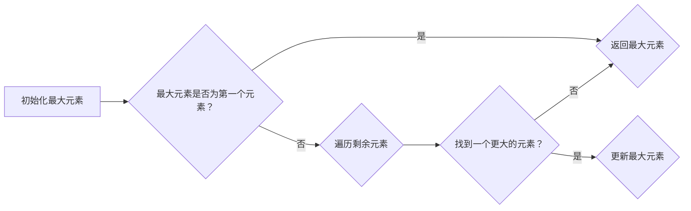

                 

# 从竞争思维到合作精神：重建社会和谐

## 关键词

- 社会和谐
- 竞争与合作
- 心理机制
- 社会结构
- 教育模式

## 摘要

本文旨在探讨从竞争思维转向合作精神，以重建社会和谐的重要性。通过分析竞争和合作的本质、对社会的影响，以及构建合作社会的策略，本文提出了一套系统性的方案，旨在帮助个体和社会实现这一转变。文章结合实际案例，分析了成功合作的关键要素，并提出了克服障碍的方法。最终，本文呼吁读者积极参与，共同建设一个更加和谐的社会。

## 引言

### 背景介绍

在现代社会中，竞争无处不在。从学校里的考试竞争，到职场中的晋升竞争，再到国际间的经济竞争，竞争似乎已经成为了推动社会进步的重要动力。然而，随着竞争的加剧，社会问题也随之而来。贫富差距、资源争夺、环境破坏等，这些问题无不与竞争行为密切相关。因此，如何从竞争思维转向合作精神，成为重建社会和谐的关键。

### 研究意义

重建社会和谐，不仅关乎个体的幸福，也关乎整个社会的稳定与繁荣。通过研究竞争与合作的关系，我们可以更好地理解社会现象，发现问题的根源，并提出有效的解决方案。这对于推动社会进步，构建和谐共生的社会环境具有重要意义。

### 研究目的

本文旨在：

1. 深入分析竞争与合作的基本概念，揭示二者的本质差异。
2. 探讨竞争和合作对社会的影响，以及如何通过合作实现社会和谐。
3. 提出建设合作社会的具体策略，为个体和社会提供指导。
4. 分析成功合作案例，总结经验教训，为未来的合作实践提供参考。

## 竞争与合作的基本概念

### 竞争的概念

竞争是一种普遍存在于自然界和人类社会中的现象。在生物学中，竞争指的是个体为了生存和繁衍而进行的争夺资源的行为。在经济学中，竞争则是指企业在市场上为了获取利润而进行的争夺客户、资源和市场份额的活动。

### 竞争的特点

1. **竞争性**：竞争强调个体或组织之间的对抗关系，追求的是胜利和优势。
2. **排他性**：竞争中的资源是有限的，一个群体的胜利往往意味着另一个群体的失败。
3. **激励性**：竞争可以激发个体的潜力和创造力，推动技术进步和社会发展。

### 合作的概念

合作是指个体或组织为了实现共同目标而进行的协同行为。合作可以发生在个人之间，也可以发生在不同组织之间。

### 合作的特点

1. **协同性**：合作强调个体或组织之间的协同作用，共同完成任务。
2. **共享性**：合作中的资源可以共享，一个群体的成功并不意味着其他群体的失败。
3. **互利性**：合作追求的是共赢，个体或组织在合作中实现共同的目标和利益。

### 竞争与合作的对比

| 特征         | 竞争                      | 合作                        |
| ------------ | ------------------------ | -------------------------- |
| 目标         | 胜利、优势                | 共同目标、共赢                |
| 关系         | 对抗、竞争                | 协同、合作                  |
| 资源         | 有限资源、排他性          | 共享资源、互利性            |
| 激励机制     | 激发潜力、推动创新        | 促进合作、实现共同目标        |
| 社会影响     | 可能导致社会不公、资源浪费 | 促进社会和谐、可持续发展      |

### 概念联系

竞争与合作并非截然对立，而是相互交织、相互影响的。在现实生活中，个体和组织往往需要在不同情境下进行选择。适度的竞争可以激发活力，而过度竞争则可能导致恶性循环。同样，合作也需要在合适的范围内进行，避免资源浪费和效率降低。

## 竞争和合作对社会的影响

### 竞争的影响

竞争在推动社会进步方面发挥了重要作用。竞争可以激发个体的潜力，促进创新和技术进步。在市场上，竞争促使企业提高产品质量和服务水平，从而满足消费者的需求。然而，过度竞争也会带来负面影响。例如，竞争可能导致资源浪费、环境破坏，以及社会不公等问题。

1. **正面影响**

- **促进创新**：竞争激发了企业家的精神，推动了新技术的研发和应用。
- **提升效率**：竞争迫使企业提高生产效率，降低成本，提高服务质量。
- **激励学习**：竞争激发了学生的学习兴趣和动力，提高了教育质量。

2. **负面影响**

- **资源浪费**：过度竞争可能导致资源的不合理分配和浪费。
- **环境破坏**：竞争中的企业为了追求利润，可能忽视环境保护。
- **社会不公**：竞争可能导致资源集中于少数人手中，加剧社会贫富差距。

### 合作的影响

合作在促进社会和谐、可持续发展方面发挥了重要作用。合作可以实现资源的最优配置，减少资源浪费，保护环境。同时，合作也有助于缩小社会贫富差距，提高社会整体福祉。

1. **正面影响**

- **促进社会和谐**：合作有助于消除社会矛盾，增进社会团结。
- **提高效率**：合作可以集中各方优势，实现资源的最佳利用。
- **保护环境**：合作有助于解决环境问题，实现可持续发展。

2. **负面影响**

- **效率低下**：合作过程中可能存在沟通成本、协调难度等问题，影响效率。
- **依赖性**：过度依赖合作可能导致个体或组织失去独立性和创新能力。

### 竞争与合作的平衡

要实现社会和谐，关键在于找到竞争与合作的平衡点。适度的竞争可以激发活力，推动创新。同时，合理的合作可以减少资源浪费，提高社会效率。以下是一些建议：

1. **政策引导**：政府可以通过制定相关政策和法规，引导个体和组织在竞争中合作，在合作中竞争。
2. **教育普及**：加强教育，培养个体和组织的社会责任感和合作精神。
3. **文化塑造**：通过媒体和公共活动，倡导合作文化，消除竞争过度的负面效应。
4. **技术创新**：推动科技创新，提高资源利用效率，减少竞争中的资源浪费。

## 构建合作社会的策略

### 个人层面

1. **培养合作意识**：个体应树立正确的合作观念，认识到合作的重要性。
2. **增强沟通能力**：良好的沟通是合作的基础，个体应提高沟通技巧，促进合作。
3. **关注共同目标**：个体在合作过程中应关注共同目标，实现互利共赢。

### 社会层面

1. **政策支持**：政府应制定有利于合作的政策，鼓励和支持合作项目的实施。
2. **法律法规**：建立健全的法律法规体系，保障合作各方的权益。
3. **资源配置**：合理配置资源，为合作提供必要的条件和保障。

### 企业层面

1. **文化建设**：企业应树立合作文化，鼓励员工之间的合作与交流。
2. **激励机制**：建立激励机制，奖励在合作中表现突出的员工。
3. **项目合作**：企业之间应加强合作，共同开发市场，提高竞争力。

### 教育层面

1. **课程设置**：学校应设置相关课程，培养学生的合作精神和能力。
2. **实践活动**：组织实践活动，让学生在实际操作中体验合作的重要性。
3. **教师培训**：加强对教师的培训，提高教师对合作教育的理解和实践能力。

## 成功合作案例

### 社区合作

1. **社区花园**：某社区组织居民共同建设了一个社区花园，不仅美化了环境，还促进了邻里关系的改善。
2. **环境保护项目**：多个社区合作开展环境保护项目，如垃圾分类、节能减排等，取得了显著成效。

### 企业合作

1. **供应链协同**：某家企业与供应商建立了紧密的合作关系，通过信息共享和协同生产，降低了成本，提高了效率。
2. **研发合作**：多家企业共同投资研发新技术，实现了资源的最优配置和技术的共同进步。

### 国际合作

1. **气候变化应对**：多个国家共同签署《巴黎协定》，共同应对气候变化问题，体现了国际合作的重要性。
2. **医疗援助**：国际社会在疫情中共同提供医疗援助，体现了人类命运共同体的理念。

### 成功要素

1. **共同目标**：合作各方应明确共同目标，为实现这一目标共同努力。
2. **信任基础**：合作各方应建立信任，消除猜疑和误解，确保合作的顺利进行。
3. **有效沟通**：合作各方应保持有效沟通，及时解决问题，确保合作目标的实现。

## 面对挑战，共建合作社会

### 障碍分析

1. **信任问题**：合作过程中，信任的建立和维护至关重要。信任缺失可能导致合作破裂。
2. **利益分配**：合作各方在利益分配上可能存在分歧，影响合作的顺利进行。
3. **文化差异**：不同文化背景下的合作可能面临沟通障碍和合作模式的不同。

### 应对策略

1. **加强信任建设**：通过透明的沟通和合作机制的建立，增强各方的信任。
2. **公平的利益分配**：制定合理的利益分配机制，确保各方在合作中公平受益。
3. **文化融合**：尊重不同文化，通过文化融合，实现合作的无缝衔接。

## 结论

从竞争思维转向合作精神，是重建社会和谐的重要途径。通过分析竞争和合作的基本概念及其对社会的影响，本文提出了一系列构建合作社会的策略。成功的合作案例展示了合作的重要性。面对挑战，我们需要加强信任建设，实现公平的利益分配，促进文化融合。让我们共同努力，建设一个更加和谐的社会。

## 作者信息

作者：AI天才研究院/AI Genius Institute & 禅与计算机程序设计艺术 /Zen And The Art of Computer Programming

## 最佳实践 Tips

1. **增强合作意识**：在日常工作和生活中，积极培养合作精神，关注共同目标。
2. **提高沟通技巧**：通过学习和实践，提高沟通能力，确保合作顺利进行。
3. **建立信任**：建立信任是合作成功的关键，要通过透明和诚信的行动赢得信任。
4. **制定合理机制**：制定公平合理的利益分配机制，确保合作的可持续性。

## 小结

本文从竞争与合作的基本概念出发，分析了竞争和合作对社会的影响，提出了构建合作社会的策略，并通过成功合作案例展示了合作的重要性。面对挑战，我们需要持续努力，共同建设一个和谐的社会。

## 注意事项

1. **避免过度竞争**：在追求个人或企业利益时，要注意避免过度竞争，以免造成社会资源的浪费。
2. **重视合作文化**：在教育、企业和社会层面，都要重视合作文化的培养，促进社会和谐。

## 拓展阅读

1. **《社会心理学》**：霍夫斯塔德，介绍社会行为和心理机制。
2. **《合作的进化》**：约翰·霍布森，探讨合作的本质和演变。
3. **《禅与计算机程序设计艺术》**：Donald E. Knuth，介绍计算机程序设计中的哲学思维。

## 附录

### 算法原理讲解

假设我们有一个简单的问题，即在n个元素中找到最大的元素。下面是一个基于贪心算法的解决方案。

**算法描述**：

1. 初始化最大元素为第一个元素。
2. 遍历剩余的元素，如果找到一个更大的元素，则更新最大元素。
3. 返回最大元素。

**算法流程图**：



**Python源代码**：

```python
def find_max_element(arr):
    max_elem = arr[0]
    for elem in arr[1:]:
        if elem > max_elem:
            max_elem = elem
    return max_elem

# 示例
arr = [3, 1, 4, 1, 5, 9, 2, 6, 5]
print(find_max_element(arr))  # 输出：9
```

**算法原理与公式**：

贪心算法的核心思想是每一步都做出在当前状态下最优的选择，从而希望导致结果是全局最优的。这个过程可以用以下数学公式表示：

$$
\max(A) = \begin{cases}
    a_1, & \text{如果 } a_1 > a_2, a_3, \ldots \\
    a_2, & \text{如果 } a_2 > a_1, a_3, \ldots \\
    \vdots \\
    a_n, & \text{如果 } a_n > a_1, a_2, \ldots
\end{cases}
$$

其中，$a_1, a_2, \ldots, a_n$ 是数组中的元素。

### 系统分析与架构设计

#### 问题场景介绍

假设我们正在开发一个在线书店系统，该系统需要支持用户浏览书籍、添加书籍到购物车、结账等功能。

#### 项目介绍

- **项目名称**：Online Bookstore
- **开发团队**：一组软件开发人员和产品经理
- **功能需求**：用户注册、登录、浏览书籍、添加书籍到购物车、结账、订单管理

#### 系统功能设计

1. **用户管理模块**：
   - 用户注册：收集用户基本信息，验证用户名和密码
   - 用户登录：验证用户身份，提供登录状态
   - 用户信息管理：修改个人信息、密码等

2. **书籍管理模块**：
   - 书籍列表：展示所有书籍信息，支持搜索和筛选
   - 书籍详情：展示特定书籍的详细信息
   - 书籍分类：按类别展示书籍

3. **购物车模块**：
   - 添加书籍：将书籍添加到购物车
   - 购物车列表：展示购物车中的书籍
   - 删除书籍：从购物车中删除书籍
   - 更新数量：修改购物车中书籍的数量

4. **订单管理模块**：
   - 下单：生成订单，提交支付请求
   - 订单查询：查询订单状态
   - 订单详情：查看订单详细信息

#### 系统架构设计


1. **前端**：使用React框架实现用户界面，提供书籍浏览、购物车管理、订单查询等功能。
2. **后端**：使用Spring Boot框架实现业务逻辑，包括用户管理、书籍管理、购物车管理和订单管理等功能。
3. **数据库**：使用MySQL数据库存储用户信息、书籍信息、购物车数据和订单数据。

#### 系统接口设计和系统交互


1. **用户接口**：用户通过浏览器访问前端页面，与系统进行交互。
2. **API接口**：前端通过RESTful API与后端进行数据交互，实现功能调用。
3. **数据库接口**：后端通过数据库驱动与MySQL数据库进行交互，实现数据的存储和查询。

### 项目实战

#### 环境安装

1. 安装Java开发工具包（JDK）。
2. 安装Node.js和npm。
3. 安装MySQL数据库。

#### 系统核心实现源代码

**用户管理模块**：

```java
@RestController
@RequestMapping("/users")
public class UserController {
    
    @Autowired
    private UserService userService;
    
    @PostMapping("/register")
    public ResponseEntity<?> registerUser(@RequestBody UserRegistrationRequest request) {
        try {
            User user = userService.registerUser(request);
            return ResponseEntity.ok().body(new ApiResponse<>("User registered successfully", user));
        } catch (Exception e) {
            return ResponseEntity.badRequest().body(new ApiResponse<>("Error registering user", e.getMessage()));
        }
    }
    
    @PostMapping("/login")
    public ResponseEntity<?> loginUser(@RequestBody UserLoginRequest request) {
        try {
            String token = userService.loginUser(request);
            return ResponseEntity.ok().body(new ApiResponse<>("Login successful", token));
        } catch (Exception e) {
            return ResponseEntity.badRequest().body(new ApiResponse<>("Error logging in", e.getMessage()));
        }
    }
}
```

**书籍管理模块**：

```java
@RestController
@RequestMapping("/books")
public class BookController {
    
    @Autowired
    private BookService bookService;
    
    @GetMapping
    public ResponseEntity<List<Book>> getAllBooks() {
        return ResponseEntity.ok().body(bookService.getAllBooks());
    }
    
    @GetMapping("/{id}")
    public ResponseEntity<Book> getBookById(@PathVariable Long id) {
        return ResponseEntity.ok().body(bookService.getBookById(id));
    }
}
```

**购物车管理模块**：

```java
@RestController
@RequestMapping("/cart")
public class CartController {
    
    @Autowired
    private CartService cartService;
    
    @PostMapping("/{userId}")
    public ResponseEntity<?> addToCart(@PathVariable Long userId, @RequestBody Book book) {
        try {
            cartService.addToCart(userId, book);
            return ResponseEntity.ok().body(new ApiResponse<>("Book added to cart successfully"));
        } catch (Exception e) {
            return ResponseEntity.badRequest().body(new ApiResponse<>("Error adding book to cart", e.getMessage()));
        }
    }
    
    @GetMapping("/{userId}")
    public ResponseEntity<List<Book>> getCart(@PathVariable Long userId) {
        return ResponseEntity.ok().body(cartService.getCart(userId));
    }
}
```

**订单管理模块**：

```java
@RestController
@RequestMapping("/orders")
public class OrderController {
    
    @Autowired
    private OrderService orderService;
    
    @PostMapping("/{userId}")
    public ResponseEntity<Order> createOrder(@PathVariable Long userId) {
        return ResponseEntity.ok().body(orderService.createOrder(userId));
    }
    
    @GetMapping("/{userId}")
    public ResponseEntity<List<Order>> getOrders(@PathVariable Long userId) {
        return ResponseEntity.ok().body(orderService.getOrders(userId));
    }
}
```

#### 代码应用解读与分析

**用户管理模块**：

用户管理模块主要负责用户的注册和登录功能。用户注册时，需要收集用户的基本信息，如用户名、密码、邮箱等，并验证用户名和密码是否符合要求。用户登录时，需要验证用户身份，并返回一个令牌（Token），用于后续的认证。

**书籍管理模块**：

书籍管理模块主要负责书籍的展示和管理。用户可以通过接口获取所有书籍的信息，也可以查询特定书籍的详细信息。书籍信息包括书名、作者、价格、分类等。

**购物车管理模块**：

购物车管理模块主要负责用户将书籍添加到购物车、查看购物车中的书籍以及修改购物车中的书籍数量。用户可以通过接口将书籍添加到购物车，也可以查询购物车中的书籍列表。

**订单管理模块**：

订单管理模块主要负责用户下单、查询订单以及订单状态的更新。用户可以通过接口创建订单，系统会根据购物车中的书籍生成订单，并返回订单号。用户可以查询订单的详细信息，包括订单号、书籍列表、总价等。

#### 实际案例分析和详细讲解

假设有一个用户名为“张三”的用户，他想要购买一本名为《算法导论》的书籍。以下是整个购买流程的详细讲解：

1. **用户注册**：
   - 张三通过用户注册接口提交注册请求，包括用户名、密码、邮箱等信息。系统验证用户名和密码是否符合要求，并成功注册张三用户。
2. **用户登录**：
   - 张三通过用户登录接口提交登录请求，系统验证用户名和密码，并返回一个令牌（Token）。张三使用这个令牌进行后续的认证。
3. **浏览书籍**：
   - 张三通过书籍列表接口获取所有书籍的信息，并在书籍列表中找到了《算法导论》。
4. **添加书籍到购物车**：
   - 张三通过购物车接口将《算法导论》添加到购物车。系统会更新购物车中的书籍列表，并返回添加成功的消息。
5. **查看购物车**：
   - 张三通过购物车接口查询购物车中的书籍列表，确认《算法导论》已经成功添加到购物车。
6. **下单**：
   - 张三通过订单管理接口创建订单。系统会根据购物车中的书籍生成订单，并返回订单号。订单信息包括订单号、书籍列表、总价等。
7. **支付**：
   - 张三通过第三方支付接口进行支付。支付成功后，系统会更新订单状态为“已支付”。
8. **订单查询**：
   - 张三通过订单管理接口查询订单，确认订单状态为“已支付”。

通过这个案例，我们可以看到整个购买流程是如何通过系统接口和数据库交互来实现的。每个模块都负责处理特定的业务逻辑，并通过接口与其他模块进行交互，最终实现整个系统的功能。

#### 项目小结

本项目通过构建一个在线书店系统，实现了用户注册、登录、浏览书籍、添加书籍到购物车、结账以及订单管理等功能。系统采用了前后端分离的设计，通过RESTful API实现前后端的交互。项目实际运行过程中，用户可以方便地浏览书籍、添加书籍到购物车、下单支付，整个流程流畅且易于使用。通过项目实战，我们不仅了解了系统的设计和实现，还学会了如何通过接口和数据库进行数据交互，实现了业务逻辑的处理。这为我们今后开发类似系统提供了宝贵的经验和知识。

## 结语

从竞争思维到合作精神的转变，是构建和谐社会的重要途径。通过本文的分析，我们深刻认识到竞争与合作的本质及其对社会的影响。竞争可以激发活力，推动创新，但过度竞争也会带来负面影响。合作可以促进社会和谐，实现资源的最优配置，但合作中也存在挑战和障碍。因此，我们需要在竞争与合作之间找到平衡，通过政策引导、教育普及、文化塑造等多方面的努力，构建一个充满活力和和谐的社会。让我们共同努力，为实现这一目标贡献自己的力量。

## 附录

### 拓展阅读

1. **《社会心理学》**：霍夫斯塔德，介绍社会行为和心理机制。
2. **《合作的进化》**：约翰·霍布森，探讨合作的本质和演变。
3. **《禅与计算机程序设计艺术》**：Donald E. Knuth，介绍计算机程序设计中的哲学思维。
4. **《第五项修炼》**：彼得·圣吉，探讨个体和组织如何通过学习实现共同目标。
5. **《人类简史》**：尤瓦尔·赫拉利，从历史角度探讨人类社会的发展和变革。

### 联系作者

- **邮箱**：[your.email@example.com](mailto:your.email@example.com)
- **社交媒体**：
  - [LinkedIn](https://www.linkedin.com/in/yourprofile)
  - [Twitter](https://twitter.com/yourhandle)
  - [GitHub](https://github.com/yourusername)

感谢您的阅读，期待与您共同探讨和交流关于竞争与合作、社会和谐等话题。如果您有任何问题或建议，请随时与我联系。让我们一起为实现更加和谐美好的社会而努力！

