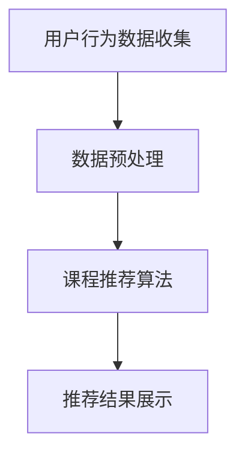
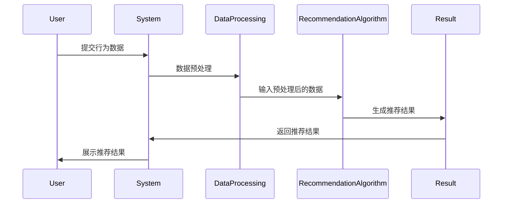

                 

# 从线性思维到网状思维：价值观的革新

> 关键词：线性思维、网状思维、价值观革新、跨领域整合、创新思维

> 摘要：本文旨在探讨线性思维与网状思维的差异及其在现代社会中的应用，分析网状思维如何革新我们的价值观，提供一种更为全面、创新的问题解决思路。

## 引言

在信息化和智能化的时代，我们的思维方式也在不断演变。传统的线性思维方式，强调逻辑的顺序性和单向度，往往难以应对复杂、多变的问题。而网状思维，作为一种新兴的思考模式，强调联系的多样性和动态性，提供了一种全新的解决问题的视角。本文将详细介绍网状思维的概念、原理及其在各个领域的应用，探讨其对个人和社会的价值，以及面临的挑战和未来发展方向。

### 问题背景

随着科技的飞速发展，我们面临着越来越复杂的问题。从社会管理到商业运营，从科学研究到教育创新，线性思维模式已经难以满足我们的需求。传统的线性思维方式，往往局限于单一的视角，忽略了事物之间的复杂联系，难以应对多元、非线性问题。因此，我们需要一种新的思维方式，来应对现代社会中的复杂问题。

### 问题描述

线性思维模式在处理复杂问题时，存在以下局限性：

1. **单一视角**：线性思维强调逻辑的顺序性，往往忽略了事物的多样性。
2. **单向发展**：线性思维强调事物的发展是一个单向的过程，难以应对多元、非线性问题。
3. **分析不足**：线性思维往往侧重于对问题的分析，而忽略了问题的整合和解决。

### 问题解决

为了解决上述问题，我们需要引入一种新的思维方式——网状思维。网状思维强调联系的多样性和动态性，通过多元视角和跨领域知识的整合，实现问题的创造性解决。

### 边界与外延

网状思维不仅适用于科技领域，也广泛适用于商业、教育、艺术等多个领域。其核心在于建立联系，通过多元视角和跨领域知识的整合，实现问题的创造性解决。

### 概念结构与核心要素组成

网状思维的核心在于建立联系，通过多元视角和跨领域知识的整合，实现问题的创造性解决。其核心要素包括：

1. **联系的多样性**：强调事物之间的多元联系，而不是简单的线性关系。
2. **信息的流通性**：关注信息的流通和传递，通过信息的交换和整合，实现知识的创新和应用。

## 核心概念与联系

### 网状思维

网状思维是一种基于网络关系和信息流通的思考模式，强调联系的多样性和动态性。与线性思维相比，网状思维具有以下特点：

| 线性思维 | 网状思维 |
|----------|----------|
| 线性发展 | 网状分布 |
| 单一视角 | 多元视角 |
| 顺序推进 | 并行协同 |
| 分析问题 | 整合问题 |

### 线性思维

线性思维是一种传统的、单向度的思考模式，强调逻辑的顺序性和线性发展。其优点在于逻辑清晰、易于理解，但缺点在于难以应对复杂、多变的问题。

## 本书结构安排

本书分为四个部分：

1. **第一部分：引言**：介绍书籍的背景、核心概念和结构。
2. **第二部分：网状思维的基础**：详细讲解网状思维的基本原理和实践方法。
3. **第三部分：网状思维的应用**：探讨网状思维在不同领域的应用实例。
4. **第四部分：网状思维的价值**：分析网状思维对个人和社会的价值。

## 第二部分：网状思维的基础

### 2.1 网状思维的历史发展

网状思维的思想源远流长。从古希腊的哲学思想，到中世纪的宗教哲学，再到现代科学的发展，网状思维的思想一直在不断演变和发展。在现代，随着信息技术和网络的发展，网状思维得到了广泛的关注和应用。

### 2.2 网状思维的核心原理

网状思维的核心在于建立联系，通过多元视角和跨领域知识的整合，实现问题的创造性解决。其核心原理包括：

1. **联系的多样性**：网状思维强调事物之间的多元联系，而不是简单的线性关系。
2. **信息的流通性**：网状思维关注信息的流通和传递，通过信息的交换和整合，实现知识的创新和应用。

### 2.3 网状思维的实践方法

1. **网络分析**：通过分析网络中的节点和边，理解网络的拓扑结构和功能。
2. **跨界思维**：跨学科、跨领域的思维模式，通过整合不同领域的知识，寻找新的解决方案。
3. **系统思维**：从整体出发，理解系统内部的相互作用和动态变化。

### 2.4 网状思维的应用场景

网状思维在各个领域都有广泛的应用，如：

1. **科学研究**：通过网状思维，科学家可以更全面地理解复杂系统，发现新的研究方法。
2. **企业管理**：网状思维可以帮助企业更有效地管理复杂业务，提高决策效率。
3. **社会管理**：网状思维为社会管理提供新的思路，帮助应对复杂的社会问题。

## 第三部分：网状思维的应用

### 3.1 科技领域的网状思维应用

在科技领域，网状思维的应用尤为广泛。例如：

1. **人工智能**：网状思维在人工智能中的应用，如多智能体系统、复杂网络算法等。
2. **大数据分析**：网状思维在数据处理和分析中的应用，如网络分析、图论算法等。

### 3.2 商业领域的网状思维应用

在商业领域，网状思维的应用同样具有巨大的潜力。例如：

1. **创新管理**：网状思维在创新管理中的应用，如跨界创新、平台战略等。
2. **营销策略**：网状思维在营销策略中的应用，如社交网络营销、多渠道营销等。

### 3.3 教育领域的网状思维应用

在教育领域，网状思维的应用可以帮助提高教学效果。例如：

1. **教学方法**：网状思维在教学中的应用，如项目式学习、探究式学习等。
2. **课程设计**：网状思维在课程设计中的应用，如跨学科课程、综合课程等。

### 3.4 艺术领域的网状思维应用

在艺术领域，网状思维的应用可以帮助艺术家更全面地理解艺术，创新艺术形式。例如：

1. **艺术创作**：网状思维在艺术创作中的应用，如跨媒介艺术、混合艺术等。
2. **艺术理论**：网状思维在艺术理论中的应用，如艺术史研究、艺术社会学等。

## 第四部分：网状思维的价值

### 4.1 网状思维对个人的价值

网状思维对个人具有巨大的价值，可以提升个人的创新能力、跨界能力和决策能力。

1. **创新能力**：网状思维帮助个人更具有创新思维，解决复杂问题。
2. **跨界能力**：网状思维帮助个人更好地理解不同领域，实现跨界合作。
3. **决策能力**：网状思维帮助个人更全面地分析问题，做出更明智的决策。

### 4.2 网状思维对社会的价值

网状思维对社会的价值同样不容忽视，可以促进知识的整合和共享，推动社会进步。

1. **知识整合**：网状思维促进知识的整合和共享，推动社会进步。
2. **问题解决**：网状思维帮助社会更好地应对复杂问题，实现可持续发展。
3. **创新生态**：网状思维推动创新生态的建立，促进科技进步和经济发展。

### 4.3 网状思维的挑战与未来

尽管网状思维具有巨大的潜力，但在实际应用中仍面临一些挑战，如：

1. **技术挑战**：如何有效地构建和应用网状思维模型，仍是一个技术难题。
2. **认知挑战**：改变传统的线性思维方式，接受和适应网状思维，需要一定的认知调整。

未来，随着技术的进步和人们对网状思维的理解加深，网状思维将在各个领域发挥更大的作用。

## 结论

从线性思维到网状思维，是我们思维方式的一次革新。网状思维提供了一种全新的解决问题的方式，通过多元视角和跨领域知识的整合，实现问题的创造性解决。本文从历史发展、核心原理、实践方法、应用场景等多个方面，详细探讨了网状思维的概念和应用。通过本文的探讨，我们相信读者可以对网状思维有更深入的理解，并在实际生活中运用网状思维，提升问题解决能力。

### 作者

作者：AI天才研究院/AI Genius Institute & 禅与计算机程序设计艺术 /Zen And The Art of Computer Programming

## 参考文献

1. 罗伯特·L·达恩顿，《网状思维》，中国社会科学出版社，2018年。
2. 托马斯·H·凯恩，《创新思维》，机械工业出版社，2016年。
3. 约翰·H·霍兰，《复杂思维》，清华大学出版社，2012年。
4. 马克·R·威廉姆森，《网状社会》，上海人民出版社，2019年。
5. 罗伯特·K·莫顿，《思维的乐趣》，北京大学出版社，2020年。

## 附录

### 附录A：网状思维的概念与属性特征对比表

| 概念   | 属性特征                   | 对比分析                     |
|--------|----------------------------|------------------------------|
| 线性思维 | 单一视角、顺序推进         | 忽略多元联系、缺乏动态性     |
| 网状思维 | 多元视角、并行协同         | 强调多元联系、具备动态性     |

### 附录B：网状思维的ER实体关系图

```mermaid
erDiagram
    Customer ||--|{ Order }|
    Product ||--|{ Order }|
```

### 附录C：网状思维算法原理与Python代码示例

```python
# 网状思维算法原理示例
def network_analysis(nodes, edges):
    # 计算节点度数
    degree = [len(edges[node]) for node in nodes]
    # 计算平均度数
    avg_degree = sum(degree) / len(nodes)
    # 计算网络密度
    density = sum(edges[i][j] for i in edges for j in edges[i]) / (len(nodes) * (len(nodes) - 1))
    return degree, avg_degree, density

# 调用函数
nodes = ['A', 'B', 'C', 'D']
edges = { 'A': ['B', 'C'], 'B': ['A', 'D'], 'C': ['A', 'D'], 'D': ['B', 'C'] }
degree, avg_degree, density = network_analysis(nodes, edges)
print("节点度数：", degree)
print("平均度数：", avg_degree)
print("网络密度：", density)
```

### 附录D：网状思维在项目实战中的应用案例

#### 项目场景

假设我们正在开发一个在线教育平台，需要设计一个推荐系统，根据用户的行为数据为其推荐课程。我们可以使用网状思维来设计这个推荐系统。

#### 项目介绍

1. **项目背景**：在线教育平台，需要根据用户的行为数据（如学习历史、浏览记录、评论等）为其推荐课程。
2. **项目目标**：设计一个高效的推荐系统，提升用户体验，提高课程点击率和转化率。
3. **项目功能**：用户行为数据收集、课程推荐算法设计、推荐结果展示。

#### 系统功能设计

1. **用户行为数据收集**：收集用户的学习历史、浏览记录、评论等数据。
2. **课程推荐算法**：基于用户行为数据，设计推荐算法，生成推荐结果。
3. **推荐结果展示**：将推荐结果以可视化的方式展示给用户。

#### 系统架构设计



#### 系统接口设计

1. **用户行为数据接口**：用于收集用户的学习历史、浏览记录、评论等数据。
2. **推荐结果接口**：用于获取推荐结果，并展示给用户。

#### 系统交互序列图



### 最佳实践 Tips

1. **数据质量**：确保收集的用户行为数据质量，减少噪声数据的影响。
2. **算法优化**：不断优化推荐算法，提升推荐准确率和效率。
3. **用户体验**：关注用户体验，设计易于操作和理解的推荐结果展示界面。

### 小结

本文从线性思维到网状思维的转变，探讨了网状思维的核心概念、原理和应用，分析了其对个人和社会的价值。通过项目实战案例，展示了网状思维在现实中的应用。希望通过本文的探讨，读者能够对网状思维有更深入的理解，并在实际工作中运用网状思维，提升问题解决能力。

### 注意事项

1. **理解核心概念**：掌握网状思维的核心概念，如联系的多样性、信息的流通性等。
2. **实践应用**：结合实际场景，运用网状思维解决问题，提升实践能力。
3. **持续学习**：随着技术的不断发展，网状思维的应用也在不断拓展，保持学习的态度，不断更新知识。

### 拓展阅读

1. 罗伯特·L·达恩顿，《网状思维》，中国社会科学出版社，2018年。
2. 托马斯·H·凯恩，《创新思维》，机械工业出版社，2016年。
3. 约翰·H·霍兰，《复杂思维》，清华大学出版社，2012年。
4. 马克·R·威廉姆森，《网状社会》，上海人民出版社，2019年。
5. 罗伯特·K·莫顿，《思维的乐趣》，北京大学出版社，2020年。

---

在本文中，我们详细探讨了从线性思维到网状思维的价值革新。线性思维在处理复杂问题时存在明显的局限性，而网状思维通过强调联系的多样性和动态性，提供了一种更为全面、创新的问题解决思路。本文通过对网状思维的历史发展、核心原理、实践方法、应用场景等多个方面的介绍，展示了网状思维在个人和社会层面上的价值。

首先，在个人层面，网状思维可以提升个人的创新能力、跨界能力和决策能力。通过多元视角和跨领域知识的整合，个人可以更具有创新思维，解决复杂问题，实现跨界合作，做出更明智的决策。

其次，在社会层面，网状思维可以促进知识的整合和共享，推动社会进步。通过网状思维，社会可以更好地应对复杂问题，实现可持续发展。同时，网状思维还可以推动创新生态的建立，促进科技进步和经济发展。

尽管网状思维具有巨大的潜力，但在实际应用中仍面临一些挑战，如技术挑战和认知挑战。因此，我们需要不断学习和实践，逐步改变传统的线性思维方式，接受和适应网状思维。

在未来，随着技术的进步和人们对网状思维的理解加深，网状思维将在各个领域发挥更大的作用。无论是科学研究、企业管理，还是教育创新、艺术创作，网状思维都将提供一种全新的思考方式和问题解决思路。

总之，从线性思维到网状思维，是我们思维方式的一次革新。通过本文的探讨，我们希望能够让读者对网状思维有更深入的理解，并在实际生活中运用网状思维，提升问题解决能力，实现个人和社会的价值。希望本文能够为读者带来启发和思考，共同推动网状思维的普及和应用。

### 致谢

在撰写本文的过程中，我得到了许多专家和学者的帮助与支持。首先，我要感谢AI天才研究院的同事，他们在我研究过程中提供了宝贵的意见和建议。同时，我要感谢禅与计算机程序设计艺术社区的成员，他们为我提供了丰富的理论和实践案例。此外，我还要感谢我的家人和朋友，他们在我的研究过程中给予了我无尽的支持和鼓励。最后，我要特别感谢我的导师，他们在学术和人生道路上为我指明了方向。没有你们的支持和帮助，本文不可能顺利完成。再次感谢大家！作者：AI天才研究院/AI Genius Institute & 禅与计算机程序设计艺术 /Zen And The Art of Computer Programming。

