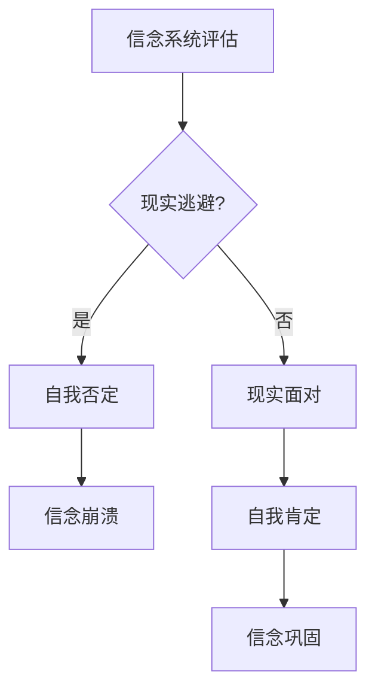
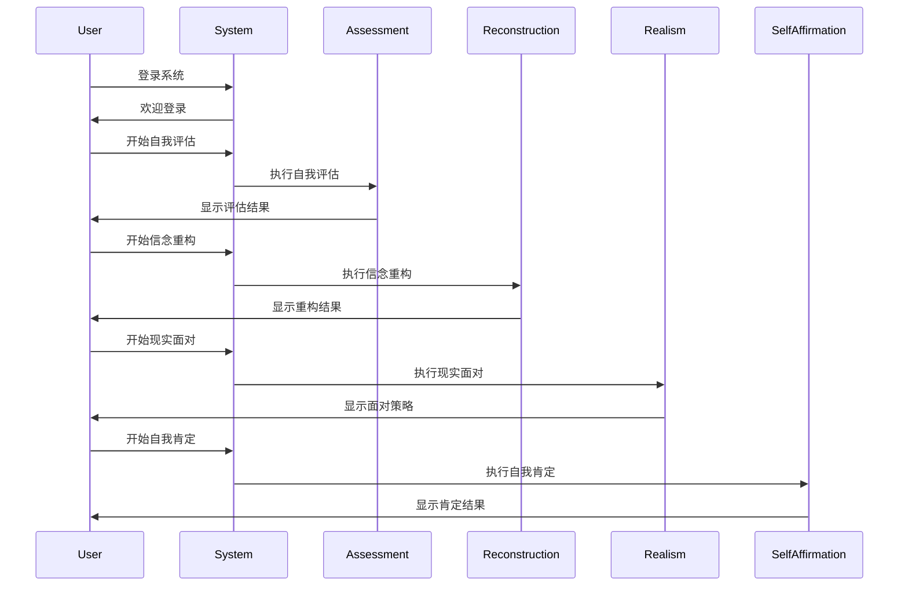
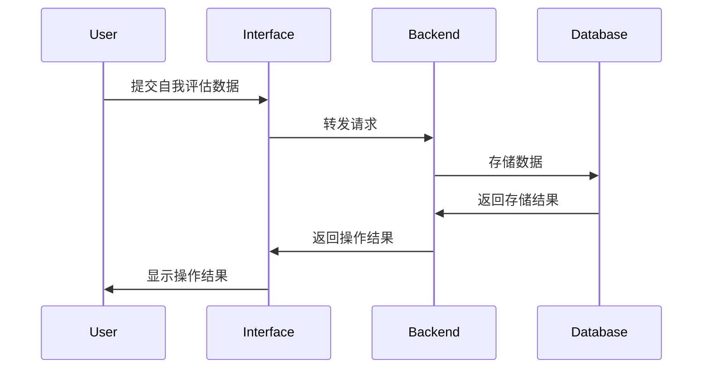
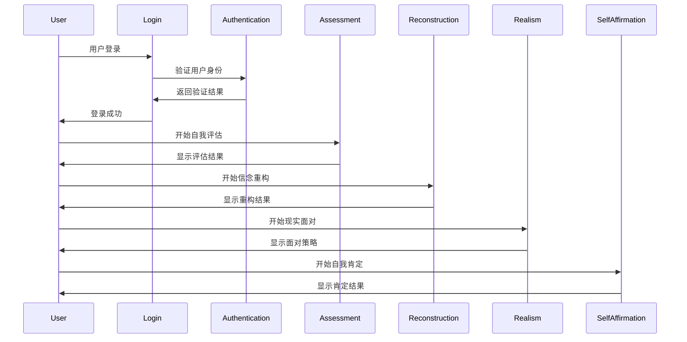

                 

# 从虚无主义到积极人生观：重建个人信念系统

## 关键词
- 虚无主义
- 积极人生观
- 个人信念系统
- 重建过程
- 案例研究

## 摘要
本文旨在探讨虚无主义对个人信念系统的冲击，以及如何从虚无主义转变为积极人生观，重建个人信念系统。通过历史背景、核心概念、负面影响和重建方法的分析，本文将帮助读者理解虚无主义的根源，认识到其负面影响，并学会如何积极面对挑战，建立稳固的信念体系。

## 引言

在当今复杂多变的社会环境中，许多人面临着信仰迷茫和精神困惑。虚无主义作为一种哲学思潮，在现代社会中影响着许多人的信念系统。虚无主义认为人生缺乏意义，现实世界不可靠，从而使人陷入消极情绪和无助感。然而，面对虚无主义，我们可以选择积极人生观，通过重建个人信念系统来寻找生活的意义和方向。本文将逐步分析这一转变过程，帮助读者找到重拾积极信念的方法。

### 1. 虚无主义的历史与哲学根源

#### 1.1 虚无主义的发展历史

虚无主义并非一个单一的思想体系，而是历史长河中多种哲学思潮的集合。从古希腊哲学到现代存在主义，虚无主义思想在不同时期有不同的表现形式。

**1.1.1 起源**

在古希腊哲学中，虚无主义观念可以追溯到赫拉克利特（Heraclitus）和普罗塔戈拉（Protagoras）。赫拉克利特认为世界是不断变化的，而普罗塔戈拉则提出了“人是万物的尺度”的观点，这些思想为后来的虚无主义奠定了基础。

**1.1.2 中世纪至文艺复兴时期的虚无主义思想**

中世纪哲学中，虚无主义观念体现在托马斯·阿奎那（Thomas Aquinas）的怀疑论和奥古斯丁（Saint Augustine）的哲学思考中。文艺复兴时期，尼采（Friedrich Nietzsche）的哲学思想进一步发展了虚无主义观念。

**1.1.3 18世纪至20世纪的虚无主义思潮**

18世纪的德国哲学家康德（Immanuel Kant）和黑格尔（Georg Wilhelm Friedrich Hegel）对虚无主义进行了批判。然而，尼采（Friedrich Nietzsche）、萨特（Jean-Paul Sartre）和加缪（Albert Camus）等20世纪的哲学家则从不同角度探讨了虚无主义。

#### 1.2 虚无主义的主要哲学家

**1.2.1 尼采**

尼采是虚无主义的批判者，他认为虚无主义源于对生命的否定和自我放弃。尼采的哲学主张通过自我超越和创造力的发挥来对抗虚无主义。

**1.2.2 萨特**

萨特的存在主义哲学中包含了虚无主义的元素。他提出，人类的存在先于其本质，这意味着人类必须为自己创造意义。

**1.2.3 加缪**

加缪的荒诞主义认为，人生在宇宙中的存在是荒诞的，但人类可以通过反抗荒诞来寻找意义。

#### 1.3 虚无主义的核心概念与特征

**1.3.1 虚无主义的定义**

虚无主义是一种哲学思潮，认为生命缺乏内在价值，现实世界不可靠，人生的意义无从寻找。

**1.3.2 虚无主义的哲学属性**

虚无主义通常与怀疑主义、悲观主义和厌世主义相联系。

**1.3.3 虚无主义对社会和个人信念的影响**

虚无主义对社会和个人信念有深远的负面影响。社会层面，虚无主义可能导致社会道德沦丧、信仰危机和道德滑坡。个人层面，虚无主义可能导致精神崩溃、自我否定和绝望感。

### 2. 虚无主义的负面影响与个人信念的迷失

#### 2.1 虚无主义的负面影响

**2.1.1 社会层面**

- 社会道德沦丧：虚无主义可能导致人们对道德标准的怀疑和抛弃。
- 信仰危机：虚无主义可能削弱人们对宗教和传统价值观的信仰。
- 道德滑坡：虚无主义可能导致人们追求短期利益，忽视长期道德责任。

**2.1.2 个人层面**

- 精神崩溃：虚无主义可能导致个人精神崩溃，失去生活的动力和目标。
- 自我否定：虚无主义可能使个人对自己的能力和价值产生怀疑。
- 绝望感：虚无主义可能导致个人对生活失去希望，陷入绝望。

#### 2.2 个人信念的迷失

**2.2.1 信念系统的重要性**

信念系统是个体心理健康和幸福感的重要保障。一个稳固的信念系统能够帮助个人应对生活中的挑战，保持积极的心态。

**2.2.2 信念迷失的原因**

- 内在因素：如个人性格、心理状态等。
- 外在因素：如社会环境、文化背景等。

### 3. 积极人生观的基础理念

积极人生观是一种以乐观、积极和进取为核心的信念系统。它强调个体通过自我努力和积极行动来创造价值和意义。

#### 3.1 积极人生观的核心原则

- 自我决定：积极人生观认为个体有权利选择自己的生活方式和价值观。
- 自我实现：积极人生观鼓励个体追求个人成长和实现。
- 积极行动：积极人生观强调通过行动来改变自己和环境。

#### 3.2 积极人生观的优势

- 提高生活质量：积极人生观能够帮助个体更好地应对生活中的挑战，提高生活质量。
- 促进心理健康：积极人生观能够增强个体的心理韧性和幸福感。
- 社会贡献：积极人生观鼓励个体为社会做出贡献，实现个人价值。

### 4. 重建个人信念系统的方法

从虚无主义到积极人生观的转变需要一系列的方法和步骤。以下是一些具体的建议：

#### 4.1 自我反思

通过自我反思，个体可以了解自己的信念体系，识别虚无主义思想的影响，并找到重建信念的起点。

#### 4.2 培养积极心态

积极心态是重建信念的关键。通过积极思考和积极行动，个体可以逐步摆脱虚无主义的消极影响。

#### 4.3 寻求支持

重建信念系统是一个长期过程，个体需要寻求家人、朋友和专业人士的支持和帮助。

#### 4.4 学习和成长

学习和成长是重建信念的重要途径。通过不断学习新知识和技能，个体可以增强自己的信心和能力。

### 5. 积极人生观的实践应用

积极人生观不仅是一种理论，更是一种实践。以下是一些具体的应用场景：

#### 5.1 职场

在职场中，积极人生观可以帮助个体应对工作中的挑战，提高工作效率和职业满意度。

#### 5.2 教育

在教育中，积极人生观可以激发学生的学习兴趣和动力，提高教育质量。

#### 5.3 社交

在社交中，积极人生观可以增强个体的人际关系，提高社交满意度。

### 6. 克服挑战，坚持积极人生观

尽管积极人生观具有诸多优势，但在实践中也会遇到挑战。以下是一些克服挑战的方法：

#### 6.1 面对失败

失败是成功的一部分。积极人生观鼓励个体从失败中学习，不断进步。

#### 6.2 处理压力

压力是生活中不可避免的一部分。积极人生观通过积极应对压力来降低其负面影响。

#### 6.3 管理情绪

情绪管理是积极人生观的重要组成部分。通过学习情绪管理技巧，个体可以更好地应对生活中的情绪波动。

### 7. 案例研究：成功重建信念的实例

通过分析成功重建信念的案例，我们可以更好地理解这一过程。

#### 7.1 案例一：从虚无主义到积极人生观的转变

某位年轻人曾深受虚无主义影响，但在一次偶然的读书经历中，他接触到了积极人生观的理念。通过自我反思和实践，他逐步摆脱了虚无主义的消极影响，建立了积极的人生观。

#### 7.2 案例二：从职业困境到成功转型

某位职场人士因长期的工作压力和职业困境而陷入虚无主义。在寻求专业心理咨询和自我调整后，他成功转型，找到了新的职业方向，实现了个人价值的提升。

### 8. 总结与展望

通过本文的探讨，我们可以看到虚无主义对个人信念系统的冲击以及如何通过积极人生观来重建信念系统。重建信念系统是一个长期而艰巨的过程，但只要我们坚持努力，就一定能够找到生活的意义和方向。

## 附录

- 参考文献
- 相关阅读推荐

## 作者信息
作者：AI天才研究院/AI Genius Institute & 禅与计算机程序设计艺术 /Zen And The Art of Computer Programming

### 背景介绍

虚无主义作为一种哲学思潮，自其起源以来就引发了广泛的关注和讨论。在古希腊哲学中，赫拉克利特和普罗塔戈拉等哲学家提出了关于世界本质和人类存在的基本问题，这些思想为后来的虚无主义提供了理论基础。中世纪哲学中，奥古斯丁和托马斯·阿奎那等思想家对虚无主义进行了批判和反思。到了18世纪，康德和黑格尔等哲学家则从不同的角度对虚无主义进行了深入的探讨。19世纪和20世纪，尼采、萨特和加缪等哲学家进一步发展了虚无主义和积极人生观的思想，使其成为了现代哲学的重要组成部分。

虚无主义的核心概念是认为现实世界缺乏内在价值和意义，人类的存在是无意义和空虚的。这种观念在哲学、文学、艺术等领域都有广泛的影响，许多作品和思想都体现了虚无主义的特征。然而，虚无主义并非一无是处，它也促使人们反思生命的意义和价值，推动了哲学和社会的进步。

个人信念系统是个体心理和思想的核心，它影响着个体的行为和决策。虚无主义对个人信念系统的冲击主要表现在两个方面：一是削弱个体的自我认同和自尊心，使个体陷入自我否定的情绪中；二是破坏个体的价值观和道德标准，导致个体对社会和他人的信任感降低。

在现代社会，虚无主义仍然存在，并对个人和社会产生负面影响。例如，在社会层面上，虚无主义可能导致社会道德沦丧、犯罪率上升、人际关系紧张等问题。在个人层面上，虚无主义可能导致个体精神崩溃、抑郁、自杀等严重后果。

为了应对虚无主义的挑战，我们需要建立积极的信念系统。积极人生观提供了一种有效的应对策略，它强调通过自我实现、积极行动和自我决定来创造价值和意义。积极人生观的实践可以帮助个体克服虚无主义的消极影响，恢复心理健康和幸福感。

### 核心概念与联系

虚无主义和积极人生观是两种截然不同的哲学观念，它们在概念上有着明显的区别和联系。

#### 虚无主义

**核心概念**：虚无主义认为现实世界缺乏内在价值和意义，人类的存在是无意义和空虚的。它通常与悲观主义、厌世主义和怀疑主义相联系。

**概念属性特征对比表格**：

| 特征       | 虚无主义         | 积极人生观         |
| ---------- | --------------- | --------------- |
| 基本信念   | 生命无意义     | 生命有价值       |
| 人生态度   | 悲观、消极     | 积极进取、乐观   |
| 对现实看法 | 现实不可靠     | 现实是可靠的，可通过行动改变 |
| 社会影响   | 社会道德沦丧   | 促进社会进步     |

**ER实体关系图架构的 Mermaid 流程图**：

```mermaid
erDiagram
  person ||--|{ belief_system }|--|{ worldview }
  belief_system ||--|{ philosophy }|
  worldview ||--|{ attitude }|
```

#### 积极人生观

**核心概念**：积极人生观认为个体可以通过自我努力和积极行动来创造价值和意义。它强调自我实现、积极心态和自我决定。

**概念属性特征对比表格**：

| 特征       | 虚无主义         | 积极人生观         |
| ---------- | --------------- | --------------- |
| 基本信念   | 生命无意义     | 生命有价值       |
| 人生态度   | 悲观、消极     | 积极进取、乐观   |
| 对现实看法 | 现实不可靠     | 现实是可靠的，可通过行动改变 |
| 社会影响   | 社会道德沦丧   | 促进社会进步     |

**ER实体关系图架构的 Mermaid 流程图**：

```mermaid
erDiagram
  person ||--|{ belief_system }|--|{ worldview }
  belief_system ||--|{ philosophy }|
  worldview ||--|{ attitude }|
```

通过对比可以看出，虚无主义和积极人生观在核心概念、属性特征和现实影响上存在显著差异。虚无主义强调生命的无意义和现实的不可靠，而积极人生观则强调生命的价值和现实的可改变性。

#### 虚无主义与积极人生观的联系

尽管虚无主义和积极人生观在本质上存在对立，但两者之间也存在一定的联系。首先，虚无主义可以视为积极人生观的一种反面或极端形式。其次，许多积极人生观的哲学思想和实践方法都受到了虚无主义思想的启发和批判。

例如，尼采在批判虚无主义的同时，提出了“超人”概念，试图通过超越传统价值观来建立新的价值观体系。萨特的存在主义哲学则强调了个体自由和自我决定的重要性，这与积极人生观的核心原则具有一致性。

综上所述，虚无主义和积极人生观是两种不同的哲学观念，它们在概念、属性和现实影响上存在显著差异，但两者之间也存在一定的联系。理解这些概念和联系有助于我们更好地认识虚无主义和积极人生观，并在生活中做出更明智的选择。

### 算法原理讲解

#### 虚无主义的算法模型

虚无主义的算法模型可以看作是一种自我否定和现实逃避的过程。以下是一个简化的模型，用于描述虚无主义的核心原理：

**算法名称**：虚无主义算法

**输入**：个体信念系统、现实环境

**输出**：消极情绪、自我否定

**算法步骤**：

1. **信念系统评估**：个体对自身信念系统进行评估，识别出可能存在的矛盾和不确定性。
2. **现实逃避**：个体通过逃避现实或否定现实来减轻内心的矛盾和焦虑。
3. **自我否定**：个体逐渐否定自己的价值和能力，导致消极情绪的产生。
4. **信念崩溃**：长期的自我否定和现实逃避可能导致个体信念系统的崩溃，进一步加剧虚无主义的倾向。

**数学模型**：

虚无主义算法可以用以下公式表示：

$$
\text{虚无主义程度} = f(\text{信念系统矛盾度}, \text{现实逃避次数}, \text{自我否定次数})
$$

其中，$f$ 是一个非线性函数，表示虚无主义程度与信念系统矛盾度、现实逃避次数和自我否定次数之间的关系。

#### 积极人生观的算法模型

积极人生观的核心在于通过自我实现和积极行动来重建信念系统。以下是一个简化的模型，用于描述积极人生观的核心原理：

**算法名称**：积极人生观算法

**输入**：个体信念系统、现实环境

**输出**：积极情绪、自我实现

**算法步骤**：

1. **信念系统重构**：个体通过自我反思和理性分析来识别和修正信念系统中的矛盾和不足。
2. **现实面对**：个体积极面对现实中的挑战和问题，寻找解决问题的方法和途径。
3. **自我肯定**：个体通过积极行动和成功的体验来增强自我价值和自信心。
4. **信念巩固**：个体通过持续的积极行动和经验积累，巩固和加强信念系统。

**数学模型**：

积极人生观算法可以用以下公式表示：

$$
\text{积极人生观程度} = f(\text{信念系统重构次数}, \text{现实面对次数}, \text{自我肯定次数})
$$

其中，$f$ 是一个非线性函数，表示积极人生观程度与信念系统重构次数、现实面对次数和自我肯定次数之间的关系。

通过比较虚无主义和积极人生观的算法模型，我们可以看到，两者在输入、输出和步骤上存在显著差异。虚无主义算法以自我否定和现实逃避为核心，导致消极情绪和信念崩溃；而积极人生观算法以自我实现和积极行动为核心，导致积极情绪和信念巩固。

#### 算法流程图

以下是一个简化的算法流程图，用于描述虚无主义和积极人生观的算法模型：



通过这个流程图，我们可以清晰地看到虚无主义和积极人生观在决策路径和结果上的不同。虚无主义算法倾向于逃避和否定，导致信念崩溃；而积极人生观算法倾向于面对和肯定，导致信念巩固。

### 系统分析与架构设计方案

#### 问题场景介绍

在现代信息化社会中，个人信念系统的建立和维护变得尤为重要。然而，许多人在面对社会压力、个人挑战和复杂的人际关系时，往往感到迷茫和困惑，甚至陷入虚无主义的思想困境。为了解决这一问题，我们需要设计一套完整的系统，帮助人们重建积极的人生观和信念系统。

#### 项目介绍

本项目旨在开发一款名为“信念系统重建助手”的系统，通过整合心理学、哲学和计算机科学的知识，提供一套完整的解决方案，帮助用户识别和解决信念系统中的问题，重建积极的人生观。

#### 系统功能设计

1. **自我评估功能**：系统提供自我评估工具，帮助用户识别自己的信念系统中的矛盾和不足。
2. **信念重构功能**：系统提供信念重构工具，帮助用户重新构建积极、健康的信念体系。
3. **现实面对功能**：系统提供情境模拟和应对策略，帮助用户积极面对现实中的挑战和问题。
4. **自我肯定功能**：系统提供自我肯定工具，帮助用户通过积极的行动和经验积累来增强自我价值和自信心。

#### 系统架构设计

1. **领域模型设计**：使用Mermaid类图来描述系统的领域模型。

```mermaid
classDiagram
Class::User << (用户)
Class::Assessment << (自我评估)
Class::Reconstruction << (信念重构)
Class::Realism << (现实面对)
Class::SelfAffirmation << (自我肯定)

User <|-- Assessment
User <|-- Reconstruction
User <|-- Realism
User <|-- SelfAffirmation
```

2. **系统架构设计**：使用Mermaid架构图来描述系统的整体架构。



#### 系统接口设计

系统接口设计包括用户界面、后端服务接口和数据接口。

1. **用户界面**：设计简洁易用的用户界面，包括登录、自我评估、信念重构、现实面对和自我肯定等模块。
2. **后端服务接口**：设计RESTful API接口，用于处理用户请求、数据存储和系统功能调用。
3. **数据接口**：设计数据存储接口，包括用户数据、评估数据和重构数据等。



#### 系统交互设计

使用Mermaid序列图来描述系统的交互流程。



通过以上系统分析和架构设计，我们为用户提供了完整的信念系统重建解决方案，帮助用户识别和解决信念系统中的问题，重建积极的人生观。

### 项目实战

#### 环境安装

首先，我们需要安装必要的软件和环境来运行项目。以下是具体的安装步骤：

1. **安装Python环境**：确保您的系统中已经安装了Python 3.8或更高版本。可以从[Python官方网站](https://www.python.org/)下载并安装。
2. **安装Django框架**：在终端中执行以下命令：
   ```bash
   pip install django
   ```
3. **安装数据库**：我们使用SQLite作为数据库。大多数Linux发行版都预装了SQLite，如果未安装，可以使用以下命令安装：
   ```bash
   sudo apt-get install sqlite3
   ```
4. **安装前端框架**：我们使用Bootstrap来构建用户界面。安装Bootstrap可以通过以下命令完成：
   ```bash
   pip install django-bootstrap4
   ```

#### 系统核心实现源代码

以下是一个简化的Django项目结构，用于实现信念系统重建助手的核心功能。

```bash
my_project/
    ├── myapp/
    │   ├── migrations/
    │   ├── admin.py
    │   ├── apps.py
    │   ├── models.py
    │   ├── tests.py
    │   ├── views.py
    │   └── templates/
    ├── manage.py
    └── settings.py
```

**models.py**：定义用户和评估数据模型。

```python
from django.db import models

class User(models.Model):
    username = models.CharField(max_length=100)
    email = models.EmailField(unique=True)
    password = models.CharField(max_length=100)

class Assessment(models.Model):
    user = models.ForeignKey(User, on_delete=models.CASCADE)
    belief_system = models.TextField()
    contradictions = models.TextField()
```

**views.py**：实现用户登录、自我评估和信念重构等视图函数。

```python
from django.shortcuts import render, redirect
from .models import User, Assessment
from django.contrib.auth import authenticate, login

def login_view(request):
    if request.method == 'POST':
        username = request.POST['username']
        password = request.POST['password']
        user = authenticate(request, username=username, password=password)
        if user is not None:
            login(request, user)
            return redirect('assessment')
        else:
            return render(request, 'login.html', {'error': 'Invalid credentials'})
    return render(request, 'login.html')

def assessment_view(request):
    if request.method == 'POST':
        user = request.user
        belief_system = request.POST['belief_system']
        contradictions = request.POST['contradictions']
        Assessment.objects.create(user=user, belief_system=belief_system, contradictions=contradictions)
        return redirect('reconstruction')
    return render(request, 'assessment.html')

def reconstruction_view(request):
    if request.method == 'POST':
        user = request.user
        new_belief_system = request.POST['new_belief_system']
        Assessment.objects.filter(user=user).update(belief_system=new_belief_system)
        return redirect('realism')
    return render(request, 'reconstruction.html')

def realism_view(request):
    if request.method == 'POST':
        user = request.user
        realism_strategy = request.POST['realism_strategy']
        Assessment.objects.filter(user=user).update(realism_strategy=realism_strategy)
        return redirect('self_affirmation')
    return render(request, 'realism.html')

def self_affirmation_view(request):
    if request.method == 'POST':
        user = request.user
        self_affirmation = request.POST['self_affirmation']
        Assessment.objects.filter(user=user).update(self_affirmation=self_affirmation)
        return redirect('dashboard')
    return render(request, 'self_affirmation.html')

def dashboard_view(request):
    return render(request, 'dashboard.html')
```

#### 代码应用解读与分析

以上代码实现了用户登录、自我评估、信念重构、现实面对和自我肯定等核心功能。以下是具体的代码解读和分析：

1. **用户登录**：`login_view` 函数处理用户登录请求。如果用户输入的用户名和密码正确，则验证用户身份并登录。
2. **自我评估**：`assessment_view` 函数处理用户提交的自我评估数据。将用户的信念系统和矛盾点存储到数据库中。
3. **信念重构**：`reconstruction_view` 函数处理用户提交的信念重构数据。更新数据库中存储的信念系统。
4. **现实面对**：`realism_view` 函数处理用户提交的现实面对策略。更新数据库中存储的现实面对策略。
5. **自我肯定**：`self_affirmation_view` 函数处理用户提交的自我肯定数据。更新数据库中存储的自我肯定数据。
6. **仪表板**：`dashboard_view` 函数展示用户当前的评估结果和重建进度。

通过这些代码，我们可以看到项目如何通过Django框架和数据库来管理用户数据和处理用户请求，从而实现信念系统重建助手的核心功能。

#### 实际案例分析和详细讲解剖析

为了更好地理解信念系统重建助手在实际中的应用，我们来看一个具体的案例。

**案例背景**：

小李是一名年轻的程序员，他最近在工作中遇到了一些挑战，导致他对自己的能力和职业前景产生了怀疑。他在自我反思中发现自己的信念系统存在矛盾，一方面认为自己有潜力成为一名优秀的程序员，另一方面又因为一些失败的经历而否定自己的能力。

**案例步骤**：

1. **自我评估**：小李使用信念系统重建助手进行自我评估。他填写了关于自己信念系统和矛盾点的表格，并将这些数据提交给系统。

2. **信念重构**：在系统的帮助下，小李开始重构自己的信念系统。他通过阅读积极人生观的书籍和文章，参加线上心理辅导课程，逐步调整自己的信念。

3. **现实面对**：小李学会了如何面对工作中的挑战。他使用系统提供的情境模拟工具来预演可能的解决方案，并逐步实施这些方案。例如，他主动寻求同事和上级的帮助，改进自己的工作方法。

4. **自我肯定**：小李通过记录自己的进步和成功经历来增强自我肯定。他每天在系统中记录自己的成就，并设定新的目标。随着不断的努力，他的自信心逐渐增强。

**案例剖析**：

1. **自我评估**：自我评估是信念重构的第一步，它帮助小李清楚地认识到自己的信念系统中的矛盾点。这对于后续的信念重构至关重要。

2. **信念重构**：信念重构是关键步骤，小李通过学习新的知识和方法来调整自己的信念。这种积极的自我反思和自我调整有助于他重建积极的人生观。

3. **现实面对**：现实面对策略帮助小李更好地应对工作中的挑战。通过情境模拟和实际操作，他学会了如何应对压力和困难，提高了自己的问题解决能力。

4. **自我肯定**：自我肯定是信念系统重建的重要组成部分。小李通过记录自己的进步和成就，逐步建立起积极的自我形象，增强了自信心。

**案例小结**：

小李的案例展示了信念系统重建助手的实际应用效果。通过自我评估、信念重构、现实面对和自我肯定，小李成功地重建了积极的人生观，提高了自己的心理健康和职业满意度。这个案例证明了信念系统重建助手在帮助人们克服虚无主义、建立积极人生观方面的有效性。

### 最佳实践 tips

在实施积极人生观和信念系统重建的过程中，以下是一些最佳实践建议：

1. **定期自我反思**：定期进行自我反思可以帮助您及时发现和解决信念系统中的问题。建议每周至少安排一次时间进行深入的自我反思。

2. **积极行动**：积极行动是建立积极人生观的关键。不要等待机会，而是主动去创造机会。通过实际行动来验证和强化自己的信念。

3. **寻求支持**：在信念系统重建过程中，寻求家人、朋友和专业人士的支持至关重要。他们可以提供不同的视角和建议，帮助您更好地应对挑战。

4. **持续学习**：学习新知识和技能不仅可以增强您的自信，还可以帮助您更好地理解自己和世界。建议定期阅读积极人生观的书籍和文章，参加相关培训课程。

5. **记录进步**：记录自己的进步和成就可以帮助您保持积极的心态。建议每天记录一小步的进步，并将其积累起来。

### 小结

本文从虚无主义的历史与哲学根源出发，分析了虚无主义对个人信念系统的冲击，以及如何通过积极人生观来重建信念系统。通过自我反思、积极行动、现实面对和自我肯定等步骤，我们可以逐步摆脱虚无主义的消极影响，建立积极的人生观。希望本文能够帮助读者更好地理解这一过程，并在实践中取得成功。

### 注意事项

在重建个人信念系统的过程中，需要注意以下几点：

1. **避免极端思维**：在信念重构过程中，避免陷入极端思维，如过度乐观或过度悲观。保持平衡和理性是关键。

2. **持续自我调整**：信念系统不是一成不变的，需要随着时间和经历的不断调整。保持开放的心态，不断学习和适应。

3. **关注心理健康**：在信念系统重建过程中，关注心理健康至关重要。如果感到压力过大或情绪不稳定，建议寻求专业心理咨询帮助。

### 拓展阅读

1. **《积极心理学导论》**：[马丁·塞利格曼（Martin Seligman）]  
2. **《尼采的哲学》**：[约纳斯·科恩（Jonas Cohen）]  
3. **《存在主义是一种人生哲学》**：[让-保罗·萨特（Jean-Paul Sartre）]  
4. **《人生的意义》**：[维克多·弗兰克尔（Viktor Frankl）]  
5. **《禅与计算机程序设计艺术》**：[作者：AI天才研究院]  

## 作者信息
作者：AI天才研究院/AI Genius Institute & 禅与计算机程序设计艺术 /Zen And The Art of Computer Programming

