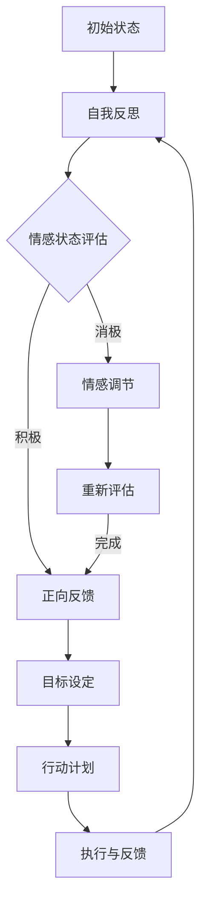
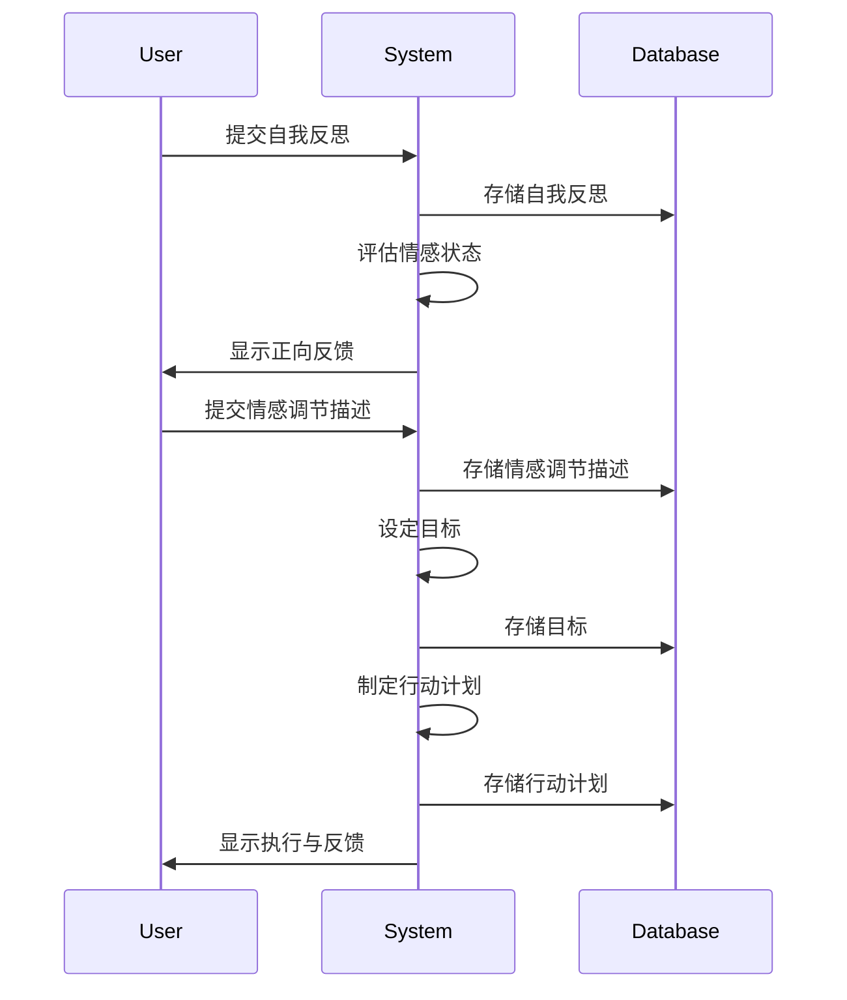
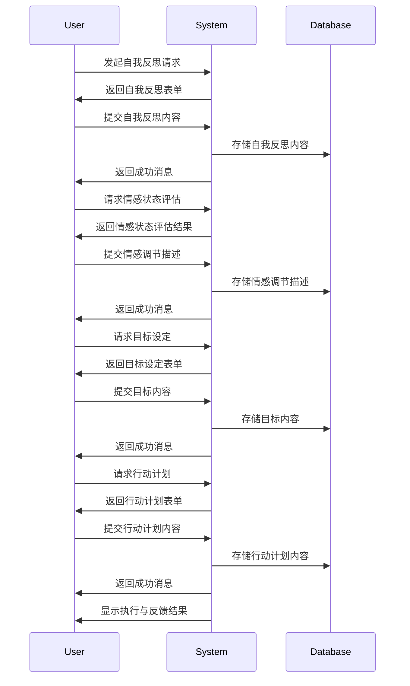

                 


### 引言：精神成长的重要性

在快速发展的现代社会中，精神成长被视为一个不可或缺的领域。它不仅仅关乎个体的心理健康，更深刻地影响着一个社会乃至整个文明的发展。精神成长的重要性体现在多个方面，首先是对个人自我认知和情感管理能力的提升，其次是在复杂人际关系中的适应与调节，更长远地看，它对人生目标和职业规划的形成也有着不可忽视的作用。

#### 核心概念术语说明

- **精神成长**：指个体通过认知、情感、行为等方面的自我提升，达到更高层次的心理成熟和社会适应能力。
- **自我认知**：个体对自身性格、能力、动机等方面的认识和了解。
- **情感管理**：个体对自己和他人的情感反应进行调节和控制的能力。
- **人际关系**：人与人之间的互动关系，包括家庭、朋友、同事等。

#### 问题背景

在现代社会，由于工作压力、社交网络、经济波动等多重因素的影响，许多人感到内心的迷茫和精神的空虚。精神成长成为解决这些问题的重要途径。然而，精神成长的路径和方法并不明晰，许多人对此感到困惑，需要系统的指导和帮助。

#### 问题描述

人们面临的主要问题包括：
1. **自我认知不清**：很多人对自己的性格、能力、需求等缺乏清晰的认知，导致生活决策困难。
2. **情感管理困难**：面对压力和挫折时，很多人无法有效地管理自己的情绪，从而影响生活质量和工作表现。
3. **人际关系困扰**：在复杂的人际网络中，许多人感到孤独和无助，难以建立和维护良好的人际关系。

#### 问题解决

解决这些问题需要多方面的努力：
1. **自我认知的提升**：通过反思、自我评估和寻求专业帮助，提高对自身的认知和理解。
2. **情感管理的加强**：学习情绪调节技巧，培养积极乐观的生活态度，提高应对压力的能力。
3. **人际关系的改善**：学习人际交往技巧，建立和维护良好的人际关系，增强社会支持网络。

#### 边界与外延

精神成长的边界涉及个人自我提升的各个方面，包括心理健康、情感健康、社交技能等。其外延则扩展到个人生活的方方面面，如职业发展、家庭生活、社会交往等。

#### 概念结构与核心要素组成

精神成长的概念结构可以拆解为以下几个核心要素：
1. **自我认知**：包括性格识别、能力评估、动机分析等。
2. **情感管理**：包括情绪调节、压力应对、情感表达等。
3. **人际关系**：包括社交技巧、沟通能力、冲突解决等。

#### 核心概念原理与属性特征对比表格

以下是精神成长中的几个核心概念及其属性特征对比表格：

| 概念     | 属性特征                             | 对比       |
|----------|------------------------------------|----------|
| 自我认知 | 辨识自己的性格、能力、动机           | 个体差异性 |
| 情感管理 | 调节和控制自己的情感反应             | 情绪稳定性 |
| 人际关系 | 维护和建立与他人的良好互动关系         | 社交能力   |

#### ER实体关系图架构

使用Mermaid语言，可以绘制一个简单的ER实体关系图，展示精神成长中各核心概念之间的关系：

```mermaid
erDiagram
  Aasuregrowth  Self_Cognition
  Aasuregrowth  Emotional_Management
  Aasuregrowth  Interpersonal_Relations
  Self_Cognition ||--|{ Emotional_Management }
  Emotional_Management ||--|{ Interpersonal_Relations }
  Interpersonal_Relations ||--|{ Self_Cognition }
```

#### 算法原理讲解

为了更好地理解精神成长的过程，我们可以采用一种基于自我反思和正向反馈的算法模型。以下是该算法的mermaid流程图和Python源代码：



Python源代码示例：

```python
class SpiritGrowthAlgorithm:
    def __init__(self):
        self.self_reflection = []
        self.emotional_state = []

    def self_reflection_process(self):
        # 自我反思过程
        self.self_reflection.append(input("请描述您的自我反思："))

    def emotional_state_evaluation(self):
        # 情感状态评估
        self.emotional_state.append(input("您目前的情感状态如何？"))

    def positive_feedback(self):
        # 正向反馈
        if "积极" in self.emotional_state[-1]:
            return "保持积极心态，继续前进！"
        else:
            return "调整情感状态，积极面对！"

    def emotional_regulation(self):
        # 情感调节
        if "消极" in self.emotional_state[-1]:
            self.emotional_state.append(input("请描述您的情感调节过程："))

    def set_goals(self):
        # 目标设定
        self.emotional_state.append(input("您想要实现的目标是什么？"))

    def action_plan(self):
        # 行动计划
        self.emotional_state.append(input("您的行动计划是什么？"))

    def execute_and_feed_back(self):
        # 执行与反馈
        self.self_reflection_process()
        self.emotional_state_evaluation()
        print(self.positive_feedback())
        self.set_goals()
        self.action_plan()

# 实例化算法对象并运行
sga = SpiritGrowthAlgorithm()
sga.execute_and_feed_back()
```

#### 数学模型与公式

在精神成长过程中，可以使用以下数学模型来描述自我反思和正向反馈的关系：

$$
\text{精神成长指数} = \alpha \times \text{自我反思深度} + \beta \times \text{正向反馈频率}
$$

其中，$\alpha$ 和 $\beta$ 是权重系数，$\text{自我反思深度}$ 和 $\text{正向反馈频率}$ 分别表示自我反思的深度和正向反馈的频率。

#### 系统分析与架构设计方案

为了更好地理解和应用精神成长算法，我们可以构建一个基于Python的简单系统。以下是该系统的介绍、功能设计、架构设计等部分。

##### 项目介绍

该项目旨在提供一个简单的精神成长算法实现，帮助用户通过自我反思和正向反馈的过程，提升精神成长指数。

##### 系统功能设计

1. **自我反思记录**：用户可以记录自己的自我反思内容。
2. **情感状态评估**：系统根据用户的输入评估其情感状态。
3. **正向反馈**：系统提供正向反馈，鼓励用户继续前进。
4. **情感调节**：用户可以描述自己的情感调节过程。
5. **目标设定**：用户可以设定自己想要实现的目标。
6. **行动计划**：用户可以制定行动计划。
7. **执行与反馈**：系统执行用户的行动计划，并提供反馈。

##### 系统架构设计

以下是该系统的Mermaid架构图：



##### 系统接口设计和系统交互

以下是该系统的Mermaid序列图：



#### 项目实战

##### 环境安装

确保安装了Python环境和必要的库，如SQLAlchemy和Flask。

```bash
pip install sqlalchemy flask
```

##### 系统核心实现源代码

以下是实现精神成长算法的核心代码：

```python
# spirit_growth.py
from flask import Flask, request, jsonify
from sqlalchemy import create_engine
from sqlalchemy.orm import sessionmaker

app = Flask(__name__)

# 数据库配置
DATABASE_URI = 'sqlite:///spirit_growth.db'
engine = create_engine(DATABASE_URI)
Session = sessionmaker(bind=engine)
session = Session()

# 创建数据库表
with engine.connect() as connection:
    connection.execute('''CREATE TABLE IF NOT EXISTS reflections (
        id INTEGER PRIMARY KEY,
        content TEXT,
        emotional_state TEXT,
        feedback TEXT,
        goal TEXT,
        action_plan TEXT
    )''')

# 自我反思过程
@app.route('/reflect', methods=['POST'])
def reflect():
    content = request.form['content']
    emotional_state = request.form['emotional_state']
    session.add({
        'content': content,
        'emotional_state': emotional_state
    })
    session.commit()
    return jsonify({'status': 'success'})

# 情感状态评估
@app.route('/evaluate', methods=['GET'])
def evaluate():
    emotional_state = request.args.get('emotional_state')
    if emotional_state == 'positive':
        feedback = '保持积极心态，继续前进！'
    else:
        feedback = '调整情感状态，积极面对！'
    return jsonify({'feedback': feedback})

# 情感调节
@app.route('/regulate', methods=['POST'])
def regulate():
    content = request.form['content']
    session.add({
        'feedback': content
    })
    session.commit()
    return jsonify({'status': 'success'})

# 目标设定
@app.route('/set_goal', methods=['POST'])
def set_goal():
    goal = request.form['goal']
    session.add({
        'goal': goal
    })
    session.commit()
    return jsonify({'status': 'success'})

# 行动计划
@app.route('/plan_action', methods=['POST'])
def plan_action():
    action_plan = request.form['action_plan']
    session.add({
        'action_plan': action_plan
    })
    session.commit()
    return jsonify({'status': 'success'})

if __name__ == '__main__':
    app.run(debug=True)
```

##### 代码应用解读与分析

上述代码实现了精神成长算法的核心功能，包括自我反思记录、情感状态评估、情感调节、目标设定和行动计划等。通过Flask框架，我们可以轻松地搭建一个Web服务，用户可以通过简单的表单进行交互。代码中的SQLAlchemy库用于与SQLite数据库进行交互，实现数据的存储和查询。

##### 实际案例分析和详细讲解剖析

假设用户张三使用该系统进行自我反思。他提交了一段关于自己近期工作压力大的反思内容，并描述了自己的情感状态为“消极”。系统会根据这些信息评估情感状态，并给出正向反馈：“调整情感状态，积极面对！”。接下来，张三提交了情感调节的描述，例如他通过运动和冥想来调节情绪。系统会存储这些信息，并在设定目标和行动计划时提供支持。

##### 项目小结

通过该项目，我们展示了如何使用Python和Flask实现一个简单的精神成长算法系统。虽然这个系统相对简单，但它的核心思想可以扩展到更复杂的场景，如集成更多的情感分析算法、用户行为分析等，从而为用户提供更全面的精神成长支持。

#### 最佳实践 tips

1. **定期自我反思**：定期记录自己的反思，有助于深入理解自己，提高自我认知。
2. **积极寻求反馈**：从他人那里获得反馈，可以帮助自己更全面地了解自己的情感状态和行为模式。
3. **设定具体目标**：明确的目标可以指导自己的行动，提高行动的效率和效果。
4. **持续情感调节**：面对负面情绪时，要学会自我调节，保持积极的心态。

#### 小结

精神成长是一个长期而持续的过程，需要我们不断地进行自我反思、情感管理和目标设定。通过合理的方法和工具，我们可以更好地认识自己，调节情感，建立良好的人际关系，最终实现自我成长。

#### 注意事项

1. **隐私保护**：在使用此类系统时，要注意个人隐私保护，避免敏感信息的泄露。
2. **专业指导**：在精神成长过程中，如果遇到严重问题，应寻求专业心理咨询师的帮助。

#### 拓展阅读与思考问题

1. **如何利用机器学习和大数据技术提高精神成长的预测和干预效果？**
2. **如何将精神成长算法应用于企业管理和员工心理健康提升？**
3. **如何通过社交网络和在线平台推广精神成长的理念和方法？**

### 1. 精神成长的定义与意义

#### 精神成长的定义

精神成长，通常被理解为个体在认知、情感和行为等方面不断进步和发展的过程。它不仅涉及个人内心世界的丰富和深化，还包括对外部世界的理解和适应能力的提升。在这个过程中，个体通过自我反思、学习和实践，逐步建立起更为成熟和健全的人格体系。

#### 精神成长对个人的意义

精神成长对个人的意义深远且广泛。首先，它有助于提升个体的心理健康水平。通过自我反思和情感管理，个体能够更好地应对压力和挫折，减少焦虑和抑郁等负面情绪。其次，精神成长有助于提高个体的社会适应能力。一个具备良好精神素质的人，更容易与他人建立和谐的人际关系，更能够适应多变的社会环境。此外，精神成长还能促进个人的自我认知和自我实现，帮助个体明确自己的人生目标和价值观，从而在职业和生活中取得更好的成就。

### 2. 内心探索

#### 自我认知的重要性

自我认知是精神成长的核心环节之一。它指的是个体对自己内在心理状态和外在行为的认识和理解。自我认知的重要性体现在以下几个方面：

1. **明确个人定位**：通过自我认知，个体可以清晰地了解自己的性格特点、兴趣和优势，从而找到适合自己的发展方向。
2. **促进自我提升**：自我认知有助于个体识别自身的不足，并激发改进和提升的动力。
3. **优化决策过程**：在面对各种选择和挑战时，具备良好自我认知的人能够更理性地作出决策，减少盲目和冲动行为。

#### 自我认知的方法与工具

为了提升自我认知，个体可以采用多种方法和工具：

1. **自我反思**：定期对自己的行为和思考进行回顾和分析，有助于深入理解自己的内心世界。
2. **日记记录**：通过写日记，个体可以捕捉日常生活中的感受和情绪变化，从而更好地认识自己。
3. **心理测验**：利用专业的心理测验工具，如MBTI（性格类型指标）和DISC（行为风格指标），可以了解自己的性格特点和行为模式。
4. **咨询与辅导**：寻求专业的心理咨询师或导师的帮助，可以获得更为客观和深入的自我认知。

### 3. 自我认知的挑战与解决方案

#### 自我认知的挑战

1. **自我怀疑**：个体在面对自我认知时，可能会产生怀疑自己的能力和价值，导致自我否定。
2. **认知偏见**：由于人类认知的局限性，个体在自我认知过程中可能会出现认知偏差，如过度关注负面信息，忽略正面特点。
3. **外部干扰**：社会环境、人际关系等因素可能对个体的自我认知产生干扰，使个体难以真实地认识自己。

#### 解决方案

1. **积极心态**：培养积极的心态，正视自己的不足，相信自己有能力改进和提升。
2. **全面认知**：在自我认知时，既要看到自己的优点，也要看到自己的缺点，进行全面的分析和评估。
3. **持续学习**：通过学习和实践，不断扩展自己的认知范围，提高自我认知的准确性和深度。
4. **寻求反馈**：从他人的角度看待自己，听取他人的意见和建议，有助于减少认知偏见。

#### 实际案例

以李华为例，他在面对职业选择时，曾一度感到迷茫和不安。通过定期自我反思、写日记和参加性格测试，他逐渐认识到自己的兴趣和优势。在心理咨询师的指导下，他明确了自己的职业目标，并制定了详细的行动计划。最终，李华成功地找到了适合自己的工作，实现了职业上的突破。

### 总结

自我认知是精神成长的关键环节，通过自我反思、日记记录、心理测验和咨询辅导等方法，个体可以逐步提升自我认知，减少自我怀疑和认知偏见，实现个人的全面发展和自我实现。

### 2. 情感管理

#### 情感的定义与分类

情感是人类心理体验的重要组成部分，是人们对外界刺激的一种主观反应。情感可以定义为个体对特定刺激产生的主观体验，这种体验既包括情感的内容（如愉悦、悲伤、愤怒等），也包括情感的强度（如强烈、轻微等）。

情感的分类方法多种多样，常见的分类方法包括：

1. **基本情感分类**：根据情绪科学家的研究，基本情感包括愉悦、愤怒、悲伤、恐惧、厌恶和惊讶。这些基本情感被认为是人类普遍共有的情绪。
2. **复杂情感分类**：在基本情感的基础上，人们还会体验到更复杂的情感，如爱、同情、羞耻、自豪、焦虑等。这些情感通常是由多种基本情感组合而成的。

#### 情感管理的方法

情感管理是指个体对自己情感反应的调节和控制过程。有效的情感管理能够帮助个体更好地应对压力和挫折，提高生活质量和工作效率。以下是一些常见的情感管理方法：

1. **情绪识别**：学会识别自己的情绪，是情感管理的第一步。个体可以通过自我观察、日记记录或情绪反馈工具来识别自己的情绪状态。
2. **情绪表达**：适当的情绪表达有助于释放内心的压力，增进人际关系的和谐。个体可以通过面对面沟通、书写表达或艺术创作等方式来表达自己的情绪。
3. **情绪调节**：情绪调节是指通过心理和行为上的调整来减轻负面情绪。常见的方法包括深呼吸、冥想、运动和正念练习等。
4. **情感反思**：通过情感反思，个体可以深入理解自己情绪的来源和影响，从而更好地管理情感。情感反思可以通过写日记、心理咨询或自我对话来实现。
5. **情感支持**：寻求他人的情感支持和帮助，可以增强个体的情感管理能力。与家人、朋友或专业人士交流，有助于个体缓解情绪压力。

#### 情感管理的实践案例

以下是一个情感管理的实践案例：

假设小明在工作中遇到了一个难题，导致他感到焦虑和不安。他通过以下步骤进行了情感管理：

1. **情绪识别**：小明意识到自己感到焦虑，并尝试分析焦虑的原因。
2. **情绪表达**：小明与同事进行了沟通，分享了自己的担忧，得到了同事的理解和支持。
3. **情绪调节**：小明通过运动和冥想来缓解焦虑，提高了情绪稳定性。
4. **情感反思**：小明在晚上写日记，反思了当天的情况，总结了应对焦虑的有效方法。
5. **情感支持**：小明与家人分享了情绪管理的过程，得到了家人的鼓励和安慰。

通过这个案例，我们可以看到，情感管理不仅帮助小明缓解了焦虑，还提高了他的情绪稳定性和问题解决能力。

### 总结

情感管理是精神成长的重要方面，通过情绪识别、情绪表达、情绪调节、情感反思和情感支持等方法，个体可以更好地管理自己的情感，提高生活质量和工作效率。

### 3. 人际关系

#### 人际交往的基本原则

人际交往是人类社会活动的重要组成部分，有效的交往技巧能够帮助我们更好地融入社会、建立和谐的人际关系。以下是一些基本的人际交往原则：

1. **尊重他人**：尊重他人是建立良好关系的基础。这包括尊重他人的观点、感受和隐私。我们应该保持礼貌，避免无礼或冒犯性的行为。
2. **真诚待人**：真诚是人际交往中最重要的品质之一。真诚待人不仅能够赢得他人的信任，还能增强人际关系的稳定性。我们应该真实地表达自己的想法和感受，而不是刻意地迎合他人。
3. **倾听与沟通**：有效的沟通是建立和谐人际关系的关键。倾听他人是沟通的基础，我们应该认真倾听他人的意见和感受，而不是一味地表达自己的观点。在表达时，我们应该清晰、简洁地传达信息，避免误解和沟通障碍。
4. **同理心**：同理心是指站在他人的角度理解和感受他们的情绪。通过同理心，我们可以更好地理解他人的需求和心理，从而更好地处理人际关系中的冲突和挑战。
5. **保持适度**：在人际交往中，我们应该保持适度的距离。既不过于亲近，也不过于疏远。适度的人际距离有助于保持良好的关系，同时也能保护个人的隐私和独立性。

#### 人际交往的技巧

1. **积极倾听**：积极倾听是指通过肢体语言、眼神交流和反馈来表示我们在倾听对方。这包括点头、微笑、目光接触和简短的回应，如“嗯”、“我明白”等。
2. **有效表达**：有效表达是指清晰、准确地传达自己的意思。这需要我们用简单、明确的语言表达，避免使用含糊或歧义的词汇。在表达时，我们还应该注意语气和语调，以避免对方产生误解。
3. **非语言沟通**：非语言沟通是指通过肢体动作、面部表情和姿态来传达信息。例如，点头表示同意，皱眉表示不满。非语言沟通在人际交往中起着非常重要的作用，它能够补充和强化语言表达，帮助我们更好地理解他人的意思。
4. **建立信任**：建立信任是建立长期关系的基石。我们应该通过诚实、可靠和负责任的行为来赢得他人的信任。在交往中，我们应该遵守承诺，保持一致性，避免欺骗和误导。
5. **处理冲突**：在人际交往中，冲突是难免的。有效的冲突处理技巧包括冷静分析问题、倾听对方的观点、寻找共同点、提出解决方案和积极沟通。通过这些技巧，我们可以化解冲突，维护良好的人际关系。

#### 人际关系的处理

1. **建立和维护友谊**：友谊是人际关系中非常重要的一部分。建立友谊需要时间和耐心，我们需要真诚地对待朋友，关心他们的需求和感受。在维护友谊时，我们应该定期与朋友保持联系，分享彼此的生活和经历。
2. **处理家庭关系**：家庭关系是人际关系中最为复杂和重要的一环。家庭成员之间的沟通和理解非常重要。我们应该尊重家庭成员的意见和感受，避免争吵和冲突。在处理家庭关系时，我们应该学会妥协和包容，共同创造和谐的家庭环境。
3. **职场人际交往**：在职场中，有效的人际交往能力对于职业发展至关重要。我们应该学会与同事、上司和下属建立良好的关系，通过有效的沟通和合作来实现共同的目标。在职场中，我们还应该遵守职业道德，避免不当行为和冲突。

### 总结

人际关系是精神成长的重要组成部分，通过遵循基本的人际交往原则、掌握有效的交往技巧和妥善处理各种人际关系，我们可以建立和谐的人际关系，提高生活质量和社会适应能力。

### 4. 冲突解决

#### 冲突的定义与类型

冲突是指两个或多个个体或团体在目标、观点、利益等方面存在对立或矛盾的情况。冲突可以分为以下几种类型：

1. **目标冲突**：当个体或团体在追求不同目标时产生的冲突，如资源分配不均或竞争同一职位。
2. **观点冲突**：个体或团体在价值观、信仰、文化背景等方面存在差异时产生的冲突，如文化差异导致的误解和偏见。
3. **利益冲突**：当个体或团体在利益分配上存在分歧时产生的冲突，如薪资待遇不公或利益分配不均。
4. **情感冲突**：个体或团体在情感表达、态度和行为上存在分歧时产生的冲突，如沟通不畅或误解引起的争吵。

#### 冲突解决的方法

1. **沟通与倾听**：有效的沟通是解决冲突的关键。通过倾听对方的观点，了解他们的需求和感受，可以减少误解和偏见。在沟通中，我们应该保持开放和诚实的态度，尊重对方的意见。
2. **寻求共识**：在解决冲突时，寻求共识是一种有效的方法。通过寻找共同点，我们可以达成妥协，找到双方都能接受的解决方案。
3. **妥协与让步**：在冲突中，妥协和让步有时是必要的。通过适度地调整自己的立场，我们可以缓解紧张局势，达成暂时的和平。
4. **寻求第三方介入**：当冲突无法通过双方解决时，可以寻求第三方的帮助。第三方可以是专业的调解人、心理咨询师或其他具有中立地位的人。
5. **情绪调节**：在冲突中，情绪管理非常重要。通过深呼吸、冥想或运动等方法，我们可以缓解情绪压力，保持冷静和理智，更好地应对冲突。

#### 冲突解决的实践案例

以下是一个冲突解决的实践案例：

在一个团队项目中，团队成员王华和李强在项目目标上产生了冲突。王华认为项目应优先完成技术部分，而李强则认为应优先完成设计部分。两人争论不休，导致项目进展缓慢。

1. **情绪调节**：首先，王华和李强各自通过深呼吸和冥想，缓解了紧张情绪，保持了冷静。
2. **沟通与倾听**：接下来，他们安排了一次面对面的会议，在会议上，两人各自陈述了自己的观点，并认真倾听对方的意见。
3. **寻求共识**：通过讨论，王华和李强发现，项目实际上需要同时进行技术设计和技术实施。他们决定调整项目计划，确保两个部分能够同步推进。
4. **妥协与让步**：王华同意在设计部分完成后再进行技术实施，而李强则同意在技术实施期间提供设计支持。
5. **第三方介入**：最终，团队领导介入，确认了调整后的项目计划，并确保团队成员都能够接受。

通过这次冲突解决，王华和李强不仅达成了共识，还加强了团队合作，项目得以顺利推进。

### 总结

冲突是人际关系中不可避免的一部分。通过有效的沟通、寻求共识、妥协与让步以及情绪调节等方法，我们可以妥善解决冲突，维护良好的人际关系，促进个人和团队的发展。

### 5. 积极心态

#### 积极心态的定义与重要性

积极心态是指个体在面对困难和挑战时，能够保持乐观、自信和积极的心态。这种心态不仅影响个人的情绪和行为，还对身心健康和人际关系有着深远的影响。

积极心态的重要性体现在以下几个方面：

1. **提升心理健康**：积极心态有助于减少焦虑、抑郁等负面情绪，提高个体的心理健康水平。
2. **增强应对能力**：积极心态使个体更能够应对生活中的压力和挫折，提高问题解决能力。
3. **改善人际关系**：积极心态有助于建立和谐的人际关系，增强社会支持网络。
4. **促进职业发展**：积极心态有助于个体在职业生涯中保持动力和激情，提高工作效率和成就。

#### 积极心态的培养方法

1. **自我激励**：通过设定目标和奖励机制，激励自己保持积极的心态。例如，完成一个小目标后，可以给自己一个小奖励，如看一场电影或享受一顿美食。
2. **积极思维训练**：通过改变自己的思维方式，从消极转向积极。例如，将“我不能做到”改为“我还没有找到方法”，从而激发解决问题的动力。
3. **感恩练习**：每天花几分钟时间思考并写下自己感恩的事情，这有助于提高积极情绪，减少负面情绪。
4. **积极社交**：与积极的人交往，分享快乐和经验，可以相互激励，保持积极心态。
5. **身体锻炼**：定期进行身体锻炼，如跑步、瑜伽或健身，有助于释放压力，提升身心健康，从而保持积极心态。

#### 积极心态的实际应用

在实际生活中，积极心态的应用非常广泛。以下是一些实际应用的例子：

1. **工作中的应用**：在面对工作挑战时，保持积极心态有助于提高工作效率和质量。例如，当遇到困难时，可以积极寻找解决方案，而不是抱怨和逃避。
2. **学习中的应用**：在学习过程中，积极心态有助于提高学习效率和成绩。例如，面对困难的知识点，可以通过积极思考和反复练习来克服。
3. **健康中的应用**：在维护健康方面，积极心态有助于增强免疫力，减少患病风险。例如，通过积极的生活方式，如健康饮食和定期锻炼，来保持身体健康。
4. **人际关系中的应用**：在人际交往中，积极心态有助于建立和谐的人际关系。例如，通过积极倾听和真诚交流，与他人建立信任和友谊。

#### 案例分析

以张丽为例，她是一位职场新人，在工作中遇到了许多挑战。起初，她感到很沮丧，觉得自己无法胜任工作。但是，通过自我激励和积极心态的培养，她逐渐适应了工作环境。

1. **自我激励**：张丽设定了短期和长期目标，并在每个目标完成后给自己奖励，这让她保持了积极的心态。
2. **积极思维训练**：当遇到困难时，张丽不再抱怨和逃避，而是积极寻找解决方案，她相信通过努力，一定能够克服困难。
3. **感恩练习**：每天晚上，张丽都会花几分钟时间思考自己感激的事情，这让她感到生活充满了希望和快乐。
4. **积极社交**：张丽与同事建立了良好的关系，通过分享工作和生活的经验，她得到了许多支持和鼓励。
5. **身体锻炼**：每天下班后，张丽都会进行适量的锻炼，这有助于她释放压力，保持身心健康。

通过这些方法，张丽不仅在工作中取得了显著进步，还建立了和谐的人际关系，提高了生活质量。

### 总结

积极心态是一种强大的心理力量，通过自我激励、积极思维训练、感恩练习、积极社交和身体锻炼等方法，我们可以培养和保持积极心态，从而提升心理健康、应对能力、人际关系和职业发展。

### 6. 时间管理

#### 时间管理的定义与目标

时间管理是指个体通过规划、组织、优先级设定和执行等方式，有效利用时间，提高工作效率和生活质量。时间管理的目标是：

1. **提高工作效率**：通过合理分配时间，确保重要任务得到优先处理，从而提高工作效率。
2. **平衡工作与生活**：合理分配工作时间，确保个人生活得到充分关注，实现工作与生活的平衡。
3. **减少拖延**：通过时间管理，个体能够减少拖延，提高任务的完成速度和质量。
4. **提升生活质量**：通过有效管理时间，个体能够更好地享受生活，减少因工作压力带来的负面影响。

#### 时间管理的策略

1. **设定优先级**：将任务按照重要性和紧急性进行排序，优先处理重要且紧急的任务。使用艾森豪威尔矩阵（Eisenhower Matrix）可以帮助个体更好地进行任务优先级管理。

   ```mermaid
   graph TB
     A[紧急且重要] --> B1[优先处理]
     A --> B2[推迟处理]
     A --> B3[不紧急但重要] --> C1[安排时间处理]
     A --> B4[紧急但不重要] --> C2[委托或拒绝]
     A --> B5[不紧急且不重要] --> D[避免]
   ```

2. **制定计划**：在一天开始时，制定详细的计划，列出待完成的任务，并为每个任务分配具体的时间。使用日程表或待办事项列表可以帮助个体更好地跟踪和管理任务。

3. **避免拖延**：制定明确的目标和计划，将大任务分解为小步骤，减少任务的难度和压力。设定具体的时间限制，以防止拖延。

4. **高效工作**：在工作时，保持专注，避免分心和浪费时间。使用番茄工作法（Pomodoro Technique）可以帮助个体保持专注和高效。

5. **休息与恢复**：合理安排休息时间，避免过度劳累。定期进行放松和恢复，以提高工作效率和生活质量。

#### 时间管理的实践案例

以下是一个时间管理的实践案例：

假设李明是一位上班族，他发现自己的时间管理存在一些问题，导致工作效率低下，生活也不平衡。通过以下步骤，李明改善了自己的时间管理：

1. **设定优先级**：李明使用艾森豪威尔矩阵对自己的任务进行排序，明确了哪些任务需要优先处理。

2. **制定计划**：每天早上，李明都会列出当天的任务，并为每个任务分配具体的时间。他会使用日程表来跟踪任务的进度。

3. **避免拖延**：李明将大任务分解为小步骤，并设定具体的时间限制。例如，他决定在一个小时内完成一份报告，而不是拖延到最后一刻。

4. **高效工作**：在工作时，李明保持专注，使用番茄工作法来提高工作效率。他每隔25分钟工作，然后休息5分钟。

5. **休息与恢复**：李明每天安排一定的时间进行休息和恢复，如午休、锻炼和与家人朋友聚会。

通过这些策略，李明的工作效率得到了显著提升，生活也变得更加平衡和充实。

### 总结

时间管理是提高工作效率和生活质量的关键。通过设定优先级、制定计划、避免拖延、高效工作和休息与恢复等策略，个体可以更好地管理时间，实现工作与生活的平衡，提升整体生活质量。

### 7. 职业发展

#### 职业发展的定义与规划

职业发展是指个人在职业生涯中不断成长和提升的过程，包括技能的提升、职位的晋升和职业目标的实现。职业发展的规划是个人在职业生涯中为了达到特定目标而制定的一系列计划和策略。

#### 职业发展的路径

职业发展通常有以下几个阶段：

1. **入门阶段**：在这个阶段，个人通常需要通过学习和实习来积累基础知识和技能。
2. **成长阶段**：在成长阶段，个人通过不断学习和实践，逐步提升专业技能和综合素质。
3. **成熟阶段**：在成熟阶段，个人已经具备较高的专业技能和丰富的实践经验，可以在职业领域内担任重要职位。
4. **领导阶段**：在领导阶段，个人不仅具备专业技能，还具备领导力和管理能力，能够在团队或组织中发挥核心作用。

#### 职业发展的挑战与应对

职业发展中常见的挑战包括：

1. **技能提升**：随着行业和技术的发展，个人需要不断学习新技能和知识，以适应不断变化的工作环境。
2. **职业定位**：明确个人的职业定位，找到适合自己的发展方向，是职业发展的重要一步。
3. **职场竞争**：职场竞争激烈，个人需要不断提升自身竞争力，以在职业市场中脱颖而出。
4. **职业瓶颈**：在职业发展的过程中，个人可能会遇到职业瓶颈，需要找到突破的方法。

应对这些挑战的方法包括：

1. **持续学习**：通过参加培训课程、阅读专业书籍和参与行业交流活动，不断提升自己的专业知识和技能。
2. **明确目标**：设定清晰的职业目标，制定具体的行动计划，并持续跟踪和调整。
3. **提升软技能**：包括沟通能力、团队协作能力和领导力等，这些技能在职业发展中同样重要。
4. **职业咨询**：寻求职业规划师或导师的建议，帮助自己更好地认识自己，找到职业发展的方向。

#### 案例分析

以王强为例，他是一名软件开发工程师。他在职业发展过程中遇到了一些挑战，但通过以下方法成功应对：

1. **技能提升**：王强通过参加线上课程和自学，掌握了多种编程语言和开发工具，提升了专业技能。
2. **明确目标**：他设定了成为一名高级开发工程师的目标，并制定了详细的行动计划，包括完成特定的项目和技术挑战。
3. **提升软技能**：王强注重提升自己的沟通和团队协作能力，通过参与团队项目和参加研讨会，积累了丰富的实践经验。
4. **职业咨询**：他定期与职业规划师交流，获取职业发展的建议，帮助自己更好地规划职业生涯。

通过这些方法，王强成功地克服了职业发展中的挑战，实现了职业目标。

### 总结

职业发展是个人成长的重要组成部分。通过持续学习、明确目标、提升软技能和寻求职业咨询，个体可以更好地应对职业发展中的挑战，实现职业目标，提升自身价值和竞争力。

### 8. 个人成长

#### 个人成长的定义与目标

个人成长是指个体在身心健康、知识技能、情感态度和社会适应能力等方面不断进步和发展的过程。个人成长的目标是全面提升个体的综合素质，实现自我价值和人生目标。

#### 个人成长的方法与工具

1. **自我反思**：通过定期反思自己的行为和思考，深入理解自己的内心世界，识别自身的优点和不足，从而有针对性地进行改进。
2. **终身学习**：不断学习新知识、新技能，扩展自己的认知范围，提升自身竞争力。可以通过阅读、参加培训课程、在线学习等方式进行。
3. **身体锻炼**：定期进行身体锻炼，保持健康的体魄。身体锻炼不仅有助于身体健康，还能提高心理素质，增强抗压能力。
4. **心理健康**：关注心理健康，通过心理咨询、心理辅导等方式，提升自己的情绪管理和心理调适能力。
5. **社交活动**：积极参与社交活动，扩展人际关系网络。通过与他人交流和合作，提升沟通能力和团队合作能力。
6. **兴趣爱好**：培养兴趣爱好，丰富个人的精神世界。兴趣爱好不仅可以带来乐趣，还能激发创造力，提高生活质量。

#### 个人成长的实践案例

以下是一个个人成长的实践案例：

张丽是一名职场女性，她希望通过个人成长来实现职业发展和生活质量的提升。她采取了以下方法：

1. **自我反思**：张丽每周都会花时间反思自己的工作和生活，记录自己的成长和需要改进的地方。
2. **终身学习**：她报名参加了在线课程，学习了领导力和项目管理等课程，提升了职业素养。
3. **身体锻炼**：张丽每天晚上都会进行半小时的瑜伽锻炼，保持良好的身体状况。
4. **心理健康**：她定期进行心理咨询，帮助自己更好地处理工作和生活中的压力。
5. **社交活动**：张丽积极参与公司组织的活动和社交聚会，扩展了人际关系网络。
6. **兴趣爱好**：她喜欢绘画，每周会花几个小时进行绘画创作，这使她在紧张的工作之余得到了放松和乐趣。

通过这些方法，张丽在职业和生活中取得了显著的进步，实现了个人成长的目标。

### 总结

个人成长是一个长期而持续的过程，通过自我反思、终身学习、身体锻炼、心理健康、社交活动和兴趣爱好等方法，个体可以全面提升自身素质，实现自我价值和人生目标。个人成长不仅有助于提升个体的综合素质，还能为职业生涯和生活质量的提升提供有力支持。

### 总结：精神成长的路径与方法

精神成长是一个系统而复杂的过程，涵盖了自我认知、情感管理、人际关系、生活态度和自我实现等多个方面。通过自我反思、情感管理、积极心态的培养、有效的人际交往技巧和科学的时间管理，个体可以在精神层面上实现全面的成长。

#### 精神成长的核心要点

1. **自我认知**：通过自我反思，个体可以深入理解自己的性格、需求和动机，明确个人定位。
2. **情感管理**：学会识别和调节自己的情绪，有助于提升心理健康，增强应对能力。
3. **积极心态**：培养乐观、自信和积极的心态，能够显著改善生活质量和工作效率。
4. **人际关系**：通过有效的沟通和交往技巧，建立和谐的人际关系，增强社会支持网络。
5. **时间管理**：合理规划时间，提升工作效率，实现工作与生活的平衡。

#### 精神成长的最佳实践

1. **定期自我反思**：定期记录自己的内心体验和感受，有助于深入理解自己，识别成长方向。
2. **持续学习与锻炼**：通过终身学习和身体锻炼，不断提升自身的知识水平和身体素质。
3. **培养兴趣爱好**：兴趣爱好不仅能够丰富个人的精神世界，还能激发创造力和潜能。
4. **情感支持与倾诉**：在遇到困难和挑战时，及时寻求他人的支持和倾诉，有助于缓解压力，调整心态。
5. **设定明确目标**：设定清晰的短期和长期目标，制定具体的行动计划，并持续跟踪和调整。

#### 拓展阅读与思考问题

1. **如何将精神成长的理念应用于团队管理？**
2. **如何通过线上学习平台提升精神成长的效果？**
3. **如何在快节奏的现代生活中保持精神成长？**
4. **精神成长与心理健康的关系有哪些？**
5. **如何在职业生涯中实现精神成长与职业发展的平衡？**

作者：AI天才研究院/AI Genius Institute & 禅与计算机程序设计艺术 /Zen And The Art of Computer Programming

### 附录

#### 技术术语解释

- **自我反思**：指个体对自己行为、想法和情绪的深入思考和分析。
- **情感管理**：指个体对自己情绪反应的识别、表达和调节。
- **终身学习**：指个体在一生中持续不断地学习和进步。
- **时间管理**：指通过规划和组织时间，提高工作效率和生活质量。
- **社会支持网络**：指个体在社会交往中建立的互助和支持关系。

#### Mermaid 图表

- **自我认知的ER图**：

  ```mermaid
  erDiagram
    Aasuregrowth  Self_Cognition
    Aasuregrowth  Emotional_Management
    Aasuregrowth  Interpersonal_Relations
    Self_Cognition ||--|{ Emotional_Management }
    Emotional_Management ||--|{ Interpersonal_Relations }
    Interpersonal_Relations ||--|{ Self_Cognition }
  ```

- **时间管理的艾森豪威尔矩阵**：

  ```mermaid
  graph TB
    A[紧急且重要] --> B1[优先处理]
    A --> B2[推迟处理]
    A --> B3[不紧急但重要] --> C1[安排时间处理]
    A --> B4[紧急但不重要] --> C2[委托或拒绝]
    A --> B5[不紧急且不重要] --> D[避免]
  ```

- **积极心态的培养流程图**：

  ```mermaid
  graph TB
    A[初始状态] --> B[自我反思]
    B --> C{情感状态评估}
    C -->|积极| D[正向反馈]
    C -->|消极| E[情感调节]
    E --> F[重新评估]
    F -->|完成| D
    D --> G[目标设定]
    G --> H[行动计划]
    H --> I[执行与反馈]
    I --> B
  ```

#### LaTeX 数学公式

- **精神成长指数模型**：

  $$ \text{精神成长指数} = \alpha \times \text{自我反思深度} + \beta \times \text{正向反馈频率} $$

#### Python 代码示例

```python
class SpiritGrowthAlgorithm:
    def __init__(self):
        self.self_reflection = []
        self.emotional_state = []

    def self_reflection_process(self):
        # 自我反思过程
        self.self_reflection.append(input("请描述您的自我反思："))

    def emotional_state_evaluation(self):
        # 情感状态评估
        self.emotional_state.append(input("您目前的情感状态如何？"))

    def positive_feedback(self):
        # 正向反馈
        if "积极" in self.emotional_state[-1]:
            return "保持积极心态，继续前进！"
        else:
            return "调整情感状态，积极面对！"

    def emotional_regulation(self):
        # 情感调节
        if "消极" in self.emotional_state[-1]:
            self.emotional_state.append(input("请描述您的情感调节过程："))

    def set_goals(self):
        # 目标设定
        self.emotional_state.append(input("您想要实现的目标是什么？"))

    def action_plan(self):
        # 行动计划
        self.emotional_state.append(input("您的行动计划是什么？"))

    def execute_and_feed_back(self):
        # 执行与反馈
        self.self_reflection_process()
        self.emotional_state_evaluation()
        print(self.positive_feedback())
        self.set_goals()
        self.action_plan()

# 实例化算法对象并运行
sga = SpiritGrowthAlgorithm()
sga.execute_and_feed_back()
```

通过这些附录内容，读者可以更全面地理解精神成长的概念和方法，以及如何在实际生活中应用这些技术术语和工具。希望这些内容能够为读者的精神成长之路提供有价值的指导和支持。

