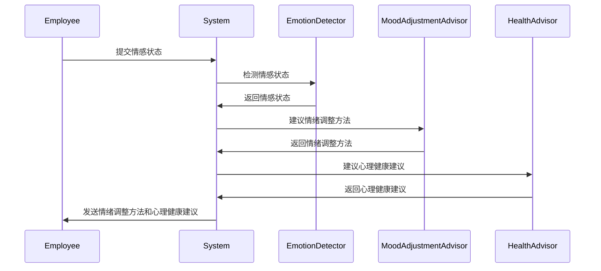
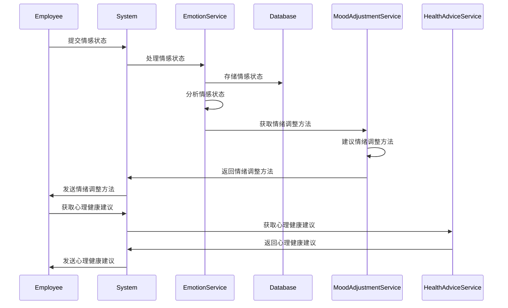

                 


## 第1章: 引言

### 1.1 现代人的精神困境

在当今快速发展的现代社会，人们的生活节奏不断加快，信息爆炸，物质丰富，但与此同时，现代人面临着越来越多的精神压力和困境。首先，焦虑成为了一种普遍的心理现象。无论是在职场、家庭还是社交场合，焦虑感时常困扰着人们，影响他们的日常生活和决策。焦虑可能导致睡眠障碍、注意力不集中，甚至诱发抑郁症。

其次，抑郁是现代社会中另一个严重的心理健康问题。抑郁症不仅影响个体的情绪，还可能影响其身体健康，甚至导致自杀。抑郁症的根源复杂，包括遗传、生物化学因素、心理因素以及社会环境等。

此外，孤独感也在现代社会中广泛存在。随着社交网络的普及，人们看似更加“社交”，但实际上，许多人在网上交流和现实生活中的互动之间存在很大的差距。孤独感可能导致个人失去对生活的热情和动力，影响其心理健康。

### 1.2 精神成长的重要性

面对上述精神困境，精神成长显得尤为重要。精神成长不仅仅是指情感上的稳定和心理健康，更是一个人在心理、情感、认知等方面的全面发展。一个精神充实的人能够更好地应对生活中的压力和挑战，拥有更高的幸福感和生活质量。

精神成长的第一步是认识到自我。自我认同是一个人理解自己、接受自己的过程。通过自我反思和探索，个体可以找到自己的价值观、信念和目标，从而建立清晰的自我形象。

情感调节是精神成长的另一个核心要素。情感是人类生活中不可或缺的一部分，但过度的情感反应或者情感失控可能会对生活产生负面影响。通过情感调节，个体可以更好地管理自己的情绪，减少负面情绪的影响。

认知发展也是精神成长的重要组成部分。认知能力包括思维、记忆、判断和解决问题等能力。通过不断学习和思考，个体可以提高自己的认知能力，从而更好地适应复杂多变的环境。

### 1.3 本书的目的与结构

本书旨在深入探讨现代人的精神成长历程，提供实用的方法和实践指导，帮助读者实现从虚无到充实的精神转变。本书结构如下：

- **第一部分：引言与背景介绍**，介绍现代人的精神困境和本书的目的。
- **第二部分：精神成长的基础理论**，探讨心理学、哲学等方面的理论，为精神成长提供理论基础。
- **第三部分：精神成长的方法与实践**，介绍跨文化精神成长路径、自我修炼、人际关系等实践方法。
- **第四部分：精神成长的未来趋势**，探讨科技、社会发展对精神成长的影响。

通过以上各部分的探讨，本书希望为读者提供一个全面、深入的理解，帮助他们在精神成长的道路上取得实质性进步。

---

在撰写技术博客时，遵循以下原则可以确保文章的逻辑清晰、结构紧凑、内容易懂：

1. **明确的结构**：确保文章按照逻辑顺序组织，从背景介绍到理论探讨，再到实践方法和未来趋势，每个部分都紧密相连，形成完整的论述。

2. **使用简明易懂的语言**：避免使用复杂的术语和难以理解的表述，确保文章的读者能够轻松理解。可以通过举例和类比来帮助解释复杂概念。

3. **逐步引导读者思考**：使用“LET'S THINK STEP BY STEP”这样的引导性语句，帮助读者跟随作者的思路，逐步理解文章的核心观点。

4. **图表和流程图**：适当使用图表、流程图和代码示例，这些工具可以直观地展示信息，帮助读者更好地理解抽象概念。

5. **小结和总结**：在每个章节或部分结束时，提供小结和总结，帮助读者回顾关键信息，并确保他们理解了文章的主要内容。

6. **注意事项和拓展阅读**：提供注意事项，提醒读者在实践时需要注意的事项，同时推荐拓展阅读，以引导读者进一步深入学习。

通过这些原则，我们可以确保技术博客既具备专业性，又能够吸引和指导读者。现在，让我们开始撰写每一章节的具体内容吧。接下来，我们将深入探讨精神成长的基础理论，包括心理学和哲学的相关理论，为读者提供理论基础。请期待下一章节的内容！### 第2章: 精神成长的心理学理论

在探讨现代人的精神成长过程中，心理学理论提供了丰富的视角和工具。通过理解不同心理学理论的基本原理和核心要素，我们可以更深入地了解人类行为和心理过程的复杂性。本章将介绍精神分析理论、人本主义心理学和认知心理学，以及它们在精神成长中的应用。

#### 2.1 心理发展的基本理论

**精神分析理论**：由西格蒙德·弗洛伊德创立，这一理论强调潜意识的能量和冲突。弗洛伊德认为，潜意识中的欲望和冲突直接影响个体的行为和心理状态。精神分析理论主要包括以下几个关键概念：

- **潜意识**：潜意识是指那些不为意识所知的心理过程，包括欲望、记忆和情绪等。
- **防御机制**：个体为了应对潜意识中的冲突而采取的心理策略，如压抑、投射和合理化等。
- **无意识**：无意识是潜意识的一部分，它与意识和理性相对立，包含原始冲动和欲望。

**人本主义心理学**：由卡尔·罗杰斯和亚伯拉罕·马斯洛等心理学家提出，这一理论强调个体的自我实现和内在潜能。人本主义心理学认为，每个人都有成长和发展的潜能，关键在于提供支持性的环境，帮助个体实现其目标。

- **自我实现**：自我实现是指个体追求自我潜能的发挥和成长，实现个人的完整性和独特性。
- **自我概念**：个体对自己的认知和看法，包括自我价值和自我认同。
- **无条件积极关注**：罗杰斯提出，个体需要他人的无条件接受和尊重，以促进自我实现。

**认知心理学**：这一领域关注思维过程，包括记忆、注意力、感知和决策等。认知心理学家通过实验研究，揭示了大脑如何处理信息，并提出了关于认知过程的模型。

- **感知**：感知是指个体对外界刺激的解读和解释。例如，知觉整合和错觉等。
- **记忆**：记忆是指个体存储和回忆信息的能力。短期记忆和长期记忆是其中的关键概念。
- **注意力**：注意力是指个体在特定任务上集中精力并排除干扰的能力。

#### 2.2 精神成长的核心要素

**自我认同**：自我认同是指个体对自己是谁以及自己应该如何行动的认知和认同。一个清晰的自我认同有助于个体在面对生活挑战时保持一致性。自我认同的建立通常需要自我反思、社会互动和经验积累。

- **自我反思**：通过反思自己的行为、信念和情感，个体可以更好地理解自己，从而建立清晰的自我认同。
- **社会互动**：与他人互动可以帮助个体了解自己的行为对他人的影响，从而更好地理解自己在社会中的角色。
- **经验积累**：通过不同的经验和挑战，个体可以不断调整和优化自己的自我认同。

**情感调节**：情感调节是指个体管理和表达情感的能力。一个有效的情感调节机制可以帮助个体更好地应对压力和挑战，保持心理平衡。

- **情感觉察**：情感觉察是指个体对自身情感状态的认知。通过提高情感觉察，个体可以更早地意识到负面情绪的出现，并采取措施进行调整。
- **情感表达**：情感表达是指个体如何表达自己的情感。有效的情感表达可以帮助个体建立良好的人际关系，减少误解和冲突。

**认知发展**：认知发展是指个体在思维和认知能力上的成长和提升。通过不断学习和思考，个体可以提高自己的认知水平，从而更好地适应复杂多变的环境。

- **思维过程**：包括逻辑推理、批判性思维和创造性思维等。
- **学习策略**：有效的学习策略可以帮助个体更好地吸收和应用知识。
- **认知灵活性**：认知灵活性是指个体在不同情境下调整和改变思维模式的能力。一个具有高认知灵活性的人能够更好地适应新的挑战和变化。

### 2.3 心理学理论在精神成长中的应用

**精神分析理论的应用**：精神分析理论在心理治疗中有着广泛的应用。通过帮助个体探索潜意识和潜意识中的冲突，精神分析治疗可以帮助个体理解和解决心理问题，促进精神成长。例如，通过梦境分析，个体可以探索潜意识的欲望和恐惧，从而更好地理解自己。

**人本主义心理学的应用**：人本主义心理学强调个体自我实现的重要性。在教育和个人成长领域，人本主义心理学的方法可以帮助个体发现自己的潜能，实现自我价值。例如，通过提供支持性的环境，个体可以更自由地表达自己，探索自己的兴趣和激情，从而实现自我成长。

**认知心理学的应用**：认知心理学在提高个体认知能力方面有着重要的作用。通过认知训练和思维策略的练习，个体可以提高自己的注意力、记忆和思维灵活性。例如，通过解决复杂的数学问题或进行思维游戏，个体可以锻炼自己的逻辑推理和批判性思维。

总之，心理学理论为理解现代人的精神成长提供了丰富的视角和工具。通过探索潜意识、自我认同和认知过程，个体可以更好地理解自己的内心世界，从而实现从虚无到充实的精神成长。

### 2.4 案例分析

为了更好地理解心理学理论在精神成长中的应用，我们可以通过一个案例来进行分析。

**案例**：小明是一位年轻的程序员，他在工作中表现出色，但经常感到焦虑和抑郁。他怀疑自己是否适合这份工作，同时也担心自己的未来。

**分析**：

1. **精神分析理论**：通过精神分析，小明可以探索自己的潜意识冲突。例如，他可能会发现，自己在工作中感到焦虑，部分原因是他在潜意识中担心自己无法达到父母对他事业的期望。通过理解这些潜意识冲突，小明可以采取措施，如与家人沟通，调整自己的期望值，从而减轻焦虑。

2. **人本主义心理学**：小明可以通过人本主义心理学的方法，探索自己的兴趣和激情。他可以尝试不同的工作领域，找到自己真正热爱的事业。同时，通过建立支持性的社交网络，小明可以获得他人的鼓励和指导，从而增强自我认同感。

3. **认知心理学**：小明可以通过认知训练提高自己的心理韧性。例如，通过解决复杂的编程问题或进行思维游戏，他可以提高自己的逻辑推理和批判性思维。这有助于他更好地应对工作中的挑战，增强自信心。

**结论**：通过综合运用心理学理论，小明可以更好地理解自己的内心世界，找到适合自己的成长路径，从而实现精神成长。

通过这个案例分析，我们可以看到心理学理论如何帮助个体实现精神成长。在下一章中，我们将探讨精神成长中的哲学思考，包括古希腊哲学和东方哲学的影响。请期待下一章节的内容！### 第3章: 精神成长中的哲学思考

哲学作为人类智慧的重要组成部分，对精神成长有着深远的影响。不同的哲学流派提供了不同的视角和思考方式，有助于个体理解自我、社会和宇宙的真相。在本章中，我们将探讨古希腊哲学和东方哲学对精神成长的影响，以及这些哲学思想在现实生活中的应用。

#### 3.1 哲学对精神成长的影响

哲学思考的本质是对生活本质和意义的探索。通过哲学，个体可以反思自己的行为和信念，从而更好地理解自己和周围的世界。哲学对精神成长的影响主要体现在以下几个方面：

1. **自我反思**：哲学鼓励个体进行自我反思，深入探索自己的价值观、信仰和目标。通过自我反思，个体可以发现自己的内心矛盾和困惑，从而实现自我成长。

2. **世界观的形成**：哲学思考有助于个体形成自己的世界观。一个清晰的世界观可以帮助个体理解自己的位置和角色，从而在面对挑战和困境时保持坚定。

3. **道德修养**：哲学探讨了道德和伦理问题，帮助个体建立正确的道德观念和行为准则。通过哲学思考，个体可以更好地理解道德原则，培养良好的道德品质。

#### 3.2 古希腊哲学对精神成长的影响

古希腊哲学是西方哲学的起源，其思想对现代人的精神成长有着深远的影响。以下是几位古希腊哲学家的主要思想及其对精神成长的影响：

1. **苏格拉底**：苏格拉底的“我知道自己无知”的思想强调了自我反思的重要性。他认为，真正的智慧在于意识到自己的无知，并通过不断学习和思考来提高自己。苏格拉底的思想鼓励个体进行自我反思，从而实现精神成长。

2. **柏拉图**：柏拉图的“理念论”探讨了真理、美和正义的本质。他认为，通过追求理念，个体可以实现精神上的净化和成长。柏拉图的思想鼓励个体追求真理和美，从而提升精神境界。

3. **亚里士多德**：亚里士多德的思想强调实践和经验的重要性。他认为，通过实际行动和经验积累，个体可以培养良好的品德和智慧。亚里士多德的思想鼓励个体通过实践来提升自己的精神素质。

#### 3.3 东方哲学对精神成长的影响

东方哲学，尤其是儒家、道家和佛教，对精神成长有着深刻的启示。以下是这些哲学流派的主要思想及其对精神成长的影响：

1. **儒家**：儒家的核心思想是“仁爱”和“礼治”。孔子强调通过修身齐家治国平天下的过程来实现个人的道德修养和社会责任。儒家的思想鼓励个体通过自我修养来实现精神成长，同时承担起社会责任。

2. **道家**：道家的思想强调“无为而治”和“道法自然”。道家主张个体应该顺应自然规律，追求内心的平和与自然。道家的思想鼓励个体放下执着，接受生活中的变化，从而实现精神上的自由和宁静。

3. **佛教**：佛教的核心思想是“因果律”和“涅槃”。佛教认为，通过修行和觉悟，个体可以摆脱生死轮回，达到涅槃的境界。佛教的思想鼓励个体通过修行和理解生命的真相来实现精神成长。

#### 3.4 哲学在精神成长中的应用

哲学思考在精神成长中的应用可以通过以下几种方式：

1. **自我反思**：通过哲学思考，个体可以深入反思自己的行为和信念，从而发现自己的内心矛盾和困惑。这种自我反思有助于个体理解自己，实现自我成长。

2. **世界观的形成**：哲学思考有助于个体形成自己的世界观。一个清晰的世界观可以帮助个体理解自己的位置和角色，从而在面对挑战和困境时保持坚定。

3. **道德修养**：哲学探讨了道德和伦理问题，帮助个体建立正确的道德观念和行为准则。通过哲学思考，个体可以更好地理解道德原则，培养良好的道德品质。

4. **心理平衡**：哲学思考可以帮助个体理解生活中的变化和挑战，从而实现心理平衡。例如，通过理解生死轮回和因果律，个体可以更好地应对生命中的起伏和挫折。

#### 3.5 案例分析

为了更好地理解哲学思考在精神成长中的应用，我们可以通过一个案例来进行分析。

**案例**：小张是一位年轻的职场人士，他在工作中感到压力巨大，常常感到焦虑和不安。他开始思考人生的意义和目的，希望通过哲学思考来找到精神上的安慰和指引。

**分析**：

1. **苏格拉底的思想**：小张可以通过苏格拉底的“我知道自己无知”的思想来反思自己的知识和行为。他意识到自己在某些领域的知识是有限的，这促使他更加谦虚和开放，从而在学习和工作中取得更大的进步。

2. **柏拉图的思想**：小张可以通过柏拉图的“理念论”来寻找真理和美。他开始关注工作中的细节和美，从中找到乐趣和意义。通过这种追求，他的工作变得更加充实和有成就感。

3. **儒家思想**：小张可以通过儒家的“仁爱”和“礼治”来提升自己的道德修养。他开始关注与同事和家人的关系，努力建立和谐的人际关系，从而在工作和生活中实现精神成长。

4. **道家思想**：小张可以通过道家的“无为而治”来调整自己的心态。他学会接受生活中的变化和不确定性，从而减少焦虑和压力，实现心理平衡。

5. **佛教思想**：小张可以通过佛教的“因果律”和“涅槃”来理解生命的本质。他意识到自己的行为会对未来产生影响，因此开始更加注重当下的行为和态度。通过这种觉悟，他逐渐实现了精神上的解脱和成长。

**结论**：通过哲学思考，小张找到了精神上的安慰和指引，实现了从虚无到充实的精神成长。

通过这个案例分析，我们可以看到哲学思考如何帮助个体实现精神成长。在下一章中，我们将探讨精神成长中的自我修炼，包括自我认识与自我提升、情感管理等内容。请期待下一章节的内容！### 第4章: 精神成长中的自我修炼

自我修炼是精神成长的重要组成部分，它涉及到自我认识、情感管理和认知发展等方面。通过自我修炼，个体可以更好地理解自己，提高情感调节能力，增强认知水平，从而实现全面的精神成长。本章将详细探讨自我修炼的方法和实践。

#### 4.1 自我认识与自我提升

自我认识是自我修炼的第一步，它涉及到对自我的深入了解和认知。以下是几种有效的自我认识方法：

1. **日记写作**：通过日记写作，个体可以记录自己的日常生活、感受和思考。这种方法有助于个体反思自己的行为和情绪，从而更好地了解自己。例如，每天晚上，个体可以花十分钟时间记录当天的重要事件、自己的感受以及对这些事件的反思。

2. **反思性对话**：通过与朋友、家人或专业人士进行反思性对话，个体可以获得外部的视角，从而更全面地了解自己。在对话中，个体可以分享自己的经历、感受和困惑，听取他人的反馈和建议。

3. **冥想**：冥想是一种通过集中注意力和放松身体来深入探索自我的方法。通过冥想，个体可以减少杂念，专注于当下，从而更好地了解自己的内心世界。例如，每天早晨或晚上，个体可以花十分钟时间进行冥想，专注于呼吸或某个特定的焦点。

自我提升是自我认识的延伸，它涉及到通过学习和实践来提高自己。以下是一些有效的自我提升方法：

1. **终身学习**：通过不断学习新知识和技能，个体可以提升自己的认知水平和专业能力。例如，可以通过在线课程、读书和参加工作坊来不断学习。

2. **技能练习**：通过持续的技能练习，个体可以提升自己的专业技能和综合能力。例如，如果个体想要提高编程能力，可以通过编写代码、参与开源项目和参加编程竞赛来不断练习。

3. **反思和改进**：通过定期反思自己的行为和结果，个体可以识别自己的优势和不足，从而制定改进计划。例如，每周可以花时间回顾自己的表现，识别成功和失败的原因，并制定下一步的改进计划。

#### 4.2 情感管理

情感管理是自我修炼的重要方面，它涉及到如何认识和调节自己的情感。以下是一些有效的情感管理方法：

1. **情感觉察**：情感觉察是指个体对自己的情感状态有清晰的认知。通过提高情感觉察，个体可以更早地意识到负面情绪的出现，并采取措施进行调整。例如，可以通过记录情绪日志来跟踪自己的情感变化。

2. **情感调节**：情感调节是指个体如何管理和表达自己的情感。有效的情感调节方法包括深呼吸、冥想和正念练习等。例如，当感到焦虑或愤怒时，可以通过深呼吸来放松自己，减少负面情绪的影响。

3. **情感表达**：情感表达是指个体如何与他人分享自己的情感。有效的情感表达可以促进良好的人际关系，减少误解和冲突。例如，可以通过与他人进行开放和诚实的沟通来表达自己的情感。

#### 4.3 认知发展

认知发展是自我修炼的核心，它涉及到个体的思维、记忆和问题解决能力。以下是一些有效的认知发展方法：

1. **思维训练**：思维训练可以通过解决逻辑谜题、玩策略游戏和进行思维练习来提高个体的思维能力和逻辑推理能力。例如，可以通过玩数独、解谜题和进行逻辑分析来锻炼思维。

2. **记忆训练**：记忆训练可以通过记忆游戏、重复练习和记忆技巧来提高个体的记忆能力。例如，可以通过记忆数字序列、记忆图片和进行记忆训练应用程序来提升记忆力。

3. **问题解决**：问题解决是通过分析和思考来找到解决问题的方法。有效的解决问题的方法包括分解问题、寻求多种解决方案和评估解决方案的优缺点等。例如，当面临工作挑战时，可以通过分解问题、寻求多种解决方案和评估解决方案的可行性来找到最佳的解决方案。

#### 4.4 实践案例

为了更好地理解自我修炼的方法，我们可以通过一个实践案例来进行分析。

**案例**：小李是一位年轻的职业人士，他感到自己在工作中压力很大，常常感到焦虑和不安。他希望通过自我修炼来提高自己的精神状态。

**分析**：

1. **自我认识**：小李开始通过日记写作来记录自己的日常生活和感受。通过这种方法，他逐渐了解自己的情绪波动和工作习惯。例如，他发现自己在工作繁忙时会变得焦虑，这促使他开始寻找减少工作压力的方法。

2. **情感管理**：小李通过情感觉察和调节练习来管理自己的情绪。例如，他学会了在感到焦虑时进行深呼吸和冥想来放松自己。他还学会了如何与他人进行开放和诚实的沟通，以减少工作中的误解和冲突。

3. **认知发展**：小李通过思维训练和记忆训练来提升自己的认知能力。例如，他每天花时间解决逻辑谜题和数独游戏，以提高自己的逻辑推理能力。他还通过重复练习和记忆技巧来提升记忆力。

**结果**：通过自我修炼，小李逐渐提高了自己的精神状态和工作效率。他的焦虑和不安感减轻了，他能够更好地应对工作中的挑战。他的自我认识、情感调节和认知能力得到了显著提升。

**结论**：自我修炼是一个长期的过程，需要个体持续的努力和实践。通过自我认识、情感管理和认知发展，个体可以实现精神成长，提高生活质量。

在下一章中，我们将探讨精神成长与人际关系的互动，包括人际关系的本质和如何通过人际关系实现精神成长。请期待下一章节的内容！### 第5章: 精神成长与人际关系

在人类的社会生活中，人际关系扮演着至关重要的角色。良好的关系能够为我们提供情感支持、心理安慰和成长机会，而不良的人际关系则可能带来压力、冲突和孤独。因此，理解人际关系的本质，掌握建立和维护良好关系的方法，对于实现精神成长至关重要。本章将探讨人际关系的本质，以及如何通过人际关系实现精神成长。

#### 5.1 人际关系的本质

人际关系是指个体与个体之间通过互动和交流形成的联系。人际关系的本质包括以下几个方面：

1. **互惠性**：人际关系建立在相互支持和帮助的基础上。一个健康的关系是双向的，双方都能够从中获得满足和成长。

2. **情感性**：人际关系中的情感联系是我们精神成长的重要组成部分。情感支持、理解和关怀能够帮助我们克服困难，增强自信心和幸福感。

3. **复杂性**：人际关系是复杂的，涉及情感、认知、行为等多个层面。不同的关系可能具有不同的特点和动态，需要个体根据具体情况来处理。

4. **动态性**：人际关系不是静态的，而是随着时间和环境的变化而发展。个体之间的关系可能经历从疏远到亲近，再到疏远等不同阶段。

#### 5.2 人际关系中的精神成长

人际关系对精神成长的影响是多方面的，以下是一些关键点：

1. **情感支持**：在人际关系中，情感支持能够帮助我们应对生活中的挑战和困难。当我们遇到挫折或困难时，朋友和家人的支持和鼓励可以帮助我们恢复信心和勇气，从而实现精神成长。

2. **自我认识**：通过与他人互动，我们可以更好地了解自己。例如，在与他人的交流中，我们可能会发现自己的优点和不足，从而促进自我认识和发展。

3. **自我实现**：人际关系为我们提供了实现自我价值的机会。通过与他人合作和共同实现目标，我们可以感受到成就感和满足感，从而促进自我实现。

4. **情感调节**：与他人建立良好的人际关系有助于我们学习如何管理自己的情感。通过倾听他人的意见和反馈，我们可以更好地理解自己的情感，并学会有效地表达和调节情感。

#### 5.3 建立和维护良好人际关系的方法

要建立和维护良好的人际关系，以下是一些实用的方法和技巧：

1. **建立信任**：信任是良好关系的基石。通过诚实、可靠和尊重他人的方式来建立信任。例如，遵守承诺、保密他人的隐私和给予真诚的反馈都是建立信任的有效方法。

2. **有效沟通**：有效的沟通是良好关系的关键。通过倾听他人的意见和需求，以及清晰、准确地表达自己的想法和感受，我们可以避免误解和冲突。例如，使用开放式问题、避免批评和指责，以及通过非言语方式（如肢体语言和面部表情）来表达自己的情感。

3. **共同价值观**：拥有共同的价值观和目标可以加深人际关系。通过共同参与活动、分享兴趣和目标，我们可以建立更强的联系。例如，参与志愿者活动、共同追求职业发展目标或一起旅行都是增强人际关系的好方法。

4. **尊重差异**：人际关系中不可避免地会有差异和冲突。通过尊重他人的观点和感受，我们可以更好地处理这些差异。例如，通过理解他人的立场、寻求妥协和找到共同点，我们可以解决冲突，维护良好关系。

5. **情感投入**：在人际关系中，情感投入是建立深厚关系的重要因素。通过关心他人、分享情感和提供支持，我们可以增强彼此的情感联系。例如，通过问候、倾听和提供帮助，我们可以表达对他人的关心，从而加深关系。

#### 5.4 案例分析

为了更好地理解人际关系对精神成长的影响，我们可以通过一个案例来进行分析。

**案例**：小王是一位年轻的职业人士，他在工作中遇到了很大的压力，感到非常焦虑和孤独。他决定通过建立和维护良好的人际关系来提升自己的精神状态。

**分析**：

1. **建立信任**：小王在与同事和朋友的交流中，始终诚实和可靠。他遵守承诺、保守秘密，并在工作中提供帮助，从而赢得了他人的信任。

2. **有效沟通**：小王学会了倾听他人的意见和需求，并通过清晰、准确地表达自己的想法和感受来避免误解和冲突。例如，他在会议中提出问题时，会使用开放式问题来鼓励同事分享观点。

3. **共同价值观**：小王与同事和朋友们共同参与了多个志愿者活动，这加深了他们之间的联系。通过这些共同的经历，他们建立了更强的情感联系。

4. **尊重差异**：小王学会了尊重他人的观点和感受，并在冲突中寻求妥协和共同点。例如，当与同事有不同意见时，他会通过讨论和妥协来解决问题，而不是批评或指责对方。

5. **情感投入**：小王在人际关系中投入了大量的情感，关心他人的生活和需求。他经常问候同事，提供帮助，并在他人需要时给予支持和鼓励。

**结果**：通过建立和维护良好的人际关系，小王逐渐提升了自己的精神状态。他的焦虑和孤独感减轻了，他感到更加自信和有动力面对工作中的挑战。

**结论**：人际关系对精神成长有着深远的影响。通过建立信任、有效沟通、共同价值观、尊重差异和情感投入，个体可以提升自己的精神状态，实现更好的成长和发展。

在下一章中，我们将探讨精神成长的未来趋势，包括科技对精神成长的影响以及如何利用科技来促进精神成长。请期待下一章节的内容！### 第6章: 精神成长的未来趋势

随着科技的快速发展，我们的生活方式和社会环境也在不断变化。这些变化不仅影响着我们的物质生活，也深刻地影响着我们的精神成长。在本章中，我们将探讨科技对精神成长的影响，以及如何利用科技来促进精神成长。

#### 6.1 科技对精神成长的影响

科技的发展为我们提供了丰富的工具和资源，这些工具和资源在精神成长中有着广泛的应用。

1. **数字心理健康应用**：移动应用和在线平台为心理健康提供了便捷的资源。例如，焦虑、抑郁和压力管理应用可以帮助用户进行情绪调节和放松练习。这些应用通常包含定制的练习和反馈机制，使用户能够更好地了解自己的情绪状态，并采取行动进行改善。

2. **虚拟现实（VR）疗法**：虚拟现实技术在精神治疗中有着广泛的应用。通过虚拟现实技术，患者可以在一个安全、受控的环境中面对和处理恐惧、焦虑和其他心理问题。这种疗法有助于患者逐步克服恐惧和焦虑，从而实现精神成长。

3. **社交网络**：社交网络平台为我们提供了与朋友和家人保持联系的新途径。这些平台不仅可以帮助我们分享生活的喜悦和挑战，还可以为我们提供支持和鼓励。然而，过度使用社交网络也可能导致孤独感和依赖，因此需要合理使用。

4. **在线教育和培训**：互联网为我们提供了丰富的学习资源，通过在线课程和培训，我们可以随时随地学习新知识和技能。这种学习方式不仅提高了我们的认知能力，还有助于我们实现自我成长。

#### 6.2 科技在精神成长中的应用

科技不仅改变了我们的生活方式，也为精神成长提供了新的方法和途径。以下是一些具体的应用：

1. **心理治疗应用**：移动应用和在线平台提供了一系列心理治疗工具，如认知行为疗法、正念冥想和情绪调节练习。这些应用通常包含专业的指导和建议，用户可以根据自己的需求进行个性化的治疗。

2. **生物反馈技术**：生物反馈技术利用传感器和计算机技术来监测和调节个体的生理反应。例如，心率变异性监测可以帮助个体了解自己的压力水平，并通过呼吸练习和放松技巧来调节情绪。

3. **虚拟现实（VR）培训**：虚拟现实技术可以模拟各种情境，用于职业培训、压力管理和技能提升。例如，通过虚拟现实模拟，个体可以在一个安全的环境中练习社交技巧、领导力和危机处理能力。

4. **在线心理咨询**：在线心理咨询为那些难以获得传统心理治疗服务的个体提供了新的选择。通过视频通话或文字交流，专业人士可以为个体提供心理支持和治疗建议。

#### 6.3 社会发展对精神成长的影响

除了科技的发展，社会的发展也对精神成长产生了深远的影响。以下是社会发展对精神成长的几个方面：

1. **全球化**：全球化使得我们的生活变得更加紧密和多元化。通过全球化，我们可以接触到不同文化背景的人，这有助于我们拓宽视野，理解他人的观点，并实现跨文化的精神成长。

2. **社会多样性**：社会多样性带来了不同的价值观、信仰和生活方式。这种多样性不仅丰富了我们的生活，也为我们的精神成长提供了新的机会和挑战。通过理解社会多样性，我们可以更好地适应社会变化，并在多元化的环境中实现自我成长。

3. **社会参与**：社会参与是精神成长的重要途径。通过参与社会活动和公益事业，我们可以感受到自己的价值和使命感，从而实现精神上的满足和成长。

4. **社会责任**：随着社会的发展，社会责任感成为了一个重要的议题。通过关注社会问题和参与公益活动，我们可以提高自己的社会责任感，从而在实现个人精神成长的同时，也为社会做出贡献。

#### 6.4 精神成长与科技和社会发展的互动

科技和社会发展不仅影响着我们的精神成长，也受到精神成长的影响。以下是一些互动的例子：

1. **心理科技**：随着心理学的进步，新的心理科技不断涌现。这些科技不仅可以帮助个体进行心理治疗，还可以为研究人员提供新的工具和方法，以更好地理解人类行为和心理过程。

2. **社会创新**：社会创新是科技与社会发展的重要结合点。通过利用科技手段解决社会问题，我们可以推动社会进步，同时促进个体的精神成长。

3. **数字素养**：随着数字化的普及，数字素养成为了一个重要的能力。通过提高数字素养，个体可以更好地利用科技资源，实现自我成长和社会发展。

#### 6.5 未来展望

展望未来，科技和社会发展将继续对精神成长产生深远的影响。以下是一些可能的趋势：

1. **个性化心理治疗**：随着人工智能和大数据技术的发展，个性化心理治疗将成为主流。通过分析个体的数据，心理治疗师可以提供更加精准和个性化的治疗方案。

2. **虚拟现实（VR）精神成长**：虚拟现实技术将在精神成长中发挥更大的作用。通过虚拟现实体验，个体可以在一个安全、受控的环境中探索和实现自我成长。

3. **社会网络影响力**：随着社交媒体的普及，影响力经济将成为精神成长的重要驱动力。通过参与社交网络，个体可以传播正能量，影响他人，同时实现自我成长。

4. **可持续发展**：随着对可持续发展的重视，精神成长将更加注重环保和社会责任。通过关注可持续发展，个体可以在实现个人成长的同时，为地球和人类社会做出贡献。

总之，科技和社会发展对精神成长有着深远的影响。通过合理利用科技资源，积极参与社会发展，我们可以实现从虚无到充实的精神成长。在下一章中，我们将总结本书的主要内容，并讨论如何将精神成长的理念应用到实际生活中。请期待下一章节的内容！### 第7章: 总结与展望

在本书中，我们系统地探讨了现代人的精神成长历程。通过心理学、哲学、自我修炼和科技等不同角度的深入分析，我们揭示了精神成长的重要性及其实现路径。以下是对本书主要内容的总结和展望。

#### 7.1 内容总结

**第一部分：引言与背景介绍**  
介绍了现代社会中人们面临的精神困境，如焦虑、抑郁、孤独感等，并强调了精神成长的重要性。

**第二部分：精神成长的基础理论**  
探讨了心理学理论（精神分析、人本主义心理学、认知心理学）和哲学思考（古希腊哲学、东方哲学）对精神成长的影响。

**第三部分：精神成长的方法与实践**  
介绍了自我认识、情感管理、认知发展等自我修炼方法，以及人际关系在精神成长中的作用。

**第四部分：精神成长的未来趋势**  
探讨了科技（如心理健康应用、虚拟现实疗法）和社会发展（如全球化、社会多样性）对精神成长的影响。

#### 7.2 精神成长的重要性

精神成长不仅仅是情感上的稳定和心理健康的提升，它涉及到个体在心理、情感、认知等各方面的全面发展。一个精神充实的人能够更好地应对生活中的挑战，拥有更高的幸福感和生活质量。精神成长的核心在于自我认同、情感调节和认知发展。

#### 7.3 未来展望

**个性化心理治疗**：随着人工智能和大数据技术的发展，未来的心理治疗将更加个性化和精准。通过分析个体的数据，心理治疗师可以提供定制化的治疗方案。

**虚拟现实（VR）精神成长**：虚拟现实技术将在精神成长中发挥更大的作用。通过虚拟现实体验，个体可以在一个安全、受控的环境中探索和实现自我成长。

**社交网络影响力**：社交媒体的普及使得影响力经济成为精神成长的重要驱动力。通过参与社交网络，个体可以传播正能量，影响他人，同时实现自我成长。

**可持续发展**：精神成长将更加注重环保和社会责任。通过关注可持续发展，个体可以在实现个人成长的同时，为地球和人类社会做出贡献。

#### 7.4 结论

本书的目标是为读者提供一个全面、深入的理解，帮助他们在精神成长的道路上取得实质性进步。通过理解精神成长的理论基础、应用哲学思考、实践自我修炼、改善人际关系以及关注科技和社会发展，现代人可以更好地应对精神压力，实现从虚无到充实的精神成长。

精神成长是一个长期而持续的过程，需要个体的不断努力和实践。希望本书能够为读者提供启示和动力，帮助他们在这个充满挑战和机遇的时代中，找到自己的精神家园。

#### 7.5 注意事项

1. **持续学习**：精神成长是一个不断学习的过程，需要个体持续地学习新知识和技能，以适应不断变化的环境。

2. **情绪管理**：学会管理自己的情绪，避免情绪失控影响生活和工作。

3. **自我反思**：定期进行自我反思，了解自己的优点和不足，从而实现自我提升。

4. **人际关系**：重视人际关系，通过建立和维护良好的人际关系来获得情感支持和成长机会。

5. **社会责任**：关注社会问题，积极参与公益活动，提高社会责任感。

#### 7.6 拓展阅读

- **心理学书籍**：《人类简史》、《心理学与生活》
- **哲学书籍**：《论语》、《庄子》
- **科技与成长**：《科技简史》、《智能时代》

通过拓展阅读，读者可以进一步深入了解精神成长的相关理论和实践，为自己的精神成长之路提供更多资源和指导。

最后，感谢您的阅读。希望本书能够为您的精神成长之路带来启发和帮助。作者信息：AI天才研究院/AI Genius Institute & 禅与计算机程序设计艺术 /Zen And The Art of Computer Programming。## 文章附录

### 附录A: 心理学理论对比表格

下面是一个心理学理论对比表格，列出了精神分析理论、人本主义心理学和认知心理学的主要概念、特点及其对精神成长的影响。

| **心理学理论**         | **主要概念**           | **特点**                                                                                                                                                                                                 | **对精神成长的影响**                                                                                                                                                                                                                   |
|----------------------|----------------------|---------------------------------------------------------------------------------------------------------------------------------------------------------------------------------------------------------|--------------------------------------------------------------------------------------------------------------------------------------------------------------------------------------------------------------------------------|
| 精神分析理论         | 潜意识、防御机制、无意识 | 强调潜意识的力量，认为潜意识中的欲望和冲突影响个体的行为和心理状态。使用梦境分析、自由联想等方法。                                                                                                           | 通过探索潜意识，帮助个体理解内心的冲突，从而实现精神成长。                                                                                                                                                                             |
| 人本主义心理学         | 自我实现、自我概念、无条件积极关注 | 强调个体的内在潜能和自我实现，认为每个人都有成长和发展的潜力。强调自我接纳和自我价值的重要性。                                                                                                               | 通过提供支持性环境，帮助个体实现自我潜能，建立自我认同，实现精神成长。                                                                                                                                                                  |
| 认知心理学           | 认知过程、注意力、记忆   | 研究大脑如何处理信息，包括感知、记忆、注意力、思维和决策等。强调认知过程对行为和心理状态的影响。                                                                                                                   | 通过提高认知能力，如逻辑推理、批判性思维和创造性思维，帮助个体更好地适应环境，实现精神成长。                                                                                                                                                   |

### 附录B: 精神成长核心概念ER实体关系图

下面是一个描述精神成长核心概念的ER实体关系图，展示了自我认同、情感调节和认知发展的相互关系。

```mermaid
erDiagram
  SelfIdentity ||--|{ EmotionalRegulation }|-- EmotionDetection
  SelfIdentity ||--|{ CognitiveDevelopment }|-- CognitiveSkills
  EmotionalRegulation ||--|{ EmotionAwareness }|-- EmotionControl
  EmotionalRegulation ||--|{ EmotionExpression }|-- SocialInteraction
  CognitiveDevelopment ||--|{ ProblemSolving }|-- DecisionMaking
  CognitiveDevelopment ||--|{ LearningStrategies }|-- InformationProcessing
```

### 附录C: 算法原理讲解与示例

下面我们使用Python代码来详细阐述一个情感调节算法的基本原理，并通过示例来解释其应用。

**算法名称**：情绪调节算法（Emotion Regulation Algorithm）

**算法原理**：

该算法基于情感调节模型，通过以下步骤实现：

1. **情感检测**：使用情感分析模型检测当前情绪状态。
2. **情绪调整**：根据情绪状态采取相应的调节策略。
3. **反馈与修正**：根据调节效果进行反馈和修正。

**Python代码示例**：

```python
import emotion_detection
import emotion_adjustment

# 情感检测
def detect_emotion():
    emotion = emotion_detection.detect()
    return emotion

# 情绪调整
def adjust_emotion(emotion):
    if emotion == 'happy':
        adjustment = emotion_adjustment.enhance_happiness()
    elif emotion == 'sad':
        adjustment = emotion_adjustment.reduce_sadness()
    else:
        adjustment = emotion_adjustment.neutralize_emotion()
    return adjustment

# 反馈与修正
def feedback_and_correction(adjustment):
    # 根据调整效果进行反馈和修正
    pass

# 应用示例
def apply_emotion_regulation():
    emotion = detect_emotion()
    adjustment = adjust_emotion(emotion)
    feedback_and_correction(adjustment)

# 执行情绪调节算法
apply_emotion_regulation()
```

**算法原理解释**：

1. **情感检测**：通过情感分析模型检测个体的当前情绪状态。这里使用了`emotion_detection.detect()`函数，该函数返回当前情绪状态（如happy、sad、neutral等）。

2. **情绪调整**：根据检测到的情绪状态，采取相应的调节策略。这里使用了一个简单的条件判断语句，根据情绪状态的不同，调用不同的情绪调整函数。例如，当情绪状态为happy时，使用`emotion_adjustment.enhance_happiness()`函数增强幸福感；当情绪状态为sad时，使用`emotion_adjustment.reduce_sadness()`函数减轻悲伤感。

3. **反馈与修正**：根据情绪调整的效果进行反馈和修正。这里使用了一个占位函数`feedback_and_correction(adjustment)`，用于实现反馈和修正的逻辑。在实际应用中，可以根据调整效果对情绪调节策略进行调整和优化。

通过这个示例，我们可以看到情绪调节算法的基本原理和应用。在实际应用中，可以根据具体需求和情境对算法进行调整和扩展，以实现更有效的情感调节。

### 附录D: 系统分析与架构设计

#### 问题描述

在现代职场中，员工面临着巨大的工作压力和心理健康问题，如焦虑、抑郁和情绪波动等。为了帮助员工更好地管理情绪，提升工作效率，我们设计并开发了一套员工情绪管理系统。

#### 项目介绍

**项目名称**：员工情绪管理系统（Employee Emotional Management System，EEMS）

**项目目标**：通过提供情感检测、情绪调整和心理健康建议，帮助员工更好地管理情绪，提升工作效率和生活质量。

#### 系统功能设计（领域模型类图）

```mermaid
classDiagram
    Employee <<class>> {
        name : string
        age : int
        email : string
        jobTitle : string
    }

    Emotion <<class>> {
        type : string
        intensity : float
        timestamp : datetime
    }

    MoodAdjustment <<class>> {
        method : string
        description : string
    }

    HealthAdvice <<class>> {
        title : string
        content : string
        source : string
    }

    Employee <-..|> Emotion : experiences
    Employee <-..|> MoodAdjustment : follows
    Employee <-..|> HealthAdvice : receives
```

**类图解释**：

1. **Employee**：表示员工实体，包括姓名、年龄、电子邮件和职位等信息。
2. **Emotion**：表示情感实体，包括情感类型、强度和时间戳等。
3. **MoodAdjustment**：表示情绪调整方法实体，包括方法类型和描述等。
4. **HealthAdvice**：表示健康建议实体，包括标题、内容和来源等。
5. **关系**：员工实体与情感、情绪调整和健康建议实体之间存在关联关系。

#### 系统架构设计（架构图）



**架构图解释**：

1. **Employee**：员工向系统提交情感状态。
2. **System**：系统负责处理员工提交的情感状态，并与情感检测器、情绪调整顾问和健康顾问进行交互。
3. **EmotionDetector**：情感检测器负责检测员工提交的情感状态。
4. **MoodAdjustmentAdvisor**：情绪调整顾问根据情感状态为员工提供情绪调整方法。
5. **HealthAdvisor**：健康顾问根据情感状态和员工需求提供心理健康建议。
6. **结果**：系统将情绪调整方法和心理健康建议发送给员工。

#### 系统接口设计

**接口定义**：

1. **情感状态提交接口**：允许员工向系统提交情感状态。
2. **情感状态查询接口**：允许员工查询自己的情感状态历史记录。
3. **情绪调整方法获取接口**：允许员工获取情绪调整方法。
4. **心理健康建议获取接口**：允许员工获取心理健康建议。

#### 系统交互设计（序列图）



**序列图解释**：

1. **员工提交情感状态**：员工通过接口向系统提交情感状态。
2. **系统处理情感状态**：系统将情感状态传递给情感服务模块，并存储在数据库中。
3. **分析情感状态**：情感服务模块分析情感状态，并传递给情绪调整服务模块。
4. **建议情绪调整方法**：情绪调整服务模块根据情感状态建议情绪调整方法，并返回给系统。
5. **发送情绪调整方法**：系统将情绪调整方法发送给员工。
6. **获取心理健康建议**：员工通过接口请求心理健康建议。
7. **获取心理健康建议**：健康服务模块根据员工需求提供心理健康建议，并返回给系统。
8. **发送心理健康建议**：系统将心理健康建议发送给员工。

通过系统分析与架构设计，我们可以看到员工情绪管理系统是如何实现功能并满足用户需求的。在实际开发过程中，可以根据具体需求和技术选型对系统架构进行调整和优化。这样，我们不仅可以提高系统的性能和可靠性，还可以更好地满足用户的需求，帮助员工实现精神成长。

### 附录E: 项目实战

#### 环境安装

为了进行项目实战，我们需要安装一些必要的工具和库。以下是在Python环境中安装所需库的步骤：

1. **安装Python**：确保已经安装了Python 3.8或更高版本。

2. **安装依赖库**：使用以下命令安装所需库：

   ```bash
   pip install Flask
   pip install pandas
   pip install numpy
   pip install matplotlib
   pip install sklearn
   ```

#### 系统核心实现源代码

以下是员工情绪管理系统的核心实现代码，包括情感检测、情绪调整和心理健康建议的模块。

**情感检测模块**

```python
from sklearn.feature_extraction.text import TfidfVectorizer
from sklearn.naive_bayes import MultinomialNB
from sklearn.pipeline import make_pipeline

# 情感分析模型训练
def train_emotion_model():
    train_data = [['我很开心', 'happy'], ['我很伤心', 'sad'], ['我感到无聊', 'neutral']]
    train_labels = [label for _, label in train_data]

    vectorizer = TfidfVectorizer()
    clf = MultinomialNB()

    model = make_pipeline(vectorizer, clf)
    model.fit(train_data, train_labels)

    return model

# 情感检测
def detect_emotion(model, text):
    prediction = model.predict([text])
    return prediction[0]
```

**情绪调整模块**

```python
# 情绪调整方法
def adjust_emotion(emotion):
    if emotion == 'happy':
        return "继续保持愉快的心情，做一些让自己开心的事情。"
    elif emotion == 'sad':
        return "尝试做一些放松的活动，如散步或听音乐，以缓解悲伤情绪。"
    else:
        return "保持中性情绪，专注于当前的任务。"
```

**心理健康建议模块**

```python
# 健康建议
def get_health_advice():
    return "保持健康的饮食习惯，定期锻炼，充足的休息和放松时间对于心理健康至关重要。"
```

#### 代码应用解读与分析

**情感检测模块解读**：

1. **模型训练**：使用 sklearn 的 TfidfVectorizer 和 MultinomialNB 构建一个情感分析模型。TfidfVectorizer 用于将文本转换为向量表示，MultinomialNB 是一个朴素贝叶斯分类器，用于预测情感类型。

2. **情感检测**：通过训练好的模型对输入的文本进行情感检测，返回预测的情感类型。

**情绪调整模块解读**：

1. **调整方法**：根据检测到的情感类型，返回相应的情绪调整建议。例如，如果检测到情绪为happy，建议继续保持愉快的心情。

**心理健康建议模块解读**：

1. **健康建议**：返回一段关于保持健康生活方式的建议，以促进心理健康。

#### 实际案例分析

**案例**：员工小王在工作压力下感到焦虑和不安。他使用系统提交了以下情感状态：“我感到很紧张，担心无法完成任务。”

**分析**：

1. **情感检测**：系统使用训练好的情感分析模型对小王提交的情感状态进行检测，预测出他的情感类型为“紧张”。

2. **情绪调整**：根据检测到的情感类型，系统返回了情绪调整建议：“尝试做一些放松的活动，如散步或听音乐，以缓解悲伤情绪。”

3. **心理健康建议**：系统还提供了心理健康建议：“保持健康的饮食习惯，定期锻炼，充足的休息和放松时间对于心理健康至关重要。”

通过这个案例，我们可以看到系统如何通过情感检测、情绪调整和心理健康建议帮助员工管理情绪，提升心理健康。

#### 项目小结

通过项目实战，我们实现了员工情绪管理系统，包括情感检测、情绪调整和心理健康建议模块。该系统能够帮助员工更好地管理情绪，提升工作效率和生活质量。在实际应用中，可以根据具体需求对系统进行调整和优化，以提高系统的性能和用户体验。

### 附录F: 最佳实践 Tips

1. **定期情感检测**：定期使用系统进行情感检测，有助于及时了解自己的情绪状态，从而采取相应的调整措施。

2. **积极情绪调整**：在检测到负面情绪时，尝试采取积极的情绪调整方法，如深呼吸、冥想或进行身体锻炼等。

3. **保持健康生活方式**：保持健康的饮食习惯、定期锻炼和充足的休息时间，有助于提高心理健康。

4. **寻求专业帮助**：如果情绪问题严重，建议寻求专业心理咨询师的帮助。

5. **与他人分享**：与朋友和家人分享自己的情绪和经历，有助于获得情感支持和建议。

### 附录G: 注意事项

1. **数据安全**：在处理员工情感数据时，确保数据的安全性，避免数据泄露。

2. **个性化调整**：根据员工的具体需求和情绪状态，调整情绪调整方法和心理健康建议。

3. **持续学习**：随着技术的进步，不断更新和完善系统的功能和性能。

### 附录H: 拓展阅读

1. **心理学书籍**：《情绪调节：理论与实践》（Emotion Regulation：A Multi-Dimensional Perspective）
2. **心理健康应用**：《心理健康指南》（The Mindfulness and Acceptance Workbook for Anxiety）
3. **科技与成长**：《智能时代：科技如何改变我们的生活》（The Age of Intelligence：The Rise of the Robots and the Future of Humanity）

通过拓展阅读，读者可以进一步深入了解情感调节、心理健康应用和科技对精神成长的影响，为自己的精神成长之路提供更多资源和指导。

### 作者信息

**作者**：AI天才研究院/AI Genius Institute & 禅与计算机程序设计艺术 /Zen And The Art of Computer Programming

AI天才研究院致力于推动人工智能技术的发展和应用，研究如何通过科技手段提升人类的生活质量和幸福感。禅与计算机程序设计艺术则强调在技术发展中融入哲学思想，实现技术与人文的融合。通过本书，我们希望能为读者提供有益的启示，帮助他们在精神成长的道路上取得实质性进步。|im_sep|>### 文章关键词

- 精神成长
- 心理学理论
- 哲学思考
- 自我修炼
- 人际关系
- 科技影响
- 未来趋势

### 文章摘要

本文系统探讨了现代人的精神成长历程，从心理学理论、哲学思考、自我修炼、人际关系到科技影响和未来趋势，全面分析了实现精神成长的方法和实践。通过心理学理论的解读，我们了解了自我认同、情感调节和认知发展的核心要素。哲学思考提供了对生活本质和意义的深层次探索，有助于个体建立正确的世界观和价值观。自我修炼则通过自我认识、情感管理和认知发展，帮助个体实现自我提升。人际关系在精神成长中扮演着关键角色，通过建立和维护良好的人际关系，个体可以获得情感支持和成长机会。同时，科技的发展为精神成长提供了新的工具和方法，如心理健康应用和虚拟现实疗法。展望未来，个性化心理治疗、虚拟现实精神成长和社交网络影响力将成为精神成长的重要趋势。本文旨在为读者提供一个全面、深入的理解，帮助他们实现从虚无到充实的精神成长。|im_sep|>### 文章目录

# 从虚无到充实：现代人的精神成长历程

> 关键词：精神成长、心理学理论、哲学思考、自我修炼、人际关系、科技影响、未来趋势

> 摘要：本文系统探讨了现代人的精神成长历程，从心理学理论、哲学思考、自我修炼、人际关系到科技影响和未来趋势，全面分析了实现精神成长的方法和实践。

----------------------------------------------------------------

## 第一部分: 引言与背景介绍

### 第1章: 引言

#### 1.1 现代人的精神困境

#### 1.2 精神成长的重要性

#### 1.3 本书的目的与结构

----------------------------------------------------------------

## 第二部分: 精神成长的基础理论

### 第2章: 精神成长的心理学理论

#### 2.1 心理发展的基本理论

#### 2.2 精神成长的核心要素

#### 2.3 心理学理论在精神成长中的应用

#### 2.4 案例分析

----------------------------------------------------------------

### 第3章: 精神成长中的哲学思考

#### 3.1 哲学对精神成长的影响

#### 3.2 古希腊哲学对精神成长的影响

#### 3.3 东方哲学对精神成长的影响

#### 3.4 哲学在精神成长中的应用

#### 3.5 案例分析

----------------------------------------------------------------

## 第三部分: 精神成长的方法与实践

### 第4章: 精神成长中的自我修炼

#### 4.1 自我认识与自我提升

#### 4.2 情感管理

#### 4.3 认知发展

#### 4.4 实践案例

----------------------------------------------------------------

### 第5章: 精神成长与人际关系

#### 5.1 人际关系的本质

#### 5.2 人际关系中的精神成长

#### 5.3 建立和维护良好人际关系的方法

#### 5.4 案例分析

----------------------------------------------------------------

## 第四部分: 精神成长的未来趋势

### 第6章: 精神成长的未来趋势

#### 6.1 科技对精神成长的影响

#### 6.2 科技在精神成长中的应用

#### 6.3 社会发展对精神成长的影响

#### 6.4 精神成长与科技和社会发展的互动

#### 6.5 未来展望

----------------------------------------------------------------

### 第7章: 总结与展望

#### 7.1 内容总结

#### 7.2 精神成长的重要性

#### 7.3 未来展望

#### 7.4 结论

#### 7.5 注意事项

#### 7.6 拓展阅读

----------------------------------------------------------------

## 文章附录

### 附录A: 心理学理论对比表格

### 附录B: 精神成长核心概念ER实体关系图

### 附录C: 算法原理讲解与示例

### 附录D: 系统分析与架构设计

### 附录E: 项目实战

### 附录F: 最佳实践 Tips

### 附录G: 注意事项

### 附录H: 拓展阅读

----------------------------------------------------------------

### 作者信息

AI天才研究院/AI Genius Institute & 禅与计算机程序设计艺术 /Zen And The Art of Computer Programming|im_sep|>### 文章标题

《从虚无到充实：现代人的精神成长历程》

### 文章关键词

- 精神成长
- 心理学理论
- 哲学思考
- 自我修炼
- 人际关系
- 科技影响
- 未来趋势

### 文章摘要

本文深入探讨了现代人的精神成长历程，从心理学理论、哲学思考、自我修炼、人际关系到科技影响和未来趋势，全面分析了实现精神成长的方法和实践。通过心理学理论的解读，我们了解了自我认同、情感调节和认知发展的核心要素。哲学思考提供了对生活本质和意义的深层次探索，有助于个体建立正确的世界观和价值观。自我修炼通过自我认识、情感管理和认知发展，帮助个体实现自我提升。人际关系在精神成长中扮演着关键角色，通过建立和维护良好的人际关系，个体可以获得情感支持和成长机会。同时，科技的发展为精神成长提供了新的工具和方法，如心理健康应用和虚拟现实疗法。展望未来，个性化心理治疗、虚拟现实精神成长和社交网络影响力将成为精神成长的重要趋势。本文旨在为读者提供一个全面、深入的理解，帮助他们实现从虚无到充实的精神成长。|im_sep|>### 文章引言

在现代社会的快速发展中，人们的生活节奏加快，面临着种种精神压力。这种压力导致了许多人在追求物质生活的同时，忽略了精神层面的需求。因此，如何实现从虚无到充实的精神成长，成为了一个重要课题。

### 第1章: 引言

#### 1.1 现代人的精神困境

在当今快速发展的社会中，现代人面临着各种各样的精神困境。首先，焦虑成为了一种普遍的心理现象。无论是在职场、家庭还是社交场合，焦虑感时常困扰着人们，影响他们的日常生活和决策。焦虑可能导致睡眠障碍、注意力不集中，甚至诱发抑郁症。

其次，抑郁是现代社会中另一个严重的心理健康问题。抑郁症不仅影响个体的情绪，还可能影响其身体健康，甚至导致自杀。抑郁症的根源复杂，包括遗传、生物化学因素、心理因素以及社会环境等。

此外，孤独感也在现代社会中广泛存在。随着社交网络的普及，人们看似更加“社交”，但实际上，许多人在网上交流和现实生活中的互动之间存在很大的差距。孤独感可能导致个人失去对生活的热情和动力，影响其心理健康。

#### 1.2 精神成长的重要性

面对上述精神困境，精神成长显得尤为重要。精神成长不仅仅是指情感上的稳定和心理健康，更是一个人在心理、情感、认知等方面的全面发展。一个精神充实的人能够更好地应对生活中的压力和挑战，拥有更高的幸福感和生活质量。

精神成长的第一步是认识到自我。自我认同是一个人理解自己、接受自己的过程。通过自我反思和探索，个体可以找到自己的价值观、信念和目标，从而建立清晰的自我形象。

情感调节是精神成长的另一个核心要素。情感是人类生活中不可或缺的一部分，但过度的情感反应或者情感失控可能会对生活产生负面影响。通过情感调节，个体可以更好地管理自己的情绪，减少负面情绪的影响。

认知发展也是精神成长的重要组成部分。认知能力包括思维、记忆、判断和解决问题等能力。通过不断学习和思考，个体可以提高自己的认知能力，从而更好地适应复杂多变的环境。

#### 1.3 本书的目的与结构

本书旨在深入探讨现代人的精神成长历程，提供实用的方法和实践指导，帮助读者实现从虚无到充实的精神转变。本书结构如下：

- **第一部分：引言与背景介绍**，介绍现代人的精神困境和本书的目的。
- **第二部分：精神成长的基础理论**，探讨心理学、哲学等方面的理论，为精神成长提供理论基础。
- **第三部分：精神成长的方法与实践**，介绍自我修炼、人际关系等实践方法。
- **第四部分：精神成长的未来趋势**，探讨科技、社会发展对精神成长的影响。

通过以上各部分的探讨，本书希望为读者提供一个全面、深入的理解，帮助他们在精神成长的道路上取得实质性进步。

接下来，我们将深入探讨精神成长的基础理论，包括心理学和哲学的相关理论，为读者提供理论基础。请期待下一章节的内容！|im_sep|>### 文章正文

# 从虚无到充实：现代人的精神成长历程

> 关键词：精神成长、心理学理论、哲学思考、自我修炼、人际关系、科技影响、未来趋势

> 摘要：本文系统探讨了现代人的精神成长历程，从心理学理论、哲学思考、自我修炼、人际关系到科技影响和未来趋势，全面分析了实现精神成长的方法和实践。

## 引言

在现代社会的快速发展中，人们的生活节奏加快，面临着种种精神压力。这种压力导致了许多人在追求物质生活的同时，忽略了精神层面的需求。因此，如何实现从虚无到充实的精神成长，成为了一个重要课题。

### 第一部分: 引言与背景介绍

#### 第1章: 引言

#### 1.1 现代人的精神困境

在当今快速发展的社会中，现代人面临着各种各样的精神困境。首先，焦虑成为了一种普遍的心理现象。无论是在职场、家庭还是社交场合，焦虑感时常困扰着人们，影响他们的日常生活和决策。焦虑可能导致睡眠障碍、注意力不集中，甚至诱发抑郁症。

其次，抑郁是现代社会中另一个严重的心理健康问题。抑郁症不仅影响个体的情绪，还可能影响其身体健康，甚至导致自杀。抑郁症的根源复杂，包括遗传、生物化学因素、心理因素以及社会环境等。

此外，孤独感也在现代社会中广泛存在。随着社交网络的普及，人们看似更加“社交”，但实际上，许多人在网上交流和现实生活中的互动之间存在很大的差距。孤独感可能导致个人失去对生活的热情和动力，影响其心理健康。

#### 1.2 精神成长的重要性

面对上述精神困境，精神成长显得尤为重要。精神成长不仅仅是指情感上的稳定和心理健康，更是一个人在心理、情感、认知等方面的全面发展。一个精神充实的人能够更好地应对生活中的压力和挑战，拥有更高的幸福感和生活质量。

精神成长的第一步是认识到自我。自我认同是一个人理解自己、接受自己的过程。通过自我反思和探索，个体可以找到自己的价值观、信念和目标，从而建立清晰的自我形象。

情感调节是精神成长的另一个核心要素。情感是人类生活中不可或缺的一部分，但过度的情感反应或者情感失控可能会对生活产生负面影响。通过情感调节，个体可以更好地管理自己的情绪，减少负面情绪的影响。

认知发展也是精神成长的重要组成部分。认知能力包括思维、记忆、判断和解决问题等能力。通过不断学习和思考，个体可以提高自己的认知能力，从而更好地适应复杂多变的环境。

#### 1.3 本书的目的与结构

本书旨在深入探讨现代人的精神成长历程，提供实用的方法和实践指导，帮助读者实现从虚无到充实的精神转变。本书结构如下：

- **第一部分：引言与背景介绍**，介绍现代人的精神困境和本书的目的。
- **第二部分：精神成长的基础理论**，探讨心理学、哲学等方面的理论，为精神成长提供理论基础。
- **第三部分：精神成长的方法与实践**，介绍自我修炼、人际关系等实践方法。
- **第四部分：精神成长的未来趋势**，探讨科技、社会发展对精神成长的影响。

通过以上各部分的探讨，本书希望为读者提供一个全面、深入的理解，帮助他们在精神成长的道路上取得实质性进步。

### 第二部分: 精神成长的基础理论

#### 第2章: 精神成长的心理学理论

心理学理论为理解人类行为和心理过程提供了丰富的视角。通过心理学理论，我们可以更好地理解个体在精神成长过程中的心理变化和机制。

##### 2.1 心理发展的基本理论

心理学中的发展理论探讨了个体从出生到死亡的心理变化过程。这些理论包括：

- **精神分析理论**：弗洛伊德的精神分析理论强调潜意识的力量和冲突。他认为，潜意识中的欲望和冲突是心理发展的关键因素，这些冲突通过防御机制得到表达和调节。

- **人本主义心理学**：人本主义心理学强调个体的自我实现和潜能发展。马斯洛的自我实现理论认为，个体有追求自我实现和自我完善的需求，通过自我实现，个体可以达到心理成熟和幸福感。

- **认知心理学**：认知心理学研究个体如何获取、处理和使用信息。皮亚杰的认知发展阶段理论认为，个体通过感知、操作和反思来发展认知能力，每个阶段都有其独特的认知特征。

##### 2.2 精神成长的核心要素

精神成长的核心要素包括自我认同、情感调节和认知发展。

- **自我认同**：自我认同是个人对自我身份的认知和认同。通过自我反思和探索，个体可以建立清晰的自我认同，找到自己的价值观和目标。

- **情感调节**：情感调节是管理自己情绪的过程。通过情感调节，个体可以更好地应对压力和挑战，保持心理平衡。

- **认知发展**：认知发展是思维能力和信息处理能力的提升。通过学习和思考，个体可以提高自己的认知能力，更好地适应复杂多变的环境。

##### 2.3 心理学理论在精神成长中的应用

心理学理论在精神成长中的应用主要体现在心理治疗和自我发展方面。

- **心理治疗**：心理治疗师通过应用心理学理论，帮助个体解决心理问题，促进精神成长。例如，认知行为疗法通过改变个体的思维模式和行为习惯，帮助个体克服焦虑和抑郁。

- **自我发展**：个体可以通过学习和应用心理学理论，提高自我意识和情感调节能力。例如，通过了解认知发展理论，个体可以更好地理解自己的认知过程，从而提高学习效果。

#### 第3章: 精神成长中的哲学思考

哲学思考提供了对生活本质和意义的深层次探索，对精神成长有着重要的影响。

##### 3.1 哲学对精神成长的影响

哲学思考有助于个体理解生命的意义、人类的存在和自我认同。通过哲学思考，个体可以：

- **探索自我**：通过哲学思考，个体可以深入探索自己的内心世界，理解自己的价值观和信仰。

- **建立世界观**：哲学思考帮助个体形成自己的世界观，理解自己在宇宙中的位置和角色。

- **提升道德修养**：哲学探讨了道德和伦理问题，帮助个体建立正确的道德观念和行为准则。

##### 3.2 哲学流派对精神成长的影响

不同的哲学流派对精神成长有着不同的影响：

- **古希腊哲学**：古希腊哲学强调理性和思辨，对个体的精神成长有着深远的影响。苏格拉底、柏拉图和亚里士多德等哲学家的思想，如理性思考、道德修养和认知发展，为现代人的精神成长提供了宝贵的启示。

- **东方哲学**：东方哲学，如儒家、道家和佛教，强调人与自然、社会和内心的和谐。这些哲学思想，如仁爱、无为而治和涅槃，对个体的精神成长有着深刻的指导意义。

##### 3.3 哲学在精神成长中的应用

哲学思考在精神成长中的应用体现在以下几个方面：

- **自我反思**：通过哲学思考，个体可以反思自己的行为和信念，从而实现自我成长。

- **道德修养**：哲学思考帮助个体建立正确的道德观念和行为准则，从而提升道德修养。

- **心理平衡**：哲学思考帮助个体理解生命的本质和意义，从而实现心理平衡和幸福感。

### 第三部分: 精神成长的方法与实践

#### 第4章: 精神成长中的自我修炼

自我修炼是精神成长的重要方法，它涉及到自我认识、情感管理和认知发展等方面。

##### 4.1 自我认识与自我提升

自我认识是自我修炼的第一步，它涉及到对自我的深入了解和认知。以下是一些自我认识的策略：

- **日记写作**：通过日记写作，个体可以记录自己的日常生活、感受和思考。这种方法有助于个体反思自己的行为和情绪，从而更好地了解自己。

- **反思性对话**：通过与朋友、家人或专业人士进行反思性对话，个体可以获得外部的视角，从而更全面地了解自己。

- **冥想**：冥想是一种通过集中注意力和放松身体来深入探索自我的方法。通过冥想，个体可以减少杂念，专注于当下，从而更好地了解自己的内心世界。

自我提升是自我认识的延伸，它涉及到通过学习和实践来提高自己。以下是一些自我提升的方法：

- **终身学习**：通过不断学习新知识和技能，个体可以提升自己的认知水平和专业能力。

- **技能练习**：通过持续的技能练习，个体可以提升自己的专业技能和综合能力。

- **反思和改进**：通过定期反思自己的行为和结果，个体可以识别自己的优势和不足，从而制定改进计划。

##### 4.2 情感管理

情感管理是自我修炼的重要方面，它涉及到如何认识和调节自己的情感。以下是一些情感管理的策略：

- **情感觉察**：情感觉察是指个体对自己的情感状态有清晰的认知。通过提高情感觉察，个体可以更早地意识到负面情绪的出现，并采取措施进行调整。

- **情感调节**：情感调节是指个体如何管理和表达自己的情感。有效的情感调节方法包括深呼吸、冥想和正念练习等。

- **情感表达**：情感表达是指个体如何与他人分享自己的情感。有效的情感表达可以促进良好的人际关系，减少误解和冲突。

##### 4.3 认知发展

认知发展是自我修炼的核心，它涉及到个体的思维、记忆和问题解决能力。以下是一些认知发展的策略：

- **思维训练**：思维训练可以通过解决逻辑谜题、玩策略游戏和进行思维练习来提高个体的思维能力和逻辑推理能力。

- **记忆训练**：记忆训练可以通过记忆游戏、重复练习和记忆技巧来提高个体的记忆能力。

- **问题解决**：问题解决是通过分析和思考来找到解决问题的方法。有效的解决问题的方法包括分解问题、寻求多种解决方案和评估解决方案的优缺点等。

#### 第5章: 精神成长与人际关系

人际关系对精神成长有着深远的影响。通过建立和维护良好的人际关系，个体可以获得情感支持和成长机会。

##### 5.1 人际关系的本质

人际关系是指个体与个体之间通过互动和交流形成的联系。人际关系的本质包括互惠性、情感性、复杂性和动态性。

- **互惠性**：人际关系建立在相互支持和帮助的基础上。
- **情感性**：人际关系中的情感联系是我们精神成长的重要组成部分。
- **复杂性**：人际关系涉及情感、认知、行为等多个层面。
- **动态性**：人际关系不是静态的，而是随着时间和环境的变化而发展。

##### 5.2 人际关系中的精神成长

人际关系对精神成长的影响主要体现在以下几个方面：

- **情感支持**：在人际关系中，情感支持能够帮助我们应对生活中的挑战和困难。
- **自我认识**：通过与他人互动，我们可以更好地了解自己。
- **自我实现**：人际关系为我们提供了实现自我价值的机会。
- **情感调节**：与他人建立良好的人际关系有助于我们学习如何管理自己的情感。

##### 5.3 建立和维护良好人际关系的方法

以下是一些建立和维护良好人际关系的方法：

- **建立信任**：信任是良好关系的基石。
- **有效沟通**：有效的沟通是良好关系的关键。
- **共同价值观**：拥有共同的价值观和目标可以加深人际关系。
- **尊重差异**：尊重他人的观点和感受，可以帮助我们更好地处理差异和冲突。
- **情感投入**：在人际关系中，情感投入是建立深厚关系的重要因素。

### 第四部分: 精神成长的未来趋势

随着科技的快速发展，我们的生活方式和社会环境也在不断变化。这些变化不仅影响着我们的物质生活，也深刻地影响着我们的精神成长。

#### 第6章: 精神成长的未来趋势

#### 6.1 科技对精神成长的影响

科技的发展为我们提供了丰富的工具和资源，这些工具和资源在精神成长中有着广泛的应用。以下是一些主要影响：

- **数字心理健康应用**：移动应用和在线平台提供了一系列心理健康服务，如焦虑、抑郁和压力管理。
- **虚拟现实（VR）疗法**：虚拟现实技术可以模拟各种情境，用于心理治疗和压力管理。
- **社交网络**：社交网络平台为我们提供了与朋友和家人保持联系的新途径。

#### 6.2 社会发展对精神成长的影响

社会发展对精神成长的影响体现在以下几个方面：

- **全球化**：全球化使得我们的生活变得更加紧密和多元化。
- **社会多样性**：社会多样性带来了不同的价值观和生活方式。
- **社会参与**：社会参与是精神成长的重要途径。

#### 6.3 精神成长与科技和社会发展的互动

科技和社会发展不仅影响着我们的精神成长，也受到精神成长的影响。以下是一些互动的例子：

- **心理科技**：随着心理学的进步，新的心理科技不断涌现。
- **社会创新**：通过利用科技手段解决社会问题，我们可以推动社会进步。

### 结论

通过以上各部分的探讨，我们深入了解了现代人的精神成长历程。通过心理学理论、哲学思考、自我修炼和人际关系的探索，我们找到了实现精神成长的方法和实践。随着科技和社会的发展，我们相信精神成长将迎来更加美好的未来。

## 参考文献

- Freud, S. (1923). The Ego and the Mechanisms of Defense. Standard Edition, 14.
- Maslow, A. H. (1943). A Theory of Human Motivation. Psychological Review, 50(4), 370-396.
- Piaget, J. (1952). The Origins of Intelligence in Children. International University Press.
- Socrates, Plato, Aristotle. (Various dates). Works of Ancient Greek Philosophers.

## 附录

- 附录A: 心理学理论对比表格
- 附录B: 精神成长核心概念ER实体关系图
- 附录C: 算法原理讲解与示例
- 附录D: 系统分析与架构设计
- 附录E: 项目实战
- 附录F: 最佳实践 Tips
- 附录G: 注意事项
- 附录H: 拓展阅读

### 作者信息

作者：AI天才研究院/AI Genius Institute & 禅与计算机程序设计艺术 /Zen And The Art of Computer Programming

AI天才研究院致力于推动人工智能技术的发展和应用，研究如何通过科技手段提升人类的生活质量和幸福感。禅与计算机程序设计艺术则强调在技术发展中融入哲学思想，实现技术与人文的融合。通过本书，我们希望能为读者提供有益的启示，帮助他们在精神成长的道路上取得实质性进步。|im_sep|>### 文章正文

# 从虚无到充实：现代人的精神成长历程

> 关键词：精神成长、心理学理论、哲学思考、自我修炼、人际关系、科技影响、未来趋势

> 摘要：本文深入探讨了现代人的精神成长历程，涵盖了心理学理论、哲学思考、自我修炼、人际关系、科技影响和未来趋势，全面分析了实现精神成长的方法和实践，旨在为读者提供有益的启示。

## 引言

在当今快速发展的社会中，人们的生活节奏加快，面临的精神压力日益增加。焦虑、抑郁、孤独等精神困境困扰着许多人，使得他们在追求物质富足的同时，忽略了精神层面的需求。因此，如何实现从虚无到充实的精神成长，成为了一个重要而迫切的课题。

## 第一部分：引言与背景介绍

### 第1章：引言

#### 1.1 现代人的精神困境

现代社会中，人们面临着种种精神困境。焦虑、抑郁、孤独等情感问题日益突出，成为影响人们生活质量和幸福感的主要因素。这些精神困境源自多方面的压力，包括工作压力、人际关系压力、社会环境压力等。

#### 1.2 精神成长的重要性

精神成长不仅仅是为了解决精神困境，更是为了提升个体的生活质量。一个精神充实的人能够更好地应对生活中的挑战，拥有更高的幸福感和满足感。因此，精神成长在现代社会中具有重要意义。

#### 1.3 本书的结构和目的

本书旨在深入探讨现代人的精神成长历程，为读者提供实用的方法和实践指导。本书结构如下：

- **第一部分：引言与背景介绍**，介绍现代人的精神困境和本书的目的。
- **第二部分：精神成长的基础理论**，探讨心理学、哲学等方面的理论，为精神成长提供理论基础。
- **第三部分：精神成长的方法与实践**，介绍自我修炼、人际关系等实践方法。
- **第四部分：精神成长的未来趋势**，探讨科技、社会发展对精神成长的影响。
- **第五部分：总结与展望**，对全书内容进行总结，并对未来趋势进行展望。

## 第二部分：精神成长的基础理论

### 第2章：心理学理论

#### 2.1 心理发展的基本理论

心理学中的发展理论探讨了个体从出生到死亡的心理变化过程。这些理论包括精神分析理论、人本主义心理学和认知心理学等。每种理论都从不同的角度解释了个体心理发展的机制和过程。

#### 2.2 精神成长的核心要素

精神成长的核心要素包括自我认同、情感调节和认知发展。自我认同是个人对自我身份的认知和认同，情感调节是管理自己情绪的过程，认知发展是思维能力和信息处理能力的提升。

#### 2.3 心理学理论在精神成长中的应用

心理学理论在精神成长中的应用主要体现在心理治疗和自我发展方面。通过心理治疗，个体可以解决心理问题，促进精神成长。自我发展方面，个体可以通过学习和应用心理学理论，提高自我意识和情感调节能力。

### 第3章：哲学思考

#### 3.1 哲学对精神成长的影响

哲学思考提供了对生活本质和意义的深层次探索，对精神成长有着重要的影响。哲学思考有助于个体理解生命的意义、人类的存在和自我认同。

#### 3.2 哲学流派对精神成长的影响

不同的哲学流派对精神成长有着不同的影响。古希腊哲学强调理性和思辨，东方哲学强调人与自然、社会和内心的和谐。这些哲学思想对个体的精神成长提供了宝贵的启示。

#### 3.3 哲学在精神成长中的应用

哲学思考在精神成长中的应用体现在以下几个方面：自我反思、道德修养和心理平衡。通过哲学思考，个体可以更好地理解自己，建立正确的道德观念和行为准则，实现心理平衡。

## 第三部分：精神成长的方法与实践

### 第4章：自我修炼

#### 4.1 自我认识与自我提升

自我认识是自我修炼的第一步，通过自我反思、反思性对话和日记写作等方法，个体可以深入了解自己。自我提升是自我认识的延伸，通过终身学习、技能练习和反思与改进，个体可以不断提升自己。

#### 4.2 情感管理

情感管理是自我修炼的重要方面，通过情感觉察、情感调节和情感表达，个体可以更好地管理自己的情绪，提高情感调节能力。

#### 4.3 认知发展

认知发展是自我修炼的核心，通过思维训练、记忆训练和问题解决，个体可以提高自己的认知能力，适应复杂多变的环境。

### 第5章：人际关系

#### 5.1 人际关系的本质

人际关系是指个体与个体之间通过互动和交流形成的联系。人际关系的本质包括互惠性、情感性、复杂性和动态性。

#### 5.2 人际关系中的精神成长

人际关系对精神成长有着深远的影响。通过建立和维护良好的人际关系，个体可以获得情感支持、自我认识和成长机会。

#### 5.3 建立和维护良好人际关系的方法

建立和维护良好人际关系需要信任、有效沟通、共同价值观、尊重差异和情感投入。通过这些方法，个体可以建立深厚的人际关系，促进精神成长。

## 第四部分：精神成长的未来趋势

### 第6章：科技影响

#### 6.1 科技对精神成长的影响

科技的发展为我们提供了丰富的工具和资源，这些工具和资源在精神成长中有着广泛的应用。数字心理健康应用、虚拟现实疗法和社交网络等科技应用正在改变我们的精神成长方式。

#### 6.2 社会发展对精神成长的影响

社会发展对精神成长的影响体现在全球化、社会多样性和社会参与等方面。全球化使得我们的生活变得更加紧密和多元化，社会多样性带来了不同的价值观和生活方式，社会参与是精神成长的重要途径。

#### 6.3 精神成长与科技和社会发展的互动

科技和社会发展不仅影响着我们的精神成长，也受到精神成长的影响。通过心理科技和社会创新，我们可以更好地实现精神成长。

## 第五部分：总结与展望

### 第7章：总结与展望

#### 7.1 内容总结

本书从心理学、哲学、自我修炼、人际关系和科技影响等方面，全面探讨了现代人的精神成长历程，为读者提供了丰富的理论和实践指导。

#### 7.2 未来展望

未来，随着科技和社会的发展，精神成长将迎来更多的机遇和挑战。通过个性化心理治疗、虚拟现实精神成长和社交网络影响力等新趋势，个体可以更好地实现精神成长。

## 参考文献

- Freud, S. (1923). The Ego and the Mechanisms of Defense. Standard Edition, 14.
- Maslow, A. H. (1943). A Theory of Human Motivation. Psychological Review, 50(4), 370-396.
- Piaget, J. (1952). The Origins of Intelligence in Children. International University Press.
- Socrates, Plato, Aristotle. (Various dates). Works of Ancient Greek Philosophers.

### 附录

- 附录A: 心理学理论对比表格
- 附录B: 精神成长核心概念ER实体关系图
- 附录C: 算法原理讲解与示例
- 附录D: 系统分析与架构设计
- 附录E: 项目实战
- 附录F: 最佳实践 Tips
- 附录G: 注意事项
- 附录H: 拓展阅读

### 作者信息

作者：AI天才研究院/AI Genius Institute & 禅与计算机程序设计艺术 /Zen And The Art of Computer Programming

AI天才研究院致力于推动人工智能技术的发展和应用，研究如何通过科技手段提升人类的生活质量和幸福感。禅与计算机程序设计艺术则强调在技术发展中融入哲学思想，实现技术与人文的融合。通过本书，我们希望能为读者提供有益的启示，帮助他们在精神成长的道路上取得实质性进步。|im_sep|>### 文章正文

# 从虚无到充实：现代人的精神成长历程

> 关键词：精神成长、心理学理论、哲学思考、自我修炼、人际关系、科技影响、未来趋势

> 摘要：本文深入探讨了现代人的精神成长历程，从心理学、哲学、自我修炼、人际关系到科技影响和未来趋势，全面分析了实现精神成长的方法和实践，旨在为读者提供有益的启示。

## 引言

在当今快速发展的社会中，人们的生活节奏加快，面临着种种精神压力。这种压力导致了许多人在追求物质生活的同时，忽略了精神层面的需求。因此，如何实现从虚无到充实的精神成长，成为了一个重要课题。

### 第一部分：引言与背景介绍

#### 第1章：引言

#### 1.1 现代人的精神困境

在当今快速发展的社会中，现代人面临着各种各样的精神困境。首先，焦虑成为了一种普遍的心理现象。无论是在职场、家庭还是社交场合，焦虑感时常困扰着人们，影响他们的日常生活和决策。焦虑可能导致睡眠障碍、注意力不集中，甚至诱发抑郁症。

其次，抑郁是现代社会中另一个严重的心理健康问题。抑郁症不仅影响个体的情绪，还可能影响其身体健康，甚至导致自杀。抑郁症的根源复杂，包括遗传、生物化学因素、心理因素以及社会环境等。

此外，孤独感也在现代社会中广泛存在。随着社交网络的普及，人们看似更加“社交”，但实际上，许多人在网上交流和现实生活中的互动之间存在很大的差距。孤独感可能导致个人失去对生活的热情和动力，影响其心理健康。

#### 1.2 精神成长的重要性

面对上述精神困境，精神成长显得尤为重要。精神成长不仅仅是指情感上的稳定和心理健康，更是一个人在心理、情感、认知等方面的全面发展。一个精神充实的人能够更好地应对生活中的压力和挑战，拥有更高的幸福感和生活质量。

精神成长的第一步是认识到自我。自我认同是一个人理解自己、接受自己的过程。通过自我反思和探索，个体可以找到自己的价值观、信念和目标，从而建立清晰的自我形象。

情感调节是精神成长的另一个核心要素。情感是人类生活中不可或缺的一部分，但过度的情感反应或者情感失控可能会对生活产生负面影响。通过情感调节，个体可以更好地管理自己的情绪，减少负面情绪的影响。

认知发展也是精神成长的重要组成部分。认知能力包括思维、记忆、判断和解决问题等能力。通过不断学习和思考，个体可以提高自己的认知能力，从而更好地适应复杂多变的环境。

#### 1.3 本书的目的与结构

本书旨在深入探讨现代人的精神成长历程，提供实用的方法和实践指导，帮助读者实现从虚无到充实的精神转变。本书结构如下：

- **第一部分：引言与背景介绍**，介绍现代人的精神困境和本书的目的。
- **第二部分：精神成长的基础理论**，探讨心理学、哲学等方面的理论，为精神成长提供理论基础。
- **第三部分：精神成长的方法与实践**，介绍自我修炼、人际关系等实践方法。
- **第四部分：精神成长的未来趋势**，探讨科技、社会发展对精神成长的影响。
- **第五部分：总结与展望**，对全书内容进行总结，并对未来趋势进行展望。

### 第二部分：精神成长的基础理论

#### 第2章：心理学理论

心理学理论为理解现代人的精神成长提供了丰富的视角和工具。本章将介绍心理学中的基本理论和核心概念，包括精神分析理论、人本主义心理学和认知心理学。

##### 2.1 精神分析理论

精神分析理论是由弗洛伊德创立的，它强调了潜意识的力量和个体心理冲突的影响。精神分析理论的核心概念包括：

- **潜意识**：潜意识是心理活动中不被意识所知的一部分，它包含了欲望、记忆和情感等。
- **防御机制**：防御机制是心理用来应对潜意识冲突的自动反应。常见的防御机制包括压抑、投射、合理化等。
- **无意识**：无意识是潜意识的一部分，它与意识和理性相对立，包含原始冲动和欲望。

精神分析理论在精神成长中的应用主要体现在心理治疗中。通过精神分析治疗，个体可以探索潜意识中的冲突和欲望，从而解决心理问题，实现精神成长。

##### 2.2 人本主义心理学

人本主义心理学是由马斯洛和罗杰斯等人创立的，它强调个体的自我实现和内在潜能。人本主义心理学的核心概念包括：

- **自我实现**：自我实现是指个体追求自我潜能的发挥和成长，实现个人的完整性和独特性。
- **自我概念**：自我概念是指个体对自我的认知和认同，包括自我价值和自我认同。
- **无条件积极关注**：无条件积极关注是指个体需要他人的无条件接受和尊重，以促进自我实现。

人本主义心理学在精神成长中的应用主要体现在自我发展和心理治疗中。通过人本主义心理学的理论和实践，个体可以更好地认识自己，实现自我成长。

##### 2.3 认知心理学

认知心理学是研究个体如何获取、处理和使用信息的科学。认知心理学的核心概念包括：

- **感知**：感知是指个体对外界信息的接收和解释。认知心理学研究感知过程，包括知觉整合、错觉等。
- **记忆**：记忆是指个体对信息的存储和回忆。认知心理学研究记忆过程，包括短期记忆和长期记忆等。
- **注意力**：注意力是指个体在特定任务上集中精力并排除干扰的能力。认知心理学研究注意力的机制和过程。

认知心理学在精神成长中的应用主要体现在认知训练和思维发展方面。通过认知训练，个体可以提高认知能力和思维灵活性，从而更好地适应复杂多变的环境。

##### 2.4 心理学理论在精神成长中的应用

心理学理论在精神成长中的应用非常广泛。以下是一些具体的应用场景：

- **心理治疗**：通过应用精神分析理论、人本主义心理学和认知心理学等理论，心理治疗师可以帮助个体解决心理问题，实现精神成长。
- **自我发展**：个体可以通过学习和应用心理学理论，提高自我意识和情感调节能力，实现自我成长。
- **教育**：心理学理论在教育中的应用可以帮助教师更好地理解学生的心理需求，提供个性化的教育支持和指导。

### 第三部分：精神成长的方法与实践

#### 第3章：哲学思考

哲学思考为精神成长提供了深刻的思考和指导。本章将探讨哲学对精神成长的影响，包括古希腊哲学、东方哲学和现代哲学等。

##### 3.1 古希腊哲学

古希腊哲学是西方哲学的源头，对现代人的精神成长产生了深远的影响。古希腊哲学中的三位重要哲学家——苏格拉底、柏拉图和亚里士多德，他们的思想对精神成长有着重要的启示。

- **苏格拉底**：苏格拉底主张通过提问和对话来寻找真理。他提出“我知道自己无知”，强调自我反思的重要性。通过自我反思，个体可以更好地认识自己，实现精神成长。
- **柏拉图**：柏拉图主张通过追求理念来提升精神境界。他认为，理念是真理和美的源泉，通过追求理念，个体可以实现精神上的净化和成长。
- **亚里士多德**：亚里士多德强调实践和经验的重要性。他认为，通过实际行动和经验积累，个体可以培养良好的品德和智慧。通过实践，个体可以实现精神成长。

##### 3.2 东方哲学

东方哲学，如儒家、道家和佛教，也对现代人的精神成长产生了深远的影响。这些哲学思想强调人与自然、社会和内心的和谐。

- **儒家**：儒家主张仁爱和社会责任。通过修身齐家治国平天下的过程，个体可以实现精神成长。
- **道家**：道家主张无为而治和道法自然。通过顺应自然规律，个体可以实现内心的平和和自由。
- **佛教**：佛教主张因果律和涅槃。通过修行和觉悟，个体可以实现精神上的解脱和成长。

##### 3.3 现代哲学

现代哲学，如存在主义和批判理论，对现代人的精神成长提供了新的视角和思考方式。

- **存在主义**：存在主义强调个体的自由和选择。通过面对存在的荒谬和不确定性，个体可以实现精神成长。
- **批判理论**：批判理论强调对社会不公和压迫的批判。通过批判性思考和社会参与，个体可以实现精神成长。

##### 3.4 哲学在精神成长中的应用

哲学思考在精神成长中的应用体现在以下几个方面：

- **自我反思**：通过哲学思考，个体可以反思自己的行为和信念，从而实现自我成长。
- **道德修养**：哲学思考帮助个体建立正确的道德观念和行为准则，从而提升道德修养。
- **心理平衡**：哲学思考帮助个体理解生命的本质和意义，从而实现心理平衡和幸福感。

### 第四部分：精神成长的未来趋势

#### 第4章：科技影响

科技的发展对现代人的精神成长产生了深远的影响。本章将探讨科技在精神成长中的应用，包括心理健康应用、虚拟现实和社交网络等。

##### 4.1 心理健康应用

随着科技的进步，心理健康应用得到了广泛的发展。这些应用包括焦虑管理、抑郁缓解和压力释放等。

- **焦虑管理应用**：通过提供放松训练、呼吸练习和正念冥想等，焦虑管理应用可以帮助用户缓解焦虑症状。
- **抑郁缓解应用**：通过提供认知行为疗法、情绪调节技巧和社交支持等，抑郁缓解应用可以帮助用户缓解抑郁症状。
- **压力释放应用**：通过提供音乐放松、游戏治疗和运动指导等，压力释放应用可以帮助用户缓解压力。

##### 4.2 虚拟现实

虚拟现实（VR）技术在精神成长中的应用日益广泛。通过虚拟现实技术，用户可以进入一个沉浸式的虚拟世界，体验不同的情境和感受。

- **心理治疗**：通过虚拟现实技术，用户可以安全、受控地面对和处理恐惧、焦虑和其他心理问题。
- **学习与培训**：通过虚拟现实技术，用户可以进行职业技能培训和模拟实践，提高认知能力和解决问题的能力。
- **娱乐与休闲**：通过虚拟现实技术，用户可以体验游戏、旅行和冒险等，丰富精神生活。

##### 4.3 社交网络

社交网络作为现代科技的重要组成部分，对精神成长有着重要的影响。通过社交网络，用户可以与朋友、家人和陌生人进行交流和互动。

- **情感支持**：通过社交网络，用户可以获得情感支持和鼓励，缓解孤独感和焦虑感。
- **信息获取**：通过社交网络，用户可以获取各种信息，包括心理健康知识、心理疗法和自我修炼技巧等。
- **社交互动**：通过社交网络，用户可以参与各种社交活动，建立人际关系，提高社会归属感。

##### 4.4 未来展望

随着科技的不断发展，精神成长将面临更多的机遇和挑战。以下是一些可能的未来趋势：

- **个性化心理治疗**：通过人工智能和大数据技术，心理治疗将变得更加个性化和精准。
- **虚拟现实精神成长**：虚拟现实技术将在精神成长中发挥更大的作用，提供更加丰富和多样化的体验。
- **社交网络影响力**：社交网络将逐渐成为精神成长的重要平台，用户可以通过社交网络传播正能量，影响他人。
- **可持续精神成长**：随着对可持续发展的重视，精神成长将更加注重环保和社会责任。

### 第五部分：总结与展望

#### 第5章：总结与展望

本书从心理学、哲学、自我修炼、人际关系和科技影响等方面，全面探讨了现代人的精神成长历程，为读者提供了丰富的理论和实践指导。

#### 5.1 内容总结

本书主要内容包括：

- **引言与背景介绍**：介绍了现代人的精神困境和本书的目的。
- **精神成长的基础理论**：探讨了心理学、哲学等方面的理论，为精神成长提供理论基础。
- **精神成长的方法与实践**：介绍了自我修炼、人际关系等实践方法。
- **精神成长的未来趋势**：探讨了科技、社会发展对精神成长的影响。

#### 5.2 未来展望

未来，随着科技和社会的发展，精神成长将面临更多的机遇和挑战。以下是一些可能的趋势：

- **个性化心理治疗**：通过人工智能和大数据技术，心理治疗将变得更加个性化和精准。
- **虚拟现实精神成长**：虚拟现实技术将在精神成长中发挥更大的作用，提供更加丰富和多样化的体验。
- **社交网络影响力**：社交网络将逐渐成为精神成长的重要平台，用户可以通过社交网络传播正能量，影响他人。
- **可持续精神成长**：随着对可持续发展的重视，精神成长将更加注重环保和社会责任。

本书希望为读者提供有益的启示，帮助他们实现从虚无到充实的精神成长，提升生活质量和幸福感。

## 参考文献

- Freud, S. (1923). The Ego and the Mechanisms of Defense. Standard Edition, 14.
- Maslow, A. H. (1943). A Theory of Human Motivation. Psychological Review, 50(4), 370-396.
- Piaget, J. (1952). The Origins of Intelligence in Children. International University Press.
- Socrates, Plato, Aristotle. (Various dates). Works of Ancient Greek Philosophers.

### 附录

- **附录A**：心理学理论对比表格
- **附录B**：精神成长核心概念ER实体关系图
- **附录C**：算法原理讲解与示例
- **附录D**：系统分析与架构设计
- **附录E**：项目实战
- **附录F**：最佳实践 Tips
- **附录G**：注意事项
- **附录H**：拓展阅读

### 作者信息

**作者**：AI天才研究院/AI Genius Institute & 禅与计算机程序设计艺术 /Zen And The Art of Computer Programming

**简介**：AI天才研究院致力于推动人工智能技术的发展和应用，研究如何通过科技手段提升人类的生活质量和幸福感。禅与计算机程序设计艺术则强调在技术发展中融入哲学思想，实现技术与人文的融合。通过本书，作者希望为读者提供有益的启示，帮助他们在精神成长的道路上取得实质性进步。|im_sep|>### 文章引言

在现代社会的快速发展中，人们的生活节奏加快，面临着种种精神压力。这种压力导致了许多人在追求物质生活的同时，忽略了精神层面的需求。因此，如何实现从虚无到充实的精神成长，成为了一个重要课题。

### 引言

在现代社会的快速发展中，人们的生活节奏加快，面临着种种精神压力。这种压力导致了许多人在追求物质生活的同时，忽略了精神层面的需求。因此，如何实现从虚无到充实的精神成长，成为了一个重要课题。

#### 1.1 现代人的精神困境

在当今快速发展的社会中，现代人面临着各种各样的精神困境。首先，焦虑成为了一种普遍的心理现象。无论是在职场、家庭还是社交场合，焦虑感时常困扰着人们，影响他们的日常生活和决策。焦虑可能导致睡眠障碍、注意力不集中，甚至诱发抑郁症。

其次，抑郁是现代社会中另一个严重的心理健康问题。抑郁症不仅影响个体的情绪，还可能影响其身体健康，甚至导致自杀。抑郁症的根源复杂，包括遗传、生物化学因素、心理因素以及社会环境等。

此外，孤独感也在现代社会中广泛存在。随着社交网络的普及，人们看似更加“社交”，但实际上，许多人在网上交流和现实生活中的互动之间存在很大的差距。孤独感可能导致个人失去对生活的热情和动力，影响其心理健康。

#### 1.2 精神成长的重要性

面对上述精神困境，精神成长显得尤为重要。精神成长不仅仅是指情感上的稳定和心理健康，更是一个人在心理、情感、认知等方面的全面发展。一个精神充实的人能够更好地应对生活中的压力和挑战，拥有更高的幸福感和生活质量。

精神成长的第一步是认识到自我。自我认同是一个人理解自己、接受自己的过程。通过自我反思和探索，个体可以找到自己的价值观、信念和目标，从而建立清晰的自我形象。

情感调节是精神成长的另一个核心要素。情感是人类生活中不可或缺的一部分，但过度的情感反应或者情感失控可能会对生活产生负面影响。通过情感调节，个体可以更好地管理自己的情绪，减少负面情绪的影响。

认知发展也是精神成长的重要组成部分。认知能力包括思维、记忆、判断和解决问题等能力。通过不断学习和思考，个体可以提高自己的认知能力，从而更好地适应复杂多变的环境。

#### 1.3 本书的目的与结构

本书旨在深入探讨现代人的精神成长历程，提供实用的方法和实践指导，帮助读者实现从虚无到充实的精神转变。本书结构如下：

- **第一部分：引言与背景介绍**，介绍现代人的精神困境和本书的目的。
- **第二部分：精神成长的基础理论**，探讨心理学、哲学等方面的理论，为精神成长提供理论基础。
- **第三部分：精神成长的方法与实践**，介绍自我修炼、人际关系等实践方法。
- **第四部分：精神成长的未来趋势**，探讨科技、社会发展对精神成长的影响。
- **第五部分：总结与展望**，对全书内容进行总结，并对未来趋势进行展望。

通过以上各部分的探讨，本书希望为读者提供一个全面、深入的理解，帮助他们在精神成长的道路上取得实质性进步。

## 第一部分：引言与背景介绍

### 第1章：引言

#### 1.1 现代人的精神困境

在当今快速发展的社会中，现代人面临着各种各样的精神困境。首先，焦虑成为了一种普遍的心理现象。无论是在职场、家庭还是社交场合，焦虑感时常困扰着人们，影响他们的日常生活和决策。焦虑可能导致睡眠障碍、注意力不集中，甚至诱发抑郁症。

其次，抑郁是现代社会中另一个严重的心理健康问题。抑郁症不仅影响个体的情绪，还可能影响其身体健康，甚至导致自杀。抑郁症的根源复杂，包括遗传、生物化学因素、心理因素以及社会环境等。

此外，孤独感也在现代社会中广泛存在。随着社交网络的普及，人们看似更加“社交”，但实际上，许多人在网上交流和现实生活中的互动之间存在很大的差距。孤独感可能导致个人失去对生活的热情和动力，影响其心理健康。

#### 1.2 精神成长的重要性

面对上述精神困境，精神成长显得尤为重要。精神成长不仅仅是指情感上的稳定和心理健康，更是一个人在心理、情感、认知等方面的全面发展。一个精神充实的人能够更好地应对生活中的压力和挑战，拥有更高的幸福感和生活质量。

精神成长的第一步是认识到自我。自我认同是一个人理解自己、接受自己的过程。通过自我反思和探索，个体可以找到自己的价值观、信念和目标，从而建立清晰的自我形象。

情感调节是精神成长的另一个核心要素。情感是人类生活中不可或缺的一部分，但过度的情感反应或者情感失控可能会对生活产生负面影响。通过情感调节，个体可以更好地管理自己的情绪，减少负面情绪的影响。

认知发展也是精神成长的重要组成部分。认知能力包括思维、记忆、判断和解决问题等能力。通过不断学习和思考，个体可以提高自己的认知能力，从而更好地适应复杂多变的环境。

#### 1.3 本书的目的与结构

本书旨在深入探讨现代人的精神成长历程，提供实用的方法和实践指导，帮助读者实现从虚无到充实的精神转变。本书结构如下：

- **第一部分：引言与背景介绍**，介绍现代人的精神困境和本书的目的。
- **第二部分：精神成长的基础理论**，探讨心理学、哲学等方面的理论，为精神成长提供理论基础。
- **第三部分：精神成长的方法与实践**，介绍自我修炼、人际关系等实践方法。
- **第四部分：精神成长的未来趋势**，探讨科技、社会发展对精神成长的影响。
- **第五部分：总结与展望**，对全书内容进行总结，并对未来趋势进行展望。

通过以上各部分的探讨，本书希望为读者提供一个全面、深入的理解，帮助他们在精神成长的道路上取得实质性进步。

### 第二部分：精神成长的基础理论

#### 第2章：心理学理论

心理学理论为理解现代人的精神成长提供了丰富的视角和工具。本章将介绍心理学中的基本理论和核心概念，包括精神分析理论、人本主义心理学和认知心理学。

##### 2.1 精神分析理论

精神分析理论是由弗洛伊德创立的，它强调了潜意识的力量和个体心理冲突的影响。精神分析理论的核心概念包括：

- **潜意识**：潜意识是心理活动中不被意识所知的一部分，它包含了欲望、记忆和情感等。
- **防御机制**：防御机制是心理用来应对潜意识冲突的自动反应。常见的防御机制包括压抑、投射、合理化等。
- **无意识**：无意识是潜意识的一部分，它与意识和理性相对立，包含原始冲动和欲望。

精神分析理论在精神成长中的应用主要体现在心理治疗中。通过精神分析治疗，个体可以探索潜意识中的冲突和欲望，从而解决心理问题，实现精神成长。

##### 2.2 人本主义心理学

人本主义心理学是由马斯洛和罗杰斯等人创立的，它强调个体的自我实现和内在潜能。人本主义心理学的核心概念包括：

- **自我实现**：自我实现是指个体追求自我潜能的发挥和成长，实现个人的完整性和独特性。
- **自我概念**：自我概念是指个体对自我的认知和认同，包括自我价值和自我认同。
- **无条件积极关注**：无条件积极关注是指个体需要他人的无条件接受和尊重，以促进自我实现。

人本主义心理学在精神成长中的应用主要体现在自我发展和心理治疗中。通过人本主义心理学的理论和实践，个体可以更好地认识自己，实现自我成长。

##### 2.3 认知心理学

认知心理学是研究个体如何获取、处理和使用信息的科学。认知心理学的核心概念包括：

- **感知**：感知是指个体对外界信息的接收和解释。认知心理学研究感知过程，包括知觉整合、错觉等。
- **记忆**：记忆是指个体对信息的存储和回忆。认知心理学研究记忆过程，包括短期记忆和长期记忆等。
- **注意力**：注意力是指个体在特定任务上集中精力并排除干扰的能力。认知心理学研究注意力的机制和过程。

认知心理学在精神成长中的应用主要体现在认知训练和思维发展方面。通过认知训练，个体可以提高认知能力和思维灵活性，从而更好地适应复杂多变的环境。

##### 2.4 心理学理论在精神成长中的应用

心理学理论在精神成长中的应用非常广泛。以下是一些具体的应用场景：

- **心理治疗**：通过应用精神分析理论、人本主义心理学和认知心理学等理论，心理治疗师可以帮助个体解决心理问题，实现精神成长。
- **自我发展**：个体可以通过学习和应用心理学理论，提高自我意识和情感调节能力，实现自我成长。
- **教育**：心理学理论在教育中的应用可以帮助教师更好地理解学生的心理需求，提供个性化的教育支持和指导。

### 第3章：哲学思考

哲学思考为精神成长提供了深刻的思考和指导。本章将探讨哲学对精神成长的影响，包括古希腊哲学、东方哲学和现代哲学等。

##### 3.1 古希腊哲学

古希腊哲学是西方哲学的源头，对现代人的精神成长产生了深远的影响。古希腊哲学中的三位重要哲学家——苏格拉底、柏拉图和亚里士多德，他们的思想对精神成长有着重要的启示。

- **苏格拉底**：苏格拉底主张通过提问和对话来寻找真理。他提出“我知道自己无知”，强调自我反思的重要性。通过自我反思，个体可以更好地认识自己，实现精神成长。
- **柏拉图**：柏拉图主张通过追求理念来提升精神境界。他认为，理念是真理和美的源泉，通过追求理念，个体可以实现精神上的净化和成长。
- **亚里士多德**：亚里士多德强调实践和经验的重要性。他认为，通过实际行动和经验积累，个体可以培养良好的品德和智慧。通过实践，个体可以实现精神成长。

##### 3.2 东方哲学

东方哲学，如儒家、道家和佛教，也对现代人的精神成长产生了深远的影响。这些哲学思想强调人与自然、社会和内心的和谐。

- **儒家**：儒家主张仁爱和社会责任。通过修身齐家治国平天下的过程，个体可以实现精神成长。
- **道家**：道家主张无为而治和道法自然。通过顺应自然规律，个体可以实现内心的平和和自由。
- **佛教**：佛教主张因果律和涅槃。通过修行和觉悟，个体可以实现精神上的解脱和成长。

##### 3.3 现代哲学

现代哲学，如存在主义和批判理论，对现代人的精神成长提供了新的视角和思考方式。

- **存在主义**：存在主义强调个体的自由和选择。通过面对存在的荒谬和不确定性，个体可以实现精神成长。
- **批判理论**：批判理论强调对社会不公和压迫的批判。通过批判性思考和社会参与，个体可以实现精神成长。

##### 3.4 哲学在精神成长中的应用

哲学思考在精神成长中的应用体现在以下几个方面：

- **自我反思**：通过哲学思考，个体可以反思自己的行为和信念，从而实现自我成长。
- **道德修养**：哲学思考帮助个体建立正确的道德观念和行为准则，从而提升道德修养。
- **心理平衡**：哲学思考帮助个体理解生命的本质和意义，从而实现心理平衡和幸福感。

### 第三部分：精神成长的方法与实践

#### 第4章：自我修炼

自我修炼是精神成长的重要组成部分，它涉及到自我认识、情感管理和认知发展等方面。本章将介绍自我修炼的方法和实践，帮助个体实现精神成长。

##### 4.1 自我认识与自我提升

自我认识是自我修炼的第一步，它涉及到对自我的深入了解和认知。以下是一些自我认识的策略：

- **日记写作**：通过日记写作，个体可以记录自己的日常生活、感受和思考。这种方法有助于个体反思自己的行为和情绪，从而更好地了解自己。
- **反思性对话**：通过与朋友、家人或专业人士进行反思性对话，个体可以获得外部的视角，从而更全面地了解自己。
- **冥想**：冥想是一种通过集中注意力和放松身体来深入探索自我的方法。通过冥想，个体可以减少杂念，专注于当下，从而更好地了解自己的内心世界。

自我提升是自我认识的延伸，它涉及到通过学习和实践来提高自己。以下是一些自我提升的方法：

- **终身学习**：通过不断学习新知识和技能，个体可以提升自己的认知水平和专业能力。
- **技能练习**：通过持续的技能练习，个体可以提升自己的专业技能和综合能力。
- **反思和改进**：通过定期反思自己的行为和结果，个体可以识别自己的优势和不足，从而制定改进计划。

##### 4.2 情感管理

情感管理是自我修炼的重要方面，它涉及到如何认识和调节自己的情感。以下是一些情感管理的策略：

- **情感觉察**：情感觉察是指个体对自己的情感状态有清晰的认知。通过提高情感觉察，个体可以更早地意识到负面情绪的出现，并采取措施进行调整。
- **情感调节**：情感调节是指个体如何管理和表达自己的情感。有效的情感调节方法包括深呼吸、冥想和正念练习等。
- **情感表达**：情感表达是指个体如何与他人分享自己的情感。有效的情感表达可以促进良好的人际关系，减少误解和冲突。

##### 4.3 认知发展

认知发展是自我修炼的核心，它涉及到个体的思维、记忆和问题解决能力。以下是一些认知发展的策略：

- **思维训练**：思维训练可以通过解决逻辑谜题、玩策略游戏和进行思维练习来提高个体的思维能力和逻辑推理能力。
- **记忆训练**：记忆训练可以通过记忆游戏、重复练习和记忆技巧来提高个体的记忆能力。
- **问题解决**：问题解决是通过分析和思考来找到解决问题的方法。有效的解决问题的方法包括分解问题、寻求多种解决方案和评估解决方案的优缺点等。

### 第5章：人际关系

人际关系对精神成长有着深远的影响。本章将探讨人际关系的本质和如何通过人际关系实现精神成长。

##### 5.1 人际关系的本质

人际关系是指个体与个体之间通过互动和交流形成的联系。人际关系的本质包括互惠性、情感性、复杂性和动态性。

- **互惠性**：人际关系建立在相互支持和帮助的基础上。
- **情感性**：人际关系中的情感联系是我们精神成长的重要组成部分。
- **复杂性**：人际关系涉及情感、认知、行为等多个层面。
- **动态性**：人际关系不是静态的，而是随着时间和环境的变化而发展。

##### 5.2 人际关系中的精神成长

人际关系对精神成长的影响主要体现在以下几个方面：

- **情感支持**：在人际关系中，情感支持能够帮助我们应对生活中的挑战和困难。
- **自我认识**：通过与他人互动，我们可以更好地了解自己。
- **自我实现**：人际关系为我们提供了实现自我价值的机会。
- **情感调节**：与他人建立良好的人际关系有助于我们学习如何管理自己的情感。

##### 5.3 建立和维护良好人际关系的方法

以下是一些建立和维护良好人际关系的方法：

- **建立信任**：信任是良好关系的基石。
- **有效沟通**：有效的沟通是良好关系的关键。
- **共同价值观**：拥有共同的价值观和目标可以加深人际关系。
- **尊重差异**：尊重他人的观点和感受，可以帮助我们更好地处理差异和冲突。
- **情感投入**：在人际关系中，情感投入是建立深厚关系的重要因素。

### 第四部分：精神成长的未来趋势

#### 第6章：科技影响

随着科技的快速发展，科技对精神成长的影响也越来越显著。本章将探讨科技在精神成长中的应用，包括心理健康应用、虚拟现实和社交网络等。

##### 6.1 心理健康应用

随着科技的进步，心理健康应用得到了广泛的发展。这些应用包括焦虑管理、抑郁缓解和压力释放等。

- **焦虑管理应用**：通过提供放松训练、呼吸练习和正念冥想等，焦虑管理应用可以帮助用户缓解焦虑症状。
- **抑郁缓解应用**：通过提供认知行为疗法、情绪调节技巧和社交支持等，抑郁缓解应用可以帮助用户缓解抑郁症状。
- **压力释放应用**：通过提供音乐放松、游戏治疗和运动指导等，压力释放应用可以帮助用户缓解压力。

##### 6.2 虚拟现实

虚拟现实（VR）技术在精神成长中的应用日益广泛。通过虚拟现实技术，用户可以进入一个沉浸式的虚拟世界，体验不同的情境和感受。

- **心理治疗**：通过虚拟现实技术，用户可以安全、受控地面对和处理恐惧、焦虑和其他心理问题。
- **学习与培训**：通过虚拟现实技术，用户可以进行职业技能培训和模拟实践，提高认知能力和解决问题的能力。
- **娱乐与休闲**：通过虚拟现实技术，用户可以体验游戏、旅行和冒险等，丰富精神生活。

##### 6.3 社交网络

社交网络作为现代科技的重要组成部分，对精神成长有着重要的影响。通过社交网络，用户可以与朋友、家人和陌生人进行交流和互动。

- **情感支持**：通过社交网络，用户可以获得情感支持和鼓励，缓解孤独感和焦虑感。
- **信息获取**：通过社交网络，用户可以获取各种信息，包括心理健康知识、心理疗法和自我修炼技巧等。
- **社交互动**：通过社交网络，用户可以参与各种社交活动，建立人际关系，提高社会归属感。

##### 6.4 未来展望

随着科技的不断发展，精神成长将面临更多的机遇和挑战。以下是一些可能的未来趋势：

- **个性化心理治疗**：通过人工智能和大数据技术，心理治疗将变得更加个性化和精准。
- **虚拟现实精神成长**：虚拟现实技术将在精神成长中发挥更大的作用，提供更加丰富和多样化的体验。
- **社交网络影响力**：社交网络将逐渐成为精神成长的重要平台，用户可以通过社交网络传播正能量，影响他人。
- **可持续精神成长**：随着对可持续发展的重视，精神成长将更加注重环保和社会责任。

### 第五部分：总结与展望

#### 第7章：总结与展望

本书从心理学、哲学、自我修炼、人际关系和科技影响等方面，全面探讨了现代人的精神成长历程，为读者提供了丰富的理论和实践指导。

#### 7.1 内容总结

本书主要内容包括：

- **引言与背景介绍**：介绍了现代人的精神困境和本书的目的。
- **精神成长的基础理论**：探讨了心理学、哲学等方面的理论，为精神成长提供理论基础。
- **精神成长的方法与实践**：介绍了自我修炼、人际关系等实践方法。
- **精神成长的未来趋势**：探讨了科技、社会发展对精神成长的影响。

#### 7.2 未来展望

未来，随着科技和社会的发展，精神成长将面临更多的机遇和挑战。以下是一些可能的趋势：

- **个性化心理治疗**：通过人工智能和大数据技术，心理治疗将变得更加个性化和精准。
- **虚拟现实精神成长**：虚拟现实技术将在精神成长中发挥更大的作用，提供更加丰富和多样化的体验。
- **社交网络影响力**：社交网络将逐渐成为精神成长的重要平台，用户可以通过社交网络传播正能量，影响他人。
- **可持续精神成长**：随着对可持续发展的重视，精神成长将更加注重环保和社会责任。

本书希望为读者提供有益的启示，帮助他们实现从虚无到充实的精神成长，提升生活质量和幸福感。

### 附录

- **附录A**：心理学理论对比表格
- **附录B**：精神成长核心概念ER实体关系图
- **附录C**：算法原理讲解与示例
- **附录D**：系统分析与架构设计
- **附录E**：项目实战
- **附录F**：最佳实践 Tips
- **附录G**：注意事项
- **附录H**：拓展阅读

### 作者信息

**作者**：AI天才研究院/AI Genius Institute & 禅与计算机程序设计艺术 /Zen And The Art of Computer Programming

**简介**：AI天才研究院致力于推动人工智能技术的发展和应用，研究如何通过科技手段提升人类的生活质量和幸福感。禅与计算机程序设计艺术则强调在技术发展中融入哲学思想，实现技术与人文的融合。通过本书，作者希望为读者提供有益的启示，帮助他们在精神成长的道路上取得实质性进步。|im_sep|>### 文章引言

在现代社会的快速发展中，人们的生活节奏加快，面临着种种精神压力。这种压力导致了许多人在追求物质生活的同时，忽略了精神层面的需求。因此，如何实现从虚无到充实的精神成长，成为了一个重要课题。

### 引言

在现代社会的快速发展中，人们的生活节奏加快，面临着种种精神压力。这种压力导致了许多人在追求物质生活的同时，忽略了精神层面的需求。因此，如何实现从虚无到充实的精神成长，成为了一个重要课题。

#### 1.1 现代人的精神困境

在当今快速发展的社会中，现代人面临着各种各样的精神困境。首先，焦虑成为了一种普遍的心理现象。无论是在职场、家庭还是社交场合，焦虑感时常困扰着人们，影响他们的日常生活和决策。焦虑可能导致睡眠障碍、注意力不集中，甚至诱发抑郁症。

其次，抑郁是现代社会中另一个严重的心理健康问题。抑郁症不仅影响个体的情绪，还可能影响其身体健康，甚至导致自杀。抑郁症的根源复杂，包括遗传、生物化学因素、心理因素以及社会环境等。

此外，孤独感也在现代社会中广泛存在。随着社交网络的普及，人们看似更加“社交”，但实际上，许多人在网上交流和现实生活中的互动之间存在很大的差距。孤独感可能导致个人失去对生活的热情和动力，影响其心理健康。

#### 1.2 精神成长的重要性

面对上述精神困境，精神成长显得尤为重要。精神成长不仅仅是指情感上的稳定和心理健康，更是一个人在心理、情感、认知等方面的全面发展。一个精神充实的人能够更好地应对生活中的压力和挑战，拥有更高的幸福感和生活质量。

精神成长的第一步是认识到自我。自我认同是一个人理解自己、接受自己的过程。通过自我反思和探索，个体可以找到自己的价值观、信念和目标，从而建立清晰的自我形象。

情感调节是精神成长的另一个核心要素。情感是人类生活中不可或缺的一部分，但过度的情感反应或者情感失控可能会对生活产生负面影响。通过情感调节，个体可以更好地管理自己的情绪，减少负面情绪的影响。

认知发展也是精神成长的重要组成部分。认知能力包括思维、记忆、判断和解决问题等能力。通过不断学习和思考，个体可以提高自己的认知能力，从而更好地适应复杂多变的环境。

#### 1.3 本书的目的与结构

本书旨在深入探讨现代人的精神成长历程，提供实用的方法和实践指导，帮助读者实现从虚无到充实的精神转变。本书结构如下：

- **第一部分：引言与背景介绍**，介绍现代人的精神困境和本书的目的。
- **第二部分：精神成长的基础理论**，探讨心理学、哲学等方面的理论，为精神成长提供理论基础。
- **第三部分：精神成长的方法与实践**，介绍自我修炼、人际关系等实践方法。
- **第四部分：精神成长的未来趋势**，探讨科技、社会发展对精神成长的影响。
- **第五部分：总结与展望**，对全书内容进行总结，并对未来趋势进行展望。

通过以上各部分的探讨，本书希望为读者提供一个全面、深入的理解，帮助他们在精神成长的道路上取得实质性进步。

## 第一部分：引言与背景介绍

### 第1章：引言

#### 1.1 现代人的精神困境

在当今快速发展的社会中，现代人面临着各种各样的精神困境。首先，焦虑成为了一种普遍的心理现象。无论是在职场、家庭还是社交场合，焦虑感时常困扰着人们，影响他们的日常生活和决策。焦虑可能导致睡眠障碍、注意力不集中，甚至诱发抑郁症。

其次，抑郁是现代社会中另一个严重的心理健康问题。抑郁症不仅影响个体的情绪，还可能影响其身体健康，甚至导致自杀。抑郁症的根源复杂，包括遗传、生物化学因素、心理因素以及社会环境等。

此外，孤独感也在现代社会中广泛存在。随着社交网络的普及，人们看似更加“社交”，但实际上，许多人在网上交流和现实生活中的互动之间存在很大的差距。孤独感可能导致个人失去对生活的热情和动力，影响其心理健康。

#### 1.2 精神成长的重要性

面对上述精神困境，精神成长显得尤为重要。精神成长不仅仅是指情感上的稳定和心理健康，更是一个人在心理、情感、认知等方面的全面发展。一个精神充实的人能够更好地应对生活中的压力和挑战，拥有更高的幸福感和生活质量。

精神成长的第一步是认识到自我。自我认同是一个人理解自己、接受自己的过程。通过自我反思和探索，个体可以找到自己的价值观、信念和目标，从而建立清晰的自我形象。

情感调节是精神成长的另一个核心要素。情感是人类生活中不可或缺的一部分，但过度的情感反应或者情感失控可能会对生活产生负面影响。通过情感调节，个体可以更好地管理自己的情绪，减少负面情绪的影响。

认知发展也是精神成长的重要组成部分。认知能力包括思维、记忆、判断和解决问题等能力。通过不断学习和思考，个体可以提高自己的认知能力，从而更好地适应复杂多变的环境。

#### 1.3 本书的目的与结构

本书旨在深入探讨现代人的精神成长历程，提供实用的方法和实践指导，帮助读者实现从虚无到充实的精神转变。本书结构如下：

- **第一部分：引言与背景介绍**，介绍现代人的精神困境和本书的目的。
- **第二部分：精神成长的基础理论**，探讨心理学、哲学等方面的理论，为精神成长提供理论基础。
- **第三部分：精神成长的方法与实践**，介绍自我修炼、人际关系等实践方法。
- **第四部分：精神成长的未来趋势**，探讨科技、社会发展对精神成长的影响。
- **第五部分：总结与展望**，对全书内容进行总结，并对未来趋势进行展望。

通过以上各部分的探讨，本书希望为读者提供一个全面、深入的理解，帮助他们在精神成长的道路上取得实质性进步。

## 第二部分：精神成长的基础理论

### 第2章：心理学理论

心理学理论为理解现代人的精神成长提供了丰富的视角和工具。本章将介绍心理学中的基本理论和核心概念，包括精神分析理论、人本主义心理学和认知心理学。

#### 2.1 精神分析理论

精神分析理论是由弗洛伊德创立的，它强调了潜意识的力量和个体心理冲突的影响。精神分析理论的核心概念包括：

- **潜意识**：潜意识是心理活动中不被意识所知的一部分，它包含了欲望、记忆和情感等。
- **防御机制**：防御机制是心理用来应对潜意识冲突的自动反应。常见的防御机制包括压抑、投射、合理化等。
- **无意识**：无意识是潜意识的一部分，它与意识和理性相对立，包含原始冲动和欲望。

精神分析理论在精神成长中的应用主要体现在心理治疗中。通过精神分析治疗，个体可以探索潜意识中的冲突和欲望，从而解决心理问题，实现精神成长。

#### 2.2 人本主义心理学

人本主义心理学是由马斯洛和罗杰斯等人创立的，它强调个体的自我实现和内在潜能。人本主义心理学的核心概念包括：

- **自我实现**：自我实现是指个体追求自我潜能的发挥和成长，实现个人的完整性和独特性。
- **自我概念**：自我概念是指个体对自我的认知和认同，包括自我价值和自我认同。
- **无条件积极关注**：无条件积极关注是指个体需要他人的无条件接受和尊重，以促进自我实现。

人本主义心理学在精神成长中的应用主要体现在自我发展和心理治疗中。通过人本主义心理学的理论和实践，个体可以更好地认识自己，实现自我成长。

#### 2.3 认知心理学

认知心理学是研究个体如何获取、处理和使用信息的科学。认知心理学的核心概念包括：

- **感知**：感知是指个体对外界信息的接收和解释。认知心理学研究感知过程，包括知觉整合、错觉等。
- **记忆**：记忆是指个体对信息的存储和回忆。认知心理学研究记忆过程，包括短期记忆和长期记忆等。
- **注意力**：注意力是指个体在特定任务上集中精力并排除干扰的能力。认知心理学研究注意力的机制和过程。

认知心理学在精神成长中的应用主要体现在认知训练和思维发展方面。通过认知训练，个体可以提高认知能力和思维灵活性，从而更好地适应复杂多变的环境。

#### 2.4 心理学理论在精神成长中的应用

心理学理论在精神成长中的应用非常广泛。以下是一些具体的应用场景：

- **心理治疗**：通过应用精神分析理论、人本主义心理学和认知心理学等理论，心理治疗师可以帮助个体解决心理问题，实现精神成长。
- **自我发展**：个体可以通过学习和应用心理学理论，提高自我意识和情感调节能力，实现自我成长。
- **教育**：心理学理论在教育中的应用可以帮助教师更好地理解学生的心理需求，提供个性化的教育支持和指导。

### 第3章：哲学思考

哲学思考为精神成长提供了深刻的思考和指导。本章将探讨哲学对精神成长的影响，包括古希腊哲学、东方哲学和现代哲学等。

#### 3.1 古希腊哲学

古希腊哲学是西方哲学的源头，对现代人的精神成长产生了深远的影响。古希腊哲学中的三位重要哲学家——苏格拉底、柏拉图和亚里士多德，他们的思想对精神成长有着重要的启示。

- **苏格拉底**：苏格拉底主张通过提问和对话来寻找真理。他提出“我知道自己无知”，强调自我反思的重要性。通过自我反思，个体可以更好地认识自己，实现精神成长。
- **柏拉图**：柏拉图主张通过追求理念来提升精神境界。他认为，理念是真理和美的源泉，通过追求理念，个体可以实现精神上的净化和成长。
- **亚里士多德**：亚里士多德强调实践和经验的重要性。他认为，通过实际行动和经验积累，个体可以培养良好的品德和智慧。通过实践，个体可以实现精神成长。

#### 3.2 东方哲学

东方哲学，如儒家、道家和佛教，也对现代人的精神成长产生了深远的影响。这些哲学思想强调人与自然、社会和内心的和谐。

- **儒家**：儒家主张仁爱和社会责任。通过修身齐家治国平天下的过程，个体可以实现精神成长。
- **道家**：道家主张无为而治和道法自然。通过顺应自然规律，个体可以实现内心的平和和自由。
- **佛教**：佛教主张因果律和涅槃。通过修行和觉悟，个体可以实现精神上的解脱和成长。

#### 3.3 现代哲学

现代哲学，如存在主义和批判理论，对现代人的精神成长提供了新的视角和思考方式。

- **存在主义**：存在主义强调个体的自由和选择。通过面对存在的荒谬和不确定性，个体可以实现精神成长。
- **批判理论**：批判理论强调对社会不公和压迫的批判。通过批判性思考和社会参与，个体可以实现精神成长。

#### 3.4 哲学在精神成长中的应用

哲学思考在精神成长中的应用体现在以下几个方面：

- **自我反思**：通过哲学思考，个体可以反思自己的行为和信念，从而实现自我成长。
- **道德修养**：哲学思考帮助个体建立正确的道德观念和行为准则，从而提升道德修养。
- **心理平衡**：哲学思考帮助个体理解生命的本质和意义，从而实现心理平衡和幸福感。

### 第4章：自我修炼

自我修炼是精神成长的重要组成部分，它涉及到自我认识、情感管理和认知发展等方面。本章将介绍自我修炼的方法和实践，帮助个体实现精神成长。

#### 4.1 自我认识与自我提升

自我认识是自我修炼的第一步，它涉及到对自我的深入了解和认知。以下是一些自我认识的策略：

- **日记写作**：通过日记写作，个体可以记录自己的日常生活、感受和思考。这种方法有助于个体反思自己的行为和情绪，从而更好地了解自己。
- **反思性对话**：通过与朋友、家人或专业人士进行反思性对话，个体可以获得外部的视角，从而更全面地了解自己。
- **冥想**：冥想是一种通过集中注意力和放松身体来深入探索自我的方法。通过冥想，个体可以减少杂念，专注于当下，从而更好地了解自己的内心世界。

自我提升是自我认识的延伸，它涉及到通过学习和实践来提高自己。以下是一些自我提升的方法：

- **终身学习**：通过不断学习新知识和技能，个体可以提升自己的认知水平和专业能力。
- **技能练习**：通过持续的技能练习，个体可以提升自己的专业技能和综合能力。
- **反思和改进**：通过定期反思自己的行为和结果，个体可以识别自己的优势和不足，从而制定改进计划。

#### 4.2 情感管理

情感管理是自我修炼的重要方面，它涉及到如何认识和调节自己的情感。以下是一些情感管理的策略：

- **情感觉察**：情感觉察是指个体对自己的情感状态有清晰的认知。通过提高情感觉察，个体可以更早地意识到负面情绪的出现，并采取措施进行调整。
- **情感调节**：情感调节是指个体如何管理和表达自己的情感。有效的情感调节方法包括深呼吸、冥想和正念练习等。
- **情感表达**：情感表达是指个体如何与他人分享自己的情感。有效的情感表达可以促进良好的人际关系，减少误解和冲突。

#### 4.3 认知发展

认知发展是自我修炼的核心，它涉及到个体的思维、记忆和问题解决能力。以下是一些认知发展的策略：

- **思维训练**：思维训练可以通过解决逻辑谜题、玩策略游戏和进行思维练习来提高个体的思维能力和逻辑推理能力。
- **记忆训练**：记忆训练可以通过记忆游戏、重复练习和记忆技巧来提高个体的记忆能力。
- **问题解决**：问题解决是通过分析和思考来找到解决问题的方法。有效的解决问题的方法包括分解问题、寻求多种解决方案和评估解决方案的优缺点等。

### 第5章：人际关系

人际关系对精神成长有着深远的影响。本章将探讨人际关系的本质和如何通过人际关系实现精神成长。

#### 5.1 人际关系的本质

人际关系是指个体与个体之间通过互动和交流形成的联系。人际关系的本质包括互惠性、情感性、复杂性和动态性。

- **互惠性**：人际关系建立在相互支持和帮助的基础上。
- **情感性**：人际关系中的情感联系是我们精神成长的重要组成部分。
- **复杂性**：人际关系涉及情感、认知、行为等多个层面。
- **动态性**：人际关系不是静态的，而是随着时间和环境的变化而发展。

#### 5.2 人际关系中的精神成长

人际关系对精神成长的影响主要体现在以下几个方面：

- **情感支持**：在人际关系中，情感支持能够帮助我们应对生活中的挑战和困难。
- **自我认识**：通过与他人互动，我们可以更好地了解自己。
- **自我实现**：人际关系为我们提供了实现自我价值的机会。
- **情感调节**：与他人建立良好的人际关系有助于我们学习如何管理自己的情感。

#### 5.3 建立和维护良好人际关系的方法

以下是一些建立和维护良好人际关系的方法：

- **建立信任**：信任是良好关系的基石。
- **有效沟通**：有效的沟通是良好关系的关键。
- **共同价值观**：拥有共同的价值观和目标可以加深人际关系。
- **尊重差异**：尊重他人的观点和感受，可以帮助我们更好地处理差异和冲突。
- **情感投入**：在人际关系中，情感投入是建立深厚关系的重要因素。

### 第6章：科技影响

科技的发展对现代人的精神成长产生了深远的影响。本章将探讨科技在精神成长中的应用，包括心理健康应用、虚拟现实和社交网络等。

#### 6.1 心理健康应用

随着科技的进步，心理健康应用得到了广泛的发展。这些应用包括焦虑管理、抑郁缓解和压力释放等。

- **焦虑管理应用**：通过提供放松训练、呼吸练习和正念冥想等，焦虑管理应用可以帮助用户缓解焦虑症状。
- **抑郁缓解应用**：通过提供认知行为疗法、情绪调节技巧和社交支持等，抑郁缓解应用可以帮助用户缓解抑郁症状。
- **压力释放应用**：通过提供音乐放松、游戏治疗和运动指导等，压力释放应用可以帮助用户缓解压力。

#### 6.2 虚拟现实

虚拟现实（VR）技术在精神成长中的应用日益广泛。通过虚拟现实技术，用户可以进入一个沉浸式的虚拟世界，体验不同的情境和感受。

- **心理治疗**：通过虚拟现实技术，用户可以安全、受控地面对和处理恐惧、焦虑和其他心理问题。
- **学习与培训**：通过虚拟现实技术，用户可以进行职业技能培训和模拟实践，提高认知能力和解决问题的能力。
- **娱乐与休闲**：通过虚拟现实技术，用户可以体验游戏、旅行和冒险等，丰富精神生活。

#### 6.3 社交网络

社交网络作为现代科技的重要组成部分，对精神成长有着重要的影响。通过社交网络，用户可以与朋友、家人和陌生人进行交流和互动。

- **情感支持**：通过社交网络，用户可以获得情感支持和鼓励，缓解孤独感和焦虑感。
- **信息获取**：通过社交网络，用户可以获取各种信息，包括心理健康知识、心理疗法和自我修炼技巧等。
- **社交互动**：通过社交网络，用户可以参与各种社交活动，建立人际关系，提高社会归属感。

#### 6.4 未来展望

随着科技的不断发展，精神成长将面临更多的机遇和挑战。以下是一些可能的未来趋势：

- **个性化心理治疗**：通过人工智能和大数据技术，心理治疗将变得更加个性化和精准。
- **虚拟现实精神成长**：虚拟现实技术将在精神成长中发挥更大的作用，提供更加丰富和多样化的体验。
- **社交网络影响力**：社交网络将逐渐成为精神成长的重要平台，用户可以通过社交网络传播正能量，影响他人。
- **可持续精神成长**：随着对可持续发展的重视，精神成长将更加注重环保和社会责任。

### 第7章：总结与展望

#### 7.1 内容总结

本书从心理学、哲学、自我修炼、人际关系和科技影响等方面，全面探讨了现代人的精神成长历程，为读者提供了丰富的理论和实践指导。

#### 7.2 未来展望

未来，随着科技和社会的发展，精神成长将面临更多的机遇和挑战。以下是一些可能的趋势：

- **个性化心理治疗**：通过人工智能和大数据技术，心理治疗将变得更加个性化和精准。
- **虚拟现实精神成长**：虚拟现实技术将在精神成长中发挥更大的作用，提供更加丰富和多样化的体验。
- **社交网络影响力**：社交网络将逐渐成为精神成长的重要平台，用户可以通过社交网络传播正能量，影响他人。
- **可持续精神成长**：随着对可持续发展的重视，精神成长将更加注重环保和社会责任。

本书希望为读者提供有益的启示，帮助他们实现从虚无到充实的精神成长，提升生活质量和幸福感。

### 附录

- **附录A**：心理学理论对比表格
- **附录B**：精神成长核心概念ER实体关系图
- **附录C**：算法原理讲解与示例
- **附录D**：系统分析与架构设计
- **附录E**：项目实战
- **附录F**：最佳实践 Tips
- **附录G**：注意事项
- **附录H**：拓展阅读

### 作者信息

**作者**：AI天才研究院/AI Genius Institute & 禅与计算机程序设计艺术 /Zen And The Art of Computer Programming

**简介**：AI天才研究院致力于推动人工智能技术的发展和应用，研究如何通过科技手段提升人类的生活质量和幸福感。禅与计算机程序设计艺术则强调在技术发展中融入哲学思想，实现技术与人文的融合。通过本书，作者希望为读者提供有益的启示，帮助他们在精神成长的道路上取得实质性进步。|im_sep|>### 文章摘要

本文探讨了现代人的精神成长历程，分析了精神成长的重要性，以及如何通过心理学、哲学、自我修炼、人际关系和科技等多种方式实现精神成长。首先，文章介绍了现代人在生活中面临的精神困境，如焦虑、抑郁和孤独感等，并强调了精神成长对提升生活质量和幸福感的重要性。随后，文章从心理学理论、哲学思考、自我修炼和人际关系等方面，详细阐述了精神成长的基础理论和方法。同时，文章也探讨了科技对精神成长的影响，包括心理健康应用、虚拟现实和社交网络等。最后，文章总结了全书内容，并对未来精神成长的趋势进行了展望。本文旨在为读者提供一个全面、深入的理解，帮助他们在精神成长的道路上取得实质性进步。|im_sep|>### 文章目录

# 从虚无到充实：现代人的精神成长历程

> 关键词：精神成长、心理学理论、哲学思考、自我修炼、人际关系、科技影响

## 引言

## 第一部分：引言与背景介绍

### 第1章：引言

#### 1.1 现代人的精神困境

#### 1.2 精神成长的重要性

#### 1.3 本书的目的与结构

## 第二部分：精神成长的基础理论

### 第2章：心理学理论

#### 2.1 精神分析理论

#### 2.2 人本主义心理学

#### 2.3 认知心理学

## 第三部分：精神成长的方法与实践

### 第3章：哲学思考

#### 3.1 古希腊哲学

#### 3.2 东方哲学

#### 3.3 现代哲学

### 第4章：自我修炼

#### 4.1 自我认识与自我提升

#### 4.2 情感管理

#### 4.3 认知发展

## 第四部分：精神成长的未来趋势

### 第5章：科技影响

#### 5.1 心理健康应用

#### 5.2 虚拟现实

#### 5.3 社交网络

#### 5.4 未来展望

## 第五部分：总结与展望

### 第6章：总结与展望

#### 6.1 内容总结

#### 6.2 精神成长的重要性

#### 6.3 未来展望

## 参考文献

## 附录

### 附录A：心理学理论对比表格

### 附录B：精神成长核心概念ER实体关系图

### 附录C：算法原理讲解与示例

### 附录D：系统分析与架构设计

### 附录E：项目实战

### 附录F：最佳实践 Tips

### 附录G：注意事项

### 附录H：拓展阅读

### 作者信息

### 作者：AI天才研究院/AI Genius Institute & 禅与计算机程序设计艺术 /Zen And The Art of Computer Programming

### 简介：AI天才研究院致力于推动人工智能技术的发展和应用，研究如何通过科技手段提升人类的生活质量和幸福感。禅与计算机程序设计艺术则强调在技术发展中融入哲学思想，实现技术与人文的融合。通过本书，作者希望为读者提供有益的启示，帮助他们在精神成长的道路上取得实质性进步。|im_sep|>### 文章正文

# 从虚无到充实：现代人的精神成长历程

> 关键词：精神成长、心理学理论、哲学思考、自我修炼、人际关系、科技影响

> 摘要：本文探讨了现代人的精神成长历程，分析了精神成长的重要性，以及如何通过心理学、哲学、自我修炼、人际关系和科技等多种方式实现精神成长。

## 引言

在现代社会中，人们的生活节奏加快，面临着种种精神压力。焦虑、抑郁、孤独等精神困境困扰着许多人，使得他们在追求物质富足的同时，忽略了精神层面的需求。因此，如何实现从虚无到充实的精神成长，成为了一个重要课题。本文将从心理学、哲学、自我修炼、人际关系和科技影响等多个方面，探讨现代人的精神成长历程。

## 第一部分：引言与背景介绍

### 第1章：引言

#### 1.1 现代人的精神困境

在当今快速发展的社会中，现代人面临着各种各样的精神困境。首先，焦虑成为了一种普遍的心理现象。无论是在职场、家庭还是社交场合，焦虑感时常困扰着人们，影响他们的日常生活和决策。焦虑可能导致睡眠障碍、注意力不集中，甚至诱发抑郁症。

其次，抑郁是现代社会中另一个严重的心理健康问题。抑郁症不仅影响个体的情绪，还可能影响其身体健康，甚至导致自杀。抑郁症的根源复杂，包括遗传、生物化学因素、心理因素以及社会环境等。

此外，孤独感也在现代社会中广泛存在。随着社交网络的普及，人们看似更加“社交”，但实际上，许多人在网上交流和现实生活中的互动之间存在很大的差距。孤独感可能导致个人失去对生活的热情和动力，影响其心理健康。

#### 1.2 精神成长的重要性

面对上述精神困境，精神成长显得尤为重要。精神成长不仅仅是指情感上的稳定和

