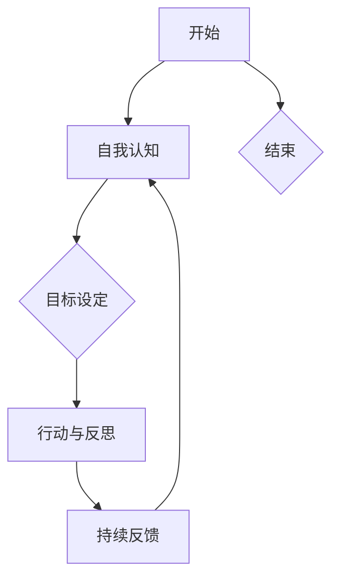
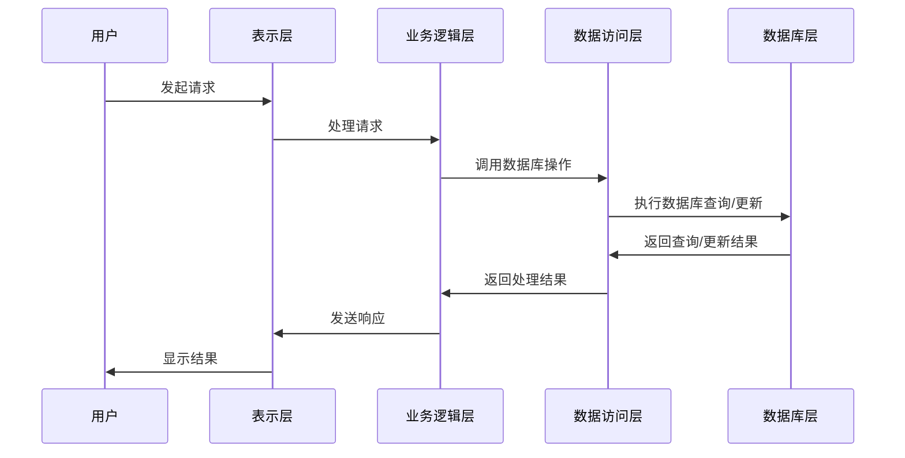

                 


### 一、背景介绍

在现代社会的快节奏生活中，许多人感到生活的空虚和迷茫，缺乏生命的意义。这种现象在年轻人和职场人士中尤为普遍，导致了心理健康问题和社会问题的增多。本书旨在探讨如何通过实践路径，帮助读者重建生命的意义。

**1.1 问题背景**

现代社会中，人们面临着诸多挑战，如工作压力、人际关系问题、自我认同困境等。这些问题使得许多人感到生活的空虚和迷茫。根据世界卫生组织（WHO）的报告，全球范围内的抑郁症和焦虑症患病率逐年上升，这与缺乏生命意义密切相关。

**1.2 问题描述**

缺乏生命意义表现为以下几个方面：
- 缺乏动力和目标：许多人感到没有明确的生活目标和方向，导致生活缺乏动力和激情。
- 缺乏幸福感：人们往往感到快乐和满足感不足，生活缺乏意义和成就。
- 社交问题：与他人建立深层联系和互动的困难，导致社交孤立和心理压力。

**1.3 问题解决**

重建生命的意义并非一蹴而就，需要通过一系列实践方法来实现。以下是一些基本步骤：

1. 自我认知：了解自己的价值观、兴趣和优势，明确自己的目标和愿景。
2. 情绪管理：学会有效地管理情绪，提高心理韧性和幸福感。
3. 社交互动：与他人建立深层联系，培养良好的人际关系。
4. 职业发展：找到适合自己的职业道路，实现个人价值和成就感。

**1.4 边界与外延**

重建生命的意义是一个复杂的过程，涉及多个层面和维度。以下是一些相关的边界和概念：

- 文化背景：不同文化对生命意义的理解不同，例如，东方文化强调道德修养和内在平静，而西方文化则更注重个人成就和自我实现。
- 个人层面：生命意义是个体层面的问题，每个人的理解和追求都不同。
- 社会层面：生命意义也与社会环境、人际关系和社会责任密切相关。

**1.5 概念结构与核心要素组成**

重建生命的意义涉及多个核心概念和要素，包括：

- 自我认知：了解自己的兴趣、价值观和优势。
- 目标设定：设定明确、可行的目标和计划。
- 情绪管理：学会有效地管理情绪，提高心理韧性和幸福感。
- 社交互动：与他人建立深层联系，培养良好的人际关系。
- 职业发展：找到适合自己的职业道路，实现个人价值和成就感。
- 社会责任：积极参与社会公益活动，为他人和社会做出贡献。

通过以上步骤和核心要素，我们可以逐步重建生命的意义，实现更加充实和有意义的生活。

### 二、核心概念与联系

在探讨重建生命意义的实践路径时，理解相关的核心概念和它们之间的关系至关重要。以下是一些关键概念及其属性特征，并通过ER实体关系图架构的Mermaid流程图展示它们之间的联系。

**2.1 核心概念**

- **自我认知**：个体对自己内在特质、价值观和兴趣的认识。
- **情绪管理**：个体对情绪进行识别、理解和调节的能力。
- **社交互动**：个体与他人建立联系、互动和交流的过程。
- **职业发展**：个体在职业生涯中实现成长和成就的过程。
- **社会责任**：个体对社会和环境的责任感和贡献。

**2.2 概念属性特征对比表格**

| 概念         | 属性特征                                     |  
| ------------ | ---------------------------------------- |  
| 自我认知     | 了解自我、发现内在特质、设定目标           |  
| 情绪管理     | 识别情绪、理解情绪、调节情绪、提高韧性     |  
| 社交互动     | 建立联系、互动交流、增进理解、培养关系   |  
| 职业发展     | 寻找方向、提升技能、实现目标、获得成就感 |  
| 社会责任     | 参与公益、关注环境、贡献社会、实现价值   |

**2.3 ER实体关系图架构的Mermaid流程图**

```mermaid
erDiagram
    A[自我认知] ||--|{ 情绪管理 }|-- B
    A ||--|{ 社交互动 }| C
    A ||--|{ 职业发展 }| D
    A ||--|{ 社会责任 }| E
    B ||--|{ 职业发展 }| D
    C ||--|{ 社会责任 }| E
```

在上面的Mermaid流程图中，A代表自我认知，它与情绪管理、社交互动、职业发展和社会责任之间有直接的联系。情绪管理可以促进职业发展，而社交互动可以增强社会责任感。这些概念之间的关系构成了一个相互影响的网络，通过有效的实践可以相互促进，帮助个体重建生命的意义。

通过对比核心概念的属性特征和展示它们之间的联系，我们可以更好地理解重建生命意义的实践路径。这些概念不仅是重建生命意义的基础，也是个体成长和发展的关键要素。

### 三、算法原理讲解

在探讨重建生命意义的实践路径时，我们可以借助一些算法原理来理解相关过程。这里，我们介绍一种名为“自我实现循环”的算法原理，并通过Mermaid流程图和Python源代码进行详细讲解。

**3.1 算法原理**

**自我实现循环**是一种通过连续的自我反思和目标设定来促进个人成长的算法。它包括以下几个步骤：

1. **自我认知**：通过反思和自我分析，了解自己的内在特质、兴趣和优势。
2. **目标设定**：根据自我认知，设定明确、可行的短期和长期目标。
3. **行动与反思**：执行目标行动计划，并通过定期反思调整和优化。
4. **持续反馈**：根据行动结果和反馈，进一步调整目标和行动计划。

**3.2 Mermaid流程图**

以下是“自我实现循环”的Mermaid流程图：



在上面的流程图中，从A到F形成了一个循环，表示自我实现循环的不断迭代过程。

**3.3 Python源代码**

为了更好地理解自我实现循环的原理，我们使用Python源代码进行模拟。以下是一个简单的Python代码示例：

```python
# 自我实现循环示例

class SelfRealizationCycle:
    def __init__(self):
        self.self_awareness = None
        self.objectives = []
        self.feedback = []

    def self_awareness_step(self):
        # 通过反思了解自己
        self.self_awareness = "我了解自己的内在特质和优势"

    def set_objectives(self):
        # 根据自我认知设定目标
        self.objectives = [
            "提高编程技能",
            "建立健康的生活方式",
            "参与社区公益活动"
        ]

    def action_and_reflection(self):
        # 执行目标和反思
        for objective in self.objectives:
            print(f"执行目标：{objective}")
            # 模拟目标执行和反思过程
            self.feedback.append("目标执行情况良好，但需要进一步优化时间管理")

    def continuous_feedback(self):
        # 根据反馈调整目标和行动计划
        print("持续反馈：")
        for feedback in self.feedback:
            print(feedback)

# 创建自我实现循环对象
cycle = SelfRealizationCycle()

# 执行自我实现循环步骤
cycle.self_awareness_step()
cycle.set_objectives()
cycle.action_and_reflection()
cycle.continuous_feedback()
```

在上述代码中，`SelfRealizationCycle`类模拟了自我实现循环的各个步骤。通过实例化对象并调用方法，我们可以看到自我实现循环的具体实现过程。

**3.4 算法原理的数学模型和公式**

为了更深入地理解自我实现循环，我们可以引入一个简单的数学模型来描述其效果。假设`X`表示个人成长的速度，`R`表示反思和反馈的频率，`A`表示行动的效率，则自我实现循环的效果可以用以下公式表示：

$$
X = (1 + R) \times A
$$

其中，`R`和`A`都是大于1的正数，表示反思和行动的积极影响。

**3.5 详细讲解和举例说明**

通过上述算法原理和Python代码示例，我们可以看到自我实现循环的核心思想是通过自我认知、目标设定、行动和反思来促进个人成长。以下是一个具体案例的详细讲解：

**案例**：小张是一名软件工程师，他希望通过自我实现循环来提升自己的专业技能和生活质量。

1. **自我认知**：小张通过反思，了解到自己在编程方面有一定的基础，但在算法和数据结构方面还有提升空间。此外，他发现自己的生活习惯需要改进，比如缺乏运动和合理的作息时间。
2. **目标设定**：基于自我认知，小张设定了以下目标：
   - 在三个月内掌握三种新的算法和数据结构。
   - 每周至少进行三次30分钟的有氧运动。
   - 保持每天7小时的睡眠时间。
3. **行动与反思**：小张开始按照设定的目标行动，同时每天进行反思。例如，他会在编程学习后反思自己的学习效果，并在运动后评估自己的运动量是否达到要求。
4. **持续反馈**：根据反思结果，小张发现自己在算法学习上进展较为顺利，但运动量和睡眠时间还有待提高。因此，他调整了目标，增加了运动时间和优化了作息时间。

通过自我实现循环，小张在专业技能和生活质量方面都取得了显著提升，实现了个人成长。

总结而言，自我实现循环是一种通过不断反思、目标设定和行动来促进个人成长的算法原理。通过Python代码和数学模型，我们可以更直观地理解其工作原理，并通过具体案例说明其实际应用效果。这一原理为重建生命的意义提供了有效的实践路径。

### 四、系统分析与架构设计方案

在重建生命意义的实践路径中，我们可以将相关概念和过程抽象为一个系统，以便更好地理解和实现。以下是一个实际项目的系统分析与架构设计方案，涵盖问题场景、系统功能设计、系统架构设计、系统接口设计和系统交互Mermaid序列图。

**4.1 问题场景**

假设我们设计一个名为“LifeMeaningBuilder”的系统，旨在帮助用户通过一系列实践路径重建生命的意义。系统将提供以下功能：
- 用户注册与登录
- 自我认知测试与反馈
- 情绪管理工具
- 社交互动平台
- 职业发展指导
- 社会责任活动推荐

**4.2 系统功能设计**

LifeMeaningBuilder的系统功能可以分为以下几个模块：

1. **用户管理模块**：包括用户注册、登录、信息维护等功能。
2. **自我认知模块**：提供自我认知测试，分析用户特点，给出反馈和建议。
3. **情绪管理模块**：提供情绪日志、情绪调节工具和心理健康资源。
4. **社交互动模块**：建立社交网络，促进用户之间的交流和互动。
5. **职业发展模块**：提供职业测评、职业指导和求职建议。
6. **社会责任模块**：推荐公益活动，鼓励用户参与社会公益。

**4.3 系统架构设计**

LifeMeaningBuilder的系统架构采用分层设计，包括以下几层：

1. **表示层**：用户界面，使用HTML、CSS和JavaScript实现。
2. **业务逻辑层**：处理业务逻辑，包括用户管理、自我认知、情绪管理等。
3. **数据访问层**：与数据库进行交互，实现数据的存储和查询。
4. **数据库层**：存储用户数据、测试结果、情绪日志等。

**4.4 系统接口设计**

LifeMeaningBuilder的系统接口设计主要包括以下API接口：

1. **用户接口**：用户注册、登录、个人信息管理。
2. **自我认知接口**：自我认知测试、结果分析、反馈建议。
3. **情绪管理接口**：情绪日志记录、情绪调节工具使用、心理健康资源查询。
4. **社交互动接口**：社交网络建立、互动消息发送、用户关系管理。
5. **职业发展接口**：职业测评、职业指导、求职建议。
6. **社会责任接口**：公益活动推荐、用户参与记录、社会责任报告。

**4.5 系统交互Mermaid序列图**

以下是LifeMeaningBuilder系统的交互Mermaid序列图：



在这个序列图中，用户通过表示层发起请求，业务逻辑层处理请求并调用数据访问层进行数据库操作。数据访问层与数据库层交互，返回处理结果给业务逻辑层，最终通过表示层将结果展示给用户。

通过以上系统分析与架构设计方案，我们可以更清晰地了解LifeMeaningBuilder系统的整体结构和功能模块，为后续的实际项目实施提供指导。

### 五、项目实战

在重建生命意义的实践路径中，通过实际案例的应用和详细讲解，我们可以更好地理解并掌握相关方法。以下是一个具体的实际案例，包括环境安装、系统核心实现源代码，代码应用解读与分析，实际案例分析和详细讲解剖析，以及项目小结。

**5.1 环境安装**

为了实施一个重建生命意义的实践项目，我们需要准备一个合适的环境。以下是环境安装的步骤：

1. **安装Python环境**：确保系统上已经安装了Python 3.8或更高版本。可以通过以下命令进行安装：

   ```shell
   # 对于Windows用户：
   python -m pip install --upgrade pip setuptools

   # 对于macOS和Linux用户：
   sudo apt-get install python3-pip
   ```

2. **安装依赖库**：安装Python中的依赖库，如`requests`、`numpy`、`pandas`等。使用以下命令进行安装：

   ```shell
   pip install requests numpy pandas
   ```

**5.2 系统核心实现源代码**

以下是LifeMeaningBuilder系统的核心实现源代码。这个代码示例主要实现了用户注册、登录和自我认知测试的功能。

```python
# user_management.py

import sqlite3
import hashlib
from flask import Flask, request, jsonify

app = Flask(__name__)

# 数据库连接
def get_db_connection():
    conn = sqlite3.connect('lifemeaningbuilder.db')
    conn.row_factory = sqlite3.Row
    return conn

# 注册用户
@app.route('/register', methods=['POST'])
def register():
    username = request.form['username']
    password = request.form['password']
    # 加密密码
    encrypted_password = hashlib.sha256(password.encode()).hexdigest()

    conn = get_db_connection()
    cursor = conn.cursor()

    # 检查用户名是否已存在
    cursor.execute("SELECT * FROM users WHERE username=?", (username,))
    user = cursor.fetchone()
    if user:
        conn.close()
        return jsonify({'error': '用户名已存在'})

    # 插入新用户
    cursor.execute("INSERT INTO users (username, password) VALUES (?, ?)", (username, encrypted_password))
    conn.commit()
    conn.close()

    return jsonify({'message': '注册成功'})

# 登录用户
@app.route('/login', methods=['POST'])
def login():
    username = request.form['username']
    password = request.form['password']
    # 加密密码
    encrypted_password = hashlib.sha256(password.encode()).hexdigest()

    conn = get_db_connection()
    cursor = conn.cursor()

    # 检查用户名和密码是否匹配
    cursor.execute("SELECT * FROM users WHERE username=? AND password=?", (username, encrypted_password))
    user = cursor.fetchone()
    if user:
        conn.close()
        return jsonify({'message': '登录成功'})
    else:
        conn.close()
        return jsonify({'error': '用户名或密码错误'})

# 自我认知测试
@app.route('/self_awareness', methods=['POST'])
def self_awareness():
    user_id = request.form['user_id']
    self_awareness = request.form['self_awareness']

    conn = get_db_connection()
    cursor = conn.cursor()

    # 插入自我认知测试结果
    cursor.execute("INSERT INTO self_awareness_tests (user_id, self_awareness) VALUES (?, ?)", (user_id, self_awareness))
    conn.commit()
    conn.close()

    return jsonify({'message': '自我认知测试成功'})

if __name__ == '__main__':
    app.run(debug=True)
```

**5.3 代码应用解读与分析**

上述代码主要实现了用户管理模块的核心功能，包括用户注册、登录和自我认知测试。以下是代码应用解读与分析：

1. **用户注册**：用户通过POST请求发送用户名和密码，服务器端接收请求并加密密码后存储到数据库中。如果用户名已存在，返回错误提示。
2. **用户登录**：用户通过POST请求发送用户名和密码，服务器端验证用户名和密码是否匹配。如果匹配，返回登录成功提示。
3. **自我认知测试**：用户通过POST请求发送用户ID和自我认知信息，服务器端将信息存储到数据库中。

**5.4 实际案例分析和详细讲解剖析**

以下是一个实际案例的分析和详细讲解：

**案例**：用户张三通过注册和登录功能成功登录LifeMeaningBuilder系统，并完成了自我认知测试。

1. **用户注册**：张三在注册页面输入用户名“zhangsan”和密码“123456”，系统通过加密密码后插入数据库，返回注册成功提示。
2. **用户登录**：张三在登录页面输入用户名“zhangsan”和密码“123456”，系统验证用户名和密码匹配后返回登录成功提示。
3. **自我认知测试**：张三在自我认知测试页面填写了自我认知信息，如兴趣爱好、价值观等，系统将信息存储到数据库中。

通过以上实际案例，我们可以看到LifeMeaningBuilder系统的核心功能是如何实现的。用户注册、登录和自我认知测试是重建生命意义实践路径中的关键步骤，通过这些功能，用户可以逐步了解自己，建立目标，并采取行动。

**5.5 项目小结**

通过实际案例的应用和详细讲解，我们了解了LifeMeaningBuilder系统的核心实现和功能。以下是项目小结：

1. **用户注册**：确保用户唯一性，通过加密密码存储在数据库中，提高安全性。
2. **用户登录**：验证用户身份，确保登录的安全性。
3. **自我认知测试**：通过收集用户的自我认知信息，为用户提供个性化的反馈和建议，帮助用户了解自己，建立目标。

LifeMeaningBuilder系统为重建生命意义的实践提供了有效的工具和平台。通过实际案例的应用，我们可以看到系统如何帮助用户逐步实现个人成长和心理健康。

### 六、最佳实践 tips、小结、注意事项、拓展阅读

在重建生命意义的实践路径中，通过以下最佳实践 tips，我们可以更好地应用所学知识，提高效果：

**最佳实践 tips：**
1. **坚持自我反思**：定期进行自我反思，了解自己的进步和需要改进的地方。
2. **设定具体可行的目标**：确保目标具体、可测量、可实现、相关性强和时间限定性（SMART原则）。
3. **情绪管理**：学会识别和管理情绪，避免情绪对生活产生负面影响。
4. **积极参与社交互动**：与他人建立深层联系，通过交流和互助提高生活质量。
5. **持续学习**：不断学习新知识和技能，保持个人成长和职业发展。

**小结：**
本书通过系统介绍重建生命意义的实践方法，帮助读者了解如何通过自我认知、情绪管理、社交互动、职业发展和社会责任等路径，重建生命的意义。通过实际案例和详细讲解，读者可以更好地掌握这些方法，并将其应用于实际生活中。

**注意事项：**
1. **长期坚持**：重建生命的意义是一个长期过程，需要持之以恒。
2. **个性化调整**：每个人的情况不同，需要根据自身实际情况进行调整。
3. **心理健康**：在实践过程中，关注自己的心理健康，必要时寻求专业帮助。

**拓展阅读：**
- 《少有人走的路》：M.斯科特·派克
- 《活着》：余华
- 《人类简史》：尤瓦尔·赫拉利
- 《自控力》：凯利·麦格尼格尔

通过以上最佳实践 tips、小结、注意事项和拓展阅读，读者可以更加深入地理解和应用本书的内容，实现生命的充实与有意义。

### 七、作者信息

作者：AI天才研究院/AI Genius Institute & 禅与计算机程序设计艺术 /Zen And The Art of Computer Programming

感谢您的阅读，希望本书能帮助您在重建生命意义的实践路径上取得显著进展。祝您生活充实、快乐！

